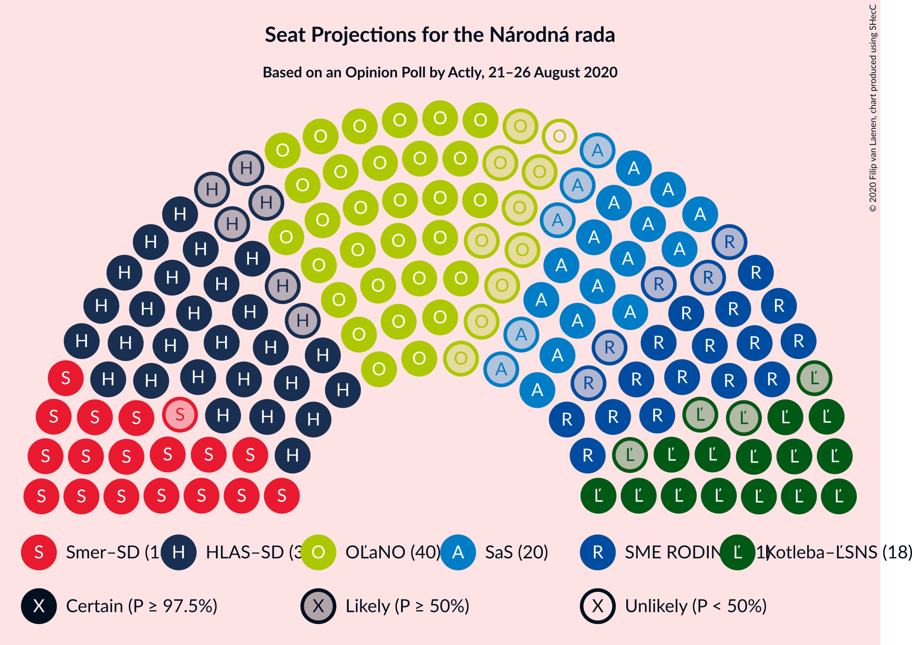
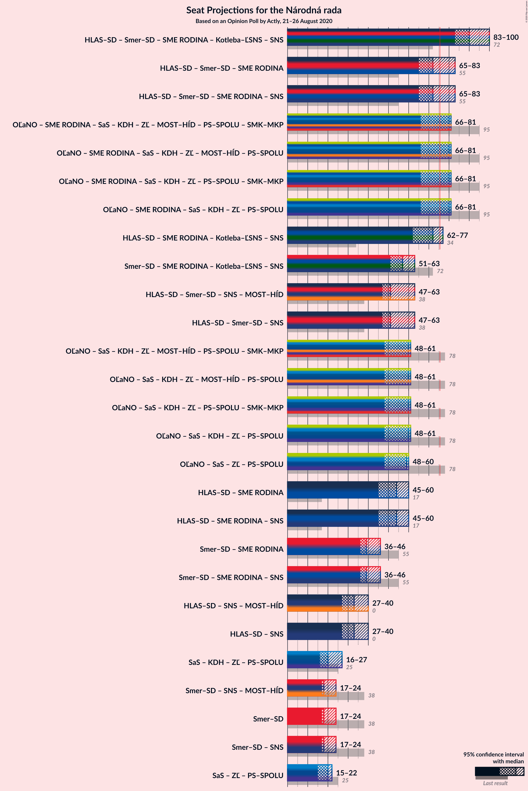
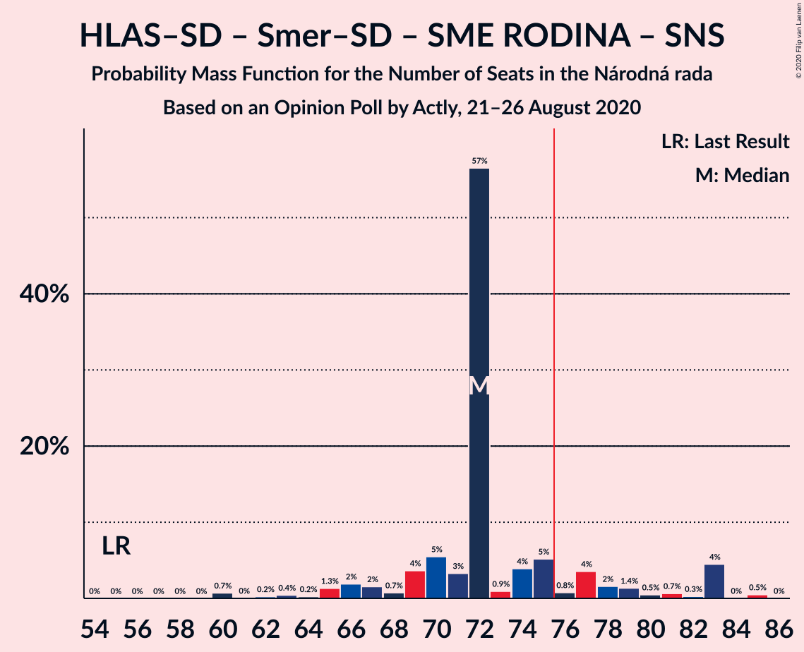
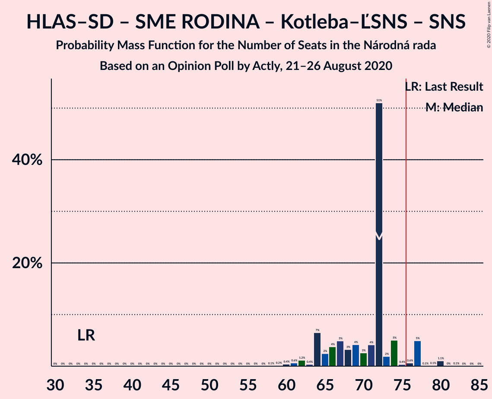
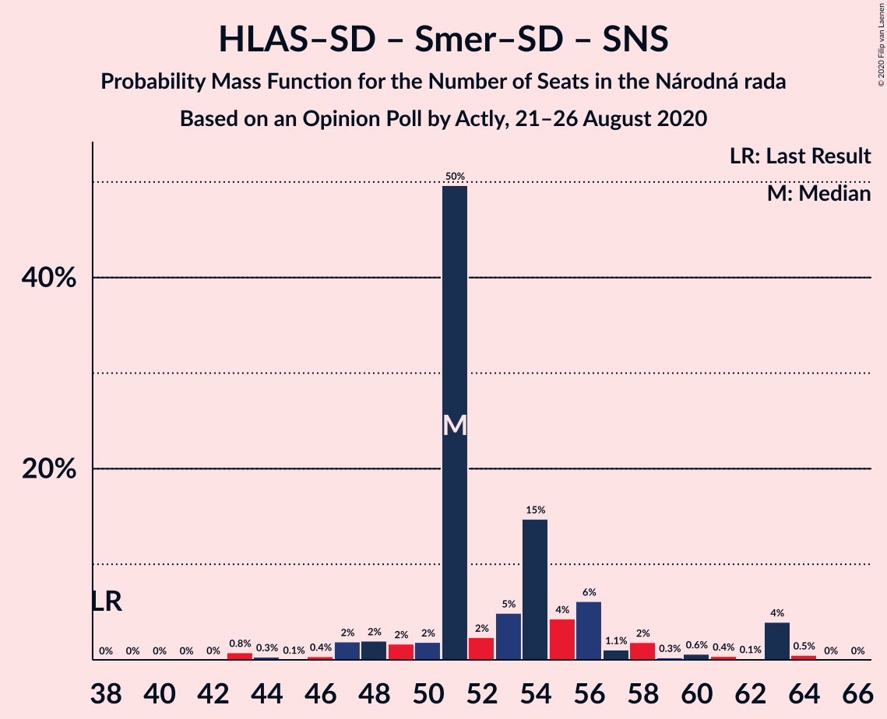
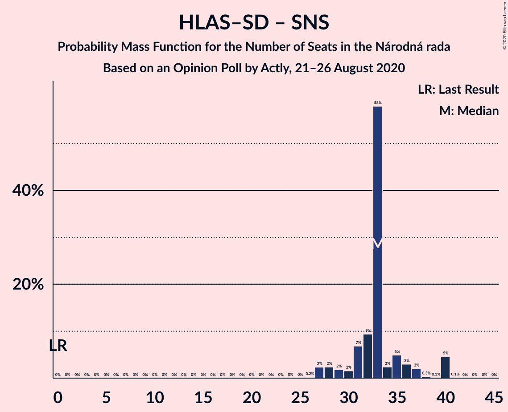

# Opinion Poll by Actly, 21–26 August 2020

<a href="#voting-intentions">Voting Intentions</a> | <a href="#seats">Seats</a> | <a href="#coalitions">Coalitions</a> | <a href="#technical-information">Technical Information</a>

## Voting Intentions

### Confidence Intervals

| Party | Last Result | Poll Result | 80% Confidence Interval | 90% Confidence Interval | 95% Confidence Interval | 99% Confidence Interval |
|:-----:|:-----------:|:-----------:|:-----------------------:|:-----------------------:|:-----------------------:|:-----------------------:|
| OBYČAJNÍ ĽUDIA a nezávislé osobnosti | 25.0% | 18.1% | 16.6–19.7% |16.2–20.2% |15.8–20.6% |15.2–21.4% |
| HLAS–sociálna demokracia | 0.0% | 17.0% | 15.5–18.6% |15.2–19.1% |14.8–19.5% |14.1–20.3% |
| SMER–sociálna demokracia | 18.3% | 10.9% | 9.7–12.3% |9.4–12.7% |9.1–13.0% |8.6–13.7% |
| SME RODINA | 8.2% | 10.1% | 9.0–11.4% |8.6–11.8% |8.4–12.1% |7.9–12.8% |
| Sloboda a Solidarita | 6.2% | 9.4% | 8.3–10.7% |8.0–11.1% |7.7–11.4% |7.2–12.0% |
| Kotleba–Ľudová strana Naše Slovensko | 8.0% | 8.9% | 7.8–10.2% |7.5–10.5% |7.3–10.8% |6.8–11.5% |
| Progresívne Slovensko | 7.0% | 5.1% | 4.3–6.1% |4.1–6.4% |3.9–6.6% |3.6–7.2% |
| Kresťanskodemokratické hnutie | 4.6% | 4.1% | 3.4–5.0% |3.2–5.3% |3.0–5.5% |2.7–6.0% |
| Za ľudí | 5.8% | 3.7% | 3.0–4.6% |2.9–4.8% |2.7–5.1% |2.4–5.5% |
| Slovenská národná strana | 3.2% | 3.1% | 2.5–3.9% |2.3–4.2% |2.2–4.4% |1.9–4.8% |
| VLASŤ | 2.9% | 2.7% | 2.1–3.5% |2.0–3.7% |1.9–3.9% |1.6–4.3% |
| Dobrá voľba | 3.1% | 2.5% | 2.0–3.3% |1.8–3.5% |1.7–3.7% |1.5–4.1% |

*Note:* The poll result column reflects the actual value used in the calculations. Published results may vary slightly, and in addition be rounded to fewer digits.

## Seats

### Confidence Intervals

| Party | Last Result | Median | 80% Confidence Interval | 90% Confidence Interval | 95% Confidence Interval | 99% Confidence Interval |
|:-----:|:-----------:|:------:|:-----------------------:|:-----------------------:|:-----------------------:|:-----------------------:|
| <a href="#obyčajní-ľudia-a-nezávislé-osobnosti">OBYČAJNÍ ĽUDIA a nezávislé osobnosti</a> | 53 | 35 | 31–39 |30–41 |29–41 |27–45 |
| <a href="#hlas–sociálna-demokracia">HLAS–sociálna demokracia</a> | 0 | 34 | 29–37 |29–38 |28–40 |26–40 |
| <a href="#smer–sociálna-demokracia">SMER–sociálna demokracia</a> | 38 | 19 | 18–23 |17–24 |16–24 |15–26 |
| <a href="#sme-rodina">SME RODINA</a> | 17 | 21 | 16–24 |15–24 |15–24 |14–26 |
| <a href="#sloboda-a-solidarita">Sloboda a Solidarita</a> | 13 | 19 | 15–20 |14–21 |14–22 |12–23 |
| <a href="#kotleba–ľudová-strana-naše-slovensko">Kotleba–Ľudová strana Naše Slovensko</a> | 17 | 15 | 13–20 |13–21 |13–21 |12–22 |
| <a href="#progresívne-slovensko">Progresívne Slovensko</a> | 0 | 10 | 0–12 |0–12 |0–13 |0–13 |
| <a href="#kresťanskodemokratické-hnutie">Kresťanskodemokratické hnutie</a> | 0 | 0 | 0–10 |0–10 |0–10 |0–12 |
| <a href="#za-ľudí">Za ľudí</a> | 12 | 0 | 0 |0 |0–10 |0–11 |
| <a href="#slovenská-národná-strana">Slovenská národná strana</a> | 0 | 0 | 0 |0 |0 |0 |
| <a href="#vlasť">VLASŤ</a> | 0 | 0 | 0 |0 |0 |0 |
| <a href="#dobrá-voľba">Dobrá voľba</a> | 0 | 0 | 0 |0 |0 |0 |

### OBYČAJNÍ ĽUDIA a nezávislé osobnosti

*For a full overview of the results for this party, see the [OBYČAJNÍ ĽUDIA a nezávislé osobnosti](party-obyčajníľudiaanezávisléosobnosti.html) page.*

| Number of Seats | Probability | Accumulated | Special Marks |
|:---------------:|:-----------:|:-----------:|:-------------:|
| 25 | 0.1% | 100% |  |
| 26 | 0% | 99.9% |  |
| 27 | 0.4% | 99.9% |  |
| 28 | 1.3% | 99.5% |  |
| 29 | 1.0% | 98% |  |
| 30 | 4% | 97% |  |
| 31 | 27% | 93% |  |
| 32 | 2% | 67% |  |
| 33 | 5% | 64% |  |
| 34 | 3% | 59% |  |
| 35 | 18% | 56% | Median |
| 36 | 16% | 38% |  |
| 37 | 9% | 22% |  |
| 38 | 0.6% | 13% |  |
| 39 | 3% | 12% |  |
| 40 | 2% | 9% |  |
| 41 | 7% | 8% |  |
| 42 | 0% | 0.6% |  |
| 43 | 0.1% | 0.6% |  |
| 44 | 0% | 0.6% |  |
| 45 | 0.5% | 0.5% |  |
| 46 | 0% | 0% |  |
| 47 | 0% | 0% |  |
| 48 | 0% | 0% |  |
| 49 | 0% | 0% |  |
| 50 | 0% | 0% |  |
| 51 | 0% | 0% |  |
| 52 | 0% | 0% |  |
| 53 | 0% | 0% | Last Result |

### HLAS–sociálna demokracia

*For a full overview of the results for this party, see the [HLAS–sociálna demokracia](party-hlas–sociálnademokracia.html) page.*

| Number of Seats | Probability | Accumulated | Special Marks |
|:---------------:|:-----------:|:-----------:|:-------------:|
| 0 | 0% | 100% | Last Result |
| 1 | 0% | 100% |  |
| 2 | 0% | 100% |  |
| 3 | 0% | 100% |  |
| 4 | 0% | 100% |  |
| 5 | 0% | 100% |  |
| 6 | 0% | 100% |  |
| 7 | 0% | 100% |  |
| 8 | 0% | 100% |  |
| 9 | 0% | 100% |  |
| 10 | 0% | 100% |  |
| 11 | 0% | 100% |  |
| 12 | 0% | 100% |  |
| 13 | 0% | 100% |  |
| 14 | 0% | 100% |  |
| 15 | 0% | 100% |  |
| 16 | 0% | 100% |  |
| 17 | 0% | 100% |  |
| 18 | 0% | 100% |  |
| 19 | 0% | 100% |  |
| 20 | 0% | 100% |  |
| 21 | 0% | 100% |  |
| 22 | 0% | 100% |  |
| 23 | 0% | 100% |  |
| 24 | 0.2% | 100% |  |
| 25 | 0.2% | 99.8% |  |
| 26 | 0.6% | 99.6% |  |
| 27 | 0.5% | 99.0% |  |
| 28 | 2% | 98% |  |
| 29 | 17% | 97% |  |
| 30 | 5% | 80% |  |
| 31 | 4% | 75% |  |
| 32 | 3% | 71% |  |
| 33 | 4% | 67% |  |
| 34 | 34% | 63% | Median |
| 35 | 7% | 30% |  |
| 36 | 3% | 22% |  |
| 37 | 13% | 19% |  |
| 38 | 1.1% | 6% |  |
| 39 | 0.2% | 5% |  |
| 40 | 5% | 5% |  |
| 41 | 0% | 0% |  |

### SMER–sociálna demokracia

*For a full overview of the results for this party, see the [SMER–sociálna demokracia](party-smer–sociálnademokracia.html) page.*

| Number of Seats | Probability | Accumulated | Special Marks |
|:---------------:|:-----------:|:-----------:|:-------------:|
| 14 | 0.1% | 100% |  |
| 15 | 0.4% | 99.9% |  |
| 16 | 3% | 99.4% |  |
| 17 | 2% | 96% |  |
| 18 | 7% | 94% |  |
| 19 | 41% | 87% | Median |
| 20 | 12% | 46% |  |
| 21 | 13% | 34% |  |
| 22 | 3% | 21% |  |
| 23 | 11% | 18% |  |
| 24 | 4% | 7% |  |
| 25 | 1.2% | 2% |  |
| 26 | 1.0% | 1.1% |  |
| 27 | 0% | 0.1% |  |
| 28 | 0% | 0.1% |  |
| 29 | 0% | 0% |  |
| 30 | 0% | 0% |  |
| 31 | 0% | 0% |  |
| 32 | 0% | 0% |  |
| 33 | 0% | 0% |  |
| 34 | 0% | 0% |  |
| 35 | 0% | 0% |  |
| 36 | 0% | 0% |  |
| 37 | 0% | 0% |  |
| 38 | 0% | 0% | Last Result |

### SME RODINA

*For a full overview of the results for this party, see the [SME RODINA](party-smerodina.html) page.*

| Number of Seats | Probability | Accumulated | Special Marks |
|:---------------:|:-----------:|:-----------:|:-------------:|
| 14 | 0.7% | 100% |  |
| 15 | 4% | 99.2% |  |
| 16 | 10% | 95% |  |
| 17 | 4% | 84% | Last Result |
| 18 | 13% | 80% |  |
| 19 | 7% | 67% |  |
| 20 | 6% | 60% |  |
| 21 | 10% | 54% | Median |
| 22 | 5% | 43% |  |
| 23 | 0.5% | 38% |  |
| 24 | 37% | 38% |  |
| 25 | 0.6% | 1.1% |  |
| 26 | 0.5% | 0.5% |  |
| 27 | 0% | 0% |  |

### Sloboda a Solidarita

*For a full overview of the results for this party, see the [Sloboda a Solidarita](party-slobodaasolidarita.html) page.*

| Number of Seats | Probability | Accumulated | Special Marks |
|:---------------:|:-----------:|:-----------:|:-------------:|
| 12 | 2% | 100% |  |
| 13 | 0.2% | 98% | Last Result |
| 14 | 7% | 98% |  |
| 15 | 3% | 91% |  |
| 16 | 6% | 89% |  |
| 17 | 7% | 83% |  |
| 18 | 5% | 76% |  |
| 19 | 54% | 71% | Median |
| 20 | 11% | 17% |  |
| 21 | 3% | 6% |  |
| 22 | 2% | 3% |  |
| 23 | 1.0% | 1.1% |  |
| 24 | 0.1% | 0.1% |  |
| 25 | 0% | 0% |  |

### Kotleba–Ľudová strana Naše Slovensko

*For a full overview of the results for this party, see the [Kotleba–Ľudová strana Naše Slovensko](party-kotleba–ľudovástrananašeslovensko.html) page.*

| Number of Seats | Probability | Accumulated | Special Marks |
|:---------------:|:-----------:|:-----------:|:-------------:|
| 11 | 0.2% | 100% |  |
| 12 | 1.2% | 99.8% |  |
| 13 | 39% | 98.5% |  |
| 14 | 9% | 60% |  |
| 15 | 5% | 51% | Median |
| 16 | 17% | 46% |  |
| 17 | 9% | 28% | Last Result |
| 18 | 5% | 19% |  |
| 19 | 1.4% | 15% |  |
| 20 | 5% | 13% |  |
| 21 | 8% | 9% |  |
| 22 | 0.6% | 1.0% |  |
| 23 | 0.3% | 0.4% |  |
| 24 | 0.1% | 0.1% |  |
| 25 | 0% | 0% |  |

### Progresívne Slovensko

*For a full overview of the results for this party, see the [Progresívne Slovensko](party-progresívneslovensko.html) page.*

| Number of Seats | Probability | Accumulated | Special Marks |
|:---------------:|:-----------:|:-----------:|:-------------:|
| 0 | 45% | 100% | Last Result |
| 1 | 0% | 55% |  |
| 2 | 0% | 55% |  |
| 3 | 0% | 55% |  |
| 4 | 0% | 55% |  |
| 5 | 0% | 55% |  |
| 6 | 0% | 55% |  |
| 7 | 0% | 55% |  |
| 8 | 0% | 55% |  |
| 9 | 3% | 55% |  |
| 10 | 32% | 51% | Median |
| 11 | 5% | 19% |  |
| 12 | 11% | 14% |  |
| 13 | 2% | 3% |  |
| 14 | 0.4% | 0.4% |  |
| 15 | 0% | 0% |  |

### Kresťanskodemokratické hnutie

*For a full overview of the results for this party, see the [Kresťanskodemokratické hnutie](party-kresťanskodemokratickéhnutie.html) page.*

| Number of Seats | Probability | Accumulated | Special Marks |
|:---------------:|:-----------:|:-----------:|:-------------:|
| 0 | 84% | 100% | Last Result, Median |
| 1 | 0% | 16% |  |
| 2 | 0% | 16% |  |
| 3 | 0% | 16% |  |
| 4 | 0% | 16% |  |
| 5 | 0% | 16% |  |
| 6 | 0% | 16% |  |
| 7 | 0% | 16% |  |
| 8 | 0% | 16% |  |
| 9 | 2% | 16% |  |
| 10 | 12% | 14% |  |
| 11 | 0.8% | 2% |  |
| 12 | 1.3% | 2% |  |
| 13 | 0.3% | 0.3% |  |
| 14 | 0% | 0% |  |

### Za ľudí

*For a full overview of the results for this party, see the [Za ľudí](party-zaľudí.html) page.*

| Number of Seats | Probability | Accumulated | Special Marks |
|:---------------:|:-----------:|:-----------:|:-------------:|
| 0 | 96% | 100% | Median |
| 1 | 0% | 4% |  |
| 2 | 0% | 4% |  |
| 3 | 0% | 4% |  |
| 4 | 0% | 4% |  |
| 5 | 0% | 4% |  |
| 6 | 0% | 4% |  |
| 7 | 0% | 4% |  |
| 8 | 0% | 4% |  |
| 9 | 0.8% | 4% |  |
| 10 | 2% | 4% |  |
| 11 | 0.9% | 1.1% |  |
| 12 | 0% | 0.2% | Last Result |
| 13 | 0.2% | 0.2% |  |
| 14 | 0% | 0% |  |

### Slovenská národná strana

*For a full overview of the results for this party, see the [Slovenská národná strana](party-slovenskánárodnástrana.html) page.*

| Number of Seats | Probability | Accumulated | Special Marks |
|:---------------:|:-----------:|:-----------:|:-------------:|
| 0 | 99.9% | 100% | Last Result, Median |
| 1 | 0% | 0.1% |  |
| 2 | 0% | 0.1% |  |
| 3 | 0% | 0.1% |  |
| 4 | 0% | 0.1% |  |
| 5 | 0% | 0.1% |  |
| 6 | 0% | 0.1% |  |
| 7 | 0% | 0.1% |  |
| 8 | 0% | 0.1% |  |
| 9 | 0% | 0.1% |  |
| 10 | 0% | 0% |  |

### VLASŤ

*For a full overview of the results for this party, see the [VLASŤ](party-vlasť.html) page.*

| Number of Seats | Probability | Accumulated | Special Marks |
|:---------------:|:-----------:|:-----------:|:-------------:|
| 0 | 100% | 100% | Last Result, Median |

### Dobrá voľba

*For a full overview of the results for this party, see the [Dobrá voľba](party-dobrávoľba.html) page.*

| Number of Seats | Probability | Accumulated | Special Marks |
|:---------------:|:-----------:|:-----------:|:-------------:|
| 0 | 100% | 100% | Last Result, Median |

## Coalitions

### Confidence Intervals

| Coalition | Last Result | Median | Majority? | 80% Confidence Interval | 90% Confidence Interval | 95% Confidence Interval | 99% Confidence Interval |
|:---------:|:-----------:|:------:|:---------:|:-----------------------:|:-----------------------:|:-----------------------:|:-----------------------:|
| HLAS–sociálna demokracia – SMER–sociálna demokracia – SME RODINA – Kotleba–Ľudová strana Naše Slovensko – Slovenská národná strana | 72 | 90 | 100% | 83–96 | 82–99 | 81–100 | 78–100 |
| HLAS–sociálna demokracia – SMER–sociálna demokracia – SME RODINA | 55 | 76 | 50% | 66–80 | 63–80 | 63–81 | 63–86 |
| HLAS–sociálna demokracia – SMER–sociálna demokracia – SME RODINA – Slovenská národná strana | 55 | 76 | 51% | 66–80 | 63–80 | 63–81 | 63–86 |
| HLAS–sociálna demokracia – SME RODINA – Kotleba–Ľudová strana Naše Slovensko – Slovenská národná strana | 34 | 71 | 16% | 60–77 | 60–77 | 60–79 | 59–79 |
| SMER–sociálna demokracia – SME RODINA – Kotleba–Ľudová strana Naše Slovensko – Slovenská národná strana | 72 | 56 | 0% | 52–60 | 52–61 | 51–62 | 48–66 |
| HLAS–sociálna demokracia – SMER–sociálna demokracia – Slovenská národná strana | 38 | 53 | 0% | 47–56 | 47–61 | 46–61 | 45–65 |
| HLAS–sociálna demokracia – SME RODINA | 17 | 55 | 0% | 46–61 | 45–61 | 45–61 | 44–61 |
| HLAS–sociálna demokracia – SME RODINA – Slovenská národná strana | 17 | 55 | 0% | 46–61 | 45–61 | 45–61 | 44–61 |
| SMER–sociálna demokracia – SME RODINA | 55 | 41 | 0% | 35–43 | 34–44 | 34–46 | 33–47 |
| SMER–sociálna demokracia – SME RODINA – Slovenská národná strana | 55 | 41 | 0% | 35–43 | 34–44 | 34–46 | 33–47 |
| HLAS–sociálna demokracia – Slovenská národná strana | 0 | 34 | 0% | 29–37 | 29–38 | 28–40 | 26–40 |
| SMER–sociálna demokracia | 38 | 19 | 0% | 18–23 | 17–24 | 16–24 | 15–26 |
| SMER–sociálna demokracia – Slovenská národná strana | 38 | 19 | 0% | 18–23 | 17–24 | 16–24 | 15–26 |

### HLAS–sociálna demokracia – SMER–sociálna demokracia – SME RODINA – Kotleba–Ľudová strana Naše Slovensko – Slovenská národná strana

| Number of Seats | Probability | Accumulated | Special Marks |
|:---------------:|:-----------:|:-----------:|:-------------:|
| 72 | 0% | 100% | Last Result |
| 73 | 0% | 100% |  |
| 74 | 0% | 100% |  |
| 75 | 0% | 100% |  |
| 76 | 0% | 100% | Majority |
| 77 | 0.1% | 100% |  |
| 78 | 0.6% | 99.9% |  |
| 79 | 0.3% | 99.3% |  |
| 80 | 0.5% | 99.0% |  |
| 81 | 3% | 98% |  |
| 82 | 1.2% | 96% |  |
| 83 | 10% | 94% |  |
| 84 | 9% | 85% |  |
| 85 | 0.9% | 76% |  |
| 86 | 1.3% | 75% |  |
| 87 | 6% | 74% |  |
| 88 | 0.4% | 68% |  |
| 89 | 14% | 68% | Median |
| 90 | 26% | 53% |  |
| 91 | 0.7% | 27% |  |
| 92 | 2% | 27% |  |
| 93 | 3% | 24% |  |
| 94 | 2% | 21% |  |
| 95 | 0.5% | 20% |  |
| 96 | 11% | 19% |  |
| 97 | 3% | 8% |  |
| 98 | 0% | 5% |  |
| 99 | 0.5% | 5% |  |
| 100 | 5% | 5% |  |
| 101 | 0% | 0.1% |  |
| 102 | 0% | 0.1% |  |
| 103 | 0% | 0% |  |

### HLAS–sociálna demokracia – SMER–sociálna demokracia – SME RODINA

| Number of Seats | Probability | Accumulated | Special Marks |
|:---------------:|:-----------:|:-----------:|:-------------:|
| 55 | 0% | 100% | Last Result |
| 56 | 0% | 100% |  |
| 57 | 0% | 100% |  |
| 58 | 0% | 100% |  |
| 59 | 0% | 100% |  |
| 60 | 0% | 100% |  |
| 61 | 0.2% | 100% |  |
| 62 | 0% | 99.8% |  |
| 63 | 7% | 99.7% |  |
| 64 | 1.1% | 93% |  |
| 65 | 1.0% | 92% |  |
| 66 | 2% | 91% |  |
| 67 | 0.6% | 88% |  |
| 68 | 1.3% | 88% |  |
| 69 | 2% | 87% |  |
| 70 | 12% | 84% |  |
| 71 | 5% | 72% |  |
| 72 | 4% | 67% |  |
| 73 | 0.8% | 63% |  |
| 74 | 0.7% | 62% | Median |
| 75 | 11% | 61% |  |
| 76 | 3% | 50% | Majority |
| 77 | 28% | 48% |  |
| 78 | 0.7% | 19% |  |
| 79 | 0.7% | 19% |  |
| 80 | 15% | 18% |  |
| 81 | 2% | 3% |  |
| 82 | 0.2% | 0.7% |  |
| 83 | 0% | 0.6% |  |
| 84 | 0% | 0.6% |  |
| 85 | 0% | 0.5% |  |
| 86 | 0.5% | 0.5% |  |
| 87 | 0% | 0% |  |

### HLAS–sociálna demokracia – SMER–sociálna demokracia – SME RODINA – Slovenská národná strana

| Number of Seats | Probability | Accumulated | Special Marks |
|:---------------:|:-----------:|:-----------:|:-------------:|
| 55 | 0% | 100% | Last Result |
| 56 | 0% | 100% |  |
| 57 | 0% | 100% |  |
| 58 | 0% | 100% |  |
| 59 | 0% | 100% |  |
| 60 | 0% | 100% |  |
| 61 | 0.2% | 100% |  |
| 62 | 0% | 99.8% |  |
| 63 | 7% | 99.8% |  |
| 64 | 1.1% | 93% |  |
| 65 | 1.0% | 92% |  |
| 66 | 2% | 91% |  |
| 67 | 0.6% | 88% |  |
| 68 | 1.3% | 88% |  |
| 69 | 2% | 87% |  |
| 70 | 12% | 84% |  |
| 71 | 5% | 72% |  |
| 72 | 4% | 67% |  |
| 73 | 0.8% | 63% |  |
| 74 | 0.7% | 62% | Median |
| 75 | 11% | 61% |  |
| 76 | 3% | 51% | Majority |
| 77 | 28% | 48% |  |
| 78 | 0.7% | 19% |  |
| 79 | 0.7% | 19% |  |
| 80 | 15% | 18% |  |
| 81 | 2% | 3% |  |
| 82 | 0.2% | 0.8% |  |
| 83 | 0% | 0.6% |  |
| 84 | 0% | 0.6% |  |
| 85 | 0% | 0.5% |  |
| 86 | 0.5% | 0.5% |  |
| 87 | 0% | 0% |  |

### HLAS–sociálna demokracia – SME RODINA – Kotleba–Ľudová strana Naše Slovensko – Slovenská národná strana

| Number of Seats | Probability | Accumulated | Special Marks |
|:---------------:|:-----------:|:-----------:|:-------------:|
| 34 | 0% | 100% | Last Result |
| 35 | 0% | 100% |  |
| 36 | 0% | 100% |  |
| 37 | 0% | 100% |  |
| 38 | 0% | 100% |  |
| 39 | 0% | 100% |  |
| 40 | 0% | 100% |  |
| 41 | 0% | 100% |  |
| 42 | 0% | 100% |  |
| 43 | 0% | 100% |  |
| 44 | 0% | 100% |  |
| 45 | 0% | 100% |  |
| 46 | 0% | 100% |  |
| 47 | 0% | 100% |  |
| 48 | 0% | 100% |  |
| 49 | 0% | 100% |  |
| 50 | 0% | 100% |  |
| 51 | 0% | 100% |  |
| 52 | 0% | 100% |  |
| 53 | 0% | 100% |  |
| 54 | 0% | 100% |  |
| 55 | 0% | 100% |  |
| 56 | 0% | 100% |  |
| 57 | 0% | 100% |  |
| 58 | 0.2% | 100% |  |
| 59 | 0.6% | 99.8% |  |
| 60 | 9% | 99.2% |  |
| 61 | 2% | 90% |  |
| 62 | 2% | 88% |  |
| 63 | 2% | 86% |  |
| 64 | 0.8% | 84% |  |
| 65 | 3% | 83% |  |
| 66 | 11% | 80% |  |
| 67 | 0.6% | 69% |  |
| 68 | 4% | 68% |  |
| 69 | 10% | 64% |  |
| 70 | 3% | 54% | Median |
| 71 | 26% | 51% |  |
| 72 | 4% | 26% |  |
| 73 | 3% | 22% |  |
| 74 | 1.0% | 18% |  |
| 75 | 0.9% | 17% |  |
| 76 | 0.8% | 16% | Majority |
| 77 | 11% | 16% |  |
| 78 | 0.1% | 4% |  |
| 79 | 4% | 4% |  |
| 80 | 0.1% | 0.2% |  |
| 81 | 0% | 0% |  |

### SMER–sociálna demokracia – SME RODINA – Kotleba–Ľudová strana Naše Slovensko – Slovenská národná strana

| Number of Seats | Probability | Accumulated | Special Marks |
|:---------------:|:-----------:|:-----------:|:-------------:|
| 46 | 0% | 100% |  |
| 47 | 0.3% | 99.9% |  |
| 48 | 0.4% | 99.7% |  |
| 49 | 0.7% | 99.3% |  |
| 50 | 1.0% | 98.6% |  |
| 51 | 2% | 98% |  |
| 52 | 6% | 95% |  |
| 53 | 4% | 89% |  |
| 54 | 12% | 86% |  |
| 55 | 16% | 74% | Median |
| 56 | 30% | 57% |  |
| 57 | 0.7% | 28% |  |
| 58 | 0.8% | 27% |  |
| 59 | 13% | 26% |  |
| 60 | 6% | 14% |  |
| 61 | 2% | 7% |  |
| 62 | 3% | 5% |  |
| 63 | 0.5% | 2% |  |
| 64 | 0.4% | 1.2% |  |
| 65 | 0.1% | 0.8% |  |
| 66 | 0.2% | 0.6% |  |
| 67 | 0% | 0.5% |  |
| 68 | 0% | 0.4% |  |
| 69 | 0% | 0.4% |  |
| 70 | 0.4% | 0.4% |  |
| 71 | 0% | 0% |  |
| 72 | 0% | 0% | Last Result |

### HLAS–sociálna demokracia – SMER–sociálna demokracia – Slovenská národná strana

| Number of Seats | Probability | Accumulated | Special Marks |
|:---------------:|:-----------:|:-----------:|:-------------:|
| 38 | 0% | 100% | Last Result |
| 39 | 0% | 100% |  |
| 40 | 0% | 100% |  |
| 41 | 0% | 100% |  |
| 42 | 0.1% | 100% |  |
| 43 | 0% | 99.9% |  |
| 44 | 0.2% | 99.9% |  |
| 45 | 0.5% | 99.7% |  |
| 46 | 2% | 99.1% |  |
| 47 | 7% | 97% |  |
| 48 | 2% | 89% |  |
| 49 | 1.0% | 87% |  |
| 50 | 2% | 86% |  |
| 51 | 0.7% | 85% |  |
| 52 | 13% | 84% |  |
| 53 | 27% | 71% | Median |
| 54 | 11% | 44% |  |
| 55 | 4% | 33% |  |
| 56 | 20% | 29% |  |
| 57 | 2% | 9% |  |
| 58 | 0.6% | 8% |  |
| 59 | 2% | 7% |  |
| 60 | 0.1% | 5% |  |
| 61 | 4% | 5% |  |
| 62 | 0.4% | 1.0% |  |
| 63 | 0.1% | 0.6% |  |
| 64 | 0% | 0.5% |  |
| 65 | 0.5% | 0.5% |  |
| 66 | 0% | 0% |  |

### HLAS–sociálna demokracia – SME RODINA

| Number of Seats | Probability | Accumulated | Special Marks |
|:---------------:|:-----------:|:-----------:|:-------------:|
| 17 | 0% | 100% | Last Result |
| 18 | 0% | 100% |  |
| 19 | 0% | 100% |  |
| 20 | 0% | 100% |  |
| 21 | 0% | 100% |  |
| 22 | 0% | 100% |  |
| 23 | 0% | 100% |  |
| 24 | 0% | 100% |  |
| 25 | 0% | 100% |  |
| 26 | 0% | 100% |  |
| 27 | 0% | 100% |  |
| 28 | 0% | 100% |  |
| 29 | 0% | 100% |  |
| 30 | 0% | 100% |  |
| 31 | 0% | 100% |  |
| 32 | 0% | 100% |  |
| 33 | 0% | 100% |  |
| 34 | 0% | 100% |  |
| 35 | 0% | 100% |  |
| 36 | 0% | 100% |  |
| 37 | 0% | 100% |  |
| 38 | 0% | 100% |  |
| 39 | 0% | 100% |  |
| 40 | 0% | 100% |  |
| 41 | 0% | 100% |  |
| 42 | 0.2% | 100% |  |
| 43 | 0% | 99.8% |  |
| 44 | 1.1% | 99.8% |  |
| 45 | 8% | 98.6% |  |
| 46 | 2% | 91% |  |
| 47 | 10% | 89% |  |
| 48 | 4% | 79% |  |
| 49 | 1.2% | 75% |  |
| 50 | 5% | 74% |  |
| 51 | 5% | 69% |  |
| 52 | 3% | 65% |  |
| 53 | 0.9% | 62% |  |
| 54 | 3% | 61% |  |
| 55 | 10% | 58% | Median |
| 56 | 0.7% | 48% |  |
| 57 | 5% | 47% |  |
| 58 | 26% | 42% |  |
| 59 | 4% | 16% |  |
| 60 | 0.1% | 11% |  |
| 61 | 11% | 11% |  |
| 62 | 0.3% | 0.3% |  |
| 63 | 0% | 0% |  |

### HLAS–sociálna demokracia – SME RODINA – Slovenská národná strana

| Number of Seats | Probability | Accumulated | Special Marks |
|:---------------:|:-----------:|:-----------:|:-------------:|
| 17 | 0% | 100% | Last Result |
| 18 | 0% | 100% |  |
| 19 | 0% | 100% |  |
| 20 | 0% | 100% |  |
| 21 | 0% | 100% |  |
| 22 | 0% | 100% |  |
| 23 | 0% | 100% |  |
| 24 | 0% | 100% |  |
| 25 | 0% | 100% |  |
| 26 | 0% | 100% |  |
| 27 | 0% | 100% |  |
| 28 | 0% | 100% |  |
| 29 | 0% | 100% |  |
| 30 | 0% | 100% |  |
| 31 | 0% | 100% |  |
| 32 | 0% | 100% |  |
| 33 | 0% | 100% |  |
| 34 | 0% | 100% |  |
| 35 | 0% | 100% |  |
| 36 | 0% | 100% |  |
| 37 | 0% | 100% |  |
| 38 | 0% | 100% |  |
| 39 | 0% | 100% |  |
| 40 | 0% | 100% |  |
| 41 | 0% | 100% |  |
| 42 | 0.2% | 100% |  |
| 43 | 0% | 99.8% |  |
| 44 | 1.1% | 99.8% |  |
| 45 | 8% | 98.7% |  |
| 46 | 2% | 91% |  |
| 47 | 10% | 89% |  |
| 48 | 4% | 79% |  |
| 49 | 1.2% | 75% |  |
| 50 | 5% | 74% |  |
| 51 | 5% | 70% |  |
| 52 | 3% | 65% |  |
| 53 | 0.9% | 62% |  |
| 54 | 3% | 61% |  |
| 55 | 10% | 58% | Median |
| 56 | 0.7% | 48% |  |
| 57 | 5% | 47% |  |
| 58 | 26% | 42% |  |
| 59 | 4% | 16% |  |
| 60 | 0.1% | 12% |  |
| 61 | 11% | 11% |  |
| 62 | 0.3% | 0.3% |  |
| 63 | 0% | 0% |  |

### SMER–sociálna demokracia – SME RODINA

| Number of Seats | Probability | Accumulated | Special Marks |
|:---------------:|:-----------:|:-----------:|:-------------:|
| 29 | 0.1% | 100% |  |
| 30 | 0% | 99.9% |  |
| 31 | 0.1% | 99.9% |  |
| 32 | 0.1% | 99.8% |  |
| 33 | 1.0% | 99.8% |  |
| 34 | 8% | 98.8% |  |
| 35 | 1.3% | 91% |  |
| 36 | 5% | 89% |  |
| 37 | 3% | 85% |  |
| 38 | 4% | 81% |  |
| 39 | 5% | 77% |  |
| 40 | 6% | 72% | Median |
| 41 | 18% | 66% |  |
| 42 | 3% | 47% |  |
| 43 | 37% | 45% |  |
| 44 | 3% | 8% |  |
| 45 | 1.2% | 4% |  |
| 46 | 3% | 3% |  |
| 47 | 0.1% | 0.5% |  |
| 48 | 0% | 0.4% |  |
| 49 | 0.4% | 0.4% |  |
| 50 | 0% | 0% |  |
| 51 | 0% | 0% |  |
| 52 | 0% | 0% |  |
| 53 | 0% | 0% |  |
| 54 | 0% | 0% |  |
| 55 | 0% | 0% | Last Result |

### SMER–sociálna demokracia – SME RODINA – Slovenská národná strana

| Number of Seats | Probability | Accumulated | Special Marks |
|:---------------:|:-----------:|:-----------:|:-------------:|
| 29 | 0.1% | 100% |  |
| 30 | 0% | 99.9% |  |
| 31 | 0.1% | 99.9% |  |
| 32 | 0.1% | 99.8% |  |
| 33 | 1.0% | 99.8% |  |
| 34 | 8% | 98.8% |  |
| 35 | 1.3% | 91% |  |
| 36 | 5% | 89% |  |
| 37 | 3% | 85% |  |
| 38 | 4% | 81% |  |
| 39 | 5% | 77% |  |
| 40 | 6% | 72% | Median |
| 41 | 18% | 66% |  |
| 42 | 3% | 47% |  |
| 43 | 37% | 45% |  |
| 44 | 3% | 8% |  |
| 45 | 1.2% | 4% |  |
| 46 | 3% | 3% |  |
| 47 | 0.1% | 0.5% |  |
| 48 | 0% | 0.5% |  |
| 49 | 0.4% | 0.4% |  |
| 50 | 0% | 0.1% |  |
| 51 | 0% | 0% |  |
| 52 | 0% | 0% |  |
| 53 | 0% | 0% |  |
| 54 | 0% | 0% |  |
| 55 | 0% | 0% | Last Result |

### HLAS–sociálna demokracia – Slovenská národná strana

| Number of Seats | Probability | Accumulated | Special Marks |
|:---------------:|:-----------:|:-----------:|:-------------:|
| 0 | 0% | 100% | Last Result |
| 1 | 0% | 100% |  |
| 2 | 0% | 100% |  |
| 3 | 0% | 100% |  |
| 4 | 0% | 100% |  |
| 5 | 0% | 100% |  |
| 6 | 0% | 100% |  |
| 7 | 0% | 100% |  |
| 8 | 0% | 100% |  |
| 9 | 0% | 100% |  |
| 10 | 0% | 100% |  |
| 11 | 0% | 100% |  |
| 12 | 0% | 100% |  |
| 13 | 0% | 100% |  |
| 14 | 0% | 100% |  |
| 15 | 0% | 100% |  |
| 16 | 0% | 100% |  |
| 17 | 0% | 100% |  |
| 18 | 0% | 100% |  |
| 19 | 0% | 100% |  |
| 20 | 0% | 100% |  |
| 21 | 0% | 100% |  |
| 22 | 0% | 100% |  |
| 23 | 0% | 100% |  |
| 24 | 0.2% | 100% |  |
| 25 | 0.2% | 99.8% |  |
| 26 | 0.6% | 99.6% |  |
| 27 | 0.5% | 99.0% |  |
| 28 | 2% | 98% |  |
| 29 | 17% | 97% |  |
| 30 | 5% | 80% |  |
| 31 | 4% | 75% |  |
| 32 | 3% | 71% |  |
| 33 | 4% | 67% |  |
| 34 | 34% | 64% | Median |
| 35 | 7% | 30% |  |
| 36 | 3% | 22% |  |
| 37 | 13% | 19% |  |
| 38 | 1.2% | 6% |  |
| 39 | 0.2% | 5% |  |
| 40 | 5% | 5% |  |
| 41 | 0% | 0% |  |

### SMER–sociálna demokracia

| Number of Seats | Probability | Accumulated | Special Marks |
|:---------------:|:-----------:|:-----------:|:-------------:|
| 14 | 0.1% | 100% |  |
| 15 | 0.4% | 99.9% |  |
| 16 | 3% | 99.4% |  |
| 17 | 2% | 96% |  |
| 18 | 7% | 94% |  |
| 19 | 41% | 87% | Median |
| 20 | 12% | 46% |  |
| 21 | 13% | 34% |  |
| 22 | 3% | 21% |  |
| 23 | 11% | 18% |  |
| 24 | 4% | 7% |  |
| 25 | 1.2% | 2% |  |
| 26 | 1.0% | 1.1% |  |
| 27 | 0% | 0.1% |  |
| 28 | 0% | 0.1% |  |
| 29 | 0% | 0% |  |
| 30 | 0% | 0% |  |
| 31 | 0% | 0% |  |
| 32 | 0% | 0% |  |
| 33 | 0% | 0% |  |
| 34 | 0% | 0% |  |
| 35 | 0% | 0% |  |
| 36 | 0% | 0% |  |
| 37 | 0% | 0% |  |
| 38 | 0% | 0% | Last Result |

### SMER–sociálna demokracia – Slovenská národná strana

| Number of Seats | Probability | Accumulated | Special Marks |
|:---------------:|:-----------:|:-----------:|:-------------:|
| 14 | 0.1% | 100% |  |
| 15 | 0.4% | 99.9% |  |
| 16 | 3% | 99.4% |  |
| 17 | 2% | 96% |  |
| 18 | 7% | 94% |  |
| 19 | 41% | 87% | Median |
| 20 | 12% | 46% |  |
| 21 | 13% | 34% |  |
| 22 | 3% | 21% |  |
| 23 | 11% | 18% |  |
| 24 | 4% | 7% |  |
| 25 | 1.2% | 2% |  |
| 26 | 1.0% | 1.1% |  |
| 27 | 0.1% | 0.2% |  |
| 28 | 0% | 0.1% |  |
| 29 | 0% | 0.1% |  |
| 30 | 0% | 0.1% |  |
| 31 | 0% | 0% |  |
| 32 | 0% | 0% |  |
| 33 | 0% | 0% |  |
| 34 | 0% | 0% |  |
| 35 | 0% | 0% |  |
| 36 | 0% | 0% |  |
| 37 | 0% | 0% |  |
| 38 | 0% | 0% | Last Result |

## Technical Information

### Opinion Poll

+ **Polling firm:** Actly
+ **Commissioner(s):** —
+ **Fieldwork period:** 21–26 August 2020

### Calculations

+ **Sample size:** 1000
+ **Simulations done:** 131,072
+ **Error estimate:** 3.11%

