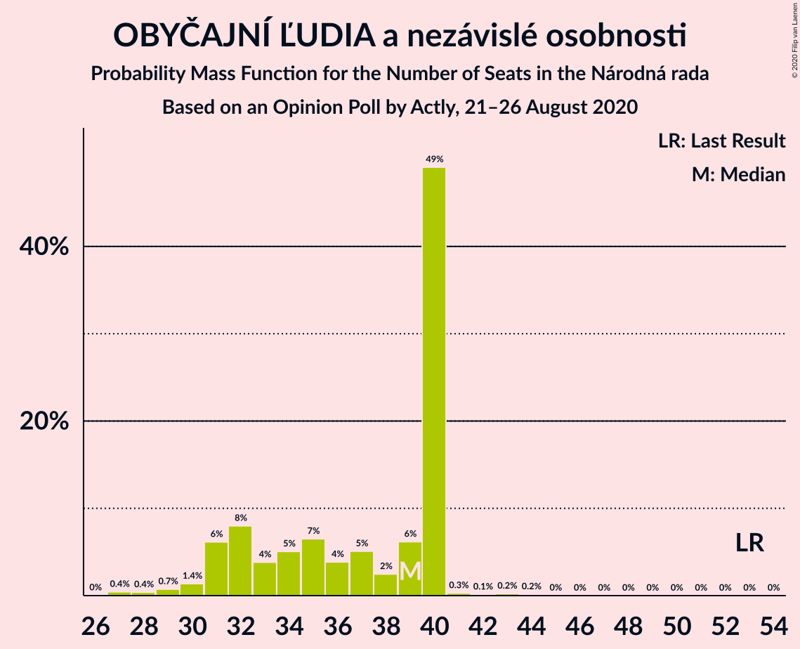
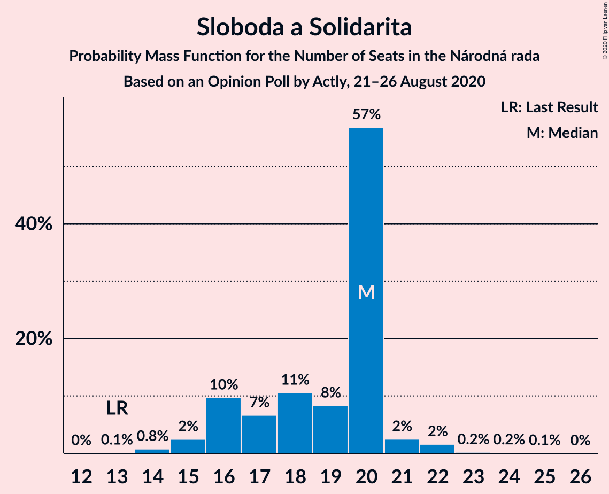
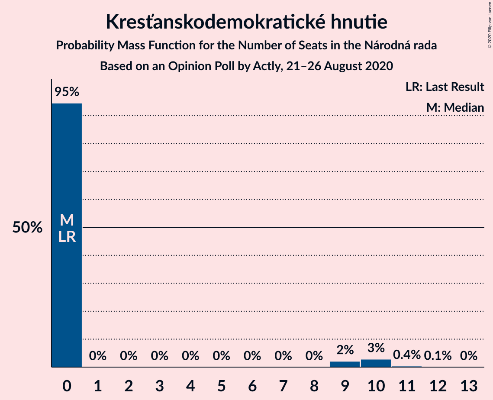
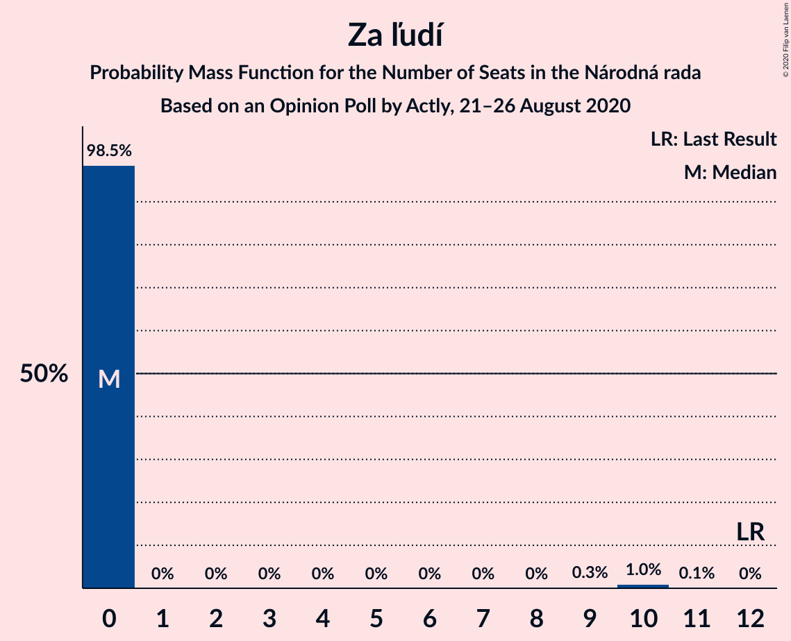
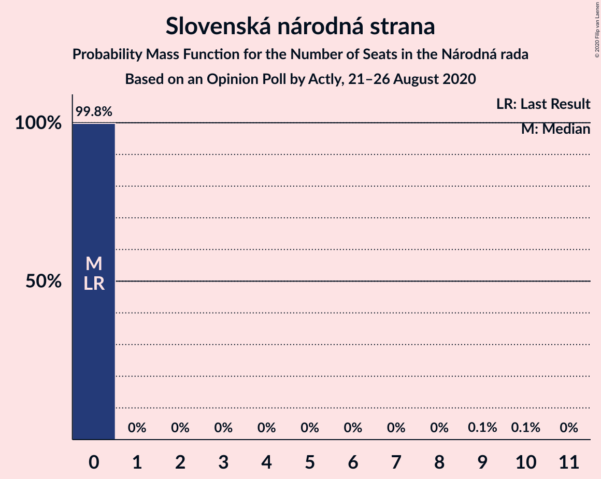
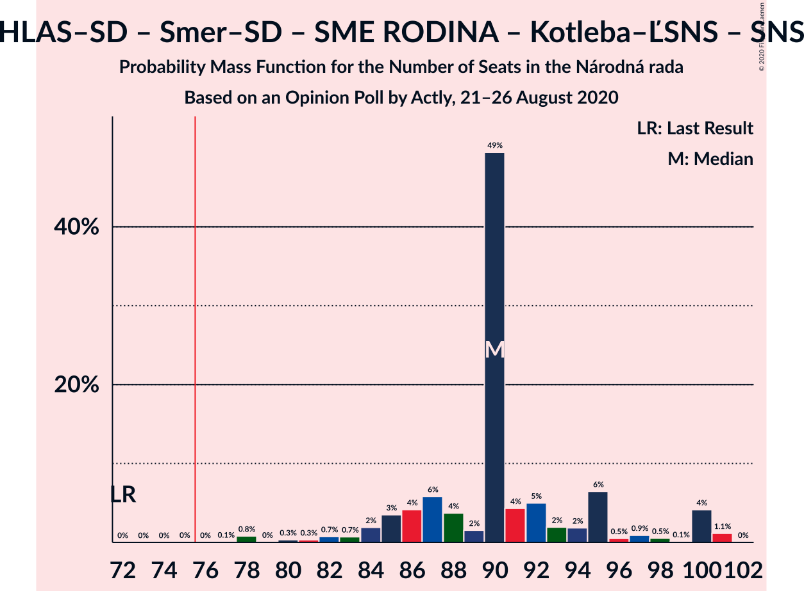
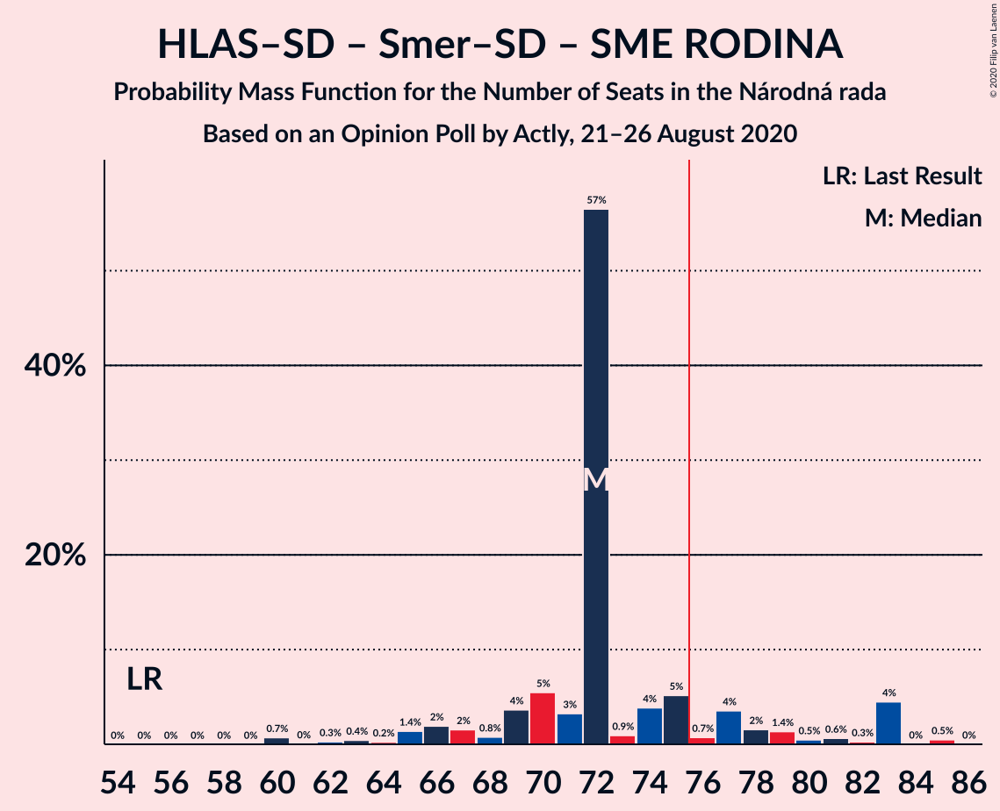
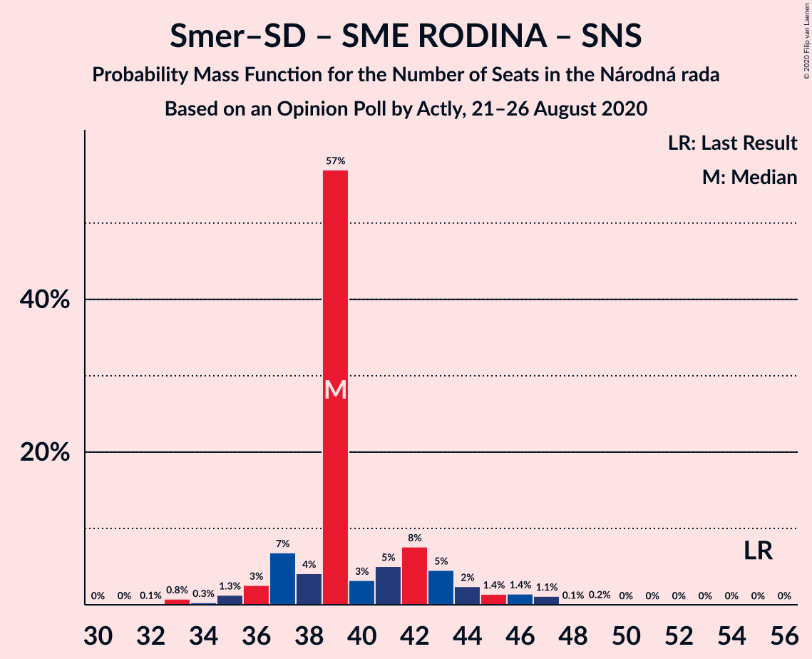

# Opinion Poll by Actly, 21–26 August 2020

<a href="#voting-intentions">Voting Intentions</a> | <a href="#seats">Seats</a> | <a href="#coalitions">Coalitions</a> | <a href="#technical-information">Technical Information</a>

## Voting Intentions

### Confidence Intervals

| Party | Last Result | Poll Result | 80% Confidence Interval | 90% Confidence Interval | 95% Confidence Interval | 99% Confidence Interval |
|:-----:|:-----------:|:-----------:|:-----------------------:|:-----------------------:|:-----------------------:|:-----------------------:|
| OBYČAJNÍ ĽUDIA a nezávislé osobnosti | 25.0% | 18.1% | 16.6–19.7% |16.2–20.2% |15.8–20.6% |15.2–21.4% |
| HLAS–sociálna demokracia | 0.0% | 17.0% | 15.5–18.6% |15.2–19.1% |14.8–19.5% |14.1–20.3% |
| SMER–sociálna demokracia | 18.3% | 10.9% | 9.7–12.3% |9.4–12.7% |9.1–13.0% |8.6–13.7% |
| SME RODINA | 8.2% | 10.1% | 9.0–11.4% |8.6–11.8% |8.4–12.1% |7.9–12.8% |
| Sloboda a Solidarita | 6.2% | 9.4% | 8.3–10.7% |8.0–11.1% |7.7–11.4% |7.2–12.0% |
| Kotleba–Ľudová strana Naše Slovensko | 8.0% | 8.9% | 7.8–10.2% |7.5–10.5% |7.3–10.8% |6.8–11.5% |
| Progresívne Slovensko | 7.0% | 5.1% | 4.3–6.1% |4.1–6.4% |3.9–6.6% |3.6–7.2% |
| Kresťanskodemokratické hnutie | 4.6% | 4.1% | 3.4–5.0% |3.2–5.3% |3.0–5.5% |2.7–6.0% |
| Za ľudí | 5.8% | 3.7% | 3.0–4.6% |2.9–4.8% |2.7–5.1% |2.4–5.5% |
| Slovenská národná strana | 3.2% | 3.1% | 2.5–3.9% |2.3–4.2% |2.2–4.4% |1.9–4.8% |
| VLASŤ | 2.9% | 2.7% | 2.1–3.5% |2.0–3.7% |1.9–3.9% |1.6–4.3% |
| Dobrá voľba | 3.1% | 2.5% | 2.0–3.3% |1.8–3.5% |1.7–3.7% |1.5–4.1% |

*Note:* The poll result column reflects the actual value used in the calculations. Published results may vary slightly, and in addition be rounded to fewer digits.

## Seats

### Confidence Intervals

| Party | Last Result | Median | 80% Confidence Interval | 90% Confidence Interval | 95% Confidence Interval | 99% Confidence Interval |
|:-----:|:-----------:|:------:|:-----------------------:|:-----------------------:|:-----------------------:|:-----------------------:|
| <a href="#obyčajní-ľudia-a-nezávislé-osobnosti">OBYČAJNÍ ĽUDIA a nezávislé osobnosti</a> | 53 | 39 | 32–40 |31–40 |30–40 |28–42 |
| <a href="#hlas–sociálna-demokracia">HLAS–sociálna demokracia</a> | 0 | 33 | 31–36 |28–38 |27–40 |27–40 |
| <a href="#smer–sociálna-demokracia">SMER–sociálna demokracia</a> | 38 | 18 | 18–23 |18–24 |17–24 |16–26 |
| <a href="#sme-rodina">SME RODINA</a> | 17 | 21 | 16–21 |16–22 |16–23 |15–25 |
| <a href="#sloboda-a-solidarita">Sloboda a Solidarita</a> | 13 | 20 | 16–20 |16–20 |15–21 |14–22 |
| <a href="#kotleba–ľudová-strana-naše-slovensko">Kotleba–Ľudová strana Naše Slovensko</a> | 17 | 18 | 16–20 |14–20 |14–20 |13–22 |
| <a href="#progresívne-slovensko">Progresívne Slovensko</a> | 0 | 0 | 0–11 |0–12 |0–12 |0–13 |
| <a href="#kresťanskodemokratické-hnutie">Kresťanskodemokratické hnutie</a> | 0 | 0 | 0 |0–9 |0–10 |0–11 |
| <a href="#za-ľudí">Za ľudí</a> | 12 | 0 | 0 |0 |0 |0–10 |
| <a href="#slovenská-národná-strana">Slovenská národná strana</a> | 0 | 0 | 0 |0 |0 |0 |
| <a href="#vlasť">VLASŤ</a> | 0 | 0 | 0 |0 |0 |0 |
| <a href="#dobrá-voľba">Dobrá voľba</a> | 0 | 0 | 0 |0 |0 |0 |

### OBYČAJNÍ ĽUDIA a nezávislé osobnosti

*For a full overview of the results for this party, see the [OBYČAJNÍ ĽUDIA a nezávislé osobnosti](party-obyčajníľudiaanezávisléosobnosti.html) page.*

| Number of Seats | Probability | Accumulated | Special Marks |
|:---------------:|:-----------:|:-----------:|:-------------:|
| 27 | 0.4% | 100% |  |
| 28 | 0.4% | 99.5% |  |
| 29 | 0.7% | 99.1% |  |
| 30 | 1.4% | 98% |  |
| 31 | 6% | 97% |  |
| 32 | 8% | 91% |  |
| 33 | 4% | 83% |  |
| 34 | 5% | 79% |  |
| 35 | 7% | 74% |  |
| 36 | 4% | 67% |  |
| 37 | 5% | 64% |  |
| 38 | 2% | 59% |  |
| 39 | 6% | 56% | Median |
| 40 | 49% | 50% |  |
| 41 | 0.3% | 0.8% |  |
| 42 | 0.1% | 0.5% |  |
| 43 | 0.2% | 0.4% |  |
| 44 | 0.2% | 0.2% |  |
| 45 | 0% | 0% |  |
| 46 | 0% | 0% |  |
| 47 | 0% | 0% |  |
| 48 | 0% | 0% |  |
| 49 | 0% | 0% |  |
| 50 | 0% | 0% |  |
| 51 | 0% | 0% |  |
| 52 | 0% | 0% |  |
| 53 | 0% | 0% | Last Result |

### HLAS–sociálna demokracia

*For a full overview of the results for this party, see the [HLAS–sociálna demokracia](party-hlas–sociálnademokracia.html) page.*

| Number of Seats | Probability | Accumulated | Special Marks |
|:---------------:|:-----------:|:-----------:|:-------------:|
| 0 | 0% | 100% | Last Result |
| 1 | 0% | 100% |  |
| 2 | 0% | 100% |  |
| 3 | 0% | 100% |  |
| 4 | 0% | 100% |  |
| 5 | 0% | 100% |  |
| 6 | 0% | 100% |  |
| 7 | 0% | 100% |  |
| 8 | 0% | 100% |  |
| 9 | 0% | 100% |  |
| 10 | 0% | 100% |  |
| 11 | 0% | 100% |  |
| 12 | 0% | 100% |  |
| 13 | 0% | 100% |  |
| 14 | 0% | 100% |  |
| 15 | 0% | 100% |  |
| 16 | 0% | 100% |  |
| 17 | 0% | 100% |  |
| 18 | 0% | 100% |  |
| 19 | 0% | 100% |  |
| 20 | 0% | 100% |  |
| 21 | 0% | 100% |  |
| 22 | 0% | 100% |  |
| 23 | 0% | 100% |  |
| 24 | 0% | 100% |  |
| 25 | 0% | 100% |  |
| 26 | 0.2% | 99.9% |  |
| 27 | 2% | 99.7% |  |
| 28 | 2% | 97% |  |
| 29 | 2% | 95% |  |
| 30 | 2% | 93% |  |
| 31 | 7% | 91% |  |
| 32 | 9% | 85% |  |
| 33 | 58% | 75% | Median |
| 34 | 2% | 17% |  |
| 35 | 5% | 15% |  |
| 36 | 3% | 10% |  |
| 37 | 2% | 7% |  |
| 38 | 0.3% | 5% |  |
| 39 | 0.1% | 5% |  |
| 40 | 5% | 5% |  |
| 41 | 0.1% | 0.1% |  |
| 42 | 0% | 0% |  |

### SMER–sociálna demokracia

*For a full overview of the results for this party, see the [SMER–sociálna demokracia](party-smer–sociálnademokracia.html) page.*

| Number of Seats | Probability | Accumulated | Special Marks |
|:---------------:|:-----------:|:-----------:|:-------------:|
| 15 | 0.1% | 100% |  |
| 16 | 1.1% | 99.9% |  |
| 17 | 2% | 98.7% |  |
| 18 | 51% | 97% | Median |
| 19 | 6% | 46% |  |
| 20 | 7% | 40% |  |
| 21 | 11% | 33% |  |
| 22 | 6% | 21% |  |
| 23 | 9% | 15% |  |
| 24 | 5% | 6% |  |
| 25 | 0.4% | 1.4% |  |
| 26 | 0.8% | 1.0% |  |
| 27 | 0.2% | 0.3% |  |
| 28 | 0.1% | 0.1% |  |
| 29 | 0% | 0% |  |
| 30 | 0% | 0% |  |
| 31 | 0% | 0% |  |
| 32 | 0% | 0% |  |
| 33 | 0% | 0% |  |
| 34 | 0% | 0% |  |
| 35 | 0% | 0% |  |
| 36 | 0% | 0% |  |
| 37 | 0% | 0% |  |
| 38 | 0% | 0% | Last Result |

### SME RODINA

*For a full overview of the results for this party, see the [SME RODINA](party-smerodina.html) page.*

| Number of Seats | Probability | Accumulated | Special Marks |
|:---------------:|:-----------:|:-----------:|:-------------:|
| 14 | 0.2% | 100% |  |
| 15 | 2% | 99.8% |  |
| 16 | 9% | 98% |  |
| 17 | 4% | 88% | Last Result |
| 18 | 9% | 84% |  |
| 19 | 3% | 75% |  |
| 20 | 8% | 72% |  |
| 21 | 55% | 64% | Median |
| 22 | 4% | 9% |  |
| 23 | 2% | 4% |  |
| 24 | 1.0% | 2% |  |
| 25 | 1.2% | 1.3% |  |
| 26 | 0.1% | 0.1% |  |
| 27 | 0% | 0% |  |

### Sloboda a Solidarita

*For a full overview of the results for this party, see the [Sloboda a Solidarita](party-slobodaasolidarita.html) page.*

| Number of Seats | Probability | Accumulated | Special Marks |
|:---------------:|:-----------:|:-----------:|:-------------:|
| 13 | 0.1% | 100% | Last Result |
| 14 | 0.8% | 99.8% |  |
| 15 | 2% | 99.0% |  |
| 16 | 10% | 97% |  |
| 17 | 7% | 87% |  |
| 18 | 11% | 80% |  |
| 19 | 8% | 70% |  |
| 20 | 57% | 61% | Median |
| 21 | 2% | 5% |  |
| 22 | 2% | 2% |  |
| 23 | 0.2% | 0.4% |  |
| 24 | 0.2% | 0.2% |  |
| 25 | 0.1% | 0.1% |  |
| 26 | 0% | 0% |  |

### Kotleba–Ľudová strana Naše Slovensko

*For a full overview of the results for this party, see the [Kotleba–Ľudová strana Naše Slovensko](party-kotleba–ľudovástrananašeslovensko.html) page.*

| Number of Seats | Probability | Accumulated | Special Marks |
|:---------------:|:-----------:|:-----------:|:-------------:|
| 11 | 0% | 100% |  |
| 12 | 0.2% | 99.9% |  |
| 13 | 1.2% | 99.7% |  |
| 14 | 4% | 98.5% |  |
| 15 | 4% | 95% |  |
| 16 | 7% | 91% |  |
| 17 | 14% | 84% | Last Result |
| 18 | 54% | 69% | Median |
| 19 | 3% | 16% |  |
| 20 | 10% | 12% |  |
| 21 | 1.0% | 2% |  |
| 22 | 0.7% | 1.1% |  |
| 23 | 0.4% | 0.4% |  |
| 24 | 0% | 0% |  |

### Progresívne Slovensko

*For a full overview of the results for this party, see the [Progresívne Slovensko](party-progresívneslovensko.html) page.*

| Number of Seats | Probability | Accumulated | Special Marks |
|:---------------:|:-----------:|:-----------:|:-------------:|
| 0 | 74% | 100% | Last Result, Median |
| 1 | 0% | 26% |  |
| 2 | 0% | 26% |  |
| 3 | 0% | 26% |  |
| 4 | 0% | 26% |  |
| 5 | 0% | 26% |  |
| 6 | 0% | 26% |  |
| 7 | 0% | 26% |  |
| 8 | 0% | 26% |  |
| 9 | 2% | 26% |  |
| 10 | 8% | 24% |  |
| 11 | 8% | 15% |  |
| 12 | 6% | 8% |  |
| 13 | 1.4% | 2% |  |
| 14 | 0.2% | 0.2% |  |
| 15 | 0% | 0% |  |

### Kresťanskodemokratické hnutie

*For a full overview of the results for this party, see the [Kresťanskodemokratické hnutie](party-kresťanskodemokratickéhnutie.html) page.*

| Number of Seats | Probability | Accumulated | Special Marks |
|:---------------:|:-----------:|:-----------:|:-------------:|
| 0 | 95% | 100% | Last Result, Median |
| 1 | 0% | 5% |  |
| 2 | 0% | 5% |  |
| 3 | 0% | 5% |  |
| 4 | 0% | 5% |  |
| 5 | 0% | 5% |  |
| 6 | 0% | 5% |  |
| 7 | 0% | 5% |  |
| 8 | 0% | 5% |  |
| 9 | 2% | 5% |  |
| 10 | 3% | 3% |  |
| 11 | 0.4% | 0.5% |  |
| 12 | 0.1% | 0.1% |  |
| 13 | 0% | 0% |  |

### Za ľudí

*For a full overview of the results for this party, see the [Za ľudí](party-zaľudí.html) page.*

| Number of Seats | Probability | Accumulated | Special Marks |
|:---------------:|:-----------:|:-----------:|:-------------:|
| 0 | 98.5% | 100% | Median |
| 1 | 0% | 1.5% |  |
| 2 | 0% | 1.5% |  |
| 3 | 0% | 1.5% |  |
| 4 | 0% | 1.5% |  |
| 5 | 0% | 1.5% |  |
| 6 | 0% | 1.5% |  |
| 7 | 0% | 1.5% |  |
| 8 | 0% | 1.5% |  |
| 9 | 0.3% | 1.5% |  |
| 10 | 1.0% | 1.2% |  |
| 11 | 0.1% | 0.2% |  |
| 12 | 0% | 0% | Last Result |

### Slovenská národná strana

*For a full overview of the results for this party, see the [Slovenská národná strana](party-slovenskánárodnástrana.html) page.*

| Number of Seats | Probability | Accumulated | Special Marks |
|:---------------:|:-----------:|:-----------:|:-------------:|
| 0 | 99.8% | 100% | Last Result, Median |
| 1 | 0% | 0.2% |  |
| 2 | 0% | 0.2% |  |
| 3 | 0% | 0.2% |  |
| 4 | 0% | 0.2% |  |
| 5 | 0% | 0.2% |  |
| 6 | 0% | 0.2% |  |
| 7 | 0% | 0.2% |  |
| 8 | 0% | 0.2% |  |
| 9 | 0.1% | 0.2% |  |
| 10 | 0.1% | 0.1% |  |
| 11 | 0% | 0% |  |

### VLASŤ

*For a full overview of the results for this party, see the [VLASŤ](party-vlasť.html) page.*

| Number of Seats | Probability | Accumulated | Special Marks |
|:---------------:|:-----------:|:-----------:|:-------------:|
| 0 | 100% | 100% | Last Result, Median |

### Dobrá voľba

*For a full overview of the results for this party, see the [Dobrá voľba](party-dobrávoľba.html) page.*

| Number of Seats | Probability | Accumulated | Special Marks |
|:---------------:|:-----------:|:-----------:|:-------------:|
| 0 | 100% | 100% | Last Result, Median |

## Coalitions

### Confidence Intervals

| Coalition | Last Result | Median | Majority? | 80% Confidence Interval | 90% Confidence Interval | 95% Confidence Interval | 99% Confidence Interval |
|:---------:|:-----------:|:------:|:---------:|:-----------------------:|:-----------------------:|:-----------------------:|:-----------------------:|
| HLAS–sociálna demokracia – SMER–sociálna demokracia – SME RODINA – Kotleba–Ľudová strana Naše Slovensko – Slovenská národná strana | 72 | 90 | 100% | 86–95 | 85–100 | 83–100 | 78–101 |
| HLAS–sociálna demokracia – SMER–sociálna demokracia – SME RODINA | 55 | 72 | 14% | 69–77 | 66–83 | 65–83 | 60–85 |
| HLAS–sociálna demokracia – SMER–sociálna demokracia – SME RODINA – Slovenská národná strana | 55 | 72 | 14% | 69–77 | 67–83 | 65–83 | 60–85 |
| HLAS–sociálna demokracia – SME RODINA – Kotleba–Ľudová strana Naše Slovensko – Slovenská národná strana | 34 | 72 | 7% | 65–74 | 64–77 | 62–77 | 60–80 |
| SMER–sociálna demokracia – SME RODINA – Kotleba–Ľudová strana Naše Slovensko – Slovenská národná strana | 72 | 57 | 0% | 54–61 | 53–62 | 51–63 | 51–64 |
| HLAS–sociálna demokracia – SMER–sociálna demokracia – Slovenská národná strana | 38 | 51 | 0% | 51–56 | 48–61 | 47–63 | 43–64 |
| HLAS–sociálna demokracia – SME RODINA | 17 | 54 | 0% | 47–56 | 47–60 | 45–60 | 44–62 |
| HLAS–sociálna demokracia – SME RODINA – Slovenská národná strana | 17 | 54 | 0% | 47–56 | 47–60 | 45–60 | 44–62 |
| SMER–sociálna demokracia – SME RODINA | 55 | 39 | 0% | 37–43 | 36–44 | 36–46 | 33–47 |
| SMER–sociálna demokracia – SME RODINA – Slovenská národná strana | 55 | 39 | 0% | 37–43 | 36–44 | 36–46 | 33–47 |
| HLAS–sociálna demokracia – Slovenská národná strana | 0 | 33 | 0% | 31–36 | 29–38 | 27–40 | 27–40 |
| SMER–sociálna demokracia | 38 | 18 | 0% | 18–23 | 18–24 | 17–24 | 16–26 |
| SMER–sociálna demokracia – Slovenská národná strana | 38 | 18 | 0% | 18–23 | 18–24 | 17–24 | 16–26 |

### HLAS–sociálna demokracia – SMER–sociálna demokracia – SME RODINA – Kotleba–Ľudová strana Naše Slovensko – Slovenská národná strana

| Number of Seats | Probability | Accumulated | Special Marks |
|:---------------:|:-----------:|:-----------:|:-------------:|
| 72 | 0% | 100% | Last Result |
| 73 | 0% | 100% |  |
| 74 | 0% | 100% |  |
| 75 | 0% | 100% |  |
| 76 | 0% | 100% | Majority |
| 77 | 0.1% | 100% |  |
| 78 | 0.8% | 99.9% |  |
| 79 | 0% | 99.1% |  |
| 80 | 0.3% | 99.1% |  |
| 81 | 0.3% | 98.7% |  |
| 82 | 0.7% | 98% |  |
| 83 | 0.7% | 98% |  |
| 84 | 2% | 97% |  |
| 85 | 3% | 95% |  |
| 86 | 4% | 92% |  |
| 87 | 6% | 87% |  |
| 88 | 4% | 82% |  |
| 89 | 2% | 78% |  |
| 90 | 49% | 76% | Median |
| 91 | 4% | 27% |  |
| 92 | 5% | 23% |  |
| 93 | 2% | 18% |  |
| 94 | 2% | 16% |  |
| 95 | 6% | 14% |  |
| 96 | 0.5% | 7% |  |
| 97 | 0.9% | 7% |  |
| 98 | 0.5% | 6% |  |
| 99 | 0.1% | 5% |  |
| 100 | 4% | 5% |  |
| 101 | 1.1% | 1.2% |  |
| 102 | 0% | 0% |  |

### HLAS–sociálna demokracia – SMER–sociálna demokracia – SME RODINA

| Number of Seats | Probability | Accumulated | Special Marks |
|:---------------:|:-----------:|:-----------:|:-------------:|
| 55 | 0% | 100% | Last Result |
| 56 | 0% | 100% |  |
| 57 | 0% | 100% |  |
| 58 | 0% | 100% |  |
| 59 | 0% | 100% |  |
| 60 | 0.7% | 100% |  |
| 61 | 0% | 99.3% |  |
| 62 | 0.3% | 99.2% |  |
| 63 | 0.4% | 98.9% |  |
| 64 | 0.2% | 98.5% |  |
| 65 | 1.4% | 98% |  |
| 66 | 2% | 97% |  |
| 67 | 2% | 95% |  |
| 68 | 0.8% | 93% |  |
| 69 | 4% | 93% |  |
| 70 | 5% | 89% |  |
| 71 | 3% | 83% |  |
| 72 | 57% | 80% | Median |
| 73 | 0.9% | 24% |  |
| 74 | 4% | 23% |  |
| 75 | 5% | 19% |  |
| 76 | 0.7% | 14% | Majority |
| 77 | 4% | 13% |  |
| 78 | 2% | 9% |  |
| 79 | 1.4% | 8% |  |
| 80 | 0.5% | 6% |  |
| 81 | 0.6% | 6% |  |
| 82 | 0.3% | 5% |  |
| 83 | 4% | 5% |  |
| 84 | 0% | 0.5% |  |
| 85 | 0.5% | 0.5% |  |
| 86 | 0% | 0% |  |

### HLAS–sociálna demokracia – SMER–sociálna demokracia – SME RODINA – Slovenská národná strana

| Number of Seats | Probability | Accumulated | Special Marks |
|:---------------:|:-----------:|:-----------:|:-------------:|
| 55 | 0% | 100% | Last Result |
| 56 | 0% | 100% |  |
| 57 | 0% | 100% |  |
| 58 | 0% | 100% |  |
| 59 | 0% | 100% |  |
| 60 | 0.7% | 100% |  |
| 61 | 0% | 99.3% |  |
| 62 | 0.2% | 99.2% |  |
| 63 | 0.4% | 99.0% |  |
| 64 | 0.2% | 98.6% |  |
| 65 | 1.3% | 98% |  |
| 66 | 2% | 97% |  |
| 67 | 2% | 95% |  |
| 68 | 0.7% | 94% |  |
| 69 | 4% | 93% |  |
| 70 | 5% | 89% |  |
| 71 | 3% | 84% |  |
| 72 | 57% | 80% | Median |
| 73 | 0.9% | 24% |  |
| 74 | 4% | 23% |  |
| 75 | 5% | 19% |  |
| 76 | 0.8% | 14% | Majority |
| 77 | 4% | 13% |  |
| 78 | 2% | 9% |  |
| 79 | 1.4% | 8% |  |
| 80 | 0.5% | 6% |  |
| 81 | 0.7% | 6% |  |
| 82 | 0.3% | 5% |  |
| 83 | 4% | 5% |  |
| 84 | 0% | 0.6% |  |
| 85 | 0.5% | 0.5% |  |
| 86 | 0% | 0% |  |

### HLAS–sociálna demokracia – SME RODINA – Kotleba–Ľudová strana Naše Slovensko – Slovenská národná strana

| Number of Seats | Probability | Accumulated | Special Marks |
|:---------------:|:-----------:|:-----------:|:-------------:|
| 34 | 0% | 100% | Last Result |
| 35 | 0% | 100% |  |
| 36 | 0% | 100% |  |
| 37 | 0% | 100% |  |
| 38 | 0% | 100% |  |
| 39 | 0% | 100% |  |
| 40 | 0% | 100% |  |
| 41 | 0% | 100% |  |
| 42 | 0% | 100% |  |
| 43 | 0% | 100% |  |
| 44 | 0% | 100% |  |
| 45 | 0% | 100% |  |
| 46 | 0% | 100% |  |
| 47 | 0% | 100% |  |
| 48 | 0% | 100% |  |
| 49 | 0% | 100% |  |
| 50 | 0% | 100% |  |
| 51 | 0% | 100% |  |
| 52 | 0% | 100% |  |
| 53 | 0% | 100% |  |
| 54 | 0% | 100% |  |
| 55 | 0% | 100% |  |
| 56 | 0% | 100% |  |
| 57 | 0% | 100% |  |
| 58 | 0.1% | 100% |  |
| 59 | 0.2% | 99.9% |  |
| 60 | 0.4% | 99.7% |  |
| 61 | 0.6% | 99.3% |  |
| 62 | 1.2% | 98.7% |  |
| 63 | 0.4% | 97% |  |
| 64 | 7% | 97% |  |
| 65 | 2% | 91% |  |
| 66 | 4% | 88% |  |
| 67 | 5% | 84% |  |
| 68 | 3% | 79% |  |
| 69 | 4% | 76% |  |
| 70 | 3% | 72% |  |
| 71 | 4% | 69% |  |
| 72 | 51% | 65% | Median |
| 73 | 2% | 14% |  |
| 74 | 5% | 12% |  |
| 75 | 0.4% | 7% |  |
| 76 | 0.6% | 7% | Majority |
| 77 | 5% | 6% |  |
| 78 | 0.1% | 1.3% |  |
| 79 | 0.1% | 1.3% |  |
| 80 | 1.1% | 1.2% |  |
| 81 | 0% | 0.1% |  |
| 82 | 0.1% | 0.1% |  |
| 83 | 0% | 0% |  |

### SMER–sociálna demokracia – SME RODINA – Kotleba–Ľudová strana Naše Slovensko – Slovenská národná strana

| Number of Seats | Probability | Accumulated | Special Marks |
|:---------------:|:-----------:|:-----------:|:-------------:|
| 47 | 0% | 100% |  |
| 48 | 0.1% | 99.9% |  |
| 49 | 0.1% | 99.9% |  |
| 50 | 0.2% | 99.8% |  |
| 51 | 3% | 99.6% |  |
| 52 | 0.6% | 96% |  |
| 53 | 6% | 96% |  |
| 54 | 3% | 90% |  |
| 55 | 3% | 87% |  |
| 56 | 6% | 84% |  |
| 57 | 50% | 78% | Median |
| 58 | 4% | 28% |  |
| 59 | 4% | 24% |  |
| 60 | 8% | 20% |  |
| 61 | 3% | 12% |  |
| 62 | 6% | 9% |  |
| 63 | 1.3% | 3% |  |
| 64 | 1.2% | 1.5% |  |
| 65 | 0.1% | 0.3% |  |
| 66 | 0.1% | 0.2% |  |
| 67 | 0% | 0.1% |  |
| 68 | 0% | 0.1% |  |
| 69 | 0.1% | 0.1% |  |
| 70 | 0% | 0% |  |
| 71 | 0% | 0% |  |
| 72 | 0% | 0% | Last Result |

### HLAS–sociálna demokracia – SMER–sociálna demokracia – Slovenská národná strana

| Number of Seats | Probability | Accumulated | Special Marks |
|:---------------:|:-----------:|:-----------:|:-------------:|
| 38 | 0% | 100% | Last Result |
| 39 | 0% | 100% |  |
| 40 | 0% | 100% |  |
| 41 | 0% | 100% |  |
| 42 | 0% | 100% |  |
| 43 | 0.8% | 100% |  |
| 44 | 0.3% | 99.2% |  |
| 45 | 0.1% | 98.9% |  |
| 46 | 0.4% | 98.8% |  |
| 47 | 2% | 98% |  |
| 48 | 2% | 97% |  |
| 49 | 2% | 95% |  |
| 50 | 2% | 93% |  |
| 51 | 50% | 91% | Median |
| 52 | 2% | 41% |  |
| 53 | 5% | 39% |  |
| 54 | 15% | 34% |  |
| 55 | 4% | 19% |  |
| 56 | 6% | 15% |  |
| 57 | 1.1% | 9% |  |
| 58 | 2% | 8% |  |
| 59 | 0.3% | 6% |  |
| 60 | 0.6% | 6% |  |
| 61 | 0.4% | 5% |  |
| 62 | 0.1% | 5% |  |
| 63 | 4% | 5% |  |
| 64 | 0.5% | 0.5% |  |
| 65 | 0% | 0% |  |

### HLAS–sociálna demokracia – SME RODINA

| Number of Seats | Probability | Accumulated | Special Marks |
|:---------------:|:-----------:|:-----------:|:-------------:|
| 17 | 0% | 100% | Last Result |
| 18 | 0% | 100% |  |
| 19 | 0% | 100% |  |
| 20 | 0% | 100% |  |
| 21 | 0% | 100% |  |
| 22 | 0% | 100% |  |
| 23 | 0% | 100% |  |
| 24 | 0% | 100% |  |
| 25 | 0% | 100% |  |
| 26 | 0% | 100% |  |
| 27 | 0% | 100% |  |
| 28 | 0% | 100% |  |
| 29 | 0% | 100% |  |
| 30 | 0% | 100% |  |
| 31 | 0% | 100% |  |
| 32 | 0% | 100% |  |
| 33 | 0% | 100% |  |
| 34 | 0% | 100% |  |
| 35 | 0% | 100% |  |
| 36 | 0% | 100% |  |
| 37 | 0% | 100% |  |
| 38 | 0% | 100% |  |
| 39 | 0% | 100% |  |
| 40 | 0% | 100% |  |
| 41 | 0% | 100% |  |
| 42 | 0% | 100% |  |
| 43 | 0.2% | 100% |  |
| 44 | 1.0% | 99.8% |  |
| 45 | 2% | 98.8% |  |
| 46 | 2% | 97% |  |
| 47 | 6% | 95% |  |
| 48 | 4% | 89% |  |
| 49 | 4% | 85% |  |
| 50 | 2% | 81% |  |
| 51 | 4% | 79% |  |
| 52 | 3% | 75% |  |
| 53 | 4% | 72% |  |
| 54 | 55% | 69% | Median |
| 55 | 3% | 13% |  |
| 56 | 1.4% | 11% |  |
| 57 | 0.4% | 9% |  |
| 58 | 3% | 9% |  |
| 59 | 0.2% | 6% |  |
| 60 | 4% | 6% |  |
| 61 | 0.8% | 2% |  |
| 62 | 1.0% | 1.1% |  |
| 63 | 0.1% | 0.1% |  |
| 64 | 0% | 0% |  |

### HLAS–sociálna demokracia – SME RODINA – Slovenská národná strana

| Number of Seats | Probability | Accumulated | Special Marks |
|:---------------:|:-----------:|:-----------:|:-------------:|
| 17 | 0% | 100% | Last Result |
| 18 | 0% | 100% |  |
| 19 | 0% | 100% |  |
| 20 | 0% | 100% |  |
| 21 | 0% | 100% |  |
| 22 | 0% | 100% |  |
| 23 | 0% | 100% |  |
| 24 | 0% | 100% |  |
| 25 | 0% | 100% |  |
| 26 | 0% | 100% |  |
| 27 | 0% | 100% |  |
| 28 | 0% | 100% |  |
| 29 | 0% | 100% |  |
| 30 | 0% | 100% |  |
| 31 | 0% | 100% |  |
| 32 | 0% | 100% |  |
| 33 | 0% | 100% |  |
| 34 | 0% | 100% |  |
| 35 | 0% | 100% |  |
| 36 | 0% | 100% |  |
| 37 | 0% | 100% |  |
| 38 | 0% | 100% |  |
| 39 | 0% | 100% |  |
| 40 | 0% | 100% |  |
| 41 | 0% | 100% |  |
| 42 | 0% | 100% |  |
| 43 | 0.2% | 100% |  |
| 44 | 1.0% | 99.8% |  |
| 45 | 2% | 98.8% |  |
| 46 | 2% | 97% |  |
| 47 | 6% | 95% |  |
| 48 | 4% | 89% |  |
| 49 | 4% | 85% |  |
| 50 | 2% | 81% |  |
| 51 | 4% | 80% |  |
| 52 | 3% | 75% |  |
| 53 | 4% | 72% |  |
| 54 | 55% | 69% | Median |
| 55 | 3% | 14% |  |
| 56 | 1.4% | 11% |  |
| 57 | 0.4% | 9% |  |
| 58 | 3% | 9% |  |
| 59 | 0.2% | 6% |  |
| 60 | 4% | 6% |  |
| 61 | 0.8% | 2% |  |
| 62 | 1.0% | 1.1% |  |
| 63 | 0.1% | 0.1% |  |
| 64 | 0% | 0% |  |

### SMER–sociálna demokracia – SME RODINA

| Number of Seats | Probability | Accumulated | Special Marks |
|:---------------:|:-----------:|:-----------:|:-------------:|
| 32 | 0.1% | 100% |  |
| 33 | 0.8% | 99.9% |  |
| 34 | 0.3% | 99.1% |  |
| 35 | 1.3% | 98.8% |  |
| 36 | 3% | 98% |  |
| 37 | 7% | 95% |  |
| 38 | 4% | 88% |  |
| 39 | 57% | 84% | Median |
| 40 | 3% | 27% |  |
| 41 | 5% | 24% |  |
| 42 | 8% | 19% |  |
| 43 | 5% | 11% |  |
| 44 | 2% | 6% |  |
| 45 | 1.3% | 4% |  |
| 46 | 1.4% | 3% |  |
| 47 | 1.1% | 1.3% |  |
| 48 | 0.1% | 0.2% |  |
| 49 | 0.2% | 0.2% |  |
| 50 | 0% | 0% |  |
| 51 | 0% | 0% |  |
| 52 | 0% | 0% |  |
| 53 | 0% | 0% |  |
| 54 | 0% | 0% |  |
| 55 | 0% | 0% | Last Result |

### SMER–sociálna demokracia – SME RODINA – Slovenská národná strana

| Number of Seats | Probability | Accumulated | Special Marks |
|:---------------:|:-----------:|:-----------:|:-------------:|
| 32 | 0.1% | 100% |  |
| 33 | 0.8% | 99.9% |  |
| 34 | 0.3% | 99.1% |  |
| 35 | 1.3% | 98.8% |  |
| 36 | 3% | 98% |  |
| 37 | 7% | 95% |  |
| 38 | 4% | 88% |  |
| 39 | 57% | 84% | Median |
| 40 | 3% | 27% |  |
| 41 | 5% | 24% |  |
| 42 | 8% | 19% |  |
| 43 | 5% | 11% |  |
| 44 | 2% | 7% |  |
| 45 | 1.4% | 4% |  |
| 46 | 1.4% | 3% |  |
| 47 | 1.1% | 1.4% |  |
| 48 | 0.1% | 0.2% |  |
| 49 | 0.2% | 0.2% |  |
| 50 | 0% | 0% |  |
| 51 | 0% | 0% |  |
| 52 | 0% | 0% |  |
| 53 | 0% | 0% |  |
| 54 | 0% | 0% |  |
| 55 | 0% | 0% | Last Result |

### HLAS–sociálna demokracia – Slovenská národná strana

| Number of Seats | Probability | Accumulated | Special Marks |
|:---------------:|:-----------:|:-----------:|:-------------:|
| 0 | 0% | 100% | Last Result |
| 1 | 0% | 100% |  |
| 2 | 0% | 100% |  |
| 3 | 0% | 100% |  |
| 4 | 0% | 100% |  |
| 5 | 0% | 100% |  |
| 6 | 0% | 100% |  |
| 7 | 0% | 100% |  |
| 8 | 0% | 100% |  |
| 9 | 0% | 100% |  |
| 10 | 0% | 100% |  |
| 11 | 0% | 100% |  |
| 12 | 0% | 100% |  |
| 13 | 0% | 100% |  |
| 14 | 0% | 100% |  |
| 15 | 0% | 100% |  |
| 16 | 0% | 100% |  |
| 17 | 0% | 100% |  |
| 18 | 0% | 100% |  |
| 19 | 0% | 100% |  |
| 20 | 0% | 100% |  |
| 21 | 0% | 100% |  |
| 22 | 0% | 100% |  |
| 23 | 0% | 100% |  |
| 24 | 0% | 100% |  |
| 25 | 0% | 100% |  |
| 26 | 0.2% | 99.9% |  |
| 27 | 2% | 99.8% |  |
| 28 | 2% | 97% |  |
| 29 | 2% | 95% |  |
| 30 | 2% | 93% |  |
| 31 | 7% | 92% |  |
| 32 | 9% | 85% |  |
| 33 | 58% | 75% | Median |
| 34 | 2% | 17% |  |
| 35 | 5% | 15% |  |
| 36 | 3% | 10% |  |
| 37 | 2% | 7% |  |
| 38 | 0.3% | 5% |  |
| 39 | 0.1% | 5% |  |
| 40 | 5% | 5% |  |
| 41 | 0.1% | 0.1% |  |
| 42 | 0% | 0% |  |

### SMER–sociálna demokracia

| Number of Seats | Probability | Accumulated | Special Marks |
|:---------------:|:-----------:|:-----------:|:-------------:|
| 15 | 0.1% | 100% |  |
| 16 | 1.1% | 99.9% |  |
| 17 | 2% | 98.7% |  |
| 18 | 51% | 97% | Median |
| 19 | 6% | 46% |  |
| 20 | 7% | 40% |  |
| 21 | 11% | 33% |  |
| 22 | 6% | 21% |  |
| 23 | 9% | 15% |  |
| 24 | 5% | 6% |  |
| 25 | 0.4% | 1.4% |  |
| 26 | 0.8% | 1.0% |  |
| 27 | 0.2% | 0.3% |  |
| 28 | 0.1% | 0.1% |  |
| 29 | 0% | 0% |  |
| 30 | 0% | 0% |  |
| 31 | 0% | 0% |  |
| 32 | 0% | 0% |  |
| 33 | 0% | 0% |  |
| 34 | 0% | 0% |  |
| 35 | 0% | 0% |  |
| 36 | 0% | 0% |  |
| 37 | 0% | 0% |  |
| 38 | 0% | 0% | Last Result |

### SMER–sociálna demokracia – Slovenská národná strana

| Number of Seats | Probability | Accumulated | Special Marks |
|:---------------:|:-----------:|:-----------:|:-------------:|
| 15 | 0.1% | 100% |  |
| 16 | 1.1% | 99.9% |  |
| 17 | 2% | 98.8% |  |
| 18 | 51% | 97% | Median |
| 19 | 6% | 46% |  |
| 20 | 7% | 40% |  |
| 21 | 11% | 33% |  |
| 22 | 6% | 21% |  |
| 23 | 9% | 16% |  |
| 24 | 5% | 6% |  |
| 25 | 0.5% | 2% |  |
| 26 | 0.8% | 1.2% |  |
| 27 | 0.2% | 0.4% |  |
| 28 | 0.1% | 0.2% |  |
| 29 | 0% | 0.1% |  |
| 30 | 0% | 0.1% |  |
| 31 | 0% | 0% |  |
| 32 | 0% | 0% |  |
| 33 | 0% | 0% |  |
| 34 | 0% | 0% |  |
| 35 | 0% | 0% |  |
| 36 | 0% | 0% |  |
| 37 | 0% | 0% |  |
| 38 | 0% | 0% | Last Result |

## Technical Information

### Opinion Poll

+ **Polling firm:** Actly
+ **Commissioner(s):** —
+ **Fieldwork period:** 21–26 August 2020

### Calculations

+ **Sample size:** 1000
+ **Simulations done:** 1,048,576
+ **Error estimate:** 3.08%

