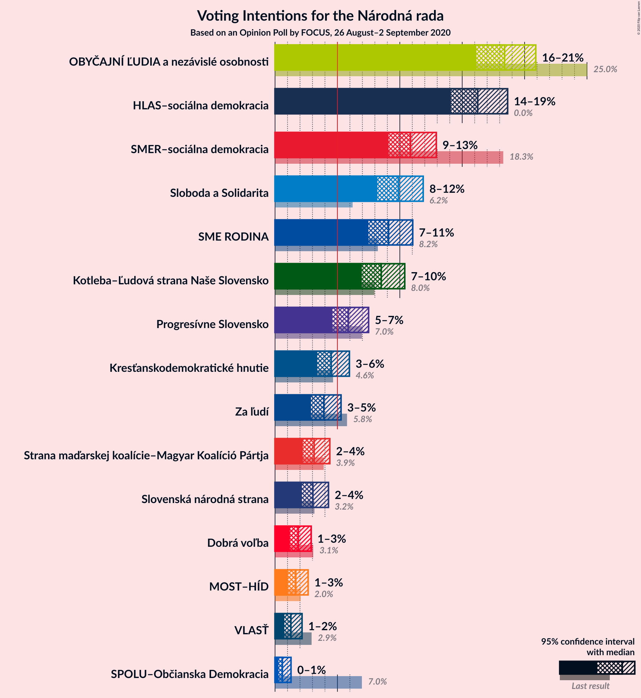
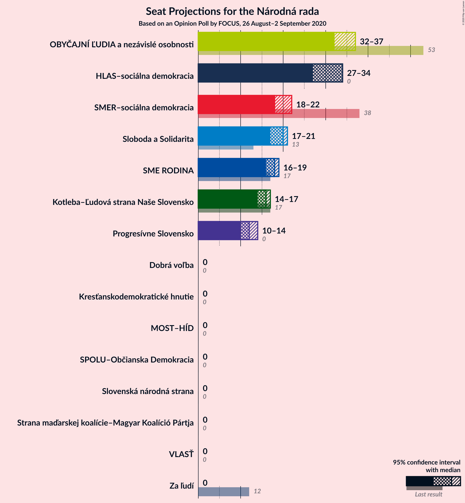
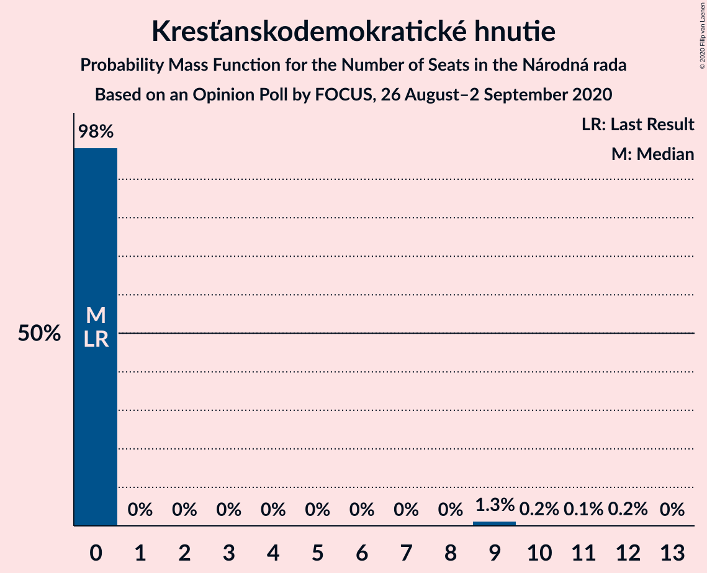
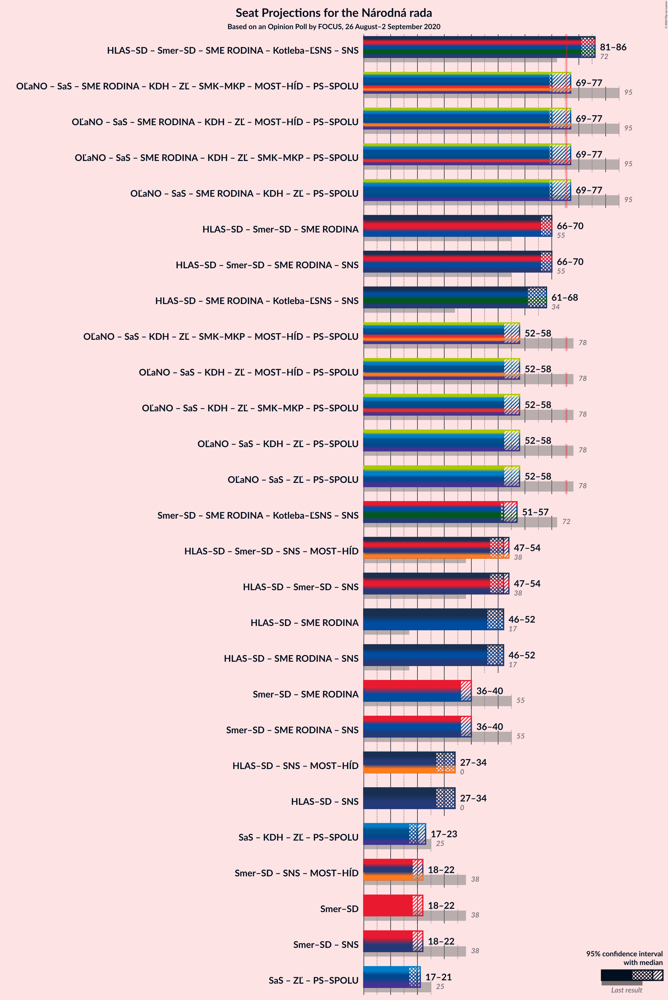

# Opinion Poll by FOCUS, 26 August–2 September 2020

<a href="#voting-intentions">Voting Intentions</a> | <a href="#seats">Seats</a> | <a href="#coalitions">Coalitions</a> | <a href="#technical-information">Technical Information</a>

## Voting Intentions

### Confidence Intervals

| Party | Last Result | Poll Result | 80% Confidence Interval | 90% Confidence Interval | 95% Confidence Interval | 99% Confidence Interval |
|:-----:|:-----------:|:-----------:|:-----------------------:|:-----------------------:|:-----------------------:|:-----------------------:|
| OBYČAJNÍ ĽUDIA a nezávislé osobnosti | 25.0% | 18.4% | 16.9–20.0% |16.5–20.5% |16.1–20.9% |15.4–21.7% |
| HLAS–sociálna demokracia | 0.0% | 16.2% | 14.8–17.8% |14.4–18.2% |14.1–18.6% |13.5–19.4% |
| SMER–sociálna demokracia | 18.3% | 10.9% | 9.7–12.2% |9.4–12.6% |9.1–12.9% |8.6–13.6% |
| Sloboda a Solidarita | 6.2% | 9.9% | 8.8–11.2% |8.5–11.6% |8.2–11.9% |7.7–12.5% |
| SME RODINA | 8.2% | 9.1% | 8.0–10.4% |7.7–10.7% |7.5–11.0% |7.0–11.7% |
| Kotleba–Ľudová strana Naše Slovensko | 8.0% | 8.5% | 7.5–9.7% |7.2–10.1% |7.0–10.4% |6.5–11.0% |
| Progresívne Slovensko | 7.0% | 5.9% | 5.0–6.9% |4.8–7.2% |4.6–7.5% |4.2–8.0% |
| Kresťanskodemokratické hnutie | 4.6% | 4.5% | 3.8–5.5% |3.6–5.7% |3.4–6.0% |3.1–6.4% |
| Za ľudí | 5.8% | 3.9% | 3.2–4.8% |3.0–5.1% |2.9–5.3% |2.6–5.8% |
| Strana maďarskej koalície–Magyar Koalíció Pártja | 3.9% | 3.1% | 2.5–3.9% |2.4–4.2% |2.2–4.4% |2.0–4.8% |
| Slovenská národná strana | 3.2% | 3.0% | 2.4–3.8% |2.3–4.1% |2.1–4.3% |1.9–4.7% |
| Dobrá voľba | 3.1% | 1.9% | 1.4–2.5% |1.3–2.7% |1.2–2.9% |1.0–3.2% |
| MOST–HÍD | 2.0% | 1.7% | 1.2–2.3% |1.1–2.5% |1.0–2.7% |0.9–3.0% |
| VLASŤ | 2.9% | 1.3% | 0.9–1.9% |0.8–2.0% |0.7–2.2% |0.6–2.5% |
| SPOLU–Občianska Demokracia | 7.0% | 0.6% | 0.4–1.0% |0.3–1.2% |0.3–1.3% |0.2–1.5% |

*Note:* The poll result column reflects the actual value used in the calculations. Published results may vary slightly, and in addition be rounded to fewer digits.

## Seats

### Confidence Intervals

| Party | Last Result | Median | 80% Confidence Interval | 90% Confidence Interval | 95% Confidence Interval | 99% Confidence Interval |
|:-----:|:-----------:|:------:|:-----------------------:|:-----------------------:|:-----------------------:|:-----------------------:|
| <a href="#obyčajní-ľudia-a-nezávislé-osobnosti">OBYČAJNÍ ĽUDIA a nezávislé osobnosti</a> | 53 | 32 | 32–36 |32–37 |32–37 |29–40 |
| <a href="#hlas–sociálna-demokracia">HLAS–sociálna demokracia</a> | 0 | 34 | 28–34 |28–34 |27–34 |26–34 |
| <a href="#smer–sociálna-demokracia">SMER–sociálna demokracia</a> | 38 | 18 | 18–21 |18–21 |18–22 |17–24 |
| <a href="#sloboda-a-solidarita">Sloboda a Solidarita</a> | 13 | 20 | 17–21 |17–21 |17–21 |14–22 |
| <a href="#sme-rodina">SME RODINA</a> | 17 | 18 | 16–19 |16–19 |16–19 |15–21 |
| <a href="#kotleba–ľudová-strana-naše-slovensko">Kotleba–Ľudová strana Naše Slovensko</a> | 17 | 16 | 14–16 |14–17 |14–17 |13–19 |
| <a href="#progresívne-slovensko">Progresívne Slovensko</a> | 0 | 12 | 11–14 |11–14 |10–14 |0–14 |
| <a href="#kresťanskodemokratické-hnutie">Kresťanskodemokratické hnutie</a> | 0 | 0 | 0 |0 |0 |0–10 |
| <a href="#za-ľudí">Za ľudí</a> | 12 | 0 | 0 |0 |0 |0–10 |
| <a href="#strana-maďarskej-koalície–magyar-koalíció-pártja">Strana maďarskej koalície–Magyar Koalíció Pártja</a> | 0 | 0 | 0 |0 |0 |0 |
| <a href="#slovenská-národná-strana">Slovenská národná strana</a> | 0 | 0 | 0 |0 |0 |0 |
| <a href="#dobrá-voľba">Dobrá voľba</a> | 0 | 0 | 0 |0 |0 |0 |
| <a href="#most–híd">MOST–HÍD</a> | 0 | 0 | 0 |0 |0 |0 |
| <a href="#vlasť">VLASŤ</a> | 0 | 0 | 0 |0 |0 |0 |
| <a href="#spolu–občianska-demokracia">SPOLU–Občianska Demokracia</a> | 0 | 0 | 0 |0 |0 |0 |

### OBYČAJNÍ ĽUDIA a nezávislé osobnosti

*For a full overview of the results for this party, see the [OBYČAJNÍ ĽUDIA a nezávislé osobnosti](party-obyčajníľudiaanezávisléosobnosti.html) page.*

| Number of Seats | Probability | Accumulated | Special Marks |
|:---------------:|:-----------:|:-----------:|:-------------:|
| 27 | 0.1% | 100% |  |
| 28 | 0.1% | 99.9% |  |
| 29 | 1.1% | 99.8% |  |
| 30 | 0.1% | 98.8% |  |
| 31 | 0.5% | 98.7% |  |
| 32 | 59% | 98% | Median |
| 33 | 0.9% | 40% |  |
| 34 | 3% | 39% |  |
| 35 | 0.8% | 36% |  |
| 36 | 30% | 35% |  |
| 37 | 4% | 5% |  |
| 38 | 0.5% | 1.2% |  |
| 39 | 0.1% | 0.6% |  |
| 40 | 0.4% | 0.5% |  |
| 41 | 0.1% | 0.2% |  |
| 42 | 0.1% | 0.1% |  |
| 43 | 0% | 0% |  |
| 44 | 0% | 0% |  |
| 45 | 0% | 0% |  |
| 46 | 0% | 0% |  |
| 47 | 0% | 0% |  |
| 48 | 0% | 0% |  |
| 49 | 0% | 0% |  |
| 50 | 0% | 0% |  |
| 51 | 0% | 0% |  |
| 52 | 0% | 0% |  |
| 53 | 0% | 0% | Last Result |

### HLAS–sociálna demokracia

*For a full overview of the results for this party, see the [HLAS–sociálna demokracia](party-hlas–sociálnademokracia.html) page.*

| Number of Seats | Probability | Accumulated | Special Marks |
|:---------------:|:-----------:|:-----------:|:-------------:|
| 0 | 0% | 100% | Last Result |
| 1 | 0% | 100% |  |
| 2 | 0% | 100% |  |
| 3 | 0% | 100% |  |
| 4 | 0% | 100% |  |
| 5 | 0% | 100% |  |
| 6 | 0% | 100% |  |
| 7 | 0% | 100% |  |
| 8 | 0% | 100% |  |
| 9 | 0% | 100% |  |
| 10 | 0% | 100% |  |
| 11 | 0% | 100% |  |
| 12 | 0% | 100% |  |
| 13 | 0% | 100% |  |
| 14 | 0% | 100% |  |
| 15 | 0% | 100% |  |
| 16 | 0% | 100% |  |
| 17 | 0% | 100% |  |
| 18 | 0% | 100% |  |
| 19 | 0% | 100% |  |
| 20 | 0% | 100% |  |
| 21 | 0% | 100% |  |
| 22 | 0% | 100% |  |
| 23 | 0% | 100% |  |
| 24 | 0.1% | 100% |  |
| 25 | 0.2% | 99.9% |  |
| 26 | 0.3% | 99.7% |  |
| 27 | 4% | 99.5% |  |
| 28 | 7% | 96% |  |
| 29 | 0.5% | 89% |  |
| 30 | 0.3% | 88% |  |
| 31 | 4% | 88% |  |
| 32 | 14% | 84% |  |
| 33 | 17% | 69% |  |
| 34 | 52% | 53% | Median |
| 35 | 0.1% | 0.3% |  |
| 36 | 0% | 0.2% |  |
| 37 | 0.1% | 0.2% |  |
| 38 | 0.1% | 0.1% |  |
| 39 | 0% | 0% |  |

### SMER–sociálna demokracia

*For a full overview of the results for this party, see the [SMER–sociálna demokracia](party-smer–sociálnademokracia.html) page.*

| Number of Seats | Probability | Accumulated | Special Marks |
|:---------------:|:-----------:|:-----------:|:-------------:|
| 15 | 0.2% | 100% |  |
| 16 | 0.1% | 99.7% |  |
| 17 | 0.2% | 99.6% |  |
| 18 | 52% | 99.4% | Median |
| 19 | 0.9% | 47% |  |
| 20 | 4% | 46% |  |
| 21 | 38% | 42% |  |
| 22 | 3% | 4% |  |
| 23 | 0.4% | 1.2% |  |
| 24 | 0.5% | 0.8% |  |
| 25 | 0.3% | 0.4% |  |
| 26 | 0% | 0.1% |  |
| 27 | 0% | 0.1% |  |
| 28 | 0% | 0% |  |
| 29 | 0% | 0% |  |
| 30 | 0% | 0% |  |
| 31 | 0% | 0% |  |
| 32 | 0% | 0% |  |
| 33 | 0% | 0% |  |
| 34 | 0% | 0% |  |
| 35 | 0% | 0% |  |
| 36 | 0% | 0% |  |
| 37 | 0% | 0% |  |
| 38 | 0% | 0% | Last Result |

### Sloboda a Solidarita

*For a full overview of the results for this party, see the [Sloboda a Solidarita](party-slobodaasolidarita.html) page.*

| Number of Seats | Probability | Accumulated | Special Marks |
|:---------------:|:-----------:|:-----------:|:-------------:|
| 13 | 0.3% | 100% | Last Result |
| 14 | 0.4% | 99.7% |  |
| 15 | 0.2% | 99.3% |  |
| 16 | 0.3% | 99.2% |  |
| 17 | 14% | 98.9% |  |
| 18 | 18% | 85% |  |
| 19 | 0.9% | 67% |  |
| 20 | 55% | 66% | Median |
| 21 | 10% | 11% |  |
| 22 | 0.7% | 1.0% |  |
| 23 | 0.1% | 0.3% |  |
| 24 | 0.2% | 0.2% |  |
| 25 | 0% | 0% |  |

### SME RODINA

*For a full overview of the results for this party, see the [SME RODINA](party-smerodina.html) page.*

| Number of Seats | Probability | Accumulated | Special Marks |
|:---------------:|:-----------:|:-----------:|:-------------:|
| 13 | 0% | 100% |  |
| 14 | 0.3% | 99.9% |  |
| 15 | 0.4% | 99.6% |  |
| 16 | 30% | 99.3% |  |
| 17 | 4% | 69% | Last Result |
| 18 | 53% | 65% | Median |
| 19 | 11% | 12% |  |
| 20 | 0.5% | 1.1% |  |
| 21 | 0.4% | 0.6% |  |
| 22 | 0.1% | 0.2% |  |
| 23 | 0% | 0.2% |  |
| 24 | 0.2% | 0.2% |  |
| 25 | 0% | 0% |  |

### Kotleba–Ľudová strana Naše Slovensko

*For a full overview of the results for this party, see the [Kotleba–Ľudová strana Naše Slovensko](party-kotleba–ľudovástrananašeslovensko.html) page.*

| Number of Seats | Probability | Accumulated | Special Marks |
|:---------------:|:-----------:|:-----------:|:-------------:|
| 11 | 0.1% | 100% |  |
| 12 | 0.1% | 99.9% |  |
| 13 | 0.4% | 99.8% |  |
| 14 | 14% | 99.4% |  |
| 15 | 23% | 86% |  |
| 16 | 54% | 62% | Median |
| 17 | 7% | 9% | Last Result |
| 18 | 0.3% | 1.1% |  |
| 19 | 0.7% | 0.9% |  |
| 20 | 0.1% | 0.1% |  |
| 21 | 0% | 0% |  |

### Progresívne Slovensko

*For a full overview of the results for this party, see the [Progresívne Slovensko](party-progresívneslovensko.html) page.*

| Number of Seats | Probability | Accumulated | Special Marks |
|:---------------:|:-----------:|:-----------:|:-------------:|
| 0 | 1.3% | 100% | Last Result |
| 1 | 0% | 98.7% |  |
| 2 | 0% | 98.7% |  |
| 3 | 0% | 98.7% |  |
| 4 | 0% | 98.7% |  |
| 5 | 0% | 98.7% |  |
| 6 | 0% | 98.7% |  |
| 7 | 0% | 98.7% |  |
| 8 | 0% | 98.7% |  |
| 9 | 0.3% | 98.7% |  |
| 10 | 2% | 98% |  |
| 11 | 23% | 96% |  |
| 12 | 59% | 73% | Median |
| 13 | 0.3% | 14% |  |
| 14 | 13% | 14% |  |
| 15 | 0.1% | 0.1% |  |
| 16 | 0% | 0% |  |

### Kresťanskodemokratické hnutie

*For a full overview of the results for this party, see the [Kresťanskodemokratické hnutie](party-kresťanskodemokratickéhnutie.html) page.*

| Number of Seats | Probability | Accumulated | Special Marks |
|:---------------:|:-----------:|:-----------:|:-------------:|
| 0 | 98% | 100% | Last Result, Median |
| 1 | 0% | 2% |  |
| 2 | 0% | 2% |  |
| 3 | 0% | 2% |  |
| 4 | 0% | 2% |  |
| 5 | 0% | 2% |  |
| 6 | 0% | 2% |  |
| 7 | 0% | 2% |  |
| 8 | 0% | 2% |  |
| 9 | 1.3% | 2% |  |
| 10 | 0.2% | 0.5% |  |
| 11 | 0.1% | 0.3% |  |
| 12 | 0.2% | 0.2% |  |
| 13 | 0% | 0% |  |

### Za ľudí

*For a full overview of the results for this party, see the [Za ľudí](party-zaľudí.html) page.*

| Number of Seats | Probability | Accumulated | Special Marks |
|:---------------:|:-----------:|:-----------:|:-------------:|
| 0 | 99.4% | 100% | Median |
| 1 | 0% | 0.6% |  |
| 2 | 0% | 0.6% |  |
| 3 | 0% | 0.6% |  |
| 4 | 0% | 0.6% |  |
| 5 | 0% | 0.6% |  |
| 6 | 0% | 0.6% |  |
| 7 | 0% | 0.6% |  |
| 8 | 0% | 0.6% |  |
| 9 | 0.1% | 0.6% |  |
| 10 | 0.5% | 0.6% |  |
| 11 | 0% | 0% |  |
| 12 | 0% | 0% | Last Result |

### Strana maďarskej koalície–Magyar Koalíció Pártja

*For a full overview of the results for this party, see the [Strana maďarskej koalície–Magyar Koalíció Pártja](party-stranamaďarskejkoalície–magyarkoalíciópártja.html) page.*

| Number of Seats | Probability | Accumulated | Special Marks |
|:---------------:|:-----------:|:-----------:|:-------------:|
| 0 | 99.9% | 100% | Last Result, Median |
| 1 | 0% | 0.1% |  |
| 2 | 0% | 0.1% |  |
| 3 | 0% | 0.1% |  |
| 4 | 0% | 0.1% |  |
| 5 | 0% | 0.1% |  |
| 6 | 0% | 0.1% |  |
| 7 | 0% | 0.1% |  |
| 8 | 0% | 0.1% |  |
| 9 | 0% | 0.1% |  |
| 10 | 0.1% | 0.1% |  |
| 11 | 0% | 0% |  |

### Slovenská národná strana

*For a full overview of the results for this party, see the [Slovenská národná strana](party-slovenskánárodnástrana.html) page.*

| Number of Seats | Probability | Accumulated | Special Marks |
|:---------------:|:-----------:|:-----------:|:-------------:|
| 0 | 100% | 100% | Last Result, Median |

### Dobrá voľba

*For a full overview of the results for this party, see the [Dobrá voľba](party-dobrávoľba.html) page.*

| Number of Seats | Probability | Accumulated | Special Marks |
|:---------------:|:-----------:|:-----------:|:-------------:|
| 0 | 100% | 100% | Last Result, Median |

### MOST–HÍD

*For a full overview of the results for this party, see the [MOST–HÍD](party-most–híd.html) page.*

| Number of Seats | Probability | Accumulated | Special Marks |
|:---------------:|:-----------:|:-----------:|:-------------:|
| 0 | 100% | 100% | Last Result, Median |

### VLASŤ

*For a full overview of the results for this party, see the [VLASŤ](party-vlasť.html) page.*

| Number of Seats | Probability | Accumulated | Special Marks |
|:---------------:|:-----------:|:-----------:|:-------------:|
| 0 | 100% | 100% | Last Result, Median |

### SPOLU–Občianska Demokracia

*For a full overview of the results for this party, see the [SPOLU–Občianska Demokracia](party-spolu–občianskademokracia.html) page.*

| Number of Seats | Probability | Accumulated | Special Marks |
|:---------------:|:-----------:|:-----------:|:-------------:|
| 0 | 100% | 100% | Last Result, Median |

## Coalitions

### Confidence Intervals

| Coalition | Last Result | Median | Majority? | 80% Confidence Interval | 90% Confidence Interval | 95% Confidence Interval | 99% Confidence Interval |
|:---------:|:-----------:|:------:|:---------:|:-----------------------:|:-----------------------:|:-----------------------:|:-----------------------:|
| HLAS–sociálna demokracia – SMER–sociálna demokracia – SME RODINA – Kotleba–Ľudová strana Naše Slovensko – Slovenská národná strana | 72 | 86 | 99.8% | 83–86 | 81–86 | 81–86 | 77–93 |
| HLAS–sociálna demokracia – SMER–sociálna demokracia – SME RODINA | 55 | 70 | 0.9% | 68–70 | 66–70 | 66–70 | 61–77 |
| HLAS–sociálna demokracia – SMER–sociálna demokracia – SME RODINA – Slovenská národná strana | 55 | 70 | 0.9% | 68–70 | 66–70 | 66–70 | 61–77 |
| HLAS–sociálna demokracia – SME RODINA – Kotleba–Ľudová strana Naše Slovensko – Slovenská národná strana | 34 | 68 | 0% | 62–68 | 62–68 | 61–68 | 58–69 |
| SMER–sociálna demokracia – SME RODINA – Kotleba–Ľudová strana Naše Slovensko – Slovenská národná strana | 72 | 52 | 0% | 51–54 | 51–57 | 51–57 | 49–61 |
| HLAS–sociálna demokracia – SMER–sociálna demokracia – Slovenská národná strana – MOST–HÍD | 38 | 52 | 0% | 49–54 | 48–54 | 47–54 | 45–56 |
| HLAS–sociálna demokracia – SMER–sociálna demokracia – Slovenská národná strana | 38 | 52 | 0% | 49–54 | 48–54 | 47–54 | 45–56 |
| HLAS–sociálna demokracia – SME RODINA | 17 | 52 | 0% | 47–52 | 46–52 | 46–52 | 43–53 |
| HLAS–sociálna demokracia – SME RODINA – Slovenská národná strana | 17 | 52 | 0% | 47–52 | 46–52 | 46–52 | 43–53 |
| SMER–sociálna demokracia – SME RODINA | 55 | 36 | 0% | 36–39 | 36–40 | 36–40 | 32–44 |
| SMER–sociálna demokracia – SME RODINA – Slovenská národná strana | 55 | 36 | 0% | 36–39 | 36–40 | 36–40 | 32–44 |
| HLAS–sociálna demokracia – Slovenská národná strana – MOST–HÍD | 0 | 34 | 0% | 28–34 | 28–34 | 27–34 | 26–34 |
| HLAS–sociálna demokracia – Slovenská národná strana | 0 | 34 | 0% | 28–34 | 28–34 | 27–34 | 26–34 |
| SMER–sociálna demokracia – Slovenská národná strana – MOST–HÍD | 38 | 18 | 0% | 18–21 | 18–21 | 18–22 | 17–24 |
| SMER–sociálna demokracia | 38 | 18 | 0% | 18–21 | 18–21 | 18–22 | 17–24 |
| SMER–sociálna demokracia – Slovenská národná strana | 38 | 18 | 0% | 18–21 | 18–21 | 18–22 | 17–24 |

### HLAS–sociálna demokracia – SMER–sociálna demokracia – SME RODINA – Kotleba–Ľudová strana Naše Slovensko – Slovenská národná strana

| Number of Seats | Probability | Accumulated | Special Marks |
|:---------------:|:-----------:|:-----------:|:-------------:|
| 71 | 0.1% | 100% |  |
| 72 | 0% | 99.9% | Last Result |
| 73 | 0% | 99.9% |  |
| 74 | 0.1% | 99.8% |  |
| 75 | 0% | 99.8% |  |
| 76 | 0.1% | 99.8% | Majority |
| 77 | 0.2% | 99.7% |  |
| 78 | 0.2% | 99.5% |  |
| 79 | 0.4% | 99.3% |  |
| 80 | 0.1% | 98.9% |  |
| 81 | 4% | 98.9% |  |
| 82 | 0.3% | 95% |  |
| 83 | 13% | 94% |  |
| 84 | 1.0% | 81% |  |
| 85 | 26% | 80% |  |
| 86 | 52% | 54% | Median |
| 87 | 0.3% | 2% |  |
| 88 | 0.2% | 2% |  |
| 89 | 0.3% | 2% |  |
| 90 | 0.4% | 1.4% |  |
| 91 | 0.4% | 1.0% |  |
| 92 | 0.1% | 0.6% |  |
| 93 | 0.3% | 0.6% |  |
| 94 | 0.1% | 0.3% |  |
| 95 | 0.2% | 0.2% |  |
| 96 | 0% | 0% |  |

### HLAS–sociálna demokracia – SMER–sociálna demokracia – SME RODINA

| Number of Seats | Probability | Accumulated | Special Marks |
|:---------------:|:-----------:|:-----------:|:-------------:|
| 55 | 0% | 100% | Last Result |
| 56 | 0% | 100% |  |
| 57 | 0.1% | 100% |  |
| 58 | 0% | 99.9% |  |
| 59 | 0.1% | 99.9% |  |
| 60 | 0.2% | 99.8% |  |
| 61 | 0.1% | 99.6% |  |
| 62 | 0% | 99.4% |  |
| 63 | 0.1% | 99.4% |  |
| 64 | 0.4% | 99.3% |  |
| 65 | 0.6% | 99.0% |  |
| 66 | 4% | 98% |  |
| 67 | 0.1% | 94% |  |
| 68 | 7% | 94% |  |
| 69 | 15% | 88% |  |
| 70 | 71% | 73% | Median |
| 71 | 0.1% | 2% |  |
| 72 | 0.3% | 2% |  |
| 73 | 0.4% | 1.3% |  |
| 74 | 0% | 1.0% |  |
| 75 | 0% | 1.0% |  |
| 76 | 0.1% | 0.9% | Majority |
| 77 | 0.5% | 0.8% |  |
| 78 | 0.2% | 0.3% |  |
| 79 | 0.1% | 0.1% |  |
| 80 | 0% | 0% |  |

### HLAS–sociálna demokracia – SMER–sociálna demokracia – SME RODINA – Slovenská národná strana

| Number of Seats | Probability | Accumulated | Special Marks |
|:---------------:|:-----------:|:-----------:|:-------------:|
| 55 | 0% | 100% | Last Result |
| 56 | 0% | 100% |  |
| 57 | 0.1% | 100% |  |
| 58 | 0% | 99.9% |  |
| 59 | 0.1% | 99.9% |  |
| 60 | 0.2% | 99.8% |  |
| 61 | 0.1% | 99.6% |  |
| 62 | 0% | 99.4% |  |
| 63 | 0.1% | 99.4% |  |
| 64 | 0.4% | 99.3% |  |
| 65 | 0.6% | 99.0% |  |
| 66 | 4% | 98% |  |
| 67 | 0.1% | 94% |  |
| 68 | 7% | 94% |  |
| 69 | 15% | 88% |  |
| 70 | 71% | 73% | Median |
| 71 | 0.1% | 2% |  |
| 72 | 0.3% | 2% |  |
| 73 | 0.4% | 1.3% |  |
| 74 | 0% | 1.0% |  |
| 75 | 0% | 1.0% |  |
| 76 | 0.1% | 0.9% | Majority |
| 77 | 0.5% | 0.8% |  |
| 78 | 0.2% | 0.3% |  |
| 79 | 0.1% | 0.1% |  |
| 80 | 0% | 0% |  |

### HLAS–sociálna demokracia – SME RODINA – Kotleba–Ľudová strana Naše Slovensko – Slovenská národná strana

| Number of Seats | Probability | Accumulated | Special Marks |
|:---------------:|:-----------:|:-----------:|:-------------:|
| 34 | 0% | 100% | Last Result |
| 35 | 0% | 100% |  |
| 36 | 0% | 100% |  |
| 37 | 0% | 100% |  |
| 38 | 0% | 100% |  |
| 39 | 0% | 100% |  |
| 40 | 0% | 100% |  |
| 41 | 0% | 100% |  |
| 42 | 0% | 100% |  |
| 43 | 0% | 100% |  |
| 44 | 0% | 100% |  |
| 45 | 0% | 100% |  |
| 46 | 0% | 100% |  |
| 47 | 0% | 100% |  |
| 48 | 0% | 100% |  |
| 49 | 0% | 100% |  |
| 50 | 0% | 100% |  |
| 51 | 0% | 100% |  |
| 52 | 0% | 100% |  |
| 53 | 0% | 100% |  |
| 54 | 0% | 100% |  |
| 55 | 0% | 100% |  |
| 56 | 0.3% | 99.9% |  |
| 57 | 0.1% | 99.6% |  |
| 58 | 0.1% | 99.5% |  |
| 59 | 0.1% | 99.4% |  |
| 60 | 0.2% | 99.3% |  |
| 61 | 4% | 99.1% |  |
| 62 | 14% | 95% |  |
| 63 | 4% | 81% |  |
| 64 | 23% | 78% |  |
| 65 | 0.4% | 55% |  |
| 66 | 0.2% | 54% |  |
| 67 | 0.2% | 54% |  |
| 68 | 53% | 54% | Median |
| 69 | 0.6% | 0.9% |  |
| 70 | 0% | 0.3% |  |
| 71 | 0% | 0.3% |  |
| 72 | 0% | 0.3% |  |
| 73 | 0.1% | 0.3% |  |
| 74 | 0% | 0.2% |  |
| 75 | 0.2% | 0.2% |  |
| 76 | 0% | 0% | Majority |

### SMER–sociálna demokracia – SME RODINA – Kotleba–Ľudová strana Naše Slovensko – Slovenská národná strana

| Number of Seats | Probability | Accumulated | Special Marks |
|:---------------:|:-----------:|:-----------:|:-------------:|
| 43 | 0.1% | 100% |  |
| 44 | 0% | 99.9% |  |
| 45 | 0% | 99.9% |  |
| 46 | 0.1% | 99.9% |  |
| 47 | 0.1% | 99.8% |  |
| 48 | 0.2% | 99.7% |  |
| 49 | 0.5% | 99.5% |  |
| 50 | 0.1% | 99.0% |  |
| 51 | 13% | 98.9% |  |
| 52 | 69% | 85% | Median |
| 53 | 0.1% | 16% |  |
| 54 | 7% | 16% |  |
| 55 | 0.4% | 9% |  |
| 56 | 0.3% | 9% |  |
| 57 | 7% | 8% |  |
| 58 | 0.5% | 1.3% |  |
| 59 | 0% | 0.8% |  |
| 60 | 0% | 0.7% |  |
| 61 | 0.7% | 0.7% |  |
| 62 | 0% | 0% |  |
| 63 | 0% | 0% |  |
| 64 | 0% | 0% |  |
| 65 | 0% | 0% |  |
| 66 | 0% | 0% |  |
| 67 | 0% | 0% |  |
| 68 | 0% | 0% |  |
| 69 | 0% | 0% |  |
| 70 | 0% | 0% |  |
| 71 | 0% | 0% |  |
| 72 | 0% | 0% | Last Result |

### HLAS–sociálna demokracia – SMER–sociálna demokracia – Slovenská národná strana – MOST–HÍD

| Number of Seats | Probability | Accumulated | Special Marks |
|:---------------:|:-----------:|:-----------:|:-------------:|
| 38 | 0% | 100% | Last Result |
| 39 | 0% | 100% |  |
| 40 | 0% | 100% |  |
| 41 | 0% | 100% |  |
| 42 | 0.1% | 100% |  |
| 43 | 0.2% | 99.9% |  |
| 44 | 0% | 99.7% |  |
| 45 | 0.2% | 99.7% |  |
| 46 | 0.5% | 99.4% |  |
| 47 | 4% | 99.0% |  |
| 48 | 0.4% | 95% |  |
| 49 | 7% | 95% |  |
| 50 | 0.2% | 88% |  |
| 51 | 0.1% | 88% |  |
| 52 | 53% | 88% | Median |
| 53 | 17% | 34% |  |
| 54 | 16% | 18% |  |
| 55 | 0.5% | 1.3% |  |
| 56 | 0.3% | 0.8% |  |
| 57 | 0% | 0.5% |  |
| 58 | 0.3% | 0.5% |  |
| 59 | 0.2% | 0.2% |  |
| 60 | 0% | 0% |  |

### HLAS–sociálna demokracia – SMER–sociálna demokracia – Slovenská národná strana

| Number of Seats | Probability | Accumulated | Special Marks |
|:---------------:|:-----------:|:-----------:|:-------------:|
| 38 | 0% | 100% | Last Result |
| 39 | 0% | 100% |  |
| 40 | 0% | 100% |  |
| 41 | 0% | 100% |  |
| 42 | 0.1% | 100% |  |
| 43 | 0.2% | 99.9% |  |
| 44 | 0% | 99.7% |  |
| 45 | 0.2% | 99.7% |  |
| 46 | 0.5% | 99.4% |  |
| 47 | 4% | 99.0% |  |
| 48 | 0.4% | 95% |  |
| 49 | 7% | 95% |  |
| 50 | 0.2% | 88% |  |
| 51 | 0.1% | 88% |  |
| 52 | 53% | 88% | Median |
| 53 | 17% | 34% |  |
| 54 | 16% | 18% |  |
| 55 | 0.5% | 1.3% |  |
| 56 | 0.3% | 0.8% |  |
| 57 | 0% | 0.5% |  |
| 58 | 0.3% | 0.5% |  |
| 59 | 0.2% | 0.2% |  |
| 60 | 0% | 0% |  |

### HLAS–sociálna demokracia – SME RODINA

| Number of Seats | Probability | Accumulated | Special Marks |
|:---------------:|:-----------:|:-----------:|:-------------:|
| 17 | 0% | 100% | Last Result |
| 18 | 0% | 100% |  |
| 19 | 0% | 100% |  |
| 20 | 0% | 100% |  |
| 21 | 0% | 100% |  |
| 22 | 0% | 100% |  |
| 23 | 0% | 100% |  |
| 24 | 0% | 100% |  |
| 25 | 0% | 100% |  |
| 26 | 0% | 100% |  |
| 27 | 0% | 100% |  |
| 28 | 0% | 100% |  |
| 29 | 0% | 100% |  |
| 30 | 0% | 100% |  |
| 31 | 0% | 100% |  |
| 32 | 0% | 100% |  |
| 33 | 0% | 100% |  |
| 34 | 0% | 100% |  |
| 35 | 0% | 100% |  |
| 36 | 0% | 100% |  |
| 37 | 0% | 100% |  |
| 38 | 0% | 100% |  |
| 39 | 0% | 100% |  |
| 40 | 0.1% | 100% |  |
| 41 | 0.1% | 99.9% |  |
| 42 | 0.2% | 99.8% |  |
| 43 | 0.1% | 99.6% |  |
| 44 | 0.3% | 99.4% |  |
| 45 | 0.4% | 99.2% |  |
| 46 | 4% | 98.8% |  |
| 47 | 7% | 95% |  |
| 48 | 17% | 88% |  |
| 49 | 16% | 70% |  |
| 50 | 0.5% | 54% |  |
| 51 | 0.5% | 54% |  |
| 52 | 52% | 53% | Median |
| 53 | 0.4% | 0.7% |  |
| 54 | 0% | 0.3% |  |
| 55 | 0% | 0.2% |  |
| 56 | 0% | 0.2% |  |
| 57 | 0% | 0.2% |  |
| 58 | 0.2% | 0.2% |  |
| 59 | 0% | 0% |  |

### HLAS–sociálna demokracia – SME RODINA – Slovenská národná strana

| Number of Seats | Probability | Accumulated | Special Marks |
|:---------------:|:-----------:|:-----------:|:-------------:|
| 17 | 0% | 100% | Last Result |
| 18 | 0% | 100% |  |
| 19 | 0% | 100% |  |
| 20 | 0% | 100% |  |
| 21 | 0% | 100% |  |
| 22 | 0% | 100% |  |
| 23 | 0% | 100% |  |
| 24 | 0% | 100% |  |
| 25 | 0% | 100% |  |
| 26 | 0% | 100% |  |
| 27 | 0% | 100% |  |
| 28 | 0% | 100% |  |
| 29 | 0% | 100% |  |
| 30 | 0% | 100% |  |
| 31 | 0% | 100% |  |
| 32 | 0% | 100% |  |
| 33 | 0% | 100% |  |
| 34 | 0% | 100% |  |
| 35 | 0% | 100% |  |
| 36 | 0% | 100% |  |
| 37 | 0% | 100% |  |
| 38 | 0% | 100% |  |
| 39 | 0% | 100% |  |
| 40 | 0.1% | 100% |  |
| 41 | 0.1% | 99.9% |  |
| 42 | 0.2% | 99.8% |  |
| 43 | 0.1% | 99.6% |  |
| 44 | 0.3% | 99.4% |  |
| 45 | 0.4% | 99.2% |  |
| 46 | 4% | 98.8% |  |
| 47 | 7% | 95% |  |
| 48 | 17% | 88% |  |
| 49 | 16% | 70% |  |
| 50 | 0.5% | 54% |  |
| 51 | 0.5% | 54% |  |
| 52 | 52% | 53% | Median |
| 53 | 0.4% | 0.7% |  |
| 54 | 0% | 0.3% |  |
| 55 | 0% | 0.2% |  |
| 56 | 0% | 0.2% |  |
| 57 | 0% | 0.2% |  |
| 58 | 0.2% | 0.2% |  |
| 59 | 0% | 0% |  |

### SMER–sociálna demokracia – SME RODINA

| Number of Seats | Probability | Accumulated | Special Marks |
|:---------------:|:-----------:|:-----------:|:-------------:|
| 29 | 0.1% | 100% |  |
| 30 | 0.1% | 99.9% |  |
| 31 | 0.1% | 99.9% |  |
| 32 | 0.3% | 99.8% |  |
| 33 | 0.2% | 99.5% |  |
| 34 | 0.1% | 99.3% |  |
| 35 | 0.2% | 99.2% |  |
| 36 | 53% | 99.0% | Median |
| 37 | 31% | 46% |  |
| 38 | 0.9% | 16% |  |
| 39 | 7% | 15% |  |
| 40 | 7% | 8% |  |
| 41 | 0.3% | 1.3% |  |
| 42 | 0% | 1.0% |  |
| 43 | 0.2% | 1.0% |  |
| 44 | 0.4% | 0.8% |  |
| 45 | 0.3% | 0.4% |  |
| 46 | 0% | 0.1% |  |
| 47 | 0.1% | 0.1% |  |
| 48 | 0% | 0% |  |
| 49 | 0% | 0% |  |
| 50 | 0% | 0% |  |
| 51 | 0% | 0% |  |
| 52 | 0% | 0% |  |
| 53 | 0% | 0% |  |
| 54 | 0% | 0% |  |
| 55 | 0% | 0% | Last Result |

### SMER–sociálna demokracia – SME RODINA – Slovenská národná strana

| Number of Seats | Probability | Accumulated | Special Marks |
|:---------------:|:-----------:|:-----------:|:-------------:|
| 29 | 0.1% | 100% |  |
| 30 | 0.1% | 99.9% |  |
| 31 | 0.1% | 99.9% |  |
| 32 | 0.3% | 99.8% |  |
| 33 | 0.2% | 99.5% |  |
| 34 | 0.1% | 99.3% |  |
| 35 | 0.2% | 99.2% |  |
| 36 | 53% | 99.0% | Median |
| 37 | 31% | 46% |  |
| 38 | 0.9% | 16% |  |
| 39 | 7% | 15% |  |
| 40 | 7% | 8% |  |
| 41 | 0.3% | 1.3% |  |
| 42 | 0% | 1.1% |  |
| 43 | 0.2% | 1.0% |  |
| 44 | 0.4% | 0.8% |  |
| 45 | 0.3% | 0.4% |  |
| 46 | 0% | 0.1% |  |
| 47 | 0.1% | 0.1% |  |
| 48 | 0% | 0% |  |
| 49 | 0% | 0% |  |
| 50 | 0% | 0% |  |
| 51 | 0% | 0% |  |
| 52 | 0% | 0% |  |
| 53 | 0% | 0% |  |
| 54 | 0% | 0% |  |
| 55 | 0% | 0% | Last Result |

### HLAS–sociálna demokracia – Slovenská národná strana – MOST–HÍD

| Number of Seats | Probability | Accumulated | Special Marks |
|:---------------:|:-----------:|:-----------:|:-------------:|
| 0 | 0% | 100% | Last Result |
| 1 | 0% | 100% |  |
| 2 | 0% | 100% |  |
| 3 | 0% | 100% |  |
| 4 | 0% | 100% |  |
| 5 | 0% | 100% |  |
| 6 | 0% | 100% |  |
| 7 | 0% | 100% |  |
| 8 | 0% | 100% |  |
| 9 | 0% | 100% |  |
| 10 | 0% | 100% |  |
| 11 | 0% | 100% |  |
| 12 | 0% | 100% |  |
| 13 | 0% | 100% |  |
| 14 | 0% | 100% |  |
| 15 | 0% | 100% |  |
| 16 | 0% | 100% |  |
| 17 | 0% | 100% |  |
| 18 | 0% | 100% |  |
| 19 | 0% | 100% |  |
| 20 | 0% | 100% |  |
| 21 | 0% | 100% |  |
| 22 | 0% | 100% |  |
| 23 | 0% | 100% |  |
| 24 | 0.1% | 100% |  |
| 25 | 0.2% | 99.9% |  |
| 26 | 0.3% | 99.7% |  |
| 27 | 4% | 99.5% |  |
| 28 | 7% | 96% |  |
| 29 | 0.5% | 89% |  |
| 30 | 0.3% | 88% |  |
| 31 | 4% | 88% |  |
| 32 | 14% | 84% |  |
| 33 | 17% | 69% |  |
| 34 | 52% | 53% | Median |
| 35 | 0.1% | 0.4% |  |
| 36 | 0% | 0.2% |  |
| 37 | 0.1% | 0.2% |  |
| 38 | 0.1% | 0.1% |  |
| 39 | 0% | 0% |  |

### HLAS–sociálna demokracia – Slovenská národná strana

| Number of Seats | Probability | Accumulated | Special Marks |
|:---------------:|:-----------:|:-----------:|:-------------:|
| 0 | 0% | 100% | Last Result |
| 1 | 0% | 100% |  |
| 2 | 0% | 100% |  |
| 3 | 0% | 100% |  |
| 4 | 0% | 100% |  |
| 5 | 0% | 100% |  |
| 6 | 0% | 100% |  |
| 7 | 0% | 100% |  |
| 8 | 0% | 100% |  |
| 9 | 0% | 100% |  |
| 10 | 0% | 100% |  |
| 11 | 0% | 100% |  |
| 12 | 0% | 100% |  |
| 13 | 0% | 100% |  |
| 14 | 0% | 100% |  |
| 15 | 0% | 100% |  |
| 16 | 0% | 100% |  |
| 17 | 0% | 100% |  |
| 18 | 0% | 100% |  |
| 19 | 0% | 100% |  |
| 20 | 0% | 100% |  |
| 21 | 0% | 100% |  |
| 22 | 0% | 100% |  |
| 23 | 0% | 100% |  |
| 24 | 0.1% | 100% |  |
| 25 | 0.2% | 99.9% |  |
| 26 | 0.3% | 99.7% |  |
| 27 | 4% | 99.5% |  |
| 28 | 7% | 96% |  |
| 29 | 0.5% | 89% |  |
| 30 | 0.3% | 88% |  |
| 31 | 4% | 88% |  |
| 32 | 14% | 84% |  |
| 33 | 17% | 69% |  |
| 34 | 52% | 53% | Median |
| 35 | 0.1% | 0.4% |  |
| 36 | 0% | 0.2% |  |
| 37 | 0.1% | 0.2% |  |
| 38 | 0.1% | 0.1% |  |
| 39 | 0% | 0% |  |

### SMER–sociálna demokracia – Slovenská národná strana – MOST–HÍD

| Number of Seats | Probability | Accumulated | Special Marks |
|:---------------:|:-----------:|:-----------:|:-------------:|
| 15 | 0.2% | 100% |  |
| 16 | 0.1% | 99.7% |  |
| 17 | 0.2% | 99.6% |  |
| 18 | 52% | 99.4% | Median |
| 19 | 0.9% | 47% |  |
| 20 | 4% | 46% |  |
| 21 | 38% | 42% |  |
| 22 | 3% | 4% |  |
| 23 | 0.4% | 1.2% |  |
| 24 | 0.5% | 0.8% |  |
| 25 | 0.3% | 0.4% |  |
| 26 | 0% | 0.1% |  |
| 27 | 0% | 0.1% |  |
| 28 | 0% | 0% |  |
| 29 | 0% | 0% |  |
| 30 | 0% | 0% |  |
| 31 | 0% | 0% |  |
| 32 | 0% | 0% |  |
| 33 | 0% | 0% |  |
| 34 | 0% | 0% |  |
| 35 | 0% | 0% |  |
| 36 | 0% | 0% |  |
| 37 | 0% | 0% |  |
| 38 | 0% | 0% | Last Result |

### SMER–sociálna demokracia

| Number of Seats | Probability | Accumulated | Special Marks |
|:---------------:|:-----------:|:-----------:|:-------------:|
| 15 | 0.2% | 100% |  |
| 16 | 0.1% | 99.7% |  |
| 17 | 0.2% | 99.6% |  |
| 18 | 52% | 99.4% | Median |
| 19 | 0.9% | 47% |  |
| 20 | 4% | 46% |  |
| 21 | 38% | 42% |  |
| 22 | 3% | 4% |  |
| 23 | 0.4% | 1.2% |  |
| 24 | 0.5% | 0.8% |  |
| 25 | 0.3% | 0.4% |  |
| 26 | 0% | 0.1% |  |
| 27 | 0% | 0.1% |  |
| 28 | 0% | 0% |  |
| 29 | 0% | 0% |  |
| 30 | 0% | 0% |  |
| 31 | 0% | 0% |  |
| 32 | 0% | 0% |  |
| 33 | 0% | 0% |  |
| 34 | 0% | 0% |  |
| 35 | 0% | 0% |  |
| 36 | 0% | 0% |  |
| 37 | 0% | 0% |  |
| 38 | 0% | 0% | Last Result |

### SMER–sociálna demokracia – Slovenská národná strana

| Number of Seats | Probability | Accumulated | Special Marks |
|:---------------:|:-----------:|:-----------:|:-------------:|
| 15 | 0.2% | 100% |  |
| 16 | 0.1% | 99.7% |  |
| 17 | 0.2% | 99.6% |  |
| 18 | 52% | 99.4% | Median |
| 19 | 0.9% | 47% |  |
| 20 | 4% | 46% |  |
| 21 | 38% | 42% |  |
| 22 | 3% | 4% |  |
| 23 | 0.4% | 1.2% |  |
| 24 | 0.5% | 0.8% |  |
| 25 | 0.3% | 0.4% |  |
| 26 | 0% | 0.1% |  |
| 27 | 0% | 0.1% |  |
| 28 | 0% | 0% |  |
| 29 | 0% | 0% |  |
| 30 | 0% | 0% |  |
| 31 | 0% | 0% |  |
| 32 | 0% | 0% |  |
| 33 | 0% | 0% |  |
| 34 | 0% | 0% |  |
| 35 | 0% | 0% |  |
| 36 | 0% | 0% |  |
| 37 | 0% | 0% |  |
| 38 | 0% | 0% | Last Result |

## Technical Information

### Opinion Poll

+ **Polling firm:** FOCUS
+ **Commissioner(s):** —
+ **Fieldwork period:** 26 August–2 September 2020

### Calculations

+ **Sample size:** 1022
+ **Simulations done:** 1,048,576
+ **Error estimate:** 2.67%

