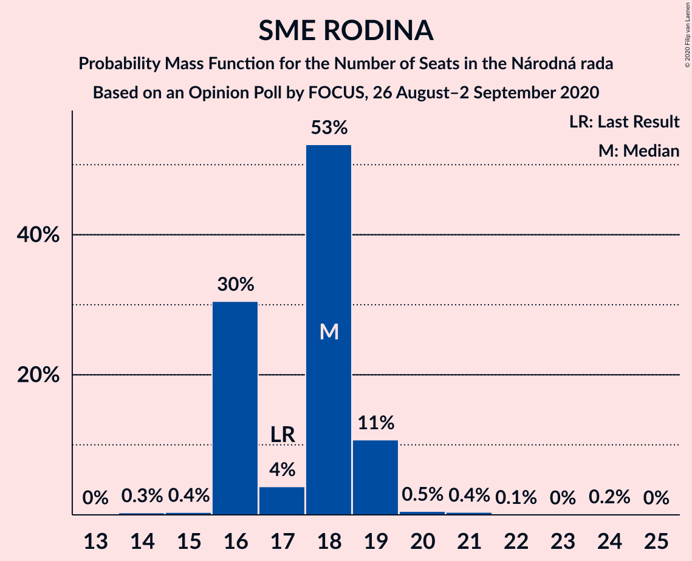
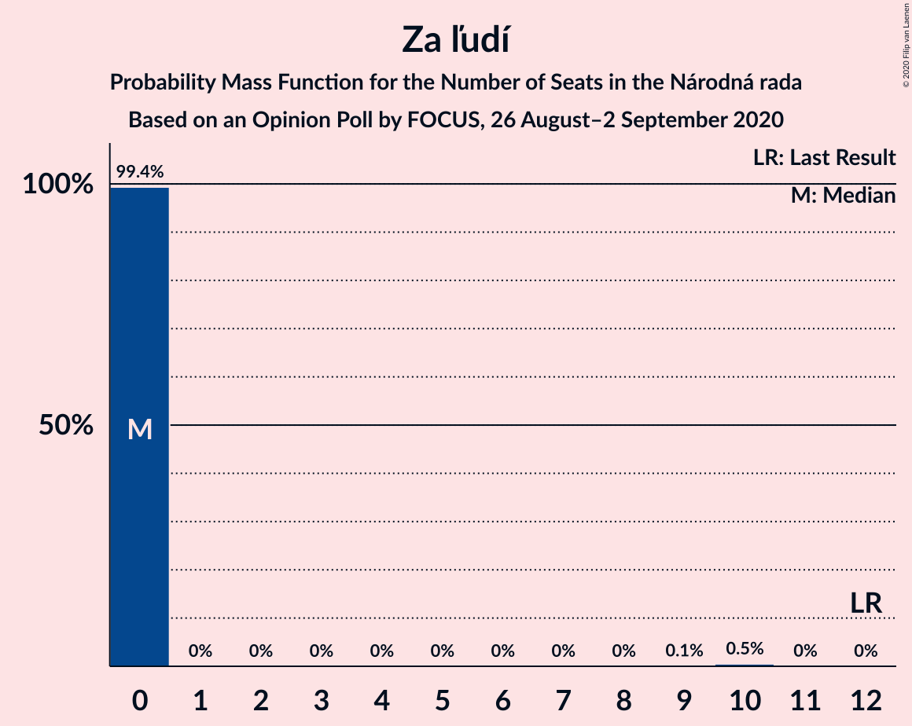
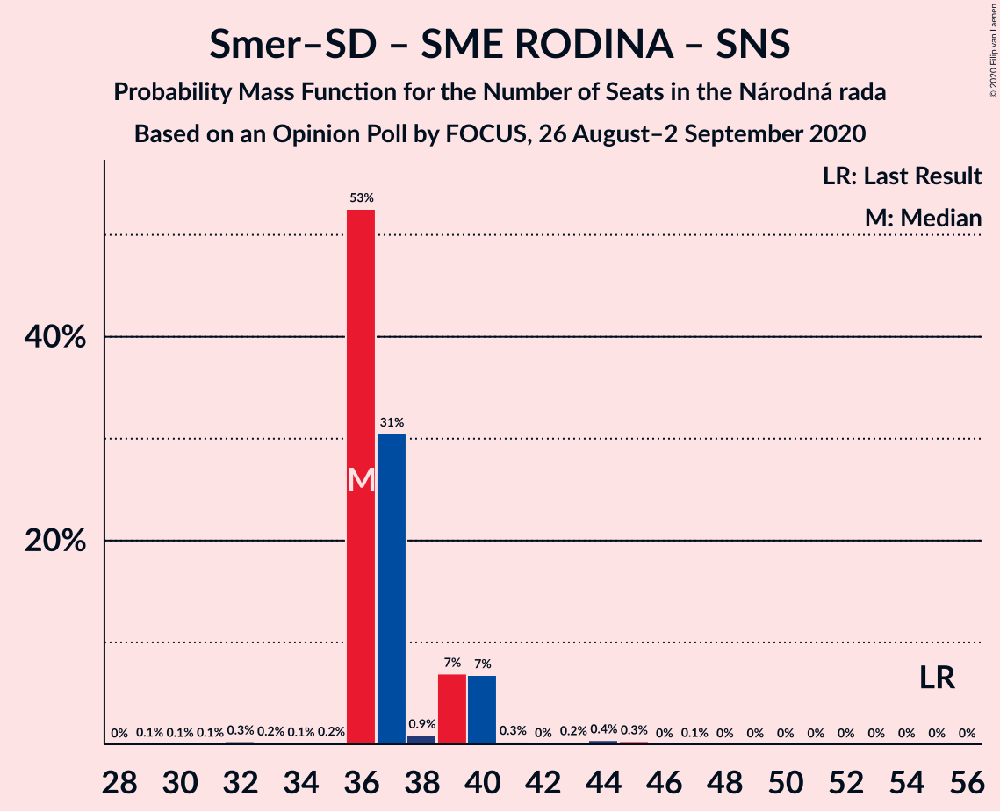
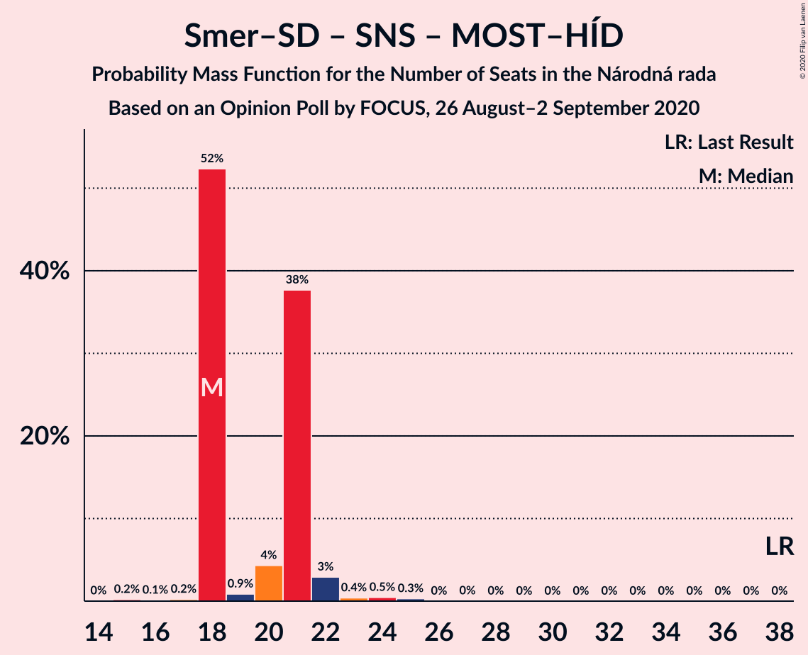

# Opinion Poll by FOCUS, 26 August–2 September 2020

<a href="#voting-intentions">Voting Intentions</a> | <a href="#seats">Seats</a> | <a href="#coalitions">Coalitions</a> | <a href="#technical-information">Technical Information</a>

## Voting Intentions

### Confidence Intervals

| Party | Last Result | Poll Result | 80% Confidence Interval | 90% Confidence Interval | 95% Confidence Interval | 99% Confidence Interval |
|:-----:|:-----------:|:-----------:|:-----------------------:|:-----------------------:|:-----------------------:|:-----------------------:|
| OBYČAJNÍ ĽUDIA a nezávislé osobnosti | 25.0% | 18.4% | 16.9–20.0% |16.5–20.5% |16.1–20.9% |15.4–21.7% |
| SMER–sociálna demokracia | 18.3% | 10.9% | 9.7–12.2% |9.4–12.6% |9.1–12.9% |8.6–13.6% |
| Sloboda a Solidarita | 6.2% | 9.9% | 8.8–11.2% |8.5–11.6% |8.2–11.9% |7.7–12.5% |
| SME RODINA | 8.2% | 9.1% | 8.0–10.4% |7.7–10.7% |7.5–11.0% |7.0–11.7% |
| Kotleba–Ľudová strana Naše Slovensko | 8.0% | 8.5% | 7.5–9.7% |7.2–10.1% |7.0–10.4% |6.5–11.0% |
| Progresívne Slovensko | 7.0% | 5.9% | 5.0–6.9% |4.8–7.2% |4.6–7.5% |4.2–8.0% |
| Kresťanskodemokratické hnutie | 4.6% | 4.5% | 3.8–5.5% |3.6–5.7% |3.4–6.0% |3.1–6.4% |
| Za ľudí | 5.8% | 3.9% | 3.2–4.8% |3.0–5.1% |2.9–5.3% |2.6–5.8% |
| Strana maďarskej koalície–Magyar Koalíció Pártja | 3.9% | 3.1% | 2.5–3.9% |2.4–4.2% |2.2–4.4% |2.0–4.8% |
| Slovenská národná strana | 3.2% | 3.0% | 2.4–3.8% |2.3–4.1% |2.1–4.3% |1.9–4.7% |
| Dobrá voľba | 3.1% | 1.9% | 1.4–2.5% |1.3–2.7% |1.2–2.9% |1.0–3.2% |
| MOST–HÍD | 2.0% | 1.7% | 1.2–2.3% |1.1–2.5% |1.0–2.7% |0.9–3.0% |
| VLASŤ | 2.9% | 1.3% | 0.9–1.9% |0.8–2.0% |0.7–2.2% |0.6–2.5% |
| SPOLU–Občianska Demokracia | 7.0% | 0.6% | 0.4–1.0% |0.3–1.2% |0.3–1.3% |0.2–1.5% |

*Note:* The poll result column reflects the actual value used in the calculations. Published results may vary slightly, and in addition be rounded to fewer digits.

## Seats

### Confidence Intervals

| Party | Last Result | Median | 80% Confidence Interval | 90% Confidence Interval | 95% Confidence Interval | 99% Confidence Interval |
|:-----:|:-----------:|:------:|:-----------------------:|:-----------------------:|:-----------------------:|:-----------------------:|
| <a href="#obyčajní-ľudia-a-nezávislé-osobnosti">OBYČAJNÍ ĽUDIA a nezávislé osobnosti</a> | 53 | 48 | 43–49 |43–49 |43–49 |37–49 |
| <a href="#smer–sociálna-demokracia">SMER–sociálna demokracia</a> | 38 | 29 | 23–29 |23–29 |23–29 |21–31 |
| <a href="#sloboda-a-solidarita">Sloboda a Solidarita</a> | 13 | 23 | 22–24 |22–25 |20–25 |20–29 |
| <a href="#sme-rodina">SME RODINA</a> | 17 | 17 | 17–22 |17–22 |17–22 |17–25 |
| <a href="#kotleba–ľudová-strana-naše-slovensko">Kotleba–Ľudová strana Naše Slovensko</a> | 17 | 19 | 19–21 |19–21 |17–21 |16–25 |
| <a href="#progresívne-slovensko">Progresívne Slovensko</a> | 0 | 14 | 13–14 |13–14 |13–14 |0–16 |
| <a href="#kresťanskodemokratické-hnutie">Kresťanskodemokratické hnutie</a> | 0 | 0 | 0 |0 |0–12 |0–14 |
| <a href="#za-ľudí">Za ľudí</a> | 12 | 0 | 0 |0 |0 |0 |
| <a href="#strana-maďarskej-koalície–magyar-koalíció-pártja">Strana maďarskej koalície–Magyar Koalíció Pártja</a> | 0 | 0 | 0 |0 |0 |0 |
| <a href="#slovenská-národná-strana">Slovenská národná strana</a> | 0 | 0 | 0 |0 |0 |0 |
| <a href="#dobrá-voľba">Dobrá voľba</a> | 0 | 0 | 0 |0 |0 |0 |
| <a href="#most–híd">MOST–HÍD</a> | 0 | 0 | 0 |0 |0 |0 |
| <a href="#vlasť">VLASŤ</a> | 0 | 0 | 0 |0 |0 |0 |
| <a href="#spolu–občianska-demokracia">SPOLU–Občianska Demokracia</a> | 0 | 0 | 0 |0 |0 |0 |

### OBYČAJNÍ ĽUDIA a nezávislé osobnosti

*For a full overview of the results for this party, see the [OBYČAJNÍ ĽUDIA a nezávislé osobnosti](party-obyčajníľudiaanezávisléosobnosti.html) page.*

| Number of Seats | Probability | Accumulated | Special Marks |
|:---------------:|:-----------:|:-----------:|:-------------:|
| 35 | 0.1% | 100% |  |
| 36 | 0% | 99.9% |  |
| 37 | 0.7% | 99.9% |  |
| 38 | 0.3% | 99.2% |  |
| 39 | 0.3% | 98.8% |  |
| 40 | 0.2% | 98.6% |  |
| 41 | 0.3% | 98% |  |
| 42 | 0.5% | 98% |  |
| 43 | 10% | 98% |  |
| 44 | 0.9% | 88% |  |
| 45 | 0.2% | 87% |  |
| 46 | 0.8% | 87% |  |
| 47 | 0.4% | 86% |  |
| 48 | 55% | 85% | Median |
| 49 | 30% | 31% |  |
| 50 | 0% | 0.2% |  |
| 51 | 0.1% | 0.2% |  |
| 52 | 0.1% | 0.1% |  |
| 53 | 0% | 0% | Last Result |

### SMER–sociálna demokracia

*For a full overview of the results for this party, see the [SMER–sociálna demokracia](party-smer–sociálnademokracia.html) page.*

| Number of Seats | Probability | Accumulated | Special Marks |
|:---------------:|:-----------:|:-----------:|:-------------:|
| 19 | 0.1% | 100% |  |
| 20 | 0.1% | 99.9% |  |
| 21 | 0.7% | 99.8% |  |
| 22 | 0.6% | 99.1% |  |
| 23 | 31% | 98.5% |  |
| 24 | 3% | 68% |  |
| 25 | 0.3% | 65% |  |
| 26 | 0.3% | 65% |  |
| 27 | 0% | 64% |  |
| 28 | 8% | 64% |  |
| 29 | 55% | 57% | Median |
| 30 | 0.6% | 2% |  |
| 31 | 0.9% | 1.1% |  |
| 32 | 0.1% | 0.2% |  |
| 33 | 0.1% | 0.2% |  |
| 34 | 0% | 0% |  |
| 35 | 0% | 0% |  |
| 36 | 0% | 0% |  |
| 37 | 0% | 0% |  |
| 38 | 0% | 0% | Last Result |

### Sloboda a Solidarita

*For a full overview of the results for this party, see the [Sloboda a Solidarita](party-slobodaasolidarita.html) page.*

| Number of Seats | Probability | Accumulated | Special Marks |
|:---------------:|:-----------:|:-----------:|:-------------:|
| 13 | 0% | 100% | Last Result |
| 14 | 0% | 100% |  |
| 15 | 0% | 100% |  |
| 16 | 0% | 100% |  |
| 17 | 0% | 100% |  |
| 18 | 0.1% | 100% |  |
| 19 | 0.1% | 99.8% |  |
| 20 | 3% | 99.7% |  |
| 21 | 0.7% | 97% |  |
| 22 | 31% | 96% |  |
| 23 | 55% | 65% | Median |
| 24 | 0.5% | 10% |  |
| 25 | 8% | 10% |  |
| 26 | 0.6% | 2% |  |
| 27 | 0.2% | 1.4% |  |
| 28 | 0.4% | 1.2% |  |
| 29 | 0.5% | 0.8% |  |
| 30 | 0% | 0.3% |  |
| 31 | 0% | 0.3% |  |
| 32 | 0.2% | 0.3% |  |
| 33 | 0% | 0.1% |  |
| 34 | 0.1% | 0.1% |  |
| 35 | 0% | 0% |  |

### SME RODINA

*For a full overview of the results for this party, see the [SME RODINA](party-smerodina.html) page.*

| Number of Seats | Probability | Accumulated | Special Marks |
|:---------------:|:-----------:|:-----------:|:-------------:|
| 16 | 0% | 100% |  |
| 17 | 55% | 99.9% | Last Result, Median |
| 18 | 0.2% | 45% |  |
| 19 | 0.5% | 45% |  |
| 20 | 3% | 44% |  |
| 21 | 8% | 41% |  |
| 22 | 31% | 34% |  |
| 23 | 0.3% | 2% |  |
| 24 | 0.9% | 2% |  |
| 25 | 0.7% | 1.1% |  |
| 26 | 0.3% | 0.5% |  |
| 27 | 0.1% | 0.1% |  |
| 28 | 0% | 0% |  |

### Kotleba–Ľudová strana Naše Slovensko

*For a full overview of the results for this party, see the [Kotleba–Ľudová strana Naše Slovensko](party-kotleba–ľudovástrananašeslovensko.html) page.*

| Number of Seats | Probability | Accumulated | Special Marks |
|:---------------:|:-----------:|:-----------:|:-------------:|
| 15 | 0.2% | 100% |  |
| 16 | 0.3% | 99.7% |  |
| 17 | 3% | 99.4% | Last Result |
| 18 | 0.6% | 96% |  |
| 19 | 62% | 96% | Median |
| 20 | 1.1% | 34% |  |
| 21 | 31% | 33% |  |
| 22 | 0.6% | 2% |  |
| 23 | 0.9% | 2% |  |
| 24 | 0.2% | 0.8% |  |
| 25 | 0.1% | 0.5% |  |
| 26 | 0.2% | 0.5% |  |
| 27 | 0% | 0.3% |  |
| 28 | 0.3% | 0.3% |  |
| 29 | 0% | 0% |  |

### Progresívne Slovensko

*For a full overview of the results for this party, see the [Progresívne Slovensko](party-progresívneslovensko.html) page.*

| Number of Seats | Probability | Accumulated | Special Marks |
|:---------------:|:-----------:|:-----------:|:-------------:|
| 0 | 2% | 100% | Last Result |
| 1 | 0% | 98% |  |
| 2 | 0% | 98% |  |
| 3 | 0% | 98% |  |
| 4 | 0% | 98% |  |
| 5 | 0% | 98% |  |
| 6 | 0% | 98% |  |
| 7 | 0% | 98% |  |
| 8 | 0% | 98% |  |
| 9 | 0% | 98% |  |
| 10 | 0% | 98% |  |
| 11 | 0.1% | 98% |  |
| 12 | 0.2% | 98% |  |
| 13 | 31% | 98% |  |
| 14 | 65% | 67% | Median |
| 15 | 0.5% | 2% |  |
| 16 | 0.6% | 1.1% |  |
| 17 | 0.2% | 0.5% |  |
| 18 | 0.1% | 0.2% |  |
| 19 | 0.1% | 0.1% |  |
| 20 | 0% | 0% |  |

### Kresťanskodemokratické hnutie

*For a full overview of the results for this party, see the [Kresťanskodemokratické hnutie](party-kresťanskodemokratickéhnutie.html) page.*

| Number of Seats | Probability | Accumulated | Special Marks |
|:---------------:|:-----------:|:-----------:|:-------------:|
| 0 | 96% | 100% | Last Result, Median |
| 1 | 0% | 4% |  |
| 2 | 0% | 4% |  |
| 3 | 0% | 4% |  |
| 4 | 0% | 4% |  |
| 5 | 0% | 4% |  |
| 6 | 0% | 4% |  |
| 7 | 0% | 4% |  |
| 8 | 0% | 4% |  |
| 9 | 0% | 4% |  |
| 10 | 0% | 4% |  |
| 11 | 0.1% | 4% |  |
| 12 | 3% | 4% |  |
| 13 | 0.3% | 1.0% |  |
| 14 | 0.5% | 0.7% |  |
| 15 | 0.2% | 0.2% |  |
| 16 | 0% | 0% |  |

### Za ľudí

*For a full overview of the results for this party, see the [Za ľudí](party-zaľudí.html) page.*

| Number of Seats | Probability | Accumulated | Special Marks |
|:---------------:|:-----------:|:-----------:|:-------------:|
| 0 | 99.7% | 100% | Median |
| 1 | 0% | 0.3% |  |
| 2 | 0% | 0.3% |  |
| 3 | 0% | 0.3% |  |
| 4 | 0% | 0.3% |  |
| 5 | 0% | 0.3% |  |
| 6 | 0% | 0.3% |  |
| 7 | 0% | 0.3% |  |
| 8 | 0% | 0.3% |  |
| 9 | 0% | 0.3% |  |
| 10 | 0% | 0.3% |  |
| 11 | 0.1% | 0.3% |  |
| 12 | 0.1% | 0.3% | Last Result |
| 13 | 0.1% | 0.1% |  |
| 14 | 0% | 0% |  |

### Strana maďarskej koalície–Magyar Koalíció Pártja

*For a full overview of the results for this party, see the [Strana maďarskej koalície–Magyar Koalíció Pártja](party-stranamaďarskejkoalície–magyarkoalíciópártja.html) page.*

| Number of Seats | Probability | Accumulated | Special Marks |
|:---------------:|:-----------:|:-----------:|:-------------:|
| 0 | 99.8% | 100% | Last Result, Median |
| 1 | 0% | 0.2% |  |
| 2 | 0% | 0.2% |  |
| 3 | 0% | 0.2% |  |
| 4 | 0% | 0.2% |  |
| 5 | 0% | 0.2% |  |
| 6 | 0% | 0.2% |  |
| 7 | 0% | 0.2% |  |
| 8 | 0% | 0.2% |  |
| 9 | 0% | 0.2% |  |
| 10 | 0% | 0.2% |  |
| 11 | 0% | 0.2% |  |
| 12 | 0.2% | 0.2% |  |
| 13 | 0% | 0% |  |

### Slovenská národná strana

*For a full overview of the results for this party, see the [Slovenská národná strana](party-slovenskánárodnástrana.html) page.*

| Number of Seats | Probability | Accumulated | Special Marks |
|:---------------:|:-----------:|:-----------:|:-------------:|
| 0 | 100% | 100% | Last Result, Median |

### Dobrá voľba

*For a full overview of the results for this party, see the [Dobrá voľba](party-dobrávoľba.html) page.*

| Number of Seats | Probability | Accumulated | Special Marks |
|:---------------:|:-----------:|:-----------:|:-------------:|
| 0 | 100% | 100% | Last Result, Median |

### MOST–HÍD

*For a full overview of the results for this party, see the [MOST–HÍD](party-most–híd.html) page.*

| Number of Seats | Probability | Accumulated | Special Marks |
|:---------------:|:-----------:|:-----------:|:-------------:|
| 0 | 100% | 100% | Last Result, Median |

### VLASŤ

*For a full overview of the results for this party, see the [VLASŤ](party-vlasť.html) page.*

| Number of Seats | Probability | Accumulated | Special Marks |
|:---------------:|:-----------:|:-----------:|:-------------:|
| 0 | 100% | 100% | Last Result, Median |

### SPOLU–Občianska Demokracia

*For a full overview of the results for this party, see the [SPOLU–Občianska Demokracia](party-spolu–občianskademokracia.html) page.*

| Number of Seats | Probability | Accumulated | Special Marks |
|:---------------:|:-----------:|:-----------:|:-------------:|
| 0 | 100% | 100% | Last Result, Median |

## Coalitions

### Confidence Intervals

| Coalition | Last Result | Median | Majority? | 80% Confidence Interval | 90% Confidence Interval | 95% Confidence Interval | 99% Confidence Interval |
|:---------:|:-----------:|:------:|:---------:|:-----------------------:|:-----------------------:|:-----------------------:|:-----------------------:|
| SMER–sociálna demokracia – SME RODINA – Kotleba–Ľudová strana Naše Slovensko – Slovenská národná strana | 72 | 65 | 0.8% | 65–68 | 65–68 | 61–71 | 60–77 |
| SMER–sociálna demokracia – SME RODINA | 55 | 46 | 0% | 45–47 | 45–49 | 44–49 | 42–55 |
| SMER–sociálna demokracia – SME RODINA – Slovenská národná strana | 55 | 46 | 0% | 45–47 | 45–49 | 44–49 | 42–55 |
| SMER–sociálna demokracia – Slovenská národná strana – MOST–HÍD | 38 | 29 | 0% | 23–29 | 23–29 | 23–29 | 21–31 |
| SMER–sociálna demokracia | 38 | 29 | 0% | 23–29 | 23–29 | 23–29 | 21–31 |
| SMER–sociálna demokracia – Slovenská národná strana | 38 | 29 | 0% | 23–29 | 23–29 | 23–29 | 21–31 |

### SMER–sociálna demokracia – SME RODINA – Kotleba–Ľudová strana Naše Slovensko – Slovenská národná strana

| Number of Seats | Probability | Accumulated | Special Marks |
|:---------------:|:-----------:|:-----------:|:-------------:|
| 56 | 0% | 100% |  |
| 57 | 0% | 99.9% |  |
| 58 | 0% | 99.9% |  |
| 59 | 0.1% | 99.9% |  |
| 60 | 0.3% | 99.8% |  |
| 61 | 3% | 99.5% |  |
| 62 | 0.1% | 97% |  |
| 63 | 0.7% | 97% |  |
| 64 | 0.1% | 96% |  |
| 65 | 56% | 96% | Median |
| 66 | 30% | 40% |  |
| 67 | 0.1% | 10% |  |
| 68 | 7% | 10% |  |
| 69 | 0.1% | 3% |  |
| 70 | 0.1% | 3% |  |
| 71 | 0.3% | 3% |  |
| 72 | 0.3% | 2% | Last Result |
| 73 | 0.4% | 2% |  |
| 74 | 0.3% | 2% |  |
| 75 | 0.6% | 1.4% |  |
| 76 | 0.2% | 0.8% | Majority |
| 77 | 0.2% | 0.6% |  |
| 78 | 0% | 0.3% |  |
| 79 | 0% | 0.3% |  |
| 80 | 0% | 0.3% |  |
| 81 | 0% | 0.3% |  |
| 82 | 0% | 0.3% |  |
| 83 | 0.3% | 0.3% |  |
| 84 | 0% | 0% |  |

### SMER–sociálna demokracia – SME RODINA

| Number of Seats | Probability | Accumulated | Special Marks |
|:---------------:|:-----------:|:-----------:|:-------------:|
| 38 | 0.1% | 100% |  |
| 39 | 0% | 99.9% |  |
| 40 | 0.1% | 99.9% |  |
| 41 | 0.1% | 99.8% |  |
| 42 | 0.5% | 99.7% |  |
| 43 | 0.5% | 99.2% |  |
| 44 | 3% | 98.7% |  |
| 45 | 30% | 96% |  |
| 46 | 55% | 65% | Median |
| 47 | 0.3% | 10% |  |
| 48 | 0.2% | 10% |  |
| 49 | 7% | 10% |  |
| 50 | 0.3% | 2% |  |
| 51 | 0.2% | 2% |  |
| 52 | 0.3% | 2% |  |
| 53 | 0.6% | 2% |  |
| 54 | 0% | 1.1% |  |
| 55 | 0.8% | 1.1% | Last Result |
| 56 | 0% | 0.3% |  |
| 57 | 0.3% | 0.3% |  |
| 58 | 0% | 0% |  |

### SMER–sociálna demokracia – SME RODINA – Slovenská národná strana

| Number of Seats | Probability | Accumulated | Special Marks |
|:---------------:|:-----------:|:-----------:|:-------------:|
| 38 | 0.1% | 100% |  |
| 39 | 0% | 99.9% |  |
| 40 | 0.1% | 99.9% |  |
| 41 | 0.1% | 99.8% |  |
| 42 | 0.5% | 99.7% |  |
| 43 | 0.5% | 99.2% |  |
| 44 | 3% | 98.7% |  |
| 45 | 30% | 96% |  |
| 46 | 55% | 65% | Median |
| 47 | 0.3% | 10% |  |
| 48 | 0.2% | 10% |  |
| 49 | 7% | 10% |  |
| 50 | 0.3% | 2% |  |
| 51 | 0.2% | 2% |  |
| 52 | 0.3% | 2% |  |
| 53 | 0.6% | 2% |  |
| 54 | 0% | 1.1% |  |
| 55 | 0.8% | 1.1% | Last Result |
| 56 | 0% | 0.3% |  |
| 57 | 0.3% | 0.3% |  |
| 58 | 0% | 0% |  |

### SMER–sociálna demokracia – Slovenská národná strana – MOST–HÍD

| Number of Seats | Probability | Accumulated | Special Marks |
|:---------------:|:-----------:|:-----------:|:-------------:|
| 19 | 0.1% | 100% |  |
| 20 | 0.1% | 99.9% |  |
| 21 | 0.7% | 99.8% |  |
| 22 | 0.6% | 99.1% |  |
| 23 | 31% | 98.5% |  |
| 24 | 3% | 68% |  |
| 25 | 0.3% | 65% |  |
| 26 | 0.3% | 65% |  |
| 27 | 0% | 64% |  |
| 28 | 8% | 64% |  |
| 29 | 55% | 57% | Median |
| 30 | 0.6% | 2% |  |
| 31 | 0.9% | 1.2% |  |
| 32 | 0.1% | 0.3% |  |
| 33 | 0.1% | 0.2% |  |
| 34 | 0% | 0.1% |  |
| 35 | 0% | 0% |  |
| 36 | 0% | 0% |  |
| 37 | 0% | 0% |  |
| 38 | 0% | 0% | Last Result |

### SMER–sociálna demokracia

| Number of Seats | Probability | Accumulated | Special Marks |
|:---------------:|:-----------:|:-----------:|:-------------:|
| 19 | 0.1% | 100% |  |
| 20 | 0.1% | 99.9% |  |
| 21 | 0.7% | 99.8% |  |
| 22 | 0.6% | 99.1% |  |
| 23 | 31% | 98.5% |  |
| 24 | 3% | 68% |  |
| 25 | 0.3% | 65% |  |
| 26 | 0.3% | 65% |  |
| 27 | 0% | 64% |  |
| 28 | 8% | 64% |  |
| 29 | 55% | 57% | Median |
| 30 | 0.6% | 2% |  |
| 31 | 0.9% | 1.1% |  |
| 32 | 0.1% | 0.2% |  |
| 33 | 0.1% | 0.2% |  |
| 34 | 0% | 0% |  |
| 35 | 0% | 0% |  |
| 36 | 0% | 0% |  |
| 37 | 0% | 0% |  |
| 38 | 0% | 0% | Last Result |

### SMER–sociálna demokracia – Slovenská národná strana

| Number of Seats | Probability | Accumulated | Special Marks |
|:---------------:|:-----------:|:-----------:|:-------------:|
| 19 | 0.1% | 100% |  |
| 20 | 0.1% | 99.9% |  |
| 21 | 0.7% | 99.8% |  |
| 22 | 0.6% | 99.1% |  |
| 23 | 31% | 98.5% |  |
| 24 | 3% | 68% |  |
| 25 | 0.3% | 65% |  |
| 26 | 0.3% | 65% |  |
| 27 | 0% | 64% |  |
| 28 | 8% | 64% |  |
| 29 | 55% | 57% | Median |
| 30 | 0.6% | 2% |  |
| 31 | 0.9% | 1.2% |  |
| 32 | 0.1% | 0.3% |  |
| 33 | 0.1% | 0.2% |  |
| 34 | 0% | 0.1% |  |
| 35 | 0% | 0% |  |
| 36 | 0% | 0% |  |
| 37 | 0% | 0% |  |
| 38 | 0% | 0% | Last Result |

## Technical Information

### Opinion Poll

+ **Polling firm:** FOCUS
+ **Commissioner(s):** —
+ **Fieldwork period:** 26 August–2 September 2020

### Calculations

+ **Sample size:** 1022
+ **Simulations done:** 1,048,576
+ **Error estimate:** 2.83%

