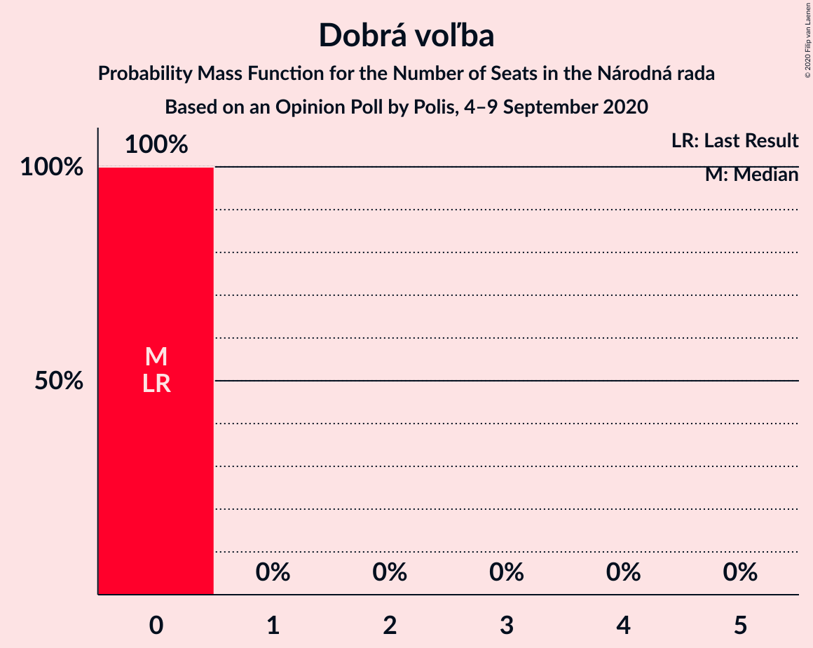
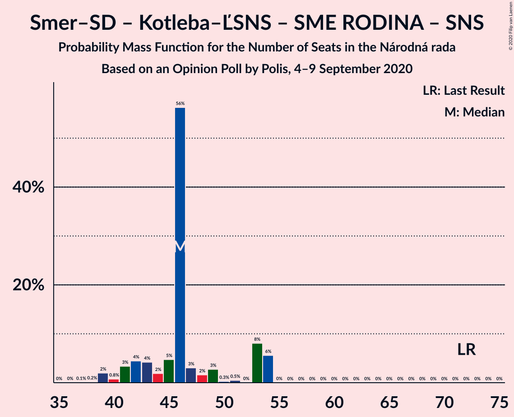
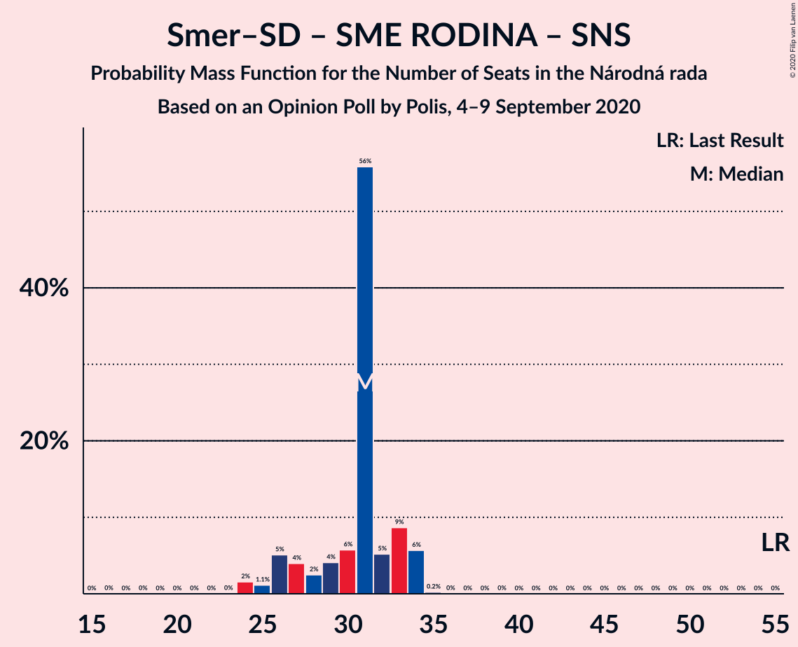

# Opinion Poll by Polis, 4–9 September 2020

<a href="#voting-intentions">Voting Intentions</a> | <a href="#seats">Seats</a> | <a href="#coalitions">Coalitions</a> | <a href="#technical-information">Technical Information</a>

## Voting Intentions

### Confidence Intervals

| Party | Last Result | Poll Result | 80% Confidence Interval | 90% Confidence Interval | 95% Confidence Interval | 99% Confidence Interval |
|:-----:|:-----------:|:-----------:|:-----------------------:|:-----------------------:|:-----------------------:|:-----------------------:|
| OBYČAJNÍ ĽUDIA a nezávislé osobnosti | 25.0% | 20.7% | 19.3–22.3% |18.9–22.7% |18.5–23.1% |17.8–23.8% |
| HLAS–sociálna demokracia | 0.0% | 16.0% | 14.7–17.5% |14.4–17.8% |14.1–18.2% |13.5–18.9% |
| Sloboda a Solidarita | 6.2% | 11.6% | 10.5–12.8% |10.2–13.2% |9.9–13.5% |9.4–14.1% |
| SMER–sociálna demokracia | 18.3% | 8.8% | 7.8–9.9% |7.6–10.2% |7.3–10.5% |6.9–11.1% |
| Kotleba–Ľudová strana Naše Slovensko | 8.0% | 8.5% | 7.5–9.6% |7.3–9.9% |7.0–10.2% |6.6–10.7% |
| SME RODINA | 8.2% | 7.0% | 6.1–8.0% |5.9–8.3% |5.7–8.6% |5.3–9.1% |
| Strana maďarskej koalície–Magyar Koalíció Pártja | 3.9% | 5.5% | 4.7–6.4% |4.5–6.7% |4.4–6.9% |4.0–7.4% |
| Kresťanskodemokratické hnutie | 4.6% | 4.9% | 4.2–5.8% |4.0–6.1% |3.8–6.3% |3.5–6.8% |
| Progresívne Slovensko | 7.0% | 4.8% | 4.1–5.7% |3.9–5.9% |3.7–6.1% |3.4–6.6% |
| Za ľudí | 5.8% | 3.9% | 3.2–4.7% |3.1–4.9% |2.9–5.1% |2.6–5.5% |
| Dobrá voľba | 3.1% | 2.8% | 2.3–3.5% |2.1–3.7% |2.0–3.9% |1.8–4.3% |
| MOST–HÍD | 2.0% | 2.5% | 2.0–3.1% |1.8–3.3% |1.7–3.5% |1.5–3.9% |
| Slovenská národná strana | 3.2% | 1.4% | 1.1–1.9% |0.9–2.1% |0.9–2.2% |0.7–2.5% |

*Note:* The poll result column reflects the actual value used in the calculations. Published results may vary slightly, and in addition be rounded to fewer digits.

## Seats

### Confidence Intervals

| Party | Last Result | Median | 80% Confidence Interval | 90% Confidence Interval | 95% Confidence Interval | 99% Confidence Interval |
|:-----:|:-----------:|:------:|:-----------------------:|:-----------------------:|:-----------------------:|:-----------------------:|
| <a href="#obyčajní-ľudia-a-nezávislé-osobnosti">OBYČAJNÍ ĽUDIA a nezávislé osobnosti</a> | 53 | 39 | 37–41 |36–42 |34–42 |32–44 |
| <a href="#hlas–sociálna-demokracia">HLAS–sociálna demokracia</a> | 0 | 27 | 27–33 |26–34 |26–34 |25–35 |
| <a href="#sloboda-a-solidarita">Sloboda a Solidarita</a> | 13 | 18 | 18–24 |18–25 |18–25 |17–25 |
| <a href="#smer–sociálna-demokracia">SMER–sociálna demokracia</a> | 38 | 17 | 15–17 |14–19 |13–20 |12–21 |
| <a href="#kotleba–ľudová-strana-naše-slovensko">Kotleba–Ľudová strana Naše Slovensko</a> | 17 | 15 | 15–20 |13–20 |13–20 |12–20 |
| <a href="#sme-rodina">SME RODINA</a> | 17 | 14 | 12–16 |11–17 |10–17 |10–17 |
| <a href="#strana-maďarskej-koalície–magyar-koalíció-pártja">Strana maďarskej koalície–Magyar Koalíció Pártja</a> | 0 | 10 | 0–11 |0–11 |0–12 |0–14 |
| <a href="#kresťanskodemokratické-hnutie">Kresťanskodemokratické hnutie</a> | 0 | 0 | 0–9 |0–10 |0–11 |0–12 |
| <a href="#progresívne-slovensko">Progresívne Slovensko</a> | 0 | 10 | 0–10 |0–10 |0–10 |0–11 |
| <a href="#za-ľudí">Za ľudí</a> | 12 | 0 | 0 |0 |0–9 |0–9 |
| <a href="#dobrá-voľba">Dobrá voľba</a> | 0 | 0 | 0 |0 |0 |0 |
| <a href="#most–híd">MOST–HÍD</a> | 0 | 0 | 0 |0 |0 |0 |
| <a href="#slovenská-národná-strana">Slovenská národná strana</a> | 0 | 0 | 0 |0 |0 |0 |

### OBYČAJNÍ ĽUDIA a nezávislé osobnosti

*For a full overview of the results for this party, see the [OBYČAJNÍ ĽUDIA a nezávislé osobnosti](party-obyčajníľudiaanezávisléosobnosti.html) page.*

| Number of Seats | Probability | Accumulated | Special Marks |
|:---------------:|:-----------:|:-----------:|:-------------:|
| 30 | 0.1% | 100% |  |
| 31 | 0.1% | 99.9% |  |
| 32 | 0.7% | 99.8% |  |
| 33 | 0.8% | 99.1% |  |
| 34 | 2% | 98% |  |
| 35 | 1.1% | 96% |  |
| 36 | 2% | 95% |  |
| 37 | 3% | 93% |  |
| 38 | 3% | 90% |  |
| 39 | 70% | 87% | Median |
| 40 | 0.9% | 17% |  |
| 41 | 11% | 16% |  |
| 42 | 3% | 5% |  |
| 43 | 0.4% | 2% |  |
| 44 | 1.5% | 2% |  |
| 45 | 0.2% | 0.2% |  |
| 46 | 0% | 0% |  |
| 47 | 0% | 0% |  |
| 48 | 0% | 0% |  |
| 49 | 0% | 0% |  |
| 50 | 0% | 0% |  |
| 51 | 0% | 0% |  |
| 52 | 0% | 0% |  |
| 53 | 0% | 0% | Last Result |

### HLAS–sociálna demokracia

*For a full overview of the results for this party, see the [HLAS–sociálna demokracia](party-hlas–sociálnademokracia.html) page.*

| Number of Seats | Probability | Accumulated | Special Marks |
|:---------------:|:-----------:|:-----------:|:-------------:|
| 0 | 0% | 100% | Last Result |
| 1 | 0% | 100% |  |
| 2 | 0% | 100% |  |
| 3 | 0% | 100% |  |
| 4 | 0% | 100% |  |
| 5 | 0% | 100% |  |
| 6 | 0% | 100% |  |
| 7 | 0% | 100% |  |
| 8 | 0% | 100% |  |
| 9 | 0% | 100% |  |
| 10 | 0% | 100% |  |
| 11 | 0% | 100% |  |
| 12 | 0% | 100% |  |
| 13 | 0% | 100% |  |
| 14 | 0% | 100% |  |
| 15 | 0% | 100% |  |
| 16 | 0% | 100% |  |
| 17 | 0% | 100% |  |
| 18 | 0% | 100% |  |
| 19 | 0% | 100% |  |
| 20 | 0% | 100% |  |
| 21 | 0% | 100% |  |
| 22 | 0% | 100% |  |
| 23 | 0.2% | 100% |  |
| 24 | 0.2% | 99.8% |  |
| 25 | 0.3% | 99.6% |  |
| 26 | 6% | 99.4% |  |
| 27 | 56% | 93% | Median |
| 28 | 4% | 37% |  |
| 29 | 4% | 34% |  |
| 30 | 11% | 30% |  |
| 31 | 6% | 19% |  |
| 32 | 0.6% | 13% |  |
| 33 | 3% | 12% |  |
| 34 | 8% | 9% |  |
| 35 | 0.6% | 0.9% |  |
| 36 | 0.3% | 0.3% |  |
| 37 | 0.1% | 0.1% |  |
| 38 | 0% | 0% |  |

### Sloboda a Solidarita

*For a full overview of the results for this party, see the [Sloboda a Solidarita](party-slobodaasolidarita.html) page.*

| Number of Seats | Probability | Accumulated | Special Marks |
|:---------------:|:-----------:|:-----------:|:-------------:|
| 13 | 0% | 100% | Last Result |
| 14 | 0% | 100% |  |
| 15 | 0% | 100% |  |
| 16 | 0.1% | 100% |  |
| 17 | 1.0% | 99.9% |  |
| 18 | 58% | 98.8% | Median |
| 19 | 3% | 41% |  |
| 20 | 3% | 38% |  |
| 21 | 7% | 35% |  |
| 22 | 6% | 27% |  |
| 23 | 4% | 21% |  |
| 24 | 9% | 17% |  |
| 25 | 7% | 7% |  |
| 26 | 0.2% | 0.4% |  |
| 27 | 0.3% | 0.3% |  |
| 28 | 0% | 0% |  |

### SMER–sociálna demokracia

*For a full overview of the results for this party, see the [SMER–sociálna demokracia](party-smer–sociálnademokracia.html) page.*

| Number of Seats | Probability | Accumulated | Special Marks |
|:---------------:|:-----------:|:-----------:|:-------------:|
| 12 | 2% | 100% |  |
| 13 | 3% | 98% |  |
| 14 | 3% | 96% |  |
| 15 | 4% | 92% |  |
| 16 | 7% | 88% |  |
| 17 | 73% | 82% | Median |
| 18 | 3% | 9% |  |
| 19 | 2% | 6% |  |
| 20 | 3% | 4% |  |
| 21 | 0.5% | 0.6% |  |
| 22 | 0% | 0% |  |
| 23 | 0% | 0% |  |
| 24 | 0% | 0% |  |
| 25 | 0% | 0% |  |
| 26 | 0% | 0% |  |
| 27 | 0% | 0% |  |
| 28 | 0% | 0% |  |
| 29 | 0% | 0% |  |
| 30 | 0% | 0% |  |
| 31 | 0% | 0% |  |
| 32 | 0% | 0% |  |
| 33 | 0% | 0% |  |
| 34 | 0% | 0% |  |
| 35 | 0% | 0% |  |
| 36 | 0% | 0% |  |
| 37 | 0% | 0% |  |
| 38 | 0% | 0% | Last Result |

### Kotleba–Ľudová strana Naše Slovensko

*For a full overview of the results for this party, see the [Kotleba–Ľudová strana Naše Slovensko](party-kotleba–ľudovástrananašeslovensko.html) page.*

| Number of Seats | Probability | Accumulated | Special Marks |
|:---------------:|:-----------:|:-----------:|:-------------:|
| 11 | 0.1% | 100% |  |
| 12 | 0.9% | 99.9% |  |
| 13 | 5% | 99.0% |  |
| 14 | 2% | 95% |  |
| 15 | 63% | 92% | Median |
| 16 | 8% | 29% |  |
| 17 | 4% | 21% | Last Result |
| 18 | 2% | 17% |  |
| 19 | 0.9% | 15% |  |
| 20 | 14% | 15% |  |
| 21 | 0% | 0.1% |  |
| 22 | 0% | 0% |  |

### SME RODINA

*For a full overview of the results for this party, see the [SME RODINA](party-smerodina.html) page.*

| Number of Seats | Probability | Accumulated | Special Marks |
|:---------------:|:-----------:|:-----------:|:-------------:|
| 0 | 0.1% | 100% |  |
| 1 | 0% | 99.9% |  |
| 2 | 0% | 99.9% |  |
| 3 | 0% | 99.9% |  |
| 4 | 0% | 99.9% |  |
| 5 | 0% | 99.9% |  |
| 6 | 0% | 99.9% |  |
| 7 | 0% | 99.9% |  |
| 8 | 0% | 99.9% |  |
| 9 | 0.4% | 99.9% |  |
| 10 | 4% | 99.6% |  |
| 11 | 4% | 96% |  |
| 12 | 10% | 92% |  |
| 13 | 5% | 82% |  |
| 14 | 60% | 77% | Median |
| 15 | 1.3% | 17% |  |
| 16 | 10% | 15% |  |
| 17 | 6% | 6% | Last Result |
| 18 | 0.1% | 0.1% |  |
| 19 | 0% | 0% |  |

### Strana maďarskej koalície–Magyar Koalíció Pártja

*For a full overview of the results for this party, see the [Strana maďarskej koalície–Magyar Koalíció Pártja](party-stranamaďarskejkoalície–magyarkoalíciópártja.html) page.*

| Number of Seats | Probability | Accumulated | Special Marks |
|:---------------:|:-----------:|:-----------:|:-------------:|
| 0 | 21% | 100% | Last Result |
| 1 | 0% | 79% |  |
| 2 | 0% | 79% |  |
| 3 | 0% | 79% |  |
| 4 | 0% | 79% |  |
| 5 | 0% | 79% |  |
| 6 | 0% | 79% |  |
| 7 | 0% | 79% |  |
| 8 | 0% | 79% |  |
| 9 | 6% | 79% |  |
| 10 | 60% | 73% | Median |
| 11 | 9% | 13% |  |
| 12 | 2% | 4% |  |
| 13 | 2% | 2% |  |
| 14 | 0.6% | 0.7% |  |
| 15 | 0% | 0% |  |

### Kresťanskodemokratické hnutie

*For a full overview of the results for this party, see the [Kresťanskodemokratické hnutie](party-kresťanskodemokratickéhnutie.html) page.*

| Number of Seats | Probability | Accumulated | Special Marks |
|:---------------:|:-----------:|:-----------:|:-------------:|
| 0 | 89% | 100% | Last Result, Median |
| 1 | 0% | 11% |  |
| 2 | 0% | 11% |  |
| 3 | 0% | 11% |  |
| 4 | 0% | 11% |  |
| 5 | 0% | 11% |  |
| 6 | 0% | 11% |  |
| 7 | 0% | 11% |  |
| 8 | 0.1% | 11% |  |
| 9 | 4% | 11% |  |
| 10 | 4% | 8% |  |
| 11 | 2% | 3% |  |
| 12 | 2% | 2% |  |
| 13 | 0.1% | 0.1% |  |
| 14 | 0% | 0% |  |

### Progresívne Slovensko

*For a full overview of the results for this party, see the [Progresívne Slovensko](party-progresívneslovensko.html) page.*

| Number of Seats | Probability | Accumulated | Special Marks |
|:---------------:|:-----------:|:-----------:|:-------------:|
| 0 | 32% | 100% | Last Result |
| 1 | 0% | 68% |  |
| 2 | 0% | 68% |  |
| 3 | 0% | 68% |  |
| 4 | 0% | 68% |  |
| 5 | 0% | 68% |  |
| 6 | 0% | 68% |  |
| 7 | 0% | 68% |  |
| 8 | 0.1% | 68% |  |
| 9 | 7% | 68% |  |
| 10 | 58% | 60% | Median |
| 11 | 2% | 2% |  |
| 12 | 0.2% | 0.3% |  |
| 13 | 0% | 0% |  |

### Za ľudí

*For a full overview of the results for this party, see the [Za ľudí](party-zaľudí.html) page.*

| Number of Seats | Probability | Accumulated | Special Marks |
|:---------------:|:-----------:|:-----------:|:-------------:|
| 0 | 97% | 100% | Median |
| 1 | 0% | 3% |  |
| 2 | 0% | 3% |  |
| 3 | 0% | 3% |  |
| 4 | 0% | 3% |  |
| 5 | 0% | 3% |  |
| 6 | 0% | 3% |  |
| 7 | 0% | 3% |  |
| 8 | 0% | 3% |  |
| 9 | 3% | 3% |  |
| 10 | 0.3% | 0.3% |  |
| 11 | 0% | 0% |  |
| 12 | 0% | 0% | Last Result |

### Dobrá voľba

*For a full overview of the results for this party, see the [Dobrá voľba](party-dobrávoľba.html) page.*

| Number of Seats | Probability | Accumulated | Special Marks |
|:---------------:|:-----------:|:-----------:|:-------------:|
| 0 | 100% | 100% | Last Result, Median |

### MOST–HÍD

*For a full overview of the results for this party, see the [MOST–HÍD](party-most–híd.html) page.*

| Number of Seats | Probability | Accumulated | Special Marks |
|:---------------:|:-----------:|:-----------:|:-------------:|
| 0 | 100% | 100% | Last Result, Median |

### Slovenská národná strana

*For a full overview of the results for this party, see the [Slovenská národná strana](party-slovenskánárodnástrana.html) page.*

| Number of Seats | Probability | Accumulated | Special Marks |
|:---------------:|:-----------:|:-----------:|:-------------:|
| 0 | 100% | 100% | Last Result, Median |

## Coalitions

### Confidence Intervals

| Coalition | Last Result | Median | Majority? | 80% Confidence Interval | 90% Confidence Interval | 95% Confidence Interval | 99% Confidence Interval |
|:---------:|:-----------:|:------:|:---------:|:-----------------------:|:-----------------------:|:-----------------------:|:-----------------------:|
| HLAS–sociálna demokracia – SMER–sociálna demokracia – Kotleba–Ľudová strana Naše Slovensko – SME RODINA – Slovenská národná strana | 72 | 73 | 25% | 71–84 | 68–87 | 68–87 | 66–87 |
| HLAS–sociálna demokracia – Kotleba–Ľudová strana Naše Slovensko – SME RODINA – Slovenská národná strana | 34 | 56 | 0% | 55–67 | 54–70 | 53–70 | 50–70 |
| HLAS–sociálna demokracia – SMER–sociálna demokracia – SME RODINA | 55 | 58 | 0% | 56–64 | 53–67 | 52–67 | 52–67 |
| HLAS–sociálna demokracia – SMER–sociálna demokracia – SME RODINA – Slovenská národná strana | 55 | 58 | 0% | 56–64 | 53–67 | 52–67 | 52–67 |
| SMER–sociálna demokracia – Kotleba–Ľudová strana Naše Slovensko – SME RODINA – Slovenská národná strana | 72 | 46 | 0% | 42–53 | 41–54 | 40–54 | 39–54 |
| HLAS–sociálna demokracia – SMER–sociálna demokracia – MOST–HÍD – Slovenská národná strana | 38 | 44 | 0% | 42–51 | 41–51 | 40–51 | 40–53 |
| HLAS–sociálna demokracia – SMER–sociálna demokracia – Slovenská národná strana | 38 | 44 | 0% | 42–51 | 41–51 | 40–51 | 40–53 |
| HLAS–sociálna demokracia – SME RODINA | 17 | 41 | 0% | 40–47 | 39–50 | 38–50 | 37–50 |
| HLAS–sociálna demokracia – SME RODINA – Slovenská národná strana | 17 | 41 | 0% | 40–47 | 39–50 | 38–50 | 37–50 |
| HLAS–sociálna demokracia – MOST–HÍD – Slovenská národná strana | 0 | 27 | 0% | 27–33 | 26–34 | 26–34 | 25–35 |
| HLAS–sociálna demokracia – Slovenská národná strana | 0 | 27 | 0% | 27–33 | 26–34 | 26–34 | 25–35 |
| SMER–sociálna demokracia – SME RODINA | 55 | 31 | 0% | 27–33 | 26–34 | 25–34 | 24–34 |
| SMER–sociálna demokracia – SME RODINA – Slovenská národná strana | 55 | 31 | 0% | 27–33 | 26–34 | 25–34 | 24–34 |
| SMER–sociálna demokracia – MOST–HÍD – Slovenská národná strana | 38 | 17 | 0% | 15–17 | 14–19 | 13–20 | 12–21 |
| SMER–sociálna demokracia | 38 | 17 | 0% | 15–17 | 14–19 | 13–20 | 12–21 |
| SMER–sociálna demokracia – Slovenská národná strana | 38 | 17 | 0% | 15–17 | 14–19 | 13–20 | 12–21 |

### HLAS–sociálna demokracia – SMER–sociálna demokracia – Kotleba–Ľudová strana Naše Slovensko – SME RODINA – Slovenská národná strana

| Number of Seats | Probability | Accumulated | Special Marks |
|:---------------:|:-----------:|:-----------:|:-------------:|
| 62 | 0% | 100% |  |
| 63 | 0% | 99.9% |  |
| 64 | 0.1% | 99.9% |  |
| 65 | 0.1% | 99.8% |  |
| 66 | 1.0% | 99.7% |  |
| 67 | 0.6% | 98.7% |  |
| 68 | 4% | 98% |  |
| 69 | 2% | 94% |  |
| 70 | 0.9% | 92% |  |
| 71 | 5% | 91% |  |
| 72 | 0.9% | 87% | Last Result |
| 73 | 56% | 86% | Median |
| 74 | 4% | 30% |  |
| 75 | 1.3% | 26% |  |
| 76 | 1.2% | 25% | Majority |
| 77 | 3% | 24% |  |
| 78 | 0.7% | 21% |  |
| 79 | 3% | 20% |  |
| 80 | 2% | 17% |  |
| 81 | 1.3% | 15% |  |
| 82 | 0.1% | 14% |  |
| 83 | 0.1% | 14% |  |
| 84 | 6% | 14% |  |
| 85 | 0% | 8% |  |
| 86 | 0% | 8% |  |
| 87 | 8% | 8% |  |
| 88 | 0% | 0% |  |

### HLAS–sociálna demokracia – Kotleba–Ľudová strana Naše Slovensko – SME RODINA – Slovenská národná strana

| Number of Seats | Probability | Accumulated | Special Marks |
|:---------------:|:-----------:|:-----------:|:-------------:|
| 34 | 0% | 100% | Last Result |
| 35 | 0% | 100% |  |
| 36 | 0% | 100% |  |
| 37 | 0% | 100% |  |
| 38 | 0% | 100% |  |
| 39 | 0% | 100% |  |
| 40 | 0% | 100% |  |
| 41 | 0% | 100% |  |
| 42 | 0% | 100% |  |
| 43 | 0% | 100% |  |
| 44 | 0% | 100% |  |
| 45 | 0% | 100% |  |
| 46 | 0% | 100% |  |
| 47 | 0.1% | 100% |  |
| 48 | 0.1% | 99.9% |  |
| 49 | 0.2% | 99.8% |  |
| 50 | 0.5% | 99.7% |  |
| 51 | 0.9% | 99.2% |  |
| 52 | 0.3% | 98% |  |
| 53 | 2% | 98% |  |
| 54 | 3% | 96% |  |
| 55 | 4% | 94% |  |
| 56 | 57% | 90% | Median |
| 57 | 8% | 33% |  |
| 58 | 1.2% | 25% |  |
| 59 | 3% | 23% |  |
| 60 | 2% | 20% |  |
| 61 | 0.7% | 19% |  |
| 62 | 0.8% | 18% |  |
| 63 | 1.0% | 17% |  |
| 64 | 2% | 16% |  |
| 65 | 0% | 14% |  |
| 66 | 0.1% | 14% |  |
| 67 | 6% | 14% |  |
| 68 | 0.3% | 8% |  |
| 69 | 0% | 8% |  |
| 70 | 8% | 8% |  |
| 71 | 0% | 0% |  |

### HLAS–sociálna demokracia – SMER–sociálna demokracia – SME RODINA

| Number of Seats | Probability | Accumulated | Special Marks |
|:---------------:|:-----------:|:-----------:|:-------------:|
| 47 | 0% | 100% |  |
| 48 | 0% | 99.9% |  |
| 49 | 0% | 99.9% |  |
| 50 | 0.1% | 99.9% |  |
| 51 | 0.2% | 99.8% |  |
| 52 | 4% | 99.6% |  |
| 53 | 1.4% | 96% |  |
| 54 | 2% | 94% |  |
| 55 | 2% | 93% | Last Result |
| 56 | 3% | 91% |  |
| 57 | 1.2% | 88% |  |
| 58 | 59% | 87% | Median |
| 59 | 2% | 27% |  |
| 60 | 3% | 26% |  |
| 61 | 1.2% | 23% |  |
| 62 | 3% | 22% |  |
| 63 | 3% | 19% |  |
| 64 | 6% | 15% |  |
| 65 | 0.3% | 9% |  |
| 66 | 0.5% | 9% |  |
| 67 | 8% | 8% |  |
| 68 | 0% | 0.1% |  |
| 69 | 0% | 0.1% |  |
| 70 | 0% | 0% |  |

### HLAS–sociálna demokracia – SMER–sociálna demokracia – SME RODINA – Slovenská národná strana

| Number of Seats | Probability | Accumulated | Special Marks |
|:---------------:|:-----------:|:-----------:|:-------------:|
| 47 | 0% | 100% |  |
| 48 | 0% | 99.9% |  |
| 49 | 0% | 99.9% |  |
| 50 | 0.1% | 99.9% |  |
| 51 | 0.2% | 99.8% |  |
| 52 | 4% | 99.6% |  |
| 53 | 1.4% | 96% |  |
| 54 | 2% | 94% |  |
| 55 | 2% | 93% | Last Result |
| 56 | 3% | 91% |  |
| 57 | 1.2% | 88% |  |
| 58 | 59% | 87% | Median |
| 59 | 2% | 27% |  |
| 60 | 3% | 26% |  |
| 61 | 1.2% | 23% |  |
| 62 | 3% | 22% |  |
| 63 | 3% | 19% |  |
| 64 | 6% | 15% |  |
| 65 | 0.3% | 9% |  |
| 66 | 0.5% | 9% |  |
| 67 | 8% | 8% |  |
| 68 | 0% | 0.1% |  |
| 69 | 0% | 0.1% |  |
| 70 | 0% | 0% |  |

### SMER–sociálna demokracia – Kotleba–Ľudová strana Naše Slovensko – SME RODINA – Slovenská národná strana

| Number of Seats | Probability | Accumulated | Special Marks |
|:---------------:|:-----------:|:-----------:|:-------------:|
| 35 | 0% | 100% |  |
| 36 | 0% | 99.9% |  |
| 37 | 0.1% | 99.9% |  |
| 38 | 0.2% | 99.8% |  |
| 39 | 2% | 99.6% |  |
| 40 | 0.8% | 98% |  |
| 41 | 3% | 97% |  |
| 42 | 4% | 94% |  |
| 43 | 4% | 89% |  |
| 44 | 2% | 85% |  |
| 45 | 5% | 83% |  |
| 46 | 56% | 78% | Median |
| 47 | 3% | 22% |  |
| 48 | 2% | 19% |  |
| 49 | 3% | 17% |  |
| 50 | 0.3% | 15% |  |
| 51 | 0.5% | 14% |  |
| 52 | 0% | 14% |  |
| 53 | 8% | 14% |  |
| 54 | 6% | 6% |  |
| 55 | 0% | 0% |  |
| 56 | 0% | 0% |  |
| 57 | 0% | 0% |  |
| 58 | 0% | 0% |  |
| 59 | 0% | 0% |  |
| 60 | 0% | 0% |  |
| 61 | 0% | 0% |  |
| 62 | 0% | 0% |  |
| 63 | 0% | 0% |  |
| 64 | 0% | 0% |  |
| 65 | 0% | 0% |  |
| 66 | 0% | 0% |  |
| 67 | 0% | 0% |  |
| 68 | 0% | 0% |  |
| 69 | 0% | 0% |  |
| 70 | 0% | 0% |  |
| 71 | 0% | 0% |  |
| 72 | 0% | 0% | Last Result |

### HLAS–sociálna demokracia – SMER–sociálna demokracia – MOST–HÍD – Slovenská národná strana

| Number of Seats | Probability | Accumulated | Special Marks |
|:---------------:|:-----------:|:-----------:|:-------------:|
| 38 | 0.1% | 100% | Last Result |
| 39 | 0.2% | 99.9% |  |
| 40 | 4% | 99.7% |  |
| 41 | 1.2% | 96% |  |
| 42 | 5% | 95% |  |
| 43 | 2% | 89% |  |
| 44 | 55% | 88% | Median |
| 45 | 2% | 32% |  |
| 46 | 1.1% | 30% |  |
| 47 | 9% | 29% |  |
| 48 | 3% | 20% |  |
| 49 | 1.5% | 16% |  |
| 50 | 3% | 15% |  |
| 51 | 10% | 11% |  |
| 52 | 1.1% | 2% |  |
| 53 | 0.3% | 0.7% |  |
| 54 | 0.4% | 0.5% |  |
| 55 | 0% | 0% |  |

### HLAS–sociálna demokracia – SMER–sociálna demokracia – Slovenská národná strana

| Number of Seats | Probability | Accumulated | Special Marks |
|:---------------:|:-----------:|:-----------:|:-------------:|
| 38 | 0.1% | 100% | Last Result |
| 39 | 0.2% | 99.9% |  |
| 40 | 4% | 99.7% |  |
| 41 | 1.2% | 96% |  |
| 42 | 5% | 95% |  |
| 43 | 2% | 89% |  |
| 44 | 55% | 88% | Median |
| 45 | 2% | 32% |  |
| 46 | 1.1% | 30% |  |
| 47 | 9% | 29% |  |
| 48 | 3% | 20% |  |
| 49 | 1.5% | 16% |  |
| 50 | 3% | 15% |  |
| 51 | 10% | 11% |  |
| 52 | 1.1% | 2% |  |
| 53 | 0.3% | 0.7% |  |
| 54 | 0.4% | 0.5% |  |
| 55 | 0% | 0% |  |

### HLAS–sociálna demokracia – SME RODINA

| Number of Seats | Probability | Accumulated | Special Marks |
|:---------------:|:-----------:|:-----------:|:-------------:|
| 17 | 0% | 100% | Last Result |
| 18 | 0% | 100% |  |
| 19 | 0% | 100% |  |
| 20 | 0% | 100% |  |
| 21 | 0% | 100% |  |
| 22 | 0% | 100% |  |
| 23 | 0% | 100% |  |
| 24 | 0% | 100% |  |
| 25 | 0% | 100% |  |
| 26 | 0% | 100% |  |
| 27 | 0% | 100% |  |
| 28 | 0% | 100% |  |
| 29 | 0% | 100% |  |
| 30 | 0% | 100% |  |
| 31 | 0% | 100% |  |
| 32 | 0% | 100% |  |
| 33 | 0% | 100% |  |
| 34 | 0.1% | 99.9% |  |
| 35 | 0.1% | 99.8% |  |
| 36 | 0.2% | 99.8% |  |
| 37 | 0.5% | 99.6% |  |
| 38 | 4% | 99.1% |  |
| 39 | 0.9% | 95% |  |
| 40 | 5% | 94% |  |
| 41 | 60% | 89% | Median |
| 42 | 5% | 29% |  |
| 43 | 2% | 24% |  |
| 44 | 4% | 22% |  |
| 45 | 1.5% | 18% |  |
| 46 | 0.3% | 17% |  |
| 47 | 7% | 16% |  |
| 48 | 0.2% | 9% |  |
| 49 | 0.3% | 9% |  |
| 50 | 8% | 9% |  |
| 51 | 0.3% | 0.4% |  |
| 52 | 0% | 0% |  |

### HLAS–sociálna demokracia – SME RODINA – Slovenská národná strana

| Number of Seats | Probability | Accumulated | Special Marks |
|:---------------:|:-----------:|:-----------:|:-------------:|
| 17 | 0% | 100% | Last Result |
| 18 | 0% | 100% |  |
| 19 | 0% | 100% |  |
| 20 | 0% | 100% |  |
| 21 | 0% | 100% |  |
| 22 | 0% | 100% |  |
| 23 | 0% | 100% |  |
| 24 | 0% | 100% |  |
| 25 | 0% | 100% |  |
| 26 | 0% | 100% |  |
| 27 | 0% | 100% |  |
| 28 | 0% | 100% |  |
| 29 | 0% | 100% |  |
| 30 | 0% | 100% |  |
| 31 | 0% | 100% |  |
| 32 | 0% | 100% |  |
| 33 | 0% | 100% |  |
| 34 | 0.1% | 99.9% |  |
| 35 | 0.1% | 99.8% |  |
| 36 | 0.2% | 99.8% |  |
| 37 | 0.5% | 99.6% |  |
| 38 | 4% | 99.1% |  |
| 39 | 0.9% | 95% |  |
| 40 | 5% | 94% |  |
| 41 | 60% | 89% | Median |
| 42 | 5% | 29% |  |
| 43 | 2% | 24% |  |
| 44 | 4% | 22% |  |
| 45 | 1.5% | 18% |  |
| 46 | 0.3% | 17% |  |
| 47 | 7% | 16% |  |
| 48 | 0.2% | 9% |  |
| 49 | 0.3% | 9% |  |
| 50 | 8% | 9% |  |
| 51 | 0.3% | 0.4% |  |
| 52 | 0% | 0% |  |

### HLAS–sociálna demokracia – MOST–HÍD – Slovenská národná strana

| Number of Seats | Probability | Accumulated | Special Marks |
|:---------------:|:-----------:|:-----------:|:-------------:|
| 0 | 0% | 100% | Last Result |
| 1 | 0% | 100% |  |
| 2 | 0% | 100% |  |
| 3 | 0% | 100% |  |
| 4 | 0% | 100% |  |
| 5 | 0% | 100% |  |
| 6 | 0% | 100% |  |
| 7 | 0% | 100% |  |
| 8 | 0% | 100% |  |
| 9 | 0% | 100% |  |
| 10 | 0% | 100% |  |
| 11 | 0% | 100% |  |
| 12 | 0% | 100% |  |
| 13 | 0% | 100% |  |
| 14 | 0% | 100% |  |
| 15 | 0% | 100% |  |
| 16 | 0% | 100% |  |
| 17 | 0% | 100% |  |
| 18 | 0% | 100% |  |
| 19 | 0% | 100% |  |
| 20 | 0% | 100% |  |
| 21 | 0% | 100% |  |
| 22 | 0% | 100% |  |
| 23 | 0.2% | 100% |  |
| 24 | 0.2% | 99.8% |  |
| 25 | 0.3% | 99.6% |  |
| 26 | 6% | 99.4% |  |
| 27 | 56% | 93% | Median |
| 28 | 4% | 37% |  |
| 29 | 4% | 34% |  |
| 30 | 11% | 30% |  |
| 31 | 6% | 19% |  |
| 32 | 0.6% | 13% |  |
| 33 | 3% | 12% |  |
| 34 | 8% | 9% |  |
| 35 | 0.6% | 0.9% |  |
| 36 | 0.3% | 0.3% |  |
| 37 | 0.1% | 0.1% |  |
| 38 | 0% | 0% |  |

### HLAS–sociálna demokracia – Slovenská národná strana

| Number of Seats | Probability | Accumulated | Special Marks |
|:---------------:|:-----------:|:-----------:|:-------------:|
| 0 | 0% | 100% | Last Result |
| 1 | 0% | 100% |  |
| 2 | 0% | 100% |  |
| 3 | 0% | 100% |  |
| 4 | 0% | 100% |  |
| 5 | 0% | 100% |  |
| 6 | 0% | 100% |  |
| 7 | 0% | 100% |  |
| 8 | 0% | 100% |  |
| 9 | 0% | 100% |  |
| 10 | 0% | 100% |  |
| 11 | 0% | 100% |  |
| 12 | 0% | 100% |  |
| 13 | 0% | 100% |  |
| 14 | 0% | 100% |  |
| 15 | 0% | 100% |  |
| 16 | 0% | 100% |  |
| 17 | 0% | 100% |  |
| 18 | 0% | 100% |  |
| 19 | 0% | 100% |  |
| 20 | 0% | 100% |  |
| 21 | 0% | 100% |  |
| 22 | 0% | 100% |  |
| 23 | 0.2% | 100% |  |
| 24 | 0.2% | 99.8% |  |
| 25 | 0.3% | 99.6% |  |
| 26 | 6% | 99.4% |  |
| 27 | 56% | 93% | Median |
| 28 | 4% | 37% |  |
| 29 | 4% | 34% |  |
| 30 | 11% | 30% |  |
| 31 | 6% | 19% |  |
| 32 | 0.6% | 13% |  |
| 33 | 3% | 12% |  |
| 34 | 8% | 9% |  |
| 35 | 0.6% | 0.9% |  |
| 36 | 0.3% | 0.3% |  |
| 37 | 0.1% | 0.1% |  |
| 38 | 0% | 0% |  |

### SMER–sociálna demokracia – SME RODINA

| Number of Seats | Probability | Accumulated | Special Marks |
|:---------------:|:-----------:|:-----------:|:-------------:|
| 18 | 0% | 100% |  |
| 19 | 0% | 99.9% |  |
| 20 | 0% | 99.9% |  |
| 21 | 0% | 99.9% |  |
| 22 | 0% | 99.9% |  |
| 23 | 0% | 99.9% |  |
| 24 | 2% | 99.9% |  |
| 25 | 1.1% | 98% |  |
| 26 | 5% | 97% |  |
| 27 | 4% | 92% |  |
| 28 | 2% | 88% |  |
| 29 | 4% | 86% |  |
| 30 | 6% | 81% |  |
| 31 | 56% | 76% | Median |
| 32 | 5% | 20% |  |
| 33 | 9% | 15% |  |
| 34 | 6% | 6% |  |
| 35 | 0.2% | 0.3% |  |
| 36 | 0% | 0.1% |  |
| 37 | 0% | 0% |  |
| 38 | 0% | 0% |  |
| 39 | 0% | 0% |  |
| 40 | 0% | 0% |  |
| 41 | 0% | 0% |  |
| 42 | 0% | 0% |  |
| 43 | 0% | 0% |  |
| 44 | 0% | 0% |  |
| 45 | 0% | 0% |  |
| 46 | 0% | 0% |  |
| 47 | 0% | 0% |  |
| 48 | 0% | 0% |  |
| 49 | 0% | 0% |  |
| 50 | 0% | 0% |  |
| 51 | 0% | 0% |  |
| 52 | 0% | 0% |  |
| 53 | 0% | 0% |  |
| 54 | 0% | 0% |  |
| 55 | 0% | 0% | Last Result |

### SMER–sociálna demokracia – SME RODINA – Slovenská národná strana

| Number of Seats | Probability | Accumulated | Special Marks |
|:---------------:|:-----------:|:-----------:|:-------------:|
| 18 | 0% | 100% |  |
| 19 | 0% | 99.9% |  |
| 20 | 0% | 99.9% |  |
| 21 | 0% | 99.9% |  |
| 22 | 0% | 99.9% |  |
| 23 | 0% | 99.9% |  |
| 24 | 2% | 99.9% |  |
| 25 | 1.1% | 98% |  |
| 26 | 5% | 97% |  |
| 27 | 4% | 92% |  |
| 28 | 2% | 88% |  |
| 29 | 4% | 86% |  |
| 30 | 6% | 81% |  |
| 31 | 56% | 76% | Median |
| 32 | 5% | 20% |  |
| 33 | 9% | 15% |  |
| 34 | 6% | 6% |  |
| 35 | 0.2% | 0.3% |  |
| 36 | 0% | 0.1% |  |
| 37 | 0% | 0% |  |
| 38 | 0% | 0% |  |
| 39 | 0% | 0% |  |
| 40 | 0% | 0% |  |
| 41 | 0% | 0% |  |
| 42 | 0% | 0% |  |
| 43 | 0% | 0% |  |
| 44 | 0% | 0% |  |
| 45 | 0% | 0% |  |
| 46 | 0% | 0% |  |
| 47 | 0% | 0% |  |
| 48 | 0% | 0% |  |
| 49 | 0% | 0% |  |
| 50 | 0% | 0% |  |
| 51 | 0% | 0% |  |
| 52 | 0% | 0% |  |
| 53 | 0% | 0% |  |
| 54 | 0% | 0% |  |
| 55 | 0% | 0% | Last Result |

### SMER–sociálna demokracia – MOST–HÍD – Slovenská národná strana

| Number of Seats | Probability | Accumulated | Special Marks |
|:---------------:|:-----------:|:-----------:|:-------------:|
| 12 | 2% | 100% |  |
| 13 | 3% | 98% |  |
| 14 | 3% | 96% |  |
| 15 | 4% | 92% |  |
| 16 | 7% | 88% |  |
| 17 | 73% | 82% | Median |
| 18 | 3% | 9% |  |
| 19 | 2% | 6% |  |
| 20 | 3% | 4% |  |
| 21 | 0.5% | 0.6% |  |
| 22 | 0% | 0% |  |
| 23 | 0% | 0% |  |
| 24 | 0% | 0% |  |
| 25 | 0% | 0% |  |
| 26 | 0% | 0% |  |
| 27 | 0% | 0% |  |
| 28 | 0% | 0% |  |
| 29 | 0% | 0% |  |
| 30 | 0% | 0% |  |
| 31 | 0% | 0% |  |
| 32 | 0% | 0% |  |
| 33 | 0% | 0% |  |
| 34 | 0% | 0% |  |
| 35 | 0% | 0% |  |
| 36 | 0% | 0% |  |
| 37 | 0% | 0% |  |
| 38 | 0% | 0% | Last Result |

### SMER–sociálna demokracia

| Number of Seats | Probability | Accumulated | Special Marks |
|:---------------:|:-----------:|:-----------:|:-------------:|
| 12 | 2% | 100% |  |
| 13 | 3% | 98% |  |
| 14 | 3% | 96% |  |
| 15 | 4% | 92% |  |
| 16 | 7% | 88% |  |
| 17 | 73% | 82% | Median |
| 18 | 3% | 9% |  |
| 19 | 2% | 6% |  |
| 20 | 3% | 4% |  |
| 21 | 0.5% | 0.6% |  |
| 22 | 0% | 0% |  |
| 23 | 0% | 0% |  |
| 24 | 0% | 0% |  |
| 25 | 0% | 0% |  |
| 26 | 0% | 0% |  |
| 27 | 0% | 0% |  |
| 28 | 0% | 0% |  |
| 29 | 0% | 0% |  |
| 30 | 0% | 0% |  |
| 31 | 0% | 0% |  |
| 32 | 0% | 0% |  |
| 33 | 0% | 0% |  |
| 34 | 0% | 0% |  |
| 35 | 0% | 0% |  |
| 36 | 0% | 0% |  |
| 37 | 0% | 0% |  |
| 38 | 0% | 0% | Last Result |

### SMER–sociálna demokracia – Slovenská národná strana

| Number of Seats | Probability | Accumulated | Special Marks |
|:---------------:|:-----------:|:-----------:|:-------------:|
| 12 | 2% | 100% |  |
| 13 | 3% | 98% |  |
| 14 | 3% | 96% |  |
| 15 | 4% | 92% |  |
| 16 | 7% | 88% |  |
| 17 | 73% | 82% | Median |
| 18 | 3% | 9% |  |
| 19 | 2% | 6% |  |
| 20 | 3% | 4% |  |
| 21 | 0.5% | 0.6% |  |
| 22 | 0% | 0% |  |
| 23 | 0% | 0% |  |
| 24 | 0% | 0% |  |
| 25 | 0% | 0% |  |
| 26 | 0% | 0% |  |
| 27 | 0% | 0% |  |
| 28 | 0% | 0% |  |
| 29 | 0% | 0% |  |
| 30 | 0% | 0% |  |
| 31 | 0% | 0% |  |
| 32 | 0% | 0% |  |
| 33 | 0% | 0% |  |
| 34 | 0% | 0% |  |
| 35 | 0% | 0% |  |
| 36 | 0% | 0% |  |
| 37 | 0% | 0% |  |
| 38 | 0% | 0% | Last Result |

## Technical Information

### Opinion Poll

+ **Polling firm:** Polis
+ **Commissioner(s):** —
+ **Fieldwork period:** 4–9 September 2020

### Calculations

+ **Sample size:** 1217
+ **Simulations done:** 1,048,576
+ **Error estimate:** 2.45%

