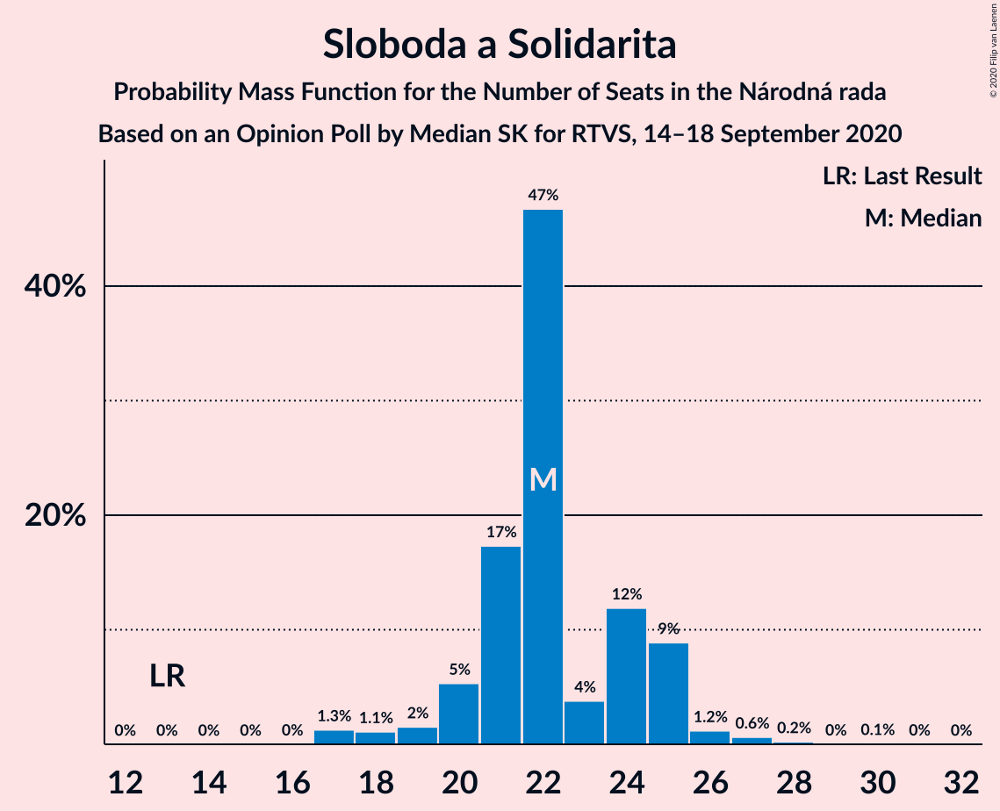
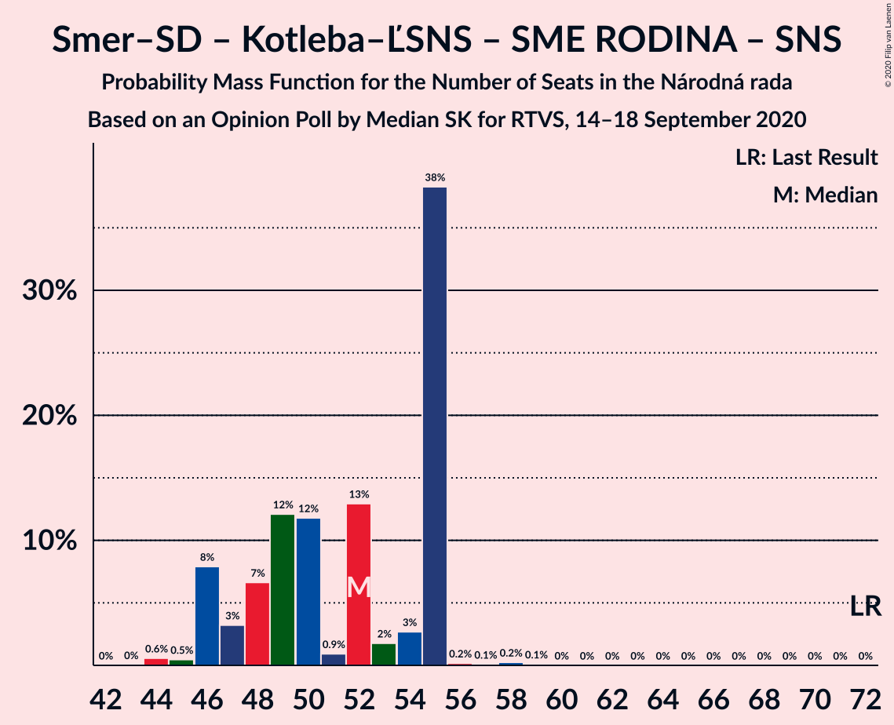
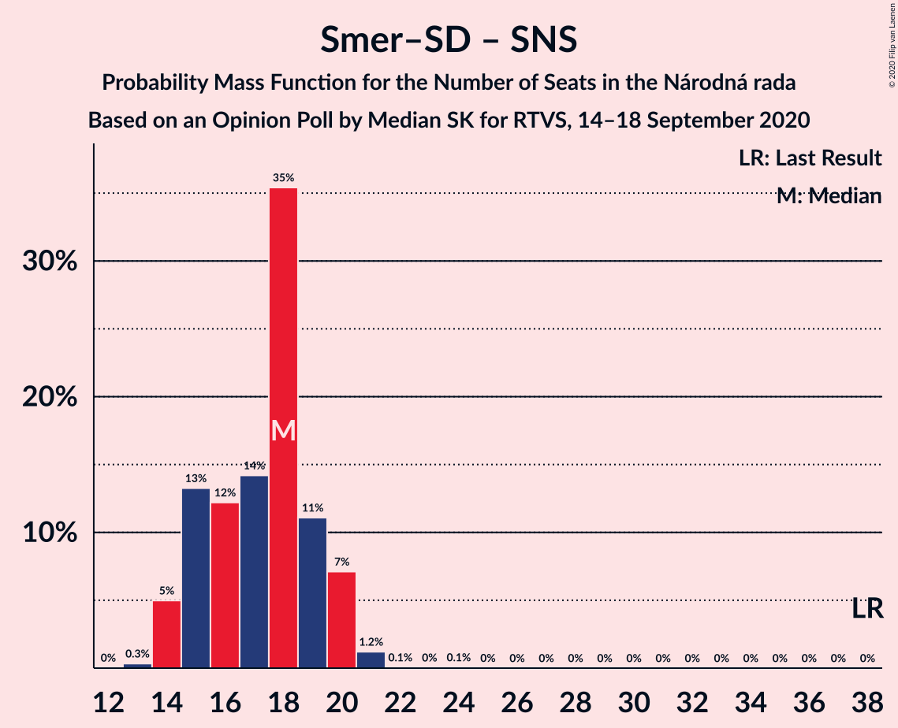

# Opinion Poll by Median SK for RTVS, 14–18 September 2020

<a href="#voting-intentions">Voting Intentions</a> | <a href="#seats">Seats</a> | <a href="#coalitions">Coalitions</a> | <a href="#technical-information">Technical Information</a>

## Voting Intentions

### Confidence Intervals

| Party | Last Result | Poll Result | 80% Confidence Interval | 90% Confidence Interval | 95% Confidence Interval | 99% Confidence Interval |
|:-----:|:-----------:|:-----------:|:-----------------------:|:-----------------------:|:-----------------------:|:-----------------------:|
| OBYČAJNÍ ĽUDIA a nezávislé osobnosti | 25.0% | 17.0% | 15.5–18.6% |15.1–19.0% |14.8–19.4% |14.1–20.2% |
| HLAS–sociálna demokracia | 0.0% | 16.9% | 15.4–18.5% |15.0–18.9% |14.7–19.3% |14.0–20.1% |
| Sloboda a Solidarita | 6.2% | 11.9% | 10.7–13.3% |10.3–13.7% |10.1–14.1% |9.5–14.8% |
| SMER–sociálna demokracia | 18.3% | 9.1% | 8.1–10.4% |7.8–10.8% |7.5–11.1% |7.0–11.7% |
| Kotleba–Ľudová strana Naše Slovensko | 8.0% | 8.8% | 7.8–10.1% |7.5–10.4% |7.2–10.8% |6.8–11.4% |
| SME RODINA | 8.2% | 8.7% | 7.7–10.0% |7.4–10.3% |7.1–10.7% |6.7–11.3% |
| Progresívne Slovensko | 7.0% | 6.6% | 5.7–7.7% |5.4–8.0% |5.2–8.3% |4.8–8.8% |
| Kresťanskodemokratické hnutie | 4.6% | 4.2% | 3.5–5.1% |3.3–5.4% |3.1–5.6% |2.8–6.1% |
| Za ľudí | 5.8% | 3.4% | 2.7–4.2% |2.6–4.5% |2.4–4.7% |2.1–5.1% |
| Slovenská národná strana | 3.2% | 2.5% | 2.0–3.2% |1.8–3.5% |1.7–3.6% |1.5–4.0% |
| VLASŤ | 2.9% | 2.5% | 2.0–3.2% |1.8–3.5% |1.7–3.6% |1.5–4.0% |
| Strana maďarskej koalície–Magyar Koalíció Pártja | 3.9% | 2.3% | 1.8–3.0% |1.6–3.2% |1.5–3.4% |1.3–3.8% |
| Dobrá voľba | 3.1% | 1.8% | 1.4–2.5% |1.2–2.6% |1.1–2.8% |1.0–3.2% |
| SPOLU–Občianska Demokracia | 7.0% | 1.3% | 0.9–1.9% |0.8–2.1% |0.7–2.2% |0.6–2.5% |

*Note:* The poll result column reflects the actual value used in the calculations. Published results may vary slightly, and in addition be rounded to fewer digits.

## Seats

### Confidence Intervals

| Party | Last Result | Median | 80% Confidence Interval | 90% Confidence Interval | 95% Confidence Interval | 99% Confidence Interval |
|:-----:|:-----------:|:------:|:-----------------------:|:-----------------------:|:-----------------------:|:-----------------------:|
| <a href="#obyčajní-ľudia-a-nezávislé-osobnosti">OBYČAJNÍ ĽUDIA a nezávislé osobnosti</a> | 53 | 31 | 28–34 |28–36 |28–39 |27–39 |
| <a href="#hlas–sociálna-demokracia">HLAS–sociálna demokracia</a> | 0 | 31 | 28–35 |28–35 |26–35 |26–36 |
| <a href="#sloboda-a-solidarita">Sloboda a Solidarita</a> | 13 | 22 | 21–25 |20–25 |19–25 |17–27 |
| <a href="#smer–sociálna-demokracia">SMER–sociálna demokracia</a> | 38 | 18 | 15–19 |14–20 |14–20 |14–21 |
| <a href="#kotleba–ľudová-strana-naše-slovensko">Kotleba–Ľudová strana Naše Slovensko</a> | 17 | 18 | 15–18 |14–19 |14–19 |13–21 |
| <a href="#sme-rodina">SME RODINA</a> | 17 | 17 | 14–19 |14–19 |13–20 |12–20 |
| <a href="#progresívne-slovensko">Progresívne Slovensko</a> | 0 | 12 | 11–17 |11–17 |10–17 |0–17 |
| <a href="#kresťanskodemokratické-hnutie">Kresťanskodemokratické hnutie</a> | 0 | 0 | 0–10 |0–11 |0–11 |0–11 |
| <a href="#za-ľudí">Za ľudí</a> | 12 | 0 | 0 |0 |0 |0 |
| <a href="#slovenská-národná-strana">Slovenská národná strana</a> | 0 | 0 | 0 |0 |0 |0 |
| <a href="#vlasť">VLASŤ</a> | 0 | 0 | 0 |0 |0 |0 |
| <a href="#strana-maďarskej-koalície–magyar-koalíció-pártja">Strana maďarskej koalície–Magyar Koalíció Pártja</a> | 0 | 0 | 0 |0 |0 |0 |
| <a href="#dobrá-voľba">Dobrá voľba</a> | 0 | 0 | 0 |0 |0 |0 |
| <a href="#spolu–občianska-demokracia">SPOLU–Občianska Demokracia</a> | 0 | 0 | 0 |0 |0 |0 |

### OBYČAJNÍ ĽUDIA a nezávislé osobnosti

*For a full overview of the results for this party, see the [OBYČAJNÍ ĽUDIA a nezávislé osobnosti](party-obyčajníľudiaanezávisléosobnosti.html) page.*

| Number of Seats | Probability | Accumulated | Special Marks |
|:---------------:|:-----------:|:-----------:|:-------------:|
| 25 | 0.1% | 100% |  |
| 26 | 0.2% | 99.9% |  |
| 27 | 2% | 99.7% |  |
| 28 | 16% | 98% |  |
| 29 | 6% | 82% |  |
| 30 | 5% | 76% |  |
| 31 | 45% | 71% | Median |
| 32 | 0.9% | 26% |  |
| 33 | 14% | 25% |  |
| 34 | 3% | 12% |  |
| 35 | 0.9% | 9% |  |
| 36 | 5% | 8% |  |
| 37 | 0.3% | 3% |  |
| 38 | 0.1% | 3% |  |
| 39 | 2% | 3% |  |
| 40 | 0% | 0.3% |  |
| 41 | 0% | 0.3% |  |
| 42 | 0.2% | 0.3% |  |
| 43 | 0% | 0% |  |
| 44 | 0% | 0% |  |
| 45 | 0% | 0% |  |
| 46 | 0% | 0% |  |
| 47 | 0% | 0% |  |
| 48 | 0% | 0% |  |
| 49 | 0% | 0% |  |
| 50 | 0% | 0% |  |
| 51 | 0% | 0% |  |
| 52 | 0% | 0% |  |
| 53 | 0% | 0% | Last Result |

### HLAS–sociálna demokracia

*For a full overview of the results for this party, see the [HLAS–sociálna demokracia](party-hlas–sociálnademokracia.html) page.*

| Number of Seats | Probability | Accumulated | Special Marks |
|:---------------:|:-----------:|:-----------:|:-------------:|
| 0 | 0% | 100% | Last Result |
| 1 | 0% | 100% |  |
| 2 | 0% | 100% |  |
| 3 | 0% | 100% |  |
| 4 | 0% | 100% |  |
| 5 | 0% | 100% |  |
| 6 | 0% | 100% |  |
| 7 | 0% | 100% |  |
| 8 | 0% | 100% |  |
| 9 | 0% | 100% |  |
| 10 | 0% | 100% |  |
| 11 | 0% | 100% |  |
| 12 | 0% | 100% |  |
| 13 | 0% | 100% |  |
| 14 | 0% | 100% |  |
| 15 | 0% | 100% |  |
| 16 | 0% | 100% |  |
| 17 | 0% | 100% |  |
| 18 | 0% | 100% |  |
| 19 | 0% | 100% |  |
| 20 | 0% | 100% |  |
| 21 | 0% | 100% |  |
| 22 | 0% | 100% |  |
| 23 | 0% | 100% |  |
| 24 | 0% | 100% |  |
| 25 | 0.3% | 100% |  |
| 26 | 2% | 99.6% |  |
| 27 | 0.5% | 97% |  |
| 28 | 8% | 97% |  |
| 29 | 2% | 89% |  |
| 30 | 24% | 87% |  |
| 31 | 45% | 62% | Median |
| 32 | 3% | 17% |  |
| 33 | 0.8% | 14% |  |
| 34 | 3% | 14% |  |
| 35 | 9% | 10% |  |
| 36 | 1.1% | 1.4% |  |
| 37 | 0.1% | 0.4% |  |
| 38 | 0% | 0.2% |  |
| 39 | 0% | 0.2% |  |
| 40 | 0.1% | 0.2% |  |
| 41 | 0% | 0% |  |

### Sloboda a Solidarita

*For a full overview of the results for this party, see the [Sloboda a Solidarita](party-slobodaasolidarita.html) page.*

| Number of Seats | Probability | Accumulated | Special Marks |
|:---------------:|:-----------:|:-----------:|:-------------:|
| 13 | 0% | 100% | Last Result |
| 14 | 0% | 100% |  |
| 15 | 0% | 100% |  |
| 16 | 0% | 100% |  |
| 17 | 1.3% | 100% |  |
| 18 | 1.1% | 98.7% |  |
| 19 | 2% | 98% |  |
| 20 | 5% | 96% |  |
| 21 | 17% | 91% |  |
| 22 | 47% | 73% | Median |
| 23 | 4% | 27% |  |
| 24 | 12% | 23% |  |
| 25 | 9% | 11% |  |
| 26 | 1.2% | 2% |  |
| 27 | 0.6% | 1.0% |  |
| 28 | 0.2% | 0.3% |  |
| 29 | 0% | 0.1% |  |
| 30 | 0.1% | 0.1% |  |
| 31 | 0% | 0% |  |

### SMER–sociálna demokracia

*For a full overview of the results for this party, see the [SMER–sociálna demokracia](party-smer–sociálnademokracia.html) page.*

| Number of Seats | Probability | Accumulated | Special Marks |
|:---------------:|:-----------:|:-----------:|:-------------:|
| 13 | 0.3% | 100% |  |
| 14 | 5% | 99.6% |  |
| 15 | 13% | 95% |  |
| 16 | 12% | 81% |  |
| 17 | 14% | 69% |  |
| 18 | 35% | 55% | Median |
| 19 | 11% | 20% |  |
| 20 | 7% | 8% |  |
| 21 | 1.2% | 1.4% |  |
| 22 | 0.1% | 0.2% |  |
| 23 | 0% | 0.1% |  |
| 24 | 0.1% | 0.1% |  |
| 25 | 0% | 0% |  |
| 26 | 0% | 0% |  |
| 27 | 0% | 0% |  |
| 28 | 0% | 0% |  |
| 29 | 0% | 0% |  |
| 30 | 0% | 0% |  |
| 31 | 0% | 0% |  |
| 32 | 0% | 0% |  |
| 33 | 0% | 0% |  |
| 34 | 0% | 0% |  |
| 35 | 0% | 0% |  |
| 36 | 0% | 0% |  |
| 37 | 0% | 0% |  |
| 38 | 0% | 0% | Last Result |

### Kotleba–Ľudová strana Naše Slovensko

*For a full overview of the results for this party, see the [Kotleba–Ľudová strana Naše Slovensko](party-kotleba–ľudovástrananašeslovensko.html) page.*

| Number of Seats | Probability | Accumulated | Special Marks |
|:---------------:|:-----------:|:-----------:|:-------------:|
| 12 | 0.1% | 100% |  |
| 13 | 2% | 99.8% |  |
| 14 | 5% | 98% |  |
| 15 | 5% | 93% |  |
| 16 | 3% | 89% |  |
| 17 | 34% | 85% | Last Result |
| 18 | 42% | 51% | Median |
| 19 | 8% | 9% |  |
| 20 | 0.7% | 1.3% |  |
| 21 | 0.5% | 0.6% |  |
| 22 | 0% | 0.1% |  |
| 23 | 0% | 0% |  |

### SME RODINA

*For a full overview of the results for this party, see the [SME RODINA](party-smerodina.html) page.*

| Number of Seats | Probability | Accumulated | Special Marks |
|:---------------:|:-----------:|:-----------:|:-------------:|
| 12 | 2% | 100% |  |
| 13 | 0.7% | 98% |  |
| 14 | 10% | 97% |  |
| 15 | 13% | 88% |  |
| 16 | 12% | 75% |  |
| 17 | 18% | 63% | Last Result, Median |
| 18 | 6% | 45% |  |
| 19 | 37% | 39% |  |
| 20 | 2% | 3% |  |
| 21 | 0.1% | 0.4% |  |
| 22 | 0.3% | 0.3% |  |
| 23 | 0% | 0% |  |

### Progresívne Slovensko

*For a full overview of the results for this party, see the [Progresívne Slovensko](party-progresívneslovensko.html) page.*

| Number of Seats | Probability | Accumulated | Special Marks |
|:---------------:|:-----------:|:-----------:|:-------------:|
| 0 | 1.1% | 100% | Last Result |
| 1 | 0% | 98.9% |  |
| 2 | 0% | 98.9% |  |
| 3 | 0% | 98.9% |  |
| 4 | 0% | 98.9% |  |
| 5 | 0% | 98.9% |  |
| 6 | 0% | 98.9% |  |
| 7 | 0% | 98.9% |  |
| 8 | 0% | 98.9% |  |
| 9 | 0.1% | 98.9% |  |
| 10 | 2% | 98.8% |  |
| 11 | 45% | 97% |  |
| 12 | 21% | 52% | Median |
| 13 | 6% | 32% |  |
| 14 | 7% | 25% |  |
| 15 | 5% | 18% |  |
| 16 | 2% | 13% |  |
| 17 | 11% | 11% |  |
| 18 | 0% | 0.1% |  |
| 19 | 0% | 0% |  |

### Kresťanskodemokratické hnutie

*For a full overview of the results for this party, see the [Kresťanskodemokratické hnutie](party-kresťanskodemokratickéhnutie.html) page.*

| Number of Seats | Probability | Accumulated | Special Marks |
|:---------------:|:-----------:|:-----------:|:-------------:|
| 0 | 83% | 100% | Last Result, Median |
| 1 | 0% | 17% |  |
| 2 | 0% | 17% |  |
| 3 | 0% | 17% |  |
| 4 | 0% | 17% |  |
| 5 | 0% | 17% |  |
| 6 | 0% | 17% |  |
| 7 | 0% | 17% |  |
| 8 | 0% | 17% |  |
| 9 | 2% | 17% |  |
| 10 | 10% | 15% |  |
| 11 | 5% | 5% |  |
| 12 | 0% | 0% |  |

### Za ľudí

*For a full overview of the results for this party, see the [Za ľudí](party-zaľudí.html) page.*

| Number of Seats | Probability | Accumulated | Special Marks |
|:---------------:|:-----------:|:-----------:|:-------------:|
| 0 | 99.8% | 100% | Median |
| 1 | 0% | 0.2% |  |
| 2 | 0% | 0.2% |  |
| 3 | 0% | 0.2% |  |
| 4 | 0% | 0.2% |  |
| 5 | 0% | 0.2% |  |
| 6 | 0% | 0.2% |  |
| 7 | 0% | 0.2% |  |
| 8 | 0% | 0.2% |  |
| 9 | 0.1% | 0.2% |  |
| 10 | 0% | 0% |  |
| 11 | 0% | 0% |  |
| 12 | 0% | 0% | Last Result |

### Slovenská národná strana

*For a full overview of the results for this party, see the [Slovenská národná strana](party-slovenskánárodnástrana.html) page.*

| Number of Seats | Probability | Accumulated | Special Marks |
|:---------------:|:-----------:|:-----------:|:-------------:|
| 0 | 100% | 100% | Last Result, Median |

### VLASŤ

*For a full overview of the results for this party, see the [VLASŤ](party-vlasť.html) page.*

| Number of Seats | Probability | Accumulated | Special Marks |
|:---------------:|:-----------:|:-----------:|:-------------:|
| 0 | 100% | 100% | Last Result, Median |

### Strana maďarskej koalície–Magyar Koalíció Pártja

*For a full overview of the results for this party, see the [Strana maďarskej koalície–Magyar Koalíció Pártja](party-stranamaďarskejkoalície–magyarkoalíciópártja.html) page.*

| Number of Seats | Probability | Accumulated | Special Marks |
|:---------------:|:-----------:|:-----------:|:-------------:|
| 0 | 100% | 100% | Last Result, Median |

### Dobrá voľba

*For a full overview of the results for this party, see the [Dobrá voľba](party-dobrávoľba.html) page.*

| Number of Seats | Probability | Accumulated | Special Marks |
|:---------------:|:-----------:|:-----------:|:-------------:|
| 0 | 100% | 100% | Last Result, Median |

### SPOLU–Občianska Demokracia

*For a full overview of the results for this party, see the [SPOLU–Občianska Demokracia](party-spolu–občianskademokracia.html) page.*

| Number of Seats | Probability | Accumulated | Special Marks |
|:---------------:|:-----------:|:-----------:|:-------------:|
| 0 | 100% | 100% | Last Result, Median |

## Coalitions

### Confidence Intervals

| Coalition | Last Result | Median | Majority? | 80% Confidence Interval | 90% Confidence Interval | 95% Confidence Interval | 99% Confidence Interval |
|:---------:|:-----------:|:------:|:---------:|:-----------------------:|:-----------------------:|:-----------------------:|:-----------------------:|
| HLAS–sociálna demokracia – SMER–sociálna demokracia – Kotleba–Ľudová strana Naše Slovensko – SME RODINA – Slovenská národná strana | 72 | 83 | 99.6% | 78–86 | 77–86 | 77–87 | 76–90 |
| HLAS–sociálna demokracia – SMER–sociálna demokracia – SME RODINA | 55 | 67 | 0% | 60–68 | 59–69 | 59–71 | 59–74 |
| HLAS–sociálna demokracia – SMER–sociálna demokracia – SME RODINA – Slovenská národná strana | 55 | 67 | 0% | 60–68 | 59–69 | 59–71 | 59–74 |
| HLAS–sociálna demokracia – Kotleba–Ľudová strana Naše Slovensko – SME RODINA – Slovenská národná strana | 34 | 66 | 0% | 61–68 | 60–69 | 58–69 | 58–71 |
| SMER–sociálna demokracia – Kotleba–Ľudová strana Naše Slovensko – SME RODINA – Slovenská národná strana | 72 | 52 | 0% | 47–55 | 46–55 | 46–55 | 44–56 |
| HLAS–sociálna demokracia – SMER–sociálna demokracia – Slovenská národná strana | 38 | 49 | 0% | 45–51 | 45–53 | 45–54 | 42–55 |
| HLAS–sociálna demokracia – SME RODINA | 17 | 49 | 0% | 43–50 | 42–52 | 42–52 | 42–54 |
| HLAS–sociálna demokracia – SME RODINA – Slovenská národná strana | 17 | 49 | 0% | 43–50 | 42–52 | 42–52 | 42–54 |
| SMER–sociálna demokracia – SME RODINA | 55 | 35 | 0% | 31–37 | 29–37 | 29–37 | 28–40 |
| SMER–sociálna demokracia – SME RODINA – Slovenská národná strana | 55 | 35 | 0% | 31–37 | 29–37 | 29–37 | 28–40 |
| HLAS–sociálna demokracia – Slovenská národná strana | 0 | 31 | 0% | 28–35 | 28–35 | 26–35 | 26–36 |
| SMER–sociálna demokracia | 38 | 18 | 0% | 15–19 | 14–20 | 14–20 | 14–21 |
| SMER–sociálna demokracia – Slovenská národná strana | 38 | 18 | 0% | 15–19 | 14–20 | 14–20 | 14–21 |

### HLAS–sociálna demokracia – SMER–sociálna demokracia – Kotleba–Ľudová strana Naše Slovensko – SME RODINA – Slovenská národná strana

| Number of Seats | Probability | Accumulated | Special Marks |
|:---------------:|:-----------:|:-----------:|:-------------:|
| 72 | 0.1% | 100% | Last Result |
| 73 | 0% | 99.9% |  |
| 74 | 0% | 99.9% |  |
| 75 | 0.2% | 99.8% |  |
| 76 | 0.7% | 99.6% | Majority |
| 77 | 6% | 98.9% |  |
| 78 | 15% | 93% |  |
| 79 | 12% | 77% |  |
| 80 | 2% | 65% |  |
| 81 | 0.5% | 63% |  |
| 82 | 11% | 62% |  |
| 83 | 4% | 52% |  |
| 84 | 0.6% | 47% | Median |
| 85 | 4% | 47% |  |
| 86 | 40% | 43% |  |
| 87 | 0.7% | 3% |  |
| 88 | 0.2% | 2% |  |
| 89 | 1.5% | 2% |  |
| 90 | 0.2% | 0.6% |  |
| 91 | 0% | 0.3% |  |
| 92 | 0.2% | 0.3% |  |
| 93 | 0% | 0.1% |  |
| 94 | 0.1% | 0.1% |  |
| 95 | 0% | 0% |  |

### HLAS–sociálna demokracia – SMER–sociálna demokracia – SME RODINA

| Number of Seats | Probability | Accumulated | Special Marks |
|:---------------:|:-----------:|:-----------:|:-------------:|
| 55 | 0% | 100% | Last Result |
| 56 | 0% | 100% |  |
| 57 | 0% | 100% |  |
| 58 | 0.2% | 99.9% |  |
| 59 | 7% | 99.7% |  |
| 60 | 5% | 92% |  |
| 61 | 5% | 87% |  |
| 62 | 14% | 82% |  |
| 63 | 4% | 67% |  |
| 64 | 1.0% | 64% |  |
| 65 | 6% | 63% |  |
| 66 | 4% | 57% | Median |
| 67 | 4% | 53% |  |
| 68 | 43% | 49% |  |
| 69 | 3% | 6% |  |
| 70 | 0.7% | 3% |  |
| 71 | 2% | 3% |  |
| 72 | 0.1% | 1.0% |  |
| 73 | 0.1% | 0.9% |  |
| 74 | 0.5% | 0.8% |  |
| 75 | 0.3% | 0.3% |  |
| 76 | 0% | 0% | Majority |

### HLAS–sociálna demokracia – SMER–sociálna demokracia – SME RODINA – Slovenská národná strana

| Number of Seats | Probability | Accumulated | Special Marks |
|:---------------:|:-----------:|:-----------:|:-------------:|
| 55 | 0% | 100% | Last Result |
| 56 | 0% | 100% |  |
| 57 | 0% | 100% |  |
| 58 | 0.2% | 99.9% |  |
| 59 | 7% | 99.7% |  |
| 60 | 5% | 92% |  |
| 61 | 5% | 87% |  |
| 62 | 14% | 82% |  |
| 63 | 4% | 67% |  |
| 64 | 1.0% | 64% |  |
| 65 | 6% | 63% |  |
| 66 | 4% | 57% | Median |
| 67 | 4% | 53% |  |
| 68 | 43% | 49% |  |
| 69 | 3% | 6% |  |
| 70 | 0.7% | 3% |  |
| 71 | 2% | 3% |  |
| 72 | 0.1% | 1.0% |  |
| 73 | 0.1% | 0.9% |  |
| 74 | 0.5% | 0.8% |  |
| 75 | 0.3% | 0.3% |  |
| 76 | 0% | 0% | Majority |

### HLAS–sociálna demokracia – Kotleba–Ľudová strana Naše Slovensko – SME RODINA – Slovenská národná strana

| Number of Seats | Probability | Accumulated | Special Marks |
|:---------------:|:-----------:|:-----------:|:-------------:|
| 34 | 0% | 100% | Last Result |
| 35 | 0% | 100% |  |
| 36 | 0% | 100% |  |
| 37 | 0% | 100% |  |
| 38 | 0% | 100% |  |
| 39 | 0% | 100% |  |
| 40 | 0% | 100% |  |
| 41 | 0% | 100% |  |
| 42 | 0% | 100% |  |
| 43 | 0% | 100% |  |
| 44 | 0% | 100% |  |
| 45 | 0% | 100% |  |
| 46 | 0% | 100% |  |
| 47 | 0% | 100% |  |
| 48 | 0% | 100% |  |
| 49 | 0% | 100% |  |
| 50 | 0% | 100% |  |
| 51 | 0% | 100% |  |
| 52 | 0% | 100% |  |
| 53 | 0% | 100% |  |
| 54 | 0% | 100% |  |
| 55 | 0% | 100% |  |
| 56 | 0% | 99.9% |  |
| 57 | 0.4% | 99.9% |  |
| 58 | 2% | 99.6% |  |
| 59 | 0.2% | 97% |  |
| 60 | 3% | 97% |  |
| 61 | 8% | 94% |  |
| 62 | 9% | 86% |  |
| 63 | 8% | 78% |  |
| 64 | 14% | 69% |  |
| 65 | 2% | 55% |  |
| 66 | 6% | 53% | Median |
| 67 | 7% | 47% |  |
| 68 | 33% | 39% |  |
| 69 | 4% | 6% |  |
| 70 | 1.2% | 2% |  |
| 71 | 0.1% | 0.6% |  |
| 72 | 0% | 0.5% |  |
| 73 | 0.2% | 0.4% |  |
| 74 | 0.1% | 0.2% |  |
| 75 | 0% | 0.1% |  |
| 76 | 0% | 0% | Majority |

### SMER–sociálna demokracia – Kotleba–Ľudová strana Naše Slovensko – SME RODINA – Slovenská národná strana

| Number of Seats | Probability | Accumulated | Special Marks |
|:---------------:|:-----------:|:-----------:|:-------------:|
| 43 | 0% | 100% |  |
| 44 | 0.6% | 99.9% |  |
| 45 | 0.5% | 99.4% |  |
| 46 | 8% | 98.9% |  |
| 47 | 3% | 91% |  |
| 48 | 7% | 88% |  |
| 49 | 12% | 81% |  |
| 50 | 12% | 69% |  |
| 51 | 0.9% | 57% |  |
| 52 | 13% | 56% |  |
| 53 | 2% | 43% | Median |
| 54 | 3% | 42% |  |
| 55 | 38% | 39% |  |
| 56 | 0.2% | 0.6% |  |
| 57 | 0.1% | 0.4% |  |
| 58 | 0.2% | 0.4% |  |
| 59 | 0.1% | 0.1% |  |
| 60 | 0% | 0% |  |
| 61 | 0% | 0% |  |
| 62 | 0% | 0% |  |
| 63 | 0% | 0% |  |
| 64 | 0% | 0% |  |
| 65 | 0% | 0% |  |
| 66 | 0% | 0% |  |
| 67 | 0% | 0% |  |
| 68 | 0% | 0% |  |
| 69 | 0% | 0% |  |
| 70 | 0% | 0% |  |
| 71 | 0% | 0% |  |
| 72 | 0% | 0% | Last Result |

### HLAS–sociálna demokracia – SMER–sociálna demokracia – Slovenská národná strana

| Number of Seats | Probability | Accumulated | Special Marks |
|:---------------:|:-----------:|:-----------:|:-------------:|
| 38 | 0% | 100% | Last Result |
| 39 | 0% | 100% |  |
| 40 | 0% | 100% |  |
| 41 | 0% | 100% |  |
| 42 | 0.5% | 99.9% |  |
| 43 | 0.4% | 99.5% |  |
| 44 | 0.8% | 99.1% |  |
| 45 | 23% | 98% |  |
| 46 | 8% | 76% |  |
| 47 | 3% | 68% |  |
| 48 | 6% | 65% |  |
| 49 | 39% | 59% | Median |
| 50 | 8% | 20% |  |
| 51 | 5% | 13% |  |
| 52 | 3% | 8% |  |
| 53 | 0.7% | 5% |  |
| 54 | 2% | 5% |  |
| 55 | 2% | 2% |  |
| 56 | 0.2% | 0.4% |  |
| 57 | 0.1% | 0.2% |  |
| 58 | 0% | 0.1% |  |
| 59 | 0.1% | 0.1% |  |
| 60 | 0% | 0% |  |

### HLAS–sociálna demokracia – SME RODINA

| Number of Seats | Probability | Accumulated | Special Marks |
|:---------------:|:-----------:|:-----------:|:-------------:|
| 17 | 0% | 100% | Last Result |
| 18 | 0% | 100% |  |
| 19 | 0% | 100% |  |
| 20 | 0% | 100% |  |
| 21 | 0% | 100% |  |
| 22 | 0% | 100% |  |
| 23 | 0% | 100% |  |
| 24 | 0% | 100% |  |
| 25 | 0% | 100% |  |
| 26 | 0% | 100% |  |
| 27 | 0% | 100% |  |
| 28 | 0% | 100% |  |
| 29 | 0% | 100% |  |
| 30 | 0% | 100% |  |
| 31 | 0% | 100% |  |
| 32 | 0% | 100% |  |
| 33 | 0% | 100% |  |
| 34 | 0% | 100% |  |
| 35 | 0% | 100% |  |
| 36 | 0% | 100% |  |
| 37 | 0% | 100% |  |
| 38 | 0% | 100% |  |
| 39 | 0.1% | 100% |  |
| 40 | 0% | 99.9% |  |
| 41 | 0.1% | 99.8% |  |
| 42 | 9% | 99.8% |  |
| 43 | 0.8% | 91% |  |
| 44 | 3% | 90% |  |
| 45 | 6% | 87% |  |
| 46 | 11% | 81% |  |
| 47 | 13% | 70% |  |
| 48 | 1.1% | 58% | Median |
| 49 | 12% | 57% |  |
| 50 | 35% | 44% |  |
| 51 | 2% | 9% |  |
| 52 | 5% | 7% |  |
| 53 | 0.7% | 2% |  |
| 54 | 0.8% | 1.2% |  |
| 55 | 0% | 0.4% |  |
| 56 | 0.3% | 0.3% |  |
| 57 | 0% | 0% |  |

### HLAS–sociálna demokracia – SME RODINA – Slovenská národná strana

| Number of Seats | Probability | Accumulated | Special Marks |
|:---------------:|:-----------:|:-----------:|:-------------:|
| 17 | 0% | 100% | Last Result |
| 18 | 0% | 100% |  |
| 19 | 0% | 100% |  |
| 20 | 0% | 100% |  |
| 21 | 0% | 100% |  |
| 22 | 0% | 100% |  |
| 23 | 0% | 100% |  |
| 24 | 0% | 100% |  |
| 25 | 0% | 100% |  |
| 26 | 0% | 100% |  |
| 27 | 0% | 100% |  |
| 28 | 0% | 100% |  |
| 29 | 0% | 100% |  |
| 30 | 0% | 100% |  |
| 31 | 0% | 100% |  |
| 32 | 0% | 100% |  |
| 33 | 0% | 100% |  |
| 34 | 0% | 100% |  |
| 35 | 0% | 100% |  |
| 36 | 0% | 100% |  |
| 37 | 0% | 100% |  |
| 38 | 0% | 100% |  |
| 39 | 0.1% | 100% |  |
| 40 | 0% | 99.9% |  |
| 41 | 0.1% | 99.8% |  |
| 42 | 9% | 99.8% |  |
| 43 | 0.8% | 91% |  |
| 44 | 3% | 90% |  |
| 45 | 6% | 87% |  |
| 46 | 11% | 81% |  |
| 47 | 13% | 70% |  |
| 48 | 1.1% | 58% | Median |
| 49 | 12% | 57% |  |
| 50 | 35% | 44% |  |
| 51 | 2% | 9% |  |
| 52 | 5% | 7% |  |
| 53 | 0.7% | 2% |  |
| 54 | 0.8% | 1.2% |  |
| 55 | 0% | 0.4% |  |
| 56 | 0.3% | 0.3% |  |
| 57 | 0% | 0% |  |

### SMER–sociálna demokracia – SME RODINA

| Number of Seats | Probability | Accumulated | Special Marks |
|:---------------:|:-----------:|:-----------:|:-------------:|
| 27 | 0.2% | 100% |  |
| 28 | 1.3% | 99.8% |  |
| 29 | 5% | 98% |  |
| 30 | 1.3% | 94% |  |
| 31 | 14% | 92% |  |
| 32 | 14% | 78% |  |
| 33 | 6% | 64% |  |
| 34 | 1.1% | 58% |  |
| 35 | 8% | 57% | Median |
| 36 | 5% | 49% |  |
| 37 | 43% | 44% |  |
| 38 | 0.1% | 1.1% |  |
| 39 | 0% | 1.0% |  |
| 40 | 0.7% | 0.9% |  |
| 41 | 0.2% | 0.3% |  |
| 42 | 0% | 0% |  |
| 43 | 0% | 0% |  |
| 44 | 0% | 0% |  |
| 45 | 0% | 0% |  |
| 46 | 0% | 0% |  |
| 47 | 0% | 0% |  |
| 48 | 0% | 0% |  |
| 49 | 0% | 0% |  |
| 50 | 0% | 0% |  |
| 51 | 0% | 0% |  |
| 52 | 0% | 0% |  |
| 53 | 0% | 0% |  |
| 54 | 0% | 0% |  |
| 55 | 0% | 0% | Last Result |

### SMER–sociálna demokracia – SME RODINA – Slovenská národná strana

| Number of Seats | Probability | Accumulated | Special Marks |
|:---------------:|:-----------:|:-----------:|:-------------:|
| 27 | 0.2% | 100% |  |
| 28 | 1.3% | 99.8% |  |
| 29 | 5% | 98% |  |
| 30 | 1.3% | 94% |  |
| 31 | 14% | 92% |  |
| 32 | 14% | 78% |  |
| 33 | 6% | 64% |  |
| 34 | 1.1% | 58% |  |
| 35 | 8% | 57% | Median |
| 36 | 5% | 49% |  |
| 37 | 43% | 44% |  |
| 38 | 0.1% | 1.1% |  |
| 39 | 0% | 1.0% |  |
| 40 | 0.7% | 0.9% |  |
| 41 | 0.2% | 0.3% |  |
| 42 | 0% | 0% |  |
| 43 | 0% | 0% |  |
| 44 | 0% | 0% |  |
| 45 | 0% | 0% |  |
| 46 | 0% | 0% |  |
| 47 | 0% | 0% |  |
| 48 | 0% | 0% |  |
| 49 | 0% | 0% |  |
| 50 | 0% | 0% |  |
| 51 | 0% | 0% |  |
| 52 | 0% | 0% |  |
| 53 | 0% | 0% |  |
| 54 | 0% | 0% |  |
| 55 | 0% | 0% | Last Result |

### HLAS–sociálna demokracia – Slovenská národná strana

| Number of Seats | Probability | Accumulated | Special Marks |
|:---------------:|:-----------:|:-----------:|:-------------:|
| 0 | 0% | 100% | Last Result |
| 1 | 0% | 100% |  |
| 2 | 0% | 100% |  |
| 3 | 0% | 100% |  |
| 4 | 0% | 100% |  |
| 5 | 0% | 100% |  |
| 6 | 0% | 100% |  |
| 7 | 0% | 100% |  |
| 8 | 0% | 100% |  |
| 9 | 0% | 100% |  |
| 10 | 0% | 100% |  |
| 11 | 0% | 100% |  |
| 12 | 0% | 100% |  |
| 13 | 0% | 100% |  |
| 14 | 0% | 100% |  |
| 15 | 0% | 100% |  |
| 16 | 0% | 100% |  |
| 17 | 0% | 100% |  |
| 18 | 0% | 100% |  |
| 19 | 0% | 100% |  |
| 20 | 0% | 100% |  |
| 21 | 0% | 100% |  |
| 22 | 0% | 100% |  |
| 23 | 0% | 100% |  |
| 24 | 0% | 100% |  |
| 25 | 0.3% | 100% |  |
| 26 | 2% | 99.6% |  |
| 27 | 0.5% | 97% |  |
| 28 | 8% | 97% |  |
| 29 | 2% | 89% |  |
| 30 | 24% | 87% |  |
| 31 | 45% | 62% | Median |
| 32 | 3% | 17% |  |
| 33 | 0.8% | 14% |  |
| 34 | 3% | 14% |  |
| 35 | 9% | 10% |  |
| 36 | 1.1% | 1.4% |  |
| 37 | 0.1% | 0.4% |  |
| 38 | 0% | 0.2% |  |
| 39 | 0% | 0.2% |  |
| 40 | 0.1% | 0.2% |  |
| 41 | 0% | 0% |  |

### SMER–sociálna demokracia

| Number of Seats | Probability | Accumulated | Special Marks |
|:---------------:|:-----------:|:-----------:|:-------------:|
| 13 | 0.3% | 100% |  |
| 14 | 5% | 99.6% |  |
| 15 | 13% | 95% |  |
| 16 | 12% | 81% |  |
| 17 | 14% | 69% |  |
| 18 | 35% | 55% | Median |
| 19 | 11% | 20% |  |
| 20 | 7% | 8% |  |
| 21 | 1.2% | 1.4% |  |
| 22 | 0.1% | 0.2% |  |
| 23 | 0% | 0.1% |  |
| 24 | 0.1% | 0.1% |  |
| 25 | 0% | 0% |  |
| 26 | 0% | 0% |  |
| 27 | 0% | 0% |  |
| 28 | 0% | 0% |  |
| 29 | 0% | 0% |  |
| 30 | 0% | 0% |  |
| 31 | 0% | 0% |  |
| 32 | 0% | 0% |  |
| 33 | 0% | 0% |  |
| 34 | 0% | 0% |  |
| 35 | 0% | 0% |  |
| 36 | 0% | 0% |  |
| 37 | 0% | 0% |  |
| 38 | 0% | 0% | Last Result |

### SMER–sociálna demokracia – Slovenská národná strana

| Number of Seats | Probability | Accumulated | Special Marks |
|:---------------:|:-----------:|:-----------:|:-------------:|
| 13 | 0.3% | 100% |  |
| 14 | 5% | 99.6% |  |
| 15 | 13% | 95% |  |
| 16 | 12% | 81% |  |
| 17 | 14% | 69% |  |
| 18 | 35% | 55% | Median |
| 19 | 11% | 20% |  |
| 20 | 7% | 8% |  |
| 21 | 1.2% | 1.4% |  |
| 22 | 0.1% | 0.2% |  |
| 23 | 0% | 0.1% |  |
| 24 | 0.1% | 0.1% |  |
| 25 | 0% | 0% |  |
| 26 | 0% | 0% |  |
| 27 | 0% | 0% |  |
| 28 | 0% | 0% |  |
| 29 | 0% | 0% |  |
| 30 | 0% | 0% |  |
| 31 | 0% | 0% |  |
| 32 | 0% | 0% |  |
| 33 | 0% | 0% |  |
| 34 | 0% | 0% |  |
| 35 | 0% | 0% |  |
| 36 | 0% | 0% |  |
| 37 | 0% | 0% |  |
| 38 | 0% | 0% | Last Result |

## Technical Information

### Opinion Poll

+ **Polling firm:** Median SK
+ **Commissioner(s):** RTVS
+ **Fieldwork period:** 14–18 September 2020

### Calculations

+ **Sample size:** 1007
+ **Simulations done:** 1,048,576
+ **Error estimate:** 2.42%

