# Opinion Poll by AKO, 1–9 October 2020

<a href="#voting-intentions">Voting Intentions</a> | <a href="#seats">Seats</a> | <a href="#coalitions">Coalitions</a> | <a href="#technical-information">Technical Information</a>

## Voting Intentions

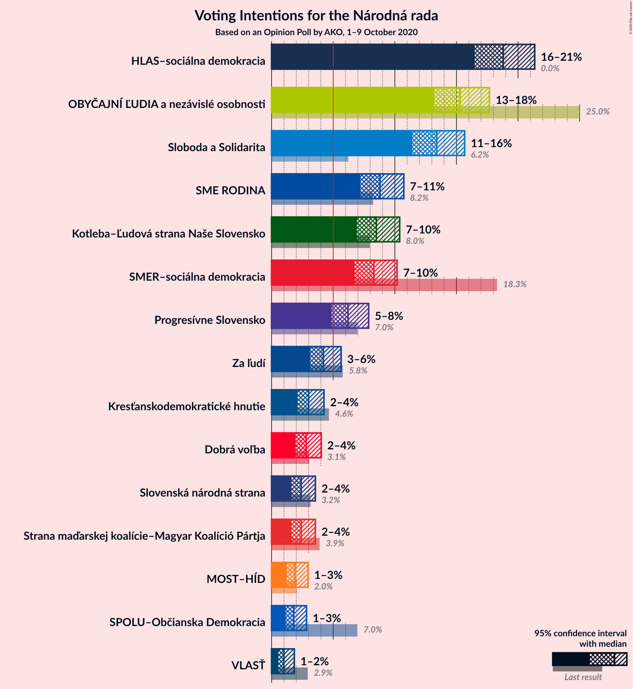

### Confidence Intervals

| Party | Last Result | Poll Result | 80% Confidence Interval | 90% Confidence Interval | 95% Confidence Interval | 99% Confidence Interval |
|:-----:|:-----------:|:-----------:|:-----------------------:|:-----------------------:|:-----------------------:|:-----------------------:|
| HLAS–sociálna demokracia | 0.0% | 18.8% | 17.3–20.5% |16.9–20.9% |16.5–21.4% |15.8–22.2% |
| OBYČAJNÍ ĽUDIA a nezávislé osobnosti | 25.0% | 15.3% | 13.9–16.9% |13.5–17.3% |13.2–17.7% |12.6–18.4% |
| Sloboda a Solidarita | 6.2% | 13.4% | 12.1–14.9% |11.7–15.3% |11.4–15.7% |10.8–16.4% |
| SME RODINA | 8.2% | 8.8% | 7.7–10.1% |7.4–10.4% |7.2–10.7% |6.7–11.4% |
| Kotleba–Ľudová strana Naše Slovensko | 8.0% | 8.5% | 7.5–9.7% |7.2–10.1% |6.9–10.4% |6.4–11.0% |
| SMER–sociálna demokracia | 18.3% | 8.3% | 7.3–9.5% |7.0–9.9% |6.7–10.2% |6.3–10.8% |
| Progresívne Slovensko | 7.0% | 6.2% | 5.3–7.3% |5.1–7.6% |4.9–7.9% |4.5–8.4% |
| Za ľudí | 5.8% | 4.2% | 3.5–5.1% |3.3–5.4% |3.1–5.6% |2.8–6.1% |
| Kresťanskodemokratické hnutie | 4.6% | 3.0% | 2.4–3.8% |2.2–4.1% |2.1–4.3% |1.9–4.7% |
| Dobrá voľba | 3.1% | 2.8% | 2.2–3.6% |2.1–3.8% |1.9–4.0% |1.7–4.4% |
| Slovenská národná strana | 3.2% | 2.4% | 1.9–3.2% |1.7–3.4% |1.6–3.6% |1.4–3.9% |
| Strana maďarskej koalície–Magyar Koalíció Pártja | 3.9% | 2.4% | 1.9–3.2% |1.7–3.4% |1.6–3.6% |1.4–3.9% |
| MOST–HÍD | 2.0% | 1.9% | 1.4–2.6% |1.3–2.8% |1.2–3.0% |1.0–3.3% |
| SPOLU–Občianska Demokracia | 7.0% | 1.8% | 1.4–2.5% |1.2–2.7% |1.1–2.8% |1.0–3.2% |
| VLASŤ | 2.9% | 1.0% | 0.7–1.5% |0.6–1.7% |0.5–1.8% |0.4–2.1% |

*Note:* The poll result column reflects the actual value used in the calculations. Published results may vary slightly, and in addition be rounded to fewer digits.

## Seats

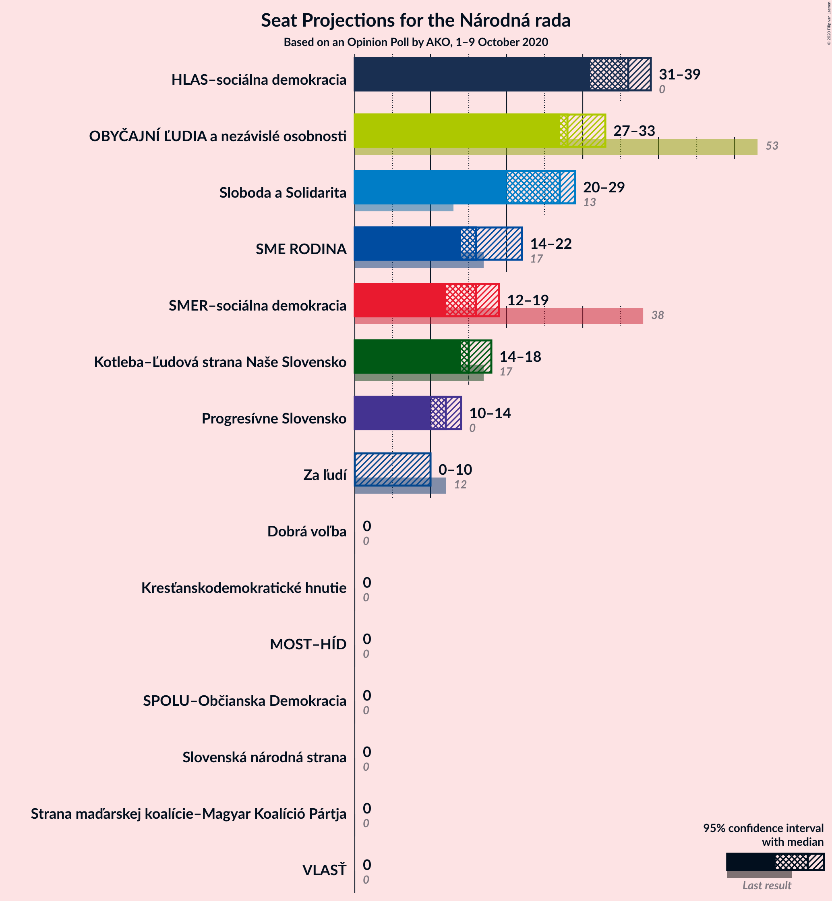

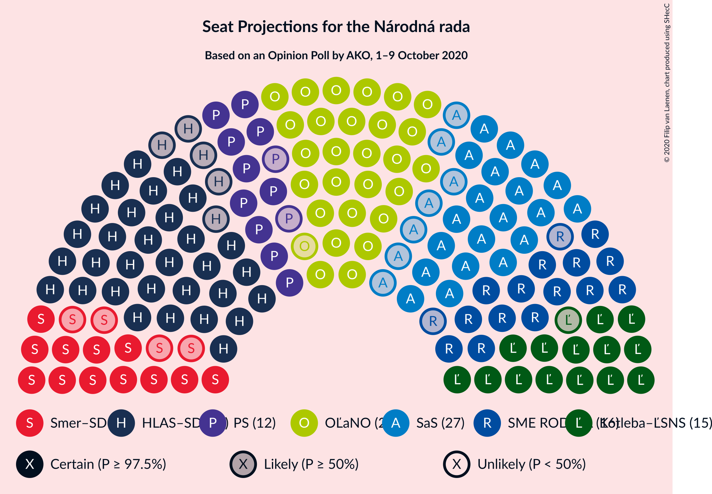

### Confidence Intervals

| Party | Last Result | Median | 80% Confidence Interval | 90% Confidence Interval | 95% Confidence Interval | 99% Confidence Interval |
|:-----:|:-----------:|:------:|:-----------------------:|:-----------------------:|:-----------------------:|:-----------------------:|
| <a href="#hlas–sociálna-demokracia">HLAS–sociálna demokracia</a> | 0 | 36 | 32–36 |31–37 |31–39 |30–41 |
| <a href="#obyčajní-ľudia-a-nezávislé-osobnosti">OBYČAJNÍ ĽUDIA a nezávislé osobnosti</a> | 53 | 28 | 27–29 |27–31 |27–33 |25–37 |
| <a href="#sloboda-a-solidarita">Sloboda a Solidarita</a> | 13 | 27 | 23–29 |22–29 |20–29 |20–29 |
| <a href="#sme-rodina">SME RODINA</a> | 17 | 16 | 15–18 |14–22 |14–22 |14–22 |
| <a href="#kotleba–ľudová-strana-naše-slovensko">Kotleba–Ľudová strana Naše Slovensko</a> | 17 | 15 | 15–18 |15–18 |14–18 |12–20 |
| <a href="#smer–sociálna-demokracia">SMER–sociálna demokracia</a> | 38 | 16 | 13–17 |13–18 |12–19 |12–21 |
| <a href="#progresívne-slovensko">Progresívne Slovensko</a> | 0 | 12 | 11–13 |11–13 |10–14 |0–15 |
| <a href="#za-ľudí">Za ľudí</a> | 12 | 0 | 0 |0–10 |0–10 |0–10 |
| <a href="#kresťanskodemokratické-hnutie">Kresťanskodemokratické hnutie</a> | 0 | 0 | 0 |0 |0 |0 |
| <a href="#dobrá-voľba">Dobrá voľba</a> | 0 | 0 | 0 |0 |0 |0 |
| <a href="#slovenská-národná-strana">Slovenská národná strana</a> | 0 | 0 | 0 |0 |0 |0 |
| <a href="#strana-maďarskej-koalície–magyar-koalíció-pártja">Strana maďarskej koalície–Magyar Koalíció Pártja</a> | 0 | 0 | 0 |0 |0 |0 |
| <a href="#most–híd">MOST–HÍD</a> | 0 | 0 | 0 |0 |0 |0 |
| <a href="#spolu–občianska-demokracia">SPOLU–Občianska Demokracia</a> | 0 | 0 | 0 |0 |0 |0 |
| <a href="#vlasť">VLASŤ</a> | 0 | 0 | 0 |0 |0 |0 |

### HLAS–sociálna demokracia

*For a full overview of the results for this party, see the [HLAS–sociálna demokracia](party-hlas–sociálnademokracia.html) page.*

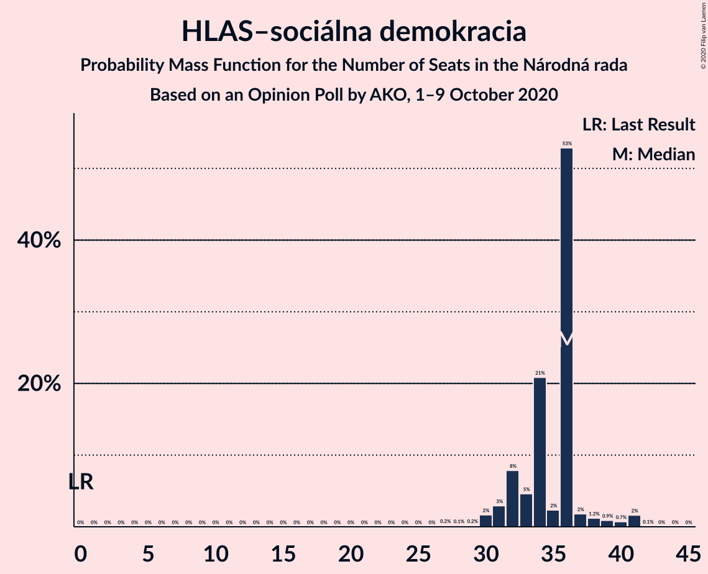

| Number of Seats | Probability | Accumulated | Special Marks |
|:---------------:|:-----------:|:-----------:|:-------------:|
| 0 | 0% | 100% | Last Result |
| 1 | 0% | 100% |  |
| 2 | 0% | 100% |  |
| 3 | 0% | 100% |  |
| 4 | 0% | 100% |  |
| 5 | 0% | 100% |  |
| 6 | 0% | 100% |  |
| 7 | 0% | 100% |  |
| 8 | 0% | 100% |  |
| 9 | 0% | 100% |  |
| 10 | 0% | 100% |  |
| 11 | 0% | 100% |  |
| 12 | 0% | 100% |  |
| 13 | 0% | 100% |  |
| 14 | 0% | 100% |  |
| 15 | 0% | 100% |  |
| 16 | 0% | 100% |  |
| 17 | 0% | 100% |  |
| 18 | 0% | 100% |  |
| 19 | 0% | 100% |  |
| 20 | 0% | 100% |  |
| 21 | 0% | 100% |  |
| 22 | 0% | 100% |  |
| 23 | 0% | 100% |  |
| 24 | 0% | 100% |  |
| 25 | 0% | 100% |  |
| 26 | 0% | 100% |  |
| 27 | 0.2% | 100% |  |
| 28 | 0.1% | 99.8% |  |
| 29 | 0.2% | 99.7% |  |
| 30 | 2% | 99.6% |  |
| 31 | 3% | 98% |  |
| 32 | 8% | 95% |  |
| 33 | 5% | 87% |  |
| 34 | 21% | 82% |  |
| 35 | 2% | 62% |  |
| 36 | 53% | 59% | Median |
| 37 | 2% | 6% |  |
| 38 | 1.2% | 5% |  |
| 39 | 0.9% | 3% |  |
| 40 | 0.7% | 2% |  |
| 41 | 2% | 2% |  |
| 42 | 0.1% | 0.1% |  |
| 43 | 0% | 0.1% |  |
| 44 | 0% | 0% |  |

### OBYČAJNÍ ĽUDIA a nezávislé osobnosti

*For a full overview of the results for this party, see the [OBYČAJNÍ ĽUDIA a nezávislé osobnosti](party-obyčajníľudiaanezávisléosobnosti.html) page.*

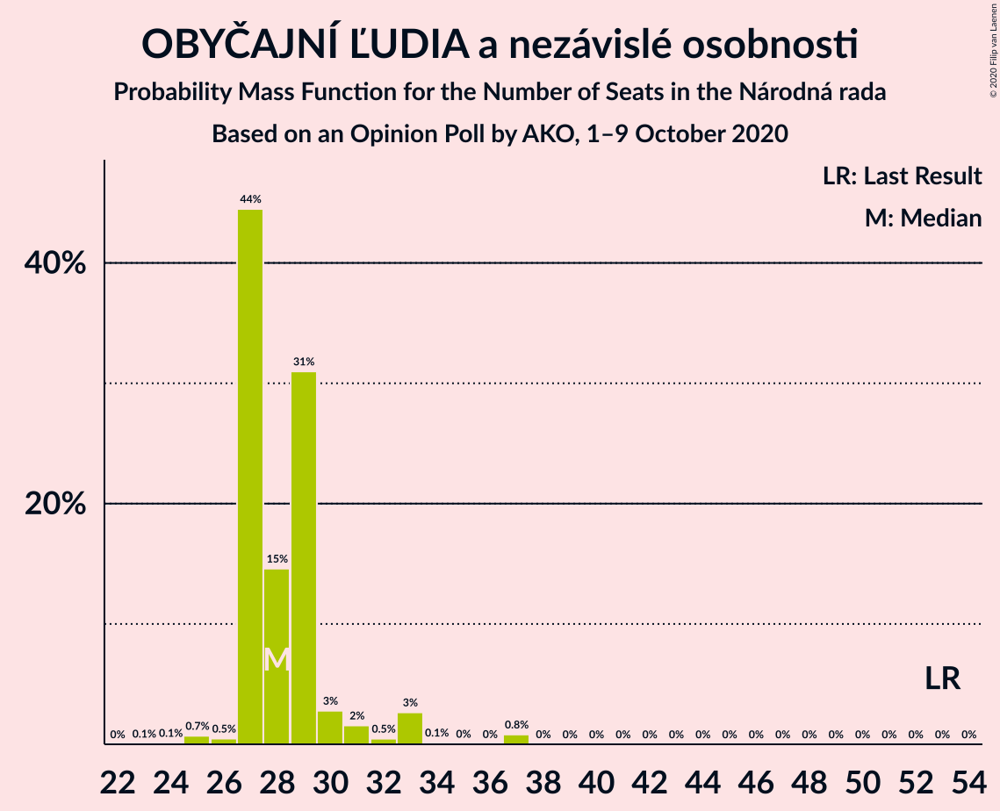

| Number of Seats | Probability | Accumulated | Special Marks |
|:---------------:|:-----------:|:-----------:|:-------------:|
| 23 | 0.1% | 100% |  |
| 24 | 0.1% | 99.9% |  |
| 25 | 0.7% | 99.8% |  |
| 26 | 0.5% | 99.1% |  |
| 27 | 44% | 98.6% |  |
| 28 | 15% | 54% | Median |
| 29 | 31% | 40% |  |
| 30 | 3% | 9% |  |
| 31 | 2% | 6% |  |
| 32 | 0.5% | 4% |  |
| 33 | 3% | 4% |  |
| 34 | 0.1% | 1.1% |  |
| 35 | 0% | 0.9% |  |
| 36 | 0% | 0.9% |  |
| 37 | 0.8% | 0.8% |  |
| 38 | 0% | 0% |  |
| 39 | 0% | 0% |  |
| 40 | 0% | 0% |  |
| 41 | 0% | 0% |  |
| 42 | 0% | 0% |  |
| 43 | 0% | 0% |  |
| 44 | 0% | 0% |  |
| 45 | 0% | 0% |  |
| 46 | 0% | 0% |  |
| 47 | 0% | 0% |  |
| 48 | 0% | 0% |  |
| 49 | 0% | 0% |  |
| 50 | 0% | 0% |  |
| 51 | 0% | 0% |  |
| 52 | 0% | 0% |  |
| 53 | 0% | 0% | Last Result |

### Sloboda a Solidarita

*For a full overview of the results for this party, see the [Sloboda a Solidarita](party-slobodaasolidarita.html) page.*

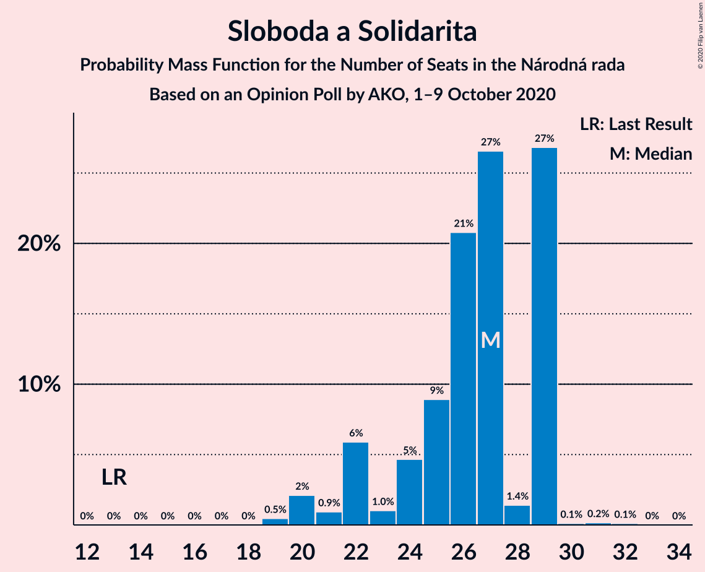

| Number of Seats | Probability | Accumulated | Special Marks |
|:---------------:|:-----------:|:-----------:|:-------------:|
| 13 | 0% | 100% | Last Result |
| 14 | 0% | 100% |  |
| 15 | 0% | 100% |  |
| 16 | 0% | 100% |  |
| 17 | 0% | 100% |  |
| 18 | 0% | 100% |  |
| 19 | 0.5% | 100% |  |
| 20 | 2% | 99.5% |  |
| 21 | 0.9% | 97% |  |
| 22 | 6% | 96% |  |
| 23 | 1.0% | 91% |  |
| 24 | 5% | 90% |  |
| 25 | 9% | 85% |  |
| 26 | 21% | 76% |  |
| 27 | 27% | 55% | Median |
| 28 | 1.4% | 29% |  |
| 29 | 27% | 27% |  |
| 30 | 0.1% | 0.4% |  |
| 31 | 0.2% | 0.3% |  |
| 32 | 0.1% | 0.1% |  |
| 33 | 0% | 0% |  |

### SME RODINA

*For a full overview of the results for this party, see the [SME RODINA](party-smerodina.html) page.*

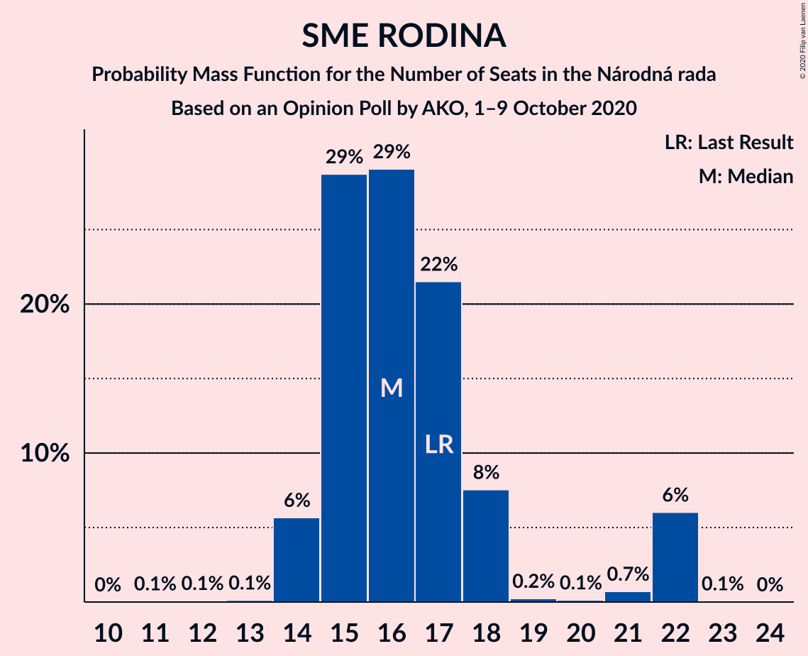

| Number of Seats | Probability | Accumulated | Special Marks |
|:---------------:|:-----------:|:-----------:|:-------------:|
| 11 | 0.1% | 100% |  |
| 12 | 0.1% | 99.9% |  |
| 13 | 0.1% | 99.8% |  |
| 14 | 6% | 99.7% |  |
| 15 | 29% | 94% |  |
| 16 | 29% | 65% | Median |
| 17 | 22% | 36% | Last Result |
| 18 | 8% | 15% |  |
| 19 | 0.2% | 7% |  |
| 20 | 0.1% | 7% |  |
| 21 | 0.7% | 7% |  |
| 22 | 6% | 6% |  |
| 23 | 0.1% | 0.1% |  |
| 24 | 0% | 0% |  |

### Kotleba–Ľudová strana Naše Slovensko

*For a full overview of the results for this party, see the [Kotleba–Ľudová strana Naše Slovensko](party-kotleba–ľudovástrananašeslovensko.html) page.*

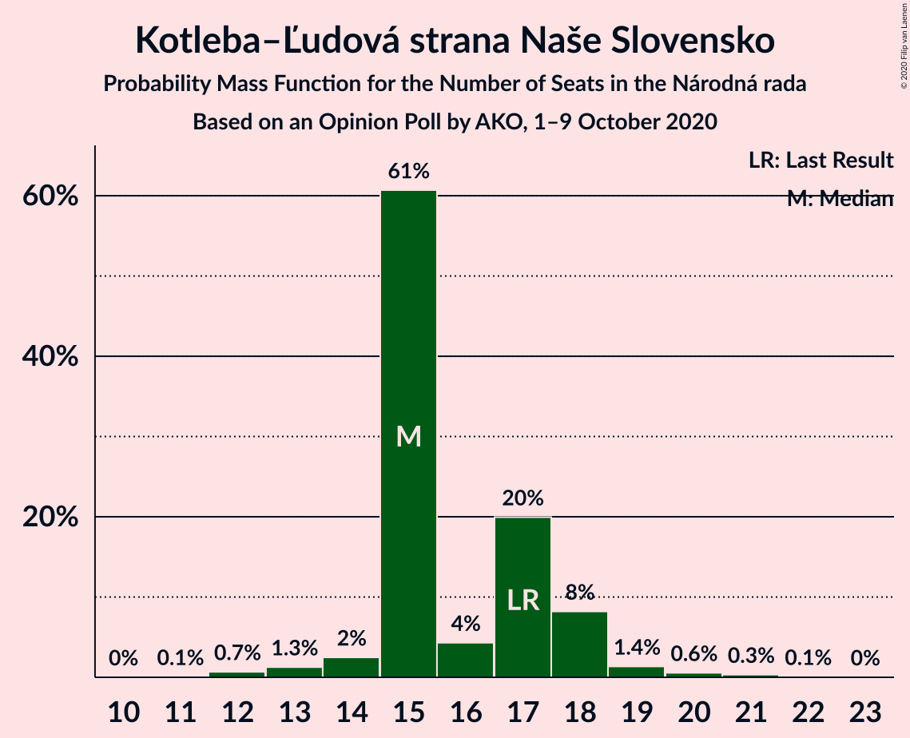

| Number of Seats | Probability | Accumulated | Special Marks |
|:---------------:|:-----------:|:-----------:|:-------------:|
| 11 | 0.1% | 100% |  |
| 12 | 0.7% | 99.9% |  |
| 13 | 1.3% | 99.3% |  |
| 14 | 2% | 98% |  |
| 15 | 61% | 96% | Median |
| 16 | 4% | 35% |  |
| 17 | 20% | 30% | Last Result |
| 18 | 8% | 11% |  |
| 19 | 1.4% | 2% |  |
| 20 | 0.6% | 1.0% |  |
| 21 | 0.3% | 0.4% |  |
| 22 | 0.1% | 0.1% |  |
| 23 | 0% | 0% |  |

### SMER–sociálna demokracia

*For a full overview of the results for this party, see the [SMER–sociálna demokracia](party-smer–sociálnademokracia.html) page.*

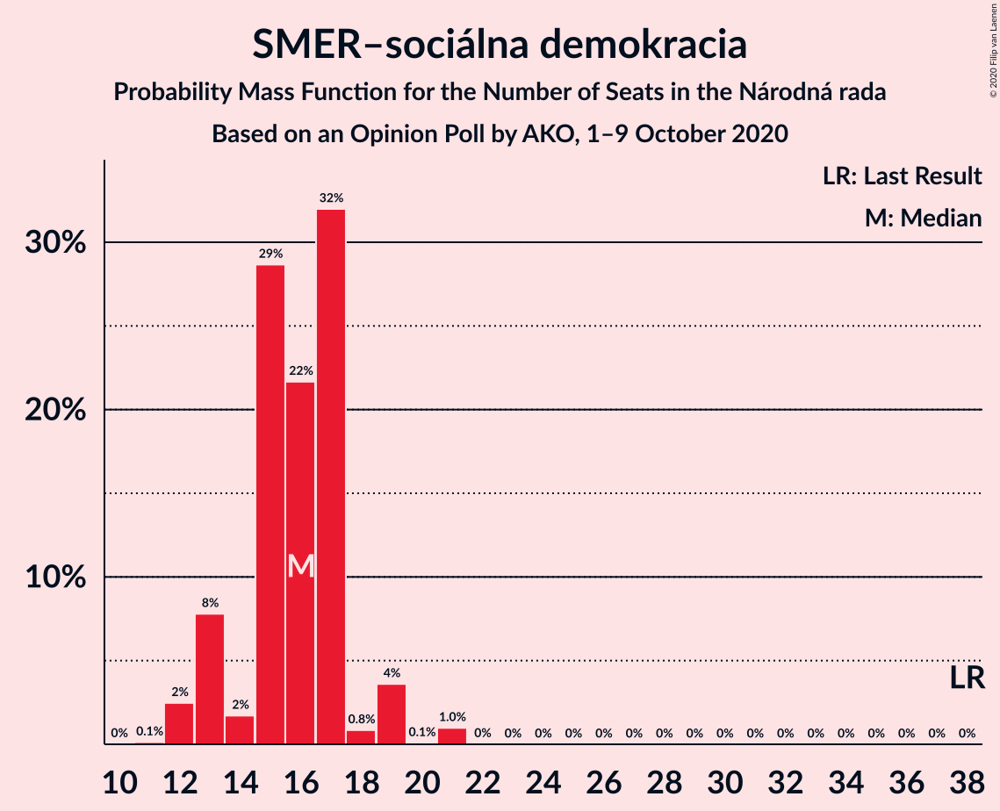

| Number of Seats | Probability | Accumulated | Special Marks |
|:---------------:|:-----------:|:-----------:|:-------------:|
| 11 | 0.1% | 100% |  |
| 12 | 2% | 99.9% |  |
| 13 | 8% | 97% |  |
| 14 | 2% | 90% |  |
| 15 | 29% | 88% |  |
| 16 | 22% | 59% | Median |
| 17 | 32% | 38% |  |
| 18 | 0.8% | 6% |  |
| 19 | 4% | 5% |  |
| 20 | 0.1% | 1.1% |  |
| 21 | 1.0% | 1.0% |  |
| 22 | 0% | 0% |  |
| 23 | 0% | 0% |  |
| 24 | 0% | 0% |  |
| 25 | 0% | 0% |  |
| 26 | 0% | 0% |  |
| 27 | 0% | 0% |  |
| 28 | 0% | 0% |  |
| 29 | 0% | 0% |  |
| 30 | 0% | 0% |  |
| 31 | 0% | 0% |  |
| 32 | 0% | 0% |  |
| 33 | 0% | 0% |  |
| 34 | 0% | 0% |  |
| 35 | 0% | 0% |  |
| 36 | 0% | 0% |  |
| 37 | 0% | 0% |  |
| 38 | 0% | 0% | Last Result |

### Progresívne Slovensko

*For a full overview of the results for this party, see the [Progresívne Slovensko](party-progresívneslovensko.html) page.*

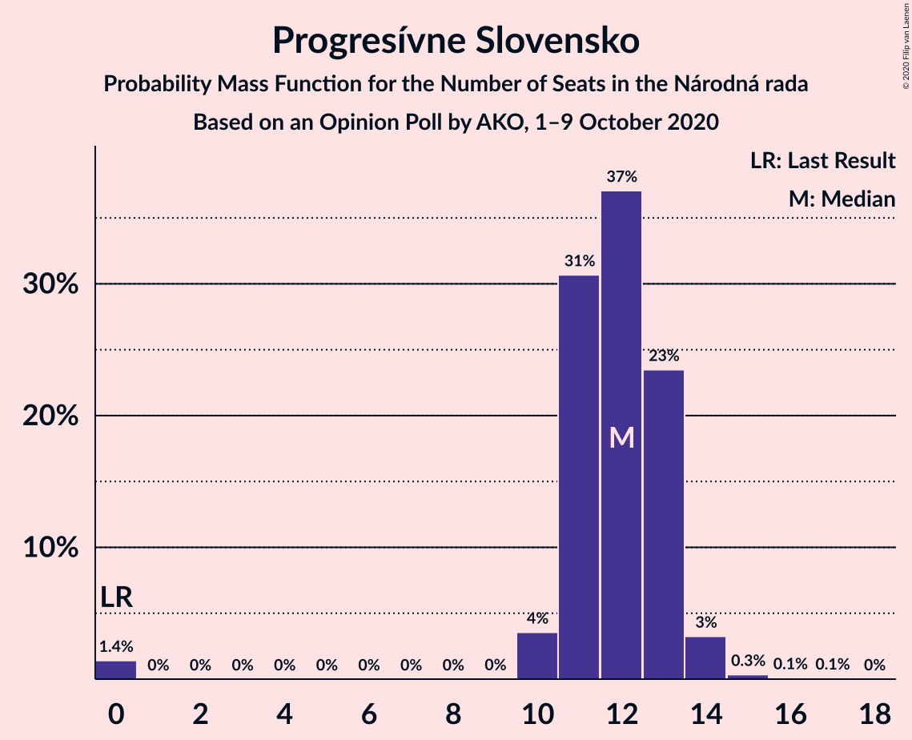

| Number of Seats | Probability | Accumulated | Special Marks |
|:---------------:|:-----------:|:-----------:|:-------------:|
| 0 | 1.4% | 100% | Last Result |
| 1 | 0% | 98.6% |  |
| 2 | 0% | 98.6% |  |
| 3 | 0% | 98.6% |  |
| 4 | 0% | 98.6% |  |
| 5 | 0% | 98.6% |  |
| 6 | 0% | 98.6% |  |
| 7 | 0% | 98.6% |  |
| 8 | 0% | 98.6% |  |
| 9 | 0% | 98.6% |  |
| 10 | 4% | 98.6% |  |
| 11 | 31% | 95% |  |
| 12 | 37% | 64% | Median |
| 13 | 23% | 27% |  |
| 14 | 3% | 4% |  |
| 15 | 0.3% | 0.5% |  |
| 16 | 0.1% | 0.2% |  |
| 17 | 0.1% | 0.1% |  |
| 18 | 0% | 0% |  |

### Za ľudí

*For a full overview of the results for this party, see the [Za ľudí](party-zaľudí.html) page.*

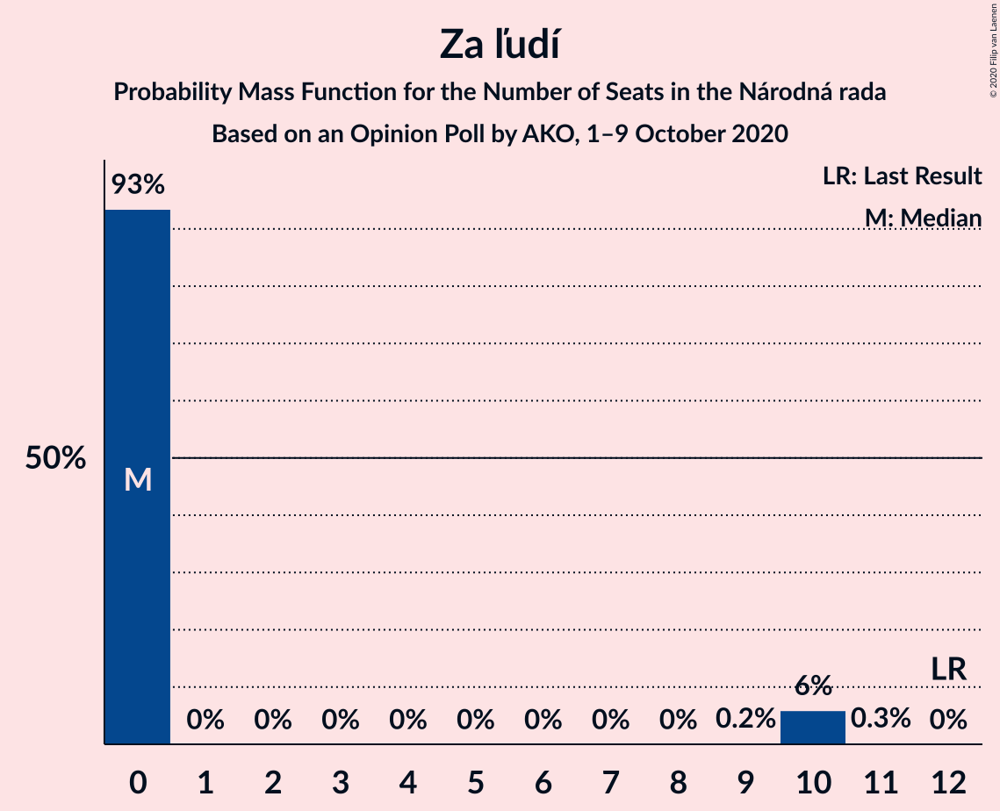

| Number of Seats | Probability | Accumulated | Special Marks |
|:---------------:|:-----------:|:-----------:|:-------------:|
| 0 | 93% | 100% | Median |
| 1 | 0% | 7% |  |
| 2 | 0% | 7% |  |
| 3 | 0% | 7% |  |
| 4 | 0% | 7% |  |
| 5 | 0% | 7% |  |
| 6 | 0% | 7% |  |
| 7 | 0% | 7% |  |
| 8 | 0% | 7% |  |
| 9 | 0.2% | 7% |  |
| 10 | 6% | 6% |  |
| 11 | 0.3% | 0.3% |  |
| 12 | 0% | 0% | Last Result |

### Kresťanskodemokratické hnutie

*For a full overview of the results for this party, see the [Kresťanskodemokratické hnutie](party-kresťanskodemokratickéhnutie.html) page.*

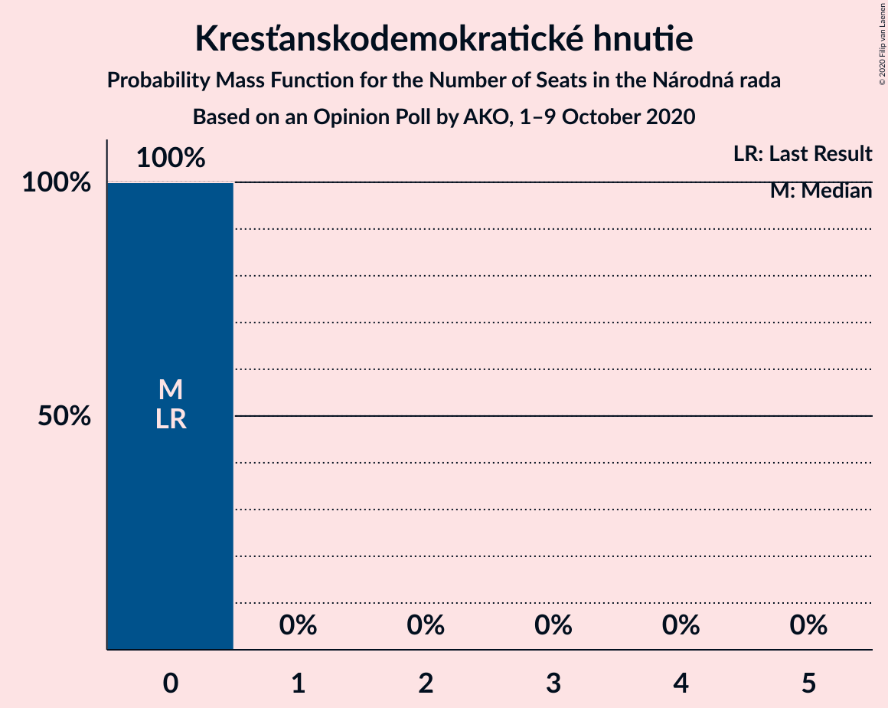

| Number of Seats | Probability | Accumulated | Special Marks |
|:---------------:|:-----------:|:-----------:|:-------------:|
| 0 | 100% | 100% | Last Result, Median |

### Dobrá voľba

*For a full overview of the results for this party, see the [Dobrá voľba](party-dobrávoľba.html) page.*

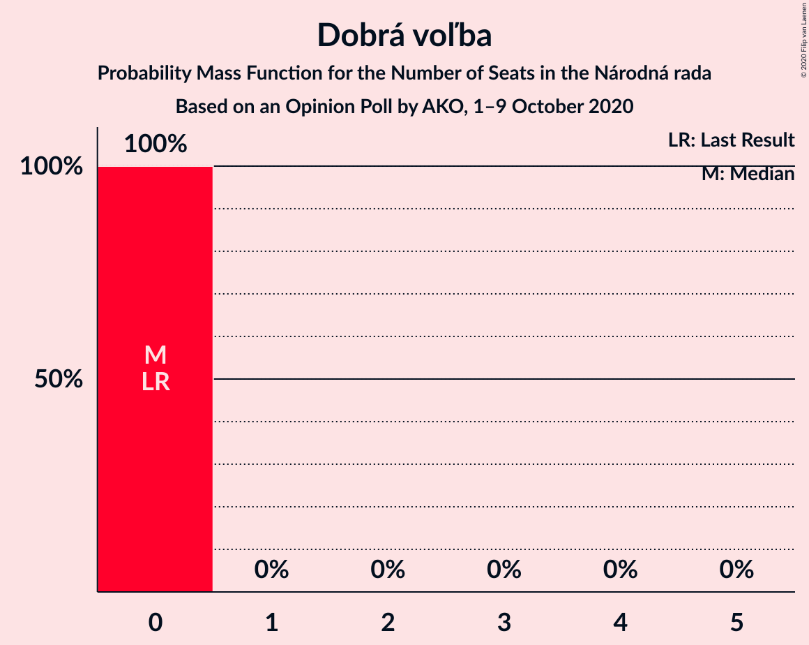

| Number of Seats | Probability | Accumulated | Special Marks |
|:---------------:|:-----------:|:-----------:|:-------------:|
| 0 | 100% | 100% | Last Result, Median |

### Slovenská národná strana

*For a full overview of the results for this party, see the [Slovenská národná strana](party-slovenskánárodnástrana.html) page.*

| Number of Seats | Probability | Accumulated | Special Marks |
|:---------------:|:-----------:|:-----------:|:-------------:|
| 0 | 100% | 100% | Last Result, Median |

### Strana maďarskej koalície–Magyar Koalíció Pártja

*For a full overview of the results for this party, see the [Strana maďarskej koalície–Magyar Koalíció Pártja](party-stranamaďarskejkoalície–magyarkoalíciópártja.html) page.*

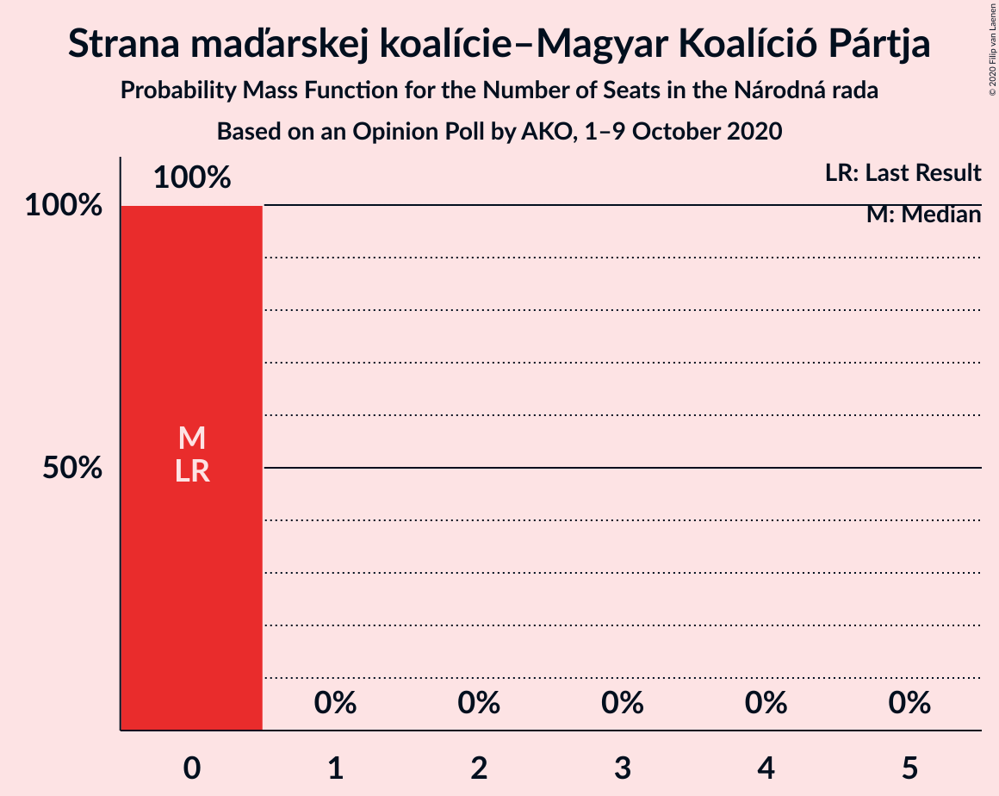

| Number of Seats | Probability | Accumulated | Special Marks |
|:---------------:|:-----------:|:-----------:|:-------------:|
| 0 | 100% | 100% | Last Result, Median |

### MOST–HÍD

*For a full overview of the results for this party, see the [MOST–HÍD](party-most–híd.html) page.*

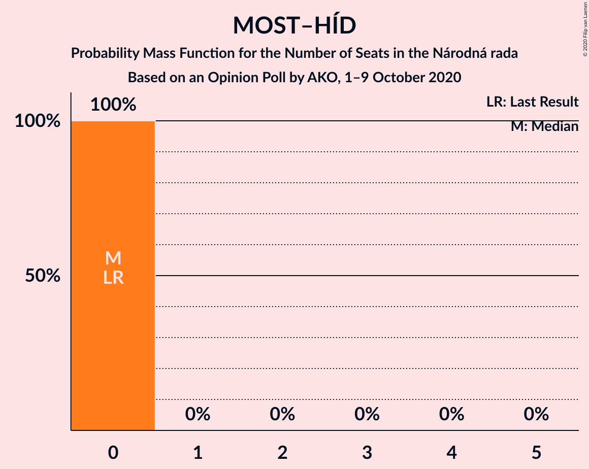

| Number of Seats | Probability | Accumulated | Special Marks |
|:---------------:|:-----------:|:-----------:|:-------------:|
| 0 | 100% | 100% | Last Result, Median |

### SPOLU–Občianska Demokracia

*For a full overview of the results for this party, see the [SPOLU–Občianska Demokracia](party-spolu–občianskademokracia.html) page.*

| Number of Seats | Probability | Accumulated | Special Marks |
|:---------------:|:-----------:|:-----------:|:-------------:|
| 0 | 100% | 100% | Last Result, Median |

### VLASŤ

*For a full overview of the results for this party, see the [VLASŤ](party-vlasť.html) page.*

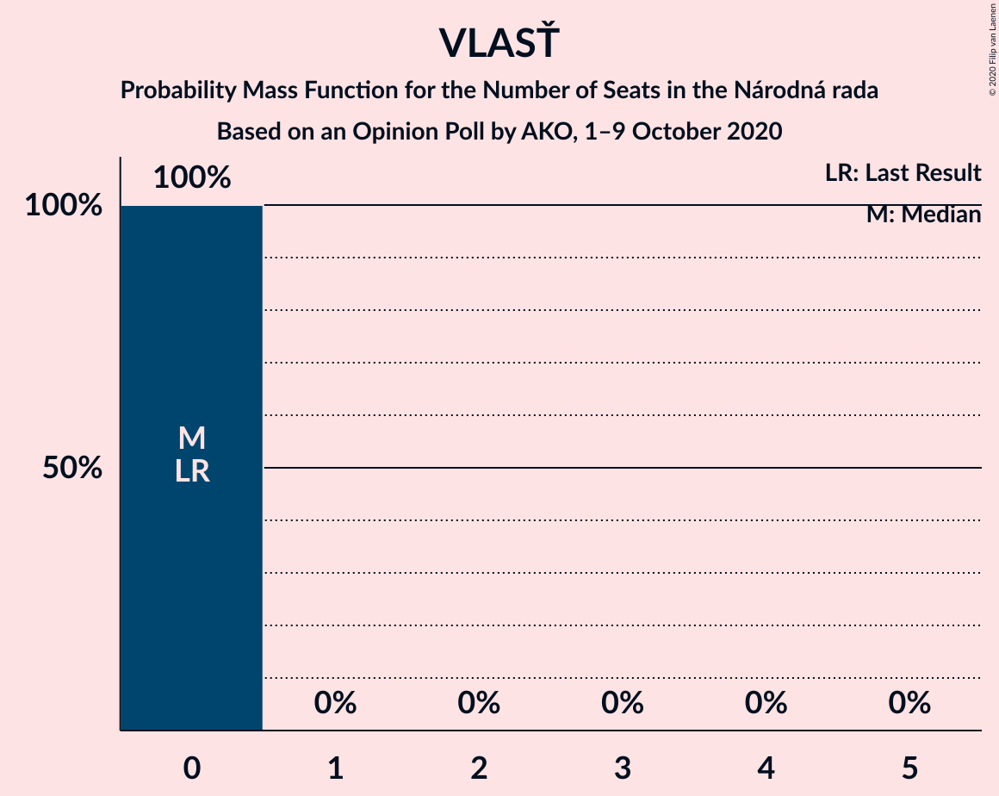

| Number of Seats | Probability | Accumulated | Special Marks |
|:---------------:|:-----------:|:-----------:|:-------------:|
| 0 | 100% | 100% | Last Result, Median |

## Coalitions

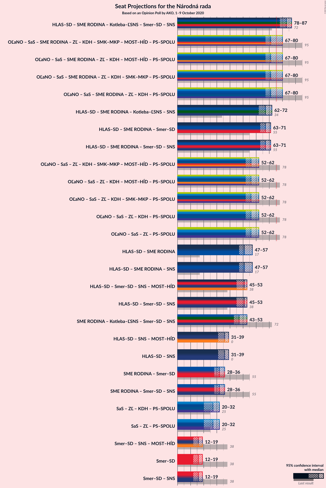

### Confidence Intervals

| Coalition | Last Result | Median | Majority? | 80% Confidence Interval | 90% Confidence Interval | 95% Confidence Interval | 99% Confidence Interval |
|:---------:|:-----------:|:------:|:---------:|:-----------------------:|:-----------------------:|:-----------------------:|:-----------------------:|
| HLAS–sociálna demokracia – SME RODINA – Kotleba–Ľudová strana Naše Slovensko – SMER–sociálna demokracia – Slovenská národná strana | 72 | 83 | 99.7% | 82–85 | 79–85 | 78–87 | 76–91 |
| HLAS–sociálna demokracia – SME RODINA – Kotleba–Ľudová strana Naše Slovensko – Slovenská národná strana | 34 | 67 | 1.3% | 64–71 | 62–72 | 62–72 | 61–77 |
| HLAS–sociálna demokracia – SME RODINA – SMER–sociálna demokracia | 55 | 67 | 0.1% | 66–68 | 64–70 | 63–71 | 61–74 |
| HLAS–sociálna demokracia – SME RODINA – SMER–sociálna demokracia – Slovenská národná strana | 55 | 67 | 0.1% | 66–68 | 64–70 | 63–71 | 61–74 |
| HLAS–sociálna demokracia – SME RODINA | 17 | 51 | 0% | 48–54 | 47–55 | 47–57 | 45–59 |
| HLAS–sociálna demokracia – SME RODINA – Slovenská národná strana | 17 | 51 | 0% | 48–54 | 47–55 | 47–57 | 45–59 |
| HLAS–sociálna demokracia – SMER–sociálna demokracia – Slovenská národná strana – MOST–HÍD | 38 | 51 | 0% | 49–53 | 45–53 | 45–53 | 44–55 |
| HLAS–sociálna demokracia – SMER–sociálna demokracia – Slovenská národná strana | 38 | 51 | 0% | 49–53 | 45–53 | 45–53 | 44–55 |
| SME RODINA – Kotleba–Ľudová strana Naše Slovensko – SMER–sociálna demokracia – Slovenská národná strana | 72 | 47 | 0% | 46–52 | 46–53 | 43–53 | 42–53 |
| HLAS–sociálna demokracia – Slovenská národná strana – MOST–HÍD | 0 | 36 | 0% | 32–36 | 31–37 | 31–39 | 30–41 |
| HLAS–sociálna demokracia – Slovenská národná strana | 0 | 36 | 0% | 32–36 | 31–37 | 31–39 | 30–41 |
| SME RODINA – SMER–sociálna demokracia | 55 | 32 | 0% | 31–35 | 30–35 | 28–36 | 28–37 |
| SME RODINA – SMER–sociálna demokracia – Slovenská národná strana | 55 | 32 | 0% | 31–35 | 30–35 | 28–36 | 28–37 |
| SMER–sociálna demokracia – Slovenská národná strana – MOST–HÍD | 38 | 16 | 0% | 13–17 | 13–18 | 12–19 | 12–21 |
| SMER–sociálna demokracia | 38 | 16 | 0% | 13–17 | 13–18 | 12–19 | 12–21 |
| SMER–sociálna demokracia – Slovenská národná strana | 38 | 16 | 0% | 13–17 | 13–18 | 12–19 | 12–21 |

### HLAS–sociálna demokracia – SME RODINA – Kotleba–Ľudová strana Naše Slovensko – SMER–sociálna demokracia – Slovenská národná strana

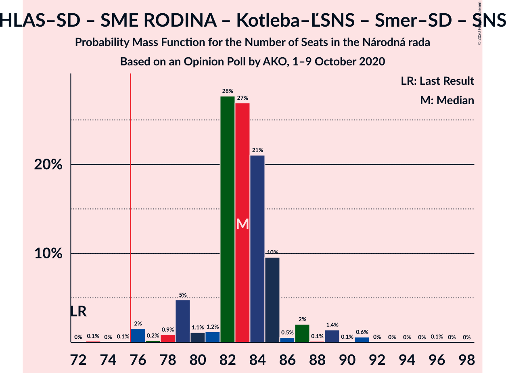

| Number of Seats | Probability | Accumulated | Special Marks |
|:---------------:|:-----------:|:-----------:|:-------------:|
| 72 | 0% | 100% | Last Result |
| 73 | 0.1% | 100% |  |
| 74 | 0% | 99.8% |  |
| 75 | 0.1% | 99.8% |  |
| 76 | 2% | 99.7% | Majority |
| 77 | 0.2% | 98% |  |
| 78 | 0.9% | 98% |  |
| 79 | 5% | 97% |  |
| 80 | 1.1% | 92% |  |
| 81 | 1.2% | 91% |  |
| 82 | 28% | 90% |  |
| 83 | 27% | 62% | Median |
| 84 | 21% | 35% |  |
| 85 | 10% | 14% |  |
| 86 | 0.5% | 5% |  |
| 87 | 2% | 4% |  |
| 88 | 0.1% | 2% |  |
| 89 | 1.4% | 2% |  |
| 90 | 0.1% | 0.8% |  |
| 91 | 0.6% | 0.7% |  |
| 92 | 0% | 0.2% |  |
| 93 | 0% | 0.1% |  |
| 94 | 0% | 0.1% |  |
| 95 | 0% | 0.1% |  |
| 96 | 0.1% | 0.1% |  |
| 97 | 0% | 0% |  |

### HLAS–sociálna demokracia – SME RODINA – Kotleba–Ľudová strana Naše Slovensko – Slovenská národná strana

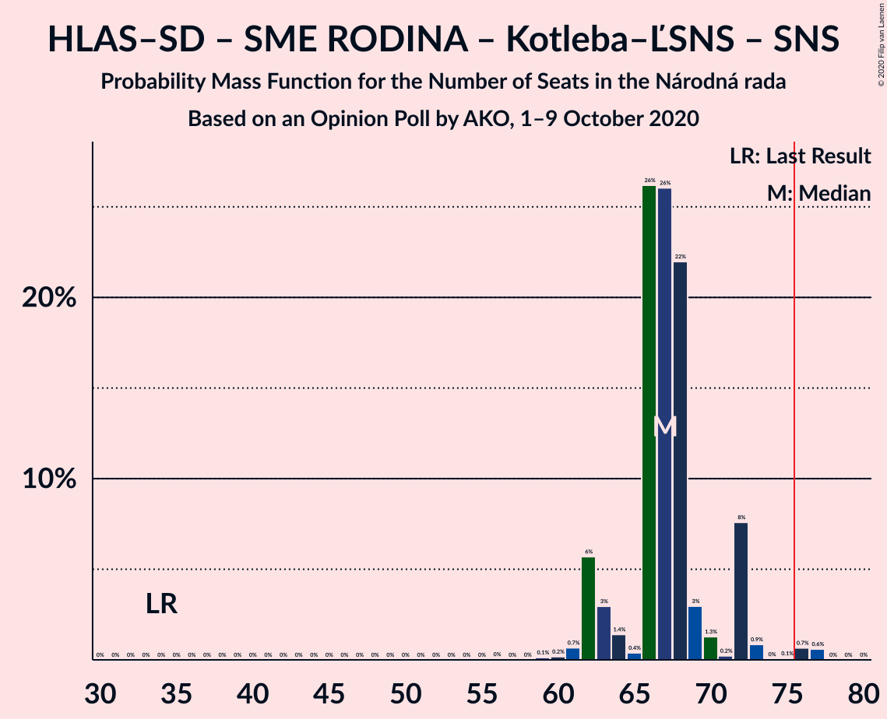

| Number of Seats | Probability | Accumulated | Special Marks |
|:---------------:|:-----------:|:-----------:|:-------------:|
| 34 | 0% | 100% | Last Result |
| 35 | 0% | 100% |  |
| 36 | 0% | 100% |  |
| 37 | 0% | 100% |  |
| 38 | 0% | 100% |  |
| 39 | 0% | 100% |  |
| 40 | 0% | 100% |  |
| 41 | 0% | 100% |  |
| 42 | 0% | 100% |  |
| 43 | 0% | 100% |  |
| 44 | 0% | 100% |  |
| 45 | 0% | 100% |  |
| 46 | 0% | 100% |  |
| 47 | 0% | 100% |  |
| 48 | 0% | 100% |  |
| 49 | 0% | 100% |  |
| 50 | 0% | 100% |  |
| 51 | 0% | 100% |  |
| 52 | 0% | 100% |  |
| 53 | 0% | 100% |  |
| 54 | 0% | 100% |  |
| 55 | 0% | 100% |  |
| 56 | 0% | 100% |  |
| 57 | 0% | 100% |  |
| 58 | 0% | 100% |  |
| 59 | 0.1% | 100% |  |
| 60 | 0.2% | 99.8% |  |
| 61 | 0.7% | 99.6% |  |
| 62 | 6% | 99.0% |  |
| 63 | 3% | 93% |  |
| 64 | 1.4% | 90% |  |
| 65 | 0.4% | 89% |  |
| 66 | 26% | 89% |  |
| 67 | 26% | 62% | Median |
| 68 | 22% | 36% |  |
| 69 | 3% | 14% |  |
| 70 | 1.3% | 11% |  |
| 71 | 0.2% | 10% |  |
| 72 | 8% | 10% |  |
| 73 | 0.9% | 2% |  |
| 74 | 0% | 1.4% |  |
| 75 | 0.1% | 1.4% |  |
| 76 | 0.7% | 1.3% | Majority |
| 77 | 0.6% | 0.6% |  |
| 78 | 0% | 0% |  |

### HLAS–sociálna demokracia – SME RODINA – SMER–sociálna demokracia

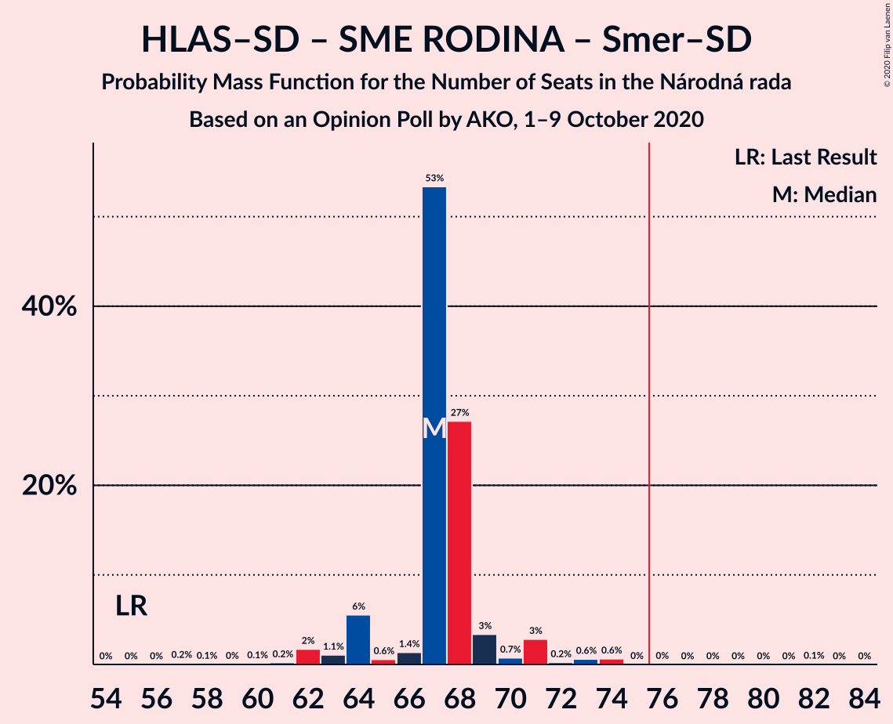

| Number of Seats | Probability | Accumulated | Special Marks |
|:---------------:|:-----------:|:-----------:|:-------------:|
| 55 | 0% | 100% | Last Result |
| 56 | 0% | 100% |  |
| 57 | 0.2% | 100% |  |
| 58 | 0.1% | 99.8% |  |
| 59 | 0% | 99.8% |  |
| 60 | 0.1% | 99.7% |  |
| 61 | 0.2% | 99.6% |  |
| 62 | 2% | 99.4% |  |
| 63 | 1.1% | 98% |  |
| 64 | 6% | 97% |  |
| 65 | 0.6% | 91% |  |
| 66 | 1.4% | 90% |  |
| 67 | 53% | 89% |  |
| 68 | 27% | 36% | Median |
| 69 | 3% | 9% |  |
| 70 | 0.7% | 5% |  |
| 71 | 3% | 4% |  |
| 72 | 0.2% | 2% |  |
| 73 | 0.6% | 1.4% |  |
| 74 | 0.6% | 0.8% |  |
| 75 | 0% | 0.2% |  |
| 76 | 0% | 0.1% | Majority |
| 77 | 0% | 0.1% |  |
| 78 | 0% | 0.1% |  |
| 79 | 0% | 0.1% |  |
| 80 | 0% | 0.1% |  |
| 81 | 0% | 0.1% |  |
| 82 | 0.1% | 0.1% |  |
| 83 | 0% | 0% |  |

### HLAS–sociálna demokracia – SME RODINA – SMER–sociálna demokracia – Slovenská národná strana

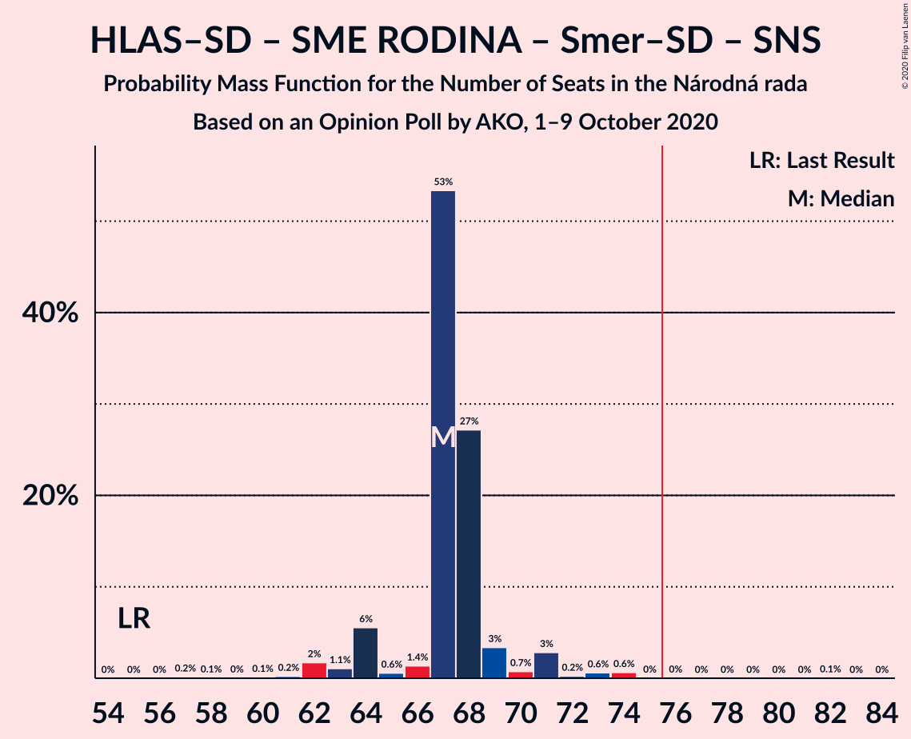

| Number of Seats | Probability | Accumulated | Special Marks |
|:---------------:|:-----------:|:-----------:|:-------------:|
| 55 | 0% | 100% | Last Result |
| 56 | 0% | 100% |  |
| 57 | 0.2% | 100% |  |
| 58 | 0.1% | 99.8% |  |
| 59 | 0% | 99.8% |  |
| 60 | 0.1% | 99.7% |  |
| 61 | 0.2% | 99.6% |  |
| 62 | 2% | 99.4% |  |
| 63 | 1.1% | 98% |  |
| 64 | 6% | 97% |  |
| 65 | 0.6% | 91% |  |
| 66 | 1.4% | 90% |  |
| 67 | 53% | 89% |  |
| 68 | 27% | 36% | Median |
| 69 | 3% | 9% |  |
| 70 | 0.7% | 5% |  |
| 71 | 3% | 4% |  |
| 72 | 0.2% | 2% |  |
| 73 | 0.6% | 1.4% |  |
| 74 | 0.6% | 0.8% |  |
| 75 | 0% | 0.2% |  |
| 76 | 0% | 0.1% | Majority |
| 77 | 0% | 0.1% |  |
| 78 | 0% | 0.1% |  |
| 79 | 0% | 0.1% |  |
| 80 | 0% | 0.1% |  |
| 81 | 0% | 0.1% |  |
| 82 | 0.1% | 0.1% |  |
| 83 | 0% | 0% |  |

### HLAS–sociálna demokracia – SME RODINA

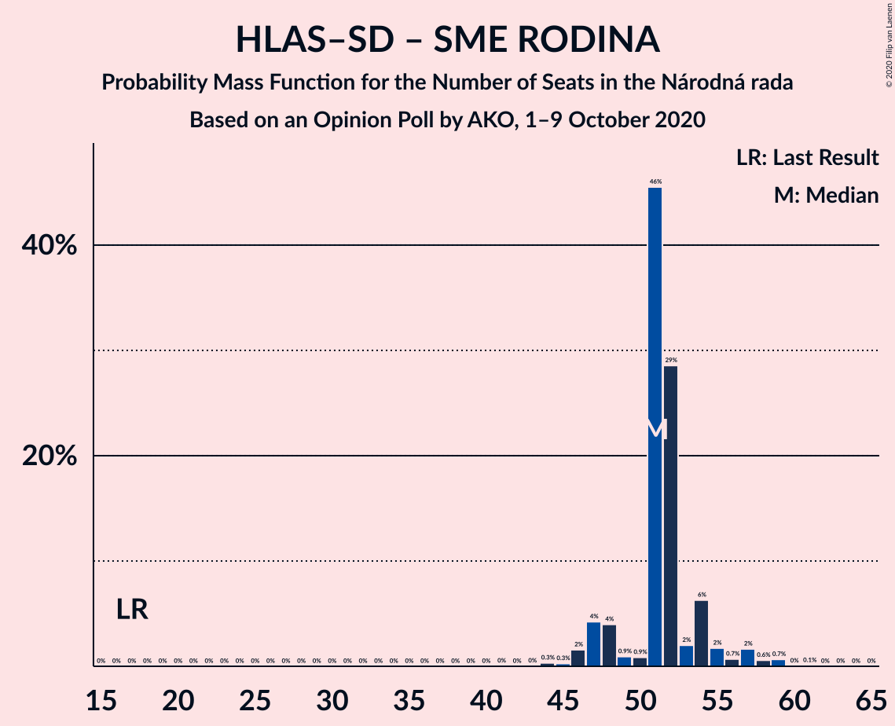

| Number of Seats | Probability | Accumulated | Special Marks |
|:---------------:|:-----------:|:-----------:|:-------------:|
| 17 | 0% | 100% | Last Result |
| 18 | 0% | 100% |  |
| 19 | 0% | 100% |  |
| 20 | 0% | 100% |  |
| 21 | 0% | 100% |  |
| 22 | 0% | 100% |  |
| 23 | 0% | 100% |  |
| 24 | 0% | 100% |  |
| 25 | 0% | 100% |  |
| 26 | 0% | 100% |  |
| 27 | 0% | 100% |  |
| 28 | 0% | 100% |  |
| 29 | 0% | 100% |  |
| 30 | 0% | 100% |  |
| 31 | 0% | 100% |  |
| 32 | 0% | 100% |  |
| 33 | 0% | 100% |  |
| 34 | 0% | 100% |  |
| 35 | 0% | 100% |  |
| 36 | 0% | 100% |  |
| 37 | 0% | 100% |  |
| 38 | 0% | 100% |  |
| 39 | 0% | 100% |  |
| 40 | 0% | 100% |  |
| 41 | 0% | 100% |  |
| 42 | 0% | 100% |  |
| 43 | 0% | 100% |  |
| 44 | 0.3% | 99.9% |  |
| 45 | 0.3% | 99.6% |  |
| 46 | 2% | 99.3% |  |
| 47 | 4% | 98% |  |
| 48 | 4% | 94% |  |
| 49 | 0.9% | 90% |  |
| 50 | 0.9% | 89% |  |
| 51 | 46% | 88% |  |
| 52 | 29% | 42% | Median |
| 53 | 2% | 14% |  |
| 54 | 6% | 12% |  |
| 55 | 2% | 5% |  |
| 56 | 0.7% | 4% |  |
| 57 | 2% | 3% |  |
| 58 | 0.6% | 1.4% |  |
| 59 | 0.7% | 0.8% |  |
| 60 | 0% | 0.1% |  |
| 61 | 0.1% | 0.1% |  |
| 62 | 0% | 0% |  |

### HLAS–sociálna demokracia – SME RODINA – Slovenská národná strana

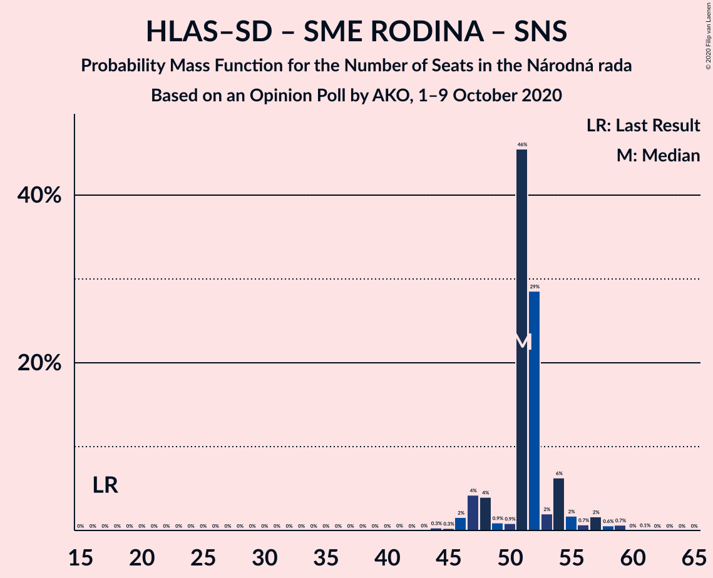

| Number of Seats | Probability | Accumulated | Special Marks |
|:---------------:|:-----------:|:-----------:|:-------------:|
| 17 | 0% | 100% | Last Result |
| 18 | 0% | 100% |  |
| 19 | 0% | 100% |  |
| 20 | 0% | 100% |  |
| 21 | 0% | 100% |  |
| 22 | 0% | 100% |  |
| 23 | 0% | 100% |  |
| 24 | 0% | 100% |  |
| 25 | 0% | 100% |  |
| 26 | 0% | 100% |  |
| 27 | 0% | 100% |  |
| 28 | 0% | 100% |  |
| 29 | 0% | 100% |  |
| 30 | 0% | 100% |  |
| 31 | 0% | 100% |  |
| 32 | 0% | 100% |  |
| 33 | 0% | 100% |  |
| 34 | 0% | 100% |  |
| 35 | 0% | 100% |  |
| 36 | 0% | 100% |  |
| 37 | 0% | 100% |  |
| 38 | 0% | 100% |  |
| 39 | 0% | 100% |  |
| 40 | 0% | 100% |  |
| 41 | 0% | 100% |  |
| 42 | 0% | 100% |  |
| 43 | 0% | 100% |  |
| 44 | 0.3% | 99.9% |  |
| 45 | 0.3% | 99.6% |  |
| 46 | 2% | 99.3% |  |
| 47 | 4% | 98% |  |
| 48 | 4% | 94% |  |
| 49 | 0.9% | 90% |  |
| 50 | 0.9% | 89% |  |
| 51 | 46% | 88% |  |
| 52 | 29% | 42% | Median |
| 53 | 2% | 14% |  |
| 54 | 6% | 12% |  |
| 55 | 2% | 5% |  |
| 56 | 0.7% | 4% |  |
| 57 | 2% | 3% |  |
| 58 | 0.6% | 1.4% |  |
| 59 | 0.7% | 0.8% |  |
| 60 | 0% | 0.1% |  |
| 61 | 0.1% | 0.1% |  |
| 62 | 0% | 0% |  |

### HLAS–sociálna demokracia – SMER–sociálna demokracia – Slovenská národná strana – MOST–HÍD

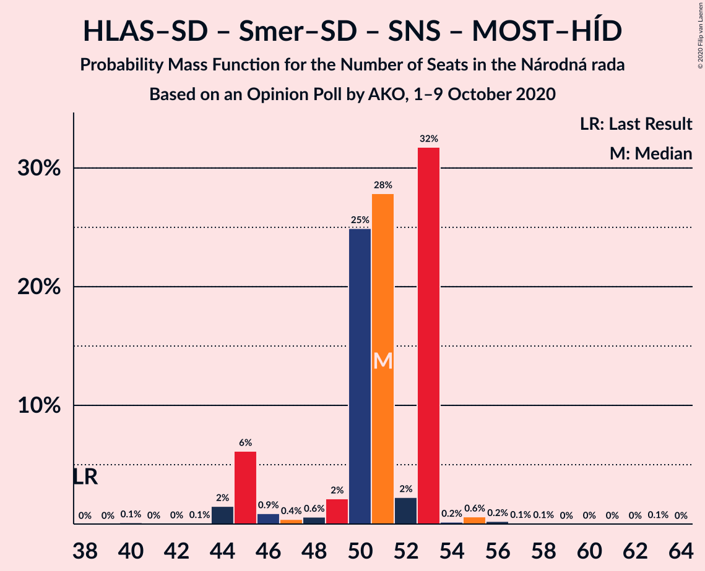

| Number of Seats | Probability | Accumulated | Special Marks |
|:---------------:|:-----------:|:-----------:|:-------------:|
| 38 | 0% | 100% | Last Result |
| 39 | 0% | 100% |  |
| 40 | 0.1% | 100% |  |
| 41 | 0% | 99.9% |  |
| 42 | 0% | 99.9% |  |
| 43 | 0.1% | 99.8% |  |
| 44 | 2% | 99.7% |  |
| 45 | 6% | 98% |  |
| 46 | 0.9% | 92% |  |
| 47 | 0.4% | 91% |  |
| 48 | 0.6% | 91% |  |
| 49 | 2% | 90% |  |
| 50 | 25% | 88% |  |
| 51 | 28% | 63% |  |
| 52 | 2% | 35% | Median |
| 53 | 32% | 33% |  |
| 54 | 0.2% | 1.3% |  |
| 55 | 0.6% | 1.1% |  |
| 56 | 0.2% | 0.5% |  |
| 57 | 0.1% | 0.2% |  |
| 58 | 0.1% | 0.2% |  |
| 59 | 0% | 0.1% |  |
| 60 | 0% | 0.1% |  |
| 61 | 0% | 0.1% |  |
| 62 | 0% | 0.1% |  |
| 63 | 0.1% | 0.1% |  |
| 64 | 0% | 0% |  |

### HLAS–sociálna demokracia – SMER–sociálna demokracia – Slovenská národná strana

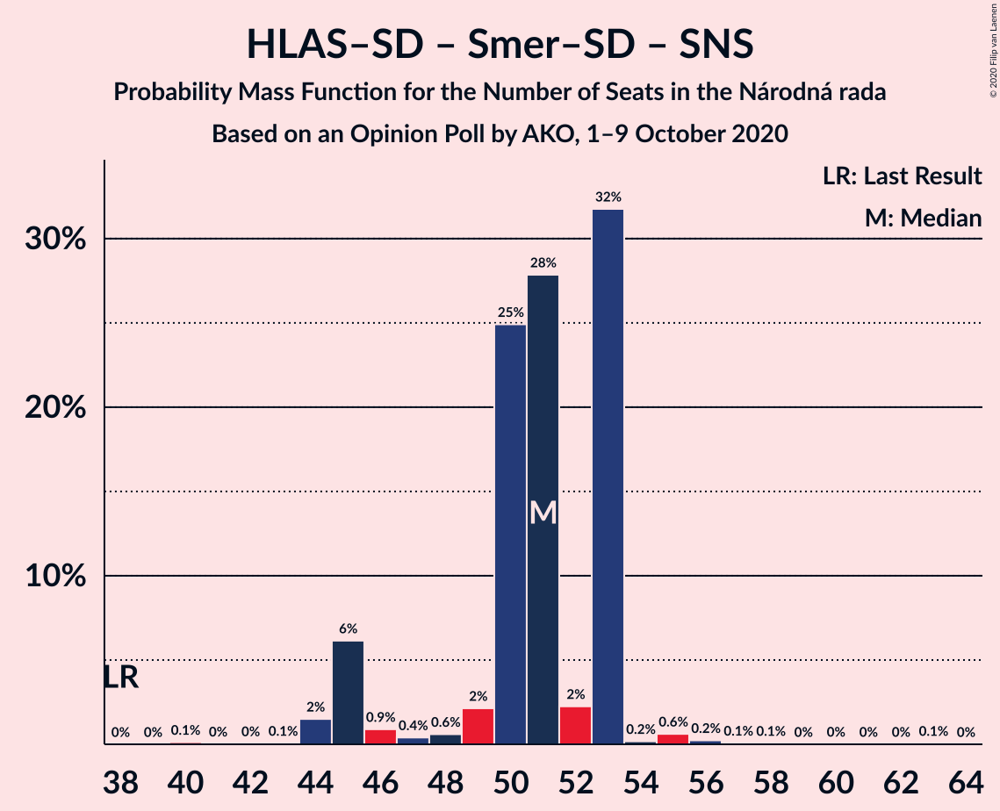

| Number of Seats | Probability | Accumulated | Special Marks |
|:---------------:|:-----------:|:-----------:|:-------------:|
| 38 | 0% | 100% | Last Result |
| 39 | 0% | 100% |  |
| 40 | 0.1% | 100% |  |
| 41 | 0% | 99.9% |  |
| 42 | 0% | 99.9% |  |
| 43 | 0.1% | 99.8% |  |
| 44 | 2% | 99.7% |  |
| 45 | 6% | 98% |  |
| 46 | 0.9% | 92% |  |
| 47 | 0.4% | 91% |  |
| 48 | 0.6% | 91% |  |
| 49 | 2% | 90% |  |
| 50 | 25% | 88% |  |
| 51 | 28% | 63% |  |
| 52 | 2% | 35% | Median |
| 53 | 32% | 33% |  |
| 54 | 0.2% | 1.3% |  |
| 55 | 0.6% | 1.1% |  |
| 56 | 0.2% | 0.5% |  |
| 57 | 0.1% | 0.2% |  |
| 58 | 0.1% | 0.2% |  |
| 59 | 0% | 0.1% |  |
| 60 | 0% | 0.1% |  |
| 61 | 0% | 0.1% |  |
| 62 | 0% | 0.1% |  |
| 63 | 0.1% | 0.1% |  |
| 64 | 0% | 0% |  |

### SME RODINA – Kotleba–Ľudová strana Naše Slovensko – SMER–sociálna demokracia – Slovenská národná strana

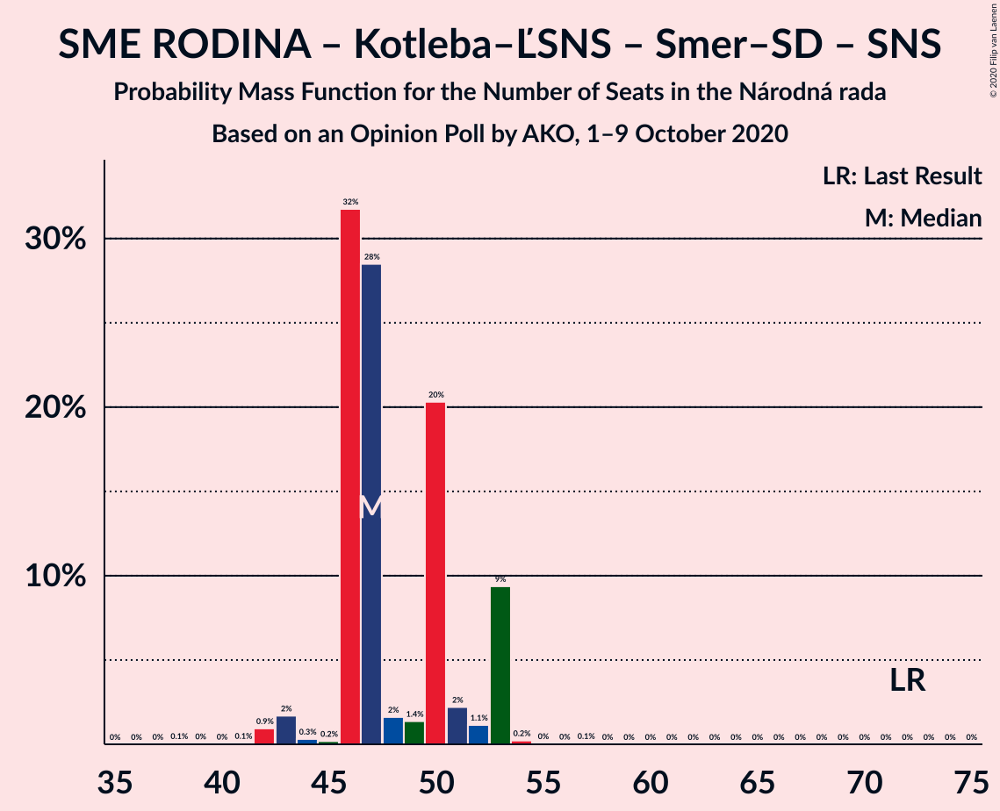

| Number of Seats | Probability | Accumulated | Special Marks |
|:---------------:|:-----------:|:-----------:|:-------------:|
| 38 | 0.1% | 100% |  |
| 39 | 0% | 99.9% |  |
| 40 | 0% | 99.9% |  |
| 41 | 0.1% | 99.9% |  |
| 42 | 0.9% | 99.8% |  |
| 43 | 2% | 98.9% |  |
| 44 | 0.3% | 97% |  |
| 45 | 0.2% | 97% |  |
| 46 | 32% | 97% |  |
| 47 | 28% | 65% | Median |
| 48 | 2% | 36% |  |
| 49 | 1.4% | 35% |  |
| 50 | 20% | 33% |  |
| 51 | 2% | 13% |  |
| 52 | 1.1% | 11% |  |
| 53 | 9% | 10% |  |
| 54 | 0.2% | 0.4% |  |
| 55 | 0% | 0.1% |  |
| 56 | 0% | 0.1% |  |
| 57 | 0.1% | 0.1% |  |
| 58 | 0% | 0% |  |
| 59 | 0% | 0% |  |
| 60 | 0% | 0% |  |
| 61 | 0% | 0% |  |
| 62 | 0% | 0% |  |
| 63 | 0% | 0% |  |
| 64 | 0% | 0% |  |
| 65 | 0% | 0% |  |
| 66 | 0% | 0% |  |
| 67 | 0% | 0% |  |
| 68 | 0% | 0% |  |
| 69 | 0% | 0% |  |
| 70 | 0% | 0% |  |
| 71 | 0% | 0% |  |
| 72 | 0% | 0% | Last Result |

### HLAS–sociálna demokracia – Slovenská národná strana – MOST–HÍD

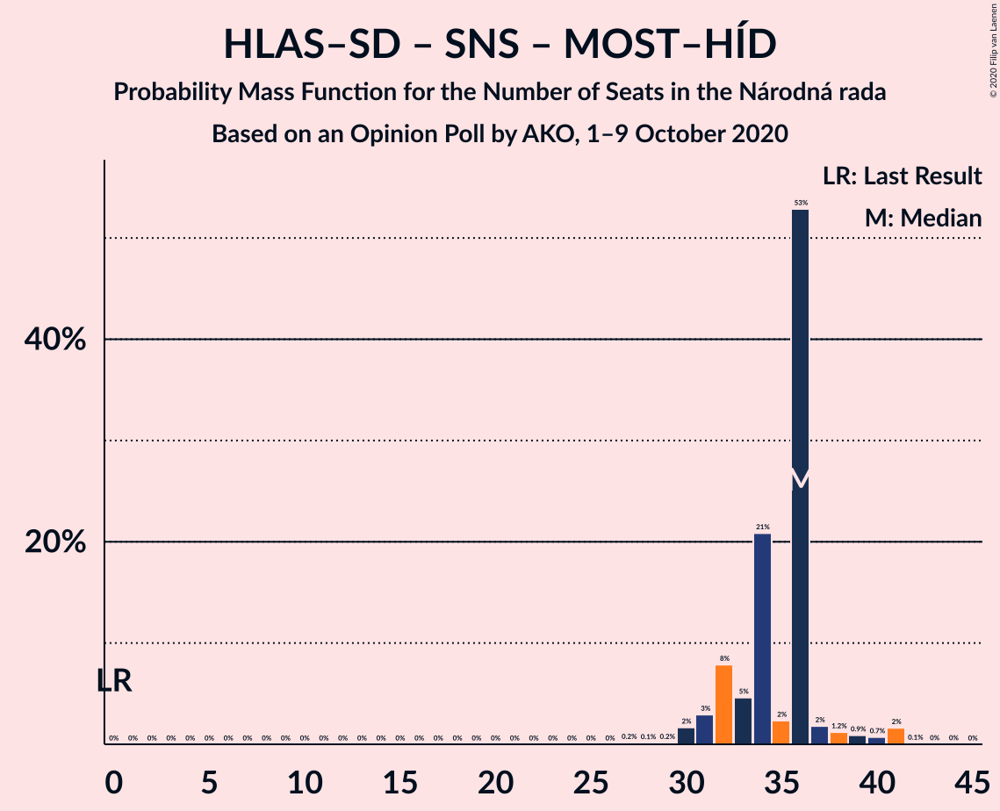

| Number of Seats | Probability | Accumulated | Special Marks |
|:---------------:|:-----------:|:-----------:|:-------------:|
| 0 | 0% | 100% | Last Result |
| 1 | 0% | 100% |  |
| 2 | 0% | 100% |  |
| 3 | 0% | 100% |  |
| 4 | 0% | 100% |  |
| 5 | 0% | 100% |  |
| 6 | 0% | 100% |  |
| 7 | 0% | 100% |  |
| 8 | 0% | 100% |  |
| 9 | 0% | 100% |  |
| 10 | 0% | 100% |  |
| 11 | 0% | 100% |  |
| 12 | 0% | 100% |  |
| 13 | 0% | 100% |  |
| 14 | 0% | 100% |  |
| 15 | 0% | 100% |  |
| 16 | 0% | 100% |  |
| 17 | 0% | 100% |  |
| 18 | 0% | 100% |  |
| 19 | 0% | 100% |  |
| 20 | 0% | 100% |  |
| 21 | 0% | 100% |  |
| 22 | 0% | 100% |  |
| 23 | 0% | 100% |  |
| 24 | 0% | 100% |  |
| 25 | 0% | 100% |  |
| 26 | 0% | 100% |  |
| 27 | 0.2% | 100% |  |
| 28 | 0.1% | 99.8% |  |
| 29 | 0.2% | 99.7% |  |
| 30 | 2% | 99.6% |  |
| 31 | 3% | 98% |  |
| 32 | 8% | 95% |  |
| 33 | 5% | 87% |  |
| 34 | 21% | 82% |  |
| 35 | 2% | 62% |  |
| 36 | 53% | 59% | Median |
| 37 | 2% | 6% |  |
| 38 | 1.2% | 5% |  |
| 39 | 0.9% | 3% |  |
| 40 | 0.7% | 2% |  |
| 41 | 2% | 2% |  |
| 42 | 0.1% | 0.1% |  |
| 43 | 0% | 0.1% |  |
| 44 | 0% | 0% |  |

### HLAS–sociálna demokracia – Slovenská národná strana

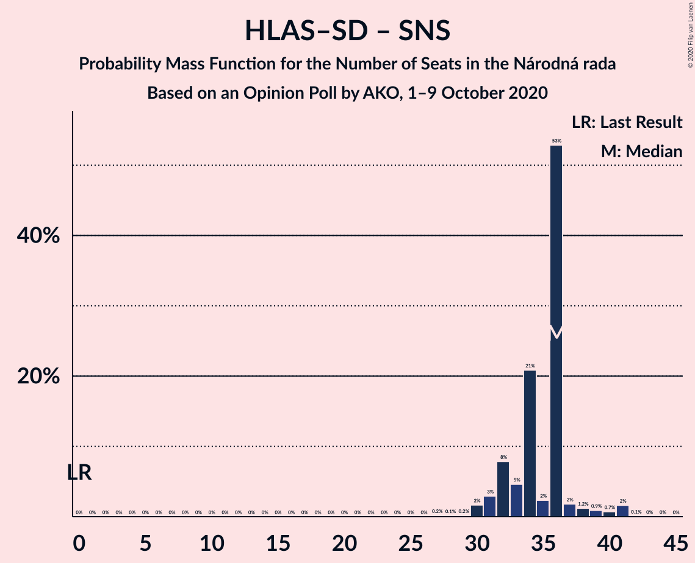

| Number of Seats | Probability | Accumulated | Special Marks |
|:---------------:|:-----------:|:-----------:|:-------------:|
| 0 | 0% | 100% | Last Result |
| 1 | 0% | 100% |  |
| 2 | 0% | 100% |  |
| 3 | 0% | 100% |  |
| 4 | 0% | 100% |  |
| 5 | 0% | 100% |  |
| 6 | 0% | 100% |  |
| 7 | 0% | 100% |  |
| 8 | 0% | 100% |  |
| 9 | 0% | 100% |  |
| 10 | 0% | 100% |  |
| 11 | 0% | 100% |  |
| 12 | 0% | 100% |  |
| 13 | 0% | 100% |  |
| 14 | 0% | 100% |  |
| 15 | 0% | 100% |  |
| 16 | 0% | 100% |  |
| 17 | 0% | 100% |  |
| 18 | 0% | 100% |  |
| 19 | 0% | 100% |  |
| 20 | 0% | 100% |  |
| 21 | 0% | 100% |  |
| 22 | 0% | 100% |  |
| 23 | 0% | 100% |  |
| 24 | 0% | 100% |  |
| 25 | 0% | 100% |  |
| 26 | 0% | 100% |  |
| 27 | 0.2% | 100% |  |
| 28 | 0.1% | 99.8% |  |
| 29 | 0.2% | 99.7% |  |
| 30 | 2% | 99.6% |  |
| 31 | 3% | 98% |  |
| 32 | 8% | 95% |  |
| 33 | 5% | 87% |  |
| 34 | 21% | 82% |  |
| 35 | 2% | 62% |  |
| 36 | 53% | 59% | Median |
| 37 | 2% | 6% |  |
| 38 | 1.2% | 5% |  |
| 39 | 0.9% | 3% |  |
| 40 | 0.7% | 2% |  |
| 41 | 2% | 2% |  |
| 42 | 0.1% | 0.1% |  |
| 43 | 0% | 0.1% |  |
| 44 | 0% | 0% |  |

### SME RODINA – SMER–sociálna demokracia

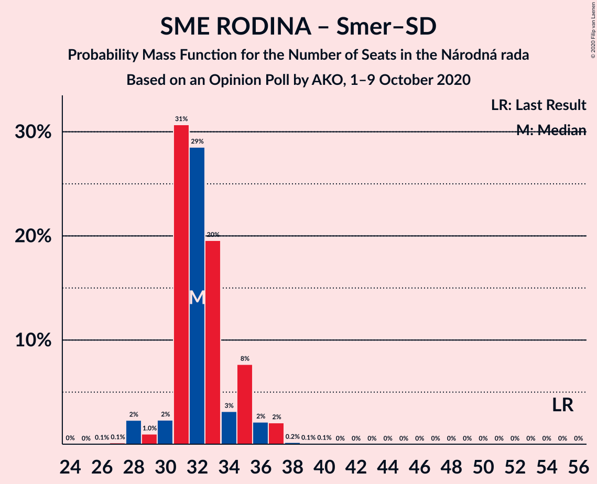

| Number of Seats | Probability | Accumulated | Special Marks |
|:---------------:|:-----------:|:-----------:|:-------------:|
| 24 | 0% | 100% |  |
| 25 | 0% | 99.9% |  |
| 26 | 0.1% | 99.9% |  |
| 27 | 0.1% | 99.8% |  |
| 28 | 2% | 99.7% |  |
| 29 | 1.0% | 97% |  |
| 30 | 2% | 96% |  |
| 31 | 31% | 94% |  |
| 32 | 29% | 63% | Median |
| 33 | 20% | 35% |  |
| 34 | 3% | 15% |  |
| 35 | 8% | 12% |  |
| 36 | 2% | 5% |  |
| 37 | 2% | 2% |  |
| 38 | 0.2% | 0.3% |  |
| 39 | 0.1% | 0.2% |  |
| 40 | 0.1% | 0.1% |  |
| 41 | 0% | 0% |  |
| 42 | 0% | 0% |  |
| 43 | 0% | 0% |  |
| 44 | 0% | 0% |  |
| 45 | 0% | 0% |  |
| 46 | 0% | 0% |  |
| 47 | 0% | 0% |  |
| 48 | 0% | 0% |  |
| 49 | 0% | 0% |  |
| 50 | 0% | 0% |  |
| 51 | 0% | 0% |  |
| 52 | 0% | 0% |  |
| 53 | 0% | 0% |  |
| 54 | 0% | 0% |  |
| 55 | 0% | 0% | Last Result |

### SME RODINA – SMER–sociálna demokracia – Slovenská národná strana

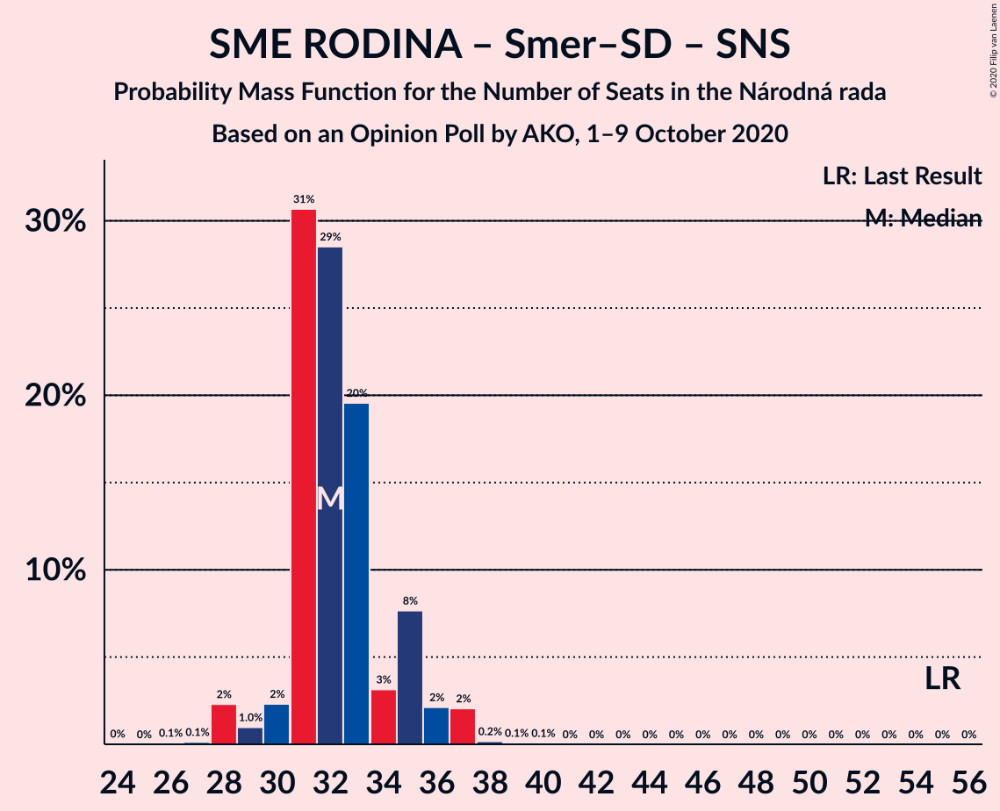

| Number of Seats | Probability | Accumulated | Special Marks |
|:---------------:|:-----------:|:-----------:|:-------------:|
| 24 | 0% | 100% |  |
| 25 | 0% | 99.9% |  |
| 26 | 0.1% | 99.9% |  |
| 27 | 0.1% | 99.8% |  |
| 28 | 2% | 99.7% |  |
| 29 | 1.0% | 97% |  |
| 30 | 2% | 96% |  |
| 31 | 31% | 94% |  |
| 32 | 29% | 63% | Median |
| 33 | 20% | 35% |  |
| 34 | 3% | 15% |  |
| 35 | 8% | 12% |  |
| 36 | 2% | 5% |  |
| 37 | 2% | 2% |  |
| 38 | 0.2% | 0.3% |  |
| 39 | 0.1% | 0.2% |  |
| 40 | 0.1% | 0.1% |  |
| 41 | 0% | 0% |  |
| 42 | 0% | 0% |  |
| 43 | 0% | 0% |  |
| 44 | 0% | 0% |  |
| 45 | 0% | 0% |  |
| 46 | 0% | 0% |  |
| 47 | 0% | 0% |  |
| 48 | 0% | 0% |  |
| 49 | 0% | 0% |  |
| 50 | 0% | 0% |  |
| 51 | 0% | 0% |  |
| 52 | 0% | 0% |  |
| 53 | 0% | 0% |  |
| 54 | 0% | 0% |  |
| 55 | 0% | 0% | Last Result |

### SMER–sociálna demokracia – Slovenská národná strana – MOST–HÍD

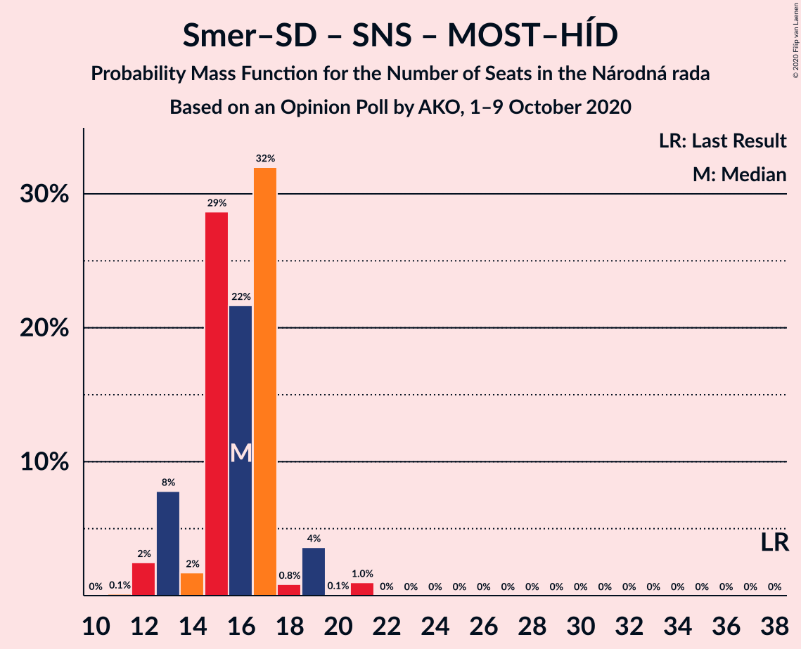

| Number of Seats | Probability | Accumulated | Special Marks |
|:---------------:|:-----------:|:-----------:|:-------------:|
| 11 | 0.1% | 100% |  |
| 12 | 2% | 99.9% |  |
| 13 | 8% | 97% |  |
| 14 | 2% | 90% |  |
| 15 | 29% | 88% |  |
| 16 | 22% | 59% | Median |
| 17 | 32% | 38% |  |
| 18 | 0.8% | 6% |  |
| 19 | 4% | 5% |  |
| 20 | 0.1% | 1.1% |  |
| 21 | 1.0% | 1.0% |  |
| 22 | 0% | 0% |  |
| 23 | 0% | 0% |  |
| 24 | 0% | 0% |  |
| 25 | 0% | 0% |  |
| 26 | 0% | 0% |  |
| 27 | 0% | 0% |  |
| 28 | 0% | 0% |  |
| 29 | 0% | 0% |  |
| 30 | 0% | 0% |  |
| 31 | 0% | 0% |  |
| 32 | 0% | 0% |  |
| 33 | 0% | 0% |  |
| 34 | 0% | 0% |  |
| 35 | 0% | 0% |  |
| 36 | 0% | 0% |  |
| 37 | 0% | 0% |  |
| 38 | 0% | 0% | Last Result |

### SMER–sociálna demokracia

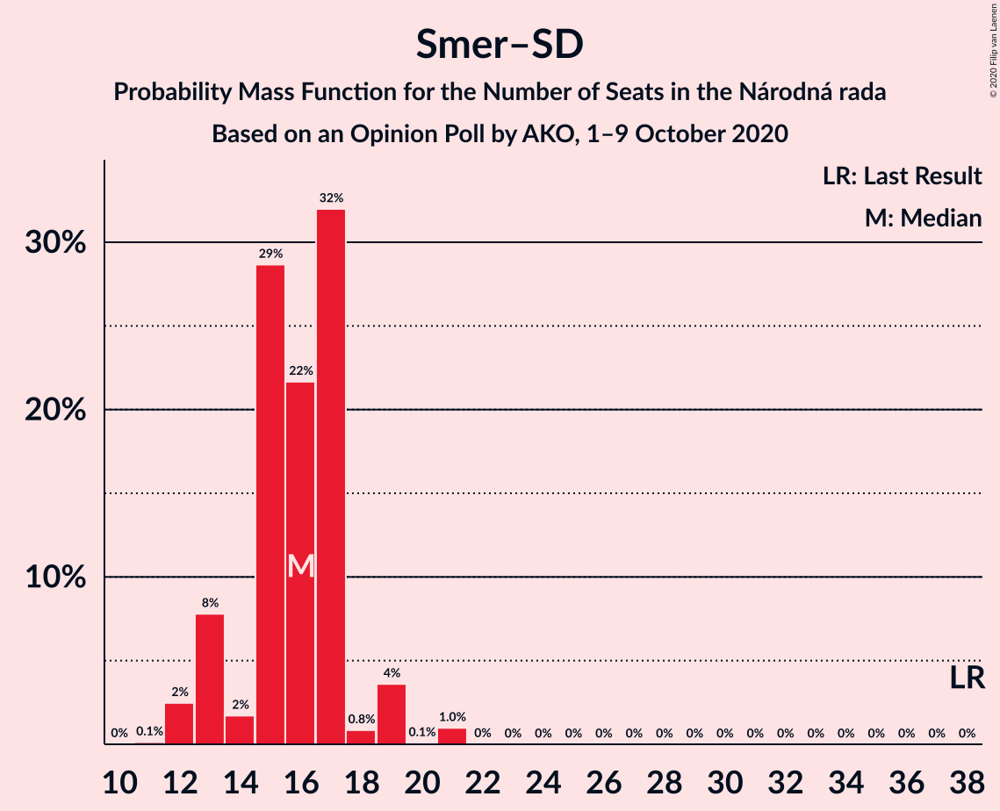

| Number of Seats | Probability | Accumulated | Special Marks |
|:---------------:|:-----------:|:-----------:|:-------------:|
| 11 | 0.1% | 100% |  |
| 12 | 2% | 99.9% |  |
| 13 | 8% | 97% |  |
| 14 | 2% | 90% |  |
| 15 | 29% | 88% |  |
| 16 | 22% | 59% | Median |
| 17 | 32% | 38% |  |
| 18 | 0.8% | 6% |  |
| 19 | 4% | 5% |  |
| 20 | 0.1% | 1.1% |  |
| 21 | 1.0% | 1.0% |  |
| 22 | 0% | 0% |  |
| 23 | 0% | 0% |  |
| 24 | 0% | 0% |  |
| 25 | 0% | 0% |  |
| 26 | 0% | 0% |  |
| 27 | 0% | 0% |  |
| 28 | 0% | 0% |  |
| 29 | 0% | 0% |  |
| 30 | 0% | 0% |  |
| 31 | 0% | 0% |  |
| 32 | 0% | 0% |  |
| 33 | 0% | 0% |  |
| 34 | 0% | 0% |  |
| 35 | 0% | 0% |  |
| 36 | 0% | 0% |  |
| 37 | 0% | 0% |  |
| 38 | 0% | 0% | Last Result |

### SMER–sociálna demokracia – Slovenská národná strana

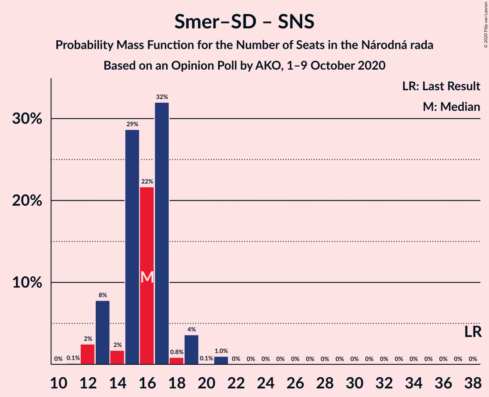

| Number of Seats | Probability | Accumulated | Special Marks |
|:---------------:|:-----------:|:-----------:|:-------------:|
| 11 | 0.1% | 100% |  |
| 12 | 2% | 99.9% |  |
| 13 | 8% | 97% |  |
| 14 | 2% | 90% |  |
| 15 | 29% | 88% |  |
| 16 | 22% | 59% | Median |
| 17 | 32% | 38% |  |
| 18 | 0.8% | 6% |  |
| 19 | 4% | 5% |  |
| 20 | 0.1% | 1.1% |  |
| 21 | 1.0% | 1.0% |  |
| 22 | 0% | 0% |  |
| 23 | 0% | 0% |  |
| 24 | 0% | 0% |  |
| 25 | 0% | 0% |  |
| 26 | 0% | 0% |  |
| 27 | 0% | 0% |  |
| 28 | 0% | 0% |  |
| 29 | 0% | 0% |  |
| 30 | 0% | 0% |  |
| 31 | 0% | 0% |  |
| 32 | 0% | 0% |  |
| 33 | 0% | 0% |  |
| 34 | 0% | 0% |  |
| 35 | 0% | 0% |  |
| 36 | 0% | 0% |  |
| 37 | 0% | 0% |  |
| 38 | 0% | 0% | Last Result |

## Technical Information

### Opinion Poll

+ **Polling firm:** AKO
+ **Commissioner(s):** —
+ **Fieldwork period:** 1–9 October 2020

### Calculations

+ **Sample size:** 1000
+ **Simulations done:** 1,048,576
+ **Error estimate:** 5.30%

