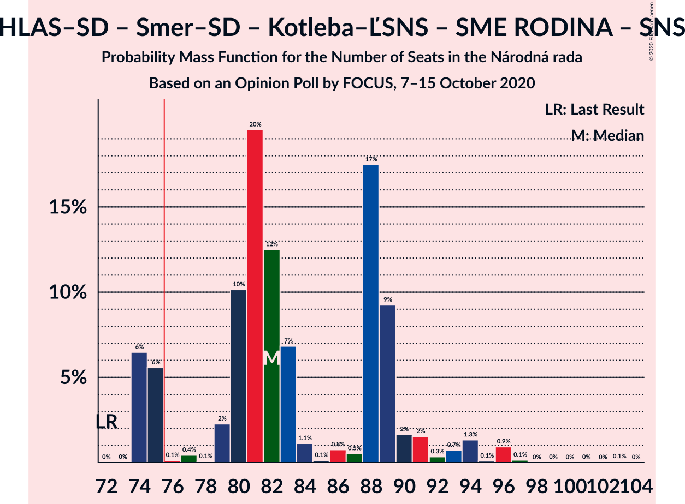

# Opinion Poll by FOCUS, 7–15 October 2020

<a href="#voting-intentions">Voting Intentions</a> | <a href="#seats">Seats</a> | <a href="#coalitions">Coalitions</a> | <a href="#technical-information">Technical Information</a>

## Voting Intentions

### Confidence Intervals

| Party | Last Result | Poll Result | 80% Confidence Interval | 90% Confidence Interval | 95% Confidence Interval | 99% Confidence Interval |
|:-----:|:-----------:|:-----------:|:-----------------------:|:-----------------------:|:-----------------------:|:-----------------------:|
| HLAS–sociálna demokracia | 0.0% | 18.7% | 17.2–20.4% |16.8–20.9% |16.4–21.3% |15.8–22.1% |
| OBYČAJNÍ ĽUDIA a nezávislé osobnosti | 25.0% | 15.1% | 13.7–16.6% |13.3–17.1% |13.0–17.4% |12.4–18.2% |
| Sloboda a Solidarita | 6.2% | 10.7% | 9.5–12.0% |9.2–12.4% |8.9–12.7% |8.4–13.4% |
| SMER–sociálna demokracia | 18.3% | 10.5% | 9.3–11.8% |9.0–12.2% |8.7–12.5% |8.2–13.2% |
| Kotleba–Ľudová strana Naše Slovensko | 8.0% | 9.8% | 8.7–11.1% |8.4–11.4% |8.1–11.8% |7.6–12.4% |
| SME RODINA | 8.2% | 7.3% | 6.3–8.5% |6.1–8.8% |5.9–9.1% |5.4–9.7% |
| Progresívne Slovensko | 7.0% | 5.4% | 4.6–6.4% |4.4–6.7% |4.2–7.0% |3.8–7.5% |
| Kresťanskodemokratické hnutie | 4.6% | 5.2% | 4.4–6.2% |4.2–6.5% |4.0–6.8% |3.7–7.3% |
| Za ľudí | 5.8% | 4.8% | 4.1–5.8% |3.9–6.1% |3.7–6.3% |3.3–6.8% |
| Strana maďarskej koalície–Magyar Koalíció Pártja | 3.9% | 3.2% | 2.5–4.0% |2.4–4.2% |2.2–4.4% |2.0–4.9% |
| MOST–HÍD | 2.0% | 2.4% | 1.9–3.1% |1.7–3.3% |1.6–3.5% |1.4–3.9% |
| Slovenská národná strana | 3.2% | 2.1% | 1.6–2.8% |1.5–3.0% |1.4–3.2% |1.2–3.5% |
| Dobrá voľba | 3.1% | 2.1% | 1.6–2.8% |1.5–3.0% |1.4–3.2% |1.2–3.5% |
| VLASŤ | 2.9% | 1.6% | 1.2–2.2% |1.1–2.4% |1.0–2.6% |0.8–2.9% |
| SPOLU–Občianska Demokracia | 7.0% | 0.3% | 0.2–0.7% |0.1–0.8% |0.1–0.9% |0.1–1.1% |

*Note:* The poll result column reflects the actual value used in the calculations. Published results may vary slightly, and in addition be rounded to fewer digits.

## Seats

### Confidence Intervals

| Party | Last Result | Median | 80% Confidence Interval | 90% Confidence Interval | 95% Confidence Interval | 99% Confidence Interval |
|:-----:|:-----------:|:------:|:-----------------------:|:-----------------------:|:-----------------------:|:-----------------------:|
| <a href="#hlas–sociálna-demokracia">HLAS–sociálna demokracia</a> | 0 | 33 | 30–37 |30–40 |30–40 |29–41 |
| <a href="#obyčajní-ľudia-a-nezávislé-osobnosti">OBYČAJNÍ ĽUDIA a nezávislé osobnosti</a> | 53 | 27 | 24–31 |24–32 |24–34 |22–35 |
| <a href="#sloboda-a-solidarita">Sloboda a Solidarita</a> | 13 | 20 | 17–24 |16–24 |15–24 |15–24 |
| <a href="#smer–sociálna-demokracia">SMER–sociálna demokracia</a> | 38 | 17 | 16–21 |16–21 |16–22 |15–24 |
| <a href="#kotleba–ľudová-strana-naše-slovensko">Kotleba–Ľudová strana Naše Slovensko</a> | 17 | 18 | 15–20 |15–20 |14–21 |14–24 |
| <a href="#sme-rodina">SME RODINA</a> | 17 | 13 | 12–15 |11–15 |9–15 |9–18 |
| <a href="#progresívne-slovensko">Progresívne Slovensko</a> | 0 | 11 | 0–12 |0–13 |0–13 |0–13 |
| <a href="#kresťanskodemokratické-hnutie">Kresťanskodemokratické hnutie</a> | 0 | 9 | 0–11 |0–11 |0–12 |0–13 |
| <a href="#za-ľudí">Za ľudí</a> | 12 | 0 | 0–10 |0–11 |0–12 |0–12 |
| <a href="#strana-maďarskej-koalície–magyar-koalíció-pártja">Strana maďarskej koalície–Magyar Koalíció Pártja</a> | 0 | 0 | 0 |0 |0 |0 |
| <a href="#most–híd">MOST–HÍD</a> | 0 | 0 | 0 |0 |0 |0 |
| <a href="#slovenská-národná-strana">Slovenská národná strana</a> | 0 | 0 | 0 |0 |0 |0 |
| <a href="#dobrá-voľba">Dobrá voľba</a> | 0 | 0 | 0 |0 |0 |0 |
| <a href="#vlasť">VLASŤ</a> | 0 | 0 | 0 |0 |0 |0 |
| <a href="#spolu–občianska-demokracia">SPOLU–Občianska Demokracia</a> | 0 | 0 | 0 |0 |0 |0 |

### HLAS–sociálna demokracia

*For a full overview of the results for this party, see the [HLAS–sociálna demokracia](party-hlas–sociálnademokracia.html) page.*

| Number of Seats | Probability | Accumulated | Special Marks |
|:---------------:|:-----------:|:-----------:|:-------------:|
| 0 | 0% | 100% | Last Result |
| 1 | 0% | 100% |  |
| 2 | 0% | 100% |  |
| 3 | 0% | 100% |  |
| 4 | 0% | 100% |  |
| 5 | 0% | 100% |  |
| 6 | 0% | 100% |  |
| 7 | 0% | 100% |  |
| 8 | 0% | 100% |  |
| 9 | 0% | 100% |  |
| 10 | 0% | 100% |  |
| 11 | 0% | 100% |  |
| 12 | 0% | 100% |  |
| 13 | 0% | 100% |  |
| 14 | 0% | 100% |  |
| 15 | 0% | 100% |  |
| 16 | 0% | 100% |  |
| 17 | 0% | 100% |  |
| 18 | 0% | 100% |  |
| 19 | 0% | 100% |  |
| 20 | 0% | 100% |  |
| 21 | 0% | 100% |  |
| 22 | 0% | 100% |  |
| 23 | 0% | 100% |  |
| 24 | 0% | 100% |  |
| 25 | 0% | 100% |  |
| 26 | 0% | 100% |  |
| 27 | 0.1% | 100% |  |
| 28 | 0% | 99.9% |  |
| 29 | 1.2% | 99.8% |  |
| 30 | 10% | 98.6% |  |
| 31 | 16% | 88% |  |
| 32 | 5% | 72% |  |
| 33 | 23% | 68% | Median |
| 34 | 2% | 45% |  |
| 35 | 12% | 43% |  |
| 36 | 5% | 31% |  |
| 37 | 16% | 26% |  |
| 38 | 3% | 10% |  |
| 39 | 0.5% | 7% |  |
| 40 | 5% | 6% |  |
| 41 | 2% | 2% |  |
| 42 | 0% | 0% |  |

### OBYČAJNÍ ĽUDIA a nezávislé osobnosti

*For a full overview of the results for this party, see the [OBYČAJNÍ ĽUDIA a nezávislé osobnosti](party-obyčajníľudiaanezávisléosobnosti.html) page.*

| Number of Seats | Probability | Accumulated | Special Marks |
|:---------------:|:-----------:|:-----------:|:-------------:|
| 21 | 0% | 100% |  |
| 22 | 0.5% | 99.9% |  |
| 23 | 0.3% | 99.4% |  |
| 24 | 22% | 99.1% |  |
| 25 | 3% | 77% |  |
| 26 | 21% | 74% |  |
| 27 | 9% | 53% | Median |
| 28 | 18% | 44% |  |
| 29 | 3% | 25% |  |
| 30 | 11% | 22% |  |
| 31 | 3% | 12% |  |
| 32 | 6% | 9% |  |
| 33 | 0.1% | 3% |  |
| 34 | 3% | 3% |  |
| 35 | 0.7% | 0.7% |  |
| 36 | 0% | 0% |  |
| 37 | 0% | 0% |  |
| 38 | 0% | 0% |  |
| 39 | 0% | 0% |  |
| 40 | 0% | 0% |  |
| 41 | 0% | 0% |  |
| 42 | 0% | 0% |  |
| 43 | 0% | 0% |  |
| 44 | 0% | 0% |  |
| 45 | 0% | 0% |  |
| 46 | 0% | 0% |  |
| 47 | 0% | 0% |  |
| 48 | 0% | 0% |  |
| 49 | 0% | 0% |  |
| 50 | 0% | 0% |  |
| 51 | 0% | 0% |  |
| 52 | 0% | 0% |  |
| 53 | 0% | 0% | Last Result |

### Sloboda a Solidarita

*For a full overview of the results for this party, see the [Sloboda a Solidarita](party-slobodaasolidarita.html) page.*

| Number of Seats | Probability | Accumulated | Special Marks |
|:---------------:|:-----------:|:-----------:|:-------------:|
| 13 | 0% | 100% | Last Result |
| 14 | 0.1% | 100% |  |
| 15 | 4% | 99.9% |  |
| 16 | 3% | 96% |  |
| 17 | 13% | 93% |  |
| 18 | 13% | 80% |  |
| 19 | 1.4% | 68% |  |
| 20 | 24% | 66% | Median |
| 21 | 8% | 42% |  |
| 22 | 4% | 34% |  |
| 23 | 14% | 30% |  |
| 24 | 16% | 17% |  |
| 25 | 0.2% | 0.3% |  |
| 26 | 0% | 0.1% |  |
| 27 | 0% | 0% |  |

### SMER–sociálna demokracia

*For a full overview of the results for this party, see the [SMER–sociálna demokracia](party-smer–sociálnademokracia.html) page.*

| Number of Seats | Probability | Accumulated | Special Marks |
|:---------------:|:-----------:|:-----------:|:-------------:|
| 14 | 0.3% | 100% |  |
| 15 | 0.2% | 99.7% |  |
| 16 | 27% | 99.5% |  |
| 17 | 25% | 73% | Median |
| 18 | 1.3% | 48% |  |
| 19 | 23% | 47% |  |
| 20 | 11% | 24% |  |
| 21 | 9% | 13% |  |
| 22 | 2% | 4% |  |
| 23 | 0.9% | 2% |  |
| 24 | 1.1% | 1.2% |  |
| 25 | 0% | 0.1% |  |
| 26 | 0% | 0% |  |
| 27 | 0% | 0% |  |
| 28 | 0% | 0% |  |
| 29 | 0% | 0% |  |
| 30 | 0% | 0% |  |
| 31 | 0% | 0% |  |
| 32 | 0% | 0% |  |
| 33 | 0% | 0% |  |
| 34 | 0% | 0% |  |
| 35 | 0% | 0% |  |
| 36 | 0% | 0% |  |
| 37 | 0% | 0% |  |
| 38 | 0% | 0% | Last Result |

### Kotleba–Ľudová strana Naše Slovensko

*For a full overview of the results for this party, see the [Kotleba–Ľudová strana Naše Slovensko](party-kotleba–ľudovástrananašeslovensko.html) page.*

| Number of Seats | Probability | Accumulated | Special Marks |
|:---------------:|:-----------:|:-----------:|:-------------:|
| 12 | 0% | 100% |  |
| 13 | 0.1% | 99.9% |  |
| 14 | 3% | 99.9% |  |
| 15 | 10% | 97% |  |
| 16 | 5% | 87% |  |
| 17 | 26% | 82% | Last Result |
| 18 | 11% | 56% | Median |
| 19 | 29% | 45% |  |
| 20 | 12% | 16% |  |
| 21 | 2% | 4% |  |
| 22 | 0.9% | 2% |  |
| 23 | 0.1% | 1.0% |  |
| 24 | 0.9% | 0.9% |  |
| 25 | 0% | 0% |  |

### SME RODINA

*For a full overview of the results for this party, see the [SME RODINA](party-smerodina.html) page.*

| Number of Seats | Probability | Accumulated | Special Marks |
|:---------------:|:-----------:|:-----------:|:-------------:|
| 9 | 3% | 100% |  |
| 10 | 0.9% | 97% |  |
| 11 | 5% | 96% |  |
| 12 | 26% | 91% |  |
| 13 | 31% | 65% | Median |
| 14 | 6% | 35% |  |
| 15 | 27% | 29% |  |
| 16 | 0.7% | 2% |  |
| 17 | 0.5% | 2% | Last Result |
| 18 | 1.0% | 1.1% |  |
| 19 | 0.1% | 0.1% |  |
| 20 | 0% | 0% |  |

### Progresívne Slovensko

*For a full overview of the results for this party, see the [Progresívne Slovensko](party-progresívneslovensko.html) page.*

| Number of Seats | Probability | Accumulated | Special Marks |
|:---------------:|:-----------:|:-----------:|:-------------:|
| 0 | 26% | 100% | Last Result |
| 1 | 0% | 74% |  |
| 2 | 0% | 74% |  |
| 3 | 0% | 74% |  |
| 4 | 0% | 74% |  |
| 5 | 0% | 74% |  |
| 6 | 0% | 74% |  |
| 7 | 0% | 74% |  |
| 8 | 0% | 74% |  |
| 9 | 10% | 74% |  |
| 10 | 6% | 64% |  |
| 11 | 16% | 58% | Median |
| 12 | 34% | 41% |  |
| 13 | 7% | 7% |  |
| 14 | 0.4% | 0.4% |  |
| 15 | 0% | 0% |  |

### Kresťanskodemokratické hnutie

*For a full overview of the results for this party, see the [Kresťanskodemokratické hnutie](party-kresťanskodemokratickéhnutie.html) page.*

| Number of Seats | Probability | Accumulated | Special Marks |
|:---------------:|:-----------:|:-----------:|:-------------:|
| 0 | 37% | 100% | Last Result |
| 1 | 0% | 63% |  |
| 2 | 0% | 63% |  |
| 3 | 0% | 63% |  |
| 4 | 0% | 63% |  |
| 5 | 0% | 63% |  |
| 6 | 0% | 63% |  |
| 7 | 0% | 63% |  |
| 8 | 0% | 63% |  |
| 9 | 14% | 63% | Median |
| 10 | 24% | 50% |  |
| 11 | 20% | 25% |  |
| 12 | 4% | 5% |  |
| 13 | 0.4% | 0.6% |  |
| 14 | 0.2% | 0.2% |  |
| 15 | 0% | 0% |  |

### Za ľudí

*For a full overview of the results for this party, see the [Za ľudí](party-zaľudí.html) page.*

| Number of Seats | Probability | Accumulated | Special Marks |
|:---------------:|:-----------:|:-----------:|:-------------:|
| 0 | 55% | 100% | Median |
| 1 | 0% | 45% |  |
| 2 | 0% | 45% |  |
| 3 | 0% | 45% |  |
| 4 | 0% | 45% |  |
| 5 | 0% | 45% |  |
| 6 | 0% | 45% |  |
| 7 | 0% | 45% |  |
| 8 | 0% | 45% |  |
| 9 | 16% | 45% |  |
| 10 | 24% | 29% |  |
| 11 | 0.9% | 5% |  |
| 12 | 4% | 4% | Last Result |
| 13 | 0.2% | 0.2% |  |
| 14 | 0.1% | 0.1% |  |
| 15 | 0% | 0% |  |

### Strana maďarskej koalície–Magyar Koalíció Pártja

*For a full overview of the results for this party, see the [Strana maďarskej koalície–Magyar Koalíció Pártja](party-stranamaďarskejkoalície–magyarkoalíciópártja.html) page.*

| Number of Seats | Probability | Accumulated | Special Marks |
|:---------------:|:-----------:|:-----------:|:-------------:|
| 0 | 99.7% | 100% | Last Result, Median |
| 1 | 0% | 0.3% |  |
| 2 | 0% | 0.3% |  |
| 3 | 0% | 0.3% |  |
| 4 | 0% | 0.3% |  |
| 5 | 0% | 0.3% |  |
| 6 | 0% | 0.3% |  |
| 7 | 0% | 0.3% |  |
| 8 | 0% | 0.3% |  |
| 9 | 0.3% | 0.3% |  |
| 10 | 0% | 0% |  |

### MOST–HÍD

*For a full overview of the results for this party, see the [MOST–HÍD](party-most–híd.html) page.*

| Number of Seats | Probability | Accumulated | Special Marks |
|:---------------:|:-----------:|:-----------:|:-------------:|
| 0 | 100% | 100% | Last Result, Median |

### Slovenská národná strana

*For a full overview of the results for this party, see the [Slovenská národná strana](party-slovenskánárodnástrana.html) page.*

| Number of Seats | Probability | Accumulated | Special Marks |
|:---------------:|:-----------:|:-----------:|:-------------:|
| 0 | 100% | 100% | Last Result, Median |

### Dobrá voľba

*For a full overview of the results for this party, see the [Dobrá voľba](party-dobrávoľba.html) page.*

| Number of Seats | Probability | Accumulated | Special Marks |
|:---------------:|:-----------:|:-----------:|:-------------:|
| 0 | 100% | 100% | Last Result, Median |

### VLASŤ

*For a full overview of the results for this party, see the [VLASŤ](party-vlasť.html) page.*

| Number of Seats | Probability | Accumulated | Special Marks |
|:---------------:|:-----------:|:-----------:|:-------------:|
| 0 | 100% | 100% | Last Result, Median |

### SPOLU–Občianska Demokracia

*For a full overview of the results for this party, see the [SPOLU–Občianska Demokracia](party-spolu–občianskademokracia.html) page.*

| Number of Seats | Probability | Accumulated | Special Marks |
|:---------------:|:-----------:|:-----------:|:-------------:|
| 0 | 100% | 100% | Last Result, Median |

## Coalitions

### Confidence Intervals

| Coalition | Last Result | Median | Majority? | 80% Confidence Interval | 90% Confidence Interval | 95% Confidence Interval | 99% Confidence Interval |
|:---------:|:-----------:|:------:|:---------:|:-----------------------:|:-----------------------:|:-----------------------:|:-----------------------:|
| HLAS–sociálna demokracia – SMER–sociálna demokracia – Kotleba–Ľudová strana Naše Slovensko – SME RODINA – Slovenská národná strana | 72 | 82 | 88% | 75–89 | 74–91 | 74–94 | 74–96 |
| HLAS–sociálna demokracia – SMER–sociálna demokracia – SME RODINA | 55 | 64 | 0.4% | 60–71 | 59–71 | 59–74 | 59–75 |
| HLAS–sociálna demokracia – SMER–sociálna demokracia – SME RODINA – Slovenská národná strana | 55 | 64 | 0.4% | 60–71 | 59–71 | 59–74 | 59–75 |
| HLAS–sociálna demokracia – Kotleba–Ľudová strana Naše Slovensko – SME RODINA – Slovenská národná strana | 34 | 65 | 0.2% | 58–69 | 56–72 | 55–73 | 55–74 |
| HLAS–sociálna demokracia – SMER–sociálna demokracia – MOST–HÍD – Slovenská národná strana | 38 | 52 | 0% | 48–57 | 47–58 | 47–60 | 47–62 |
| HLAS–sociálna demokracia – SMER–sociálna demokracia – Slovenská národná strana | 38 | 52 | 0% | 48–57 | 47–58 | 47–60 | 47–62 |
| SMER–sociálna demokracia – Kotleba–Ľudová strana Naše Slovensko – SME RODINA – Slovenská národná strana | 72 | 49 | 0% | 45–53 | 43–54 | 43–57 | 43–58 |
| HLAS–sociálna demokracia – SME RODINA | 17 | 46 | 0% | 42–52 | 41–53 | 41–54 | 41–56 |
| HLAS–sociálna demokracia – SME RODINA – Slovenská národná strana | 17 | 46 | 0% | 42–52 | 41–53 | 41–54 | 41–56 |
| HLAS–sociálna demokracia – MOST–HÍD – Slovenská národná strana | 0 | 33 | 0% | 30–37 | 30–40 | 30–40 | 29–41 |
| HLAS–sociálna demokracia – Slovenská národná strana | 0 | 33 | 0% | 30–37 | 30–40 | 30–40 | 29–41 |
| SMER–sociálna demokracia – SME RODINA | 55 | 31 | 0% | 29–34 | 28–34 | 28–36 | 26–39 |
| SMER–sociálna demokracia – SME RODINA – Slovenská národná strana | 55 | 31 | 0% | 29–34 | 28–34 | 28–36 | 26–39 |
| SMER–sociálna demokracia – MOST–HÍD – Slovenská národná strana | 38 | 17 | 0% | 16–21 | 16–21 | 16–22 | 15–24 |
| SMER–sociálna demokracia | 38 | 17 | 0% | 16–21 | 16–21 | 16–22 | 15–24 |
| SMER–sociálna demokracia – Slovenská národná strana | 38 | 17 | 0% | 16–21 | 16–21 | 16–22 | 15–24 |

### HLAS–sociálna demokracia – SMER–sociálna demokracia – Kotleba–Ľudová strana Naše Slovensko – SME RODINA – Slovenská národná strana

| Number of Seats | Probability | Accumulated | Special Marks |
|:---------------:|:-----------:|:-----------:|:-------------:|
| 72 | 0% | 100% | Last Result |
| 73 | 0% | 100% |  |
| 74 | 6% | 100% |  |
| 75 | 6% | 93% |  |
| 76 | 0.1% | 88% | Majority |
| 77 | 0.4% | 88% |  |
| 78 | 0.1% | 87% |  |
| 79 | 2% | 87% |  |
| 80 | 10% | 85% |  |
| 81 | 20% | 75% | Median |
| 82 | 12% | 55% |  |
| 83 | 7% | 43% |  |
| 84 | 1.1% | 36% |  |
| 85 | 0.1% | 35% |  |
| 86 | 0.8% | 35% |  |
| 87 | 0.5% | 34% |  |
| 88 | 17% | 34% |  |
| 89 | 9% | 16% |  |
| 90 | 2% | 7% |  |
| 91 | 2% | 5% |  |
| 92 | 0.3% | 4% |  |
| 93 | 0.7% | 3% |  |
| 94 | 1.3% | 3% |  |
| 95 | 0.1% | 1.2% |  |
| 96 | 0.9% | 1.1% |  |
| 97 | 0.1% | 0.2% |  |
| 98 | 0% | 0.1% |  |
| 99 | 0% | 0.1% |  |
| 100 | 0% | 0.1% |  |
| 101 | 0% | 0.1% |  |
| 102 | 0% | 0.1% |  |
| 103 | 0.1% | 0.1% |  |
| 104 | 0% | 0% |  |

### HLAS–sociálna demokracia – SMER–sociálna demokracia – SME RODINA

| Number of Seats | Probability | Accumulated | Special Marks |
|:---------------:|:-----------:|:-----------:|:-------------:|
| 55 | 0% | 100% | Last Result |
| 56 | 0% | 100% |  |
| 57 | 0% | 100% |  |
| 58 | 0.1% | 99.9% |  |
| 59 | 7% | 99.9% |  |
| 60 | 5% | 93% |  |
| 61 | 4% | 88% |  |
| 62 | 20% | 84% |  |
| 63 | 14% | 64% | Median |
| 64 | 10% | 50% |  |
| 65 | 0.8% | 40% |  |
| 66 | 4% | 39% |  |
| 67 | 2% | 36% |  |
| 68 | 0.4% | 34% |  |
| 69 | 6% | 33% |  |
| 70 | 6% | 28% |  |
| 71 | 17% | 22% |  |
| 72 | 1.3% | 5% |  |
| 73 | 0.7% | 3% |  |
| 74 | 0.9% | 3% |  |
| 75 | 1.2% | 2% |  |
| 76 | 0.1% | 0.4% | Majority |
| 77 | 0.2% | 0.3% |  |
| 78 | 0.1% | 0.1% |  |
| 79 | 0% | 0.1% |  |
| 80 | 0% | 0.1% |  |
| 81 | 0.1% | 0.1% |  |
| 82 | 0% | 0% |  |

### HLAS–sociálna demokracia – SMER–sociálna demokracia – SME RODINA – Slovenská národná strana

| Number of Seats | Probability | Accumulated | Special Marks |
|:---------------:|:-----------:|:-----------:|:-------------:|
| 55 | 0% | 100% | Last Result |
| 56 | 0% | 100% |  |
| 57 | 0% | 100% |  |
| 58 | 0.1% | 99.9% |  |
| 59 | 7% | 99.9% |  |
| 60 | 5% | 93% |  |
| 61 | 4% | 88% |  |
| 62 | 20% | 84% |  |
| 63 | 14% | 64% | Median |
| 64 | 10% | 50% |  |
| 65 | 0.8% | 40% |  |
| 66 | 4% | 39% |  |
| 67 | 2% | 36% |  |
| 68 | 0.4% | 34% |  |
| 69 | 6% | 33% |  |
| 70 | 6% | 28% |  |
| 71 | 17% | 22% |  |
| 72 | 1.3% | 5% |  |
| 73 | 0.7% | 3% |  |
| 74 | 0.9% | 3% |  |
| 75 | 1.2% | 2% |  |
| 76 | 0.1% | 0.4% | Majority |
| 77 | 0.2% | 0.3% |  |
| 78 | 0.1% | 0.1% |  |
| 79 | 0% | 0.1% |  |
| 80 | 0% | 0.1% |  |
| 81 | 0.1% | 0.1% |  |
| 82 | 0% | 0% |  |

### HLAS–sociálna demokracia – Kotleba–Ľudová strana Naše Slovensko – SME RODINA – Slovenská národná strana

| Number of Seats | Probability | Accumulated | Special Marks |
|:---------------:|:-----------:|:-----------:|:-------------:|
| 34 | 0% | 100% | Last Result |
| 35 | 0% | 100% |  |
| 36 | 0% | 100% |  |
| 37 | 0% | 100% |  |
| 38 | 0% | 100% |  |
| 39 | 0% | 100% |  |
| 40 | 0% | 100% |  |
| 41 | 0% | 100% |  |
| 42 | 0% | 100% |  |
| 43 | 0% | 100% |  |
| 44 | 0% | 100% |  |
| 45 | 0% | 100% |  |
| 46 | 0% | 100% |  |
| 47 | 0% | 100% |  |
| 48 | 0% | 100% |  |
| 49 | 0% | 100% |  |
| 50 | 0% | 100% |  |
| 51 | 0% | 100% |  |
| 52 | 0% | 100% |  |
| 53 | 0% | 100% |  |
| 54 | 0% | 100% |  |
| 55 | 3% | 100% |  |
| 56 | 3% | 97% |  |
| 57 | 0.1% | 95% |  |
| 58 | 7% | 94% |  |
| 59 | 0.5% | 88% |  |
| 60 | 1.2% | 87% |  |
| 61 | 1.2% | 86% |  |
| 62 | 8% | 85% |  |
| 63 | 12% | 77% |  |
| 64 | 0.9% | 65% | Median |
| 65 | 29% | 64% |  |
| 66 | 0.3% | 35% |  |
| 67 | 2% | 35% |  |
| 68 | 0.6% | 33% |  |
| 69 | 24% | 33% |  |
| 70 | 0.5% | 9% |  |
| 71 | 0.9% | 8% |  |
| 72 | 5% | 8% |  |
| 73 | 0.7% | 3% |  |
| 74 | 2% | 2% |  |
| 75 | 0% | 0.2% |  |
| 76 | 0.1% | 0.2% | Majority |
| 77 | 0% | 0.1% |  |
| 78 | 0% | 0.1% |  |
| 79 | 0.1% | 0.1% |  |
| 80 | 0% | 0% |  |

### HLAS–sociálna demokracia – SMER–sociálna demokracia – MOST–HÍD – Slovenská národná strana

| Number of Seats | Probability | Accumulated | Special Marks |
|:---------------:|:-----------:|:-----------:|:-------------:|
| 38 | 0% | 100% | Last Result |
| 39 | 0% | 100% |  |
| 40 | 0% | 100% |  |
| 41 | 0% | 100% |  |
| 42 | 0% | 100% |  |
| 43 | 0% | 100% |  |
| 44 | 0% | 100% |  |
| 45 | 0% | 100% |  |
| 46 | 0.2% | 100% |  |
| 47 | 9% | 99.8% |  |
| 48 | 9% | 91% |  |
| 49 | 23% | 82% |  |
| 50 | 1.0% | 59% | Median |
| 51 | 6% | 58% |  |
| 52 | 15% | 52% |  |
| 53 | 0.8% | 37% |  |
| 54 | 2% | 36% |  |
| 55 | 3% | 34% |  |
| 56 | 19% | 31% |  |
| 57 | 5% | 11% |  |
| 58 | 2% | 7% |  |
| 59 | 2% | 5% |  |
| 60 | 0.9% | 3% |  |
| 61 | 0.8% | 2% |  |
| 62 | 0.8% | 0.9% |  |
| 63 | 0.1% | 0.1% |  |
| 64 | 0% | 0.1% |  |
| 65 | 0.1% | 0.1% |  |
| 66 | 0% | 0% |  |

### HLAS–sociálna demokracia – SMER–sociálna demokracia – Slovenská národná strana

| Number of Seats | Probability | Accumulated | Special Marks |
|:---------------:|:-----------:|:-----------:|:-------------:|
| 38 | 0% | 100% | Last Result |
| 39 | 0% | 100% |  |
| 40 | 0% | 100% |  |
| 41 | 0% | 100% |  |
| 42 | 0% | 100% |  |
| 43 | 0% | 100% |  |
| 44 | 0% | 100% |  |
| 45 | 0% | 100% |  |
| 46 | 0.2% | 100% |  |
| 47 | 9% | 99.8% |  |
| 48 | 9% | 91% |  |
| 49 | 23% | 82% |  |
| 50 | 1.0% | 59% | Median |
| 51 | 6% | 58% |  |
| 52 | 15% | 52% |  |
| 53 | 0.8% | 37% |  |
| 54 | 2% | 36% |  |
| 55 | 3% | 34% |  |
| 56 | 19% | 31% |  |
| 57 | 5% | 11% |  |
| 58 | 2% | 7% |  |
| 59 | 2% | 5% |  |
| 60 | 0.9% | 3% |  |
| 61 | 0.8% | 2% |  |
| 62 | 0.8% | 0.9% |  |
| 63 | 0.1% | 0.1% |  |
| 64 | 0% | 0.1% |  |
| 65 | 0.1% | 0.1% |  |
| 66 | 0% | 0% |  |

### SMER–sociálna demokracia – Kotleba–Ľudová strana Naše Slovensko – SME RODINA – Slovenská národná strana

| Number of Seats | Probability | Accumulated | Special Marks |
|:---------------:|:-----------:|:-----------:|:-------------:|
| 41 | 0.3% | 100% |  |
| 42 | 0.1% | 99.6% |  |
| 43 | 9% | 99.6% |  |
| 44 | 0.1% | 90% |  |
| 45 | 3% | 90% |  |
| 46 | 0.3% | 87% |  |
| 47 | 9% | 87% |  |
| 48 | 21% | 78% | Median |
| 49 | 17% | 56% |  |
| 50 | 2% | 40% |  |
| 51 | 19% | 38% |  |
| 52 | 2% | 18% |  |
| 53 | 10% | 16% |  |
| 54 | 3% | 6% |  |
| 55 | 0.2% | 4% |  |
| 56 | 0.2% | 4% |  |
| 57 | 1.4% | 3% |  |
| 58 | 2% | 2% |  |
| 59 | 0.1% | 0.3% |  |
| 60 | 0% | 0.3% |  |
| 61 | 0.2% | 0.2% |  |
| 62 | 0.1% | 0.1% |  |
| 63 | 0% | 0% |  |
| 64 | 0% | 0% |  |
| 65 | 0% | 0% |  |
| 66 | 0% | 0% |  |
| 67 | 0% | 0% |  |
| 68 | 0% | 0% |  |
| 69 | 0% | 0% |  |
| 70 | 0% | 0% |  |
| 71 | 0% | 0% |  |
| 72 | 0% | 0% | Last Result |

### HLAS–sociálna demokracia – SME RODINA

| Number of Seats | Probability | Accumulated | Special Marks |
|:---------------:|:-----------:|:-----------:|:-------------:|
| 17 | 0% | 100% | Last Result |
| 18 | 0% | 100% |  |
| 19 | 0% | 100% |  |
| 20 | 0% | 100% |  |
| 21 | 0% | 100% |  |
| 22 | 0% | 100% |  |
| 23 | 0% | 100% |  |
| 24 | 0% | 100% |  |
| 25 | 0% | 100% |  |
| 26 | 0% | 100% |  |
| 27 | 0% | 100% |  |
| 28 | 0% | 100% |  |
| 29 | 0% | 100% |  |
| 30 | 0% | 100% |  |
| 31 | 0% | 100% |  |
| 32 | 0% | 100% |  |
| 33 | 0% | 100% |  |
| 34 | 0% | 100% |  |
| 35 | 0% | 100% |  |
| 36 | 0% | 100% |  |
| 37 | 0% | 100% |  |
| 38 | 0% | 100% |  |
| 39 | 0% | 99.9% |  |
| 40 | 0.1% | 99.9% |  |
| 41 | 7% | 99.9% |  |
| 42 | 5% | 93% |  |
| 43 | 9% | 88% |  |
| 44 | 1.2% | 79% |  |
| 45 | 1.4% | 78% |  |
| 46 | 30% | 76% | Median |
| 47 | 13% | 46% |  |
| 48 | 1.0% | 34% |  |
| 49 | 5% | 33% |  |
| 50 | 3% | 28% |  |
| 51 | 2% | 25% |  |
| 52 | 17% | 23% |  |
| 53 | 4% | 7% |  |
| 54 | 2% | 3% |  |
| 55 | 0.1% | 0.9% |  |
| 56 | 0.7% | 0.8% |  |
| 57 | 0.1% | 0.1% |  |
| 58 | 0% | 0% |  |

### HLAS–sociálna demokracia – SME RODINA – Slovenská národná strana

| Number of Seats | Probability | Accumulated | Special Marks |
|:---------------:|:-----------:|:-----------:|:-------------:|
| 17 | 0% | 100% | Last Result |
| 18 | 0% | 100% |  |
| 19 | 0% | 100% |  |
| 20 | 0% | 100% |  |
| 21 | 0% | 100% |  |
| 22 | 0% | 100% |  |
| 23 | 0% | 100% |  |
| 24 | 0% | 100% |  |
| 25 | 0% | 100% |  |
| 26 | 0% | 100% |  |
| 27 | 0% | 100% |  |
| 28 | 0% | 100% |  |
| 29 | 0% | 100% |  |
| 30 | 0% | 100% |  |
| 31 | 0% | 100% |  |
| 32 | 0% | 100% |  |
| 33 | 0% | 100% |  |
| 34 | 0% | 100% |  |
| 35 | 0% | 100% |  |
| 36 | 0% | 100% |  |
| 37 | 0% | 100% |  |
| 38 | 0% | 100% |  |
| 39 | 0% | 99.9% |  |
| 40 | 0.1% | 99.9% |  |
| 41 | 7% | 99.9% |  |
| 42 | 5% | 93% |  |
| 43 | 9% | 88% |  |
| 44 | 1.2% | 79% |  |
| 45 | 1.4% | 78% |  |
| 46 | 30% | 76% | Median |
| 47 | 13% | 46% |  |
| 48 | 1.0% | 34% |  |
| 49 | 5% | 33% |  |
| 50 | 3% | 28% |  |
| 51 | 2% | 25% |  |
| 52 | 17% | 23% |  |
| 53 | 4% | 7% |  |
| 54 | 2% | 3% |  |
| 55 | 0.1% | 0.9% |  |
| 56 | 0.7% | 0.8% |  |
| 57 | 0.1% | 0.1% |  |
| 58 | 0% | 0% |  |

### HLAS–sociálna demokracia – MOST–HÍD – Slovenská národná strana

| Number of Seats | Probability | Accumulated | Special Marks |
|:---------------:|:-----------:|:-----------:|:-------------:|
| 0 | 0% | 100% | Last Result |
| 1 | 0% | 100% |  |
| 2 | 0% | 100% |  |
| 3 | 0% | 100% |  |
| 4 | 0% | 100% |  |
| 5 | 0% | 100% |  |
| 6 | 0% | 100% |  |
| 7 | 0% | 100% |  |
| 8 | 0% | 100% |  |
| 9 | 0% | 100% |  |
| 10 | 0% | 100% |  |
| 11 | 0% | 100% |  |
| 12 | 0% | 100% |  |
| 13 | 0% | 100% |  |
| 14 | 0% | 100% |  |
| 15 | 0% | 100% |  |
| 16 | 0% | 100% |  |
| 17 | 0% | 100% |  |
| 18 | 0% | 100% |  |
| 19 | 0% | 100% |  |
| 20 | 0% | 100% |  |
| 21 | 0% | 100% |  |
| 22 | 0% | 100% |  |
| 23 | 0% | 100% |  |
| 24 | 0% | 100% |  |
| 25 | 0% | 100% |  |
| 26 | 0% | 100% |  |
| 27 | 0.1% | 100% |  |
| 28 | 0% | 99.9% |  |
| 29 | 1.2% | 99.8% |  |
| 30 | 10% | 98.6% |  |
| 31 | 16% | 88% |  |
| 32 | 5% | 72% |  |
| 33 | 23% | 68% | Median |
| 34 | 2% | 45% |  |
| 35 | 12% | 43% |  |
| 36 | 5% | 31% |  |
| 37 | 16% | 26% |  |
| 38 | 3% | 10% |  |
| 39 | 0.5% | 7% |  |
| 40 | 5% | 6% |  |
| 41 | 2% | 2% |  |
| 42 | 0% | 0% |  |

### HLAS–sociálna demokracia – Slovenská národná strana

| Number of Seats | Probability | Accumulated | Special Marks |
|:---------------:|:-----------:|:-----------:|:-------------:|
| 0 | 0% | 100% | Last Result |
| 1 | 0% | 100% |  |
| 2 | 0% | 100% |  |
| 3 | 0% | 100% |  |
| 4 | 0% | 100% |  |
| 5 | 0% | 100% |  |
| 6 | 0% | 100% |  |
| 7 | 0% | 100% |  |
| 8 | 0% | 100% |  |
| 9 | 0% | 100% |  |
| 10 | 0% | 100% |  |
| 11 | 0% | 100% |  |
| 12 | 0% | 100% |  |
| 13 | 0% | 100% |  |
| 14 | 0% | 100% |  |
| 15 | 0% | 100% |  |
| 16 | 0% | 100% |  |
| 17 | 0% | 100% |  |
| 18 | 0% | 100% |  |
| 19 | 0% | 100% |  |
| 20 | 0% | 100% |  |
| 21 | 0% | 100% |  |
| 22 | 0% | 100% |  |
| 23 | 0% | 100% |  |
| 24 | 0% | 100% |  |
| 25 | 0% | 100% |  |
| 26 | 0% | 100% |  |
| 27 | 0.1% | 100% |  |
| 28 | 0% | 99.9% |  |
| 29 | 1.2% | 99.8% |  |
| 30 | 10% | 98.6% |  |
| 31 | 16% | 88% |  |
| 32 | 5% | 72% |  |
| 33 | 23% | 68% | Median |
| 34 | 2% | 45% |  |
| 35 | 12% | 43% |  |
| 36 | 5% | 31% |  |
| 37 | 16% | 26% |  |
| 38 | 3% | 10% |  |
| 39 | 0.5% | 7% |  |
| 40 | 5% | 6% |  |
| 41 | 2% | 2% |  |
| 42 | 0% | 0% |  |

### SMER–sociálna demokracia – SME RODINA

| Number of Seats | Probability | Accumulated | Special Marks |
|:---------------:|:-----------:|:-----------:|:-------------:|
| 25 | 0.1% | 100% |  |
| 26 | 0.6% | 99.9% |  |
| 27 | 0.4% | 99.3% |  |
| 28 | 7% | 98.9% |  |
| 29 | 31% | 92% |  |
| 30 | 10% | 61% | Median |
| 31 | 2% | 52% |  |
| 32 | 12% | 50% |  |
| 33 | 13% | 38% |  |
| 34 | 19% | 24% |  |
| 35 | 1.3% | 5% |  |
| 36 | 2% | 4% |  |
| 37 | 0.2% | 2% |  |
| 38 | 0.4% | 2% |  |
| 39 | 0.9% | 1.3% |  |
| 40 | 0.1% | 0.4% |  |
| 41 | 0.3% | 0.3% |  |
| 42 | 0% | 0% |  |
| 43 | 0% | 0% |  |
| 44 | 0% | 0% |  |
| 45 | 0% | 0% |  |
| 46 | 0% | 0% |  |
| 47 | 0% | 0% |  |
| 48 | 0% | 0% |  |
| 49 | 0% | 0% |  |
| 50 | 0% | 0% |  |
| 51 | 0% | 0% |  |
| 52 | 0% | 0% |  |
| 53 | 0% | 0% |  |
| 54 | 0% | 0% |  |
| 55 | 0% | 0% | Last Result |

### SMER–sociálna demokracia – SME RODINA – Slovenská národná strana

| Number of Seats | Probability | Accumulated | Special Marks |
|:---------------:|:-----------:|:-----------:|:-------------:|
| 25 | 0.1% | 100% |  |
| 26 | 0.6% | 99.9% |  |
| 27 | 0.4% | 99.3% |  |
| 28 | 7% | 98.9% |  |
| 29 | 31% | 92% |  |
| 30 | 10% | 61% | Median |
| 31 | 2% | 52% |  |
| 32 | 12% | 50% |  |
| 33 | 13% | 38% |  |
| 34 | 19% | 24% |  |
| 35 | 1.3% | 5% |  |
| 36 | 2% | 4% |  |
| 37 | 0.2% | 2% |  |
| 38 | 0.4% | 2% |  |
| 39 | 0.9% | 1.3% |  |
| 40 | 0.1% | 0.4% |  |
| 41 | 0.3% | 0.3% |  |
| 42 | 0% | 0% |  |
| 43 | 0% | 0% |  |
| 44 | 0% | 0% |  |
| 45 | 0% | 0% |  |
| 46 | 0% | 0% |  |
| 47 | 0% | 0% |  |
| 48 | 0% | 0% |  |
| 49 | 0% | 0% |  |
| 50 | 0% | 0% |  |
| 51 | 0% | 0% |  |
| 52 | 0% | 0% |  |
| 53 | 0% | 0% |  |
| 54 | 0% | 0% |  |
| 55 | 0% | 0% | Last Result |

### SMER–sociálna demokracia – MOST–HÍD – Slovenská národná strana

| Number of Seats | Probability | Accumulated | Special Marks |
|:---------------:|:-----------:|:-----------:|:-------------:|
| 14 | 0.3% | 100% |  |
| 15 | 0.2% | 99.7% |  |
| 16 | 27% | 99.5% |  |
| 17 | 25% | 73% | Median |
| 18 | 1.3% | 48% |  |
| 19 | 23% | 47% |  |
| 20 | 11% | 24% |  |
| 21 | 9% | 13% |  |
| 22 | 2% | 4% |  |
| 23 | 0.9% | 2% |  |
| 24 | 1.1% | 1.2% |  |
| 25 | 0% | 0.1% |  |
| 26 | 0% | 0% |  |
| 27 | 0% | 0% |  |
| 28 | 0% | 0% |  |
| 29 | 0% | 0% |  |
| 30 | 0% | 0% |  |
| 31 | 0% | 0% |  |
| 32 | 0% | 0% |  |
| 33 | 0% | 0% |  |
| 34 | 0% | 0% |  |
| 35 | 0% | 0% |  |
| 36 | 0% | 0% |  |
| 37 | 0% | 0% |  |
| 38 | 0% | 0% | Last Result |

### SMER–sociálna demokracia

| Number of Seats | Probability | Accumulated | Special Marks |
|:---------------:|:-----------:|:-----------:|:-------------:|
| 14 | 0.3% | 100% |  |
| 15 | 0.2% | 99.7% |  |
| 16 | 27% | 99.5% |  |
| 17 | 25% | 73% | Median |
| 18 | 1.3% | 48% |  |
| 19 | 23% | 47% |  |
| 20 | 11% | 24% |  |
| 21 | 9% | 13% |  |
| 22 | 2% | 4% |  |
| 23 | 0.9% | 2% |  |
| 24 | 1.1% | 1.2% |  |
| 25 | 0% | 0.1% |  |
| 26 | 0% | 0% |  |
| 27 | 0% | 0% |  |
| 28 | 0% | 0% |  |
| 29 | 0% | 0% |  |
| 30 | 0% | 0% |  |
| 31 | 0% | 0% |  |
| 32 | 0% | 0% |  |
| 33 | 0% | 0% |  |
| 34 | 0% | 0% |  |
| 35 | 0% | 0% |  |
| 36 | 0% | 0% |  |
| 37 | 0% | 0% |  |
| 38 | 0% | 0% | Last Result |

### SMER–sociálna demokracia – Slovenská národná strana

| Number of Seats | Probability | Accumulated | Special Marks |
|:---------------:|:-----------:|:-----------:|:-------------:|
| 14 | 0.3% | 100% |  |
| 15 | 0.2% | 99.7% |  |
| 16 | 27% | 99.5% |  |
| 17 | 25% | 73% | Median |
| 18 | 1.3% | 48% |  |
| 19 | 23% | 47% |  |
| 20 | 11% | 24% |  |
| 21 | 9% | 13% |  |
| 22 | 2% | 4% |  |
| 23 | 0.9% | 2% |  |
| 24 | 1.1% | 1.2% |  |
| 25 | 0% | 0.1% |  |
| 26 | 0% | 0% |  |
| 27 | 0% | 0% |  |
| 28 | 0% | 0% |  |
| 29 | 0% | 0% |  |
| 30 | 0% | 0% |  |
| 31 | 0% | 0% |  |
| 32 | 0% | 0% |  |
| 33 | 0% | 0% |  |
| 34 | 0% | 0% |  |
| 35 | 0% | 0% |  |
| 36 | 0% | 0% |  |
| 37 | 0% | 0% |  |
| 38 | 0% | 0% | Last Result |

## Technical Information

### Opinion Poll

+ **Polling firm:** FOCUS
+ **Commissioner(s):** —
+ **Fieldwork period:** 7–15 October 2020

### Calculations

+ **Sample size:** 1014
+ **Simulations done:** 1,048,576
+ **Error estimate:** 2.51%

