# Opinion Poll by Polis, 15–23 October 2020

<a href="#voting-intentions">Voting Intentions</a> | <a href="#seats">Seats</a> | <a href="#coalitions">Coalitions</a> | <a href="#technical-information">Technical Information</a>

## Voting Intentions

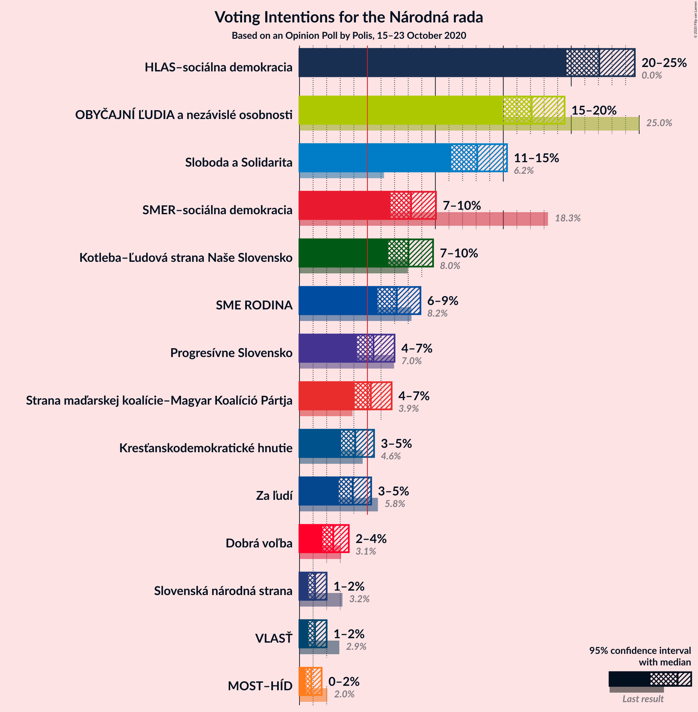

### Confidence Intervals

| Party | Last Result | Poll Result | 80% Confidence Interval | 90% Confidence Interval | 95% Confidence Interval | 99% Confidence Interval |
|:-----:|:-----------:|:-----------:|:-----------------------:|:-----------------------:|:-----------------------:|:-----------------------:|
| HLAS–sociálna demokracia | 0.0% | 22.1% | 20.5–23.8% |20.0–24.3% |19.6–24.7% |18.9–25.5% |
| OBYČAJNÍ ĽUDIA a nezávislé osobnosti | 25.0% | 17.1% | 15.7–18.7% |15.3–19.1% |14.9–19.5% |14.3–20.3% |
| Sloboda a Solidarita | 6.2% | 13.1% | 11.8–14.5% |11.5–14.9% |11.2–15.3% |10.6–16.0% |
| SMER–sociálna demokracia | 18.3% | 8.2% | 7.2–9.4% |6.9–9.7% |6.7–10.0% |6.2–10.6% |
| Kotleba–Ľudová strana Naše Slovensko | 8.0% | 8.0% | 7.0–9.2% |6.8–9.5% |6.5–9.8% |6.1–10.4% |
| SME RODINA | 8.2% | 7.2% | 6.2–8.3% |6.0–8.6% |5.7–8.9% |5.3–9.5% |
| Progresívne Slovensko | 7.0% | 5.4% | 4.6–6.5% |4.4–6.7% |4.2–7.0% |3.9–7.5% |
| Strana maďarskej koalície–Magyar Koalíció Pártja | 3.9% | 5.3% | 4.5–6.2% |4.2–6.5% |4.1–6.8% |3.7–7.3% |
| Kresťanskodemokratické hnutie | 4.6% | 4.1% | 3.4–5.0% |3.2–5.3% |3.1–5.5% |2.8–6.0% |
| Za ľudí | 5.8% | 3.9% | 3.2–4.8% |3.0–5.1% |2.9–5.3% |2.6–5.7% |
| Dobrá voľba | 3.1% | 2.5% | 2.0–3.2% |1.8–3.4% |1.7–3.6% |1.5–4.0% |
| Slovenská národná strana | 3.2% | 1.1% | 0.8–1.7% |0.7–1.9% |0.7–2.0% |0.5–2.3% |
| VLASŤ | 2.9% | 1.1% | 0.8–1.7% |0.7–1.9% |0.7–2.0% |0.5–2.3% |
| MOST–HÍD | 2.0% | 0.9% | 0.6–1.4% |0.5–1.5% |0.5–1.6% |0.4–1.9% |

*Note:* The poll result column reflects the actual value used in the calculations. Published results may vary slightly, and in addition be rounded to fewer digits.

## Seats

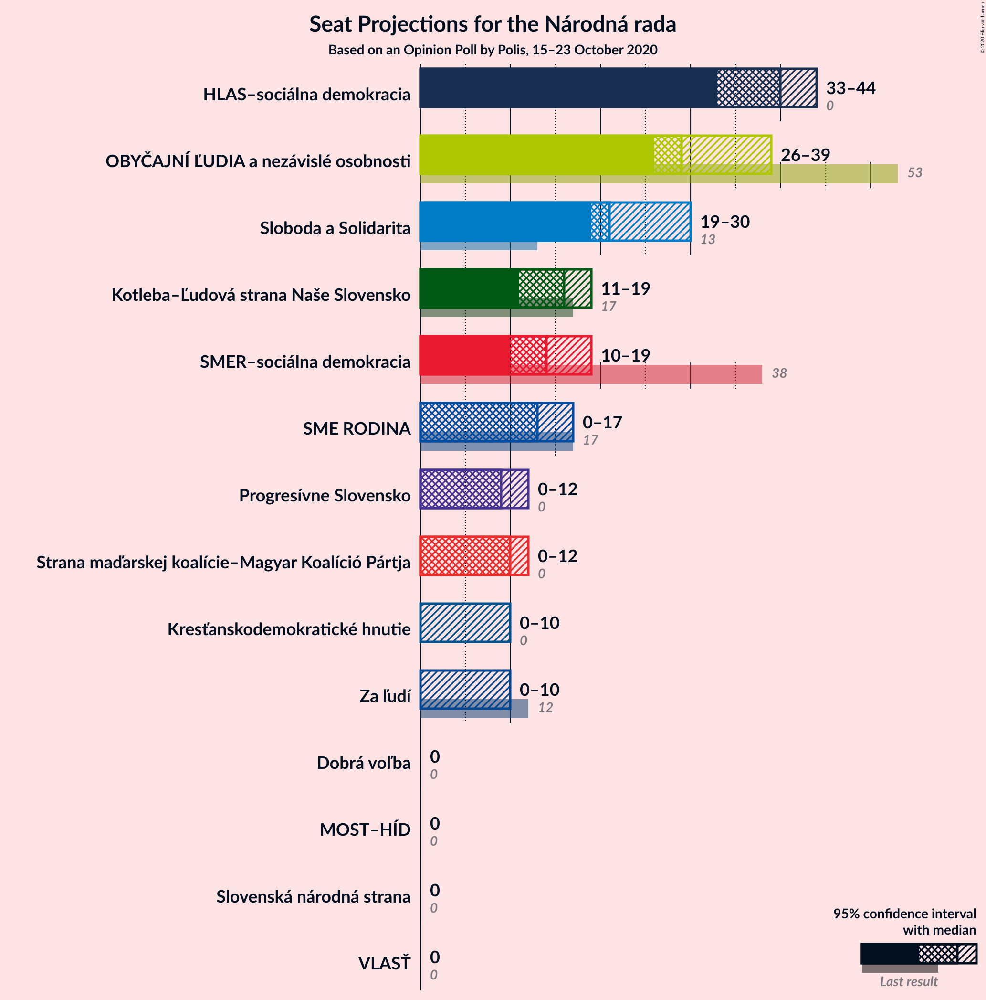

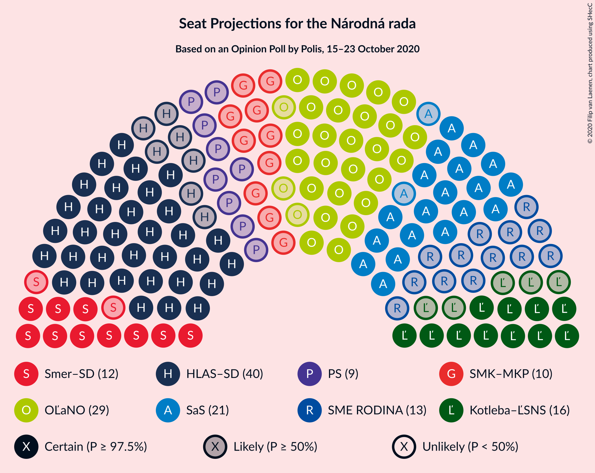

### Confidence Intervals

| Party | Last Result | Median | 80% Confidence Interval | 90% Confidence Interval | 95% Confidence Interval | 99% Confidence Interval |
|:-----:|:-----------:|:------:|:-----------------------:|:-----------------------:|:-----------------------:|:-----------------------:|
| <a href="#hlas–sociálna-demokracia">HLAS–sociálna demokracia</a> | 0 | 40 | 35–44 |35–44 |33–44 |33–45 |
| <a href="#obyčajní-ľudia-a-nezávislé-osobnosti">OBYČAJNÍ ĽUDIA a nezávislé osobnosti</a> | 53 | 29 | 26–36 |26–39 |26–39 |24–39 |
| <a href="#sloboda-a-solidarita">Sloboda a Solidarita</a> | 13 | 21 | 19–28 |19–28 |19–30 |19–30 |
| <a href="#smer–sociálna-demokracia">SMER–sociálna demokracia</a> | 38 | 14 | 12–17 |10–19 |10–19 |10–19 |
| <a href="#kotleba–ľudová-strana-naše-slovensko">Kotleba–Ľudová strana Naše Slovensko</a> | 17 | 16 | 13–18 |11–19 |11–19 |11–19 |
| <a href="#sme-rodina">SME RODINA</a> | 17 | 13 | 10–14 |10–15 |0–17 |0–18 |
| <a href="#progresívne-slovensko">Progresívne Slovensko</a> | 0 | 9 | 0–12 |0–12 |0–12 |0–14 |
| <a href="#strana-maďarskej-koalície–magyar-koalíció-pártja">Strana maďarskej koalície–Magyar Koalíció Pártja</a> | 0 | 10 | 0–11 |0–12 |0–12 |0–13 |
| <a href="#kresťanskodemokratické-hnutie">Kresťanskodemokratické hnutie</a> | 0 | 0 | 0–9 |0–9 |0–10 |0–10 |
| <a href="#za-ľudí">Za ľudí</a> | 12 | 0 | 0 |0 |0–10 |0–10 |
| <a href="#dobrá-voľba">Dobrá voľba</a> | 0 | 0 | 0 |0 |0 |0 |
| <a href="#slovenská-národná-strana">Slovenská národná strana</a> | 0 | 0 | 0 |0 |0 |0 |
| <a href="#vlasť">VLASŤ</a> | 0 | 0 | 0 |0 |0 |0 |
| <a href="#most–híd">MOST–HÍD</a> | 0 | 0 | 0 |0 |0 |0 |

### HLAS–sociálna demokracia

*For a full overview of the results for this party, see the [HLAS–sociálna demokracia](party-hlas–sociálnademokracia.html) page.*

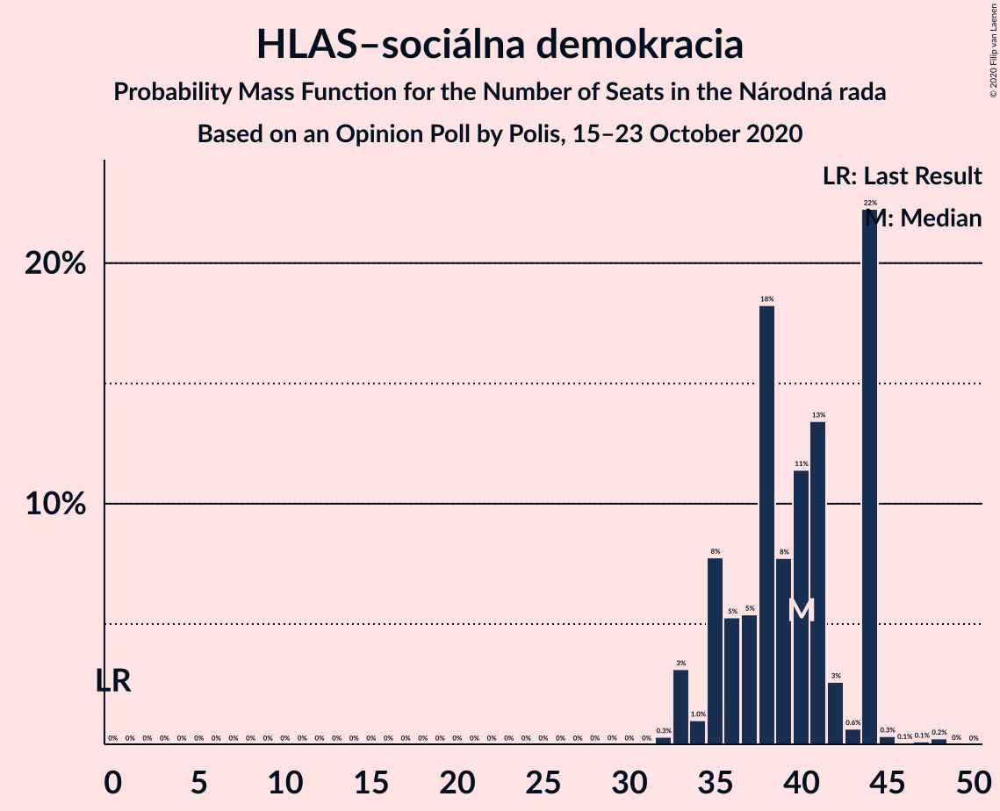

| Number of Seats | Probability | Accumulated | Special Marks |
|:---------------:|:-----------:|:-----------:|:-------------:|
| 0 | 0% | 100% | Last Result |
| 1 | 0% | 100% |  |
| 2 | 0% | 100% |  |
| 3 | 0% | 100% |  |
| 4 | 0% | 100% |  |
| 5 | 0% | 100% |  |
| 6 | 0% | 100% |  |
| 7 | 0% | 100% |  |
| 8 | 0% | 100% |  |
| 9 | 0% | 100% |  |
| 10 | 0% | 100% |  |
| 11 | 0% | 100% |  |
| 12 | 0% | 100% |  |
| 13 | 0% | 100% |  |
| 14 | 0% | 100% |  |
| 15 | 0% | 100% |  |
| 16 | 0% | 100% |  |
| 17 | 0% | 100% |  |
| 18 | 0% | 100% |  |
| 19 | 0% | 100% |  |
| 20 | 0% | 100% |  |
| 21 | 0% | 100% |  |
| 22 | 0% | 100% |  |
| 23 | 0% | 100% |  |
| 24 | 0% | 100% |  |
| 25 | 0% | 100% |  |
| 26 | 0% | 100% |  |
| 27 | 0% | 100% |  |
| 28 | 0% | 100% |  |
| 29 | 0% | 100% |  |
| 30 | 0% | 100% |  |
| 31 | 0% | 100% |  |
| 32 | 0.3% | 100% |  |
| 33 | 3% | 99.7% |  |
| 34 | 1.0% | 97% |  |
| 35 | 8% | 96% |  |
| 36 | 5% | 88% |  |
| 37 | 5% | 83% |  |
| 38 | 18% | 77% |  |
| 39 | 8% | 59% |  |
| 40 | 11% | 51% | Median |
| 41 | 13% | 40% |  |
| 42 | 3% | 26% |  |
| 43 | 0.6% | 24% |  |
| 44 | 22% | 23% |  |
| 45 | 0.3% | 0.8% |  |
| 46 | 0.1% | 0.5% |  |
| 47 | 0.1% | 0.4% |  |
| 48 | 0.2% | 0.3% |  |
| 49 | 0% | 0% |  |

### OBYČAJNÍ ĽUDIA a nezávislé osobnosti

*For a full overview of the results for this party, see the [OBYČAJNÍ ĽUDIA a nezávislé osobnosti](party-obyčajníľudiaanezávisléosobnosti.html) page.*

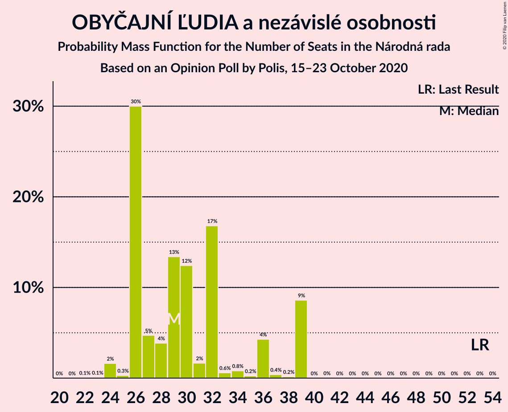

| Number of Seats | Probability | Accumulated | Special Marks |
|:---------------:|:-----------:|:-----------:|:-------------:|
| 22 | 0.1% | 100% |  |
| 23 | 0.1% | 99.9% |  |
| 24 | 2% | 99.9% |  |
| 25 | 0.3% | 98% |  |
| 26 | 30% | 98% |  |
| 27 | 5% | 68% |  |
| 28 | 4% | 63% |  |
| 29 | 13% | 59% | Median |
| 30 | 12% | 46% |  |
| 31 | 2% | 34% |  |
| 32 | 17% | 32% |  |
| 33 | 0.6% | 15% |  |
| 34 | 0.8% | 15% |  |
| 35 | 0.2% | 14% |  |
| 36 | 4% | 13% |  |
| 37 | 0.4% | 9% |  |
| 38 | 0.2% | 9% |  |
| 39 | 9% | 9% |  |
| 40 | 0% | 0% |  |
| 41 | 0% | 0% |  |
| 42 | 0% | 0% |  |
| 43 | 0% | 0% |  |
| 44 | 0% | 0% |  |
| 45 | 0% | 0% |  |
| 46 | 0% | 0% |  |
| 47 | 0% | 0% |  |
| 48 | 0% | 0% |  |
| 49 | 0% | 0% |  |
| 50 | 0% | 0% |  |
| 51 | 0% | 0% |  |
| 52 | 0% | 0% |  |
| 53 | 0% | 0% | Last Result |

### Sloboda a Solidarita

*For a full overview of the results for this party, see the [Sloboda a Solidarita](party-slobodaasolidarita.html) page.*

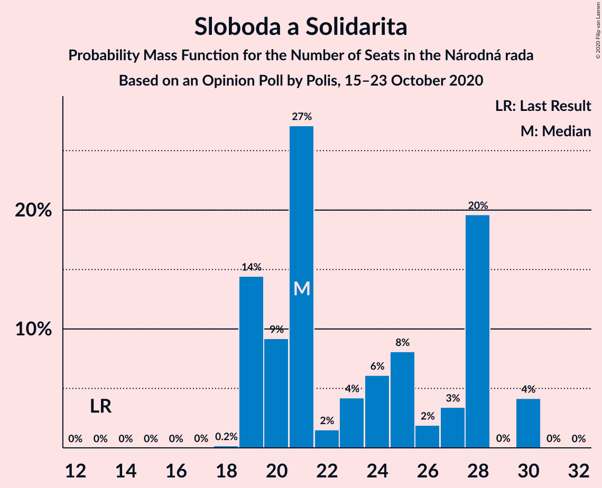

| Number of Seats | Probability | Accumulated | Special Marks |
|:---------------:|:-----------:|:-----------:|:-------------:|
| 13 | 0% | 100% | Last Result |
| 14 | 0% | 100% |  |
| 15 | 0% | 100% |  |
| 16 | 0% | 100% |  |
| 17 | 0% | 100% |  |
| 18 | 0.2% | 100% |  |
| 19 | 14% | 99.8% |  |
| 20 | 9% | 85% |  |
| 21 | 27% | 76% | Median |
| 22 | 2% | 49% |  |
| 23 | 4% | 48% |  |
| 24 | 6% | 43% |  |
| 25 | 8% | 37% |  |
| 26 | 2% | 29% |  |
| 27 | 3% | 27% |  |
| 28 | 20% | 24% |  |
| 29 | 0% | 4% |  |
| 30 | 4% | 4% |  |
| 31 | 0% | 0% |  |

### SMER–sociálna demokracia

*For a full overview of the results for this party, see the [SMER–sociálna demokracia](party-smer–sociálnademokracia.html) page.*

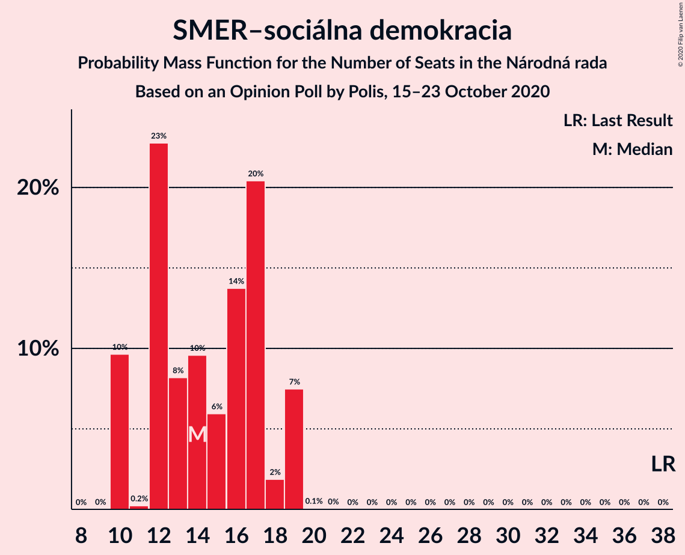

| Number of Seats | Probability | Accumulated | Special Marks |
|:---------------:|:-----------:|:-----------:|:-------------:|
| 10 | 10% | 100% |  |
| 11 | 0.2% | 90% |  |
| 12 | 23% | 90% |  |
| 13 | 8% | 67% |  |
| 14 | 10% | 59% | Median |
| 15 | 6% | 50% |  |
| 16 | 14% | 44% |  |
| 17 | 20% | 30% |  |
| 18 | 2% | 9% |  |
| 19 | 7% | 8% |  |
| 20 | 0.1% | 0.1% |  |
| 21 | 0% | 0% |  |
| 22 | 0% | 0% |  |
| 23 | 0% | 0% |  |
| 24 | 0% | 0% |  |
| 25 | 0% | 0% |  |
| 26 | 0% | 0% |  |
| 27 | 0% | 0% |  |
| 28 | 0% | 0% |  |
| 29 | 0% | 0% |  |
| 30 | 0% | 0% |  |
| 31 | 0% | 0% |  |
| 32 | 0% | 0% |  |
| 33 | 0% | 0% |  |
| 34 | 0% | 0% |  |
| 35 | 0% | 0% |  |
| 36 | 0% | 0% |  |
| 37 | 0% | 0% |  |
| 38 | 0% | 0% | Last Result |

### Kotleba–Ľudová strana Naše Slovensko

*For a full overview of the results for this party, see the [Kotleba–Ľudová strana Naše Slovensko](party-kotleba–ľudovástrananašeslovensko.html) page.*

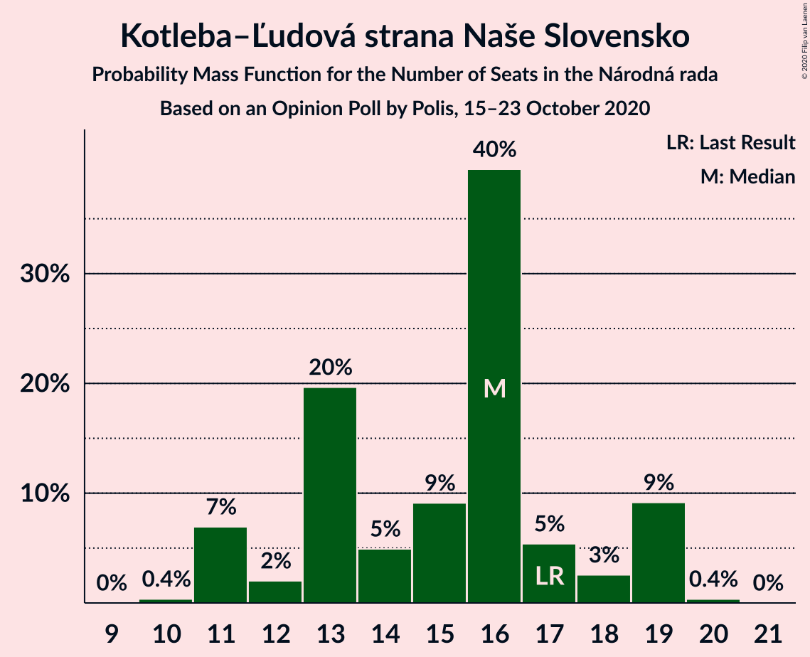

| Number of Seats | Probability | Accumulated | Special Marks |
|:---------------:|:-----------:|:-----------:|:-------------:|
| 10 | 0.4% | 100% |  |
| 11 | 7% | 99.6% |  |
| 12 | 2% | 93% |  |
| 13 | 20% | 91% |  |
| 14 | 5% | 71% |  |
| 15 | 9% | 66% |  |
| 16 | 40% | 57% | Median |
| 17 | 5% | 17% | Last Result |
| 18 | 3% | 12% |  |
| 19 | 9% | 10% |  |
| 20 | 0.4% | 0.4% |  |
| 21 | 0% | 0% |  |

### SME RODINA

*For a full overview of the results for this party, see the [SME RODINA](party-smerodina.html) page.*

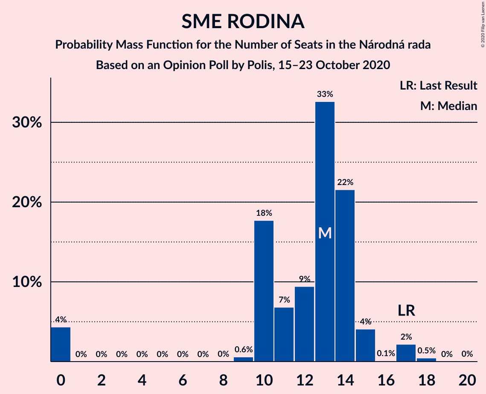

| Number of Seats | Probability | Accumulated | Special Marks |
|:---------------:|:-----------:|:-----------:|:-------------:|
| 0 | 4% | 100% |  |
| 1 | 0% | 96% |  |
| 2 | 0% | 96% |  |
| 3 | 0% | 96% |  |
| 4 | 0% | 96% |  |
| 5 | 0% | 96% |  |
| 6 | 0% | 96% |  |
| 7 | 0% | 96% |  |
| 8 | 0% | 96% |  |
| 9 | 0.6% | 96% |  |
| 10 | 18% | 95% |  |
| 11 | 7% | 77% |  |
| 12 | 9% | 70% |  |
| 13 | 33% | 61% | Median |
| 14 | 22% | 28% |  |
| 15 | 4% | 7% |  |
| 16 | 0.1% | 3% |  |
| 17 | 2% | 3% | Last Result |
| 18 | 0.5% | 0.5% |  |
| 19 | 0% | 0% |  |

### Progresívne Slovensko

*For a full overview of the results for this party, see the [Progresívne Slovensko](party-progresívneslovensko.html) page.*

| Number of Seats | Probability | Accumulated | Special Marks |
|:---------------:|:-----------:|:-----------:|:-------------:|
| 0 | 41% | 100% | Last Result |
| 1 | 0% | 59% |  |
| 2 | 0% | 59% |  |
| 3 | 0% | 59% |  |
| 4 | 0% | 59% |  |
| 5 | 0% | 59% |  |
| 6 | 0% | 59% |  |
| 7 | 0% | 59% |  |
| 8 | 6% | 59% |  |
| 9 | 5% | 53% | Median |
| 10 | 7% | 48% |  |
| 11 | 29% | 41% |  |
| 12 | 11% | 12% |  |
| 13 | 0.7% | 1.2% |  |
| 14 | 0.2% | 0.5% |  |
| 15 | 0.4% | 0.4% |  |
| 16 | 0% | 0% |  |

### Strana maďarskej koalície–Magyar Koalíció Pártja

*For a full overview of the results for this party, see the [Strana maďarskej koalície–Magyar Koalíció Pártja](party-stranamaďarskejkoalície–magyarkoalíciópártja.html) page.*

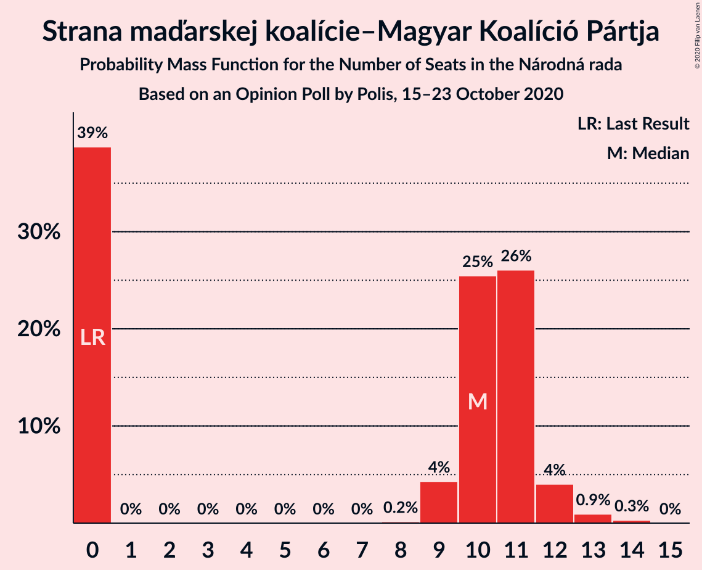

| Number of Seats | Probability | Accumulated | Special Marks |
|:---------------:|:-----------:|:-----------:|:-------------:|
| 0 | 39% | 100% | Last Result |
| 1 | 0% | 61% |  |
| 2 | 0% | 61% |  |
| 3 | 0% | 61% |  |
| 4 | 0% | 61% |  |
| 5 | 0% | 61% |  |
| 6 | 0% | 61% |  |
| 7 | 0% | 61% |  |
| 8 | 0.2% | 61% |  |
| 9 | 4% | 61% |  |
| 10 | 25% | 57% | Median |
| 11 | 26% | 31% |  |
| 12 | 4% | 5% |  |
| 13 | 0.9% | 1.3% |  |
| 14 | 0.3% | 0.3% |  |
| 15 | 0% | 0% |  |

### Kresťanskodemokratické hnutie

*For a full overview of the results for this party, see the [Kresťanskodemokratické hnutie](party-kresťanskodemokratickéhnutie.html) page.*

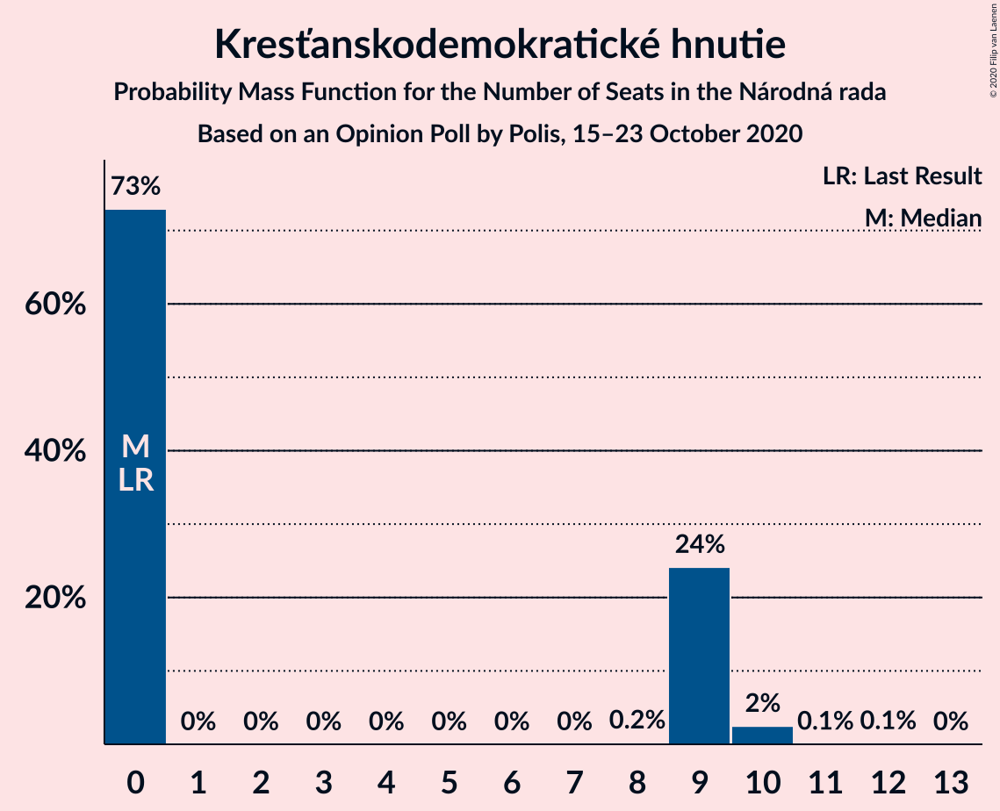

| Number of Seats | Probability | Accumulated | Special Marks |
|:---------------:|:-----------:|:-----------:|:-------------:|
| 0 | 73% | 100% | Last Result, Median |
| 1 | 0% | 27% |  |
| 2 | 0% | 27% |  |
| 3 | 0% | 27% |  |
| 4 | 0% | 27% |  |
| 5 | 0% | 27% |  |
| 6 | 0% | 27% |  |
| 7 | 0% | 27% |  |
| 8 | 0.2% | 27% |  |
| 9 | 24% | 27% |  |
| 10 | 2% | 3% |  |
| 11 | 0.1% | 0.2% |  |
| 12 | 0.1% | 0.1% |  |
| 13 | 0% | 0% |  |

### Za ľudí

*For a full overview of the results for this party, see the [Za ľudí](party-zaľudí.html) page.*

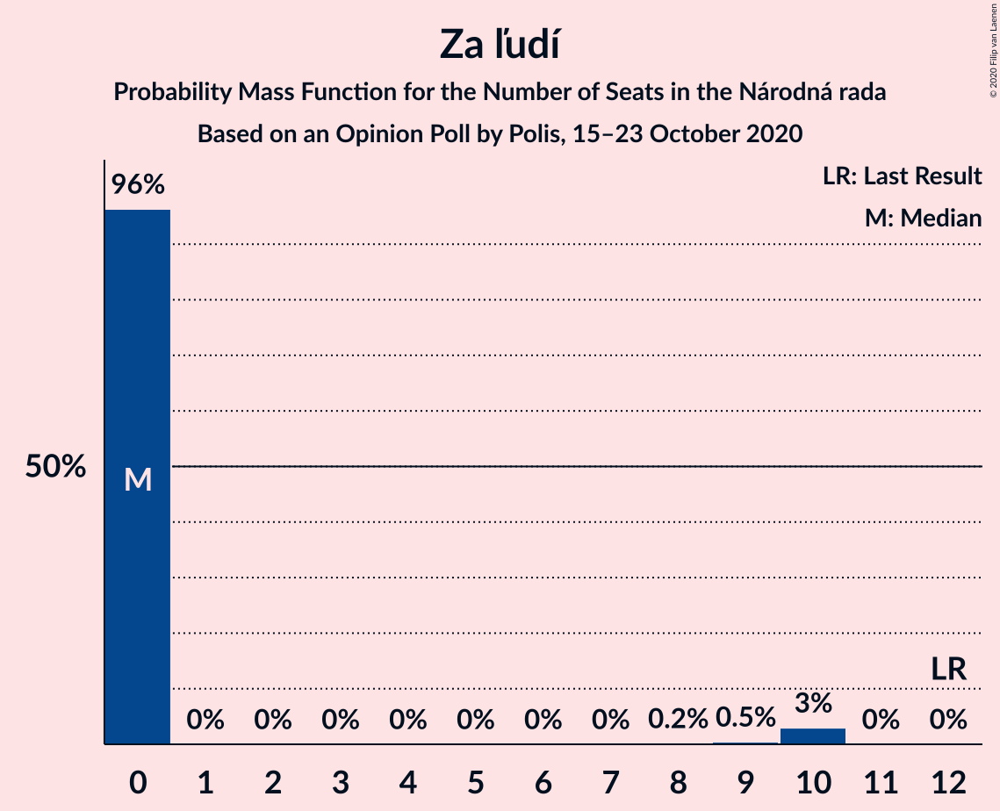

| Number of Seats | Probability | Accumulated | Special Marks |
|:---------------:|:-----------:|:-----------:|:-------------:|
| 0 | 96% | 100% | Median |
| 1 | 0% | 4% |  |
| 2 | 0% | 4% |  |
| 3 | 0% | 4% |  |
| 4 | 0% | 4% |  |
| 5 | 0% | 4% |  |
| 6 | 0% | 4% |  |
| 7 | 0% | 4% |  |
| 8 | 0.2% | 4% |  |
| 9 | 0.5% | 3% |  |
| 10 | 3% | 3% |  |
| 11 | 0% | 0% |  |
| 12 | 0% | 0% | Last Result |

### Dobrá voľba

*For a full overview of the results for this party, see the [Dobrá voľba](party-dobrávoľba.html) page.*

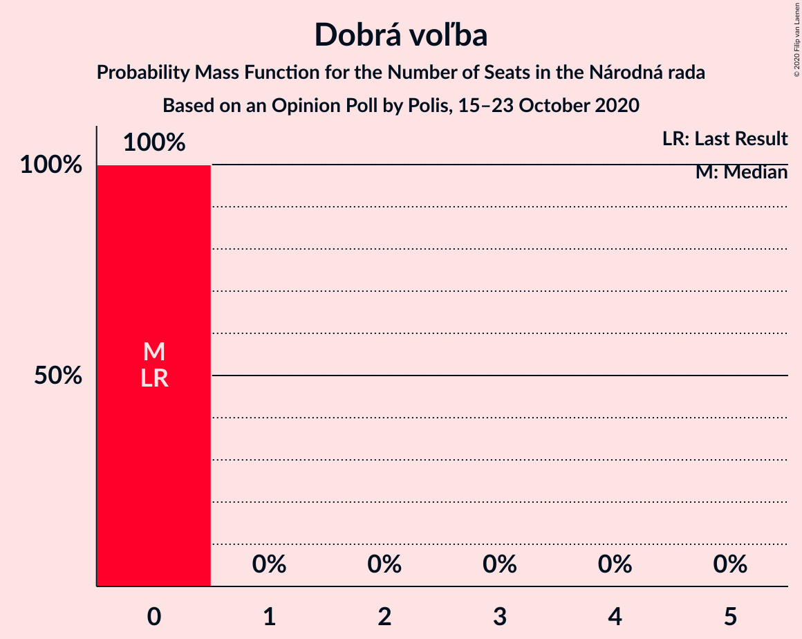

| Number of Seats | Probability | Accumulated | Special Marks |
|:---------------:|:-----------:|:-----------:|:-------------:|
| 0 | 100% | 100% | Last Result, Median |

### Slovenská národná strana

*For a full overview of the results for this party, see the [Slovenská národná strana](party-slovenskánárodnástrana.html) page.*

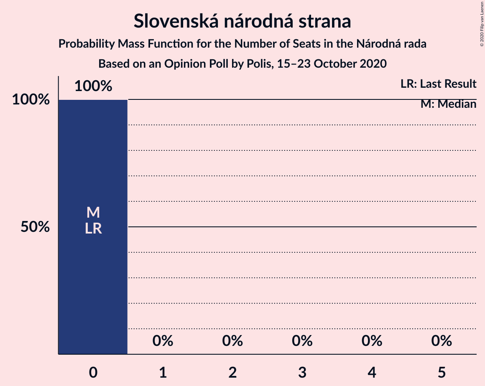

| Number of Seats | Probability | Accumulated | Special Marks |
|:---------------:|:-----------:|:-----------:|:-------------:|
| 0 | 100% | 100% | Last Result, Median |

### VLASŤ

*For a full overview of the results for this party, see the [VLASŤ](party-vlasť.html) page.*

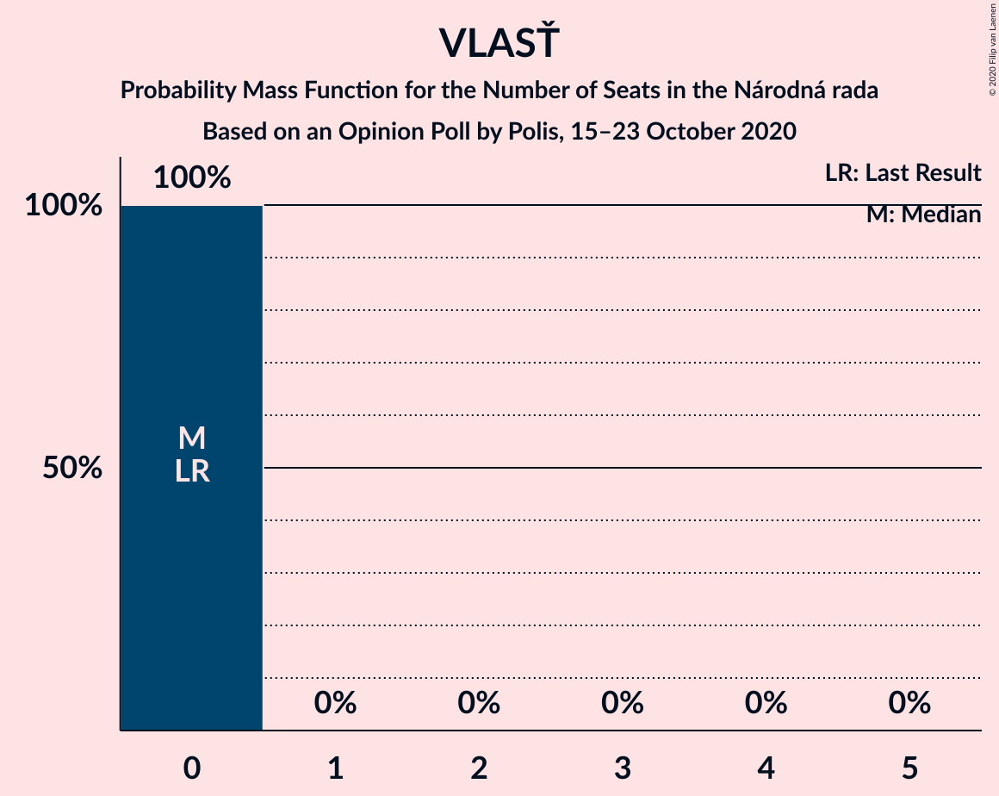

| Number of Seats | Probability | Accumulated | Special Marks |
|:---------------:|:-----------:|:-----------:|:-------------:|
| 0 | 100% | 100% | Last Result, Median |

### MOST–HÍD

*For a full overview of the results for this party, see the [MOST–HÍD](party-most–híd.html) page.*

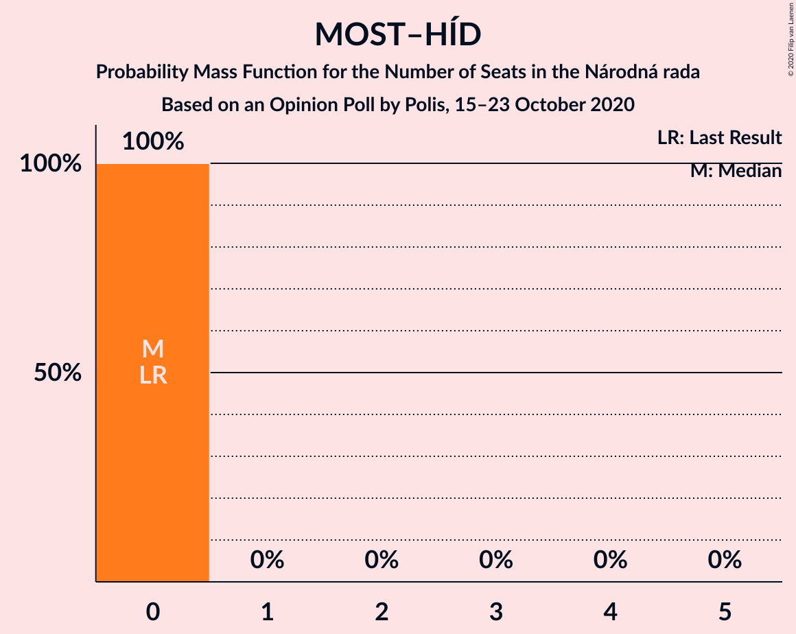

| Number of Seats | Probability | Accumulated | Special Marks |
|:---------------:|:-----------:|:-----------:|:-------------:|
| 0 | 100% | 100% | Last Result, Median |

## Coalitions

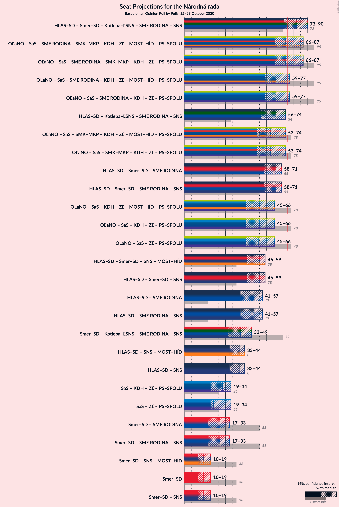

### Confidence Intervals

| Coalition | Last Result | Median | Majority? | 80% Confidence Interval | 90% Confidence Interval | 95% Confidence Interval | 99% Confidence Interval |
|:---------:|:-----------:|:------:|:---------:|:-----------------------:|:-----------------------:|:-----------------------:|:-----------------------:|
| HLAS–sociálna demokracia – SMER–sociálna demokracia – Kotleba–Ľudová strana Naše Slovensko – SME RODINA – Slovenská národná strana | 72 | 82 | 90% | 75–88 | 74–90 | 73–90 | 71–90 |
| HLAS–sociálna demokracia – Kotleba–Ľudová strana Naše Slovensko – SME RODINA – Slovenská národná strana | 34 | 67 | 0.7% | 61–73 | 56–74 | 56–74 | 56–76 |
| HLAS–sociálna demokracia – SMER–sociálna demokracia – SME RODINA | 55 | 67 | 0.7% | 61–71 | 59–71 | 58–71 | 57–77 |
| HLAS–sociálna demokracia – SMER–sociálna demokracia – SME RODINA – Slovenská národná strana | 55 | 67 | 0.7% | 61–71 | 59–71 | 58–71 | 57–77 |
| HLAS–sociálna demokracia – SMER–sociálna demokracia – Slovenská národná strana – MOST–HÍD | 38 | 55 | 0% | 50–57 | 48–58 | 46–59 | 46–61 |
| HLAS–sociálna demokracia – SMER–sociálna demokracia – Slovenská národná strana | 38 | 55 | 0% | 50–57 | 48–58 | 46–59 | 46–61 |
| HLAS–sociálna demokracia – SME RODINA | 17 | 51 | 0% | 47–57 | 44–57 | 41–57 | 41–62 |
| HLAS–sociálna demokracia – SME RODINA – Slovenská národná strana | 17 | 51 | 0% | 47–57 | 44–57 | 41–57 | 41–62 |
| SMER–sociálna demokracia – Kotleba–Ľudová strana Naše Slovensko – SME RODINA – Slovenská národná strana | 72 | 41 | 0% | 37–49 | 37–49 | 32–49 | 32–49 |
| HLAS–sociálna demokracia – Slovenská národná strana – MOST–HÍD | 0 | 40 | 0% | 35–44 | 35–44 | 33–44 | 33–45 |
| HLAS–sociálna demokracia – Slovenská národná strana | 0 | 40 | 0% | 35–44 | 35–44 | 33–44 | 33–45 |
| SMER–sociálna demokracia – SME RODINA | 55 | 26 | 0% | 23–31 | 23–33 | 17–33 | 17–33 |
| SMER–sociálna demokracia – SME RODINA – Slovenská národná strana | 55 | 26 | 0% | 23–31 | 23–33 | 17–33 | 17–33 |
| SMER–sociálna demokracia – Slovenská národná strana – MOST–HÍD | 38 | 14 | 0% | 12–17 | 10–19 | 10–19 | 10–19 |
| SMER–sociálna demokracia | 38 | 14 | 0% | 12–17 | 10–19 | 10–19 | 10–19 |
| SMER–sociálna demokracia – Slovenská národná strana | 38 | 14 | 0% | 12–17 | 10–19 | 10–19 | 10–19 |

### HLAS–sociálna demokracia – SMER–sociálna demokracia – Kotleba–Ľudová strana Naše Slovensko – SME RODINA – Slovenská národná strana

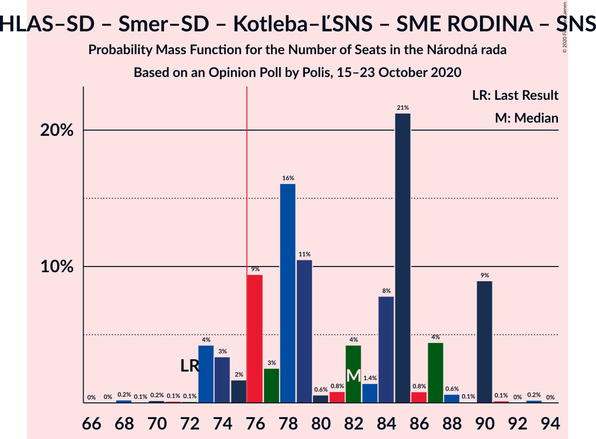

| Number of Seats | Probability | Accumulated | Special Marks |
|:---------------:|:-----------:|:-----------:|:-------------:|
| 67 | 0% | 100% |  |
| 68 | 0.2% | 99.9% |  |
| 69 | 0.1% | 99.7% |  |
| 70 | 0.2% | 99.7% |  |
| 71 | 0.1% | 99.5% |  |
| 72 | 0.1% | 99.4% | Last Result |
| 73 | 4% | 99.3% |  |
| 74 | 3% | 95% |  |
| 75 | 2% | 92% |  |
| 76 | 9% | 90% | Majority |
| 77 | 3% | 81% |  |
| 78 | 16% | 78% |  |
| 79 | 11% | 62% |  |
| 80 | 0.6% | 51% |  |
| 81 | 0.8% | 51% |  |
| 82 | 4% | 50% |  |
| 83 | 1.4% | 46% | Median |
| 84 | 8% | 44% |  |
| 85 | 21% | 37% |  |
| 86 | 0.8% | 15% |  |
| 87 | 4% | 14% |  |
| 88 | 0.6% | 10% |  |
| 89 | 0.1% | 9% |  |
| 90 | 9% | 9% |  |
| 91 | 0.1% | 0.4% |  |
| 92 | 0% | 0.2% |  |
| 93 | 0.2% | 0.2% |  |
| 94 | 0% | 0% |  |

### HLAS–sociálna demokracia – Kotleba–Ľudová strana Naše Slovensko – SME RODINA – Slovenská národná strana

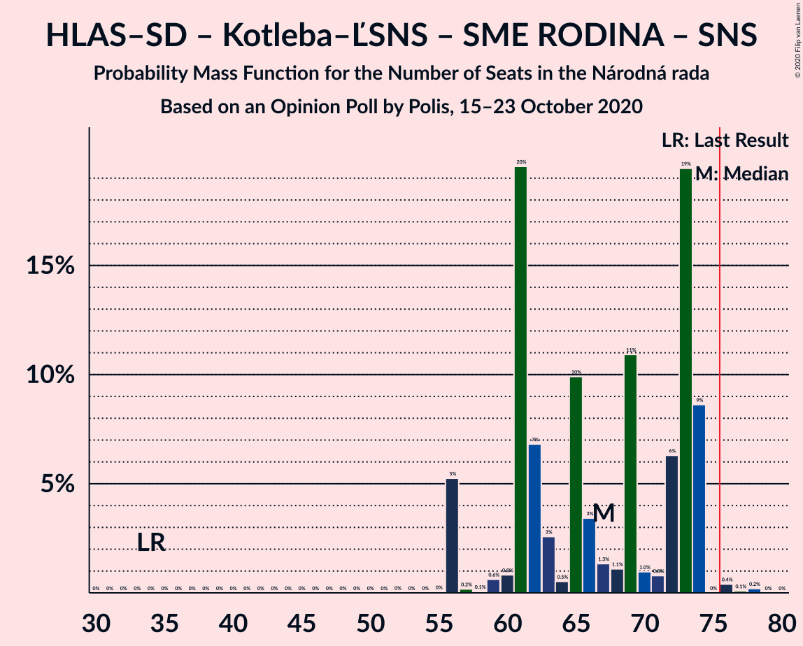

| Number of Seats | Probability | Accumulated | Special Marks |
|:---------------:|:-----------:|:-----------:|:-------------:|
| 34 | 0% | 100% | Last Result |
| 35 | 0% | 100% |  |
| 36 | 0% | 100% |  |
| 37 | 0% | 100% |  |
| 38 | 0% | 100% |  |
| 39 | 0% | 100% |  |
| 40 | 0% | 100% |  |
| 41 | 0% | 100% |  |
| 42 | 0% | 100% |  |
| 43 | 0% | 100% |  |
| 44 | 0% | 100% |  |
| 45 | 0% | 100% |  |
| 46 | 0% | 100% |  |
| 47 | 0% | 100% |  |
| 48 | 0% | 100% |  |
| 49 | 0% | 100% |  |
| 50 | 0% | 100% |  |
| 51 | 0% | 100% |  |
| 52 | 0% | 100% |  |
| 53 | 0% | 100% |  |
| 54 | 0% | 100% |  |
| 55 | 0% | 100% |  |
| 56 | 5% | 99.9% |  |
| 57 | 0.2% | 95% |  |
| 58 | 0.1% | 95% |  |
| 59 | 0.6% | 94% |  |
| 60 | 0.8% | 94% |  |
| 61 | 20% | 93% |  |
| 62 | 7% | 73% |  |
| 63 | 3% | 67% |  |
| 64 | 0.5% | 64% |  |
| 65 | 10% | 64% |  |
| 66 | 3% | 54% |  |
| 67 | 1.3% | 50% |  |
| 68 | 1.1% | 49% |  |
| 69 | 11% | 48% | Median |
| 70 | 1.0% | 37% |  |
| 71 | 0.8% | 36% |  |
| 72 | 6% | 35% |  |
| 73 | 19% | 29% |  |
| 74 | 9% | 9% |  |
| 75 | 0% | 0.7% |  |
| 76 | 0.4% | 0.7% | Majority |
| 77 | 0.1% | 0.3% |  |
| 78 | 0.2% | 0.2% |  |
| 79 | 0% | 0% |  |

### HLAS–sociálna demokracia – SMER–sociálna demokracia – SME RODINA

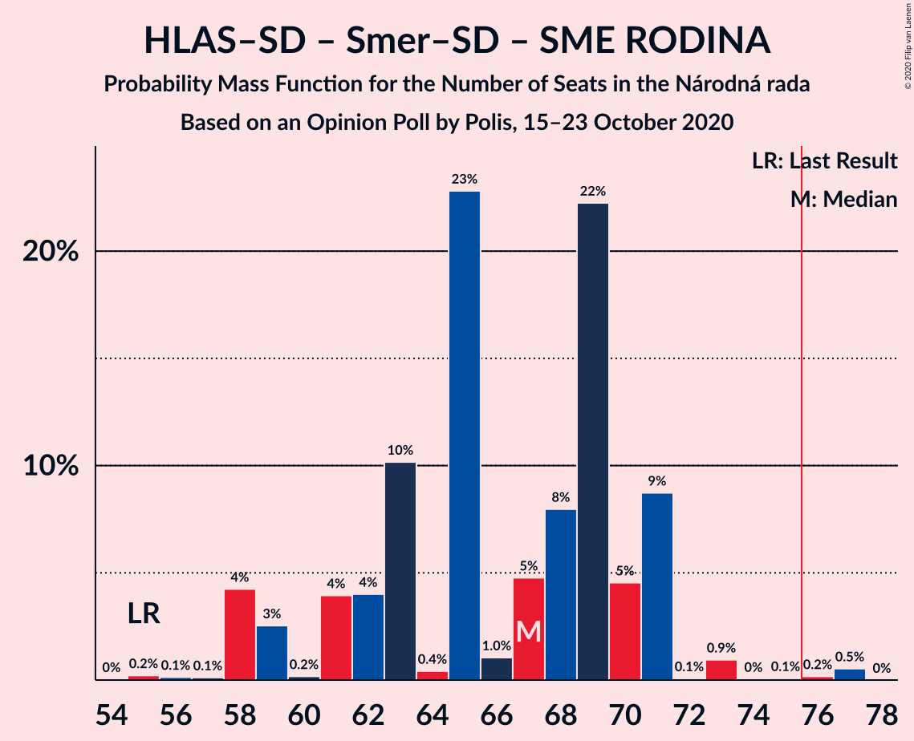

| Number of Seats | Probability | Accumulated | Special Marks |
|:---------------:|:-----------:|:-----------:|:-------------:|
| 55 | 0.2% | 100% | Last Result |
| 56 | 0.1% | 99.7% |  |
| 57 | 0.1% | 99.6% |  |
| 58 | 4% | 99.5% |  |
| 59 | 3% | 95% |  |
| 60 | 0.2% | 93% |  |
| 61 | 4% | 93% |  |
| 62 | 4% | 89% |  |
| 63 | 10% | 85% |  |
| 64 | 0.4% | 74% |  |
| 65 | 23% | 74% |  |
| 66 | 1.0% | 51% |  |
| 67 | 5% | 50% | Median |
| 68 | 8% | 45% |  |
| 69 | 22% | 37% |  |
| 70 | 5% | 15% |  |
| 71 | 9% | 11% |  |
| 72 | 0.1% | 2% |  |
| 73 | 0.9% | 2% |  |
| 74 | 0% | 0.8% |  |
| 75 | 0.1% | 0.8% |  |
| 76 | 0.2% | 0.7% | Majority |
| 77 | 0.5% | 0.6% |  |
| 78 | 0% | 0% |  |

### HLAS–sociálna demokracia – SMER–sociálna demokracia – SME RODINA – Slovenská národná strana

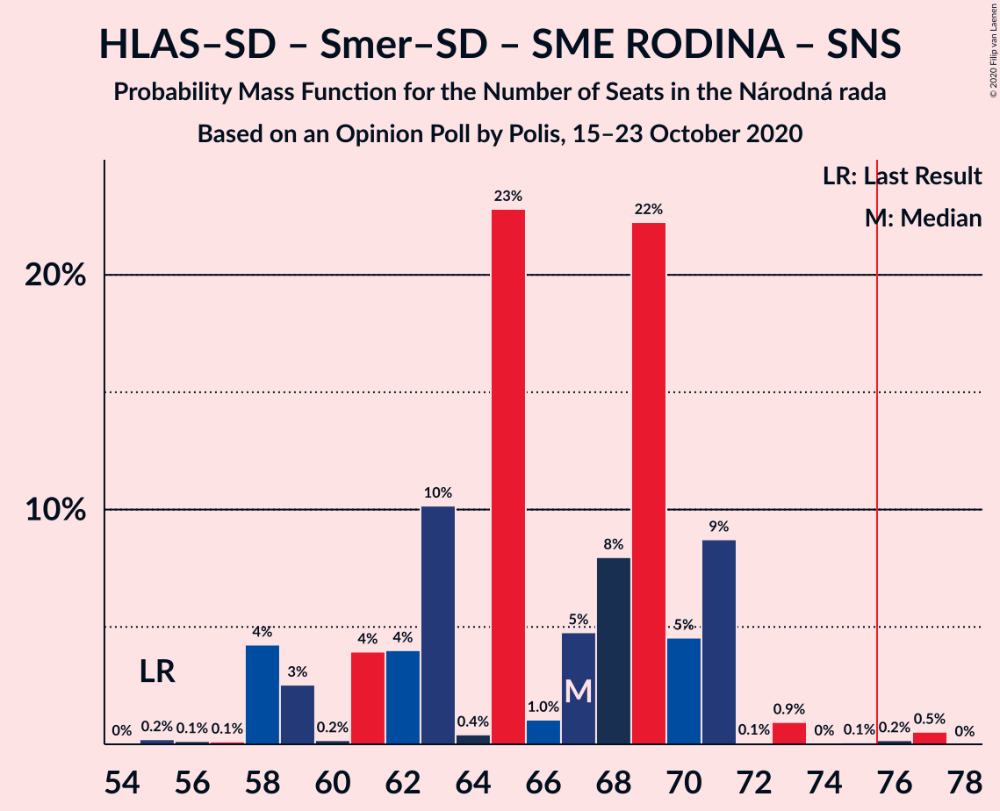

| Number of Seats | Probability | Accumulated | Special Marks |
|:---------------:|:-----------:|:-----------:|:-------------:|
| 55 | 0.2% | 100% | Last Result |
| 56 | 0.1% | 99.7% |  |
| 57 | 0.1% | 99.6% |  |
| 58 | 4% | 99.5% |  |
| 59 | 3% | 95% |  |
| 60 | 0.2% | 93% |  |
| 61 | 4% | 93% |  |
| 62 | 4% | 89% |  |
| 63 | 10% | 85% |  |
| 64 | 0.4% | 74% |  |
| 65 | 23% | 74% |  |
| 66 | 1.0% | 51% |  |
| 67 | 5% | 50% | Median |
| 68 | 8% | 45% |  |
| 69 | 22% | 37% |  |
| 70 | 5% | 15% |  |
| 71 | 9% | 11% |  |
| 72 | 0.1% | 2% |  |
| 73 | 0.9% | 2% |  |
| 74 | 0% | 0.8% |  |
| 75 | 0.1% | 0.8% |  |
| 76 | 0.2% | 0.7% | Majority |
| 77 | 0.5% | 0.6% |  |
| 78 | 0% | 0% |  |

### HLAS–sociálna demokracia – SMER–sociálna demokracia – Slovenská národná strana – MOST–HÍD

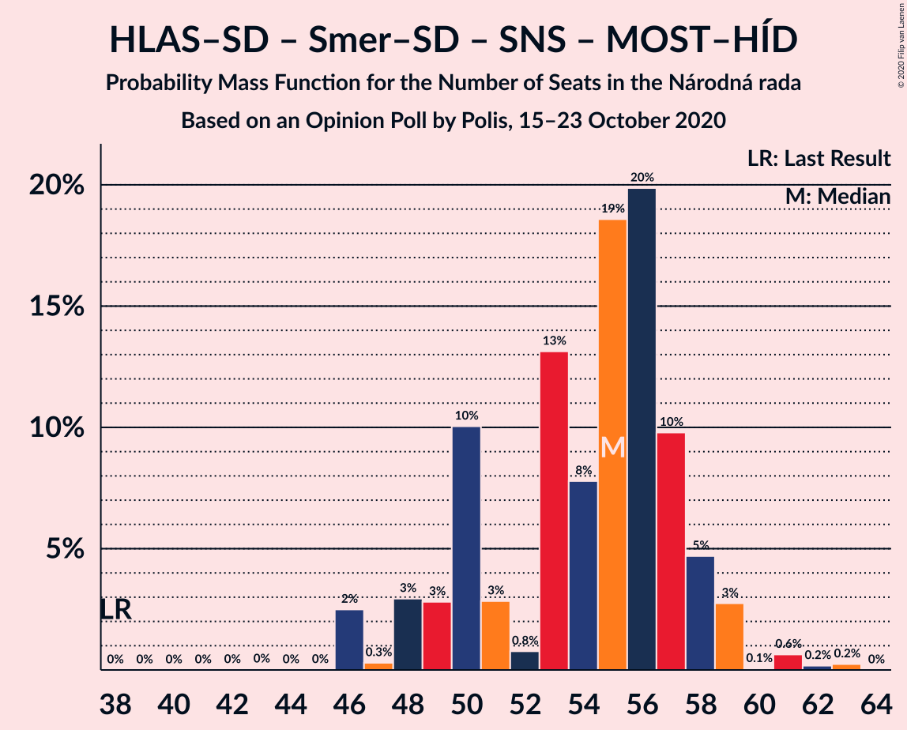

| Number of Seats | Probability | Accumulated | Special Marks |
|:---------------:|:-----------:|:-----------:|:-------------:|
| 38 | 0% | 100% | Last Result |
| 39 | 0% | 100% |  |
| 40 | 0% | 100% |  |
| 41 | 0% | 100% |  |
| 42 | 0% | 100% |  |
| 43 | 0% | 100% |  |
| 44 | 0% | 100% |  |
| 45 | 0% | 99.9% |  |
| 46 | 2% | 99.9% |  |
| 47 | 0.3% | 97% |  |
| 48 | 3% | 97% |  |
| 49 | 3% | 94% |  |
| 50 | 10% | 91% |  |
| 51 | 3% | 81% |  |
| 52 | 0.8% | 79% |  |
| 53 | 13% | 78% |  |
| 54 | 8% | 65% | Median |
| 55 | 19% | 57% |  |
| 56 | 20% | 38% |  |
| 57 | 10% | 18% |  |
| 58 | 5% | 9% |  |
| 59 | 3% | 4% |  |
| 60 | 0.1% | 1.1% |  |
| 61 | 0.6% | 1.1% |  |
| 62 | 0.2% | 0.4% |  |
| 63 | 0.2% | 0.3% |  |
| 64 | 0% | 0% |  |

### HLAS–sociálna demokracia – SMER–sociálna demokracia – Slovenská národná strana

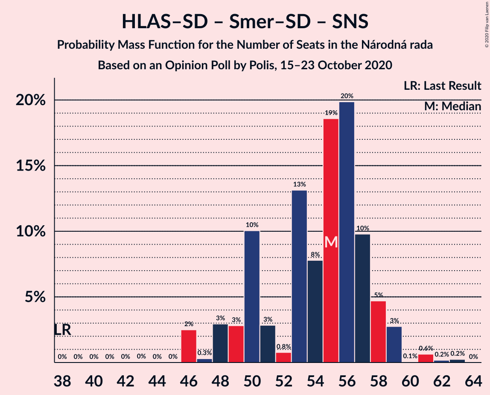

| Number of Seats | Probability | Accumulated | Special Marks |
|:---------------:|:-----------:|:-----------:|:-------------:|
| 38 | 0% | 100% | Last Result |
| 39 | 0% | 100% |  |
| 40 | 0% | 100% |  |
| 41 | 0% | 100% |  |
| 42 | 0% | 100% |  |
| 43 | 0% | 100% |  |
| 44 | 0% | 100% |  |
| 45 | 0% | 99.9% |  |
| 46 | 2% | 99.9% |  |
| 47 | 0.3% | 97% |  |
| 48 | 3% | 97% |  |
| 49 | 3% | 94% |  |
| 50 | 10% | 91% |  |
| 51 | 3% | 81% |  |
| 52 | 0.8% | 79% |  |
| 53 | 13% | 78% |  |
| 54 | 8% | 65% | Median |
| 55 | 19% | 57% |  |
| 56 | 20% | 38% |  |
| 57 | 10% | 18% |  |
| 58 | 5% | 9% |  |
| 59 | 3% | 4% |  |
| 60 | 0.1% | 1.1% |  |
| 61 | 0.6% | 1.1% |  |
| 62 | 0.2% | 0.4% |  |
| 63 | 0.2% | 0.3% |  |
| 64 | 0% | 0% |  |

### HLAS–sociálna demokracia – SME RODINA

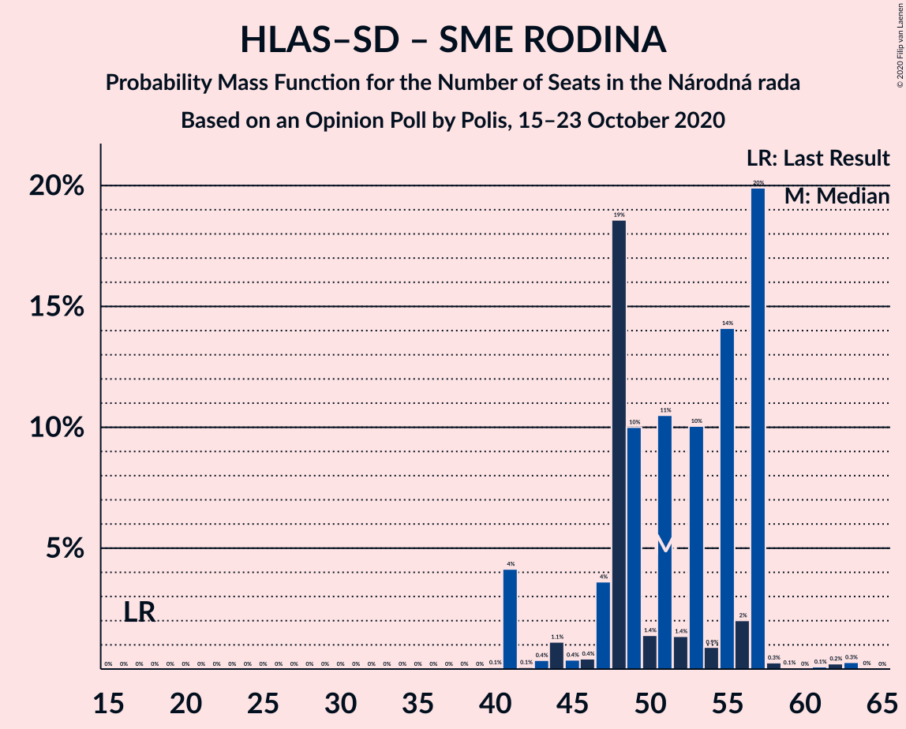

| Number of Seats | Probability | Accumulated | Special Marks |
|:---------------:|:-----------:|:-----------:|:-------------:|
| 17 | 0% | 100% | Last Result |
| 18 | 0% | 100% |  |
| 19 | 0% | 100% |  |
| 20 | 0% | 100% |  |
| 21 | 0% | 100% |  |
| 22 | 0% | 100% |  |
| 23 | 0% | 100% |  |
| 24 | 0% | 100% |  |
| 25 | 0% | 100% |  |
| 26 | 0% | 100% |  |
| 27 | 0% | 100% |  |
| 28 | 0% | 100% |  |
| 29 | 0% | 100% |  |
| 30 | 0% | 100% |  |
| 31 | 0% | 100% |  |
| 32 | 0% | 100% |  |
| 33 | 0% | 100% |  |
| 34 | 0% | 100% |  |
| 35 | 0% | 100% |  |
| 36 | 0% | 100% |  |
| 37 | 0% | 100% |  |
| 38 | 0% | 100% |  |
| 39 | 0% | 100% |  |
| 40 | 0.1% | 100% |  |
| 41 | 4% | 99.9% |  |
| 42 | 0.1% | 96% |  |
| 43 | 0.4% | 96% |  |
| 44 | 1.1% | 95% |  |
| 45 | 0.4% | 94% |  |
| 46 | 0.4% | 94% |  |
| 47 | 4% | 93% |  |
| 48 | 19% | 90% |  |
| 49 | 10% | 71% |  |
| 50 | 1.4% | 61% |  |
| 51 | 11% | 60% |  |
| 52 | 1.4% | 49% |  |
| 53 | 10% | 48% | Median |
| 54 | 0.9% | 38% |  |
| 55 | 14% | 37% |  |
| 56 | 2% | 23% |  |
| 57 | 20% | 21% |  |
| 58 | 0.3% | 1.0% |  |
| 59 | 0.1% | 0.7% |  |
| 60 | 0% | 0.6% |  |
| 61 | 0.1% | 0.6% |  |
| 62 | 0.2% | 0.5% |  |
| 63 | 0.3% | 0.3% |  |
| 64 | 0% | 0% |  |

### HLAS–sociálna demokracia – SME RODINA – Slovenská národná strana

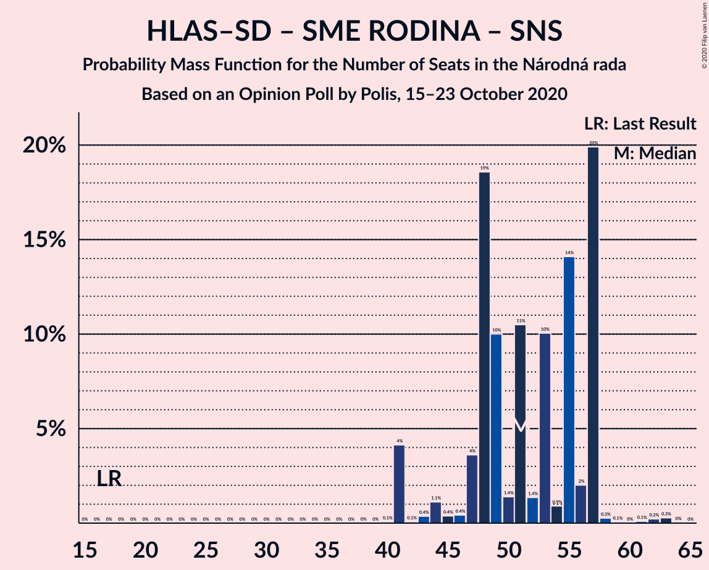

| Number of Seats | Probability | Accumulated | Special Marks |
|:---------------:|:-----------:|:-----------:|:-------------:|
| 17 | 0% | 100% | Last Result |
| 18 | 0% | 100% |  |
| 19 | 0% | 100% |  |
| 20 | 0% | 100% |  |
| 21 | 0% | 100% |  |
| 22 | 0% | 100% |  |
| 23 | 0% | 100% |  |
| 24 | 0% | 100% |  |
| 25 | 0% | 100% |  |
| 26 | 0% | 100% |  |
| 27 | 0% | 100% |  |
| 28 | 0% | 100% |  |
| 29 | 0% | 100% |  |
| 30 | 0% | 100% |  |
| 31 | 0% | 100% |  |
| 32 | 0% | 100% |  |
| 33 | 0% | 100% |  |
| 34 | 0% | 100% |  |
| 35 | 0% | 100% |  |
| 36 | 0% | 100% |  |
| 37 | 0% | 100% |  |
| 38 | 0% | 100% |  |
| 39 | 0% | 100% |  |
| 40 | 0.1% | 100% |  |
| 41 | 4% | 99.9% |  |
| 42 | 0.1% | 96% |  |
| 43 | 0.4% | 96% |  |
| 44 | 1.1% | 95% |  |
| 45 | 0.4% | 94% |  |
| 46 | 0.4% | 94% |  |
| 47 | 4% | 93% |  |
| 48 | 19% | 90% |  |
| 49 | 10% | 71% |  |
| 50 | 1.4% | 61% |  |
| 51 | 11% | 60% |  |
| 52 | 1.4% | 49% |  |
| 53 | 10% | 48% | Median |
| 54 | 0.9% | 38% |  |
| 55 | 14% | 37% |  |
| 56 | 2% | 23% |  |
| 57 | 20% | 21% |  |
| 58 | 0.3% | 1.0% |  |
| 59 | 0.1% | 0.7% |  |
| 60 | 0% | 0.6% |  |
| 61 | 0.1% | 0.6% |  |
| 62 | 0.2% | 0.5% |  |
| 63 | 0.3% | 0.3% |  |
| 64 | 0% | 0% |  |

### SMER–sociálna demokracia – Kotleba–Ľudová strana Naše Slovensko – SME RODINA – Slovenská národná strana

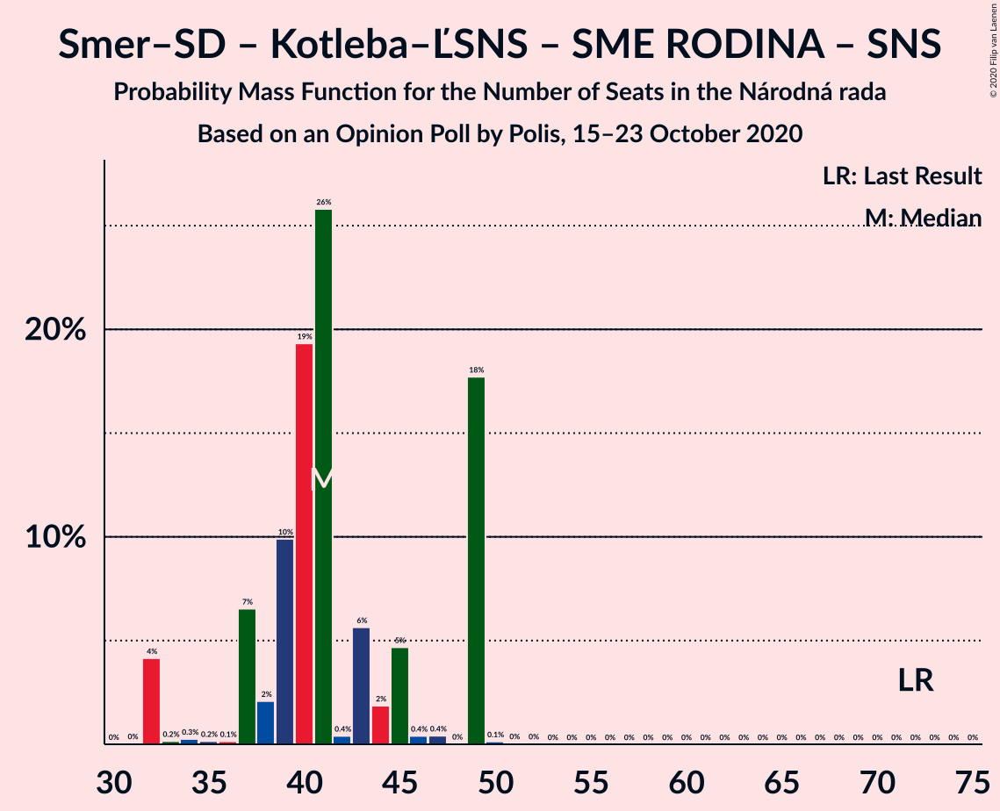

| Number of Seats | Probability | Accumulated | Special Marks |
|:---------------:|:-----------:|:-----------:|:-------------:|
| 31 | 0% | 100% |  |
| 32 | 4% | 99.9% |  |
| 33 | 0.2% | 96% |  |
| 34 | 0.3% | 96% |  |
| 35 | 0.2% | 95% |  |
| 36 | 0.1% | 95% |  |
| 37 | 7% | 95% |  |
| 38 | 2% | 89% |  |
| 39 | 10% | 86% |  |
| 40 | 19% | 77% |  |
| 41 | 26% | 57% |  |
| 42 | 0.4% | 31% |  |
| 43 | 6% | 31% | Median |
| 44 | 2% | 25% |  |
| 45 | 5% | 23% |  |
| 46 | 0.4% | 19% |  |
| 47 | 0.4% | 18% |  |
| 48 | 0% | 18% |  |
| 49 | 18% | 18% |  |
| 50 | 0.1% | 0.2% |  |
| 51 | 0% | 0.1% |  |
| 52 | 0% | 0% |  |
| 53 | 0% | 0% |  |
| 54 | 0% | 0% |  |
| 55 | 0% | 0% |  |
| 56 | 0% | 0% |  |
| 57 | 0% | 0% |  |
| 58 | 0% | 0% |  |
| 59 | 0% | 0% |  |
| 60 | 0% | 0% |  |
| 61 | 0% | 0% |  |
| 62 | 0% | 0% |  |
| 63 | 0% | 0% |  |
| 64 | 0% | 0% |  |
| 65 | 0% | 0% |  |
| 66 | 0% | 0% |  |
| 67 | 0% | 0% |  |
| 68 | 0% | 0% |  |
| 69 | 0% | 0% |  |
| 70 | 0% | 0% |  |
| 71 | 0% | 0% |  |
| 72 | 0% | 0% | Last Result |

### HLAS–sociálna demokracia – Slovenská národná strana – MOST–HÍD

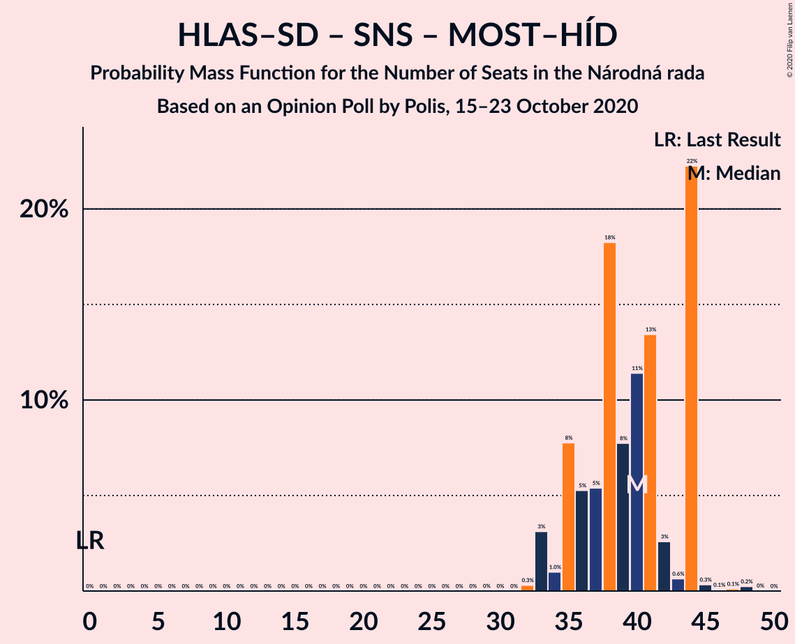

| Number of Seats | Probability | Accumulated | Special Marks |
|:---------------:|:-----------:|:-----------:|:-------------:|
| 0 | 0% | 100% | Last Result |
| 1 | 0% | 100% |  |
| 2 | 0% | 100% |  |
| 3 | 0% | 100% |  |
| 4 | 0% | 100% |  |
| 5 | 0% | 100% |  |
| 6 | 0% | 100% |  |
| 7 | 0% | 100% |  |
| 8 | 0% | 100% |  |
| 9 | 0% | 100% |  |
| 10 | 0% | 100% |  |
| 11 | 0% | 100% |  |
| 12 | 0% | 100% |  |
| 13 | 0% | 100% |  |
| 14 | 0% | 100% |  |
| 15 | 0% | 100% |  |
| 16 | 0% | 100% |  |
| 17 | 0% | 100% |  |
| 18 | 0% | 100% |  |
| 19 | 0% | 100% |  |
| 20 | 0% | 100% |  |
| 21 | 0% | 100% |  |
| 22 | 0% | 100% |  |
| 23 | 0% | 100% |  |
| 24 | 0% | 100% |  |
| 25 | 0% | 100% |  |
| 26 | 0% | 100% |  |
| 27 | 0% | 100% |  |
| 28 | 0% | 100% |  |
| 29 | 0% | 100% |  |
| 30 | 0% | 100% |  |
| 31 | 0% | 100% |  |
| 32 | 0.3% | 100% |  |
| 33 | 3% | 99.7% |  |
| 34 | 1.0% | 97% |  |
| 35 | 8% | 96% |  |
| 36 | 5% | 88% |  |
| 37 | 5% | 83% |  |
| 38 | 18% | 77% |  |
| 39 | 8% | 59% |  |
| 40 | 11% | 51% | Median |
| 41 | 13% | 40% |  |
| 42 | 3% | 26% |  |
| 43 | 0.6% | 24% |  |
| 44 | 22% | 23% |  |
| 45 | 0.3% | 0.8% |  |
| 46 | 0.1% | 0.5% |  |
| 47 | 0.1% | 0.4% |  |
| 48 | 0.2% | 0.3% |  |
| 49 | 0% | 0% |  |

### HLAS–sociálna demokracia – Slovenská národná strana

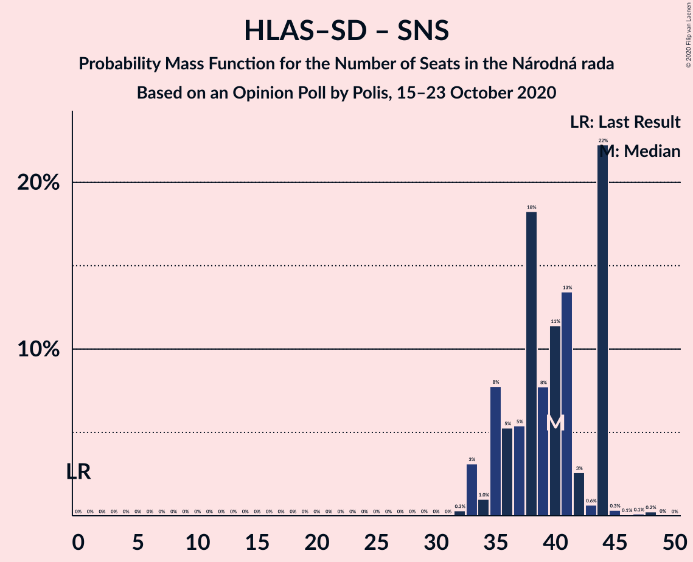

| Number of Seats | Probability | Accumulated | Special Marks |
|:---------------:|:-----------:|:-----------:|:-------------:|
| 0 | 0% | 100% | Last Result |
| 1 | 0% | 100% |  |
| 2 | 0% | 100% |  |
| 3 | 0% | 100% |  |
| 4 | 0% | 100% |  |
| 5 | 0% | 100% |  |
| 6 | 0% | 100% |  |
| 7 | 0% | 100% |  |
| 8 | 0% | 100% |  |
| 9 | 0% | 100% |  |
| 10 | 0% | 100% |  |
| 11 | 0% | 100% |  |
| 12 | 0% | 100% |  |
| 13 | 0% | 100% |  |
| 14 | 0% | 100% |  |
| 15 | 0% | 100% |  |
| 16 | 0% | 100% |  |
| 17 | 0% | 100% |  |
| 18 | 0% | 100% |  |
| 19 | 0% | 100% |  |
| 20 | 0% | 100% |  |
| 21 | 0% | 100% |  |
| 22 | 0% | 100% |  |
| 23 | 0% | 100% |  |
| 24 | 0% | 100% |  |
| 25 | 0% | 100% |  |
| 26 | 0% | 100% |  |
| 27 | 0% | 100% |  |
| 28 | 0% | 100% |  |
| 29 | 0% | 100% |  |
| 30 | 0% | 100% |  |
| 31 | 0% | 100% |  |
| 32 | 0.3% | 100% |  |
| 33 | 3% | 99.7% |  |
| 34 | 1.0% | 97% |  |
| 35 | 8% | 96% |  |
| 36 | 5% | 88% |  |
| 37 | 5% | 83% |  |
| 38 | 18% | 77% |  |
| 39 | 8% | 59% |  |
| 40 | 11% | 51% | Median |
| 41 | 13% | 40% |  |
| 42 | 3% | 26% |  |
| 43 | 0.6% | 24% |  |
| 44 | 22% | 23% |  |
| 45 | 0.3% | 0.8% |  |
| 46 | 0.1% | 0.5% |  |
| 47 | 0.1% | 0.4% |  |
| 48 | 0.2% | 0.3% |  |
| 49 | 0% | 0% |  |

### SMER–sociálna demokracia – SME RODINA

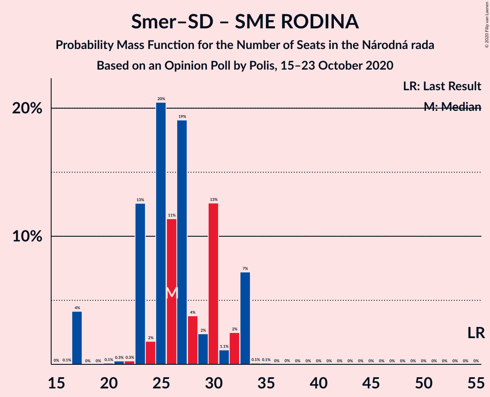

| Number of Seats | Probability | Accumulated | Special Marks |
|:---------------:|:-----------:|:-----------:|:-------------:|
| 15 | 0% | 100% |  |
| 16 | 0.1% | 99.9% |  |
| 17 | 4% | 99.9% |  |
| 18 | 0% | 96% |  |
| 19 | 0% | 96% |  |
| 20 | 0.1% | 96% |  |
| 21 | 0.3% | 96% |  |
| 22 | 0.3% | 95% |  |
| 23 | 13% | 95% |  |
| 24 | 2% | 83% |  |
| 25 | 20% | 81% |  |
| 26 | 11% | 60% |  |
| 27 | 19% | 49% | Median |
| 28 | 4% | 30% |  |
| 29 | 2% | 26% |  |
| 30 | 13% | 24% |  |
| 31 | 1.1% | 11% |  |
| 32 | 2% | 10% |  |
| 33 | 7% | 7% |  |
| 34 | 0.1% | 0.2% |  |
| 35 | 0.1% | 0.1% |  |
| 36 | 0% | 0% |  |
| 37 | 0% | 0% |  |
| 38 | 0% | 0% |  |
| 39 | 0% | 0% |  |
| 40 | 0% | 0% |  |
| 41 | 0% | 0% |  |
| 42 | 0% | 0% |  |
| 43 | 0% | 0% |  |
| 44 | 0% | 0% |  |
| 45 | 0% | 0% |  |
| 46 | 0% | 0% |  |
| 47 | 0% | 0% |  |
| 48 | 0% | 0% |  |
| 49 | 0% | 0% |  |
| 50 | 0% | 0% |  |
| 51 | 0% | 0% |  |
| 52 | 0% | 0% |  |
| 53 | 0% | 0% |  |
| 54 | 0% | 0% |  |
| 55 | 0% | 0% | Last Result |

### SMER–sociálna demokracia – SME RODINA – Slovenská národná strana

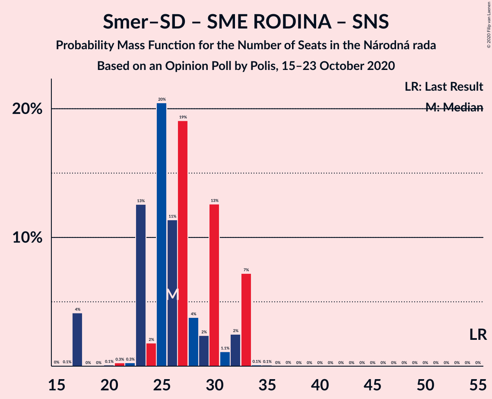

| Number of Seats | Probability | Accumulated | Special Marks |
|:---------------:|:-----------:|:-----------:|:-------------:|
| 15 | 0% | 100% |  |
| 16 | 0.1% | 99.9% |  |
| 17 | 4% | 99.9% |  |
| 18 | 0% | 96% |  |
| 19 | 0% | 96% |  |
| 20 | 0.1% | 96% |  |
| 21 | 0.3% | 96% |  |
| 22 | 0.3% | 95% |  |
| 23 | 13% | 95% |  |
| 24 | 2% | 83% |  |
| 25 | 20% | 81% |  |
| 26 | 11% | 60% |  |
| 27 | 19% | 49% | Median |
| 28 | 4% | 30% |  |
| 29 | 2% | 26% |  |
| 30 | 13% | 24% |  |
| 31 | 1.1% | 11% |  |
| 32 | 2% | 10% |  |
| 33 | 7% | 7% |  |
| 34 | 0.1% | 0.2% |  |
| 35 | 0.1% | 0.1% |  |
| 36 | 0% | 0% |  |
| 37 | 0% | 0% |  |
| 38 | 0% | 0% |  |
| 39 | 0% | 0% |  |
| 40 | 0% | 0% |  |
| 41 | 0% | 0% |  |
| 42 | 0% | 0% |  |
| 43 | 0% | 0% |  |
| 44 | 0% | 0% |  |
| 45 | 0% | 0% |  |
| 46 | 0% | 0% |  |
| 47 | 0% | 0% |  |
| 48 | 0% | 0% |  |
| 49 | 0% | 0% |  |
| 50 | 0% | 0% |  |
| 51 | 0% | 0% |  |
| 52 | 0% | 0% |  |
| 53 | 0% | 0% |  |
| 54 | 0% | 0% |  |
| 55 | 0% | 0% | Last Result |

### SMER–sociálna demokracia – Slovenská národná strana – MOST–HÍD

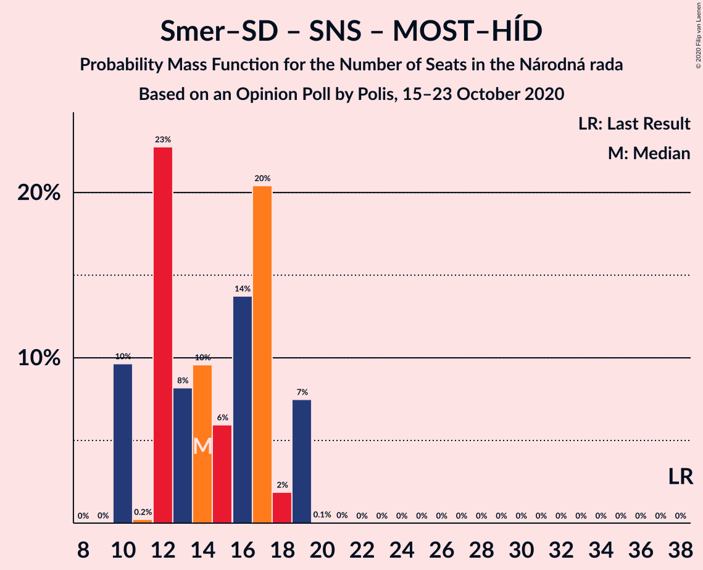

| Number of Seats | Probability | Accumulated | Special Marks |
|:---------------:|:-----------:|:-----------:|:-------------:|
| 10 | 10% | 100% |  |
| 11 | 0.2% | 90% |  |
| 12 | 23% | 90% |  |
| 13 | 8% | 67% |  |
| 14 | 10% | 59% | Median |
| 15 | 6% | 50% |  |
| 16 | 14% | 44% |  |
| 17 | 20% | 30% |  |
| 18 | 2% | 9% |  |
| 19 | 7% | 8% |  |
| 20 | 0.1% | 0.1% |  |
| 21 | 0% | 0% |  |
| 22 | 0% | 0% |  |
| 23 | 0% | 0% |  |
| 24 | 0% | 0% |  |
| 25 | 0% | 0% |  |
| 26 | 0% | 0% |  |
| 27 | 0% | 0% |  |
| 28 | 0% | 0% |  |
| 29 | 0% | 0% |  |
| 30 | 0% | 0% |  |
| 31 | 0% | 0% |  |
| 32 | 0% | 0% |  |
| 33 | 0% | 0% |  |
| 34 | 0% | 0% |  |
| 35 | 0% | 0% |  |
| 36 | 0% | 0% |  |
| 37 | 0% | 0% |  |
| 38 | 0% | 0% | Last Result |

### SMER–sociálna demokracia

| Number of Seats | Probability | Accumulated | Special Marks |
|:---------------:|:-----------:|:-----------:|:-------------:|
| 10 | 10% | 100% |  |
| 11 | 0.2% | 90% |  |
| 12 | 23% | 90% |  |
| 13 | 8% | 67% |  |
| 14 | 10% | 59% | Median |
| 15 | 6% | 50% |  |
| 16 | 14% | 44% |  |
| 17 | 20% | 30% |  |
| 18 | 2% | 9% |  |
| 19 | 7% | 8% |  |
| 20 | 0.1% | 0.1% |  |
| 21 | 0% | 0% |  |
| 22 | 0% | 0% |  |
| 23 | 0% | 0% |  |
| 24 | 0% | 0% |  |
| 25 | 0% | 0% |  |
| 26 | 0% | 0% |  |
| 27 | 0% | 0% |  |
| 28 | 0% | 0% |  |
| 29 | 0% | 0% |  |
| 30 | 0% | 0% |  |
| 31 | 0% | 0% |  |
| 32 | 0% | 0% |  |
| 33 | 0% | 0% |  |
| 34 | 0% | 0% |  |
| 35 | 0% | 0% |  |
| 36 | 0% | 0% |  |
| 37 | 0% | 0% |  |
| 38 | 0% | 0% | Last Result |

### SMER–sociálna demokracia – Slovenská národná strana

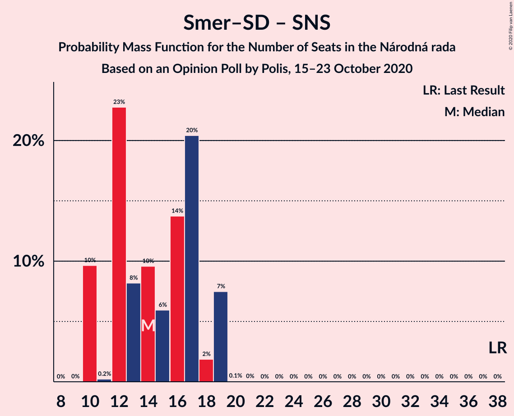

| Number of Seats | Probability | Accumulated | Special Marks |
|:---------------:|:-----------:|:-----------:|:-------------:|
| 10 | 10% | 100% |  |
| 11 | 0.2% | 90% |  |
| 12 | 23% | 90% |  |
| 13 | 8% | 67% |  |
| 14 | 10% | 59% | Median |
| 15 | 6% | 50% |  |
| 16 | 14% | 44% |  |
| 17 | 20% | 30% |  |
| 18 | 2% | 9% |  |
| 19 | 7% | 8% |  |
| 20 | 0.1% | 0.1% |  |
| 21 | 0% | 0% |  |
| 22 | 0% | 0% |  |
| 23 | 0% | 0% |  |
| 24 | 0% | 0% |  |
| 25 | 0% | 0% |  |
| 26 | 0% | 0% |  |
| 27 | 0% | 0% |  |
| 28 | 0% | 0% |  |
| 29 | 0% | 0% |  |
| 30 | 0% | 0% |  |
| 31 | 0% | 0% |  |
| 32 | 0% | 0% |  |
| 33 | 0% | 0% |  |
| 34 | 0% | 0% |  |
| 35 | 0% | 0% |  |
| 36 | 0% | 0% |  |
| 37 | 0% | 0% |  |
| 38 | 0% | 0% | Last Result |

## Technical Information

### Opinion Poll

+ **Polling firm:** Polis
+ **Commissioner(s):** —
+ **Fieldwork period:** 15–23 October 2020

### Calculations

+ **Sample size:** 1047
+ **Simulations done:** 1,048,576
+ **Error estimate:** 6.08%

