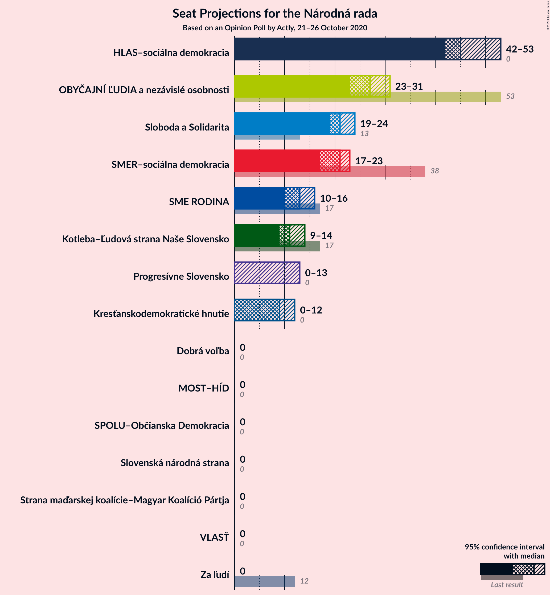
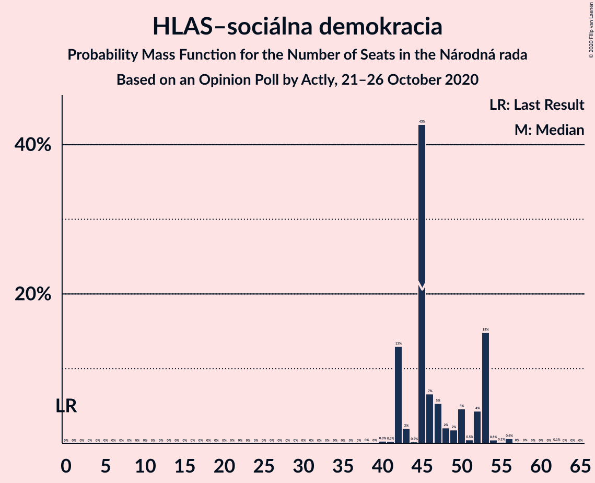
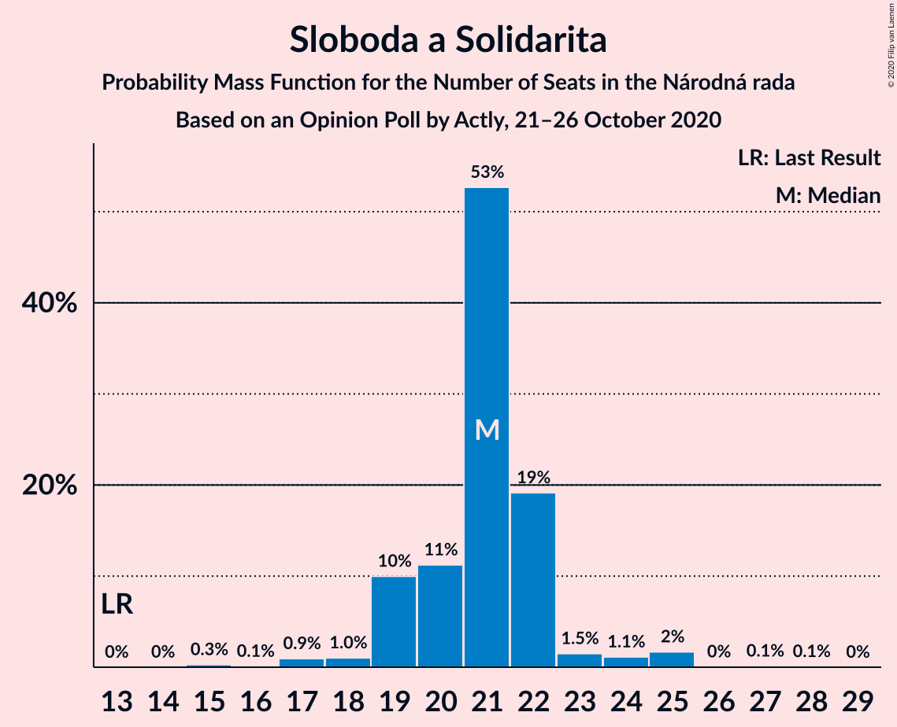
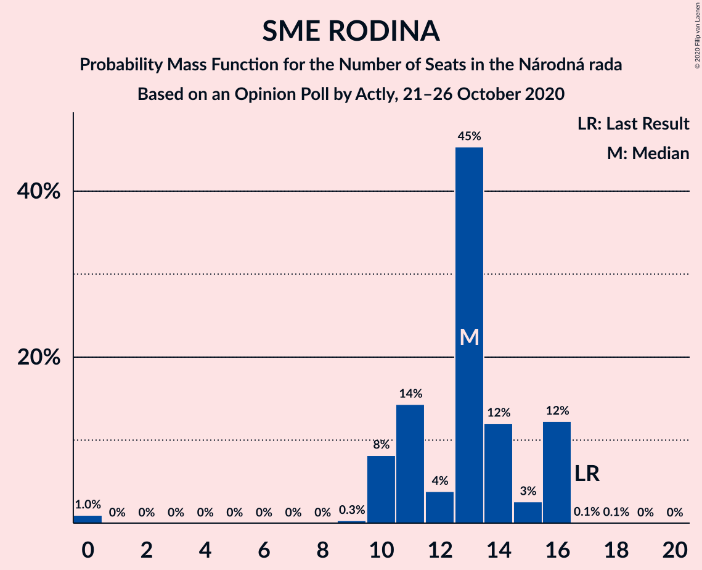
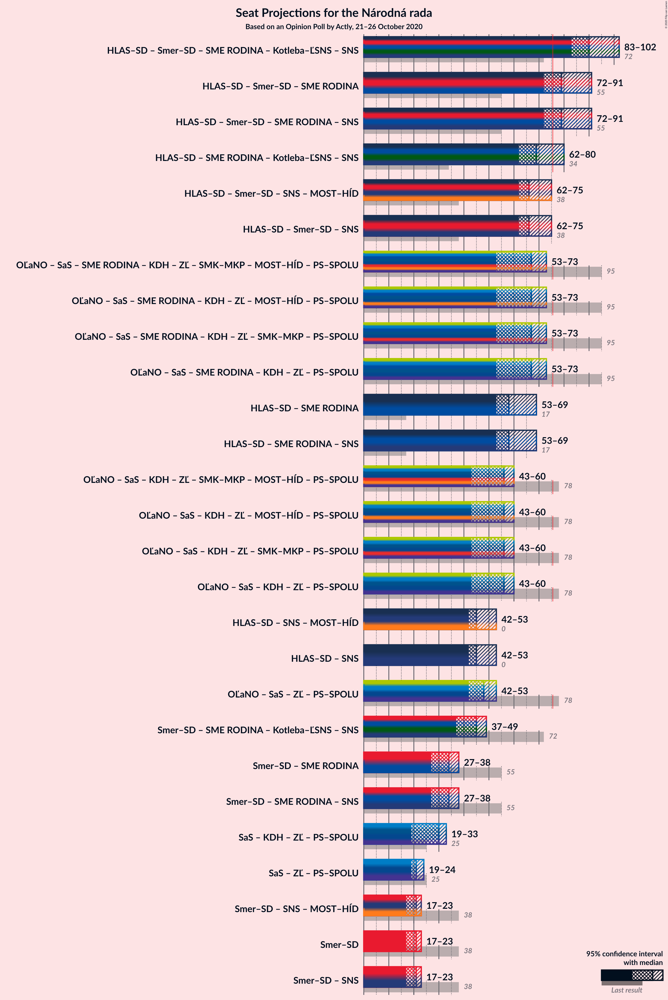
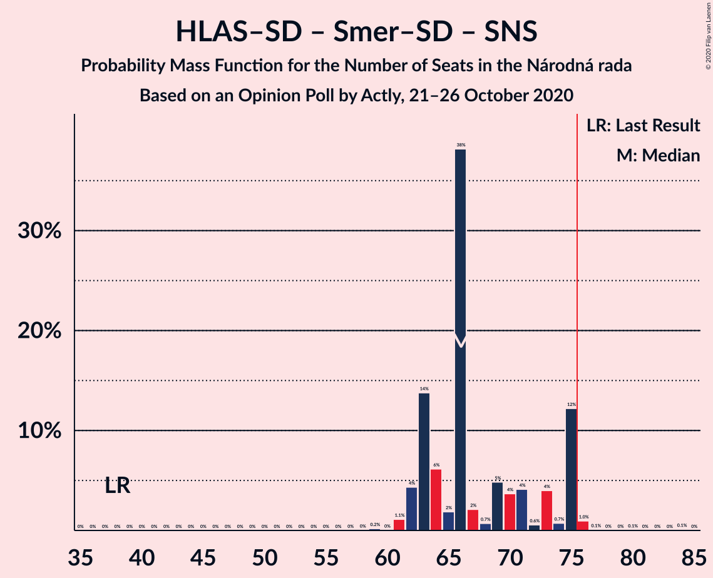
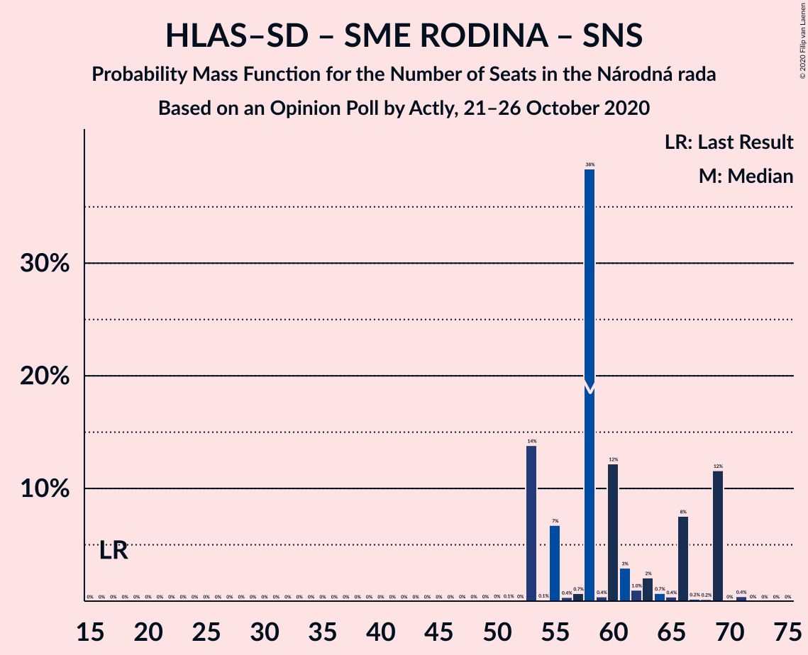
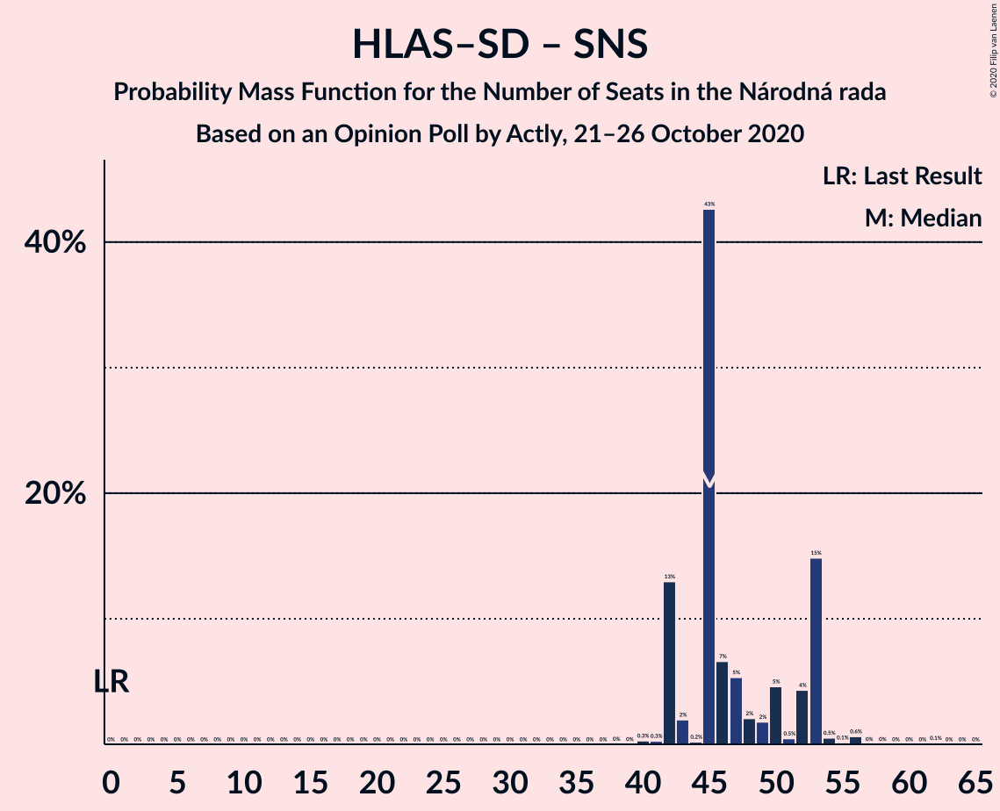
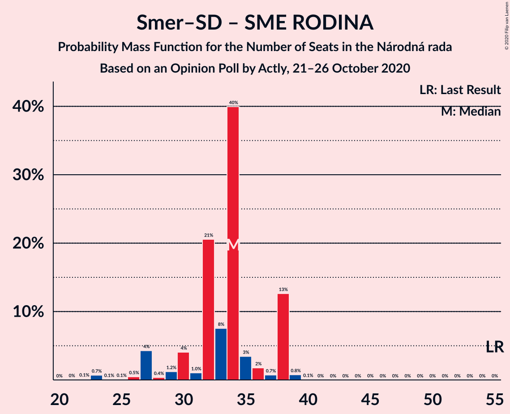

# Opinion Poll by Actly, 21–26 October 2020

<a href="#voting-intentions">Voting Intentions</a> | <a href="#seats">Seats</a> | <a href="#coalitions">Coalitions</a> | <a href="#technical-information">Technical Information</a>

## Voting Intentions

### Confidence Intervals

| Party | Last Result | Poll Result | 80% Confidence Interval | 90% Confidence Interval | 95% Confidence Interval | 99% Confidence Interval |
|:-----:|:-----------:|:-----------:|:-----------------------:|:-----------------------:|:-----------------------:|:-----------------------:|
| HLAS–sociálna demokracia | 0.0% | 26.5% | 24.8–28.3% |24.3–28.9% |23.9–29.3% |23.0–30.2% |
| OBYČAJNÍ ĽUDIA a nezávislé osobnosti | 25.0% | 14.7% | 13.3–16.2% |13.0–16.7% |12.6–17.0% |12.0–17.8% |
| Sloboda a Solidarita | 6.2% | 11.2% | 10.0–12.6% |9.7–13.0% |9.4–13.3% |8.8–14.0% |
| SMER–sociálna demokracia | 18.3% | 10.8% | 9.6–12.2% |9.3–12.5% |9.0–12.9% |8.5–13.6% |
| SME RODINA | 8.2% | 6.8% | 5.9–7.9% |5.6–8.3% |5.4–8.5% |5.0–9.1% |
| Kotleba–Ľudová strana Naše Slovensko | 8.0% | 6.2% | 5.3–7.3% |5.1–7.6% |4.9–7.9% |4.5–8.4% |
| Progresívne Slovensko | 7.0% | 5.5% | 4.7–6.5% |4.4–6.8% |4.3–7.1% |3.9–7.6% |
| Kresťanskodemokratické hnutie | 4.6% | 4.8% | 4.0–5.8% |3.8–6.1% |3.6–6.3% |3.3–6.8% |
| Slovenská národná strana | 3.2% | 2.9% | 2.3–3.7% |2.2–3.9% |2.0–4.1% |1.8–4.6% |
| Za ľudí | 5.8% | 2.9% | 2.3–3.7% |2.2–3.9% |2.0–4.1% |1.8–4.6% |
| Dobrá voľba | 3.1% | 2.0% | 1.5–2.7% |1.4–2.9% |1.3–3.1% |1.1–3.4% |
| Strana maďarskej koalície–Magyar Koalíció Pártja | 3.9% | 1.6% | 1.2–2.2% |1.1–2.4% |1.0–2.6% |0.8–2.9% |
| SPOLU–Občianska Demokracia | 7.0% | 1.1% | 0.8–1.7% |0.7–1.8% |0.6–2.0% |0.5–2.3% |
| MOST–HÍD | 2.0% | 0.6% | 0.4–1.1% |0.3–1.2% |0.3–1.3% |0.2–1.6% |
| VLASŤ | 2.9% | 0.6% | 0.4–1.1% |0.3–1.2% |0.3–1.3% |0.2–1.6% |

*Note:* The poll result column reflects the actual value used in the calculations. Published results may vary slightly, and in addition be rounded to fewer digits.

## Seats

### Confidence Intervals

| Party | Last Result | Median | 80% Confidence Interval | 90% Confidence Interval | 95% Confidence Interval | 99% Confidence Interval |
|:-----:|:-----------:|:------:|:-----------------------:|:-----------------------:|:-----------------------:|:-----------------------:|
| <a href="#hlas–sociálna-demokracia">HLAS–sociálna demokracia</a> | 0 | 52 | 46–56 |44–56 |43–56 |42–57 |
| <a href="#obyčajní-ľudia-a-nezávislé-osobnosti">OBYČAJNÍ ĽUDIA a nezávislé osobnosti</a> | 53 | 27 | 23–29 |22–31 |22–32 |21–33 |
| <a href="#sloboda-a-solidarita">Sloboda a Solidarita</a> | 13 | 21 | 18–24 |17–24 |17–24 |16–27 |
| <a href="#smer–sociálna-demokracia">SMER–sociálna demokracia</a> | 38 | 19 | 17–22 |17–24 |17–24 |16–24 |
| <a href="#sme-rodina">SME RODINA</a> | 17 | 14 | 12–15 |10–15 |0–15 |0–19 |
| <a href="#kotleba–ľudová-strana-naše-slovensko">Kotleba–Ľudová strana Naše Slovensko</a> | 17 | 11 | 0–13 |0–13 |0–15 |0–16 |
| <a href="#progresívne-slovensko">Progresívne Slovensko</a> | 0 | 11 | 0–12 |0–12 |0–12 |0–14 |
| <a href="#kresťanskodemokratické-hnutie">Kresťanskodemokratické hnutie</a> | 0 | 0 | 0–11 |0–12 |0–15 |0–15 |
| <a href="#slovenská-národná-strana">Slovenská národná strana</a> | 0 | 0 | 0 |0 |0 |0–9 |
| <a href="#za-ľudí">Za ľudí</a> | 12 | 0 | 0 |0 |0 |0–10 |
| <a href="#dobrá-voľba">Dobrá voľba</a> | 0 | 0 | 0 |0 |0 |0 |
| <a href="#strana-maďarskej-koalície–magyar-koalíció-pártja">Strana maďarskej koalície–Magyar Koalíció Pártja</a> | 0 | 0 | 0 |0 |0 |0 |
| <a href="#spolu–občianska-demokracia">SPOLU–Občianska Demokracia</a> | 0 | 0 | 0 |0 |0 |0 |
| <a href="#most–híd">MOST–HÍD</a> | 0 | 0 | 0 |0 |0 |0 |
| <a href="#vlasť">VLASŤ</a> | 0 | 0 | 0 |0 |0 |0 |

### HLAS–sociálna demokracia

*For a full overview of the results for this party, see the [HLAS–sociálna demokracia](party-hlas–sociálnademokracia.html) page.*

| Number of Seats | Probability | Accumulated | Special Marks |
|:---------------:|:-----------:|:-----------:|:-------------:|
| 0 | 0% | 100% | Last Result |
| 1 | 0% | 100% |  |
| 2 | 0% | 100% |  |
| 3 | 0% | 100% |  |
| 4 | 0% | 100% |  |
| 5 | 0% | 100% |  |
| 6 | 0% | 100% |  |
| 7 | 0% | 100% |  |
| 8 | 0% | 100% |  |
| 9 | 0% | 100% |  |
| 10 | 0% | 100% |  |
| 11 | 0% | 100% |  |
| 12 | 0% | 100% |  |
| 13 | 0% | 100% |  |
| 14 | 0% | 100% |  |
| 15 | 0% | 100% |  |
| 16 | 0% | 100% |  |
| 17 | 0% | 100% |  |
| 18 | 0% | 100% |  |
| 19 | 0% | 100% |  |
| 20 | 0% | 100% |  |
| 21 | 0% | 100% |  |
| 22 | 0% | 100% |  |
| 23 | 0% | 100% |  |
| 24 | 0% | 100% |  |
| 25 | 0% | 100% |  |
| 26 | 0% | 100% |  |
| 27 | 0% | 100% |  |
| 28 | 0% | 100% |  |
| 29 | 0% | 100% |  |
| 30 | 0% | 100% |  |
| 31 | 0% | 100% |  |
| 32 | 0% | 100% |  |
| 33 | 0% | 100% |  |
| 34 | 0% | 100% |  |
| 35 | 0% | 100% |  |
| 36 | 0% | 100% |  |
| 37 | 0% | 100% |  |
| 38 | 0% | 100% |  |
| 39 | 0% | 100% |  |
| 40 | 0.1% | 100% |  |
| 41 | 0.3% | 99.9% |  |
| 42 | 0.8% | 99.6% |  |
| 43 | 3% | 98.8% |  |
| 44 | 2% | 96% |  |
| 45 | 1.2% | 94% |  |
| 46 | 13% | 93% |  |
| 47 | 1.4% | 80% |  |
| 48 | 11% | 79% |  |
| 49 | 5% | 68% |  |
| 50 | 0.2% | 63% |  |
| 51 | 5% | 63% |  |
| 52 | 14% | 58% | Median |
| 53 | 0.5% | 45% |  |
| 54 | 0.6% | 44% |  |
| 55 | 0.3% | 43% |  |
| 56 | 42% | 43% |  |
| 57 | 0.1% | 0.6% |  |
| 58 | 0.1% | 0.5% |  |
| 59 | 0% | 0.4% |  |
| 60 | 0.4% | 0.4% |  |
| 61 | 0% | 0% |  |

### OBYČAJNÍ ĽUDIA a nezávislé osobnosti

*For a full overview of the results for this party, see the [OBYČAJNÍ ĽUDIA a nezávislé osobnosti](party-obyčajníľudiaanezávisléosobnosti.html) page.*

| Number of Seats | Probability | Accumulated | Special Marks |
|:---------------:|:-----------:|:-----------:|:-------------:|
| 21 | 1.0% | 100% |  |
| 22 | 9% | 98.9% |  |
| 23 | 1.1% | 90% |  |
| 24 | 15% | 89% |  |
| 25 | 13% | 74% |  |
| 26 | 10% | 62% |  |
| 27 | 9% | 51% | Median |
| 28 | 8% | 43% |  |
| 29 | 27% | 34% |  |
| 30 | 0.3% | 7% |  |
| 31 | 2% | 7% |  |
| 32 | 4% | 5% |  |
| 33 | 0.7% | 1.1% |  |
| 34 | 0% | 0.4% |  |
| 35 | 0.3% | 0.4% |  |
| 36 | 0% | 0% |  |
| 37 | 0% | 0% |  |
| 38 | 0% | 0% |  |
| 39 | 0% | 0% |  |
| 40 | 0% | 0% |  |
| 41 | 0% | 0% |  |
| 42 | 0% | 0% |  |
| 43 | 0% | 0% |  |
| 44 | 0% | 0% |  |
| 45 | 0% | 0% |  |
| 46 | 0% | 0% |  |
| 47 | 0% | 0% |  |
| 48 | 0% | 0% |  |
| 49 | 0% | 0% |  |
| 50 | 0% | 0% |  |
| 51 | 0% | 0% |  |
| 52 | 0% | 0% |  |
| 53 | 0% | 0% | Last Result |

### Sloboda a Solidarita

*For a full overview of the results for this party, see the [Sloboda a Solidarita](party-slobodaasolidarita.html) page.*

| Number of Seats | Probability | Accumulated | Special Marks |
|:---------------:|:-----------:|:-----------:|:-------------:|
| 13 | 0% | 100% | Last Result |
| 14 | 0% | 100% |  |
| 15 | 0.1% | 100% |  |
| 16 | 0.5% | 99.9% |  |
| 17 | 5% | 99.4% |  |
| 18 | 12% | 94% |  |
| 19 | 21% | 82% |  |
| 20 | 5% | 61% |  |
| 21 | 10% | 56% | Median |
| 22 | 27% | 46% |  |
| 23 | 6% | 19% |  |
| 24 | 11% | 13% |  |
| 25 | 1.0% | 2% |  |
| 26 | 0.2% | 1.0% |  |
| 27 | 0.5% | 0.9% |  |
| 28 | 0.3% | 0.3% |  |
| 29 | 0% | 0% |  |

### SMER–sociálna demokracia

*For a full overview of the results for this party, see the [SMER–sociálna demokracia](party-smer–sociálnademokracia.html) page.*

| Number of Seats | Probability | Accumulated | Special Marks |
|:---------------:|:-----------:|:-----------:|:-------------:|
| 14 | 0.4% | 100% |  |
| 15 | 0.1% | 99.6% |  |
| 16 | 0.3% | 99.5% |  |
| 17 | 36% | 99.2% |  |
| 18 | 11% | 63% |  |
| 19 | 3% | 51% | Median |
| 20 | 9% | 48% |  |
| 21 | 18% | 39% |  |
| 22 | 11% | 20% |  |
| 23 | 4% | 9% |  |
| 24 | 5% | 5% |  |
| 25 | 0.1% | 0.3% |  |
| 26 | 0.2% | 0.2% |  |
| 27 | 0% | 0.1% |  |
| 28 | 0% | 0% |  |
| 29 | 0% | 0% |  |
| 30 | 0% | 0% |  |
| 31 | 0% | 0% |  |
| 32 | 0% | 0% |  |
| 33 | 0% | 0% |  |
| 34 | 0% | 0% |  |
| 35 | 0% | 0% |  |
| 36 | 0% | 0% |  |
| 37 | 0% | 0% |  |
| 38 | 0% | 0% | Last Result |

### SME RODINA

*For a full overview of the results for this party, see the [SME RODINA](party-smerodina.html) page.*

| Number of Seats | Probability | Accumulated | Special Marks |
|:---------------:|:-----------:|:-----------:|:-------------:|
| 0 | 4% | 100% |  |
| 1 | 0% | 96% |  |
| 2 | 0% | 96% |  |
| 3 | 0% | 96% |  |
| 4 | 0% | 96% |  |
| 5 | 0% | 96% |  |
| 6 | 0% | 96% |  |
| 7 | 0% | 96% |  |
| 8 | 0% | 96% |  |
| 9 | 0.2% | 96% |  |
| 10 | 2% | 96% |  |
| 11 | 0.9% | 93% |  |
| 12 | 15% | 92% |  |
| 13 | 19% | 77% |  |
| 14 | 23% | 58% | Median |
| 15 | 34% | 35% |  |
| 16 | 0.3% | 1.1% |  |
| 17 | 0.1% | 0.8% | Last Result |
| 18 | 0.1% | 0.7% |  |
| 19 | 0.6% | 0.7% |  |
| 20 | 0% | 0% |  |

### Kotleba–Ľudová strana Naše Slovensko

*For a full overview of the results for this party, see the [Kotleba–Ľudová strana Naše Slovensko](party-kotleba–ľudovástrananašeslovensko.html) page.*

| Number of Seats | Probability | Accumulated | Special Marks |
|:---------------:|:-----------:|:-----------:|:-------------:|
| 0 | 42% | 100% |  |
| 1 | 0% | 58% |  |
| 2 | 0% | 58% |  |
| 3 | 0% | 58% |  |
| 4 | 0% | 58% |  |
| 5 | 0% | 58% |  |
| 6 | 0% | 58% |  |
| 7 | 0% | 58% |  |
| 8 | 0% | 58% |  |
| 9 | 0.5% | 58% |  |
| 10 | 2% | 57% |  |
| 11 | 21% | 55% | Median |
| 12 | 14% | 34% |  |
| 13 | 16% | 19% |  |
| 14 | 0.4% | 4% |  |
| 15 | 2% | 3% |  |
| 16 | 2% | 2% |  |
| 17 | 0% | 0% | Last Result |

### Progresívne Slovensko

*For a full overview of the results for this party, see the [Progresívne Slovensko](party-progresívneslovensko.html) page.*

| Number of Seats | Probability | Accumulated | Special Marks |
|:---------------:|:-----------:|:-----------:|:-------------:|
| 0 | 21% | 100% | Last Result |
| 1 | 0% | 79% |  |
| 2 | 0% | 79% |  |
| 3 | 0% | 79% |  |
| 4 | 0% | 79% |  |
| 5 | 0% | 79% |  |
| 6 | 0% | 79% |  |
| 7 | 0% | 79% |  |
| 8 | 0% | 79% |  |
| 9 | 7% | 79% |  |
| 10 | 10% | 73% |  |
| 11 | 47% | 63% | Median |
| 12 | 14% | 16% |  |
| 13 | 0.6% | 2% |  |
| 14 | 0.9% | 1.3% |  |
| 15 | 0.5% | 0.5% |  |
| 16 | 0% | 0% |  |

### Kresťanskodemokratické hnutie

*For a full overview of the results for this party, see the [Kresťanskodemokratické hnutie](party-kresťanskodemokratickéhnutie.html) page.*

| Number of Seats | Probability | Accumulated | Special Marks |
|:---------------:|:-----------:|:-----------:|:-------------:|
| 0 | 76% | 100% | Last Result, Median |
| 1 | 0% | 24% |  |
| 2 | 0% | 24% |  |
| 3 | 0% | 24% |  |
| 4 | 0% | 24% |  |
| 5 | 0% | 24% |  |
| 6 | 0% | 24% |  |
| 7 | 0% | 24% |  |
| 8 | 0% | 24% |  |
| 9 | 5% | 24% |  |
| 10 | 3% | 19% |  |
| 11 | 11% | 16% |  |
| 12 | 1.4% | 6% |  |
| 13 | 0.6% | 4% |  |
| 14 | 0% | 4% |  |
| 15 | 4% | 4% |  |
| 16 | 0% | 0% |  |

### Slovenská národná strana

*For a full overview of the results for this party, see the [Slovenská národná strana](party-slovenskánárodnástrana.html) page.*

| Number of Seats | Probability | Accumulated | Special Marks |
|:---------------:|:-----------:|:-----------:|:-------------:|
| 0 | 99.3% | 100% | Last Result, Median |
| 1 | 0% | 0.7% |  |
| 2 | 0% | 0.7% |  |
| 3 | 0% | 0.7% |  |
| 4 | 0% | 0.7% |  |
| 5 | 0% | 0.7% |  |
| 6 | 0% | 0.7% |  |
| 7 | 0% | 0.7% |  |
| 8 | 0% | 0.7% |  |
| 9 | 0.7% | 0.7% |  |
| 10 | 0% | 0% |  |

### Za ľudí

*For a full overview of the results for this party, see the [Za ľudí](party-zaľudí.html) page.*

| Number of Seats | Probability | Accumulated | Special Marks |
|:---------------:|:-----------:|:-----------:|:-------------:|
| 0 | 99.4% | 100% | Median |
| 1 | 0% | 0.6% |  |
| 2 | 0% | 0.6% |  |
| 3 | 0% | 0.6% |  |
| 4 | 0% | 0.6% |  |
| 5 | 0% | 0.6% |  |
| 6 | 0% | 0.6% |  |
| 7 | 0% | 0.6% |  |
| 8 | 0% | 0.6% |  |
| 9 | 0% | 0.6% |  |
| 10 | 0.6% | 0.6% |  |
| 11 | 0% | 0% |  |
| 12 | 0% | 0% | Last Result |

### Dobrá voľba

*For a full overview of the results for this party, see the [Dobrá voľba](party-dobrávoľba.html) page.*

| Number of Seats | Probability | Accumulated | Special Marks |
|:---------------:|:-----------:|:-----------:|:-------------:|
| 0 | 100% | 100% | Last Result, Median |

### Strana maďarskej koalície–Magyar Koalíció Pártja

*For a full overview of the results for this party, see the [Strana maďarskej koalície–Magyar Koalíció Pártja](party-stranamaďarskejkoalície–magyarkoalíciópártja.html) page.*

| Number of Seats | Probability | Accumulated | Special Marks |
|:---------------:|:-----------:|:-----------:|:-------------:|
| 0 | 100% | 100% | Last Result, Median |

### SPOLU–Občianska Demokracia

*For a full overview of the results for this party, see the [SPOLU–Občianska Demokracia](party-spolu–občianskademokracia.html) page.*

| Number of Seats | Probability | Accumulated | Special Marks |
|:---------------:|:-----------:|:-----------:|:-------------:|
| 0 | 100% | 100% | Last Result, Median |

### MOST–HÍD

*For a full overview of the results for this party, see the [MOST–HÍD](party-most–híd.html) page.*

| Number of Seats | Probability | Accumulated | Special Marks |
|:---------------:|:-----------:|:-----------:|:-------------:|
| 0 | 100% | 100% | Last Result, Median |

### VLASŤ

*For a full overview of the results for this party, see the [VLASŤ](party-vlasť.html) page.*

| Number of Seats | Probability | Accumulated | Special Marks |
|:---------------:|:-----------:|:-----------:|:-------------:|
| 0 | 100% | 100% | Last Result, Median |

## Coalitions

### Confidence Intervals

| Coalition | Last Result | Median | Majority? | 80% Confidence Interval | 90% Confidence Interval | 95% Confidence Interval | 99% Confidence Interval |
|:---------:|:-----------:|:------:|:---------:|:-----------------------:|:-----------------------:|:-----------------------:|:-----------------------:|
| HLAS–sociálna demokracia – SMER–sociálna demokracia – SME RODINA – Kotleba–Ľudová strana Naše Slovensko – Slovenská národná strana | 72 | 91 | 100% | 84–100 | 84–100 | 80–100 | 80–101 |
| HLAS–sociálna demokracia – SMER–sociálna demokracia – SME RODINA – Slovenská národná strana | 55 | 85 | 98% | 79–88 | 77–88 | 77–88 | 73–90 |
| HLAS–sociálna demokracia – SMER–sociálna demokracia – SME RODINA | 55 | 85 | 97% | 79–88 | 77–88 | 75–88 | 73–90 |
| HLAS–sociálna demokracia – SME RODINA – Kotleba–Ľudová strana Naše Slovensko – Slovenská národná strana | 34 | 72 | 19% | 62–82 | 62–82 | 56–82 | 56–82 |
| HLAS–sociálna demokracia – SMER–sociálna demokracia – Slovenská národná strana – MOST–HÍD | 38 | 73 | 4% | 66–74 | 63–75 | 63–80 | 59–81 |
| HLAS–sociálna demokracia – SMER–sociálna demokracia – Slovenská národná strana | 38 | 73 | 4% | 66–74 | 63–75 | 63–80 | 59–81 |
| HLAS–sociálna demokracia – SME RODINA | 17 | 64 | 0% | 58–71 | 56–71 | 56–71 | 51–71 |
| HLAS–sociálna demokracia – SME RODINA – Slovenská národná strana | 17 | 64 | 0% | 59–71 | 56–71 | 56–71 | 51–71 |
| HLAS–sociálna demokracia – Slovenská národná strana – MOST–HÍD | 0 | 52 | 0% | 46–56 | 44–56 | 43–56 | 42–57 |
| HLAS–sociálna demokracia – Slovenská národná strana | 0 | 52 | 0% | 46–56 | 44–56 | 43–56 | 42–57 |
| SMER–sociálna demokracia – SME RODINA – Kotleba–Ľudová strana Naše Slovensko – Slovenská národná strana | 72 | 44 | 0% | 32–46 | 32–47 | 24–49 | 24–51 |
| SMER–sociálna demokracia – SME RODINA | 55 | 32 | 0% | 31–36 | 29–36 | 24–36 | 24–37 |
| SMER–sociálna demokracia – SME RODINA – Slovenská národná strana | 55 | 32 | 0% | 31–36 | 29–36 | 24–36 | 24–40 |
| SMER–sociálna demokracia – Slovenská národná strana – MOST–HÍD | 38 | 19 | 0% | 17–23 | 17–24 | 17–24 | 16–30 |
| SMER–sociálna demokracia | 38 | 19 | 0% | 17–22 | 17–24 | 17–24 | 16–24 |
| SMER–sociálna demokracia – Slovenská národná strana | 38 | 19 | 0% | 17–23 | 17–24 | 17–24 | 16–30 |

### HLAS–sociálna demokracia – SMER–sociálna demokracia – SME RODINA – Kotleba–Ľudová strana Naše Slovensko – Slovenská národná strana

| Number of Seats | Probability | Accumulated | Special Marks |
|:---------------:|:-----------:|:-----------:|:-------------:|
| 72 | 0% | 100% | Last Result |
| 73 | 0% | 100% |  |
| 74 | 0% | 100% |  |
| 75 | 0% | 100% |  |
| 76 | 0% | 100% | Majority |
| 77 | 0% | 100% |  |
| 78 | 0.1% | 100% |  |
| 79 | 0.2% | 99.9% |  |
| 80 | 4% | 99.7% |  |
| 81 | 0.9% | 96% |  |
| 82 | 0% | 95% |  |
| 83 | 0.2% | 95% |  |
| 84 | 10% | 95% |  |
| 85 | 1.2% | 85% |  |
| 86 | 0.1% | 84% |  |
| 87 | 0.4% | 84% |  |
| 88 | 28% | 83% |  |
| 89 | 0% | 55% |  |
| 90 | 5% | 55% |  |
| 91 | 1.0% | 50% |  |
| 92 | 8% | 49% |  |
| 93 | 7% | 41% |  |
| 94 | 2% | 34% |  |
| 95 | 2% | 32% |  |
| 96 | 14% | 30% | Median |
| 97 | 0% | 16% |  |
| 98 | 4% | 16% |  |
| 99 | 0% | 12% |  |
| 100 | 10% | 12% |  |
| 101 | 2% | 2% |  |
| 102 | 0.3% | 0.3% |  |
| 103 | 0.1% | 0.1% |  |
| 104 | 0% | 0% |  |

### HLAS–sociálna demokracia – SMER–sociálna demokracia – SME RODINA – Slovenská národná strana

| Number of Seats | Probability | Accumulated | Special Marks |
|:---------------:|:-----------:|:-----------:|:-------------:|
| 55 | 0% | 100% | Last Result |
| 56 | 0% | 100% |  |
| 57 | 0% | 100% |  |
| 58 | 0% | 100% |  |
| 59 | 0% | 100% |  |
| 60 | 0% | 100% |  |
| 61 | 0% | 100% |  |
| 62 | 0% | 100% |  |
| 63 | 0% | 100% |  |
| 64 | 0% | 100% |  |
| 65 | 0% | 100% |  |
| 66 | 0% | 100% |  |
| 67 | 0% | 100% |  |
| 68 | 0% | 100% |  |
| 69 | 0% | 100% |  |
| 70 | 0.1% | 100% |  |
| 71 | 0% | 99.9% |  |
| 72 | 0.3% | 99.9% |  |
| 73 | 0.1% | 99.5% |  |
| 74 | 0.7% | 99.4% |  |
| 75 | 0.5% | 98.7% |  |
| 76 | 0.3% | 98% | Majority |
| 77 | 6% | 98% |  |
| 78 | 1.1% | 92% |  |
| 79 | 1.5% | 91% |  |
| 80 | 12% | 89% |  |
| 81 | 6% | 77% |  |
| 82 | 0.6% | 71% |  |
| 83 | 0.7% | 70% |  |
| 84 | 11% | 69% |  |
| 85 | 15% | 58% | Median |
| 86 | 0% | 43% |  |
| 87 | 13% | 43% |  |
| 88 | 29% | 30% |  |
| 89 | 0% | 0.7% |  |
| 90 | 0.2% | 0.7% |  |
| 91 | 0.3% | 0.5% |  |
| 92 | 0.1% | 0.2% |  |
| 93 | 0% | 0.1% |  |
| 94 | 0% | 0.1% |  |
| 95 | 0.1% | 0.1% |  |
| 96 | 0% | 0.1% |  |
| 97 | 0% | 0.1% |  |
| 98 | 0.1% | 0.1% |  |
| 99 | 0% | 0% |  |

### HLAS–sociálna demokracia – SMER–sociálna demokracia – SME RODINA

| Number of Seats | Probability | Accumulated | Special Marks |
|:---------------:|:-----------:|:-----------:|:-------------:|
| 55 | 0% | 100% | Last Result |
| 56 | 0% | 100% |  |
| 57 | 0% | 100% |  |
| 58 | 0% | 100% |  |
| 59 | 0% | 100% |  |
| 60 | 0% | 100% |  |
| 61 | 0% | 100% |  |
| 62 | 0% | 100% |  |
| 63 | 0% | 100% |  |
| 64 | 0% | 100% |  |
| 65 | 0% | 100% |  |
| 66 | 0% | 100% |  |
| 67 | 0% | 100% |  |
| 68 | 0% | 100% |  |
| 69 | 0% | 100% |  |
| 70 | 0.1% | 100% |  |
| 71 | 0% | 99.9% |  |
| 72 | 0.3% | 99.9% |  |
| 73 | 0.1% | 99.5% |  |
| 74 | 1.4% | 99.4% |  |
| 75 | 0.5% | 98% |  |
| 76 | 0.3% | 97% | Majority |
| 77 | 6% | 97% |  |
| 78 | 1.1% | 91% |  |
| 79 | 1.5% | 90% |  |
| 80 | 12% | 89% |  |
| 81 | 6% | 76% |  |
| 82 | 0.6% | 70% |  |
| 83 | 0% | 69% |  |
| 84 | 11% | 69% |  |
| 85 | 15% | 58% | Median |
| 86 | 0% | 43% |  |
| 87 | 13% | 43% |  |
| 88 | 29% | 30% |  |
| 89 | 0% | 0.7% |  |
| 90 | 0.2% | 0.7% |  |
| 91 | 0.3% | 0.5% |  |
| 92 | 0.1% | 0.2% |  |
| 93 | 0% | 0.1% |  |
| 94 | 0% | 0.1% |  |
| 95 | 0.1% | 0.1% |  |
| 96 | 0% | 0.1% |  |
| 97 | 0% | 0.1% |  |
| 98 | 0.1% | 0.1% |  |
| 99 | 0% | 0% |  |

### HLAS–sociálna demokracia – SME RODINA – Kotleba–Ľudová strana Naše Slovensko – Slovenská národná strana

| Number of Seats | Probability | Accumulated | Special Marks |
|:---------------:|:-----------:|:-----------:|:-------------:|
| 34 | 0% | 100% | Last Result |
| 35 | 0% | 100% |  |
| 36 | 0% | 100% |  |
| 37 | 0% | 100% |  |
| 38 | 0% | 100% |  |
| 39 | 0% | 100% |  |
| 40 | 0% | 100% |  |
| 41 | 0% | 100% |  |
| 42 | 0% | 100% |  |
| 43 | 0% | 100% |  |
| 44 | 0% | 100% |  |
| 45 | 0% | 100% |  |
| 46 | 0% | 100% |  |
| 47 | 0% | 100% |  |
| 48 | 0% | 100% |  |
| 49 | 0% | 100% |  |
| 50 | 0% | 100% |  |
| 51 | 0% | 100% |  |
| 52 | 0% | 100% |  |
| 53 | 0% | 100% |  |
| 54 | 0% | 100% |  |
| 55 | 0% | 100% |  |
| 56 | 4% | 100% |  |
| 57 | 0% | 96% |  |
| 58 | 0% | 96% |  |
| 59 | 0.5% | 96% |  |
| 60 | 0.4% | 96% |  |
| 61 | 0.1% | 96% |  |
| 62 | 10% | 95% |  |
| 63 | 0.1% | 85% |  |
| 64 | 0.5% | 85% |  |
| 65 | 0.1% | 84% |  |
| 66 | 2% | 84% |  |
| 67 | 0.3% | 83% |  |
| 68 | 0.8% | 83% |  |
| 69 | 0.5% | 82% |  |
| 70 | 0.3% | 81% |  |
| 71 | 27% | 81% |  |
| 72 | 11% | 54% |  |
| 73 | 5% | 42% |  |
| 74 | 0.4% | 37% |  |
| 75 | 18% | 36% |  |
| 76 | 5% | 19% | Majority |
| 77 | 2% | 14% | Median |
| 78 | 0.4% | 13% |  |
| 79 | 0% | 12% |  |
| 80 | 0.6% | 12% |  |
| 81 | 0.4% | 12% |  |
| 82 | 11% | 11% |  |
| 83 | 0% | 0% |  |

### HLAS–sociálna demokracia – SMER–sociálna demokracia – Slovenská národná strana – MOST–HÍD

| Number of Seats | Probability | Accumulated | Special Marks |
|:---------------:|:-----------:|:-----------:|:-------------:|
| 38 | 0% | 100% | Last Result |
| 39 | 0% | 100% |  |
| 40 | 0% | 100% |  |
| 41 | 0% | 100% |  |
| 42 | 0% | 100% |  |
| 43 | 0% | 100% |  |
| 44 | 0% | 100% |  |
| 45 | 0% | 100% |  |
| 46 | 0% | 100% |  |
| 47 | 0% | 100% |  |
| 48 | 0% | 100% |  |
| 49 | 0% | 100% |  |
| 50 | 0% | 100% |  |
| 51 | 0% | 100% |  |
| 52 | 0% | 100% |  |
| 53 | 0% | 100% |  |
| 54 | 0% | 100% |  |
| 55 | 0% | 100% |  |
| 56 | 0% | 100% |  |
| 57 | 0% | 100% |  |
| 58 | 0% | 100% |  |
| 59 | 0.6% | 99.9% |  |
| 60 | 0.1% | 99.3% |  |
| 61 | 0.1% | 99.2% |  |
| 62 | 1.0% | 99.2% |  |
| 63 | 4% | 98% |  |
| 64 | 2% | 94% |  |
| 65 | 0.7% | 92% |  |
| 66 | 15% | 91% |  |
| 67 | 2% | 77% |  |
| 68 | 1.2% | 75% |  |
| 69 | 0.5% | 74% |  |
| 70 | 10% | 73% |  |
| 71 | 0.6% | 63% | Median |
| 72 | 0.3% | 63% |  |
| 73 | 42% | 62% |  |
| 74 | 14% | 20% |  |
| 75 | 2% | 7% |  |
| 76 | 0% | 4% | Majority |
| 77 | 0.1% | 4% |  |
| 78 | 0% | 4% |  |
| 79 | 0.3% | 4% |  |
| 80 | 4% | 4% |  |
| 81 | 0.5% | 0.5% |  |
| 82 | 0% | 0% |  |

### HLAS–sociálna demokracia – SMER–sociálna demokracia – Slovenská národná strana

| Number of Seats | Probability | Accumulated | Special Marks |
|:---------------:|:-----------:|:-----------:|:-------------:|
| 38 | 0% | 100% | Last Result |
| 39 | 0% | 100% |  |
| 40 | 0% | 100% |  |
| 41 | 0% | 100% |  |
| 42 | 0% | 100% |  |
| 43 | 0% | 100% |  |
| 44 | 0% | 100% |  |
| 45 | 0% | 100% |  |
| 46 | 0% | 100% |  |
| 47 | 0% | 100% |  |
| 48 | 0% | 100% |  |
| 49 | 0% | 100% |  |
| 50 | 0% | 100% |  |
| 51 | 0% | 100% |  |
| 52 | 0% | 100% |  |
| 53 | 0% | 100% |  |
| 54 | 0% | 100% |  |
| 55 | 0% | 100% |  |
| 56 | 0% | 100% |  |
| 57 | 0% | 100% |  |
| 58 | 0% | 100% |  |
| 59 | 0.6% | 99.9% |  |
| 60 | 0.1% | 99.3% |  |
| 61 | 0.1% | 99.2% |  |
| 62 | 1.0% | 99.2% |  |
| 63 | 4% | 98% |  |
| 64 | 2% | 94% |  |
| 65 | 0.7% | 92% |  |
| 66 | 15% | 91% |  |
| 67 | 2% | 77% |  |
| 68 | 1.2% | 75% |  |
| 69 | 0.5% | 74% |  |
| 70 | 10% | 73% |  |
| 71 | 0.6% | 63% | Median |
| 72 | 0.3% | 63% |  |
| 73 | 42% | 62% |  |
| 74 | 14% | 20% |  |
| 75 | 2% | 7% |  |
| 76 | 0% | 4% | Majority |
| 77 | 0.1% | 4% |  |
| 78 | 0% | 4% |  |
| 79 | 0.3% | 4% |  |
| 80 | 4% | 4% |  |
| 81 | 0.5% | 0.5% |  |
| 82 | 0% | 0% |  |

### HLAS–sociálna demokracia – SME RODINA

| Number of Seats | Probability | Accumulated | Special Marks |
|:---------------:|:-----------:|:-----------:|:-------------:|
| 17 | 0% | 100% | Last Result |
| 18 | 0% | 100% |  |
| 19 | 0% | 100% |  |
| 20 | 0% | 100% |  |
| 21 | 0% | 100% |  |
| 22 | 0% | 100% |  |
| 23 | 0% | 100% |  |
| 24 | 0% | 100% |  |
| 25 | 0% | 100% |  |
| 26 | 0% | 100% |  |
| 27 | 0% | 100% |  |
| 28 | 0% | 100% |  |
| 29 | 0% | 100% |  |
| 30 | 0% | 100% |  |
| 31 | 0% | 100% |  |
| 32 | 0% | 100% |  |
| 33 | 0% | 100% |  |
| 34 | 0% | 100% |  |
| 35 | 0% | 100% |  |
| 36 | 0% | 100% |  |
| 37 | 0% | 100% |  |
| 38 | 0% | 100% |  |
| 39 | 0% | 100% |  |
| 40 | 0% | 100% |  |
| 41 | 0% | 100% |  |
| 42 | 0% | 100% |  |
| 43 | 0% | 100% |  |
| 44 | 0% | 100% |  |
| 45 | 0% | 100% |  |
| 46 | 0% | 100% |  |
| 47 | 0% | 100% |  |
| 48 | 0% | 100% |  |
| 49 | 0% | 100% |  |
| 50 | 0.1% | 100% |  |
| 51 | 0.4% | 99.9% |  |
| 52 | 0% | 99.5% |  |
| 53 | 0.8% | 99.5% |  |
| 54 | 0.8% | 98.7% |  |
| 55 | 0.3% | 98% |  |
| 56 | 6% | 98% |  |
| 57 | 0.7% | 92% |  |
| 58 | 1.4% | 91% |  |
| 59 | 2% | 90% |  |
| 60 | 13% | 88% |  |
| 61 | 0.3% | 75% |  |
| 62 | 11% | 75% |  |
| 63 | 0.2% | 64% |  |
| 64 | 22% | 64% |  |
| 65 | 0.2% | 42% |  |
| 66 | 2% | 42% | Median |
| 67 | 1.3% | 40% |  |
| 68 | 0.3% | 39% |  |
| 69 | 11% | 38% |  |
| 70 | 0% | 27% |  |
| 71 | 27% | 27% |  |
| 72 | 0% | 0.1% |  |
| 73 | 0% | 0.1% |  |
| 74 | 0.1% | 0.1% |  |
| 75 | 0.1% | 0.1% |  |
| 76 | 0% | 0% | Majority |

### HLAS–sociálna demokracia – SME RODINA – Slovenská národná strana

| Number of Seats | Probability | Accumulated | Special Marks |
|:---------------:|:-----------:|:-----------:|:-------------:|
| 17 | 0% | 100% | Last Result |
| 18 | 0% | 100% |  |
| 19 | 0% | 100% |  |
| 20 | 0% | 100% |  |
| 21 | 0% | 100% |  |
| 22 | 0% | 100% |  |
| 23 | 0% | 100% |  |
| 24 | 0% | 100% |  |
| 25 | 0% | 100% |  |
| 26 | 0% | 100% |  |
| 27 | 0% | 100% |  |
| 28 | 0% | 100% |  |
| 29 | 0% | 100% |  |
| 30 | 0% | 100% |  |
| 31 | 0% | 100% |  |
| 32 | 0% | 100% |  |
| 33 | 0% | 100% |  |
| 34 | 0% | 100% |  |
| 35 | 0% | 100% |  |
| 36 | 0% | 100% |  |
| 37 | 0% | 100% |  |
| 38 | 0% | 100% |  |
| 39 | 0% | 100% |  |
| 40 | 0% | 100% |  |
| 41 | 0% | 100% |  |
| 42 | 0% | 100% |  |
| 43 | 0% | 100% |  |
| 44 | 0% | 100% |  |
| 45 | 0% | 100% |  |
| 46 | 0% | 100% |  |
| 47 | 0% | 100% |  |
| 48 | 0% | 100% |  |
| 49 | 0% | 100% |  |
| 50 | 0.1% | 100% |  |
| 51 | 0.4% | 99.9% |  |
| 52 | 0% | 99.5% |  |
| 53 | 0.1% | 99.5% |  |
| 54 | 0.8% | 99.4% |  |
| 55 | 0.3% | 98.5% |  |
| 56 | 6% | 98% |  |
| 57 | 0.7% | 92% |  |
| 58 | 1.4% | 92% |  |
| 59 | 2% | 90% |  |
| 60 | 13% | 89% |  |
| 61 | 0.3% | 76% |  |
| 62 | 11% | 76% |  |
| 63 | 0.2% | 64% |  |
| 64 | 22% | 64% |  |
| 65 | 0.2% | 42% |  |
| 66 | 2% | 42% | Median |
| 67 | 1.3% | 40% |  |
| 68 | 0.3% | 39% |  |
| 69 | 11% | 38% |  |
| 70 | 0% | 27% |  |
| 71 | 27% | 27% |  |
| 72 | 0% | 0.1% |  |
| 73 | 0% | 0.1% |  |
| 74 | 0.1% | 0.1% |  |
| 75 | 0.1% | 0.1% |  |
| 76 | 0% | 0% | Majority |

### HLAS–sociálna demokracia – Slovenská národná strana – MOST–HÍD

| Number of Seats | Probability | Accumulated | Special Marks |
|:---------------:|:-----------:|:-----------:|:-------------:|
| 0 | 0% | 100% | Last Result |
| 1 | 0% | 100% |  |
| 2 | 0% | 100% |  |
| 3 | 0% | 100% |  |
| 4 | 0% | 100% |  |
| 5 | 0% | 100% |  |
| 6 | 0% | 100% |  |
| 7 | 0% | 100% |  |
| 8 | 0% | 100% |  |
| 9 | 0% | 100% |  |
| 10 | 0% | 100% |  |
| 11 | 0% | 100% |  |
| 12 | 0% | 100% |  |
| 13 | 0% | 100% |  |
| 14 | 0% | 100% |  |
| 15 | 0% | 100% |  |
| 16 | 0% | 100% |  |
| 17 | 0% | 100% |  |
| 18 | 0% | 100% |  |
| 19 | 0% | 100% |  |
| 20 | 0% | 100% |  |
| 21 | 0% | 100% |  |
| 22 | 0% | 100% |  |
| 23 | 0% | 100% |  |
| 24 | 0% | 100% |  |
| 25 | 0% | 100% |  |
| 26 | 0% | 100% |  |
| 27 | 0% | 100% |  |
| 28 | 0% | 100% |  |
| 29 | 0% | 100% |  |
| 30 | 0% | 100% |  |
| 31 | 0% | 100% |  |
| 32 | 0% | 100% |  |
| 33 | 0% | 100% |  |
| 34 | 0% | 100% |  |
| 35 | 0% | 100% |  |
| 36 | 0% | 100% |  |
| 37 | 0% | 100% |  |
| 38 | 0% | 100% |  |
| 39 | 0% | 100% |  |
| 40 | 0.1% | 100% |  |
| 41 | 0.3% | 99.9% |  |
| 42 | 0.8% | 99.6% |  |
| 43 | 2% | 98.8% |  |
| 44 | 2% | 97% |  |
| 45 | 1.2% | 95% |  |
| 46 | 13% | 94% |  |
| 47 | 1.4% | 81% |  |
| 48 | 11% | 79% |  |
| 49 | 5% | 69% |  |
| 50 | 0.2% | 64% |  |
| 51 | 5% | 64% |  |
| 52 | 14% | 59% | Median |
| 53 | 0.5% | 45% |  |
| 54 | 0.6% | 44% |  |
| 55 | 0.3% | 43% |  |
| 56 | 42% | 43% |  |
| 57 | 0.1% | 0.6% |  |
| 58 | 0.1% | 0.5% |  |
| 59 | 0% | 0.4% |  |
| 60 | 0.4% | 0.4% |  |
| 61 | 0% | 0% |  |

### HLAS–sociálna demokracia – Slovenská národná strana

| Number of Seats | Probability | Accumulated | Special Marks |
|:---------------:|:-----------:|:-----------:|:-------------:|
| 0 | 0% | 100% | Last Result |
| 1 | 0% | 100% |  |
| 2 | 0% | 100% |  |
| 3 | 0% | 100% |  |
| 4 | 0% | 100% |  |
| 5 | 0% | 100% |  |
| 6 | 0% | 100% |  |
| 7 | 0% | 100% |  |
| 8 | 0% | 100% |  |
| 9 | 0% | 100% |  |
| 10 | 0% | 100% |  |
| 11 | 0% | 100% |  |
| 12 | 0% | 100% |  |
| 13 | 0% | 100% |  |
| 14 | 0% | 100% |  |
| 15 | 0% | 100% |  |
| 16 | 0% | 100% |  |
| 17 | 0% | 100% |  |
| 18 | 0% | 100% |  |
| 19 | 0% | 100% |  |
| 20 | 0% | 100% |  |
| 21 | 0% | 100% |  |
| 22 | 0% | 100% |  |
| 23 | 0% | 100% |  |
| 24 | 0% | 100% |  |
| 25 | 0% | 100% |  |
| 26 | 0% | 100% |  |
| 27 | 0% | 100% |  |
| 28 | 0% | 100% |  |
| 29 | 0% | 100% |  |
| 30 | 0% | 100% |  |
| 31 | 0% | 100% |  |
| 32 | 0% | 100% |  |
| 33 | 0% | 100% |  |
| 34 | 0% | 100% |  |
| 35 | 0% | 100% |  |
| 36 | 0% | 100% |  |
| 37 | 0% | 100% |  |
| 38 | 0% | 100% |  |
| 39 | 0% | 100% |  |
| 40 | 0.1% | 100% |  |
| 41 | 0.3% | 99.9% |  |
| 42 | 0.8% | 99.6% |  |
| 43 | 2% | 98.8% |  |
| 44 | 2% | 97% |  |
| 45 | 1.2% | 95% |  |
| 46 | 13% | 94% |  |
| 47 | 1.4% | 81% |  |
| 48 | 11% | 79% |  |
| 49 | 5% | 69% |  |
| 50 | 0.2% | 64% |  |
| 51 | 5% | 64% |  |
| 52 | 14% | 59% | Median |
| 53 | 0.5% | 45% |  |
| 54 | 0.6% | 44% |  |
| 55 | 0.3% | 43% |  |
| 56 | 42% | 43% |  |
| 57 | 0.1% | 0.6% |  |
| 58 | 0.1% | 0.5% |  |
| 59 | 0% | 0.4% |  |
| 60 | 0.4% | 0.4% |  |
| 61 | 0% | 0% |  |

### SMER–sociálna demokracia – SME RODINA – Kotleba–Ľudová strana Naše Slovensko – Slovenská národná strana

| Number of Seats | Probability | Accumulated | Special Marks |
|:---------------:|:-----------:|:-----------:|:-------------:|
| 21 | 0.4% | 100% |  |
| 22 | 0% | 99.6% |  |
| 23 | 0% | 99.6% |  |
| 24 | 4% | 99.6% |  |
| 25 | 0% | 96% |  |
| 26 | 0% | 96% |  |
| 27 | 0.1% | 96% |  |
| 28 | 0% | 96% |  |
| 29 | 0.1% | 96% |  |
| 30 | 0% | 96% |  |
| 31 | 0% | 96% |  |
| 32 | 27% | 96% |  |
| 33 | 0% | 69% |  |
| 34 | 0.1% | 69% |  |
| 35 | 0.1% | 69% |  |
| 36 | 10% | 69% |  |
| 37 | 0.5% | 58% |  |
| 38 | 0% | 58% |  |
| 39 | 1.0% | 58% |  |
| 40 | 0.2% | 57% |  |
| 41 | 0.7% | 56% |  |
| 42 | 0.9% | 56% |  |
| 43 | 1.3% | 55% |  |
| 44 | 32% | 54% | Median |
| 45 | 2% | 21% |  |
| 46 | 10% | 19% |  |
| 47 | 5% | 9% |  |
| 48 | 1.0% | 4% |  |
| 49 | 1.0% | 3% |  |
| 50 | 2% | 2% |  |
| 51 | 0.7% | 0.8% |  |
| 52 | 0% | 0% |  |
| 53 | 0% | 0% |  |
| 54 | 0% | 0% |  |
| 55 | 0% | 0% |  |
| 56 | 0% | 0% |  |
| 57 | 0% | 0% |  |
| 58 | 0% | 0% |  |
| 59 | 0% | 0% |  |
| 60 | 0% | 0% |  |
| 61 | 0% | 0% |  |
| 62 | 0% | 0% |  |
| 63 | 0% | 0% |  |
| 64 | 0% | 0% |  |
| 65 | 0% | 0% |  |
| 66 | 0% | 0% |  |
| 67 | 0% | 0% |  |
| 68 | 0% | 0% |  |
| 69 | 0% | 0% |  |
| 70 | 0% | 0% |  |
| 71 | 0% | 0% |  |
| 72 | 0% | 0% | Last Result |

### SMER–sociálna demokracia – SME RODINA

| Number of Seats | Probability | Accumulated | Special Marks |
|:---------------:|:-----------:|:-----------:|:-------------:|
| 21 | 0.4% | 100% |  |
| 22 | 0% | 99.6% |  |
| 23 | 0% | 99.6% |  |
| 24 | 4% | 99.5% |  |
| 25 | 0% | 96% |  |
| 26 | 0.1% | 96% |  |
| 27 | 0.1% | 96% |  |
| 28 | 0.1% | 96% |  |
| 29 | 1.1% | 96% |  |
| 30 | 0.8% | 95% |  |
| 31 | 15% | 94% |  |
| 32 | 35% | 79% |  |
| 33 | 15% | 44% | Median |
| 34 | 12% | 29% |  |
| 35 | 0.5% | 17% |  |
| 36 | 15% | 16% |  |
| 37 | 1.1% | 2% |  |
| 38 | 0.1% | 0.5% |  |
| 39 | 0.3% | 0.4% |  |
| 40 | 0.1% | 0.1% |  |
| 41 | 0% | 0% |  |
| 42 | 0% | 0% |  |
| 43 | 0% | 0% |  |
| 44 | 0% | 0% |  |
| 45 | 0% | 0% |  |
| 46 | 0% | 0% |  |
| 47 | 0% | 0% |  |
| 48 | 0% | 0% |  |
| 49 | 0% | 0% |  |
| 50 | 0% | 0% |  |
| 51 | 0% | 0% |  |
| 52 | 0% | 0% |  |
| 53 | 0% | 0% |  |
| 54 | 0% | 0% |  |
| 55 | 0% | 0% | Last Result |

### SMER–sociálna demokracia – SME RODINA – Slovenská národná strana

| Number of Seats | Probability | Accumulated | Special Marks |
|:---------------:|:-----------:|:-----------:|:-------------:|
| 21 | 0.4% | 100% |  |
| 22 | 0% | 99.6% |  |
| 23 | 0% | 99.6% |  |
| 24 | 4% | 99.5% |  |
| 25 | 0% | 96% |  |
| 26 | 0.1% | 96% |  |
| 27 | 0.1% | 96% |  |
| 28 | 0.1% | 96% |  |
| 29 | 1.1% | 96% |  |
| 30 | 0.8% | 95% |  |
| 31 | 14% | 94% |  |
| 32 | 35% | 80% |  |
| 33 | 15% | 45% | Median |
| 34 | 12% | 30% |  |
| 35 | 0.5% | 18% |  |
| 36 | 15% | 17% |  |
| 37 | 1.2% | 2% |  |
| 38 | 0.1% | 1.2% |  |
| 39 | 0.3% | 1.1% |  |
| 40 | 0.8% | 0.8% |  |
| 41 | 0% | 0% |  |
| 42 | 0% | 0% |  |
| 43 | 0% | 0% |  |
| 44 | 0% | 0% |  |
| 45 | 0% | 0% |  |
| 46 | 0% | 0% |  |
| 47 | 0% | 0% |  |
| 48 | 0% | 0% |  |
| 49 | 0% | 0% |  |
| 50 | 0% | 0% |  |
| 51 | 0% | 0% |  |
| 52 | 0% | 0% |  |
| 53 | 0% | 0% |  |
| 54 | 0% | 0% |  |
| 55 | 0% | 0% | Last Result |

### SMER–sociálna demokracia – Slovenská národná strana – MOST–HÍD

| Number of Seats | Probability | Accumulated | Special Marks |
|:---------------:|:-----------:|:-----------:|:-------------:|
| 14 | 0.4% | 100% |  |
| 15 | 0.1% | 99.6% |  |
| 16 | 0.3% | 99.5% |  |
| 17 | 36% | 99.2% |  |
| 18 | 11% | 63% |  |
| 19 | 3% | 51% | Median |
| 20 | 9% | 48% |  |
| 21 | 18% | 39% |  |
| 22 | 11% | 21% |  |
| 23 | 4% | 10% |  |
| 24 | 5% | 6% |  |
| 25 | 0.1% | 1.0% |  |
| 26 | 0.2% | 0.9% |  |
| 27 | 0.1% | 0.8% |  |
| 28 | 0% | 0.7% |  |
| 29 | 0% | 0.7% |  |
| 30 | 0.7% | 0.7% |  |
| 31 | 0% | 0% |  |
| 32 | 0% | 0% |  |
| 33 | 0% | 0% |  |
| 34 | 0% | 0% |  |
| 35 | 0% | 0% |  |
| 36 | 0% | 0% |  |
| 37 | 0% | 0% |  |
| 38 | 0% | 0% | Last Result |

### SMER–sociálna demokracia

| Number of Seats | Probability | Accumulated | Special Marks |
|:---------------:|:-----------:|:-----------:|:-------------:|
| 14 | 0.4% | 100% |  |
| 15 | 0.1% | 99.6% |  |
| 16 | 0.3% | 99.5% |  |
| 17 | 36% | 99.2% |  |
| 18 | 11% | 63% |  |
| 19 | 3% | 51% | Median |
| 20 | 9% | 48% |  |
| 21 | 18% | 39% |  |
| 22 | 11% | 20% |  |
| 23 | 4% | 9% |  |
| 24 | 5% | 5% |  |
| 25 | 0.1% | 0.3% |  |
| 26 | 0.2% | 0.2% |  |
| 27 | 0% | 0.1% |  |
| 28 | 0% | 0% |  |
| 29 | 0% | 0% |  |
| 30 | 0% | 0% |  |
| 31 | 0% | 0% |  |
| 32 | 0% | 0% |  |
| 33 | 0% | 0% |  |
| 34 | 0% | 0% |  |
| 35 | 0% | 0% |  |
| 36 | 0% | 0% |  |
| 37 | 0% | 0% |  |
| 38 | 0% | 0% | Last Result |

### SMER–sociálna demokracia – Slovenská národná strana

| Number of Seats | Probability | Accumulated | Special Marks |
|:---------------:|:-----------:|:-----------:|:-------------:|
| 14 | 0.4% | 100% |  |
| 15 | 0.1% | 99.6% |  |
| 16 | 0.3% | 99.5% |  |
| 17 | 36% | 99.2% |  |
| 18 | 11% | 63% |  |
| 19 | 3% | 51% | Median |
| 20 | 9% | 48% |  |
| 21 | 18% | 39% |  |
| 22 | 11% | 21% |  |
| 23 | 4% | 10% |  |
| 24 | 5% | 6% |  |
| 25 | 0.1% | 1.0% |  |
| 26 | 0.2% | 0.9% |  |
| 27 | 0.1% | 0.8% |  |
| 28 | 0% | 0.7% |  |
| 29 | 0% | 0.7% |  |
| 30 | 0.7% | 0.7% |  |
| 31 | 0% | 0% |  |
| 32 | 0% | 0% |  |
| 33 | 0% | 0% |  |
| 34 | 0% | 0% |  |
| 35 | 0% | 0% |  |
| 36 | 0% | 0% |  |
| 37 | 0% | 0% |  |
| 38 | 0% | 0% | Last Result |

## Technical Information

### Opinion Poll

+ **Polling firm:** Actly
+ **Commissioner(s):** —
+ **Fieldwork period:** 21–26 October 2020

### Calculations

+ **Sample size:** 1000
+ **Simulations done:** 131,072
+ **Error estimate:** 1.95%

