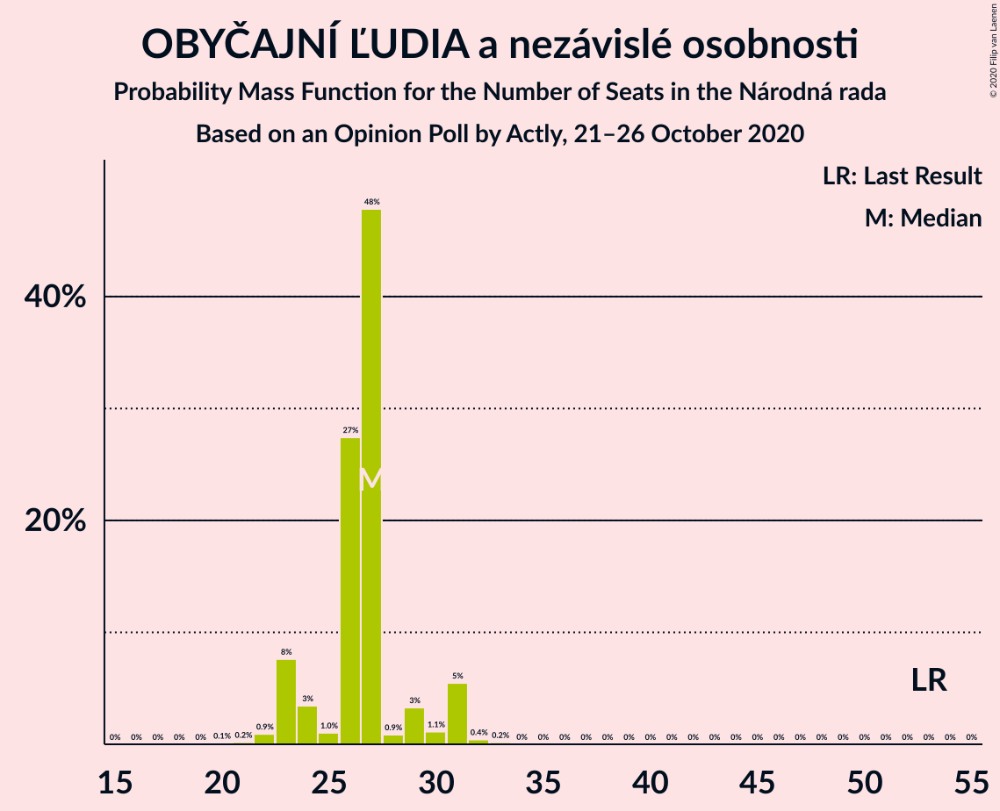
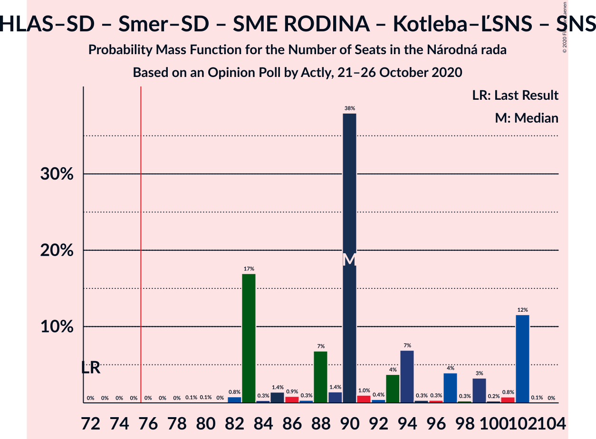
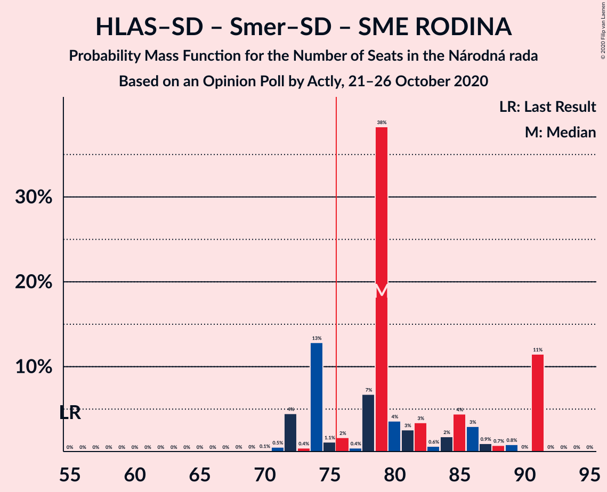

# Opinion Poll by Actly, 21–26 October 2020

<a href="#voting-intentions">Voting Intentions</a> | <a href="#seats">Seats</a> | <a href="#coalitions">Coalitions</a> | <a href="#technical-information">Technical Information</a>

## Voting Intentions

### Confidence Intervals

| Party | Last Result | Poll Result | 80% Confidence Interval | 90% Confidence Interval | 95% Confidence Interval | 99% Confidence Interval |
|:-----:|:-----------:|:-----------:|:-----------------------:|:-----------------------:|:-----------------------:|:-----------------------:|
| HLAS–sociálna demokracia | 0.0% | 26.5% | 24.8–28.3% |24.3–28.9% |23.9–29.3% |23.0–30.2% |
| OBYČAJNÍ ĽUDIA a nezávislé osobnosti | 25.0% | 14.7% | 13.3–16.2% |13.0–16.7% |12.6–17.0% |12.0–17.8% |
| Sloboda a Solidarita | 6.2% | 11.2% | 10.0–12.6% |9.7–13.0% |9.4–13.3% |8.8–14.0% |
| SMER–sociálna demokracia | 18.3% | 10.8% | 9.6–12.2% |9.3–12.5% |9.0–12.9% |8.5–13.6% |
| SME RODINA | 8.2% | 6.8% | 5.9–7.9% |5.6–8.3% |5.4–8.5% |5.0–9.1% |
| Kotleba–Ľudová strana Naše Slovensko | 8.0% | 6.2% | 5.3–7.3% |5.1–7.6% |4.9–7.9% |4.5–8.4% |
| Progresívne Slovensko | 7.0% | 5.5% | 4.7–6.5% |4.4–6.8% |4.3–7.1% |3.9–7.6% |
| Kresťanskodemokratické hnutie | 4.6% | 4.8% | 4.0–5.8% |3.8–6.1% |3.6–6.3% |3.3–6.8% |
| Slovenská národná strana | 3.2% | 2.9% | 2.3–3.7% |2.2–3.9% |2.0–4.1% |1.8–4.6% |
| Za ľudí | 5.8% | 2.9% | 2.3–3.7% |2.2–3.9% |2.0–4.1% |1.8–4.6% |
| Dobrá voľba | 3.1% | 2.0% | 1.5–2.7% |1.4–2.9% |1.3–3.1% |1.1–3.4% |
| Strana maďarskej koalície–Magyar Koalíció Pártja | 3.9% | 1.6% | 1.2–2.2% |1.1–2.4% |1.0–2.6% |0.8–2.9% |
| SPOLU–Občianska Demokracia | 7.0% | 1.1% | 0.8–1.7% |0.7–1.8% |0.6–2.0% |0.5–2.3% |
| MOST–HÍD | 2.0% | 0.6% | 0.4–1.1% |0.3–1.2% |0.3–1.3% |0.2–1.6% |
| VLASŤ | 2.9% | 0.6% | 0.4–1.1% |0.3–1.2% |0.3–1.3% |0.2–1.6% |

*Note:* The poll result column reflects the actual value used in the calculations. Published results may vary slightly, and in addition be rounded to fewer digits.

## Seats

### Confidence Intervals

| Party | Last Result | Median | 80% Confidence Interval | 90% Confidence Interval | 95% Confidence Interval | 99% Confidence Interval |
|:-----:|:-----------:|:------:|:-----------------------:|:-----------------------:|:-----------------------:|:-----------------------:|
| <a href="#hlas–sociálna-demokracia">HLAS–sociálna demokracia</a> | 0 | 45 | 42–53 |42–53 |42–53 |41–56 |
| <a href="#obyčajní-ľudia-a-nezávislé-osobnosti">OBYČAJNÍ ĽUDIA a nezávislé osobnosti</a> | 53 | 27 | 24–29 |23–31 |23–31 |22–32 |
| <a href="#sloboda-a-solidarita">Sloboda a Solidarita</a> | 13 | 21 | 19–22 |19–22 |19–24 |17–25 |
| <a href="#smer–sociálna-demokracia">SMER–sociálna demokracia</a> | 38 | 21 | 18–22 |17–22 |17–23 |16–26 |
| <a href="#sme-rodina">SME RODINA</a> | 17 | 13 | 11–16 |10–16 |10–16 |0–16 |
| <a href="#kotleba–ľudová-strana-naše-slovensko">Kotleba–Ľudová strana Naše Slovensko</a> | 17 | 11 | 9–12 |9–13 |9–14 |0–14 |
| <a href="#progresívne-slovensko">Progresívne Slovensko</a> | 0 | 0 | 0–11 |0–12 |0–13 |0–13 |
| <a href="#kresťanskodemokratické-hnutie">Kresťanskodemokratické hnutie</a> | 0 | 9 | 0–12 |0–12 |0–12 |0–13 |
| <a href="#slovenská-národná-strana">Slovenská národná strana</a> | 0 | 0 | 0 |0 |0 |0 |
| <a href="#za-ľudí">Za ľudí</a> | 12 | 0 | 0 |0 |0 |0 |
| <a href="#dobrá-voľba">Dobrá voľba</a> | 0 | 0 | 0 |0 |0 |0 |
| <a href="#strana-maďarskej-koalície–magyar-koalíció-pártja">Strana maďarskej koalície–Magyar Koalíció Pártja</a> | 0 | 0 | 0 |0 |0 |0 |
| <a href="#spolu–občianska-demokracia">SPOLU–Občianska Demokracia</a> | 0 | 0 | 0 |0 |0 |0 |
| <a href="#most–híd">MOST–HÍD</a> | 0 | 0 | 0 |0 |0 |0 |
| <a href="#vlasť">VLASŤ</a> | 0 | 0 | 0 |0 |0 |0 |

### HLAS–sociálna demokracia

*For a full overview of the results for this party, see the [HLAS–sociálna demokracia](party-hlas–sociálnademokracia.html) page.*

| Number of Seats | Probability | Accumulated | Special Marks |
|:---------------:|:-----------:|:-----------:|:-------------:|
| 0 | 0% | 100% | Last Result |
| 1 | 0% | 100% |  |
| 2 | 0% | 100% |  |
| 3 | 0% | 100% |  |
| 4 | 0% | 100% |  |
| 5 | 0% | 100% |  |
| 6 | 0% | 100% |  |
| 7 | 0% | 100% |  |
| 8 | 0% | 100% |  |
| 9 | 0% | 100% |  |
| 10 | 0% | 100% |  |
| 11 | 0% | 100% |  |
| 12 | 0% | 100% |  |
| 13 | 0% | 100% |  |
| 14 | 0% | 100% |  |
| 15 | 0% | 100% |  |
| 16 | 0% | 100% |  |
| 17 | 0% | 100% |  |
| 18 | 0% | 100% |  |
| 19 | 0% | 100% |  |
| 20 | 0% | 100% |  |
| 21 | 0% | 100% |  |
| 22 | 0% | 100% |  |
| 23 | 0% | 100% |  |
| 24 | 0% | 100% |  |
| 25 | 0% | 100% |  |
| 26 | 0% | 100% |  |
| 27 | 0% | 100% |  |
| 28 | 0% | 100% |  |
| 29 | 0% | 100% |  |
| 30 | 0% | 100% |  |
| 31 | 0% | 100% |  |
| 32 | 0% | 100% |  |
| 33 | 0% | 100% |  |
| 34 | 0% | 100% |  |
| 35 | 0% | 100% |  |
| 36 | 0% | 100% |  |
| 37 | 0% | 100% |  |
| 38 | 0% | 100% |  |
| 39 | 0% | 100% |  |
| 40 | 0.3% | 99.9% |  |
| 41 | 0.3% | 99.6% |  |
| 42 | 13% | 99.4% |  |
| 43 | 2% | 86% |  |
| 44 | 0.2% | 84% |  |
| 45 | 43% | 84% | Median |
| 46 | 7% | 42% |  |
| 47 | 5% | 35% |  |
| 48 | 2% | 30% |  |
| 49 | 2% | 27% |  |
| 50 | 5% | 26% |  |
| 51 | 0.5% | 21% |  |
| 52 | 4% | 21% |  |
| 53 | 15% | 16% |  |
| 54 | 0.5% | 1.4% |  |
| 55 | 0.1% | 1.0% |  |
| 56 | 0.6% | 0.8% |  |
| 57 | 0% | 0.2% |  |
| 58 | 0% | 0.2% |  |
| 59 | 0% | 0.1% |  |
| 60 | 0% | 0.1% |  |
| 61 | 0% | 0.1% |  |
| 62 | 0.1% | 0.1% |  |
| 63 | 0% | 0% |  |

### OBYČAJNÍ ĽUDIA a nezávislé osobnosti

*For a full overview of the results for this party, see the [OBYČAJNÍ ĽUDIA a nezávislé osobnosti](party-obyčajníľudiaanezávisléosobnosti.html) page.*

| Number of Seats | Probability | Accumulated | Special Marks |
|:---------------:|:-----------:|:-----------:|:-------------:|
| 20 | 0.1% | 100% |  |
| 21 | 0.2% | 99.9% |  |
| 22 | 0.9% | 99.7% |  |
| 23 | 8% | 98.8% |  |
| 24 | 3% | 91% |  |
| 25 | 1.0% | 88% |  |
| 26 | 27% | 87% |  |
| 27 | 48% | 59% | Median |
| 28 | 0.9% | 11% |  |
| 29 | 3% | 11% |  |
| 30 | 1.1% | 7% |  |
| 31 | 5% | 6% |  |
| 32 | 0.4% | 0.6% |  |
| 33 | 0.2% | 0.2% |  |
| 34 | 0% | 0% |  |
| 35 | 0% | 0% |  |
| 36 | 0% | 0% |  |
| 37 | 0% | 0% |  |
| 38 | 0% | 0% |  |
| 39 | 0% | 0% |  |
| 40 | 0% | 0% |  |
| 41 | 0% | 0% |  |
| 42 | 0% | 0% |  |
| 43 | 0% | 0% |  |
| 44 | 0% | 0% |  |
| 45 | 0% | 0% |  |
| 46 | 0% | 0% |  |
| 47 | 0% | 0% |  |
| 48 | 0% | 0% |  |
| 49 | 0% | 0% |  |
| 50 | 0% | 0% |  |
| 51 | 0% | 0% |  |
| 52 | 0% | 0% |  |
| 53 | 0% | 0% | Last Result |

### Sloboda a Solidarita

*For a full overview of the results for this party, see the [Sloboda a Solidarita](party-slobodaasolidarita.html) page.*

| Number of Seats | Probability | Accumulated | Special Marks |
|:---------------:|:-----------:|:-----------:|:-------------:|
| 13 | 0% | 100% | Last Result |
| 14 | 0% | 100% |  |
| 15 | 0.3% | 100% |  |
| 16 | 0.1% | 99.7% |  |
| 17 | 0.9% | 99.6% |  |
| 18 | 1.0% | 98.6% |  |
| 19 | 10% | 98% |  |
| 20 | 11% | 88% |  |
| 21 | 53% | 76% | Median |
| 22 | 19% | 24% |  |
| 23 | 1.5% | 5% |  |
| 24 | 1.1% | 3% |  |
| 25 | 2% | 2% |  |
| 26 | 0% | 0.2% |  |
| 27 | 0.1% | 0.2% |  |
| 28 | 0.1% | 0.1% |  |
| 29 | 0% | 0% |  |

### SMER–sociálna demokracia

*For a full overview of the results for this party, see the [SMER–sociálna demokracia](party-smer–sociálnademokracia.html) page.*

| Number of Seats | Probability | Accumulated | Special Marks |
|:---------------:|:-----------:|:-----------:|:-------------:|
| 15 | 0.1% | 100% |  |
| 16 | 1.2% | 99.9% |  |
| 17 | 6% | 98.6% |  |
| 18 | 7% | 93% |  |
| 19 | 5% | 86% |  |
| 20 | 10% | 82% |  |
| 21 | 53% | 72% | Median |
| 22 | 15% | 19% |  |
| 23 | 2% | 4% |  |
| 24 | 0.4% | 2% |  |
| 25 | 0.4% | 2% |  |
| 26 | 1.2% | 1.2% |  |
| 27 | 0% | 0.1% |  |
| 28 | 0% | 0% |  |
| 29 | 0% | 0% |  |
| 30 | 0% | 0% |  |
| 31 | 0% | 0% |  |
| 32 | 0% | 0% |  |
| 33 | 0% | 0% |  |
| 34 | 0% | 0% |  |
| 35 | 0% | 0% |  |
| 36 | 0% | 0% |  |
| 37 | 0% | 0% |  |
| 38 | 0% | 0% | Last Result |

### SME RODINA

*For a full overview of the results for this party, see the [SME RODINA](party-smerodina.html) page.*

| Number of Seats | Probability | Accumulated | Special Marks |
|:---------------:|:-----------:|:-----------:|:-------------:|
| 0 | 1.0% | 100% |  |
| 1 | 0% | 99.0% |  |
| 2 | 0% | 99.0% |  |
| 3 | 0% | 99.0% |  |
| 4 | 0% | 99.0% |  |
| 5 | 0% | 99.0% |  |
| 6 | 0% | 99.0% |  |
| 7 | 0% | 99.0% |  |
| 8 | 0% | 99.0% |  |
| 9 | 0.3% | 99.0% |  |
| 10 | 8% | 98.7% |  |
| 11 | 14% | 91% |  |
| 12 | 4% | 76% |  |
| 13 | 45% | 72% | Median |
| 14 | 12% | 27% |  |
| 15 | 3% | 15% |  |
| 16 | 12% | 12% |  |
| 17 | 0.1% | 0.2% | Last Result |
| 18 | 0.1% | 0.1% |  |
| 19 | 0% | 0% |  |

### Kotleba–Ľudová strana Naše Slovensko

*For a full overview of the results for this party, see the [Kotleba–Ľudová strana Naše Slovensko](party-kotleba–ľudovástrananašeslovensko.html) page.*

| Number of Seats | Probability | Accumulated | Special Marks |
|:---------------:|:-----------:|:-----------:|:-------------:|
| 0 | 1.2% | 100% |  |
| 1 | 0% | 98.8% |  |
| 2 | 0% | 98.8% |  |
| 3 | 0% | 98.8% |  |
| 4 | 0% | 98.8% |  |
| 5 | 0% | 98.8% |  |
| 6 | 0% | 98.8% |  |
| 7 | 0% | 98.8% |  |
| 8 | 0% | 98.8% |  |
| 9 | 13% | 98.8% |  |
| 10 | 10% | 85% |  |
| 11 | 59% | 76% | Median |
| 12 | 7% | 17% |  |
| 13 | 6% | 9% |  |
| 14 | 3% | 4% |  |
| 15 | 0.1% | 0.2% |  |
| 16 | 0.1% | 0.1% |  |
| 17 | 0% | 0% | Last Result |

### Progresívne Slovensko

*For a full overview of the results for this party, see the [Progresívne Slovensko](party-progresívneslovensko.html) page.*

| Number of Seats | Probability | Accumulated | Special Marks |
|:---------------:|:-----------:|:-----------:|:-------------:|
| 0 | 65% | 100% | Last Result, Median |
| 1 | 0% | 35% |  |
| 2 | 0% | 35% |  |
| 3 | 0% | 35% |  |
| 4 | 0% | 35% |  |
| 5 | 0% | 35% |  |
| 6 | 0% | 35% |  |
| 7 | 0% | 35% |  |
| 8 | 0% | 35% |  |
| 9 | 1.0% | 35% |  |
| 10 | 8% | 34% |  |
| 11 | 19% | 25% |  |
| 12 | 2% | 6% |  |
| 13 | 4% | 4% |  |
| 14 | 0.1% | 0.2% |  |
| 15 | 0.1% | 0.1% |  |
| 16 | 0.1% | 0.1% |  |
| 17 | 0% | 0% |  |

### Kresťanskodemokratické hnutie

*For a full overview of the results for this party, see the [Kresťanskodemokratické hnutie](party-kresťanskodemokratickéhnutie.html) page.*

| Number of Seats | Probability | Accumulated | Special Marks |
|:---------------:|:-----------:|:-----------:|:-------------:|
| 0 | 29% | 100% | Last Result |
| 1 | 0% | 71% |  |
| 2 | 0% | 71% |  |
| 3 | 0% | 71% |  |
| 4 | 0% | 71% |  |
| 5 | 0% | 71% |  |
| 6 | 0% | 71% |  |
| 7 | 0% | 71% |  |
| 8 | 0% | 71% |  |
| 9 | 24% | 71% | Median |
| 10 | 0.9% | 47% |  |
| 11 | 6% | 46% |  |
| 12 | 38% | 40% |  |
| 13 | 1.4% | 1.4% |  |
| 14 | 0% | 0.1% |  |
| 15 | 0% | 0% |  |

### Slovenská národná strana

*For a full overview of the results for this party, see the [Slovenská národná strana](party-slovenskánárodnástrana.html) page.*

| Number of Seats | Probability | Accumulated | Special Marks |
|:---------------:|:-----------:|:-----------:|:-------------:|
| 0 | 99.9% | 100% | Last Result, Median |
| 1 | 0% | 0.1% |  |
| 2 | 0% | 0.1% |  |
| 3 | 0% | 0.1% |  |
| 4 | 0% | 0.1% |  |
| 5 | 0% | 0.1% |  |
| 6 | 0% | 0.1% |  |
| 7 | 0% | 0.1% |  |
| 8 | 0% | 0.1% |  |
| 9 | 0.1% | 0.1% |  |
| 10 | 0% | 0% |  |

### Za ľudí

*For a full overview of the results for this party, see the [Za ľudí](party-zaľudí.html) page.*

| Number of Seats | Probability | Accumulated | Special Marks |
|:---------------:|:-----------:|:-----------:|:-------------:|
| 0 | 100% | 100% | Median |
| 1 | 0% | 0% |  |
| 2 | 0% | 0% |  |
| 3 | 0% | 0% |  |
| 4 | 0% | 0% |  |
| 5 | 0% | 0% |  |
| 6 | 0% | 0% |  |
| 7 | 0% | 0% |  |
| 8 | 0% | 0% |  |
| 9 | 0% | 0% |  |
| 10 | 0% | 0% |  |
| 11 | 0% | 0% |  |
| 12 | 0% | 0% | Last Result |

### Dobrá voľba

*For a full overview of the results for this party, see the [Dobrá voľba](party-dobrávoľba.html) page.*

| Number of Seats | Probability | Accumulated | Special Marks |
|:---------------:|:-----------:|:-----------:|:-------------:|
| 0 | 100% | 100% | Last Result, Median |

### Strana maďarskej koalície–Magyar Koalíció Pártja

*For a full overview of the results for this party, see the [Strana maďarskej koalície–Magyar Koalíció Pártja](party-stranamaďarskejkoalície–magyarkoalíciópártja.html) page.*

| Number of Seats | Probability | Accumulated | Special Marks |
|:---------------:|:-----------:|:-----------:|:-------------:|
| 0 | 100% | 100% | Last Result, Median |

### SPOLU–Občianska Demokracia

*For a full overview of the results for this party, see the [SPOLU–Občianska Demokracia](party-spolu–občianskademokracia.html) page.*

| Number of Seats | Probability | Accumulated | Special Marks |
|:---------------:|:-----------:|:-----------:|:-------------:|
| 0 | 100% | 100% | Last Result, Median |

### MOST–HÍD

*For a full overview of the results for this party, see the [MOST–HÍD](party-most–híd.html) page.*

| Number of Seats | Probability | Accumulated | Special Marks |
|:---------------:|:-----------:|:-----------:|:-------------:|
| 0 | 100% | 100% | Last Result, Median |

### VLASŤ

*For a full overview of the results for this party, see the [VLASŤ](party-vlasť.html) page.*

| Number of Seats | Probability | Accumulated | Special Marks |
|:---------------:|:-----------:|:-----------:|:-------------:|
| 0 | 100% | 100% | Last Result, Median |

## Coalitions

### Confidence Intervals

| Coalition | Last Result | Median | Majority? | 80% Confidence Interval | 90% Confidence Interval | 95% Confidence Interval | 99% Confidence Interval |
|:---------:|:-----------:|:------:|:---------:|:-----------------------:|:-----------------------:|:-----------------------:|:-----------------------:|
| HLAS–sociálna demokracia – SMER–sociálna demokracia – SME RODINA – Kotleba–Ľudová strana Naše Slovensko – Slovenská národná strana | 72 | 90 | 100% | 83–102 | 83–102 | 83–102 | 82–102 |
| HLAS–sociálna demokracia – SMER–sociálna demokracia – SME RODINA | 55 | 79 | 80% | 74–91 | 72–91 | 72–91 | 71–91 |
| HLAS–sociálna demokracia – SMER–sociálna demokracia – SME RODINA – Slovenská národná strana | 55 | 79 | 81% | 74–91 | 72–91 | 72–91 | 71–91 |
| HLAS–sociálna demokracia – SME RODINA – Kotleba–Ľudová strana Naše Slovensko – Slovenská národná strana | 34 | 69 | 20% | 62–80 | 62–80 | 62–80 | 62–80 |
| HLAS–sociálna demokracia – SMER–sociálna demokracia – Slovenská národná strana – MOST–HÍD | 38 | 66 | 1.3% | 63–75 | 62–75 | 62–75 | 61–76 |
| HLAS–sociálna demokracia – SMER–sociálna demokracia – Slovenská národná strana | 38 | 66 | 1.3% | 63–75 | 62–75 | 62–75 | 61–76 |
| HLAS–sociálna demokracia – SME RODINA | 17 | 58 | 0% | 53–69 | 53–69 | 53–69 | 53–69 |
| HLAS–sociálna demokracia – SME RODINA – Slovenská národná strana | 17 | 58 | 0% | 53–69 | 53–69 | 53–69 | 53–69 |
| HLAS–sociálna demokracia – Slovenská národná strana – MOST–HÍD | 0 | 45 | 0% | 42–53 | 42–53 | 42–53 | 41–56 |
| HLAS–sociálna demokracia – Slovenská národná strana | 0 | 45 | 0% | 42–53 | 42–53 | 42–53 | 41–56 |
| SMER–sociálna demokracia – SME RODINA – Kotleba–Ľudová strana Naše Slovensko – Slovenská národná strana | 72 | 45 | 0% | 41–49 | 38–49 | 37–49 | 32–51 |
| SMER–sociálna demokracia – SME RODINA | 55 | 34 | 0% | 30–38 | 27–38 | 27–38 | 23–39 |
| SMER–sociálna demokracia – SME RODINA – Slovenská národná strana | 55 | 34 | 0% | 30–38 | 27–38 | 27–38 | 23–39 |
| SMER–sociálna demokracia – Slovenská národná strana – MOST–HÍD | 38 | 21 | 0% | 18–22 | 17–22 | 17–23 | 16–26 |
| SMER–sociálna demokracia | 38 | 21 | 0% | 18–22 | 17–22 | 17–23 | 16–26 |
| SMER–sociálna demokracia – Slovenská národná strana | 38 | 21 | 0% | 18–22 | 17–22 | 17–23 | 16–26 |

### HLAS–sociálna demokracia – SMER–sociálna demokracia – SME RODINA – Kotleba–Ľudová strana Naše Slovensko – Slovenská národná strana

| Number of Seats | Probability | Accumulated | Special Marks |
|:---------------:|:-----------:|:-----------:|:-------------:|
| 72 | 0% | 100% | Last Result |
| 73 | 0% | 100% |  |
| 74 | 0% | 100% |  |
| 75 | 0% | 100% |  |
| 76 | 0% | 100% | Majority |
| 77 | 0% | 100% |  |
| 78 | 0% | 100% |  |
| 79 | 0.1% | 100% |  |
| 80 | 0.1% | 99.9% |  |
| 81 | 0% | 99.8% |  |
| 82 | 0.8% | 99.7% |  |
| 83 | 17% | 98.9% |  |
| 84 | 0.3% | 82% |  |
| 85 | 1.4% | 82% |  |
| 86 | 0.9% | 80% |  |
| 87 | 0.3% | 79% |  |
| 88 | 7% | 79% |  |
| 89 | 1.4% | 72% |  |
| 90 | 38% | 71% | Median |
| 91 | 1.0% | 33% |  |
| 92 | 0.4% | 32% |  |
| 93 | 4% | 31% |  |
| 94 | 7% | 28% |  |
| 95 | 0.3% | 21% |  |
| 96 | 0.3% | 20% |  |
| 97 | 4% | 20% |  |
| 98 | 0.3% | 16% |  |
| 99 | 3% | 16% |  |
| 100 | 0.2% | 13% |  |
| 101 | 0.8% | 12% |  |
| 102 | 12% | 12% |  |
| 103 | 0.1% | 0.1% |  |
| 104 | 0% | 0% |  |

### HLAS–sociálna demokracia – SMER–sociálna demokracia – SME RODINA

| Number of Seats | Probability | Accumulated | Special Marks |
|:---------------:|:-----------:|:-----------:|:-------------:|
| 55 | 0% | 100% | Last Result |
| 56 | 0% | 100% |  |
| 57 | 0% | 100% |  |
| 58 | 0% | 100% |  |
| 59 | 0% | 100% |  |
| 60 | 0% | 100% |  |
| 61 | 0% | 100% |  |
| 62 | 0% | 100% |  |
| 63 | 0% | 100% |  |
| 64 | 0% | 100% |  |
| 65 | 0% | 100% |  |
| 66 | 0% | 100% |  |
| 67 | 0% | 100% |  |
| 68 | 0% | 100% |  |
| 69 | 0% | 100% |  |
| 70 | 0.1% | 99.9% |  |
| 71 | 0.5% | 99.8% |  |
| 72 | 4% | 99.3% |  |
| 73 | 0.4% | 95% |  |
| 74 | 13% | 94% |  |
| 75 | 1.1% | 82% |  |
| 76 | 2% | 80% | Majority |
| 77 | 0.4% | 79% |  |
| 78 | 7% | 78% |  |
| 79 | 38% | 72% | Median |
| 80 | 4% | 33% |  |
| 81 | 3% | 30% |  |
| 82 | 3% | 27% |  |
| 83 | 0.6% | 24% |  |
| 84 | 2% | 23% |  |
| 85 | 4% | 21% |  |
| 86 | 3% | 17% |  |
| 87 | 0.9% | 14% |  |
| 88 | 0.7% | 13% |  |
| 89 | 0.8% | 12% |  |
| 90 | 0% | 12% |  |
| 91 | 11% | 12% |  |
| 92 | 0% | 0% |  |

### HLAS–sociálna demokracia – SMER–sociálna demokracia – SME RODINA – Slovenská národná strana

| Number of Seats | Probability | Accumulated | Special Marks |
|:---------------:|:-----------:|:-----------:|:-------------:|
| 55 | 0% | 100% | Last Result |
| 56 | 0% | 100% |  |
| 57 | 0% | 100% |  |
| 58 | 0% | 100% |  |
| 59 | 0% | 100% |  |
| 60 | 0% | 100% |  |
| 61 | 0% | 100% |  |
| 62 | 0% | 100% |  |
| 63 | 0% | 100% |  |
| 64 | 0% | 100% |  |
| 65 | 0% | 100% |  |
| 66 | 0% | 100% |  |
| 67 | 0% | 100% |  |
| 68 | 0% | 100% |  |
| 69 | 0% | 100% |  |
| 70 | 0% | 99.9% |  |
| 71 | 0.5% | 99.9% |  |
| 72 | 4% | 99.4% |  |
| 73 | 0.4% | 95% |  |
| 74 | 13% | 94% |  |
| 75 | 1.1% | 82% |  |
| 76 | 2% | 81% | Majority |
| 77 | 0.4% | 79% |  |
| 78 | 7% | 78% |  |
| 79 | 38% | 72% | Median |
| 80 | 4% | 33% |  |
| 81 | 3% | 30% |  |
| 82 | 3% | 27% |  |
| 83 | 0.6% | 24% |  |
| 84 | 2% | 23% |  |
| 85 | 4% | 21% |  |
| 86 | 3% | 17% |  |
| 87 | 1.0% | 14% |  |
| 88 | 0.7% | 13% |  |
| 89 | 0.8% | 12% |  |
| 90 | 0% | 12% |  |
| 91 | 11% | 12% |  |
| 92 | 0% | 0% |  |

### HLAS–sociálna demokracia – SME RODINA – Kotleba–Ľudová strana Naše Slovensko – Slovenská národná strana

| Number of Seats | Probability | Accumulated | Special Marks |
|:---------------:|:-----------:|:-----------:|:-------------:|
| 34 | 0% | 100% | Last Result |
| 35 | 0% | 100% |  |
| 36 | 0% | 100% |  |
| 37 | 0% | 100% |  |
| 38 | 0% | 100% |  |
| 39 | 0% | 100% |  |
| 40 | 0% | 100% |  |
| 41 | 0% | 100% |  |
| 42 | 0% | 100% |  |
| 43 | 0% | 100% |  |
| 44 | 0% | 100% |  |
| 45 | 0% | 100% |  |
| 46 | 0% | 100% |  |
| 47 | 0% | 100% |  |
| 48 | 0% | 100% |  |
| 49 | 0% | 100% |  |
| 50 | 0% | 100% |  |
| 51 | 0% | 100% |  |
| 52 | 0% | 100% |  |
| 53 | 0% | 100% |  |
| 54 | 0% | 100% |  |
| 55 | 0% | 100% |  |
| 56 | 0.1% | 100% |  |
| 57 | 0% | 99.9% |  |
| 58 | 0% | 99.9% |  |
| 59 | 0% | 99.9% |  |
| 60 | 0% | 99.9% |  |
| 61 | 0% | 99.8% |  |
| 62 | 13% | 99.8% |  |
| 63 | 0% | 87% |  |
| 64 | 0.5% | 87% |  |
| 65 | 2% | 86% |  |
| 66 | 6% | 84% |  |
| 67 | 0.4% | 79% |  |
| 68 | 1.1% | 78% |  |
| 69 | 38% | 77% | Median |
| 70 | 6% | 39% |  |
| 71 | 4% | 33% |  |
| 72 | 0.4% | 29% |  |
| 73 | 3% | 29% |  |
| 74 | 5% | 26% |  |
| 75 | 1.0% | 21% |  |
| 76 | 0.3% | 20% | Majority |
| 77 | 0.2% | 19% |  |
| 78 | 5% | 19% |  |
| 79 | 3% | 14% |  |
| 80 | 12% | 12% |  |
| 81 | 0.1% | 0.3% |  |
| 82 | 0.2% | 0.2% |  |
| 83 | 0.1% | 0.1% |  |
| 84 | 0% | 0% |  |

### HLAS–sociálna demokracia – SMER–sociálna demokracia – Slovenská národná strana – MOST–HÍD

| Number of Seats | Probability | Accumulated | Special Marks |
|:---------------:|:-----------:|:-----------:|:-------------:|
| 38 | 0% | 100% | Last Result |
| 39 | 0% | 100% |  |
| 40 | 0% | 100% |  |
| 41 | 0% | 100% |  |
| 42 | 0% | 100% |  |
| 43 | 0% | 100% |  |
| 44 | 0% | 100% |  |
| 45 | 0% | 100% |  |
| 46 | 0% | 100% |  |
| 47 | 0% | 100% |  |
| 48 | 0% | 100% |  |
| 49 | 0% | 100% |  |
| 50 | 0% | 100% |  |
| 51 | 0% | 100% |  |
| 52 | 0% | 100% |  |
| 53 | 0% | 100% |  |
| 54 | 0% | 100% |  |
| 55 | 0% | 100% |  |
| 56 | 0% | 100% |  |
| 57 | 0% | 100% |  |
| 58 | 0% | 100% |  |
| 59 | 0.2% | 99.9% |  |
| 60 | 0% | 99.8% |  |
| 61 | 1.1% | 99.7% |  |
| 62 | 4% | 98.6% |  |
| 63 | 14% | 94% |  |
| 64 | 6% | 80% |  |
| 65 | 2% | 74% |  |
| 66 | 38% | 72% | Median |
| 67 | 2% | 34% |  |
| 68 | 0.7% | 32% |  |
| 69 | 5% | 31% |  |
| 70 | 4% | 27% |  |
| 71 | 4% | 23% |  |
| 72 | 0.6% | 19% |  |
| 73 | 4% | 18% |  |
| 74 | 0.7% | 14% |  |
| 75 | 12% | 13% |  |
| 76 | 1.0% | 1.3% | Majority |
| 77 | 0.1% | 0.3% |  |
| 78 | 0% | 0.2% |  |
| 79 | 0% | 0.2% |  |
| 80 | 0.1% | 0.2% |  |
| 81 | 0% | 0.1% |  |
| 82 | 0% | 0.1% |  |
| 83 | 0% | 0.1% |  |
| 84 | 0.1% | 0.1% |  |
| 85 | 0% | 0% |  |

### HLAS–sociálna demokracia – SMER–sociálna demokracia – Slovenská národná strana

| Number of Seats | Probability | Accumulated | Special Marks |
|:---------------:|:-----------:|:-----------:|:-------------:|
| 38 | 0% | 100% | Last Result |
| 39 | 0% | 100% |  |
| 40 | 0% | 100% |  |
| 41 | 0% | 100% |  |
| 42 | 0% | 100% |  |
| 43 | 0% | 100% |  |
| 44 | 0% | 100% |  |
| 45 | 0% | 100% |  |
| 46 | 0% | 100% |  |
| 47 | 0% | 100% |  |
| 48 | 0% | 100% |  |
| 49 | 0% | 100% |  |
| 50 | 0% | 100% |  |
| 51 | 0% | 100% |  |
| 52 | 0% | 100% |  |
| 53 | 0% | 100% |  |
| 54 | 0% | 100% |  |
| 55 | 0% | 100% |  |
| 56 | 0% | 100% |  |
| 57 | 0% | 100% |  |
| 58 | 0% | 100% |  |
| 59 | 0.2% | 99.9% |  |
| 60 | 0% | 99.8% |  |
| 61 | 1.1% | 99.7% |  |
| 62 | 4% | 98.6% |  |
| 63 | 14% | 94% |  |
| 64 | 6% | 80% |  |
| 65 | 2% | 74% |  |
| 66 | 38% | 72% | Median |
| 67 | 2% | 34% |  |
| 68 | 0.7% | 32% |  |
| 69 | 5% | 31% |  |
| 70 | 4% | 27% |  |
| 71 | 4% | 23% |  |
| 72 | 0.6% | 19% |  |
| 73 | 4% | 18% |  |
| 74 | 0.7% | 14% |  |
| 75 | 12% | 13% |  |
| 76 | 1.0% | 1.3% | Majority |
| 77 | 0.1% | 0.3% |  |
| 78 | 0% | 0.2% |  |
| 79 | 0% | 0.2% |  |
| 80 | 0.1% | 0.2% |  |
| 81 | 0% | 0.1% |  |
| 82 | 0% | 0.1% |  |
| 83 | 0% | 0.1% |  |
| 84 | 0.1% | 0.1% |  |
| 85 | 0% | 0% |  |

### HLAS–sociálna demokracia – SME RODINA

| Number of Seats | Probability | Accumulated | Special Marks |
|:---------------:|:-----------:|:-----------:|:-------------:|
| 17 | 0% | 100% | Last Result |
| 18 | 0% | 100% |  |
| 19 | 0% | 100% |  |
| 20 | 0% | 100% |  |
| 21 | 0% | 100% |  |
| 22 | 0% | 100% |  |
| 23 | 0% | 100% |  |
| 24 | 0% | 100% |  |
| 25 | 0% | 100% |  |
| 26 | 0% | 100% |  |
| 27 | 0% | 100% |  |
| 28 | 0% | 100% |  |
| 29 | 0% | 100% |  |
| 30 | 0% | 100% |  |
| 31 | 0% | 100% |  |
| 32 | 0% | 100% |  |
| 33 | 0% | 100% |  |
| 34 | 0% | 100% |  |
| 35 | 0% | 100% |  |
| 36 | 0% | 100% |  |
| 37 | 0% | 100% |  |
| 38 | 0% | 100% |  |
| 39 | 0% | 100% |  |
| 40 | 0% | 100% |  |
| 41 | 0% | 100% |  |
| 42 | 0% | 100% |  |
| 43 | 0% | 100% |  |
| 44 | 0% | 100% |  |
| 45 | 0% | 100% |  |
| 46 | 0% | 100% |  |
| 47 | 0% | 100% |  |
| 48 | 0% | 100% |  |
| 49 | 0% | 100% |  |
| 50 | 0% | 99.9% |  |
| 51 | 0.1% | 99.9% |  |
| 52 | 0% | 99.8% |  |
| 53 | 14% | 99.8% |  |
| 54 | 0.2% | 86% |  |
| 55 | 7% | 86% |  |
| 56 | 0.4% | 79% |  |
| 57 | 0.7% | 79% |  |
| 58 | 38% | 78% | Median |
| 59 | 0.4% | 40% |  |
| 60 | 12% | 39% |  |
| 61 | 3% | 27% |  |
| 62 | 1.0% | 24% |  |
| 63 | 2% | 23% |  |
| 64 | 0.7% | 21% |  |
| 65 | 0.4% | 20% |  |
| 66 | 8% | 20% |  |
| 67 | 0.2% | 12% |  |
| 68 | 0.2% | 12% |  |
| 69 | 12% | 12% |  |
| 70 | 0% | 0.5% |  |
| 71 | 0.4% | 0.4% |  |
| 72 | 0% | 0% |  |

### HLAS–sociálna demokracia – SME RODINA – Slovenská národná strana

| Number of Seats | Probability | Accumulated | Special Marks |
|:---------------:|:-----------:|:-----------:|:-------------:|
| 17 | 0% | 100% | Last Result |
| 18 | 0% | 100% |  |
| 19 | 0% | 100% |  |
| 20 | 0% | 100% |  |
| 21 | 0% | 100% |  |
| 22 | 0% | 100% |  |
| 23 | 0% | 100% |  |
| 24 | 0% | 100% |  |
| 25 | 0% | 100% |  |
| 26 | 0% | 100% |  |
| 27 | 0% | 100% |  |
| 28 | 0% | 100% |  |
| 29 | 0% | 100% |  |
| 30 | 0% | 100% |  |
| 31 | 0% | 100% |  |
| 32 | 0% | 100% |  |
| 33 | 0% | 100% |  |
| 34 | 0% | 100% |  |
| 35 | 0% | 100% |  |
| 36 | 0% | 100% |  |
| 37 | 0% | 100% |  |
| 38 | 0% | 100% |  |
| 39 | 0% | 100% |  |
| 40 | 0% | 100% |  |
| 41 | 0% | 100% |  |
| 42 | 0% | 100% |  |
| 43 | 0% | 100% |  |
| 44 | 0% | 100% |  |
| 45 | 0% | 100% |  |
| 46 | 0% | 100% |  |
| 47 | 0% | 100% |  |
| 48 | 0% | 100% |  |
| 49 | 0% | 100% |  |
| 50 | 0% | 99.9% |  |
| 51 | 0.1% | 99.9% |  |
| 52 | 0% | 99.8% |  |
| 53 | 14% | 99.8% |  |
| 54 | 0.1% | 86% |  |
| 55 | 7% | 86% |  |
| 56 | 0.4% | 79% |  |
| 57 | 0.7% | 79% |  |
| 58 | 38% | 78% | Median |
| 59 | 0.4% | 40% |  |
| 60 | 12% | 39% |  |
| 61 | 3% | 27% |  |
| 62 | 1.0% | 24% |  |
| 63 | 2% | 23% |  |
| 64 | 0.7% | 21% |  |
| 65 | 0.4% | 20% |  |
| 66 | 8% | 20% |  |
| 67 | 0.2% | 12% |  |
| 68 | 0.2% | 12% |  |
| 69 | 12% | 12% |  |
| 70 | 0% | 0.5% |  |
| 71 | 0.4% | 0.4% |  |
| 72 | 0% | 0% |  |

### HLAS–sociálna demokracia – Slovenská národná strana – MOST–HÍD

| Number of Seats | Probability | Accumulated | Special Marks |
|:---------------:|:-----------:|:-----------:|:-------------:|
| 0 | 0% | 100% | Last Result |
| 1 | 0% | 100% |  |
| 2 | 0% | 100% |  |
| 3 | 0% | 100% |  |
| 4 | 0% | 100% |  |
| 5 | 0% | 100% |  |
| 6 | 0% | 100% |  |
| 7 | 0% | 100% |  |
| 8 | 0% | 100% |  |
| 9 | 0% | 100% |  |
| 10 | 0% | 100% |  |
| 11 | 0% | 100% |  |
| 12 | 0% | 100% |  |
| 13 | 0% | 100% |  |
| 14 | 0% | 100% |  |
| 15 | 0% | 100% |  |
| 16 | 0% | 100% |  |
| 17 | 0% | 100% |  |
| 18 | 0% | 100% |  |
| 19 | 0% | 100% |  |
| 20 | 0% | 100% |  |
| 21 | 0% | 100% |  |
| 22 | 0% | 100% |  |
| 23 | 0% | 100% |  |
| 24 | 0% | 100% |  |
| 25 | 0% | 100% |  |
| 26 | 0% | 100% |  |
| 27 | 0% | 100% |  |
| 28 | 0% | 100% |  |
| 29 | 0% | 100% |  |
| 30 | 0% | 100% |  |
| 31 | 0% | 100% |  |
| 32 | 0% | 100% |  |
| 33 | 0% | 100% |  |
| 34 | 0% | 100% |  |
| 35 | 0% | 100% |  |
| 36 | 0% | 100% |  |
| 37 | 0% | 100% |  |
| 38 | 0% | 100% |  |
| 39 | 0% | 100% |  |
| 40 | 0.3% | 99.9% |  |
| 41 | 0.3% | 99.6% |  |
| 42 | 13% | 99.4% |  |
| 43 | 2% | 86% |  |
| 44 | 0.2% | 84% |  |
| 45 | 43% | 84% | Median |
| 46 | 7% | 42% |  |
| 47 | 5% | 35% |  |
| 48 | 2% | 30% |  |
| 49 | 2% | 28% |  |
| 50 | 5% | 26% |  |
| 51 | 0.5% | 21% |  |
| 52 | 4% | 21% |  |
| 53 | 15% | 16% |  |
| 54 | 0.5% | 1.5% |  |
| 55 | 0.1% | 1.0% |  |
| 56 | 0.6% | 0.8% |  |
| 57 | 0% | 0.2% |  |
| 58 | 0% | 0.2% |  |
| 59 | 0% | 0.1% |  |
| 60 | 0% | 0.1% |  |
| 61 | 0% | 0.1% |  |
| 62 | 0.1% | 0.1% |  |
| 63 | 0% | 0% |  |

### HLAS–sociálna demokracia – Slovenská národná strana

| Number of Seats | Probability | Accumulated | Special Marks |
|:---------------:|:-----------:|:-----------:|:-------------:|
| 0 | 0% | 100% | Last Result |
| 1 | 0% | 100% |  |
| 2 | 0% | 100% |  |
| 3 | 0% | 100% |  |
| 4 | 0% | 100% |  |
| 5 | 0% | 100% |  |
| 6 | 0% | 100% |  |
| 7 | 0% | 100% |  |
| 8 | 0% | 100% |  |
| 9 | 0% | 100% |  |
| 10 | 0% | 100% |  |
| 11 | 0% | 100% |  |
| 12 | 0% | 100% |  |
| 13 | 0% | 100% |  |
| 14 | 0% | 100% |  |
| 15 | 0% | 100% |  |
| 16 | 0% | 100% |  |
| 17 | 0% | 100% |  |
| 18 | 0% | 100% |  |
| 19 | 0% | 100% |  |
| 20 | 0% | 100% |  |
| 21 | 0% | 100% |  |
| 22 | 0% | 100% |  |
| 23 | 0% | 100% |  |
| 24 | 0% | 100% |  |
| 25 | 0% | 100% |  |
| 26 | 0% | 100% |  |
| 27 | 0% | 100% |  |
| 28 | 0% | 100% |  |
| 29 | 0% | 100% |  |
| 30 | 0% | 100% |  |
| 31 | 0% | 100% |  |
| 32 | 0% | 100% |  |
| 33 | 0% | 100% |  |
| 34 | 0% | 100% |  |
| 35 | 0% | 100% |  |
| 36 | 0% | 100% |  |
| 37 | 0% | 100% |  |
| 38 | 0% | 100% |  |
| 39 | 0% | 100% |  |
| 40 | 0.3% | 99.9% |  |
| 41 | 0.3% | 99.6% |  |
| 42 | 13% | 99.4% |  |
| 43 | 2% | 86% |  |
| 44 | 0.2% | 84% |  |
| 45 | 43% | 84% | Median |
| 46 | 7% | 42% |  |
| 47 | 5% | 35% |  |
| 48 | 2% | 30% |  |
| 49 | 2% | 28% |  |
| 50 | 5% | 26% |  |
| 51 | 0.5% | 21% |  |
| 52 | 4% | 21% |  |
| 53 | 15% | 16% |  |
| 54 | 0.5% | 1.5% |  |
| 55 | 0.1% | 1.0% |  |
| 56 | 0.6% | 0.8% |  |
| 57 | 0% | 0.2% |  |
| 58 | 0% | 0.2% |  |
| 59 | 0% | 0.1% |  |
| 60 | 0% | 0.1% |  |
| 61 | 0% | 0.1% |  |
| 62 | 0.1% | 0.1% |  |
| 63 | 0% | 0% |  |

### SMER–sociálna demokracia – SME RODINA – Kotleba–Ľudová strana Naše Slovensko – Slovenská národná strana

| Number of Seats | Probability | Accumulated | Special Marks |
|:---------------:|:-----------:|:-----------:|:-------------:|
| 24 | 0% | 100% |  |
| 25 | 0% | 99.9% |  |
| 26 | 0% | 99.9% |  |
| 27 | 0% | 99.9% |  |
| 28 | 0% | 99.9% |  |
| 29 | 0% | 99.9% |  |
| 30 | 0% | 99.9% |  |
| 31 | 0% | 99.9% |  |
| 32 | 0.7% | 99.8% |  |
| 33 | 0.1% | 99.2% |  |
| 34 | 0.1% | 99.1% |  |
| 35 | 0.1% | 99.0% |  |
| 36 | 0.9% | 98.8% |  |
| 37 | 0.6% | 98% |  |
| 38 | 4% | 97% |  |
| 39 | 0.4% | 93% |  |
| 40 | 0.8% | 93% |  |
| 41 | 14% | 92% |  |
| 42 | 7% | 78% |  |
| 43 | 2% | 71% |  |
| 44 | 4% | 69% |  |
| 45 | 42% | 66% | Median |
| 46 | 7% | 24% |  |
| 47 | 2% | 16% |  |
| 48 | 0.7% | 14% |  |
| 49 | 12% | 13% |  |
| 50 | 1.0% | 2% |  |
| 51 | 0.8% | 0.9% |  |
| 52 | 0% | 0.1% |  |
| 53 | 0% | 0.1% |  |
| 54 | 0% | 0% |  |
| 55 | 0% | 0% |  |
| 56 | 0% | 0% |  |
| 57 | 0% | 0% |  |
| 58 | 0% | 0% |  |
| 59 | 0% | 0% |  |
| 60 | 0% | 0% |  |
| 61 | 0% | 0% |  |
| 62 | 0% | 0% |  |
| 63 | 0% | 0% |  |
| 64 | 0% | 0% |  |
| 65 | 0% | 0% |  |
| 66 | 0% | 0% |  |
| 67 | 0% | 0% |  |
| 68 | 0% | 0% |  |
| 69 | 0% | 0% |  |
| 70 | 0% | 0% |  |
| 71 | 0% | 0% |  |
| 72 | 0% | 0% | Last Result |

### SMER–sociálna demokracia – SME RODINA

| Number of Seats | Probability | Accumulated | Special Marks |
|:---------------:|:-----------:|:-----------:|:-------------:|
| 21 | 0% | 100% |  |
| 22 | 0.1% | 99.9% |  |
| 23 | 0.7% | 99.8% |  |
| 24 | 0.1% | 99.1% |  |
| 25 | 0.1% | 99.0% |  |
| 26 | 0.5% | 99.0% |  |
| 27 | 4% | 98% |  |
| 28 | 0.4% | 94% |  |
| 29 | 1.2% | 94% |  |
| 30 | 4% | 93% |  |
| 31 | 1.0% | 89% |  |
| 32 | 21% | 88% |  |
| 33 | 8% | 67% |  |
| 34 | 40% | 59% | Median |
| 35 | 3% | 19% |  |
| 36 | 2% | 16% |  |
| 37 | 0.7% | 14% |  |
| 38 | 13% | 13% |  |
| 39 | 0.8% | 0.9% |  |
| 40 | 0.1% | 0.1% |  |
| 41 | 0% | 0% |  |
| 42 | 0% | 0% |  |
| 43 | 0% | 0% |  |
| 44 | 0% | 0% |  |
| 45 | 0% | 0% |  |
| 46 | 0% | 0% |  |
| 47 | 0% | 0% |  |
| 48 | 0% | 0% |  |
| 49 | 0% | 0% |  |
| 50 | 0% | 0% |  |
| 51 | 0% | 0% |  |
| 52 | 0% | 0% |  |
| 53 | 0% | 0% |  |
| 54 | 0% | 0% |  |
| 55 | 0% | 0% | Last Result |

### SMER–sociálna demokracia – SME RODINA – Slovenská národná strana

| Number of Seats | Probability | Accumulated | Special Marks |
|:---------------:|:-----------:|:-----------:|:-------------:|
| 21 | 0% | 100% |  |
| 22 | 0.1% | 99.9% |  |
| 23 | 0.7% | 99.8% |  |
| 24 | 0.1% | 99.1% |  |
| 25 | 0% | 99.0% |  |
| 26 | 0.5% | 99.0% |  |
| 27 | 4% | 98.6% |  |
| 28 | 0.4% | 94% |  |
| 29 | 1.2% | 94% |  |
| 30 | 4% | 93% |  |
| 31 | 1.0% | 89% |  |
| 32 | 21% | 88% |  |
| 33 | 8% | 67% |  |
| 34 | 40% | 59% | Median |
| 35 | 3% | 19% |  |
| 36 | 2% | 16% |  |
| 37 | 0.7% | 14% |  |
| 38 | 13% | 14% |  |
| 39 | 0.8% | 0.9% |  |
| 40 | 0.1% | 0.1% |  |
| 41 | 0% | 0% |  |
| 42 | 0% | 0% |  |
| 43 | 0% | 0% |  |
| 44 | 0% | 0% |  |
| 45 | 0% | 0% |  |
| 46 | 0% | 0% |  |
| 47 | 0% | 0% |  |
| 48 | 0% | 0% |  |
| 49 | 0% | 0% |  |
| 50 | 0% | 0% |  |
| 51 | 0% | 0% |  |
| 52 | 0% | 0% |  |
| 53 | 0% | 0% |  |
| 54 | 0% | 0% |  |
| 55 | 0% | 0% | Last Result |

### SMER–sociálna demokracia – Slovenská národná strana – MOST–HÍD

| Number of Seats | Probability | Accumulated | Special Marks |
|:---------------:|:-----------:|:-----------:|:-------------:|
| 15 | 0.1% | 100% |  |
| 16 | 1.2% | 99.9% |  |
| 17 | 6% | 98.7% |  |
| 18 | 7% | 93% |  |
| 19 | 5% | 86% |  |
| 20 | 10% | 82% |  |
| 21 | 53% | 72% | Median |
| 22 | 15% | 19% |  |
| 23 | 2% | 4% |  |
| 24 | 0.4% | 2% |  |
| 25 | 0.4% | 2% |  |
| 26 | 1.2% | 1.3% |  |
| 27 | 0% | 0.1% |  |
| 28 | 0% | 0.1% |  |
| 29 | 0% | 0% |  |
| 30 | 0% | 0% |  |
| 31 | 0% | 0% |  |
| 32 | 0% | 0% |  |
| 33 | 0% | 0% |  |
| 34 | 0% | 0% |  |
| 35 | 0% | 0% |  |
| 36 | 0% | 0% |  |
| 37 | 0% | 0% |  |
| 38 | 0% | 0% | Last Result |

### SMER–sociálna demokracia

| Number of Seats | Probability | Accumulated | Special Marks |
|:---------------:|:-----------:|:-----------:|:-------------:|
| 15 | 0.1% | 100% |  |
| 16 | 1.2% | 99.9% |  |
| 17 | 6% | 98.6% |  |
| 18 | 7% | 93% |  |
| 19 | 5% | 86% |  |
| 20 | 10% | 82% |  |
| 21 | 53% | 72% | Median |
| 22 | 15% | 19% |  |
| 23 | 2% | 4% |  |
| 24 | 0.4% | 2% |  |
| 25 | 0.4% | 2% |  |
| 26 | 1.2% | 1.2% |  |
| 27 | 0% | 0.1% |  |
| 28 | 0% | 0% |  |
| 29 | 0% | 0% |  |
| 30 | 0% | 0% |  |
| 31 | 0% | 0% |  |
| 32 | 0% | 0% |  |
| 33 | 0% | 0% |  |
| 34 | 0% | 0% |  |
| 35 | 0% | 0% |  |
| 36 | 0% | 0% |  |
| 37 | 0% | 0% |  |
| 38 | 0% | 0% | Last Result |

### SMER–sociálna demokracia – Slovenská národná strana

| Number of Seats | Probability | Accumulated | Special Marks |
|:---------------:|:-----------:|:-----------:|:-------------:|
| 15 | 0.1% | 100% |  |
| 16 | 1.2% | 99.9% |  |
| 17 | 6% | 98.7% |  |
| 18 | 7% | 93% |  |
| 19 | 5% | 86% |  |
| 20 | 10% | 82% |  |
| 21 | 53% | 72% | Median |
| 22 | 15% | 19% |  |
| 23 | 2% | 4% |  |
| 24 | 0.4% | 2% |  |
| 25 | 0.4% | 2% |  |
| 26 | 1.2% | 1.3% |  |
| 27 | 0% | 0.1% |  |
| 28 | 0% | 0.1% |  |
| 29 | 0% | 0% |  |
| 30 | 0% | 0% |  |
| 31 | 0% | 0% |  |
| 32 | 0% | 0% |  |
| 33 | 0% | 0% |  |
| 34 | 0% | 0% |  |
| 35 | 0% | 0% |  |
| 36 | 0% | 0% |  |
| 37 | 0% | 0% |  |
| 38 | 0% | 0% | Last Result |

## Technical Information

### Opinion Poll

+ **Polling firm:** Actly
+ **Commissioner(s):** —
+ **Fieldwork period:** 21–26 October 2020

### Calculations

+ **Sample size:** 1000
+ **Simulations done:** 1,048,576
+ **Error estimate:** 3.17%

