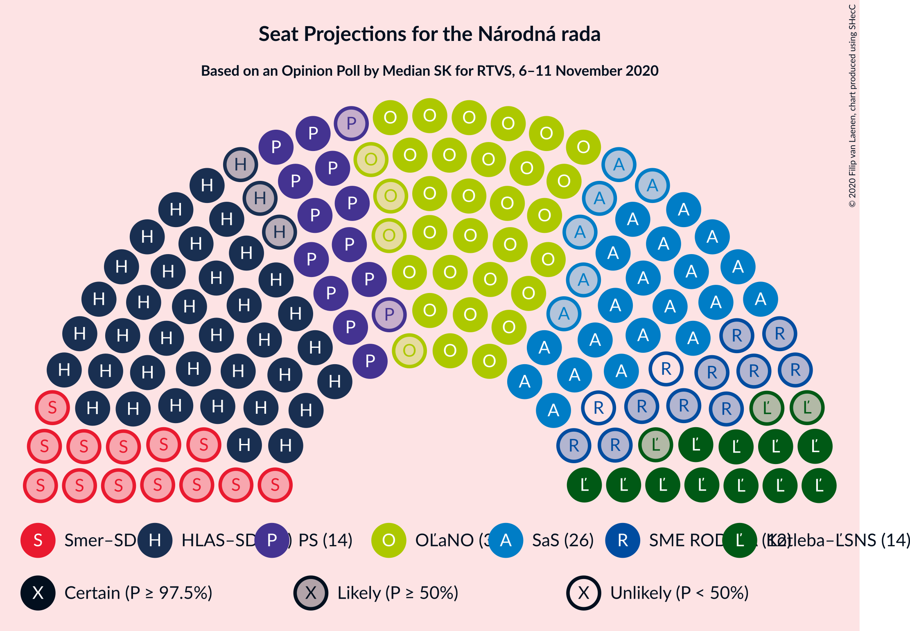
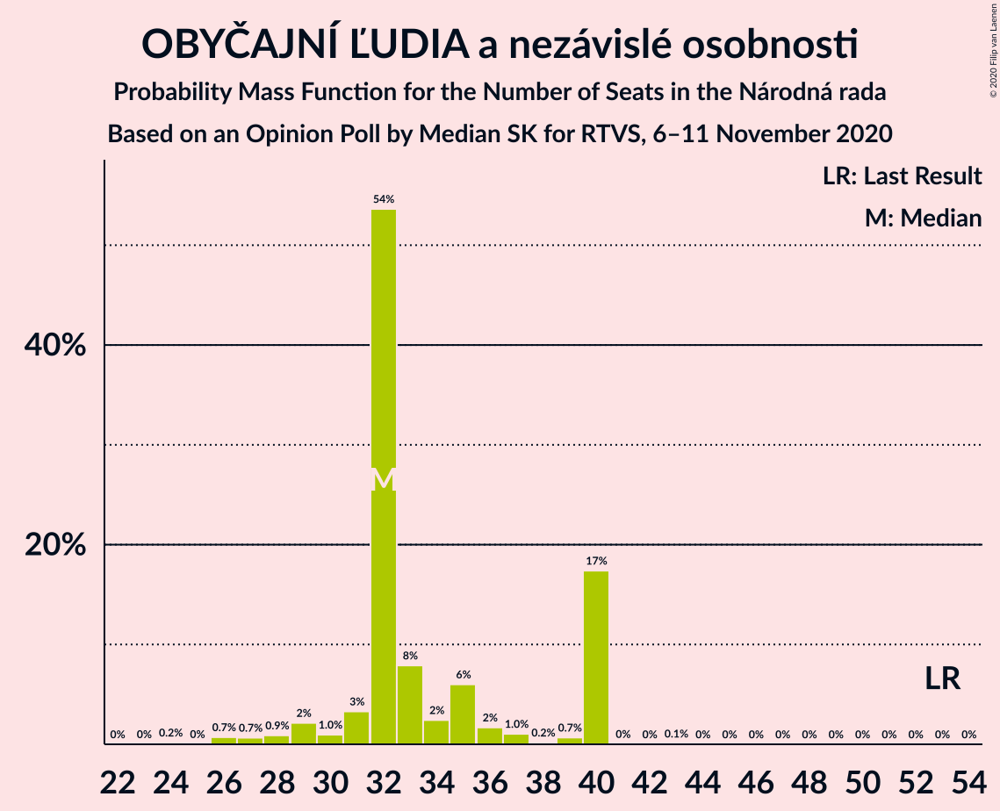
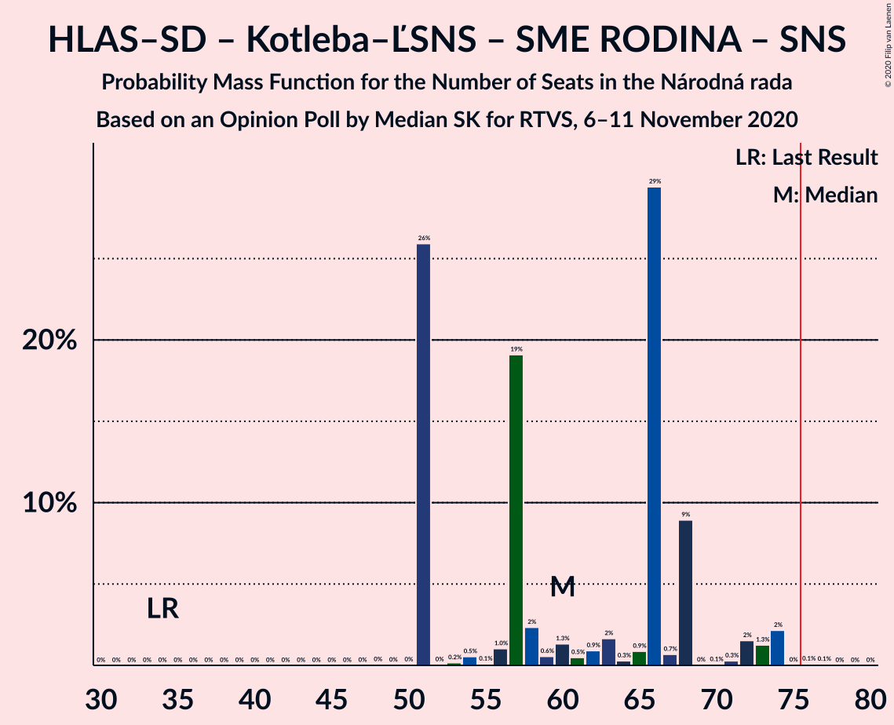
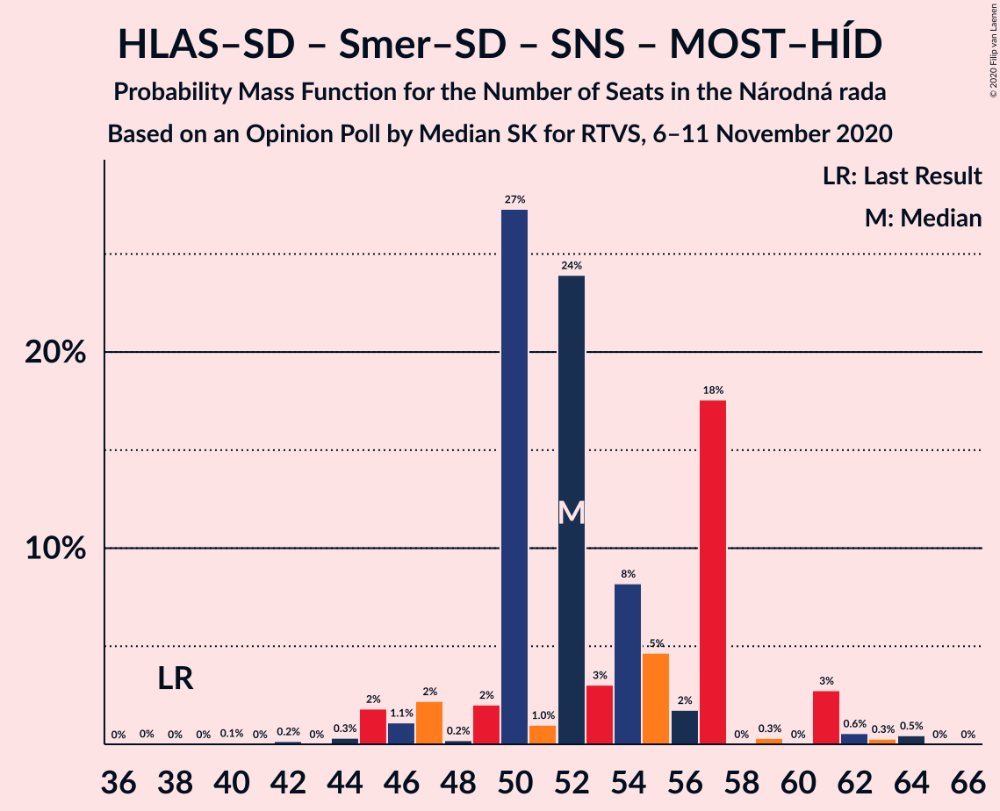
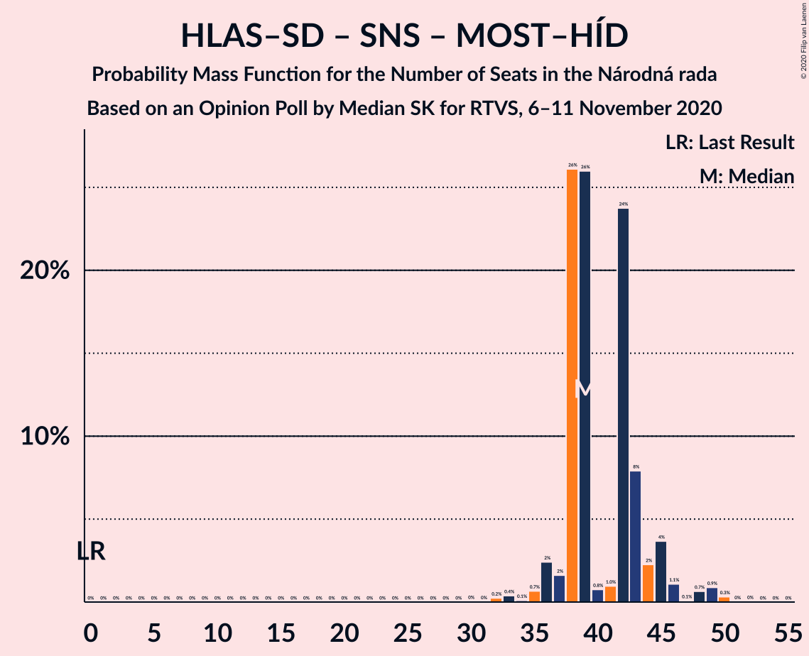
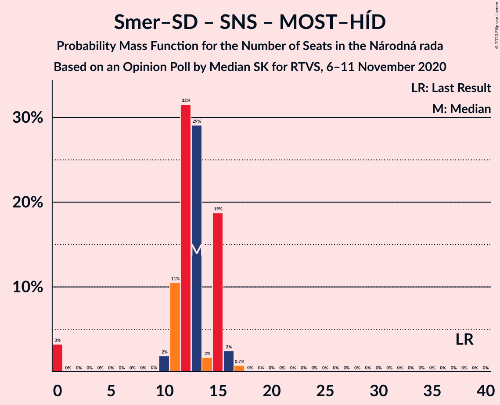

# Opinion Poll by Median SK for RTVS, 6–11 November 2020

<a href="#voting-intentions">Voting Intentions</a> | <a href="#seats">Seats</a> | <a href="#coalitions">Coalitions</a> | <a href="#technical-information">Technical Information</a>

## Voting Intentions

### Confidence Intervals

| Party | Last Result | Poll Result | 80% Confidence Interval | 90% Confidence Interval | 95% Confidence Interval | 99% Confidence Interval |
|:-----:|:-----------:|:-----------:|:-----------------------:|:-----------------------:|:-----------------------:|:-----------------------:|
| HLAS–sociálna demokracia | 0.0% | 20.3% | 18.8–22.0% |18.4–22.5% |18.0–22.9% |17.3–23.7% |
| OBYČAJNÍ ĽUDIA a nezávislé osobnosti | 25.0% | 16.6% | 15.2–18.2% |14.8–18.6% |14.4–19.0% |13.8–19.8% |
| Sloboda a Solidarita | 6.2% | 12.5% | 11.2–13.9% |10.9–14.3% |10.6–14.7% |10.0–15.4% |
| Progresívne Slovensko | 7.0% | 7.3% | 6.3–8.4% |6.1–8.7% |5.8–9.0% |5.4–9.6% |
| Kotleba–Ľudová strana Naše Slovensko | 8.0% | 6.9% | 6.0–8.0% |5.7–8.3% |5.5–8.6% |5.1–9.2% |
| SMER–sociálna demokracia | 18.3% | 6.3% | 5.4–7.4% |5.2–7.7% |5.0–8.0% |4.6–8.5% |
| SME RODINA | 8.2% | 5.8% | 5.0–6.8% |4.7–7.1% |4.5–7.4% |4.1–7.9% |
| Kresťanskodemokratické hnutie | 4.6% | 4.4% | 3.7–5.4% |3.5–5.6% |3.3–5.9% |3.0–6.4% |
| Za ľudí | 5.8% | 4.1% | 3.4–5.0% |3.2–5.3% |3.1–5.5% |2.8–6.0% |
| Strana maďarskej koalície–Magyar Koalíció Pártja | 3.9% | 3.2% | 2.6–4.1% |2.5–4.3% |2.3–4.5% |2.1–5.0% |
| Slovenská národná strana | 3.2% | 2.4% | 1.8–3.1% |1.7–3.3% |1.6–3.5% |1.4–3.9% |
| Dobrá voľba | 3.1% | 2.3% | 1.8–3.0% |1.6–3.2% |1.5–3.4% |1.3–3.7% |
| MOST–HÍD | 2.0% | 1.6% | 1.2–2.2% |1.1–2.4% |1.0–2.5% |0.8–2.9% |
| VLASŤ | 2.9% | 1.5% | 1.1–2.1% |1.0–2.3% |0.9–2.4% |0.7–2.8% |

*Note:* The poll result column reflects the actual value used in the calculations. Published results may vary slightly, and in addition be rounded to fewer digits.

## Seats

### Confidence Intervals

| Party | Last Result | Median | 80% Confidence Interval | 90% Confidence Interval | 95% Confidence Interval | 99% Confidence Interval |
|:-----:|:-----------:|:------:|:-----------------------:|:-----------------------:|:-----------------------:|:-----------------------:|
| <a href="#hlas–sociálna-demokracia">HLAS–sociálna demokracia</a> | 0 | 38 | 37–45 |37–46 |36–47 |33–49 |
| <a href="#obyčajní-ľudia-a-nezávislé-osobnosti">OBYČAJNÍ ĽUDIA a nezávislé osobnosti</a> | 53 | 31 | 29–35 |29–37 |27–38 |27–40 |
| <a href="#sloboda-a-solidarita">Sloboda a Solidarita</a> | 13 | 25 | 21–28 |21–28 |20–30 |20–30 |
| <a href="#progresívne-slovensko">Progresívne Slovensko</a> | 0 | 14 | 13–17 |12–17 |12–17 |10–19 |
| <a href="#kotleba–ľudová-strana-naše-slovensko">Kotleba–Ľudová strana Naše Slovensko</a> | 17 | 13 | 11–17 |11–17 |11–17 |10–18 |
| <a href="#smer–sociálna-demokracia">SMER–sociálna demokracia</a> | 38 | 14 | 11–15 |11–15 |0–15 |0–17 |
| <a href="#sme-rodina">SME RODINA</a> | 17 | 12 | 0–14 |0–14 |0–14 |0–15 |
| <a href="#kresťanskodemokratické-hnutie">Kresťanskodemokratické hnutie</a> | 0 | 0 | 0–10 |0–10 |0–10 |0–12 |
| <a href="#za-ľudí">Za ľudí</a> | 12 | 0 | 0 |0–10 |0–10 |0–11 |
| <a href="#strana-maďarskej-koalície–magyar-koalíció-pártja">Strana maďarskej koalície–Magyar Koalíció Pártja</a> | 0 | 0 | 0 |0 |0 |0 |
| <a href="#slovenská-národná-strana">Slovenská národná strana</a> | 0 | 0 | 0 |0 |0 |0 |
| <a href="#dobrá-voľba">Dobrá voľba</a> | 0 | 0 | 0 |0 |0 |0 |
| <a href="#most–híd">MOST–HÍD</a> | 0 | 0 | 0 |0 |0 |0 |
| <a href="#vlasť">VLASŤ</a> | 0 | 0 | 0 |0 |0 |0 |

### HLAS–sociálna demokracia

*For a full overview of the results for this party, see the [HLAS–sociálna demokracia](party-hlas–sociálnademokracia.html) page.*

| Number of Seats | Probability | Accumulated | Special Marks |
|:---------------:|:-----------:|:-----------:|:-------------:|
| 0 | 0% | 100% | Last Result |
| 1 | 0% | 100% |  |
| 2 | 0% | 100% |  |
| 3 | 0% | 100% |  |
| 4 | 0% | 100% |  |
| 5 | 0% | 100% |  |
| 6 | 0% | 100% |  |
| 7 | 0% | 100% |  |
| 8 | 0% | 100% |  |
| 9 | 0% | 100% |  |
| 10 | 0% | 100% |  |
| 11 | 0% | 100% |  |
| 12 | 0% | 100% |  |
| 13 | 0% | 100% |  |
| 14 | 0% | 100% |  |
| 15 | 0% | 100% |  |
| 16 | 0% | 100% |  |
| 17 | 0% | 100% |  |
| 18 | 0% | 100% |  |
| 19 | 0% | 100% |  |
| 20 | 0% | 100% |  |
| 21 | 0% | 100% |  |
| 22 | 0% | 100% |  |
| 23 | 0% | 100% |  |
| 24 | 0% | 100% |  |
| 25 | 0% | 100% |  |
| 26 | 0% | 100% |  |
| 27 | 0% | 100% |  |
| 28 | 0% | 100% |  |
| 29 | 0% | 100% |  |
| 30 | 0% | 100% |  |
| 31 | 0.1% | 100% |  |
| 32 | 0.2% | 99.9% |  |
| 33 | 0.2% | 99.6% |  |
| 34 | 0.5% | 99.5% |  |
| 35 | 0.5% | 98.9% |  |
| 36 | 2% | 98% |  |
| 37 | 33% | 96% |  |
| 38 | 19% | 63% | Median |
| 39 | 3% | 45% |  |
| 40 | 18% | 42% |  |
| 41 | 4% | 24% |  |
| 42 | 7% | 20% |  |
| 43 | 0.8% | 13% |  |
| 44 | 1.5% | 12% |  |
| 45 | 1.1% | 10% |  |
| 46 | 5% | 9% |  |
| 47 | 3% | 4% |  |
| 48 | 0.1% | 1.1% |  |
| 49 | 0.5% | 0.9% |  |
| 50 | 0% | 0.4% |  |
| 51 | 0% | 0.4% |  |
| 52 | 0.4% | 0.4% |  |
| 53 | 0% | 0% |  |

### OBYČAJNÍ ĽUDIA a nezávislé osobnosti

*For a full overview of the results for this party, see the [OBYČAJNÍ ĽUDIA a nezávislé osobnosti](party-obyčajníľudiaanezávisléosobnosti.html) page.*

| Number of Seats | Probability | Accumulated | Special Marks |
|:---------------:|:-----------:|:-----------:|:-------------:|
| 25 | 0% | 100% |  |
| 26 | 0.4% | 99.9% |  |
| 27 | 3% | 99.6% |  |
| 28 | 2% | 97% |  |
| 29 | 7% | 95% |  |
| 30 | 33% | 88% |  |
| 31 | 11% | 56% | Median |
| 32 | 10% | 45% |  |
| 33 | 19% | 35% |  |
| 34 | 0.7% | 16% |  |
| 35 | 7% | 15% |  |
| 36 | 2% | 8% |  |
| 37 | 4% | 6% |  |
| 38 | 0.1% | 3% |  |
| 39 | 1.4% | 2% |  |
| 40 | 0.9% | 1.1% |  |
| 41 | 0.1% | 0.2% |  |
| 42 | 0% | 0% |  |
| 43 | 0% | 0% |  |
| 44 | 0% | 0% |  |
| 45 | 0% | 0% |  |
| 46 | 0% | 0% |  |
| 47 | 0% | 0% |  |
| 48 | 0% | 0% |  |
| 49 | 0% | 0% |  |
| 50 | 0% | 0% |  |
| 51 | 0% | 0% |  |
| 52 | 0% | 0% |  |
| 53 | 0% | 0% | Last Result |

### Sloboda a Solidarita

*For a full overview of the results for this party, see the [Sloboda a Solidarita](party-slobodaasolidarita.html) page.*

| Number of Seats | Probability | Accumulated | Special Marks |
|:---------------:|:-----------:|:-----------:|:-------------:|
| 13 | 0% | 100% | Last Result |
| 14 | 0% | 100% |  |
| 15 | 0% | 100% |  |
| 16 | 0% | 100% |  |
| 17 | 0% | 100% |  |
| 18 | 0% | 100% |  |
| 19 | 0.2% | 99.9% |  |
| 20 | 4% | 99.8% |  |
| 21 | 10% | 96% |  |
| 22 | 8% | 86% |  |
| 23 | 10% | 79% |  |
| 24 | 10% | 69% |  |
| 25 | 25% | 58% | Median |
| 26 | 7% | 33% |  |
| 27 | 0.7% | 27% |  |
| 28 | 23% | 26% |  |
| 29 | 0.6% | 3% |  |
| 30 | 2% | 3% |  |
| 31 | 0.4% | 0.4% |  |
| 32 | 0% | 0% |  |

### Progresívne Slovensko

*For a full overview of the results for this party, see the [Progresívne Slovensko](party-progresívneslovensko.html) page.*

| Number of Seats | Probability | Accumulated | Special Marks |
|:---------------:|:-----------:|:-----------:|:-------------:|
| 0 | 0.3% | 100% | Last Result |
| 1 | 0% | 99.7% |  |
| 2 | 0% | 99.7% |  |
| 3 | 0% | 99.7% |  |
| 4 | 0% | 99.7% |  |
| 5 | 0% | 99.7% |  |
| 6 | 0% | 99.7% |  |
| 7 | 0% | 99.7% |  |
| 8 | 0% | 99.7% |  |
| 9 | 0% | 99.7% |  |
| 10 | 0.2% | 99.6% |  |
| 11 | 2% | 99.4% |  |
| 12 | 5% | 98% |  |
| 13 | 10% | 93% |  |
| 14 | 34% | 83% | Median |
| 15 | 6% | 49% |  |
| 16 | 24% | 44% |  |
| 17 | 17% | 19% |  |
| 18 | 0.9% | 2% |  |
| 19 | 1.5% | 2% |  |
| 20 | 0% | 0.1% |  |
| 21 | 0% | 0% |  |

### Kotleba–Ľudová strana Naše Slovensko

*For a full overview of the results for this party, see the [Kotleba–Ľudová strana Naše Slovensko](party-kotleba–ľudovástrananašeslovensko.html) page.*

| Number of Seats | Probability | Accumulated | Special Marks |
|:---------------:|:-----------:|:-----------:|:-------------:|
| 0 | 0.1% | 100% |  |
| 1 | 0% | 99.9% |  |
| 2 | 0% | 99.9% |  |
| 3 | 0% | 99.9% |  |
| 4 | 0% | 99.9% |  |
| 5 | 0% | 99.9% |  |
| 6 | 0% | 99.9% |  |
| 7 | 0% | 99.9% |  |
| 8 | 0% | 99.9% |  |
| 9 | 0.2% | 99.9% |  |
| 10 | 0.5% | 99.7% |  |
| 11 | 18% | 99.1% |  |
| 12 | 10% | 81% |  |
| 13 | 37% | 71% | Median |
| 14 | 7% | 34% |  |
| 15 | 14% | 27% |  |
| 16 | 1.0% | 13% |  |
| 17 | 11% | 12% | Last Result |
| 18 | 0.6% | 0.7% |  |
| 19 | 0.1% | 0.1% |  |
| 20 | 0% | 0% |  |

### SMER–sociálna demokracia

*For a full overview of the results for this party, see the [SMER–sociálna demokracia](party-smer–sociálnademokracia.html) page.*

| Number of Seats | Probability | Accumulated | Special Marks |
|:---------------:|:-----------:|:-----------:|:-------------:|
| 0 | 3% | 100% |  |
| 1 | 0% | 97% |  |
| 2 | 0% | 97% |  |
| 3 | 0% | 97% |  |
| 4 | 0% | 97% |  |
| 5 | 0% | 97% |  |
| 6 | 0% | 97% |  |
| 7 | 0% | 97% |  |
| 8 | 0% | 97% |  |
| 9 | 0% | 97% |  |
| 10 | 2% | 97% |  |
| 11 | 20% | 95% |  |
| 12 | 12% | 76% |  |
| 13 | 11% | 63% |  |
| 14 | 8% | 53% | Median |
| 15 | 43% | 45% |  |
| 16 | 0.2% | 2% |  |
| 17 | 1.4% | 2% |  |
| 18 | 0.1% | 0.2% |  |
| 19 | 0% | 0% |  |
| 20 | 0% | 0% |  |
| 21 | 0% | 0% |  |
| 22 | 0% | 0% |  |
| 23 | 0% | 0% |  |
| 24 | 0% | 0% |  |
| 25 | 0% | 0% |  |
| 26 | 0% | 0% |  |
| 27 | 0% | 0% |  |
| 28 | 0% | 0% |  |
| 29 | 0% | 0% |  |
| 30 | 0% | 0% |  |
| 31 | 0% | 0% |  |
| 32 | 0% | 0% |  |
| 33 | 0% | 0% |  |
| 34 | 0% | 0% |  |
| 35 | 0% | 0% |  |
| 36 | 0% | 0% |  |
| 37 | 0% | 0% |  |
| 38 | 0% | 0% | Last Result |

### SME RODINA

*For a full overview of the results for this party, see the [SME RODINA](party-smerodina.html) page.*

| Number of Seats | Probability | Accumulated | Special Marks |
|:---------------:|:-----------:|:-----------:|:-------------:|
| 0 | 12% | 100% |  |
| 1 | 0% | 88% |  |
| 2 | 0% | 88% |  |
| 3 | 0% | 88% |  |
| 4 | 0% | 88% |  |
| 5 | 0% | 88% |  |
| 6 | 0% | 88% |  |
| 7 | 0% | 88% |  |
| 8 | 0% | 88% |  |
| 9 | 0.1% | 88% |  |
| 10 | 10% | 88% |  |
| 11 | 28% | 78% |  |
| 12 | 8% | 50% | Median |
| 13 | 12% | 42% |  |
| 14 | 28% | 30% |  |
| 15 | 1.5% | 2% |  |
| 16 | 0.1% | 0.4% |  |
| 17 | 0.3% | 0.4% | Last Result |
| 18 | 0% | 0% |  |

### Kresťanskodemokratické hnutie

*For a full overview of the results for this party, see the [Kresťanskodemokratické hnutie](party-kresťanskodemokratickéhnutie.html) page.*

| Number of Seats | Probability | Accumulated | Special Marks |
|:---------------:|:-----------:|:-----------:|:-------------:|
| 0 | 89% | 100% | Last Result, Median |
| 1 | 0% | 11% |  |
| 2 | 0% | 11% |  |
| 3 | 0% | 11% |  |
| 4 | 0% | 11% |  |
| 5 | 0% | 11% |  |
| 6 | 0% | 11% |  |
| 7 | 0% | 11% |  |
| 8 | 0% | 11% |  |
| 9 | 0.8% | 11% |  |
| 10 | 8% | 10% |  |
| 11 | 1.2% | 2% |  |
| 12 | 0.3% | 0.7% |  |
| 13 | 0.4% | 0.4% |  |
| 14 | 0% | 0% |  |

### Za ľudí

*For a full overview of the results for this party, see the [Za ľudí](party-zaľudí.html) page.*

| Number of Seats | Probability | Accumulated | Special Marks |
|:---------------:|:-----------:|:-----------:|:-------------:|
| 0 | 92% | 100% | Median |
| 1 | 0% | 8% |  |
| 2 | 0% | 8% |  |
| 3 | 0% | 8% |  |
| 4 | 0% | 8% |  |
| 5 | 0% | 8% |  |
| 6 | 0% | 8% |  |
| 7 | 0% | 8% |  |
| 8 | 0% | 8% |  |
| 9 | 0.5% | 8% |  |
| 10 | 6% | 7% |  |
| 11 | 1.2% | 1.3% |  |
| 12 | 0.1% | 0.1% | Last Result |
| 13 | 0% | 0% |  |

### Strana maďarskej koalície–Magyar Koalíció Pártja

*For a full overview of the results for this party, see the [Strana maďarskej koalície–Magyar Koalíció Pártja](party-stranamaďarskejkoalície–magyarkoalíciópártja.html) page.*

| Number of Seats | Probability | Accumulated | Special Marks |
|:---------------:|:-----------:|:-----------:|:-------------:|
| 0 | 99.7% | 100% | Last Result, Median |
| 1 | 0% | 0.3% |  |
| 2 | 0% | 0.3% |  |
| 3 | 0% | 0.3% |  |
| 4 | 0% | 0.3% |  |
| 5 | 0% | 0.3% |  |
| 6 | 0% | 0.3% |  |
| 7 | 0% | 0.3% |  |
| 8 | 0% | 0.3% |  |
| 9 | 0.2% | 0.3% |  |
| 10 | 0% | 0.1% |  |
| 11 | 0.1% | 0.1% |  |
| 12 | 0% | 0% |  |

### Slovenská národná strana

*For a full overview of the results for this party, see the [Slovenská národná strana](party-slovenskánárodnástrana.html) page.*

| Number of Seats | Probability | Accumulated | Special Marks |
|:---------------:|:-----------:|:-----------:|:-------------:|
| 0 | 100% | 100% | Last Result, Median |

### Dobrá voľba

*For a full overview of the results for this party, see the [Dobrá voľba](party-dobrávoľba.html) page.*

| Number of Seats | Probability | Accumulated | Special Marks |
|:---------------:|:-----------:|:-----------:|:-------------:|
| 0 | 100% | 100% | Last Result, Median |

### MOST–HÍD

*For a full overview of the results for this party, see the [MOST–HÍD](party-most–híd.html) page.*

| Number of Seats | Probability | Accumulated | Special Marks |
|:---------------:|:-----------:|:-----------:|:-------------:|
| 0 | 100% | 100% | Last Result, Median |

### VLASŤ

*For a full overview of the results for this party, see the [VLASŤ](party-vlasť.html) page.*

| Number of Seats | Probability | Accumulated | Special Marks |
|:---------------:|:-----------:|:-----------:|:-------------:|
| 0 | 100% | 100% | Last Result, Median |

## Coalitions

### Confidence Intervals

| Coalition | Last Result | Median | Majority? | 80% Confidence Interval | 90% Confidence Interval | 95% Confidence Interval | 99% Confidence Interval |
|:---------:|:-----------:|:------:|:---------:|:-----------------------:|:-----------------------:|:-----------------------:|:-----------------------:|
| HLAS–sociálna demokracia – Kotleba–Ľudová strana Naše Slovensko – SMER–sociálna demokracia – SME RODINA – Slovenská národná strana | 72 | 79 | 57% | 70–81 | 68–82 | 67–83 | 63–85 |
| HLAS–sociálna demokracia – Kotleba–Ľudová strana Naše Slovensko – SME RODINA – Slovenská národná strana | 34 | 64 | 0.1% | 60–69 | 56–69 | 55–71 | 52–75 |
| HLAS–sociálna demokracia – SMER–sociálna demokracia – SME RODINA | 55 | 64 | 0% | 56–66 | 54–67 | 52–70 | 48–73 |
| HLAS–sociálna demokracia – SMER–sociálna demokracia – SME RODINA – Slovenská národná strana | 55 | 64 | 0% | 56–66 | 54–67 | 52–70 | 48–73 |
| HLAS–sociálna demokracia – SMER–sociálna demokracia – Slovenská národná strana – MOST–HÍD | 38 | 52 | 0% | 48–57 | 48–58 | 46–62 | 42–62 |
| HLAS–sociálna demokracia – SMER–sociálna demokracia – Slovenská národná strana | 38 | 52 | 0% | 48–57 | 48–58 | 46–62 | 42–62 |
| HLAS–sociálna demokracia – SME RODINA | 17 | 51 | 0% | 47–54 | 42–56 | 40–56 | 37–61 |
| HLAS–sociálna demokracia – SME RODINA – Slovenská národná strana | 17 | 51 | 0% | 47–54 | 42–56 | 40–56 | 37–61 |
| HLAS–sociálna demokracia – Slovenská národná strana – MOST–HÍD | 0 | 38 | 0% | 37–45 | 37–46 | 36–47 | 33–49 |
| HLAS–sociálna demokracia – Slovenská národná strana | 0 | 38 | 0% | 37–45 | 37–46 | 36–47 | 33–49 |
| Kotleba–Ľudová strana Naše Slovensko – SMER–sociálna demokracia – SME RODINA – Slovenská národná strana | 72 | 38 | 0% | 28–42 | 27–42 | 26–42 | 24–43 |
| SMER–sociálna demokracia – SME RODINA | 55 | 26 | 0% | 14–29 | 12–29 | 11–29 | 11–29 |
| SMER–sociálna demokracia – SME RODINA – Slovenská národná strana | 55 | 26 | 0% | 14–29 | 12–29 | 11–29 | 11–29 |
| SMER–sociálna demokracia – Slovenská národná strana – MOST–HÍD | 38 | 14 | 0% | 11–15 | 11–15 | 0–15 | 0–17 |
| SMER–sociálna demokracia | 38 | 14 | 0% | 11–15 | 11–15 | 0–15 | 0–17 |
| SMER–sociálna demokracia – Slovenská národná strana | 38 | 14 | 0% | 11–15 | 11–15 | 0–15 | 0–17 |

### HLAS–sociálna demokracia – Kotleba–Ľudová strana Naše Slovensko – SMER–sociálna demokracia – SME RODINA – Slovenská národná strana

| Number of Seats | Probability | Accumulated | Special Marks |
|:---------------:|:-----------:|:-----------:|:-------------:|
| 59 | 0% | 100% |  |
| 60 | 0.1% | 99.9% |  |
| 61 | 0% | 99.9% |  |
| 62 | 0% | 99.9% |  |
| 63 | 1.1% | 99.8% |  |
| 64 | 0.4% | 98.7% |  |
| 65 | 0.2% | 98% |  |
| 66 | 0.1% | 98% |  |
| 67 | 3% | 98% |  |
| 68 | 2% | 95% |  |
| 69 | 0.2% | 93% |  |
| 70 | 3% | 93% |  |
| 71 | 0.8% | 90% |  |
| 72 | 2% | 89% | Last Result |
| 73 | 1.0% | 87% |  |
| 74 | 5% | 86% |  |
| 75 | 25% | 81% |  |
| 76 | 3% | 57% | Majority |
| 77 | 3% | 54% | Median |
| 78 | 0.3% | 51% |  |
| 79 | 30% | 50% |  |
| 80 | 0.4% | 20% |  |
| 81 | 15% | 20% |  |
| 82 | 2% | 5% |  |
| 83 | 2% | 3% |  |
| 84 | 0.2% | 2% |  |
| 85 | 1.4% | 1.4% |  |
| 86 | 0% | 0.1% |  |
| 87 | 0% | 0.1% |  |
| 88 | 0% | 0% |  |

### HLAS–sociálna demokracia – Kotleba–Ľudová strana Naše Slovensko – SME RODINA – Slovenská národná strana

| Number of Seats | Probability | Accumulated | Special Marks |
|:---------------:|:-----------:|:-----------:|:-------------:|
| 34 | 0% | 100% | Last Result |
| 35 | 0% | 100% |  |
| 36 | 0% | 100% |  |
| 37 | 0% | 100% |  |
| 38 | 0% | 100% |  |
| 39 | 0% | 100% |  |
| 40 | 0% | 100% |  |
| 41 | 0% | 100% |  |
| 42 | 0% | 100% |  |
| 43 | 0% | 100% |  |
| 44 | 0% | 100% |  |
| 45 | 0% | 100% |  |
| 46 | 0% | 100% |  |
| 47 | 0% | 100% |  |
| 48 | 0% | 100% |  |
| 49 | 0% | 100% |  |
| 50 | 0% | 99.9% |  |
| 51 | 0.3% | 99.9% |  |
| 52 | 1.0% | 99.6% |  |
| 53 | 0.4% | 98.6% |  |
| 54 | 0.7% | 98% |  |
| 55 | 2% | 98% |  |
| 56 | 3% | 95% |  |
| 57 | 0.3% | 92% |  |
| 58 | 1.2% | 92% |  |
| 59 | 0.4% | 90% |  |
| 60 | 17% | 90% |  |
| 61 | 1.0% | 73% |  |
| 62 | 4% | 72% |  |
| 63 | 5% | 68% | Median |
| 64 | 31% | 63% |  |
| 65 | 5% | 32% |  |
| 66 | 0.4% | 27% |  |
| 67 | 0.8% | 27% |  |
| 68 | 15% | 26% |  |
| 69 | 8% | 11% |  |
| 70 | 0.2% | 3% |  |
| 71 | 0.3% | 3% |  |
| 72 | 1.0% | 2% |  |
| 73 | 0.1% | 1.3% |  |
| 74 | 0.3% | 1.2% |  |
| 75 | 0.8% | 0.8% |  |
| 76 | 0% | 0.1% | Majority |
| 77 | 0% | 0.1% |  |
| 78 | 0% | 0.1% |  |
| 79 | 0% | 0% |  |

### HLAS–sociálna demokracia – SMER–sociálna demokracia – SME RODINA

| Number of Seats | Probability | Accumulated | Special Marks |
|:---------------:|:-----------:|:-----------:|:-------------:|
| 47 | 0% | 100% |  |
| 48 | 1.0% | 99.9% |  |
| 49 | 0.1% | 98.9% |  |
| 50 | 0.6% | 98.8% |  |
| 51 | 0.2% | 98% |  |
| 52 | 2% | 98% |  |
| 53 | 0.1% | 96% |  |
| 54 | 0.9% | 96% |  |
| 55 | 2% | 95% | Last Result |
| 56 | 3% | 93% |  |
| 57 | 2% | 90% |  |
| 58 | 0.5% | 88% |  |
| 59 | 0.9% | 88% |  |
| 60 | 2% | 87% |  |
| 61 | 6% | 85% |  |
| 62 | 10% | 80% |  |
| 63 | 3% | 70% |  |
| 64 | 25% | 67% | Median |
| 65 | 1.2% | 43% |  |
| 66 | 32% | 41% |  |
| 67 | 6% | 10% |  |
| 68 | 0.8% | 4% |  |
| 69 | 0.2% | 3% |  |
| 70 | 2% | 3% |  |
| 71 | 0% | 1.1% |  |
| 72 | 0% | 1.1% |  |
| 73 | 1.0% | 1.0% |  |
| 74 | 0% | 0% |  |

### HLAS–sociálna demokracia – SMER–sociálna demokracia – SME RODINA – Slovenská národná strana

| Number of Seats | Probability | Accumulated | Special Marks |
|:---------------:|:-----------:|:-----------:|:-------------:|
| 47 | 0% | 100% |  |
| 48 | 1.0% | 99.9% |  |
| 49 | 0.1% | 98.9% |  |
| 50 | 0.6% | 98.8% |  |
| 51 | 0.2% | 98% |  |
| 52 | 2% | 98% |  |
| 53 | 0.1% | 96% |  |
| 54 | 0.9% | 96% |  |
| 55 | 2% | 95% | Last Result |
| 56 | 3% | 93% |  |
| 57 | 2% | 90% |  |
| 58 | 0.5% | 88% |  |
| 59 | 0.9% | 88% |  |
| 60 | 2% | 87% |  |
| 61 | 6% | 85% |  |
| 62 | 10% | 80% |  |
| 63 | 3% | 70% |  |
| 64 | 25% | 67% | Median |
| 65 | 1.2% | 43% |  |
| 66 | 32% | 41% |  |
| 67 | 6% | 10% |  |
| 68 | 0.8% | 4% |  |
| 69 | 0.2% | 3% |  |
| 70 | 2% | 3% |  |
| 71 | 0% | 1.1% |  |
| 72 | 0% | 1.1% |  |
| 73 | 1.0% | 1.0% |  |
| 74 | 0% | 0% |  |

### HLAS–sociálna demokracia – SMER–sociálna demokracia – Slovenská národná strana – MOST–HÍD

| Number of Seats | Probability | Accumulated | Special Marks |
|:---------------:|:-----------:|:-----------:|:-------------:|
| 34 | 0.1% | 100% |  |
| 35 | 0% | 99.9% |  |
| 36 | 0% | 99.9% |  |
| 37 | 0.1% | 99.9% |  |
| 38 | 0.1% | 99.8% | Last Result |
| 39 | 0% | 99.7% |  |
| 40 | 0% | 99.7% |  |
| 41 | 0.1% | 99.7% |  |
| 42 | 0.1% | 99.6% |  |
| 43 | 0.1% | 99.5% |  |
| 44 | 1.5% | 99.4% |  |
| 45 | 0.1% | 98% |  |
| 46 | 2% | 98% |  |
| 47 | 1.1% | 96% |  |
| 48 | 10% | 95% |  |
| 49 | 0.9% | 85% |  |
| 50 | 2% | 85% |  |
| 51 | 3% | 82% |  |
| 52 | 34% | 79% | Median |
| 53 | 26% | 45% |  |
| 54 | 2% | 20% |  |
| 55 | 0.7% | 18% |  |
| 56 | 5% | 17% |  |
| 57 | 6% | 12% |  |
| 58 | 1.1% | 6% |  |
| 59 | 2% | 5% |  |
| 60 | 0.1% | 3% |  |
| 61 | 0.1% | 3% |  |
| 62 | 3% | 3% |  |
| 63 | 0% | 0.4% |  |
| 64 | 0.4% | 0.4% |  |
| 65 | 0% | 0% |  |

### HLAS–sociálna demokracia – SMER–sociálna demokracia – Slovenská národná strana

| Number of Seats | Probability | Accumulated | Special Marks |
|:---------------:|:-----------:|:-----------:|:-------------:|
| 34 | 0.1% | 100% |  |
| 35 | 0% | 99.9% |  |
| 36 | 0% | 99.9% |  |
| 37 | 0.1% | 99.9% |  |
| 38 | 0.1% | 99.8% | Last Result |
| 39 | 0% | 99.7% |  |
| 40 | 0% | 99.7% |  |
| 41 | 0.1% | 99.7% |  |
| 42 | 0.1% | 99.6% |  |
| 43 | 0.1% | 99.5% |  |
| 44 | 1.5% | 99.4% |  |
| 45 | 0.1% | 98% |  |
| 46 | 2% | 98% |  |
| 47 | 1.1% | 96% |  |
| 48 | 10% | 95% |  |
| 49 | 0.9% | 85% |  |
| 50 | 2% | 85% |  |
| 51 | 3% | 82% |  |
| 52 | 34% | 79% | Median |
| 53 | 26% | 45% |  |
| 54 | 2% | 20% |  |
| 55 | 0.7% | 18% |  |
| 56 | 5% | 17% |  |
| 57 | 6% | 12% |  |
| 58 | 1.1% | 6% |  |
| 59 | 2% | 5% |  |
| 60 | 0.1% | 3% |  |
| 61 | 0.1% | 3% |  |
| 62 | 3% | 3% |  |
| 63 | 0% | 0.4% |  |
| 64 | 0.4% | 0.4% |  |
| 65 | 0% | 0% |  |

### HLAS–sociálna demokracia – SME RODINA

| Number of Seats | Probability | Accumulated | Special Marks |
|:---------------:|:-----------:|:-----------:|:-------------:|
| 17 | 0% | 100% | Last Result |
| 18 | 0% | 100% |  |
| 19 | 0% | 100% |  |
| 20 | 0% | 100% |  |
| 21 | 0% | 100% |  |
| 22 | 0% | 100% |  |
| 23 | 0% | 100% |  |
| 24 | 0% | 100% |  |
| 25 | 0% | 100% |  |
| 26 | 0% | 100% |  |
| 27 | 0% | 100% |  |
| 28 | 0% | 100% |  |
| 29 | 0% | 100% |  |
| 30 | 0% | 100% |  |
| 31 | 0% | 100% |  |
| 32 | 0% | 100% |  |
| 33 | 0% | 100% |  |
| 34 | 0% | 100% |  |
| 35 | 0% | 100% |  |
| 36 | 0% | 100% |  |
| 37 | 1.2% | 100% |  |
| 38 | 0.1% | 98.7% |  |
| 39 | 0.1% | 98.6% |  |
| 40 | 2% | 98.6% |  |
| 41 | 0.8% | 96% |  |
| 42 | 3% | 95% |  |
| 43 | 0.6% | 92% |  |
| 44 | 0.1% | 91% |  |
| 45 | 0.2% | 91% |  |
| 46 | 0.7% | 91% |  |
| 47 | 4% | 90% |  |
| 48 | 3% | 86% |  |
| 49 | 18% | 83% |  |
| 50 | 7% | 65% | Median |
| 51 | 28% | 59% |  |
| 52 | 11% | 31% |  |
| 53 | 9% | 20% |  |
| 54 | 0.6% | 11% |  |
| 55 | 2% | 10% |  |
| 56 | 6% | 8% |  |
| 57 | 0.1% | 2% |  |
| 58 | 0% | 2% |  |
| 59 | 0.3% | 2% |  |
| 60 | 1.4% | 2% |  |
| 61 | 0.5% | 0.5% |  |
| 62 | 0% | 0.1% |  |
| 63 | 0% | 0.1% |  |
| 64 | 0% | 0% |  |

### HLAS–sociálna demokracia – SME RODINA – Slovenská národná strana

| Number of Seats | Probability | Accumulated | Special Marks |
|:---------------:|:-----------:|:-----------:|:-------------:|
| 17 | 0% | 100% | Last Result |
| 18 | 0% | 100% |  |
| 19 | 0% | 100% |  |
| 20 | 0% | 100% |  |
| 21 | 0% | 100% |  |
| 22 | 0% | 100% |  |
| 23 | 0% | 100% |  |
| 24 | 0% | 100% |  |
| 25 | 0% | 100% |  |
| 26 | 0% | 100% |  |
| 27 | 0% | 100% |  |
| 28 | 0% | 100% |  |
| 29 | 0% | 100% |  |
| 30 | 0% | 100% |  |
| 31 | 0% | 100% |  |
| 32 | 0% | 100% |  |
| 33 | 0% | 100% |  |
| 34 | 0% | 100% |  |
| 35 | 0% | 100% |  |
| 36 | 0% | 100% |  |
| 37 | 1.2% | 100% |  |
| 38 | 0.1% | 98.7% |  |
| 39 | 0.1% | 98.6% |  |
| 40 | 2% | 98.6% |  |
| 41 | 0.8% | 96% |  |
| 42 | 3% | 95% |  |
| 43 | 0.6% | 92% |  |
| 44 | 0.1% | 91% |  |
| 45 | 0.2% | 91% |  |
| 46 | 0.7% | 91% |  |
| 47 | 4% | 90% |  |
| 48 | 3% | 86% |  |
| 49 | 18% | 83% |  |
| 50 | 7% | 65% | Median |
| 51 | 28% | 59% |  |
| 52 | 11% | 31% |  |
| 53 | 9% | 20% |  |
| 54 | 0.6% | 11% |  |
| 55 | 2% | 10% |  |
| 56 | 6% | 8% |  |
| 57 | 0.1% | 2% |  |
| 58 | 0% | 2% |  |
| 59 | 0.3% | 2% |  |
| 60 | 1.4% | 2% |  |
| 61 | 0.5% | 0.5% |  |
| 62 | 0% | 0.1% |  |
| 63 | 0% | 0.1% |  |
| 64 | 0% | 0% |  |

### HLAS–sociálna demokracia – Slovenská národná strana – MOST–HÍD

| Number of Seats | Probability | Accumulated | Special Marks |
|:---------------:|:-----------:|:-----------:|:-------------:|
| 0 | 0% | 100% | Last Result |
| 1 | 0% | 100% |  |
| 2 | 0% | 100% |  |
| 3 | 0% | 100% |  |
| 4 | 0% | 100% |  |
| 5 | 0% | 100% |  |
| 6 | 0% | 100% |  |
| 7 | 0% | 100% |  |
| 8 | 0% | 100% |  |
| 9 | 0% | 100% |  |
| 10 | 0% | 100% |  |
| 11 | 0% | 100% |  |
| 12 | 0% | 100% |  |
| 13 | 0% | 100% |  |
| 14 | 0% | 100% |  |
| 15 | 0% | 100% |  |
| 16 | 0% | 100% |  |
| 17 | 0% | 100% |  |
| 18 | 0% | 100% |  |
| 19 | 0% | 100% |  |
| 20 | 0% | 100% |  |
| 21 | 0% | 100% |  |
| 22 | 0% | 100% |  |
| 23 | 0% | 100% |  |
| 24 | 0% | 100% |  |
| 25 | 0% | 100% |  |
| 26 | 0% | 100% |  |
| 27 | 0% | 100% |  |
| 28 | 0% | 100% |  |
| 29 | 0% | 100% |  |
| 30 | 0% | 100% |  |
| 31 | 0.1% | 100% |  |
| 32 | 0.2% | 99.9% |  |
| 33 | 0.2% | 99.6% |  |
| 34 | 0.5% | 99.5% |  |
| 35 | 0.5% | 98.9% |  |
| 36 | 2% | 98% |  |
| 37 | 33% | 96% |  |
| 38 | 19% | 63% | Median |
| 39 | 3% | 45% |  |
| 40 | 18% | 42% |  |
| 41 | 4% | 24% |  |
| 42 | 7% | 20% |  |
| 43 | 0.8% | 13% |  |
| 44 | 1.5% | 12% |  |
| 45 | 1.1% | 10% |  |
| 46 | 5% | 9% |  |
| 47 | 3% | 4% |  |
| 48 | 0.1% | 1.1% |  |
| 49 | 0.5% | 0.9% |  |
| 50 | 0% | 0.4% |  |
| 51 | 0% | 0.4% |  |
| 52 | 0.4% | 0.4% |  |
| 53 | 0% | 0% |  |

### HLAS–sociálna demokracia – Slovenská národná strana

| Number of Seats | Probability | Accumulated | Special Marks |
|:---------------:|:-----------:|:-----------:|:-------------:|
| 0 | 0% | 100% | Last Result |
| 1 | 0% | 100% |  |
| 2 | 0% | 100% |  |
| 3 | 0% | 100% |  |
| 4 | 0% | 100% |  |
| 5 | 0% | 100% |  |
| 6 | 0% | 100% |  |
| 7 | 0% | 100% |  |
| 8 | 0% | 100% |  |
| 9 | 0% | 100% |  |
| 10 | 0% | 100% |  |
| 11 | 0% | 100% |  |
| 12 | 0% | 100% |  |
| 13 | 0% | 100% |  |
| 14 | 0% | 100% |  |
| 15 | 0% | 100% |  |
| 16 | 0% | 100% |  |
| 17 | 0% | 100% |  |
| 18 | 0% | 100% |  |
| 19 | 0% | 100% |  |
| 20 | 0% | 100% |  |
| 21 | 0% | 100% |  |
| 22 | 0% | 100% |  |
| 23 | 0% | 100% |  |
| 24 | 0% | 100% |  |
| 25 | 0% | 100% |  |
| 26 | 0% | 100% |  |
| 27 | 0% | 100% |  |
| 28 | 0% | 100% |  |
| 29 | 0% | 100% |  |
| 30 | 0% | 100% |  |
| 31 | 0.1% | 100% |  |
| 32 | 0.2% | 99.9% |  |
| 33 | 0.2% | 99.6% |  |
| 34 | 0.5% | 99.5% |  |
| 35 | 0.5% | 98.9% |  |
| 36 | 2% | 98% |  |
| 37 | 33% | 96% |  |
| 38 | 19% | 63% | Median |
| 39 | 3% | 45% |  |
| 40 | 18% | 42% |  |
| 41 | 4% | 24% |  |
| 42 | 7% | 20% |  |
| 43 | 0.8% | 13% |  |
| 44 | 1.5% | 12% |  |
| 45 | 1.1% | 10% |  |
| 46 | 5% | 9% |  |
| 47 | 3% | 4% |  |
| 48 | 0.1% | 1.1% |  |
| 49 | 0.5% | 0.9% |  |
| 50 | 0% | 0.4% |  |
| 51 | 0% | 0.4% |  |
| 52 | 0.4% | 0.4% |  |
| 53 | 0% | 0% |  |

### Kotleba–Ľudová strana Naše Slovensko – SMER–sociálna demokracia – SME RODINA – Slovenská národná strana

| Number of Seats | Probability | Accumulated | Special Marks |
|:---------------:|:-----------:|:-----------:|:-------------:|
| 16 | 0.1% | 100% |  |
| 17 | 0% | 99.9% |  |
| 18 | 0% | 99.8% |  |
| 19 | 0% | 99.8% |  |
| 20 | 0% | 99.8% |  |
| 21 | 0% | 99.8% |  |
| 22 | 0% | 99.8% |  |
| 23 | 0.3% | 99.8% |  |
| 24 | 1.3% | 99.5% |  |
| 25 | 0.5% | 98% |  |
| 26 | 2% | 98% |  |
| 27 | 3% | 96% |  |
| 28 | 4% | 93% |  |
| 29 | 0.7% | 90% |  |
| 30 | 0.2% | 89% |  |
| 31 | 0.1% | 89% |  |
| 32 | 3% | 89% |  |
| 33 | 6% | 86% |  |
| 34 | 0.8% | 80% |  |
| 35 | 4% | 79% |  |
| 36 | 3% | 75% |  |
| 37 | 21% | 72% |  |
| 38 | 8% | 52% |  |
| 39 | 0.8% | 44% | Median |
| 40 | 4% | 43% |  |
| 41 | 16% | 39% |  |
| 42 | 22% | 23% |  |
| 43 | 0.6% | 0.7% |  |
| 44 | 0.1% | 0.1% |  |
| 45 | 0% | 0% |  |
| 46 | 0% | 0% |  |
| 47 | 0% | 0% |  |
| 48 | 0% | 0% |  |
| 49 | 0% | 0% |  |
| 50 | 0% | 0% |  |
| 51 | 0% | 0% |  |
| 52 | 0% | 0% |  |
| 53 | 0% | 0% |  |
| 54 | 0% | 0% |  |
| 55 | 0% | 0% |  |
| 56 | 0% | 0% |  |
| 57 | 0% | 0% |  |
| 58 | 0% | 0% |  |
| 59 | 0% | 0% |  |
| 60 | 0% | 0% |  |
| 61 | 0% | 0% |  |
| 62 | 0% | 0% |  |
| 63 | 0% | 0% |  |
| 64 | 0% | 0% |  |
| 65 | 0% | 0% |  |
| 66 | 0% | 0% |  |
| 67 | 0% | 0% |  |
| 68 | 0% | 0% |  |
| 69 | 0% | 0% |  |
| 70 | 0% | 0% |  |
| 71 | 0% | 0% |  |
| 72 | 0% | 0% | Last Result |

### SMER–sociálna demokracia – SME RODINA

| Number of Seats | Probability | Accumulated | Special Marks |
|:---------------:|:-----------:|:-----------:|:-------------:|
| 0 | 0.1% | 100% |  |
| 1 | 0% | 99.9% |  |
| 2 | 0% | 99.9% |  |
| 3 | 0% | 99.9% |  |
| 4 | 0% | 99.9% |  |
| 5 | 0% | 99.9% |  |
| 6 | 0% | 99.9% |  |
| 7 | 0% | 99.9% |  |
| 8 | 0% | 99.9% |  |
| 9 | 0% | 99.9% |  |
| 10 | 0.3% | 99.9% |  |
| 11 | 2% | 99.6% |  |
| 12 | 3% | 97% |  |
| 13 | 2% | 94% |  |
| 14 | 3% | 92% |  |
| 15 | 3% | 89% |  |
| 16 | 0.1% | 86% |  |
| 17 | 0% | 86% |  |
| 18 | 0.1% | 86% |  |
| 19 | 0.1% | 86% |  |
| 20 | 0.1% | 86% |  |
| 21 | 8% | 86% |  |
| 22 | 5% | 78% |  |
| 23 | 2% | 73% |  |
| 24 | 12% | 72% |  |
| 25 | 8% | 60% |  |
| 26 | 26% | 52% | Median |
| 27 | 0.5% | 26% |  |
| 28 | 3% | 26% |  |
| 29 | 22% | 22% |  |
| 30 | 0% | 0.1% |  |
| 31 | 0.1% | 0.1% |  |
| 32 | 0% | 0% |  |
| 33 | 0% | 0% |  |
| 34 | 0% | 0% |  |
| 35 | 0% | 0% |  |
| 36 | 0% | 0% |  |
| 37 | 0% | 0% |  |
| 38 | 0% | 0% |  |
| 39 | 0% | 0% |  |
| 40 | 0% | 0% |  |
| 41 | 0% | 0% |  |
| 42 | 0% | 0% |  |
| 43 | 0% | 0% |  |
| 44 | 0% | 0% |  |
| 45 | 0% | 0% |  |
| 46 | 0% | 0% |  |
| 47 | 0% | 0% |  |
| 48 | 0% | 0% |  |
| 49 | 0% | 0% |  |
| 50 | 0% | 0% |  |
| 51 | 0% | 0% |  |
| 52 | 0% | 0% |  |
| 53 | 0% | 0% |  |
| 54 | 0% | 0% |  |
| 55 | 0% | 0% | Last Result |

### SMER–sociálna demokracia – SME RODINA – Slovenská národná strana

| Number of Seats | Probability | Accumulated | Special Marks |
|:---------------:|:-----------:|:-----------:|:-------------:|
| 0 | 0.1% | 100% |  |
| 1 | 0% | 99.9% |  |
| 2 | 0% | 99.9% |  |
| 3 | 0% | 99.9% |  |
| 4 | 0% | 99.9% |  |
| 5 | 0% | 99.9% |  |
| 6 | 0% | 99.9% |  |
| 7 | 0% | 99.9% |  |
| 8 | 0% | 99.9% |  |
| 9 | 0% | 99.9% |  |
| 10 | 0.3% | 99.9% |  |
| 11 | 2% | 99.6% |  |
| 12 | 3% | 97% |  |
| 13 | 2% | 94% |  |
| 14 | 3% | 92% |  |
| 15 | 3% | 89% |  |
| 16 | 0.1% | 86% |  |
| 17 | 0% | 86% |  |
| 18 | 0.1% | 86% |  |
| 19 | 0.1% | 86% |  |
| 20 | 0.1% | 86% |  |
| 21 | 8% | 86% |  |
| 22 | 5% | 78% |  |
| 23 | 2% | 73% |  |
| 24 | 12% | 72% |  |
| 25 | 8% | 60% |  |
| 26 | 26% | 52% | Median |
| 27 | 0.5% | 26% |  |
| 28 | 3% | 26% |  |
| 29 | 22% | 22% |  |
| 30 | 0% | 0.1% |  |
| 31 | 0.1% | 0.1% |  |
| 32 | 0% | 0% |  |
| 33 | 0% | 0% |  |
| 34 | 0% | 0% |  |
| 35 | 0% | 0% |  |
| 36 | 0% | 0% |  |
| 37 | 0% | 0% |  |
| 38 | 0% | 0% |  |
| 39 | 0% | 0% |  |
| 40 | 0% | 0% |  |
| 41 | 0% | 0% |  |
| 42 | 0% | 0% |  |
| 43 | 0% | 0% |  |
| 44 | 0% | 0% |  |
| 45 | 0% | 0% |  |
| 46 | 0% | 0% |  |
| 47 | 0% | 0% |  |
| 48 | 0% | 0% |  |
| 49 | 0% | 0% |  |
| 50 | 0% | 0% |  |
| 51 | 0% | 0% |  |
| 52 | 0% | 0% |  |
| 53 | 0% | 0% |  |
| 54 | 0% | 0% |  |
| 55 | 0% | 0% | Last Result |

### SMER–sociálna demokracia – Slovenská národná strana – MOST–HÍD

| Number of Seats | Probability | Accumulated | Special Marks |
|:---------------:|:-----------:|:-----------:|:-------------:|
| 0 | 3% | 100% |  |
| 1 | 0% | 97% |  |
| 2 | 0% | 97% |  |
| 3 | 0% | 97% |  |
| 4 | 0% | 97% |  |
| 5 | 0% | 97% |  |
| 6 | 0% | 97% |  |
| 7 | 0% | 97% |  |
| 8 | 0% | 97% |  |
| 9 | 0% | 97% |  |
| 10 | 2% | 97% |  |
| 11 | 20% | 95% |  |
| 12 | 12% | 76% |  |
| 13 | 11% | 63% |  |
| 14 | 8% | 53% | Median |
| 15 | 43% | 45% |  |
| 16 | 0.2% | 2% |  |
| 17 | 1.4% | 2% |  |
| 18 | 0.1% | 0.2% |  |
| 19 | 0% | 0% |  |
| 20 | 0% | 0% |  |
| 21 | 0% | 0% |  |
| 22 | 0% | 0% |  |
| 23 | 0% | 0% |  |
| 24 | 0% | 0% |  |
| 25 | 0% | 0% |  |
| 26 | 0% | 0% |  |
| 27 | 0% | 0% |  |
| 28 | 0% | 0% |  |
| 29 | 0% | 0% |  |
| 30 | 0% | 0% |  |
| 31 | 0% | 0% |  |
| 32 | 0% | 0% |  |
| 33 | 0% | 0% |  |
| 34 | 0% | 0% |  |
| 35 | 0% | 0% |  |
| 36 | 0% | 0% |  |
| 37 | 0% | 0% |  |
| 38 | 0% | 0% | Last Result |

### SMER–sociálna demokracia

| Number of Seats | Probability | Accumulated | Special Marks |
|:---------------:|:-----------:|:-----------:|:-------------:|
| 0 | 3% | 100% |  |
| 1 | 0% | 97% |  |
| 2 | 0% | 97% |  |
| 3 | 0% | 97% |  |
| 4 | 0% | 97% |  |
| 5 | 0% | 97% |  |
| 6 | 0% | 97% |  |
| 7 | 0% | 97% |  |
| 8 | 0% | 97% |  |
| 9 | 0% | 97% |  |
| 10 | 2% | 97% |  |
| 11 | 20% | 95% |  |
| 12 | 12% | 76% |  |
| 13 | 11% | 63% |  |
| 14 | 8% | 53% | Median |
| 15 | 43% | 45% |  |
| 16 | 0.2% | 2% |  |
| 17 | 1.4% | 2% |  |
| 18 | 0.1% | 0.2% |  |
| 19 | 0% | 0% |  |
| 20 | 0% | 0% |  |
| 21 | 0% | 0% |  |
| 22 | 0% | 0% |  |
| 23 | 0% | 0% |  |
| 24 | 0% | 0% |  |
| 25 | 0% | 0% |  |
| 26 | 0% | 0% |  |
| 27 | 0% | 0% |  |
| 28 | 0% | 0% |  |
| 29 | 0% | 0% |  |
| 30 | 0% | 0% |  |
| 31 | 0% | 0% |  |
| 32 | 0% | 0% |  |
| 33 | 0% | 0% |  |
| 34 | 0% | 0% |  |
| 35 | 0% | 0% |  |
| 36 | 0% | 0% |  |
| 37 | 0% | 0% |  |
| 38 | 0% | 0% | Last Result |

### SMER–sociálna demokracia – Slovenská národná strana

| Number of Seats | Probability | Accumulated | Special Marks |
|:---------------:|:-----------:|:-----------:|:-------------:|
| 0 | 3% | 100% |  |
| 1 | 0% | 97% |  |
| 2 | 0% | 97% |  |
| 3 | 0% | 97% |  |
| 4 | 0% | 97% |  |
| 5 | 0% | 97% |  |
| 6 | 0% | 97% |  |
| 7 | 0% | 97% |  |
| 8 | 0% | 97% |  |
| 9 | 0% | 97% |  |
| 10 | 2% | 97% |  |
| 11 | 20% | 95% |  |
| 12 | 12% | 76% |  |
| 13 | 11% | 63% |  |
| 14 | 8% | 53% | Median |
| 15 | 43% | 45% |  |
| 16 | 0.2% | 2% |  |
| 17 | 1.4% | 2% |  |
| 18 | 0.1% | 0.2% |  |
| 19 | 0% | 0% |  |
| 20 | 0% | 0% |  |
| 21 | 0% | 0% |  |
| 22 | 0% | 0% |  |
| 23 | 0% | 0% |  |
| 24 | 0% | 0% |  |
| 25 | 0% | 0% |  |
| 26 | 0% | 0% |  |
| 27 | 0% | 0% |  |
| 28 | 0% | 0% |  |
| 29 | 0% | 0% |  |
| 30 | 0% | 0% |  |
| 31 | 0% | 0% |  |
| 32 | 0% | 0% |  |
| 33 | 0% | 0% |  |
| 34 | 0% | 0% |  |
| 35 | 0% | 0% |  |
| 36 | 0% | 0% |  |
| 37 | 0% | 0% |  |
| 38 | 0% | 0% | Last Result |

## Technical Information

### Opinion Poll

+ **Polling firm:** Median SK
+ **Commissioner(s):** RTVS
+ **Fieldwork period:** 6–11 November 2020

### Calculations

+ **Sample size:** 1018
+ **Simulations done:** 1,048,576
+ **Error estimate:** 1.98%

