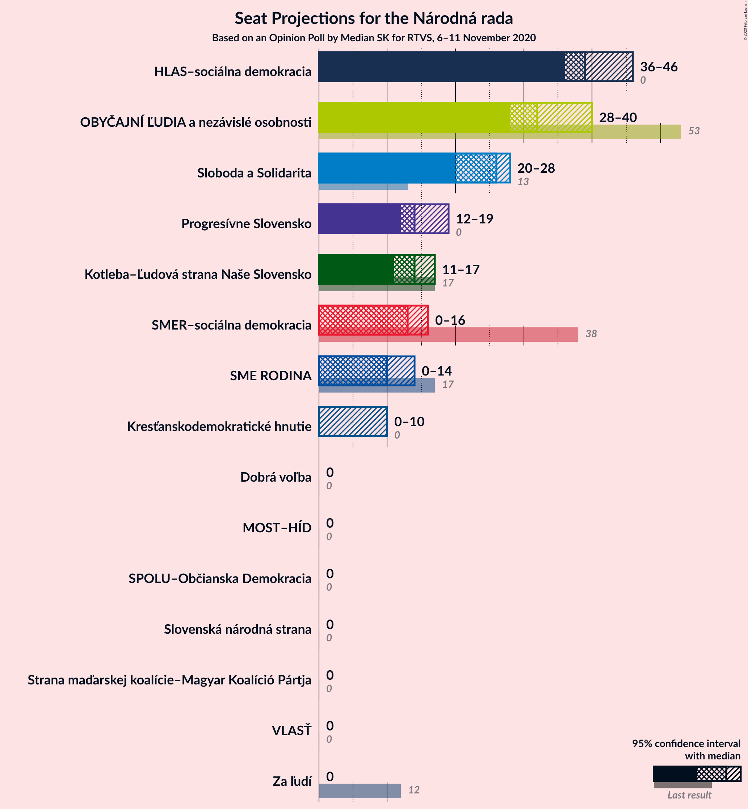
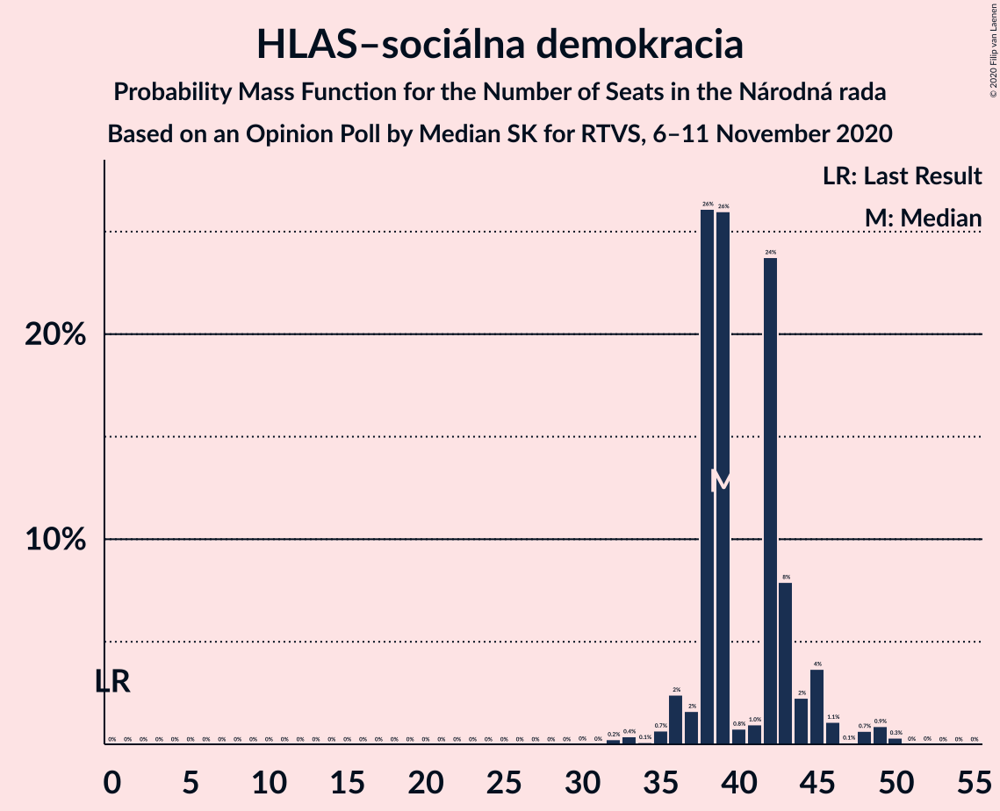
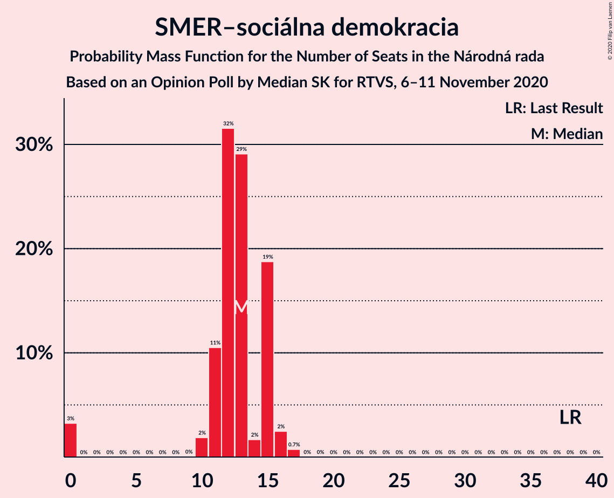
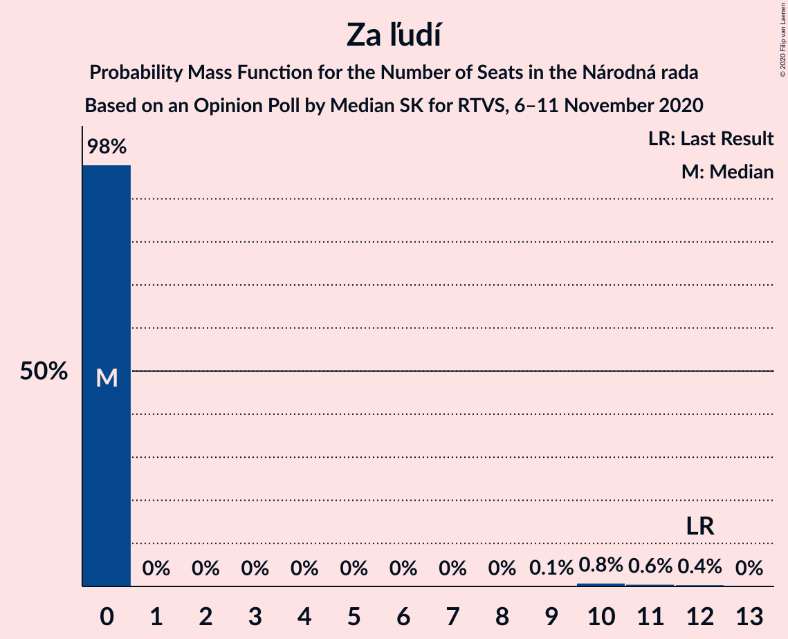
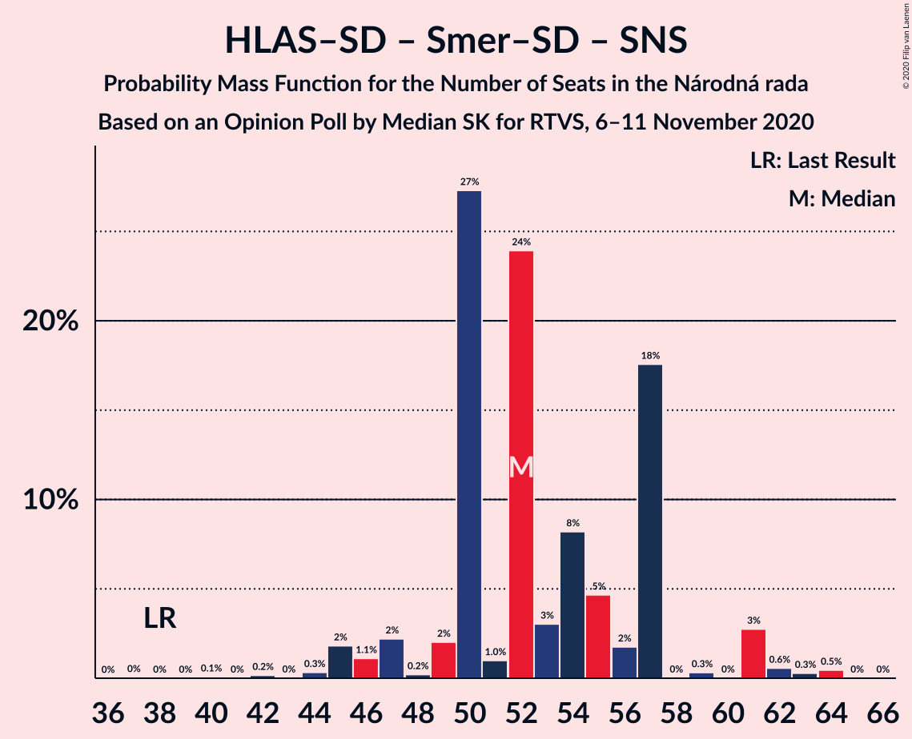
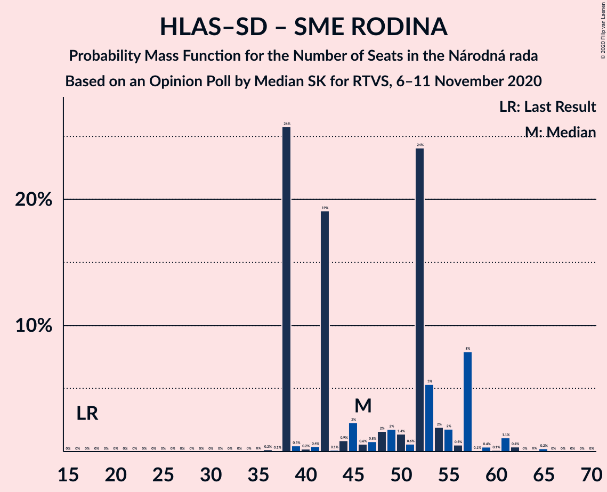
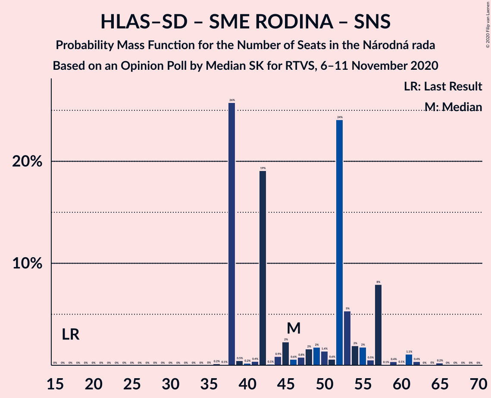
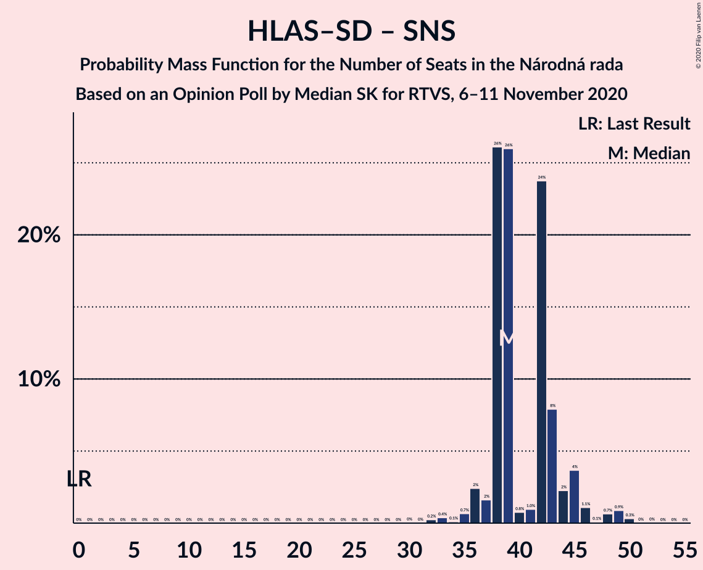
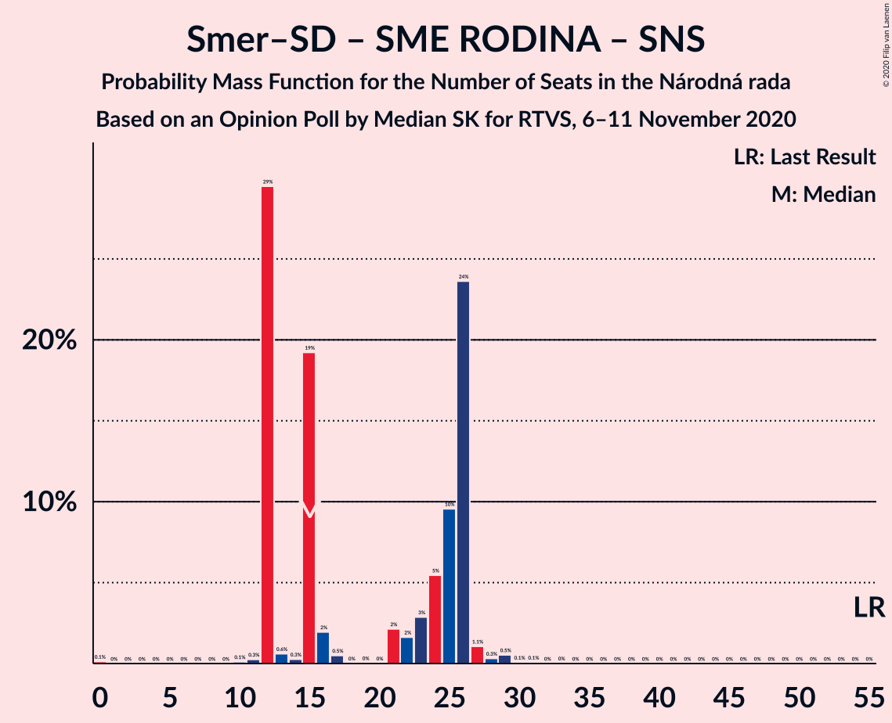

# Opinion Poll by Median SK for RTVS, 6–11 November 2020

<a href="#voting-intentions">Voting Intentions</a> | <a href="#seats">Seats</a> | <a href="#coalitions">Coalitions</a> | <a href="#technical-information">Technical Information</a>

## Voting Intentions

### Confidence Intervals

| Party | Last Result | Poll Result | 80% Confidence Interval | 90% Confidence Interval | 95% Confidence Interval | 99% Confidence Interval |
|:-----:|:-----------:|:-----------:|:-----------------------:|:-----------------------:|:-----------------------:|:-----------------------:|
| HLAS–sociálna demokracia | 0.0% | 20.3% | 18.8–22.0% |18.4–22.5% |18.0–22.9% |17.3–23.7% |
| OBYČAJNÍ ĽUDIA a nezávislé osobnosti | 25.0% | 16.6% | 15.2–18.2% |14.8–18.6% |14.4–19.0% |13.8–19.8% |
| Sloboda a Solidarita | 6.2% | 12.5% | 11.2–13.9% |10.9–14.3% |10.6–14.7% |10.0–15.4% |
| Progresívne Slovensko | 7.0% | 7.3% | 6.3–8.4% |6.1–8.7% |5.8–9.0% |5.4–9.6% |
| Kotleba–Ľudová strana Naše Slovensko | 8.0% | 6.9% | 6.0–8.0% |5.7–8.3% |5.5–8.6% |5.1–9.2% |
| SMER–sociálna demokracia | 18.3% | 6.3% | 5.4–7.4% |5.2–7.7% |5.0–8.0% |4.6–8.5% |
| SME RODINA | 8.2% | 5.8% | 5.0–6.8% |4.7–7.1% |4.5–7.4% |4.1–7.9% |
| Kresťanskodemokratické hnutie | 4.6% | 4.4% | 3.7–5.4% |3.5–5.6% |3.3–5.9% |3.0–6.4% |
| Za ľudí | 5.8% | 4.1% | 3.4–5.0% |3.2–5.3% |3.1–5.5% |2.8–6.0% |
| Strana maďarskej koalície–Magyar Koalíció Pártja | 3.9% | 3.2% | 2.6–4.1% |2.5–4.3% |2.3–4.5% |2.1–5.0% |
| Slovenská národná strana | 3.2% | 2.4% | 1.8–3.1% |1.7–3.3% |1.6–3.5% |1.4–3.9% |
| Dobrá voľba | 3.1% | 2.3% | 1.8–3.0% |1.6–3.2% |1.5–3.4% |1.3–3.7% |
| MOST–HÍD | 2.0% | 1.6% | 1.2–2.2% |1.1–2.4% |1.0–2.5% |0.8–2.9% |
| SPOLU–Občianska Demokracia | 7.0% | 1.5% | 1.1–2.1% |1.0–2.3% |0.9–2.4% |0.7–2.8% |
| VLASŤ | 2.9% | 1.5% | 1.1–2.1% |1.0–2.3% |0.9–2.4% |0.7–2.8% |

*Note:* The poll result column reflects the actual value used in the calculations. Published results may vary slightly, and in addition be rounded to fewer digits.

## Seats

### Confidence Intervals

| Party | Last Result | Median | 80% Confidence Interval | 90% Confidence Interval | 95% Confidence Interval | 99% Confidence Interval |
|:-----:|:-----------:|:------:|:-----------------------:|:-----------------------:|:-----------------------:|:-----------------------:|
| <a href="#hlas–sociálna-demokracia">HLAS–sociálna demokracia</a> | 0 | 39 | 38–43 |37–45 |36–46 |33–49 |
| <a href="#obyčajní-ľudia-a-nezávislé-osobnosti">OBYČAJNÍ ĽUDIA a nezávislé osobnosti</a> | 53 | 32 | 32–40 |30–40 |28–40 |26–40 |
| <a href="#sloboda-a-solidarita">Sloboda a Solidarita</a> | 13 | 26 | 22–26 |21–28 |20–28 |19–29 |
| <a href="#progresívne-slovensko">Progresívne Slovensko</a> | 0 | 14 | 13–19 |13–19 |12–19 |10–19 |
| <a href="#kotleba–ľudová-strana-naše-slovensko">Kotleba–Ľudová strana Naše Slovensko</a> | 17 | 14 | 12–15 |11–16 |11–17 |10–17 |
| <a href="#smer–sociálna-demokracia">SMER–sociálna demokracia</a> | 38 | 13 | 11–15 |10–15 |0–16 |0–17 |
| <a href="#sme-rodina">SME RODINA</a> | 17 | 10 | 0–14 |0–14 |0–14 |0–16 |
| <a href="#kresťanskodemokratické-hnutie">Kresťanskodemokratické hnutie</a> | 0 | 0 | 0–10 |0–10 |0–10 |0–12 |
| <a href="#za-ľudí">Za ľudí</a> | 12 | 0 | 0 |0 |0 |0–11 |
| <a href="#strana-maďarskej-koalície–magyar-koalíció-pártja">Strana maďarskej koalície–Magyar Koalíció Pártja</a> | 0 | 0 | 0 |0 |0 |0–10 |
| <a href="#slovenská-národná-strana">Slovenská národná strana</a> | 0 | 0 | 0 |0 |0 |0 |
| <a href="#dobrá-voľba">Dobrá voľba</a> | 0 | 0 | 0 |0 |0 |0 |
| <a href="#most–híd">MOST–HÍD</a> | 0 | 0 | 0 |0 |0 |0 |
| <a href="#spolu–občianska-demokracia">SPOLU–Občianska Demokracia</a> | 0 | 0 | 0 |0 |0 |0 |
| <a href="#vlasť">VLASŤ</a> | 0 | 0 | 0 |0 |0 |0 |

### HLAS–sociálna demokracia

*For a full overview of the results for this party, see the [HLAS–sociálna demokracia](party-hlas–sociálnademokracia.html) page.*

| Number of Seats | Probability | Accumulated | Special Marks |
|:---------------:|:-----------:|:-----------:|:-------------:|
| 0 | 0% | 100% | Last Result |
| 1 | 0% | 100% |  |
| 2 | 0% | 100% |  |
| 3 | 0% | 100% |  |
| 4 | 0% | 100% |  |
| 5 | 0% | 100% |  |
| 6 | 0% | 100% |  |
| 7 | 0% | 100% |  |
| 8 | 0% | 100% |  |
| 9 | 0% | 100% |  |
| 10 | 0% | 100% |  |
| 11 | 0% | 100% |  |
| 12 | 0% | 100% |  |
| 13 | 0% | 100% |  |
| 14 | 0% | 100% |  |
| 15 | 0% | 100% |  |
| 16 | 0% | 100% |  |
| 17 | 0% | 100% |  |
| 18 | 0% | 100% |  |
| 19 | 0% | 100% |  |
| 20 | 0% | 100% |  |
| 21 | 0% | 100% |  |
| 22 | 0% | 100% |  |
| 23 | 0% | 100% |  |
| 24 | 0% | 100% |  |
| 25 | 0% | 100% |  |
| 26 | 0% | 100% |  |
| 27 | 0% | 100% |  |
| 28 | 0% | 100% |  |
| 29 | 0% | 100% |  |
| 30 | 0% | 100% |  |
| 31 | 0% | 100% |  |
| 32 | 0.2% | 99.9% |  |
| 33 | 0.4% | 99.7% |  |
| 34 | 0.1% | 99.3% |  |
| 35 | 0.7% | 99.2% |  |
| 36 | 2% | 98.5% |  |
| 37 | 2% | 96% |  |
| 38 | 26% | 95% |  |
| 39 | 26% | 68% | Median |
| 40 | 0.8% | 42% |  |
| 41 | 1.0% | 42% |  |
| 42 | 24% | 41% |  |
| 43 | 8% | 17% |  |
| 44 | 2% | 9% |  |
| 45 | 4% | 7% |  |
| 46 | 1.1% | 3% |  |
| 47 | 0.1% | 2% |  |
| 48 | 0.7% | 2% |  |
| 49 | 0.9% | 1.3% |  |
| 50 | 0.3% | 0.4% |  |
| 51 | 0% | 0.1% |  |
| 52 | 0% | 0% |  |

### OBYČAJNÍ ĽUDIA a nezávislé osobnosti

*For a full overview of the results for this party, see the [OBYČAJNÍ ĽUDIA a nezávislé osobnosti](party-obyčajníľudiaanezávisléosobnosti.html) page.*

| Number of Seats | Probability | Accumulated | Special Marks |
|:---------------:|:-----------:|:-----------:|:-------------:|
| 24 | 0.2% | 100% |  |
| 25 | 0% | 99.8% |  |
| 26 | 0.7% | 99.8% |  |
| 27 | 0.7% | 99.1% |  |
| 28 | 0.9% | 98% |  |
| 29 | 2% | 97% |  |
| 30 | 1.0% | 95% |  |
| 31 | 3% | 94% |  |
| 32 | 54% | 91% | Median |
| 33 | 8% | 37% |  |
| 34 | 2% | 30% |  |
| 35 | 6% | 27% |  |
| 36 | 2% | 21% |  |
| 37 | 1.0% | 19% |  |
| 38 | 0.2% | 18% |  |
| 39 | 0.7% | 18% |  |
| 40 | 17% | 18% |  |
| 41 | 0% | 0.1% |  |
| 42 | 0% | 0.1% |  |
| 43 | 0.1% | 0.1% |  |
| 44 | 0% | 0% |  |
| 45 | 0% | 0% |  |
| 46 | 0% | 0% |  |
| 47 | 0% | 0% |  |
| 48 | 0% | 0% |  |
| 49 | 0% | 0% |  |
| 50 | 0% | 0% |  |
| 51 | 0% | 0% |  |
| 52 | 0% | 0% |  |
| 53 | 0% | 0% | Last Result |

### Sloboda a Solidarita

*For a full overview of the results for this party, see the [Sloboda a Solidarita](party-slobodaasolidarita.html) page.*

| Number of Seats | Probability | Accumulated | Special Marks |
|:---------------:|:-----------:|:-----------:|:-------------:|
| 13 | 0% | 100% | Last Result |
| 14 | 0% | 100% |  |
| 15 | 0% | 100% |  |
| 16 | 0% | 100% |  |
| 17 | 0% | 100% |  |
| 18 | 0.3% | 100% |  |
| 19 | 1.4% | 99.6% |  |
| 20 | 2% | 98% |  |
| 21 | 5% | 96% |  |
| 22 | 3% | 91% |  |
| 23 | 8% | 89% |  |
| 24 | 19% | 80% |  |
| 25 | 3% | 61% |  |
| 26 | 51% | 59% | Median |
| 27 | 1.3% | 7% |  |
| 28 | 6% | 6% |  |
| 29 | 0.3% | 0.5% |  |
| 30 | 0.1% | 0.2% |  |
| 31 | 0% | 0.1% |  |
| 32 | 0% | 0.1% |  |
| 33 | 0% | 0% |  |

### Progresívne Slovensko

*For a full overview of the results for this party, see the [Progresívne Slovensko](party-progresívneslovensko.html) page.*

| Number of Seats | Probability | Accumulated | Special Marks |
|:---------------:|:-----------:|:-----------:|:-------------:|
| 0 | 0% | 100% | Last Result |
| 1 | 0% | 100% |  |
| 2 | 0% | 100% |  |
| 3 | 0% | 100% |  |
| 4 | 0% | 100% |  |
| 5 | 0% | 100% |  |
| 6 | 0% | 100% |  |
| 7 | 0% | 100% |  |
| 8 | 0% | 100% |  |
| 9 | 0% | 100% |  |
| 10 | 0.7% | 100% |  |
| 11 | 2% | 99.3% |  |
| 12 | 3% | 98% |  |
| 13 | 26% | 95% |  |
| 14 | 20% | 70% | Median |
| 15 | 14% | 49% |  |
| 16 | 3% | 35% |  |
| 17 | 5% | 32% |  |
| 18 | 0.4% | 27% |  |
| 19 | 27% | 27% |  |
| 20 | 0.1% | 0.2% |  |
| 21 | 0% | 0.1% |  |
| 22 | 0.1% | 0.1% |  |
| 23 | 0% | 0% |  |

### Kotleba–Ľudová strana Naše Slovensko

*For a full overview of the results for this party, see the [Kotleba–Ľudová strana Naše Slovensko](party-kotleba–ľudovástrananašeslovensko.html) page.*

| Number of Seats | Probability | Accumulated | Special Marks |
|:---------------:|:-----------:|:-----------:|:-------------:|
| 0 | 0.3% | 100% |  |
| 1 | 0% | 99.7% |  |
| 2 | 0% | 99.7% |  |
| 3 | 0% | 99.7% |  |
| 4 | 0% | 99.7% |  |
| 5 | 0% | 99.7% |  |
| 6 | 0% | 99.7% |  |
| 7 | 0% | 99.7% |  |
| 8 | 0% | 99.7% |  |
| 9 | 0% | 99.7% |  |
| 10 | 0.5% | 99.7% |  |
| 11 | 7% | 99.2% |  |
| 12 | 4% | 92% |  |
| 13 | 34% | 88% |  |
| 14 | 27% | 54% | Median |
| 15 | 21% | 27% |  |
| 16 | 1.2% | 6% |  |
| 17 | 4% | 5% | Last Result |
| 18 | 0.1% | 0.3% |  |
| 19 | 0.1% | 0.1% |  |
| 20 | 0.1% | 0.1% |  |
| 21 | 0% | 0% |  |

### SMER–sociálna demokracia

*For a full overview of the results for this party, see the [SMER–sociálna demokracia](party-smer–sociálnademokracia.html) page.*

| Number of Seats | Probability | Accumulated | Special Marks |
|:---------------:|:-----------:|:-----------:|:-------------:|
| 0 | 3% | 100% |  |
| 1 | 0% | 97% |  |
| 2 | 0% | 97% |  |
| 3 | 0% | 97% |  |
| 4 | 0% | 97% |  |
| 5 | 0% | 97% |  |
| 6 | 0% | 97% |  |
| 7 | 0% | 97% |  |
| 8 | 0% | 97% |  |
| 9 | 0% | 97% |  |
| 10 | 2% | 97% |  |
| 11 | 11% | 95% |  |
| 12 | 32% | 84% |  |
| 13 | 29% | 53% | Median |
| 14 | 2% | 24% |  |
| 15 | 19% | 22% |  |
| 16 | 2% | 3% |  |
| 17 | 0.7% | 0.8% |  |
| 18 | 0% | 0% |  |
| 19 | 0% | 0% |  |
| 20 | 0% | 0% |  |
| 21 | 0% | 0% |  |
| 22 | 0% | 0% |  |
| 23 | 0% | 0% |  |
| 24 | 0% | 0% |  |
| 25 | 0% | 0% |  |
| 26 | 0% | 0% |  |
| 27 | 0% | 0% |  |
| 28 | 0% | 0% |  |
| 29 | 0% | 0% |  |
| 30 | 0% | 0% |  |
| 31 | 0% | 0% |  |
| 32 | 0% | 0% |  |
| 33 | 0% | 0% |  |
| 34 | 0% | 0% |  |
| 35 | 0% | 0% |  |
| 36 | 0% | 0% |  |
| 37 | 0% | 0% |  |
| 38 | 0% | 0% | Last Result |

### SME RODINA

*For a full overview of the results for this party, see the [SME RODINA](party-smerodina.html) page.*

| Number of Seats | Probability | Accumulated | Special Marks |
|:---------------:|:-----------:|:-----------:|:-------------:|
| 0 | 49% | 100% |  |
| 1 | 0% | 51% |  |
| 2 | 0% | 51% |  |
| 3 | 0% | 51% |  |
| 4 | 0% | 51% |  |
| 5 | 0% | 51% |  |
| 6 | 0% | 51% |  |
| 7 | 0% | 51% |  |
| 8 | 0% | 51% |  |
| 9 | 0% | 51% |  |
| 10 | 2% | 51% | Median |
| 11 | 11% | 49% |  |
| 12 | 3% | 38% |  |
| 13 | 25% | 35% |  |
| 14 | 8% | 10% |  |
| 15 | 1.5% | 2% |  |
| 16 | 0.4% | 0.6% |  |
| 17 | 0.1% | 0.2% | Last Result |
| 18 | 0% | 0.1% |  |
| 19 | 0% | 0% |  |

### Kresťanskodemokratické hnutie

*For a full overview of the results for this party, see the [Kresťanskodemokratické hnutie](party-kresťanskodemokratickéhnutie.html) page.*

| Number of Seats | Probability | Accumulated | Special Marks |
|:---------------:|:-----------:|:-----------:|:-------------:|
| 0 | 70% | 100% | Last Result, Median |
| 1 | 0% | 30% |  |
| 2 | 0% | 30% |  |
| 3 | 0% | 30% |  |
| 4 | 0% | 30% |  |
| 5 | 0% | 30% |  |
| 6 | 0% | 30% |  |
| 7 | 0% | 30% |  |
| 8 | 0% | 30% |  |
| 9 | 0.4% | 30% |  |
| 10 | 28% | 30% |  |
| 11 | 1.0% | 2% |  |
| 12 | 0.5% | 0.6% |  |
| 13 | 0.1% | 0.1% |  |
| 14 | 0% | 0% |  |

### Za ľudí

*For a full overview of the results for this party, see the [Za ľudí](party-zaľudí.html) page.*

| Number of Seats | Probability | Accumulated | Special Marks |
|:---------------:|:-----------:|:-----------:|:-------------:|
| 0 | 98% | 100% | Median |
| 1 | 0% | 2% |  |
| 2 | 0% | 2% |  |
| 3 | 0% | 2% |  |
| 4 | 0% | 2% |  |
| 5 | 0% | 2% |  |
| 6 | 0% | 2% |  |
| 7 | 0% | 2% |  |
| 8 | 0% | 2% |  |
| 9 | 0.1% | 2% |  |
| 10 | 0.8% | 2% |  |
| 11 | 0.6% | 1.0% |  |
| 12 | 0.4% | 0.5% | Last Result |
| 13 | 0% | 0% |  |

### Strana maďarskej koalície–Magyar Koalíció Pártja

*For a full overview of the results for this party, see the [Strana maďarskej koalície–Magyar Koalíció Pártja](party-stranamaďarskejkoalície–magyarkoalíciópártja.html) page.*

| Number of Seats | Probability | Accumulated | Special Marks |
|:---------------:|:-----------:|:-----------:|:-------------:|
| 0 | 99.2% | 100% | Last Result, Median |
| 1 | 0% | 0.8% |  |
| 2 | 0% | 0.8% |  |
| 3 | 0% | 0.8% |  |
| 4 | 0% | 0.8% |  |
| 5 | 0% | 0.8% |  |
| 6 | 0% | 0.8% |  |
| 7 | 0% | 0.8% |  |
| 8 | 0% | 0.8% |  |
| 9 | 0.1% | 0.8% |  |
| 10 | 0.7% | 0.7% |  |
| 11 | 0% | 0% |  |

### Slovenská národná strana

*For a full overview of the results for this party, see the [Slovenská národná strana](party-slovenskánárodnástrana.html) page.*

| Number of Seats | Probability | Accumulated | Special Marks |
|:---------------:|:-----------:|:-----------:|:-------------:|
| 0 | 100% | 100% | Last Result, Median |

### Dobrá voľba

*For a full overview of the results for this party, see the [Dobrá voľba](party-dobrávoľba.html) page.*

| Number of Seats | Probability | Accumulated | Special Marks |
|:---------------:|:-----------:|:-----------:|:-------------:|
| 0 | 100% | 100% | Last Result, Median |

### MOST–HÍD

*For a full overview of the results for this party, see the [MOST–HÍD](party-most–híd.html) page.*

| Number of Seats | Probability | Accumulated | Special Marks |
|:---------------:|:-----------:|:-----------:|:-------------:|
| 0 | 100% | 100% | Last Result, Median |

### SPOLU–Občianska Demokracia

*For a full overview of the results for this party, see the [SPOLU–Občianska Demokracia](party-spolu–občianskademokracia.html) page.*

| Number of Seats | Probability | Accumulated | Special Marks |
|:---------------:|:-----------:|:-----------:|:-------------:|
| 0 | 100% | 100% | Last Result, Median |

### VLASŤ

*For a full overview of the results for this party, see the [VLASŤ](party-vlasť.html) page.*

| Number of Seats | Probability | Accumulated | Special Marks |
|:---------------:|:-----------:|:-----------:|:-------------:|
| 0 | 100% | 100% | Last Result, Median |

## Coalitions

### Confidence Intervals

| Coalition | Last Result | Median | Majority? | 80% Confidence Interval | 90% Confidence Interval | 95% Confidence Interval | 99% Confidence Interval |
|:---------:|:-----------:|:------:|:---------:|:-----------------------:|:-----------------------:|:-----------------------:|:-----------------------:|
| HLAS–sociálna demokracia – Kotleba–Ľudová strana Naše Slovensko – SMER–sociálna demokracia – SME RODINA – Slovenská národná strana | 72 | 73 | 44% | 63–79 | 63–79 | 63–83 | 63–85 |
| HLAS–sociálna demokracia – Kotleba–Ľudová strana Naše Slovensko – SME RODINA – Slovenská národná strana | 34 | 60 | 0.2% | 51–68 | 51–72 | 51–73 | 51–74 |
| HLAS–sociálna demokracia – SMER–sociálna demokracia – SME RODINA | 55 | 60 | 0.2% | 50–66 | 50–68 | 50–68 | 50–73 |
| HLAS–sociálna demokracia – SMER–sociálna demokracia – SME RODINA – Slovenská národná strana | 55 | 60 | 0.2% | 50–66 | 50–68 | 50–68 | 50–73 |
| HLAS–sociálna demokracia – SMER–sociálna demokracia – Slovenská národná strana – MOST–HÍD | 38 | 52 | 0% | 50–57 | 47–57 | 45–61 | 44–64 |
| HLAS–sociálna demokracia – SMER–sociálna demokracia – Slovenská národná strana | 38 | 52 | 0% | 50–57 | 47–57 | 45–61 | 44–64 |
| HLAS–sociálna demokracia – SME RODINA | 17 | 46 | 0% | 38–57 | 38–57 | 38–57 | 38–62 |
| HLAS–sociálna demokracia – SME RODINA – Slovenská národná strana | 17 | 46 | 0% | 38–57 | 38–57 | 38–57 | 38–62 |
| HLAS–sociálna demokracia – Slovenská národná strana – MOST–HÍD | 0 | 39 | 0% | 38–43 | 37–45 | 36–46 | 33–49 |
| HLAS–sociálna demokracia – Slovenská národná strana | 0 | 39 | 0% | 38–43 | 37–45 | 36–46 | 33–49 |
| Kotleba–Ľudová strana Naše Slovensko – SMER–sociálna demokracia – SME RODINA – Slovenská národná strana | 72 | 30 | 0% | 25–40 | 25–40 | 25–40 | 25–43 |
| SMER–sociálna demokracia – SME RODINA | 55 | 15 | 0% | 12–26 | 12–26 | 12–26 | 12–29 |
| SMER–sociálna demokracia – SME RODINA – Slovenská národná strana | 55 | 15 | 0% | 12–26 | 12–26 | 12–26 | 12–29 |
| SMER–sociálna demokracia – Slovenská národná strana – MOST–HÍD | 38 | 13 | 0% | 11–15 | 10–15 | 0–16 | 0–17 |
| SMER–sociálna demokracia | 38 | 13 | 0% | 11–15 | 10–15 | 0–16 | 0–17 |
| SMER–sociálna demokracia – Slovenská národná strana | 38 | 13 | 0% | 11–15 | 10–15 | 0–16 | 0–17 |

### HLAS–sociálna demokracia – Kotleba–Ľudová strana Naše Slovensko – SMER–sociálna demokracia – SME RODINA – Slovenská národná strana

| Number of Seats | Probability | Accumulated | Special Marks |
|:---------------:|:-----------:|:-----------:|:-------------:|
| 54 | 0.1% | 100% |  |
| 55 | 0% | 99.9% |  |
| 56 | 0% | 99.9% |  |
| 57 | 0% | 99.9% |  |
| 58 | 0% | 99.9% |  |
| 59 | 0% | 99.9% |  |
| 60 | 0.1% | 99.9% |  |
| 61 | 0% | 99.9% |  |
| 62 | 0% | 99.8% |  |
| 63 | 26% | 99.8% |  |
| 64 | 0.1% | 74% |  |
| 65 | 0.2% | 74% |  |
| 66 | 0.4% | 74% |  |
| 67 | 0.2% | 73% |  |
| 68 | 0.6% | 73% |  |
| 69 | 2% | 72% |  |
| 70 | 0.8% | 71% |  |
| 71 | 0.8% | 70% |  |
| 72 | 18% | 69% | Last Result |
| 73 | 2% | 52% |  |
| 74 | 4% | 50% |  |
| 75 | 2% | 45% |  |
| 76 | 1.4% | 44% | Median, Majority |
| 77 | 1.0% | 42% |  |
| 78 | 2% | 41% |  |
| 79 | 35% | 39% |  |
| 80 | 0.2% | 4% |  |
| 81 | 0.9% | 4% |  |
| 82 | 0.3% | 3% |  |
| 83 | 0.5% | 3% |  |
| 84 | 1.4% | 2% |  |
| 85 | 0.4% | 0.8% |  |
| 86 | 0% | 0.4% |  |
| 87 | 0.3% | 0.4% |  |
| 88 | 0.1% | 0.1% |  |
| 89 | 0% | 0% |  |

### HLAS–sociálna demokracia – Kotleba–Ľudová strana Naše Slovensko – SME RODINA – Slovenská národná strana

| Number of Seats | Probability | Accumulated | Special Marks |
|:---------------:|:-----------:|:-----------:|:-------------:|
| 34 | 0% | 100% | Last Result |
| 35 | 0% | 100% |  |
| 36 | 0% | 100% |  |
| 37 | 0% | 100% |  |
| 38 | 0% | 100% |  |
| 39 | 0% | 100% |  |
| 40 | 0% | 100% |  |
| 41 | 0% | 100% |  |
| 42 | 0% | 100% |  |
| 43 | 0% | 100% |  |
| 44 | 0% | 100% |  |
| 45 | 0% | 100% |  |
| 46 | 0% | 100% |  |
| 47 | 0% | 100% |  |
| 48 | 0% | 100% |  |
| 49 | 0% | 99.9% |  |
| 50 | 0% | 99.9% |  |
| 51 | 26% | 99.9% |  |
| 52 | 0% | 74% |  |
| 53 | 0.2% | 74% |  |
| 54 | 0.5% | 74% |  |
| 55 | 0.1% | 73% |  |
| 56 | 1.0% | 73% |  |
| 57 | 19% | 72% |  |
| 58 | 2% | 53% |  |
| 59 | 0.6% | 51% |  |
| 60 | 1.3% | 50% |  |
| 61 | 0.5% | 49% |  |
| 62 | 0.9% | 48% |  |
| 63 | 2% | 47% | Median |
| 64 | 0.3% | 46% |  |
| 65 | 0.9% | 45% |  |
| 66 | 29% | 45% |  |
| 67 | 0.7% | 15% |  |
| 68 | 9% | 14% |  |
| 69 | 0% | 5% |  |
| 70 | 0.1% | 5% |  |
| 71 | 0.3% | 5% |  |
| 72 | 2% | 5% |  |
| 73 | 1.3% | 4% |  |
| 74 | 2% | 2% |  |
| 75 | 0% | 0.2% |  |
| 76 | 0.1% | 0.2% | Majority |
| 77 | 0.1% | 0.1% |  |
| 78 | 0% | 0% |  |

### HLAS–sociálna demokracia – SMER–sociálna demokracia – SME RODINA

| Number of Seats | Probability | Accumulated | Special Marks |
|:---------------:|:-----------:|:-----------:|:-------------:|
| 40 | 0.1% | 100% |  |
| 41 | 0% | 99.9% |  |
| 42 | 0% | 99.9% |  |
| 43 | 0% | 99.9% |  |
| 44 | 0% | 99.9% |  |
| 45 | 0% | 99.9% |  |
| 46 | 0% | 99.9% |  |
| 47 | 0% | 99.9% |  |
| 48 | 0.1% | 99.9% |  |
| 49 | 0.2% | 99.8% |  |
| 50 | 26% | 99.7% |  |
| 51 | 0.6% | 74% |  |
| 52 | 0.3% | 73% |  |
| 53 | 0.1% | 73% |  |
| 54 | 2% | 73% |  |
| 55 | 0.2% | 71% | Last Result |
| 56 | 0.1% | 71% |  |
| 57 | 20% | 71% |  |
| 58 | 0.5% | 51% |  |
| 59 | 0.2% | 50% |  |
| 60 | 2% | 50% |  |
| 61 | 5% | 48% |  |
| 62 | 0.6% | 43% | Median |
| 63 | 0.7% | 43% |  |
| 64 | 4% | 42% |  |
| 65 | 24% | 38% |  |
| 66 | 5% | 14% |  |
| 67 | 2% | 10% |  |
| 68 | 7% | 8% |  |
| 69 | 0.3% | 2% |  |
| 70 | 0.2% | 1.3% |  |
| 71 | 0.1% | 1.1% |  |
| 72 | 0.1% | 1.0% |  |
| 73 | 0.6% | 0.9% |  |
| 74 | 0% | 0.3% |  |
| 75 | 0% | 0.3% |  |
| 76 | 0% | 0.2% | Majority |
| 77 | 0% | 0.2% |  |
| 78 | 0.2% | 0.2% |  |
| 79 | 0% | 0% |  |

### HLAS–sociálna demokracia – SMER–sociálna demokracia – SME RODINA – Slovenská národná strana

| Number of Seats | Probability | Accumulated | Special Marks |
|:---------------:|:-----------:|:-----------:|:-------------:|
| 40 | 0.1% | 100% |  |
| 41 | 0% | 99.9% |  |
| 42 | 0% | 99.9% |  |
| 43 | 0% | 99.9% |  |
| 44 | 0% | 99.9% |  |
| 45 | 0% | 99.9% |  |
| 46 | 0% | 99.9% |  |
| 47 | 0% | 99.9% |  |
| 48 | 0.1% | 99.9% |  |
| 49 | 0.2% | 99.8% |  |
| 50 | 26% | 99.7% |  |
| 51 | 0.6% | 74% |  |
| 52 | 0.3% | 73% |  |
| 53 | 0.1% | 73% |  |
| 54 | 2% | 73% |  |
| 55 | 0.2% | 71% | Last Result |
| 56 | 0.1% | 71% |  |
| 57 | 20% | 71% |  |
| 58 | 0.5% | 51% |  |
| 59 | 0.2% | 50% |  |
| 60 | 2% | 50% |  |
| 61 | 5% | 48% |  |
| 62 | 0.6% | 43% | Median |
| 63 | 0.7% | 43% |  |
| 64 | 4% | 42% |  |
| 65 | 24% | 38% |  |
| 66 | 5% | 14% |  |
| 67 | 2% | 10% |  |
| 68 | 7% | 8% |  |
| 69 | 0.3% | 2% |  |
| 70 | 0.2% | 1.3% |  |
| 71 | 0.1% | 1.1% |  |
| 72 | 0.1% | 1.0% |  |
| 73 | 0.6% | 0.9% |  |
| 74 | 0% | 0.3% |  |
| 75 | 0% | 0.3% |  |
| 76 | 0% | 0.2% | Majority |
| 77 | 0% | 0.2% |  |
| 78 | 0.2% | 0.2% |  |
| 79 | 0% | 0% |  |

### HLAS–sociálna demokracia – SMER–sociálna demokracia – Slovenská národná strana – MOST–HÍD

| Number of Seats | Probability | Accumulated | Special Marks |
|:---------------:|:-----------:|:-----------:|:-------------:|
| 37 | 0% | 100% |  |
| 38 | 0% | 99.9% | Last Result |
| 39 | 0% | 99.9% |  |
| 40 | 0.1% | 99.9% |  |
| 41 | 0% | 99.8% |  |
| 42 | 0.2% | 99.8% |  |
| 43 | 0% | 99.7% |  |
| 44 | 0.3% | 99.6% |  |
| 45 | 2% | 99.3% |  |
| 46 | 1.1% | 97% |  |
| 47 | 2% | 96% |  |
| 48 | 0.2% | 94% |  |
| 49 | 2% | 94% |  |
| 50 | 27% | 92% |  |
| 51 | 1.0% | 65% |  |
| 52 | 24% | 64% | Median |
| 53 | 3% | 40% |  |
| 54 | 8% | 37% |  |
| 55 | 5% | 28% |  |
| 56 | 2% | 24% |  |
| 57 | 18% | 22% |  |
| 58 | 0% | 4% |  |
| 59 | 0.3% | 4% |  |
| 60 | 0% | 4% |  |
| 61 | 3% | 4% |  |
| 62 | 0.6% | 1.4% |  |
| 63 | 0.3% | 0.8% |  |
| 64 | 0.5% | 0.5% |  |
| 65 | 0% | 0.1% |  |
| 66 | 0% | 0% |  |

### HLAS–sociálna demokracia – SMER–sociálna demokracia – Slovenská národná strana

| Number of Seats | Probability | Accumulated | Special Marks |
|:---------------:|:-----------:|:-----------:|:-------------:|
| 37 | 0% | 100% |  |
| 38 | 0% | 99.9% | Last Result |
| 39 | 0% | 99.9% |  |
| 40 | 0.1% | 99.9% |  |
| 41 | 0% | 99.8% |  |
| 42 | 0.2% | 99.8% |  |
| 43 | 0% | 99.7% |  |
| 44 | 0.3% | 99.6% |  |
| 45 | 2% | 99.3% |  |
| 46 | 1.1% | 97% |  |
| 47 | 2% | 96% |  |
| 48 | 0.2% | 94% |  |
| 49 | 2% | 94% |  |
| 50 | 27% | 92% |  |
| 51 | 1.0% | 65% |  |
| 52 | 24% | 64% | Median |
| 53 | 3% | 40% |  |
| 54 | 8% | 37% |  |
| 55 | 5% | 28% |  |
| 56 | 2% | 24% |  |
| 57 | 18% | 22% |  |
| 58 | 0% | 4% |  |
| 59 | 0.3% | 4% |  |
| 60 | 0% | 4% |  |
| 61 | 3% | 4% |  |
| 62 | 0.6% | 1.4% |  |
| 63 | 0.3% | 0.8% |  |
| 64 | 0.5% | 0.5% |  |
| 65 | 0% | 0.1% |  |
| 66 | 0% | 0% |  |

### HLAS–sociálna demokracia – SME RODINA

| Number of Seats | Probability | Accumulated | Special Marks |
|:---------------:|:-----------:|:-----------:|:-------------:|
| 17 | 0% | 100% | Last Result |
| 18 | 0% | 100% |  |
| 19 | 0% | 100% |  |
| 20 | 0% | 100% |  |
| 21 | 0% | 100% |  |
| 22 | 0% | 100% |  |
| 23 | 0% | 100% |  |
| 24 | 0% | 100% |  |
| 25 | 0% | 100% |  |
| 26 | 0% | 100% |  |
| 27 | 0% | 100% |  |
| 28 | 0% | 100% |  |
| 29 | 0% | 100% |  |
| 30 | 0% | 100% |  |
| 31 | 0% | 100% |  |
| 32 | 0% | 100% |  |
| 33 | 0% | 100% |  |
| 34 | 0% | 100% |  |
| 35 | 0% | 100% |  |
| 36 | 0.2% | 100% |  |
| 37 | 0.1% | 99.8% |  |
| 38 | 26% | 99.7% |  |
| 39 | 0.5% | 74% |  |
| 40 | 0.2% | 74% |  |
| 41 | 0.4% | 73% |  |
| 42 | 19% | 73% |  |
| 43 | 0.1% | 54% |  |
| 44 | 0.9% | 54% |  |
| 45 | 2% | 53% |  |
| 46 | 0.6% | 51% |  |
| 47 | 0.8% | 50% |  |
| 48 | 2% | 49% |  |
| 49 | 2% | 48% | Median |
| 50 | 1.4% | 46% |  |
| 51 | 0.6% | 44% |  |
| 52 | 24% | 44% |  |
| 53 | 5% | 20% |  |
| 54 | 2% | 14% |  |
| 55 | 2% | 12% |  |
| 56 | 0.5% | 11% |  |
| 57 | 8% | 10% |  |
| 58 | 0.1% | 2% |  |
| 59 | 0.4% | 2% |  |
| 60 | 0.1% | 2% |  |
| 61 | 1.1% | 2% |  |
| 62 | 0.4% | 0.6% |  |
| 63 | 0% | 0.3% |  |
| 64 | 0% | 0.2% |  |
| 65 | 0.2% | 0.2% |  |
| 66 | 0% | 0% |  |

### HLAS–sociálna demokracia – SME RODINA – Slovenská národná strana

| Number of Seats | Probability | Accumulated | Special Marks |
|:---------------:|:-----------:|:-----------:|:-------------:|
| 17 | 0% | 100% | Last Result |
| 18 | 0% | 100% |  |
| 19 | 0% | 100% |  |
| 20 | 0% | 100% |  |
| 21 | 0% | 100% |  |
| 22 | 0% | 100% |  |
| 23 | 0% | 100% |  |
| 24 | 0% | 100% |  |
| 25 | 0% | 100% |  |
| 26 | 0% | 100% |  |
| 27 | 0% | 100% |  |
| 28 | 0% | 100% |  |
| 29 | 0% | 100% |  |
| 30 | 0% | 100% |  |
| 31 | 0% | 100% |  |
| 32 | 0% | 100% |  |
| 33 | 0% | 100% |  |
| 34 | 0% | 100% |  |
| 35 | 0% | 100% |  |
| 36 | 0.2% | 100% |  |
| 37 | 0.1% | 99.8% |  |
| 38 | 26% | 99.7% |  |
| 39 | 0.5% | 74% |  |
| 40 | 0.2% | 74% |  |
| 41 | 0.4% | 73% |  |
| 42 | 19% | 73% |  |
| 43 | 0.1% | 54% |  |
| 44 | 0.9% | 54% |  |
| 45 | 2% | 53% |  |
| 46 | 0.6% | 51% |  |
| 47 | 0.8% | 50% |  |
| 48 | 2% | 49% |  |
| 49 | 2% | 48% | Median |
| 50 | 1.4% | 46% |  |
| 51 | 0.6% | 44% |  |
| 52 | 24% | 44% |  |
| 53 | 5% | 20% |  |
| 54 | 2% | 14% |  |
| 55 | 2% | 12% |  |
| 56 | 0.5% | 11% |  |
| 57 | 8% | 10% |  |
| 58 | 0.1% | 2% |  |
| 59 | 0.4% | 2% |  |
| 60 | 0.1% | 2% |  |
| 61 | 1.1% | 2% |  |
| 62 | 0.4% | 0.6% |  |
| 63 | 0% | 0.3% |  |
| 64 | 0% | 0.2% |  |
| 65 | 0.2% | 0.2% |  |
| 66 | 0% | 0% |  |

### HLAS–sociálna demokracia – Slovenská národná strana – MOST–HÍD

| Number of Seats | Probability | Accumulated | Special Marks |
|:---------------:|:-----------:|:-----------:|:-------------:|
| 0 | 0% | 100% | Last Result |
| 1 | 0% | 100% |  |
| 2 | 0% | 100% |  |
| 3 | 0% | 100% |  |
| 4 | 0% | 100% |  |
| 5 | 0% | 100% |  |
| 6 | 0% | 100% |  |
| 7 | 0% | 100% |  |
| 8 | 0% | 100% |  |
| 9 | 0% | 100% |  |
| 10 | 0% | 100% |  |
| 11 | 0% | 100% |  |
| 12 | 0% | 100% |  |
| 13 | 0% | 100% |  |
| 14 | 0% | 100% |  |
| 15 | 0% | 100% |  |
| 16 | 0% | 100% |  |
| 17 | 0% | 100% |  |
| 18 | 0% | 100% |  |
| 19 | 0% | 100% |  |
| 20 | 0% | 100% |  |
| 21 | 0% | 100% |  |
| 22 | 0% | 100% |  |
| 23 | 0% | 100% |  |
| 24 | 0% | 100% |  |
| 25 | 0% | 100% |  |
| 26 | 0% | 100% |  |
| 27 | 0% | 100% |  |
| 28 | 0% | 100% |  |
| 29 | 0% | 100% |  |
| 30 | 0% | 100% |  |
| 31 | 0% | 100% |  |
| 32 | 0.2% | 99.9% |  |
| 33 | 0.4% | 99.7% |  |
| 34 | 0.1% | 99.3% |  |
| 35 | 0.7% | 99.2% |  |
| 36 | 2% | 98.5% |  |
| 37 | 2% | 96% |  |
| 38 | 26% | 95% |  |
| 39 | 26% | 68% | Median |
| 40 | 0.8% | 42% |  |
| 41 | 1.0% | 42% |  |
| 42 | 24% | 41% |  |
| 43 | 8% | 17% |  |
| 44 | 2% | 9% |  |
| 45 | 4% | 7% |  |
| 46 | 1.1% | 3% |  |
| 47 | 0.1% | 2% |  |
| 48 | 0.7% | 2% |  |
| 49 | 0.9% | 1.3% |  |
| 50 | 0.3% | 0.4% |  |
| 51 | 0% | 0.1% |  |
| 52 | 0% | 0% |  |

### HLAS–sociálna demokracia – Slovenská národná strana

| Number of Seats | Probability | Accumulated | Special Marks |
|:---------------:|:-----------:|:-----------:|:-------------:|
| 0 | 0% | 100% | Last Result |
| 1 | 0% | 100% |  |
| 2 | 0% | 100% |  |
| 3 | 0% | 100% |  |
| 4 | 0% | 100% |  |
| 5 | 0% | 100% |  |
| 6 | 0% | 100% |  |
| 7 | 0% | 100% |  |
| 8 | 0% | 100% |  |
| 9 | 0% | 100% |  |
| 10 | 0% | 100% |  |
| 11 | 0% | 100% |  |
| 12 | 0% | 100% |  |
| 13 | 0% | 100% |  |
| 14 | 0% | 100% |  |
| 15 | 0% | 100% |  |
| 16 | 0% | 100% |  |
| 17 | 0% | 100% |  |
| 18 | 0% | 100% |  |
| 19 | 0% | 100% |  |
| 20 | 0% | 100% |  |
| 21 | 0% | 100% |  |
| 22 | 0% | 100% |  |
| 23 | 0% | 100% |  |
| 24 | 0% | 100% |  |
| 25 | 0% | 100% |  |
| 26 | 0% | 100% |  |
| 27 | 0% | 100% |  |
| 28 | 0% | 100% |  |
| 29 | 0% | 100% |  |
| 30 | 0% | 100% |  |
| 31 | 0% | 100% |  |
| 32 | 0.2% | 99.9% |  |
| 33 | 0.4% | 99.7% |  |
| 34 | 0.1% | 99.3% |  |
| 35 | 0.7% | 99.2% |  |
| 36 | 2% | 98.5% |  |
| 37 | 2% | 96% |  |
| 38 | 26% | 95% |  |
| 39 | 26% | 68% | Median |
| 40 | 0.8% | 42% |  |
| 41 | 1.0% | 42% |  |
| 42 | 24% | 41% |  |
| 43 | 8% | 17% |  |
| 44 | 2% | 9% |  |
| 45 | 4% | 7% |  |
| 46 | 1.1% | 3% |  |
| 47 | 0.1% | 2% |  |
| 48 | 0.7% | 2% |  |
| 49 | 0.9% | 1.3% |  |
| 50 | 0.3% | 0.4% |  |
| 51 | 0% | 0.1% |  |
| 52 | 0% | 0% |  |

### Kotleba–Ľudová strana Naše Slovensko – SMER–sociálna demokracia – SME RODINA – Slovenská národná strana

| Number of Seats | Probability | Accumulated | Special Marks |
|:---------------:|:-----------:|:-----------:|:-------------:|
| 14 | 0.1% | 100% |  |
| 15 | 0% | 99.9% |  |
| 16 | 0% | 99.9% |  |
| 17 | 0% | 99.8% |  |
| 18 | 0% | 99.8% |  |
| 19 | 0% | 99.8% |  |
| 20 | 0% | 99.8% |  |
| 21 | 0% | 99.8% |  |
| 22 | 0% | 99.8% |  |
| 23 | 0% | 99.8% |  |
| 24 | 0.1% | 99.8% |  |
| 25 | 26% | 99.7% |  |
| 26 | 0.2% | 74% |  |
| 27 | 3% | 73% |  |
| 28 | 0.5% | 71% |  |
| 29 | 5% | 70% |  |
| 30 | 18% | 66% |  |
| 31 | 0.1% | 48% |  |
| 32 | 0.5% | 48% |  |
| 33 | 0% | 47% |  |
| 34 | 1.0% | 47% |  |
| 35 | 3% | 46% |  |
| 36 | 7% | 43% |  |
| 37 | 5% | 36% | Median |
| 38 | 2% | 31% |  |
| 39 | 0.7% | 29% |  |
| 40 | 26% | 28% |  |
| 41 | 1.2% | 2% |  |
| 42 | 0.1% | 0.7% |  |
| 43 | 0.3% | 0.5% |  |
| 44 | 0.1% | 0.3% |  |
| 45 | 0% | 0.2% |  |
| 46 | 0.1% | 0.2% |  |
| 47 | 0% | 0% |  |
| 48 | 0% | 0% |  |
| 49 | 0% | 0% |  |
| 50 | 0% | 0% |  |
| 51 | 0% | 0% |  |
| 52 | 0% | 0% |  |
| 53 | 0% | 0% |  |
| 54 | 0% | 0% |  |
| 55 | 0% | 0% |  |
| 56 | 0% | 0% |  |
| 57 | 0% | 0% |  |
| 58 | 0% | 0% |  |
| 59 | 0% | 0% |  |
| 60 | 0% | 0% |  |
| 61 | 0% | 0% |  |
| 62 | 0% | 0% |  |
| 63 | 0% | 0% |  |
| 64 | 0% | 0% |  |
| 65 | 0% | 0% |  |
| 66 | 0% | 0% |  |
| 67 | 0% | 0% |  |
| 68 | 0% | 0% |  |
| 69 | 0% | 0% |  |
| 70 | 0% | 0% |  |
| 71 | 0% | 0% |  |
| 72 | 0% | 0% | Last Result |

### SMER–sociálna demokracia – SME RODINA

| Number of Seats | Probability | Accumulated | Special Marks |
|:---------------:|:-----------:|:-----------:|:-------------:|
| 0 | 0.1% | 100% |  |
| 1 | 0% | 99.9% |  |
| 2 | 0% | 99.9% |  |
| 3 | 0% | 99.9% |  |
| 4 | 0% | 99.9% |  |
| 5 | 0% | 99.9% |  |
| 6 | 0% | 99.9% |  |
| 7 | 0% | 99.9% |  |
| 8 | 0% | 99.9% |  |
| 9 | 0% | 99.9% |  |
| 10 | 0.1% | 99.9% |  |
| 11 | 0.3% | 99.8% |  |
| 12 | 29% | 99.5% |  |
| 13 | 0.6% | 70% |  |
| 14 | 0.3% | 69% |  |
| 15 | 19% | 69% |  |
| 16 | 2% | 50% |  |
| 17 | 0.5% | 48% |  |
| 18 | 0% | 47% |  |
| 19 | 0% | 47% |  |
| 20 | 0% | 47% |  |
| 21 | 2% | 47% |  |
| 22 | 2% | 45% |  |
| 23 | 3% | 44% | Median |
| 24 | 5% | 41% |  |
| 25 | 10% | 35% |  |
| 26 | 24% | 26% |  |
| 27 | 1.1% | 2% |  |
| 28 | 0.3% | 1.0% |  |
| 29 | 0.5% | 0.7% |  |
| 30 | 0.1% | 0.2% |  |
| 31 | 0.1% | 0.1% |  |
| 32 | 0% | 0% |  |
| 33 | 0% | 0% |  |
| 34 | 0% | 0% |  |
| 35 | 0% | 0% |  |
| 36 | 0% | 0% |  |
| 37 | 0% | 0% |  |
| 38 | 0% | 0% |  |
| 39 | 0% | 0% |  |
| 40 | 0% | 0% |  |
| 41 | 0% | 0% |  |
| 42 | 0% | 0% |  |
| 43 | 0% | 0% |  |
| 44 | 0% | 0% |  |
| 45 | 0% | 0% |  |
| 46 | 0% | 0% |  |
| 47 | 0% | 0% |  |
| 48 | 0% | 0% |  |
| 49 | 0% | 0% |  |
| 50 | 0% | 0% |  |
| 51 | 0% | 0% |  |
| 52 | 0% | 0% |  |
| 53 | 0% | 0% |  |
| 54 | 0% | 0% |  |
| 55 | 0% | 0% | Last Result |

### SMER–sociálna demokracia – SME RODINA – Slovenská národná strana

| Number of Seats | Probability | Accumulated | Special Marks |
|:---------------:|:-----------:|:-----------:|:-------------:|
| 0 | 0.1% | 100% |  |
| 1 | 0% | 99.9% |  |
| 2 | 0% | 99.9% |  |
| 3 | 0% | 99.9% |  |
| 4 | 0% | 99.9% |  |
| 5 | 0% | 99.9% |  |
| 6 | 0% | 99.9% |  |
| 7 | 0% | 99.9% |  |
| 8 | 0% | 99.9% |  |
| 9 | 0% | 99.9% |  |
| 10 | 0.1% | 99.9% |  |
| 11 | 0.3% | 99.8% |  |
| 12 | 29% | 99.5% |  |
| 13 | 0.6% | 70% |  |
| 14 | 0.3% | 69% |  |
| 15 | 19% | 69% |  |
| 16 | 2% | 50% |  |
| 17 | 0.5% | 48% |  |
| 18 | 0% | 47% |  |
| 19 | 0% | 47% |  |
| 20 | 0% | 47% |  |
| 21 | 2% | 47% |  |
| 22 | 2% | 45% |  |
| 23 | 3% | 44% | Median |
| 24 | 5% | 41% |  |
| 25 | 10% | 35% |  |
| 26 | 24% | 26% |  |
| 27 | 1.1% | 2% |  |
| 28 | 0.3% | 1.0% |  |
| 29 | 0.5% | 0.7% |  |
| 30 | 0.1% | 0.2% |  |
| 31 | 0.1% | 0.1% |  |
| 32 | 0% | 0% |  |
| 33 | 0% | 0% |  |
| 34 | 0% | 0% |  |
| 35 | 0% | 0% |  |
| 36 | 0% | 0% |  |
| 37 | 0% | 0% |  |
| 38 | 0% | 0% |  |
| 39 | 0% | 0% |  |
| 40 | 0% | 0% |  |
| 41 | 0% | 0% |  |
| 42 | 0% | 0% |  |
| 43 | 0% | 0% |  |
| 44 | 0% | 0% |  |
| 45 | 0% | 0% |  |
| 46 | 0% | 0% |  |
| 47 | 0% | 0% |  |
| 48 | 0% | 0% |  |
| 49 | 0% | 0% |  |
| 50 | 0% | 0% |  |
| 51 | 0% | 0% |  |
| 52 | 0% | 0% |  |
| 53 | 0% | 0% |  |
| 54 | 0% | 0% |  |
| 55 | 0% | 0% | Last Result |

### SMER–sociálna demokracia – Slovenská národná strana – MOST–HÍD

| Number of Seats | Probability | Accumulated | Special Marks |
|:---------------:|:-----------:|:-----------:|:-------------:|
| 0 | 3% | 100% |  |
| 1 | 0% | 97% |  |
| 2 | 0% | 97% |  |
| 3 | 0% | 97% |  |
| 4 | 0% | 97% |  |
| 5 | 0% | 97% |  |
| 6 | 0% | 97% |  |
| 7 | 0% | 97% |  |
| 8 | 0% | 97% |  |
| 9 | 0% | 97% |  |
| 10 | 2% | 97% |  |
| 11 | 11% | 95% |  |
| 12 | 32% | 84% |  |
| 13 | 29% | 53% | Median |
| 14 | 2% | 24% |  |
| 15 | 19% | 22% |  |
| 16 | 2% | 3% |  |
| 17 | 0.7% | 0.8% |  |
| 18 | 0% | 0% |  |
| 19 | 0% | 0% |  |
| 20 | 0% | 0% |  |
| 21 | 0% | 0% |  |
| 22 | 0% | 0% |  |
| 23 | 0% | 0% |  |
| 24 | 0% | 0% |  |
| 25 | 0% | 0% |  |
| 26 | 0% | 0% |  |
| 27 | 0% | 0% |  |
| 28 | 0% | 0% |  |
| 29 | 0% | 0% |  |
| 30 | 0% | 0% |  |
| 31 | 0% | 0% |  |
| 32 | 0% | 0% |  |
| 33 | 0% | 0% |  |
| 34 | 0% | 0% |  |
| 35 | 0% | 0% |  |
| 36 | 0% | 0% |  |
| 37 | 0% | 0% |  |
| 38 | 0% | 0% | Last Result |

### SMER–sociálna demokracia

| Number of Seats | Probability | Accumulated | Special Marks |
|:---------------:|:-----------:|:-----------:|:-------------:|
| 0 | 3% | 100% |  |
| 1 | 0% | 97% |  |
| 2 | 0% | 97% |  |
| 3 | 0% | 97% |  |
| 4 | 0% | 97% |  |
| 5 | 0% | 97% |  |
| 6 | 0% | 97% |  |
| 7 | 0% | 97% |  |
| 8 | 0% | 97% |  |
| 9 | 0% | 97% |  |
| 10 | 2% | 97% |  |
| 11 | 11% | 95% |  |
| 12 | 32% | 84% |  |
| 13 | 29% | 53% | Median |
| 14 | 2% | 24% |  |
| 15 | 19% | 22% |  |
| 16 | 2% | 3% |  |
| 17 | 0.7% | 0.8% |  |
| 18 | 0% | 0% |  |
| 19 | 0% | 0% |  |
| 20 | 0% | 0% |  |
| 21 | 0% | 0% |  |
| 22 | 0% | 0% |  |
| 23 | 0% | 0% |  |
| 24 | 0% | 0% |  |
| 25 | 0% | 0% |  |
| 26 | 0% | 0% |  |
| 27 | 0% | 0% |  |
| 28 | 0% | 0% |  |
| 29 | 0% | 0% |  |
| 30 | 0% | 0% |  |
| 31 | 0% | 0% |  |
| 32 | 0% | 0% |  |
| 33 | 0% | 0% |  |
| 34 | 0% | 0% |  |
| 35 | 0% | 0% |  |
| 36 | 0% | 0% |  |
| 37 | 0% | 0% |  |
| 38 | 0% | 0% | Last Result |

### SMER–sociálna demokracia – Slovenská národná strana

| Number of Seats | Probability | Accumulated | Special Marks |
|:---------------:|:-----------:|:-----------:|:-------------:|
| 0 | 3% | 100% |  |
| 1 | 0% | 97% |  |
| 2 | 0% | 97% |  |
| 3 | 0% | 97% |  |
| 4 | 0% | 97% |  |
| 5 | 0% | 97% |  |
| 6 | 0% | 97% |  |
| 7 | 0% | 97% |  |
| 8 | 0% | 97% |  |
| 9 | 0% | 97% |  |
| 10 | 2% | 97% |  |
| 11 | 11% | 95% |  |
| 12 | 32% | 84% |  |
| 13 | 29% | 53% | Median |
| 14 | 2% | 24% |  |
| 15 | 19% | 22% |  |
| 16 | 2% | 3% |  |
| 17 | 0.7% | 0.8% |  |
| 18 | 0% | 0% |  |
| 19 | 0% | 0% |  |
| 20 | 0% | 0% |  |
| 21 | 0% | 0% |  |
| 22 | 0% | 0% |  |
| 23 | 0% | 0% |  |
| 24 | 0% | 0% |  |
| 25 | 0% | 0% |  |
| 26 | 0% | 0% |  |
| 27 | 0% | 0% |  |
| 28 | 0% | 0% |  |
| 29 | 0% | 0% |  |
| 30 | 0% | 0% |  |
| 31 | 0% | 0% |  |
| 32 | 0% | 0% |  |
| 33 | 0% | 0% |  |
| 34 | 0% | 0% |  |
| 35 | 0% | 0% |  |
| 36 | 0% | 0% |  |
| 37 | 0% | 0% |  |
| 38 | 0% | 0% | Last Result |

## Technical Information

### Opinion Poll

+ **Polling firm:** Median SK
+ **Commissioner(s):** RTVS
+ **Fieldwork period:** 6–11 November 2020

### Calculations

+ **Sample size:** 1018
+ **Simulations done:** 1,048,576
+ **Error estimate:** 3.20%

