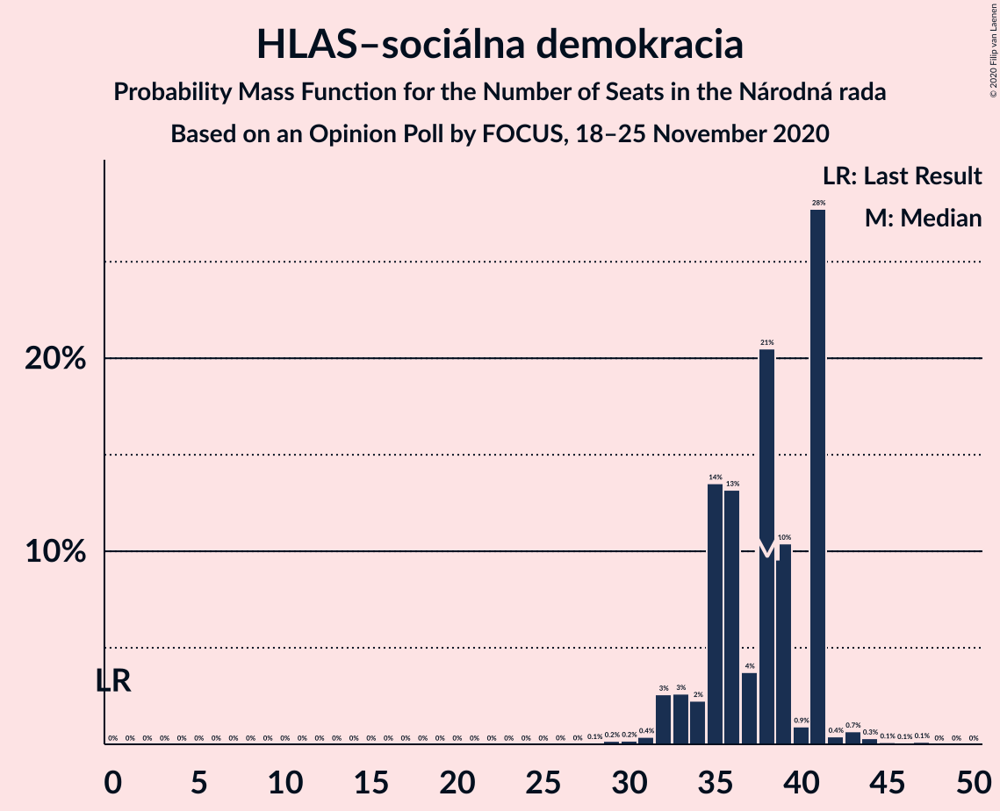

# Opinion Poll by FOCUS, 18–25 November 2020

<a href="#voting-intentions">Voting Intentions</a> | <a href="#seats">Seats</a> | <a href="#coalitions">Coalitions</a> | <a href="#technical-information">Technical Information</a>

## Voting Intentions

### Confidence Intervals

| Party | Last Result | Poll Result | 80% Confidence Interval | 90% Confidence Interval | 95% Confidence Interval | 99% Confidence Interval |
|:-----:|:-----------:|:-----------:|:-----------------------:|:-----------------------:|:-----------------------:|:-----------------------:|
| HLAS–sociálna demokracia | 0.0% | 19.1% | 17.6–20.8% |17.2–21.3% |16.8–21.7% |16.1–22.5% |
| OBYČAJNÍ ĽUDIA a nezávislé osobnosti | 25.0% | 14.0% | 12.7–15.5% |12.3–16.0% |12.0–16.3% |11.4–17.1% |
| Sloboda a Solidarita | 6.2% | 12.1% | 10.8–13.5% |10.5–13.9% |10.2–14.2% |9.6–14.9% |
| Kotleba–Ľudová strana Naše Slovensko | 8.0% | 9.6% | 8.5–10.9% |8.2–11.2% |7.9–11.6% |7.4–12.2% |
| SMER–sociálna demokracia | 18.3% | 9.5% | 8.4–10.7% |8.1–11.1% |7.8–11.4% |7.3–12.1% |
| SME RODINA | 8.2% | 6.1% | 5.2–7.2% |5.0–7.5% |4.8–7.7% |4.4–8.3% |
| Progresívne Slovensko | 7.0% | 5.9% | 5.0–7.0% |4.8–7.2% |4.6–7.5% |4.2–8.1% |
| Kresťanskodemokratické hnutie | 4.6% | 5.1% | 4.3–6.1% |4.1–6.4% |3.9–6.6% |3.5–7.1% |
| Za ľudí | 5.8% | 4.1% | 3.4–5.0% |3.2–5.3% |3.0–5.5% |2.7–6.0% |
| Strana maďarskej koalície–Magyar Koalíció Pártja | 3.9% | 3.3% | 2.7–4.1% |2.5–4.4% |2.3–4.6% |2.1–5.0% |
| Dobrá voľba | 3.1% | 2.8% | 2.2–3.6% |2.1–3.8% |1.9–4.0% |1.7–4.4% |
| VLASŤ | 2.9% | 2.4% | 1.9–3.1% |1.7–3.4% |1.6–3.5% |1.4–3.9% |
| Slovenská národná strana | 3.2% | 2.2% | 1.7–2.9% |1.6–3.1% |1.4–3.3% |1.2–3.7% |
| SPOLU–Občianska Demokracia | 7.0% | 1.0% | 0.7–1.5% |0.6–1.7% |0.5–1.8% |0.4–2.1% |

*Note:* The poll result column reflects the actual value used in the calculations. Published results may vary slightly, and in addition be rounded to fewer digits.

## Seats

### Confidence Intervals

| Party | Last Result | Median | 80% Confidence Interval | 90% Confidence Interval | 95% Confidence Interval | 99% Confidence Interval |
|:-----:|:-----------:|:------:|:-----------------------:|:-----------------------:|:-----------------------:|:-----------------------:|
| <a href="#hlas–sociálna-demokracia">HLAS–sociálna demokracia</a> | 0 | 38 | 35–41 |33–41 |32–41 |31–44 |
| <a href="#obyčajní-ľudia-a-nezávislé-osobnosti">OBYČAJNÍ ĽUDIA a nezávislé osobnosti</a> | 53 | 28 | 24–29 |23–29 |23–30 |21–32 |
| <a href="#sloboda-a-solidarita">Sloboda a Solidarita</a> | 13 | 22 | 19–25 |18–25 |18–27 |18–28 |
| <a href="#kotleba–ľudová-strana-naše-slovensko">Kotleba–Ľudová strana Naše Slovensko</a> | 17 | 19 | 15–22 |15–22 |14–22 |13–22 |
| <a href="#smer–sociálna-demokracia">SMER–sociálna demokracia</a> | 38 | 19 | 16–21 |15–21 |15–21 |14–24 |
| <a href="#sme-rodina">SME RODINA</a> | 17 | 11 | 0–13 |0–14 |0–15 |0–16 |
| <a href="#progresívne-slovensko">Progresívne Slovensko</a> | 0 | 12 | 0–13 |0–13 |0–15 |0–15 |
| <a href="#kresťanskodemokratické-hnutie">Kresťanskodemokratické hnutie</a> | 0 | 0 | 0–12 |0–12 |0–12 |0–14 |
| <a href="#za-ľudí">Za ľudí</a> | 12 | 0 | 0–10 |0–10 |0–10 |0–11 |
| <a href="#strana-maďarskej-koalície–magyar-koalíció-pártja">Strana maďarskej koalície–Magyar Koalíció Pártja</a> | 0 | 0 | 0 |0 |0 |0–10 |
| <a href="#dobrá-voľba">Dobrá voľba</a> | 0 | 0 | 0 |0 |0 |0 |
| <a href="#vlasť">VLASŤ</a> | 0 | 0 | 0 |0 |0 |0 |
| <a href="#slovenská-národná-strana">Slovenská národná strana</a> | 0 | 0 | 0 |0 |0 |0 |
| <a href="#spolu–občianska-demokracia">SPOLU–Občianska Demokracia</a> | 0 | 0 | 0 |0 |0 |0 |

### HLAS–sociálna demokracia

*For a full overview of the results for this party, see the [HLAS–sociálna demokracia](party-hlas–sociálnademokracia.html) page.*

| Number of Seats | Probability | Accumulated | Special Marks |
|:---------------:|:-----------:|:-----------:|:-------------:|
| 0 | 0% | 100% | Last Result |
| 1 | 0% | 100% |  |
| 2 | 0% | 100% |  |
| 3 | 0% | 100% |  |
| 4 | 0% | 100% |  |
| 5 | 0% | 100% |  |
| 6 | 0% | 100% |  |
| 7 | 0% | 100% |  |
| 8 | 0% | 100% |  |
| 9 | 0% | 100% |  |
| 10 | 0% | 100% |  |
| 11 | 0% | 100% |  |
| 12 | 0% | 100% |  |
| 13 | 0% | 100% |  |
| 14 | 0% | 100% |  |
| 15 | 0% | 100% |  |
| 16 | 0% | 100% |  |
| 17 | 0% | 100% |  |
| 18 | 0% | 100% |  |
| 19 | 0% | 100% |  |
| 20 | 0% | 100% |  |
| 21 | 0% | 100% |  |
| 22 | 0% | 100% |  |
| 23 | 0% | 100% |  |
| 24 | 0% | 100% |  |
| 25 | 0% | 100% |  |
| 26 | 0% | 100% |  |
| 27 | 0% | 100% |  |
| 28 | 0.1% | 100% |  |
| 29 | 0.2% | 99.9% |  |
| 30 | 0.2% | 99.7% |  |
| 31 | 0.4% | 99.5% |  |
| 32 | 3% | 99.2% |  |
| 33 | 3% | 97% |  |
| 34 | 2% | 94% |  |
| 35 | 14% | 92% |  |
| 36 | 13% | 78% |  |
| 37 | 4% | 65% |  |
| 38 | 21% | 61% | Median |
| 39 | 10% | 41% |  |
| 40 | 0.9% | 30% |  |
| 41 | 28% | 29% |  |
| 42 | 0.4% | 2% |  |
| 43 | 0.7% | 1.3% |  |
| 44 | 0.3% | 0.6% |  |
| 45 | 0.1% | 0.3% |  |
| 46 | 0.1% | 0.2% |  |
| 47 | 0.1% | 0.1% |  |
| 48 | 0% | 0% |  |

### OBYČAJNÍ ĽUDIA a nezávislé osobnosti

*For a full overview of the results for this party, see the [OBYČAJNÍ ĽUDIA a nezávislé osobnosti](party-obyčajníľudiaanezávisléosobnosti.html) page.*

| Number of Seats | Probability | Accumulated | Special Marks |
|:---------------:|:-----------:|:-----------:|:-------------:|
| 20 | 0.1% | 100% |  |
| 21 | 0.4% | 99.9% |  |
| 22 | 0.7% | 99.5% |  |
| 23 | 5% | 98.8% |  |
| 24 | 16% | 93% |  |
| 25 | 8% | 77% |  |
| 26 | 6% | 69% |  |
| 27 | 5% | 63% |  |
| 28 | 47% | 58% | Median |
| 29 | 8% | 11% |  |
| 30 | 1.3% | 3% |  |
| 31 | 0.5% | 1.3% |  |
| 32 | 0.4% | 0.8% |  |
| 33 | 0.3% | 0.5% |  |
| 34 | 0.1% | 0.2% |  |
| 35 | 0.1% | 0.1% |  |
| 36 | 0% | 0% |  |
| 37 | 0% | 0% |  |
| 38 | 0% | 0% |  |
| 39 | 0% | 0% |  |
| 40 | 0% | 0% |  |
| 41 | 0% | 0% |  |
| 42 | 0% | 0% |  |
| 43 | 0% | 0% |  |
| 44 | 0% | 0% |  |
| 45 | 0% | 0% |  |
| 46 | 0% | 0% |  |
| 47 | 0% | 0% |  |
| 48 | 0% | 0% |  |
| 49 | 0% | 0% |  |
| 50 | 0% | 0% |  |
| 51 | 0% | 0% |  |
| 52 | 0% | 0% |  |
| 53 | 0% | 0% | Last Result |

### Sloboda a Solidarita

*For a full overview of the results for this party, see the [Sloboda a Solidarita](party-slobodaasolidarita.html) page.*

| Number of Seats | Probability | Accumulated | Special Marks |
|:---------------:|:-----------:|:-----------:|:-------------:|
| 13 | 0% | 100% | Last Result |
| 14 | 0% | 100% |  |
| 15 | 0% | 100% |  |
| 16 | 0.2% | 100% |  |
| 17 | 0.2% | 99.8% |  |
| 18 | 7% | 99.6% |  |
| 19 | 4% | 93% |  |
| 20 | 2% | 89% |  |
| 21 | 22% | 87% |  |
| 22 | 20% | 65% | Median |
| 23 | 8% | 45% |  |
| 24 | 4% | 37% |  |
| 25 | 28% | 33% |  |
| 26 | 2% | 5% |  |
| 27 | 3% | 3% |  |
| 28 | 0.2% | 0.5% |  |
| 29 | 0.2% | 0.3% |  |
| 30 | 0% | 0.1% |  |
| 31 | 0% | 0.1% |  |
| 32 | 0% | 0% |  |

### Kotleba–Ľudová strana Naše Slovensko

*For a full overview of the results for this party, see the [Kotleba–Ľudová strana Naše Slovensko](party-kotleba–ľudovástrananašeslovensko.html) page.*

| Number of Seats | Probability | Accumulated | Special Marks |
|:---------------:|:-----------:|:-----------:|:-------------:|
| 12 | 0% | 100% |  |
| 13 | 2% | 99.9% |  |
| 14 | 0.4% | 98% |  |
| 15 | 17% | 97% |  |
| 16 | 7% | 80% |  |
| 17 | 14% | 74% | Last Result |
| 18 | 3% | 60% |  |
| 19 | 8% | 56% | Median |
| 20 | 19% | 48% |  |
| 21 | 2% | 29% |  |
| 22 | 27% | 27% |  |
| 23 | 0.1% | 0.4% |  |
| 24 | 0% | 0.2% |  |
| 25 | 0% | 0.2% |  |
| 26 | 0% | 0.2% |  |
| 27 | 0.1% | 0.2% |  |
| 28 | 0% | 0% |  |

### SMER–sociálna demokracia

*For a full overview of the results for this party, see the [SMER–sociálna demokracia](party-smer–sociálnademokracia.html) page.*

| Number of Seats | Probability | Accumulated | Special Marks |
|:---------------:|:-----------:|:-----------:|:-------------:|
| 12 | 0.1% | 100% |  |
| 13 | 0.1% | 99.9% |  |
| 14 | 0.9% | 99.8% |  |
| 15 | 5% | 98.9% |  |
| 16 | 7% | 94% |  |
| 17 | 27% | 87% |  |
| 18 | 7% | 60% |  |
| 19 | 18% | 52% | Median |
| 20 | 6% | 34% |  |
| 21 | 26% | 27% |  |
| 22 | 0.6% | 2% |  |
| 23 | 0.1% | 1.0% |  |
| 24 | 0.8% | 0.9% |  |
| 25 | 0% | 0.1% |  |
| 26 | 0% | 0% |  |
| 27 | 0% | 0% |  |
| 28 | 0% | 0% |  |
| 29 | 0% | 0% |  |
| 30 | 0% | 0% |  |
| 31 | 0% | 0% |  |
| 32 | 0% | 0% |  |
| 33 | 0% | 0% |  |
| 34 | 0% | 0% |  |
| 35 | 0% | 0% |  |
| 36 | 0% | 0% |  |
| 37 | 0% | 0% |  |
| 38 | 0% | 0% | Last Result |

### SME RODINA

*For a full overview of the results for this party, see the [SME RODINA](party-smerodina.html) page.*

| Number of Seats | Probability | Accumulated | Special Marks |
|:---------------:|:-----------:|:-----------:|:-------------:|
| 0 | 28% | 100% |  |
| 1 | 0% | 72% |  |
| 2 | 0% | 72% |  |
| 3 | 0% | 72% |  |
| 4 | 0% | 72% |  |
| 5 | 0% | 72% |  |
| 6 | 0% | 72% |  |
| 7 | 0% | 72% |  |
| 8 | 0% | 72% |  |
| 9 | 0.3% | 72% |  |
| 10 | 15% | 72% |  |
| 11 | 14% | 57% | Median |
| 12 | 7% | 44% |  |
| 13 | 30% | 37% |  |
| 14 | 4% | 7% |  |
| 15 | 2% | 3% |  |
| 16 | 0.7% | 0.9% |  |
| 17 | 0.2% | 0.2% | Last Result |
| 18 | 0% | 0% |  |

### Progresívne Slovensko

*For a full overview of the results for this party, see the [Progresívne Slovensko](party-progresívneslovensko.html) page.*

| Number of Seats | Probability | Accumulated | Special Marks |
|:---------------:|:-----------:|:-----------:|:-------------:|
| 0 | 21% | 100% | Last Result |
| 1 | 0% | 79% |  |
| 2 | 0% | 79% |  |
| 3 | 0% | 79% |  |
| 4 | 0% | 79% |  |
| 5 | 0% | 79% |  |
| 6 | 0% | 79% |  |
| 7 | 0% | 79% |  |
| 8 | 0% | 79% |  |
| 9 | 5% | 79% |  |
| 10 | 2% | 73% |  |
| 11 | 14% | 71% |  |
| 12 | 10% | 57% | Median |
| 13 | 43% | 47% |  |
| 14 | 2% | 4% |  |
| 15 | 2% | 3% |  |
| 16 | 0.4% | 0.5% |  |
| 17 | 0% | 0% |  |

### Kresťanskodemokratické hnutie

*For a full overview of the results for this party, see the [Kresťanskodemokratické hnutie](party-kresťanskodemokratickéhnutie.html) page.*

| Number of Seats | Probability | Accumulated | Special Marks |
|:---------------:|:-----------:|:-----------:|:-------------:|
| 0 | 58% | 100% | Last Result, Median |
| 1 | 0% | 42% |  |
| 2 | 0% | 42% |  |
| 3 | 0% | 42% |  |
| 4 | 0% | 42% |  |
| 5 | 0% | 42% |  |
| 6 | 0% | 42% |  |
| 7 | 0% | 42% |  |
| 8 | 0% | 42% |  |
| 9 | 2% | 42% |  |
| 10 | 14% | 39% |  |
| 11 | 10% | 25% |  |
| 12 | 14% | 15% |  |
| 13 | 0.3% | 1.2% |  |
| 14 | 0.6% | 0.9% |  |
| 15 | 0.2% | 0.2% |  |
| 16 | 0% | 0% |  |

### Za ľudí

*For a full overview of the results for this party, see the [Za ľudí](party-zaľudí.html) page.*

| Number of Seats | Probability | Accumulated | Special Marks |
|:---------------:|:-----------:|:-----------:|:-------------:|
| 0 | 75% | 100% | Median |
| 1 | 0% | 25% |  |
| 2 | 0% | 25% |  |
| 3 | 0% | 25% |  |
| 4 | 0% | 25% |  |
| 5 | 0% | 25% |  |
| 6 | 0% | 25% |  |
| 7 | 0% | 25% |  |
| 8 | 0% | 25% |  |
| 9 | 4% | 25% |  |
| 10 | 20% | 21% |  |
| 11 | 1.3% | 2% |  |
| 12 | 0.3% | 0.3% | Last Result |
| 13 | 0% | 0% |  |

### Strana maďarskej koalície–Magyar Koalíció Pártja

*For a full overview of the results for this party, see the [Strana maďarskej koalície–Magyar Koalíció Pártja](party-stranamaďarskejkoalície–magyarkoalíciópártja.html) page.*

| Number of Seats | Probability | Accumulated | Special Marks |
|:---------------:|:-----------:|:-----------:|:-------------:|
| 0 | 99.3% | 100% | Last Result, Median |
| 1 | 0% | 0.7% |  |
| 2 | 0% | 0.7% |  |
| 3 | 0% | 0.7% |  |
| 4 | 0% | 0.7% |  |
| 5 | 0% | 0.7% |  |
| 6 | 0% | 0.7% |  |
| 7 | 0% | 0.7% |  |
| 8 | 0% | 0.7% |  |
| 9 | 0% | 0.7% |  |
| 10 | 0.6% | 0.6% |  |
| 11 | 0% | 0% |  |

### Dobrá voľba

*For a full overview of the results for this party, see the [Dobrá voľba](party-dobrávoľba.html) page.*

| Number of Seats | Probability | Accumulated | Special Marks |
|:---------------:|:-----------:|:-----------:|:-------------:|
| 0 | 100% | 100% | Last Result, Median |

### VLASŤ

*For a full overview of the results for this party, see the [VLASŤ](party-vlasť.html) page.*

| Number of Seats | Probability | Accumulated | Special Marks |
|:---------------:|:-----------:|:-----------:|:-------------:|
| 0 | 100% | 100% | Last Result, Median |

### Slovenská národná strana

*For a full overview of the results for this party, see the [Slovenská národná strana](party-slovenskánárodnástrana.html) page.*

| Number of Seats | Probability | Accumulated | Special Marks |
|:---------------:|:-----------:|:-----------:|:-------------:|
| 0 | 100% | 100% | Last Result, Median |

### SPOLU–Občianska Demokracia

*For a full overview of the results for this party, see the [SPOLU–Občianska Demokracia](party-spolu–občianskademokracia.html) page.*

| Number of Seats | Probability | Accumulated | Special Marks |
|:---------------:|:-----------:|:-----------:|:-------------:|
| 0 | 100% | 100% | Last Result, Median |

## Coalitions

### Confidence Intervals

| Coalition | Last Result | Median | Majority? | 80% Confidence Interval | 90% Confidence Interval | 95% Confidence Interval | 99% Confidence Interval |
|:---------:|:-----------:|:------:|:---------:|:-----------------------:|:-----------------------:|:-----------------------:|:-----------------------:|
| HLAS–sociálna demokracia – Kotleba–Ľudová strana Naše Slovensko – SMER–sociálna demokracia – SME RODINA – Slovenská národná strana | 72 | 84 | 98% | 80–90 | 76–90 | 76–94 | 69–96 |
| HLAS–sociálna demokracia – Kotleba–Ľudová strana Naše Slovensko – SME RODINA – Slovenská národná strana | 34 | 64 | 0.6% | 63–71 | 61–71 | 58–74 | 52–77 |
| HLAS–sociálna demokracia – SMER–sociálna demokracia – SME RODINA | 55 | 65 | 0.9% | 62–70 | 61–70 | 58–72 | 52–79 |
| HLAS–sociálna demokracia – SMER–sociálna demokracia – SME RODINA – Slovenská národná strana | 55 | 65 | 0.9% | 62–70 | 61–70 | 58–72 | 52–79 |
| HLAS–sociálna demokracia – SMER–sociálna demokracia – Slovenská národná strana | 38 | 57 | 0% | 52–62 | 50–62 | 49–62 | 48–67 |
| HLAS–sociálna demokracia – SME RODINA | 17 | 48 | 0% | 41–51 | 41–52 | 40–53 | 36–57 |
| HLAS–sociálna demokracia – SME RODINA – Slovenská národná strana | 17 | 48 | 0% | 41–51 | 41–52 | 40–53 | 36–57 |
| Kotleba–Ľudová strana Naše Slovensko – SMER–sociálna demokracia – SME RODINA – Slovenská národná strana | 72 | 45 | 0% | 41–52 | 41–52 | 40–53 | 33–56 |
| HLAS–sociálna demokracia – Slovenská národná strana | 0 | 38 | 0% | 35–41 | 33–41 | 32–41 | 31–44 |
| SMER–sociálna demokracia – SME RODINA | 55 | 28 | 0% | 21–32 | 21–32 | 21–33 | 16–37 |
| SMER–sociálna demokracia – SME RODINA – Slovenská národná strana | 55 | 28 | 0% | 21–32 | 21–32 | 21–33 | 16–37 |
| SMER–sociálna demokracia | 38 | 19 | 0% | 16–21 | 15–21 | 15–21 | 14–24 |
| SMER–sociálna demokracia – Slovenská národná strana | 38 | 19 | 0% | 16–21 | 15–21 | 15–21 | 14–24 |

### HLAS–sociálna demokracia – Kotleba–Ľudová strana Naše Slovensko – SMER–sociálna demokracia – SME RODINA – Slovenská národná strana

| Number of Seats | Probability | Accumulated | Special Marks |
|:---------------:|:-----------:|:-----------:|:-------------:|
| 68 | 0.5% | 100% |  |
| 69 | 0.2% | 99.5% |  |
| 70 | 0% | 99.3% |  |
| 71 | 0% | 99.3% |  |
| 72 | 0.2% | 99.3% | Last Result |
| 73 | 0.4% | 99.1% |  |
| 74 | 0.1% | 98.7% |  |
| 75 | 0.1% | 98.5% |  |
| 76 | 4% | 98% | Majority |
| 77 | 0.5% | 95% |  |
| 78 | 2% | 94% |  |
| 79 | 2% | 92% |  |
| 80 | 16% | 90% |  |
| 81 | 11% | 75% |  |
| 82 | 0.7% | 63% |  |
| 83 | 2% | 63% |  |
| 84 | 30% | 60% |  |
| 85 | 4% | 31% |  |
| 86 | 3% | 27% |  |
| 87 | 0.5% | 24% | Median |
| 88 | 1.0% | 24% |  |
| 89 | 0.8% | 23% |  |
| 90 | 18% | 22% |  |
| 91 | 0.3% | 4% |  |
| 92 | 0.3% | 3% |  |
| 93 | 0.1% | 3% |  |
| 94 | 2% | 3% |  |
| 95 | 0.1% | 0.6% |  |
| 96 | 0% | 0.5% |  |
| 97 | 0.1% | 0.5% |  |
| 98 | 0% | 0.4% |  |
| 99 | 0% | 0.4% |  |
| 100 | 0% | 0.4% |  |
| 101 | 0.3% | 0.4% |  |
| 102 | 0% | 0% |  |

### HLAS–sociálna demokracia – Kotleba–Ľudová strana Naše Slovensko – SME RODINA – Slovenská národná strana

| Number of Seats | Probability | Accumulated | Special Marks |
|:---------------:|:-----------:|:-----------:|:-------------:|
| 34 | 0% | 100% | Last Result |
| 35 | 0% | 100% |  |
| 36 | 0% | 100% |  |
| 37 | 0% | 100% |  |
| 38 | 0% | 100% |  |
| 39 | 0% | 100% |  |
| 40 | 0% | 100% |  |
| 41 | 0% | 100% |  |
| 42 | 0% | 100% |  |
| 43 | 0% | 100% |  |
| 44 | 0% | 100% |  |
| 45 | 0% | 100% |  |
| 46 | 0% | 100% |  |
| 47 | 0% | 100% |  |
| 48 | 0% | 100% |  |
| 49 | 0% | 100% |  |
| 50 | 0% | 100% |  |
| 51 | 0% | 100% |  |
| 52 | 0.6% | 100% |  |
| 53 | 0.1% | 99.3% |  |
| 54 | 0% | 99.2% |  |
| 55 | 0.3% | 99.2% |  |
| 56 | 0.5% | 99.0% |  |
| 57 | 0.2% | 98% |  |
| 58 | 2% | 98% |  |
| 59 | 0.4% | 96% |  |
| 60 | 0.6% | 96% |  |
| 61 | 4% | 95% |  |
| 62 | 0.5% | 91% |  |
| 63 | 39% | 91% |  |
| 64 | 14% | 52% |  |
| 65 | 3% | 38% |  |
| 66 | 2% | 36% |  |
| 67 | 6% | 33% |  |
| 68 | 3% | 28% | Median |
| 69 | 2% | 25% |  |
| 70 | 1.1% | 23% |  |
| 71 | 17% | 22% |  |
| 72 | 0.2% | 5% |  |
| 73 | 2% | 5% |  |
| 74 | 2% | 3% |  |
| 75 | 0.1% | 0.7% |  |
| 76 | 0% | 0.6% | Majority |
| 77 | 0.5% | 0.6% |  |
| 78 | 0.1% | 0.1% |  |
| 79 | 0% | 0% |  |

### HLAS–sociálna demokracia – SMER–sociálna demokracia – SME RODINA

| Number of Seats | Probability | Accumulated | Special Marks |
|:---------------:|:-----------:|:-----------:|:-------------:|
| 52 | 0.7% | 100% |  |
| 53 | 0% | 99.3% |  |
| 54 | 0.2% | 99.3% |  |
| 55 | 0% | 99.1% | Last Result |
| 56 | 0.1% | 99.1% |  |
| 57 | 1.4% | 99.0% |  |
| 58 | 0.3% | 98% |  |
| 59 | 0.2% | 97% |  |
| 60 | 0.5% | 97% |  |
| 61 | 5% | 97% |  |
| 62 | 26% | 92% |  |
| 63 | 3% | 66% |  |
| 64 | 11% | 63% |  |
| 65 | 15% | 51% |  |
| 66 | 4% | 37% |  |
| 67 | 6% | 33% |  |
| 68 | 1.5% | 27% | Median |
| 69 | 1.4% | 25% |  |
| 70 | 19% | 24% |  |
| 71 | 1.0% | 5% |  |
| 72 | 2% | 4% |  |
| 73 | 0.1% | 2% |  |
| 74 | 0.6% | 1.5% |  |
| 75 | 0% | 0.9% |  |
| 76 | 0% | 0.9% | Majority |
| 77 | 0.1% | 0.9% |  |
| 78 | 0% | 0.8% |  |
| 79 | 0.3% | 0.8% |  |
| 80 | 0.1% | 0.4% |  |
| 81 | 0% | 0.4% |  |
| 82 | 0% | 0.4% |  |
| 83 | 0.3% | 0.3% |  |
| 84 | 0% | 0% |  |

### HLAS–sociálna demokracia – SMER–sociálna demokracia – SME RODINA – Slovenská národná strana

| Number of Seats | Probability | Accumulated | Special Marks |
|:---------------:|:-----------:|:-----------:|:-------------:|
| 52 | 0.7% | 100% |  |
| 53 | 0% | 99.3% |  |
| 54 | 0.2% | 99.3% |  |
| 55 | 0% | 99.1% | Last Result |
| 56 | 0.1% | 99.1% |  |
| 57 | 1.4% | 99.0% |  |
| 58 | 0.3% | 98% |  |
| 59 | 0.2% | 97% |  |
| 60 | 0.5% | 97% |  |
| 61 | 5% | 97% |  |
| 62 | 26% | 92% |  |
| 63 | 3% | 66% |  |
| 64 | 11% | 63% |  |
| 65 | 15% | 51% |  |
| 66 | 4% | 37% |  |
| 67 | 6% | 33% |  |
| 68 | 1.5% | 27% | Median |
| 69 | 1.4% | 25% |  |
| 70 | 19% | 24% |  |
| 71 | 1.0% | 5% |  |
| 72 | 2% | 4% |  |
| 73 | 0.1% | 2% |  |
| 74 | 0.6% | 1.5% |  |
| 75 | 0% | 0.9% |  |
| 76 | 0% | 0.9% | Majority |
| 77 | 0.1% | 0.9% |  |
| 78 | 0% | 0.8% |  |
| 79 | 0.3% | 0.8% |  |
| 80 | 0.1% | 0.4% |  |
| 81 | 0% | 0.4% |  |
| 82 | 0% | 0.4% |  |
| 83 | 0.3% | 0.3% |  |
| 84 | 0% | 0% |  |

### HLAS–sociálna demokracia – SMER–sociálna demokracia – Slovenská národná strana

| Number of Seats | Probability | Accumulated | Special Marks |
|:---------------:|:-----------:|:-----------:|:-------------:|
| 38 | 0% | 100% | Last Result |
| 39 | 0% | 100% |  |
| 40 | 0% | 100% |  |
| 41 | 0% | 100% |  |
| 42 | 0% | 100% |  |
| 43 | 0.1% | 100% |  |
| 44 | 0% | 99.9% |  |
| 45 | 0.1% | 99.9% |  |
| 46 | 0.1% | 99.8% |  |
| 47 | 0.1% | 99.7% |  |
| 48 | 0.4% | 99.6% |  |
| 49 | 3% | 99.1% |  |
| 50 | 3% | 97% |  |
| 51 | 3% | 93% |  |
| 52 | 12% | 91% |  |
| 53 | 8% | 78% |  |
| 54 | 6% | 70% |  |
| 55 | 8% | 64% |  |
| 56 | 5% | 56% |  |
| 57 | 19% | 51% | Median |
| 58 | 3% | 32% |  |
| 59 | 0.4% | 29% |  |
| 60 | 0.2% | 28% |  |
| 61 | 2% | 28% |  |
| 62 | 25% | 26% |  |
| 63 | 0.1% | 1.3% |  |
| 64 | 0.4% | 1.2% |  |
| 65 | 0.1% | 0.8% |  |
| 66 | 0% | 0.7% |  |
| 67 | 0.3% | 0.7% |  |
| 68 | 0.3% | 0.4% |  |
| 69 | 0% | 0.1% |  |
| 70 | 0% | 0.1% |  |
| 71 | 0.1% | 0.1% |  |
| 72 | 0% | 0% |  |

### HLAS–sociálna demokracia – SME RODINA

| Number of Seats | Probability | Accumulated | Special Marks |
|:---------------:|:-----------:|:-----------:|:-------------:|
| 17 | 0% | 100% | Last Result |
| 18 | 0% | 100% |  |
| 19 | 0% | 100% |  |
| 20 | 0% | 100% |  |
| 21 | 0% | 100% |  |
| 22 | 0% | 100% |  |
| 23 | 0% | 100% |  |
| 24 | 0% | 100% |  |
| 25 | 0% | 100% |  |
| 26 | 0% | 100% |  |
| 27 | 0% | 100% |  |
| 28 | 0% | 100% |  |
| 29 | 0% | 100% |  |
| 30 | 0% | 100% |  |
| 31 | 0% | 100% |  |
| 32 | 0% | 100% |  |
| 33 | 0% | 100% |  |
| 34 | 0% | 99.9% |  |
| 35 | 0.2% | 99.9% |  |
| 36 | 0.5% | 99.7% |  |
| 37 | 1.3% | 99.2% |  |
| 38 | 0.1% | 98% |  |
| 39 | 0.3% | 98% |  |
| 40 | 0.2% | 98% |  |
| 41 | 25% | 97% |  |
| 42 | 0.5% | 73% |  |
| 43 | 2% | 72% |  |
| 44 | 3% | 71% |  |
| 45 | 0.5% | 67% |  |
| 46 | 6% | 67% |  |
| 47 | 9% | 60% |  |
| 48 | 12% | 52% |  |
| 49 | 11% | 40% | Median |
| 50 | 4% | 29% |  |
| 51 | 18% | 25% |  |
| 52 | 2% | 7% |  |
| 53 | 2% | 5% |  |
| 54 | 0.1% | 2% |  |
| 55 | 1.0% | 2% |  |
| 56 | 0.2% | 0.9% |  |
| 57 | 0.3% | 0.8% |  |
| 58 | 0.1% | 0.4% |  |
| 59 | 0.3% | 0.4% |  |
| 60 | 0% | 0% |  |

### HLAS–sociálna demokracia – SME RODINA – Slovenská národná strana

| Number of Seats | Probability | Accumulated | Special Marks |
|:---------------:|:-----------:|:-----------:|:-------------:|
| 17 | 0% | 100% | Last Result |
| 18 | 0% | 100% |  |
| 19 | 0% | 100% |  |
| 20 | 0% | 100% |  |
| 21 | 0% | 100% |  |
| 22 | 0% | 100% |  |
| 23 | 0% | 100% |  |
| 24 | 0% | 100% |  |
| 25 | 0% | 100% |  |
| 26 | 0% | 100% |  |
| 27 | 0% | 100% |  |
| 28 | 0% | 100% |  |
| 29 | 0% | 100% |  |
| 30 | 0% | 100% |  |
| 31 | 0% | 100% |  |
| 32 | 0% | 100% |  |
| 33 | 0% | 100% |  |
| 34 | 0% | 99.9% |  |
| 35 | 0.2% | 99.9% |  |
| 36 | 0.5% | 99.7% |  |
| 37 | 1.3% | 99.2% |  |
| 38 | 0.1% | 98% |  |
| 39 | 0.3% | 98% |  |
| 40 | 0.2% | 98% |  |
| 41 | 25% | 97% |  |
| 42 | 0.5% | 73% |  |
| 43 | 2% | 72% |  |
| 44 | 3% | 71% |  |
| 45 | 0.5% | 67% |  |
| 46 | 6% | 67% |  |
| 47 | 9% | 60% |  |
| 48 | 12% | 52% |  |
| 49 | 11% | 40% | Median |
| 50 | 4% | 29% |  |
| 51 | 18% | 25% |  |
| 52 | 2% | 7% |  |
| 53 | 2% | 5% |  |
| 54 | 0.1% | 2% |  |
| 55 | 1.0% | 2% |  |
| 56 | 0.2% | 0.9% |  |
| 57 | 0.3% | 0.8% |  |
| 58 | 0.1% | 0.4% |  |
| 59 | 0.3% | 0.4% |  |
| 60 | 0% | 0% |  |

### Kotleba–Ľudová strana Naše Slovensko – SMER–sociálna demokracia – SME RODINA – Slovenská národná strana

| Number of Seats | Probability | Accumulated | Special Marks |
|:---------------:|:-----------:|:-----------:|:-------------:|
| 32 | 0.5% | 100% |  |
| 33 | 0.1% | 99.5% |  |
| 34 | 0.2% | 99.4% |  |
| 35 | 0.1% | 99.2% |  |
| 36 | 0.1% | 99.0% |  |
| 37 | 0.1% | 99.0% |  |
| 38 | 0.1% | 98.9% |  |
| 39 | 0.3% | 98.8% |  |
| 40 | 2% | 98.6% |  |
| 41 | 9% | 96% |  |
| 42 | 0.4% | 88% |  |
| 43 | 26% | 87% |  |
| 44 | 0.5% | 61% |  |
| 45 | 23% | 61% |  |
| 46 | 3% | 38% |  |
| 47 | 2% | 35% |  |
| 48 | 5% | 34% |  |
| 49 | 2% | 28% | Median |
| 50 | 4% | 26% |  |
| 51 | 0.6% | 23% |  |
| 52 | 18% | 22% |  |
| 53 | 3% | 4% |  |
| 54 | 0.1% | 0.7% |  |
| 55 | 0.1% | 0.6% |  |
| 56 | 0.1% | 0.5% |  |
| 57 | 0% | 0.5% |  |
| 58 | 0.4% | 0.4% |  |
| 59 | 0% | 0% |  |
| 60 | 0% | 0% |  |
| 61 | 0% | 0% |  |
| 62 | 0% | 0% |  |
| 63 | 0% | 0% |  |
| 64 | 0% | 0% |  |
| 65 | 0% | 0% |  |
| 66 | 0% | 0% |  |
| 67 | 0% | 0% |  |
| 68 | 0% | 0% |  |
| 69 | 0% | 0% |  |
| 70 | 0% | 0% |  |
| 71 | 0% | 0% |  |
| 72 | 0% | 0% | Last Result |

### HLAS–sociálna demokracia – Slovenská národná strana

| Number of Seats | Probability | Accumulated | Special Marks |
|:---------------:|:-----------:|:-----------:|:-------------:|
| 0 | 0% | 100% | Last Result |
| 1 | 0% | 100% |  |
| 2 | 0% | 100% |  |
| 3 | 0% | 100% |  |
| 4 | 0% | 100% |  |
| 5 | 0% | 100% |  |
| 6 | 0% | 100% |  |
| 7 | 0% | 100% |  |
| 8 | 0% | 100% |  |
| 9 | 0% | 100% |  |
| 10 | 0% | 100% |  |
| 11 | 0% | 100% |  |
| 12 | 0% | 100% |  |
| 13 | 0% | 100% |  |
| 14 | 0% | 100% |  |
| 15 | 0% | 100% |  |
| 16 | 0% | 100% |  |
| 17 | 0% | 100% |  |
| 18 | 0% | 100% |  |
| 19 | 0% | 100% |  |
| 20 | 0% | 100% |  |
| 21 | 0% | 100% |  |
| 22 | 0% | 100% |  |
| 23 | 0% | 100% |  |
| 24 | 0% | 100% |  |
| 25 | 0% | 100% |  |
| 26 | 0% | 100% |  |
| 27 | 0% | 100% |  |
| 28 | 0.1% | 100% |  |
| 29 | 0.2% | 99.9% |  |
| 30 | 0.2% | 99.7% |  |
| 31 | 0.4% | 99.5% |  |
| 32 | 3% | 99.2% |  |
| 33 | 3% | 97% |  |
| 34 | 2% | 94% |  |
| 35 | 14% | 92% |  |
| 36 | 13% | 78% |  |
| 37 | 4% | 65% |  |
| 38 | 21% | 61% | Median |
| 39 | 10% | 41% |  |
| 40 | 0.9% | 30% |  |
| 41 | 28% | 29% |  |
| 42 | 0.4% | 2% |  |
| 43 | 0.7% | 1.3% |  |
| 44 | 0.3% | 0.6% |  |
| 45 | 0.1% | 0.3% |  |
| 46 | 0.1% | 0.2% |  |
| 47 | 0.1% | 0.1% |  |
| 48 | 0% | 0% |  |

### SMER–sociálna demokracia – SME RODINA

| Number of Seats | Probability | Accumulated | Special Marks |
|:---------------:|:-----------:|:-----------:|:-------------:|
| 16 | 0.5% | 100% |  |
| 17 | 0.3% | 99.4% |  |
| 18 | 0.1% | 99.1% |  |
| 19 | 0.1% | 99.0% |  |
| 20 | 1.2% | 98.9% |  |
| 21 | 25% | 98% |  |
| 22 | 0.2% | 73% |  |
| 23 | 0.2% | 73% |  |
| 24 | 0.2% | 72% |  |
| 25 | 2% | 72% |  |
| 26 | 6% | 70% |  |
| 27 | 2% | 63% |  |
| 28 | 16% | 62% |  |
| 29 | 5% | 45% |  |
| 30 | 11% | 41% | Median |
| 31 | 6% | 30% |  |
| 32 | 19% | 23% |  |
| 33 | 2% | 4% |  |
| 34 | 1.3% | 2% |  |
| 35 | 0.3% | 1.1% |  |
| 36 | 0.2% | 0.7% |  |
| 37 | 0.1% | 0.6% |  |
| 38 | 0% | 0.5% |  |
| 39 | 0% | 0.4% |  |
| 40 | 0.3% | 0.4% |  |
| 41 | 0.1% | 0.1% |  |
| 42 | 0% | 0% |  |
| 43 | 0% | 0% |  |
| 44 | 0% | 0% |  |
| 45 | 0% | 0% |  |
| 46 | 0% | 0% |  |
| 47 | 0% | 0% |  |
| 48 | 0% | 0% |  |
| 49 | 0% | 0% |  |
| 50 | 0% | 0% |  |
| 51 | 0% | 0% |  |
| 52 | 0% | 0% |  |
| 53 | 0% | 0% |  |
| 54 | 0% | 0% |  |
| 55 | 0% | 0% | Last Result |

### SMER–sociálna demokracia – SME RODINA – Slovenská národná strana

| Number of Seats | Probability | Accumulated | Special Marks |
|:---------------:|:-----------:|:-----------:|:-------------:|
| 16 | 0.5% | 100% |  |
| 17 | 0.3% | 99.4% |  |
| 18 | 0.1% | 99.1% |  |
| 19 | 0.1% | 99.0% |  |
| 20 | 1.2% | 98.9% |  |
| 21 | 25% | 98% |  |
| 22 | 0.2% | 73% |  |
| 23 | 0.2% | 73% |  |
| 24 | 0.2% | 72% |  |
| 25 | 2% | 72% |  |
| 26 | 6% | 70% |  |
| 27 | 2% | 63% |  |
| 28 | 16% | 62% |  |
| 29 | 5% | 45% |  |
| 30 | 11% | 41% | Median |
| 31 | 6% | 30% |  |
| 32 | 19% | 23% |  |
| 33 | 2% | 4% |  |
| 34 | 1.3% | 2% |  |
| 35 | 0.3% | 1.1% |  |
| 36 | 0.2% | 0.7% |  |
| 37 | 0.1% | 0.6% |  |
| 38 | 0% | 0.5% |  |
| 39 | 0% | 0.4% |  |
| 40 | 0.3% | 0.4% |  |
| 41 | 0.1% | 0.1% |  |
| 42 | 0% | 0% |  |
| 43 | 0% | 0% |  |
| 44 | 0% | 0% |  |
| 45 | 0% | 0% |  |
| 46 | 0% | 0% |  |
| 47 | 0% | 0% |  |
| 48 | 0% | 0% |  |
| 49 | 0% | 0% |  |
| 50 | 0% | 0% |  |
| 51 | 0% | 0% |  |
| 52 | 0% | 0% |  |
| 53 | 0% | 0% |  |
| 54 | 0% | 0% |  |
| 55 | 0% | 0% | Last Result |

### SMER–sociálna demokracia

| Number of Seats | Probability | Accumulated | Special Marks |
|:---------------:|:-----------:|:-----------:|:-------------:|
| 12 | 0.1% | 100% |  |
| 13 | 0.1% | 99.9% |  |
| 14 | 0.9% | 99.8% |  |
| 15 | 5% | 98.9% |  |
| 16 | 7% | 94% |  |
| 17 | 27% | 87% |  |
| 18 | 7% | 60% |  |
| 19 | 18% | 52% | Median |
| 20 | 6% | 34% |  |
| 21 | 26% | 27% |  |
| 22 | 0.6% | 2% |  |
| 23 | 0.1% | 1.0% |  |
| 24 | 0.8% | 0.9% |  |
| 25 | 0% | 0.1% |  |
| 26 | 0% | 0% |  |
| 27 | 0% | 0% |  |
| 28 | 0% | 0% |  |
| 29 | 0% | 0% |  |
| 30 | 0% | 0% |  |
| 31 | 0% | 0% |  |
| 32 | 0% | 0% |  |
| 33 | 0% | 0% |  |
| 34 | 0% | 0% |  |
| 35 | 0% | 0% |  |
| 36 | 0% | 0% |  |
| 37 | 0% | 0% |  |
| 38 | 0% | 0% | Last Result |

### SMER–sociálna demokracia – Slovenská národná strana

| Number of Seats | Probability | Accumulated | Special Marks |
|:---------------:|:-----------:|:-----------:|:-------------:|
| 12 | 0.1% | 100% |  |
| 13 | 0.1% | 99.9% |  |
| 14 | 0.9% | 99.8% |  |
| 15 | 5% | 98.9% |  |
| 16 | 7% | 94% |  |
| 17 | 27% | 87% |  |
| 18 | 7% | 60% |  |
| 19 | 18% | 52% | Median |
| 20 | 6% | 34% |  |
| 21 | 26% | 28% |  |
| 22 | 0.6% | 2% |  |
| 23 | 0.1% | 1.0% |  |
| 24 | 0.8% | 0.9% |  |
| 25 | 0% | 0.1% |  |
| 26 | 0% | 0% |  |
| 27 | 0% | 0% |  |
| 28 | 0% | 0% |  |
| 29 | 0% | 0% |  |
| 30 | 0% | 0% |  |
| 31 | 0% | 0% |  |
| 32 | 0% | 0% |  |
| 33 | 0% | 0% |  |
| 34 | 0% | 0% |  |
| 35 | 0% | 0% |  |
| 36 | 0% | 0% |  |
| 37 | 0% | 0% |  |
| 38 | 0% | 0% | Last Result |

## Technical Information

### Opinion Poll

+ **Polling firm:** FOCUS
+ **Commissioner(s):** —
+ **Fieldwork period:** 18–25 November 2020

### Calculations

+ **Sample size:** 1004
+ **Simulations done:** 1,048,576
+ **Error estimate:** 2.15%

