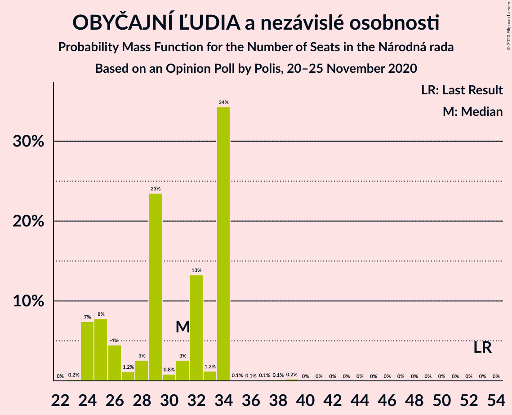

# Opinion Poll by Polis, 20–25 November 2020

<a href="#voting-intentions">Voting Intentions</a> | <a href="#seats">Seats</a> | <a href="#coalitions">Coalitions</a> | <a href="#technical-information">Technical Information</a>

## Voting Intentions

### Confidence Intervals

| Party | Last Result | Poll Result | 80% Confidence Interval | 90% Confidence Interval | 95% Confidence Interval | 99% Confidence Interval |
|:-----:|:-----------:|:-----------:|:-----------------------:|:-----------------------:|:-----------------------:|:-----------------------:|
| HLAS–sociálna demokracia | 0.0% | 21.3% | 19.7–23.0% |19.2–23.5% |18.9–23.9% |18.1–24.7% |
| OBYČAJNÍ ĽUDIA a nezávislé osobnosti | 25.0% | 15.8% | 14.4–17.3% |14.0–17.8% |13.7–18.1% |13.0–18.9% |
| Sloboda a Solidarita | 6.2% | 14.2% | 12.9–15.7% |12.5–16.1% |12.2–16.5% |11.6–17.2% |
| Kotleba–Ľudová strana Naše Slovensko | 8.0% | 8.1% | 7.1–9.3% |6.8–9.7% |6.6–10.0% |6.1–10.6% |
| SMER–sociálna demokracia | 18.3% | 7.9% | 6.9–9.1% |6.7–9.5% |6.4–9.8% |6.0–10.4% |
| Progresívne Slovensko | 7.0% | 5.5% | 4.7–6.5% |4.4–6.8% |4.2–7.1% |3.9–7.6% |
| SME RODINA | 8.2% | 5.3% | 4.5–6.3% |4.3–6.6% |4.1–6.8% |3.7–7.4% |
| Strana maďarskej koalície–Magyar Koalíció Pártja | 3.9% | 5.2% | 4.4–6.2% |4.2–6.5% |4.0–6.7% |3.6–7.3% |
| Kresťanskodemokratické hnutie | 4.6% | 4.0% | 3.3–4.9% |3.1–5.2% |3.0–5.4% |2.7–5.9% |
| Za ľudí | 5.8% | 3.8% | 3.2–4.7% |3.0–5.0% |2.8–5.2% |2.5–5.6% |
| Dobrá voľba | 3.1% | 2.7% | 2.2–3.5% |2.0–3.7% |1.9–3.9% |1.7–4.3% |
| VLASŤ | 2.9% | 2.2% | 1.7–2.9% |1.5–3.1% |1.4–3.2% |1.2–3.6% |
| Slovenská národná strana | 3.2% | 2.1% | 1.6–2.8% |1.4–3.0% |1.3–3.1% |1.2–3.5% |
| SPOLU–Občianska Demokracia | 7.0% | 1.3% | 0.9–1.9% |0.8–2.0% |0.7–2.2% |0.6–2.5% |

*Note:* The poll result column reflects the actual value used in the calculations. Published results may vary slightly, and in addition be rounded to fewer digits.

## Seats

### Confidence Intervals

| Party | Last Result | Median | 80% Confidence Interval | 90% Confidence Interval | 95% Confidence Interval | 99% Confidence Interval |
|:-----:|:-----------:|:------:|:-----------------------:|:-----------------------:|:-----------------------:|:-----------------------:|
| <a href="#hlas–sociálna-demokracia">HLAS–sociálna demokracia</a> | 0 | 41 | 37–42 |35–47 |32–49 |32–49 |
| <a href="#obyčajní-ľudia-a-nezávislé-osobnosti">OBYČAJNÍ ĽUDIA a nezávislé osobnosti</a> | 53 | 31 | 25–34 |24–34 |24–34 |24–36 |
| <a href="#sloboda-a-solidarita">Sloboda a Solidarita</a> | 13 | 28 | 25–29 |24–29 |23–31 |22–31 |
| <a href="#kotleba–ľudová-strana-naše-slovensko">Kotleba–Ľudová strana Naše Slovensko</a> | 17 | 17 | 12–18 |12–18 |12–19 |12–20 |
| <a href="#smer–sociálna-demokracia">SMER–sociálna demokracia</a> | 38 | 16 | 13–19 |12–19 |12–19 |11–20 |
| <a href="#progresívne-slovensko">Progresívne Slovensko</a> | 0 | 11 | 10–13 |0–14 |0–14 |0–14 |
| <a href="#sme-rodina">SME RODINA</a> | 17 | 0 | 0–11 |0–11 |0–11 |0–13 |
| <a href="#strana-maďarskej-koalície–magyar-koalíció-pártja">Strana maďarskej koalície–Magyar Koalíció Pártja</a> | 0 | 0 | 0–11 |0–11 |0–12 |0–14 |
| <a href="#kresťanskodemokratické-hnutie">Kresťanskodemokratické hnutie</a> | 0 | 0 | 0 |0–10 |0–10 |0–10 |
| <a href="#za-ľudí">Za ľudí</a> | 12 | 0 | 0 |0 |0–9 |0–10 |
| <a href="#dobrá-voľba">Dobrá voľba</a> | 0 | 0 | 0 |0 |0 |0 |
| <a href="#vlasť">VLASŤ</a> | 0 | 0 | 0 |0 |0 |0 |
| <a href="#slovenská-národná-strana">Slovenská národná strana</a> | 0 | 0 | 0 |0 |0 |0 |
| <a href="#spolu–občianska-demokracia">SPOLU–Občianska Demokracia</a> | 0 | 0 | 0 |0 |0 |0 |

### HLAS–sociálna demokracia

*For a full overview of the results for this party, see the [HLAS–sociálna demokracia](party-hlas–sociálnademokracia.html) page.*

| Number of Seats | Probability | Accumulated | Special Marks |
|:---------------:|:-----------:|:-----------:|:-------------:|
| 0 | 0% | 100% | Last Result |
| 1 | 0% | 100% |  |
| 2 | 0% | 100% |  |
| 3 | 0% | 100% |  |
| 4 | 0% | 100% |  |
| 5 | 0% | 100% |  |
| 6 | 0% | 100% |  |
| 7 | 0% | 100% |  |
| 8 | 0% | 100% |  |
| 9 | 0% | 100% |  |
| 10 | 0% | 100% |  |
| 11 | 0% | 100% |  |
| 12 | 0% | 100% |  |
| 13 | 0% | 100% |  |
| 14 | 0% | 100% |  |
| 15 | 0% | 100% |  |
| 16 | 0% | 100% |  |
| 17 | 0% | 100% |  |
| 18 | 0% | 100% |  |
| 19 | 0% | 100% |  |
| 20 | 0% | 100% |  |
| 21 | 0% | 100% |  |
| 22 | 0% | 100% |  |
| 23 | 0% | 100% |  |
| 24 | 0% | 100% |  |
| 25 | 0% | 100% |  |
| 26 | 0% | 100% |  |
| 27 | 0% | 100% |  |
| 28 | 0% | 100% |  |
| 29 | 0% | 100% |  |
| 30 | 0.1% | 100% |  |
| 31 | 0.2% | 99.9% |  |
| 32 | 4% | 99.8% |  |
| 33 | 0.2% | 96% |  |
| 34 | 0.9% | 96% |  |
| 35 | 1.1% | 95% |  |
| 36 | 3% | 94% |  |
| 37 | 5% | 91% |  |
| 38 | 6% | 86% |  |
| 39 | 10% | 81% |  |
| 40 | 19% | 71% |  |
| 41 | 35% | 53% | Median |
| 42 | 8% | 18% |  |
| 43 | 2% | 10% |  |
| 44 | 1.2% | 7% |  |
| 45 | 0.7% | 6% |  |
| 46 | 0.2% | 5% |  |
| 47 | 0.4% | 5% |  |
| 48 | 0.3% | 5% |  |
| 49 | 4% | 5% |  |
| 50 | 0% | 0.1% |  |
| 51 | 0% | 0.1% |  |
| 52 | 0% | 0.1% |  |
| 53 | 0.1% | 0.1% |  |
| 54 | 0% | 0% |  |

### OBYČAJNÍ ĽUDIA a nezávislé osobnosti

*For a full overview of the results for this party, see the [OBYČAJNÍ ĽUDIA a nezávislé osobnosti](party-obyčajníľudiaanezávisléosobnosti.html) page.*

| Number of Seats | Probability | Accumulated | Special Marks |
|:---------------:|:-----------:|:-----------:|:-------------:|
| 23 | 0.2% | 100% |  |
| 24 | 7% | 99.8% |  |
| 25 | 8% | 92% |  |
| 26 | 4% | 85% |  |
| 27 | 1.2% | 80% |  |
| 28 | 3% | 79% |  |
| 29 | 23% | 76% |  |
| 30 | 0.8% | 53% |  |
| 31 | 3% | 52% | Median |
| 32 | 13% | 49% |  |
| 33 | 1.2% | 36% |  |
| 34 | 34% | 35% |  |
| 35 | 0.1% | 0.7% |  |
| 36 | 0.1% | 0.6% |  |
| 37 | 0.1% | 0.5% |  |
| 38 | 0.1% | 0.4% |  |
| 39 | 0.2% | 0.2% |  |
| 40 | 0% | 0% |  |
| 41 | 0% | 0% |  |
| 42 | 0% | 0% |  |
| 43 | 0% | 0% |  |
| 44 | 0% | 0% |  |
| 45 | 0% | 0% |  |
| 46 | 0% | 0% |  |
| 47 | 0% | 0% |  |
| 48 | 0% | 0% |  |
| 49 | 0% | 0% |  |
| 50 | 0% | 0% |  |
| 51 | 0% | 0% |  |
| 52 | 0% | 0% |  |
| 53 | 0% | 0% | Last Result |

### Sloboda a Solidarita

*For a full overview of the results for this party, see the [Sloboda a Solidarita](party-slobodaasolidarita.html) page.*

| Number of Seats | Probability | Accumulated | Special Marks |
|:---------------:|:-----------:|:-----------:|:-------------:|
| 13 | 0% | 100% | Last Result |
| 14 | 0% | 100% |  |
| 15 | 0% | 100% |  |
| 16 | 0% | 100% |  |
| 17 | 0% | 100% |  |
| 18 | 0% | 100% |  |
| 19 | 0% | 100% |  |
| 20 | 0.1% | 99.9% |  |
| 21 | 0.3% | 99.8% |  |
| 22 | 1.1% | 99.6% |  |
| 23 | 2% | 98% |  |
| 24 | 5% | 96% |  |
| 25 | 19% | 91% |  |
| 26 | 11% | 73% |  |
| 27 | 8% | 62% |  |
| 28 | 43% | 54% | Median |
| 29 | 6% | 10% |  |
| 30 | 1.3% | 5% |  |
| 31 | 3% | 3% |  |
| 32 | 0% | 0.3% |  |
| 33 | 0.2% | 0.3% |  |
| 34 | 0% | 0.1% |  |
| 35 | 0% | 0.1% |  |
| 36 | 0.1% | 0.1% |  |
| 37 | 0% | 0% |  |

### Kotleba–Ľudová strana Naše Slovensko

*For a full overview of the results for this party, see the [Kotleba–Ľudová strana Naše Slovensko](party-kotleba–ľudovástrananašeslovensko.html) page.*

| Number of Seats | Probability | Accumulated | Special Marks |
|:---------------:|:-----------:|:-----------:|:-------------:|
| 11 | 0.3% | 100% |  |
| 12 | 19% | 99.7% |  |
| 13 | 8% | 81% |  |
| 14 | 1.0% | 73% |  |
| 15 | 13% | 72% |  |
| 16 | 7% | 59% |  |
| 17 | 36% | 52% | Last Result, Median |
| 18 | 13% | 17% |  |
| 19 | 3% | 4% |  |
| 20 | 0.5% | 0.6% |  |
| 21 | 0% | 0.2% |  |
| 22 | 0.1% | 0.1% |  |
| 23 | 0% | 0% |  |

### SMER–sociálna demokracia

*For a full overview of the results for this party, see the [SMER–sociálna demokracia](party-smer–sociálnademokracia.html) page.*

| Number of Seats | Probability | Accumulated | Special Marks |
|:---------------:|:-----------:|:-----------:|:-------------:|
| 10 | 0.1% | 100% |  |
| 11 | 0.9% | 99.9% |  |
| 12 | 8% | 99.0% |  |
| 13 | 7% | 91% |  |
| 14 | 26% | 84% |  |
| 15 | 3% | 58% |  |
| 16 | 6% | 55% | Median |
| 17 | 14% | 49% |  |
| 18 | 0.9% | 36% |  |
| 19 | 34% | 35% |  |
| 20 | 0.3% | 0.7% |  |
| 21 | 0% | 0.4% |  |
| 22 | 0.3% | 0.4% |  |
| 23 | 0.1% | 0.1% |  |
| 24 | 0% | 0% |  |
| 25 | 0% | 0% |  |
| 26 | 0% | 0% |  |
| 27 | 0% | 0% |  |
| 28 | 0% | 0% |  |
| 29 | 0% | 0% |  |
| 30 | 0% | 0% |  |
| 31 | 0% | 0% |  |
| 32 | 0% | 0% |  |
| 33 | 0% | 0% |  |
| 34 | 0% | 0% |  |
| 35 | 0% | 0% |  |
| 36 | 0% | 0% |  |
| 37 | 0% | 0% |  |
| 38 | 0% | 0% | Last Result |

### Progresívne Slovensko

*For a full overview of the results for this party, see the [Progresívne Slovensko](party-progresívneslovensko.html) page.*

| Number of Seats | Probability | Accumulated | Special Marks |
|:---------------:|:-----------:|:-----------:|:-------------:|
| 0 | 8% | 100% | Last Result |
| 1 | 0% | 92% |  |
| 2 | 0% | 92% |  |
| 3 | 0% | 92% |  |
| 4 | 0% | 92% |  |
| 5 | 0% | 92% |  |
| 6 | 0% | 92% |  |
| 7 | 0% | 92% |  |
| 8 | 0% | 92% |  |
| 9 | 1.0% | 92% |  |
| 10 | 25% | 91% |  |
| 11 | 44% | 65% | Median |
| 12 | 7% | 21% |  |
| 13 | 5% | 13% |  |
| 14 | 8% | 8% |  |
| 15 | 0% | 0.2% |  |
| 16 | 0.1% | 0.1% |  |
| 17 | 0% | 0% |  |

### SME RODINA

*For a full overview of the results for this party, see the [SME RODINA](party-smerodina.html) page.*

| Number of Seats | Probability | Accumulated | Special Marks |
|:---------------:|:-----------:|:-----------:|:-------------:|
| 0 | 53% | 100% | Median |
| 1 | 0% | 47% |  |
| 2 | 0% | 47% |  |
| 3 | 0% | 47% |  |
| 4 | 0% | 47% |  |
| 5 | 0% | 47% |  |
| 6 | 0% | 47% |  |
| 7 | 0% | 47% |  |
| 8 | 0% | 47% |  |
| 9 | 5% | 47% |  |
| 10 | 20% | 42% |  |
| 11 | 20% | 22% |  |
| 12 | 1.3% | 2% |  |
| 13 | 0.2% | 0.6% |  |
| 14 | 0.3% | 0.4% |  |
| 15 | 0.1% | 0.1% |  |
| 16 | 0% | 0% |  |
| 17 | 0% | 0% | Last Result |

### Strana maďarskej koalície–Magyar Koalíció Pártja

*For a full overview of the results for this party, see the [Strana maďarskej koalície–Magyar Koalíció Pártja](party-stranamaďarskejkoalície–magyarkoalíciópártja.html) page.*

| Number of Seats | Probability | Accumulated | Special Marks |
|:---------------:|:-----------:|:-----------:|:-------------:|
| 0 | 56% | 100% | Last Result, Median |
| 1 | 0% | 44% |  |
| 2 | 0% | 44% |  |
| 3 | 0% | 44% |  |
| 4 | 0% | 44% |  |
| 5 | 0% | 44% |  |
| 6 | 0% | 44% |  |
| 7 | 0% | 44% |  |
| 8 | 0% | 44% |  |
| 9 | 6% | 44% |  |
| 10 | 24% | 38% |  |
| 11 | 10% | 14% |  |
| 12 | 3% | 4% |  |
| 13 | 0.4% | 1.0% |  |
| 14 | 0.5% | 0.6% |  |
| 15 | 0% | 0.1% |  |
| 16 | 0% | 0% |  |

### Kresťanskodemokratické hnutie

*For a full overview of the results for this party, see the [Kresťanskodemokratické hnutie](party-kresťanskodemokratickéhnutie.html) page.*

| Number of Seats | Probability | Accumulated | Special Marks |
|:---------------:|:-----------:|:-----------:|:-------------:|
| 0 | 94% | 100% | Last Result, Median |
| 1 | 0% | 6% |  |
| 2 | 0% | 6% |  |
| 3 | 0% | 6% |  |
| 4 | 0% | 6% |  |
| 5 | 0% | 6% |  |
| 6 | 0% | 6% |  |
| 7 | 0% | 6% |  |
| 8 | 0% | 6% |  |
| 9 | 0.2% | 6% |  |
| 10 | 6% | 6% |  |
| 11 | 0.3% | 0.3% |  |
| 12 | 0% | 0% |  |

### Za ľudí

*For a full overview of the results for this party, see the [Za ľudí](party-zaľudí.html) page.*

| Number of Seats | Probability | Accumulated | Special Marks |
|:---------------:|:-----------:|:-----------:|:-------------:|
| 0 | 95% | 100% | Median |
| 1 | 0% | 5% |  |
| 2 | 0% | 5% |  |
| 3 | 0% | 5% |  |
| 4 | 0% | 5% |  |
| 5 | 0% | 5% |  |
| 6 | 0% | 5% |  |
| 7 | 0% | 5% |  |
| 8 | 0% | 5% |  |
| 9 | 4% | 5% |  |
| 10 | 0.8% | 0.9% |  |
| 11 | 0.1% | 0.1% |  |
| 12 | 0% | 0% | Last Result |

### Dobrá voľba

*For a full overview of the results for this party, see the [Dobrá voľba](party-dobrávoľba.html) page.*

| Number of Seats | Probability | Accumulated | Special Marks |
|:---------------:|:-----------:|:-----------:|:-------------:|
| 0 | 100% | 100% | Last Result, Median |

### VLASŤ

*For a full overview of the results for this party, see the [VLASŤ](party-vlasť.html) page.*

| Number of Seats | Probability | Accumulated | Special Marks |
|:---------------:|:-----------:|:-----------:|:-------------:|
| 0 | 100% | 100% | Last Result, Median |

### Slovenská národná strana

*For a full overview of the results for this party, see the [Slovenská národná strana](party-slovenskánárodnástrana.html) page.*

| Number of Seats | Probability | Accumulated | Special Marks |
|:---------------:|:-----------:|:-----------:|:-------------:|
| 0 | 100% | 100% | Last Result, Median |

### SPOLU–Občianska Demokracia

*For a full overview of the results for this party, see the [SPOLU–Občianska Demokracia](party-spolu–občianskademokracia.html) page.*

| Number of Seats | Probability | Accumulated | Special Marks |
|:---------------:|:-----------:|:-----------:|:-------------:|
| 0 | 100% | 100% | Last Result, Median |

## Coalitions

### Confidence Intervals

| Coalition | Last Result | Median | Majority? | 80% Confidence Interval | 90% Confidence Interval | 95% Confidence Interval | 99% Confidence Interval |
|:---------:|:-----------:|:------:|:---------:|:-----------------------:|:-----------------------:|:-----------------------:|:-----------------------:|
| HLAS–sociálna demokracia – Kotleba–Ľudová strana Naše Slovensko – SMER–sociálna demokracia – SME RODINA – Slovenská národná strana | 72 | 77 | 82% | 72–79 | 71–88 | 71–90 | 68–90 |
| HLAS–sociálna demokracia – Kotleba–Ľudová strana Naše Slovensko – SME RODINA – Slovenská národná strana | 34 | 60 | 4% | 56–65 | 56–71 | 54–76 | 54–76 |
| HLAS–sociálna demokracia – SMER–sociálna demokracia – SME RODINA | 55 | 60 | 0.3% | 57–64 | 54–71 | 54–74 | 51–74 |
| HLAS–sociálna demokracia – SMER–sociálna demokracia – SME RODINA – Slovenská národná strana | 55 | 60 | 0.3% | 57–64 | 54–71 | 54–74 | 51–74 |
| HLAS–sociálna demokracia – SMER–sociálna demokracia – Slovenská národná strana | 38 | 57 | 0% | 50–60 | 50–63 | 49–63 | 45–65 |
| HLAS–sociálna demokracia – SME RODINA | 17 | 42 | 0% | 41–50 | 39–56 | 38–60 | 37–60 |
| HLAS–sociálna demokracia – SME RODINA – Slovenská národná strana | 17 | 42 | 0% | 41–50 | 39–56 | 38–60 | 37–60 |
| HLAS–sociálna demokracia – Slovenská národná strana | 0 | 41 | 0% | 37–42 | 35–47 | 32–49 | 32–49 |
| Kotleba–Ľudová strana Naše Slovensko – SMER–sociálna demokracia – SME RODINA – Slovenská národná strana | 72 | 36 | 0% | 35–39 | 34–41 | 31–42 | 26–48 |
| SMER–sociálna demokracia – SME RODINA | 55 | 19 | 0% | 17–25 | 16–26 | 13–27 | 13–30 |
| SMER–sociálna demokracia – SME RODINA – Slovenská národná strana | 55 | 19 | 0% | 17–25 | 16–26 | 13–27 | 13–30 |
| SMER–sociálna demokracia | 38 | 16 | 0% | 13–19 | 12–19 | 12–19 | 11–20 |
| SMER–sociálna demokracia – Slovenská národná strana | 38 | 16 | 0% | 13–19 | 12–19 | 12–19 | 11–20 |

### HLAS–sociálna demokracia – Kotleba–Ľudová strana Naše Slovensko – SMER–sociálna demokracia – SME RODINA – Slovenská národná strana

| Number of Seats | Probability | Accumulated | Special Marks |
|:---------------:|:-----------:|:-----------:|:-------------:|
| 62 | 0% | 100% |  |
| 63 | 0.1% | 99.9% |  |
| 64 | 0% | 99.8% |  |
| 65 | 0.1% | 99.7% |  |
| 66 | 0% | 99.7% |  |
| 67 | 0.1% | 99.7% |  |
| 68 | 0.1% | 99.5% |  |
| 69 | 1.5% | 99.4% |  |
| 70 | 0.2% | 98% |  |
| 71 | 4% | 98% |  |
| 72 | 5% | 94% | Last Result |
| 73 | 0.4% | 89% |  |
| 74 | 4% | 89% | Median |
| 75 | 2% | 85% |  |
| 76 | 23% | 82% | Majority |
| 77 | 49% | 60% |  |
| 78 | 0.3% | 11% |  |
| 79 | 1.5% | 10% |  |
| 80 | 0.8% | 9% |  |
| 81 | 0.3% | 8% |  |
| 82 | 0.5% | 8% |  |
| 83 | 0.5% | 7% |  |
| 84 | 0.6% | 7% |  |
| 85 | 0.6% | 6% |  |
| 86 | 0.3% | 5% |  |
| 87 | 0.1% | 5% |  |
| 88 | 0% | 5% |  |
| 89 | 0.1% | 5% |  |
| 90 | 4% | 5% |  |
| 91 | 0% | 0.5% |  |
| 92 | 0% | 0.5% |  |
| 93 | 0.4% | 0.5% |  |
| 94 | 0% | 0% |  |

### HLAS–sociálna demokracia – Kotleba–Ľudová strana Naše Slovensko – SME RODINA – Slovenská národná strana

| Number of Seats | Probability | Accumulated | Special Marks |
|:---------------:|:-----------:|:-----------:|:-------------:|
| 34 | 0% | 100% | Last Result |
| 35 | 0% | 100% |  |
| 36 | 0% | 100% |  |
| 37 | 0% | 100% |  |
| 38 | 0% | 100% |  |
| 39 | 0% | 100% |  |
| 40 | 0% | 100% |  |
| 41 | 0% | 100% |  |
| 42 | 0% | 100% |  |
| 43 | 0% | 100% |  |
| 44 | 0% | 100% |  |
| 45 | 0% | 100% |  |
| 46 | 0.1% | 100% |  |
| 47 | 0% | 99.8% |  |
| 48 | 0% | 99.8% |  |
| 49 | 0% | 99.8% |  |
| 50 | 0% | 99.8% |  |
| 51 | 0.1% | 99.8% |  |
| 52 | 0.1% | 99.7% |  |
| 53 | 0% | 99.6% |  |
| 54 | 4% | 99.5% |  |
| 55 | 0.2% | 96% |  |
| 56 | 6% | 96% |  |
| 57 | 0.5% | 90% |  |
| 58 | 36% | 89% | Median |
| 59 | 1.2% | 54% |  |
| 60 | 10% | 52% |  |
| 61 | 0.4% | 42% |  |
| 62 | 19% | 41% |  |
| 63 | 6% | 22% |  |
| 64 | 0.8% | 16% |  |
| 65 | 8% | 15% |  |
| 66 | 0.4% | 8% |  |
| 67 | 0.5% | 7% |  |
| 68 | 0.2% | 7% |  |
| 69 | 0.8% | 6% |  |
| 70 | 0.1% | 6% |  |
| 71 | 0.7% | 6% |  |
| 72 | 0.1% | 5% |  |
| 73 | 0.1% | 5% |  |
| 74 | 0% | 5% |  |
| 75 | 0.2% | 5% |  |
| 76 | 4% | 4% | Majority |
| 77 | 0% | 0% |  |

### HLAS–sociálna demokracia – SMER–sociálna demokracia – SME RODINA

| Number of Seats | Probability | Accumulated | Special Marks |
|:---------------:|:-----------:|:-----------:|:-------------:|
| 47 | 0% | 100% |  |
| 48 | 0.2% | 99.9% |  |
| 49 | 0% | 99.8% |  |
| 50 | 0.2% | 99.8% |  |
| 51 | 0.1% | 99.6% |  |
| 52 | 0.2% | 99.4% |  |
| 53 | 0.4% | 99.3% |  |
| 54 | 4% | 98.9% |  |
| 55 | 0.8% | 95% | Last Result |
| 56 | 4% | 94% |  |
| 57 | 0.2% | 90% | Median |
| 58 | 4% | 90% |  |
| 59 | 8% | 86% |  |
| 60 | 35% | 77% |  |
| 61 | 7% | 42% |  |
| 62 | 7% | 35% |  |
| 63 | 0.7% | 28% |  |
| 64 | 18% | 27% |  |
| 65 | 1.1% | 9% |  |
| 66 | 0.8% | 8% |  |
| 67 | 0.6% | 7% |  |
| 68 | 0.3% | 7% |  |
| 69 | 0.7% | 6% |  |
| 70 | 0.4% | 6% |  |
| 71 | 0.2% | 5% |  |
| 72 | 0.1% | 5% |  |
| 73 | 0.2% | 5% |  |
| 74 | 4% | 5% |  |
| 75 | 0% | 0.3% |  |
| 76 | 0.3% | 0.3% | Majority |
| 77 | 0% | 0% |  |

### HLAS–sociálna demokracia – SMER–sociálna demokracia – SME RODINA – Slovenská národná strana

| Number of Seats | Probability | Accumulated | Special Marks |
|:---------------:|:-----------:|:-----------:|:-------------:|
| 47 | 0% | 100% |  |
| 48 | 0.2% | 99.9% |  |
| 49 | 0% | 99.8% |  |
| 50 | 0.2% | 99.8% |  |
| 51 | 0.1% | 99.6% |  |
| 52 | 0.2% | 99.4% |  |
| 53 | 0.4% | 99.3% |  |
| 54 | 4% | 98.9% |  |
| 55 | 0.8% | 95% | Last Result |
| 56 | 4% | 94% |  |
| 57 | 0.2% | 90% | Median |
| 58 | 4% | 90% |  |
| 59 | 8% | 86% |  |
| 60 | 35% | 77% |  |
| 61 | 7% | 42% |  |
| 62 | 7% | 35% |  |
| 63 | 0.7% | 28% |  |
| 64 | 18% | 27% |  |
| 65 | 1.1% | 9% |  |
| 66 | 0.8% | 8% |  |
| 67 | 0.6% | 7% |  |
| 68 | 0.3% | 7% |  |
| 69 | 0.7% | 6% |  |
| 70 | 0.4% | 6% |  |
| 71 | 0.2% | 5% |  |
| 72 | 0.1% | 5% |  |
| 73 | 0.2% | 5% |  |
| 74 | 4% | 5% |  |
| 75 | 0% | 0.3% |  |
| 76 | 0.3% | 0.3% | Majority |
| 77 | 0% | 0% |  |

### HLAS–sociálna demokracia – SMER–sociálna demokracia – Slovenská národná strana

| Number of Seats | Probability | Accumulated | Special Marks |
|:---------------:|:-----------:|:-----------:|:-------------:|
| 38 | 0% | 100% | Last Result |
| 39 | 0% | 100% |  |
| 40 | 0% | 100% |  |
| 41 | 0% | 100% |  |
| 42 | 0.1% | 100% |  |
| 43 | 0% | 99.9% |  |
| 44 | 0% | 99.9% |  |
| 45 | 0.8% | 99.9% |  |
| 46 | 0.2% | 99.1% |  |
| 47 | 0.1% | 98.9% |  |
| 48 | 0.3% | 98.8% |  |
| 49 | 3% | 98.5% |  |
| 50 | 8% | 95% |  |
| 51 | 7% | 87% |  |
| 52 | 0.6% | 80% |  |
| 53 | 1.3% | 79% |  |
| 54 | 23% | 78% |  |
| 55 | 0.6% | 55% |  |
| 56 | 4% | 54% |  |
| 57 | 0.8% | 51% | Median |
| 58 | 2% | 50% |  |
| 59 | 8% | 48% |  |
| 60 | 35% | 41% |  |
| 61 | 0.4% | 6% |  |
| 62 | 0.3% | 6% |  |
| 63 | 4% | 5% |  |
| 64 | 0.2% | 0.8% |  |
| 65 | 0.3% | 0.7% |  |
| 66 | 0.2% | 0.4% |  |
| 67 | 0% | 0.2% |  |
| 68 | 0.1% | 0.2% |  |
| 69 | 0% | 0.1% |  |
| 70 | 0.1% | 0.1% |  |
| 71 | 0% | 0% |  |

### HLAS–sociálna demokracia – SME RODINA

| Number of Seats | Probability | Accumulated | Special Marks |
|:---------------:|:-----------:|:-----------:|:-------------:|
| 17 | 0% | 100% | Last Result |
| 18 | 0% | 100% |  |
| 19 | 0% | 100% |  |
| 20 | 0% | 100% |  |
| 21 | 0% | 100% |  |
| 22 | 0% | 100% |  |
| 23 | 0% | 100% |  |
| 24 | 0% | 100% |  |
| 25 | 0% | 100% |  |
| 26 | 0% | 100% |  |
| 27 | 0% | 100% |  |
| 28 | 0% | 100% |  |
| 29 | 0% | 100% |  |
| 30 | 0% | 100% |  |
| 31 | 0.1% | 100% |  |
| 32 | 0% | 99.9% |  |
| 33 | 0% | 99.8% |  |
| 34 | 0% | 99.8% |  |
| 35 | 0% | 99.8% |  |
| 36 | 0.1% | 99.8% |  |
| 37 | 0.2% | 99.7% |  |
| 38 | 4% | 99.5% |  |
| 39 | 2% | 95% |  |
| 40 | 0.5% | 93% |  |
| 41 | 37% | 92% | Median |
| 42 | 8% | 55% |  |
| 43 | 1.3% | 47% |  |
| 44 | 3% | 46% |  |
| 45 | 1.1% | 43% |  |
| 46 | 0.3% | 42% |  |
| 47 | 3% | 42% |  |
| 48 | 5% | 39% |  |
| 49 | 0.5% | 34% |  |
| 50 | 25% | 33% |  |
| 51 | 1.0% | 8% |  |
| 52 | 0.9% | 7% |  |
| 53 | 0.4% | 6% |  |
| 54 | 0.6% | 6% |  |
| 55 | 0.2% | 5% |  |
| 56 | 0.4% | 5% |  |
| 57 | 0.1% | 5% |  |
| 58 | 0.1% | 5% |  |
| 59 | 0% | 4% |  |
| 60 | 4% | 4% |  |
| 61 | 0% | 0% |  |

### HLAS–sociálna demokracia – SME RODINA – Slovenská národná strana

| Number of Seats | Probability | Accumulated | Special Marks |
|:---------------:|:-----------:|:-----------:|:-------------:|
| 17 | 0% | 100% | Last Result |
| 18 | 0% | 100% |  |
| 19 | 0% | 100% |  |
| 20 | 0% | 100% |  |
| 21 | 0% | 100% |  |
| 22 | 0% | 100% |  |
| 23 | 0% | 100% |  |
| 24 | 0% | 100% |  |
| 25 | 0% | 100% |  |
| 26 | 0% | 100% |  |
| 27 | 0% | 100% |  |
| 28 | 0% | 100% |  |
| 29 | 0% | 100% |  |
| 30 | 0% | 100% |  |
| 31 | 0.1% | 100% |  |
| 32 | 0% | 99.9% |  |
| 33 | 0% | 99.8% |  |
| 34 | 0% | 99.8% |  |
| 35 | 0% | 99.8% |  |
| 36 | 0.1% | 99.8% |  |
| 37 | 0.2% | 99.7% |  |
| 38 | 4% | 99.5% |  |
| 39 | 2% | 95% |  |
| 40 | 0.5% | 93% |  |
| 41 | 37% | 92% | Median |
| 42 | 8% | 55% |  |
| 43 | 1.3% | 47% |  |
| 44 | 3% | 46% |  |
| 45 | 1.1% | 43% |  |
| 46 | 0.3% | 42% |  |
| 47 | 3% | 42% |  |
| 48 | 5% | 39% |  |
| 49 | 0.5% | 34% |  |
| 50 | 25% | 33% |  |
| 51 | 1.0% | 8% |  |
| 52 | 0.9% | 7% |  |
| 53 | 0.4% | 6% |  |
| 54 | 0.6% | 6% |  |
| 55 | 0.2% | 5% |  |
| 56 | 0.4% | 5% |  |
| 57 | 0.1% | 5% |  |
| 58 | 0.1% | 5% |  |
| 59 | 0% | 4% |  |
| 60 | 4% | 4% |  |
| 61 | 0% | 0% |  |

### HLAS–sociálna demokracia – Slovenská národná strana

| Number of Seats | Probability | Accumulated | Special Marks |
|:---------------:|:-----------:|:-----------:|:-------------:|
| 0 | 0% | 100% | Last Result |
| 1 | 0% | 100% |  |
| 2 | 0% | 100% |  |
| 3 | 0% | 100% |  |
| 4 | 0% | 100% |  |
| 5 | 0% | 100% |  |
| 6 | 0% | 100% |  |
| 7 | 0% | 100% |  |
| 8 | 0% | 100% |  |
| 9 | 0% | 100% |  |
| 10 | 0% | 100% |  |
| 11 | 0% | 100% |  |
| 12 | 0% | 100% |  |
| 13 | 0% | 100% |  |
| 14 | 0% | 100% |  |
| 15 | 0% | 100% |  |
| 16 | 0% | 100% |  |
| 17 | 0% | 100% |  |
| 18 | 0% | 100% |  |
| 19 | 0% | 100% |  |
| 20 | 0% | 100% |  |
| 21 | 0% | 100% |  |
| 22 | 0% | 100% |  |
| 23 | 0% | 100% |  |
| 24 | 0% | 100% |  |
| 25 | 0% | 100% |  |
| 26 | 0% | 100% |  |
| 27 | 0% | 100% |  |
| 28 | 0% | 100% |  |
| 29 | 0% | 100% |  |
| 30 | 0.1% | 100% |  |
| 31 | 0.2% | 99.9% |  |
| 32 | 4% | 99.8% |  |
| 33 | 0.2% | 96% |  |
| 34 | 0.9% | 96% |  |
| 35 | 1.1% | 95% |  |
| 36 | 3% | 94% |  |
| 37 | 5% | 91% |  |
| 38 | 6% | 86% |  |
| 39 | 10% | 81% |  |
| 40 | 19% | 71% |  |
| 41 | 35% | 53% | Median |
| 42 | 8% | 18% |  |
| 43 | 2% | 10% |  |
| 44 | 1.2% | 7% |  |
| 45 | 0.7% | 6% |  |
| 46 | 0.2% | 5% |  |
| 47 | 0.4% | 5% |  |
| 48 | 0.3% | 5% |  |
| 49 | 4% | 5% |  |
| 50 | 0% | 0.1% |  |
| 51 | 0% | 0.1% |  |
| 52 | 0% | 0.1% |  |
| 53 | 0.1% | 0.1% |  |
| 54 | 0% | 0% |  |

### Kotleba–Ľudová strana Naše Slovensko – SMER–sociálna demokracia – SME RODINA – Slovenská národná strana

| Number of Seats | Probability | Accumulated | Special Marks |
|:---------------:|:-----------:|:-----------:|:-------------:|
| 25 | 0.3% | 100% |  |
| 26 | 1.2% | 99.7% |  |
| 27 | 0.1% | 98.6% |  |
| 28 | 0.2% | 98.5% |  |
| 29 | 0.2% | 98% |  |
| 30 | 0.2% | 98% |  |
| 31 | 1.0% | 98% |  |
| 32 | 0.9% | 97% |  |
| 33 | 0.1% | 96% | Median |
| 34 | 5% | 96% |  |
| 35 | 8% | 91% |  |
| 36 | 54% | 83% |  |
| 37 | 0.7% | 29% |  |
| 38 | 10% | 28% |  |
| 39 | 9% | 19% |  |
| 40 | 2% | 10% |  |
| 41 | 5% | 8% |  |
| 42 | 0.8% | 3% |  |
| 43 | 0.5% | 2% |  |
| 44 | 0.3% | 2% |  |
| 45 | 0.2% | 1.2% |  |
| 46 | 0.4% | 1.0% |  |
| 47 | 0.1% | 0.6% |  |
| 48 | 0.1% | 0.5% |  |
| 49 | 0.1% | 0.4% |  |
| 50 | 0.3% | 0.3% |  |
| 51 | 0% | 0% |  |
| 52 | 0% | 0% |  |
| 53 | 0% | 0% |  |
| 54 | 0% | 0% |  |
| 55 | 0% | 0% |  |
| 56 | 0% | 0% |  |
| 57 | 0% | 0% |  |
| 58 | 0% | 0% |  |
| 59 | 0% | 0% |  |
| 60 | 0% | 0% |  |
| 61 | 0% | 0% |  |
| 62 | 0% | 0% |  |
| 63 | 0% | 0% |  |
| 64 | 0% | 0% |  |
| 65 | 0% | 0% |  |
| 66 | 0% | 0% |  |
| 67 | 0% | 0% |  |
| 68 | 0% | 0% |  |
| 69 | 0% | 0% |  |
| 70 | 0% | 0% |  |
| 71 | 0% | 0% |  |
| 72 | 0% | 0% | Last Result |

### SMER–sociálna demokracia – SME RODINA

| Number of Seats | Probability | Accumulated | Special Marks |
|:---------------:|:-----------:|:-----------:|:-------------:|
| 12 | 0.4% | 100% |  |
| 13 | 2% | 99.6% |  |
| 14 | 0.2% | 97% |  |
| 15 | 0.9% | 97% |  |
| 16 | 5% | 96% | Median |
| 17 | 9% | 91% |  |
| 18 | 0.5% | 82% |  |
| 19 | 34% | 81% |  |
| 20 | 0.2% | 47% |  |
| 21 | 0.7% | 47% |  |
| 22 | 0.8% | 46% |  |
| 23 | 7% | 46% |  |
| 24 | 24% | 38% |  |
| 25 | 7% | 15% |  |
| 26 | 4% | 7% |  |
| 27 | 0.8% | 3% |  |
| 28 | 1.2% | 2% |  |
| 29 | 0.3% | 1.1% |  |
| 30 | 0.5% | 0.8% |  |
| 31 | 0% | 0.3% |  |
| 32 | 0% | 0.3% |  |
| 33 | 0.3% | 0.3% |  |
| 34 | 0% | 0% |  |
| 35 | 0% | 0% |  |
| 36 | 0% | 0% |  |
| 37 | 0% | 0% |  |
| 38 | 0% | 0% |  |
| 39 | 0% | 0% |  |
| 40 | 0% | 0% |  |
| 41 | 0% | 0% |  |
| 42 | 0% | 0% |  |
| 43 | 0% | 0% |  |
| 44 | 0% | 0% |  |
| 45 | 0% | 0% |  |
| 46 | 0% | 0% |  |
| 47 | 0% | 0% |  |
| 48 | 0% | 0% |  |
| 49 | 0% | 0% |  |
| 50 | 0% | 0% |  |
| 51 | 0% | 0% |  |
| 52 | 0% | 0% |  |
| 53 | 0% | 0% |  |
| 54 | 0% | 0% |  |
| 55 | 0% | 0% | Last Result |

### SMER–sociálna demokracia – SME RODINA – Slovenská národná strana

| Number of Seats | Probability | Accumulated | Special Marks |
|:---------------:|:-----------:|:-----------:|:-------------:|
| 12 | 0.4% | 100% |  |
| 13 | 2% | 99.6% |  |
| 14 | 0.2% | 97% |  |
| 15 | 0.9% | 97% |  |
| 16 | 5% | 96% | Median |
| 17 | 9% | 91% |  |
| 18 | 0.5% | 82% |  |
| 19 | 34% | 81% |  |
| 20 | 0.2% | 47% |  |
| 21 | 0.7% | 47% |  |
| 22 | 0.8% | 46% |  |
| 23 | 7% | 46% |  |
| 24 | 24% | 38% |  |
| 25 | 7% | 15% |  |
| 26 | 4% | 7% |  |
| 27 | 0.8% | 3% |  |
| 28 | 1.2% | 2% |  |
| 29 | 0.3% | 1.1% |  |
| 30 | 0.5% | 0.8% |  |
| 31 | 0% | 0.3% |  |
| 32 | 0% | 0.3% |  |
| 33 | 0.3% | 0.3% |  |
| 34 | 0% | 0% |  |
| 35 | 0% | 0% |  |
| 36 | 0% | 0% |  |
| 37 | 0% | 0% |  |
| 38 | 0% | 0% |  |
| 39 | 0% | 0% |  |
| 40 | 0% | 0% |  |
| 41 | 0% | 0% |  |
| 42 | 0% | 0% |  |
| 43 | 0% | 0% |  |
| 44 | 0% | 0% |  |
| 45 | 0% | 0% |  |
| 46 | 0% | 0% |  |
| 47 | 0% | 0% |  |
| 48 | 0% | 0% |  |
| 49 | 0% | 0% |  |
| 50 | 0% | 0% |  |
| 51 | 0% | 0% |  |
| 52 | 0% | 0% |  |
| 53 | 0% | 0% |  |
| 54 | 0% | 0% |  |
| 55 | 0% | 0% | Last Result |

### SMER–sociálna demokracia

| Number of Seats | Probability | Accumulated | Special Marks |
|:---------------:|:-----------:|:-----------:|:-------------:|
| 10 | 0.1% | 100% |  |
| 11 | 0.9% | 99.9% |  |
| 12 | 8% | 99.0% |  |
| 13 | 7% | 91% |  |
| 14 | 26% | 84% |  |
| 15 | 3% | 58% |  |
| 16 | 6% | 55% | Median |
| 17 | 14% | 49% |  |
| 18 | 0.9% | 36% |  |
| 19 | 34% | 35% |  |
| 20 | 0.3% | 0.7% |  |
| 21 | 0% | 0.4% |  |
| 22 | 0.3% | 0.4% |  |
| 23 | 0.1% | 0.1% |  |
| 24 | 0% | 0% |  |
| 25 | 0% | 0% |  |
| 26 | 0% | 0% |  |
| 27 | 0% | 0% |  |
| 28 | 0% | 0% |  |
| 29 | 0% | 0% |  |
| 30 | 0% | 0% |  |
| 31 | 0% | 0% |  |
| 32 | 0% | 0% |  |
| 33 | 0% | 0% |  |
| 34 | 0% | 0% |  |
| 35 | 0% | 0% |  |
| 36 | 0% | 0% |  |
| 37 | 0% | 0% |  |
| 38 | 0% | 0% | Last Result |

### SMER–sociálna demokracia – Slovenská národná strana

| Number of Seats | Probability | Accumulated | Special Marks |
|:---------------:|:-----------:|:-----------:|:-------------:|
| 10 | 0.1% | 100% |  |
| 11 | 0.9% | 99.9% |  |
| 12 | 8% | 99.0% |  |
| 13 | 7% | 91% |  |
| 14 | 26% | 84% |  |
| 15 | 3% | 58% |  |
| 16 | 6% | 55% | Median |
| 17 | 14% | 49% |  |
| 18 | 0.9% | 36% |  |
| 19 | 34% | 35% |  |
| 20 | 0.3% | 0.7% |  |
| 21 | 0% | 0.4% |  |
| 22 | 0.3% | 0.4% |  |
| 23 | 0.1% | 0.1% |  |
| 24 | 0% | 0% |  |
| 25 | 0% | 0% |  |
| 26 | 0% | 0% |  |
| 27 | 0% | 0% |  |
| 28 | 0% | 0% |  |
| 29 | 0% | 0% |  |
| 30 | 0% | 0% |  |
| 31 | 0% | 0% |  |
| 32 | 0% | 0% |  |
| 33 | 0% | 0% |  |
| 34 | 0% | 0% |  |
| 35 | 0% | 0% |  |
| 36 | 0% | 0% |  |
| 37 | 0% | 0% |  |
| 38 | 0% | 0% | Last Result |

## Technical Information

### Opinion Poll

+ **Polling firm:** Polis
+ **Commissioner(s):** —
+ **Fieldwork period:** 20–25 November 2020

### Calculations

+ **Sample size:** 1021
+ **Simulations done:** 1,048,576
+ **Error estimate:** 3.66%

