# Opinion Poll by Actly, 6–11 December 2020

<a href="#voting-intentions">Voting Intentions</a> | <a href="#seats">Seats</a> | <a href="#coalitions">Coalitions</a> | <a href="#technical-information">Technical Information</a>

## Voting Intentions

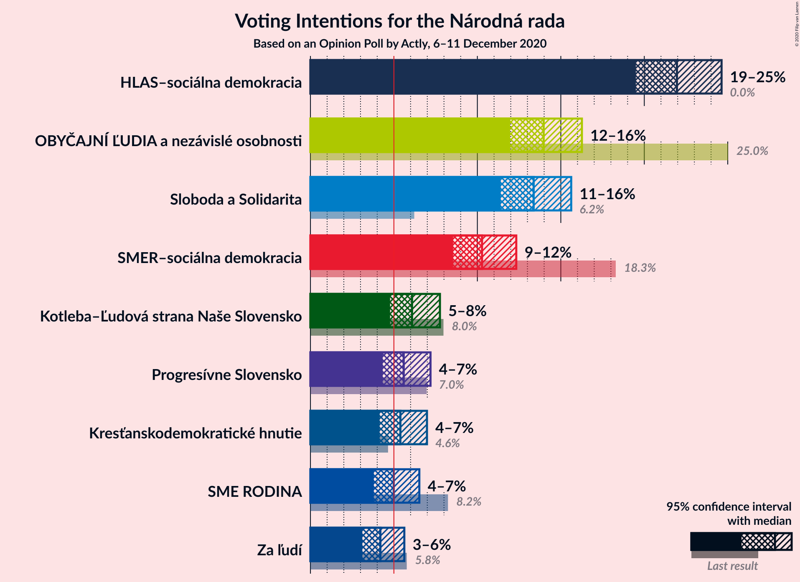

### Confidence Intervals

| Party | Last Result | Poll Result | 80% Confidence Interval | 90% Confidence Interval | 95% Confidence Interval | 99% Confidence Interval |
|:-----:|:-----------:|:-----------:|:-----------------------:|:-----------------------:|:-----------------------:|:-----------------------:|
| HLAS–sociálna demokracia | 0.0% | 22.0% | 20.3–23.7% |19.9–24.2% |19.5–24.6% |18.7–25.5% |
| OBYČAJNÍ ĽUDIA a nezávislé osobnosti | 25.0% | 14.0% | 12.7–15.5% |12.3–15.9% |12.0–16.3% |11.4–17.0% |
| Sloboda a Solidarita | 6.2% | 13.4% | 12.1–14.8% |11.7–15.3% |11.4–15.6% |10.8–16.4% |
| SMER–sociálna demokracia | 18.3% | 10.3% | 9.1–11.6% |8.8–12.0% |8.6–12.3% |8.0–13.0% |
| Kotleba–Ľudová strana Naše Slovensko | 8.0% | 6.1% | 5.2–7.2% |5.0–7.5% |4.8–7.8% |4.4–8.3% |
| Progresívne Slovensko | 7.0% | 5.6% | 4.8–6.6% |4.5–6.9% |4.3–7.2% |4.0–7.7% |
| Kresťanskodemokratické hnutie | 4.6% | 5.4% | 4.6–6.4% |4.3–6.7% |4.1–7.0% |3.8–7.5% |
| SME RODINA | 8.2% | 5.0% | 4.2–6.0% |4.0–6.3% |3.8–6.5% |3.5–7.0% |
| Za ľudí | 5.8% | 4.2% | 3.5–5.1% |3.3–5.4% |3.1–5.6% |2.8–6.1% |

*Note:* The poll result column reflects the actual value used in the calculations. Published results may vary slightly, and in addition be rounded to fewer digits.

## Seats

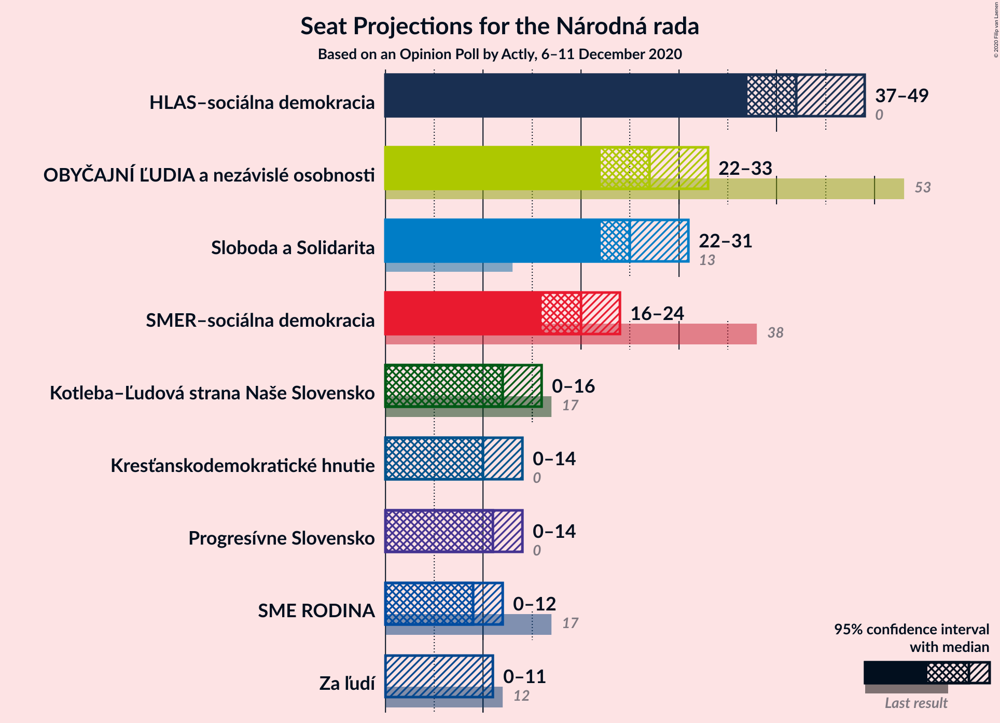

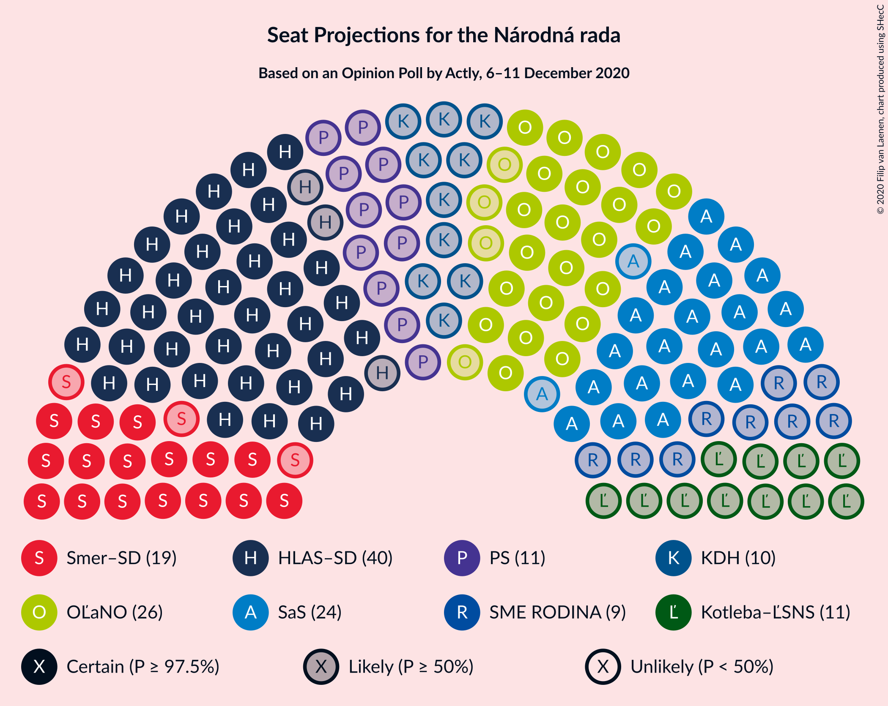

### Confidence Intervals

| Party | Last Result | Median | 80% Confidence Interval | 90% Confidence Interval | 95% Confidence Interval | 99% Confidence Interval |
|:-----:|:-----------:|:------:|:-----------------------:|:-----------------------:|:-----------------------:|:-----------------------:|
| <a href="#hlas–sociálna-demokracia">HLAS–sociálna demokracia</a> | 0 | 42 | 38–47 |37–48 |37–49 |35–52 |
| <a href="#obyčajní-ľudia-a-nezávislé-osobnosti">OBYČAJNÍ ĽUDIA a nezávislé osobnosti</a> | 53 | 27 | 24–31 |23–32 |22–33 |21–35 |
| <a href="#sloboda-a-solidarita">Sloboda a Solidarita</a> | 13 | 25 | 23–29 |22–30 |22–31 |20–32 |
| <a href="#smer–sociálna-demokracia">SMER–sociálna demokracia</a> | 38 | 20 | 17–23 |16–23 |16–24 |15–26 |
| <a href="#kotleba–ľudová-strana-naše-slovensko">Kotleba–Ľudová strana Naše Slovensko</a> | 17 | 12 | 10–14 |0–15 |0–16 |0–17 |
| <a href="#progresívne-slovensko">Progresívne Slovensko</a> | 0 | 11 | 0–13 |0–13 |0–14 |0–15 |
| <a href="#kresťanskodemokratické-hnutie">Kresťanskodemokratické hnutie</a> | 0 | 10 | 0–12 |0–13 |0–14 |0–14 |
| <a href="#sme-rodina">SME RODINA</a> | 17 | 9 | 0–11 |0–12 |0–12 |0–13 |
| <a href="#za-ľudí">Za ľudí</a> | 12 | 0 | 0–9 |0–10 |0–11 |0–11 |

### HLAS–sociálna demokracia

*For a full overview of the results for this party, see the [HLAS–sociálna demokracia](party-hlas–sociálnademokracia.html) page.*

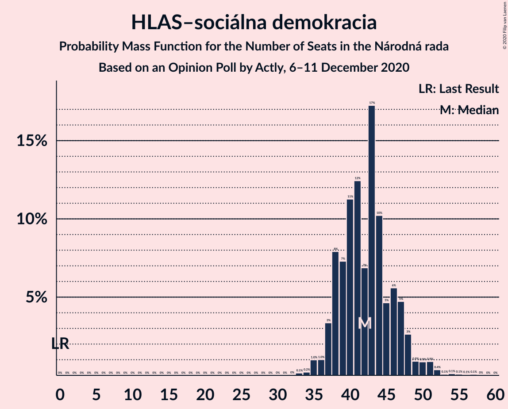

| Number of Seats | Probability | Accumulated | Special Marks |
|:---------------:|:-----------:|:-----------:|:-------------:|
| 0 | 0% | 100% | Last Result |
| 1 | 0% | 100% |  |
| 2 | 0% | 100% |  |
| 3 | 0% | 100% |  |
| 4 | 0% | 100% |  |
| 5 | 0% | 100% |  |
| 6 | 0% | 100% |  |
| 7 | 0% | 100% |  |
| 8 | 0% | 100% |  |
| 9 | 0% | 100% |  |
| 10 | 0% | 100% |  |
| 11 | 0% | 100% |  |
| 12 | 0% | 100% |  |
| 13 | 0% | 100% |  |
| 14 | 0% | 100% |  |
| 15 | 0% | 100% |  |
| 16 | 0% | 100% |  |
| 17 | 0% | 100% |  |
| 18 | 0% | 100% |  |
| 19 | 0% | 100% |  |
| 20 | 0% | 100% |  |
| 21 | 0% | 100% |  |
| 22 | 0% | 100% |  |
| 23 | 0% | 100% |  |
| 24 | 0% | 100% |  |
| 25 | 0% | 100% |  |
| 26 | 0% | 100% |  |
| 27 | 0% | 100% |  |
| 28 | 0% | 100% |  |
| 29 | 0% | 100% |  |
| 30 | 0% | 100% |  |
| 31 | 0% | 100% |  |
| 32 | 0% | 100% |  |
| 33 | 0.1% | 100% |  |
| 34 | 0.2% | 99.8% |  |
| 35 | 1.0% | 99.6% |  |
| 36 | 1.0% | 98.6% |  |
| 37 | 3% | 98% |  |
| 38 | 8% | 94% |  |
| 39 | 7% | 86% |  |
| 40 | 11% | 79% |  |
| 41 | 12% | 68% |  |
| 42 | 7% | 55% | Median |
| 43 | 17% | 48% |  |
| 44 | 10% | 31% |  |
| 45 | 5% | 21% |  |
| 46 | 6% | 16% |  |
| 47 | 5% | 11% |  |
| 48 | 3% | 6% |  |
| 49 | 0.9% | 3% |  |
| 50 | 0.9% | 2% |  |
| 51 | 0.9% | 2% |  |
| 52 | 0.4% | 0.7% |  |
| 53 | 0.1% | 0.4% |  |
| 54 | 0.1% | 0.3% |  |
| 55 | 0.1% | 0.2% |  |
| 56 | 0.1% | 0.1% |  |
| 57 | 0.1% | 0.1% |  |
| 58 | 0% | 0% |  |

### OBYČAJNÍ ĽUDIA a nezávislé osobnosti

*For a full overview of the results for this party, see the [OBYČAJNÍ ĽUDIA a nezávislé osobnosti](party-obyčajníľudiaanezávisléosobnosti.html) page.*

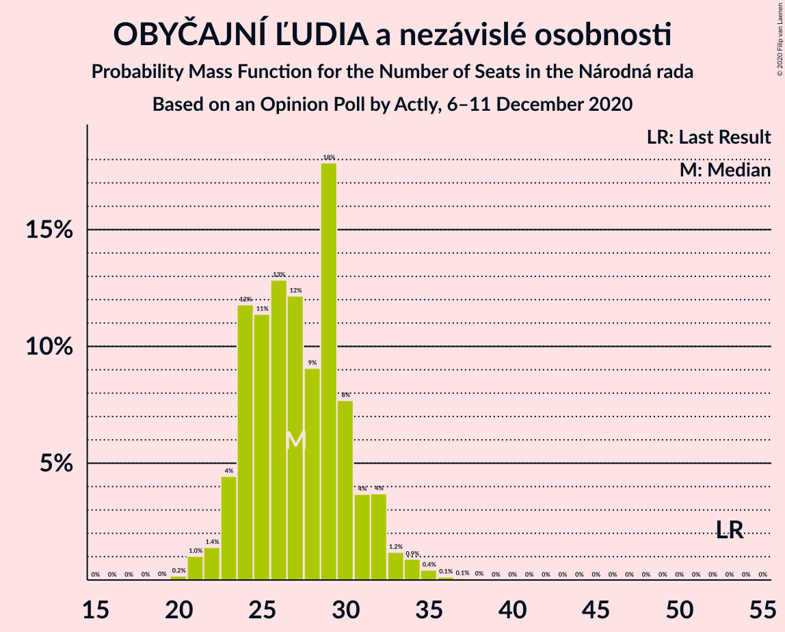

| Number of Seats | Probability | Accumulated | Special Marks |
|:---------------:|:-----------:|:-----------:|:-------------:|
| 20 | 0.2% | 100% |  |
| 21 | 1.0% | 99.8% |  |
| 22 | 1.4% | 98.8% |  |
| 23 | 4% | 97% |  |
| 24 | 12% | 93% |  |
| 25 | 11% | 81% |  |
| 26 | 13% | 70% |  |
| 27 | 12% | 57% | Median |
| 28 | 9% | 45% |  |
| 29 | 18% | 36% |  |
| 30 | 8% | 18% |  |
| 31 | 4% | 10% |  |
| 32 | 4% | 6% |  |
| 33 | 1.2% | 3% |  |
| 34 | 0.9% | 2% |  |
| 35 | 0.4% | 0.7% |  |
| 36 | 0.1% | 0.3% |  |
| 37 | 0.1% | 0.1% |  |
| 38 | 0% | 0% |  |
| 39 | 0% | 0% |  |
| 40 | 0% | 0% |  |
| 41 | 0% | 0% |  |
| 42 | 0% | 0% |  |
| 43 | 0% | 0% |  |
| 44 | 0% | 0% |  |
| 45 | 0% | 0% |  |
| 46 | 0% | 0% |  |
| 47 | 0% | 0% |  |
| 48 | 0% | 0% |  |
| 49 | 0% | 0% |  |
| 50 | 0% | 0% |  |
| 51 | 0% | 0% |  |
| 52 | 0% | 0% |  |
| 53 | 0% | 0% | Last Result |

### Sloboda a Solidarita

*For a full overview of the results for this party, see the [Sloboda a Solidarita](party-slobodaasolidarita.html) page.*

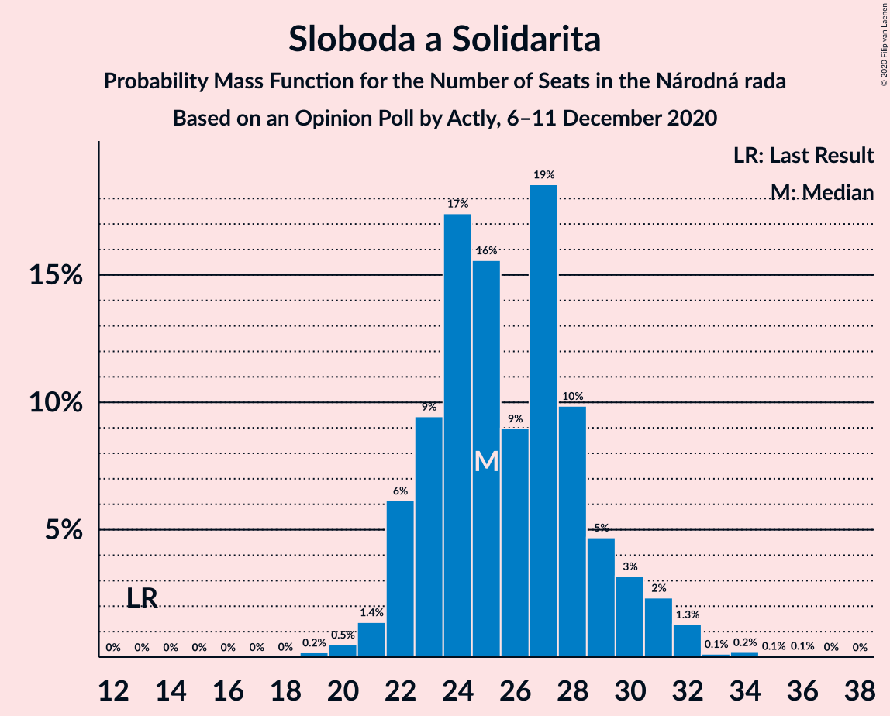

| Number of Seats | Probability | Accumulated | Special Marks |
|:---------------:|:-----------:|:-----------:|:-------------:|
| 13 | 0% | 100% | Last Result |
| 14 | 0% | 100% |  |
| 15 | 0% | 100% |  |
| 16 | 0% | 100% |  |
| 17 | 0% | 100% |  |
| 18 | 0% | 100% |  |
| 19 | 0.2% | 100% |  |
| 20 | 0.5% | 99.8% |  |
| 21 | 1.4% | 99.3% |  |
| 22 | 6% | 98% |  |
| 23 | 9% | 92% |  |
| 24 | 17% | 82% |  |
| 25 | 16% | 65% | Median |
| 26 | 9% | 49% |  |
| 27 | 19% | 40% |  |
| 28 | 10% | 22% |  |
| 29 | 5% | 12% |  |
| 30 | 3% | 7% |  |
| 31 | 2% | 4% |  |
| 32 | 1.3% | 2% |  |
| 33 | 0.1% | 0.5% |  |
| 34 | 0.2% | 0.3% |  |
| 35 | 0.1% | 0.1% |  |
| 36 | 0.1% | 0.1% |  |
| 37 | 0% | 0% |  |

### SMER–sociálna demokracia

*For a full overview of the results for this party, see the [SMER–sociálna demokracia](party-smer–sociálnademokracia.html) page.*

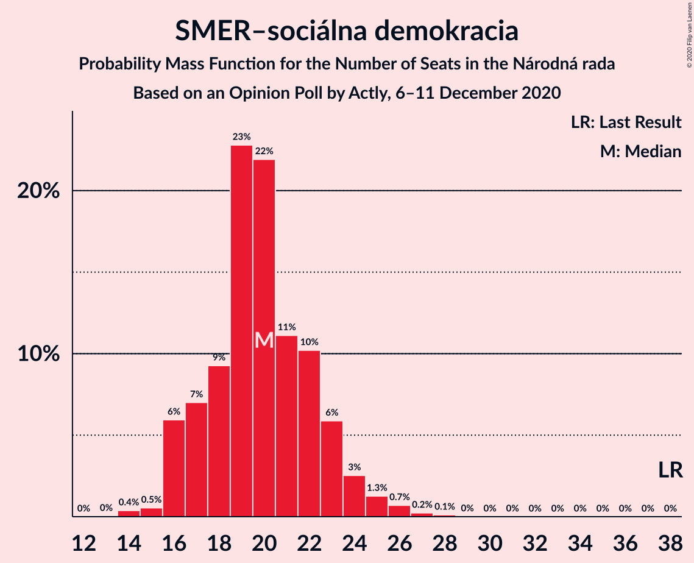

| Number of Seats | Probability | Accumulated | Special Marks |
|:---------------:|:-----------:|:-----------:|:-------------:|
| 14 | 0.4% | 100% |  |
| 15 | 0.5% | 99.6% |  |
| 16 | 6% | 99.0% |  |
| 17 | 7% | 93% |  |
| 18 | 9% | 86% |  |
| 19 | 23% | 77% |  |
| 20 | 22% | 54% | Median |
| 21 | 11% | 32% |  |
| 22 | 10% | 21% |  |
| 23 | 6% | 11% |  |
| 24 | 3% | 5% |  |
| 25 | 1.3% | 2% |  |
| 26 | 0.7% | 1.1% |  |
| 27 | 0.2% | 0.4% |  |
| 28 | 0.1% | 0.1% |  |
| 29 | 0% | 0% |  |
| 30 | 0% | 0% |  |
| 31 | 0% | 0% |  |
| 32 | 0% | 0% |  |
| 33 | 0% | 0% |  |
| 34 | 0% | 0% |  |
| 35 | 0% | 0% |  |
| 36 | 0% | 0% |  |
| 37 | 0% | 0% |  |
| 38 | 0% | 0% | Last Result |

### Kotleba–Ľudová strana Naše Slovensko

*For a full overview of the results for this party, see the [Kotleba–Ľudová strana Naše Slovensko](party-kotleba–ľudovástrananašeslovensko.html) page.*

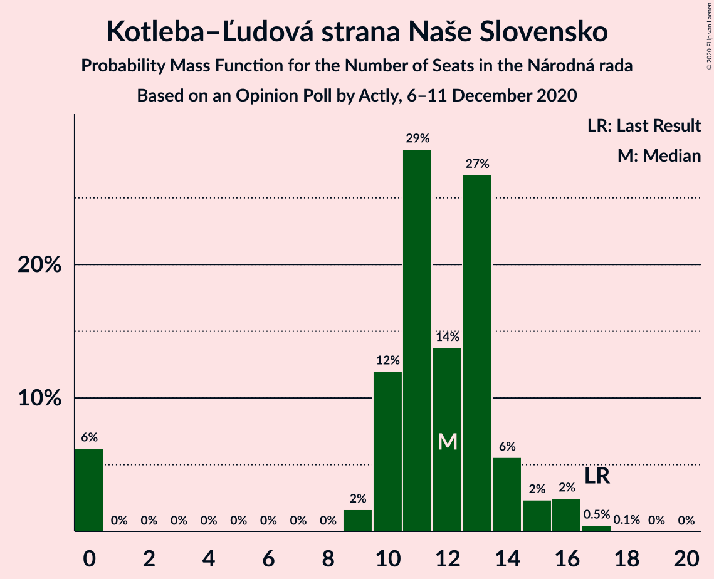

| Number of Seats | Probability | Accumulated | Special Marks |
|:---------------:|:-----------:|:-----------:|:-------------:|
| 0 | 6% | 100% |  |
| 1 | 0% | 94% |  |
| 2 | 0% | 94% |  |
| 3 | 0% | 94% |  |
| 4 | 0% | 94% |  |
| 5 | 0% | 94% |  |
| 6 | 0% | 94% |  |
| 7 | 0% | 94% |  |
| 8 | 0% | 94% |  |
| 9 | 2% | 94% |  |
| 10 | 12% | 92% |  |
| 11 | 29% | 80% |  |
| 12 | 14% | 51% | Median |
| 13 | 27% | 38% |  |
| 14 | 6% | 11% |  |
| 15 | 2% | 5% |  |
| 16 | 2% | 3% |  |
| 17 | 0.5% | 0.5% | Last Result |
| 18 | 0.1% | 0.1% |  |
| 19 | 0% | 0% |  |

### Progresívne Slovensko

*For a full overview of the results for this party, see the [Progresívne Slovensko](party-progresívneslovensko.html) page.*

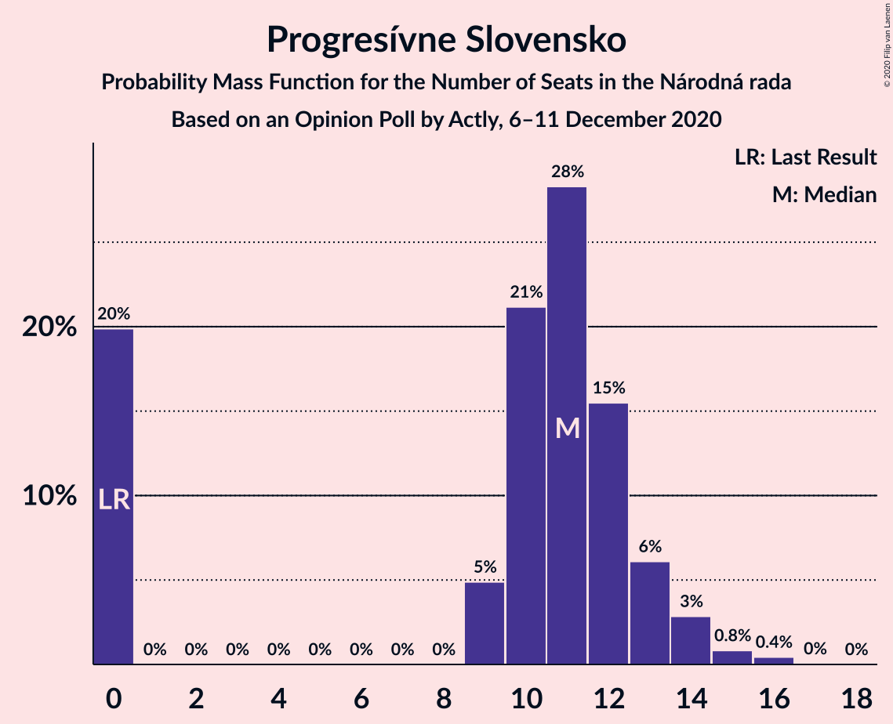

| Number of Seats | Probability | Accumulated | Special Marks |
|:---------------:|:-----------:|:-----------:|:-------------:|
| 0 | 20% | 100% | Last Result |
| 1 | 0% | 80% |  |
| 2 | 0% | 80% |  |
| 3 | 0% | 80% |  |
| 4 | 0% | 80% |  |
| 5 | 0% | 80% |  |
| 6 | 0% | 80% |  |
| 7 | 0% | 80% |  |
| 8 | 0% | 80% |  |
| 9 | 5% | 80% |  |
| 10 | 21% | 75% |  |
| 11 | 28% | 54% | Median |
| 12 | 15% | 26% |  |
| 13 | 6% | 10% |  |
| 14 | 3% | 4% |  |
| 15 | 0.8% | 1.3% |  |
| 16 | 0.4% | 0.5% |  |
| 17 | 0% | 0.1% |  |
| 18 | 0% | 0% |  |

### Kresťanskodemokratické hnutie

*For a full overview of the results for this party, see the [Kresťanskodemokratické hnutie](party-kresťanskodemokratickéhnutie.html) page.*

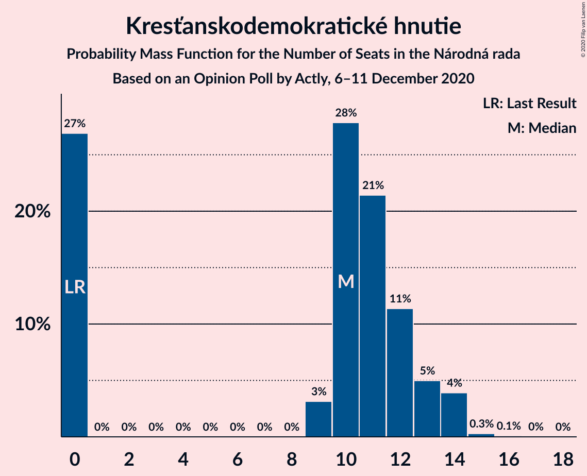

| Number of Seats | Probability | Accumulated | Special Marks |
|:---------------:|:-----------:|:-----------:|:-------------:|
| 0 | 27% | 100% | Last Result |
| 1 | 0% | 73% |  |
| 2 | 0% | 73% |  |
| 3 | 0% | 73% |  |
| 4 | 0% | 73% |  |
| 5 | 0% | 73% |  |
| 6 | 0% | 73% |  |
| 7 | 0% | 73% |  |
| 8 | 0% | 73% |  |
| 9 | 3% | 73% |  |
| 10 | 28% | 70% | Median |
| 11 | 21% | 42% |  |
| 12 | 11% | 21% |  |
| 13 | 5% | 9% |  |
| 14 | 4% | 4% |  |
| 15 | 0.3% | 0.4% |  |
| 16 | 0.1% | 0.1% |  |
| 17 | 0% | 0% |  |

### SME RODINA

*For a full overview of the results for this party, see the [SME RODINA](party-smerodina.html) page.*

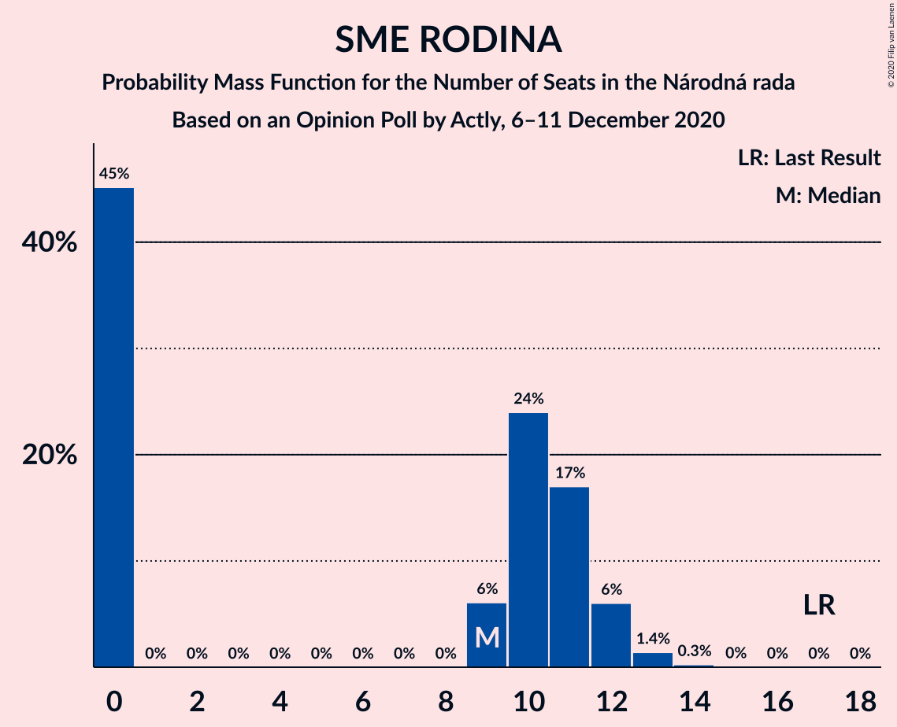

| Number of Seats | Probability | Accumulated | Special Marks |
|:---------------:|:-----------:|:-----------:|:-------------:|
| 0 | 45% | 100% |  |
| 1 | 0% | 55% |  |
| 2 | 0% | 55% |  |
| 3 | 0% | 55% |  |
| 4 | 0% | 55% |  |
| 5 | 0% | 55% |  |
| 6 | 0% | 55% |  |
| 7 | 0% | 55% |  |
| 8 | 0% | 55% |  |
| 9 | 6% | 55% | Median |
| 10 | 24% | 49% |  |
| 11 | 17% | 25% |  |
| 12 | 6% | 8% |  |
| 13 | 1.4% | 2% |  |
| 14 | 0.3% | 0.3% |  |
| 15 | 0% | 0.1% |  |
| 16 | 0% | 0% |  |
| 17 | 0% | 0% | Last Result |

### Za ľudí

*For a full overview of the results for this party, see the [Za ľudí](party-zaľudí.html) page.*

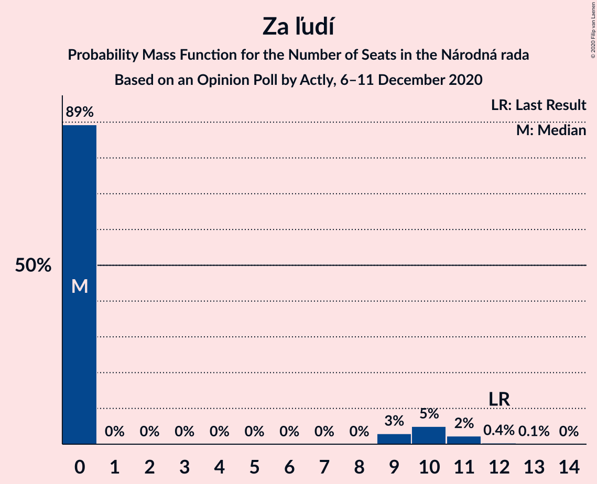

| Number of Seats | Probability | Accumulated | Special Marks |
|:---------------:|:-----------:|:-----------:|:-------------:|
| 0 | 89% | 100% | Median |
| 1 | 0% | 11% |  |
| 2 | 0% | 11% |  |
| 3 | 0% | 11% |  |
| 4 | 0% | 11% |  |
| 5 | 0% | 11% |  |
| 6 | 0% | 11% |  |
| 7 | 0% | 11% |  |
| 8 | 0% | 11% |  |
| 9 | 3% | 11% |  |
| 10 | 5% | 8% |  |
| 11 | 2% | 3% |  |
| 12 | 0.4% | 0.4% | Last Result |
| 13 | 0.1% | 0.1% |  |
| 14 | 0% | 0% |  |

## Coalitions

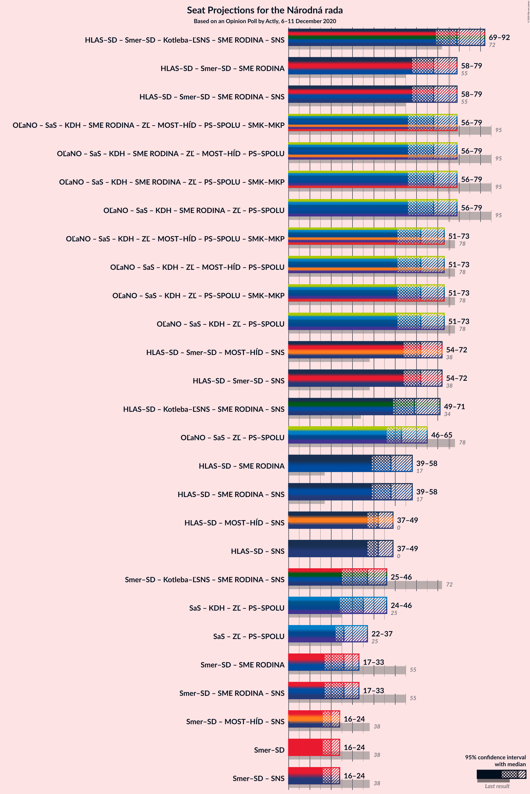

### Confidence Intervals

| Coalition | Last Result | Median | Majority? | 80% Confidence Interval | 90% Confidence Interval | 95% Confidence Interval | 99% Confidence Interval |
|:---------:|:-----------:|:------:|:---------:|:-----------------------:|:-----------------------:|:-----------------------:|:-----------------------:|
| HLAS–sociálna demokracia – SMER–sociálna demokracia – SME RODINA | 55 | 68 | 7% | 60–75 | 59–77 | 58–79 | 55–81 |
| HLAS–sociálna demokracia – SME RODINA | 17 | 48 | 0% | 41–54 | 40–56 | 39–58 | 37–60 |
| SMER–sociálna demokracia – SME RODINA | 55 | 26 | 0% | 19–32 | 18–33 | 17–33 | 16–36 |
| SMER–sociálna demokracia | 38 | 20 | 0% | 17–23 | 16–23 | 16–24 | 15–26 |

### HLAS–sociálna demokracia – SMER–sociálna demokracia – SME RODINA

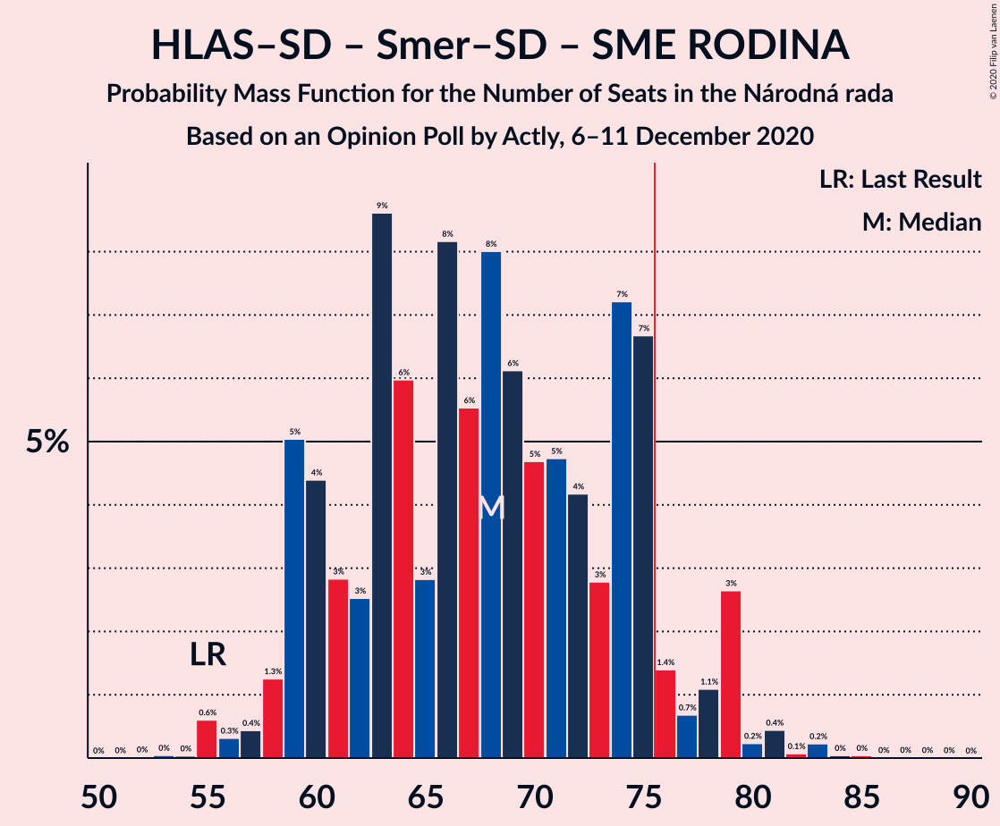

| Number of Seats | Probability | Accumulated | Special Marks |
|:---------------:|:-----------:|:-----------:|:-------------:|
| 53 | 0% | 100% |  |
| 54 | 0% | 99.9% |  |
| 55 | 0.6% | 99.9% | Last Result |
| 56 | 0.3% | 99.3% |  |
| 57 | 0.4% | 99.0% |  |
| 58 | 1.3% | 98.5% |  |
| 59 | 5% | 97% |  |
| 60 | 4% | 92% |  |
| 61 | 3% | 88% |  |
| 62 | 3% | 85% |  |
| 63 | 9% | 82% |  |
| 64 | 6% | 74% |  |
| 65 | 3% | 68% |  |
| 66 | 8% | 65% |  |
| 67 | 6% | 57% |  |
| 68 | 8% | 51% |  |
| 69 | 6% | 43% |  |
| 70 | 5% | 37% |  |
| 71 | 5% | 33% | Median |
| 72 | 4% | 28% |  |
| 73 | 3% | 24% |  |
| 74 | 7% | 21% |  |
| 75 | 7% | 14% |  |
| 76 | 1.4% | 7% | Majority |
| 77 | 0.7% | 6% |  |
| 78 | 1.1% | 5% |  |
| 79 | 3% | 4% |  |
| 80 | 0.2% | 1.1% |  |
| 81 | 0.4% | 0.9% |  |
| 82 | 0.1% | 0.4% |  |
| 83 | 0.2% | 0.4% |  |
| 84 | 0% | 0.1% |  |
| 85 | 0% | 0.1% |  |
| 86 | 0% | 0.1% |  |
| 87 | 0% | 0% |  |

### HLAS–sociálna demokracia – SME RODINA

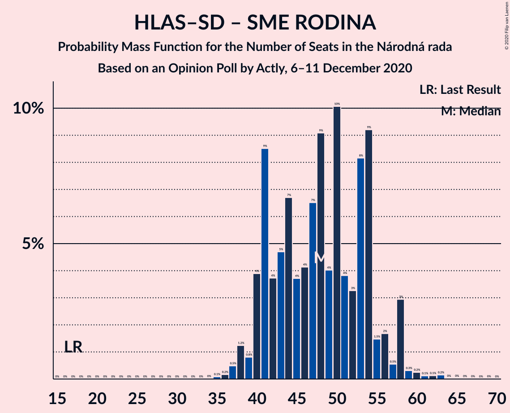

| Number of Seats | Probability | Accumulated | Special Marks |
|:---------------:|:-----------:|:-----------:|:-------------:|
| 17 | 0% | 100% | Last Result |
| 18 | 0% | 100% |  |
| 19 | 0% | 100% |  |
| 20 | 0% | 100% |  |
| 21 | 0% | 100% |  |
| 22 | 0% | 100% |  |
| 23 | 0% | 100% |  |
| 24 | 0% | 100% |  |
| 25 | 0% | 100% |  |
| 26 | 0% | 100% |  |
| 27 | 0% | 100% |  |
| 28 | 0% | 100% |  |
| 29 | 0% | 100% |  |
| 30 | 0% | 100% |  |
| 31 | 0% | 100% |  |
| 32 | 0% | 100% |  |
| 33 | 0% | 100% |  |
| 34 | 0% | 100% |  |
| 35 | 0.1% | 100% |  |
| 36 | 0.2% | 99.9% |  |
| 37 | 0.5% | 99.7% |  |
| 38 | 1.2% | 99.2% |  |
| 39 | 0.8% | 98% |  |
| 40 | 4% | 97% |  |
| 41 | 9% | 93% |  |
| 42 | 4% | 85% |  |
| 43 | 5% | 81% |  |
| 44 | 7% | 76% |  |
| 45 | 4% | 70% |  |
| 46 | 4% | 66% |  |
| 47 | 7% | 62% |  |
| 48 | 9% | 55% |  |
| 49 | 4% | 46% |  |
| 50 | 10% | 42% |  |
| 51 | 4% | 32% | Median |
| 52 | 3% | 28% |  |
| 53 | 8% | 25% |  |
| 54 | 9% | 17% |  |
| 55 | 1.5% | 8% |  |
| 56 | 2% | 6% |  |
| 57 | 0.5% | 5% |  |
| 58 | 3% | 4% |  |
| 59 | 0.3% | 1.0% |  |
| 60 | 0.2% | 0.7% |  |
| 61 | 0.1% | 0.5% |  |
| 62 | 0.1% | 0.4% |  |
| 63 | 0.2% | 0.2% |  |
| 64 | 0% | 0.1% |  |
| 65 | 0% | 0.1% |  |
| 66 | 0% | 0% |  |

### SMER–sociálna demokracia – SME RODINA

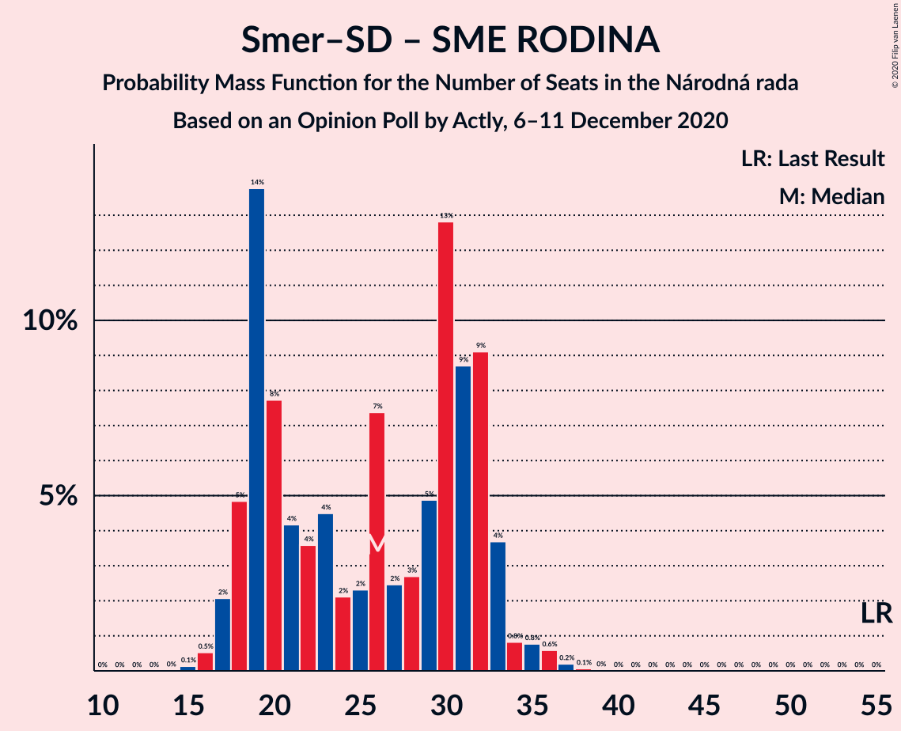

| Number of Seats | Probability | Accumulated | Special Marks |
|:---------------:|:-----------:|:-----------:|:-------------:|
| 15 | 0.1% | 100% |  |
| 16 | 0.5% | 99.8% |  |
| 17 | 2% | 99.3% |  |
| 18 | 5% | 97% |  |
| 19 | 14% | 92% |  |
| 20 | 8% | 79% |  |
| 21 | 4% | 71% |  |
| 22 | 4% | 67% |  |
| 23 | 4% | 63% |  |
| 24 | 2% | 59% |  |
| 25 | 2% | 57% |  |
| 26 | 7% | 54% |  |
| 27 | 2% | 47% |  |
| 28 | 3% | 44% |  |
| 29 | 5% | 42% | Median |
| 30 | 13% | 37% |  |
| 31 | 9% | 24% |  |
| 32 | 9% | 15% |  |
| 33 | 4% | 6% |  |
| 34 | 0.8% | 2% |  |
| 35 | 0.8% | 2% |  |
| 36 | 0.6% | 0.9% |  |
| 37 | 0.2% | 0.3% |  |
| 38 | 0.1% | 0.1% |  |
| 39 | 0% | 0% |  |
| 40 | 0% | 0% |  |
| 41 | 0% | 0% |  |
| 42 | 0% | 0% |  |
| 43 | 0% | 0% |  |
| 44 | 0% | 0% |  |
| 45 | 0% | 0% |  |
| 46 | 0% | 0% |  |
| 47 | 0% | 0% |  |
| 48 | 0% | 0% |  |
| 49 | 0% | 0% |  |
| 50 | 0% | 0% |  |
| 51 | 0% | 0% |  |
| 52 | 0% | 0% |  |
| 53 | 0% | 0% |  |
| 54 | 0% | 0% |  |
| 55 | 0% | 0% | Last Result |

### SMER–sociálna demokracia

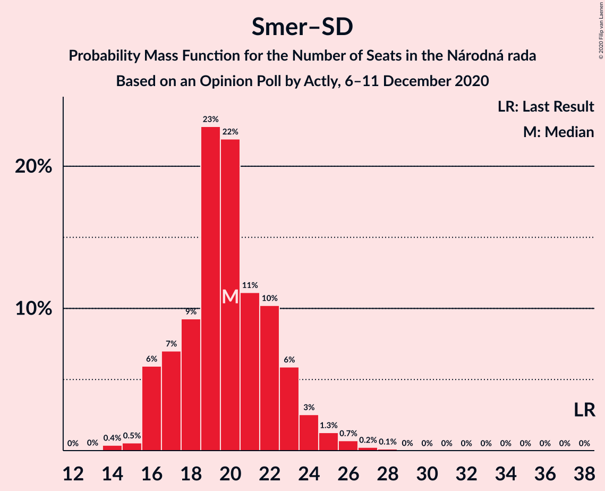

| Number of Seats | Probability | Accumulated | Special Marks |
|:---------------:|:-----------:|:-----------:|:-------------:|
| 14 | 0.4% | 100% |  |
| 15 | 0.5% | 99.6% |  |
| 16 | 6% | 99.0% |  |
| 17 | 7% | 93% |  |
| 18 | 9% | 86% |  |
| 19 | 23% | 77% |  |
| 20 | 22% | 54% | Median |
| 21 | 11% | 32% |  |
| 22 | 10% | 21% |  |
| 23 | 6% | 11% |  |
| 24 | 3% | 5% |  |
| 25 | 1.3% | 2% |  |
| 26 | 0.7% | 1.1% |  |
| 27 | 0.2% | 0.4% |  |
| 28 | 0.1% | 0.1% |  |
| 29 | 0% | 0% |  |
| 30 | 0% | 0% |  |
| 31 | 0% | 0% |  |
| 32 | 0% | 0% |  |
| 33 | 0% | 0% |  |
| 34 | 0% | 0% |  |
| 35 | 0% | 0% |  |
| 36 | 0% | 0% |  |
| 37 | 0% | 0% |  |
| 38 | 0% | 0% | Last Result |

## Technical Information

### Opinion Poll

+ **Polling firm:** Actly
+ **Commissioner(s):** —
+ **Fieldwork period:** 6–11 December 2020

### Calculations

+ **Sample size:** 1002
+ **Simulations done:** 1,048,576
+ **Error estimate:** 0.98%

