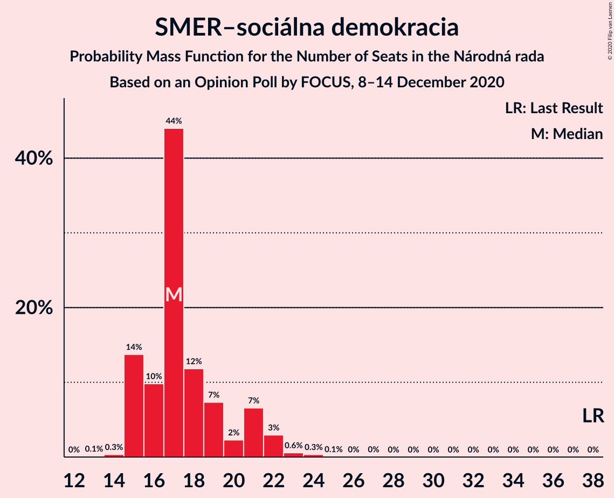
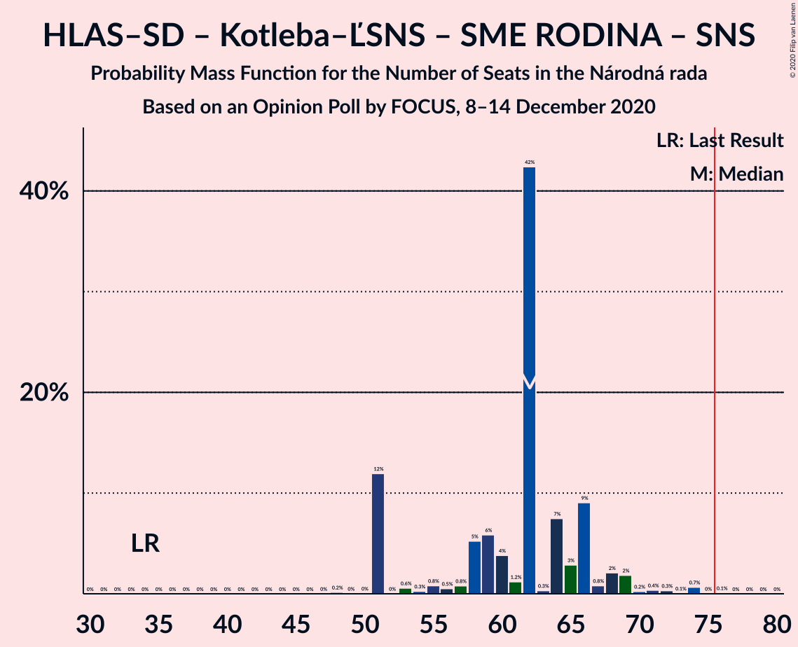

# Opinion Poll by FOCUS, 8–14 December 2020

<a href="#voting-intentions">Voting Intentions</a> | <a href="#seats">Seats</a> | <a href="#coalitions">Coalitions</a> | <a href="#technical-information">Technical Information</a>

## Voting Intentions

### Confidence Intervals

| Party | Last Result | Poll Result | 80% Confidence Interval | 90% Confidence Interval | 95% Confidence Interval | 99% Confidence Interval |
|:-----:|:-----------:|:-----------:|:-----------------------:|:-----------------------:|:-----------------------:|:-----------------------:|
| HLAS–sociálna demokracia | 0.0% | 20.1% | 18.5–21.8% |18.1–22.3% |17.7–22.7% |17.0–23.5% |
| Sloboda a Solidarita | 6.2% | 15.8% | 14.4–17.4% |14.0–17.8% |13.7–18.2% |13.0–19.0% |
| OBYČAJNÍ ĽUDIA a nezávislé osobnosti | 25.0% | 11.0% | 9.8–12.4% |9.5–12.8% |9.2–13.1% |8.7–13.8% |
| SMER–sociálna demokracia | 18.3% | 9.8% | 8.7–11.1% |8.4–11.5% |8.1–11.8% |7.6–12.5% |
| Kotleba–Ľudová strana Naše Slovensko | 8.0% | 8.2% | 7.2–9.4% |6.9–9.8% |6.6–10.1% |6.2–10.7% |
| Progresívne Slovensko | 7.0% | 6.0% | 5.1–7.1% |4.9–7.4% |4.7–7.7% |4.3–8.2% |
| SME RODINA | 8.2% | 5.4% | 4.6–6.4% |4.3–6.7% |4.2–7.0% |3.8–7.5% |
| Kresťanskodemokratické hnutie | 4.6% | 4.9% | 4.1–5.9% |3.9–6.2% |3.7–6.4% |3.4–6.9% |
| Za ľudí | 5.8% | 4.4% | 3.7–5.3% |3.5–5.6% |3.3–5.9% |3.0–6.4% |
| Strana maďarskej koalície–Magyar Koalíció Pártja | 3.9% | 3.3% | 2.7–4.1% |2.5–4.4% |2.4–4.6% |2.1–5.0% |
| Slovenská národná strana | 3.2% | 2.7% | 2.1–3.5% |2.0–3.7% |1.9–3.9% |1.6–4.3% |
| Dobrá voľba | 3.1% | 2.1% | 1.6–2.8% |1.5–3.0% |1.4–3.2% |1.2–3.6% |
| VLASŤ | 2.9% | 2.1% | 1.6–2.8% |1.5–3.0% |1.4–3.2% |1.2–3.6% |
| MOST–HÍD | 2.0% | 2.0% | 1.5–2.7% |1.4–2.9% |1.3–3.1% |1.1–3.4% |
| SPOLU–Občianska Demokracia | 7.0% | 0.4% | 0.2–0.8% |0.2–0.9% |0.2–1.0% |0.1–1.3% |

*Note:* The poll result column reflects the actual value used in the calculations. Published results may vary slightly, and in addition be rounded to fewer digits.

## Seats

### Confidence Intervals

| Party | Last Result | Median | 80% Confidence Interval | 90% Confidence Interval | 95% Confidence Interval | 99% Confidence Interval |
|:-----:|:-----------:|:------:|:-----------------------:|:-----------------------:|:-----------------------:|:-----------------------:|
| <a href="#hlas–sociálna-demokracia">HLAS–sociálna demokracia</a> | 0 | 37 | 35–40 |35–41 |34–42 |33–46 |
| <a href="#sloboda-a-solidarita">Sloboda a Solidarita</a> | 13 | 27 | 26–33 |26–35 |26–35 |25–36 |
| <a href="#obyčajní-ľudia-a-nezávislé-osobnosti">OBYČAJNÍ ĽUDIA a nezávislé osobnosti</a> | 53 | 22 | 18–22 |17–23 |17–24 |16–26 |
| <a href="#smer–sociálna-demokracia">SMER–sociálna demokracia</a> | 38 | 17 | 15–21 |15–21 |15–22 |15–23 |
| <a href="#kotleba–ľudová-strana-naše-slovensko">Kotleba–Ľudová strana Naše Slovensko</a> | 17 | 15 | 14–17 |13–18 |12–21 |11–21 |
| <a href="#progresívne-slovensko">Progresívne Slovensko</a> | 0 | 12 | 10–13 |0–13 |0–13 |0–15 |
| <a href="#sme-rodina">SME RODINA</a> | 17 | 10 | 0–12 |0–12 |0–13 |0–14 |
| <a href="#kresťanskodemokratické-hnutie">Kresťanskodemokratické hnutie</a> | 0 | 10 | 0–11 |0–13 |0–13 |0–13 |
| <a href="#za-ľudí">Za ľudí</a> | 12 | 0 | 0–10 |0–11 |0–11 |0–12 |
| <a href="#strana-maďarskej-koalície–magyar-koalíció-pártja">Strana maďarskej koalície–Magyar Koalíció Pártja</a> | 0 | 0 | 0 |0 |0 |0–9 |
| <a href="#slovenská-národná-strana">Slovenská národná strana</a> | 0 | 0 | 0 |0 |0 |0 |
| <a href="#dobrá-voľba">Dobrá voľba</a> | 0 | 0 | 0 |0 |0 |0 |
| <a href="#vlasť">VLASŤ</a> | 0 | 0 | 0 |0 |0 |0 |
| <a href="#most–híd">MOST–HÍD</a> | 0 | 0 | 0 |0 |0 |0 |
| <a href="#spolu–občianska-demokracia">SPOLU–Občianska Demokracia</a> | 0 | 0 | 0 |0 |0 |0 |

### HLAS–sociálna demokracia

*For a full overview of the results for this party, see the [HLAS–sociálna demokracia](party-hlas–sociálnademokracia.html) page.*

| Number of Seats | Probability | Accumulated | Special Marks |
|:---------------:|:-----------:|:-----------:|:-------------:|
| 0 | 0% | 100% | Last Result |
| 1 | 0% | 100% |  |
| 2 | 0% | 100% |  |
| 3 | 0% | 100% |  |
| 4 | 0% | 100% |  |
| 5 | 0% | 100% |  |
| 6 | 0% | 100% |  |
| 7 | 0% | 100% |  |
| 8 | 0% | 100% |  |
| 9 | 0% | 100% |  |
| 10 | 0% | 100% |  |
| 11 | 0% | 100% |  |
| 12 | 0% | 100% |  |
| 13 | 0% | 100% |  |
| 14 | 0% | 100% |  |
| 15 | 0% | 100% |  |
| 16 | 0% | 100% |  |
| 17 | 0% | 100% |  |
| 18 | 0% | 100% |  |
| 19 | 0% | 100% |  |
| 20 | 0% | 100% |  |
| 21 | 0% | 100% |  |
| 22 | 0% | 100% |  |
| 23 | 0% | 100% |  |
| 24 | 0% | 100% |  |
| 25 | 0% | 100% |  |
| 26 | 0% | 100% |  |
| 27 | 0% | 100% |  |
| 28 | 0% | 100% |  |
| 29 | 0% | 100% |  |
| 30 | 0% | 100% |  |
| 31 | 0.1% | 99.9% |  |
| 32 | 0.1% | 99.9% |  |
| 33 | 1.0% | 99.7% |  |
| 34 | 4% | 98.7% |  |
| 35 | 11% | 95% |  |
| 36 | 15% | 84% |  |
| 37 | 47% | 69% | Median |
| 38 | 5% | 22% |  |
| 39 | 1.1% | 17% |  |
| 40 | 11% | 16% |  |
| 41 | 0.6% | 5% |  |
| 42 | 3% | 5% |  |
| 43 | 0.6% | 2% |  |
| 44 | 0.1% | 1.3% |  |
| 45 | 0.4% | 1.2% |  |
| 46 | 0.7% | 0.9% |  |
| 47 | 0.1% | 0.2% |  |
| 48 | 0% | 0.1% |  |
| 49 | 0% | 0.1% |  |
| 50 | 0% | 0% |  |

### Sloboda a Solidarita

*For a full overview of the results for this party, see the [Sloboda a Solidarita](party-slobodaasolidarita.html) page.*

| Number of Seats | Probability | Accumulated | Special Marks |
|:---------------:|:-----------:|:-----------:|:-------------:|
| 13 | 0% | 100% | Last Result |
| 14 | 0% | 100% |  |
| 15 | 0% | 100% |  |
| 16 | 0% | 100% |  |
| 17 | 0% | 100% |  |
| 18 | 0% | 100% |  |
| 19 | 0% | 100% |  |
| 20 | 0% | 100% |  |
| 21 | 0% | 100% |  |
| 22 | 0% | 100% |  |
| 23 | 0.1% | 100% |  |
| 24 | 0.3% | 99.9% |  |
| 25 | 1.4% | 99.6% |  |
| 26 | 42% | 98% |  |
| 27 | 7% | 56% | Median |
| 28 | 18% | 50% |  |
| 29 | 2% | 32% |  |
| 30 | 1.0% | 30% |  |
| 31 | 17% | 29% |  |
| 32 | 2% | 13% |  |
| 33 | 2% | 11% |  |
| 34 | 2% | 9% |  |
| 35 | 5% | 6% |  |
| 36 | 0.5% | 1.0% |  |
| 37 | 0.3% | 0.5% |  |
| 38 | 0.2% | 0.2% |  |
| 39 | 0% | 0% |  |

### OBYČAJNÍ ĽUDIA a nezávislé osobnosti

*For a full overview of the results for this party, see the [OBYČAJNÍ ĽUDIA a nezávislé osobnosti](party-obyčajníľudiaanezávisléosobnosti.html) page.*

| Number of Seats | Probability | Accumulated | Special Marks |
|:---------------:|:-----------:|:-----------:|:-------------:|
| 15 | 0.1% | 100% |  |
| 16 | 1.3% | 99.9% |  |
| 17 | 6% | 98.6% |  |
| 18 | 10% | 92% |  |
| 19 | 3% | 83% |  |
| 20 | 12% | 79% |  |
| 21 | 15% | 68% |  |
| 22 | 44% | 52% | Median |
| 23 | 5% | 8% |  |
| 24 | 1.5% | 3% |  |
| 25 | 1.0% | 2% |  |
| 26 | 0.4% | 0.6% |  |
| 27 | 0.1% | 0.2% |  |
| 28 | 0.1% | 0.1% |  |
| 29 | 0% | 0% |  |
| 30 | 0% | 0% |  |
| 31 | 0% | 0% |  |
| 32 | 0% | 0% |  |
| 33 | 0% | 0% |  |
| 34 | 0% | 0% |  |
| 35 | 0% | 0% |  |
| 36 | 0% | 0% |  |
| 37 | 0% | 0% |  |
| 38 | 0% | 0% |  |
| 39 | 0% | 0% |  |
| 40 | 0% | 0% |  |
| 41 | 0% | 0% |  |
| 42 | 0% | 0% |  |
| 43 | 0% | 0% |  |
| 44 | 0% | 0% |  |
| 45 | 0% | 0% |  |
| 46 | 0% | 0% |  |
| 47 | 0% | 0% |  |
| 48 | 0% | 0% |  |
| 49 | 0% | 0% |  |
| 50 | 0% | 0% |  |
| 51 | 0% | 0% |  |
| 52 | 0% | 0% |  |
| 53 | 0% | 0% | Last Result |

### SMER–sociálna demokracia

*For a full overview of the results for this party, see the [SMER–sociálna demokracia](party-smer–sociálnademokracia.html) page.*

| Number of Seats | Probability | Accumulated | Special Marks |
|:---------------:|:-----------:|:-----------:|:-------------:|
| 13 | 0.1% | 100% |  |
| 14 | 0.3% | 99.9% |  |
| 15 | 14% | 99.5% |  |
| 16 | 10% | 86% |  |
| 17 | 44% | 76% | Median |
| 18 | 12% | 32% |  |
| 19 | 7% | 20% |  |
| 20 | 2% | 13% |  |
| 21 | 7% | 11% |  |
| 22 | 3% | 4% |  |
| 23 | 0.6% | 1.0% |  |
| 24 | 0.3% | 0.4% |  |
| 25 | 0.1% | 0.1% |  |
| 26 | 0% | 0.1% |  |
| 27 | 0% | 0% |  |
| 28 | 0% | 0% |  |
| 29 | 0% | 0% |  |
| 30 | 0% | 0% |  |
| 31 | 0% | 0% |  |
| 32 | 0% | 0% |  |
| 33 | 0% | 0% |  |
| 34 | 0% | 0% |  |
| 35 | 0% | 0% |  |
| 36 | 0% | 0% |  |
| 37 | 0% | 0% |  |
| 38 | 0% | 0% | Last Result |

### Kotleba–Ľudová strana Naše Slovensko

*For a full overview of the results for this party, see the [Kotleba–Ľudová strana Naše Slovensko](party-kotleba–ľudovástrananašeslovensko.html) page.*

| Number of Seats | Probability | Accumulated | Special Marks |
|:---------------:|:-----------:|:-----------:|:-------------:|
| 11 | 0.7% | 100% |  |
| 12 | 3% | 99.3% |  |
| 13 | 2% | 96% |  |
| 14 | 10% | 94% |  |
| 15 | 57% | 84% | Median |
| 16 | 11% | 27% |  |
| 17 | 7% | 16% | Last Result |
| 18 | 5% | 10% |  |
| 19 | 1.0% | 4% |  |
| 20 | 0.5% | 3% |  |
| 21 | 2% | 3% |  |
| 22 | 0.3% | 0.3% |  |
| 23 | 0% | 0.1% |  |
| 24 | 0.1% | 0.1% |  |
| 25 | 0% | 0% |  |

### Progresívne Slovensko

*For a full overview of the results for this party, see the [Progresívne Slovensko](party-progresívneslovensko.html) page.*

| Number of Seats | Probability | Accumulated | Special Marks |
|:---------------:|:-----------:|:-----------:|:-------------:|
| 0 | 6% | 100% | Last Result |
| 1 | 0% | 94% |  |
| 2 | 0% | 94% |  |
| 3 | 0% | 94% |  |
| 4 | 0% | 94% |  |
| 5 | 0% | 94% |  |
| 6 | 0% | 94% |  |
| 7 | 0% | 94% |  |
| 8 | 0% | 94% |  |
| 9 | 0.1% | 94% |  |
| 10 | 14% | 94% |  |
| 11 | 26% | 80% |  |
| 12 | 7% | 54% | Median |
| 13 | 45% | 47% |  |
| 14 | 2% | 2% |  |
| 15 | 0.4% | 0.7% |  |
| 16 | 0.2% | 0.3% |  |
| 17 | 0% | 0.2% |  |
| 18 | 0.1% | 0.1% |  |
| 19 | 0% | 0% |  |

### SME RODINA

*For a full overview of the results for this party, see the [SME RODINA](party-smerodina.html) page.*

| Number of Seats | Probability | Accumulated | Special Marks |
|:---------------:|:-----------:|:-----------:|:-------------:|
| 0 | 18% | 100% |  |
| 1 | 0% | 82% |  |
| 2 | 0% | 82% |  |
| 3 | 0% | 82% |  |
| 4 | 0% | 82% |  |
| 5 | 0% | 82% |  |
| 6 | 0% | 82% |  |
| 7 | 0% | 82% |  |
| 8 | 0% | 82% |  |
| 9 | 0.6% | 82% |  |
| 10 | 62% | 81% | Median |
| 11 | 9% | 19% |  |
| 12 | 7% | 10% |  |
| 13 | 1.5% | 3% |  |
| 14 | 1.0% | 1.3% |  |
| 15 | 0.2% | 0.2% |  |
| 16 | 0% | 0% |  |
| 17 | 0% | 0% | Last Result |

### Kresťanskodemokratické hnutie

*For a full overview of the results for this party, see the [Kresťanskodemokratické hnutie](party-kresťanskodemokratickéhnutie.html) page.*

| Number of Seats | Probability | Accumulated | Special Marks |
|:---------------:|:-----------:|:-----------:|:-------------:|
| 0 | 22% | 100% | Last Result |
| 1 | 0% | 78% |  |
| 2 | 0% | 78% |  |
| 3 | 0% | 78% |  |
| 4 | 0% | 78% |  |
| 5 | 0% | 78% |  |
| 6 | 0% | 78% |  |
| 7 | 0% | 78% |  |
| 8 | 0% | 78% |  |
| 9 | 6% | 78% |  |
| 10 | 43% | 72% | Median |
| 11 | 21% | 29% |  |
| 12 | 1.2% | 8% |  |
| 13 | 7% | 7% |  |
| 14 | 0.1% | 0.1% |  |
| 15 | 0% | 0% |  |

### Za ľudí

*For a full overview of the results for this party, see the [Za ľudí](party-zaľudí.html) page.*

| Number of Seats | Probability | Accumulated | Special Marks |
|:---------------:|:-----------:|:-----------:|:-------------:|
| 0 | 73% | 100% | Median |
| 1 | 0% | 27% |  |
| 2 | 0% | 27% |  |
| 3 | 0% | 27% |  |
| 4 | 0% | 27% |  |
| 5 | 0% | 27% |  |
| 6 | 0% | 27% |  |
| 7 | 0% | 27% |  |
| 8 | 0% | 27% |  |
| 9 | 0.4% | 27% |  |
| 10 | 21% | 27% |  |
| 11 | 3% | 5% |  |
| 12 | 2% | 2% | Last Result |
| 13 | 0.2% | 0.2% |  |
| 14 | 0% | 0% |  |

### Strana maďarskej koalície–Magyar Koalíció Pártja

*For a full overview of the results for this party, see the [Strana maďarskej koalície–Magyar Koalíció Pártja](party-stranamaďarskejkoalície–magyarkoalíciópártja.html) page.*

| Number of Seats | Probability | Accumulated | Special Marks |
|:---------------:|:-----------:|:-----------:|:-------------:|
| 0 | 99.5% | 100% | Last Result, Median |
| 1 | 0% | 0.5% |  |
| 2 | 0% | 0.5% |  |
| 3 | 0% | 0.5% |  |
| 4 | 0% | 0.5% |  |
| 5 | 0% | 0.5% |  |
| 6 | 0% | 0.5% |  |
| 7 | 0% | 0.5% |  |
| 8 | 0% | 0.5% |  |
| 9 | 0% | 0.5% |  |
| 10 | 0.5% | 0.5% |  |
| 11 | 0% | 0% |  |

### Slovenská národná strana

*For a full overview of the results for this party, see the [Slovenská národná strana](party-slovenskánárodnástrana.html) page.*

| Number of Seats | Probability | Accumulated | Special Marks |
|:---------------:|:-----------:|:-----------:|:-------------:|
| 0 | 100% | 100% | Last Result, Median |

### Dobrá voľba

*For a full overview of the results for this party, see the [Dobrá voľba](party-dobrávoľba.html) page.*

| Number of Seats | Probability | Accumulated | Special Marks |
|:---------------:|:-----------:|:-----------:|:-------------:|
| 0 | 100% | 100% | Last Result, Median |

### VLASŤ

*For a full overview of the results for this party, see the [VLASŤ](party-vlasť.html) page.*

| Number of Seats | Probability | Accumulated | Special Marks |
|:---------------:|:-----------:|:-----------:|:-------------:|
| 0 | 100% | 100% | Last Result, Median |

### MOST–HÍD

*For a full overview of the results for this party, see the [MOST–HÍD](party-most–híd.html) page.*

| Number of Seats | Probability | Accumulated | Special Marks |
|:---------------:|:-----------:|:-----------:|:-------------:|
| 0 | 100% | 100% | Last Result, Median |

### SPOLU–Občianska Demokracia

*For a full overview of the results for this party, see the [SPOLU–Občianska Demokracia](party-spolu–občianskademokracia.html) page.*

| Number of Seats | Probability | Accumulated | Special Marks |
|:---------------:|:-----------:|:-----------:|:-------------:|
| 0 | 100% | 100% | Last Result, Median |

## Coalitions

### Confidence Intervals

| Coalition | Last Result | Median | Majority? | 80% Confidence Interval | 90% Confidence Interval | 95% Confidence Interval | 99% Confidence Interval |
|:---------:|:-----------:|:------:|:---------:|:-----------------------:|:-----------------------:|:-----------------------:|:-----------------------:|
| HLAS–sociálna demokracia – SMER–sociálna demokracia – Kotleba–Ľudová strana Naše Slovensko – SME RODINA – Slovenská národná strana | 72 | 79 | 82% | 69–82 | 69–85 | 69–89 | 69–92 |
| HLAS–sociálna demokracia – SMER–sociálna demokracia – SME RODINA | 55 | 64 | 0.1% | 54–66 | 54–69 | 53–72 | 53–74 |
| HLAS–sociálna demokracia – SMER–sociálna demokracia – SME RODINA – Slovenská národná strana | 55 | 64 | 0.1% | 54–66 | 54–69 | 53–72 | 53–74 |
| HLAS–sociálna demokracia – Kotleba–Ľudová strana Naše Slovensko – SME RODINA – Slovenská národná strana | 34 | 62 | 0.1% | 51–66 | 51–68 | 51–69 | 51–74 |
| HLAS–sociálna demokracia – SMER–sociálna demokracia – Slovenská národná strana – MOST–HÍD | 38 | 54 | 0% | 53–57 | 52–60 | 52–63 | 50–66 |
| HLAS–sociálna demokracia – SMER–sociálna demokracia – Slovenská národná strana | 38 | 54 | 0% | 53–57 | 52–60 | 52–63 | 50–66 |
| HLAS–sociálna demokracia – SME RODINA | 17 | 47 | 0% | 36–50 | 36–50 | 36–53 | 36–57 |
| HLAS–sociálna demokracia – SME RODINA – Slovenská národná strana | 17 | 47 | 0% | 36–50 | 36–50 | 36–53 | 36–57 |
| SMER–sociálna demokracia – Kotleba–Ľudová strana Naše Slovensko – SME RODINA – Slovenská národná strana | 72 | 42 | 0% | 33–47 | 33–47 | 33–48 | 32–53 |
| HLAS–sociálna demokracia – Slovenská národná strana – MOST–HÍD | 0 | 37 | 0% | 35–40 | 35–41 | 34–42 | 33–46 |
| HLAS–sociálna demokracia – Slovenská národná strana | 0 | 37 | 0% | 35–40 | 35–41 | 34–42 | 33–46 |
| SMER–sociálna demokracia – SME RODINA | 55 | 27 | 0% | 18–30 | 18–32 | 16–33 | 16–35 |
| SMER–sociálna demokracia – SME RODINA – Slovenská národná strana | 55 | 27 | 0% | 18–30 | 18–32 | 16–33 | 16–35 |
| SMER–sociálna demokracia – Slovenská národná strana – MOST–HÍD | 38 | 17 | 0% | 15–21 | 15–21 | 15–22 | 15–23 |
| SMER–sociálna demokracia | 38 | 17 | 0% | 15–21 | 15–21 | 15–22 | 15–23 |
| SMER–sociálna demokracia – Slovenská národná strana | 38 | 17 | 0% | 15–21 | 15–21 | 15–22 | 15–23 |

### HLAS–sociálna demokracia – SMER–sociálna demokracia – Kotleba–Ľudová strana Naše Slovensko – SME RODINA – Slovenská národná strana

| Number of Seats | Probability | Accumulated | Special Marks |
|:---------------:|:-----------:|:-----------:|:-------------:|
| 68 | 0.2% | 100% |  |
| 69 | 11% | 99.8% |  |
| 70 | 0.1% | 89% |  |
| 71 | 0.5% | 88% |  |
| 72 | 0.4% | 88% | Last Result |
| 73 | 0.8% | 88% |  |
| 74 | 4% | 87% |  |
| 75 | 0.8% | 83% |  |
| 76 | 0.6% | 82% | Majority |
| 77 | 1.1% | 82% |  |
| 78 | 6% | 81% |  |
| 79 | 44% | 75% | Median |
| 80 | 7% | 31% |  |
| 81 | 11% | 24% |  |
| 82 | 4% | 13% |  |
| 83 | 4% | 9% |  |
| 84 | 0.2% | 5% |  |
| 85 | 0.6% | 5% |  |
| 86 | 0.7% | 5% |  |
| 87 | 0.6% | 4% |  |
| 88 | 0.5% | 3% |  |
| 89 | 0.5% | 3% |  |
| 90 | 2% | 2% |  |
| 91 | 0% | 0.6% |  |
| 92 | 0.1% | 0.6% |  |
| 93 | 0.4% | 0.5% |  |
| 94 | 0.1% | 0.1% |  |
| 95 | 0% | 0% |  |

### HLAS–sociálna demokracia – SMER–sociálna demokracia – SME RODINA

| Number of Seats | Probability | Accumulated | Special Marks |
|:---------------:|:-----------:|:-----------:|:-------------:|
| 51 | 0.1% | 100% |  |
| 52 | 0% | 99.9% |  |
| 53 | 3% | 99.9% |  |
| 54 | 11% | 97% |  |
| 55 | 0.3% | 86% | Last Result |
| 56 | 0.1% | 86% |  |
| 57 | 0.6% | 86% |  |
| 58 | 1.0% | 85% |  |
| 59 | 0.4% | 84% |  |
| 60 | 1.0% | 84% |  |
| 61 | 0.4% | 83% |  |
| 62 | 2% | 82% |  |
| 63 | 5% | 81% |  |
| 64 | 49% | 76% | Median |
| 65 | 15% | 27% |  |
| 66 | 3% | 12% |  |
| 67 | 0.7% | 10% |  |
| 68 | 4% | 9% |  |
| 69 | 0.9% | 5% |  |
| 70 | 0.4% | 4% |  |
| 71 | 1.3% | 4% |  |
| 72 | 0.6% | 3% |  |
| 73 | 0.5% | 2% |  |
| 74 | 1.4% | 2% |  |
| 75 | 0.2% | 0.3% |  |
| 76 | 0% | 0.1% | Majority |
| 77 | 0.1% | 0.1% |  |
| 78 | 0% | 0% |  |

### HLAS–sociálna demokracia – SMER–sociálna demokracia – SME RODINA – Slovenská národná strana

| Number of Seats | Probability | Accumulated | Special Marks |
|:---------------:|:-----------:|:-----------:|:-------------:|
| 51 | 0.1% | 100% |  |
| 52 | 0% | 99.9% |  |
| 53 | 3% | 99.9% |  |
| 54 | 11% | 97% |  |
| 55 | 0.3% | 86% | Last Result |
| 56 | 0.1% | 86% |  |
| 57 | 0.6% | 86% |  |
| 58 | 1.0% | 85% |  |
| 59 | 0.4% | 84% |  |
| 60 | 1.0% | 84% |  |
| 61 | 0.4% | 83% |  |
| 62 | 2% | 82% |  |
| 63 | 5% | 81% |  |
| 64 | 49% | 76% | Median |
| 65 | 15% | 27% |  |
| 66 | 3% | 12% |  |
| 67 | 0.7% | 10% |  |
| 68 | 4% | 9% |  |
| 69 | 0.9% | 5% |  |
| 70 | 0.4% | 4% |  |
| 71 | 1.3% | 4% |  |
| 72 | 0.6% | 3% |  |
| 73 | 0.5% | 2% |  |
| 74 | 1.4% | 2% |  |
| 75 | 0.2% | 0.3% |  |
| 76 | 0% | 0.1% | Majority |
| 77 | 0.1% | 0.1% |  |
| 78 | 0% | 0% |  |

### HLAS–sociálna demokracia – Kotleba–Ľudová strana Naše Slovensko – SME RODINA – Slovenská národná strana

| Number of Seats | Probability | Accumulated | Special Marks |
|:---------------:|:-----------:|:-----------:|:-------------:|
| 34 | 0% | 100% | Last Result |
| 35 | 0% | 100% |  |
| 36 | 0% | 100% |  |
| 37 | 0% | 100% |  |
| 38 | 0% | 100% |  |
| 39 | 0% | 100% |  |
| 40 | 0% | 100% |  |
| 41 | 0% | 100% |  |
| 42 | 0% | 100% |  |
| 43 | 0% | 100% |  |
| 44 | 0% | 100% |  |
| 45 | 0% | 100% |  |
| 46 | 0% | 100% |  |
| 47 | 0% | 100% |  |
| 48 | 0.2% | 100% |  |
| 49 | 0% | 99.8% |  |
| 50 | 0% | 99.8% |  |
| 51 | 12% | 99.7% |  |
| 52 | 0% | 88% |  |
| 53 | 0.6% | 88% |  |
| 54 | 0.3% | 87% |  |
| 55 | 0.8% | 87% |  |
| 56 | 0.5% | 86% |  |
| 57 | 0.8% | 86% |  |
| 58 | 5% | 85% |  |
| 59 | 6% | 80% |  |
| 60 | 4% | 74% |  |
| 61 | 1.2% | 70% |  |
| 62 | 42% | 69% | Median |
| 63 | 0.3% | 26% |  |
| 64 | 7% | 26% |  |
| 65 | 3% | 18% |  |
| 66 | 9% | 16% |  |
| 67 | 0.8% | 7% |  |
| 68 | 2% | 6% |  |
| 69 | 2% | 4% |  |
| 70 | 0.2% | 2% |  |
| 71 | 0.4% | 2% |  |
| 72 | 0.3% | 1.2% |  |
| 73 | 0.1% | 0.8% |  |
| 74 | 0.7% | 0.8% |  |
| 75 | 0% | 0.1% |  |
| 76 | 0.1% | 0.1% | Majority |
| 77 | 0% | 0% |  |

### HLAS–sociálna demokracia – SMER–sociálna demokracia – Slovenská národná strana – MOST–HÍD

| Number of Seats | Probability | Accumulated | Special Marks |
|:---------------:|:-----------:|:-----------:|:-------------:|
| 38 | 0% | 100% | Last Result |
| 39 | 0% | 100% |  |
| 40 | 0% | 100% |  |
| 41 | 0% | 100% |  |
| 42 | 0% | 100% |  |
| 43 | 0% | 100% |  |
| 44 | 0% | 100% |  |
| 45 | 0% | 100% |  |
| 46 | 0% | 100% |  |
| 47 | 0.1% | 100% |  |
| 48 | 0% | 99.8% |  |
| 49 | 0.2% | 99.8% |  |
| 50 | 1.1% | 99.6% |  |
| 51 | 0.9% | 98% |  |
| 52 | 3% | 98% |  |
| 53 | 10% | 94% |  |
| 54 | 57% | 84% | Median |
| 55 | 14% | 27% |  |
| 56 | 1.3% | 14% |  |
| 57 | 5% | 12% |  |
| 58 | 2% | 8% |  |
| 59 | 0.7% | 6% |  |
| 60 | 1.0% | 5% |  |
| 61 | 0.2% | 4% |  |
| 62 | 1.0% | 4% |  |
| 63 | 2% | 3% |  |
| 64 | 0.3% | 0.9% |  |
| 65 | 0.1% | 0.6% |  |
| 66 | 0.1% | 0.5% |  |
| 67 | 0.2% | 0.5% |  |
| 68 | 0.1% | 0.2% |  |
| 69 | 0.1% | 0.2% |  |
| 70 | 0% | 0.1% |  |
| 71 | 0% | 0% |  |

### HLAS–sociálna demokracia – SMER–sociálna demokracia – Slovenská národná strana

| Number of Seats | Probability | Accumulated | Special Marks |
|:---------------:|:-----------:|:-----------:|:-------------:|
| 38 | 0% | 100% | Last Result |
| 39 | 0% | 100% |  |
| 40 | 0% | 100% |  |
| 41 | 0% | 100% |  |
| 42 | 0% | 100% |  |
| 43 | 0% | 100% |  |
| 44 | 0% | 100% |  |
| 45 | 0% | 100% |  |
| 46 | 0% | 100% |  |
| 47 | 0.1% | 100% |  |
| 48 | 0% | 99.8% |  |
| 49 | 0.2% | 99.8% |  |
| 50 | 1.1% | 99.6% |  |
| 51 | 0.9% | 98% |  |
| 52 | 3% | 98% |  |
| 53 | 10% | 94% |  |
| 54 | 57% | 84% | Median |
| 55 | 14% | 27% |  |
| 56 | 1.3% | 14% |  |
| 57 | 5% | 12% |  |
| 58 | 2% | 8% |  |
| 59 | 0.7% | 6% |  |
| 60 | 1.0% | 5% |  |
| 61 | 0.2% | 4% |  |
| 62 | 1.0% | 4% |  |
| 63 | 2% | 3% |  |
| 64 | 0.3% | 0.9% |  |
| 65 | 0.1% | 0.6% |  |
| 66 | 0.1% | 0.5% |  |
| 67 | 0.2% | 0.5% |  |
| 68 | 0.1% | 0.2% |  |
| 69 | 0.1% | 0.2% |  |
| 70 | 0% | 0.1% |  |
| 71 | 0% | 0% |  |

### HLAS–sociálna demokracia – SME RODINA

| Number of Seats | Probability | Accumulated | Special Marks |
|:---------------:|:-----------:|:-----------:|:-------------:|
| 17 | 0% | 100% | Last Result |
| 18 | 0% | 100% |  |
| 19 | 0% | 100% |  |
| 20 | 0% | 100% |  |
| 21 | 0% | 100% |  |
| 22 | 0% | 100% |  |
| 23 | 0% | 100% |  |
| 24 | 0% | 100% |  |
| 25 | 0% | 100% |  |
| 26 | 0% | 100% |  |
| 27 | 0% | 100% |  |
| 28 | 0% | 100% |  |
| 29 | 0% | 100% |  |
| 30 | 0% | 100% |  |
| 31 | 0% | 100% |  |
| 32 | 0% | 100% |  |
| 33 | 0.2% | 100% |  |
| 34 | 0.2% | 99.8% |  |
| 35 | 0.1% | 99.6% |  |
| 36 | 12% | 99.6% |  |
| 37 | 3% | 88% |  |
| 38 | 0.9% | 85% |  |
| 39 | 0.3% | 84% |  |
| 40 | 0.1% | 84% |  |
| 41 | 0.4% | 84% |  |
| 42 | 1.1% | 84% |  |
| 43 | 0.5% | 82% |  |
| 44 | 2% | 82% |  |
| 45 | 8% | 81% |  |
| 46 | 3% | 72% |  |
| 47 | 48% | 69% | Median |
| 48 | 0.6% | 21% |  |
| 49 | 2% | 20% |  |
| 50 | 14% | 18% |  |
| 51 | 0.3% | 4% |  |
| 52 | 0.5% | 3% |  |
| 53 | 2% | 3% |  |
| 54 | 0.1% | 1.3% |  |
| 55 | 0.2% | 1.2% |  |
| 56 | 0.4% | 0.9% |  |
| 57 | 0.5% | 0.5% |  |
| 58 | 0% | 0% |  |

### HLAS–sociálna demokracia – SME RODINA – Slovenská národná strana

| Number of Seats | Probability | Accumulated | Special Marks |
|:---------------:|:-----------:|:-----------:|:-------------:|
| 17 | 0% | 100% | Last Result |
| 18 | 0% | 100% |  |
| 19 | 0% | 100% |  |
| 20 | 0% | 100% |  |
| 21 | 0% | 100% |  |
| 22 | 0% | 100% |  |
| 23 | 0% | 100% |  |
| 24 | 0% | 100% |  |
| 25 | 0% | 100% |  |
| 26 | 0% | 100% |  |
| 27 | 0% | 100% |  |
| 28 | 0% | 100% |  |
| 29 | 0% | 100% |  |
| 30 | 0% | 100% |  |
| 31 | 0% | 100% |  |
| 32 | 0% | 100% |  |
| 33 | 0.2% | 100% |  |
| 34 | 0.2% | 99.8% |  |
| 35 | 0.1% | 99.6% |  |
| 36 | 12% | 99.6% |  |
| 37 | 3% | 88% |  |
| 38 | 0.9% | 85% |  |
| 39 | 0.3% | 84% |  |
| 40 | 0.1% | 84% |  |
| 41 | 0.4% | 84% |  |
| 42 | 1.1% | 84% |  |
| 43 | 0.5% | 82% |  |
| 44 | 2% | 82% |  |
| 45 | 8% | 81% |  |
| 46 | 3% | 72% |  |
| 47 | 48% | 69% | Median |
| 48 | 0.6% | 21% |  |
| 49 | 2% | 20% |  |
| 50 | 14% | 18% |  |
| 51 | 0.3% | 4% |  |
| 52 | 0.5% | 3% |  |
| 53 | 2% | 3% |  |
| 54 | 0.1% | 1.3% |  |
| 55 | 0.2% | 1.2% |  |
| 56 | 0.4% | 0.9% |  |
| 57 | 0.5% | 0.5% |  |
| 58 | 0% | 0% |  |

### SMER–sociálna demokracia – Kotleba–Ľudová strana Naše Slovensko – SME RODINA – Slovenská národná strana

| Number of Seats | Probability | Accumulated | Special Marks |
|:---------------:|:-----------:|:-----------:|:-------------:|
| 30 | 0.3% | 100% |  |
| 31 | 0.1% | 99.7% |  |
| 32 | 0.4% | 99.7% |  |
| 33 | 12% | 99.2% |  |
| 34 | 0.2% | 87% |  |
| 35 | 0.2% | 87% |  |
| 36 | 0.2% | 87% |  |
| 37 | 4% | 87% |  |
| 38 | 0.8% | 83% |  |
| 39 | 0.9% | 82% |  |
| 40 | 0.6% | 81% |  |
| 41 | 13% | 81% |  |
| 42 | 41% | 68% | Median |
| 43 | 12% | 28% |  |
| 44 | 2% | 16% |  |
| 45 | 2% | 13% |  |
| 46 | 0.7% | 11% |  |
| 47 | 7% | 10% |  |
| 48 | 2% | 4% |  |
| 49 | 0.1% | 2% |  |
| 50 | 0.3% | 2% |  |
| 51 | 0.1% | 1.3% |  |
| 52 | 0.3% | 1.1% |  |
| 53 | 0.6% | 0.8% |  |
| 54 | 0% | 0.3% |  |
| 55 | 0.3% | 0.3% |  |
| 56 | 0% | 0% |  |
| 57 | 0% | 0% |  |
| 58 | 0% | 0% |  |
| 59 | 0% | 0% |  |
| 60 | 0% | 0% |  |
| 61 | 0% | 0% |  |
| 62 | 0% | 0% |  |
| 63 | 0% | 0% |  |
| 64 | 0% | 0% |  |
| 65 | 0% | 0% |  |
| 66 | 0% | 0% |  |
| 67 | 0% | 0% |  |
| 68 | 0% | 0% |  |
| 69 | 0% | 0% |  |
| 70 | 0% | 0% |  |
| 71 | 0% | 0% |  |
| 72 | 0% | 0% | Last Result |

### HLAS–sociálna demokracia – Slovenská národná strana – MOST–HÍD

| Number of Seats | Probability | Accumulated | Special Marks |
|:---------------:|:-----------:|:-----------:|:-------------:|
| 0 | 0% | 100% | Last Result |
| 1 | 0% | 100% |  |
| 2 | 0% | 100% |  |
| 3 | 0% | 100% |  |
| 4 | 0% | 100% |  |
| 5 | 0% | 100% |  |
| 6 | 0% | 100% |  |
| 7 | 0% | 100% |  |
| 8 | 0% | 100% |  |
| 9 | 0% | 100% |  |
| 10 | 0% | 100% |  |
| 11 | 0% | 100% |  |
| 12 | 0% | 100% |  |
| 13 | 0% | 100% |  |
| 14 | 0% | 100% |  |
| 15 | 0% | 100% |  |
| 16 | 0% | 100% |  |
| 17 | 0% | 100% |  |
| 18 | 0% | 100% |  |
| 19 | 0% | 100% |  |
| 20 | 0% | 100% |  |
| 21 | 0% | 100% |  |
| 22 | 0% | 100% |  |
| 23 | 0% | 100% |  |
| 24 | 0% | 100% |  |
| 25 | 0% | 100% |  |
| 26 | 0% | 100% |  |
| 27 | 0% | 100% |  |
| 28 | 0% | 100% |  |
| 29 | 0% | 100% |  |
| 30 | 0% | 100% |  |
| 31 | 0.1% | 99.9% |  |
| 32 | 0.1% | 99.9% |  |
| 33 | 1.0% | 99.7% |  |
| 34 | 4% | 98.7% |  |
| 35 | 11% | 95% |  |
| 36 | 15% | 84% |  |
| 37 | 47% | 69% | Median |
| 38 | 5% | 22% |  |
| 39 | 1.1% | 17% |  |
| 40 | 11% | 16% |  |
| 41 | 0.6% | 5% |  |
| 42 | 3% | 5% |  |
| 43 | 0.6% | 2% |  |
| 44 | 0.1% | 1.4% |  |
| 45 | 0.4% | 1.2% |  |
| 46 | 0.7% | 0.9% |  |
| 47 | 0.1% | 0.2% |  |
| 48 | 0% | 0.1% |  |
| 49 | 0% | 0.1% |  |
| 50 | 0% | 0.1% |  |
| 51 | 0% | 0% |  |

### HLAS–sociálna demokracia – Slovenská národná strana

| Number of Seats | Probability | Accumulated | Special Marks |
|:---------------:|:-----------:|:-----------:|:-------------:|
| 0 | 0% | 100% | Last Result |
| 1 | 0% | 100% |  |
| 2 | 0% | 100% |  |
| 3 | 0% | 100% |  |
| 4 | 0% | 100% |  |
| 5 | 0% | 100% |  |
| 6 | 0% | 100% |  |
| 7 | 0% | 100% |  |
| 8 | 0% | 100% |  |
| 9 | 0% | 100% |  |
| 10 | 0% | 100% |  |
| 11 | 0% | 100% |  |
| 12 | 0% | 100% |  |
| 13 | 0% | 100% |  |
| 14 | 0% | 100% |  |
| 15 | 0% | 100% |  |
| 16 | 0% | 100% |  |
| 17 | 0% | 100% |  |
| 18 | 0% | 100% |  |
| 19 | 0% | 100% |  |
| 20 | 0% | 100% |  |
| 21 | 0% | 100% |  |
| 22 | 0% | 100% |  |
| 23 | 0% | 100% |  |
| 24 | 0% | 100% |  |
| 25 | 0% | 100% |  |
| 26 | 0% | 100% |  |
| 27 | 0% | 100% |  |
| 28 | 0% | 100% |  |
| 29 | 0% | 100% |  |
| 30 | 0% | 100% |  |
| 31 | 0.1% | 99.9% |  |
| 32 | 0.1% | 99.9% |  |
| 33 | 1.0% | 99.7% |  |
| 34 | 4% | 98.7% |  |
| 35 | 11% | 95% |  |
| 36 | 15% | 84% |  |
| 37 | 47% | 69% | Median |
| 38 | 5% | 22% |  |
| 39 | 1.1% | 17% |  |
| 40 | 11% | 16% |  |
| 41 | 0.6% | 5% |  |
| 42 | 3% | 5% |  |
| 43 | 0.6% | 2% |  |
| 44 | 0.1% | 1.4% |  |
| 45 | 0.4% | 1.2% |  |
| 46 | 0.7% | 0.9% |  |
| 47 | 0.1% | 0.2% |  |
| 48 | 0% | 0.1% |  |
| 49 | 0% | 0.1% |  |
| 50 | 0% | 0.1% |  |
| 51 | 0% | 0% |  |

### SMER–sociálna demokracia – SME RODINA

| Number of Seats | Probability | Accumulated | Special Marks |
|:---------------:|:-----------:|:-----------:|:-------------:|
| 14 | 0.1% | 100% |  |
| 15 | 0% | 99.9% |  |
| 16 | 3% | 99.9% |  |
| 17 | 0.2% | 97% |  |
| 18 | 11% | 97% |  |
| 19 | 0.4% | 86% |  |
| 20 | 1.2% | 85% |  |
| 21 | 1.1% | 84% |  |
| 22 | 0.3% | 83% |  |
| 23 | 0.6% | 83% |  |
| 24 | 0.4% | 82% |  |
| 25 | 11% | 82% |  |
| 26 | 5% | 70% |  |
| 27 | 44% | 66% | Median |
| 28 | 1.2% | 22% |  |
| 29 | 9% | 20% |  |
| 30 | 1.4% | 11% |  |
| 31 | 1.2% | 10% |  |
| 32 | 5% | 9% |  |
| 33 | 3% | 4% |  |
| 34 | 0.2% | 1.0% |  |
| 35 | 0.5% | 0.8% |  |
| 36 | 0.3% | 0.3% |  |
| 37 | 0% | 0% |  |
| 38 | 0% | 0% |  |
| 39 | 0% | 0% |  |
| 40 | 0% | 0% |  |
| 41 | 0% | 0% |  |
| 42 | 0% | 0% |  |
| 43 | 0% | 0% |  |
| 44 | 0% | 0% |  |
| 45 | 0% | 0% |  |
| 46 | 0% | 0% |  |
| 47 | 0% | 0% |  |
| 48 | 0% | 0% |  |
| 49 | 0% | 0% |  |
| 50 | 0% | 0% |  |
| 51 | 0% | 0% |  |
| 52 | 0% | 0% |  |
| 53 | 0% | 0% |  |
| 54 | 0% | 0% |  |
| 55 | 0% | 0% | Last Result |

### SMER–sociálna demokracia – SME RODINA – Slovenská národná strana

| Number of Seats | Probability | Accumulated | Special Marks |
|:---------------:|:-----------:|:-----------:|:-------------:|
| 14 | 0.1% | 100% |  |
| 15 | 0% | 99.9% |  |
| 16 | 3% | 99.9% |  |
| 17 | 0.2% | 97% |  |
| 18 | 11% | 97% |  |
| 19 | 0.4% | 86% |  |
| 20 | 1.2% | 85% |  |
| 21 | 1.1% | 84% |  |
| 22 | 0.3% | 83% |  |
| 23 | 0.6% | 83% |  |
| 24 | 0.4% | 82% |  |
| 25 | 11% | 82% |  |
| 26 | 5% | 70% |  |
| 27 | 44% | 66% | Median |
| 28 | 1.2% | 22% |  |
| 29 | 9% | 20% |  |
| 30 | 1.4% | 11% |  |
| 31 | 1.2% | 10% |  |
| 32 | 5% | 9% |  |
| 33 | 3% | 4% |  |
| 34 | 0.2% | 1.0% |  |
| 35 | 0.5% | 0.8% |  |
| 36 | 0.3% | 0.3% |  |
| 37 | 0% | 0.1% |  |
| 38 | 0% | 0% |  |
| 39 | 0% | 0% |  |
| 40 | 0% | 0% |  |
| 41 | 0% | 0% |  |
| 42 | 0% | 0% |  |
| 43 | 0% | 0% |  |
| 44 | 0% | 0% |  |
| 45 | 0% | 0% |  |
| 46 | 0% | 0% |  |
| 47 | 0% | 0% |  |
| 48 | 0% | 0% |  |
| 49 | 0% | 0% |  |
| 50 | 0% | 0% |  |
| 51 | 0% | 0% |  |
| 52 | 0% | 0% |  |
| 53 | 0% | 0% |  |
| 54 | 0% | 0% |  |
| 55 | 0% | 0% | Last Result |

### SMER–sociálna demokracia – Slovenská národná strana – MOST–HÍD

| Number of Seats | Probability | Accumulated | Special Marks |
|:---------------:|:-----------:|:-----------:|:-------------:|
| 13 | 0.1% | 100% |  |
| 14 | 0.3% | 99.9% |  |
| 15 | 14% | 99.5% |  |
| 16 | 10% | 86% |  |
| 17 | 44% | 76% | Median |
| 18 | 12% | 32% |  |
| 19 | 7% | 20% |  |
| 20 | 2% | 13% |  |
| 21 | 7% | 11% |  |
| 22 | 3% | 4% |  |
| 23 | 0.6% | 1.0% |  |
| 24 | 0.3% | 0.4% |  |
| 25 | 0.1% | 0.1% |  |
| 26 | 0% | 0.1% |  |
| 27 | 0% | 0% |  |
| 28 | 0% | 0% |  |
| 29 | 0% | 0% |  |
| 30 | 0% | 0% |  |
| 31 | 0% | 0% |  |
| 32 | 0% | 0% |  |
| 33 | 0% | 0% |  |
| 34 | 0% | 0% |  |
| 35 | 0% | 0% |  |
| 36 | 0% | 0% |  |
| 37 | 0% | 0% |  |
| 38 | 0% | 0% | Last Result |

### SMER–sociálna demokracia

| Number of Seats | Probability | Accumulated | Special Marks |
|:---------------:|:-----------:|:-----------:|:-------------:|
| 13 | 0.1% | 100% |  |
| 14 | 0.3% | 99.9% |  |
| 15 | 14% | 99.5% |  |
| 16 | 10% | 86% |  |
| 17 | 44% | 76% | Median |
| 18 | 12% | 32% |  |
| 19 | 7% | 20% |  |
| 20 | 2% | 13% |  |
| 21 | 7% | 11% |  |
| 22 | 3% | 4% |  |
| 23 | 0.6% | 1.0% |  |
| 24 | 0.3% | 0.4% |  |
| 25 | 0.1% | 0.1% |  |
| 26 | 0% | 0.1% |  |
| 27 | 0% | 0% |  |
| 28 | 0% | 0% |  |
| 29 | 0% | 0% |  |
| 30 | 0% | 0% |  |
| 31 | 0% | 0% |  |
| 32 | 0% | 0% |  |
| 33 | 0% | 0% |  |
| 34 | 0% | 0% |  |
| 35 | 0% | 0% |  |
| 36 | 0% | 0% |  |
| 37 | 0% | 0% |  |
| 38 | 0% | 0% | Last Result |

### SMER–sociálna demokracia – Slovenská národná strana

| Number of Seats | Probability | Accumulated | Special Marks |
|:---------------:|:-----------:|:-----------:|:-------------:|
| 13 | 0.1% | 100% |  |
| 14 | 0.3% | 99.9% |  |
| 15 | 14% | 99.5% |  |
| 16 | 10% | 86% |  |
| 17 | 44% | 76% | Median |
| 18 | 12% | 32% |  |
| 19 | 7% | 20% |  |
| 20 | 2% | 13% |  |
| 21 | 7% | 11% |  |
| 22 | 3% | 4% |  |
| 23 | 0.6% | 1.0% |  |
| 24 | 0.3% | 0.4% |  |
| 25 | 0.1% | 0.1% |  |
| 26 | 0% | 0.1% |  |
| 27 | 0% | 0% |  |
| 28 | 0% | 0% |  |
| 29 | 0% | 0% |  |
| 30 | 0% | 0% |  |
| 31 | 0% | 0% |  |
| 32 | 0% | 0% |  |
| 33 | 0% | 0% |  |
| 34 | 0% | 0% |  |
| 35 | 0% | 0% |  |
| 36 | 0% | 0% |  |
| 37 | 0% | 0% |  |
| 38 | 0% | 0% | Last Result |

## Technical Information

### Opinion Poll

+ **Polling firm:** FOCUS
+ **Commissioner(s):** —
+ **Fieldwork period:** 8–14 December 2020

### Calculations

+ **Sample size:** 1000
+ **Simulations done:** 1,048,576
+ **Error estimate:** 1.75%

