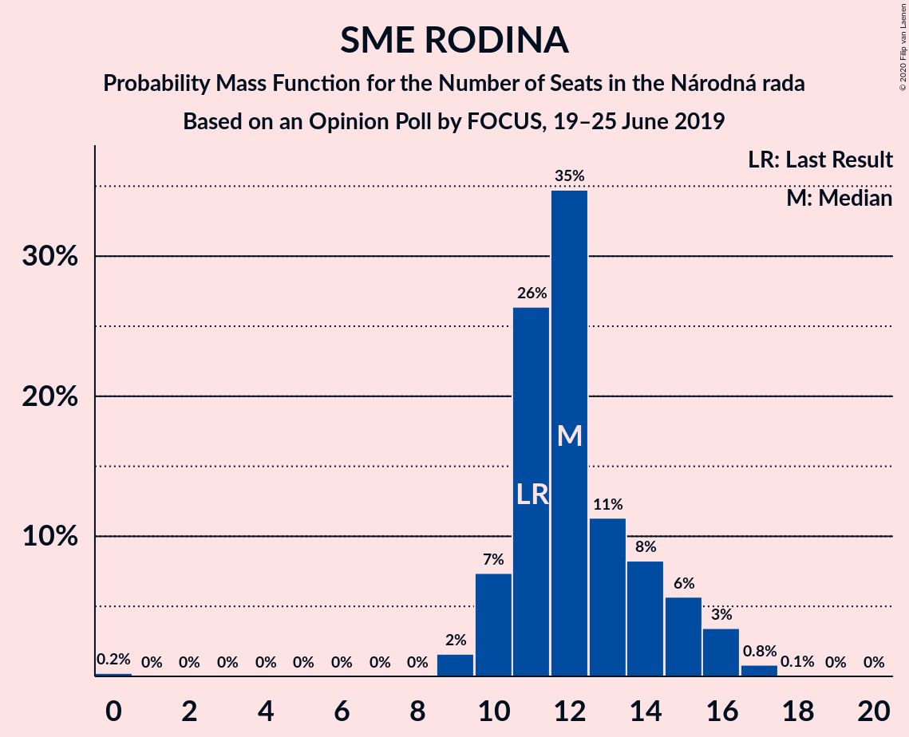
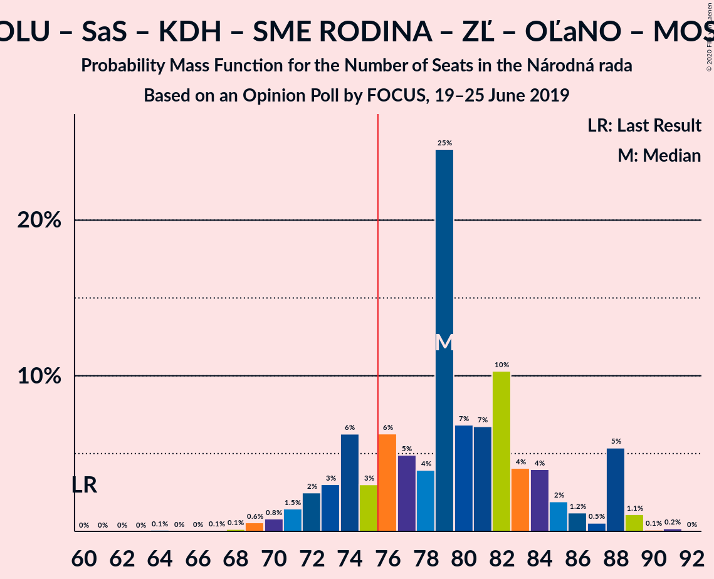

# Opinion Poll by FOCUS, 19–25 June 2019

<a href="#voting-intentions">Voting Intentions</a> | <a href="#seats">Seats</a> | <a href="#coalitions">Coalitions</a> | <a href="#technical-information">Technical Information</a>

## Voting Intentions

### Confidence Intervals

| Party | Last Result | Poll Result | 80% Confidence Interval | 90% Confidence Interval | 95% Confidence Interval | 99% Confidence Interval |
|:-----:|:-----------:|:-----------:|:-----------------------:|:-----------------------:|:-----------------------:|:-----------------------:|
| SMER–sociálna demokracia | 28.3% | 20.3% | 18.8–22.0% |18.4–22.5% |18.0–22.9% |17.3–23.7% |
| Progresívne Slovensko–SPOLU–Občianska Demokracia | 0.0% | 15.7% | 14.4–17.3% |14.0–17.7% |13.6–18.1% |13.0–18.9% |
| Kotleba–Ľudová strana Naše Slovensko | 8.0% | 12.6% | 11.4–14.0% |11.0–14.4% |10.7–14.8% |10.1–15.5% |
| Slovenská národná strana | 8.6% | 7.3% | 6.4–8.5% |6.1–8.8% |5.9–9.1% |5.5–9.7% |
| Sloboda a Solidarita | 12.1% | 7.1% | 6.2–8.3% |5.9–8.6% |5.7–8.9% |5.3–9.5% |
| SME RODINA | 6.6% | 7.0% | 6.1–8.2% |5.8–8.5% |5.6–8.8% |5.2–9.4% |
| Kresťanskodemokratické hnutie | 4.9% | 7.0% | 6.1–8.2% |5.8–8.5% |5.6–8.8% |5.2–9.4% |
| Za ľudí | 0.0% | 5.2% | 4.4–6.2% |4.2–6.5% |4.0–6.7% |3.6–7.2% |
| OBYČAJNÍ ĽUDIA a nezávislé osobnosti | 11.0% | 5.1% | 4.3–6.1% |4.1–6.4% |3.9–6.6% |3.6–7.1% |
| MOST–HÍD | 6.5% | 4.5% | 3.8–5.4% |3.6–5.7% |3.4–6.0% |3.1–6.4% |
| Strana maďarskej koalície–Magyar Koalíció Pártja | 4.0% | 3.3% | 2.7–4.2% |2.5–4.4% |2.4–4.6% |2.1–5.0% |

*Note:* The poll result column reflects the actual value used in the calculations. Published results may vary slightly, and in addition be rounded to fewer digits.

## Seats

### Confidence Intervals

| Party | Last Result | Median | 80% Confidence Interval | 90% Confidence Interval | 95% Confidence Interval | 99% Confidence Interval |
|:-----:|:-----------:|:------:|:-----------------------:|:-----------------------:|:-----------------------:|:-----------------------:|
| <a href="#smer–sociálna-demokracia">SMER–sociálna demokracia</a> | 49 | 37 | 31–39 |29–41 |29–41 |28–44 |
| <a href="#progresívne-slovensko–spolu–občianska-demokracia">Progresívne Slovensko–SPOLU–Občianska Demokracia</a> | 0 | 27 | 24–31 |23–32 |23–33 |22–33 |
| <a href="#kotleba–ľudová-strana-naše-slovensko">Kotleba–Ľudová strana Naše Slovensko</a> | 14 | 21 | 20–25 |19–25 |18–26 |17–28 |
| <a href="#slovenská-národná-strana">Slovenská národná strana</a> | 15 | 13 | 11–15 |10–15 |10–16 |9–17 |
| <a href="#sloboda-a-solidarita">Sloboda a Solidarita</a> | 21 | 13 | 10–14 |10–15 |10–16 |9–17 |
| <a href="#sme-rodina">SME RODINA</a> | 11 | 12 | 11–15 |10–15 |10–16 |9–17 |
| <a href="#kresťanskodemokratické-hnutie">Kresťanskodemokratické hnutie</a> | 0 | 11 | 10–14 |10–15 |9–15 |9–17 |
| <a href="#za-ľudí">Za ľudí</a> | 0 | 9 | 0–10 |0–11 |0–12 |0–13 |
| <a href="#obyčajní-ľudia-a-nezávislé-osobnosti">OBYČAJNÍ ĽUDIA a nezávislé osobnosti</a> | 17 | 10 | 0–11 |0–12 |0–12 |0–13 |
| <a href="#most–híd">MOST–HÍD</a> | 11 | 0 | 0–9 |0–10 |0–10 |0–12 |
| <a href="#strana-maďarskej-koalície–magyar-koalíció-pártja">Strana maďarskej koalície–Magyar Koalíció Pártja</a> | 0 | 0 | 0 |0 |0 |0–9 |

### SMER–sociálna demokracia

*For a full overview of the results for this party, see the [SMER–sociálna demokracia](party-smer–sociálnademokracia.html) page.*

| Number of Seats | Probability | Accumulated | Special Marks |
|:---------------:|:-----------:|:-----------:|:-------------:|
| 28 | 0.9% | 100% |  |
| 29 | 5% | 99.1% |  |
| 30 | 1.2% | 94% |  |
| 31 | 4% | 93% |  |
| 32 | 4% | 89% |  |
| 33 | 8% | 84% |  |
| 34 | 8% | 76% |  |
| 35 | 8% | 68% |  |
| 36 | 8% | 60% |  |
| 37 | 21% | 53% | Median |
| 38 | 16% | 31% |  |
| 39 | 7% | 16% |  |
| 40 | 4% | 9% |  |
| 41 | 4% | 5% |  |
| 42 | 0.3% | 2% |  |
| 43 | 0.7% | 1.3% |  |
| 44 | 0.2% | 0.6% |  |
| 45 | 0.4% | 0.4% |  |
| 46 | 0% | 0% |  |
| 47 | 0% | 0% |  |
| 48 | 0% | 0% |  |
| 49 | 0% | 0% | Last Result |

### Progresívne Slovensko–SPOLU–Občianska Demokracia

*For a full overview of the results for this party, see the [Progresívne Slovensko–SPOLU–Občianska Demokracia](party-progresívneslovensko–spolu–občianskademokracia.html) page.*

| Number of Seats | Probability | Accumulated | Special Marks |
|:---------------:|:-----------:|:-----------:|:-------------:|
| 0 | 0% | 100% | Last Result |
| 1 | 0% | 100% |  |
| 2 | 0% | 100% |  |
| 3 | 0% | 100% |  |
| 4 | 0% | 100% |  |
| 5 | 0% | 100% |  |
| 6 | 0% | 100% |  |
| 7 | 0% | 100% |  |
| 8 | 0% | 100% |  |
| 9 | 0% | 100% |  |
| 10 | 0% | 100% |  |
| 11 | 0% | 100% |  |
| 12 | 0% | 100% |  |
| 13 | 0% | 100% |  |
| 14 | 0% | 100% |  |
| 15 | 0% | 100% |  |
| 16 | 0% | 100% |  |
| 17 | 0% | 100% |  |
| 18 | 0% | 100% |  |
| 19 | 0% | 100% |  |
| 20 | 0% | 100% |  |
| 21 | 0.4% | 100% |  |
| 22 | 0.6% | 99.6% |  |
| 23 | 4% | 99.0% |  |
| 24 | 21% | 95% |  |
| 25 | 10% | 73% |  |
| 26 | 13% | 64% |  |
| 27 | 13% | 51% | Median |
| 28 | 9% | 38% |  |
| 29 | 10% | 29% |  |
| 30 | 7% | 19% |  |
| 31 | 6% | 12% |  |
| 32 | 3% | 6% |  |
| 33 | 2% | 3% |  |
| 34 | 0.1% | 0.4% |  |
| 35 | 0.2% | 0.3% |  |
| 36 | 0.1% | 0.1% |  |
| 37 | 0% | 0% |  |

### Kotleba–Ľudová strana Naše Slovensko

*For a full overview of the results for this party, see the [Kotleba–Ľudová strana Naše Slovensko](party-kotleba–ľudovástrananašeslovensko.html) page.*

| Number of Seats | Probability | Accumulated | Special Marks |
|:---------------:|:-----------:|:-----------:|:-------------:|
| 14 | 0% | 100% | Last Result |
| 15 | 0% | 100% |  |
| 16 | 0.1% | 100% |  |
| 17 | 1.0% | 99.9% |  |
| 18 | 3% | 98.8% |  |
| 19 | 5% | 96% |  |
| 20 | 14% | 90% |  |
| 21 | 29% | 76% | Median |
| 22 | 13% | 48% |  |
| 23 | 11% | 34% |  |
| 24 | 6% | 23% |  |
| 25 | 13% | 17% |  |
| 26 | 3% | 5% |  |
| 27 | 2% | 2% |  |
| 28 | 0.5% | 0.7% |  |
| 29 | 0.1% | 0.2% |  |
| 30 | 0% | 0% |  |

### Slovenská národná strana

*For a full overview of the results for this party, see the [Slovenská národná strana](party-slovenskánárodnástrana.html) page.*

| Number of Seats | Probability | Accumulated | Special Marks |
|:---------------:|:-----------:|:-----------:|:-------------:|
| 0 | 0.1% | 100% |  |
| 1 | 0% | 99.9% |  |
| 2 | 0% | 99.9% |  |
| 3 | 0% | 99.9% |  |
| 4 | 0% | 99.9% |  |
| 5 | 0% | 99.9% |  |
| 6 | 0% | 99.9% |  |
| 7 | 0% | 99.9% |  |
| 8 | 0% | 99.9% |  |
| 9 | 1.4% | 99.9% |  |
| 10 | 5% | 98.5% |  |
| 11 | 11% | 94% |  |
| 12 | 23% | 83% |  |
| 13 | 33% | 60% | Median |
| 14 | 15% | 27% |  |
| 15 | 8% | 13% | Last Result |
| 16 | 4% | 5% |  |
| 17 | 0.5% | 0.7% |  |
| 18 | 0.1% | 0.2% |  |
| 19 | 0% | 0% |  |

### Sloboda a Solidarita

*For a full overview of the results for this party, see the [Sloboda a Solidarita](party-slobodaasolidarita.html) page.*

| Number of Seats | Probability | Accumulated | Special Marks |
|:---------------:|:-----------:|:-----------:|:-------------:|
| 0 | 0.1% | 100% |  |
| 1 | 0% | 99.9% |  |
| 2 | 0% | 99.9% |  |
| 3 | 0% | 99.9% |  |
| 4 | 0% | 99.9% |  |
| 5 | 0% | 99.9% |  |
| 6 | 0% | 99.9% |  |
| 7 | 0% | 99.9% |  |
| 8 | 0.1% | 99.9% |  |
| 9 | 2% | 99.8% |  |
| 10 | 8% | 98% |  |
| 11 | 9% | 90% |  |
| 12 | 24% | 81% |  |
| 13 | 36% | 57% | Median |
| 14 | 13% | 21% |  |
| 15 | 4% | 8% |  |
| 16 | 3% | 4% |  |
| 17 | 1.0% | 1.1% |  |
| 18 | 0.1% | 0.1% |  |
| 19 | 0% | 0% |  |
| 20 | 0% | 0% |  |
| 21 | 0% | 0% | Last Result |

### SME RODINA

*For a full overview of the results for this party, see the [SME RODINA](party-smerodina.html) page.*

| Number of Seats | Probability | Accumulated | Special Marks |
|:---------------:|:-----------:|:-----------:|:-------------:|
| 0 | 0.2% | 100% |  |
| 1 | 0% | 99.8% |  |
| 2 | 0% | 99.8% |  |
| 3 | 0% | 99.8% |  |
| 4 | 0% | 99.8% |  |
| 5 | 0% | 99.8% |  |
| 6 | 0% | 99.8% |  |
| 7 | 0% | 99.8% |  |
| 8 | 0% | 99.8% |  |
| 9 | 2% | 99.8% |  |
| 10 | 7% | 98% |  |
| 11 | 26% | 91% | Last Result |
| 12 | 35% | 64% | Median |
| 13 | 11% | 30% |  |
| 14 | 8% | 18% |  |
| 15 | 6% | 10% |  |
| 16 | 3% | 4% |  |
| 17 | 0.8% | 1.0% |  |
| 18 | 0.1% | 0.1% |  |
| 19 | 0% | 0.1% |  |
| 20 | 0% | 0% |  |

### Kresťanskodemokratické hnutie

*For a full overview of the results for this party, see the [Kresťanskodemokratické hnutie](party-kresťanskodemokratickéhnutie.html) page.*

| Number of Seats | Probability | Accumulated | Special Marks |
|:---------------:|:-----------:|:-----------:|:-------------:|
| 0 | 0.3% | 100% | Last Result |
| 1 | 0% | 99.7% |  |
| 2 | 0% | 99.7% |  |
| 3 | 0% | 99.7% |  |
| 4 | 0% | 99.7% |  |
| 5 | 0% | 99.7% |  |
| 6 | 0% | 99.7% |  |
| 7 | 0% | 99.7% |  |
| 8 | 0.1% | 99.7% |  |
| 9 | 3% | 99.6% |  |
| 10 | 24% | 97% |  |
| 11 | 30% | 73% | Median |
| 12 | 17% | 42% |  |
| 13 | 12% | 25% |  |
| 14 | 8% | 13% |  |
| 15 | 3% | 5% |  |
| 16 | 1.1% | 2% |  |
| 17 | 0.6% | 0.8% |  |
| 18 | 0.2% | 0.2% |  |
| 19 | 0.1% | 0.1% |  |
| 20 | 0% | 0% |  |

### Za ľudí

*For a full overview of the results for this party, see the [Za ľudí](party-zaľudí.html) page.*

| Number of Seats | Probability | Accumulated | Special Marks |
|:---------------:|:-----------:|:-----------:|:-------------:|
| 0 | 37% | 100% | Last Result |
| 1 | 0% | 63% |  |
| 2 | 0% | 63% |  |
| 3 | 0% | 63% |  |
| 4 | 0% | 63% |  |
| 5 | 0% | 63% |  |
| 6 | 0% | 63% |  |
| 7 | 0% | 63% |  |
| 8 | 1.1% | 63% |  |
| 9 | 43% | 62% | Median |
| 10 | 10% | 19% |  |
| 11 | 6% | 9% |  |
| 12 | 2% | 3% |  |
| 13 | 0.8% | 0.9% |  |
| 14 | 0.1% | 0.1% |  |
| 15 | 0% | 0% |  |

### OBYČAJNÍ ĽUDIA a nezávislé osobnosti

*For a full overview of the results for this party, see the [OBYČAJNÍ ĽUDIA a nezávislé osobnosti](party-obyčajníľudiaanezávisléosobnosti.html) page.*

| Number of Seats | Probability | Accumulated | Special Marks |
|:---------------:|:-----------:|:-----------:|:-------------:|
| 0 | 24% | 100% |  |
| 1 | 0% | 76% |  |
| 2 | 0% | 76% |  |
| 3 | 0% | 76% |  |
| 4 | 0% | 76% |  |
| 5 | 0% | 76% |  |
| 6 | 0% | 76% |  |
| 7 | 0% | 76% |  |
| 8 | 2% | 76% |  |
| 9 | 20% | 73% |  |
| 10 | 24% | 53% | Median |
| 11 | 22% | 29% |  |
| 12 | 6% | 7% |  |
| 13 | 1.1% | 1.1% |  |
| 14 | 0% | 0% |  |
| 15 | 0% | 0% |  |
| 16 | 0% | 0% |  |
| 17 | 0% | 0% | Last Result |

### MOST–HÍD

*For a full overview of the results for this party, see the [MOST–HÍD](party-most–híd.html) page.*

| Number of Seats | Probability | Accumulated | Special Marks |
|:---------------:|:-----------:|:-----------:|:-------------:|
| 0 | 73% | 100% | Median |
| 1 | 0% | 27% |  |
| 2 | 0% | 27% |  |
| 3 | 0% | 27% |  |
| 4 | 0% | 27% |  |
| 5 | 0% | 27% |  |
| 6 | 0% | 27% |  |
| 7 | 0% | 27% |  |
| 8 | 6% | 27% |  |
| 9 | 14% | 21% |  |
| 10 | 5% | 7% |  |
| 11 | 0.6% | 1.3% | Last Result |
| 12 | 0.7% | 0.7% |  |
| 13 | 0% | 0% |  |

### Strana maďarskej koalície–Magyar Koalíció Pártja

*For a full overview of the results for this party, see the [Strana maďarskej koalície–Magyar Koalíció Pártja](party-stranamaďarskejkoalície–magyarkoalíciópártja.html) page.*

| Number of Seats | Probability | Accumulated | Special Marks |
|:---------------:|:-----------:|:-----------:|:-------------:|
| 0 | 98.7% | 100% | Last Result, Median |
| 1 | 0% | 1.3% |  |
| 2 | 0% | 1.3% |  |
| 3 | 0% | 1.3% |  |
| 4 | 0% | 1.3% |  |
| 5 | 0% | 1.3% |  |
| 6 | 0% | 1.3% |  |
| 7 | 0% | 1.3% |  |
| 8 | 0.2% | 1.3% |  |
| 9 | 1.0% | 1.1% |  |
| 10 | 0% | 0.1% |  |
| 11 | 0% | 0% |  |

## Coalitions

### Confidence Intervals

| Coalition | Last Result | Median | Majority? | 80% Confidence Interval | 90% Confidence Interval | 95% Confidence Interval | 99% Confidence Interval |
|:---------:|:-----------:|:------:|:---------:|:-----------------------:|:-----------------------:|:-----------------------:|:-----------------------:|
| SMER–sociálna demokracia – Kotleba–Ľudová strana Naše Slovensko – Slovenská národná strana – SME RODINA | 89 | 83 | 92% | 77–89 | 73–90 | 73–92 | 71–95 |
| Progresívne Slovensko–SPOLU–Občianska Demokracia – Sloboda a Solidarita – Kresťanskodemokratické hnutie – SME RODINA – Za ľudí – OBYČAJNÍ ĽUDIA a nezávislé osobnosti – MOST–HÍD – Strana maďarskej koalície–Magyar Koalíció Pártja | 60 | 79 | 82% | 74–85 | 72–88 | 71–88 | 69–89 |
| Progresívne Slovensko–SPOLU–Občianska Demokracia – Sloboda a Solidarita – Kresťanskodemokratické hnutie – SME RODINA – Za ľudí – OBYČAJNÍ ĽUDIA a nezávislé osobnosti – MOST–HÍD | 60 | 79 | 82% | 74–85 | 72–88 | 71–88 | 69–89 |
| Progresívne Slovensko–SPOLU–Občianska Demokracia – Sloboda a Solidarita – Kresťanskodemokratické hnutie – SME RODINA – Za ľudí – OBYČAJNÍ ĽUDIA a nezávislé osobnosti – Strana maďarskej koalície–Magyar Koalíció Pártja | 49 | 79 | 66% | 70–82 | 68–83 | 63–85 | 62–86 |
| Progresívne Slovensko–SPOLU–Občianska Demokracia – Sloboda a Solidarita – Kresťanskodemokratické hnutie – SME RODINA – Za ľudí – OBYČAJNÍ ĽUDIA a nezávislé osobnosti | 49 | 79 | 66% | 70–82 | 68–83 | 63–84 | 62–86 |
| Progresívne Slovensko–SPOLU–Občianska Demokracia – Sloboda a Solidarita – Kresťanskodemokratické hnutie – Za ľudí – OBYČAJNÍ ĽUDIA a nezávislé osobnosti – MOST–HÍD – Strana maďarskej koalície–Magyar Koalíció Pártja | 49 | 67 | 7% | 61–73 | 60–77 | 58–77 | 55–79 |
| Progresívne Slovensko–SPOLU–Občianska Demokracia – Sloboda a Solidarita – Kresťanskodemokratické hnutie – Za ľudí – OBYČAJNÍ ĽUDIA a nezávislé osobnosti – MOST–HÍD | 49 | 67 | 7% | 61–73 | 60–77 | 58–77 | 55–79 |
| Progresívne Slovensko–SPOLU–Občianska Demokracia – Sloboda a Solidarita – Kresťanskodemokratické hnutie – Za ľudí – OBYČAJNÍ ĽUDIA a nezávislé osobnosti – Strana maďarskej koalície–Magyar Koalíció Pártja | 38 | 65 | 0.2% | 59–71 | 55–72 | 52–73 | 50–74 |
| Progresívne Slovensko–SPOLU–Občianska Demokracia – Sloboda a Solidarita – Kresťanskodemokratické hnutie – Za ľudí – OBYČAJNÍ ĽUDIA a nezávislé osobnosti | 38 | 65 | 0.2% | 59–71 | 55–72 | 52–73 | 49–74 |
| SMER–sociálna demokracia – Slovenská národná strana – SME RODINA | 75 | 62 | 0% | 55–66 | 52–67 | 52–68 | 52–70 |
| Progresívne Slovensko–SPOLU–Občianska Demokracia – Sloboda a Solidarita – Kresťanskodemokratické hnutie – Za ľudí | 21 | 56 | 0% | 51–64 | 50–65 | 49–66 | 48–70 |
| SMER–sociálna demokracia – Slovenská národná strana – MOST–HÍD | 75 | 50 | 0% | 46–57 | 45–60 | 43–62 | 43–65 |
| Progresívne Slovensko–SPOLU–Občianska Demokracia – Sloboda a Solidarita – Za ľudí – OBYČAJNÍ ĽUDIA a nezávislé osobnosti | 38 | 53 | 0% | 46–59 | 43–60 | 41–61 | 38–62 |
| SMER–sociálna demokracia – Slovenská národná strana | 64 | 49 | 0% | 44–53 | 41–54 | 41–56 | 41–57 |
| SMER–sociálna demokracia – SME RODINA | 60 | 49 | 0% | 42–52 | 40–54 | 40–54 | 38–57 |
| Progresívne Slovensko–SPOLU–Občianska Demokracia – Sloboda a Solidarita – Za ľudí | 21 | 46 | 0% | 39–52 | 38–52 | 37–53 | 36–56 |
| SMER–sociálna demokracia | 49 | 37 | 0% | 31–39 | 29–41 | 29–41 | 28–44 |

### SMER–sociálna demokracia – Kotleba–Ľudová strana Naše Slovensko – Slovenská národná strana – SME RODINA

| Number of Seats | Probability | Accumulated | Special Marks |
|:---------------:|:-----------:|:-----------:|:-------------:|
| 69 | 0.1% | 100% |  |
| 70 | 0% | 99.9% |  |
| 71 | 2% | 99.9% |  |
| 72 | 0.3% | 98% |  |
| 73 | 5% | 98% |  |
| 74 | 0.5% | 93% |  |
| 75 | 0.9% | 93% |  |
| 76 | 1.0% | 92% | Majority |
| 77 | 4% | 91% |  |
| 78 | 4% | 87% |  |
| 79 | 6% | 83% |  |
| 80 | 5% | 77% |  |
| 81 | 8% | 71% |  |
| 82 | 5% | 64% |  |
| 83 | 18% | 59% | Median |
| 84 | 5% | 41% |  |
| 85 | 11% | 36% |  |
| 86 | 5% | 25% |  |
| 87 | 3% | 20% |  |
| 88 | 6% | 17% |  |
| 89 | 5% | 10% | Last Result |
| 90 | 1.3% | 5% |  |
| 91 | 1.4% | 4% |  |
| 92 | 1.5% | 3% |  |
| 93 | 0.6% | 1.3% |  |
| 94 | 0.1% | 0.7% |  |
| 95 | 0.4% | 0.6% |  |
| 96 | 0% | 0.2% |  |
| 97 | 0% | 0.1% |  |
| 98 | 0% | 0.1% |  |
| 99 | 0% | 0% |  |

### Progresívne Slovensko–SPOLU–Občianska Demokracia – Sloboda a Solidarita – Kresťanskodemokratické hnutie – SME RODINA – Za ľudí – OBYČAJNÍ ĽUDIA a nezávislé osobnosti – MOST–HÍD – Strana maďarskej koalície–Magyar Koalíció Pártja

| Number of Seats | Probability | Accumulated | Special Marks |
|:---------------:|:-----------:|:-----------:|:-------------:|
| 60 | 0% | 100% | Last Result |
| 61 | 0% | 100% |  |
| 62 | 0% | 100% |  |
| 63 | 0% | 100% |  |
| 64 | 0% | 100% |  |
| 65 | 0% | 100% |  |
| 66 | 0% | 99.9% |  |
| 67 | 0.1% | 99.9% |  |
| 68 | 0.1% | 99.8% |  |
| 69 | 0.5% | 99.7% |  |
| 70 | 0.8% | 99.2% |  |
| 71 | 1.4% | 98% |  |
| 72 | 2% | 97% |  |
| 73 | 3% | 95% |  |
| 74 | 6% | 91% |  |
| 75 | 3% | 85% |  |
| 76 | 5% | 82% | Majority |
| 77 | 5% | 77% |  |
| 78 | 4% | 72% |  |
| 79 | 25% | 68% |  |
| 80 | 7% | 43% |  |
| 81 | 7% | 37% |  |
| 82 | 10% | 30% | Median |
| 83 | 4% | 20% |  |
| 84 | 4% | 15% |  |
| 85 | 3% | 11% |  |
| 86 | 1.2% | 9% |  |
| 87 | 0.6% | 7% |  |
| 88 | 5% | 7% |  |
| 89 | 1.1% | 1.4% |  |
| 90 | 0.1% | 0.3% |  |
| 91 | 0.2% | 0.2% |  |
| 92 | 0% | 0% |  |

### Progresívne Slovensko–SPOLU–Občianska Demokracia – Sloboda a Solidarita – Kresťanskodemokratické hnutie – SME RODINA – Za ľudí – OBYČAJNÍ ĽUDIA a nezávislé osobnosti – MOST–HÍD

| Number of Seats | Probability | Accumulated | Special Marks |
|:---------------:|:-----------:|:-----------:|:-------------:|
| 60 | 0% | 100% | Last Result |
| 61 | 0% | 100% |  |
| 62 | 0% | 100% |  |
| 63 | 0% | 100% |  |
| 64 | 0.1% | 100% |  |
| 65 | 0% | 99.9% |  |
| 66 | 0% | 99.9% |  |
| 67 | 0.1% | 99.8% |  |
| 68 | 0.1% | 99.8% |  |
| 69 | 0.6% | 99.6% |  |
| 70 | 0.8% | 99.1% |  |
| 71 | 1.5% | 98% |  |
| 72 | 2% | 97% |  |
| 73 | 3% | 94% |  |
| 74 | 6% | 91% |  |
| 75 | 3% | 85% |  |
| 76 | 6% | 82% | Majority |
| 77 | 5% | 76% |  |
| 78 | 4% | 71% |  |
| 79 | 25% | 67% |  |
| 80 | 7% | 42% |  |
| 81 | 7% | 36% |  |
| 82 | 10% | 29% | Median |
| 83 | 4% | 18% |  |
| 84 | 4% | 14% |  |
| 85 | 2% | 10% |  |
| 86 | 1.2% | 8% |  |
| 87 | 0.5% | 7% |  |
| 88 | 5% | 7% |  |
| 89 | 1.1% | 1.4% |  |
| 90 | 0.1% | 0.3% |  |
| 91 | 0.2% | 0.2% |  |
| 92 | 0% | 0% |  |

### Progresívne Slovensko–SPOLU–Občianska Demokracia – Sloboda a Solidarita – Kresťanskodemokratické hnutie – SME RODINA – Za ľudí – OBYČAJNÍ ĽUDIA a nezávislé osobnosti – Strana maďarskej koalície–Magyar Koalíció Pártja

| Number of Seats | Probability | Accumulated | Special Marks |
|:---------------:|:-----------:|:-----------:|:-------------:|
| 49 | 0% | 100% | Last Result |
| 50 | 0% | 100% |  |
| 51 | 0% | 100% |  |
| 52 | 0% | 100% |  |
| 53 | 0% | 100% |  |
| 54 | 0% | 100% |  |
| 55 | 0% | 100% |  |
| 56 | 0% | 100% |  |
| 57 | 0% | 100% |  |
| 58 | 0% | 100% |  |
| 59 | 0% | 100% |  |
| 60 | 0% | 99.9% |  |
| 61 | 0.1% | 99.9% |  |
| 62 | 0.4% | 99.9% |  |
| 63 | 2% | 99.5% |  |
| 64 | 0.2% | 97% |  |
| 65 | 0.2% | 97% |  |
| 66 | 0.2% | 97% |  |
| 67 | 1.2% | 97% |  |
| 68 | 1.4% | 96% |  |
| 69 | 0.8% | 94% |  |
| 70 | 4% | 93% |  |
| 71 | 2% | 89% |  |
| 72 | 4% | 87% |  |
| 73 | 5% | 83% |  |
| 74 | 7% | 78% |  |
| 75 | 5% | 71% |  |
| 76 | 5% | 66% | Majority |
| 77 | 5% | 61% |  |
| 78 | 3% | 56% |  |
| 79 | 22% | 53% |  |
| 80 | 12% | 32% |  |
| 81 | 5% | 20% |  |
| 82 | 7% | 15% | Median |
| 83 | 3% | 8% |  |
| 84 | 2% | 5% |  |
| 85 | 2% | 3% |  |
| 86 | 0.6% | 0.9% |  |
| 87 | 0.2% | 0.3% |  |
| 88 | 0.1% | 0.1% |  |
| 89 | 0.1% | 0.1% |  |
| 90 | 0% | 0% |  |

### Progresívne Slovensko–SPOLU–Občianska Demokracia – Sloboda a Solidarita – Kresťanskodemokratické hnutie – SME RODINA – Za ľudí – OBYČAJNÍ ĽUDIA a nezávislé osobnosti

| Number of Seats | Probability | Accumulated | Special Marks |
|:---------------:|:-----------:|:-----------:|:-------------:|
| 49 | 0% | 100% | Last Result |
| 50 | 0% | 100% |  |
| 51 | 0% | 100% |  |
| 52 | 0% | 100% |  |
| 53 | 0% | 100% |  |
| 54 | 0% | 100% |  |
| 55 | 0% | 100% |  |
| 56 | 0% | 100% |  |
| 57 | 0% | 100% |  |
| 58 | 0% | 100% |  |
| 59 | 0% | 100% |  |
| 60 | 0% | 99.9% |  |
| 61 | 0.1% | 99.9% |  |
| 62 | 0.4% | 99.9% |  |
| 63 | 2% | 99.5% |  |
| 64 | 0.2% | 97% |  |
| 65 | 0.2% | 97% |  |
| 66 | 0.2% | 97% |  |
| 67 | 1.2% | 97% |  |
| 68 | 1.4% | 95% |  |
| 69 | 0.9% | 94% |  |
| 70 | 4% | 93% |  |
| 71 | 2% | 89% |  |
| 72 | 4% | 87% |  |
| 73 | 5% | 83% |  |
| 74 | 7% | 78% |  |
| 75 | 5% | 71% |  |
| 76 | 6% | 66% | Majority |
| 77 | 5% | 60% |  |
| 78 | 3% | 55% |  |
| 79 | 22% | 52% |  |
| 80 | 12% | 31% |  |
| 81 | 5% | 19% |  |
| 82 | 7% | 14% | Median |
| 83 | 3% | 7% |  |
| 84 | 2% | 4% |  |
| 85 | 0.8% | 2% |  |
| 86 | 0.6% | 0.8% |  |
| 87 | 0.1% | 0.3% |  |
| 88 | 0% | 0.1% |  |
| 89 | 0.1% | 0.1% |  |
| 90 | 0% | 0% |  |

### Progresívne Slovensko–SPOLU–Občianska Demokracia – Sloboda a Solidarita – Kresťanskodemokratické hnutie – Za ľudí – OBYČAJNÍ ĽUDIA a nezávislé osobnosti – MOST–HÍD – Strana maďarskej koalície–Magyar Koalíció Pártja

| Number of Seats | Probability | Accumulated | Special Marks |
|:---------------:|:-----------:|:-----------:|:-------------:|
| 49 | 0% | 100% | Last Result |
| 50 | 0% | 100% |  |
| 51 | 0% | 100% |  |
| 52 | 0% | 100% |  |
| 53 | 0% | 99.9% |  |
| 54 | 0% | 99.9% |  |
| 55 | 0.4% | 99.8% |  |
| 56 | 0.1% | 99.4% |  |
| 57 | 0.6% | 99.3% |  |
| 58 | 1.5% | 98.7% |  |
| 59 | 1.4% | 97% |  |
| 60 | 1.3% | 96% |  |
| 61 | 5% | 95% |  |
| 62 | 6% | 90% |  |
| 63 | 3% | 83% |  |
| 64 | 5% | 80% |  |
| 65 | 11% | 75% |  |
| 66 | 5% | 64% |  |
| 67 | 18% | 59% |  |
| 68 | 5% | 41% |  |
| 69 | 8% | 36% |  |
| 70 | 5% | 29% | Median |
| 71 | 6% | 23% |  |
| 72 | 4% | 17% |  |
| 73 | 4% | 13% |  |
| 74 | 1.0% | 9% |  |
| 75 | 0.9% | 8% |  |
| 76 | 0.5% | 7% | Majority |
| 77 | 5% | 7% |  |
| 78 | 0.3% | 2% |  |
| 79 | 2% | 2% |  |
| 80 | 0% | 0.1% |  |
| 81 | 0.1% | 0.1% |  |
| 82 | 0% | 0% |  |

### Progresívne Slovensko–SPOLU–Občianska Demokracia – Sloboda a Solidarita – Kresťanskodemokratické hnutie – Za ľudí – OBYČAJNÍ ĽUDIA a nezávislé osobnosti – MOST–HÍD

| Number of Seats | Probability | Accumulated | Special Marks |
|:---------------:|:-----------:|:-----------:|:-------------:|
| 49 | 0% | 100% | Last Result |
| 50 | 0% | 100% |  |
| 51 | 0.1% | 100% |  |
| 52 | 0.1% | 99.9% |  |
| 53 | 0% | 99.8% |  |
| 54 | 0% | 99.8% |  |
| 55 | 0.4% | 99.8% |  |
| 56 | 0.1% | 99.3% |  |
| 57 | 0.6% | 99.2% |  |
| 58 | 2% | 98.6% |  |
| 59 | 1.4% | 97% |  |
| 60 | 1.2% | 96% |  |
| 61 | 5% | 94% |  |
| 62 | 7% | 89% |  |
| 63 | 3% | 83% |  |
| 64 | 6% | 80% |  |
| 65 | 11% | 74% |  |
| 66 | 5% | 63% |  |
| 67 | 18% | 58% |  |
| 68 | 5% | 40% |  |
| 69 | 8% | 35% |  |
| 70 | 5% | 28% | Median |
| 71 | 6% | 22% |  |
| 72 | 4% | 16% |  |
| 73 | 4% | 13% |  |
| 74 | 0.9% | 9% |  |
| 75 | 0.8% | 8% |  |
| 76 | 0.4% | 7% | Majority |
| 77 | 5% | 7% |  |
| 78 | 0.3% | 2% |  |
| 79 | 2% | 2% |  |
| 80 | 0% | 0.1% |  |
| 81 | 0% | 0.1% |  |
| 82 | 0% | 0% |  |

### Progresívne Slovensko–SPOLU–Občianska Demokracia – Sloboda a Solidarita – Kresťanskodemokratické hnutie – Za ľudí – OBYČAJNÍ ĽUDIA a nezávislé osobnosti – Strana maďarskej koalície–Magyar Koalíció Pártja

| Number of Seats | Probability | Accumulated | Special Marks |
|:---------------:|:-----------:|:-----------:|:-------------:|
| 38 | 0% | 100% | Last Result |
| 39 | 0% | 100% |  |
| 40 | 0% | 100% |  |
| 41 | 0% | 100% |  |
| 42 | 0% | 100% |  |
| 43 | 0% | 100% |  |
| 44 | 0% | 100% |  |
| 45 | 0% | 100% |  |
| 46 | 0% | 100% |  |
| 47 | 0% | 100% |  |
| 48 | 0.1% | 99.9% |  |
| 49 | 0.4% | 99.9% |  |
| 50 | 0% | 99.5% |  |
| 51 | 0.6% | 99.5% |  |
| 52 | 2% | 98.9% |  |
| 53 | 0.7% | 97% |  |
| 54 | 0.6% | 96% |  |
| 55 | 1.4% | 96% |  |
| 56 | 1.3% | 94% |  |
| 57 | 1.0% | 93% |  |
| 58 | 2% | 92% |  |
| 59 | 4% | 90% |  |
| 60 | 4% | 86% |  |
| 61 | 5% | 83% |  |
| 62 | 7% | 77% |  |
| 63 | 4% | 70% |  |
| 64 | 6% | 66% |  |
| 65 | 12% | 61% |  |
| 66 | 4% | 49% |  |
| 67 | 18% | 45% |  |
| 68 | 2% | 27% |  |
| 69 | 11% | 25% |  |
| 70 | 3% | 14% | Median |
| 71 | 5% | 11% |  |
| 72 | 3% | 6% |  |
| 73 | 2% | 3% |  |
| 74 | 0.4% | 0.8% |  |
| 75 | 0.2% | 0.4% |  |
| 76 | 0.1% | 0.2% | Majority |
| 77 | 0.1% | 0.1% |  |
| 78 | 0% | 0.1% |  |
| 79 | 0% | 0% |  |

### Progresívne Slovensko–SPOLU–Občianska Demokracia – Sloboda a Solidarita – Kresťanskodemokratické hnutie – Za ľudí – OBYČAJNÍ ĽUDIA a nezávislé osobnosti

| Number of Seats | Probability | Accumulated | Special Marks |
|:---------------:|:-----------:|:-----------:|:-------------:|
| 38 | 0% | 100% | Last Result |
| 39 | 0% | 100% |  |
| 40 | 0% | 100% |  |
| 41 | 0% | 100% |  |
| 42 | 0% | 100% |  |
| 43 | 0% | 100% |  |
| 44 | 0% | 100% |  |
| 45 | 0% | 100% |  |
| 46 | 0% | 100% |  |
| 47 | 0% | 100% |  |
| 48 | 0.1% | 99.9% |  |
| 49 | 0.4% | 99.9% |  |
| 50 | 0% | 99.5% |  |
| 51 | 0.7% | 99.5% |  |
| 52 | 2% | 98.8% |  |
| 53 | 0.7% | 97% |  |
| 54 | 0.6% | 96% |  |
| 55 | 1.4% | 96% |  |
| 56 | 1.4% | 94% |  |
| 57 | 1.0% | 93% |  |
| 58 | 2% | 92% |  |
| 59 | 4% | 90% |  |
| 60 | 4% | 86% |  |
| 61 | 5% | 82% |  |
| 62 | 7% | 77% |  |
| 63 | 4% | 70% |  |
| 64 | 6% | 66% |  |
| 65 | 12% | 60% |  |
| 66 | 4% | 48% |  |
| 67 | 18% | 44% |  |
| 68 | 2% | 26% |  |
| 69 | 11% | 24% |  |
| 70 | 3% | 13% | Median |
| 71 | 5% | 10% |  |
| 72 | 3% | 5% |  |
| 73 | 2% | 3% |  |
| 74 | 0.3% | 0.6% |  |
| 75 | 0.1% | 0.3% |  |
| 76 | 0.1% | 0.2% | Majority |
| 77 | 0.1% | 0.1% |  |
| 78 | 0% | 0% |  |

### SMER–sociálna demokracia – Slovenská národná strana – SME RODINA

| Number of Seats | Probability | Accumulated | Special Marks |
|:---------------:|:-----------:|:-----------:|:-------------:|
| 48 | 0% | 100% |  |
| 49 | 0% | 99.9% |  |
| 50 | 0.1% | 99.9% |  |
| 51 | 0.2% | 99.8% |  |
| 52 | 6% | 99.6% |  |
| 53 | 0.9% | 94% |  |
| 54 | 3% | 93% |  |
| 55 | 1.1% | 90% |  |
| 56 | 3% | 89% |  |
| 57 | 5% | 86% |  |
| 58 | 6% | 80% |  |
| 59 | 7% | 74% |  |
| 60 | 5% | 67% |  |
| 61 | 7% | 62% |  |
| 62 | 23% | 55% | Median |
| 63 | 13% | 32% |  |
| 64 | 4% | 19% |  |
| 65 | 4% | 15% |  |
| 66 | 4% | 10% |  |
| 67 | 4% | 7% |  |
| 68 | 0.5% | 3% |  |
| 69 | 2% | 2% |  |
| 70 | 0.3% | 0.6% |  |
| 71 | 0.1% | 0.3% |  |
| 72 | 0.1% | 0.1% |  |
| 73 | 0% | 0.1% |  |
| 74 | 0% | 0% |  |
| 75 | 0% | 0% | Last Result |

### Progresívne Slovensko–SPOLU–Občianska Demokracia – Sloboda a Solidarita – Kresťanskodemokratické hnutie – Za ľudí

| Number of Seats | Probability | Accumulated | Special Marks |
|:---------------:|:-----------:|:-----------:|:-------------:|
| 21 | 0% | 100% | Last Result |
| 22 | 0% | 100% |  |
| 23 | 0% | 100% |  |
| 24 | 0% | 100% |  |
| 25 | 0% | 100% |  |
| 26 | 0% | 100% |  |
| 27 | 0% | 100% |  |
| 28 | 0% | 100% |  |
| 29 | 0% | 100% |  |
| 30 | 0% | 100% |  |
| 31 | 0% | 100% |  |
| 32 | 0% | 100% |  |
| 33 | 0% | 100% |  |
| 34 | 0% | 100% |  |
| 35 | 0% | 100% |  |
| 36 | 0% | 100% |  |
| 37 | 0% | 100% |  |
| 38 | 0% | 100% |  |
| 39 | 0% | 100% |  |
| 40 | 0% | 100% |  |
| 41 | 0% | 100% |  |
| 42 | 0% | 100% |  |
| 43 | 0% | 100% |  |
| 44 | 0% | 100% |  |
| 45 | 0.2% | 99.9% |  |
| 46 | 0.1% | 99.7% |  |
| 47 | 0.1% | 99.6% |  |
| 48 | 0.3% | 99.5% |  |
| 49 | 2% | 99.2% |  |
| 50 | 5% | 97% |  |
| 51 | 4% | 92% |  |
| 52 | 5% | 88% |  |
| 53 | 5% | 83% |  |
| 54 | 7% | 78% |  |
| 55 | 5% | 71% |  |
| 56 | 21% | 66% |  |
| 57 | 2% | 44% |  |
| 58 | 4% | 42% |  |
| 59 | 11% | 38% |  |
| 60 | 5% | 27% | Median |
| 61 | 5% | 23% |  |
| 62 | 6% | 18% |  |
| 63 | 1.0% | 12% |  |
| 64 | 4% | 11% |  |
| 65 | 3% | 8% |  |
| 66 | 3% | 5% |  |
| 67 | 0.6% | 2% |  |
| 68 | 0.5% | 1.2% |  |
| 69 | 0.1% | 0.8% |  |
| 70 | 0.2% | 0.6% |  |
| 71 | 0.3% | 0.4% |  |
| 72 | 0.1% | 0.2% |  |
| 73 | 0% | 0.1% |  |
| 74 | 0% | 0% |  |

### SMER–sociálna demokracia – Slovenská národná strana – MOST–HÍD

| Number of Seats | Probability | Accumulated | Special Marks |
|:---------------:|:-----------:|:-----------:|:-------------:|
| 40 | 0% | 100% |  |
| 41 | 0.1% | 99.9% |  |
| 42 | 0.1% | 99.9% |  |
| 43 | 3% | 99.8% |  |
| 44 | 0.7% | 97% |  |
| 45 | 4% | 96% |  |
| 46 | 4% | 93% |  |
| 47 | 7% | 88% |  |
| 48 | 4% | 82% |  |
| 49 | 14% | 77% |  |
| 50 | 21% | 63% | Median |
| 51 | 9% | 42% |  |
| 52 | 5% | 33% |  |
| 53 | 2% | 28% |  |
| 54 | 4% | 25% |  |
| 55 | 5% | 21% |  |
| 56 | 4% | 17% |  |
| 57 | 2% | 12% |  |
| 58 | 2% | 10% |  |
| 59 | 0.5% | 8% |  |
| 60 | 4% | 7% |  |
| 61 | 0.7% | 3% |  |
| 62 | 2% | 3% |  |
| 63 | 0.1% | 0.8% |  |
| 64 | 0.2% | 0.8% |  |
| 65 | 0% | 0.5% |  |
| 66 | 0.4% | 0.5% |  |
| 67 | 0% | 0.1% |  |
| 68 | 0% | 0.1% |  |
| 69 | 0% | 0% |  |
| 70 | 0% | 0% |  |
| 71 | 0% | 0% |  |
| 72 | 0% | 0% |  |
| 73 | 0% | 0% |  |
| 74 | 0% | 0% |  |
| 75 | 0% | 0% | Last Result |

### Progresívne Slovensko–SPOLU–Občianska Demokracia – Sloboda a Solidarita – Za ľudí – OBYČAJNÍ ĽUDIA a nezávislé osobnosti

| Number of Seats | Probability | Accumulated | Special Marks |
|:---------------:|:-----------:|:-----------:|:-------------:|
| 35 | 0% | 100% |  |
| 36 | 0% | 99.9% |  |
| 37 | 0% | 99.9% |  |
| 38 | 0.4% | 99.9% | Last Result |
| 39 | 0.6% | 99.4% |  |
| 40 | 0.3% | 98.8% |  |
| 41 | 2% | 98.6% |  |
| 42 | 0.9% | 96% |  |
| 43 | 0.6% | 95% |  |
| 44 | 0.5% | 95% |  |
| 45 | 3% | 94% |  |
| 46 | 4% | 91% |  |
| 47 | 2% | 88% |  |
| 48 | 5% | 86% |  |
| 49 | 3% | 81% |  |
| 50 | 3% | 78% |  |
| 51 | 10% | 75% |  |
| 52 | 5% | 65% |  |
| 53 | 11% | 60% |  |
| 54 | 6% | 49% |  |
| 55 | 3% | 43% |  |
| 56 | 1.5% | 40% |  |
| 57 | 18% | 38% |  |
| 58 | 9% | 20% |  |
| 59 | 5% | 11% | Median |
| 60 | 3% | 7% |  |
| 61 | 3% | 4% |  |
| 62 | 0.6% | 1.1% |  |
| 63 | 0.1% | 0.4% |  |
| 64 | 0.2% | 0.3% |  |
| 65 | 0% | 0.1% |  |
| 66 | 0% | 0.1% |  |
| 67 | 0% | 0% |  |

### SMER–sociálna demokracia – Slovenská národná strana

| Number of Seats | Probability | Accumulated | Special Marks |
|:---------------:|:-----------:|:-----------:|:-------------:|
| 37 | 0% | 100% |  |
| 38 | 0% | 99.9% |  |
| 39 | 0.1% | 99.9% |  |
| 40 | 0.1% | 99.8% |  |
| 41 | 5% | 99.7% |  |
| 42 | 1.3% | 95% |  |
| 43 | 3% | 94% |  |
| 44 | 3% | 91% |  |
| 45 | 6% | 88% |  |
| 46 | 7% | 82% |  |
| 47 | 11% | 75% |  |
| 48 | 5% | 65% |  |
| 49 | 11% | 60% |  |
| 50 | 22% | 48% | Median |
| 51 | 11% | 26% |  |
| 52 | 4% | 15% |  |
| 53 | 3% | 10% |  |
| 54 | 3% | 7% |  |
| 55 | 2% | 4% |  |
| 56 | 2% | 3% |  |
| 57 | 0.3% | 0.7% |  |
| 58 | 0.3% | 0.4% |  |
| 59 | 0% | 0.1% |  |
| 60 | 0% | 0.1% |  |
| 61 | 0% | 0% |  |
| 62 | 0% | 0% |  |
| 63 | 0% | 0% |  |
| 64 | 0% | 0% | Last Result |

### SMER–sociálna demokracia – SME RODINA

| Number of Seats | Probability | Accumulated | Special Marks |
|:---------------:|:-----------:|:-----------:|:-------------:|
| 37 | 0% | 100% |  |
| 38 | 0.9% | 99.9% |  |
| 39 | 0.1% | 99.1% |  |
| 40 | 5% | 99.0% |  |
| 41 | 0.7% | 94% |  |
| 42 | 5% | 93% |  |
| 43 | 4% | 88% |  |
| 44 | 3% | 85% |  |
| 45 | 4% | 82% |  |
| 46 | 9% | 78% |  |
| 47 | 5% | 69% |  |
| 48 | 7% | 64% |  |
| 49 | 23% | 57% | Median |
| 50 | 12% | 34% |  |
| 51 | 3% | 21% |  |
| 52 | 11% | 18% |  |
| 53 | 2% | 7% |  |
| 54 | 4% | 5% |  |
| 55 | 0.3% | 1.2% |  |
| 56 | 0.3% | 0.9% |  |
| 57 | 0.4% | 0.6% |  |
| 58 | 0.1% | 0.2% |  |
| 59 | 0% | 0.1% |  |
| 60 | 0.1% | 0.1% | Last Result |
| 61 | 0% | 0% |  |

### Progresívne Slovensko–SPOLU–Občianska Demokracia – Sloboda a Solidarita – Za ľudí

| Number of Seats | Probability | Accumulated | Special Marks |
|:---------------:|:-----------:|:-----------:|:-------------:|
| 21 | 0% | 100% | Last Result |
| 22 | 0% | 100% |  |
| 23 | 0% | 100% |  |
| 24 | 0% | 100% |  |
| 25 | 0% | 100% |  |
| 26 | 0% | 100% |  |
| 27 | 0% | 100% |  |
| 28 | 0% | 100% |  |
| 29 | 0% | 100% |  |
| 30 | 0% | 100% |  |
| 31 | 0% | 100% |  |
| 32 | 0% | 100% |  |
| 33 | 0% | 99.9% |  |
| 34 | 0.1% | 99.9% |  |
| 35 | 0.2% | 99.9% |  |
| 36 | 1.2% | 99.7% |  |
| 37 | 2% | 98.5% |  |
| 38 | 2% | 97% |  |
| 39 | 7% | 95% |  |
| 40 | 2% | 87% |  |
| 41 | 5% | 85% |  |
| 42 | 7% | 80% |  |
| 43 | 6% | 74% |  |
| 44 | 3% | 68% |  |
| 45 | 8% | 65% |  |
| 46 | 19% | 57% |  |
| 47 | 4% | 38% |  |
| 48 | 11% | 34% |  |
| 49 | 6% | 23% | Median |
| 50 | 5% | 17% |  |
| 51 | 2% | 12% |  |
| 52 | 6% | 10% |  |
| 53 | 3% | 5% |  |
| 54 | 1.1% | 2% |  |
| 55 | 0.2% | 0.9% |  |
| 56 | 0.3% | 0.7% |  |
| 57 | 0.1% | 0.4% |  |
| 58 | 0.1% | 0.4% |  |
| 59 | 0.3% | 0.3% |  |
| 60 | 0% | 0% |  |

### SMER–sociálna demokracia

| Number of Seats | Probability | Accumulated | Special Marks |
|:---------------:|:-----------:|:-----------:|:-------------:|
| 28 | 0.9% | 100% |  |
| 29 | 5% | 99.1% |  |
| 30 | 1.2% | 94% |  |
| 31 | 4% | 93% |  |
| 32 | 4% | 89% |  |
| 33 | 8% | 84% |  |
| 34 | 8% | 76% |  |
| 35 | 8% | 68% |  |
| 36 | 8% | 60% |  |
| 37 | 21% | 53% | Median |
| 38 | 16% | 31% |  |
| 39 | 7% | 16% |  |
| 40 | 4% | 9% |  |
| 41 | 4% | 5% |  |
| 42 | 0.3% | 2% |  |
| 43 | 0.7% | 1.3% |  |
| 44 | 0.2% | 0.6% |  |
| 45 | 0.4% | 0.4% |  |
| 46 | 0% | 0% |  |
| 47 | 0% | 0% |  |
| 48 | 0% | 0% |  |
| 49 | 0% | 0% | Last Result |

## Technical Information

### Opinion Poll

+ **Polling firm:** FOCUS
+ **Commissioner(s):** —
+ **Fieldwork period:** 19–25 June 2019

### Calculations

+ **Sample size:** 1023
+ **Simulations done:** 1,048,576
+ **Error estimate:** 3.09%

