# Opinion Poll by FOCUS, 1–7 August 2019

<a href="#voting-intentions">Voting Intentions</a> | <a href="#seats">Seats</a> | <a href="#coalitions">Coalitions</a> | <a href="#technical-information">Technical Information</a>

## Voting Intentions

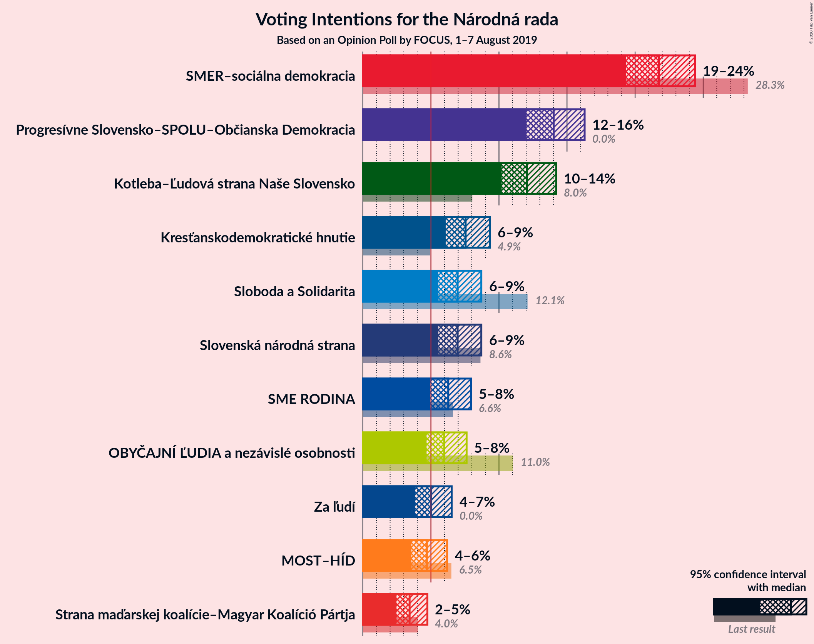

### Confidence Intervals

| Party | Last Result | Poll Result | 80% Confidence Interval | 90% Confidence Interval | 95% Confidence Interval | 99% Confidence Interval |
|:-----:|:-----------:|:-----------:|:-----------------------:|:-----------------------:|:-----------------------:|:-----------------------:|
| SMER–sociálna demokracia | 28.3% | 21.8% | 20.2–23.5% |19.7–24.0% |19.3–24.4% |18.6–25.3% |
| Progresívne Slovensko–SPOLU–Občianska Demokracia | 0.0% | 14.0% | 12.7–15.5% |12.3–15.9% |12.0–16.3% |11.4–17.0% |
| Kotleba–Ľudová strana Naše Slovensko | 8.0% | 12.1% | 10.8–13.5% |10.5–13.9% |10.2–14.2% |9.6–14.9% |
| Kresťanskodemokratické hnutie | 4.9% | 7.5% | 6.6–8.7% |6.3–9.1% |6.1–9.3% |5.6–9.9% |
| Sloboda a Solidarita | 12.1% | 7.0% | 6.0–8.1% |5.8–8.4% |5.5–8.7% |5.1–9.3% |
| Slovenská národná strana | 8.6% | 7.0% | 6.0–8.1% |5.8–8.4% |5.5–8.7% |5.1–9.3% |
| SME RODINA | 6.6% | 6.3% | 5.4–7.4% |5.2–7.7% |4.9–7.9% |4.5–8.5% |
| OBYČAJNÍ ĽUDIA a nezávislé osobnosti | 11.0% | 6.0% | 5.1–7.0% |4.9–7.3% |4.7–7.6% |4.3–8.2% |
| Za ľudí | 0.0% | 5.0% | 4.2–6.0% |4.0–6.3% |3.8–6.5% |3.5–7.0% |
| MOST–HÍD | 6.5% | 4.7% | 3.9–5.7% |3.7–5.9% |3.6–6.2% |3.2–6.7% |
| Strana maďarskej koalície–Magyar Koalíció Pártja | 4.0% | 3.4% | 2.8–4.3% |2.6–4.5% |2.5–4.7% |2.2–5.2% |

*Note:* The poll result column reflects the actual value used in the calculations. Published results may vary slightly, and in addition be rounded to fewer digits.

## Seats

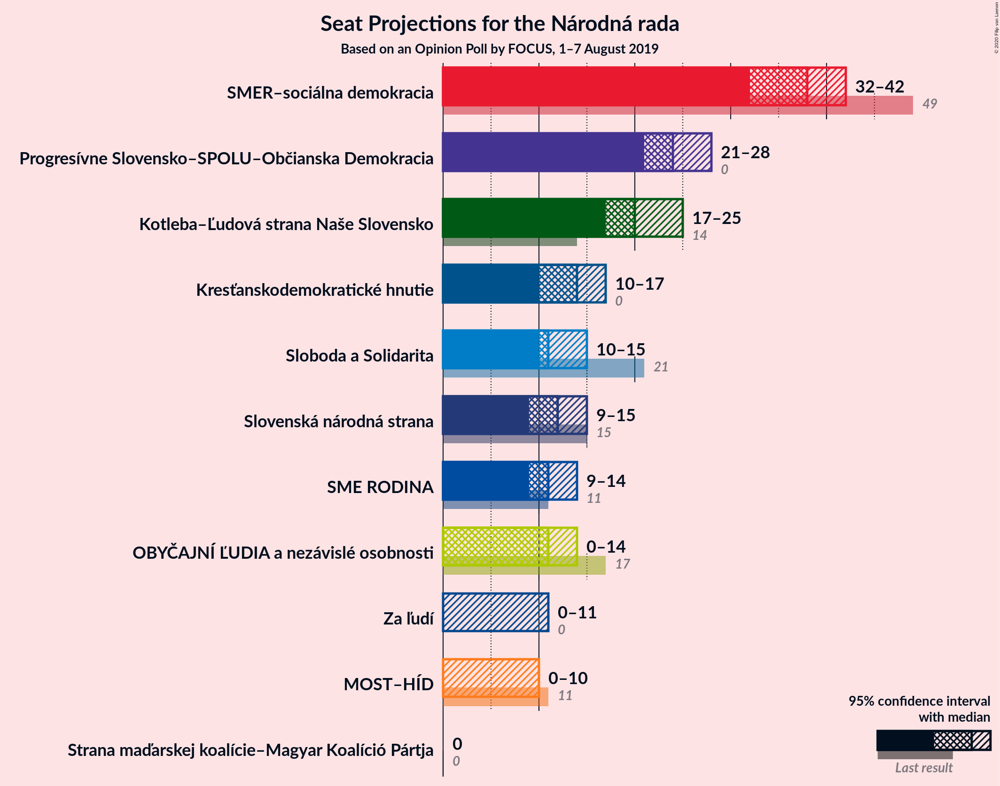

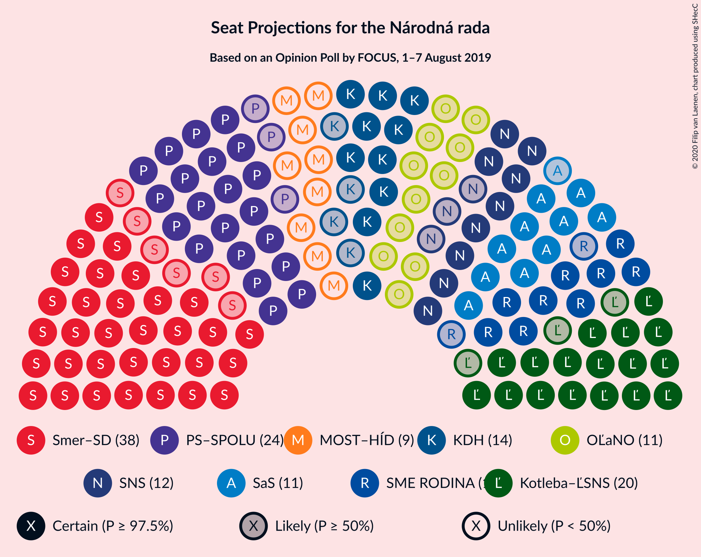

### Confidence Intervals

| Party | Last Result | Median | 80% Confidence Interval | 90% Confidence Interval | 95% Confidence Interval | 99% Confidence Interval |
|:-----:|:-----------:|:------:|:-----------------------:|:-----------------------:|:-----------------------:|:-----------------------:|
| <a href="#smer–sociálna-demokracia">SMER–sociálna demokracia</a> | 49 | 38 | 35–41 |33–42 |32–42 |31–45 |
| <a href="#progresívne-slovensko–spolu–občianska-demokracia">Progresívne Slovensko–SPOLU–Občianska Demokracia</a> | 0 | 24 | 22–26 |21–27 |21–28 |20–30 |
| <a href="#kotleba–ľudová-strana-naše-slovensko">Kotleba–Ľudová strana Naše Slovensko</a> | 14 | 20 | 18–24 |18–25 |17–25 |17–26 |
| <a href="#kresťanskodemokratické-hnutie">Kresťanskodemokratické hnutie</a> | 0 | 14 | 11–15 |11–16 |10–17 |9–18 |
| <a href="#sloboda-a-solidarita">Sloboda a Solidarita</a> | 21 | 11 | 10–14 |10–14 |10–15 |9–16 |
| <a href="#slovenská-národná-strana">Slovenská národná strana</a> | 15 | 12 | 10–14 |10–14 |9–15 |8–16 |
| <a href="#sme-rodina">SME RODINA</a> | 11 | 11 | 10–13 |9–13 |9–14 |0–14 |
| <a href="#obyčajní-ľudia-a-nezávislé-osobnosti">OBYČAJNÍ ĽUDIA a nezávislé osobnosti</a> | 17 | 11 | 9–13 |9–13 |0–14 |0–14 |
| <a href="#za-ľudí">Za ľudí</a> | 0 | 0 | 0–10 |0–11 |0–11 |0–12 |
| <a href="#most–híd">MOST–HÍD</a> | 11 | 0 | 0–9 |0–10 |0–10 |0–11 |
| <a href="#strana-maďarskej-koalície–magyar-koalíció-pártja">Strana maďarskej koalície–Magyar Koalíció Pártja</a> | 0 | 0 | 0 |0 |0 |0 |

### SMER–sociálna demokracia

*For a full overview of the results for this party, see the [SMER–sociálna demokracia](party-smer–sociálnademokracia.html) page.*

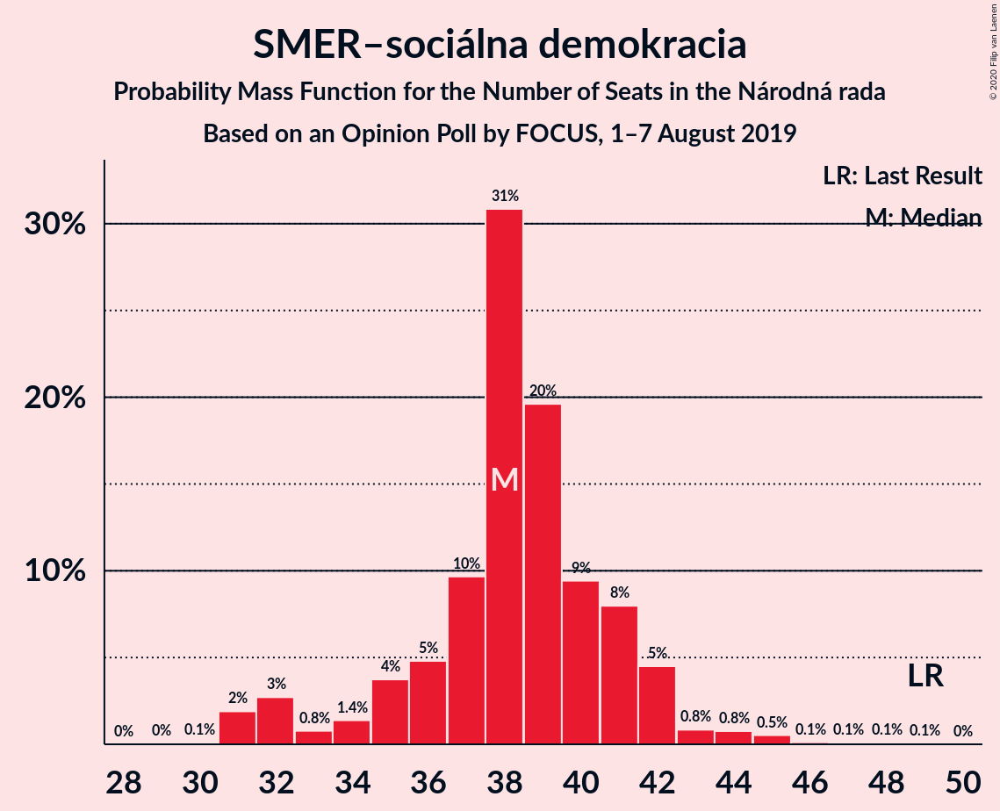

| Number of Seats | Probability | Accumulated | Special Marks |
|:---------------:|:-----------:|:-----------:|:-------------:|
| 30 | 0.1% | 100% |  |
| 31 | 2% | 99.9% |  |
| 32 | 3% | 98% |  |
| 33 | 0.8% | 95% |  |
| 34 | 1.4% | 94% |  |
| 35 | 4% | 93% |  |
| 36 | 5% | 89% |  |
| 37 | 10% | 85% |  |
| 38 | 31% | 75% | Median |
| 39 | 20% | 44% |  |
| 40 | 9% | 24% |  |
| 41 | 8% | 15% |  |
| 42 | 5% | 7% |  |
| 43 | 0.8% | 2% |  |
| 44 | 0.8% | 2% |  |
| 45 | 0.5% | 0.9% |  |
| 46 | 0.1% | 0.4% |  |
| 47 | 0.1% | 0.2% |  |
| 48 | 0.1% | 0.2% |  |
| 49 | 0.1% | 0.1% | Last Result |
| 50 | 0% | 0% |  |

### Progresívne Slovensko–SPOLU–Občianska Demokracia

*For a full overview of the results for this party, see the [Progresívne Slovensko–SPOLU–Občianska Demokracia](party-progresívneslovensko–spolu–občianskademokracia.html) page.*

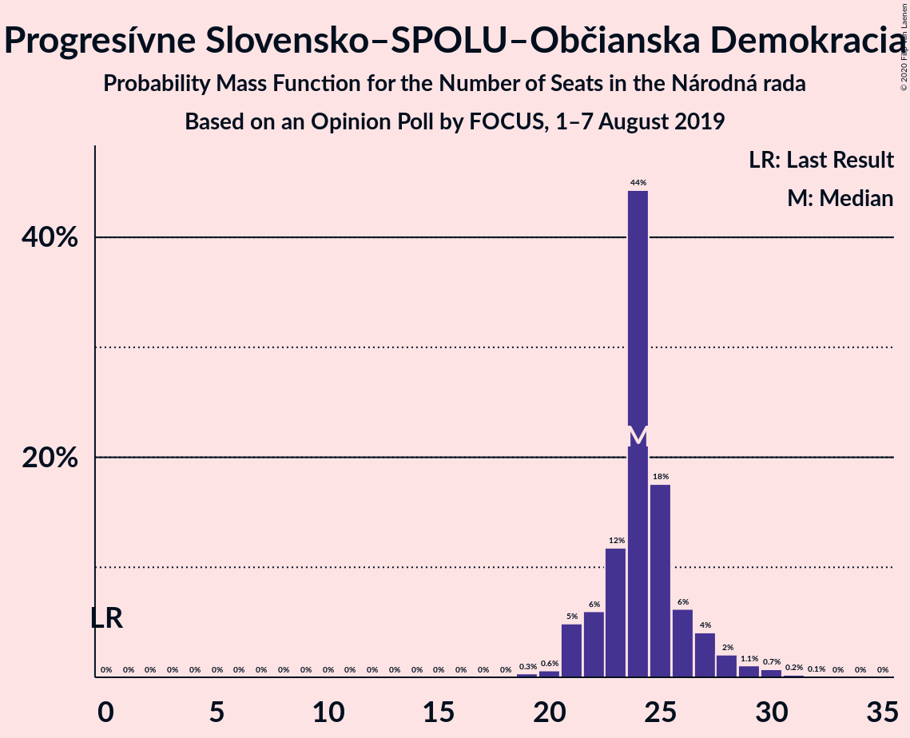

| Number of Seats | Probability | Accumulated | Special Marks |
|:---------------:|:-----------:|:-----------:|:-------------:|
| 0 | 0% | 100% | Last Result |
| 1 | 0% | 100% |  |
| 2 | 0% | 100% |  |
| 3 | 0% | 100% |  |
| 4 | 0% | 100% |  |
| 5 | 0% | 100% |  |
| 6 | 0% | 100% |  |
| 7 | 0% | 100% |  |
| 8 | 0% | 100% |  |
| 9 | 0% | 100% |  |
| 10 | 0% | 100% |  |
| 11 | 0% | 100% |  |
| 12 | 0% | 100% |  |
| 13 | 0% | 100% |  |
| 14 | 0% | 100% |  |
| 15 | 0% | 100% |  |
| 16 | 0% | 100% |  |
| 17 | 0% | 100% |  |
| 18 | 0% | 100% |  |
| 19 | 0.3% | 100% |  |
| 20 | 0.6% | 99.6% |  |
| 21 | 5% | 99.0% |  |
| 22 | 6% | 94% |  |
| 23 | 12% | 88% |  |
| 24 | 44% | 76% | Median |
| 25 | 18% | 32% |  |
| 26 | 6% | 14% |  |
| 27 | 4% | 8% |  |
| 28 | 2% | 4% |  |
| 29 | 1.1% | 2% |  |
| 30 | 0.7% | 1.1% |  |
| 31 | 0.2% | 0.3% |  |
| 32 | 0.1% | 0.1% |  |
| 33 | 0% | 0.1% |  |
| 34 | 0% | 0% |  |

### Kotleba–Ľudová strana Naše Slovensko

*For a full overview of the results for this party, see the [Kotleba–Ľudová strana Naše Slovensko](party-kotleba–ľudovástrananašeslovensko.html) page.*

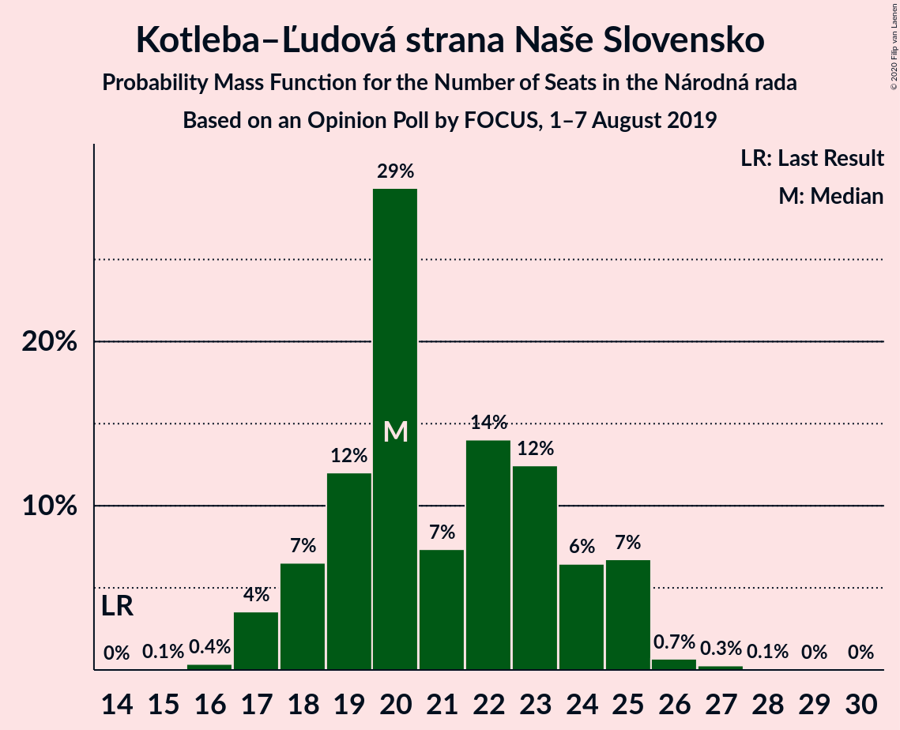

| Number of Seats | Probability | Accumulated | Special Marks |
|:---------------:|:-----------:|:-----------:|:-------------:|
| 14 | 0% | 100% | Last Result |
| 15 | 0.1% | 100% |  |
| 16 | 0.4% | 99.9% |  |
| 17 | 4% | 99.6% |  |
| 18 | 7% | 96% |  |
| 19 | 12% | 89% |  |
| 20 | 29% | 77% | Median |
| 21 | 7% | 48% |  |
| 22 | 14% | 41% |  |
| 23 | 12% | 27% |  |
| 24 | 6% | 14% |  |
| 25 | 7% | 8% |  |
| 26 | 0.7% | 1.1% |  |
| 27 | 0.3% | 0.4% |  |
| 28 | 0.1% | 0.1% |  |
| 29 | 0% | 0.1% |  |
| 30 | 0% | 0% |  |

### Kresťanskodemokratické hnutie

*For a full overview of the results for this party, see the [Kresťanskodemokratické hnutie](party-kresťanskodemokratickéhnutie.html) page.*

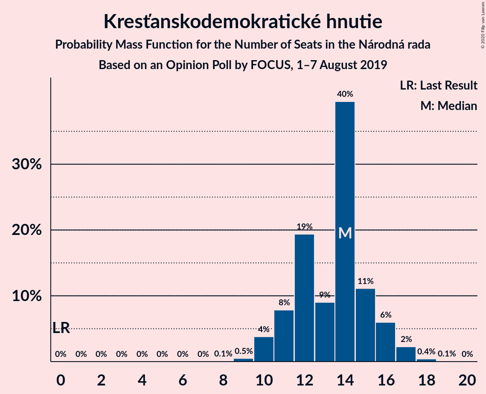

| Number of Seats | Probability | Accumulated | Special Marks |
|:---------------:|:-----------:|:-----------:|:-------------:|
| 0 | 0% | 100% | Last Result |
| 1 | 0% | 100% |  |
| 2 | 0% | 100% |  |
| 3 | 0% | 100% |  |
| 4 | 0% | 100% |  |
| 5 | 0% | 100% |  |
| 6 | 0% | 100% |  |
| 7 | 0% | 100% |  |
| 8 | 0.1% | 100% |  |
| 9 | 0.5% | 99.9% |  |
| 10 | 4% | 99.4% |  |
| 11 | 8% | 96% |  |
| 12 | 19% | 88% |  |
| 13 | 9% | 68% |  |
| 14 | 40% | 59% | Median |
| 15 | 11% | 20% |  |
| 16 | 6% | 9% |  |
| 17 | 2% | 3% |  |
| 18 | 0.4% | 0.5% |  |
| 19 | 0.1% | 0.1% |  |
| 20 | 0% | 0% |  |

### Sloboda a Solidarita

*For a full overview of the results for this party, see the [Sloboda a Solidarita](party-slobodaasolidarita.html) page.*

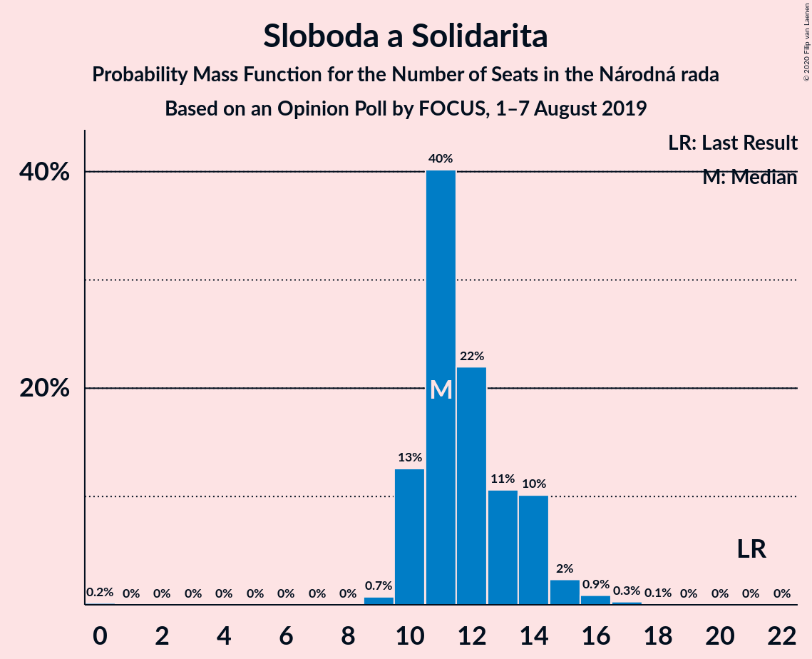

| Number of Seats | Probability | Accumulated | Special Marks |
|:---------------:|:-----------:|:-----------:|:-------------:|
| 0 | 0.2% | 100% |  |
| 1 | 0% | 99.8% |  |
| 2 | 0% | 99.8% |  |
| 3 | 0% | 99.8% |  |
| 4 | 0% | 99.8% |  |
| 5 | 0% | 99.8% |  |
| 6 | 0% | 99.8% |  |
| 7 | 0% | 99.8% |  |
| 8 | 0% | 99.8% |  |
| 9 | 0.7% | 99.8% |  |
| 10 | 13% | 99.1% |  |
| 11 | 40% | 86% | Median |
| 12 | 22% | 46% |  |
| 13 | 11% | 24% |  |
| 14 | 10% | 14% |  |
| 15 | 2% | 4% |  |
| 16 | 0.9% | 1.3% |  |
| 17 | 0.3% | 0.4% |  |
| 18 | 0.1% | 0.1% |  |
| 19 | 0% | 0% |  |
| 20 | 0% | 0% |  |
| 21 | 0% | 0% | Last Result |

### Slovenská národná strana

*For a full overview of the results for this party, see the [Slovenská národná strana](party-slovenskánárodnástrana.html) page.*

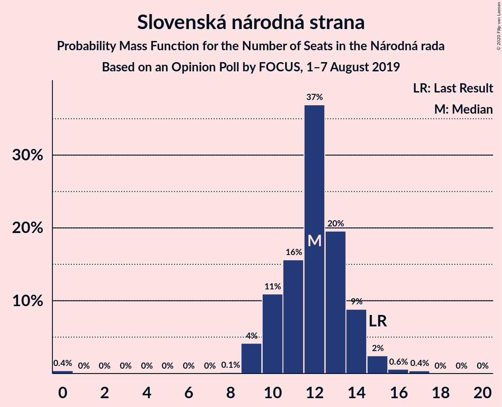

| Number of Seats | Probability | Accumulated | Special Marks |
|:---------------:|:-----------:|:-----------:|:-------------:|
| 0 | 0.4% | 100% |  |
| 1 | 0% | 99.6% |  |
| 2 | 0% | 99.6% |  |
| 3 | 0% | 99.6% |  |
| 4 | 0% | 99.6% |  |
| 5 | 0% | 99.6% |  |
| 6 | 0% | 99.6% |  |
| 7 | 0% | 99.6% |  |
| 8 | 0.1% | 99.6% |  |
| 9 | 4% | 99.5% |  |
| 10 | 11% | 95% |  |
| 11 | 16% | 84% |  |
| 12 | 37% | 69% | Median |
| 13 | 20% | 32% |  |
| 14 | 9% | 12% |  |
| 15 | 2% | 3% | Last Result |
| 16 | 0.6% | 1.0% |  |
| 17 | 0.4% | 0.4% |  |
| 18 | 0% | 0.1% |  |
| 19 | 0% | 0% |  |

### SME RODINA

*For a full overview of the results for this party, see the [SME RODINA](party-smerodina.html) page.*

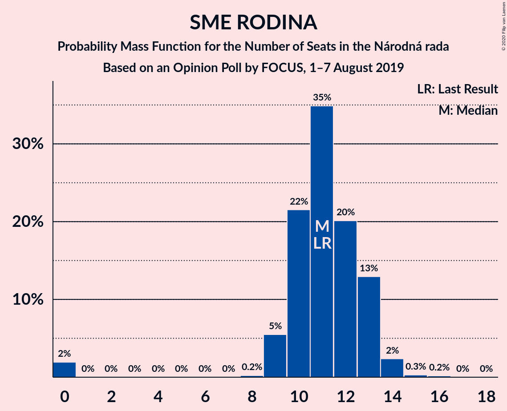

| Number of Seats | Probability | Accumulated | Special Marks |
|:---------------:|:-----------:|:-----------:|:-------------:|
| 0 | 2% | 100% |  |
| 1 | 0% | 98% |  |
| 2 | 0% | 98% |  |
| 3 | 0% | 98% |  |
| 4 | 0% | 98% |  |
| 5 | 0% | 98% |  |
| 6 | 0% | 98% |  |
| 7 | 0% | 98% |  |
| 8 | 0.2% | 98% |  |
| 9 | 5% | 98% |  |
| 10 | 22% | 92% |  |
| 11 | 35% | 71% | Last Result, Median |
| 12 | 20% | 36% |  |
| 13 | 13% | 16% |  |
| 14 | 2% | 3% |  |
| 15 | 0.3% | 0.5% |  |
| 16 | 0.2% | 0.2% |  |
| 17 | 0% | 0% |  |

### OBYČAJNÍ ĽUDIA a nezávislé osobnosti

*For a full overview of the results for this party, see the [OBYČAJNÍ ĽUDIA a nezávislé osobnosti](party-obyčajníľudiaanezávisléosobnosti.html) page.*

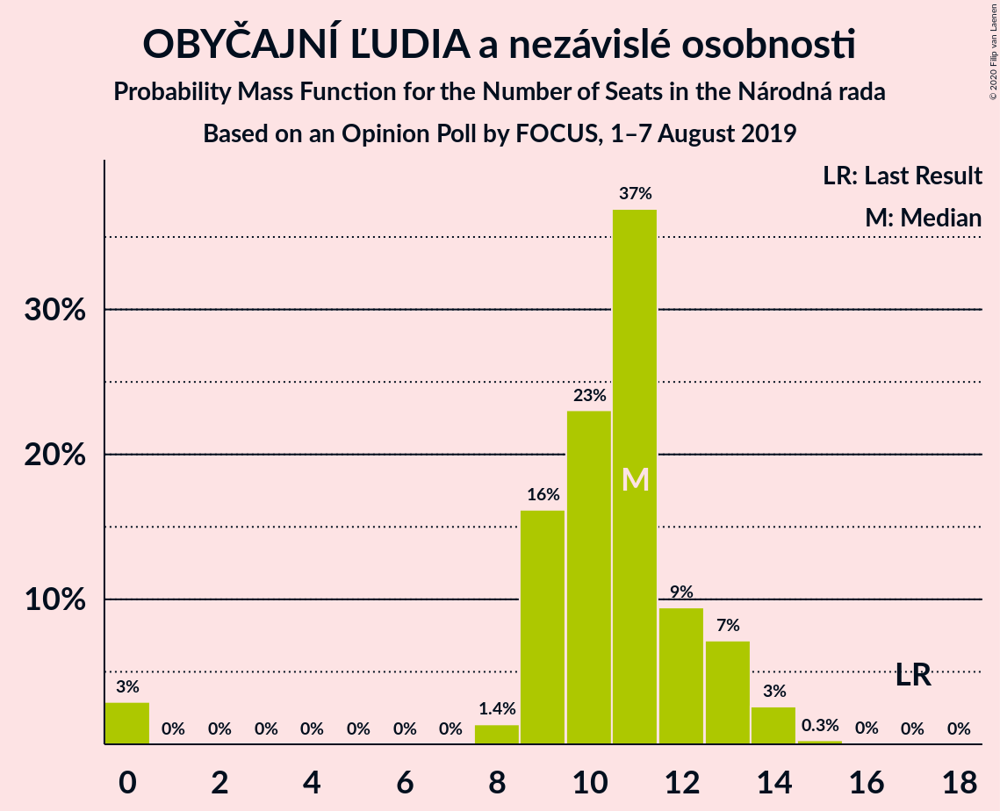

| Number of Seats | Probability | Accumulated | Special Marks |
|:---------------:|:-----------:|:-----------:|:-------------:|
| 0 | 3% | 100% |  |
| 1 | 0% | 97% |  |
| 2 | 0% | 97% |  |
| 3 | 0% | 97% |  |
| 4 | 0% | 97% |  |
| 5 | 0% | 97% |  |
| 6 | 0% | 97% |  |
| 7 | 0% | 97% |  |
| 8 | 1.4% | 97% |  |
| 9 | 16% | 96% |  |
| 10 | 23% | 80% |  |
| 11 | 37% | 56% | Median |
| 12 | 9% | 20% |  |
| 13 | 7% | 10% |  |
| 14 | 3% | 3% |  |
| 15 | 0.3% | 0.3% |  |
| 16 | 0% | 0% |  |
| 17 | 0% | 0% | Last Result |

### Za ľudí

*For a full overview of the results for this party, see the [Za ľudí](party-zaľudí.html) page.*

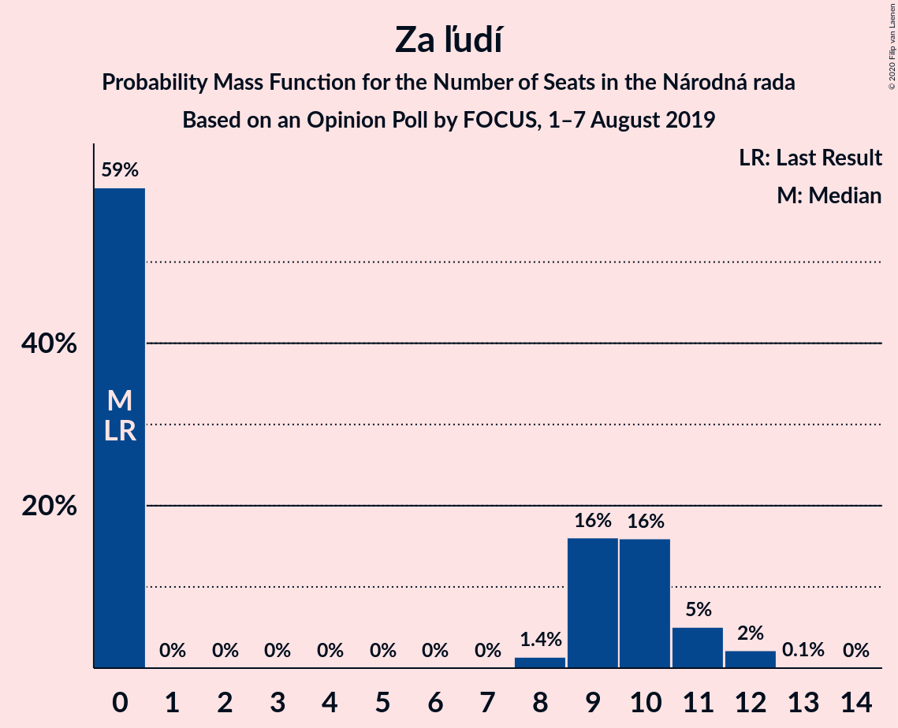

| Number of Seats | Probability | Accumulated | Special Marks |
|:---------------:|:-----------:|:-----------:|:-------------:|
| 0 | 59% | 100% | Last Result, Median |
| 1 | 0% | 41% |  |
| 2 | 0% | 41% |  |
| 3 | 0% | 41% |  |
| 4 | 0% | 41% |  |
| 5 | 0% | 41% |  |
| 6 | 0% | 41% |  |
| 7 | 0% | 41% |  |
| 8 | 1.4% | 41% |  |
| 9 | 16% | 39% |  |
| 10 | 16% | 23% |  |
| 11 | 5% | 7% |  |
| 12 | 2% | 2% |  |
| 13 | 0.1% | 0.1% |  |
| 14 | 0% | 0% |  |

### MOST–HÍD

*For a full overview of the results for this party, see the [MOST–HÍD](party-most–híd.html) page.*

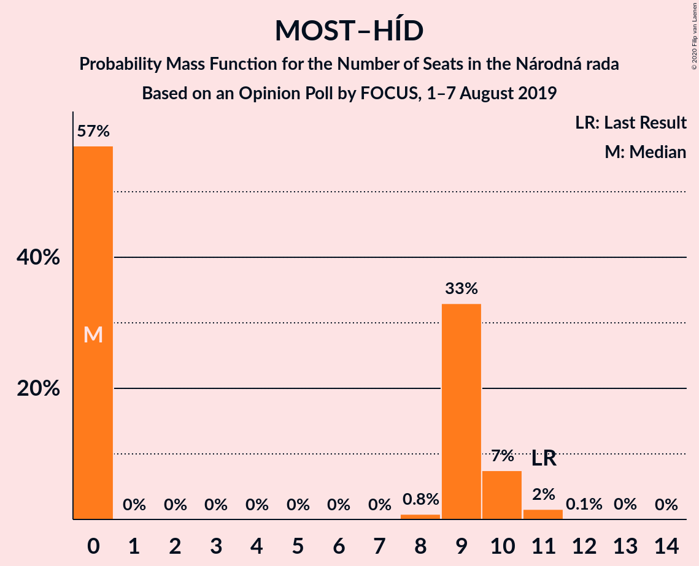

| Number of Seats | Probability | Accumulated | Special Marks |
|:---------------:|:-----------:|:-----------:|:-------------:|
| 0 | 57% | 100% | Median |
| 1 | 0% | 43% |  |
| 2 | 0% | 43% |  |
| 3 | 0% | 43% |  |
| 4 | 0% | 43% |  |
| 5 | 0% | 43% |  |
| 6 | 0% | 43% |  |
| 7 | 0% | 43% |  |
| 8 | 0.8% | 43% |  |
| 9 | 33% | 42% |  |
| 10 | 7% | 9% |  |
| 11 | 2% | 2% | Last Result |
| 12 | 0.1% | 0.2% |  |
| 13 | 0% | 0.1% |  |
| 14 | 0% | 0% |  |

### Strana maďarskej koalície–Magyar Koalíció Pártja

*For a full overview of the results for this party, see the [Strana maďarskej koalície–Magyar Koalíció Pártja](party-stranamaďarskejkoalície–magyarkoalíciópártja.html) page.*

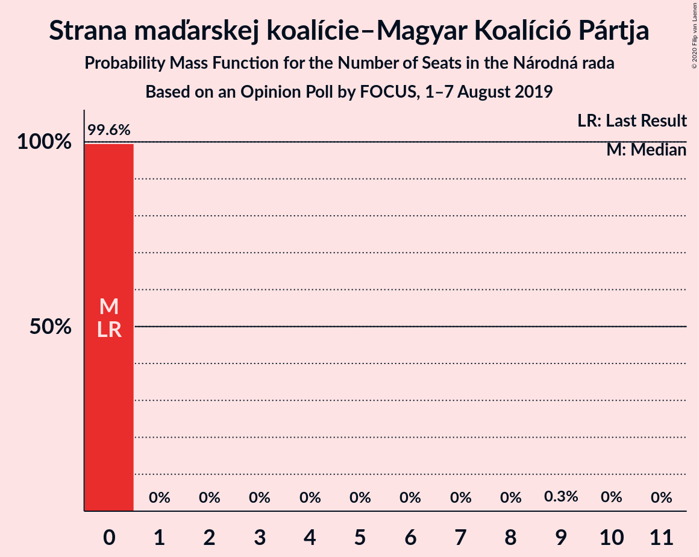

| Number of Seats | Probability | Accumulated | Special Marks |
|:---------------:|:-----------:|:-----------:|:-------------:|
| 0 | 99.6% | 100% | Last Result, Median |
| 1 | 0% | 0.4% |  |
| 2 | 0% | 0.4% |  |
| 3 | 0% | 0.4% |  |
| 4 | 0% | 0.4% |  |
| 5 | 0% | 0.4% |  |
| 6 | 0% | 0.4% |  |
| 7 | 0% | 0.4% |  |
| 8 | 0% | 0.4% |  |
| 9 | 0.3% | 0.4% |  |
| 10 | 0% | 0.1% |  |
| 11 | 0% | 0% |  |

## Coalitions

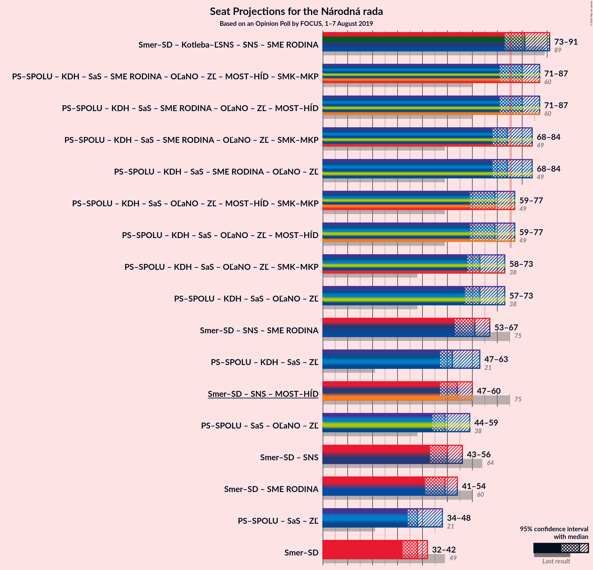

### Confidence Intervals

| Coalition | Last Result | Median | Majority? | 80% Confidence Interval | 90% Confidence Interval | 95% Confidence Interval | 99% Confidence Interval |
|:---------:|:-----------:|:------:|:---------:|:-----------------------:|:-----------------------:|:-----------------------:|:-----------------------:|
| SMER–sociálna demokracia – Kotleba–Ľudová strana Naše Slovensko – Slovenská národná strana – SME RODINA | 89 | 81 | 93% | 77–89 | 73–91 | 73–91 | 71–92 |
| Progresívne Slovensko–SPOLU–Občianska Demokracia – Kresťanskodemokratické hnutie – Sloboda a Solidarita – SME RODINA – OBYČAJNÍ ĽUDIA a nezávislé osobnosti – Za ľudí – MOST–HÍD – Strana maďarskej koalície–Magyar Koalíció Pártja | 60 | 80 | 79% | 72–84 | 71–87 | 71–87 | 68–88 |
| Progresívne Slovensko–SPOLU–Občianska Demokracia – Kresťanskodemokratické hnutie – Sloboda a Solidarita – SME RODINA – OBYČAJNÍ ĽUDIA a nezávislé osobnosti – Za ľudí – MOST–HÍD | 60 | 80 | 79% | 72–84 | 71–86 | 71–87 | 68–88 |
| Progresívne Slovensko–SPOLU–Občianska Demokracia – Kresťanskodemokratické hnutie – Sloboda a Solidarita – SME RODINA – OBYČAJNÍ ĽUDIA a nezávislé osobnosti – Za ľudí – Strana maďarskej koalície–Magyar Koalíció Pártja | 49 | 74 | 43% | 70–82 | 69–82 | 68–84 | 64–85 |
| Progresívne Slovensko–SPOLU–Občianska Demokracia – Kresťanskodemokratické hnutie – Sloboda a Solidarita – SME RODINA – OBYČAJNÍ ĽUDIA a nezávislé osobnosti – Za ľudí | 49 | 74 | 42% | 70–82 | 69–82 | 68–84 | 64–85 |
| Progresívne Slovensko–SPOLU–Občianska Demokracia – Kresťanskodemokratické hnutie – Sloboda a Solidarita – OBYČAJNÍ ĽUDIA a nezávislé osobnosti – Za ľudí – MOST–HÍD – Strana maďarskej koalície–Magyar Koalíció Pártja | 49 | 69 | 6% | 61–73 | 59–77 | 59–77 | 58–79 |
| Progresívne Slovensko–SPOLU–Občianska Demokracia – Kresťanskodemokratické hnutie – Sloboda a Solidarita – OBYČAJNÍ ĽUDIA a nezávislé osobnosti – Za ľudí – MOST–HÍD | 49 | 69 | 6% | 61–73 | 59–77 | 59–77 | 58–79 |
| Progresívne Slovensko–SPOLU–Občianska Demokracia – Kresťanskodemokratické hnutie – Sloboda a Solidarita – OBYČAJNÍ ĽUDIA a nezávislé osobnosti – Za ľudí – Strana maďarskej koalície–Magyar Koalíció Pártja | 38 | 63 | 0.5% | 59–69 | 59–71 | 58–73 | 53–75 |
| Progresívne Slovensko–SPOLU–Občianska Demokracia – Kresťanskodemokratické hnutie – Sloboda a Solidarita – OBYČAJNÍ ĽUDIA a nezávislé osobnosti – Za ľudí | 38 | 63 | 0.5% | 59–69 | 59–70 | 57–73 | 53–75 |
| SMER–sociálna demokracia – Slovenská národná strana – SME RODINA | 75 | 61 | 0% | 57–66 | 55–67 | 53–67 | 50–69 |
| Progresívne Slovensko–SPOLU–Občianska Demokracia – Kresťanskodemokratické hnutie – Sloboda a Solidarita – Za ľudí | 21 | 52 | 0% | 49–60 | 48–60 | 47–63 | 45–65 |
| SMER–sociálna demokracia – Slovenská národná strana – MOST–HÍD | 75 | 54 | 0% | 49–59 | 48–60 | 47–60 | 44–63 |
| Progresívne Slovensko–SPOLU–Občianska Demokracia – Sloboda a Solidarita – OBYČAJNÍ ĽUDIA a nezávislé osobnosti – Za ľudí | 38 | 49 | 0% | 45–57 | 44–58 | 44–59 | 40–63 |
| SMER–sociálna demokracia – Slovenská národná strana | 64 | 50 | 0% | 47–54 | 45–56 | 43–56 | 42–58 |
| SMER–sociálna demokracia – SME RODINA | 60 | 49 | 0% | 45–53 | 43–53 | 41–54 | 38–56 |
| Progresívne Slovensko–SPOLU–Občianska Demokracia – Sloboda a Solidarita – Za ľudí | 21 | 38 | 0% | 35–46 | 34–48 | 34–48 | 32–51 |
| SMER–sociálna demokracia | 49 | 38 | 0% | 35–41 | 33–42 | 32–42 | 31–45 |

### SMER–sociálna demokracia – Kotleba–Ľudová strana Naše Slovensko – Slovenská národná strana – SME RODINA

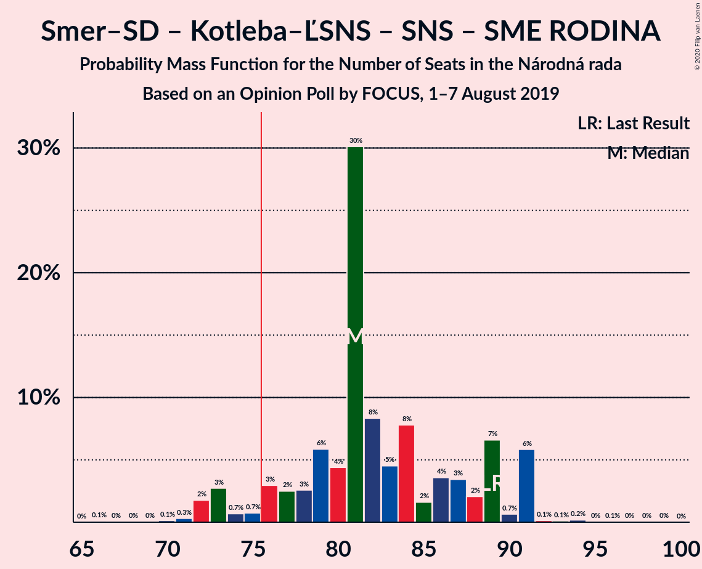

| Number of Seats | Probability | Accumulated | Special Marks |
|:---------------:|:-----------:|:-----------:|:-------------:|
| 66 | 0.1% | 100% |  |
| 67 | 0% | 99.9% |  |
| 68 | 0% | 99.9% |  |
| 69 | 0% | 99.8% |  |
| 70 | 0.1% | 99.8% |  |
| 71 | 0.3% | 99.7% |  |
| 72 | 2% | 99.4% |  |
| 73 | 3% | 98% |  |
| 74 | 0.7% | 95% |  |
| 75 | 0.7% | 94% |  |
| 76 | 3% | 93% | Majority |
| 77 | 2% | 90% |  |
| 78 | 3% | 88% |  |
| 79 | 6% | 85% |  |
| 80 | 4% | 80% |  |
| 81 | 30% | 75% | Median |
| 82 | 8% | 45% |  |
| 83 | 5% | 37% |  |
| 84 | 8% | 32% |  |
| 85 | 2% | 24% |  |
| 86 | 4% | 23% |  |
| 87 | 3% | 19% |  |
| 88 | 2% | 16% |  |
| 89 | 7% | 14% | Last Result |
| 90 | 0.7% | 7% |  |
| 91 | 6% | 6% |  |
| 92 | 0.1% | 0.6% |  |
| 93 | 0.1% | 0.5% |  |
| 94 | 0.2% | 0.4% |  |
| 95 | 0% | 0.2% |  |
| 96 | 0.1% | 0.1% |  |
| 97 | 0% | 0.1% |  |
| 98 | 0% | 0.1% |  |
| 99 | 0% | 0% |  |

### Progresívne Slovensko–SPOLU–Občianska Demokracia – Kresťanskodemokratické hnutie – Sloboda a Solidarita – SME RODINA – OBYČAJNÍ ĽUDIA a nezávislé osobnosti – Za ľudí – MOST–HÍD – Strana maďarskej koalície–Magyar Koalíció Pártja

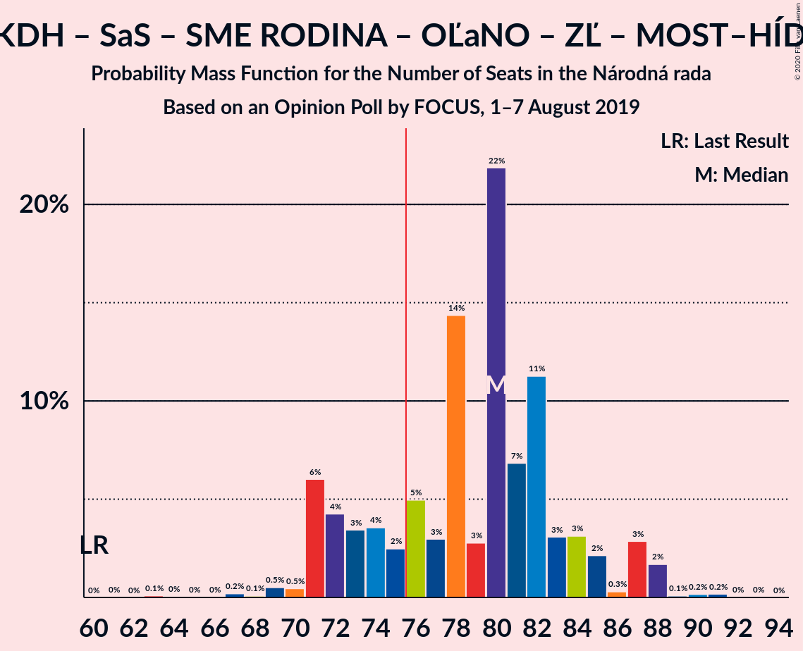

| Number of Seats | Probability | Accumulated | Special Marks |
|:---------------:|:-----------:|:-----------:|:-------------:|
| 60 | 0% | 100% | Last Result |
| 61 | 0% | 100% |  |
| 62 | 0% | 100% |  |
| 63 | 0.1% | 100% |  |
| 64 | 0% | 99.9% |  |
| 65 | 0% | 99.8% |  |
| 66 | 0% | 99.8% |  |
| 67 | 0.2% | 99.8% |  |
| 68 | 0.1% | 99.6% |  |
| 69 | 0.5% | 99.5% |  |
| 70 | 0.5% | 99.0% |  |
| 71 | 6% | 98.5% | Median |
| 72 | 4% | 93% |  |
| 73 | 3% | 88% |  |
| 74 | 4% | 85% |  |
| 75 | 2% | 81% |  |
| 76 | 5% | 79% | Majority |
| 77 | 3% | 74% |  |
| 78 | 14% | 71% |  |
| 79 | 3% | 56% |  |
| 80 | 22% | 54% |  |
| 81 | 7% | 32% |  |
| 82 | 11% | 25% |  |
| 83 | 3% | 14% |  |
| 84 | 3% | 11% |  |
| 85 | 2% | 7% |  |
| 86 | 0.3% | 5% |  |
| 87 | 3% | 5% |  |
| 88 | 2% | 2% |  |
| 89 | 0.1% | 0.5% |  |
| 90 | 0.2% | 0.4% |  |
| 91 | 0.2% | 0.2% |  |
| 92 | 0% | 0.1% |  |
| 93 | 0% | 0% |  |

### Progresívne Slovensko–SPOLU–Občianska Demokracia – Kresťanskodemokratické hnutie – Sloboda a Solidarita – SME RODINA – OBYČAJNÍ ĽUDIA a nezávislé osobnosti – Za ľudí – MOST–HÍD

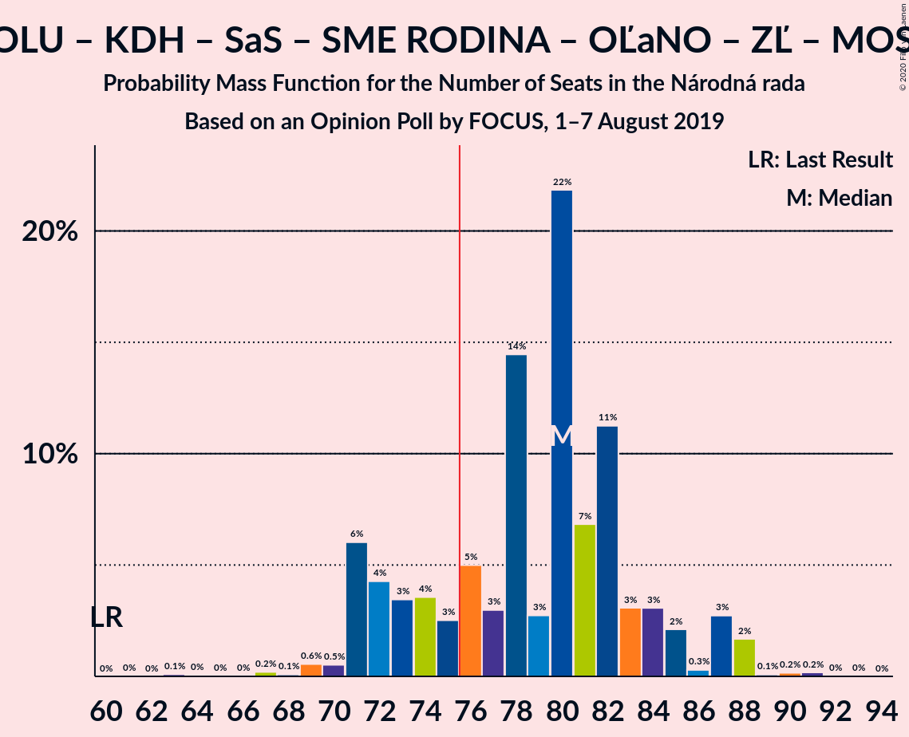

| Number of Seats | Probability | Accumulated | Special Marks |
|:---------------:|:-----------:|:-----------:|:-------------:|
| 60 | 0% | 100% | Last Result |
| 61 | 0% | 100% |  |
| 62 | 0% | 100% |  |
| 63 | 0.1% | 100% |  |
| 64 | 0% | 99.9% |  |
| 65 | 0% | 99.8% |  |
| 66 | 0% | 99.8% |  |
| 67 | 0.2% | 99.8% |  |
| 68 | 0.1% | 99.6% |  |
| 69 | 0.6% | 99.5% |  |
| 70 | 0.5% | 98.9% |  |
| 71 | 6% | 98% | Median |
| 72 | 4% | 92% |  |
| 73 | 3% | 88% |  |
| 74 | 4% | 85% |  |
| 75 | 3% | 81% |  |
| 76 | 5% | 79% | Majority |
| 77 | 3% | 74% |  |
| 78 | 14% | 71% |  |
| 79 | 3% | 56% |  |
| 80 | 22% | 53% |  |
| 81 | 7% | 32% |  |
| 82 | 11% | 25% |  |
| 83 | 3% | 13% |  |
| 84 | 3% | 10% |  |
| 85 | 2% | 7% |  |
| 86 | 0.3% | 5% |  |
| 87 | 3% | 5% |  |
| 88 | 2% | 2% |  |
| 89 | 0.1% | 0.5% |  |
| 90 | 0.2% | 0.4% |  |
| 91 | 0.2% | 0.2% |  |
| 92 | 0% | 0.1% |  |
| 93 | 0% | 0% |  |

### Progresívne Slovensko–SPOLU–Občianska Demokracia – Kresťanskodemokratické hnutie – Sloboda a Solidarita – SME RODINA – OBYČAJNÍ ĽUDIA a nezávislé osobnosti – Za ľudí – Strana maďarskej koalície–Magyar Koalíció Pártja

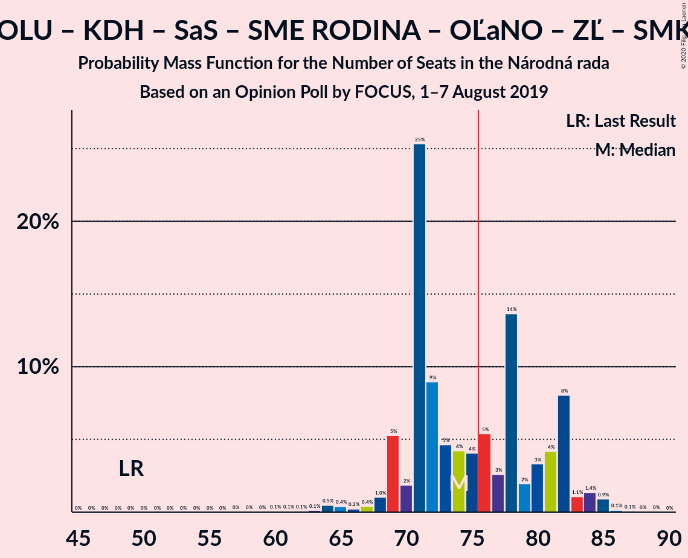

| Number of Seats | Probability | Accumulated | Special Marks |
|:---------------:|:-----------:|:-----------:|:-------------:|
| 49 | 0% | 100% | Last Result |
| 50 | 0% | 100% |  |
| 51 | 0% | 100% |  |
| 52 | 0% | 100% |  |
| 53 | 0% | 100% |  |
| 54 | 0% | 100% |  |
| 55 | 0% | 100% |  |
| 56 | 0% | 100% |  |
| 57 | 0% | 100% |  |
| 58 | 0% | 100% |  |
| 59 | 0% | 100% |  |
| 60 | 0.1% | 100% |  |
| 61 | 0.1% | 99.9% |  |
| 62 | 0.1% | 99.9% |  |
| 63 | 0.1% | 99.8% |  |
| 64 | 0.5% | 99.6% |  |
| 65 | 0.4% | 99.2% |  |
| 66 | 0.2% | 98.8% |  |
| 67 | 0.4% | 98.6% |  |
| 68 | 1.0% | 98% |  |
| 69 | 5% | 97% |  |
| 70 | 2% | 92% |  |
| 71 | 25% | 90% | Median |
| 72 | 9% | 65% |  |
| 73 | 5% | 56% |  |
| 74 | 4% | 51% |  |
| 75 | 4% | 47% |  |
| 76 | 5% | 43% | Majority |
| 77 | 3% | 37% |  |
| 78 | 14% | 35% |  |
| 79 | 2% | 21% |  |
| 80 | 3% | 19% |  |
| 81 | 4% | 16% |  |
| 82 | 8% | 12% |  |
| 83 | 1.1% | 4% |  |
| 84 | 1.4% | 3% |  |
| 85 | 0.9% | 1.2% |  |
| 86 | 0.1% | 0.3% |  |
| 87 | 0.1% | 0.1% |  |
| 88 | 0% | 0% |  |

### Progresívne Slovensko–SPOLU–Občianska Demokracia – Kresťanskodemokratické hnutie – Sloboda a Solidarita – SME RODINA – OBYČAJNÍ ĽUDIA a nezávislé osobnosti – Za ľudí

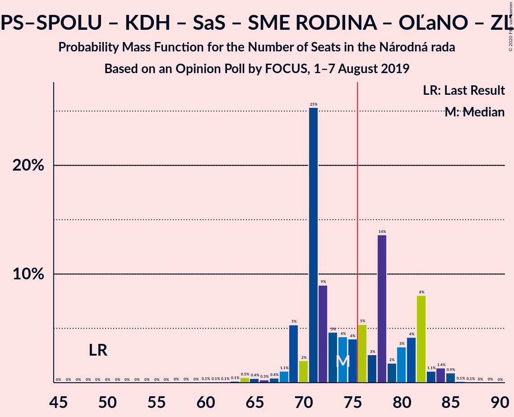

| Number of Seats | Probability | Accumulated | Special Marks |
|:---------------:|:-----------:|:-----------:|:-------------:|
| 49 | 0% | 100% | Last Result |
| 50 | 0% | 100% |  |
| 51 | 0% | 100% |  |
| 52 | 0% | 100% |  |
| 53 | 0% | 100% |  |
| 54 | 0% | 100% |  |
| 55 | 0% | 100% |  |
| 56 | 0% | 100% |  |
| 57 | 0% | 100% |  |
| 58 | 0% | 100% |  |
| 59 | 0% | 100% |  |
| 60 | 0.1% | 100% |  |
| 61 | 0.1% | 99.9% |  |
| 62 | 0.1% | 99.8% |  |
| 63 | 0.1% | 99.8% |  |
| 64 | 0.5% | 99.6% |  |
| 65 | 0.4% | 99.1% |  |
| 66 | 0.3% | 98.8% |  |
| 67 | 0.4% | 98% |  |
| 68 | 1.1% | 98% |  |
| 69 | 5% | 97% |  |
| 70 | 2% | 92% |  |
| 71 | 25% | 90% | Median |
| 72 | 9% | 64% |  |
| 73 | 5% | 55% |  |
| 74 | 4% | 51% |  |
| 75 | 4% | 46% |  |
| 76 | 5% | 42% | Majority |
| 77 | 3% | 37% |  |
| 78 | 14% | 34% |  |
| 79 | 2% | 21% |  |
| 80 | 3% | 19% |  |
| 81 | 4% | 16% |  |
| 82 | 8% | 12% |  |
| 83 | 1.1% | 4% |  |
| 84 | 1.4% | 3% |  |
| 85 | 0.9% | 1.2% |  |
| 86 | 0.1% | 0.3% |  |
| 87 | 0.1% | 0.1% |  |
| 88 | 0% | 0% |  |

### Progresívne Slovensko–SPOLU–Občianska Demokracia – Kresťanskodemokratické hnutie – Sloboda a Solidarita – OBYČAJNÍ ĽUDIA a nezávislé osobnosti – Za ľudí – MOST–HÍD – Strana maďarskej koalície–Magyar Koalíció Pártja

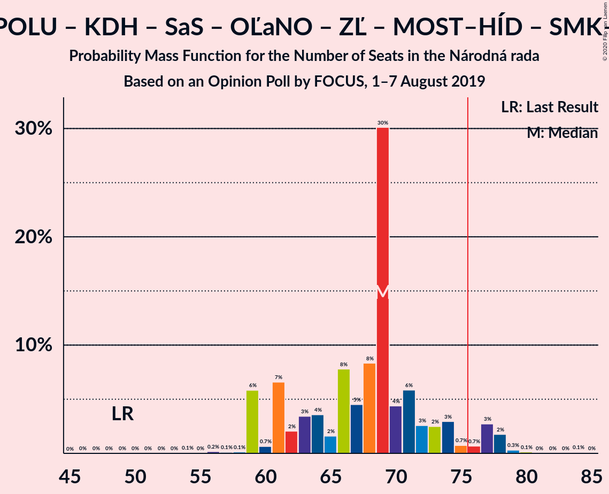

| Number of Seats | Probability | Accumulated | Special Marks |
|:---------------:|:-----------:|:-----------:|:-------------:|
| 49 | 0% | 100% | Last Result |
| 50 | 0% | 100% |  |
| 51 | 0% | 100% |  |
| 52 | 0% | 100% |  |
| 53 | 0% | 99.9% |  |
| 54 | 0.1% | 99.9% |  |
| 55 | 0% | 99.9% |  |
| 56 | 0.2% | 99.8% |  |
| 57 | 0.1% | 99.6% |  |
| 58 | 0.1% | 99.5% |  |
| 59 | 6% | 99.4% |  |
| 60 | 0.7% | 94% | Median |
| 61 | 7% | 93% |  |
| 62 | 2% | 86% |  |
| 63 | 3% | 84% |  |
| 64 | 4% | 81% |  |
| 65 | 2% | 77% |  |
| 66 | 8% | 76% |  |
| 67 | 5% | 68% |  |
| 68 | 8% | 63% |  |
| 69 | 30% | 55% |  |
| 70 | 4% | 25% |  |
| 71 | 6% | 20% |  |
| 72 | 3% | 15% |  |
| 73 | 2% | 12% |  |
| 74 | 3% | 10% |  |
| 75 | 0.7% | 7% |  |
| 76 | 0.7% | 6% | Majority |
| 77 | 3% | 5% |  |
| 78 | 2% | 2% |  |
| 79 | 0.3% | 0.6% |  |
| 80 | 0.1% | 0.3% |  |
| 81 | 0% | 0.2% |  |
| 82 | 0% | 0.2% |  |
| 83 | 0% | 0.1% |  |
| 84 | 0.1% | 0.1% |  |
| 85 | 0% | 0% |  |

### Progresívne Slovensko–SPOLU–Občianska Demokracia – Kresťanskodemokratické hnutie – Sloboda a Solidarita – OBYČAJNÍ ĽUDIA a nezávislé osobnosti – Za ľudí – MOST–HÍD

| Number of Seats | Probability | Accumulated | Special Marks |
|:---------------:|:-----------:|:-----------:|:-------------:|
| 49 | 0% | 100% | Last Result |
| 50 | 0% | 100% |  |
| 51 | 0% | 100% |  |
| 52 | 0% | 100% |  |
| 53 | 0% | 99.9% |  |
| 54 | 0.1% | 99.9% |  |
| 55 | 0% | 99.9% |  |
| 56 | 0.2% | 99.8% |  |
| 57 | 0.1% | 99.6% |  |
| 58 | 0.1% | 99.5% |  |
| 59 | 6% | 99.4% |  |
| 60 | 0.7% | 93% | Median |
| 61 | 7% | 93% |  |
| 62 | 2% | 86% |  |
| 63 | 3% | 84% |  |
| 64 | 4% | 81% |  |
| 65 | 2% | 77% |  |
| 66 | 8% | 75% |  |
| 67 | 5% | 68% |  |
| 68 | 8% | 63% |  |
| 69 | 30% | 55% |  |
| 70 | 4% | 25% |  |
| 71 | 6% | 20% |  |
| 72 | 3% | 14% |  |
| 73 | 2% | 12% |  |
| 74 | 3% | 9% |  |
| 75 | 0.7% | 6% |  |
| 76 | 0.6% | 6% | Majority |
| 77 | 3% | 5% |  |
| 78 | 2% | 2% |  |
| 79 | 0.3% | 0.6% |  |
| 80 | 0.1% | 0.3% |  |
| 81 | 0% | 0.1% |  |
| 82 | 0% | 0.1% |  |
| 83 | 0% | 0.1% |  |
| 84 | 0.1% | 0.1% |  |
| 85 | 0% | 0% |  |

### Progresívne Slovensko–SPOLU–Občianska Demokracia – Kresťanskodemokratické hnutie – Sloboda a Solidarita – OBYČAJNÍ ĽUDIA a nezávislé osobnosti – Za ľudí – Strana maďarskej koalície–Magyar Koalíció Pártja

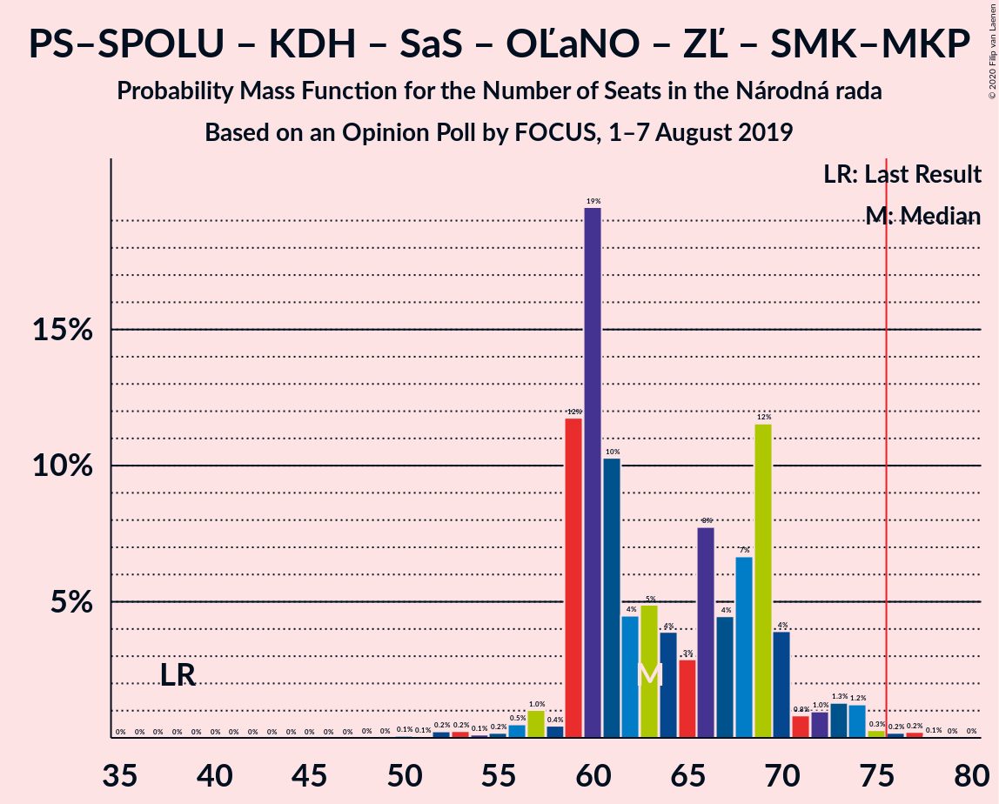

| Number of Seats | Probability | Accumulated | Special Marks |
|:---------------:|:-----------:|:-----------:|:-------------:|
| 38 | 0% | 100% | Last Result |
| 39 | 0% | 100% |  |
| 40 | 0% | 100% |  |
| 41 | 0% | 100% |  |
| 42 | 0% | 100% |  |
| 43 | 0% | 100% |  |
| 44 | 0% | 100% |  |
| 45 | 0% | 100% |  |
| 46 | 0% | 100% |  |
| 47 | 0% | 100% |  |
| 48 | 0% | 100% |  |
| 49 | 0% | 100% |  |
| 50 | 0.1% | 100% |  |
| 51 | 0.1% | 99.9% |  |
| 52 | 0.2% | 99.9% |  |
| 53 | 0.2% | 99.6% |  |
| 54 | 0.1% | 99.4% |  |
| 55 | 0.2% | 99.2% |  |
| 56 | 0.5% | 99.1% |  |
| 57 | 1.0% | 98.6% |  |
| 58 | 0.4% | 98% |  |
| 59 | 12% | 97% |  |
| 60 | 19% | 85% | Median |
| 61 | 10% | 66% |  |
| 62 | 4% | 56% |  |
| 63 | 5% | 51% |  |
| 64 | 4% | 46% |  |
| 65 | 3% | 42% |  |
| 66 | 8% | 39% |  |
| 67 | 4% | 32% |  |
| 68 | 7% | 27% |  |
| 69 | 12% | 21% |  |
| 70 | 4% | 9% |  |
| 71 | 0.8% | 5% |  |
| 72 | 1.0% | 4% |  |
| 73 | 1.3% | 3% |  |
| 74 | 1.2% | 2% |  |
| 75 | 0.3% | 0.8% |  |
| 76 | 0.2% | 0.5% | Majority |
| 77 | 0.2% | 0.3% |  |
| 78 | 0.1% | 0.1% |  |
| 79 | 0% | 0% |  |

### Progresívne Slovensko–SPOLU–Občianska Demokracia – Kresťanskodemokratické hnutie – Sloboda a Solidarita – OBYČAJNÍ ĽUDIA a nezávislé osobnosti – Za ľudí

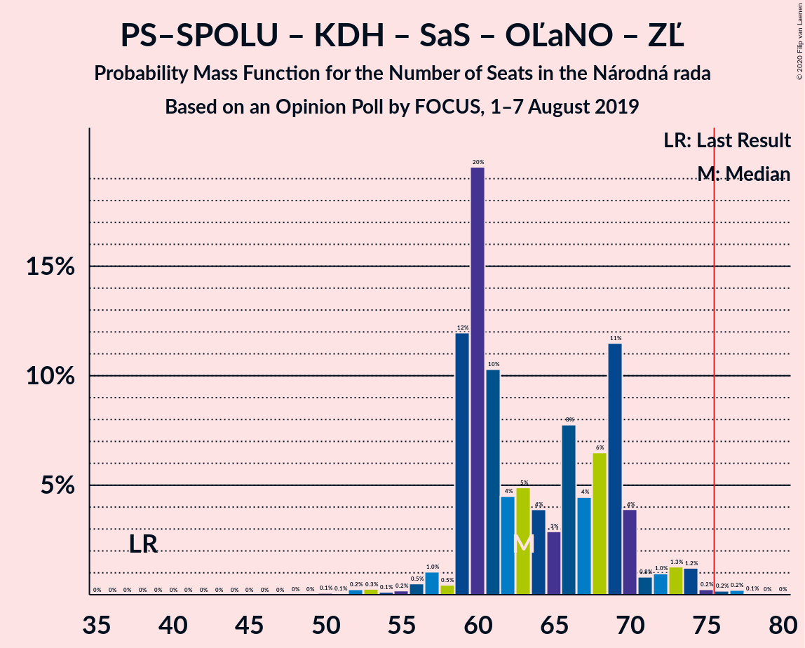

| Number of Seats | Probability | Accumulated | Special Marks |
|:---------------:|:-----------:|:-----------:|:-------------:|
| 38 | 0% | 100% | Last Result |
| 39 | 0% | 100% |  |
| 40 | 0% | 100% |  |
| 41 | 0% | 100% |  |
| 42 | 0% | 100% |  |
| 43 | 0% | 100% |  |
| 44 | 0% | 100% |  |
| 45 | 0% | 100% |  |
| 46 | 0% | 100% |  |
| 47 | 0% | 100% |  |
| 48 | 0% | 100% |  |
| 49 | 0% | 100% |  |
| 50 | 0.1% | 100% |  |
| 51 | 0.1% | 99.9% |  |
| 52 | 0.2% | 99.8% |  |
| 53 | 0.3% | 99.6% |  |
| 54 | 0.1% | 99.3% |  |
| 55 | 0.2% | 99.2% |  |
| 56 | 0.5% | 99.0% |  |
| 57 | 1.0% | 98.5% |  |
| 58 | 0.5% | 97% |  |
| 59 | 12% | 97% |  |
| 60 | 20% | 85% | Median |
| 61 | 10% | 66% |  |
| 62 | 4% | 55% |  |
| 63 | 5% | 51% |  |
| 64 | 4% | 46% |  |
| 65 | 3% | 42% |  |
| 66 | 8% | 39% |  |
| 67 | 4% | 31% |  |
| 68 | 6% | 27% |  |
| 69 | 11% | 20% |  |
| 70 | 4% | 9% |  |
| 71 | 0.8% | 5% |  |
| 72 | 1.0% | 4% |  |
| 73 | 1.3% | 3% |  |
| 74 | 1.2% | 2% |  |
| 75 | 0.2% | 0.7% |  |
| 76 | 0.2% | 0.5% | Majority |
| 77 | 0.2% | 0.3% |  |
| 78 | 0.1% | 0.1% |  |
| 79 | 0% | 0% |  |

### SMER–sociálna demokracia – Slovenská národná strana – SME RODINA

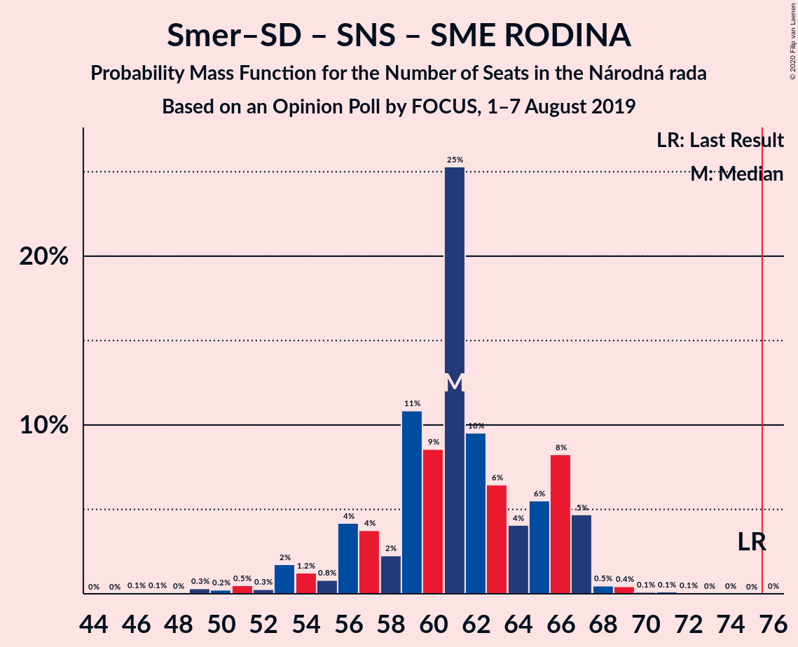

| Number of Seats | Probability | Accumulated | Special Marks |
|:---------------:|:-----------:|:-----------:|:-------------:|
| 46 | 0.1% | 100% |  |
| 47 | 0.1% | 99.9% |  |
| 48 | 0% | 99.9% |  |
| 49 | 0.3% | 99.8% |  |
| 50 | 0.2% | 99.5% |  |
| 51 | 0.5% | 99.3% |  |
| 52 | 0.3% | 98.8% |  |
| 53 | 2% | 98.5% |  |
| 54 | 1.2% | 97% |  |
| 55 | 0.8% | 96% |  |
| 56 | 4% | 95% |  |
| 57 | 4% | 91% |  |
| 58 | 2% | 87% |  |
| 59 | 11% | 85% |  |
| 60 | 9% | 74% |  |
| 61 | 25% | 65% | Median |
| 62 | 10% | 40% |  |
| 63 | 6% | 30% |  |
| 64 | 4% | 24% |  |
| 65 | 6% | 20% |  |
| 66 | 8% | 14% |  |
| 67 | 5% | 6% |  |
| 68 | 0.5% | 1.3% |  |
| 69 | 0.4% | 0.8% |  |
| 70 | 0.1% | 0.4% |  |
| 71 | 0.1% | 0.3% |  |
| 72 | 0.1% | 0.1% |  |
| 73 | 0% | 0.1% |  |
| 74 | 0% | 0% |  |
| 75 | 0% | 0% | Last Result |

### Progresívne Slovensko–SPOLU–Občianska Demokracia – Kresťanskodemokratické hnutie – Sloboda a Solidarita – Za ľudí

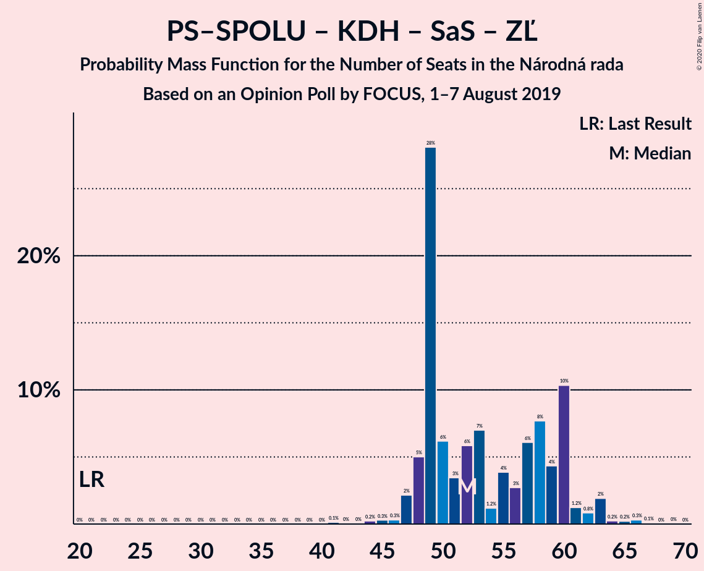

| Number of Seats | Probability | Accumulated | Special Marks |
|:---------------:|:-----------:|:-----------:|:-------------:|
| 21 | 0% | 100% | Last Result |
| 22 | 0% | 100% |  |
| 23 | 0% | 100% |  |
| 24 | 0% | 100% |  |
| 25 | 0% | 100% |  |
| 26 | 0% | 100% |  |
| 27 | 0% | 100% |  |
| 28 | 0% | 100% |  |
| 29 | 0% | 100% |  |
| 30 | 0% | 100% |  |
| 31 | 0% | 100% |  |
| 32 | 0% | 100% |  |
| 33 | 0% | 100% |  |
| 34 | 0% | 100% |  |
| 35 | 0% | 100% |  |
| 36 | 0% | 100% |  |
| 37 | 0% | 100% |  |
| 38 | 0% | 100% |  |
| 39 | 0% | 100% |  |
| 40 | 0% | 100% |  |
| 41 | 0.1% | 100% |  |
| 42 | 0% | 99.8% |  |
| 43 | 0% | 99.8% |  |
| 44 | 0.2% | 99.8% |  |
| 45 | 0.3% | 99.5% |  |
| 46 | 0.3% | 99.2% |  |
| 47 | 2% | 98.9% |  |
| 48 | 5% | 97% |  |
| 49 | 28% | 92% | Median |
| 50 | 6% | 64% |  |
| 51 | 3% | 57% |  |
| 52 | 6% | 54% |  |
| 53 | 7% | 48% |  |
| 54 | 1.2% | 41% |  |
| 55 | 4% | 40% |  |
| 56 | 3% | 36% |  |
| 57 | 6% | 33% |  |
| 58 | 8% | 27% |  |
| 59 | 4% | 20% |  |
| 60 | 10% | 15% |  |
| 61 | 1.2% | 5% |  |
| 62 | 0.8% | 4% |  |
| 63 | 2% | 3% |  |
| 64 | 0.2% | 0.9% |  |
| 65 | 0.2% | 0.7% |  |
| 66 | 0.3% | 0.5% |  |
| 67 | 0.1% | 0.1% |  |
| 68 | 0% | 0.1% |  |
| 69 | 0% | 0.1% |  |
| 70 | 0% | 0% |  |

### SMER–sociálna demokracia – Slovenská národná strana – MOST–HÍD

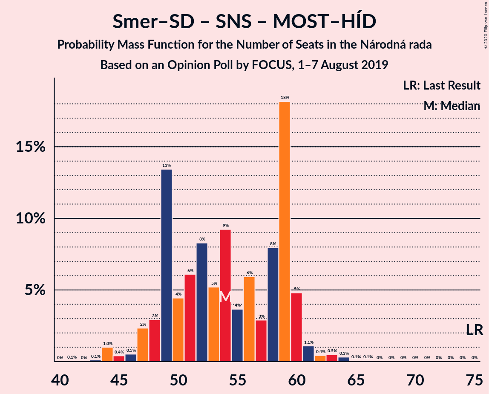

| Number of Seats | Probability | Accumulated | Special Marks |
|:---------------:|:-----------:|:-----------:|:-------------:|
| 41 | 0.1% | 100% |  |
| 42 | 0% | 99.9% |  |
| 43 | 0.1% | 99.9% |  |
| 44 | 1.0% | 99.8% |  |
| 45 | 0.4% | 98.8% |  |
| 46 | 0.5% | 98% |  |
| 47 | 2% | 98% |  |
| 48 | 3% | 96% |  |
| 49 | 13% | 93% |  |
| 50 | 4% | 79% | Median |
| 51 | 6% | 75% |  |
| 52 | 8% | 69% |  |
| 53 | 5% | 60% |  |
| 54 | 9% | 55% |  |
| 55 | 4% | 46% |  |
| 56 | 6% | 42% |  |
| 57 | 3% | 36% |  |
| 58 | 8% | 33% |  |
| 59 | 18% | 25% |  |
| 60 | 5% | 7% |  |
| 61 | 1.1% | 2% |  |
| 62 | 0.4% | 1.4% |  |
| 63 | 0.5% | 1.0% |  |
| 64 | 0.3% | 0.5% |  |
| 65 | 0.1% | 0.2% |  |
| 66 | 0.1% | 0.1% |  |
| 67 | 0% | 0% |  |
| 68 | 0% | 0% |  |
| 69 | 0% | 0% |  |
| 70 | 0% | 0% |  |
| 71 | 0% | 0% |  |
| 72 | 0% | 0% |  |
| 73 | 0% | 0% |  |
| 74 | 0% | 0% |  |
| 75 | 0% | 0% | Last Result |

### Progresívne Slovensko–SPOLU–Občianska Demokracia – Sloboda a Solidarita – OBYČAJNÍ ĽUDIA a nezávislé osobnosti – Za ľudí

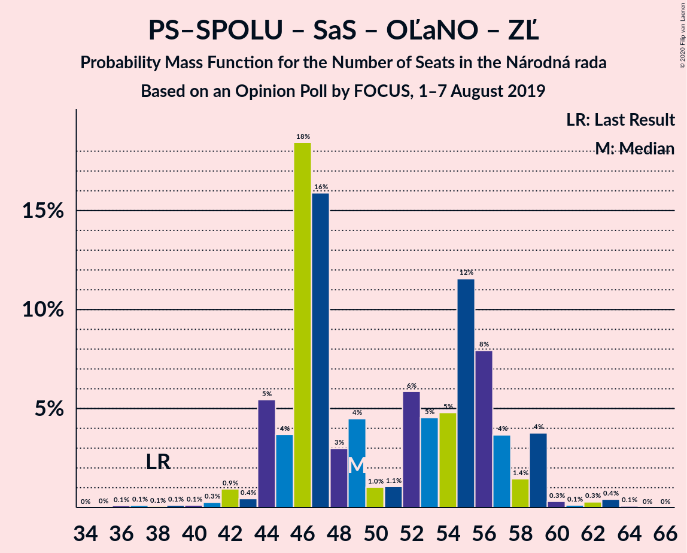

| Number of Seats | Probability | Accumulated | Special Marks |
|:---------------:|:-----------:|:-----------:|:-------------:|
| 36 | 0.1% | 100% |  |
| 37 | 0.1% | 99.9% |  |
| 38 | 0.1% | 99.8% | Last Result |
| 39 | 0.1% | 99.7% |  |
| 40 | 0.1% | 99.6% |  |
| 41 | 0.3% | 99.5% |  |
| 42 | 0.9% | 99.2% |  |
| 43 | 0.4% | 98% |  |
| 44 | 5% | 98% |  |
| 45 | 4% | 92% |  |
| 46 | 18% | 89% | Median |
| 47 | 16% | 70% |  |
| 48 | 3% | 54% |  |
| 49 | 4% | 51% |  |
| 50 | 1.0% | 47% |  |
| 51 | 1.1% | 46% |  |
| 52 | 6% | 45% |  |
| 53 | 5% | 39% |  |
| 54 | 5% | 34% |  |
| 55 | 12% | 30% |  |
| 56 | 8% | 18% |  |
| 57 | 4% | 10% |  |
| 58 | 1.4% | 6% |  |
| 59 | 4% | 5% |  |
| 60 | 0.3% | 1.2% |  |
| 61 | 0.1% | 0.9% |  |
| 62 | 0.3% | 0.8% |  |
| 63 | 0.4% | 0.5% |  |
| 64 | 0.1% | 0.1% |  |
| 65 | 0% | 0% |  |

### SMER–sociálna demokracia – Slovenská národná strana

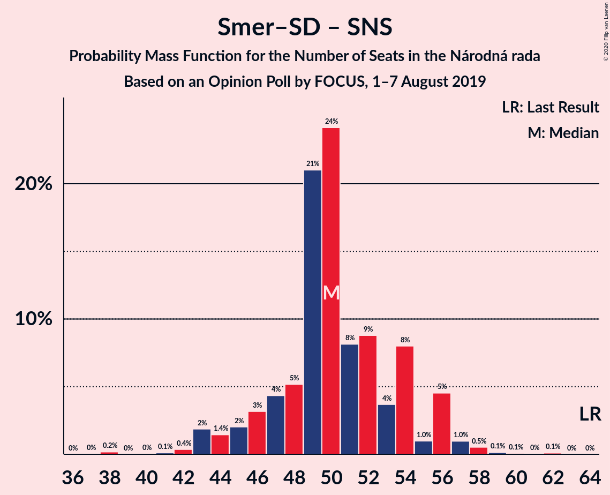

| Number of Seats | Probability | Accumulated | Special Marks |
|:---------------:|:-----------:|:-----------:|:-------------:|
| 37 | 0% | 100% |  |
| 38 | 0.2% | 99.9% |  |
| 39 | 0% | 99.8% |  |
| 40 | 0% | 99.8% |  |
| 41 | 0.1% | 99.7% |  |
| 42 | 0.4% | 99.6% |  |
| 43 | 2% | 99.3% |  |
| 44 | 1.4% | 97% |  |
| 45 | 2% | 96% |  |
| 46 | 3% | 94% |  |
| 47 | 4% | 91% |  |
| 48 | 5% | 86% |  |
| 49 | 21% | 81% |  |
| 50 | 24% | 60% | Median |
| 51 | 8% | 36% |  |
| 52 | 9% | 28% |  |
| 53 | 4% | 19% |  |
| 54 | 8% | 15% |  |
| 55 | 1.0% | 7% |  |
| 56 | 5% | 6% |  |
| 57 | 1.0% | 2% |  |
| 58 | 0.5% | 0.9% |  |
| 59 | 0.1% | 0.4% |  |
| 60 | 0.1% | 0.2% |  |
| 61 | 0% | 0.1% |  |
| 62 | 0.1% | 0.1% |  |
| 63 | 0% | 0% |  |
| 64 | 0% | 0% | Last Result |

### SMER–sociálna demokracia – SME RODINA

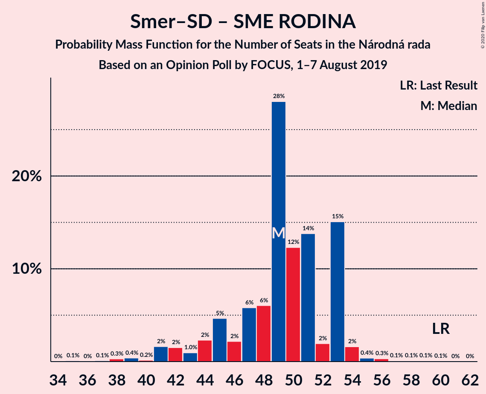

| Number of Seats | Probability | Accumulated | Special Marks |
|:---------------:|:-----------:|:-----------:|:-------------:|
| 35 | 0.1% | 100% |  |
| 36 | 0% | 99.9% |  |
| 37 | 0.1% | 99.9% |  |
| 38 | 0.3% | 99.8% |  |
| 39 | 0.4% | 99.5% |  |
| 40 | 0.2% | 99.1% |  |
| 41 | 2% | 98.9% |  |
| 42 | 2% | 97% |  |
| 43 | 1.0% | 96% |  |
| 44 | 2% | 95% |  |
| 45 | 5% | 93% |  |
| 46 | 2% | 88% |  |
| 47 | 6% | 86% |  |
| 48 | 6% | 80% |  |
| 49 | 28% | 74% | Median |
| 50 | 12% | 46% |  |
| 51 | 14% | 33% |  |
| 52 | 2% | 20% |  |
| 53 | 15% | 18% |  |
| 54 | 2% | 3% |  |
| 55 | 0.4% | 1.1% |  |
| 56 | 0.3% | 0.7% |  |
| 57 | 0.1% | 0.4% |  |
| 58 | 0.1% | 0.3% |  |
| 59 | 0.1% | 0.2% |  |
| 60 | 0.1% | 0.1% | Last Result |
| 61 | 0% | 0% |  |

### Progresívne Slovensko–SPOLU–Občianska Demokracia – Sloboda a Solidarita – Za ľudí

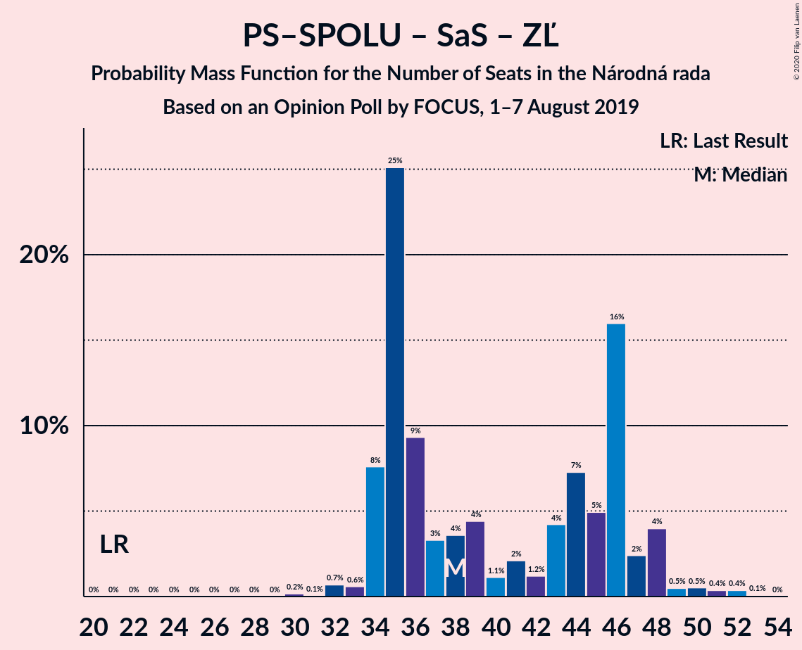

| Number of Seats | Probability | Accumulated | Special Marks |
|:---------------:|:-----------:|:-----------:|:-------------:|
| 21 | 0% | 100% | Last Result |
| 22 | 0% | 100% |  |
| 23 | 0% | 100% |  |
| 24 | 0% | 100% |  |
| 25 | 0% | 100% |  |
| 26 | 0% | 100% |  |
| 27 | 0% | 100% |  |
| 28 | 0% | 100% |  |
| 29 | 0% | 100% |  |
| 30 | 0.2% | 100% |  |
| 31 | 0.1% | 99.8% |  |
| 32 | 0.7% | 99.7% |  |
| 33 | 0.6% | 99.0% |  |
| 34 | 8% | 98% |  |
| 35 | 25% | 91% | Median |
| 36 | 9% | 66% |  |
| 37 | 3% | 56% |  |
| 38 | 4% | 53% |  |
| 39 | 4% | 50% |  |
| 40 | 1.1% | 45% |  |
| 41 | 2% | 44% |  |
| 42 | 1.2% | 42% |  |
| 43 | 4% | 41% |  |
| 44 | 7% | 36% |  |
| 45 | 5% | 29% |  |
| 46 | 16% | 24% |  |
| 47 | 2% | 8% |  |
| 48 | 4% | 6% |  |
| 49 | 0.5% | 2% |  |
| 50 | 0.5% | 1.4% |  |
| 51 | 0.4% | 0.9% |  |
| 52 | 0.4% | 0.5% |  |
| 53 | 0.1% | 0.1% |  |
| 54 | 0% | 0% |  |

### SMER–sociálna demokracia

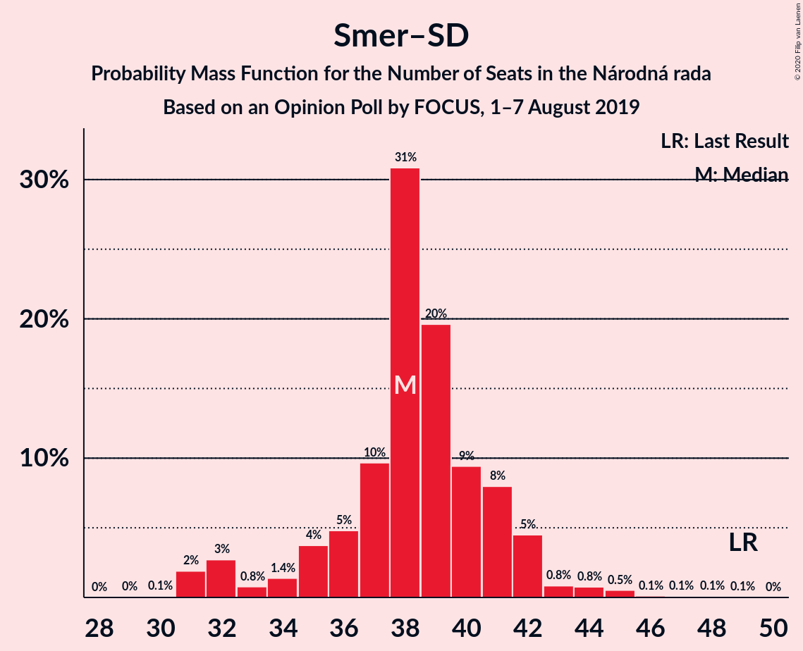

| Number of Seats | Probability | Accumulated | Special Marks |
|:---------------:|:-----------:|:-----------:|:-------------:|
| 30 | 0.1% | 100% |  |
| 31 | 2% | 99.9% |  |
| 32 | 3% | 98% |  |
| 33 | 0.8% | 95% |  |
| 34 | 1.4% | 94% |  |
| 35 | 4% | 93% |  |
| 36 | 5% | 89% |  |
| 37 | 10% | 85% |  |
| 38 | 31% | 75% | Median |
| 39 | 20% | 44% |  |
| 40 | 9% | 24% |  |
| 41 | 8% | 15% |  |
| 42 | 5% | 7% |  |
| 43 | 0.8% | 2% |  |
| 44 | 0.8% | 2% |  |
| 45 | 0.5% | 0.9% |  |
| 46 | 0.1% | 0.4% |  |
| 47 | 0.1% | 0.2% |  |
| 48 | 0.1% | 0.2% |  |
| 49 | 0.1% | 0.1% | Last Result |
| 50 | 0% | 0% |  |

## Technical Information

### Opinion Poll

+ **Polling firm:** FOCUS
+ **Commissioner(s):** —
+ **Fieldwork period:** 1–7 August 2019

### Calculations

+ **Sample size:** 1020
+ **Simulations done:** 1,048,576
+ **Error estimate:** 2.48%

