# Opinion Poll by AKO, 26–29 August 2019

<a href="#voting-intentions">Voting Intentions</a> | <a href="#seats">Seats</a> | <a href="#coalitions">Coalitions</a> | <a href="#technical-information">Technical Information</a>

## Voting Intentions

### Confidence Intervals

| Party | Last Result | Poll Result | 80% Confidence Interval | 90% Confidence Interval | 95% Confidence Interval | 99% Confidence Interval |
|:-----:|:-----------:|:-----------:|:-----------------------:|:-----------------------:|:-----------------------:|:-----------------------:|
| SMER–sociálna demokracia | 28.3% | 18.2% | 16.7–19.8% |16.3–20.3% |15.9–20.7% |15.2–21.5% |
| Progresívne Slovensko–SPOLU–Občianska Demokracia | 0.0% | 14.5% | 13.2–16.0% |12.8–16.4% |12.5–16.8% |11.8–17.6% |
| Kotleba–Ľudová strana Naše Slovensko | 8.0% | 10.0% | 8.9–11.3% |8.6–11.7% |8.3–12.0% |7.8–12.7% |
| Za ľudí | 0.0% | 8.5% | 7.5–9.7% |7.2–10.1% |6.9–10.4% |6.4–11.0% |
| Sloboda a Solidarita | 12.1% | 8.1% | 7.1–9.3% |6.8–9.7% |6.6–10.0% |6.1–10.6% |
| OBYČAJNÍ ĽUDIA a nezávislé osobnosti | 11.0% | 7.1% | 6.2–8.3% |5.9–8.6% |5.7–8.9% |5.2–9.4% |
| SME RODINA | 6.6% | 7.1% | 6.2–8.3% |5.9–8.6% |5.7–8.9% |5.2–9.4% |
| Slovenská národná strana | 8.6% | 6.3% | 5.4–7.4% |5.2–7.7% |5.0–8.0% |4.6–8.6% |
| Kresťanskodemokratické hnutie | 4.9% | 5.8% | 5.0–6.9% |4.7–7.2% |4.5–7.4% |4.1–8.0% |
| MOST–HÍD | 6.5% | 3.3% | 2.7–4.1% |2.5–4.4% |2.4–4.6% |2.1–5.0% |
| Strana maďarskej koalície–Magyar Koalíció Pártja | 4.0% | 3.3% | 2.7–4.1% |2.5–4.4% |2.4–4.6% |2.1–5.0% |

*Note:* The poll result column reflects the actual value used in the calculations. Published results may vary slightly, and in addition be rounded to fewer digits.

## Seats

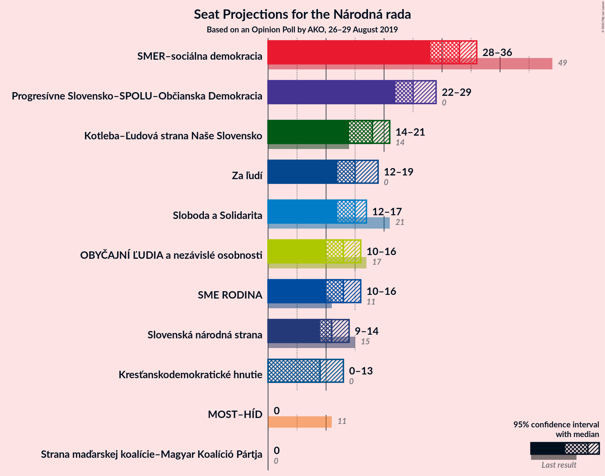

### Confidence Intervals

| Party | Last Result | Median | 80% Confidence Interval | 90% Confidence Interval | 95% Confidence Interval | 99% Confidence Interval |
|:-----:|:-----------:|:------:|:-----------------------:|:-----------------------:|:-----------------------:|:-----------------------:|
| <a href="#smer–sociálna-demokracia">SMER–sociálna demokracia</a> | 49 | 33 | 29–35 |28–36 |28–36 |27–39 |
| <a href="#progresívne-slovensko–spolu–občianska-demokracia">Progresívne Slovensko–SPOLU–Občianska Demokracia</a> | 0 | 25 | 23–27 |22–28 |22–29 |21–31 |
| <a href="#kotleba–ľudová-strana-naše-slovensko">Kotleba–Ľudová strana Naše Slovensko</a> | 14 | 18 | 16–19 |15–21 |14–21 |14–22 |
| <a href="#za-ľudí">Za ľudí</a> | 0 | 15 | 13–18 |13–18 |12–19 |11–20 |
| <a href="#sloboda-a-solidarita">Sloboda a Solidarita</a> | 21 | 15 | 13–16 |12–17 |12–17 |10–19 |
| <a href="#obyčajní-ľudia-a-nezávislé-osobnosti">OBYČAJNÍ ĽUDIA a nezávislé osobnosti</a> | 17 | 13 | 10–15 |10–16 |10–16 |9–17 |
| <a href="#sme-rodina">SME RODINA</a> | 11 | 13 | 11–15 |10–15 |10–16 |9–17 |
| <a href="#slovenská-národná-strana">Slovenská národná strana</a> | 15 | 11 | 10–13 |10–13 |9–14 |0–15 |
| <a href="#kresťanskodemokratické-hnutie">Kresťanskodemokratické hnutie</a> | 0 | 9 | 9–12 |0–12 |0–13 |0–14 |
| <a href="#most–híd">MOST–HÍD</a> | 11 | 0 | 0 |0 |0 |0 |
| <a href="#strana-maďarskej-koalície–magyar-koalíció-pártja">Strana maďarskej koalície–Magyar Koalíció Pártja</a> | 0 | 0 | 0 |0 |0 |0 |

### SMER–sociálna demokracia

*For a full overview of the results for this party, see the [SMER–sociálna demokracia](party-smer–sociálnademokracia.html) page.*

| Number of Seats | Probability | Accumulated | Special Marks |
|:---------------:|:-----------:|:-----------:|:-------------:|
| 25 | 0% | 100% |  |
| 26 | 0.4% | 99.9% |  |
| 27 | 2% | 99.5% |  |
| 28 | 5% | 98% |  |
| 29 | 12% | 93% |  |
| 30 | 7% | 80% |  |
| 31 | 15% | 74% |  |
| 32 | 8% | 59% |  |
| 33 | 12% | 51% | Median |
| 34 | 26% | 39% |  |
| 35 | 6% | 13% |  |
| 36 | 5% | 7% |  |
| 37 | 0.5% | 2% |  |
| 38 | 0.5% | 2% |  |
| 39 | 1.1% | 1.2% |  |
| 40 | 0.1% | 0.1% |  |
| 41 | 0% | 0.1% |  |
| 42 | 0% | 0% |  |
| 43 | 0% | 0% |  |
| 44 | 0% | 0% |  |
| 45 | 0% | 0% |  |
| 46 | 0% | 0% |  |
| 47 | 0% | 0% |  |
| 48 | 0% | 0% |  |
| 49 | 0% | 0% | Last Result |

### Progresívne Slovensko–SPOLU–Občianska Demokracia

*For a full overview of the results for this party, see the [Progresívne Slovensko–SPOLU–Občianska Demokracia](party-progresívneslovensko–spolu–občianskademokracia.html) page.*

| Number of Seats | Probability | Accumulated | Special Marks |
|:---------------:|:-----------:|:-----------:|:-------------:|
| 0 | 0% | 100% | Last Result |
| 1 | 0% | 100% |  |
| 2 | 0% | 100% |  |
| 3 | 0% | 100% |  |
| 4 | 0% | 100% |  |
| 5 | 0% | 100% |  |
| 6 | 0% | 100% |  |
| 7 | 0% | 100% |  |
| 8 | 0% | 100% |  |
| 9 | 0% | 100% |  |
| 10 | 0% | 100% |  |
| 11 | 0% | 100% |  |
| 12 | 0% | 100% |  |
| 13 | 0% | 100% |  |
| 14 | 0% | 100% |  |
| 15 | 0% | 100% |  |
| 16 | 0% | 100% |  |
| 17 | 0% | 100% |  |
| 18 | 0% | 100% |  |
| 19 | 0.1% | 100% |  |
| 20 | 0.2% | 99.9% |  |
| 21 | 1.1% | 99.7% |  |
| 22 | 4% | 98.6% |  |
| 23 | 25% | 94% |  |
| 24 | 17% | 69% |  |
| 25 | 20% | 52% | Median |
| 26 | 18% | 32% |  |
| 27 | 7% | 14% |  |
| 28 | 3% | 7% |  |
| 29 | 3% | 4% |  |
| 30 | 0.7% | 2% |  |
| 31 | 0.9% | 1.1% |  |
| 32 | 0.1% | 0.2% |  |
| 33 | 0.1% | 0.1% |  |
| 34 | 0.1% | 0.1% |  |
| 35 | 0% | 0% |  |

### Kotleba–Ľudová strana Naše Slovensko

*For a full overview of the results for this party, see the [Kotleba–Ľudová strana Naše Slovensko](party-kotleba–ľudovástrananašeslovensko.html) page.*

| Number of Seats | Probability | Accumulated | Special Marks |
|:---------------:|:-----------:|:-----------:|:-------------:|
| 13 | 0.3% | 100% |  |
| 14 | 4% | 99.7% | Last Result |
| 15 | 4% | 96% |  |
| 16 | 13% | 92% |  |
| 17 | 22% | 79% |  |
| 18 | 35% | 57% | Median |
| 19 | 14% | 22% |  |
| 20 | 4% | 9% |  |
| 21 | 3% | 5% |  |
| 22 | 2% | 2% |  |
| 23 | 0.3% | 0.4% |  |
| 24 | 0.1% | 0.1% |  |
| 25 | 0% | 0% |  |

### Za ľudí

*For a full overview of the results for this party, see the [Za ľudí](party-zaľudí.html) page.*

| Number of Seats | Probability | Accumulated | Special Marks |
|:---------------:|:-----------:|:-----------:|:-------------:|
| 0 | 0% | 100% | Last Result |
| 1 | 0% | 100% |  |
| 2 | 0% | 100% |  |
| 3 | 0% | 100% |  |
| 4 | 0% | 100% |  |
| 5 | 0% | 100% |  |
| 6 | 0% | 100% |  |
| 7 | 0% | 100% |  |
| 8 | 0% | 100% |  |
| 9 | 0% | 100% |  |
| 10 | 0.1% | 100% |  |
| 11 | 1.0% | 99.9% |  |
| 12 | 3% | 99.0% |  |
| 13 | 33% | 96% |  |
| 14 | 13% | 64% |  |
| 15 | 11% | 50% | Median |
| 16 | 21% | 39% |  |
| 17 | 7% | 18% |  |
| 18 | 8% | 11% |  |
| 19 | 3% | 3% |  |
| 20 | 0.4% | 0.6% |  |
| 21 | 0.1% | 0.1% |  |
| 22 | 0% | 0% |  |

### Sloboda a Solidarita

*For a full overview of the results for this party, see the [Sloboda a Solidarita](party-slobodaasolidarita.html) page.*

| Number of Seats | Probability | Accumulated | Special Marks |
|:---------------:|:-----------:|:-----------:|:-------------:|
| 10 | 0.6% | 100% |  |
| 11 | 1.1% | 99.4% |  |
| 12 | 5% | 98% |  |
| 13 | 16% | 93% |  |
| 14 | 19% | 77% |  |
| 15 | 40% | 58% | Median |
| 16 | 12% | 19% |  |
| 17 | 5% | 7% |  |
| 18 | 1.4% | 2% |  |
| 19 | 0.5% | 0.6% |  |
| 20 | 0.1% | 0.1% |  |
| 21 | 0% | 0% | Last Result |

### OBYČAJNÍ ĽUDIA a nezávislé osobnosti

*For a full overview of the results for this party, see the [OBYČAJNÍ ĽUDIA a nezávislé osobnosti](party-obyčajníľudiaanezávisléosobnosti.html) page.*

| Number of Seats | Probability | Accumulated | Special Marks |
|:---------------:|:-----------:|:-----------:|:-------------:|
| 0 | 0.1% | 100% |  |
| 1 | 0% | 99.9% |  |
| 2 | 0% | 99.9% |  |
| 3 | 0% | 99.9% |  |
| 4 | 0% | 99.9% |  |
| 5 | 0% | 99.9% |  |
| 6 | 0% | 99.9% |  |
| 7 | 0% | 99.9% |  |
| 8 | 0% | 99.9% |  |
| 9 | 0.4% | 99.9% |  |
| 10 | 11% | 99.5% |  |
| 11 | 8% | 88% |  |
| 12 | 14% | 80% |  |
| 13 | 21% | 65% | Median |
| 14 | 34% | 44% |  |
| 15 | 3% | 10% |  |
| 16 | 7% | 7% |  |
| 17 | 0.5% | 0.6% | Last Result |
| 18 | 0.1% | 0.1% |  |
| 19 | 0% | 0% |  |

### SME RODINA

*For a full overview of the results for this party, see the [SME RODINA](party-smerodina.html) page.*

| Number of Seats | Probability | Accumulated | Special Marks |
|:---------------:|:-----------:|:-----------:|:-------------:|
| 0 | 0.2% | 100% |  |
| 1 | 0% | 99.8% |  |
| 2 | 0% | 99.8% |  |
| 3 | 0% | 99.8% |  |
| 4 | 0% | 99.8% |  |
| 5 | 0% | 99.8% |  |
| 6 | 0% | 99.8% |  |
| 7 | 0% | 99.8% |  |
| 8 | 0% | 99.8% |  |
| 9 | 1.4% | 99.8% |  |
| 10 | 5% | 98% |  |
| 11 | 12% | 94% | Last Result |
| 12 | 15% | 82% |  |
| 13 | 41% | 67% | Median |
| 14 | 14% | 25% |  |
| 15 | 8% | 11% |  |
| 16 | 3% | 3% |  |
| 17 | 0.5% | 0.6% |  |
| 18 | 0.1% | 0.1% |  |
| 19 | 0% | 0% |  |

### Slovenská národná strana

*For a full overview of the results for this party, see the [Slovenská národná strana](party-slovenskánárodnástrana.html) page.*

| Number of Seats | Probability | Accumulated | Special Marks |
|:---------------:|:-----------:|:-----------:|:-------------:|
| 0 | 1.5% | 100% |  |
| 1 | 0% | 98.5% |  |
| 2 | 0% | 98.5% |  |
| 3 | 0% | 98.5% |  |
| 4 | 0% | 98.5% |  |
| 5 | 0% | 98.5% |  |
| 6 | 0% | 98.5% |  |
| 7 | 0% | 98.5% |  |
| 8 | 0% | 98.5% |  |
| 9 | 3% | 98.5% |  |
| 10 | 18% | 95% |  |
| 11 | 46% | 77% | Median |
| 12 | 12% | 31% |  |
| 13 | 15% | 19% |  |
| 14 | 2% | 4% |  |
| 15 | 1.0% | 1.3% | Last Result |
| 16 | 0.2% | 0.3% |  |
| 17 | 0% | 0% |  |

### Kresťanskodemokratické hnutie

*For a full overview of the results for this party, see the [Kresťanskodemokratické hnutie](party-kresťanskodemokratickéhnutie.html) page.*

| Number of Seats | Probability | Accumulated | Special Marks |
|:---------------:|:-----------:|:-----------:|:-------------:|
| 0 | 10% | 100% | Last Result |
| 1 | 0% | 90% |  |
| 2 | 0% | 90% |  |
| 3 | 0% | 90% |  |
| 4 | 0% | 90% |  |
| 5 | 0% | 90% |  |
| 6 | 0% | 90% |  |
| 7 | 0% | 90% |  |
| 8 | 0% | 90% |  |
| 9 | 44% | 90% | Median |
| 10 | 14% | 46% |  |
| 11 | 15% | 32% |  |
| 12 | 14% | 17% |  |
| 13 | 2% | 3% |  |
| 14 | 0.8% | 1.0% |  |
| 15 | 0.2% | 0.2% |  |
| 16 | 0% | 0% |  |

### MOST–HÍD

*For a full overview of the results for this party, see the [MOST–HÍD](party-most–híd.html) page.*

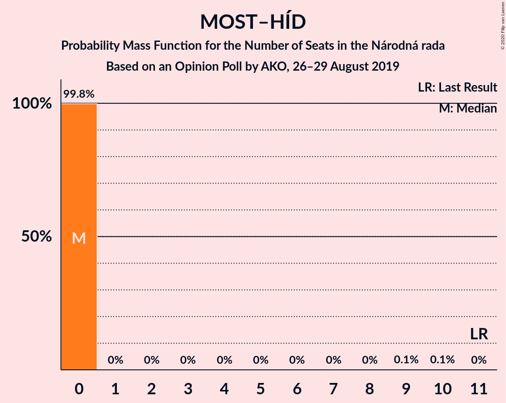

| Number of Seats | Probability | Accumulated | Special Marks |
|:---------------:|:-----------:|:-----------:|:-------------:|
| 0 | 99.8% | 100% | Median |
| 1 | 0% | 0.2% |  |
| 2 | 0% | 0.2% |  |
| 3 | 0% | 0.2% |  |
| 4 | 0% | 0.2% |  |
| 5 | 0% | 0.2% |  |
| 6 | 0% | 0.2% |  |
| 7 | 0% | 0.2% |  |
| 8 | 0% | 0.2% |  |
| 9 | 0.1% | 0.2% |  |
| 10 | 0.1% | 0.1% |  |
| 11 | 0% | 0% | Last Result |

### Strana maďarskej koalície–Magyar Koalíció Pártja

*For a full overview of the results for this party, see the [Strana maďarskej koalície–Magyar Koalíció Pártja](party-stranamaďarskejkoalície–magyarkoalíciópártja.html) page.*

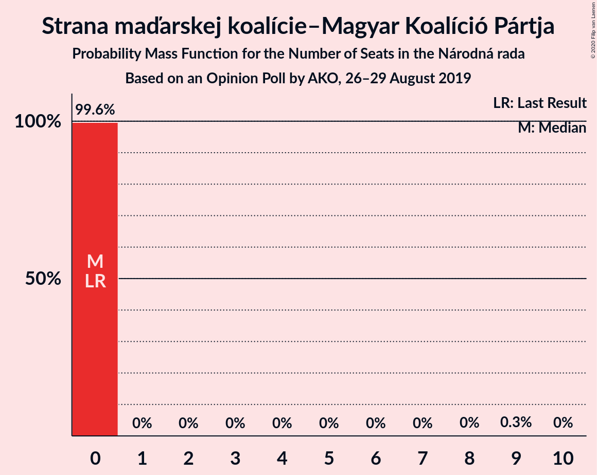

| Number of Seats | Probability | Accumulated | Special Marks |
|:---------------:|:-----------:|:-----------:|:-------------:|
| 0 | 99.6% | 100% | Last Result, Median |
| 1 | 0% | 0.4% |  |
| 2 | 0% | 0.4% |  |
| 3 | 0% | 0.4% |  |
| 4 | 0% | 0.4% |  |
| 5 | 0% | 0.4% |  |
| 6 | 0% | 0.4% |  |
| 7 | 0% | 0.4% |  |
| 8 | 0% | 0.4% |  |
| 9 | 0.3% | 0.3% |  |
| 10 | 0% | 0% |  |

## Coalitions

### Confidence Intervals

| Coalition | Last Result | Median | Majority? | 80% Confidence Interval | 90% Confidence Interval | 95% Confidence Interval | 99% Confidence Interval |
|:---------:|:-----------:|:------:|:---------:|:-----------------------:|:-----------------------:|:-----------------------:|:-----------------------:|
| Progresívne Slovensko–SPOLU–Občianska Demokracia – Za ľudí – Sloboda a Solidarita – OBYČAJNÍ ĽUDIA a nezávislé osobnosti – SME RODINA – Kresťanskodemokratické hnutie – MOST–HÍD – Strana maďarskej koalície–Magyar Koalíció Pártja | 60 | 89 | 100% | 86–93 | 85–94 | 84–95 | 80–98 |
| Progresívne Slovensko–SPOLU–Občianska Demokracia – Za ľudí – Sloboda a Solidarita – OBYČAJNÍ ĽUDIA a nezávislé osobnosti – SME RODINA – Kresťanskodemokratické hnutie – MOST–HÍD | 60 | 89 | 100% | 86–93 | 85–94 | 84–95 | 79–98 |
| Progresívne Slovensko–SPOLU–Občianska Demokracia – Za ľudí – Sloboda a Solidarita – OBYČAJNÍ ĽUDIA a nezávislé osobnosti – SME RODINA – Kresťanskodemokratické hnutie – Strana maďarskej koalície–Magyar Koalíció Pártja | 49 | 89 | 100% | 86–93 | 85–94 | 83–95 | 79–98 |
| Progresívne Slovensko–SPOLU–Občianska Demokracia – Za ľudí – Sloboda a Solidarita – OBYČAJNÍ ĽUDIA a nezávislé osobnosti – SME RODINA – Kresťanskodemokratické hnutie | 49 | 89 | 100% | 86–93 | 85–94 | 83–95 | 79–98 |
| Progresívne Slovensko–SPOLU–Občianska Demokracia – Za ľudí – Sloboda a Solidarita – OBYČAJNÍ ĽUDIA a nezávislé osobnosti – Kresťanskodemokratické hnutie – MOST–HÍD – Strana maďarskej koalície–Magyar Koalíció Pártja | 49 | 76 | 54% | 73–80 | 72–81 | 71–83 | 68–85 |
| Progresívne Slovensko–SPOLU–Občianska Demokracia – Za ľudí – Sloboda a Solidarita – OBYČAJNÍ ĽUDIA a nezávislé osobnosti – Kresťanskodemokratické hnutie – MOST–HÍD | 49 | 76 | 54% | 73–79 | 72–81 | 71–83 | 68–85 |
| Progresívne Slovensko–SPOLU–Občianska Demokracia – Za ľudí – Sloboda a Solidarita – OBYČAJNÍ ĽUDIA a nezávislé osobnosti – Kresťanskodemokratické hnutie – Strana maďarskej koalície–Magyar Koalíció Pártja | 38 | 76 | 54% | 73–79 | 72–81 | 71–83 | 68–85 |
| Progresívne Slovensko–SPOLU–Občianska Demokracia – Za ľudí – Sloboda a Solidarita – OBYČAJNÍ ĽUDIA a nezávislé osobnosti – Kresťanskodemokratické hnutie | 38 | 76 | 53% | 73–79 | 72–81 | 71–83 | 68–85 |
| SMER–sociálna demokracia – Kotleba–Ľudová strana Naše Slovensko – SME RODINA – Slovenská národná strana | 89 | 74 | 34% | 70–77 | 69–78 | 67–79 | 65–82 |
| Progresívne Slovensko–SPOLU–Občianska Demokracia – Za ľudí – Sloboda a Solidarita – OBYČAJNÍ ĽUDIA a nezávislé osobnosti | 38 | 66 | 0.5% | 64–72 | 63–73 | 62–75 | 60–75 |
| Progresívne Slovensko–SPOLU–Občianska Demokracia – Za ľudí – Sloboda a Solidarita – Kresťanskodemokratické hnutie | 21 | 63 | 0% | 60–68 | 58–69 | 58–70 | 55–72 |
| Progresívne Slovensko–SPOLU–Občianska Demokracia – Za ľudí – Sloboda a Solidarita | 21 | 54 | 0% | 51–58 | 51–60 | 50–62 | 47–63 |
| SMER–sociálna demokracia – SME RODINA – Slovenská národná strana | 75 | 57 | 0% | 52–59 | 51–60 | 50–61 | 47–63 |
| SMER–sociálna demokracia – SME RODINA | 60 | 45 | 0% | 41–48 | 40–49 | 39–49 | 38–53 |
| SMER–sociálna demokracia – Slovenská národná strana – MOST–HÍD | 75 | 44 | 0% | 40–46 | 39–47 | 38–48 | 35–51 |
| SMER–sociálna demokracia – Slovenská národná strana | 64 | 44 | 0% | 40–46 | 39–47 | 38–48 | 35–51 |
| SMER–sociálna demokracia | 49 | 33 | 0% | 29–35 | 28–36 | 28–36 | 27–39 |

### Progresívne Slovensko–SPOLU–Občianska Demokracia – Za ľudí – Sloboda a Solidarita – OBYČAJNÍ ĽUDIA a nezávislé osobnosti – SME RODINA – Kresťanskodemokratické hnutie – MOST–HÍD – Strana maďarskej koalície–Magyar Koalíció Pártja

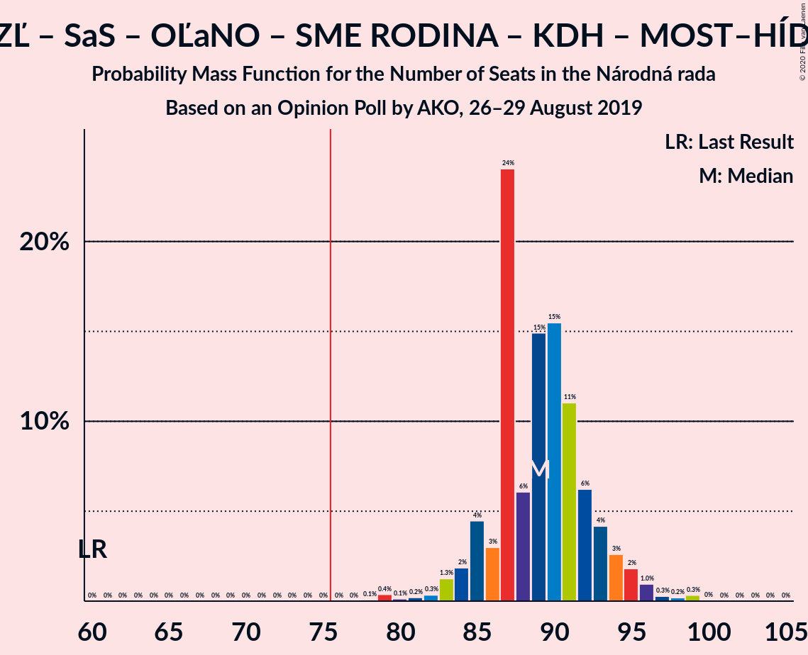

| Number of Seats | Probability | Accumulated | Special Marks |
|:---------------:|:-----------:|:-----------:|:-------------:|
| 60 | 0% | 100% | Last Result |
| 61 | 0% | 100% |  |
| 62 | 0% | 100% |  |
| 63 | 0% | 100% |  |
| 64 | 0% | 100% |  |
| 65 | 0% | 100% |  |
| 66 | 0% | 100% |  |
| 67 | 0% | 100% |  |
| 68 | 0% | 100% |  |
| 69 | 0% | 100% |  |
| 70 | 0% | 100% |  |
| 71 | 0% | 100% |  |
| 72 | 0% | 100% |  |
| 73 | 0% | 100% |  |
| 74 | 0% | 100% |  |
| 75 | 0% | 100% |  |
| 76 | 0% | 100% | Majority |
| 77 | 0% | 100% |  |
| 78 | 0.1% | 100% |  |
| 79 | 0.4% | 99.9% |  |
| 80 | 0.1% | 99.5% |  |
| 81 | 0.2% | 99.4% |  |
| 82 | 0.3% | 99.2% |  |
| 83 | 1.3% | 98.8% |  |
| 84 | 2% | 98% |  |
| 85 | 4% | 96% |  |
| 86 | 3% | 91% |  |
| 87 | 24% | 88% |  |
| 88 | 6% | 64% |  |
| 89 | 15% | 58% |  |
| 90 | 15% | 43% | Median |
| 91 | 11% | 28% |  |
| 92 | 6% | 17% |  |
| 93 | 4% | 10% |  |
| 94 | 3% | 6% |  |
| 95 | 2% | 4% |  |
| 96 | 1.0% | 2% |  |
| 97 | 0.3% | 0.9% |  |
| 98 | 0.2% | 0.6% |  |
| 99 | 0.3% | 0.4% |  |
| 100 | 0% | 0.1% |  |
| 101 | 0% | 0.1% |  |
| 102 | 0% | 0% |  |

### Progresívne Slovensko–SPOLU–Občianska Demokracia – Za ľudí – Sloboda a Solidarita – OBYČAJNÍ ĽUDIA a nezávislé osobnosti – SME RODINA – Kresťanskodemokratické hnutie – MOST–HÍD

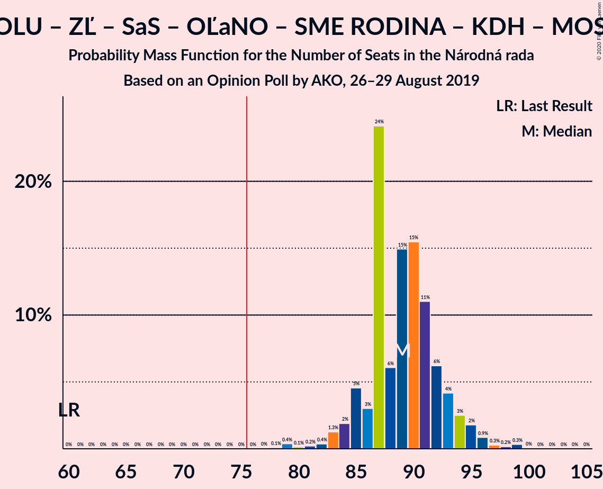

| Number of Seats | Probability | Accumulated | Special Marks |
|:---------------:|:-----------:|:-----------:|:-------------:|
| 60 | 0% | 100% | Last Result |
| 61 | 0% | 100% |  |
| 62 | 0% | 100% |  |
| 63 | 0% | 100% |  |
| 64 | 0% | 100% |  |
| 65 | 0% | 100% |  |
| 66 | 0% | 100% |  |
| 67 | 0% | 100% |  |
| 68 | 0% | 100% |  |
| 69 | 0% | 100% |  |
| 70 | 0% | 100% |  |
| 71 | 0% | 100% |  |
| 72 | 0% | 100% |  |
| 73 | 0% | 100% |  |
| 74 | 0% | 100% |  |
| 75 | 0% | 100% |  |
| 76 | 0% | 100% | Majority |
| 77 | 0% | 100% |  |
| 78 | 0.1% | 100% |  |
| 79 | 0.4% | 99.9% |  |
| 80 | 0.1% | 99.5% |  |
| 81 | 0.2% | 99.3% |  |
| 82 | 0.4% | 99.1% |  |
| 83 | 1.3% | 98.8% |  |
| 84 | 2% | 98% |  |
| 85 | 5% | 96% |  |
| 86 | 3% | 91% |  |
| 87 | 24% | 88% |  |
| 88 | 6% | 64% |  |
| 89 | 15% | 58% |  |
| 90 | 15% | 43% | Median |
| 91 | 11% | 27% |  |
| 92 | 6% | 16% |  |
| 93 | 4% | 10% |  |
| 94 | 3% | 6% |  |
| 95 | 2% | 3% |  |
| 96 | 0.9% | 2% |  |
| 97 | 0.3% | 0.9% |  |
| 98 | 0.2% | 0.6% |  |
| 99 | 0.3% | 0.4% |  |
| 100 | 0% | 0.1% |  |
| 101 | 0% | 0.1% |  |
| 102 | 0% | 0% |  |

### Progresívne Slovensko–SPOLU–Občianska Demokracia – Za ľudí – Sloboda a Solidarita – OBYČAJNÍ ĽUDIA a nezávislé osobnosti – SME RODINA – Kresťanskodemokratické hnutie – Strana maďarskej koalície–Magyar Koalíció Pártja

| Number of Seats | Probability | Accumulated | Special Marks |
|:---------------:|:-----------:|:-----------:|:-------------:|
| 49 | 0% | 100% | Last Result |
| 50 | 0% | 100% |  |
| 51 | 0% | 100% |  |
| 52 | 0% | 100% |  |
| 53 | 0% | 100% |  |
| 54 | 0% | 100% |  |
| 55 | 0% | 100% |  |
| 56 | 0% | 100% |  |
| 57 | 0% | 100% |  |
| 58 | 0% | 100% |  |
| 59 | 0% | 100% |  |
| 60 | 0% | 100% |  |
| 61 | 0% | 100% |  |
| 62 | 0% | 100% |  |
| 63 | 0% | 100% |  |
| 64 | 0% | 100% |  |
| 65 | 0% | 100% |  |
| 66 | 0% | 100% |  |
| 67 | 0% | 100% |  |
| 68 | 0% | 100% |  |
| 69 | 0% | 100% |  |
| 70 | 0% | 100% |  |
| 71 | 0% | 100% |  |
| 72 | 0% | 100% |  |
| 73 | 0% | 100% |  |
| 74 | 0% | 100% |  |
| 75 | 0% | 100% |  |
| 76 | 0% | 100% | Majority |
| 77 | 0% | 100% |  |
| 78 | 0.1% | 100% |  |
| 79 | 0.4% | 99.9% |  |
| 80 | 0.1% | 99.5% |  |
| 81 | 0.2% | 99.3% |  |
| 82 | 0.4% | 99.1% |  |
| 83 | 1.3% | 98.8% |  |
| 84 | 2% | 97% |  |
| 85 | 4% | 96% |  |
| 86 | 3% | 91% |  |
| 87 | 24% | 88% |  |
| 88 | 6% | 64% |  |
| 89 | 15% | 58% |  |
| 90 | 16% | 43% | Median |
| 91 | 11% | 28% |  |
| 92 | 6% | 17% |  |
| 93 | 4% | 10% |  |
| 94 | 3% | 6% |  |
| 95 | 2% | 4% |  |
| 96 | 0.9% | 2% |  |
| 97 | 0.3% | 0.8% |  |
| 98 | 0.2% | 0.6% |  |
| 99 | 0.3% | 0.4% |  |
| 100 | 0% | 0.1% |  |
| 101 | 0% | 0.1% |  |
| 102 | 0% | 0% |  |

### Progresívne Slovensko–SPOLU–Občianska Demokracia – Za ľudí – Sloboda a Solidarita – OBYČAJNÍ ĽUDIA a nezávislé osobnosti – SME RODINA – Kresťanskodemokratické hnutie

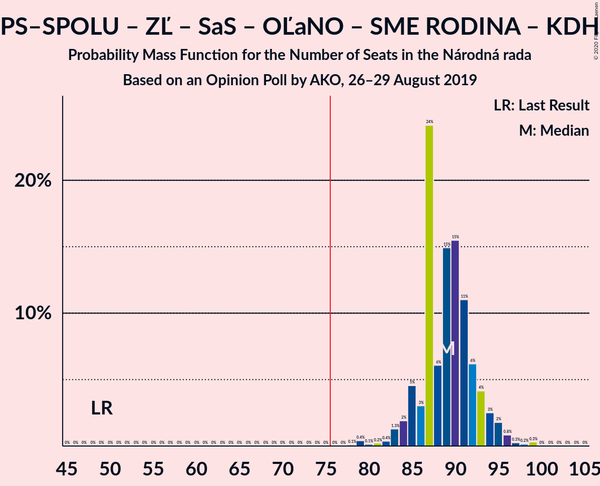

| Number of Seats | Probability | Accumulated | Special Marks |
|:---------------:|:-----------:|:-----------:|:-------------:|
| 49 | 0% | 100% | Last Result |
| 50 | 0% | 100% |  |
| 51 | 0% | 100% |  |
| 52 | 0% | 100% |  |
| 53 | 0% | 100% |  |
| 54 | 0% | 100% |  |
| 55 | 0% | 100% |  |
| 56 | 0% | 100% |  |
| 57 | 0% | 100% |  |
| 58 | 0% | 100% |  |
| 59 | 0% | 100% |  |
| 60 | 0% | 100% |  |
| 61 | 0% | 100% |  |
| 62 | 0% | 100% |  |
| 63 | 0% | 100% |  |
| 64 | 0% | 100% |  |
| 65 | 0% | 100% |  |
| 66 | 0% | 100% |  |
| 67 | 0% | 100% |  |
| 68 | 0% | 100% |  |
| 69 | 0% | 100% |  |
| 70 | 0% | 100% |  |
| 71 | 0% | 100% |  |
| 72 | 0% | 100% |  |
| 73 | 0% | 100% |  |
| 74 | 0% | 100% |  |
| 75 | 0% | 100% |  |
| 76 | 0% | 100% | Majority |
| 77 | 0% | 100% |  |
| 78 | 0.1% | 100% |  |
| 79 | 0.4% | 99.9% |  |
| 80 | 0.1% | 99.5% |  |
| 81 | 0.2% | 99.3% |  |
| 82 | 0.4% | 99.1% |  |
| 83 | 1.3% | 98.7% |  |
| 84 | 2% | 97% |  |
| 85 | 5% | 96% |  |
| 86 | 3% | 91% |  |
| 87 | 24% | 88% |  |
| 88 | 6% | 64% |  |
| 89 | 15% | 58% |  |
| 90 | 15% | 43% | Median |
| 91 | 11% | 27% |  |
| 92 | 6% | 16% |  |
| 93 | 4% | 10% |  |
| 94 | 3% | 6% |  |
| 95 | 2% | 3% |  |
| 96 | 0.8% | 2% |  |
| 97 | 0.3% | 0.8% |  |
| 98 | 0.2% | 0.5% |  |
| 99 | 0.3% | 0.4% |  |
| 100 | 0% | 0.1% |  |
| 101 | 0% | 0% |  |

### Progresívne Slovensko–SPOLU–Občianska Demokracia – Za ľudí – Sloboda a Solidarita – OBYČAJNÍ ĽUDIA a nezávislé osobnosti – Kresťanskodemokratické hnutie – MOST–HÍD – Strana maďarskej koalície–Magyar Koalíció Pártja

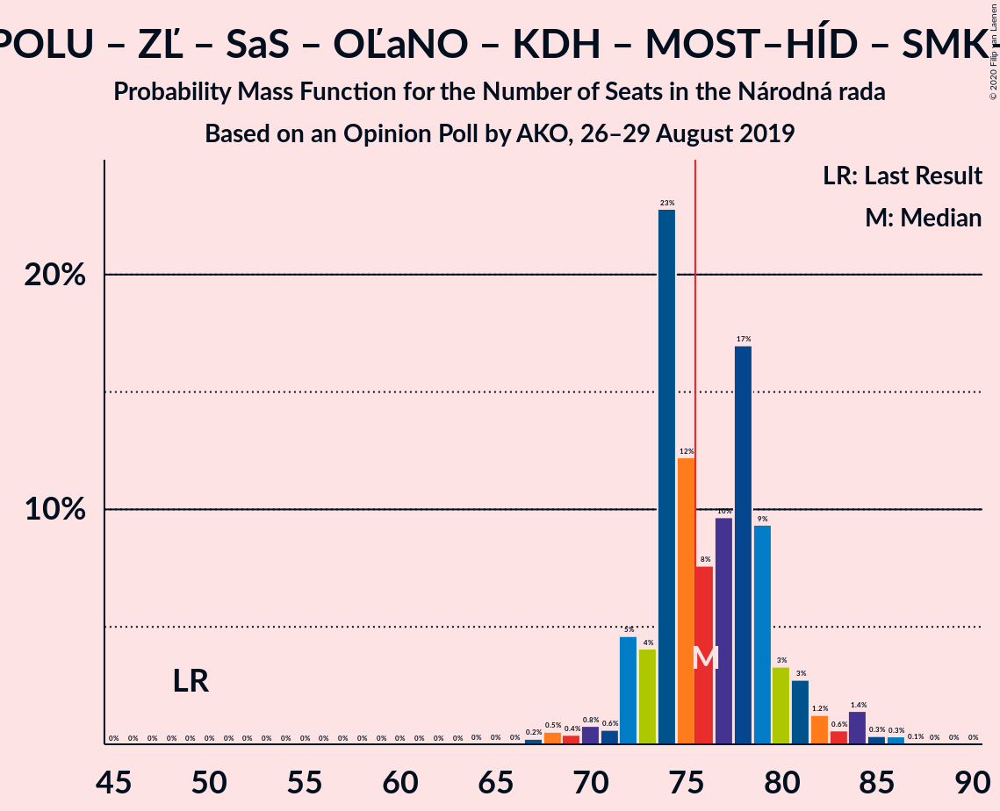

| Number of Seats | Probability | Accumulated | Special Marks |
|:---------------:|:-----------:|:-----------:|:-------------:|
| 49 | 0% | 100% | Last Result |
| 50 | 0% | 100% |  |
| 51 | 0% | 100% |  |
| 52 | 0% | 100% |  |
| 53 | 0% | 100% |  |
| 54 | 0% | 100% |  |
| 55 | 0% | 100% |  |
| 56 | 0% | 100% |  |
| 57 | 0% | 100% |  |
| 58 | 0% | 100% |  |
| 59 | 0% | 100% |  |
| 60 | 0% | 100% |  |
| 61 | 0% | 100% |  |
| 62 | 0% | 100% |  |
| 63 | 0% | 100% |  |
| 64 | 0% | 100% |  |
| 65 | 0% | 100% |  |
| 66 | 0% | 100% |  |
| 67 | 0.2% | 100% |  |
| 68 | 0.5% | 99.7% |  |
| 69 | 0.4% | 99.2% |  |
| 70 | 0.8% | 98.8% |  |
| 71 | 0.6% | 98% |  |
| 72 | 5% | 97% |  |
| 73 | 4% | 93% |  |
| 74 | 23% | 89% |  |
| 75 | 12% | 66% |  |
| 76 | 8% | 54% | Majority |
| 77 | 10% | 46% | Median |
| 78 | 17% | 36% |  |
| 79 | 9% | 19% |  |
| 80 | 3% | 10% |  |
| 81 | 3% | 7% |  |
| 82 | 1.2% | 4% |  |
| 83 | 0.6% | 3% |  |
| 84 | 1.4% | 2% |  |
| 85 | 0.3% | 0.8% |  |
| 86 | 0.3% | 0.5% |  |
| 87 | 0.1% | 0.1% |  |
| 88 | 0% | 0.1% |  |
| 89 | 0% | 0.1% |  |
| 90 | 0% | 0% |  |

### Progresívne Slovensko–SPOLU–Občianska Demokracia – Za ľudí – Sloboda a Solidarita – OBYČAJNÍ ĽUDIA a nezávislé osobnosti – Kresťanskodemokratické hnutie – MOST–HÍD

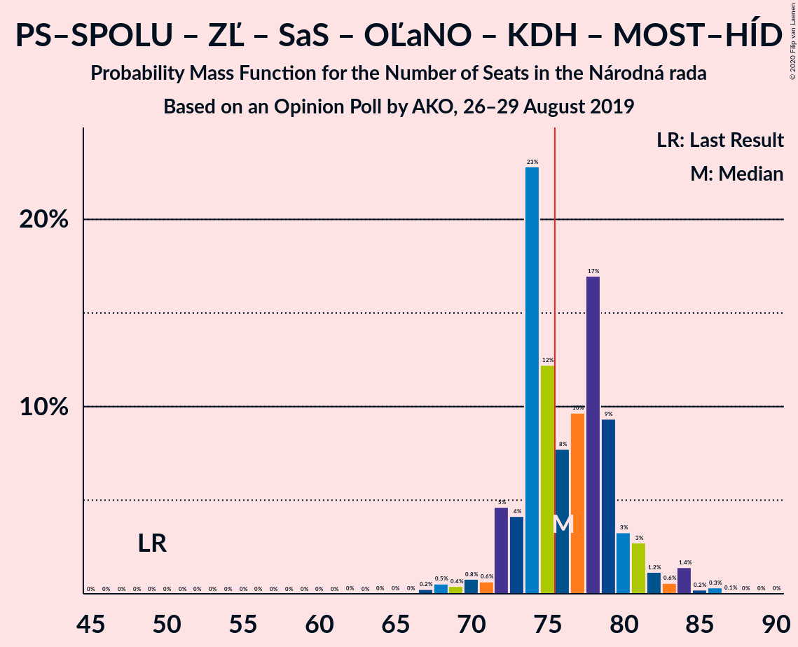

| Number of Seats | Probability | Accumulated | Special Marks |
|:---------------:|:-----------:|:-----------:|:-------------:|
| 49 | 0% | 100% | Last Result |
| 50 | 0% | 100% |  |
| 51 | 0% | 100% |  |
| 52 | 0% | 100% |  |
| 53 | 0% | 100% |  |
| 54 | 0% | 100% |  |
| 55 | 0% | 100% |  |
| 56 | 0% | 100% |  |
| 57 | 0% | 100% |  |
| 58 | 0% | 100% |  |
| 59 | 0% | 100% |  |
| 60 | 0% | 100% |  |
| 61 | 0% | 100% |  |
| 62 | 0% | 100% |  |
| 63 | 0% | 100% |  |
| 64 | 0% | 100% |  |
| 65 | 0% | 100% |  |
| 66 | 0% | 100% |  |
| 67 | 0.2% | 99.9% |  |
| 68 | 0.5% | 99.7% |  |
| 69 | 0.4% | 99.2% |  |
| 70 | 0.8% | 98.8% |  |
| 71 | 0.6% | 98% |  |
| 72 | 5% | 97% |  |
| 73 | 4% | 93% |  |
| 74 | 23% | 89% |  |
| 75 | 12% | 66% |  |
| 76 | 8% | 54% | Majority |
| 77 | 10% | 46% | Median |
| 78 | 17% | 36% |  |
| 79 | 9% | 19% |  |
| 80 | 3% | 10% |  |
| 81 | 3% | 7% |  |
| 82 | 1.2% | 4% |  |
| 83 | 0.6% | 3% |  |
| 84 | 1.4% | 2% |  |
| 85 | 0.2% | 0.7% |  |
| 86 | 0.3% | 0.5% |  |
| 87 | 0.1% | 0.1% |  |
| 88 | 0% | 0.1% |  |
| 89 | 0% | 0% |  |

### Progresívne Slovensko–SPOLU–Občianska Demokracia – Za ľudí – Sloboda a Solidarita – OBYČAJNÍ ĽUDIA a nezávislé osobnosti – Kresťanskodemokratické hnutie – Strana maďarskej koalície–Magyar Koalíció Pártja

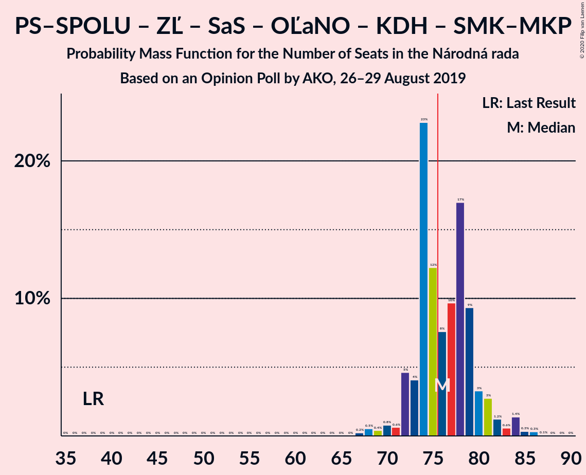

| Number of Seats | Probability | Accumulated | Special Marks |
|:---------------:|:-----------:|:-----------:|:-------------:|
| 38 | 0% | 100% | Last Result |
| 39 | 0% | 100% |  |
| 40 | 0% | 100% |  |
| 41 | 0% | 100% |  |
| 42 | 0% | 100% |  |
| 43 | 0% | 100% |  |
| 44 | 0% | 100% |  |
| 45 | 0% | 100% |  |
| 46 | 0% | 100% |  |
| 47 | 0% | 100% |  |
| 48 | 0% | 100% |  |
| 49 | 0% | 100% |  |
| 50 | 0% | 100% |  |
| 51 | 0% | 100% |  |
| 52 | 0% | 100% |  |
| 53 | 0% | 100% |  |
| 54 | 0% | 100% |  |
| 55 | 0% | 100% |  |
| 56 | 0% | 100% |  |
| 57 | 0% | 100% |  |
| 58 | 0% | 100% |  |
| 59 | 0% | 100% |  |
| 60 | 0% | 100% |  |
| 61 | 0% | 100% |  |
| 62 | 0% | 100% |  |
| 63 | 0% | 100% |  |
| 64 | 0% | 100% |  |
| 65 | 0% | 100% |  |
| 66 | 0% | 100% |  |
| 67 | 0.2% | 99.9% |  |
| 68 | 0.5% | 99.7% |  |
| 69 | 0.4% | 99.2% |  |
| 70 | 0.8% | 98.8% |  |
| 71 | 0.6% | 98% |  |
| 72 | 5% | 97% |  |
| 73 | 4% | 93% |  |
| 74 | 23% | 89% |  |
| 75 | 12% | 66% |  |
| 76 | 8% | 54% | Majority |
| 77 | 10% | 46% | Median |
| 78 | 17% | 36% |  |
| 79 | 9% | 19% |  |
| 80 | 3% | 10% |  |
| 81 | 3% | 7% |  |
| 82 | 1.2% | 4% |  |
| 83 | 0.6% | 3% |  |
| 84 | 1.4% | 2% |  |
| 85 | 0.3% | 0.8% |  |
| 86 | 0.3% | 0.4% |  |
| 87 | 0.1% | 0.1% |  |
| 88 | 0% | 0.1% |  |
| 89 | 0% | 0% |  |

### Progresívne Slovensko–SPOLU–Občianska Demokracia – Za ľudí – Sloboda a Solidarita – OBYČAJNÍ ĽUDIA a nezávislé osobnosti – Kresťanskodemokratické hnutie

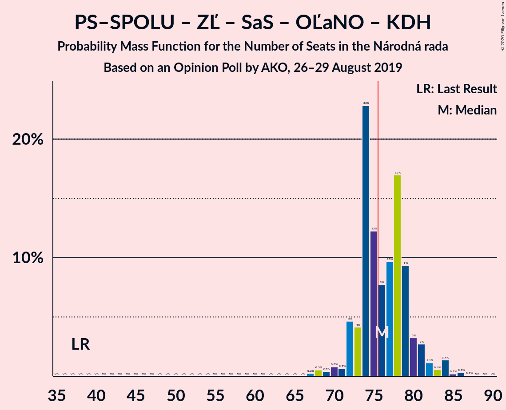

| Number of Seats | Probability | Accumulated | Special Marks |
|:---------------:|:-----------:|:-----------:|:-------------:|
| 38 | 0% | 100% | Last Result |
| 39 | 0% | 100% |  |
| 40 | 0% | 100% |  |
| 41 | 0% | 100% |  |
| 42 | 0% | 100% |  |
| 43 | 0% | 100% |  |
| 44 | 0% | 100% |  |
| 45 | 0% | 100% |  |
| 46 | 0% | 100% |  |
| 47 | 0% | 100% |  |
| 48 | 0% | 100% |  |
| 49 | 0% | 100% |  |
| 50 | 0% | 100% |  |
| 51 | 0% | 100% |  |
| 52 | 0% | 100% |  |
| 53 | 0% | 100% |  |
| 54 | 0% | 100% |  |
| 55 | 0% | 100% |  |
| 56 | 0% | 100% |  |
| 57 | 0% | 100% |  |
| 58 | 0% | 100% |  |
| 59 | 0% | 100% |  |
| 60 | 0% | 100% |  |
| 61 | 0% | 100% |  |
| 62 | 0% | 100% |  |
| 63 | 0% | 100% |  |
| 64 | 0% | 100% |  |
| 65 | 0% | 100% |  |
| 66 | 0% | 99.9% |  |
| 67 | 0.2% | 99.9% |  |
| 68 | 0.5% | 99.7% |  |
| 69 | 0.4% | 99.1% |  |
| 70 | 0.8% | 98.7% |  |
| 71 | 0.7% | 98% |  |
| 72 | 5% | 97% |  |
| 73 | 4% | 93% |  |
| 74 | 23% | 88% |  |
| 75 | 12% | 66% |  |
| 76 | 8% | 53% | Majority |
| 77 | 10% | 46% | Median |
| 78 | 17% | 36% |  |
| 79 | 9% | 19% |  |
| 80 | 3% | 10% |  |
| 81 | 3% | 6% |  |
| 82 | 1.1% | 4% |  |
| 83 | 0.6% | 3% |  |
| 84 | 1.4% | 2% |  |
| 85 | 0.2% | 0.6% |  |
| 86 | 0.3% | 0.4% |  |
| 87 | 0.1% | 0.1% |  |
| 88 | 0% | 0.1% |  |
| 89 | 0% | 0% |  |

### SMER–sociálna demokracia – Kotleba–Ľudová strana Naše Slovensko – SME RODINA – Slovenská národná strana

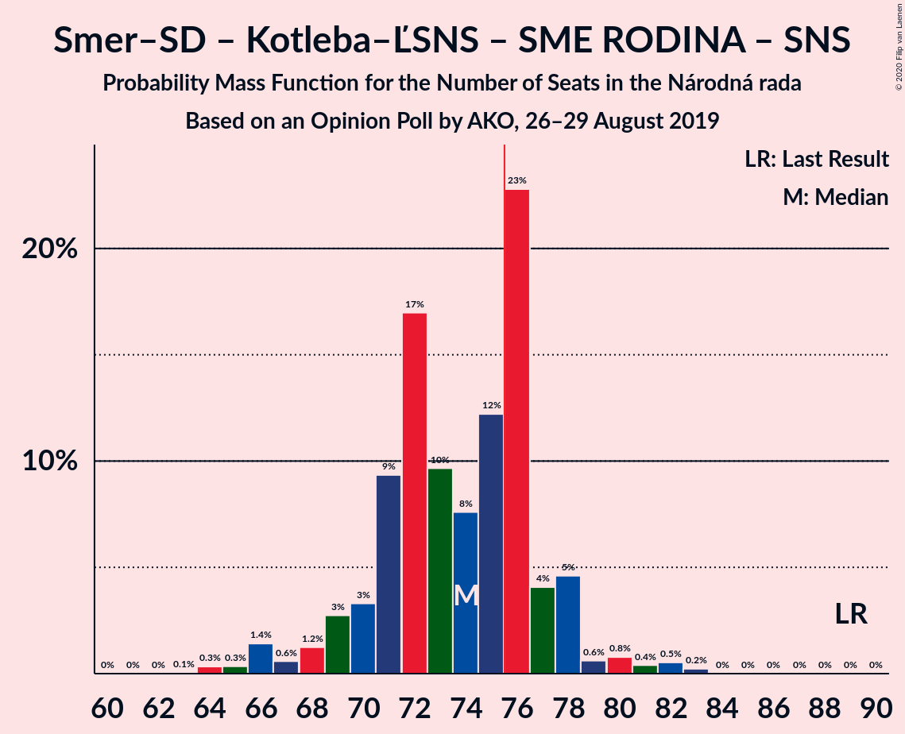

| Number of Seats | Probability | Accumulated | Special Marks |
|:---------------:|:-----------:|:-----------:|:-------------:|
| 61 | 0% | 100% |  |
| 62 | 0% | 99.9% |  |
| 63 | 0.1% | 99.9% |  |
| 64 | 0.3% | 99.9% |  |
| 65 | 0.3% | 99.5% |  |
| 66 | 1.4% | 99.2% |  |
| 67 | 0.6% | 98% |  |
| 68 | 1.2% | 97% |  |
| 69 | 3% | 96% |  |
| 70 | 3% | 93% |  |
| 71 | 9% | 90% |  |
| 72 | 17% | 81% |  |
| 73 | 10% | 64% |  |
| 74 | 8% | 54% |  |
| 75 | 12% | 46% | Median |
| 76 | 23% | 34% | Majority |
| 77 | 4% | 11% |  |
| 78 | 5% | 7% |  |
| 79 | 0.6% | 3% |  |
| 80 | 0.8% | 2% |  |
| 81 | 0.4% | 1.2% |  |
| 82 | 0.5% | 0.8% |  |
| 83 | 0.2% | 0.3% |  |
| 84 | 0% | 0% |  |
| 85 | 0% | 0% |  |
| 86 | 0% | 0% |  |
| 87 | 0% | 0% |  |
| 88 | 0% | 0% |  |
| 89 | 0% | 0% | Last Result |

### Progresívne Slovensko–SPOLU–Občianska Demokracia – Za ľudí – Sloboda a Solidarita – OBYČAJNÍ ĽUDIA a nezávislé osobnosti

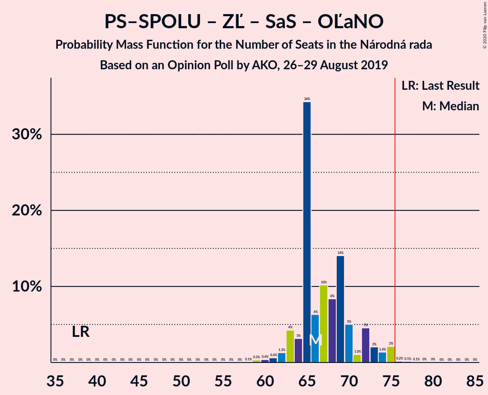

| Number of Seats | Probability | Accumulated | Special Marks |
|:---------------:|:-----------:|:-----------:|:-------------:|
| 38 | 0% | 100% | Last Result |
| 39 | 0% | 100% |  |
| 40 | 0% | 100% |  |
| 41 | 0% | 100% |  |
| 42 | 0% | 100% |  |
| 43 | 0% | 100% |  |
| 44 | 0% | 100% |  |
| 45 | 0% | 100% |  |
| 46 | 0% | 100% |  |
| 47 | 0% | 100% |  |
| 48 | 0% | 100% |  |
| 49 | 0% | 100% |  |
| 50 | 0% | 100% |  |
| 51 | 0% | 100% |  |
| 52 | 0% | 100% |  |
| 53 | 0% | 100% |  |
| 54 | 0% | 100% |  |
| 55 | 0% | 100% |  |
| 56 | 0% | 100% |  |
| 57 | 0% | 100% |  |
| 58 | 0.1% | 100% |  |
| 59 | 0.3% | 99.9% |  |
| 60 | 0.4% | 99.6% |  |
| 61 | 0.6% | 99.2% |  |
| 62 | 1.3% | 98.6% |  |
| 63 | 4% | 97% |  |
| 64 | 3% | 93% |  |
| 65 | 34% | 90% |  |
| 66 | 6% | 56% |  |
| 67 | 10% | 49% |  |
| 68 | 8% | 39% | Median |
| 69 | 14% | 31% |  |
| 70 | 5% | 17% |  |
| 71 | 1.0% | 12% |  |
| 72 | 5% | 11% |  |
| 73 | 2% | 6% |  |
| 74 | 1.4% | 4% |  |
| 75 | 2% | 3% |  |
| 76 | 0.2% | 0.5% | Majority |
| 77 | 0.1% | 0.3% |  |
| 78 | 0.1% | 0.2% |  |
| 79 | 0% | 0.1% |  |
| 80 | 0% | 0.1% |  |
| 81 | 0% | 0% |  |

### Progresívne Slovensko–SPOLU–Občianska Demokracia – Za ľudí – Sloboda a Solidarita – Kresťanskodemokratické hnutie

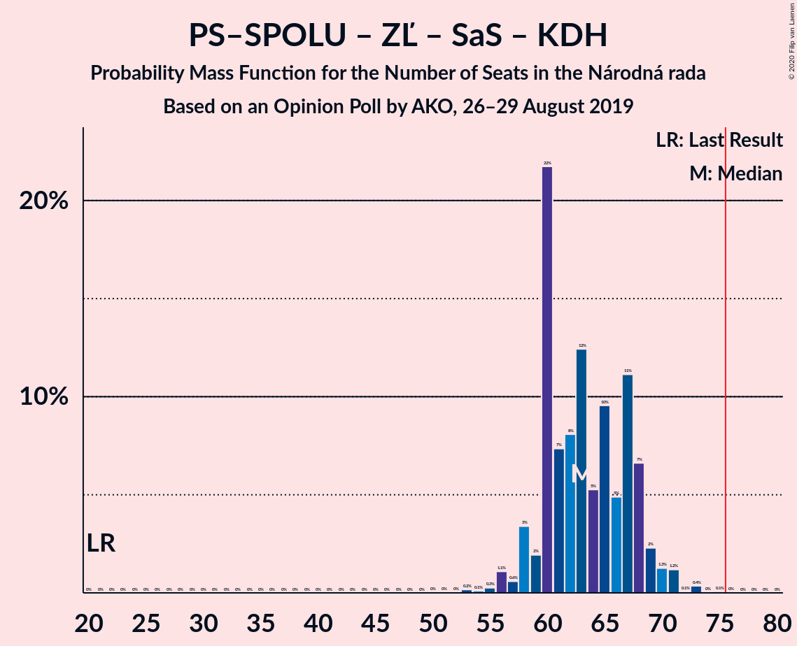

| Number of Seats | Probability | Accumulated | Special Marks |
|:---------------:|:-----------:|:-----------:|:-------------:|
| 21 | 0% | 100% | Last Result |
| 22 | 0% | 100% |  |
| 23 | 0% | 100% |  |
| 24 | 0% | 100% |  |
| 25 | 0% | 100% |  |
| 26 | 0% | 100% |  |
| 27 | 0% | 100% |  |
| 28 | 0% | 100% |  |
| 29 | 0% | 100% |  |
| 30 | 0% | 100% |  |
| 31 | 0% | 100% |  |
| 32 | 0% | 100% |  |
| 33 | 0% | 100% |  |
| 34 | 0% | 100% |  |
| 35 | 0% | 100% |  |
| 36 | 0% | 100% |  |
| 37 | 0% | 100% |  |
| 38 | 0% | 100% |  |
| 39 | 0% | 100% |  |
| 40 | 0% | 100% |  |
| 41 | 0% | 100% |  |
| 42 | 0% | 100% |  |
| 43 | 0% | 100% |  |
| 44 | 0% | 100% |  |
| 45 | 0% | 100% |  |
| 46 | 0% | 100% |  |
| 47 | 0% | 100% |  |
| 48 | 0% | 100% |  |
| 49 | 0% | 100% |  |
| 50 | 0% | 100% |  |
| 51 | 0% | 100% |  |
| 52 | 0% | 100% |  |
| 53 | 0.2% | 99.9% |  |
| 54 | 0.1% | 99.8% |  |
| 55 | 0.3% | 99.7% |  |
| 56 | 1.1% | 99.4% |  |
| 57 | 0.6% | 98% |  |
| 58 | 3% | 98% |  |
| 59 | 2% | 94% |  |
| 60 | 22% | 92% |  |
| 61 | 7% | 71% |  |
| 62 | 8% | 63% |  |
| 63 | 12% | 55% |  |
| 64 | 5% | 43% | Median |
| 65 | 10% | 38% |  |
| 66 | 5% | 28% |  |
| 67 | 11% | 23% |  |
| 68 | 7% | 12% |  |
| 69 | 2% | 5% |  |
| 70 | 1.3% | 3% |  |
| 71 | 1.2% | 2% |  |
| 72 | 0.1% | 0.6% |  |
| 73 | 0.4% | 0.5% |  |
| 74 | 0% | 0.1% |  |
| 75 | 0.1% | 0.1% |  |
| 76 | 0% | 0% | Majority |

### Progresívne Slovensko–SPOLU–Občianska Demokracia – Za ľudí – Sloboda a Solidarita

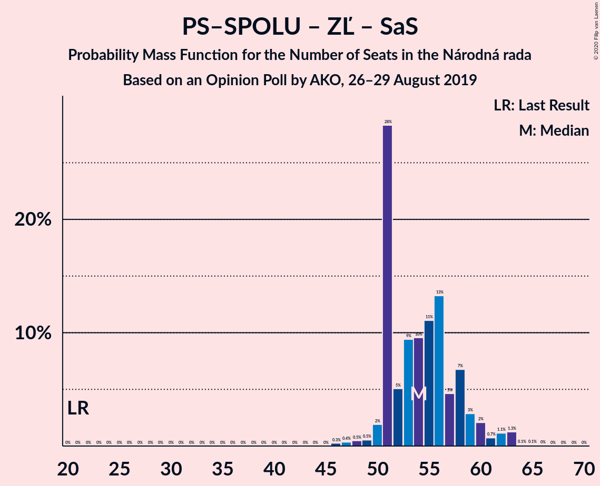

| Number of Seats | Probability | Accumulated | Special Marks |
|:---------------:|:-----------:|:-----------:|:-------------:|
| 21 | 0% | 100% | Last Result |
| 22 | 0% | 100% |  |
| 23 | 0% | 100% |  |
| 24 | 0% | 100% |  |
| 25 | 0% | 100% |  |
| 26 | 0% | 100% |  |
| 27 | 0% | 100% |  |
| 28 | 0% | 100% |  |
| 29 | 0% | 100% |  |
| 30 | 0% | 100% |  |
| 31 | 0% | 100% |  |
| 32 | 0% | 100% |  |
| 33 | 0% | 100% |  |
| 34 | 0% | 100% |  |
| 35 | 0% | 100% |  |
| 36 | 0% | 100% |  |
| 37 | 0% | 100% |  |
| 38 | 0% | 100% |  |
| 39 | 0% | 100% |  |
| 40 | 0% | 100% |  |
| 41 | 0% | 100% |  |
| 42 | 0% | 100% |  |
| 43 | 0% | 100% |  |
| 44 | 0% | 100% |  |
| 45 | 0% | 100% |  |
| 46 | 0.3% | 100% |  |
| 47 | 0.4% | 99.7% |  |
| 48 | 0.5% | 99.4% |  |
| 49 | 0.5% | 98.9% |  |
| 50 | 2% | 98% |  |
| 51 | 28% | 96% |  |
| 52 | 5% | 68% |  |
| 53 | 9% | 63% |  |
| 54 | 10% | 54% |  |
| 55 | 11% | 44% | Median |
| 56 | 13% | 33% |  |
| 57 | 5% | 20% |  |
| 58 | 7% | 15% |  |
| 59 | 3% | 8% |  |
| 60 | 2% | 5% |  |
| 61 | 0.7% | 3% |  |
| 62 | 1.1% | 3% |  |
| 63 | 1.3% | 2% |  |
| 64 | 0.1% | 0.3% |  |
| 65 | 0.1% | 0.2% |  |
| 66 | 0% | 0.1% |  |
| 67 | 0% | 0% |  |

### SMER–sociálna demokracia – SME RODINA – Slovenská národná strana

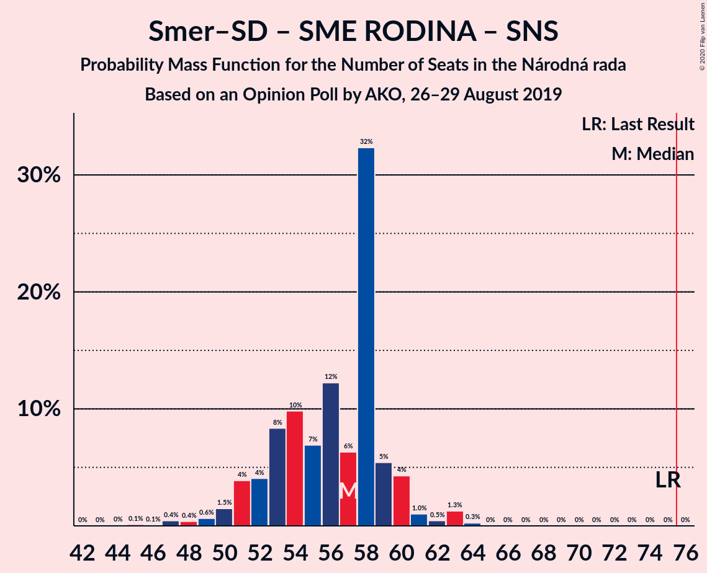

| Number of Seats | Probability | Accumulated | Special Marks |
|:---------------:|:-----------:|:-----------:|:-------------:|
| 43 | 0% | 100% |  |
| 44 | 0% | 99.9% |  |
| 45 | 0.1% | 99.9% |  |
| 46 | 0.1% | 99.8% |  |
| 47 | 0.4% | 99.7% |  |
| 48 | 0.4% | 99.3% |  |
| 49 | 0.6% | 98.9% |  |
| 50 | 1.5% | 98% |  |
| 51 | 4% | 97% |  |
| 52 | 4% | 93% |  |
| 53 | 8% | 89% |  |
| 54 | 10% | 80% |  |
| 55 | 7% | 71% |  |
| 56 | 12% | 64% |  |
| 57 | 6% | 51% | Median |
| 58 | 32% | 45% |  |
| 59 | 5% | 13% |  |
| 60 | 4% | 7% |  |
| 61 | 1.0% | 3% |  |
| 62 | 0.5% | 2% |  |
| 63 | 1.3% | 2% |  |
| 64 | 0.3% | 0.3% |  |
| 65 | 0% | 0.1% |  |
| 66 | 0% | 0.1% |  |
| 67 | 0% | 0% |  |
| 68 | 0% | 0% |  |
| 69 | 0% | 0% |  |
| 70 | 0% | 0% |  |
| 71 | 0% | 0% |  |
| 72 | 0% | 0% |  |
| 73 | 0% | 0% |  |
| 74 | 0% | 0% |  |
| 75 | 0% | 0% | Last Result |

### SMER–sociálna demokracia – SME RODINA

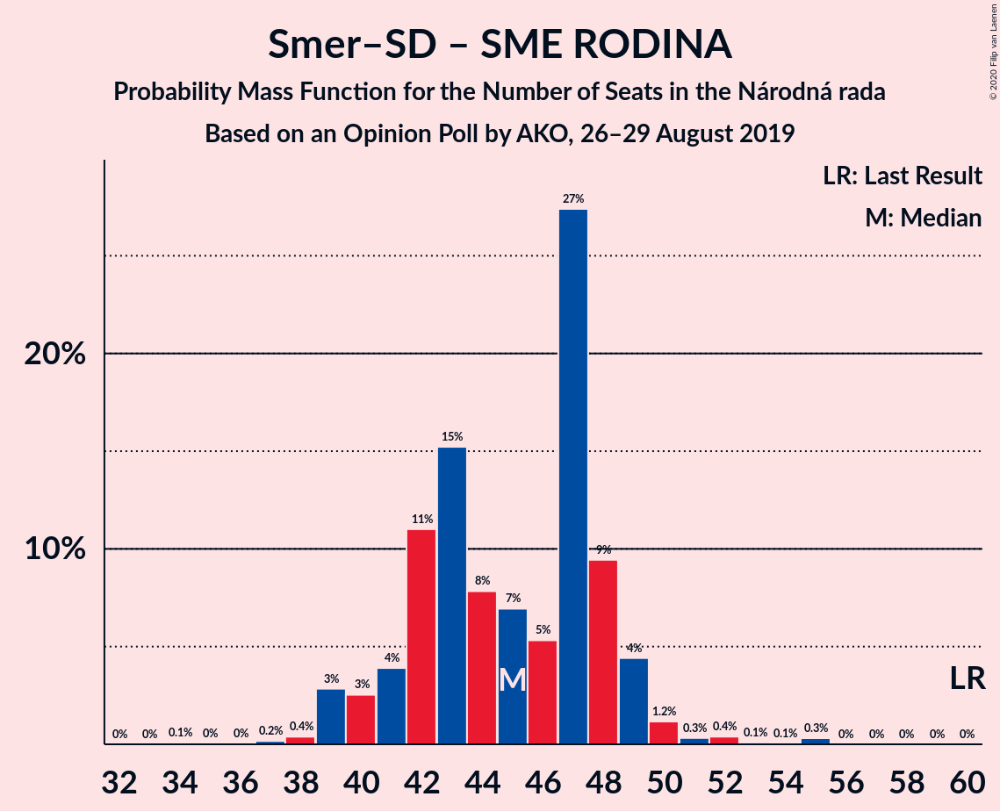

| Number of Seats | Probability | Accumulated | Special Marks |
|:---------------:|:-----------:|:-----------:|:-------------:|
| 34 | 0.1% | 100% |  |
| 35 | 0% | 99.9% |  |
| 36 | 0% | 99.9% |  |
| 37 | 0.2% | 99.8% |  |
| 38 | 0.4% | 99.7% |  |
| 39 | 3% | 99.3% |  |
| 40 | 3% | 96% |  |
| 41 | 4% | 94% |  |
| 42 | 11% | 90% |  |
| 43 | 15% | 79% |  |
| 44 | 8% | 64% |  |
| 45 | 7% | 56% |  |
| 46 | 5% | 49% | Median |
| 47 | 27% | 44% |  |
| 48 | 9% | 16% |  |
| 49 | 4% | 7% |  |
| 50 | 1.2% | 2% |  |
| 51 | 0.3% | 1.2% |  |
| 52 | 0.4% | 0.9% |  |
| 53 | 0.1% | 0.5% |  |
| 54 | 0.1% | 0.4% |  |
| 55 | 0.3% | 0.4% |  |
| 56 | 0% | 0% |  |
| 57 | 0% | 0% |  |
| 58 | 0% | 0% |  |
| 59 | 0% | 0% |  |
| 60 | 0% | 0% | Last Result |

### SMER–sociálna demokracia – Slovenská národná strana – MOST–HÍD

| Number of Seats | Probability | Accumulated | Special Marks |
|:---------------:|:-----------:|:-----------:|:-------------:|
| 31 | 0% | 100% |  |
| 32 | 0% | 99.9% |  |
| 33 | 0.1% | 99.9% |  |
| 34 | 0.1% | 99.8% |  |
| 35 | 0.5% | 99.7% |  |
| 36 | 0.6% | 99.2% |  |
| 37 | 0.5% | 98.6% |  |
| 38 | 3% | 98% |  |
| 39 | 3% | 95% |  |
| 40 | 11% | 92% |  |
| 41 | 6% | 81% |  |
| 42 | 7% | 75% |  |
| 43 | 14% | 68% |  |
| 44 | 14% | 53% | Median |
| 45 | 25% | 40% |  |
| 46 | 5% | 15% |  |
| 47 | 6% | 10% |  |
| 48 | 2% | 4% |  |
| 49 | 0.5% | 2% |  |
| 50 | 1.3% | 2% |  |
| 51 | 0.2% | 0.7% |  |
| 52 | 0.4% | 0.5% |  |
| 53 | 0% | 0% |  |
| 54 | 0% | 0% |  |
| 55 | 0% | 0% |  |
| 56 | 0% | 0% |  |
| 57 | 0% | 0% |  |
| 58 | 0% | 0% |  |
| 59 | 0% | 0% |  |
| 60 | 0% | 0% |  |
| 61 | 0% | 0% |  |
| 62 | 0% | 0% |  |
| 63 | 0% | 0% |  |
| 64 | 0% | 0% |  |
| 65 | 0% | 0% |  |
| 66 | 0% | 0% |  |
| 67 | 0% | 0% |  |
| 68 | 0% | 0% |  |
| 69 | 0% | 0% |  |
| 70 | 0% | 0% |  |
| 71 | 0% | 0% |  |
| 72 | 0% | 0% |  |
| 73 | 0% | 0% |  |
| 74 | 0% | 0% |  |
| 75 | 0% | 0% | Last Result |

### SMER–sociálna demokracia – Slovenská národná strana

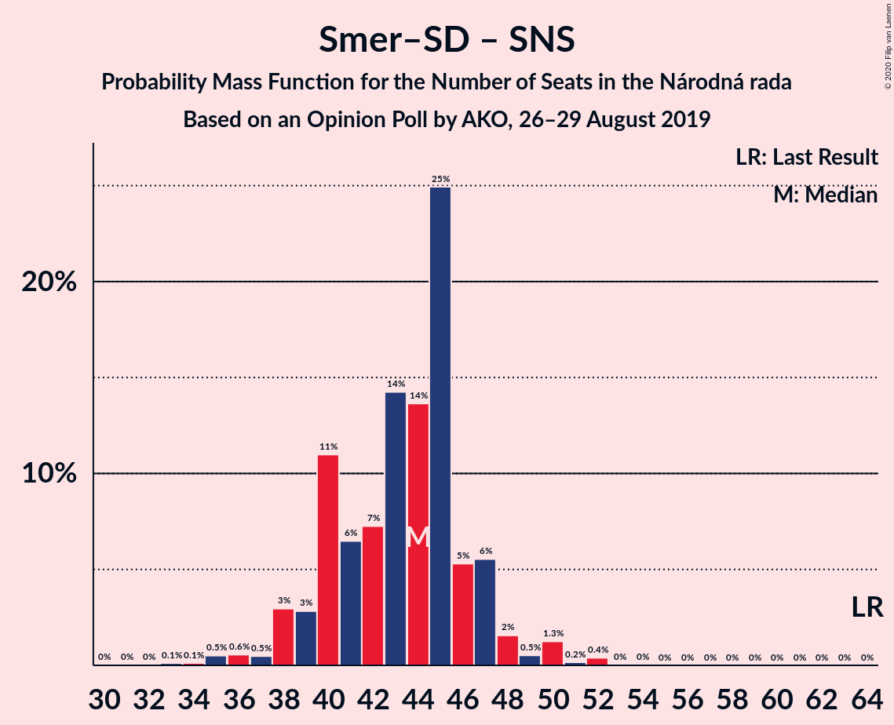

| Number of Seats | Probability | Accumulated | Special Marks |
|:---------------:|:-----------:|:-----------:|:-------------:|
| 31 | 0% | 100% |  |
| 32 | 0% | 99.9% |  |
| 33 | 0.1% | 99.9% |  |
| 34 | 0.1% | 99.8% |  |
| 35 | 0.5% | 99.7% |  |
| 36 | 0.6% | 99.2% |  |
| 37 | 0.5% | 98.6% |  |
| 38 | 3% | 98% |  |
| 39 | 3% | 95% |  |
| 40 | 11% | 92% |  |
| 41 | 6% | 81% |  |
| 42 | 7% | 75% |  |
| 43 | 14% | 68% |  |
| 44 | 14% | 53% | Median |
| 45 | 25% | 40% |  |
| 46 | 5% | 15% |  |
| 47 | 6% | 9% |  |
| 48 | 2% | 4% |  |
| 49 | 0.5% | 2% |  |
| 50 | 1.3% | 2% |  |
| 51 | 0.2% | 0.6% |  |
| 52 | 0.4% | 0.4% |  |
| 53 | 0% | 0% |  |
| 54 | 0% | 0% |  |
| 55 | 0% | 0% |  |
| 56 | 0% | 0% |  |
| 57 | 0% | 0% |  |
| 58 | 0% | 0% |  |
| 59 | 0% | 0% |  |
| 60 | 0% | 0% |  |
| 61 | 0% | 0% |  |
| 62 | 0% | 0% |  |
| 63 | 0% | 0% |  |
| 64 | 0% | 0% | Last Result |

### SMER–sociálna demokracia

| Number of Seats | Probability | Accumulated | Special Marks |
|:---------------:|:-----------:|:-----------:|:-------------:|
| 25 | 0% | 100% |  |
| 26 | 0.4% | 99.9% |  |
| 27 | 2% | 99.5% |  |
| 28 | 5% | 98% |  |
| 29 | 12% | 93% |  |
| 30 | 7% | 80% |  |
| 31 | 15% | 74% |  |
| 32 | 8% | 59% |  |
| 33 | 12% | 51% | Median |
| 34 | 26% | 39% |  |
| 35 | 6% | 13% |  |
| 36 | 5% | 7% |  |
| 37 | 0.5% | 2% |  |
| 38 | 0.5% | 2% |  |
| 39 | 1.1% | 1.2% |  |
| 40 | 0.1% | 0.1% |  |
| 41 | 0% | 0.1% |  |
| 42 | 0% | 0% |  |
| 43 | 0% | 0% |  |
| 44 | 0% | 0% |  |
| 45 | 0% | 0% |  |
| 46 | 0% | 0% |  |
| 47 | 0% | 0% |  |
| 48 | 0% | 0% |  |
| 49 | 0% | 0% | Last Result |

## Technical Information

### Opinion Poll

+ **Polling firm:** AKO
+ **Commissioner(s):** —
+ **Fieldwork period:** 26–29 August 2019

### Calculations

+ **Sample size:** 1000
+ **Simulations done:** 1,048,576
+ **Error estimate:** 2.10%

