# Opinion Poll by FOCUS, 11–17 September 2019

<a href="#voting-intentions">Voting Intentions</a> | <a href="#seats">Seats</a> | <a href="#coalitions">Coalitions</a> | <a href="#technical-information">Technical Information</a>

## Voting Intentions

### Confidence Intervals

| Party | Last Result | Poll Result | 80% Confidence Interval | 90% Confidence Interval | 95% Confidence Interval | 99% Confidence Interval |
|:-----:|:-----------:|:-----------:|:-----------------------:|:-----------------------:|:-----------------------:|:-----------------------:|
| SMER–sociálna demokracia | 28.3% | 21.7% | 20.1–23.4% |19.7–23.9% |19.3–24.3% |18.5–25.2% |
| Progresívne Slovensko–SPOLU–Občianska Demokracia | 0.0% | 13.3% | 12.1–14.8% |11.7–15.2% |11.4–15.6% |10.8–16.3% |
| Kotleba–Ľudová strana Naše Slovensko | 8.0% | 10.6% | 9.5–11.9% |9.1–12.3% |8.9–12.7% |8.4–13.3% |
| SME RODINA | 6.6% | 7.2% | 6.3–8.4% |6.0–8.7% |5.8–9.0% |5.3–9.5% |
| Kresťanskodemokratické hnutie | 4.9% | 6.9% | 6.0–8.0% |5.7–8.4% |5.5–8.6% |5.1–9.2% |
| OBYČAJNÍ ĽUDIA a nezávislé osobnosti | 11.0% | 6.8% | 5.9–7.9% |5.6–8.2% |5.4–8.5% |5.0–9.1% |
| Slovenská národná strana | 8.6% | 6.8% | 5.9–7.9% |5.6–8.2% |5.4–8.5% |5.0–9.1% |
| Za ľudí | 0.0% | 6.5% | 5.6–7.6% |5.4–7.9% |5.2–8.2% |4.8–8.8% |
| Sloboda a Solidarita | 12.1% | 6.4% | 5.5–7.5% |5.3–7.8% |5.1–8.1% |4.7–8.7% |
| MOST–HÍD | 6.5% | 4.1% | 3.4–5.0% |3.2–5.3% |3.0–5.5% |2.7–6.0% |
| Strana maďarskej koalície–Magyar Koalíció Pártja | 4.0% | 3.3% | 2.7–4.1% |2.5–4.4% |2.4–4.6% |2.1–5.0% |
| Dobrá voľba | 0.0% | 2.1% | 1.7–2.9% |1.5–3.0% |1.4–3.2% |1.2–3.6% |

*Note:* The poll result column reflects the actual value used in the calculations. Published results may vary slightly, and in addition be rounded to fewer digits.

## Seats

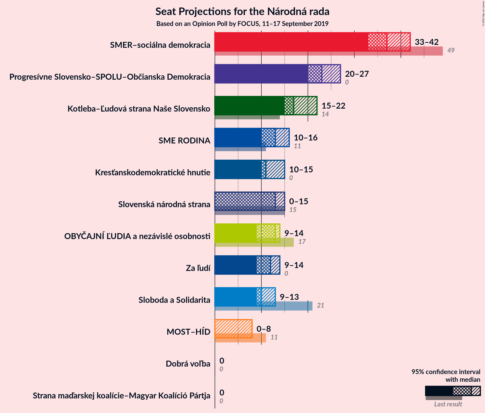

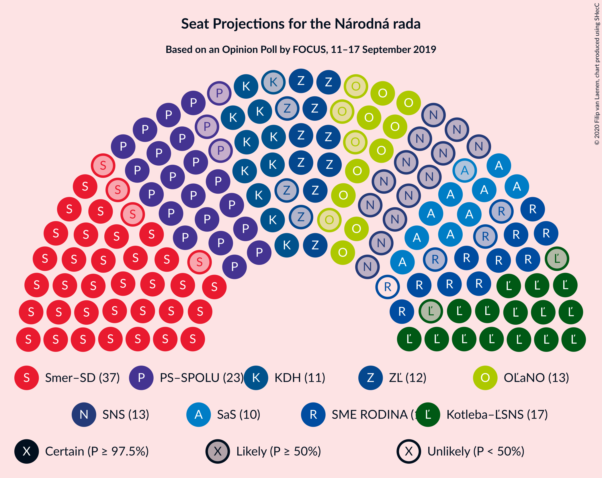

### Confidence Intervals

| Party | Last Result | Median | 80% Confidence Interval | 90% Confidence Interval | 95% Confidence Interval | 99% Confidence Interval |
|:-----:|:-----------:|:------:|:-----------------------:|:-----------------------:|:-----------------------:|:-----------------------:|
| <a href="#smer–sociálna-demokracia">SMER–sociálna demokracia</a> | 49 | 37 | 35–41 |34–42 |33–42 |32–46 |
| <a href="#progresívne-slovensko–spolu–občianska-demokracia">Progresívne Slovensko–SPOLU–Občianska Demokracia</a> | 0 | 23 | 21–25 |21–26 |20–27 |19–28 |
| <a href="#kotleba–ľudová-strana-naše-slovensko">Kotleba–Ľudová strana Naše Slovensko</a> | 14 | 17 | 17–22 |16–22 |15–22 |15–23 |
| <a href="#sme-rodina">SME RODINA</a> | 11 | 13 | 11–14 |11–15 |10–16 |9–17 |
| <a href="#kresťanskodemokratické-hnutie">Kresťanskodemokratické hnutie</a> | 0 | 11 | 10–13 |10–14 |10–15 |0–16 |
| <a href="#obyčajní-ľudia-a-nezávislé-osobnosti">OBYČAJNÍ ĽUDIA a nezávislé osobnosti</a> | 17 | 13 | 11–14 |10–14 |9–14 |0–15 |
| <a href="#slovenská-národná-strana">Slovenská národná strana</a> | 15 | 13 | 9–14 |0–15 |0–15 |0–16 |
| <a href="#za-ľudí">Za ľudí</a> | 0 | 12 | 10–13 |9–13 |9–14 |9–14 |
| <a href="#sloboda-a-solidarita">Sloboda a Solidarita</a> | 21 | 10 | 9–13 |9–13 |9–13 |0–14 |
| <a href="#most–híd">MOST–HÍD</a> | 11 | 0 | 0 |0 |0–8 |0–9 |
| <a href="#strana-maďarskej-koalície–magyar-koalíció-pártja">Strana maďarskej koalície–Magyar Koalíció Pártja</a> | 0 | 0 | 0 |0 |0 |0 |
| <a href="#dobrá-voľba">Dobrá voľba</a> | 0 | 0 | 0 |0 |0 |0 |

### SMER–sociálna demokracia

*For a full overview of the results for this party, see the [SMER–sociálna demokracia](party-smer–sociálnademokracia.html) page.*

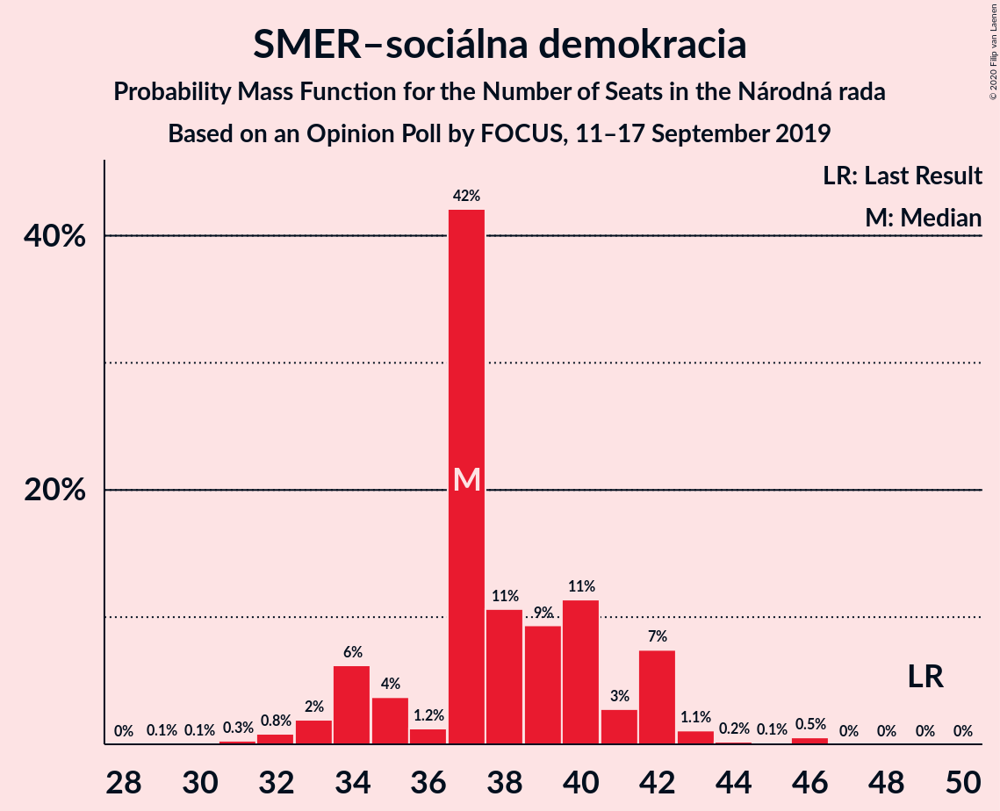

| Number of Seats | Probability | Accumulated | Special Marks |
|:---------------:|:-----------:|:-----------:|:-------------:|
| 29 | 0.1% | 100% |  |
| 30 | 0.1% | 99.9% |  |
| 31 | 0.3% | 99.9% |  |
| 32 | 0.8% | 99.6% |  |
| 33 | 2% | 98.8% |  |
| 34 | 6% | 97% |  |
| 35 | 4% | 91% |  |
| 36 | 1.2% | 87% |  |
| 37 | 42% | 86% | Median |
| 38 | 11% | 44% |  |
| 39 | 9% | 33% |  |
| 40 | 11% | 24% |  |
| 41 | 3% | 12% |  |
| 42 | 7% | 9% |  |
| 43 | 1.1% | 2% |  |
| 44 | 0.2% | 0.9% |  |
| 45 | 0.1% | 0.7% |  |
| 46 | 0.5% | 0.6% |  |
| 47 | 0% | 0% |  |
| 48 | 0% | 0% |  |
| 49 | 0% | 0% | Last Result |

### Progresívne Slovensko–SPOLU–Občianska Demokracia

*For a full overview of the results for this party, see the [Progresívne Slovensko–SPOLU–Občianska Demokracia](party-progresívneslovensko–spolu–občianskademokracia.html) page.*

| Number of Seats | Probability | Accumulated | Special Marks |
|:---------------:|:-----------:|:-----------:|:-------------:|
| 0 | 0% | 100% | Last Result |
| 1 | 0% | 100% |  |
| 2 | 0% | 100% |  |
| 3 | 0% | 100% |  |
| 4 | 0% | 100% |  |
| 5 | 0% | 100% |  |
| 6 | 0% | 100% |  |
| 7 | 0% | 100% |  |
| 8 | 0% | 100% |  |
| 9 | 0% | 100% |  |
| 10 | 0% | 100% |  |
| 11 | 0% | 100% |  |
| 12 | 0% | 100% |  |
| 13 | 0% | 100% |  |
| 14 | 0% | 100% |  |
| 15 | 0% | 100% |  |
| 16 | 0% | 100% |  |
| 17 | 0.1% | 100% |  |
| 18 | 0.2% | 99.9% |  |
| 19 | 0.8% | 99.8% |  |
| 20 | 3% | 99.0% |  |
| 21 | 10% | 96% |  |
| 22 | 10% | 86% |  |
| 23 | 48% | 76% | Median |
| 24 | 11% | 28% |  |
| 25 | 11% | 17% |  |
| 26 | 3% | 6% |  |
| 27 | 2% | 3% |  |
| 28 | 1.0% | 1.2% |  |
| 29 | 0.1% | 0.2% |  |
| 30 | 0.1% | 0.1% |  |
| 31 | 0% | 0% |  |

### Kotleba–Ľudová strana Naše Slovensko

*For a full overview of the results for this party, see the [Kotleba–Ľudová strana Naše Slovensko](party-kotleba–ľudovástrananašeslovensko.html) page.*

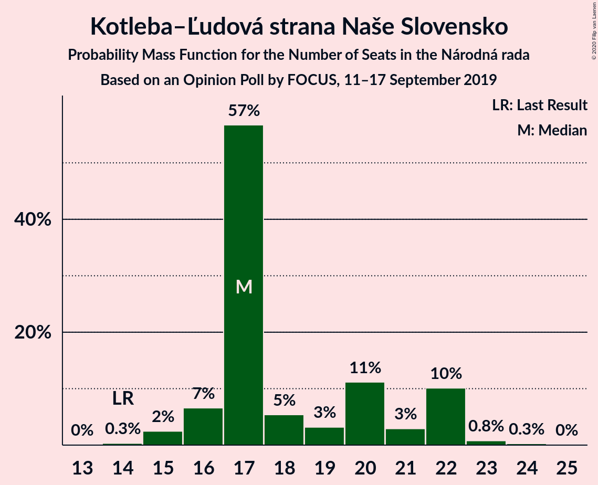

| Number of Seats | Probability | Accumulated | Special Marks |
|:---------------:|:-----------:|:-----------:|:-------------:|
| 14 | 0.3% | 100% | Last Result |
| 15 | 2% | 99.6% |  |
| 16 | 7% | 97% |  |
| 17 | 57% | 91% | Median |
| 18 | 5% | 34% |  |
| 19 | 3% | 28% |  |
| 20 | 11% | 25% |  |
| 21 | 3% | 14% |  |
| 22 | 10% | 11% |  |
| 23 | 0.8% | 1.1% |  |
| 24 | 0.3% | 0.3% |  |
| 25 | 0% | 0% |  |

### SME RODINA

*For a full overview of the results for this party, see the [SME RODINA](party-smerodina.html) page.*

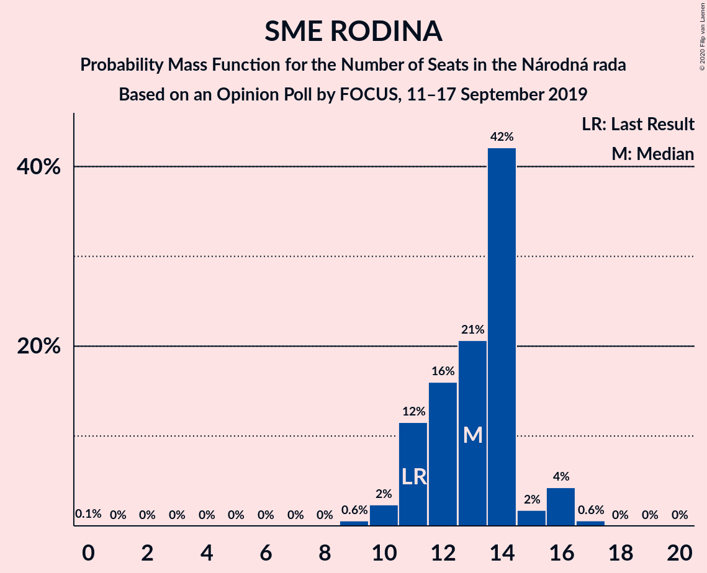

| Number of Seats | Probability | Accumulated | Special Marks |
|:---------------:|:-----------:|:-----------:|:-------------:|
| 0 | 0.1% | 100% |  |
| 1 | 0% | 99.9% |  |
| 2 | 0% | 99.9% |  |
| 3 | 0% | 99.9% |  |
| 4 | 0% | 99.9% |  |
| 5 | 0% | 99.9% |  |
| 6 | 0% | 99.9% |  |
| 7 | 0% | 99.9% |  |
| 8 | 0% | 99.9% |  |
| 9 | 0.6% | 99.9% |  |
| 10 | 2% | 99.3% |  |
| 11 | 12% | 97% | Last Result |
| 12 | 16% | 85% |  |
| 13 | 21% | 69% | Median |
| 14 | 42% | 49% |  |
| 15 | 2% | 7% |  |
| 16 | 4% | 5% |  |
| 17 | 0.6% | 0.6% |  |
| 18 | 0% | 0.1% |  |
| 19 | 0% | 0% |  |

### Kresťanskodemokratické hnutie

*For a full overview of the results for this party, see the [Kresťanskodemokratické hnutie](party-kresťanskodemokratickéhnutie.html) page.*

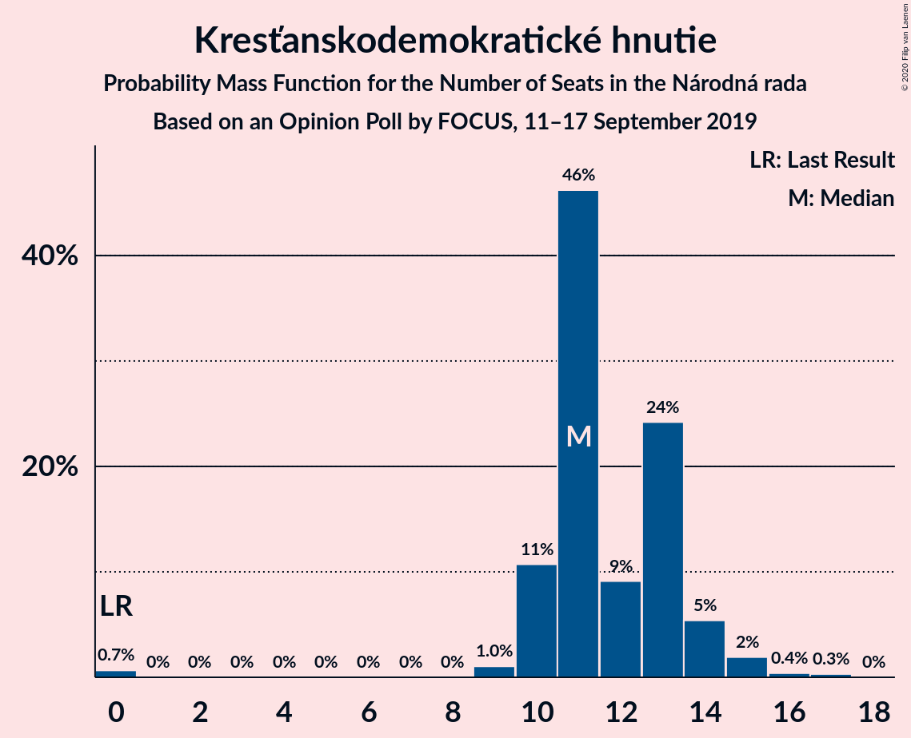

| Number of Seats | Probability | Accumulated | Special Marks |
|:---------------:|:-----------:|:-----------:|:-------------:|
| 0 | 0.7% | 100% | Last Result |
| 1 | 0% | 99.3% |  |
| 2 | 0% | 99.3% |  |
| 3 | 0% | 99.3% |  |
| 4 | 0% | 99.3% |  |
| 5 | 0% | 99.3% |  |
| 6 | 0% | 99.3% |  |
| 7 | 0% | 99.3% |  |
| 8 | 0% | 99.3% |  |
| 9 | 1.0% | 99.3% |  |
| 10 | 11% | 98% |  |
| 11 | 46% | 88% | Median |
| 12 | 9% | 41% |  |
| 13 | 24% | 32% |  |
| 14 | 5% | 8% |  |
| 15 | 2% | 3% |  |
| 16 | 0.4% | 0.7% |  |
| 17 | 0.3% | 0.3% |  |
| 18 | 0% | 0% |  |

### OBYČAJNÍ ĽUDIA a nezávislé osobnosti

*For a full overview of the results for this party, see the [OBYČAJNÍ ĽUDIA a nezávislé osobnosti](party-obyčajníľudiaanezávisléosobnosti.html) page.*

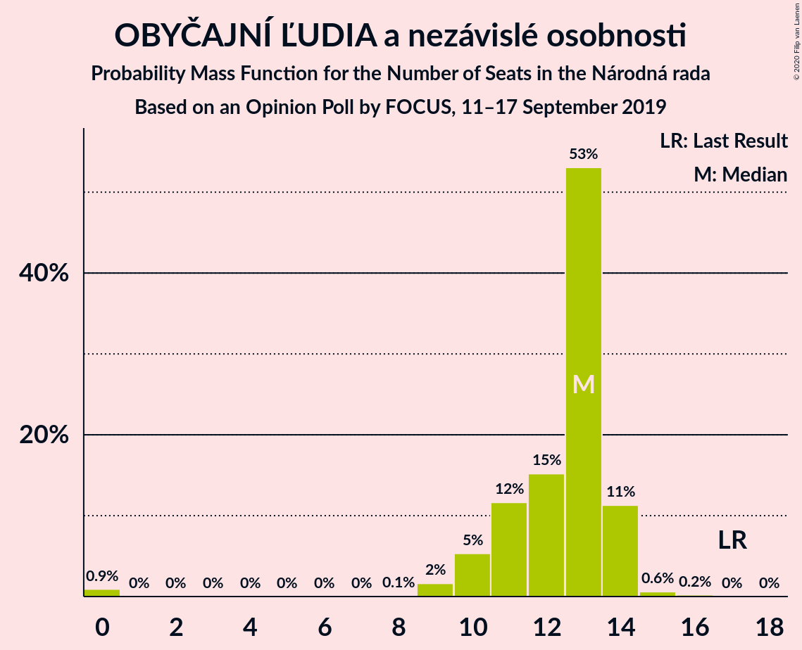

| Number of Seats | Probability | Accumulated | Special Marks |
|:---------------:|:-----------:|:-----------:|:-------------:|
| 0 | 0.9% | 100% |  |
| 1 | 0% | 99.1% |  |
| 2 | 0% | 99.1% |  |
| 3 | 0% | 99.1% |  |
| 4 | 0% | 99.1% |  |
| 5 | 0% | 99.1% |  |
| 6 | 0% | 99.1% |  |
| 7 | 0% | 99.1% |  |
| 8 | 0.1% | 99.1% |  |
| 9 | 2% | 99.0% |  |
| 10 | 5% | 97% |  |
| 11 | 12% | 92% |  |
| 12 | 15% | 80% |  |
| 13 | 53% | 65% | Median |
| 14 | 11% | 12% |  |
| 15 | 0.6% | 0.9% |  |
| 16 | 0.2% | 0.3% |  |
| 17 | 0% | 0.1% | Last Result |
| 18 | 0% | 0% |  |

### Slovenská národná strana

*For a full overview of the results for this party, see the [Slovenská národná strana](party-slovenskánárodnástrana.html) page.*

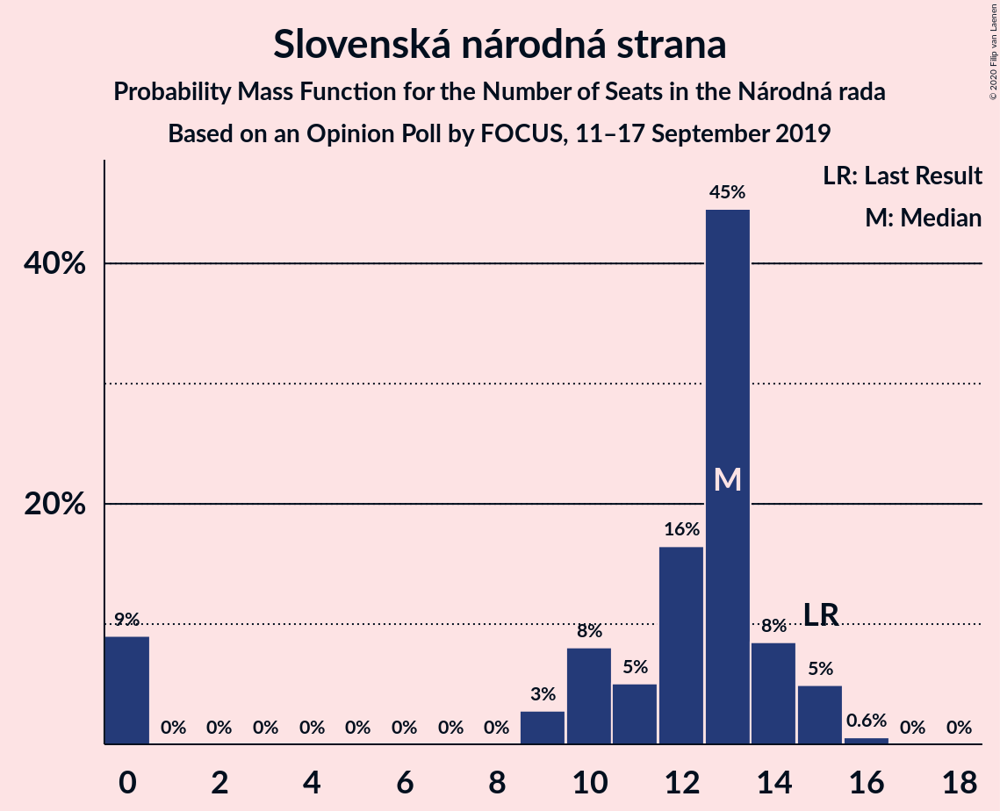

| Number of Seats | Probability | Accumulated | Special Marks |
|:---------------:|:-----------:|:-----------:|:-------------:|
| 0 | 9% | 100% |  |
| 1 | 0% | 91% |  |
| 2 | 0% | 91% |  |
| 3 | 0% | 91% |  |
| 4 | 0% | 91% |  |
| 5 | 0% | 91% |  |
| 6 | 0% | 91% |  |
| 7 | 0% | 91% |  |
| 8 | 0% | 91% |  |
| 9 | 3% | 91% |  |
| 10 | 8% | 88% |  |
| 11 | 5% | 80% |  |
| 12 | 16% | 75% |  |
| 13 | 45% | 59% | Median |
| 14 | 8% | 14% |  |
| 15 | 5% | 6% | Last Result |
| 16 | 0.6% | 0.6% |  |
| 17 | 0% | 0% |  |

### Za ľudí

*For a full overview of the results for this party, see the [Za ľudí](party-zaľudí.html) page.*

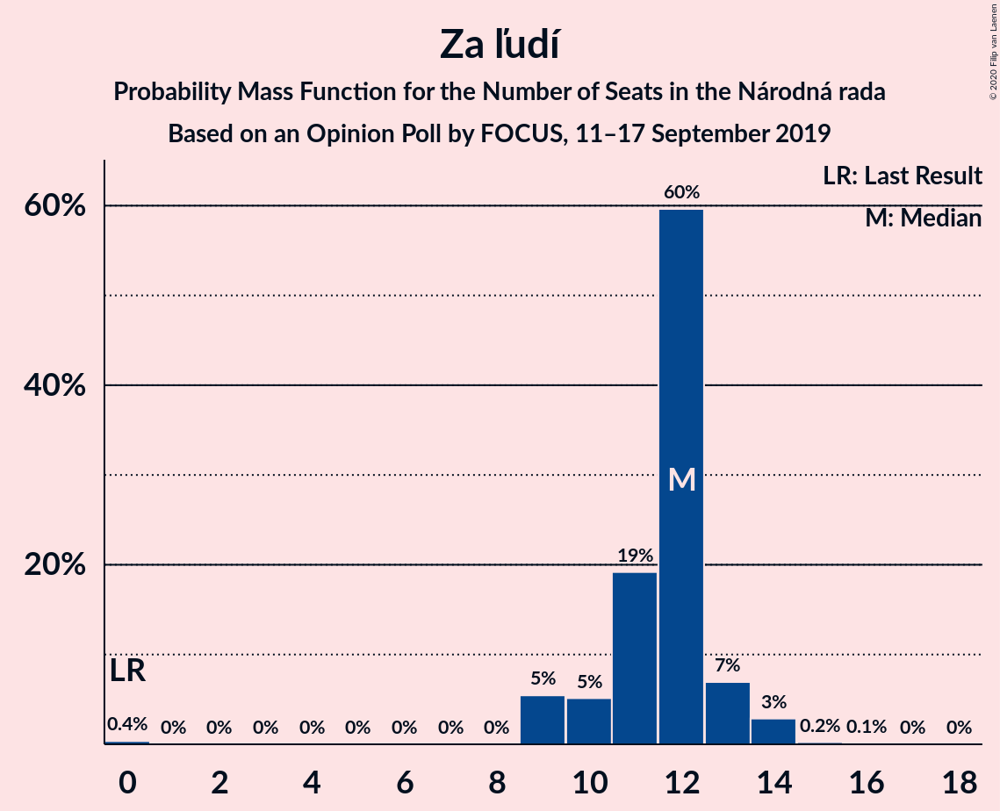

| Number of Seats | Probability | Accumulated | Special Marks |
|:---------------:|:-----------:|:-----------:|:-------------:|
| 0 | 0.4% | 100% | Last Result |
| 1 | 0% | 99.6% |  |
| 2 | 0% | 99.6% |  |
| 3 | 0% | 99.6% |  |
| 4 | 0% | 99.6% |  |
| 5 | 0% | 99.6% |  |
| 6 | 0% | 99.6% |  |
| 7 | 0% | 99.6% |  |
| 8 | 0% | 99.6% |  |
| 9 | 5% | 99.6% |  |
| 10 | 5% | 94% |  |
| 11 | 19% | 89% |  |
| 12 | 60% | 70% | Median |
| 13 | 7% | 10% |  |
| 14 | 3% | 3% |  |
| 15 | 0.2% | 0.4% |  |
| 16 | 0.1% | 0.1% |  |
| 17 | 0% | 0% |  |

### Sloboda a Solidarita

*For a full overview of the results for this party, see the [Sloboda a Solidarita](party-slobodaasolidarita.html) page.*

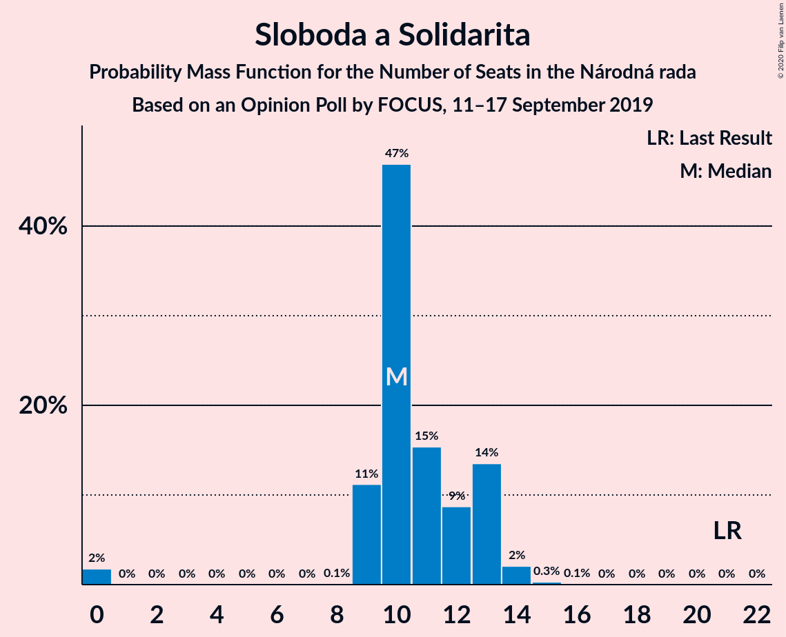

| Number of Seats | Probability | Accumulated | Special Marks |
|:---------------:|:-----------:|:-----------:|:-------------:|
| 0 | 2% | 100% |  |
| 1 | 0% | 98% |  |
| 2 | 0% | 98% |  |
| 3 | 0% | 98% |  |
| 4 | 0% | 98% |  |
| 5 | 0% | 98% |  |
| 6 | 0% | 98% |  |
| 7 | 0% | 98% |  |
| 8 | 0.1% | 98% |  |
| 9 | 11% | 98% |  |
| 10 | 47% | 87% | Median |
| 11 | 15% | 40% |  |
| 12 | 9% | 25% |  |
| 13 | 14% | 16% |  |
| 14 | 2% | 2% |  |
| 15 | 0.3% | 0.4% |  |
| 16 | 0.1% | 0.1% |  |
| 17 | 0% | 0% |  |
| 18 | 0% | 0% |  |
| 19 | 0% | 0% |  |
| 20 | 0% | 0% |  |
| 21 | 0% | 0% | Last Result |

### MOST–HÍD

*For a full overview of the results for this party, see the [MOST–HÍD](party-most–híd.html) page.*

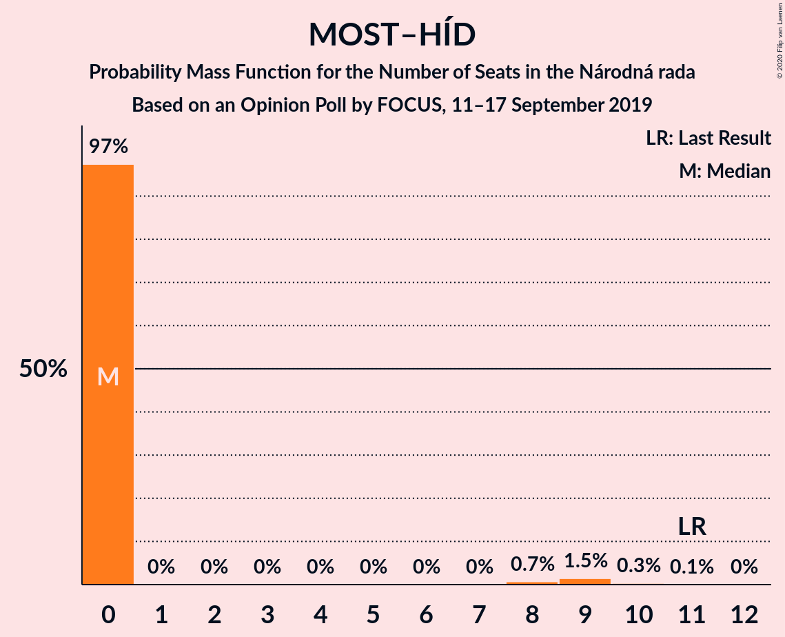

| Number of Seats | Probability | Accumulated | Special Marks |
|:---------------:|:-----------:|:-----------:|:-------------:|
| 0 | 97% | 100% | Median |
| 1 | 0% | 3% |  |
| 2 | 0% | 3% |  |
| 3 | 0% | 3% |  |
| 4 | 0% | 3% |  |
| 5 | 0% | 3% |  |
| 6 | 0% | 3% |  |
| 7 | 0% | 3% |  |
| 8 | 0.7% | 3% |  |
| 9 | 1.5% | 2% |  |
| 10 | 0.3% | 0.4% |  |
| 11 | 0.1% | 0.1% | Last Result |
| 12 | 0% | 0% |  |

### Strana maďarskej koalície–Magyar Koalíció Pártja

*For a full overview of the results for this party, see the [Strana maďarskej koalície–Magyar Koalíció Pártja](party-stranamaďarskejkoalície–magyarkoalíciópártja.html) page.*

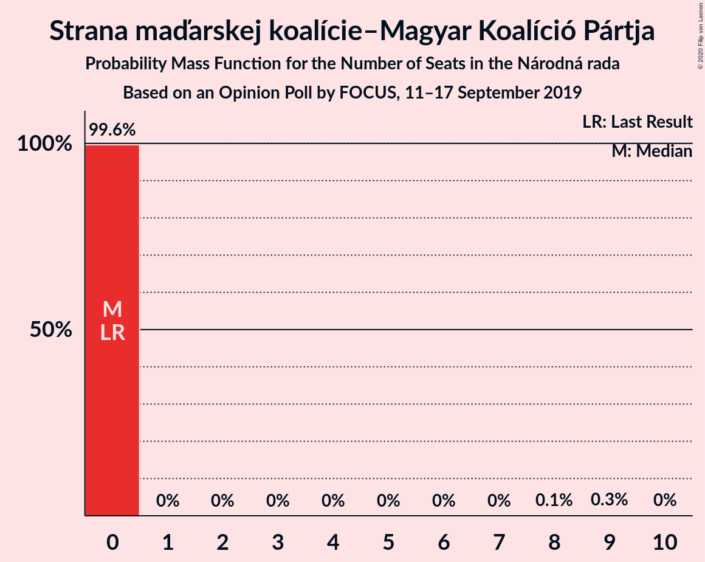

| Number of Seats | Probability | Accumulated | Special Marks |
|:---------------:|:-----------:|:-----------:|:-------------:|
| 0 | 99.6% | 100% | Last Result, Median |
| 1 | 0% | 0.4% |  |
| 2 | 0% | 0.4% |  |
| 3 | 0% | 0.4% |  |
| 4 | 0% | 0.4% |  |
| 5 | 0% | 0.4% |  |
| 6 | 0% | 0.4% |  |
| 7 | 0% | 0.4% |  |
| 8 | 0.1% | 0.4% |  |
| 9 | 0.3% | 0.3% |  |
| 10 | 0% | 0% |  |

### Dobrá voľba

*For a full overview of the results for this party, see the [Dobrá voľba](party-dobrávoľba.html) page.*

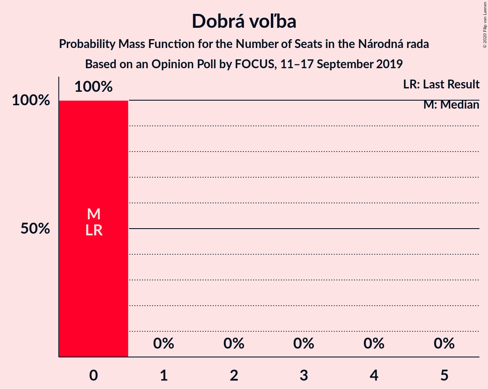

| Number of Seats | Probability | Accumulated | Special Marks |
|:---------------:|:-----------:|:-----------:|:-------------:|
| 0 | 100% | 100% | Last Result, Median |

## Coalitions

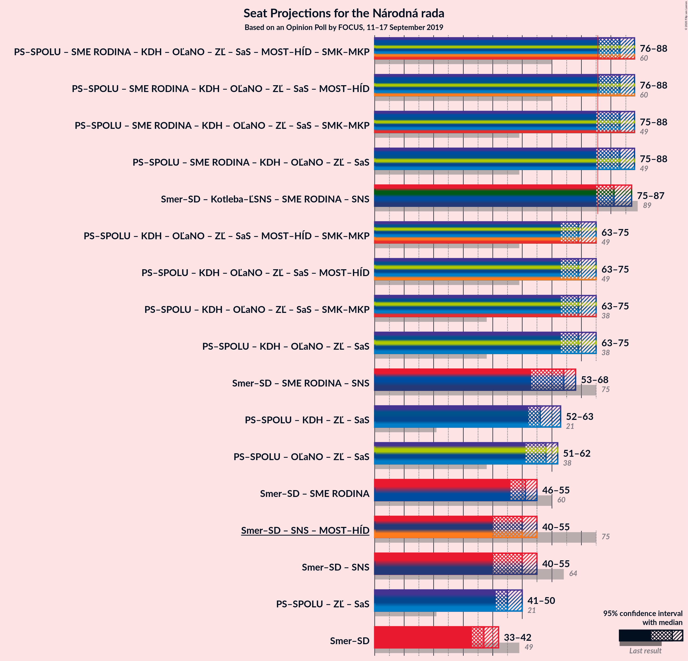

### Confidence Intervals

| Coalition | Last Result | Median | Majority? | 80% Confidence Interval | 90% Confidence Interval | 95% Confidence Interval | 99% Confidence Interval |
|:---------:|:-----------:|:------:|:---------:|:-----------------------:|:-----------------------:|:-----------------------:|:-----------------------:|
| Progresívne Slovensko–SPOLU–Občianska Demokracia – SME RODINA – Kresťanskodemokratické hnutie – OBYČAJNÍ ĽUDIA a nezávislé osobnosti – Za ľudí – Sloboda a Solidarita – MOST–HÍD – Strana maďarskej koalície–Magyar Koalíció Pártja | 60 | 83 | 98% | 78–88 | 78–88 | 76–88 | 71–90 |
| Progresívne Slovensko–SPOLU–Občianska Demokracia – SME RODINA – Kresťanskodemokratické hnutie – OBYČAJNÍ ĽUDIA a nezávislé osobnosti – Za ľudí – Sloboda a Solidarita – MOST–HÍD | 60 | 83 | 98% | 78–88 | 78–88 | 76–88 | 71–90 |
| Progresívne Slovensko–SPOLU–Občianska Demokracia – SME RODINA – Kresťanskodemokratické hnutie – OBYČAJNÍ ĽUDIA a nezávislé osobnosti – Za ľudí – Sloboda a Solidarita – Strana maďarskej koalície–Magyar Koalíció Pártja | 49 | 83 | 97% | 78–88 | 77–88 | 75–88 | 71–89 |
| Progresívne Slovensko–SPOLU–Občianska Demokracia – SME RODINA – Kresťanskodemokratické hnutie – OBYČAJNÍ ĽUDIA a nezávislé osobnosti – Za ľudí – Sloboda a Solidarita | 49 | 83 | 97% | 78–88 | 77–88 | 75–88 | 71–89 |
| SMER–sociálna demokracia – Kotleba–Ľudová strana Naše Slovensko – SME RODINA – Slovenská národná strana | 89 | 81 | 89% | 75–83 | 75–84 | 75–87 | 71–92 |
| Progresívne Slovensko–SPOLU–Občianska Demokracia – Kresťanskodemokratické hnutie – OBYČAJNÍ ĽUDIA a nezávislé osobnosti – Za ľudí – Sloboda a Solidarita – MOST–HÍD – Strana maďarskej koalície–Magyar Koalíció Pártja | 49 | 69 | 2% | 67–75 | 66–75 | 63–75 | 58–79 |
| Progresívne Slovensko–SPOLU–Občianska Demokracia – Kresťanskodemokratické hnutie – OBYČAJNÍ ĽUDIA a nezávislé osobnosti – Za ľudí – Sloboda a Solidarita – MOST–HÍD | 49 | 69 | 1.5% | 67–75 | 66–75 | 63–75 | 58–78 |
| Progresívne Slovensko–SPOLU–Občianska Demokracia – Kresťanskodemokratické hnutie – OBYČAJNÍ ĽUDIA a nezávislé osobnosti – Za ľudí – Sloboda a Solidarita – Strana maďarskej koalície–Magyar Koalíció Pártja | 38 | 69 | 0.6% | 67–74 | 65–75 | 63–75 | 58–76 |
| Progresívne Slovensko–SPOLU–Občianska Demokracia – Kresťanskodemokratické hnutie – OBYČAJNÍ ĽUDIA a nezávislé osobnosti – Za ľudí – Sloboda a Solidarita | 38 | 69 | 0.5% | 67–74 | 65–75 | 63–75 | 58–75 |
| SMER–sociálna demokracia – SME RODINA – Slovenská národná strana | 75 | 64 | 0% | 55–65 | 53–66 | 53–68 | 53–73 |
| Progresívne Slovensko–SPOLU–Občianska Demokracia – Kresťanskodemokratické hnutie – Za ľudí – Sloboda a Solidarita | 21 | 56 | 0% | 54–63 | 53–63 | 52–63 | 47–65 |
| Progresívne Slovensko–SPOLU–Občianska Demokracia – OBYČAJNÍ ĽUDIA a nezávislé osobnosti – Za ľudí – Sloboda a Solidarita | 38 | 58 | 0% | 55–62 | 53–62 | 51–62 | 45–63 |
| SMER–sociálna demokracia – SME RODINA | 60 | 51 | 0% | 47–53 | 46–55 | 46–55 | 43–58 |
| SMER–sociálna demokracia – Slovenská národná strana – MOST–HÍD | 75 | 50 | 0% | 44–53 | 40–55 | 40–55 | 40–61 |
| SMER–sociálna demokracia – Slovenská národná strana | 64 | 50 | 0% | 44–52 | 40–53 | 40–55 | 40–61 |
| Progresívne Slovensko–SPOLU–Občianska Demokracia – Za ľudí – Sloboda a Solidarita | 21 | 45 | 0% | 43–50 | 42–50 | 41–50 | 33–52 |
| SMER–sociálna demokracia | 49 | 37 | 0% | 35–41 | 34–42 | 33–42 | 32–46 |

### Progresívne Slovensko–SPOLU–Občianska Demokracia – SME RODINA – Kresťanskodemokratické hnutie – OBYČAJNÍ ĽUDIA a nezávislé osobnosti – Za ľudí – Sloboda a Solidarita – MOST–HÍD – Strana maďarskej koalície–Magyar Koalíció Pártja

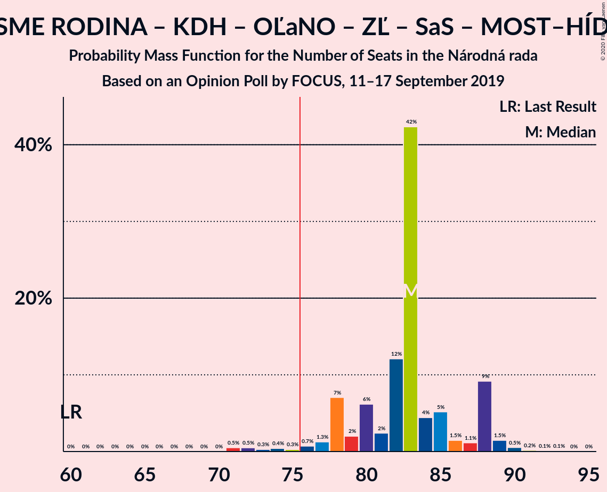

| Number of Seats | Probability | Accumulated | Special Marks |
|:---------------:|:-----------:|:-----------:|:-------------:|
| 60 | 0% | 100% | Last Result |
| 61 | 0% | 100% |  |
| 62 | 0% | 100% |  |
| 63 | 0% | 100% |  |
| 64 | 0% | 100% |  |
| 65 | 0% | 100% |  |
| 66 | 0% | 100% |  |
| 67 | 0% | 100% |  |
| 68 | 0% | 100% |  |
| 69 | 0% | 100% |  |
| 70 | 0% | 100% |  |
| 71 | 0.5% | 99.9% |  |
| 72 | 0.5% | 99.4% |  |
| 73 | 0.3% | 98.9% |  |
| 74 | 0.4% | 98.6% |  |
| 75 | 0.3% | 98% |  |
| 76 | 0.7% | 98% | Majority |
| 77 | 1.3% | 97% |  |
| 78 | 7% | 96% |  |
| 79 | 2% | 89% |  |
| 80 | 6% | 87% |  |
| 81 | 2% | 81% |  |
| 82 | 12% | 78% | Median |
| 83 | 42% | 66% |  |
| 84 | 4% | 24% |  |
| 85 | 5% | 19% |  |
| 86 | 1.5% | 14% |  |
| 87 | 1.1% | 13% |  |
| 88 | 9% | 12% |  |
| 89 | 1.5% | 2% |  |
| 90 | 0.5% | 1.0% |  |
| 91 | 0.2% | 0.4% |  |
| 92 | 0.1% | 0.2% |  |
| 93 | 0.1% | 0.1% |  |
| 94 | 0% | 0% |  |

### Progresívne Slovensko–SPOLU–Občianska Demokracia – SME RODINA – Kresťanskodemokratické hnutie – OBYČAJNÍ ĽUDIA a nezávislé osobnosti – Za ľudí – Sloboda a Solidarita – MOST–HÍD

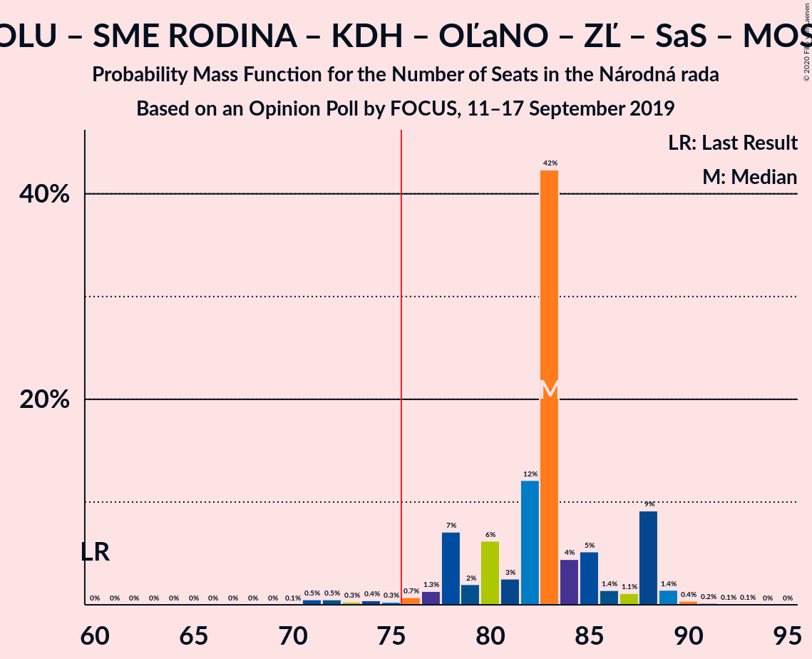

| Number of Seats | Probability | Accumulated | Special Marks |
|:---------------:|:-----------:|:-----------:|:-------------:|
| 60 | 0% | 100% | Last Result |
| 61 | 0% | 100% |  |
| 62 | 0% | 100% |  |
| 63 | 0% | 100% |  |
| 64 | 0% | 100% |  |
| 65 | 0% | 100% |  |
| 66 | 0% | 100% |  |
| 67 | 0% | 100% |  |
| 68 | 0% | 100% |  |
| 69 | 0% | 100% |  |
| 70 | 0.1% | 100% |  |
| 71 | 0.5% | 99.9% |  |
| 72 | 0.5% | 99.4% |  |
| 73 | 0.3% | 98.9% |  |
| 74 | 0.4% | 98.6% |  |
| 75 | 0.3% | 98% |  |
| 76 | 0.7% | 98% | Majority |
| 77 | 1.3% | 97% |  |
| 78 | 7% | 96% |  |
| 79 | 2% | 89% |  |
| 80 | 6% | 87% |  |
| 81 | 3% | 81% |  |
| 82 | 12% | 78% | Median |
| 83 | 42% | 66% |  |
| 84 | 4% | 24% |  |
| 85 | 5% | 19% |  |
| 86 | 1.4% | 14% |  |
| 87 | 1.1% | 13% |  |
| 88 | 9% | 11% |  |
| 89 | 1.4% | 2% |  |
| 90 | 0.4% | 0.8% |  |
| 91 | 0.2% | 0.4% |  |
| 92 | 0.1% | 0.2% |  |
| 93 | 0.1% | 0.1% |  |
| 94 | 0% | 0% |  |

### Progresívne Slovensko–SPOLU–Občianska Demokracia – SME RODINA – Kresťanskodemokratické hnutie – OBYČAJNÍ ĽUDIA a nezávislé osobnosti – Za ľudí – Sloboda a Solidarita – Strana maďarskej koalície–Magyar Koalíció Pártja

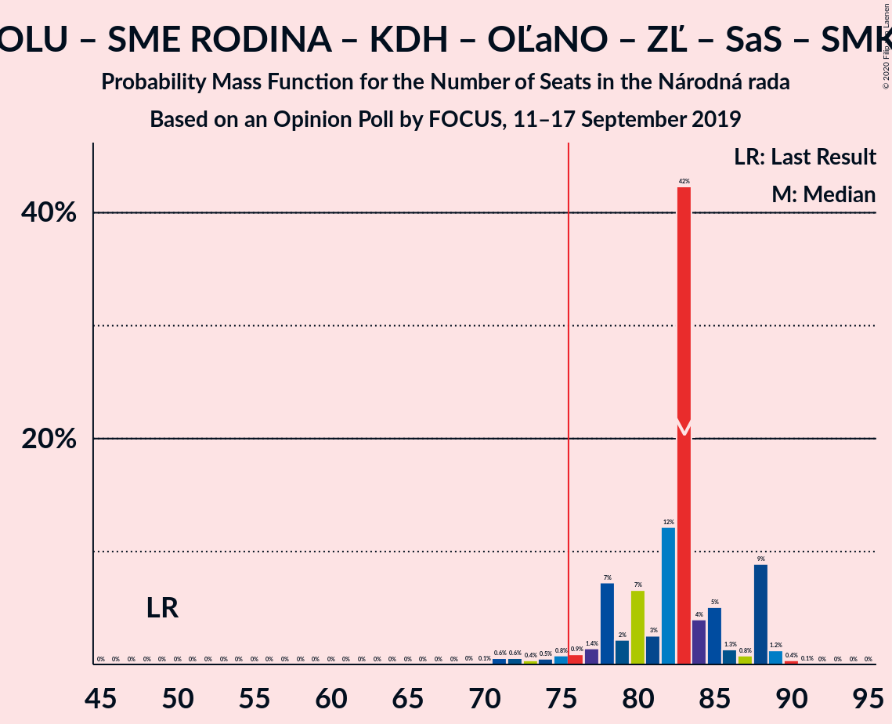

| Number of Seats | Probability | Accumulated | Special Marks |
|:---------------:|:-----------:|:-----------:|:-------------:|
| 49 | 0% | 100% | Last Result |
| 50 | 0% | 100% |  |
| 51 | 0% | 100% |  |
| 52 | 0% | 100% |  |
| 53 | 0% | 100% |  |
| 54 | 0% | 100% |  |
| 55 | 0% | 100% |  |
| 56 | 0% | 100% |  |
| 57 | 0% | 100% |  |
| 58 | 0% | 100% |  |
| 59 | 0% | 100% |  |
| 60 | 0% | 100% |  |
| 61 | 0% | 100% |  |
| 62 | 0% | 100% |  |
| 63 | 0% | 100% |  |
| 64 | 0% | 100% |  |
| 65 | 0% | 100% |  |
| 66 | 0% | 100% |  |
| 67 | 0% | 100% |  |
| 68 | 0% | 100% |  |
| 69 | 0% | 100% |  |
| 70 | 0.1% | 99.9% |  |
| 71 | 0.6% | 99.8% |  |
| 72 | 0.6% | 99.3% |  |
| 73 | 0.4% | 98.7% |  |
| 74 | 0.5% | 98% |  |
| 75 | 0.8% | 98% |  |
| 76 | 0.9% | 97% | Majority |
| 77 | 1.4% | 96% |  |
| 78 | 7% | 95% |  |
| 79 | 2% | 88% |  |
| 80 | 7% | 85% |  |
| 81 | 3% | 79% |  |
| 82 | 12% | 76% | Median |
| 83 | 42% | 64% |  |
| 84 | 4% | 22% |  |
| 85 | 5% | 18% |  |
| 86 | 1.3% | 13% |  |
| 87 | 0.8% | 11% |  |
| 88 | 9% | 11% |  |
| 89 | 1.2% | 2% |  |
| 90 | 0.4% | 0.4% |  |
| 91 | 0.1% | 0.1% |  |
| 92 | 0% | 0% |  |

### Progresívne Slovensko–SPOLU–Občianska Demokracia – SME RODINA – Kresťanskodemokratické hnutie – OBYČAJNÍ ĽUDIA a nezávislé osobnosti – Za ľudí – Sloboda a Solidarita

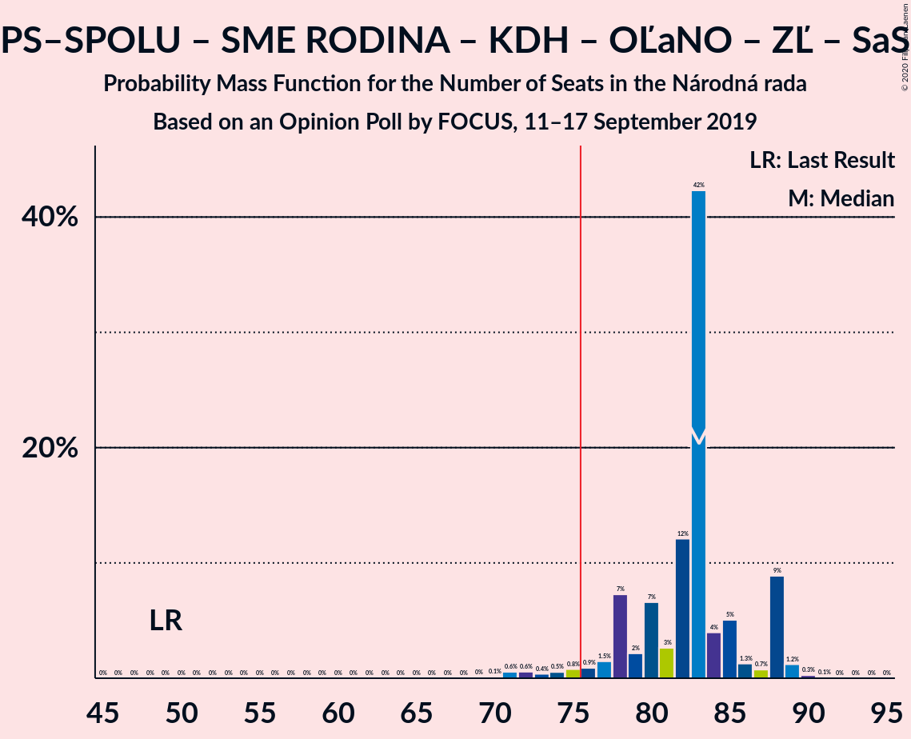

| Number of Seats | Probability | Accumulated | Special Marks |
|:---------------:|:-----------:|:-----------:|:-------------:|
| 49 | 0% | 100% | Last Result |
| 50 | 0% | 100% |  |
| 51 | 0% | 100% |  |
| 52 | 0% | 100% |  |
| 53 | 0% | 100% |  |
| 54 | 0% | 100% |  |
| 55 | 0% | 100% |  |
| 56 | 0% | 100% |  |
| 57 | 0% | 100% |  |
| 58 | 0% | 100% |  |
| 59 | 0% | 100% |  |
| 60 | 0% | 100% |  |
| 61 | 0% | 100% |  |
| 62 | 0% | 100% |  |
| 63 | 0% | 100% |  |
| 64 | 0% | 100% |  |
| 65 | 0% | 100% |  |
| 66 | 0% | 100% |  |
| 67 | 0% | 100% |  |
| 68 | 0% | 100% |  |
| 69 | 0% | 100% |  |
| 70 | 0.1% | 99.9% |  |
| 71 | 0.6% | 99.8% |  |
| 72 | 0.6% | 99.2% |  |
| 73 | 0.4% | 98.7% |  |
| 74 | 0.5% | 98% |  |
| 75 | 0.8% | 98% |  |
| 76 | 0.9% | 97% | Majority |
| 77 | 1.5% | 96% |  |
| 78 | 7% | 95% |  |
| 79 | 2% | 87% |  |
| 80 | 7% | 85% |  |
| 81 | 3% | 79% |  |
| 82 | 12% | 76% | Median |
| 83 | 42% | 64% |  |
| 84 | 4% | 21% |  |
| 85 | 5% | 18% |  |
| 86 | 1.3% | 12% |  |
| 87 | 0.7% | 11% |  |
| 88 | 9% | 10% |  |
| 89 | 1.2% | 2% |  |
| 90 | 0.3% | 0.3% |  |
| 91 | 0.1% | 0.1% |  |
| 92 | 0% | 0% |  |

### SMER–sociálna demokracia – Kotleba–Ľudová strana Naše Slovensko – SME RODINA – Slovenská národná strana

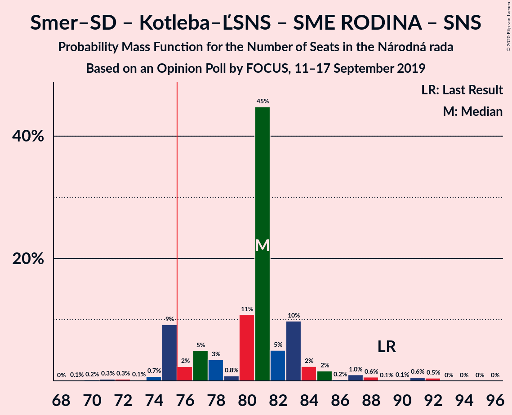

| Number of Seats | Probability | Accumulated | Special Marks |
|:---------------:|:-----------:|:-----------:|:-------------:|
| 69 | 0.1% | 100% |  |
| 70 | 0.2% | 99.9% |  |
| 71 | 0.3% | 99.7% |  |
| 72 | 0.3% | 99.4% |  |
| 73 | 0.1% | 99.1% |  |
| 74 | 0.7% | 99.0% |  |
| 75 | 9% | 98% |  |
| 76 | 2% | 89% | Majority |
| 77 | 5% | 87% |  |
| 78 | 3% | 82% |  |
| 79 | 0.8% | 78% |  |
| 80 | 11% | 77% | Median |
| 81 | 45% | 67% |  |
| 82 | 5% | 22% |  |
| 83 | 10% | 17% |  |
| 84 | 2% | 7% |  |
| 85 | 2% | 5% |  |
| 86 | 0.2% | 3% |  |
| 87 | 1.0% | 3% |  |
| 88 | 0.6% | 2% |  |
| 89 | 0.1% | 1.3% | Last Result |
| 90 | 0.1% | 1.2% |  |
| 91 | 0.6% | 1.1% |  |
| 92 | 0.5% | 0.5% |  |
| 93 | 0% | 0.1% |  |
| 94 | 0% | 0.1% |  |
| 95 | 0% | 0% |  |

### Progresívne Slovensko–SPOLU–Občianska Demokracia – Kresťanskodemokratické hnutie – OBYČAJNÍ ĽUDIA a nezávislé osobnosti – Za ľudí – Sloboda a Solidarita – MOST–HÍD – Strana maďarskej koalície–Magyar Koalíció Pártja

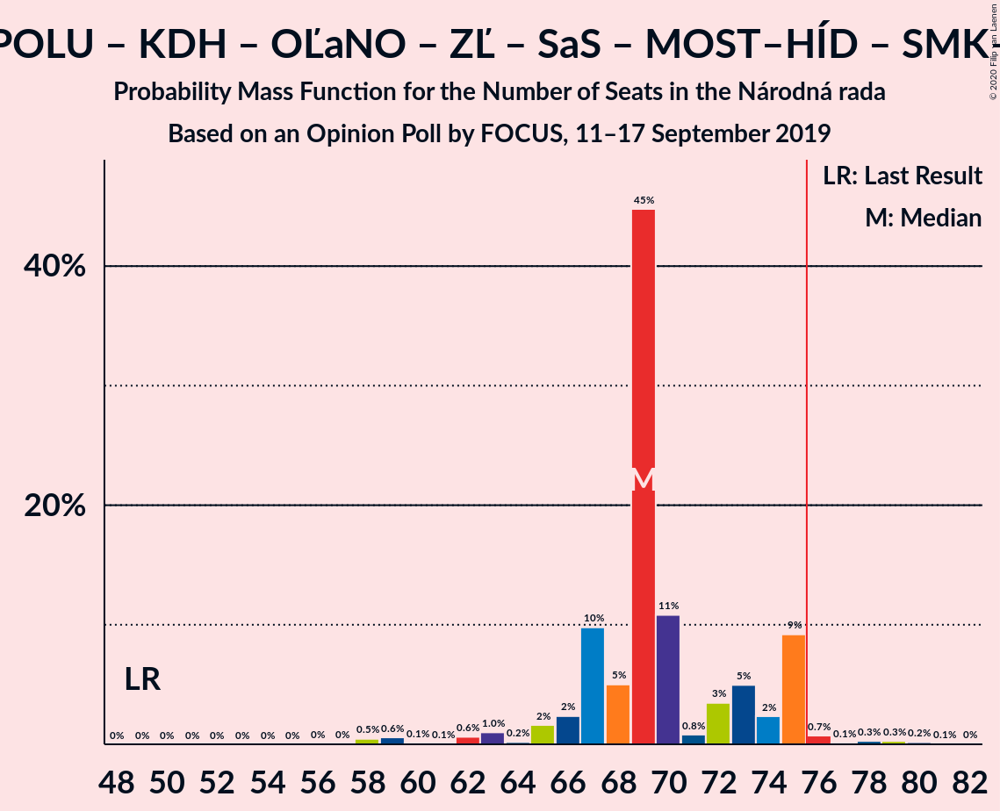

| Number of Seats | Probability | Accumulated | Special Marks |
|:---------------:|:-----------:|:-----------:|:-------------:|
| 49 | 0% | 100% | Last Result |
| 50 | 0% | 100% |  |
| 51 | 0% | 100% |  |
| 52 | 0% | 100% |  |
| 53 | 0% | 100% |  |
| 54 | 0% | 100% |  |
| 55 | 0% | 100% |  |
| 56 | 0% | 100% |  |
| 57 | 0% | 99.9% |  |
| 58 | 0.5% | 99.9% |  |
| 59 | 0.6% | 99.5% |  |
| 60 | 0.1% | 98.9% |  |
| 61 | 0.1% | 98.8% |  |
| 62 | 0.6% | 98.7% |  |
| 63 | 1.0% | 98% |  |
| 64 | 0.2% | 97% |  |
| 65 | 2% | 97% |  |
| 66 | 2% | 95% |  |
| 67 | 10% | 93% |  |
| 68 | 5% | 83% |  |
| 69 | 45% | 78% | Median |
| 70 | 11% | 33% |  |
| 71 | 0.8% | 23% |  |
| 72 | 3% | 22% |  |
| 73 | 5% | 18% |  |
| 74 | 2% | 13% |  |
| 75 | 9% | 11% |  |
| 76 | 0.7% | 2% | Majority |
| 77 | 0.1% | 1.0% |  |
| 78 | 0.3% | 0.9% |  |
| 79 | 0.3% | 0.6% |  |
| 80 | 0.2% | 0.3% |  |
| 81 | 0.1% | 0.1% |  |
| 82 | 0% | 0% |  |

### Progresívne Slovensko–SPOLU–Občianska Demokracia – Kresťanskodemokratické hnutie – OBYČAJNÍ ĽUDIA a nezávislé osobnosti – Za ľudí – Sloboda a Solidarita – MOST–HÍD

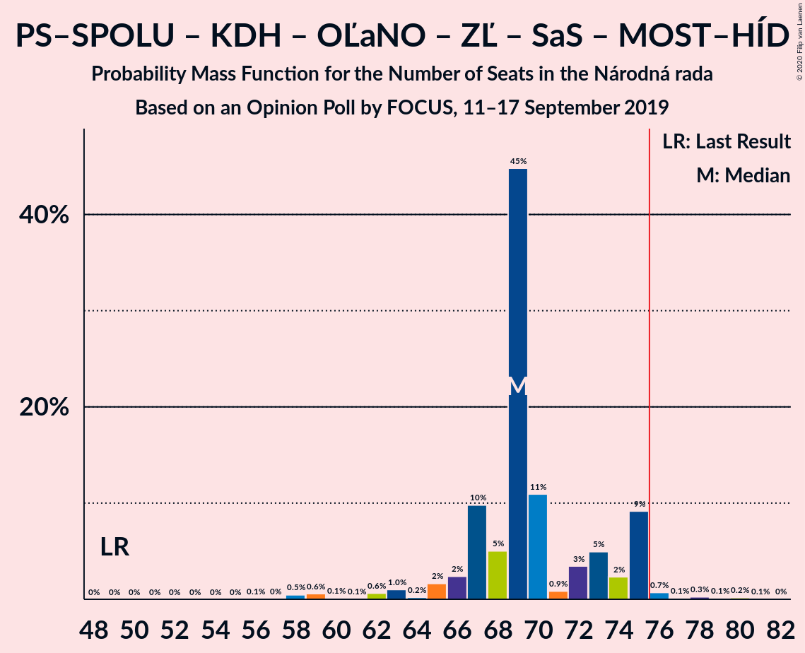

| Number of Seats | Probability | Accumulated | Special Marks |
|:---------------:|:-----------:|:-----------:|:-------------:|
| 49 | 0% | 100% | Last Result |
| 50 | 0% | 100% |  |
| 51 | 0% | 100% |  |
| 52 | 0% | 100% |  |
| 53 | 0% | 100% |  |
| 54 | 0% | 100% |  |
| 55 | 0% | 100% |  |
| 56 | 0.1% | 100% |  |
| 57 | 0% | 99.9% |  |
| 58 | 0.5% | 99.9% |  |
| 59 | 0.6% | 99.5% |  |
| 60 | 0.1% | 98.9% |  |
| 61 | 0.1% | 98.8% |  |
| 62 | 0.6% | 98.7% |  |
| 63 | 1.0% | 98% |  |
| 64 | 0.2% | 97% |  |
| 65 | 2% | 97% |  |
| 66 | 2% | 95% |  |
| 67 | 10% | 93% |  |
| 68 | 5% | 83% |  |
| 69 | 45% | 78% | Median |
| 70 | 11% | 33% |  |
| 71 | 0.9% | 22% |  |
| 72 | 3% | 21% |  |
| 73 | 5% | 18% |  |
| 74 | 2% | 13% |  |
| 75 | 9% | 11% |  |
| 76 | 0.7% | 1.5% | Majority |
| 77 | 0.1% | 0.8% |  |
| 78 | 0.3% | 0.7% |  |
| 79 | 0.1% | 0.4% |  |
| 80 | 0.2% | 0.3% |  |
| 81 | 0.1% | 0.1% |  |
| 82 | 0% | 0% |  |

### Progresívne Slovensko–SPOLU–Občianska Demokracia – Kresťanskodemokratické hnutie – OBYČAJNÍ ĽUDIA a nezávislé osobnosti – Za ľudí – Sloboda a Solidarita – Strana maďarskej koalície–Magyar Koalíció Pártja

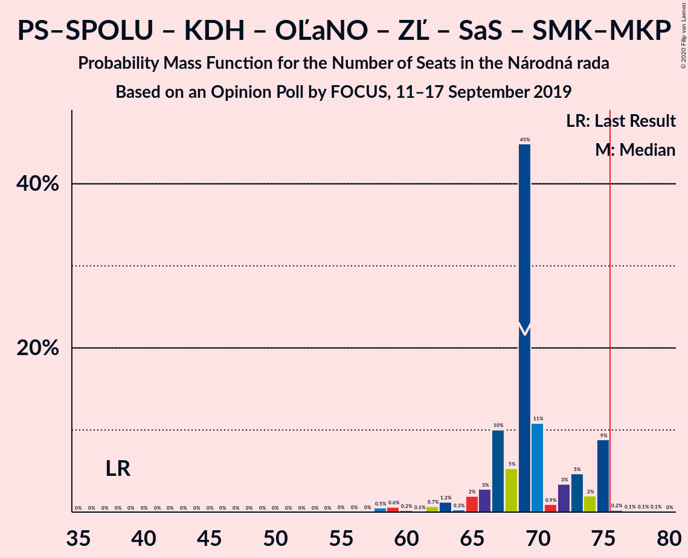

| Number of Seats | Probability | Accumulated | Special Marks |
|:---------------:|:-----------:|:-----------:|:-------------:|
| 38 | 0% | 100% | Last Result |
| 39 | 0% | 100% |  |
| 40 | 0% | 100% |  |
| 41 | 0% | 100% |  |
| 42 | 0% | 100% |  |
| 43 | 0% | 100% |  |
| 44 | 0% | 100% |  |
| 45 | 0% | 100% |  |
| 46 | 0% | 100% |  |
| 47 | 0% | 100% |  |
| 48 | 0% | 100% |  |
| 49 | 0% | 100% |  |
| 50 | 0% | 100% |  |
| 51 | 0% | 100% |  |
| 52 | 0% | 100% |  |
| 53 | 0% | 100% |  |
| 54 | 0% | 100% |  |
| 55 | 0% | 100% |  |
| 56 | 0% | 100% |  |
| 57 | 0% | 99.9% |  |
| 58 | 0.5% | 99.9% |  |
| 59 | 0.6% | 99.4% |  |
| 60 | 0.2% | 98.8% |  |
| 61 | 0.1% | 98.6% |  |
| 62 | 0.7% | 98.5% |  |
| 63 | 1.2% | 98% |  |
| 64 | 0.3% | 97% |  |
| 65 | 2% | 96% |  |
| 66 | 3% | 94% |  |
| 67 | 10% | 92% |  |
| 68 | 5% | 82% |  |
| 69 | 45% | 76% | Median |
| 70 | 11% | 31% |  |
| 71 | 0.9% | 20% |  |
| 72 | 3% | 20% |  |
| 73 | 5% | 16% |  |
| 74 | 2% | 11% |  |
| 75 | 9% | 9% |  |
| 76 | 0.2% | 0.6% | Majority |
| 77 | 0.1% | 0.4% |  |
| 78 | 0.1% | 0.3% |  |
| 79 | 0.1% | 0.2% |  |
| 80 | 0% | 0% |  |

### Progresívne Slovensko–SPOLU–Občianska Demokracia – Kresťanskodemokratické hnutie – OBYČAJNÍ ĽUDIA a nezávislé osobnosti – Za ľudí – Sloboda a Solidarita

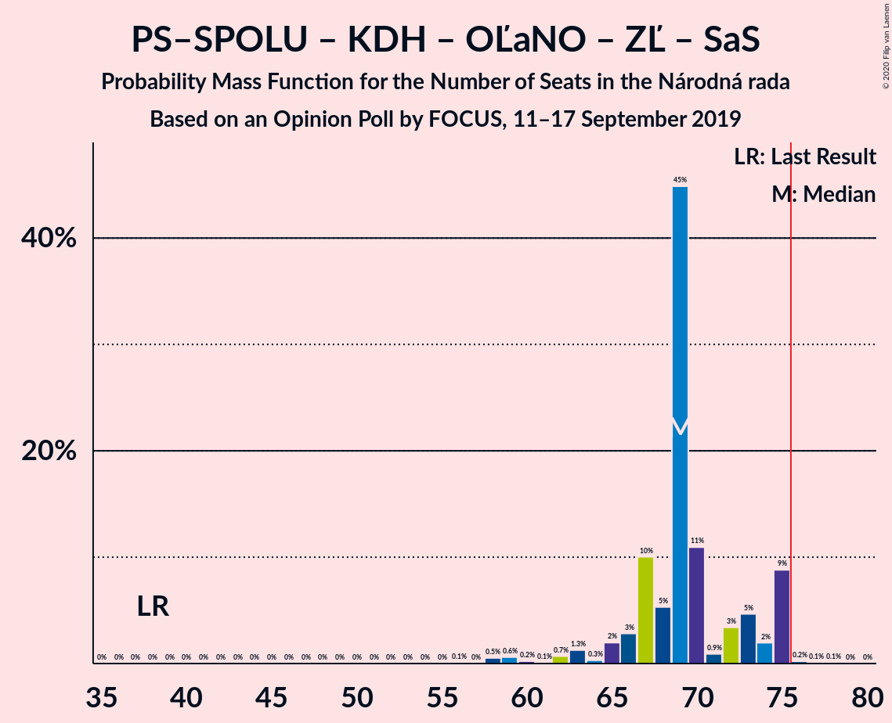

| Number of Seats | Probability | Accumulated | Special Marks |
|:---------------:|:-----------:|:-----------:|:-------------:|
| 38 | 0% | 100% | Last Result |
| 39 | 0% | 100% |  |
| 40 | 0% | 100% |  |
| 41 | 0% | 100% |  |
| 42 | 0% | 100% |  |
| 43 | 0% | 100% |  |
| 44 | 0% | 100% |  |
| 45 | 0% | 100% |  |
| 46 | 0% | 100% |  |
| 47 | 0% | 100% |  |
| 48 | 0% | 100% |  |
| 49 | 0% | 100% |  |
| 50 | 0% | 100% |  |
| 51 | 0% | 100% |  |
| 52 | 0% | 100% |  |
| 53 | 0% | 100% |  |
| 54 | 0% | 100% |  |
| 55 | 0% | 100% |  |
| 56 | 0.1% | 100% |  |
| 57 | 0% | 99.9% |  |
| 58 | 0.5% | 99.9% |  |
| 59 | 0.6% | 99.4% |  |
| 60 | 0.2% | 98.8% |  |
| 61 | 0.1% | 98.5% |  |
| 62 | 0.7% | 98% |  |
| 63 | 1.3% | 98% |  |
| 64 | 0.3% | 96% |  |
| 65 | 2% | 96% |  |
| 66 | 3% | 94% |  |
| 67 | 10% | 91% |  |
| 68 | 5% | 81% |  |
| 69 | 45% | 76% | Median |
| 70 | 11% | 31% |  |
| 71 | 0.9% | 20% |  |
| 72 | 3% | 19% |  |
| 73 | 5% | 16% |  |
| 74 | 2% | 11% |  |
| 75 | 9% | 9% |  |
| 76 | 0.2% | 0.5% | Majority |
| 77 | 0.1% | 0.2% |  |
| 78 | 0.1% | 0.2% |  |
| 79 | 0% | 0.1% |  |
| 80 | 0% | 0% |  |

### SMER–sociálna demokracia – SME RODINA – Slovenská národná strana

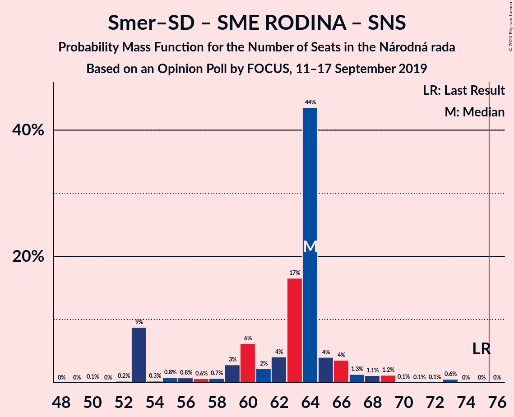

| Number of Seats | Probability | Accumulated | Special Marks |
|:---------------:|:-----------:|:-----------:|:-------------:|
| 50 | 0.1% | 100% |  |
| 51 | 0% | 99.9% |  |
| 52 | 0.2% | 99.8% |  |
| 53 | 9% | 99.6% |  |
| 54 | 0.3% | 91% |  |
| 55 | 0.8% | 91% |  |
| 56 | 0.8% | 90% |  |
| 57 | 0.6% | 89% |  |
| 58 | 0.7% | 88% |  |
| 59 | 3% | 88% |  |
| 60 | 6% | 85% |  |
| 61 | 2% | 79% |  |
| 62 | 4% | 76% |  |
| 63 | 17% | 72% | Median |
| 64 | 44% | 56% |  |
| 65 | 4% | 12% |  |
| 66 | 4% | 8% |  |
| 67 | 1.3% | 5% |  |
| 68 | 1.1% | 3% |  |
| 69 | 1.2% | 2% |  |
| 70 | 0.1% | 0.9% |  |
| 71 | 0.1% | 0.7% |  |
| 72 | 0.1% | 0.6% |  |
| 73 | 0.6% | 0.6% |  |
| 74 | 0% | 0% |  |
| 75 | 0% | 0% | Last Result |

### Progresívne Slovensko–SPOLU–Občianska Demokracia – Kresťanskodemokratické hnutie – Za ľudí – Sloboda a Solidarita

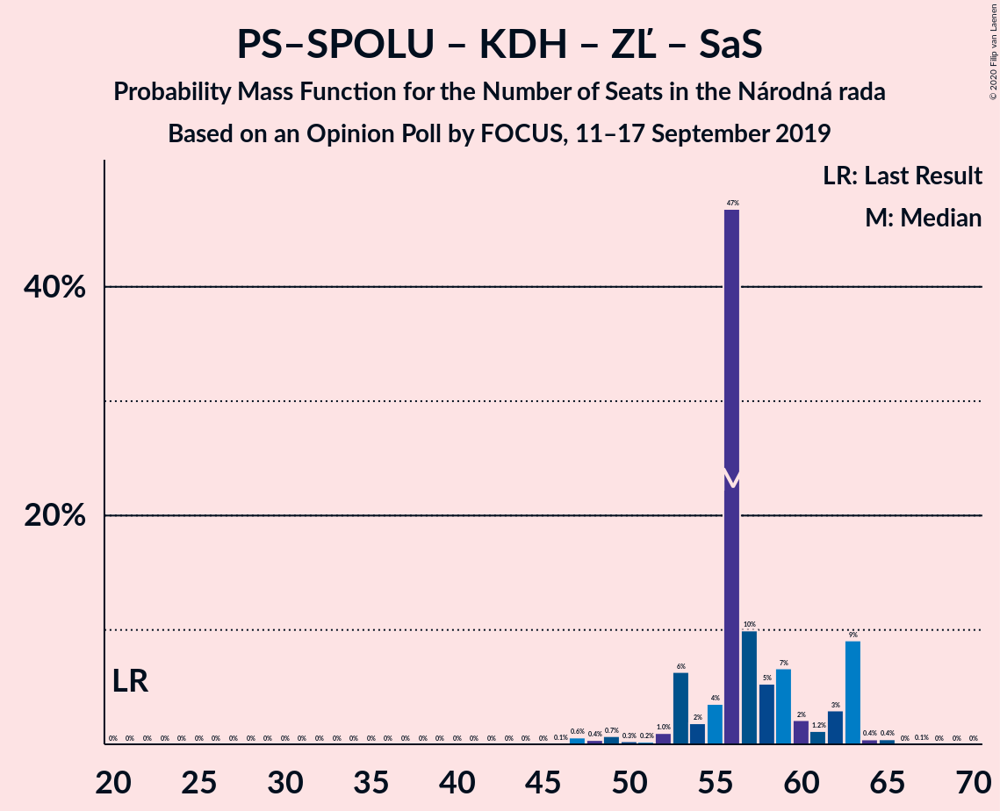

| Number of Seats | Probability | Accumulated | Special Marks |
|:---------------:|:-----------:|:-----------:|:-------------:|
| 21 | 0% | 100% | Last Result |
| 22 | 0% | 100% |  |
| 23 | 0% | 100% |  |
| 24 | 0% | 100% |  |
| 25 | 0% | 100% |  |
| 26 | 0% | 100% |  |
| 27 | 0% | 100% |  |
| 28 | 0% | 100% |  |
| 29 | 0% | 100% |  |
| 30 | 0% | 100% |  |
| 31 | 0% | 100% |  |
| 32 | 0% | 100% |  |
| 33 | 0% | 100% |  |
| 34 | 0% | 100% |  |
| 35 | 0% | 100% |  |
| 36 | 0% | 100% |  |
| 37 | 0% | 100% |  |
| 38 | 0% | 100% |  |
| 39 | 0% | 100% |  |
| 40 | 0% | 100% |  |
| 41 | 0% | 100% |  |
| 42 | 0% | 100% |  |
| 43 | 0% | 100% |  |
| 44 | 0% | 99.9% |  |
| 45 | 0% | 99.9% |  |
| 46 | 0.1% | 99.9% |  |
| 47 | 0.6% | 99.8% |  |
| 48 | 0.4% | 99.2% |  |
| 49 | 0.7% | 98.8% |  |
| 50 | 0.3% | 98% |  |
| 51 | 0.2% | 98% |  |
| 52 | 1.0% | 98% |  |
| 53 | 6% | 97% |  |
| 54 | 2% | 90% |  |
| 55 | 4% | 88% |  |
| 56 | 47% | 85% | Median |
| 57 | 10% | 38% |  |
| 58 | 5% | 28% |  |
| 59 | 7% | 23% |  |
| 60 | 2% | 16% |  |
| 61 | 1.2% | 14% |  |
| 62 | 3% | 13% |  |
| 63 | 9% | 10% |  |
| 64 | 0.4% | 1.0% |  |
| 65 | 0.4% | 0.5% |  |
| 66 | 0% | 0.1% |  |
| 67 | 0.1% | 0.1% |  |
| 68 | 0% | 0% |  |

### Progresívne Slovensko–SPOLU–Občianska Demokracia – OBYČAJNÍ ĽUDIA a nezávislé osobnosti – Za ľudí – Sloboda a Solidarita

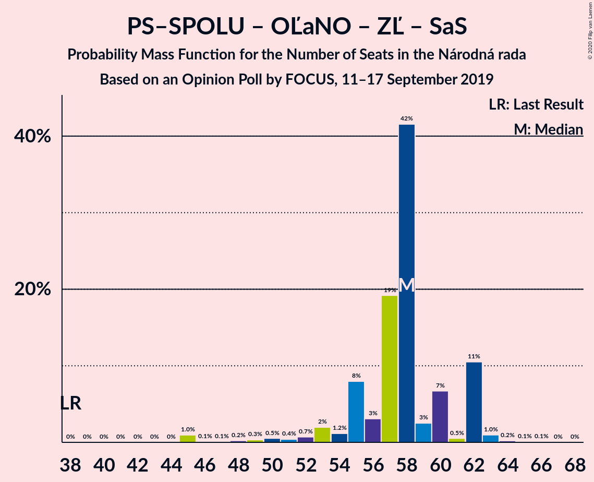

| Number of Seats | Probability | Accumulated | Special Marks |
|:---------------:|:-----------:|:-----------:|:-------------:|
| 38 | 0% | 100% | Last Result |
| 39 | 0% | 100% |  |
| 40 | 0% | 100% |  |
| 41 | 0% | 100% |  |
| 42 | 0% | 100% |  |
| 43 | 0% | 100% |  |
| 44 | 0% | 100% |  |
| 45 | 1.0% | 99.9% |  |
| 46 | 0.1% | 99.0% |  |
| 47 | 0.1% | 98.9% |  |
| 48 | 0.2% | 98.8% |  |
| 49 | 0.3% | 98.6% |  |
| 50 | 0.5% | 98% |  |
| 51 | 0.4% | 98% |  |
| 52 | 0.7% | 97% |  |
| 53 | 2% | 97% |  |
| 54 | 1.2% | 95% |  |
| 55 | 8% | 93% |  |
| 56 | 3% | 85% |  |
| 57 | 19% | 82% |  |
| 58 | 42% | 63% | Median |
| 59 | 3% | 22% |  |
| 60 | 7% | 19% |  |
| 61 | 0.5% | 12% |  |
| 62 | 11% | 12% |  |
| 63 | 1.0% | 1.3% |  |
| 64 | 0.2% | 0.4% |  |
| 65 | 0.1% | 0.2% |  |
| 66 | 0.1% | 0.1% |  |
| 67 | 0% | 0% |  |

### SMER–sociálna demokracia – SME RODINA

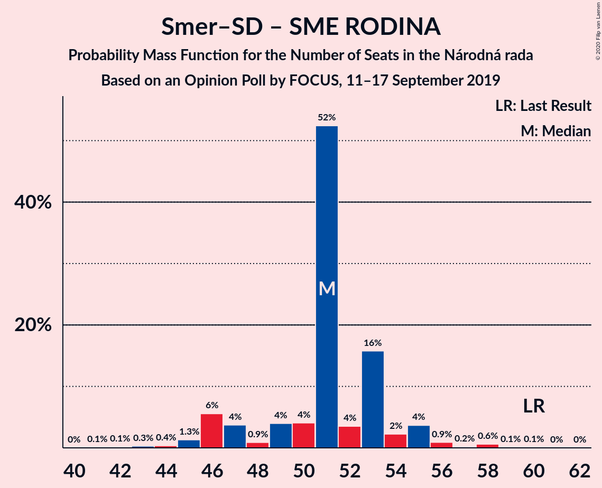

| Number of Seats | Probability | Accumulated | Special Marks |
|:---------------:|:-----------:|:-----------:|:-------------:|
| 40 | 0% | 100% |  |
| 41 | 0.1% | 99.9% |  |
| 42 | 0.1% | 99.9% |  |
| 43 | 0.3% | 99.7% |  |
| 44 | 0.4% | 99.4% |  |
| 45 | 1.3% | 99.1% |  |
| 46 | 6% | 98% |  |
| 47 | 4% | 92% |  |
| 48 | 0.9% | 88% |  |
| 49 | 4% | 88% |  |
| 50 | 4% | 84% | Median |
| 51 | 52% | 80% |  |
| 52 | 4% | 27% |  |
| 53 | 16% | 24% |  |
| 54 | 2% | 8% |  |
| 55 | 4% | 6% |  |
| 56 | 0.9% | 2% |  |
| 57 | 0.2% | 1.0% |  |
| 58 | 0.6% | 0.8% |  |
| 59 | 0.1% | 0.2% |  |
| 60 | 0.1% | 0.1% | Last Result |
| 61 | 0% | 0% |  |

### SMER–sociálna demokracia – Slovenská národná strana – MOST–HÍD

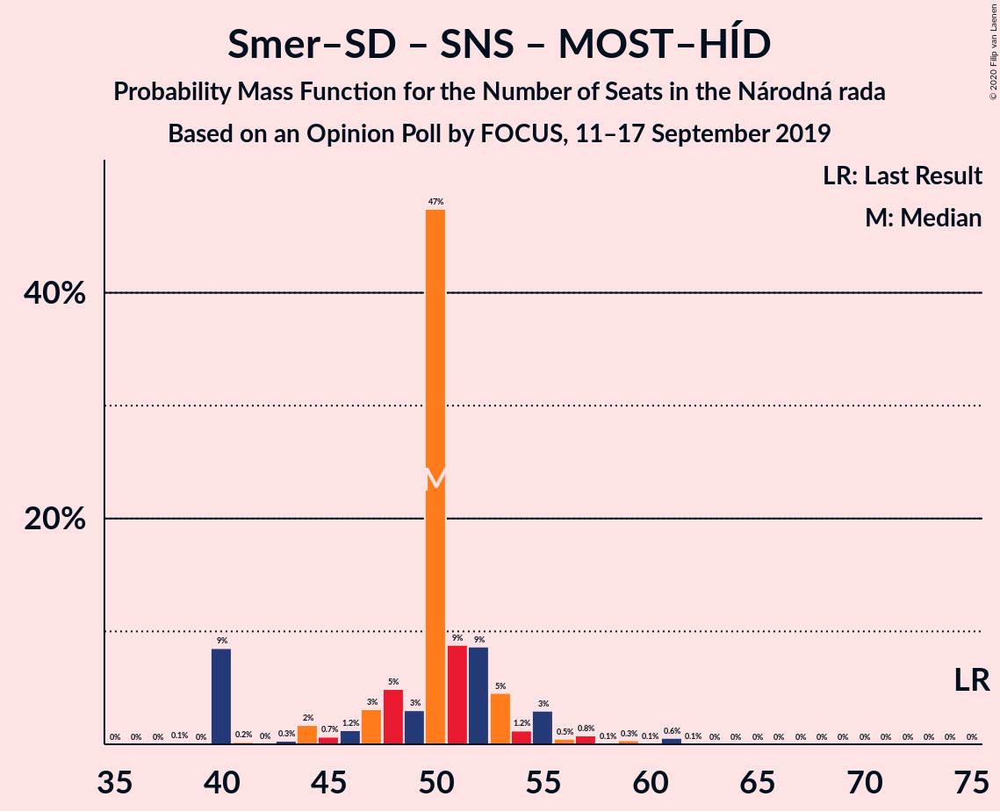

| Number of Seats | Probability | Accumulated | Special Marks |
|:---------------:|:-----------:|:-----------:|:-------------:|
| 38 | 0.1% | 100% |  |
| 39 | 0% | 99.8% |  |
| 40 | 9% | 99.8% |  |
| 41 | 0.2% | 91% |  |
| 42 | 0% | 91% |  |
| 43 | 0.3% | 91% |  |
| 44 | 2% | 91% |  |
| 45 | 0.7% | 89% |  |
| 46 | 1.2% | 88% |  |
| 47 | 3% | 87% |  |
| 48 | 5% | 84% |  |
| 49 | 3% | 79% |  |
| 50 | 47% | 76% | Median |
| 51 | 9% | 29% |  |
| 52 | 9% | 20% |  |
| 53 | 5% | 11% |  |
| 54 | 1.2% | 7% |  |
| 55 | 3% | 5% |  |
| 56 | 0.5% | 2% |  |
| 57 | 0.8% | 2% |  |
| 58 | 0.1% | 1.2% |  |
| 59 | 0.3% | 1.1% |  |
| 60 | 0.1% | 0.8% |  |
| 61 | 0.6% | 0.7% |  |
| 62 | 0.1% | 0.1% |  |
| 63 | 0% | 0% |  |
| 64 | 0% | 0% |  |
| 65 | 0% | 0% |  |
| 66 | 0% | 0% |  |
| 67 | 0% | 0% |  |
| 68 | 0% | 0% |  |
| 69 | 0% | 0% |  |
| 70 | 0% | 0% |  |
| 71 | 0% | 0% |  |
| 72 | 0% | 0% |  |
| 73 | 0% | 0% |  |
| 74 | 0% | 0% |  |
| 75 | 0% | 0% | Last Result |

### SMER–sociálna demokracia – Slovenská národná strana

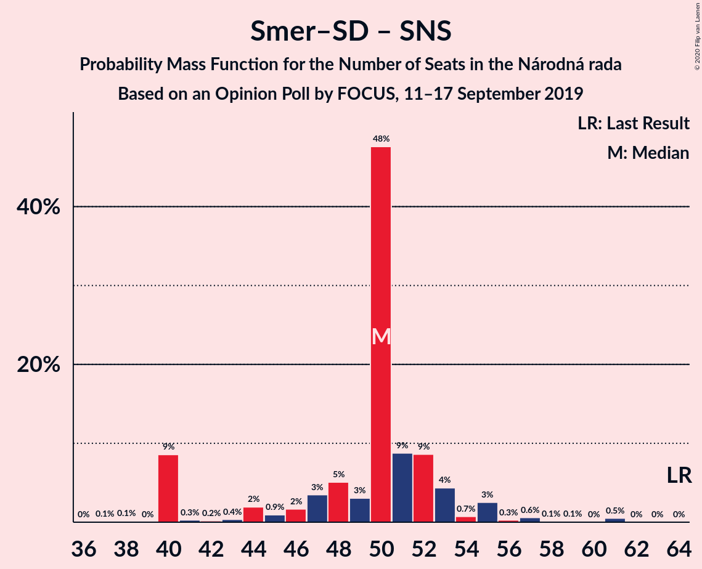

| Number of Seats | Probability | Accumulated | Special Marks |
|:---------------:|:-----------:|:-----------:|:-------------:|
| 37 | 0.1% | 100% |  |
| 38 | 0.1% | 99.9% |  |
| 39 | 0% | 99.7% |  |
| 40 | 9% | 99.7% |  |
| 41 | 0.3% | 91% |  |
| 42 | 0.2% | 91% |  |
| 43 | 0.4% | 91% |  |
| 44 | 2% | 90% |  |
| 45 | 0.9% | 88% |  |
| 46 | 2% | 87% |  |
| 47 | 3% | 86% |  |
| 48 | 5% | 82% |  |
| 49 | 3% | 77% |  |
| 50 | 48% | 74% | Median |
| 51 | 9% | 27% |  |
| 52 | 9% | 18% |  |
| 53 | 4% | 9% |  |
| 54 | 0.7% | 5% |  |
| 55 | 3% | 4% |  |
| 56 | 0.3% | 2% |  |
| 57 | 0.6% | 1.3% |  |
| 58 | 0.1% | 0.7% |  |
| 59 | 0.1% | 0.6% |  |
| 60 | 0% | 0.6% |  |
| 61 | 0.5% | 0.5% |  |
| 62 | 0% | 0% |  |
| 63 | 0% | 0% |  |
| 64 | 0% | 0% | Last Result |

### Progresívne Slovensko–SPOLU–Občianska Demokracia – Za ľudí – Sloboda a Solidarita

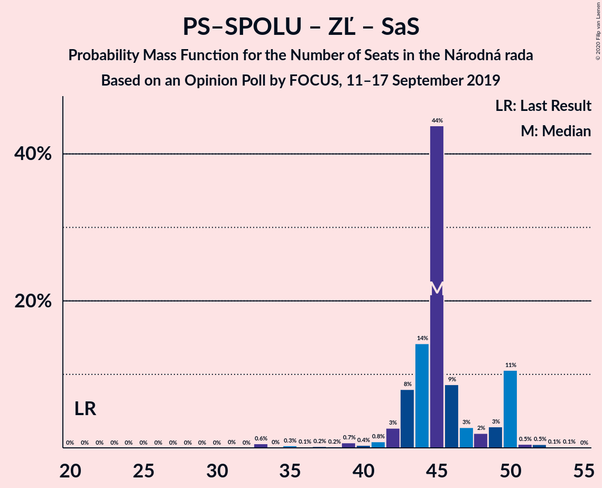

| Number of Seats | Probability | Accumulated | Special Marks |
|:---------------:|:-----------:|:-----------:|:-------------:|
| 21 | 0% | 100% | Last Result |
| 22 | 0% | 100% |  |
| 23 | 0% | 100% |  |
| 24 | 0% | 100% |  |
| 25 | 0% | 100% |  |
| 26 | 0% | 100% |  |
| 27 | 0% | 100% |  |
| 28 | 0% | 100% |  |
| 29 | 0% | 100% |  |
| 30 | 0% | 100% |  |
| 31 | 0% | 100% |  |
| 32 | 0% | 100% |  |
| 33 | 0.6% | 99.9% |  |
| 34 | 0% | 99.4% |  |
| 35 | 0.3% | 99.3% |  |
| 36 | 0.1% | 99.0% |  |
| 37 | 0.2% | 98.9% |  |
| 38 | 0.2% | 98.7% |  |
| 39 | 0.7% | 98.6% |  |
| 40 | 0.4% | 98% |  |
| 41 | 0.8% | 98% |  |
| 42 | 3% | 97% |  |
| 43 | 8% | 94% |  |
| 44 | 14% | 86% |  |
| 45 | 44% | 72% | Median |
| 46 | 9% | 28% |  |
| 47 | 3% | 19% |  |
| 48 | 2% | 17% |  |
| 49 | 3% | 15% |  |
| 50 | 11% | 12% |  |
| 51 | 0.5% | 1.2% |  |
| 52 | 0.5% | 0.7% |  |
| 53 | 0.1% | 0.2% |  |
| 54 | 0.1% | 0.1% |  |
| 55 | 0% | 0% |  |

### SMER–sociálna demokracia

| Number of Seats | Probability | Accumulated | Special Marks |
|:---------------:|:-----------:|:-----------:|:-------------:|
| 29 | 0.1% | 100% |  |
| 30 | 0.1% | 99.9% |  |
| 31 | 0.3% | 99.9% |  |
| 32 | 0.8% | 99.6% |  |
| 33 | 2% | 98.8% |  |
| 34 | 6% | 97% |  |
| 35 | 4% | 91% |  |
| 36 | 1.2% | 87% |  |
| 37 | 42% | 86% | Median |
| 38 | 11% | 44% |  |
| 39 | 9% | 33% |  |
| 40 | 11% | 24% |  |
| 41 | 3% | 12% |  |
| 42 | 7% | 9% |  |
| 43 | 1.1% | 2% |  |
| 44 | 0.2% | 0.9% |  |
| 45 | 0.1% | 0.7% |  |
| 46 | 0.5% | 0.6% |  |
| 47 | 0% | 0% |  |
| 48 | 0% | 0% |  |
| 49 | 0% | 0% | Last Result |

## Technical Information

### Opinion Poll

+ **Polling firm:** FOCUS
+ **Commissioner(s):** —
+ **Fieldwork period:** 11–17 September 2019

### Calculations

+ **Sample size:** 1027
+ **Simulations done:** 1,048,576
+ **Error estimate:** 1.55%

