# Opinion Poll by AKO, 18–25 September 2019

<a href="#voting-intentions">Voting Intentions</a> | <a href="#seats">Seats</a> | <a href="#coalitions">Coalitions</a> | <a href="#technical-information">Technical Information</a>

## Voting Intentions

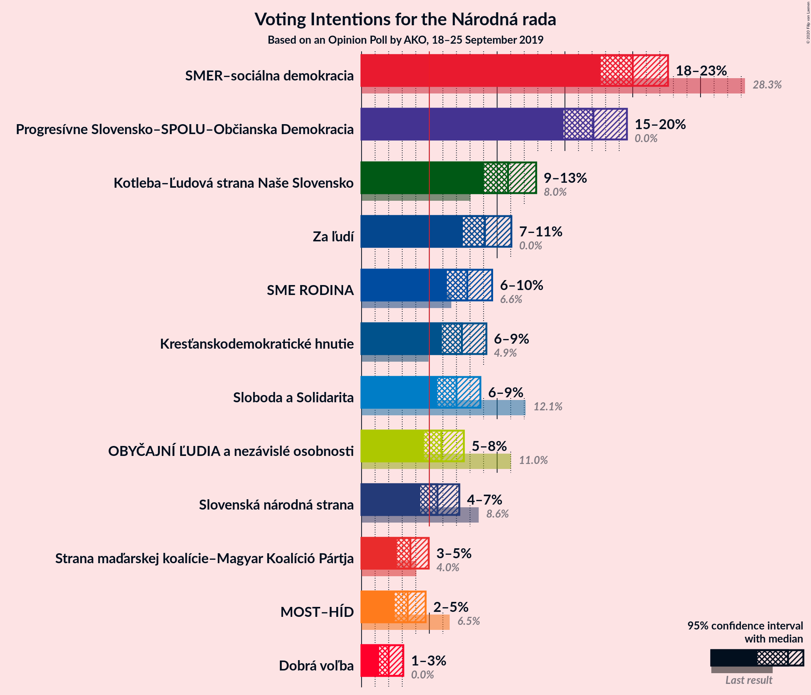

### Confidence Intervals

| Party | Last Result | Poll Result | 80% Confidence Interval | 90% Confidence Interval | 95% Confidence Interval | 99% Confidence Interval |
|:-----:|:-----------:|:-----------:|:-----------------------:|:-----------------------:|:-----------------------:|:-----------------------:|
| SMER–sociálna demokracia | 28.3% | 20.0% | 18.4–21.7% |18.0–22.2% |17.6–22.6% |16.9–23.4% |
| Progresívne Slovensko–SPOLU–Občianska Demokracia | 0.0% | 17.1% | 15.7–18.7% |15.2–19.2% |14.9–19.6% |14.2–20.4% |
| Kotleba–Ľudová strana Naše Slovensko | 8.0% | 10.8% | 9.6–12.2% |9.3–12.5% |9.0–12.9% |8.5–13.6% |
| Za ľudí | 0.0% | 9.1% | 8.0–10.4% |7.7–10.7% |7.5–11.1% |7.0–11.7% |
| SME RODINA | 6.6% | 7.8% | 6.8–9.0% |6.5–9.3% |6.3–9.6% |5.8–10.2% |
| Kresťanskodemokratické hnutie | 4.9% | 7.4% | 6.4–8.6% |6.2–8.9% |5.9–9.2% |5.5–9.8% |
| Sloboda a Solidarita | 12.1% | 7.0% | 6.1–8.2% |5.8–8.5% |5.6–8.8% |5.2–9.3% |
| OBYČAJNÍ ĽUDIA a nezávislé osobnosti | 11.0% | 5.9% | 5.0–7.0% |4.8–7.3% |4.6–7.5% |4.2–8.1% |
| Slovenská národná strana | 8.6% | 5.6% | 4.8–6.6% |4.5–7.0% |4.3–7.2% |4.0–7.7% |
| Strana maďarskej koalície–Magyar Koalíció Pártja | 4.0% | 3.6% | 2.9–4.5% |2.8–4.7% |2.6–5.0% |2.3–5.4% |
| MOST–HÍD | 6.5% | 3.4% | 2.8–4.3% |2.6–4.5% |2.4–4.7% |2.2–5.2% |
| Dobrá voľba | 0.0% | 2.0% | 1.5–2.7% |1.4–2.9% |1.3–3.1% |1.1–3.4% |

*Note:* The poll result column reflects the actual value used in the calculations. Published results may vary slightly, and in addition be rounded to fewer digits.

## Seats

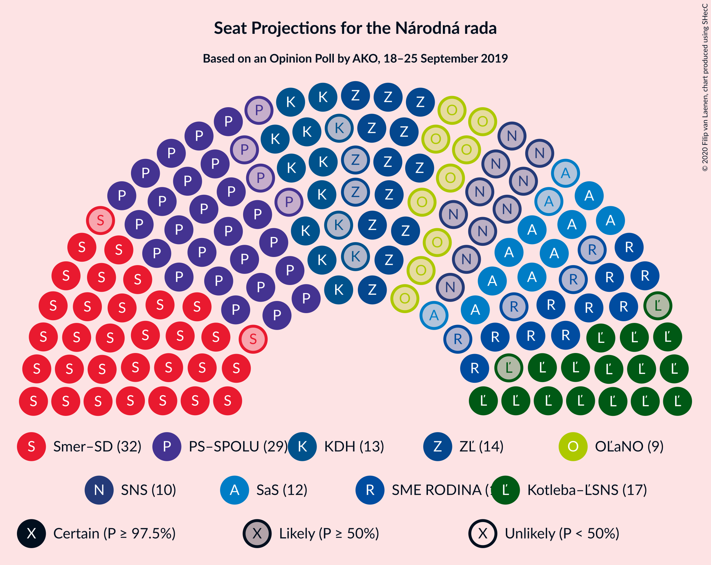

### Confidence Intervals

| Party | Last Result | Median | 80% Confidence Interval | 90% Confidence Interval | 95% Confidence Interval | 99% Confidence Interval |
|:-----:|:-----------:|:------:|:-----------------------:|:-----------------------:|:-----------------------:|:-----------------------:|
| <a href="#smer–sociálna-demokracia">SMER–sociálna demokracia</a> | 49 | 34 | 30–37 |30–37 |30–38 |28–41 |
| <a href="#progresívne-slovensko–spolu–občianska-demokracia">Progresívne Slovensko–SPOLU–Občianska Demokracia</a> | 0 | 29 | 27–32 |26–32 |25–33 |23–34 |
| <a href="#kotleba–ľudová-strana-naše-slovensko">Kotleba–Ľudová strana Naše Slovensko</a> | 14 | 20 | 17–22 |16–22 |15–22 |14–22 |
| <a href="#za-ľudí">Za ľudí</a> | 0 | 15 | 12–16 |12–17 |12–19 |11–20 |
| <a href="#sme-rodina">SME RODINA</a> | 11 | 14 | 11–16 |11–16 |10–16 |10–16 |
| <a href="#kresťanskodemokratické-hnutie">Kresťanskodemokratické hnutie</a> | 0 | 14 | 10–15 |10–15 |10–15 |10–16 |
| <a href="#sloboda-a-solidarita">Sloboda a Solidarita</a> | 21 | 12 | 9–13 |9–14 |9–15 |9–16 |
| <a href="#obyčajní-ľudia-a-nezávislé-osobnosti">OBYČAJNÍ ĽUDIA a nezávislé osobnosti</a> | 17 | 9 | 0–11 |0–12 |0–12 |0–13 |
| <a href="#slovenská-národná-strana">Slovenská národná strana</a> | 15 | 10 | 0–11 |0–11 |0–11 |0–13 |
| <a href="#strana-maďarskej-koalície–magyar-koalíció-pártja">Strana maďarskej koalície–Magyar Koalíció Pártja</a> | 0 | 0 | 0 |0 |0 |0–8 |
| <a href="#most–híd">MOST–HÍD</a> | 11 | 0 | 0 |0 |0 |0–9 |
| <a href="#dobrá-voľba">Dobrá voľba</a> | 0 | 0 | 0 |0 |0 |0 |

### SMER–sociálna demokracia

*For a full overview of the results for this party, see the [SMER–sociálna demokracia](party-smer–sociálnademokracia.html) page.*

| Number of Seats | Probability | Accumulated | Special Marks |
|:---------------:|:-----------:|:-----------:|:-------------:|
| 26 | 0.1% | 100% |  |
| 27 | 0.2% | 99.9% |  |
| 28 | 1.2% | 99.7% |  |
| 29 | 0.4% | 98% |  |
| 30 | 9% | 98% |  |
| 31 | 3% | 89% |  |
| 32 | 19% | 86% |  |
| 33 | 5% | 68% |  |
| 34 | 23% | 63% | Median |
| 35 | 26% | 39% |  |
| 36 | 2% | 13% |  |
| 37 | 9% | 12% |  |
| 38 | 1.0% | 3% |  |
| 39 | 1.0% | 2% |  |
| 40 | 0.1% | 0.6% |  |
| 41 | 0.1% | 0.5% |  |
| 42 | 0.4% | 0.5% |  |
| 43 | 0.1% | 0.1% |  |
| 44 | 0% | 0% |  |
| 45 | 0% | 0% |  |
| 46 | 0% | 0% |  |
| 47 | 0% | 0% |  |
| 48 | 0% | 0% |  |
| 49 | 0% | 0% | Last Result |

### Progresívne Slovensko–SPOLU–Občianska Demokracia

*For a full overview of the results for this party, see the [Progresívne Slovensko–SPOLU–Občianska Demokracia](party-progresívneslovensko–spolu–občianskademokracia.html) page.*

| Number of Seats | Probability | Accumulated | Special Marks |
|:---------------:|:-----------:|:-----------:|:-------------:|
| 0 | 0% | 100% | Last Result |
| 1 | 0% | 100% |  |
| 2 | 0% | 100% |  |
| 3 | 0% | 100% |  |
| 4 | 0% | 100% |  |
| 5 | 0% | 100% |  |
| 6 | 0% | 100% |  |
| 7 | 0% | 100% |  |
| 8 | 0% | 100% |  |
| 9 | 0% | 100% |  |
| 10 | 0% | 100% |  |
| 11 | 0% | 100% |  |
| 12 | 0% | 100% |  |
| 13 | 0% | 100% |  |
| 14 | 0% | 100% |  |
| 15 | 0% | 100% |  |
| 16 | 0% | 100% |  |
| 17 | 0% | 100% |  |
| 18 | 0% | 100% |  |
| 19 | 0% | 100% |  |
| 20 | 0% | 100% |  |
| 21 | 0.1% | 100% |  |
| 22 | 0.3% | 99.9% |  |
| 23 | 0.4% | 99.6% |  |
| 24 | 0.3% | 99.2% |  |
| 25 | 2% | 98.9% |  |
| 26 | 5% | 97% |  |
| 27 | 3% | 92% |  |
| 28 | 4% | 89% |  |
| 29 | 47% | 85% | Median |
| 30 | 5% | 38% |  |
| 31 | 17% | 33% |  |
| 32 | 12% | 16% |  |
| 33 | 1.2% | 3% |  |
| 34 | 2% | 2% |  |
| 35 | 0.2% | 0.4% |  |
| 36 | 0.2% | 0.3% |  |
| 37 | 0% | 0% |  |

### Kotleba–Ľudová strana Naše Slovensko

*For a full overview of the results for this party, see the [Kotleba–Ľudová strana Naše Slovensko](party-kotleba–ľudovástrananašeslovensko.html) page.*

| Number of Seats | Probability | Accumulated | Special Marks |
|:---------------:|:-----------:|:-----------:|:-------------:|
| 13 | 0.1% | 100% |  |
| 14 | 0.5% | 99.9% | Last Result |
| 15 | 2% | 99.5% |  |
| 16 | 7% | 97% |  |
| 17 | 25% | 90% |  |
| 18 | 4% | 65% |  |
| 19 | 6% | 61% |  |
| 20 | 32% | 56% | Median |
| 21 | 2% | 24% |  |
| 22 | 22% | 23% |  |
| 23 | 0.1% | 0.2% |  |
| 24 | 0% | 0% |  |

### Za ľudí

*For a full overview of the results for this party, see the [Za ľudí](party-zaľudí.html) page.*

| Number of Seats | Probability | Accumulated | Special Marks |
|:---------------:|:-----------:|:-----------:|:-------------:|
| 0 | 0% | 100% | Last Result |
| 1 | 0% | 100% |  |
| 2 | 0% | 100% |  |
| 3 | 0% | 100% |  |
| 4 | 0% | 100% |  |
| 5 | 0% | 100% |  |
| 6 | 0% | 100% |  |
| 7 | 0% | 100% |  |
| 8 | 0% | 100% |  |
| 9 | 0% | 100% |  |
| 10 | 0% | 100% |  |
| 11 | 1.0% | 100% |  |
| 12 | 13% | 98.9% |  |
| 13 | 7% | 86% |  |
| 14 | 26% | 79% |  |
| 15 | 22% | 52% | Median |
| 16 | 22% | 30% |  |
| 17 | 3% | 8% |  |
| 18 | 2% | 5% |  |
| 19 | 2% | 3% |  |
| 20 | 0.6% | 0.6% |  |
| 21 | 0% | 0.1% |  |
| 22 | 0% | 0% |  |

### SME RODINA

*For a full overview of the results for this party, see the [SME RODINA](party-smerodina.html) page.*

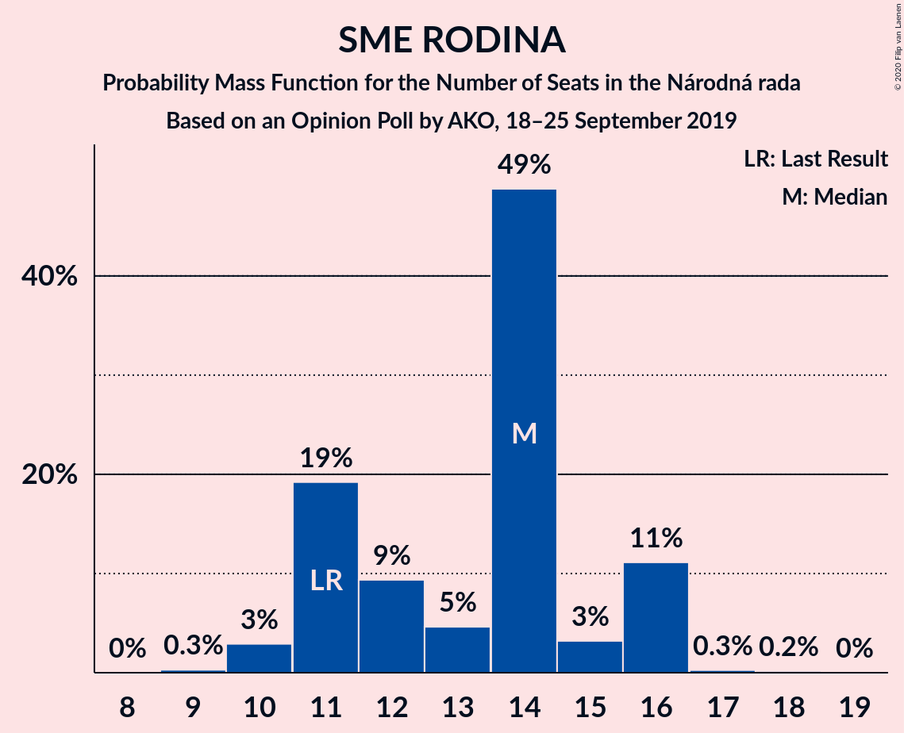

| Number of Seats | Probability | Accumulated | Special Marks |
|:---------------:|:-----------:|:-----------:|:-------------:|
| 9 | 0.3% | 100% |  |
| 10 | 3% | 99.7% |  |
| 11 | 19% | 97% | Last Result |
| 12 | 9% | 78% |  |
| 13 | 5% | 68% |  |
| 14 | 49% | 64% | Median |
| 15 | 3% | 15% |  |
| 16 | 11% | 12% |  |
| 17 | 0.3% | 0.5% |  |
| 18 | 0.2% | 0.2% |  |
| 19 | 0% | 0% |  |

### Kresťanskodemokratické hnutie

*For a full overview of the results for this party, see the [Kresťanskodemokratické hnutie](party-kresťanskodemokratickéhnutie.html) page.*

| Number of Seats | Probability | Accumulated | Special Marks |
|:---------------:|:-----------:|:-----------:|:-------------:|
| 0 | 0% | 100% | Last Result |
| 1 | 0% | 100% |  |
| 2 | 0% | 100% |  |
| 3 | 0% | 100% |  |
| 4 | 0% | 100% |  |
| 5 | 0% | 100% |  |
| 6 | 0% | 100% |  |
| 7 | 0% | 100% |  |
| 8 | 0% | 100% |  |
| 9 | 0.3% | 100% |  |
| 10 | 14% | 99.6% |  |
| 11 | 4% | 85% |  |
| 12 | 11% | 81% |  |
| 13 | 20% | 70% |  |
| 14 | 25% | 50% | Median |
| 15 | 24% | 25% |  |
| 16 | 0.7% | 0.9% |  |
| 17 | 0.1% | 0.2% |  |
| 18 | 0% | 0.1% |  |
| 19 | 0% | 0% |  |

### Sloboda a Solidarita

*For a full overview of the results for this party, see the [Sloboda a Solidarita](party-slobodaasolidarita.html) page.*

| Number of Seats | Probability | Accumulated | Special Marks |
|:---------------:|:-----------:|:-----------:|:-------------:|
| 0 | 0.1% | 100% |  |
| 1 | 0% | 99.9% |  |
| 2 | 0% | 99.9% |  |
| 3 | 0% | 99.9% |  |
| 4 | 0% | 99.9% |  |
| 5 | 0% | 99.9% |  |
| 6 | 0% | 99.9% |  |
| 7 | 0% | 99.9% |  |
| 8 | 0.2% | 99.9% |  |
| 9 | 17% | 99.8% |  |
| 10 | 4% | 83% |  |
| 11 | 25% | 79% |  |
| 12 | 42% | 54% | Median |
| 13 | 6% | 12% |  |
| 14 | 2% | 5% |  |
| 15 | 3% | 4% |  |
| 16 | 0.7% | 0.7% |  |
| 17 | 0% | 0.1% |  |
| 18 | 0% | 0% |  |
| 19 | 0% | 0% |  |
| 20 | 0% | 0% |  |
| 21 | 0% | 0% | Last Result |

### OBYČAJNÍ ĽUDIA a nezávislé osobnosti

*For a full overview of the results for this party, see the [OBYČAJNÍ ĽUDIA a nezávislé osobnosti](party-obyčajníľudiaanezávisléosobnosti.html) page.*

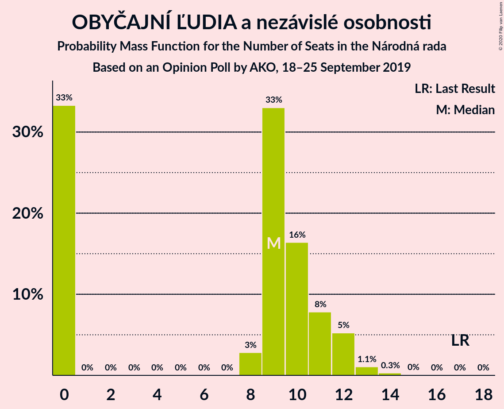

| Number of Seats | Probability | Accumulated | Special Marks |
|:---------------:|:-----------:|:-----------:|:-------------:|
| 0 | 33% | 100% |  |
| 1 | 0% | 67% |  |
| 2 | 0% | 67% |  |
| 3 | 0% | 67% |  |
| 4 | 0% | 67% |  |
| 5 | 0% | 67% |  |
| 6 | 0% | 67% |  |
| 7 | 0% | 67% |  |
| 8 | 3% | 67% |  |
| 9 | 33% | 64% | Median |
| 10 | 16% | 31% |  |
| 11 | 8% | 14% |  |
| 12 | 5% | 7% |  |
| 13 | 1.1% | 1.4% |  |
| 14 | 0.3% | 0.4% |  |
| 15 | 0% | 0.1% |  |
| 16 | 0% | 0% |  |
| 17 | 0% | 0% | Last Result |

### Slovenská národná strana

*For a full overview of the results for this party, see the [Slovenská národná strana](party-slovenskánárodnástrana.html) page.*

| Number of Seats | Probability | Accumulated | Special Marks |
|:---------------:|:-----------:|:-----------:|:-------------:|
| 0 | 15% | 100% |  |
| 1 | 0% | 85% |  |
| 2 | 0% | 85% |  |
| 3 | 0% | 85% |  |
| 4 | 0% | 85% |  |
| 5 | 0% | 85% |  |
| 6 | 0% | 85% |  |
| 7 | 0% | 85% |  |
| 8 | 0.7% | 85% |  |
| 9 | 18% | 84% |  |
| 10 | 48% | 66% | Median |
| 11 | 16% | 18% |  |
| 12 | 1.1% | 2% |  |
| 13 | 0.5% | 0.7% |  |
| 14 | 0.2% | 0.2% |  |
| 15 | 0% | 0% | Last Result |

### Strana maďarskej koalície–Magyar Koalíció Pártja

*For a full overview of the results for this party, see the [Strana maďarskej koalície–Magyar Koalíció Pártja](party-stranamaďarskejkoalície–magyarkoalíciópártja.html) page.*

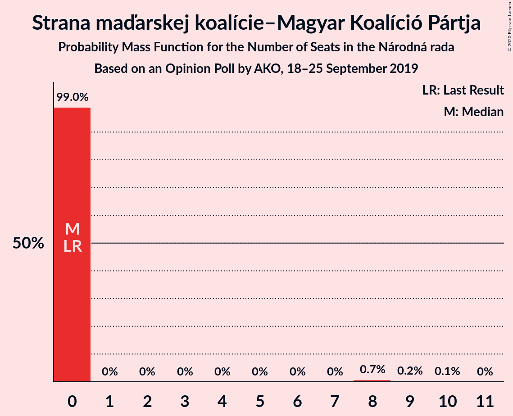

| Number of Seats | Probability | Accumulated | Special Marks |
|:---------------:|:-----------:|:-----------:|:-------------:|
| 0 | 99.0% | 100% | Last Result, Median |
| 1 | 0% | 1.0% |  |
| 2 | 0% | 1.0% |  |
| 3 | 0% | 1.0% |  |
| 4 | 0% | 1.0% |  |
| 5 | 0% | 1.0% |  |
| 6 | 0% | 1.0% |  |
| 7 | 0% | 1.0% |  |
| 8 | 0.7% | 1.0% |  |
| 9 | 0.2% | 0.3% |  |
| 10 | 0.1% | 0.1% |  |
| 11 | 0% | 0% |  |

### MOST–HÍD

*For a full overview of the results for this party, see the [MOST–HÍD](party-most–híd.html) page.*

| Number of Seats | Probability | Accumulated | Special Marks |
|:---------------:|:-----------:|:-----------:|:-------------:|
| 0 | 99.3% | 100% | Median |
| 1 | 0% | 0.7% |  |
| 2 | 0% | 0.7% |  |
| 3 | 0% | 0.7% |  |
| 4 | 0% | 0.7% |  |
| 5 | 0% | 0.7% |  |
| 6 | 0% | 0.7% |  |
| 7 | 0% | 0.7% |  |
| 8 | 0% | 0.7% |  |
| 9 | 0.7% | 0.7% |  |
| 10 | 0% | 0% |  |
| 11 | 0% | 0% | Last Result |

### Dobrá voľba

*For a full overview of the results for this party, see the [Dobrá voľba](party-dobrávoľba.html) page.*

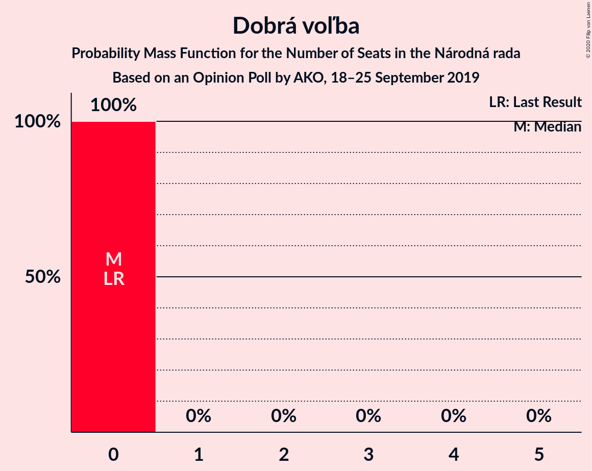

| Number of Seats | Probability | Accumulated | Special Marks |
|:---------------:|:-----------:|:-----------:|:-------------:|
| 0 | 100% | 100% | Last Result, Median |

## Coalitions

### Confidence Intervals

| Coalition | Last Result | Median | Majority? | 80% Confidence Interval | 90% Confidence Interval | 95% Confidence Interval | 99% Confidence Interval |
|:---------:|:-----------:|:------:|:---------:|:-----------------------:|:-----------------------:|:-----------------------:|:-----------------------:|
| Progresívne Slovensko–SPOLU–Občianska Demokracia – Za ľudí – SME RODINA – Kresťanskodemokratické hnutie – Sloboda a Solidarita – OBYČAJNÍ ĽUDIA a nezávislé osobnosti – Strana maďarskej koalície–Magyar Koalíció Pártja – MOST–HÍD | 60 | 88 | 100% | 83–96 | 83–96 | 83–96 | 82–102 |
| Progresívne Slovensko–SPOLU–Občianska Demokracia – Za ľudí – SME RODINA – Kresťanskodemokratické hnutie – Sloboda a Solidarita – OBYČAJNÍ ĽUDIA a nezávislé osobnosti – MOST–HÍD | 60 | 88 | 100% | 83–96 | 83–96 | 83–96 | 82–101 |
| Progresívne Slovensko–SPOLU–Občianska Demokracia – Za ľudí – SME RODINA – Kresťanskodemokratické hnutie – Sloboda a Solidarita – OBYČAJNÍ ĽUDIA a nezávislé osobnosti – Strana maďarskej koalície–Magyar Koalíció Pártja | 49 | 88 | 100% | 83–96 | 83–96 | 83–96 | 82–102 |
| Progresívne Slovensko–SPOLU–Občianska Demokracia – Za ľudí – SME RODINA – Kresťanskodemokratické hnutie – Sloboda a Solidarita – OBYČAJNÍ ĽUDIA a nezávislé osobnosti | 49 | 88 | 100% | 83–96 | 83–96 | 83–96 | 82–101 |
| Progresívne Slovensko–SPOLU–Občianska Demokracia – Za ľudí – Kresťanskodemokratické hnutie – Sloboda a Solidarita – OBYČAJNÍ ĽUDIA a nezávislé osobnosti – Strana maďarskej koalície–Magyar Koalíció Pártja – MOST–HÍD | 49 | 75 | 49% | 69–82 | 69–83 | 69–83 | 68–87 |
| Progresívne Slovensko–SPOLU–Občianska Demokracia – Za ľudí – Kresťanskodemokratické hnutie – Sloboda a Solidarita – OBYČAJNÍ ĽUDIA a nezávislé osobnosti – MOST–HÍD | 49 | 75 | 48% | 69–82 | 69–82 | 69–83 | 68–87 |
| Progresívne Slovensko–SPOLU–Občianska Demokracia – Za ľudí – Kresťanskodemokratické hnutie – Sloboda a Solidarita – OBYČAJNÍ ĽUDIA a nezávislé osobnosti – Strana maďarskej koalície–Magyar Koalíció Pártja | 38 | 75 | 48% | 69–82 | 69–82 | 69–83 | 68–87 |
| Progresívne Slovensko–SPOLU–Občianska Demokracia – Za ľudí – Kresťanskodemokratické hnutie – Sloboda a Solidarita – OBYČAJNÍ ĽUDIA a nezávislé osobnosti | 38 | 75 | 47% | 69–82 | 69–82 | 69–83 | 68–87 |
| SMER–sociálna demokracia – Kotleba–Ľudová strana Naše Slovensko – SME RODINA – Slovenská národná strana | 89 | 75 | 47% | 68–81 | 67–81 | 67–81 | 63–82 |
| Progresívne Slovensko–SPOLU–Občianska Demokracia – Za ľudí – Kresťanskodemokratické hnutie – Sloboda a Solidarita | 21 | 69 | 0.8% | 65–72 | 64–72 | 63–74 | 62–76 |
| Progresívne Slovensko–SPOLU–Občianska Demokracia – Za ľudí – Sloboda a Solidarita – OBYČAJNÍ ĽUDIA a nezávislé osobnosti | 38 | 62 | 0% | 55–68 | 55–69 | 55–70 | 55–74 |
| SMER–sociálna demokracia – SME RODINA – Slovenská národná strana | 75 | 56 | 0% | 48–61 | 48–62 | 47–62 | 46–62 |
| Progresívne Slovensko–SPOLU–Občianska Demokracia – Za ľudí – Sloboda a Solidarita | 21 | 55 | 0% | 53–58 | 52–60 | 51–61 | 49–63 |
| SMER–sociálna demokracia – SME RODINA | 60 | 48 | 0% | 43–53 | 42–53 | 40–53 | 39–55 |
| SMER–sociálna demokracia – Slovenská národná strana – MOST–HÍD | 75 | 44 | 0% | 34–46 | 34–46 | 34–46 | 32–49 |
| SMER–sociálna demokracia – Slovenská národná strana | 64 | 43 | 0% | 34–46 | 34–46 | 34–46 | 32–48 |
| SMER–sociálna demokracia | 49 | 34 | 0% | 30–37 | 30–37 | 30–38 | 28–41 |

### Progresívne Slovensko–SPOLU–Občianska Demokracia – Za ľudí – SME RODINA – Kresťanskodemokratické hnutie – Sloboda a Solidarita – OBYČAJNÍ ĽUDIA a nezávislé osobnosti – Strana maďarskej koalície–Magyar Koalíció Pártja – MOST–HÍD

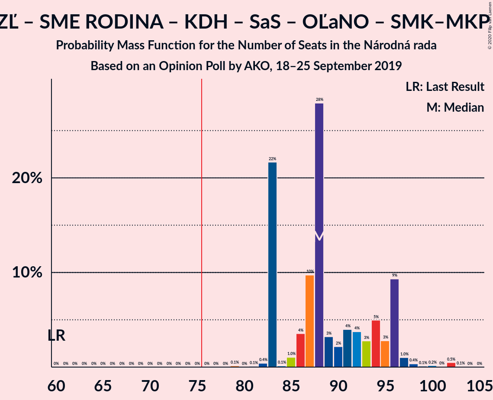

| Number of Seats | Probability | Accumulated | Special Marks |
|:---------------:|:-----------:|:-----------:|:-------------:|
| 60 | 0% | 100% | Last Result |
| 61 | 0% | 100% |  |
| 62 | 0% | 100% |  |
| 63 | 0% | 100% |  |
| 64 | 0% | 100% |  |
| 65 | 0% | 100% |  |
| 66 | 0% | 100% |  |
| 67 | 0% | 100% |  |
| 68 | 0% | 100% |  |
| 69 | 0% | 100% |  |
| 70 | 0% | 100% |  |
| 71 | 0% | 100% |  |
| 72 | 0% | 100% |  |
| 73 | 0% | 100% |  |
| 74 | 0% | 100% |  |
| 75 | 0% | 100% |  |
| 76 | 0% | 100% | Majority |
| 77 | 0% | 100% |  |
| 78 | 0% | 100% |  |
| 79 | 0.1% | 100% |  |
| 80 | 0% | 99.8% |  |
| 81 | 0.1% | 99.8% |  |
| 82 | 0.4% | 99.7% |  |
| 83 | 22% | 99.3% |  |
| 84 | 0.1% | 78% |  |
| 85 | 1.0% | 77% |  |
| 86 | 4% | 76% |  |
| 87 | 10% | 73% |  |
| 88 | 28% | 63% |  |
| 89 | 3% | 35% |  |
| 90 | 2% | 32% |  |
| 91 | 4% | 30% |  |
| 92 | 4% | 26% |  |
| 93 | 3% | 22% | Median |
| 94 | 5% | 19% |  |
| 95 | 3% | 14% |  |
| 96 | 9% | 12% |  |
| 97 | 1.0% | 2% |  |
| 98 | 0.4% | 1.2% |  |
| 99 | 0.1% | 0.9% |  |
| 100 | 0.2% | 0.8% |  |
| 101 | 0% | 0.6% |  |
| 102 | 0.5% | 0.6% |  |
| 103 | 0.1% | 0.1% |  |
| 104 | 0% | 0% |  |

### Progresívne Slovensko–SPOLU–Občianska Demokracia – Za ľudí – SME RODINA – Kresťanskodemokratické hnutie – Sloboda a Solidarita – OBYČAJNÍ ĽUDIA a nezávislé osobnosti – MOST–HÍD

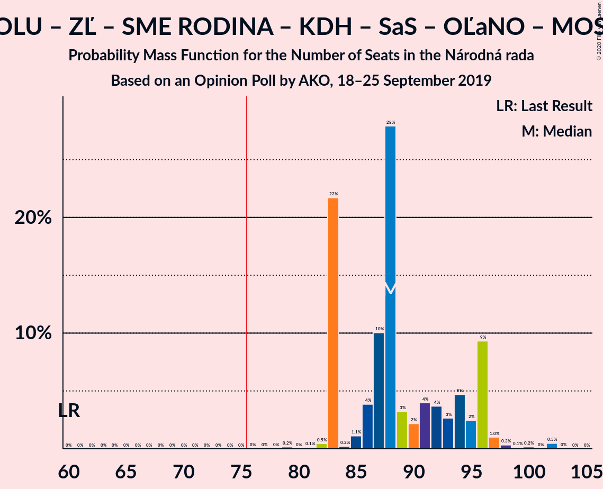

| Number of Seats | Probability | Accumulated | Special Marks |
|:---------------:|:-----------:|:-----------:|:-------------:|
| 60 | 0% | 100% | Last Result |
| 61 | 0% | 100% |  |
| 62 | 0% | 100% |  |
| 63 | 0% | 100% |  |
| 64 | 0% | 100% |  |
| 65 | 0% | 100% |  |
| 66 | 0% | 100% |  |
| 67 | 0% | 100% |  |
| 68 | 0% | 100% |  |
| 69 | 0% | 100% |  |
| 70 | 0% | 100% |  |
| 71 | 0% | 100% |  |
| 72 | 0% | 100% |  |
| 73 | 0% | 100% |  |
| 74 | 0% | 100% |  |
| 75 | 0% | 100% |  |
| 76 | 0% | 100% | Majority |
| 77 | 0% | 100% |  |
| 78 | 0% | 100% |  |
| 79 | 0.2% | 99.9% |  |
| 80 | 0% | 99.8% |  |
| 81 | 0.1% | 99.8% |  |
| 82 | 0.5% | 99.6% |  |
| 83 | 22% | 99.2% |  |
| 84 | 0.2% | 77% |  |
| 85 | 1.1% | 77% |  |
| 86 | 4% | 76% |  |
| 87 | 10% | 72% |  |
| 88 | 28% | 62% |  |
| 89 | 3% | 34% |  |
| 90 | 2% | 31% |  |
| 91 | 4% | 29% |  |
| 92 | 4% | 25% |  |
| 93 | 3% | 21% | Median |
| 94 | 5% | 19% |  |
| 95 | 2% | 14% |  |
| 96 | 9% | 11% |  |
| 97 | 1.0% | 2% |  |
| 98 | 0.3% | 1.1% |  |
| 99 | 0.1% | 0.8% |  |
| 100 | 0.2% | 0.7% |  |
| 101 | 0% | 0.5% |  |
| 102 | 0.5% | 0.5% |  |
| 103 | 0% | 0% |  |

### Progresívne Slovensko–SPOLU–Občianska Demokracia – Za ľudí – SME RODINA – Kresťanskodemokratické hnutie – Sloboda a Solidarita – OBYČAJNÍ ĽUDIA a nezávislé osobnosti – Strana maďarskej koalície–Magyar Koalíció Pártja

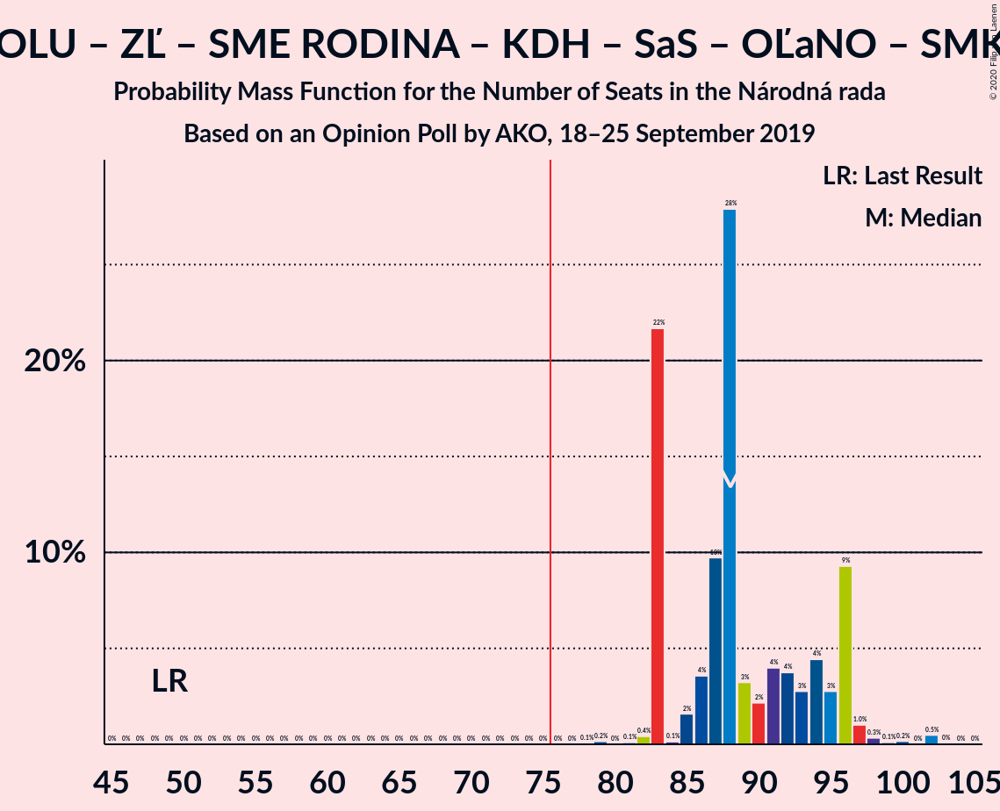

| Number of Seats | Probability | Accumulated | Special Marks |
|:---------------:|:-----------:|:-----------:|:-------------:|
| 49 | 0% | 100% | Last Result |
| 50 | 0% | 100% |  |
| 51 | 0% | 100% |  |
| 52 | 0% | 100% |  |
| 53 | 0% | 100% |  |
| 54 | 0% | 100% |  |
| 55 | 0% | 100% |  |
| 56 | 0% | 100% |  |
| 57 | 0% | 100% |  |
| 58 | 0% | 100% |  |
| 59 | 0% | 100% |  |
| 60 | 0% | 100% |  |
| 61 | 0% | 100% |  |
| 62 | 0% | 100% |  |
| 63 | 0% | 100% |  |
| 64 | 0% | 100% |  |
| 65 | 0% | 100% |  |
| 66 | 0% | 100% |  |
| 67 | 0% | 100% |  |
| 68 | 0% | 100% |  |
| 69 | 0% | 100% |  |
| 70 | 0% | 100% |  |
| 71 | 0% | 100% |  |
| 72 | 0% | 100% |  |
| 73 | 0% | 100% |  |
| 74 | 0% | 100% |  |
| 75 | 0% | 100% |  |
| 76 | 0% | 100% | Majority |
| 77 | 0% | 100% |  |
| 78 | 0.1% | 100% |  |
| 79 | 0.2% | 99.9% |  |
| 80 | 0% | 99.8% |  |
| 81 | 0.1% | 99.8% |  |
| 82 | 0.4% | 99.7% |  |
| 83 | 22% | 99.2% |  |
| 84 | 0.1% | 78% |  |
| 85 | 2% | 77% |  |
| 86 | 4% | 76% |  |
| 87 | 10% | 72% |  |
| 88 | 28% | 63% |  |
| 89 | 3% | 35% |  |
| 90 | 2% | 31% |  |
| 91 | 4% | 29% |  |
| 92 | 4% | 25% |  |
| 93 | 3% | 21% | Median |
| 94 | 4% | 19% |  |
| 95 | 3% | 14% |  |
| 96 | 9% | 11% |  |
| 97 | 1.0% | 2% |  |
| 98 | 0.3% | 1.2% |  |
| 99 | 0.1% | 0.8% |  |
| 100 | 0.2% | 0.7% |  |
| 101 | 0% | 0.6% |  |
| 102 | 0.5% | 0.5% |  |
| 103 | 0% | 0.1% |  |
| 104 | 0% | 0% |  |

### Progresívne Slovensko–SPOLU–Občianska Demokracia – Za ľudí – SME RODINA – Kresťanskodemokratické hnutie – Sloboda a Solidarita – OBYČAJNÍ ĽUDIA a nezávislé osobnosti

| Number of Seats | Probability | Accumulated | Special Marks |
|:---------------:|:-----------:|:-----------:|:-------------:|
| 49 | 0% | 100% | Last Result |
| 50 | 0% | 100% |  |
| 51 | 0% | 100% |  |
| 52 | 0% | 100% |  |
| 53 | 0% | 100% |  |
| 54 | 0% | 100% |  |
| 55 | 0% | 100% |  |
| 56 | 0% | 100% |  |
| 57 | 0% | 100% |  |
| 58 | 0% | 100% |  |
| 59 | 0% | 100% |  |
| 60 | 0% | 100% |  |
| 61 | 0% | 100% |  |
| 62 | 0% | 100% |  |
| 63 | 0% | 100% |  |
| 64 | 0% | 100% |  |
| 65 | 0% | 100% |  |
| 66 | 0% | 100% |  |
| 67 | 0% | 100% |  |
| 68 | 0% | 100% |  |
| 69 | 0% | 100% |  |
| 70 | 0% | 100% |  |
| 71 | 0% | 100% |  |
| 72 | 0% | 100% |  |
| 73 | 0% | 100% |  |
| 74 | 0% | 100% |  |
| 75 | 0% | 100% |  |
| 76 | 0% | 100% | Majority |
| 77 | 0% | 100% |  |
| 78 | 0.1% | 100% |  |
| 79 | 0.2% | 99.9% |  |
| 80 | 0% | 99.7% |  |
| 81 | 0.1% | 99.7% |  |
| 82 | 0.5% | 99.6% |  |
| 83 | 22% | 99.1% |  |
| 84 | 0.2% | 77% |  |
| 85 | 2% | 77% |  |
| 86 | 4% | 76% |  |
| 87 | 10% | 72% |  |
| 88 | 28% | 62% |  |
| 89 | 3% | 34% |  |
| 90 | 2% | 30% |  |
| 91 | 4% | 28% |  |
| 92 | 4% | 24% |  |
| 93 | 3% | 21% | Median |
| 94 | 4% | 18% |  |
| 95 | 2% | 14% |  |
| 96 | 9% | 11% |  |
| 97 | 1.0% | 2% |  |
| 98 | 0.3% | 1.1% |  |
| 99 | 0.1% | 0.8% |  |
| 100 | 0.2% | 0.7% |  |
| 101 | 0% | 0.5% |  |
| 102 | 0.5% | 0.5% |  |
| 103 | 0% | 0% |  |

### Progresívne Slovensko–SPOLU–Občianska Demokracia – Za ľudí – Kresťanskodemokratické hnutie – Sloboda a Solidarita – OBYČAJNÍ ĽUDIA a nezávislé osobnosti – Strana maďarskej koalície–Magyar Koalíció Pártja – MOST–HÍD

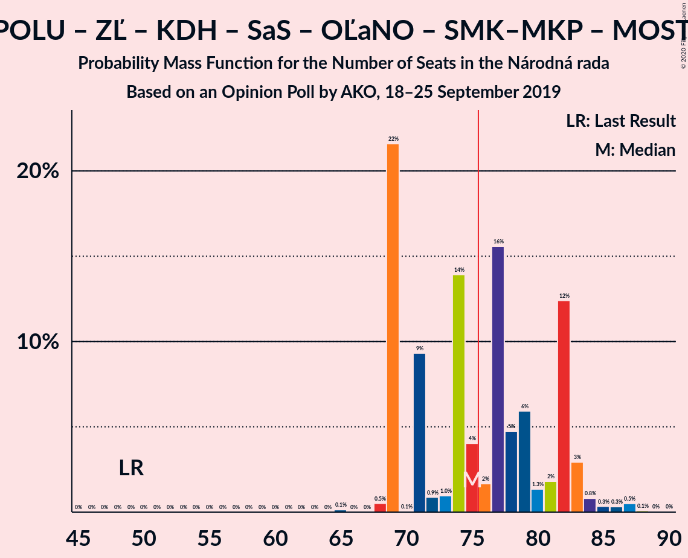

| Number of Seats | Probability | Accumulated | Special Marks |
|:---------------:|:-----------:|:-----------:|:-------------:|
| 49 | 0% | 100% | Last Result |
| 50 | 0% | 100% |  |
| 51 | 0% | 100% |  |
| 52 | 0% | 100% |  |
| 53 | 0% | 100% |  |
| 54 | 0% | 100% |  |
| 55 | 0% | 100% |  |
| 56 | 0% | 100% |  |
| 57 | 0% | 100% |  |
| 58 | 0% | 100% |  |
| 59 | 0% | 100% |  |
| 60 | 0% | 100% |  |
| 61 | 0% | 100% |  |
| 62 | 0% | 100% |  |
| 63 | 0% | 100% |  |
| 64 | 0% | 100% |  |
| 65 | 0.1% | 100% |  |
| 66 | 0% | 99.8% |  |
| 67 | 0% | 99.8% |  |
| 68 | 0.5% | 99.8% |  |
| 69 | 22% | 99.3% |  |
| 70 | 0.1% | 78% |  |
| 71 | 9% | 78% |  |
| 72 | 0.9% | 68% |  |
| 73 | 1.0% | 67% |  |
| 74 | 14% | 66% |  |
| 75 | 4% | 53% |  |
| 76 | 2% | 49% | Majority |
| 77 | 16% | 47% |  |
| 78 | 5% | 31% |  |
| 79 | 6% | 27% | Median |
| 80 | 1.3% | 21% |  |
| 81 | 2% | 19% |  |
| 82 | 12% | 17% |  |
| 83 | 3% | 5% |  |
| 84 | 0.8% | 2% |  |
| 85 | 0.3% | 1.3% |  |
| 86 | 0.3% | 1.0% |  |
| 87 | 0.5% | 0.7% |  |
| 88 | 0.1% | 0.2% |  |
| 89 | 0% | 0.1% |  |
| 90 | 0% | 0% |  |

### Progresívne Slovensko–SPOLU–Občianska Demokracia – Za ľudí – Kresťanskodemokratické hnutie – Sloboda a Solidarita – OBYČAJNÍ ĽUDIA a nezávislé osobnosti – MOST–HÍD

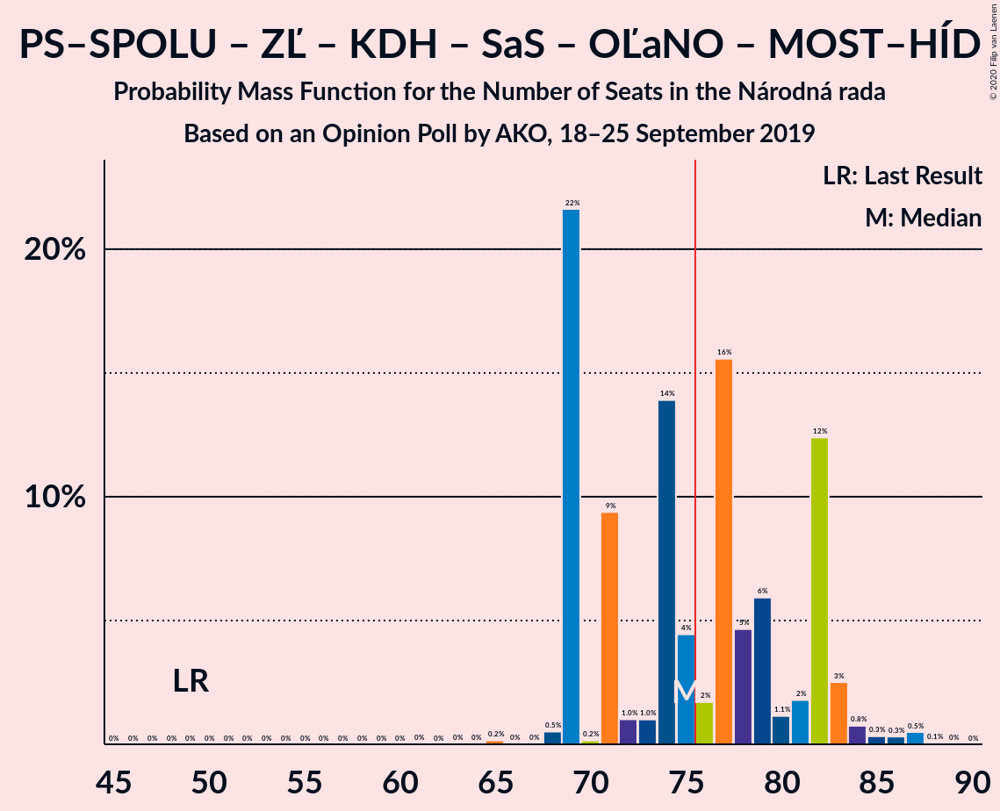

| Number of Seats | Probability | Accumulated | Special Marks |
|:---------------:|:-----------:|:-----------:|:-------------:|
| 49 | 0% | 100% | Last Result |
| 50 | 0% | 100% |  |
| 51 | 0% | 100% |  |
| 52 | 0% | 100% |  |
| 53 | 0% | 100% |  |
| 54 | 0% | 100% |  |
| 55 | 0% | 100% |  |
| 56 | 0% | 100% |  |
| 57 | 0% | 100% |  |
| 58 | 0% | 100% |  |
| 59 | 0% | 100% |  |
| 60 | 0% | 100% |  |
| 61 | 0% | 100% |  |
| 62 | 0% | 100% |  |
| 63 | 0% | 100% |  |
| 64 | 0% | 100% |  |
| 65 | 0.2% | 100% |  |
| 66 | 0% | 99.8% |  |
| 67 | 0% | 99.8% |  |
| 68 | 0.5% | 99.8% |  |
| 69 | 22% | 99.2% |  |
| 70 | 0.2% | 78% |  |
| 71 | 9% | 77% |  |
| 72 | 1.0% | 68% |  |
| 73 | 1.0% | 67% |  |
| 74 | 14% | 66% |  |
| 75 | 4% | 52% |  |
| 76 | 2% | 48% | Majority |
| 77 | 16% | 46% |  |
| 78 | 5% | 30% |  |
| 79 | 6% | 26% | Median |
| 80 | 1.1% | 20% |  |
| 81 | 2% | 19% |  |
| 82 | 12% | 17% |  |
| 83 | 3% | 5% |  |
| 84 | 0.8% | 2% |  |
| 85 | 0.3% | 1.2% |  |
| 86 | 0.3% | 0.9% |  |
| 87 | 0.5% | 0.6% |  |
| 88 | 0.1% | 0.1% |  |
| 89 | 0% | 0% |  |

### Progresívne Slovensko–SPOLU–Občianska Demokracia – Za ľudí – Kresťanskodemokratické hnutie – Sloboda a Solidarita – OBYČAJNÍ ĽUDIA a nezávislé osobnosti – Strana maďarskej koalície–Magyar Koalíció Pártja

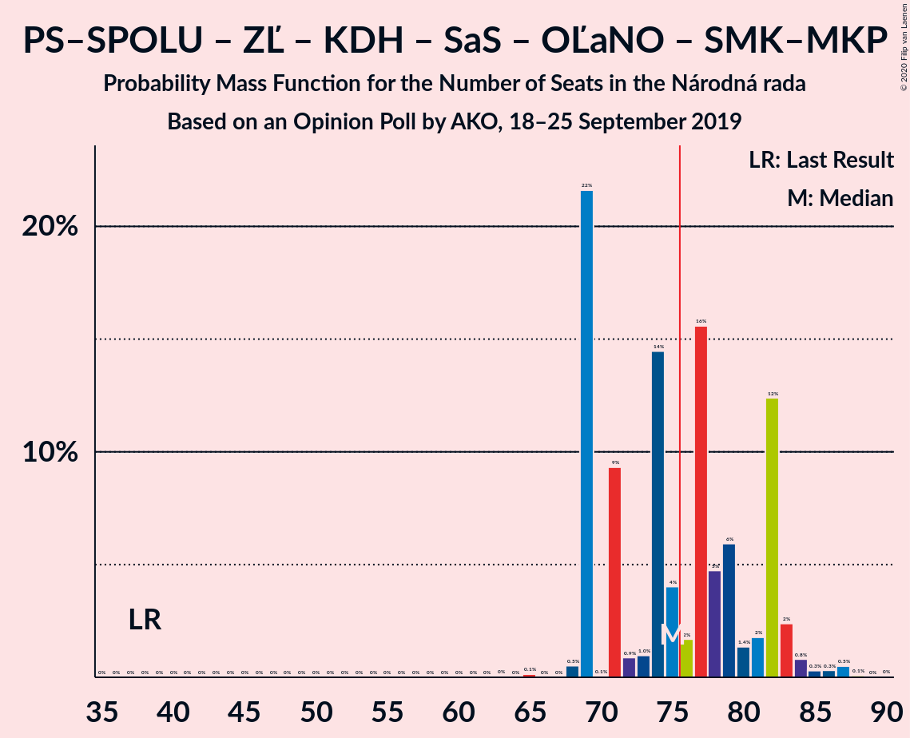

| Number of Seats | Probability | Accumulated | Special Marks |
|:---------------:|:-----------:|:-----------:|:-------------:|
| 38 | 0% | 100% | Last Result |
| 39 | 0% | 100% |  |
| 40 | 0% | 100% |  |
| 41 | 0% | 100% |  |
| 42 | 0% | 100% |  |
| 43 | 0% | 100% |  |
| 44 | 0% | 100% |  |
| 45 | 0% | 100% |  |
| 46 | 0% | 100% |  |
| 47 | 0% | 100% |  |
| 48 | 0% | 100% |  |
| 49 | 0% | 100% |  |
| 50 | 0% | 100% |  |
| 51 | 0% | 100% |  |
| 52 | 0% | 100% |  |
| 53 | 0% | 100% |  |
| 54 | 0% | 100% |  |
| 55 | 0% | 100% |  |
| 56 | 0% | 100% |  |
| 57 | 0% | 100% |  |
| 58 | 0% | 100% |  |
| 59 | 0% | 100% |  |
| 60 | 0% | 100% |  |
| 61 | 0% | 100% |  |
| 62 | 0% | 100% |  |
| 63 | 0% | 100% |  |
| 64 | 0% | 99.9% |  |
| 65 | 0.1% | 99.9% |  |
| 66 | 0% | 99.8% |  |
| 67 | 0% | 99.8% |  |
| 68 | 0.5% | 99.8% |  |
| 69 | 22% | 99.2% |  |
| 70 | 0.1% | 78% |  |
| 71 | 9% | 78% |  |
| 72 | 0.9% | 68% |  |
| 73 | 1.0% | 67% |  |
| 74 | 14% | 66% |  |
| 75 | 4% | 52% |  |
| 76 | 2% | 48% | Majority |
| 77 | 16% | 46% |  |
| 78 | 5% | 31% |  |
| 79 | 6% | 26% | Median |
| 80 | 1.4% | 20% |  |
| 81 | 2% | 19% |  |
| 82 | 12% | 17% |  |
| 83 | 2% | 4% |  |
| 84 | 0.8% | 2% |  |
| 85 | 0.3% | 1.3% |  |
| 86 | 0.3% | 1.0% |  |
| 87 | 0.5% | 0.6% |  |
| 88 | 0.1% | 0.1% |  |
| 89 | 0% | 0.1% |  |
| 90 | 0% | 0% |  |

### Progresívne Slovensko–SPOLU–Občianska Demokracia – Za ľudí – Kresťanskodemokratické hnutie – Sloboda a Solidarita – OBYČAJNÍ ĽUDIA a nezávislé osobnosti

| Number of Seats | Probability | Accumulated | Special Marks |
|:---------------:|:-----------:|:-----------:|:-------------:|
| 38 | 0% | 100% | Last Result |
| 39 | 0% | 100% |  |
| 40 | 0% | 100% |  |
| 41 | 0% | 100% |  |
| 42 | 0% | 100% |  |
| 43 | 0% | 100% |  |
| 44 | 0% | 100% |  |
| 45 | 0% | 100% |  |
| 46 | 0% | 100% |  |
| 47 | 0% | 100% |  |
| 48 | 0% | 100% |  |
| 49 | 0% | 100% |  |
| 50 | 0% | 100% |  |
| 51 | 0% | 100% |  |
| 52 | 0% | 100% |  |
| 53 | 0% | 100% |  |
| 54 | 0% | 100% |  |
| 55 | 0% | 100% |  |
| 56 | 0% | 100% |  |
| 57 | 0% | 100% |  |
| 58 | 0% | 100% |  |
| 59 | 0% | 100% |  |
| 60 | 0% | 100% |  |
| 61 | 0% | 100% |  |
| 62 | 0% | 100% |  |
| 63 | 0% | 100% |  |
| 64 | 0% | 99.9% |  |
| 65 | 0.2% | 99.9% |  |
| 66 | 0% | 99.8% |  |
| 67 | 0% | 99.7% |  |
| 68 | 0.5% | 99.7% |  |
| 69 | 22% | 99.2% |  |
| 70 | 0.2% | 78% |  |
| 71 | 9% | 77% |  |
| 72 | 1.0% | 68% |  |
| 73 | 1.0% | 67% |  |
| 74 | 14% | 66% |  |
| 75 | 4% | 52% |  |
| 76 | 2% | 47% | Majority |
| 77 | 16% | 45% |  |
| 78 | 5% | 30% |  |
| 79 | 6% | 25% | Median |
| 80 | 1.1% | 19% |  |
| 81 | 2% | 18% |  |
| 82 | 12% | 16% |  |
| 83 | 2% | 4% |  |
| 84 | 0.8% | 2% |  |
| 85 | 0.3% | 1.2% |  |
| 86 | 0.3% | 0.9% |  |
| 87 | 0.5% | 0.6% |  |
| 88 | 0.1% | 0.1% |  |
| 89 | 0% | 0% |  |

### SMER–sociálna demokracia – Kotleba–Ľudová strana Naše Slovensko – SME RODINA – Slovenská národná strana

| Number of Seats | Probability | Accumulated | Special Marks |
|:---------------:|:-----------:|:-----------:|:-------------:|
| 61 | 0% | 100% |  |
| 62 | 0.1% | 99.9% |  |
| 63 | 0.5% | 99.8% |  |
| 64 | 0.3% | 99.3% |  |
| 65 | 0.3% | 99.0% |  |
| 66 | 0.8% | 98.7% |  |
| 67 | 3% | 98% |  |
| 68 | 12% | 95% |  |
| 69 | 2% | 83% |  |
| 70 | 1.3% | 81% |  |
| 71 | 6% | 79% |  |
| 72 | 5% | 73% |  |
| 73 | 16% | 69% |  |
| 74 | 2% | 53% |  |
| 75 | 4% | 51% |  |
| 76 | 14% | 47% | Majority |
| 77 | 1.0% | 34% |  |
| 78 | 0.9% | 33% | Median |
| 79 | 9% | 32% |  |
| 80 | 0.1% | 22% |  |
| 81 | 22% | 22% |  |
| 82 | 0.5% | 0.7% |  |
| 83 | 0% | 0.2% |  |
| 84 | 0% | 0.2% |  |
| 85 | 0.1% | 0.2% |  |
| 86 | 0% | 0% |  |
| 87 | 0% | 0% |  |
| 88 | 0% | 0% |  |
| 89 | 0% | 0% | Last Result |

### Progresívne Slovensko–SPOLU–Občianska Demokracia – Za ľudí – Kresťanskodemokratické hnutie – Sloboda a Solidarita

| Number of Seats | Probability | Accumulated | Special Marks |
|:---------------:|:-----------:|:-----------:|:-------------:|
| 21 | 0% | 100% | Last Result |
| 22 | 0% | 100% |  |
| 23 | 0% | 100% |  |
| 24 | 0% | 100% |  |
| 25 | 0% | 100% |  |
| 26 | 0% | 100% |  |
| 27 | 0% | 100% |  |
| 28 | 0% | 100% |  |
| 29 | 0% | 100% |  |
| 30 | 0% | 100% |  |
| 31 | 0% | 100% |  |
| 32 | 0% | 100% |  |
| 33 | 0% | 100% |  |
| 34 | 0% | 100% |  |
| 35 | 0% | 100% |  |
| 36 | 0% | 100% |  |
| 37 | 0% | 100% |  |
| 38 | 0% | 100% |  |
| 39 | 0% | 100% |  |
| 40 | 0% | 100% |  |
| 41 | 0% | 100% |  |
| 42 | 0% | 100% |  |
| 43 | 0% | 100% |  |
| 44 | 0% | 100% |  |
| 45 | 0% | 100% |  |
| 46 | 0% | 100% |  |
| 47 | 0% | 100% |  |
| 48 | 0% | 100% |  |
| 49 | 0% | 100% |  |
| 50 | 0% | 100% |  |
| 51 | 0% | 100% |  |
| 52 | 0% | 100% |  |
| 53 | 0% | 100% |  |
| 54 | 0% | 100% |  |
| 55 | 0% | 100% |  |
| 56 | 0% | 100% |  |
| 57 | 0% | 100% |  |
| 58 | 0.1% | 100% |  |
| 59 | 0.1% | 99.9% |  |
| 60 | 0.1% | 99.9% |  |
| 61 | 0.1% | 99.7% |  |
| 62 | 2% | 99.6% |  |
| 63 | 2% | 98% |  |
| 64 | 2% | 96% |  |
| 65 | 13% | 94% |  |
| 66 | 3% | 81% |  |
| 67 | 4% | 78% |  |
| 68 | 18% | 75% |  |
| 69 | 24% | 57% |  |
| 70 | 5% | 33% | Median |
| 71 | 13% | 28% |  |
| 72 | 10% | 15% |  |
| 73 | 2% | 5% |  |
| 74 | 2% | 3% |  |
| 75 | 0.2% | 1.0% |  |
| 76 | 0.6% | 0.8% | Majority |
| 77 | 0.1% | 0.2% |  |
| 78 | 0% | 0.1% |  |
| 79 | 0% | 0% |  |

### Progresívne Slovensko–SPOLU–Občianska Demokracia – Za ľudí – Sloboda a Solidarita – OBYČAJNÍ ĽUDIA a nezávislé osobnosti

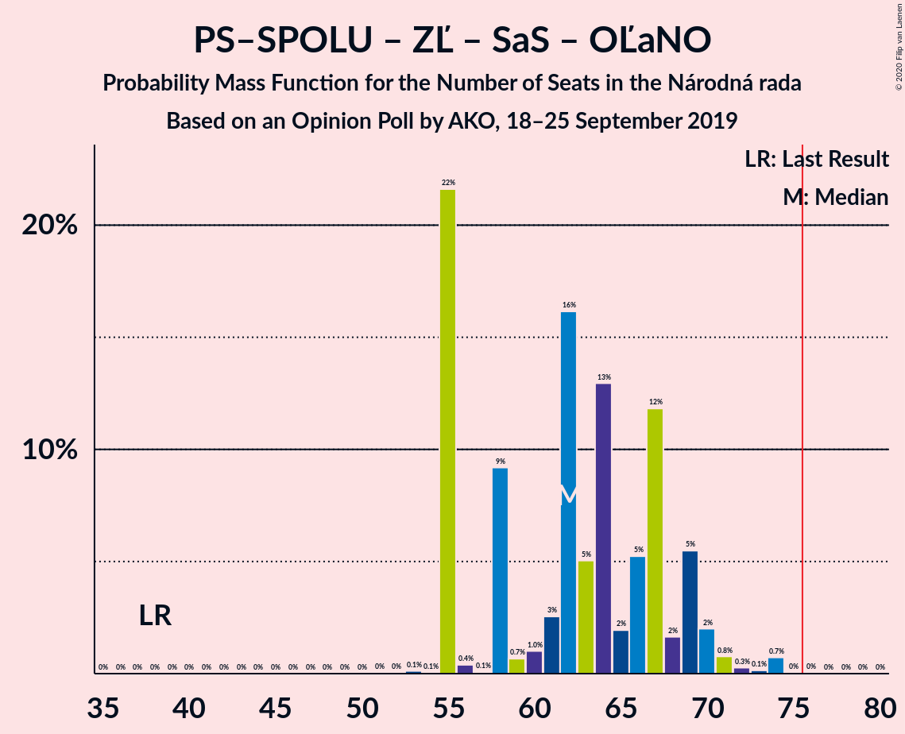

| Number of Seats | Probability | Accumulated | Special Marks |
|:---------------:|:-----------:|:-----------:|:-------------:|
| 38 | 0% | 100% | Last Result |
| 39 | 0% | 100% |  |
| 40 | 0% | 100% |  |
| 41 | 0% | 100% |  |
| 42 | 0% | 100% |  |
| 43 | 0% | 100% |  |
| 44 | 0% | 100% |  |
| 45 | 0% | 100% |  |
| 46 | 0% | 100% |  |
| 47 | 0% | 100% |  |
| 48 | 0% | 100% |  |
| 49 | 0% | 100% |  |
| 50 | 0% | 100% |  |
| 51 | 0% | 100% |  |
| 52 | 0% | 99.9% |  |
| 53 | 0.1% | 99.9% |  |
| 54 | 0.1% | 99.8% |  |
| 55 | 22% | 99.7% |  |
| 56 | 0.4% | 78% |  |
| 57 | 0.1% | 78% |  |
| 58 | 9% | 78% |  |
| 59 | 0.7% | 68% |  |
| 60 | 1.0% | 68% |  |
| 61 | 3% | 67% |  |
| 62 | 16% | 64% |  |
| 63 | 5% | 48% |  |
| 64 | 13% | 43% |  |
| 65 | 2% | 30% | Median |
| 66 | 5% | 28% |  |
| 67 | 12% | 23% |  |
| 68 | 2% | 11% |  |
| 69 | 5% | 9% |  |
| 70 | 2% | 4% |  |
| 71 | 0.8% | 2% |  |
| 72 | 0.3% | 1.2% |  |
| 73 | 0.1% | 0.9% |  |
| 74 | 0.7% | 0.8% |  |
| 75 | 0% | 0.1% |  |
| 76 | 0% | 0% | Majority |

### SMER–sociálna demokracia – SME RODINA – Slovenská národná strana

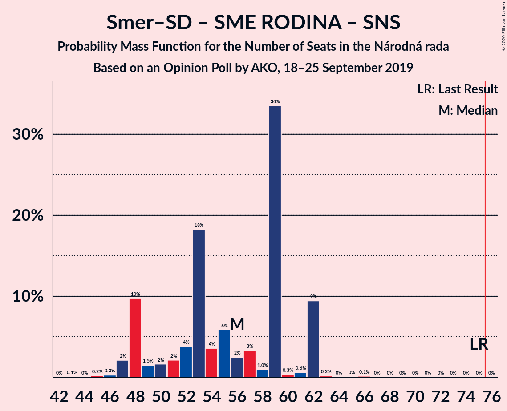

| Number of Seats | Probability | Accumulated | Special Marks |
|:---------------:|:-----------:|:-----------:|:-------------:|
| 43 | 0.1% | 100% |  |
| 44 | 0% | 99.9% |  |
| 45 | 0.2% | 99.9% |  |
| 46 | 0.3% | 99.7% |  |
| 47 | 2% | 99.4% |  |
| 48 | 10% | 97% |  |
| 49 | 1.5% | 88% |  |
| 50 | 2% | 86% |  |
| 51 | 2% | 85% |  |
| 52 | 4% | 82% |  |
| 53 | 18% | 79% |  |
| 54 | 4% | 60% |  |
| 55 | 6% | 57% |  |
| 56 | 2% | 51% |  |
| 57 | 3% | 48% |  |
| 58 | 1.0% | 45% | Median |
| 59 | 34% | 44% |  |
| 60 | 0.3% | 11% |  |
| 61 | 0.6% | 10% |  |
| 62 | 9% | 10% |  |
| 63 | 0.2% | 0.4% |  |
| 64 | 0% | 0.2% |  |
| 65 | 0% | 0.2% |  |
| 66 | 0.1% | 0.1% |  |
| 67 | 0% | 0% |  |
| 68 | 0% | 0% |  |
| 69 | 0% | 0% |  |
| 70 | 0% | 0% |  |
| 71 | 0% | 0% |  |
| 72 | 0% | 0% |  |
| 73 | 0% | 0% |  |
| 74 | 0% | 0% |  |
| 75 | 0% | 0% | Last Result |

### Progresívne Slovensko–SPOLU–Občianska Demokracia – Za ľudí – Sloboda a Solidarita

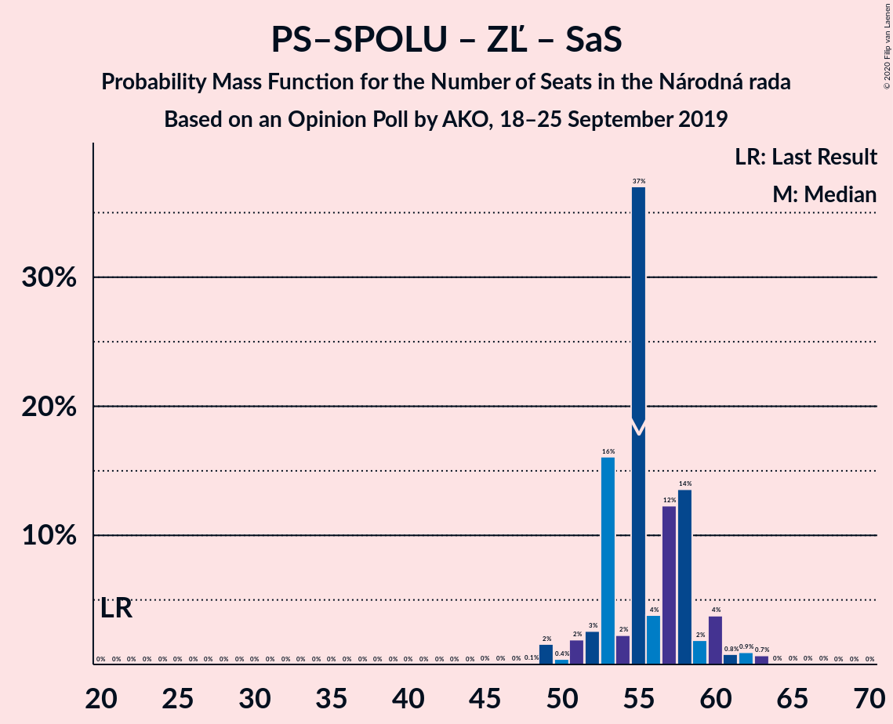

| Number of Seats | Probability | Accumulated | Special Marks |
|:---------------:|:-----------:|:-----------:|:-------------:|
| 21 | 0% | 100% | Last Result |
| 22 | 0% | 100% |  |
| 23 | 0% | 100% |  |
| 24 | 0% | 100% |  |
| 25 | 0% | 100% |  |
| 26 | 0% | 100% |  |
| 27 | 0% | 100% |  |
| 28 | 0% | 100% |  |
| 29 | 0% | 100% |  |
| 30 | 0% | 100% |  |
| 31 | 0% | 100% |  |
| 32 | 0% | 100% |  |
| 33 | 0% | 100% |  |
| 34 | 0% | 100% |  |
| 35 | 0% | 100% |  |
| 36 | 0% | 100% |  |
| 37 | 0% | 100% |  |
| 38 | 0% | 100% |  |
| 39 | 0% | 100% |  |
| 40 | 0% | 100% |  |
| 41 | 0% | 100% |  |
| 42 | 0% | 100% |  |
| 43 | 0% | 100% |  |
| 44 | 0% | 100% |  |
| 45 | 0% | 100% |  |
| 46 | 0% | 100% |  |
| 47 | 0% | 99.9% |  |
| 48 | 0.1% | 99.9% |  |
| 49 | 2% | 99.8% |  |
| 50 | 0.4% | 98% |  |
| 51 | 2% | 98% |  |
| 52 | 3% | 96% |  |
| 53 | 16% | 93% |  |
| 54 | 2% | 77% |  |
| 55 | 37% | 75% |  |
| 56 | 4% | 38% | Median |
| 57 | 12% | 34% |  |
| 58 | 14% | 22% |  |
| 59 | 2% | 8% |  |
| 60 | 4% | 6% |  |
| 61 | 0.8% | 3% |  |
| 62 | 0.9% | 2% |  |
| 63 | 0.7% | 0.8% |  |
| 64 | 0% | 0.1% |  |
| 65 | 0% | 0.1% |  |
| 66 | 0% | 0% |  |

### SMER–sociálna demokracia – SME RODINA

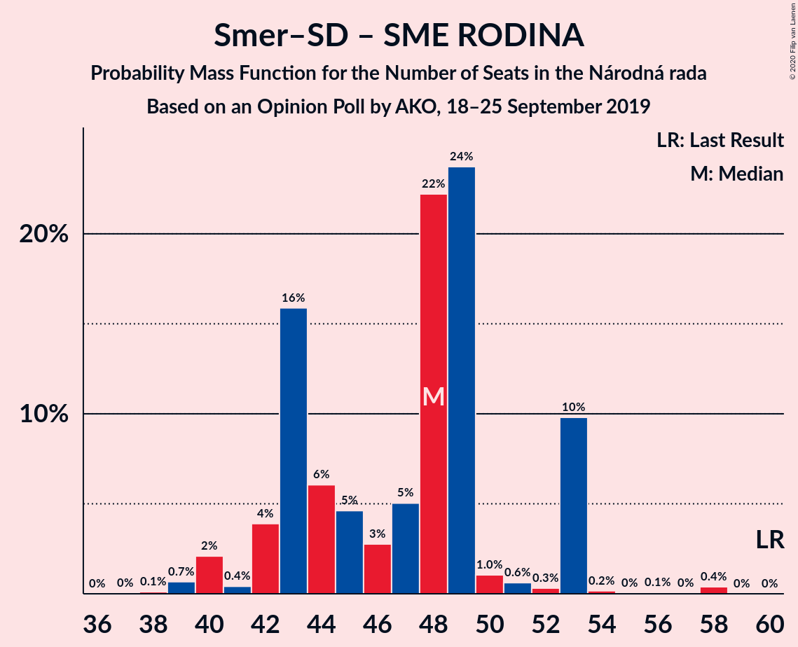

| Number of Seats | Probability | Accumulated | Special Marks |
|:---------------:|:-----------:|:-----------:|:-------------:|
| 38 | 0.1% | 100% |  |
| 39 | 0.7% | 99.8% |  |
| 40 | 2% | 99.2% |  |
| 41 | 0.4% | 97% |  |
| 42 | 4% | 97% |  |
| 43 | 16% | 93% |  |
| 44 | 6% | 77% |  |
| 45 | 5% | 71% |  |
| 46 | 3% | 66% |  |
| 47 | 5% | 63% |  |
| 48 | 22% | 58% | Median |
| 49 | 24% | 36% |  |
| 50 | 1.0% | 12% |  |
| 51 | 0.6% | 11% |  |
| 52 | 0.3% | 11% |  |
| 53 | 10% | 10% |  |
| 54 | 0.2% | 0.7% |  |
| 55 | 0% | 0.5% |  |
| 56 | 0.1% | 0.5% |  |
| 57 | 0% | 0.4% |  |
| 58 | 0.4% | 0.4% |  |
| 59 | 0% | 0% |  |
| 60 | 0% | 0% | Last Result |

### SMER–sociálna demokracia – Slovenská národná strana – MOST–HÍD

| Number of Seats | Probability | Accumulated | Special Marks |
|:---------------:|:-----------:|:-----------:|:-------------:|
| 30 | 0% | 100% |  |
| 31 | 0.1% | 99.9% |  |
| 32 | 0.5% | 99.9% |  |
| 33 | 0.3% | 99.3% |  |
| 34 | 9% | 99.1% |  |
| 35 | 2% | 90% |  |
| 36 | 1.3% | 87% |  |
| 37 | 0.4% | 86% |  |
| 38 | 0.7% | 86% |  |
| 39 | 3% | 85% |  |
| 40 | 6% | 82% |  |
| 41 | 4% | 76% |  |
| 42 | 19% | 72% |  |
| 43 | 3% | 53% |  |
| 44 | 5% | 50% | Median |
| 45 | 33% | 45% |  |
| 46 | 10% | 12% |  |
| 47 | 0.6% | 2% |  |
| 48 | 1.1% | 2% |  |
| 49 | 0.1% | 0.5% |  |
| 50 | 0.1% | 0.4% |  |
| 51 | 0.1% | 0.3% |  |
| 52 | 0.1% | 0.2% |  |
| 53 | 0% | 0.1% |  |
| 54 | 0% | 0% |  |
| 55 | 0% | 0% |  |
| 56 | 0% | 0% |  |
| 57 | 0% | 0% |  |
| 58 | 0% | 0% |  |
| 59 | 0% | 0% |  |
| 60 | 0% | 0% |  |
| 61 | 0% | 0% |  |
| 62 | 0% | 0% |  |
| 63 | 0% | 0% |  |
| 64 | 0% | 0% |  |
| 65 | 0% | 0% |  |
| 66 | 0% | 0% |  |
| 67 | 0% | 0% |  |
| 68 | 0% | 0% |  |
| 69 | 0% | 0% |  |
| 70 | 0% | 0% |  |
| 71 | 0% | 0% |  |
| 72 | 0% | 0% |  |
| 73 | 0% | 0% |  |
| 74 | 0% | 0% |  |
| 75 | 0% | 0% | Last Result |

### SMER–sociálna demokracia – Slovenská národná strana

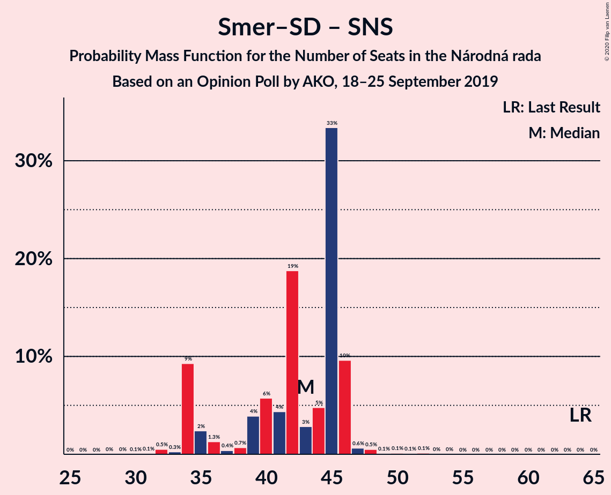

| Number of Seats | Probability | Accumulated | Special Marks |
|:---------------:|:-----------:|:-----------:|:-------------:|
| 30 | 0.1% | 100% |  |
| 31 | 0.1% | 99.9% |  |
| 32 | 0.5% | 99.8% |  |
| 33 | 0.3% | 99.3% |  |
| 34 | 9% | 99.1% |  |
| 35 | 2% | 90% |  |
| 36 | 1.3% | 87% |  |
| 37 | 0.4% | 86% |  |
| 38 | 0.7% | 86% |  |
| 39 | 4% | 85% |  |
| 40 | 6% | 81% |  |
| 41 | 4% | 75% |  |
| 42 | 19% | 71% |  |
| 43 | 3% | 52% |  |
| 44 | 5% | 49% | Median |
| 45 | 33% | 45% |  |
| 46 | 10% | 11% |  |
| 47 | 0.6% | 2% |  |
| 48 | 0.5% | 0.9% |  |
| 49 | 0.1% | 0.4% |  |
| 50 | 0.1% | 0.3% |  |
| 51 | 0.1% | 0.2% |  |
| 52 | 0.1% | 0.1% |  |
| 53 | 0% | 0% |  |
| 54 | 0% | 0% |  |
| 55 | 0% | 0% |  |
| 56 | 0% | 0% |  |
| 57 | 0% | 0% |  |
| 58 | 0% | 0% |  |
| 59 | 0% | 0% |  |
| 60 | 0% | 0% |  |
| 61 | 0% | 0% |  |
| 62 | 0% | 0% |  |
| 63 | 0% | 0% |  |
| 64 | 0% | 0% | Last Result |

### SMER–sociálna demokracia

| Number of Seats | Probability | Accumulated | Special Marks |
|:---------------:|:-----------:|:-----------:|:-------------:|
| 26 | 0.1% | 100% |  |
| 27 | 0.2% | 99.9% |  |
| 28 | 1.2% | 99.7% |  |
| 29 | 0.4% | 98% |  |
| 30 | 9% | 98% |  |
| 31 | 3% | 89% |  |
| 32 | 19% | 86% |  |
| 33 | 5% | 68% |  |
| 34 | 23% | 63% | Median |
| 35 | 26% | 39% |  |
| 36 | 2% | 13% |  |
| 37 | 9% | 12% |  |
| 38 | 1.0% | 3% |  |
| 39 | 1.0% | 2% |  |
| 40 | 0.1% | 0.6% |  |
| 41 | 0.1% | 0.5% |  |
| 42 | 0.4% | 0.5% |  |
| 43 | 0.1% | 0.1% |  |
| 44 | 0% | 0% |  |
| 45 | 0% | 0% |  |
| 46 | 0% | 0% |  |
| 47 | 0% | 0% |  |
| 48 | 0% | 0% |  |
| 49 | 0% | 0% | Last Result |

## Technical Information

### Opinion Poll

+ **Polling firm:** AKO
+ **Commissioner(s):** —
+ **Fieldwork period:** 18–25 September 2019

### Calculations

+ **Sample size:** 1000
+ **Simulations done:** 1,048,576
+ **Error estimate:** 1.52%

