# Opinion Poll by FOCUS, 2–9 December 2019

<a href="#voting-intentions">Voting Intentions</a> | <a href="#seats">Seats</a> | <a href="#coalitions">Coalitions</a> | <a href="#technical-information">Technical Information</a>

## Voting Intentions

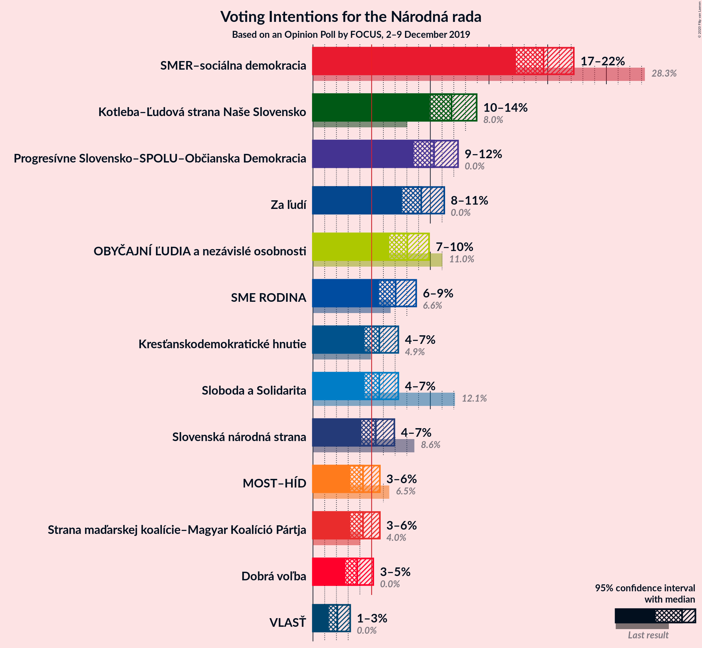

### Confidence Intervals

| Party | Last Result | Poll Result | 80% Confidence Interval | 90% Confidence Interval | 95% Confidence Interval | 99% Confidence Interval |
|:-----:|:-----------:|:-----------:|:-----------------------:|:-----------------------:|:-----------------------:|:-----------------------:|
| SMER–sociálna demokracia | 28.3% | 19.6% | 18.1–21.3% |17.7–21.8% |17.3–22.2% |16.6–23.0% |
| Kotleba–Ľudová strana Naše Slovensko | 8.0% | 11.8% | 10.6–13.2% |10.2–13.6% |10.0–13.9% |9.4–14.6% |
| Progresívne Slovensko–SPOLU–Občianska Demokracia | 0.0% | 10.3% | 9.2–11.6% |8.9–12.0% |8.6–12.4% |8.1–13.0% |
| Za ľudí | 0.0% | 9.2% | 8.2–10.5% |7.8–10.9% |7.6–11.2% |7.1–11.8% |
| OBYČAJNÍ ĽUDIA a nezávislé osobnosti | 11.0% | 8.0% | 7.0–9.2% |6.8–9.6% |6.5–9.9% |6.1–10.5% |
| SME RODINA | 6.6% | 7.0% | 6.1–8.2% |5.8–8.5% |5.6–8.8% |5.2–9.4% |
| Sloboda a Solidarita | 12.1% | 5.7% | 4.8–6.7% |4.6–7.0% |4.4–7.3% |4.0–7.8% |
| Kresťanskodemokratické hnutie | 4.9% | 5.7% | 4.8–6.7% |4.6–7.0% |4.4–7.3% |4.0–7.8% |
| Slovenská národná strana | 8.6% | 5.4% | 4.5–6.4% |4.3–6.7% |4.1–6.9% |3.8–7.5% |
| MOST–HÍD | 6.5% | 4.3% | 3.6–5.2% |3.4–5.5% |3.2–5.7% |2.9–6.2% |
| Strana maďarskej koalície–Magyar Koalíció Pártja | 4.0% | 4.3% | 3.6–5.2% |3.4–5.5% |3.2–5.7% |2.9–6.2% |
| Dobrá voľba | 0.0% | 3.8% | 3.1–4.7% |2.9–4.9% |2.8–5.1% |2.5–5.6% |
| VLASŤ | 0.0% | 2.1% | 1.6–2.8% |1.5–3.0% |1.4–3.2% |1.2–3.5% |

*Note:* The poll result column reflects the actual value used in the calculations. Published results may vary slightly, and in addition be rounded to fewer digits.

## Seats

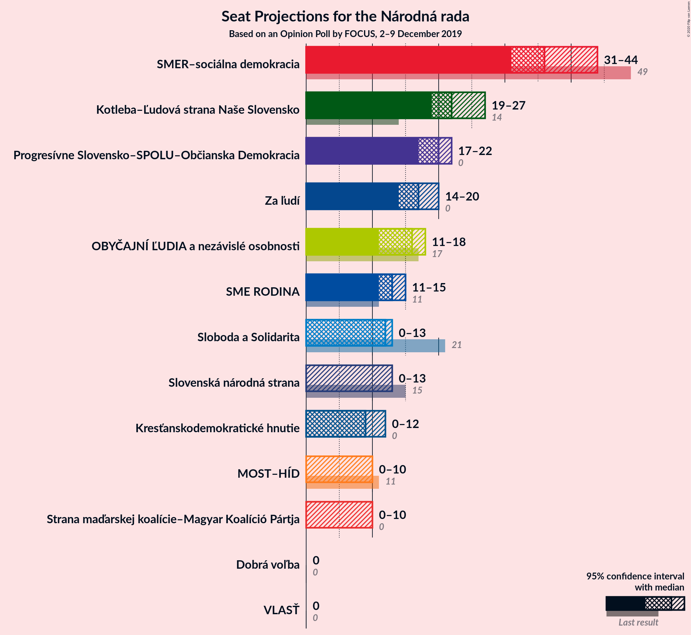

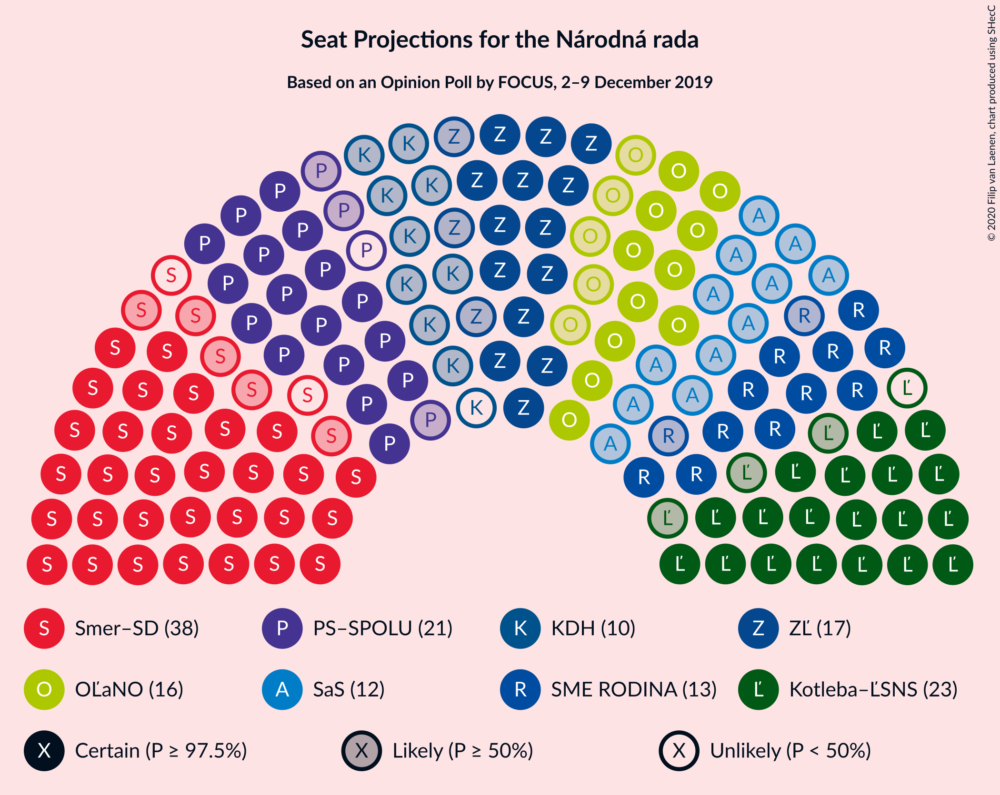

### Confidence Intervals

| Party | Last Result | Median | 80% Confidence Interval | 90% Confidence Interval | 95% Confidence Interval | 99% Confidence Interval |
|:-----:|:-----------:|:------:|:-----------------------:|:-----------------------:|:-----------------------:|:-----------------------:|
| <a href="#smer–sociálna-demokracia">SMER–sociálna demokracia</a> | 49 | 36 | 34–44 |32–44 |31–44 |30–44 |
| <a href="#kotleba–ľudová-strana-naše-slovensko">Kotleba–Ľudová strana Naše Slovensko</a> | 14 | 22 | 20–27 |20–27 |19–27 |18–27 |
| <a href="#progresívne-slovensko–spolu–občianska-demokracia">Progresívne Slovensko–SPOLU–Občianska Demokracia</a> | 0 | 20 | 18–21 |17–22 |17–22 |15–24 |
| <a href="#za-ľudí">Za ľudí</a> | 0 | 17 | 15–18 |14–19 |14–20 |13–22 |
| <a href="#obyčajní-ľudia-a-nezávislé-osobnosti">OBYČAJNÍ ĽUDIA a nezávislé osobnosti</a> | 17 | 16 | 14–18 |12–18 |11–18 |11–19 |
| <a href="#sme-rodina">SME RODINA</a> | 11 | 13 | 11–15 |11–15 |11–15 |10–16 |
| <a href="#sloboda-a-solidarita">Sloboda a Solidarita</a> | 21 | 12 | 10–13 |0–13 |0–13 |0–14 |
| <a href="#kresťanskodemokratické-hnutie">Kresťanskodemokratické hnutie</a> | 0 | 9 | 0–11 |0–11 |0–12 |0–13 |
| <a href="#slovenská-národná-strana">Slovenská národná strana</a> | 15 | 0 | 0–10 |0–12 |0–13 |0–13 |
| <a href="#most–híd">MOST–HÍD</a> | 11 | 0 | 0–10 |0–10 |0–10 |0–10 |
| <a href="#strana-maďarskej-koalície–magyar-koalíció-pártja">Strana maďarskej koalície–Magyar Koalíció Pártja</a> | 0 | 0 | 0 |0 |0–10 |0–12 |
| <a href="#dobrá-voľba">Dobrá voľba</a> | 0 | 0 | 0 |0 |0 |0–10 |
| <a href="#vlasť">VLASŤ</a> | 0 | 0 | 0 |0 |0 |0 |

### SMER–sociálna demokracia

*For a full overview of the results for this party, see the [SMER–sociálna demokracia](party-smer–sociálnademokracia.html) page.*

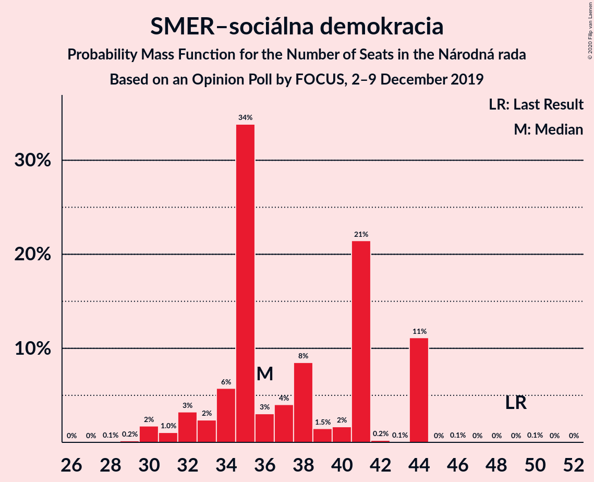

| Number of Seats | Probability | Accumulated | Special Marks |
|:---------------:|:-----------:|:-----------:|:-------------:|
| 28 | 0.1% | 100% |  |
| 29 | 0.2% | 99.9% |  |
| 30 | 2% | 99.7% |  |
| 31 | 1.0% | 98% |  |
| 32 | 3% | 97% |  |
| 33 | 2% | 94% |  |
| 34 | 6% | 91% |  |
| 35 | 34% | 86% |  |
| 36 | 3% | 52% | Median |
| 37 | 4% | 49% |  |
| 38 | 8% | 45% |  |
| 39 | 1.5% | 36% |  |
| 40 | 2% | 35% |  |
| 41 | 21% | 33% |  |
| 42 | 0.2% | 12% |  |
| 43 | 0.1% | 11% |  |
| 44 | 11% | 11% |  |
| 45 | 0% | 0.2% |  |
| 46 | 0.1% | 0.1% |  |
| 47 | 0% | 0.1% |  |
| 48 | 0% | 0.1% |  |
| 49 | 0% | 0.1% | Last Result |
| 50 | 0.1% | 0.1% |  |
| 51 | 0% | 0% |  |

### Kotleba–Ľudová strana Naše Slovensko

*For a full overview of the results for this party, see the [Kotleba–Ľudová strana Naše Slovensko](party-kotleba–ľudovástrananašeslovensko.html) page.*

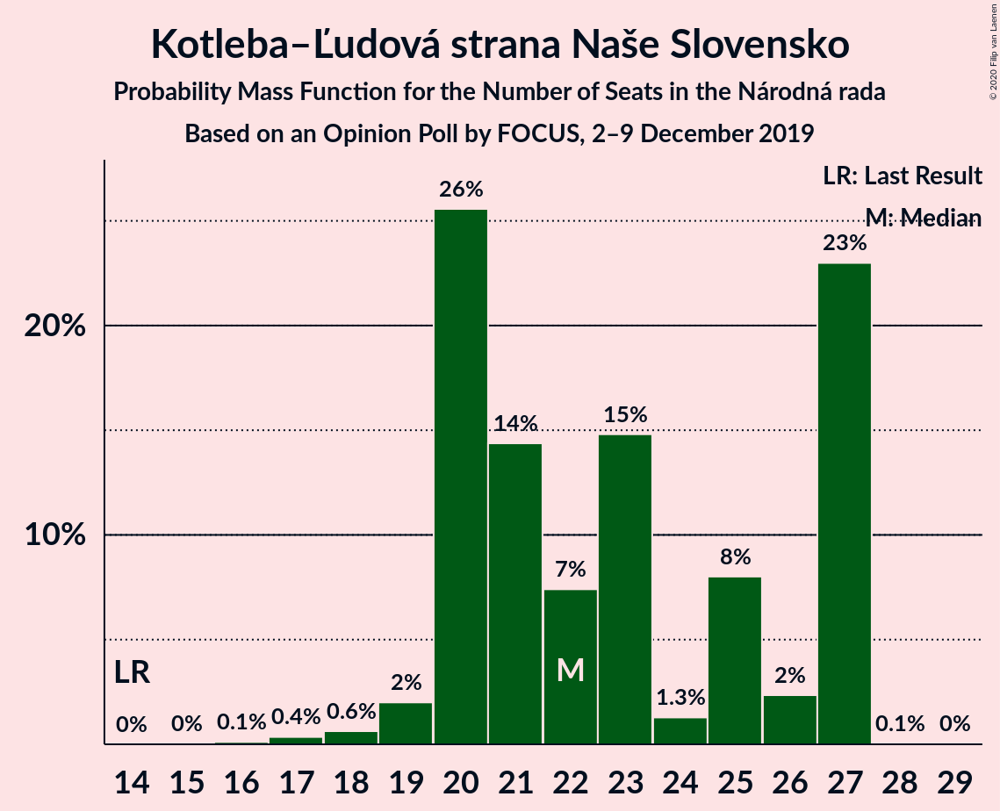

| Number of Seats | Probability | Accumulated | Special Marks |
|:---------------:|:-----------:|:-----------:|:-------------:|
| 14 | 0% | 100% | Last Result |
| 15 | 0% | 100% |  |
| 16 | 0.1% | 100% |  |
| 17 | 0.4% | 99.9% |  |
| 18 | 0.6% | 99.5% |  |
| 19 | 2% | 98.9% |  |
| 20 | 26% | 97% |  |
| 21 | 14% | 71% |  |
| 22 | 7% | 57% | Median |
| 23 | 15% | 50% |  |
| 24 | 1.3% | 35% |  |
| 25 | 8% | 33% |  |
| 26 | 2% | 25% |  |
| 27 | 23% | 23% |  |
| 28 | 0.1% | 0.1% |  |
| 29 | 0% | 0% |  |

### Progresívne Slovensko–SPOLU–Občianska Demokracia

*For a full overview of the results for this party, see the [Progresívne Slovensko–SPOLU–Občianska Demokracia](party-progresívneslovensko–spolu–občianskademokracia.html) page.*

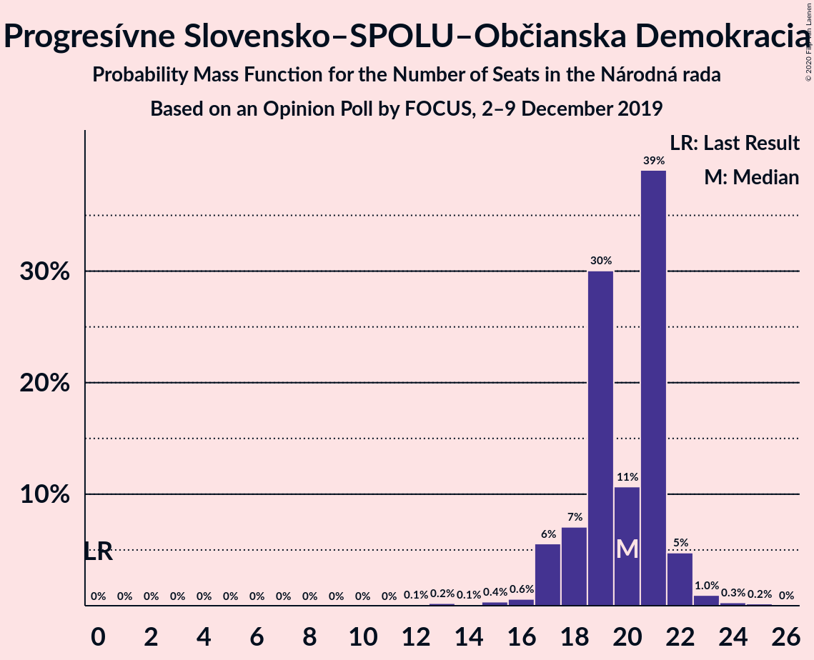

| Number of Seats | Probability | Accumulated | Special Marks |
|:---------------:|:-----------:|:-----------:|:-------------:|
| 0 | 0% | 100% | Last Result |
| 1 | 0% | 100% |  |
| 2 | 0% | 100% |  |
| 3 | 0% | 100% |  |
| 4 | 0% | 100% |  |
| 5 | 0% | 100% |  |
| 6 | 0% | 100% |  |
| 7 | 0% | 100% |  |
| 8 | 0% | 100% |  |
| 9 | 0% | 100% |  |
| 10 | 0% | 100% |  |
| 11 | 0% | 100% |  |
| 12 | 0.1% | 100% |  |
| 13 | 0.2% | 99.9% |  |
| 14 | 0.1% | 99.7% |  |
| 15 | 0.4% | 99.6% |  |
| 16 | 0.6% | 99.3% |  |
| 17 | 6% | 98.7% |  |
| 18 | 7% | 93% |  |
| 19 | 30% | 86% |  |
| 20 | 11% | 56% | Median |
| 21 | 39% | 45% |  |
| 22 | 5% | 6% |  |
| 23 | 1.0% | 1.5% |  |
| 24 | 0.3% | 0.5% |  |
| 25 | 0.2% | 0.2% |  |
| 26 | 0% | 0% |  |

### Za ľudí

*For a full overview of the results for this party, see the [Za ľudí](party-zaľudí.html) page.*

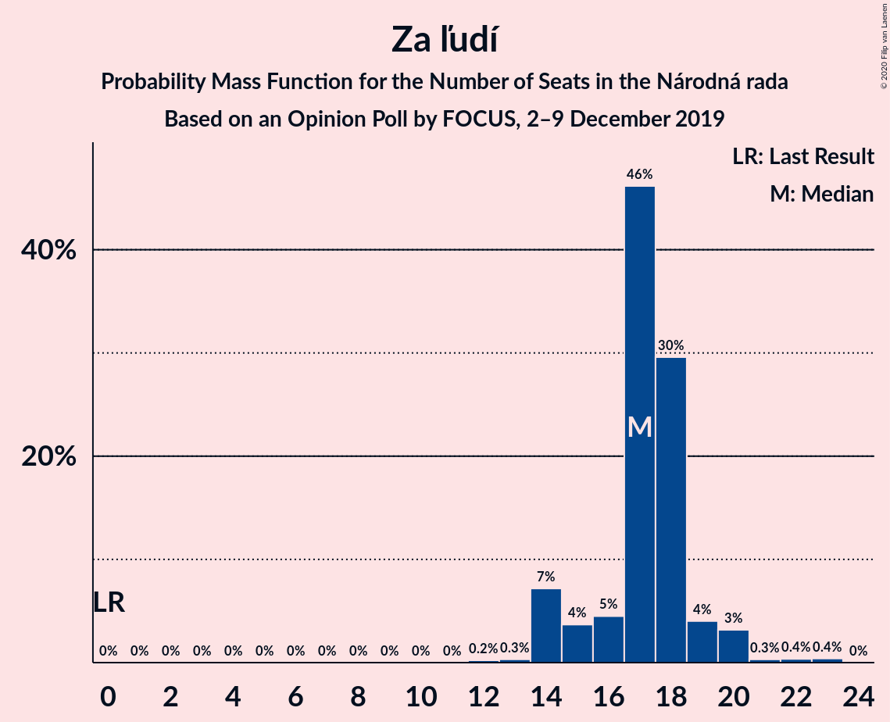

| Number of Seats | Probability | Accumulated | Special Marks |
|:---------------:|:-----------:|:-----------:|:-------------:|
| 0 | 0% | 100% | Last Result |
| 1 | 0% | 100% |  |
| 2 | 0% | 100% |  |
| 3 | 0% | 100% |  |
| 4 | 0% | 100% |  |
| 5 | 0% | 100% |  |
| 6 | 0% | 100% |  |
| 7 | 0% | 100% |  |
| 8 | 0% | 100% |  |
| 9 | 0% | 100% |  |
| 10 | 0% | 100% |  |
| 11 | 0% | 100% |  |
| 12 | 0.2% | 100% |  |
| 13 | 0.3% | 99.8% |  |
| 14 | 7% | 99.4% |  |
| 15 | 4% | 92% |  |
| 16 | 5% | 89% |  |
| 17 | 46% | 84% | Median |
| 18 | 30% | 38% |  |
| 19 | 4% | 8% |  |
| 20 | 3% | 4% |  |
| 21 | 0.3% | 1.1% |  |
| 22 | 0.4% | 0.8% |  |
| 23 | 0.4% | 0.4% |  |
| 24 | 0% | 0% |  |

### OBYČAJNÍ ĽUDIA a nezávislé osobnosti

*For a full overview of the results for this party, see the [OBYČAJNÍ ĽUDIA a nezávislé osobnosti](party-obyčajníľudiaanezávisléosobnosti.html) page.*

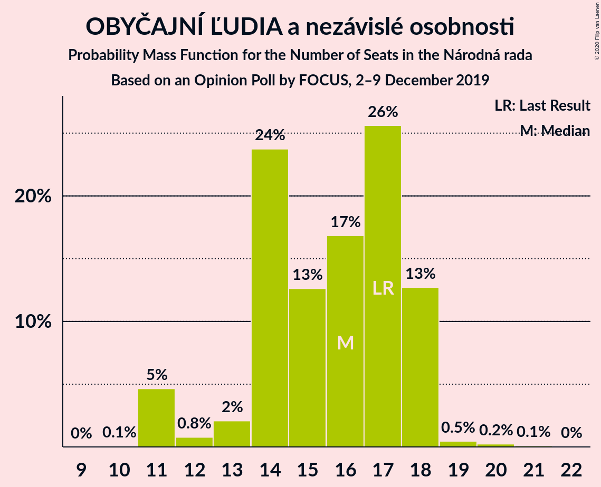

| Number of Seats | Probability | Accumulated | Special Marks |
|:---------------:|:-----------:|:-----------:|:-------------:|
| 10 | 0.1% | 100% |  |
| 11 | 5% | 99.9% |  |
| 12 | 0.8% | 95% |  |
| 13 | 2% | 94% |  |
| 14 | 24% | 92% |  |
| 15 | 13% | 69% |  |
| 16 | 17% | 56% | Median |
| 17 | 26% | 39% | Last Result |
| 18 | 13% | 14% |  |
| 19 | 0.5% | 0.9% |  |
| 20 | 0.2% | 0.4% |  |
| 21 | 0.1% | 0.1% |  |
| 22 | 0% | 0% |  |

### SME RODINA

*For a full overview of the results for this party, see the [SME RODINA](party-smerodina.html) page.*

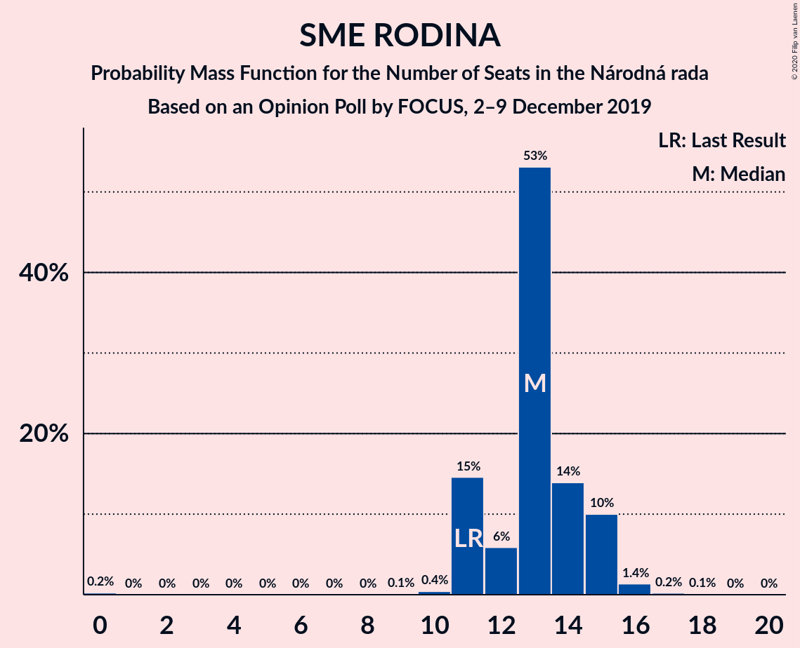

| Number of Seats | Probability | Accumulated | Special Marks |
|:---------------:|:-----------:|:-----------:|:-------------:|
| 0 | 0.2% | 100% |  |
| 1 | 0% | 99.8% |  |
| 2 | 0% | 99.8% |  |
| 3 | 0% | 99.8% |  |
| 4 | 0% | 99.8% |  |
| 5 | 0% | 99.8% |  |
| 6 | 0% | 99.8% |  |
| 7 | 0% | 99.8% |  |
| 8 | 0% | 99.8% |  |
| 9 | 0.1% | 99.8% |  |
| 10 | 0.4% | 99.6% |  |
| 11 | 15% | 99.2% | Last Result |
| 12 | 6% | 85% |  |
| 13 | 53% | 79% | Median |
| 14 | 14% | 26% |  |
| 15 | 10% | 12% |  |
| 16 | 1.4% | 2% |  |
| 17 | 0.2% | 0.3% |  |
| 18 | 0.1% | 0.1% |  |
| 19 | 0% | 0% |  |

### Sloboda a Solidarita

*For a full overview of the results for this party, see the [Sloboda a Solidarita](party-slobodaasolidarita.html) page.*

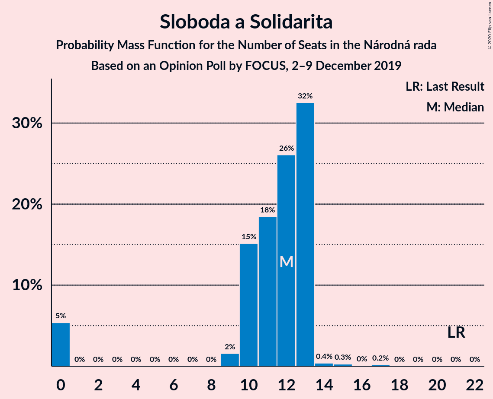

| Number of Seats | Probability | Accumulated | Special Marks |
|:---------------:|:-----------:|:-----------:|:-------------:|
| 0 | 5% | 100% |  |
| 1 | 0% | 95% |  |
| 2 | 0% | 95% |  |
| 3 | 0% | 95% |  |
| 4 | 0% | 95% |  |
| 5 | 0% | 95% |  |
| 6 | 0% | 95% |  |
| 7 | 0% | 95% |  |
| 8 | 0% | 95% |  |
| 9 | 2% | 95% |  |
| 10 | 15% | 93% |  |
| 11 | 18% | 78% |  |
| 12 | 26% | 59% | Median |
| 13 | 32% | 33% |  |
| 14 | 0.4% | 0.9% |  |
| 15 | 0.3% | 0.5% |  |
| 16 | 0% | 0.2% |  |
| 17 | 0.2% | 0.2% |  |
| 18 | 0% | 0% |  |
| 19 | 0% | 0% |  |
| 20 | 0% | 0% |  |
| 21 | 0% | 0% | Last Result |

### Kresťanskodemokratické hnutie

*For a full overview of the results for this party, see the [Kresťanskodemokratické hnutie](party-kresťanskodemokratickéhnutie.html) page.*

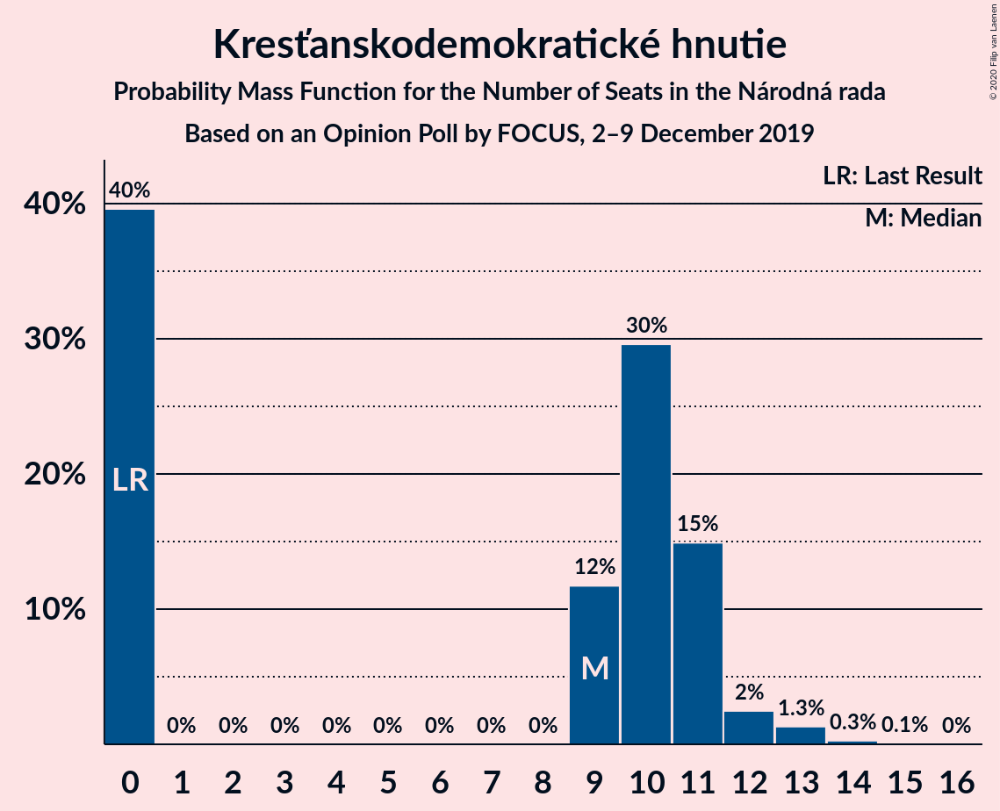

| Number of Seats | Probability | Accumulated | Special Marks |
|:---------------:|:-----------:|:-----------:|:-------------:|
| 0 | 40% | 100% | Last Result |
| 1 | 0% | 60% |  |
| 2 | 0% | 60% |  |
| 3 | 0% | 60% |  |
| 4 | 0% | 60% |  |
| 5 | 0% | 60% |  |
| 6 | 0% | 60% |  |
| 7 | 0% | 60% |  |
| 8 | 0% | 60% |  |
| 9 | 12% | 60% | Median |
| 10 | 30% | 49% |  |
| 11 | 15% | 19% |  |
| 12 | 2% | 4% |  |
| 13 | 1.3% | 2% |  |
| 14 | 0.3% | 0.3% |  |
| 15 | 0.1% | 0.1% |  |
| 16 | 0% | 0% |  |

### Slovenská národná strana

*For a full overview of the results for this party, see the [Slovenská národná strana](party-slovenskánárodnástrana.html) page.*

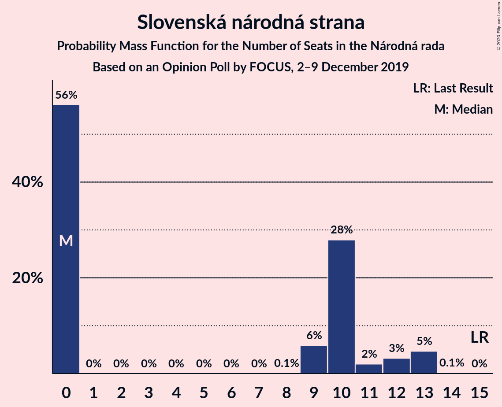

| Number of Seats | Probability | Accumulated | Special Marks |
|:---------------:|:-----------:|:-----------:|:-------------:|
| 0 | 56% | 100% | Median |
| 1 | 0% | 44% |  |
| 2 | 0% | 44% |  |
| 3 | 0% | 44% |  |
| 4 | 0% | 44% |  |
| 5 | 0% | 44% |  |
| 6 | 0% | 44% |  |
| 7 | 0% | 44% |  |
| 8 | 0.1% | 44% |  |
| 9 | 6% | 44% |  |
| 10 | 28% | 38% |  |
| 11 | 2% | 10% |  |
| 12 | 3% | 8% |  |
| 13 | 5% | 5% |  |
| 14 | 0.1% | 0.2% |  |
| 15 | 0% | 0% | Last Result |

### MOST–HÍD

*For a full overview of the results for this party, see the [MOST–HÍD](party-most–híd.html) page.*

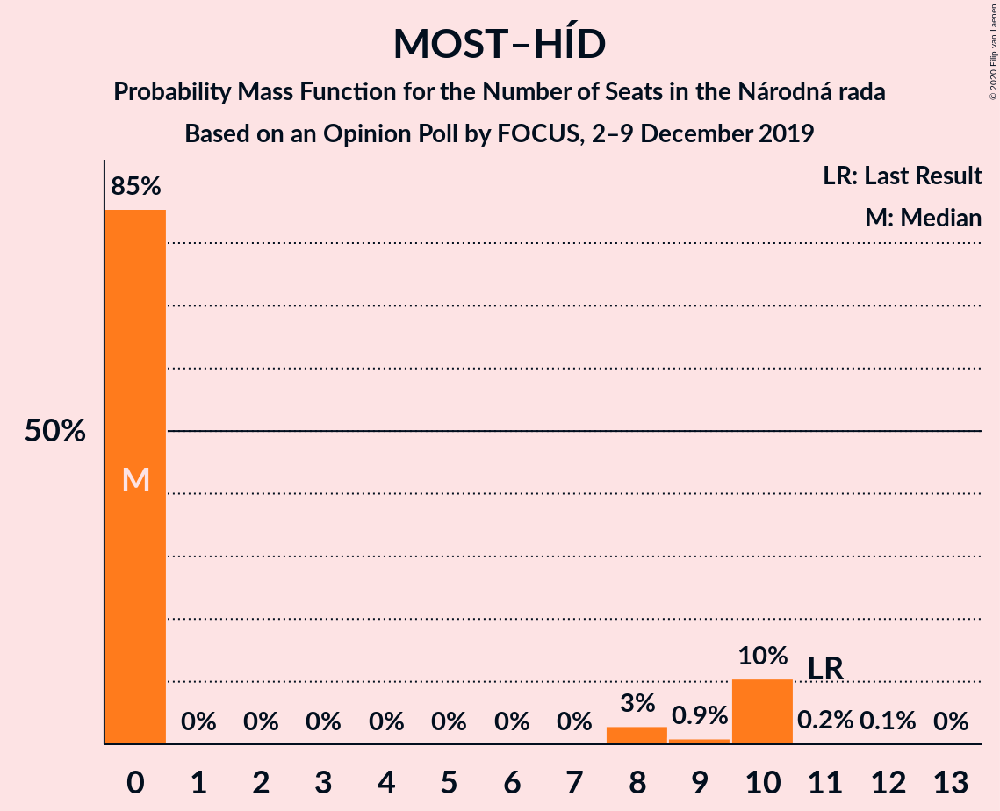

| Number of Seats | Probability | Accumulated | Special Marks |
|:---------------:|:-----------:|:-----------:|:-------------:|
| 0 | 85% | 100% | Median |
| 1 | 0% | 15% |  |
| 2 | 0% | 15% |  |
| 3 | 0% | 15% |  |
| 4 | 0% | 15% |  |
| 5 | 0% | 15% |  |
| 6 | 0% | 15% |  |
| 7 | 0% | 15% |  |
| 8 | 3% | 15% |  |
| 9 | 0.9% | 12% |  |
| 10 | 10% | 11% |  |
| 11 | 0.2% | 0.3% | Last Result |
| 12 | 0.1% | 0.1% |  |
| 13 | 0% | 0% |  |

### Strana maďarskej koalície–Magyar Koalíció Pártja

*For a full overview of the results for this party, see the [Strana maďarskej koalície–Magyar Koalíció Pártja](party-stranamaďarskejkoalície–magyarkoalíciópártja.html) page.*

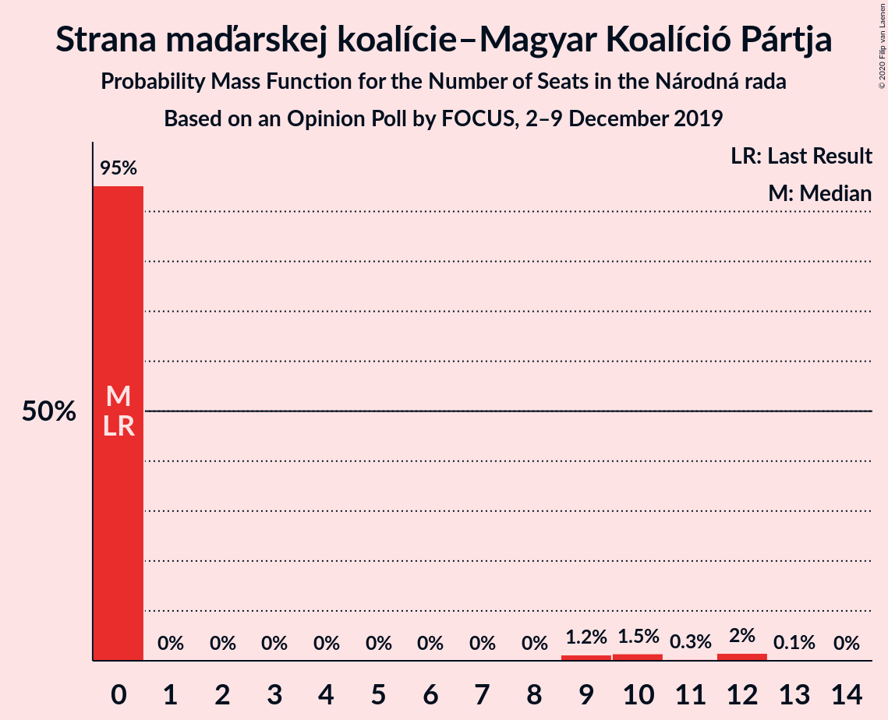

| Number of Seats | Probability | Accumulated | Special Marks |
|:---------------:|:-----------:|:-----------:|:-------------:|
| 0 | 95% | 100% | Last Result, Median |
| 1 | 0% | 5% |  |
| 2 | 0% | 5% |  |
| 3 | 0% | 5% |  |
| 4 | 0% | 5% |  |
| 5 | 0% | 5% |  |
| 6 | 0% | 5% |  |
| 7 | 0% | 5% |  |
| 8 | 0% | 5% |  |
| 9 | 1.2% | 5% |  |
| 10 | 1.5% | 4% |  |
| 11 | 0.3% | 2% |  |
| 12 | 2% | 2% |  |
| 13 | 0.1% | 0.2% |  |
| 14 | 0% | 0% |  |

### Dobrá voľba

*For a full overview of the results for this party, see the [Dobrá voľba](party-dobrávoľba.html) page.*

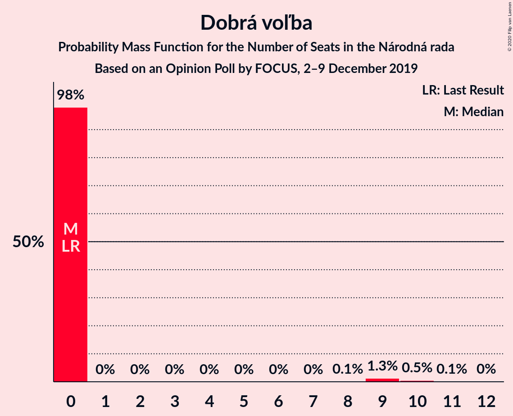

| Number of Seats | Probability | Accumulated | Special Marks |
|:---------------:|:-----------:|:-----------:|:-------------:|
| 0 | 98% | 100% | Last Result, Median |
| 1 | 0% | 2% |  |
| 2 | 0% | 2% |  |
| 3 | 0% | 2% |  |
| 4 | 0% | 2% |  |
| 5 | 0% | 2% |  |
| 6 | 0% | 2% |  |
| 7 | 0% | 2% |  |
| 8 | 0.1% | 2% |  |
| 9 | 1.3% | 2% |  |
| 10 | 0.5% | 0.6% |  |
| 11 | 0.1% | 0.1% |  |
| 12 | 0% | 0% |  |

### VLASŤ

*For a full overview of the results for this party, see the [VLASŤ](party-vlasť.html) page.*

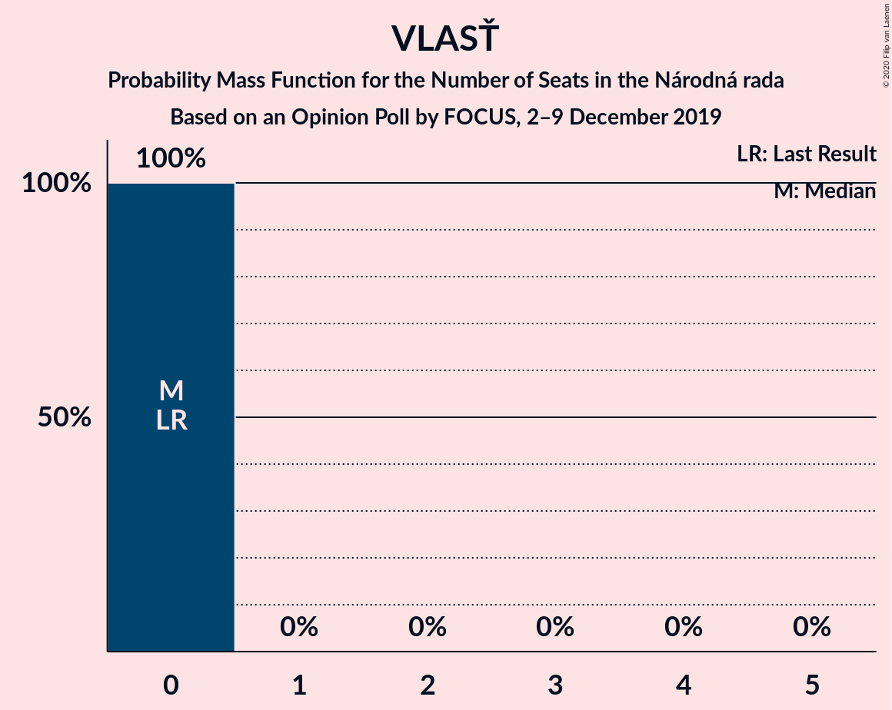

| Number of Seats | Probability | Accumulated | Special Marks |
|:---------------:|:-----------:|:-----------:|:-------------:|
| 0 | 100% | 100% | Last Result, Median |

## Coalitions

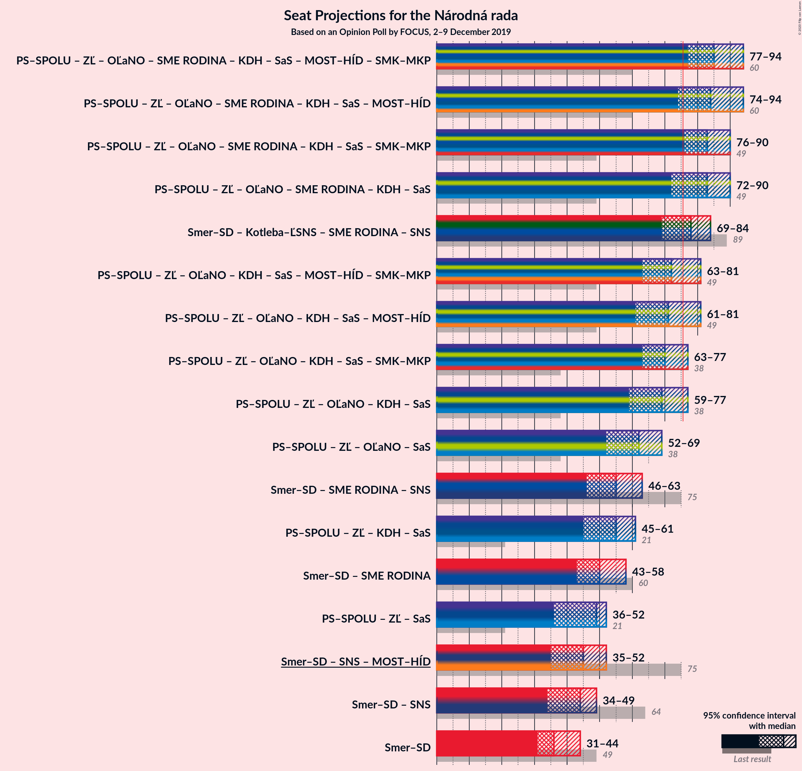

### Confidence Intervals

| Coalition | Last Result | Median | Majority? | 80% Confidence Interval | 90% Confidence Interval | 95% Confidence Interval | 99% Confidence Interval |
|:---------:|:-----------:|:------:|:---------:|:-----------------------:|:-----------------------:|:-----------------------:|:-----------------------:|
| Progresívne Slovensko–SPOLU–Občianska Demokracia – Za ľudí – OBYČAJNÍ ĽUDIA a nezávislé osobnosti – SME RODINA – Kresťanskodemokratické hnutie – Sloboda a Solidarita – MOST–HÍD – Strana maďarskej koalície–Magyar Koalíció Pártja | 60 | 85 | 98.6% | 81–92 | 80–94 | 77–94 | 74–94 |
| Progresívne Slovensko–SPOLU–Občianska Demokracia – Za ľudí – OBYČAJNÍ ĽUDIA a nezávislé osobnosti – SME RODINA – Kresťanskodemokratické hnutie – Sloboda a Solidarita – MOST–HÍD | 60 | 84 | 96% | 81–91 | 77–94 | 74–94 | 65–94 |
| Progresívne Slovensko–SPOLU–Občianska Demokracia – Za ľudí – OBYČAJNÍ ĽUDIA a nezávislé osobnosti – SME RODINA – Kresťanskodemokratické hnutie – Sloboda a Solidarita – Strana maďarskej koalície–Magyar Koalíció Pártja | 49 | 83 | 98% | 80–89 | 78–90 | 76–90 | 67–93 |
| Progresívne Slovensko–SPOLU–Občianska Demokracia – Za ľudí – OBYČAJNÍ ĽUDIA a nezávislé osobnosti – SME RODINA – Kresťanskodemokratické hnutie – Sloboda a Solidarita | 49 | 83 | 95% | 79–89 | 75–90 | 72–90 | 65–92 |
| SMER–sociálna demokracia – Kotleba–Ľudová strana Naše Slovensko – SME RODINA – Slovenská národná strana | 89 | 78 | 75% | 71–81 | 69–82 | 69–84 | 67–88 |
| Progresívne Slovensko–SPOLU–Občianska Demokracia – Za ľudí – OBYČAJNÍ ĽUDIA a nezávislé osobnosti – Kresťanskodemokratické hnutie – Sloboda a Solidarita – MOST–HÍD – Strana maďarskej koalície–Magyar Koalíció Pártja | 49 | 72 | 15% | 69–79 | 68–81 | 63–81 | 62–82 |
| Progresívne Slovensko–SPOLU–Občianska Demokracia – Za ľudí – OBYČAJNÍ ĽUDIA a nezávislé osobnosti – Kresťanskodemokratické hnutie – Sloboda a Solidarita – MOST–HÍD | 49 | 71 | 14% | 68–78 | 63–81 | 61–81 | 54–82 |
| Progresívne Slovensko–SPOLU–Občianska Demokracia – Za ľudí – OBYČAJNÍ ĽUDIA a nezávislé osobnosti – Kresťanskodemokratické hnutie – Sloboda a Solidarita – Strana maďarskej koalície–Magyar Koalíció Pártja | 38 | 70 | 4% | 68–75 | 66–75 | 63–77 | 52–82 |
| Progresívne Slovensko–SPOLU–Občianska Demokracia – Za ľudí – OBYČAJNÍ ĽUDIA a nezávislé osobnosti – Kresťanskodemokratické hnutie – Sloboda a Solidarita | 38 | 69 | 3% | 67–75 | 63–75 | 59–77 | 52–80 |
| Progresívne Slovensko–SPOLU–Občianska Demokracia – Za ľudí – OBYČAJNÍ ĽUDIA a nezávislé osobnosti – Sloboda a Solidarita | 38 | 62 | 0% | 58–69 | 54–69 | 52–69 | 47–72 |
| SMER–sociálna demokracia – SME RODINA – Slovenská národná strana | 75 | 55 | 0% | 50–58 | 48–60 | 46–63 | 45–68 |
| Progresívne Slovensko–SPOLU–Občianska Demokracia – Za ľudí – Kresťanskodemokratické hnutie – Sloboda a Solidarita | 21 | 55 | 0% | 51–60 | 48–60 | 45–61 | 37–63 |
| SMER–sociálna demokracia – SME RODINA | 60 | 50 | 0% | 46–58 | 43–58 | 43–58 | 41–58 |
| Progresívne Slovensko–SPOLU–Občianska Demokracia – Za ľudí – Sloboda a Solidarita | 21 | 49 | 0% | 42–52 | 39–52 | 36–52 | 33–55 |
| SMER–sociálna demokracia – Slovenská národná strana – MOST–HÍD | 75 | 45 | 0% | 38–47 | 35–50 | 35–52 | 34–60 |
| SMER–sociálna demokracia – Slovenská národná strana | 64 | 44 | 0% | 35–46 | 35–47 | 34–49 | 34–53 |
| SMER–sociálna demokracia | 49 | 36 | 0% | 34–44 | 32–44 | 31–44 | 30–44 |

### Progresívne Slovensko–SPOLU–Občianska Demokracia – Za ľudí – OBYČAJNÍ ĽUDIA a nezávislé osobnosti – SME RODINA – Kresťanskodemokratické hnutie – Sloboda a Solidarita – MOST–HÍD – Strana maďarskej koalície–Magyar Koalíció Pártja

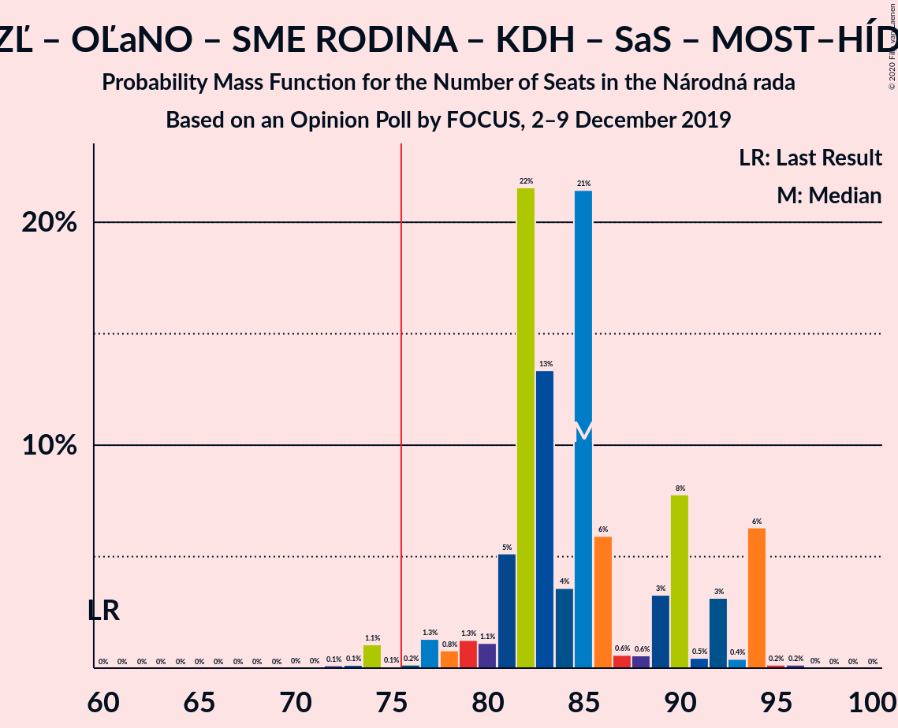

| Number of Seats | Probability | Accumulated | Special Marks |
|:---------------:|:-----------:|:-----------:|:-------------:|
| 60 | 0% | 100% | Last Result |
| 61 | 0% | 100% |  |
| 62 | 0% | 100% |  |
| 63 | 0% | 100% |  |
| 64 | 0% | 100% |  |
| 65 | 0% | 100% |  |
| 66 | 0% | 100% |  |
| 67 | 0% | 100% |  |
| 68 | 0% | 100% |  |
| 69 | 0% | 100% |  |
| 70 | 0% | 100% |  |
| 71 | 0% | 99.9% |  |
| 72 | 0.1% | 99.9% |  |
| 73 | 0.1% | 99.8% |  |
| 74 | 1.1% | 99.7% |  |
| 75 | 0.1% | 98.6% |  |
| 76 | 0.2% | 98.6% | Majority |
| 77 | 1.3% | 98% |  |
| 78 | 0.8% | 97% |  |
| 79 | 1.3% | 96% |  |
| 80 | 1.1% | 95% |  |
| 81 | 5% | 94% |  |
| 82 | 22% | 89% |  |
| 83 | 13% | 67% |  |
| 84 | 4% | 54% |  |
| 85 | 21% | 50% |  |
| 86 | 6% | 29% |  |
| 87 | 0.6% | 23% | Median |
| 88 | 0.6% | 22% |  |
| 89 | 3% | 22% |  |
| 90 | 8% | 18% |  |
| 91 | 0.5% | 11% |  |
| 92 | 3% | 10% |  |
| 93 | 0.4% | 7% |  |
| 94 | 6% | 7% |  |
| 95 | 0.2% | 0.4% |  |
| 96 | 0.2% | 0.2% |  |
| 97 | 0% | 0.1% |  |
| 98 | 0% | 0% |  |

### Progresívne Slovensko–SPOLU–Občianska Demokracia – Za ľudí – OBYČAJNÍ ĽUDIA a nezávislé osobnosti – SME RODINA – Kresťanskodemokratické hnutie – Sloboda a Solidarita – MOST–HÍD

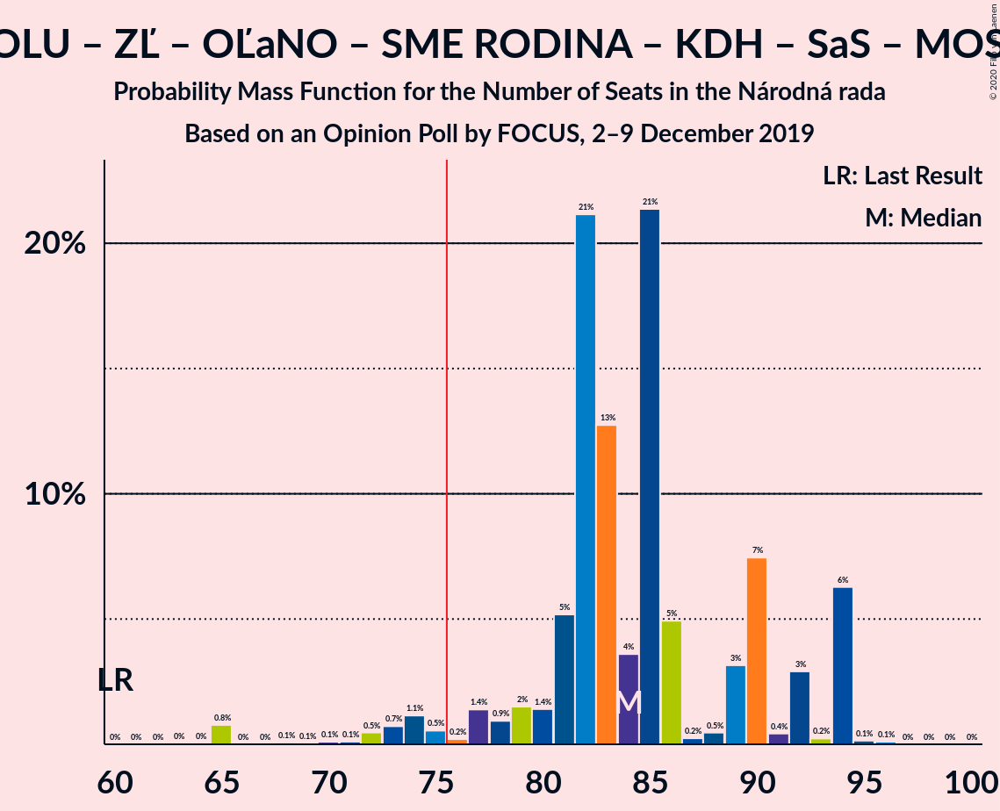

| Number of Seats | Probability | Accumulated | Special Marks |
|:---------------:|:-----------:|:-----------:|:-------------:|
| 60 | 0% | 100% | Last Result |
| 61 | 0% | 100% |  |
| 62 | 0% | 100% |  |
| 63 | 0% | 100% |  |
| 64 | 0% | 100% |  |
| 65 | 0.8% | 99.9% |  |
| 66 | 0% | 99.2% |  |
| 67 | 0% | 99.1% |  |
| 68 | 0.1% | 99.1% |  |
| 69 | 0.1% | 99.1% |  |
| 70 | 0.1% | 99.0% |  |
| 71 | 0.1% | 98.9% |  |
| 72 | 0.5% | 98.8% |  |
| 73 | 0.7% | 98% |  |
| 74 | 1.1% | 98% |  |
| 75 | 0.5% | 96% |  |
| 76 | 0.2% | 96% | Majority |
| 77 | 1.4% | 96% |  |
| 78 | 0.9% | 94% |  |
| 79 | 2% | 93% |  |
| 80 | 1.4% | 92% |  |
| 81 | 5% | 90% |  |
| 82 | 21% | 85% |  |
| 83 | 13% | 64% |  |
| 84 | 4% | 51% |  |
| 85 | 21% | 48% |  |
| 86 | 5% | 26% |  |
| 87 | 0.2% | 21% | Median |
| 88 | 0.5% | 21% |  |
| 89 | 3% | 21% |  |
| 90 | 7% | 18% |  |
| 91 | 0.4% | 10% |  |
| 92 | 3% | 10% |  |
| 93 | 0.2% | 7% |  |
| 94 | 6% | 7% |  |
| 95 | 0.1% | 0.3% |  |
| 96 | 0.1% | 0.1% |  |
| 97 | 0% | 0% |  |

### Progresívne Slovensko–SPOLU–Občianska Demokracia – Za ľudí – OBYČAJNÍ ĽUDIA a nezávislé osobnosti – SME RODINA – Kresťanskodemokratické hnutie – Sloboda a Solidarita – Strana maďarskej koalície–Magyar Koalíció Pártja

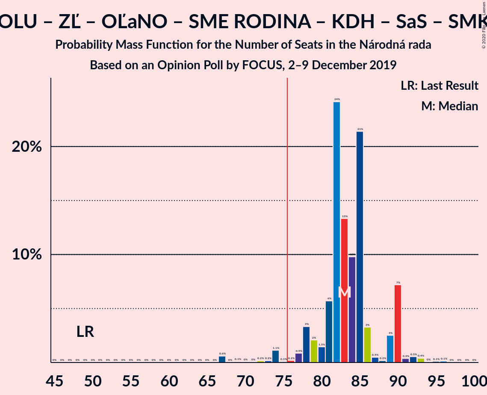

| Number of Seats | Probability | Accumulated | Special Marks |
|:---------------:|:-----------:|:-----------:|:-------------:|
| 49 | 0% | 100% | Last Result |
| 50 | 0% | 100% |  |
| 51 | 0% | 100% |  |
| 52 | 0% | 100% |  |
| 53 | 0% | 100% |  |
| 54 | 0% | 100% |  |
| 55 | 0% | 100% |  |
| 56 | 0% | 100% |  |
| 57 | 0% | 100% |  |
| 58 | 0% | 100% |  |
| 59 | 0% | 100% |  |
| 60 | 0% | 100% |  |
| 61 | 0% | 100% |  |
| 62 | 0% | 100% |  |
| 63 | 0% | 100% |  |
| 64 | 0% | 100% |  |
| 65 | 0% | 100% |  |
| 66 | 0% | 100% |  |
| 67 | 0.6% | 100% |  |
| 68 | 0% | 99.4% |  |
| 69 | 0.1% | 99.3% |  |
| 70 | 0% | 99.3% |  |
| 71 | 0% | 99.2% |  |
| 72 | 0.2% | 99.2% |  |
| 73 | 0.2% | 99.0% |  |
| 74 | 1.1% | 98.9% |  |
| 75 | 0.1% | 98% |  |
| 76 | 0.2% | 98% | Majority |
| 77 | 0.9% | 97% |  |
| 78 | 3% | 97% |  |
| 79 | 2% | 93% |  |
| 80 | 1.5% | 91% |  |
| 81 | 6% | 90% |  |
| 82 | 24% | 84% |  |
| 83 | 13% | 60% |  |
| 84 | 10% | 47% |  |
| 85 | 21% | 37% |  |
| 86 | 3% | 15% |  |
| 87 | 0.5% | 12% | Median |
| 88 | 0.2% | 12% |  |
| 89 | 3% | 11% |  |
| 90 | 7% | 9% |  |
| 91 | 0.4% | 2% |  |
| 92 | 0.5% | 1.3% |  |
| 93 | 0.4% | 0.7% |  |
| 94 | 0% | 0.3% |  |
| 95 | 0.1% | 0.3% |  |
| 96 | 0.1% | 0.2% |  |
| 97 | 0% | 0% |  |

### Progresívne Slovensko–SPOLU–Občianska Demokracia – Za ľudí – OBYČAJNÍ ĽUDIA a nezávislé osobnosti – SME RODINA – Kresťanskodemokratické hnutie – Sloboda a Solidarita

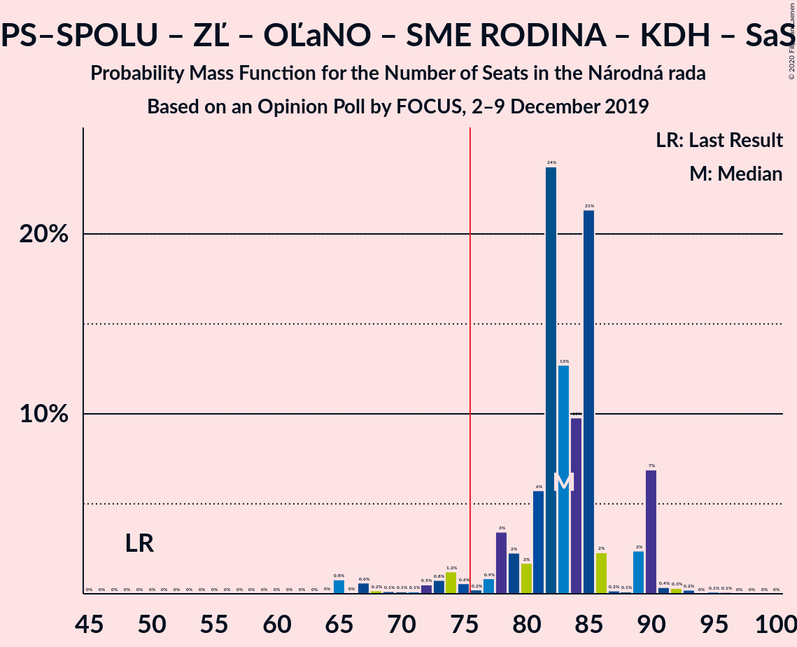

| Number of Seats | Probability | Accumulated | Special Marks |
|:---------------:|:-----------:|:-----------:|:-------------:|
| 49 | 0% | 100% | Last Result |
| 50 | 0% | 100% |  |
| 51 | 0% | 100% |  |
| 52 | 0% | 100% |  |
| 53 | 0% | 100% |  |
| 54 | 0% | 100% |  |
| 55 | 0% | 100% |  |
| 56 | 0% | 100% |  |
| 57 | 0% | 100% |  |
| 58 | 0% | 100% |  |
| 59 | 0% | 100% |  |
| 60 | 0% | 100% |  |
| 61 | 0% | 100% |  |
| 62 | 0% | 100% |  |
| 63 | 0% | 100% |  |
| 64 | 0% | 100% |  |
| 65 | 0.8% | 99.9% |  |
| 66 | 0% | 99.1% |  |
| 67 | 0.6% | 99.1% |  |
| 68 | 0.2% | 98% |  |
| 69 | 0.1% | 98% |  |
| 70 | 0.1% | 98% |  |
| 71 | 0.1% | 98% |  |
| 72 | 0.5% | 98% |  |
| 73 | 0.8% | 97% |  |
| 74 | 1.2% | 97% |  |
| 75 | 0.6% | 95% |  |
| 76 | 0.2% | 95% | Majority |
| 77 | 0.9% | 95% |  |
| 78 | 3% | 94% |  |
| 79 | 2% | 90% |  |
| 80 | 2% | 88% |  |
| 81 | 6% | 86% |  |
| 82 | 24% | 81% |  |
| 83 | 13% | 57% |  |
| 84 | 10% | 44% |  |
| 85 | 21% | 34% |  |
| 86 | 2% | 13% |  |
| 87 | 0.2% | 11% | Median |
| 88 | 0.1% | 11% |  |
| 89 | 2% | 10% |  |
| 90 | 7% | 8% |  |
| 91 | 0.4% | 1.1% |  |
| 92 | 0.3% | 0.8% |  |
| 93 | 0.2% | 0.5% |  |
| 94 | 0% | 0.2% |  |
| 95 | 0.1% | 0.2% |  |
| 96 | 0.1% | 0.1% |  |
| 97 | 0% | 0% |  |

### SMER–sociálna demokracia – Kotleba–Ľudová strana Naše Slovensko – SME RODINA – Slovenská národná strana

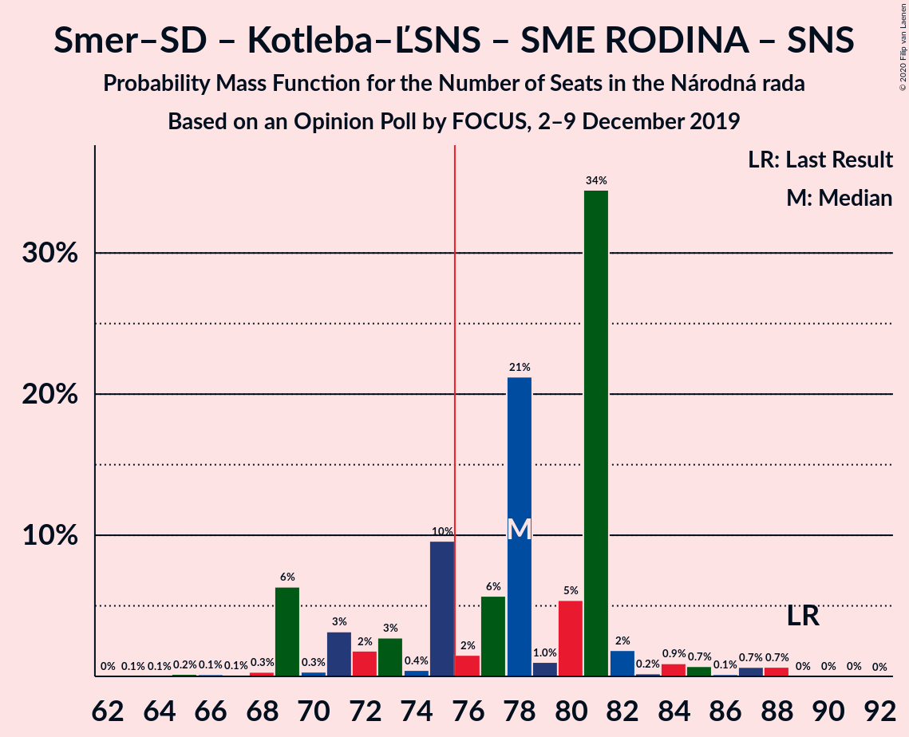

| Number of Seats | Probability | Accumulated | Special Marks |
|:---------------:|:-----------:|:-----------:|:-------------:|
| 63 | 0.1% | 100% |  |
| 64 | 0.1% | 99.9% |  |
| 65 | 0.2% | 99.8% |  |
| 66 | 0.1% | 99.7% |  |
| 67 | 0.1% | 99.5% |  |
| 68 | 0.3% | 99.4% |  |
| 69 | 6% | 99.1% |  |
| 70 | 0.3% | 93% |  |
| 71 | 3% | 92% | Median |
| 72 | 2% | 89% |  |
| 73 | 3% | 87% |  |
| 74 | 0.4% | 85% |  |
| 75 | 10% | 84% |  |
| 76 | 2% | 75% | Majority |
| 77 | 6% | 73% |  |
| 78 | 21% | 67% |  |
| 79 | 1.0% | 46% |  |
| 80 | 5% | 45% |  |
| 81 | 34% | 40% |  |
| 82 | 2% | 5% |  |
| 83 | 0.2% | 3% |  |
| 84 | 0.9% | 3% |  |
| 85 | 0.7% | 2% |  |
| 86 | 0.1% | 2% |  |
| 87 | 0.7% | 1.5% |  |
| 88 | 0.7% | 0.8% |  |
| 89 | 0% | 0.2% | Last Result |
| 90 | 0% | 0.1% |  |
| 91 | 0% | 0.1% |  |
| 92 | 0% | 0% |  |

### Progresívne Slovensko–SPOLU–Občianska Demokracia – Za ľudí – OBYČAJNÍ ĽUDIA a nezávislé osobnosti – Kresťanskodemokratické hnutie – Sloboda a Solidarita – MOST–HÍD – Strana maďarskej koalície–Magyar Koalíció Pártja

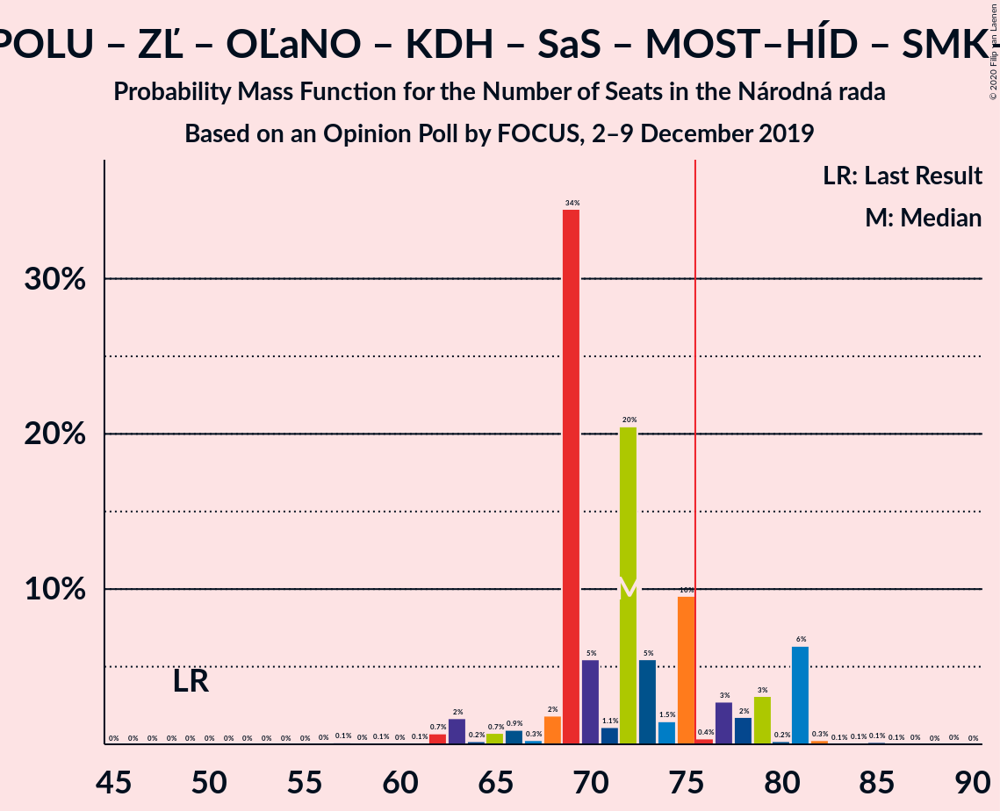

| Number of Seats | Probability | Accumulated | Special Marks |
|:---------------:|:-----------:|:-----------:|:-------------:|
| 49 | 0% | 100% | Last Result |
| 50 | 0% | 100% |  |
| 51 | 0% | 100% |  |
| 52 | 0% | 100% |  |
| 53 | 0% | 100% |  |
| 54 | 0% | 100% |  |
| 55 | 0% | 100% |  |
| 56 | 0% | 100% |  |
| 57 | 0.1% | 100% |  |
| 58 | 0% | 99.8% |  |
| 59 | 0.1% | 99.8% |  |
| 60 | 0% | 99.8% |  |
| 61 | 0.1% | 99.7% |  |
| 62 | 0.7% | 99.6% |  |
| 63 | 2% | 98.9% |  |
| 64 | 0.2% | 97% |  |
| 65 | 0.7% | 97% |  |
| 66 | 0.9% | 96% |  |
| 67 | 0.3% | 95% |  |
| 68 | 2% | 95% |  |
| 69 | 34% | 93% |  |
| 70 | 5% | 59% |  |
| 71 | 1.1% | 53% |  |
| 72 | 20% | 52% |  |
| 73 | 5% | 32% |  |
| 74 | 1.5% | 26% | Median |
| 75 | 10% | 25% |  |
| 76 | 0.4% | 15% | Majority |
| 77 | 3% | 15% |  |
| 78 | 2% | 12% |  |
| 79 | 3% | 10% |  |
| 80 | 0.2% | 7% |  |
| 81 | 6% | 7% |  |
| 82 | 0.3% | 0.7% |  |
| 83 | 0.1% | 0.4% |  |
| 84 | 0.1% | 0.4% |  |
| 85 | 0.1% | 0.3% |  |
| 86 | 0.1% | 0.1% |  |
| 87 | 0% | 0.1% |  |
| 88 | 0% | 0% |  |

### Progresívne Slovensko–SPOLU–Občianska Demokracia – Za ľudí – OBYČAJNÍ ĽUDIA a nezávislé osobnosti – Kresťanskodemokratické hnutie – Sloboda a Solidarita – MOST–HÍD

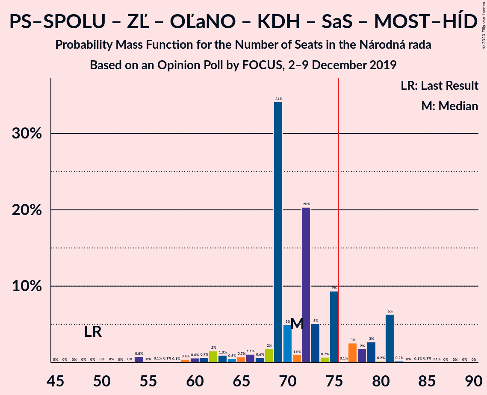

| Number of Seats | Probability | Accumulated | Special Marks |
|:---------------:|:-----------:|:-----------:|:-------------:|
| 49 | 0% | 100% | Last Result |
| 50 | 0% | 100% |  |
| 51 | 0% | 100% |  |
| 52 | 0% | 100% |  |
| 53 | 0% | 100% |  |
| 54 | 0.8% | 99.9% |  |
| 55 | 0% | 99.1% |  |
| 56 | 0.1% | 99.1% |  |
| 57 | 0.1% | 99.0% |  |
| 58 | 0.1% | 98.9% |  |
| 59 | 0.4% | 98.8% |  |
| 60 | 0.6% | 98% |  |
| 61 | 0.7% | 98% |  |
| 62 | 2% | 97% |  |
| 63 | 1.0% | 96% |  |
| 64 | 0.5% | 95% |  |
| 65 | 0.7% | 94% |  |
| 66 | 1.1% | 93% |  |
| 67 | 0.6% | 92% |  |
| 68 | 2% | 92% |  |
| 69 | 34% | 90% |  |
| 70 | 5% | 56% |  |
| 71 | 1.0% | 51% |  |
| 72 | 20% | 50% |  |
| 73 | 5% | 29% |  |
| 74 | 0.7% | 24% | Median |
| 75 | 9% | 24% |  |
| 76 | 0.1% | 14% | Majority |
| 77 | 3% | 14% |  |
| 78 | 2% | 12% |  |
| 79 | 3% | 10% |  |
| 80 | 0.2% | 7% |  |
| 81 | 6% | 7% |  |
| 82 | 0.2% | 0.5% |  |
| 83 | 0% | 0.3% |  |
| 84 | 0.1% | 0.3% |  |
| 85 | 0.1% | 0.2% |  |
| 86 | 0.1% | 0.1% |  |
| 87 | 0% | 0% |  |

### Progresívne Slovensko–SPOLU–Občianska Demokracia – Za ľudí – OBYČAJNÍ ĽUDIA a nezávislé osobnosti – Kresťanskodemokratické hnutie – Sloboda a Solidarita – Strana maďarskej koalície–Magyar Koalíció Pártja

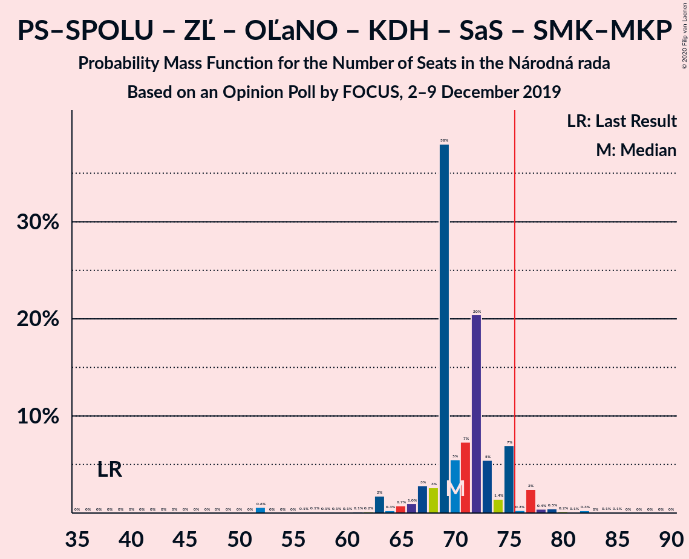

| Number of Seats | Probability | Accumulated | Special Marks |
|:---------------:|:-----------:|:-----------:|:-------------:|
| 38 | 0% | 100% | Last Result |
| 39 | 0% | 100% |  |
| 40 | 0% | 100% |  |
| 41 | 0% | 100% |  |
| 42 | 0% | 100% |  |
| 43 | 0% | 100% |  |
| 44 | 0% | 100% |  |
| 45 | 0% | 100% |  |
| 46 | 0% | 100% |  |
| 47 | 0% | 100% |  |
| 48 | 0% | 100% |  |
| 49 | 0% | 100% |  |
| 50 | 0% | 100% |  |
| 51 | 0% | 100% |  |
| 52 | 0.6% | 100% |  |
| 53 | 0% | 99.4% |  |
| 54 | 0% | 99.4% |  |
| 55 | 0% | 99.4% |  |
| 56 | 0.1% | 99.4% |  |
| 57 | 0.1% | 99.3% |  |
| 58 | 0.1% | 99.2% |  |
| 59 | 0.1% | 99.1% |  |
| 60 | 0.1% | 99.0% |  |
| 61 | 0.1% | 98.9% |  |
| 62 | 0.2% | 98.8% |  |
| 63 | 2% | 98.7% |  |
| 64 | 0.3% | 97% |  |
| 65 | 0.7% | 97% |  |
| 66 | 1.0% | 96% |  |
| 67 | 3% | 95% |  |
| 68 | 3% | 92% |  |
| 69 | 38% | 89% |  |
| 70 | 5% | 51% |  |
| 71 | 7% | 46% |  |
| 72 | 20% | 39% |  |
| 73 | 5% | 18% |  |
| 74 | 1.4% | 13% | Median |
| 75 | 7% | 11% |  |
| 76 | 0.3% | 4% | Majority |
| 77 | 2% | 4% |  |
| 78 | 0.4% | 2% |  |
| 79 | 0.5% | 1.2% |  |
| 80 | 0.2% | 0.8% |  |
| 81 | 0.1% | 0.6% |  |
| 82 | 0.3% | 0.5% |  |
| 83 | 0% | 0.3% |  |
| 84 | 0.1% | 0.2% |  |
| 85 | 0.1% | 0.2% |  |
| 86 | 0% | 0.1% |  |
| 87 | 0% | 0% |  |

### Progresívne Slovensko–SPOLU–Občianska Demokracia – Za ľudí – OBYČAJNÍ ĽUDIA a nezávislé osobnosti – Kresťanskodemokratické hnutie – Sloboda a Solidarita

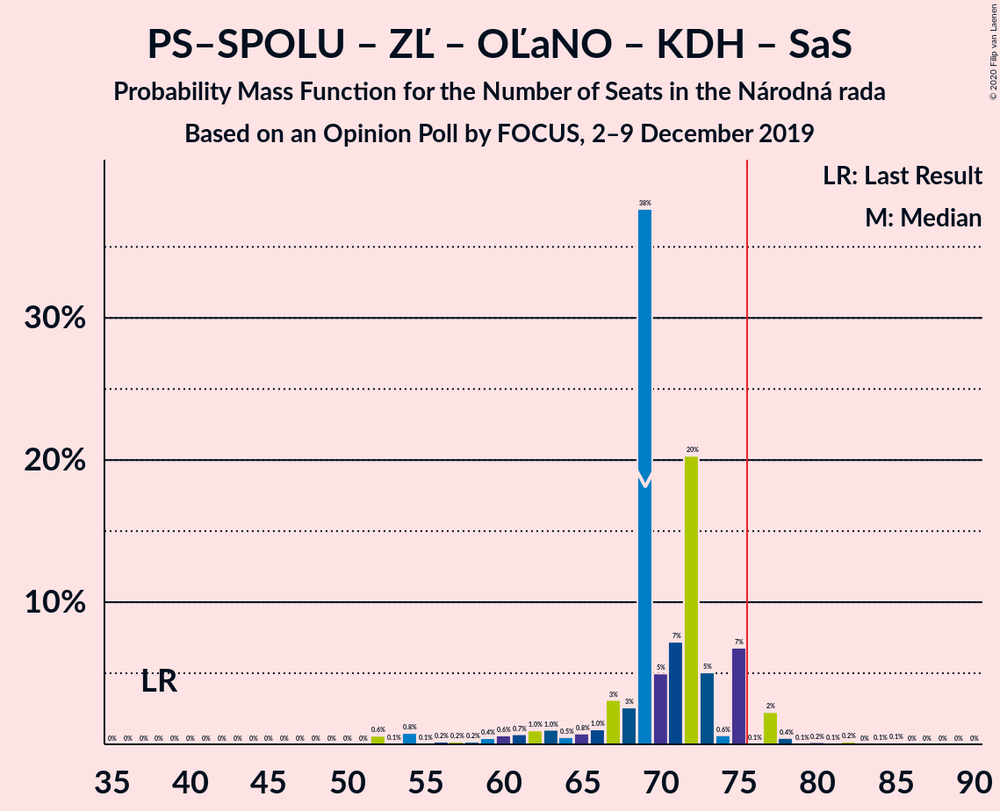

| Number of Seats | Probability | Accumulated | Special Marks |
|:---------------:|:-----------:|:-----------:|:-------------:|
| 38 | 0% | 100% | Last Result |
| 39 | 0% | 100% |  |
| 40 | 0% | 100% |  |
| 41 | 0% | 100% |  |
| 42 | 0% | 100% |  |
| 43 | 0% | 100% |  |
| 44 | 0% | 100% |  |
| 45 | 0% | 100% |  |
| 46 | 0% | 100% |  |
| 47 | 0% | 100% |  |
| 48 | 0% | 100% |  |
| 49 | 0% | 100% |  |
| 50 | 0% | 100% |  |
| 51 | 0% | 100% |  |
| 52 | 0.6% | 100% |  |
| 53 | 0.1% | 99.4% |  |
| 54 | 0.8% | 99.3% |  |
| 55 | 0.1% | 98.5% |  |
| 56 | 0.2% | 98% |  |
| 57 | 0.2% | 98% |  |
| 58 | 0.2% | 98% |  |
| 59 | 0.4% | 98% |  |
| 60 | 0.6% | 97% |  |
| 61 | 0.7% | 97% |  |
| 62 | 1.0% | 96% |  |
| 63 | 1.0% | 95% |  |
| 64 | 0.5% | 94% |  |
| 65 | 0.8% | 94% |  |
| 66 | 1.0% | 93% |  |
| 67 | 3% | 92% |  |
| 68 | 3% | 89% |  |
| 69 | 38% | 86% |  |
| 70 | 5% | 48% |  |
| 71 | 7% | 43% |  |
| 72 | 20% | 36% |  |
| 73 | 5% | 16% |  |
| 74 | 0.6% | 11% | Median |
| 75 | 7% | 10% |  |
| 76 | 0.1% | 3% | Majority |
| 77 | 2% | 3% |  |
| 78 | 0.4% | 1.1% |  |
| 79 | 0.1% | 0.7% |  |
| 80 | 0.2% | 0.6% |  |
| 81 | 0.1% | 0.5% |  |
| 82 | 0.2% | 0.4% |  |
| 83 | 0% | 0.2% |  |
| 84 | 0.1% | 0.2% |  |
| 85 | 0.1% | 0.1% |  |
| 86 | 0% | 0% |  |

### Progresívne Slovensko–SPOLU–Občianska Demokracia – Za ľudí – OBYČAJNÍ ĽUDIA a nezávislé osobnosti – Sloboda a Solidarita

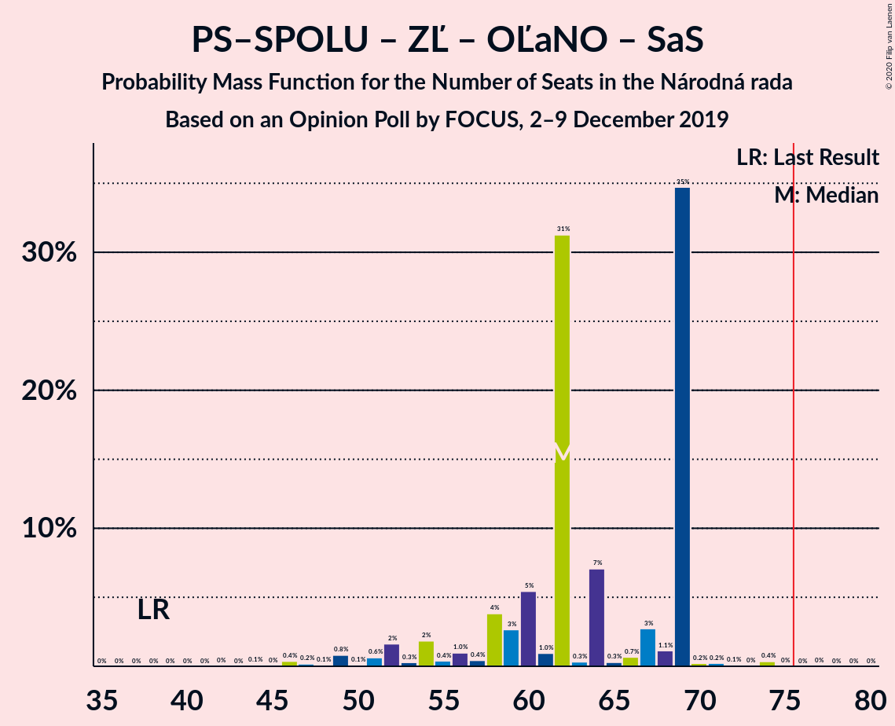

| Number of Seats | Probability | Accumulated | Special Marks |
|:---------------:|:-----------:|:-----------:|:-------------:|
| 38 | 0% | 100% | Last Result |
| 39 | 0% | 100% |  |
| 40 | 0% | 100% |  |
| 41 | 0% | 100% |  |
| 42 | 0% | 100% |  |
| 43 | 0% | 100% |  |
| 44 | 0.1% | 100% |  |
| 45 | 0% | 99.9% |  |
| 46 | 0.4% | 99.9% |  |
| 47 | 0.2% | 99.5% |  |
| 48 | 0.1% | 99.3% |  |
| 49 | 0.8% | 99.2% |  |
| 50 | 0.1% | 98% |  |
| 51 | 0.6% | 98% |  |
| 52 | 2% | 98% |  |
| 53 | 0.3% | 96% |  |
| 54 | 2% | 96% |  |
| 55 | 0.4% | 94% |  |
| 56 | 1.0% | 94% |  |
| 57 | 0.4% | 93% |  |
| 58 | 4% | 92% |  |
| 59 | 3% | 88% |  |
| 60 | 5% | 86% |  |
| 61 | 1.0% | 80% |  |
| 62 | 31% | 79% |  |
| 63 | 0.3% | 48% |  |
| 64 | 7% | 48% |  |
| 65 | 0.3% | 41% | Median |
| 66 | 0.7% | 40% |  |
| 67 | 3% | 40% |  |
| 68 | 1.1% | 37% |  |
| 69 | 35% | 36% |  |
| 70 | 0.2% | 1.0% |  |
| 71 | 0.2% | 0.7% |  |
| 72 | 0.1% | 0.5% |  |
| 73 | 0% | 0.4% |  |
| 74 | 0.4% | 0.4% |  |
| 75 | 0% | 0.1% |  |
| 76 | 0% | 0% | Majority |

### SMER–sociálna demokracia – SME RODINA – Slovenská národná strana

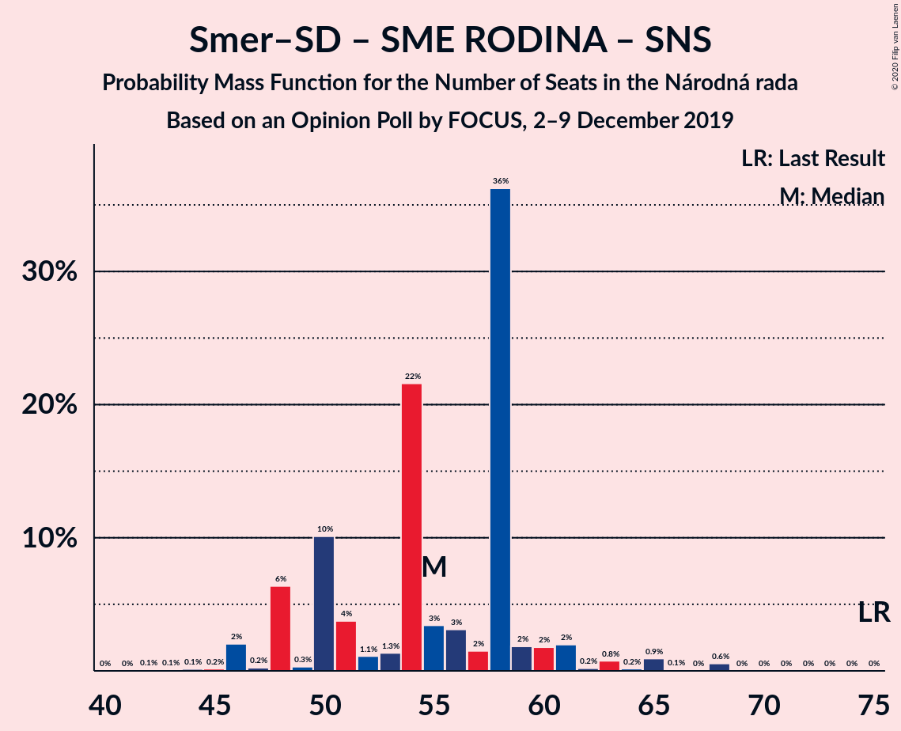

| Number of Seats | Probability | Accumulated | Special Marks |
|:---------------:|:-----------:|:-----------:|:-------------:|
| 42 | 0.1% | 100% |  |
| 43 | 0.1% | 99.9% |  |
| 44 | 0.1% | 99.8% |  |
| 45 | 0.2% | 99.7% |  |
| 46 | 2% | 99.5% |  |
| 47 | 0.2% | 97% |  |
| 48 | 6% | 97% |  |
| 49 | 0.3% | 91% | Median |
| 50 | 10% | 91% |  |
| 51 | 4% | 80% |  |
| 52 | 1.1% | 77% |  |
| 53 | 1.3% | 76% |  |
| 54 | 22% | 74% |  |
| 55 | 3% | 53% |  |
| 56 | 3% | 49% |  |
| 57 | 2% | 46% |  |
| 58 | 36% | 45% |  |
| 59 | 2% | 8% |  |
| 60 | 2% | 6% |  |
| 61 | 2% | 5% |  |
| 62 | 0.2% | 3% |  |
| 63 | 0.8% | 3% |  |
| 64 | 0.2% | 2% |  |
| 65 | 0.9% | 2% |  |
| 66 | 0.1% | 0.7% |  |
| 67 | 0% | 0.6% |  |
| 68 | 0.6% | 0.6% |  |
| 69 | 0% | 0% |  |
| 70 | 0% | 0% |  |
| 71 | 0% | 0% |  |
| 72 | 0% | 0% |  |
| 73 | 0% | 0% |  |
| 74 | 0% | 0% |  |
| 75 | 0% | 0% | Last Result |

### Progresívne Slovensko–SPOLU–Občianska Demokracia – Za ľudí – Kresťanskodemokratické hnutie – Sloboda a Solidarita

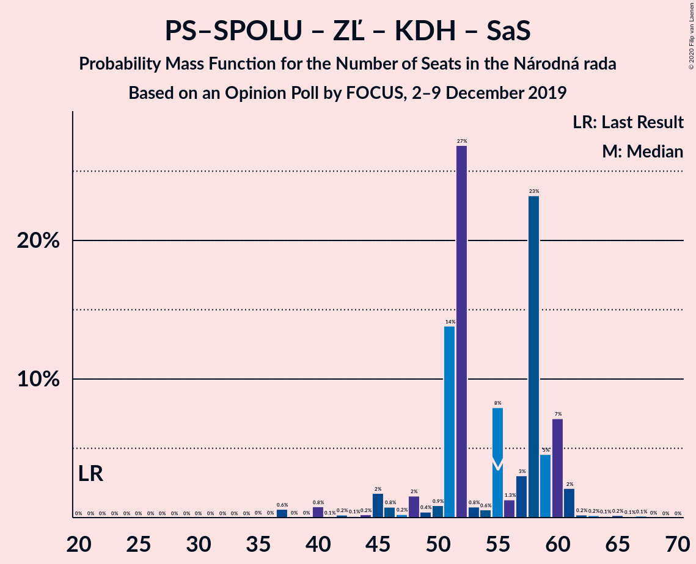

| Number of Seats | Probability | Accumulated | Special Marks |
|:---------------:|:-----------:|:-----------:|:-------------:|
| 21 | 0% | 100% | Last Result |
| 22 | 0% | 100% |  |
| 23 | 0% | 100% |  |
| 24 | 0% | 100% |  |
| 25 | 0% | 100% |  |
| 26 | 0% | 100% |  |
| 27 | 0% | 100% |  |
| 28 | 0% | 100% |  |
| 29 | 0% | 100% |  |
| 30 | 0% | 100% |  |
| 31 | 0% | 100% |  |
| 32 | 0% | 100% |  |
| 33 | 0% | 100% |  |
| 34 | 0% | 100% |  |
| 35 | 0% | 100% |  |
| 36 | 0% | 100% |  |
| 37 | 0.6% | 99.9% |  |
| 38 | 0% | 99.3% |  |
| 39 | 0% | 99.3% |  |
| 40 | 0.8% | 99.3% |  |
| 41 | 0.1% | 98% |  |
| 42 | 0.2% | 98% |  |
| 43 | 0.1% | 98% |  |
| 44 | 0.2% | 98% |  |
| 45 | 2% | 98% |  |
| 46 | 0.8% | 96% |  |
| 47 | 0.2% | 95% |  |
| 48 | 2% | 95% |  |
| 49 | 0.4% | 94% |  |
| 50 | 0.9% | 93% |  |
| 51 | 14% | 92% |  |
| 52 | 27% | 78% |  |
| 53 | 0.8% | 52% |  |
| 54 | 0.6% | 51% |  |
| 55 | 8% | 50% |  |
| 56 | 1.3% | 42% |  |
| 57 | 3% | 41% |  |
| 58 | 23% | 38% | Median |
| 59 | 5% | 15% |  |
| 60 | 7% | 10% |  |
| 61 | 2% | 3% |  |
| 62 | 0.2% | 0.9% |  |
| 63 | 0.2% | 0.7% |  |
| 64 | 0.1% | 0.5% |  |
| 65 | 0.2% | 0.4% |  |
| 66 | 0.1% | 0.2% |  |
| 67 | 0.1% | 0.2% |  |
| 68 | 0% | 0% |  |

### SMER–sociálna demokracia – SME RODINA

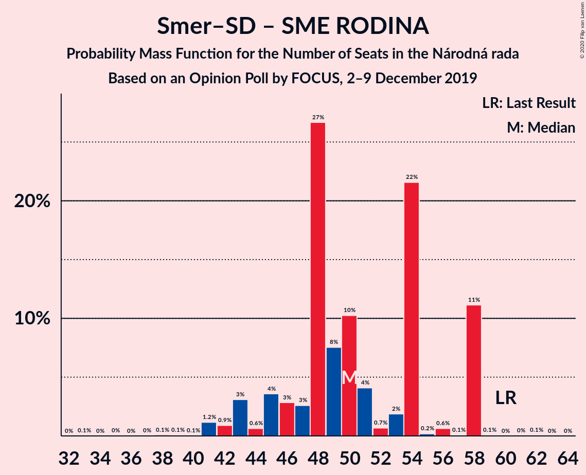

| Number of Seats | Probability | Accumulated | Special Marks |
|:---------------:|:-----------:|:-----------:|:-------------:|
| 33 | 0.1% | 100% |  |
| 34 | 0% | 99.9% |  |
| 35 | 0% | 99.9% |  |
| 36 | 0% | 99.9% |  |
| 37 | 0% | 99.9% |  |
| 38 | 0.1% | 99.9% |  |
| 39 | 0.1% | 99.8% |  |
| 40 | 0.1% | 99.7% |  |
| 41 | 1.2% | 99.7% |  |
| 42 | 0.9% | 98.5% |  |
| 43 | 3% | 98% |  |
| 44 | 0.6% | 95% |  |
| 45 | 4% | 94% |  |
| 46 | 3% | 90% |  |
| 47 | 3% | 87% |  |
| 48 | 27% | 85% |  |
| 49 | 8% | 58% | Median |
| 50 | 10% | 51% |  |
| 51 | 4% | 40% |  |
| 52 | 0.7% | 36% |  |
| 53 | 2% | 36% |  |
| 54 | 22% | 34% |  |
| 55 | 0.2% | 12% |  |
| 56 | 0.6% | 12% |  |
| 57 | 0.1% | 11% |  |
| 58 | 11% | 11% |  |
| 59 | 0.1% | 0.2% |  |
| 60 | 0% | 0.1% | Last Result |
| 61 | 0% | 0.1% |  |
| 62 | 0.1% | 0.1% |  |
| 63 | 0% | 0% |  |

### Progresívne Slovensko–SPOLU–Občianska Demokracia – Za ľudí – Sloboda a Solidarita

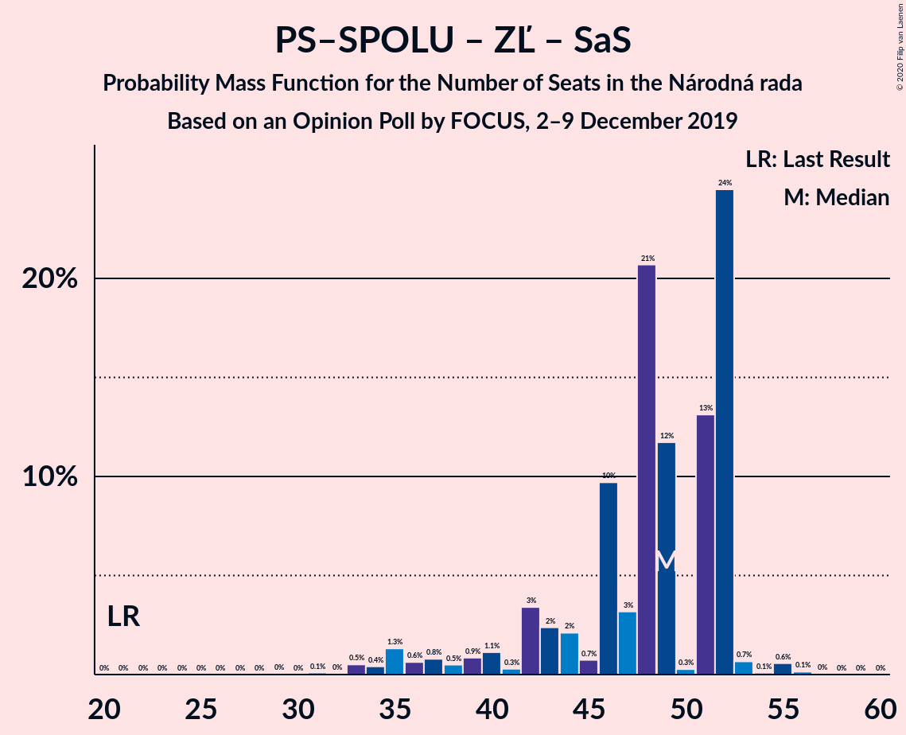

| Number of Seats | Probability | Accumulated | Special Marks |
|:---------------:|:-----------:|:-----------:|:-------------:|
| 21 | 0% | 100% | Last Result |
| 22 | 0% | 100% |  |
| 23 | 0% | 100% |  |
| 24 | 0% | 100% |  |
| 25 | 0% | 100% |  |
| 26 | 0% | 100% |  |
| 27 | 0% | 100% |  |
| 28 | 0% | 100% |  |
| 29 | 0% | 100% |  |
| 30 | 0% | 100% |  |
| 31 | 0.1% | 100% |  |
| 32 | 0% | 99.9% |  |
| 33 | 0.5% | 99.8% |  |
| 34 | 0.4% | 99.3% |  |
| 35 | 1.3% | 98.9% |  |
| 36 | 0.6% | 98% |  |
| 37 | 0.8% | 97% |  |
| 38 | 0.5% | 96% |  |
| 39 | 0.9% | 96% |  |
| 40 | 1.1% | 95% |  |
| 41 | 0.3% | 94% |  |
| 42 | 3% | 93% |  |
| 43 | 2% | 90% |  |
| 44 | 2% | 88% |  |
| 45 | 0.7% | 85% |  |
| 46 | 10% | 85% |  |
| 47 | 3% | 75% |  |
| 48 | 21% | 72% |  |
| 49 | 12% | 51% | Median |
| 50 | 0.3% | 39% |  |
| 51 | 13% | 39% |  |
| 52 | 24% | 26% |  |
| 53 | 0.7% | 2% |  |
| 54 | 0.1% | 0.9% |  |
| 55 | 0.6% | 0.8% |  |
| 56 | 0.1% | 0.2% |  |
| 57 | 0% | 0.1% |  |
| 58 | 0% | 0% |  |

### SMER–sociálna demokracia – Slovenská národná strana – MOST–HÍD

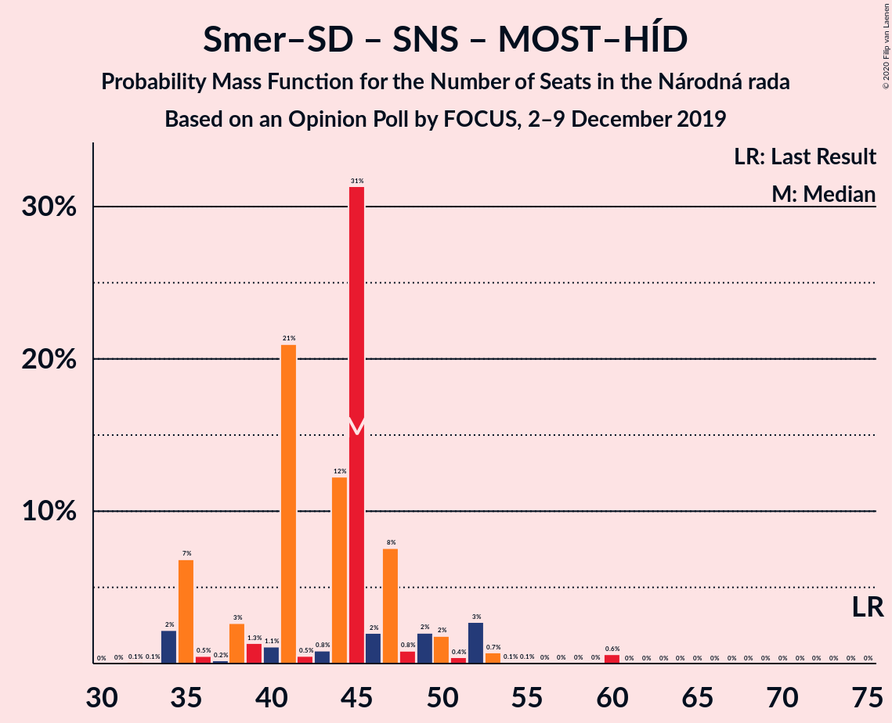

| Number of Seats | Probability | Accumulated | Special Marks |
|:---------------:|:-----------:|:-----------:|:-------------:|
| 32 | 0.1% | 100% |  |
| 33 | 0.1% | 99.8% |  |
| 34 | 2% | 99.8% |  |
| 35 | 7% | 98% |  |
| 36 | 0.5% | 91% | Median |
| 37 | 0.2% | 90% |  |
| 38 | 3% | 90% |  |
| 39 | 1.3% | 87% |  |
| 40 | 1.1% | 86% |  |
| 41 | 21% | 85% |  |
| 42 | 0.5% | 64% |  |
| 43 | 0.8% | 63% |  |
| 44 | 12% | 63% |  |
| 45 | 31% | 50% |  |
| 46 | 2% | 19% |  |
| 47 | 8% | 17% |  |
| 48 | 0.8% | 9% |  |
| 49 | 2% | 9% |  |
| 50 | 2% | 7% |  |
| 51 | 0.4% | 5% |  |
| 52 | 3% | 4% |  |
| 53 | 0.7% | 2% |  |
| 54 | 0.1% | 0.9% |  |
| 55 | 0.1% | 0.9% |  |
| 56 | 0% | 0.8% |  |
| 57 | 0% | 0.7% |  |
| 58 | 0% | 0.7% |  |
| 59 | 0% | 0.7% |  |
| 60 | 0.6% | 0.6% |  |
| 61 | 0% | 0% |  |
| 62 | 0% | 0% |  |
| 63 | 0% | 0% |  |
| 64 | 0% | 0% |  |
| 65 | 0% | 0% |  |
| 66 | 0% | 0% |  |
| 67 | 0% | 0% |  |
| 68 | 0% | 0% |  |
| 69 | 0% | 0% |  |
| 70 | 0% | 0% |  |
| 71 | 0% | 0% |  |
| 72 | 0% | 0% |  |
| 73 | 0% | 0% |  |
| 74 | 0% | 0% |  |
| 75 | 0% | 0% | Last Result |

### SMER–sociálna demokracia – Slovenská národná strana

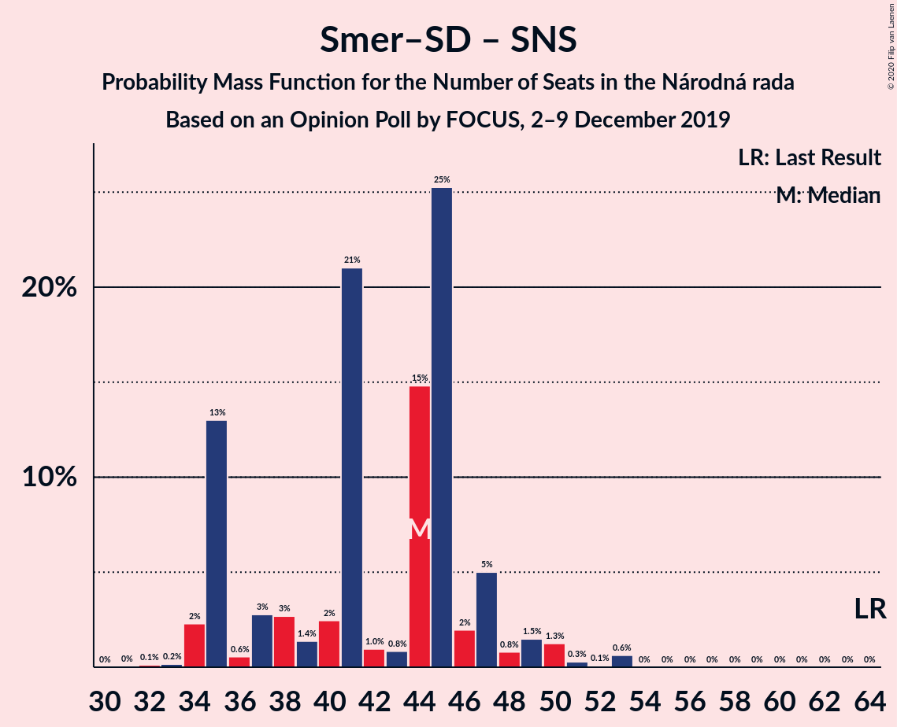

| Number of Seats | Probability | Accumulated | Special Marks |
|:---------------:|:-----------:|:-----------:|:-------------:|
| 31 | 0% | 100% |  |
| 32 | 0.1% | 99.9% |  |
| 33 | 0.2% | 99.8% |  |
| 34 | 2% | 99.6% |  |
| 35 | 13% | 97% |  |
| 36 | 0.6% | 84% | Median |
| 37 | 3% | 84% |  |
| 38 | 3% | 81% |  |
| 39 | 1.4% | 78% |  |
| 40 | 2% | 77% |  |
| 41 | 21% | 74% |  |
| 42 | 1.0% | 53% |  |
| 43 | 0.8% | 52% |  |
| 44 | 15% | 52% |  |
| 45 | 25% | 37% |  |
| 46 | 2% | 12% |  |
| 47 | 5% | 10% |  |
| 48 | 0.8% | 5% |  |
| 49 | 1.5% | 4% |  |
| 50 | 1.3% | 2% |  |
| 51 | 0.3% | 1.1% |  |
| 52 | 0.1% | 0.8% |  |
| 53 | 0.6% | 0.7% |  |
| 54 | 0% | 0.1% |  |
| 55 | 0% | 0% |  |
| 56 | 0% | 0% |  |
| 57 | 0% | 0% |  |
| 58 | 0% | 0% |  |
| 59 | 0% | 0% |  |
| 60 | 0% | 0% |  |
| 61 | 0% | 0% |  |
| 62 | 0% | 0% |  |
| 63 | 0% | 0% |  |
| 64 | 0% | 0% | Last Result |

### SMER–sociálna demokracia

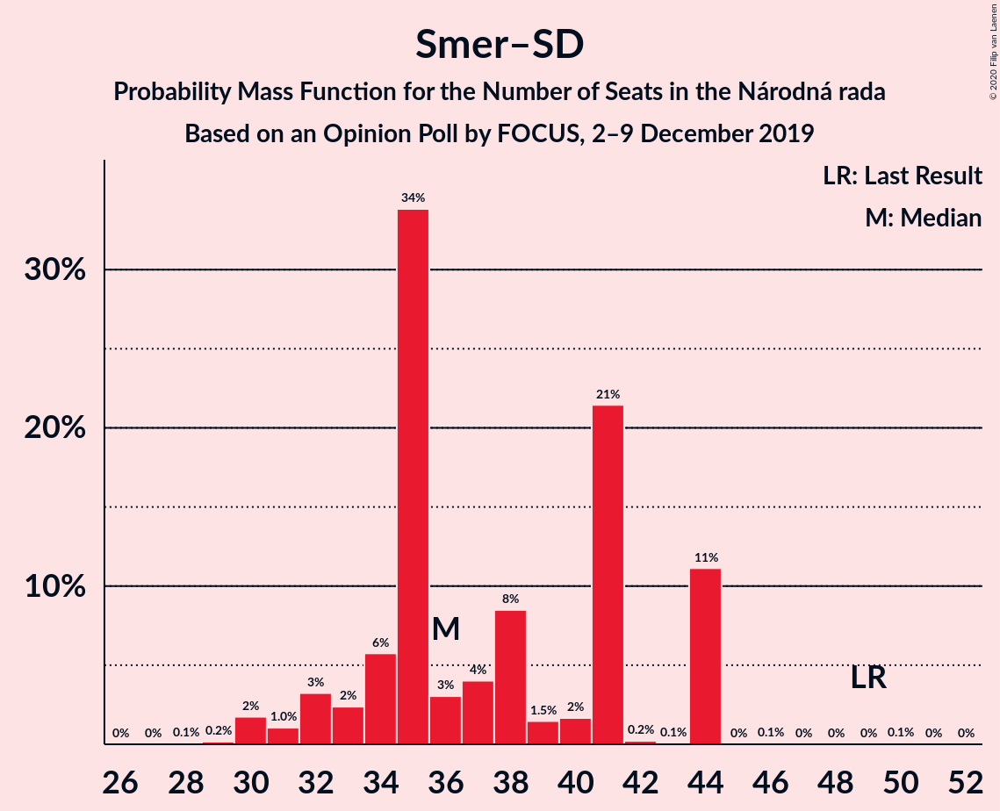

| Number of Seats | Probability | Accumulated | Special Marks |
|:---------------:|:-----------:|:-----------:|:-------------:|
| 28 | 0.1% | 100% |  |
| 29 | 0.2% | 99.9% |  |
| 30 | 2% | 99.7% |  |
| 31 | 1.0% | 98% |  |
| 32 | 3% | 97% |  |
| 33 | 2% | 94% |  |
| 34 | 6% | 91% |  |
| 35 | 34% | 86% |  |
| 36 | 3% | 52% | Median |
| 37 | 4% | 49% |  |
| 38 | 8% | 45% |  |
| 39 | 1.5% | 36% |  |
| 40 | 2% | 35% |  |
| 41 | 21% | 33% |  |
| 42 | 0.2% | 12% |  |
| 43 | 0.1% | 11% |  |
| 44 | 11% | 11% |  |
| 45 | 0% | 0.2% |  |
| 46 | 0.1% | 0.1% |  |
| 47 | 0% | 0.1% |  |
| 48 | 0% | 0.1% |  |
| 49 | 0% | 0.1% | Last Result |
| 50 | 0.1% | 0.1% |  |
| 51 | 0% | 0% |  |

## Technical Information

### Opinion Poll

+ **Polling firm:** FOCUS
+ **Commissioner(s):** —
+ **Fieldwork period:** 2–9 December 2019

### Calculations

+ **Sample size:** 1008
+ **Simulations done:** 1,048,576
+ **Error estimate:** 2.38%

