# Opinion Poll by Polis, 10–15 January 2020

<a href="#voting-intentions">Voting Intentions</a> | <a href="#seats">Seats</a> | <a href="#coalitions">Coalitions</a> | <a href="#technical-information">Technical Information</a>

## Voting Intentions

### Confidence Intervals

| Party | Last Result | Poll Result | 80% Confidence Interval | 90% Confidence Interval | 95% Confidence Interval | 99% Confidence Interval |
|:-----:|:-----------:|:-----------:|:-----------------------:|:-----------------------:|:-----------------------:|:-----------------------:|
| SMER–sociálna demokracia | 28.3% | 17.1% | 15.7–18.6% |15.3–19.0% |15.0–19.4% |14.4–20.1% |
| Kotleba–Ľudová strana Naše Slovensko | 8.0% | 12.4% | 11.2–13.7% |10.9–14.1% |10.6–14.4% |10.0–15.1% |
| OBYČAJNÍ ĽUDIA a nezávislé osobnosti | 11.0% | 10.0% | 8.9–11.2% |8.6–11.6% |8.4–11.9% |7.9–12.5% |
| Za ľudí | 0.0% | 9.7% | 8.7–11.0% |8.4–11.3% |8.1–11.6% |7.7–12.2% |
| Progresívne Slovensko–SPOLU–Občianska Demokracia | 0.0% | 8.4% | 7.5–9.6% |7.2–9.9% |6.9–10.2% |6.5–10.8% |
| Slovenská národná strana | 8.6% | 6.3% | 5.5–7.3% |5.2–7.6% |5.0–7.9% |4.7–8.4% |
| Kresťanskodemokratické hnutie | 4.9% | 6.0% | 5.2–7.0% |4.9–7.3% |4.7–7.5% |4.4–8.0% |
| Sloboda a Solidarita | 12.1% | 5.6% | 4.8–6.6% |4.6–6.9% |4.4–7.1% |4.1–7.6% |
| SME RODINA | 6.6% | 5.6% | 4.8–6.6% |4.6–6.9% |4.4–7.1% |4.1–7.6% |
| MOST–HÍD | 6.5% | 4.9% | 4.2–5.8% |4.0–6.1% |3.8–6.3% |3.5–6.8% |
| Strana maďarskej koalície–Magyar Koalíció Pártja | 4.0% | 4.3% | 3.6–5.2% |3.4–5.4% |3.3–5.6% |3.0–6.1% |
| Dobrá voľba | 0.0% | 4.1% | 3.5–5.0% |3.3–5.2% |3.1–5.4% |2.8–5.9% |
| VLASŤ | 0.0% | 3.8% | 3.1–4.6% |3.0–4.8% |2.8–5.0% |2.5–5.5% |

*Note:* The poll result column reflects the actual value used in the calculations. Published results may vary slightly, and in addition be rounded to fewer digits.

## Seats

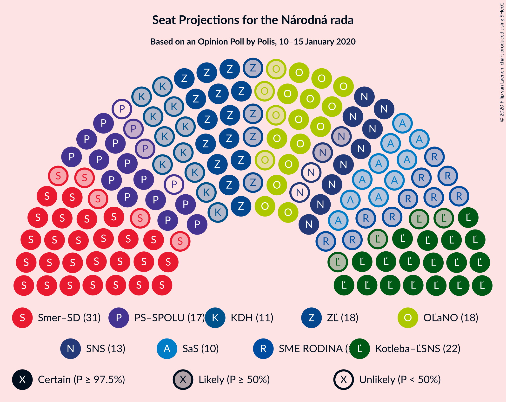

### Confidence Intervals

| Party | Last Result | Median | 80% Confidence Interval | 90% Confidence Interval | 95% Confidence Interval | 99% Confidence Interval |
|:-----:|:-----------:|:------:|:-----------------------:|:-----------------------:|:-----------------------:|:-----------------------:|
| <a href="#smer–sociálna-demokracia">SMER–sociálna demokracia</a> | 49 | 31 | 26–34 |26–37 |26–39 |25–39 |
| <a href="#kotleba–ľudová-strana-naše-slovensko">Kotleba–Ľudová strana Naše Slovensko</a> | 14 | 22 | 20–26 |19–29 |18–29 |18–29 |
| <a href="#obyčajní-ľudia-a-nezávislé-osobnosti">OBYČAJNÍ ĽUDIA a nezávislé osobnosti</a> | 17 | 18 | 14–21 |14–22 |14–22 |14–23 |
| <a href="#za-ľudí">Za ľudí</a> | 0 | 18 | 15–21 |15–22 |14–22 |13–22 |
| <a href="#progresívne-slovensko–spolu–občianska-demokracia">Progresívne Slovensko–SPOLU–Občianska Demokracia</a> | 0 | 15 | 13–18 |13–18 |13–19 |12–20 |
| <a href="#slovenská-národná-strana">Slovenská národná strana</a> | 15 | 11 | 9–14 |9–14 |9–14 |0–16 |
| <a href="#kresťanskodemokratické-hnutie">Kresťanskodemokratické hnutie</a> | 0 | 11 | 9–13 |0–13 |0–13 |0–14 |
| <a href="#sloboda-a-solidarita">Sloboda a Solidarita</a> | 21 | 10 | 0–12 |0–13 |0–13 |0–13 |
| <a href="#sme-rodina">SME RODINA</a> | 11 | 10 | 0–12 |0–12 |0–12 |0–14 |
| <a href="#most–híd">MOST–HÍD</a> | 11 | 0 | 0–10 |0–11 |0–11 |0–12 |
| <a href="#strana-maďarskej-koalície–magyar-koalíció-pártja">Strana maďarskej koalície–Magyar Koalíció Pártja</a> | 0 | 0 | 0 |0–9 |0–10 |0–10 |
| <a href="#dobrá-voľba">Dobrá voľba</a> | 0 | 0 | 0–9 |0–9 |0–10 |0–10 |
| <a href="#vlasť">VLASŤ</a> | 0 | 0 | 0 |0 |0 |0–9 |

### SMER–sociálna demokracia

*For a full overview of the results for this party, see the [SMER–sociálna demokracia](party-smer–sociálnademokracia.html) page.*

| Number of Seats | Probability | Accumulated | Special Marks |
|:---------------:|:-----------:|:-----------:|:-------------:|
| 24 | 0.1% | 100% |  |
| 25 | 1.0% | 99.9% |  |
| 26 | 15% | 98.9% |  |
| 27 | 0.8% | 84% |  |
| 28 | 3% | 83% |  |
| 29 | 10% | 81% |  |
| 30 | 13% | 71% |  |
| 31 | 20% | 58% | Median |
| 32 | 7% | 38% |  |
| 33 | 4% | 31% |  |
| 34 | 18% | 27% |  |
| 35 | 3% | 9% |  |
| 36 | 0.5% | 6% |  |
| 37 | 1.4% | 6% |  |
| 38 | 0.3% | 4% |  |
| 39 | 4% | 4% |  |
| 40 | 0% | 0.2% |  |
| 41 | 0% | 0.2% |  |
| 42 | 0% | 0.2% |  |
| 43 | 0% | 0.1% |  |
| 44 | 0.1% | 0.1% |  |
| 45 | 0% | 0% |  |
| 46 | 0% | 0% |  |
| 47 | 0% | 0% |  |
| 48 | 0% | 0% |  |
| 49 | 0% | 0% | Last Result |

### Kotleba–Ľudová strana Naše Slovensko

*For a full overview of the results for this party, see the [Kotleba–Ľudová strana Naše Slovensko](party-kotleba–ľudovástrananašeslovensko.html) page.*

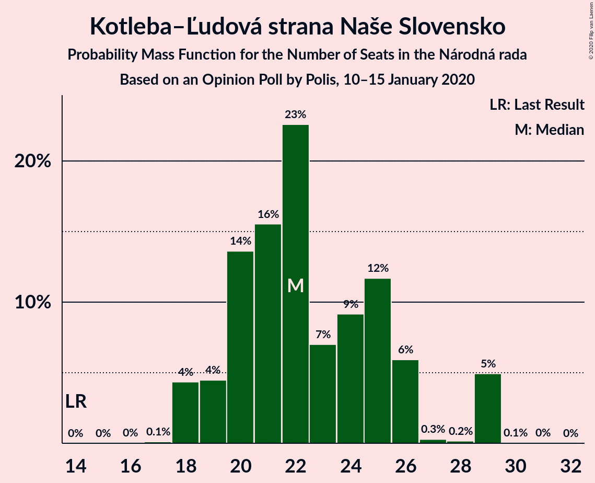

| Number of Seats | Probability | Accumulated | Special Marks |
|:---------------:|:-----------:|:-----------:|:-------------:|
| 14 | 0% | 100% | Last Result |
| 15 | 0% | 100% |  |
| 16 | 0% | 100% |  |
| 17 | 0.1% | 100% |  |
| 18 | 4% | 99.9% |  |
| 19 | 4% | 96% |  |
| 20 | 14% | 91% |  |
| 21 | 16% | 77% |  |
| 22 | 23% | 62% | Median |
| 23 | 7% | 39% |  |
| 24 | 9% | 32% |  |
| 25 | 12% | 23% |  |
| 26 | 6% | 11% |  |
| 27 | 0.3% | 5% |  |
| 28 | 0.2% | 5% |  |
| 29 | 5% | 5% |  |
| 30 | 0.1% | 0.1% |  |
| 31 | 0% | 0.1% |  |
| 32 | 0% | 0% |  |

### OBYČAJNÍ ĽUDIA a nezávislé osobnosti

*For a full overview of the results for this party, see the [OBYČAJNÍ ĽUDIA a nezávislé osobnosti](party-obyčajníľudiaanezávisléosobnosti.html) page.*

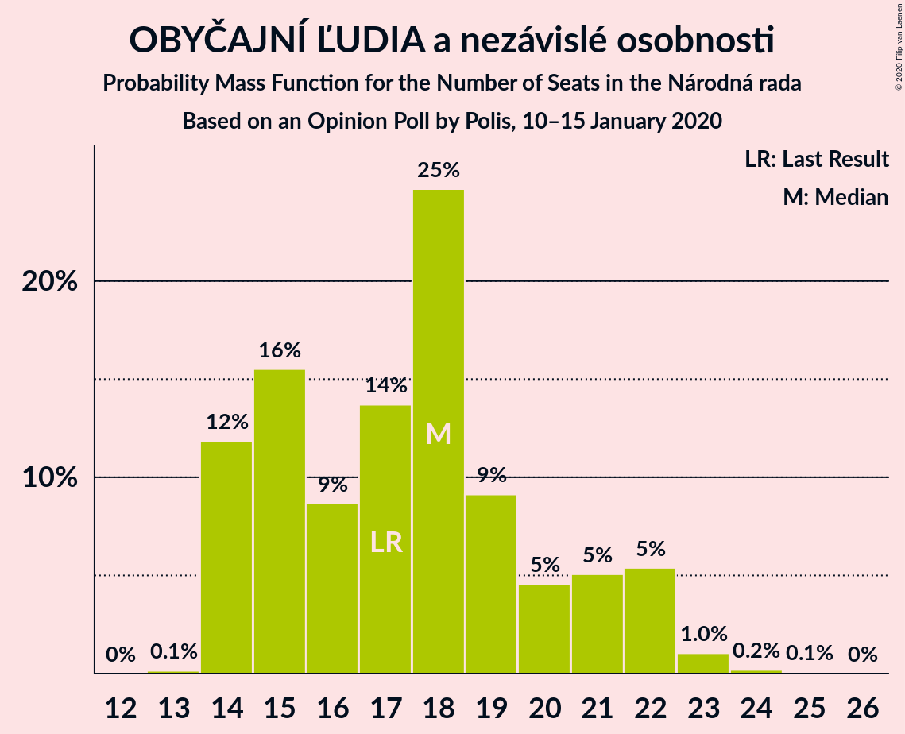

| Number of Seats | Probability | Accumulated | Special Marks |
|:---------------:|:-----------:|:-----------:|:-------------:|
| 13 | 0.1% | 100% |  |
| 14 | 12% | 99.8% |  |
| 15 | 16% | 88% |  |
| 16 | 9% | 72% |  |
| 17 | 14% | 64% | Last Result |
| 18 | 25% | 50% | Median |
| 19 | 9% | 25% |  |
| 20 | 5% | 16% |  |
| 21 | 5% | 12% |  |
| 22 | 5% | 7% |  |
| 23 | 1.0% | 1.3% |  |
| 24 | 0.2% | 0.3% |  |
| 25 | 0.1% | 0.1% |  |
| 26 | 0% | 0% |  |

### Za ľudí

*For a full overview of the results for this party, see the [Za ľudí](party-zaľudí.html) page.*

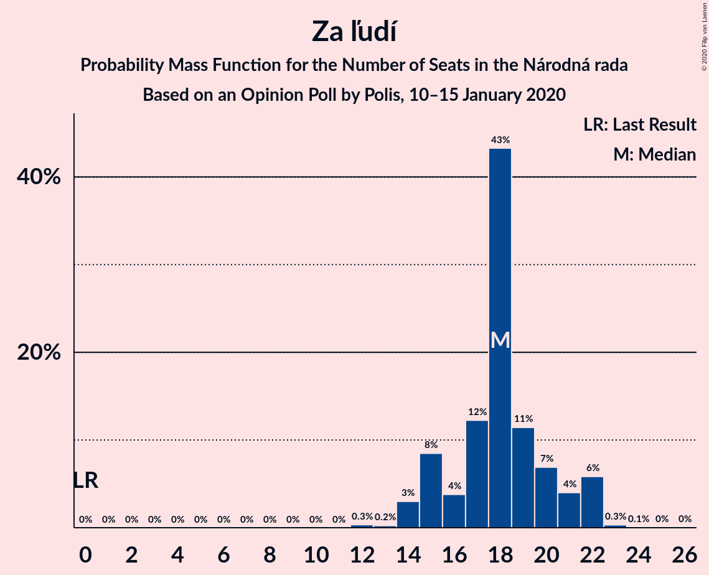

| Number of Seats | Probability | Accumulated | Special Marks |
|:---------------:|:-----------:|:-----------:|:-------------:|
| 0 | 0% | 100% | Last Result |
| 1 | 0% | 100% |  |
| 2 | 0% | 100% |  |
| 3 | 0% | 100% |  |
| 4 | 0% | 100% |  |
| 5 | 0% | 100% |  |
| 6 | 0% | 100% |  |
| 7 | 0% | 100% |  |
| 8 | 0% | 100% |  |
| 9 | 0% | 100% |  |
| 10 | 0% | 100% |  |
| 11 | 0% | 100% |  |
| 12 | 0.3% | 100% |  |
| 13 | 0.2% | 99.7% |  |
| 14 | 3% | 99.4% |  |
| 15 | 8% | 96% |  |
| 16 | 4% | 88% |  |
| 17 | 12% | 84% |  |
| 18 | 43% | 72% | Median |
| 19 | 11% | 29% |  |
| 20 | 7% | 17% |  |
| 21 | 4% | 10% |  |
| 22 | 6% | 6% |  |
| 23 | 0.3% | 0.4% |  |
| 24 | 0.1% | 0.1% |  |
| 25 | 0% | 0% |  |

### Progresívne Slovensko–SPOLU–Občianska Demokracia

*For a full overview of the results for this party, see the [Progresívne Slovensko–SPOLU–Občianska Demokracia](party-progresívneslovensko–spolu–občianskademokracia.html) page.*

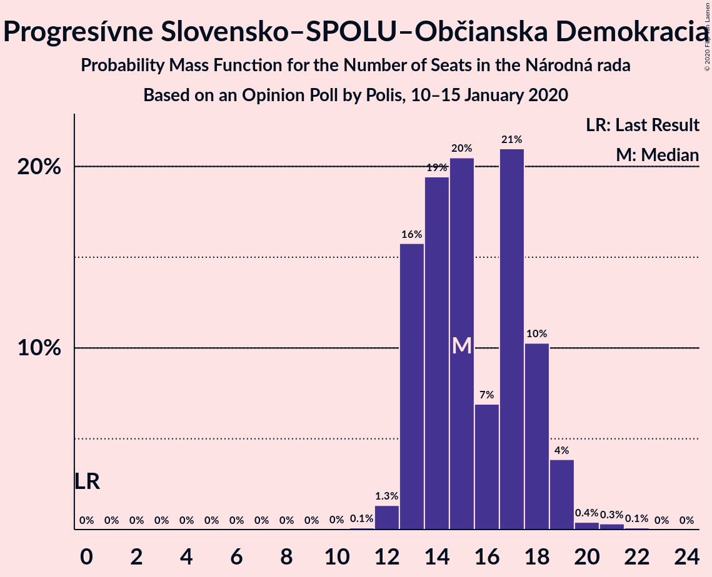

| Number of Seats | Probability | Accumulated | Special Marks |
|:---------------:|:-----------:|:-----------:|:-------------:|
| 0 | 0% | 100% | Last Result |
| 1 | 0% | 100% |  |
| 2 | 0% | 100% |  |
| 3 | 0% | 100% |  |
| 4 | 0% | 100% |  |
| 5 | 0% | 100% |  |
| 6 | 0% | 100% |  |
| 7 | 0% | 100% |  |
| 8 | 0% | 100% |  |
| 9 | 0% | 100% |  |
| 10 | 0% | 100% |  |
| 11 | 0.1% | 100% |  |
| 12 | 1.3% | 99.9% |  |
| 13 | 16% | 98.5% |  |
| 14 | 19% | 83% |  |
| 15 | 20% | 63% | Median |
| 16 | 7% | 43% |  |
| 17 | 21% | 36% |  |
| 18 | 10% | 15% |  |
| 19 | 4% | 5% |  |
| 20 | 0.4% | 0.8% |  |
| 21 | 0.3% | 0.4% |  |
| 22 | 0.1% | 0.1% |  |
| 23 | 0% | 0% |  |

### Slovenská národná strana

*For a full overview of the results for this party, see the [Slovenská národná strana](party-slovenskánárodnástrana.html) page.*

| Number of Seats | Probability | Accumulated | Special Marks |
|:---------------:|:-----------:|:-----------:|:-------------:|
| 0 | 2% | 100% |  |
| 1 | 0% | 98% |  |
| 2 | 0% | 98% |  |
| 3 | 0% | 98% |  |
| 4 | 0% | 98% |  |
| 5 | 0% | 98% |  |
| 6 | 0% | 98% |  |
| 7 | 0% | 98% |  |
| 8 | 0% | 98% |  |
| 9 | 31% | 98% |  |
| 10 | 6% | 67% |  |
| 11 | 24% | 61% | Median |
| 12 | 13% | 37% |  |
| 13 | 14% | 24% |  |
| 14 | 8% | 10% |  |
| 15 | 0.8% | 2% | Last Result |
| 16 | 0.7% | 0.8% |  |
| 17 | 0% | 0% |  |

### Kresťanskodemokratické hnutie

*For a full overview of the results for this party, see the [Kresťanskodemokratické hnutie](party-kresťanskodemokratickéhnutie.html) page.*

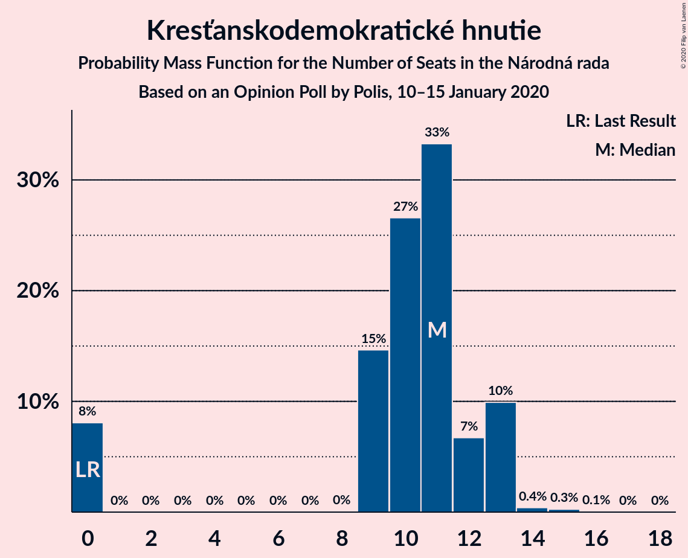

| Number of Seats | Probability | Accumulated | Special Marks |
|:---------------:|:-----------:|:-----------:|:-------------:|
| 0 | 8% | 100% | Last Result |
| 1 | 0% | 92% |  |
| 2 | 0% | 92% |  |
| 3 | 0% | 92% |  |
| 4 | 0% | 92% |  |
| 5 | 0% | 92% |  |
| 6 | 0% | 92% |  |
| 7 | 0% | 92% |  |
| 8 | 0% | 92% |  |
| 9 | 15% | 92% |  |
| 10 | 27% | 77% |  |
| 11 | 33% | 51% | Median |
| 12 | 7% | 17% |  |
| 13 | 10% | 11% |  |
| 14 | 0.4% | 0.7% |  |
| 15 | 0.3% | 0.3% |  |
| 16 | 0.1% | 0.1% |  |
| 17 | 0% | 0% |  |

### Sloboda a Solidarita

*For a full overview of the results for this party, see the [Sloboda a Solidarita](party-slobodaasolidarita.html) page.*

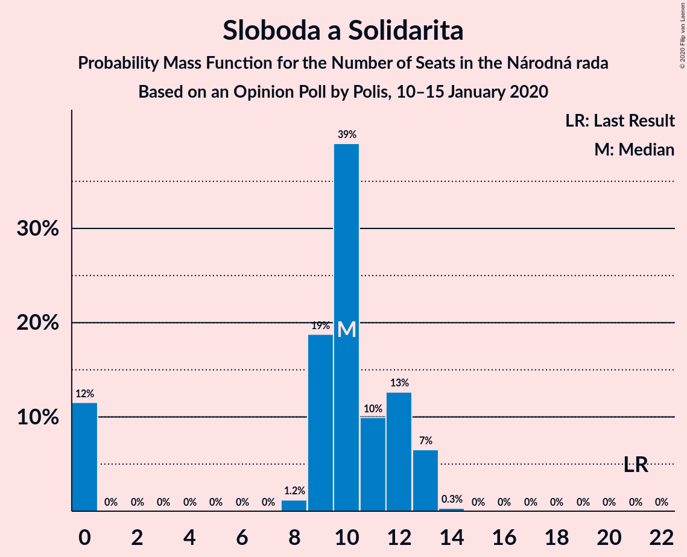

| Number of Seats | Probability | Accumulated | Special Marks |
|:---------------:|:-----------:|:-----------:|:-------------:|
| 0 | 12% | 100% |  |
| 1 | 0% | 88% |  |
| 2 | 0% | 88% |  |
| 3 | 0% | 88% |  |
| 4 | 0% | 88% |  |
| 5 | 0% | 88% |  |
| 6 | 0% | 88% |  |
| 7 | 0% | 88% |  |
| 8 | 1.2% | 88% |  |
| 9 | 19% | 87% |  |
| 10 | 39% | 68% | Median |
| 11 | 10% | 29% |  |
| 12 | 13% | 20% |  |
| 13 | 7% | 7% |  |
| 14 | 0.3% | 0.4% |  |
| 15 | 0% | 0% |  |
| 16 | 0% | 0% |  |
| 17 | 0% | 0% |  |
| 18 | 0% | 0% |  |
| 19 | 0% | 0% |  |
| 20 | 0% | 0% |  |
| 21 | 0% | 0% | Last Result |

### SME RODINA

*For a full overview of the results for this party, see the [SME RODINA](party-smerodina.html) page.*

| Number of Seats | Probability | Accumulated | Special Marks |
|:---------------:|:-----------:|:-----------:|:-------------:|
| 0 | 16% | 100% |  |
| 1 | 0% | 84% |  |
| 2 | 0% | 84% |  |
| 3 | 0% | 84% |  |
| 4 | 0% | 84% |  |
| 5 | 0% | 84% |  |
| 6 | 0% | 84% |  |
| 7 | 0% | 84% |  |
| 8 | 0% | 84% |  |
| 9 | 22% | 84% |  |
| 10 | 38% | 62% | Median |
| 11 | 14% | 24% | Last Result |
| 12 | 8% | 10% |  |
| 13 | 0.9% | 2% |  |
| 14 | 1.4% | 2% |  |
| 15 | 0.2% | 0.2% |  |
| 16 | 0% | 0.1% |  |
| 17 | 0% | 0% |  |

### MOST–HÍD

*For a full overview of the results for this party, see the [MOST–HÍD](party-most–híd.html) page.*

| Number of Seats | Probability | Accumulated | Special Marks |
|:---------------:|:-----------:|:-----------:|:-------------:|
| 0 | 50% | 100% | Median |
| 1 | 0% | 50% |  |
| 2 | 0% | 50% |  |
| 3 | 0% | 50% |  |
| 4 | 0% | 50% |  |
| 5 | 0% | 50% |  |
| 6 | 0% | 50% |  |
| 7 | 0% | 50% |  |
| 8 | 0.6% | 50% |  |
| 9 | 27% | 49% |  |
| 10 | 17% | 22% |  |
| 11 | 5% | 6% | Last Result |
| 12 | 0.3% | 0.8% |  |
| 13 | 0.4% | 0.4% |  |
| 14 | 0% | 0% |  |

### Strana maďarskej koalície–Magyar Koalíció Pártja

*For a full overview of the results for this party, see the [Strana maďarskej koalície–Magyar Koalíció Pártja](party-stranamaďarskejkoalície–magyarkoalíciópártja.html) page.*

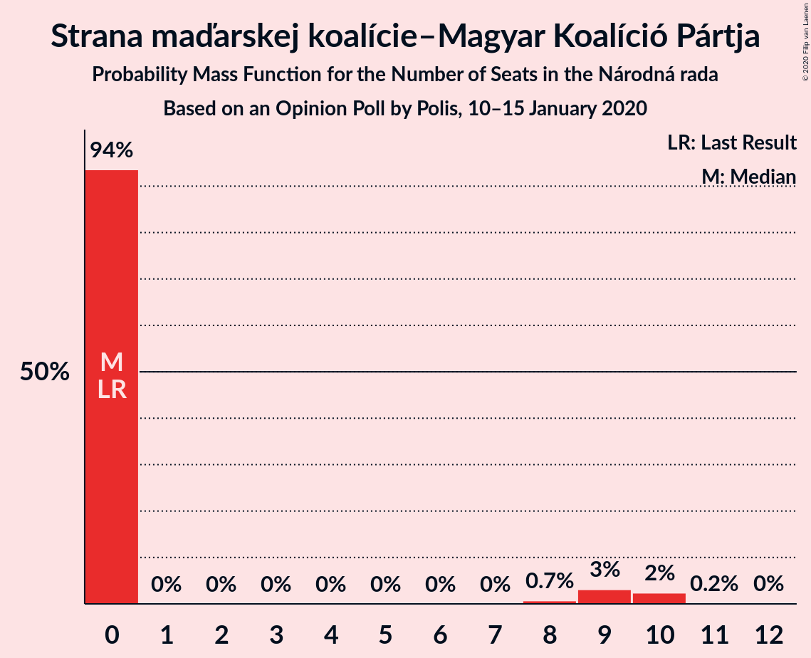

| Number of Seats | Probability | Accumulated | Special Marks |
|:---------------:|:-----------:|:-----------:|:-------------:|
| 0 | 94% | 100% | Last Result, Median |
| 1 | 0% | 6% |  |
| 2 | 0% | 6% |  |
| 3 | 0% | 6% |  |
| 4 | 0% | 6% |  |
| 5 | 0% | 6% |  |
| 6 | 0% | 6% |  |
| 7 | 0% | 6% |  |
| 8 | 0.7% | 6% |  |
| 9 | 3% | 6% |  |
| 10 | 2% | 3% |  |
| 11 | 0.2% | 0.2% |  |
| 12 | 0% | 0% |  |

### Dobrá voľba

*For a full overview of the results for this party, see the [Dobrá voľba](party-dobrávoľba.html) page.*

| Number of Seats | Probability | Accumulated | Special Marks |
|:---------------:|:-----------:|:-----------:|:-------------:|
| 0 | 83% | 100% | Last Result, Median |
| 1 | 0% | 17% |  |
| 2 | 0% | 17% |  |
| 3 | 0% | 17% |  |
| 4 | 0% | 17% |  |
| 5 | 0% | 17% |  |
| 6 | 0% | 17% |  |
| 7 | 0% | 17% |  |
| 8 | 0.1% | 17% |  |
| 9 | 12% | 17% |  |
| 10 | 4% | 5% |  |
| 11 | 0.3% | 0.4% |  |
| 12 | 0% | 0% |  |

### VLASŤ

*For a full overview of the results for this party, see the [VLASŤ](party-vlasť.html) page.*

| Number of Seats | Probability | Accumulated | Special Marks |
|:---------------:|:-----------:|:-----------:|:-------------:|
| 0 | 98% | 100% | Last Result, Median |
| 1 | 0% | 2% |  |
| 2 | 0% | 2% |  |
| 3 | 0% | 2% |  |
| 4 | 0% | 2% |  |
| 5 | 0% | 2% |  |
| 6 | 0% | 2% |  |
| 7 | 0% | 2% |  |
| 8 | 1.3% | 2% |  |
| 9 | 0.6% | 0.8% |  |
| 10 | 0.1% | 0.2% |  |
| 11 | 0.1% | 0.1% |  |
| 12 | 0% | 0% |  |

## Coalitions

### Confidence Intervals

| Coalition | Last Result | Median | Majority? | 80% Confidence Interval | 90% Confidence Interval | 95% Confidence Interval | 99% Confidence Interval |
|:---------:|:-----------:|:------:|:---------:|:-----------------------:|:-----------------------:|:-----------------------:|:-----------------------:|
| OBYČAJNÍ ĽUDIA a nezávislé osobnosti – Za ľudí – Progresívne Slovensko–SPOLU–Občianska Demokracia – Kresťanskodemokratické hnutie – SME RODINA – Sloboda a Solidarita – MOST–HÍD – Strana maďarskej koalície–Magyar Koalíció Pártja | 60 | 84 | 94% | 78–89 | 75–92 | 74–93 | 71–95 |
| OBYČAJNÍ ĽUDIA a nezávislé osobnosti – Za ľudí – Progresívne Slovensko–SPOLU–Občianska Demokracia – Kresťanskodemokratické hnutie – SME RODINA – Sloboda a Solidarita – MOST–HÍD | 60 | 83 | 92% | 76–89 | 74–89 | 74–90 | 71–93 |
| OBYČAJNÍ ĽUDIA a nezávislé osobnosti – Za ľudí – Progresívne Slovensko–SPOLU–Občianska Demokracia – Kresťanskodemokratické hnutie – SME RODINA – Sloboda a Solidarita – Strana maďarskej koalície–Magyar Koalíció Pártja | 49 | 79 | 86% | 74–83 | 72–85 | 70–90 | 66–93 |
| SMER–sociálna demokracia – Kotleba–Ľudová strana Naše Slovensko – Slovenská národná strana – SME RODINA | 89 | 72 | 34% | 65–79 | 65–86 | 64–87 | 61–89 |
| OBYČAJNÍ ĽUDIA a nezávislé osobnosti – Za ľudí – Progresívne Slovensko–SPOLU–Občianska Demokracia – Kresťanskodemokratické hnutie – SME RODINA – Sloboda a Solidarita | 49 | 79 | 83% | 74–83 | 71–84 | 70–84 | 64–87 |
| OBYČAJNÍ ĽUDIA a nezávislé osobnosti – Za ľudí – Progresívne Slovensko–SPOLU–Občianska Demokracia – Kresťanskodemokratické hnutie – Sloboda a Solidarita – MOST–HÍD – Strana maďarskej koalície–Magyar Koalíció Pártja | 49 | 76 | 57% | 69–81 | 63–82 | 63–84 | 61–88 |
| OBYČAJNÍ ĽUDIA a nezávislé osobnosti – Za ľudí – Progresívne Slovensko–SPOLU–Občianska Demokracia – Kresťanskodemokratické hnutie – Sloboda a Solidarita – MOST–HÍD | 49 | 76 | 53% | 66–80 | 63–81 | 63–82 | 61–88 |
| OBYČAJNÍ ĽUDIA a nezávislé osobnosti – Za ľudí – Progresívne Slovensko–SPOLU–Občianska Demokracia – Kresťanskodemokratické hnutie – Sloboda a Solidarita – Strana maďarskej koalície–Magyar Koalíció Pártja | 38 | 69 | 16% | 64–78 | 63–81 | 63–81 | 57–84 |
| OBYČAJNÍ ĽUDIA a nezávislé osobnosti – Za ľudí – Progresívne Slovensko–SPOLU–Občianska Demokracia – Kresťanskodemokratické hnutie – Sloboda a Solidarita | 38 | 69 | 12% | 64–78 | 63–79 | 61–81 | 55–81 |
| OBYČAJNÍ ĽUDIA a nezávislé osobnosti – Za ľudí – Progresívne Slovensko–SPOLU–Občianska Demokracia – Sloboda a Solidarita | 38 | 60 | 0% | 55–67 | 52–68 | 51–70 | 48–72 |
| SMER–sociálna demokracia – Slovenská národná strana – SME RODINA | 75 | 50 | 0% | 44–56 | 43–60 | 43–63 | 40–64 |
| Za ľudí – Progresívne Slovensko–SPOLU–Občianska Demokracia – Kresťanskodemokratické hnutie – Sloboda a Solidarita | 21 | 53 | 0% | 46–57 | 43–59 | 41–62 | 38–62 |
| SMER–sociálna demokracia – Slovenská národná strana – MOST–HÍD | 75 | 45 | 0% | 43–52 | 39–54 | 38–54 | 36–57 |
| SMER–sociálna demokracia – Slovenská národná strana | 64 | 43 | 0% | 35–46 | 35–50 | 35–52 | 32–52 |
| Za ľudí – Progresívne Slovensko–SPOLU–Občianska Demokracia – Sloboda a Solidarita | 21 | 43 | 0% | 37–46 | 33–50 | 31–51 | 30–51 |
| SMER–sociálna demokracia – SME RODINA | 60 | 40 | 0% | 34–44 | 31–49 | 31–50 | 29–51 |
| SMER–sociálna demokracia | 49 | 31 | 0% | 26–34 | 26–37 | 26–39 | 25–39 |

### OBYČAJNÍ ĽUDIA a nezávislé osobnosti – Za ľudí – Progresívne Slovensko–SPOLU–Občianska Demokracia – Kresťanskodemokratické hnutie – SME RODINA – Sloboda a Solidarita – MOST–HÍD – Strana maďarskej koalície–Magyar Koalíció Pártja

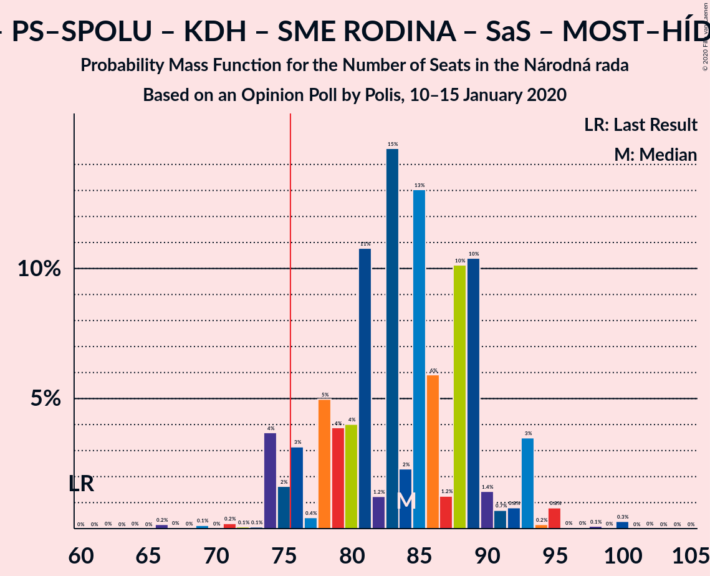

| Number of Seats | Probability | Accumulated | Special Marks |
|:---------------:|:-----------:|:-----------:|:-------------:|
| 60 | 0% | 100% | Last Result |
| 61 | 0% | 100% |  |
| 62 | 0% | 100% |  |
| 63 | 0% | 100% |  |
| 64 | 0% | 100% |  |
| 65 | 0% | 100% |  |
| 66 | 0.2% | 100% |  |
| 67 | 0% | 99.8% |  |
| 68 | 0% | 99.8% |  |
| 69 | 0.1% | 99.8% |  |
| 70 | 0% | 99.6% |  |
| 71 | 0.2% | 99.6% |  |
| 72 | 0.1% | 99.4% |  |
| 73 | 0.1% | 99.4% |  |
| 74 | 4% | 99.3% |  |
| 75 | 2% | 96% |  |
| 76 | 3% | 94% | Majority |
| 77 | 0.4% | 91% |  |
| 78 | 5% | 90% |  |
| 79 | 4% | 85% |  |
| 80 | 4% | 82% |  |
| 81 | 11% | 78% |  |
| 82 | 1.2% | 67% | Median |
| 83 | 15% | 66% |  |
| 84 | 2% | 51% |  |
| 85 | 13% | 49% |  |
| 86 | 6% | 36% |  |
| 87 | 1.2% | 30% |  |
| 88 | 10% | 28% |  |
| 89 | 10% | 18% |  |
| 90 | 1.4% | 8% |  |
| 91 | 0.7% | 6% |  |
| 92 | 0.8% | 6% |  |
| 93 | 3% | 5% |  |
| 94 | 0.2% | 1.4% |  |
| 95 | 0.8% | 1.3% |  |
| 96 | 0% | 0.5% |  |
| 97 | 0% | 0.4% |  |
| 98 | 0.1% | 0.4% |  |
| 99 | 0% | 0.3% |  |
| 100 | 0.3% | 0.3% |  |
| 101 | 0% | 0% |  |

### OBYČAJNÍ ĽUDIA a nezávislé osobnosti – Za ľudí – Progresívne Slovensko–SPOLU–Občianska Demokracia – Kresťanskodemokratické hnutie – SME RODINA – Sloboda a Solidarita – MOST–HÍD

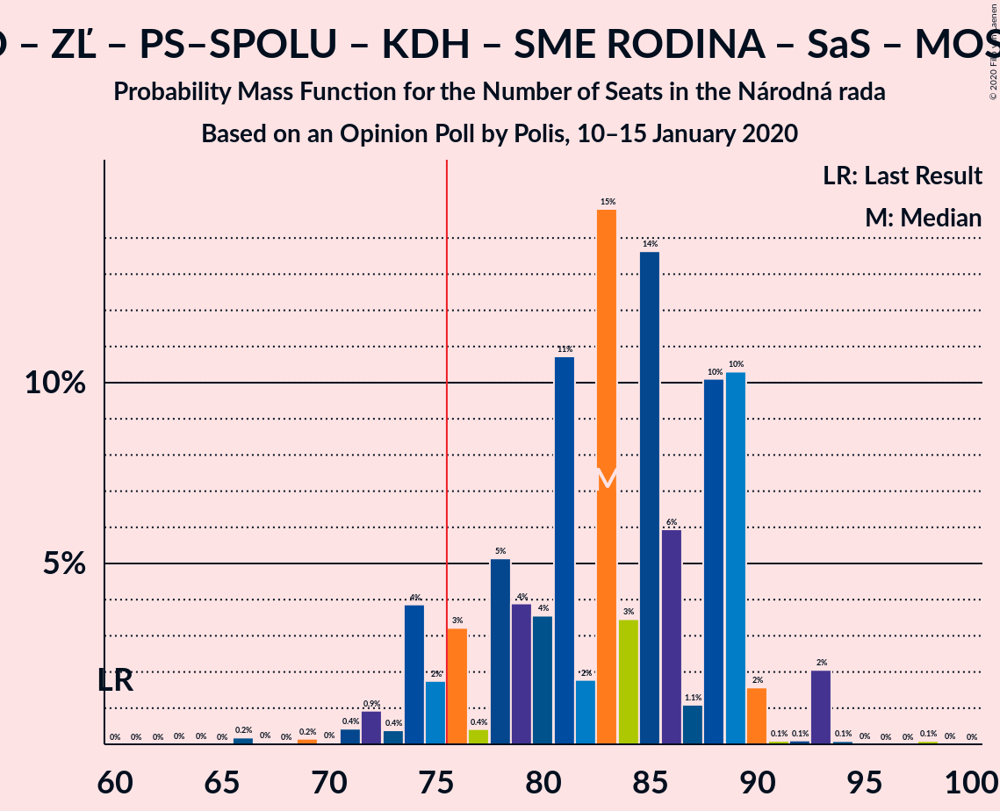

| Number of Seats | Probability | Accumulated | Special Marks |
|:---------------:|:-----------:|:-----------:|:-------------:|
| 60 | 0% | 100% | Last Result |
| 61 | 0% | 100% |  |
| 62 | 0% | 100% |  |
| 63 | 0% | 100% |  |
| 64 | 0% | 100% |  |
| 65 | 0% | 99.9% |  |
| 66 | 0.2% | 99.9% |  |
| 67 | 0% | 99.8% |  |
| 68 | 0% | 99.7% |  |
| 69 | 0.2% | 99.7% |  |
| 70 | 0% | 99.6% |  |
| 71 | 0.4% | 99.5% |  |
| 72 | 0.9% | 99.1% |  |
| 73 | 0.4% | 98% |  |
| 74 | 4% | 98% |  |
| 75 | 2% | 94% |  |
| 76 | 3% | 92% | Majority |
| 77 | 0.4% | 89% |  |
| 78 | 5% | 89% |  |
| 79 | 4% | 83% |  |
| 80 | 4% | 79% |  |
| 81 | 11% | 76% |  |
| 82 | 2% | 65% | Median |
| 83 | 15% | 63% |  |
| 84 | 3% | 49% |  |
| 85 | 14% | 45% |  |
| 86 | 6% | 32% |  |
| 87 | 1.1% | 26% |  |
| 88 | 10% | 24% |  |
| 89 | 10% | 14% |  |
| 90 | 2% | 4% |  |
| 91 | 0.1% | 2% |  |
| 92 | 0.1% | 2% |  |
| 93 | 2% | 2% |  |
| 94 | 0.1% | 0.2% |  |
| 95 | 0% | 0.1% |  |
| 96 | 0% | 0.1% |  |
| 97 | 0% | 0.1% |  |
| 98 | 0.1% | 0.1% |  |
| 99 | 0% | 0% |  |

### OBYČAJNÍ ĽUDIA a nezávislé osobnosti – Za ľudí – Progresívne Slovensko–SPOLU–Občianska Demokracia – Kresťanskodemokratické hnutie – SME RODINA – Sloboda a Solidarita – Strana maďarskej koalície–Magyar Koalíció Pártja

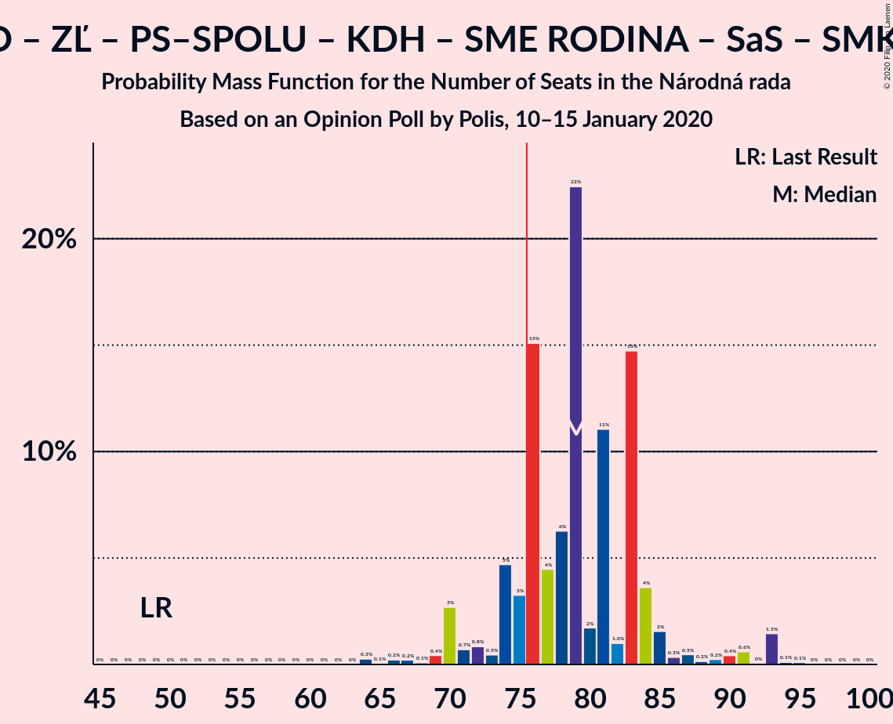

| Number of Seats | Probability | Accumulated | Special Marks |
|:---------------:|:-----------:|:-----------:|:-------------:|
| 49 | 0% | 100% | Last Result |
| 50 | 0% | 100% |  |
| 51 | 0% | 100% |  |
| 52 | 0% | 100% |  |
| 53 | 0% | 100% |  |
| 54 | 0% | 100% |  |
| 55 | 0% | 100% |  |
| 56 | 0% | 100% |  |
| 57 | 0% | 100% |  |
| 58 | 0% | 100% |  |
| 59 | 0% | 100% |  |
| 60 | 0% | 100% |  |
| 61 | 0% | 100% |  |
| 62 | 0% | 100% |  |
| 63 | 0% | 99.9% |  |
| 64 | 0.3% | 99.9% |  |
| 65 | 0.1% | 99.7% |  |
| 66 | 0.2% | 99.6% |  |
| 67 | 0.2% | 99.4% |  |
| 68 | 0.1% | 99.2% |  |
| 69 | 0.4% | 99.1% |  |
| 70 | 3% | 98.6% |  |
| 71 | 0.7% | 96% |  |
| 72 | 0.8% | 95% |  |
| 73 | 0.5% | 94% |  |
| 74 | 5% | 94% |  |
| 75 | 3% | 89% |  |
| 76 | 15% | 86% | Majority |
| 77 | 4% | 71% |  |
| 78 | 6% | 66% |  |
| 79 | 22% | 60% |  |
| 80 | 2% | 38% |  |
| 81 | 11% | 36% |  |
| 82 | 1.0% | 25% | Median |
| 83 | 15% | 24% |  |
| 84 | 4% | 9% |  |
| 85 | 2% | 6% |  |
| 86 | 0.3% | 4% |  |
| 87 | 0.5% | 4% |  |
| 88 | 0.2% | 3% |  |
| 89 | 0.2% | 3% |  |
| 90 | 0.4% | 3% |  |
| 91 | 0.6% | 2% |  |
| 92 | 0% | 2% |  |
| 93 | 1.5% | 2% |  |
| 94 | 0.1% | 0.2% |  |
| 95 | 0.1% | 0.1% |  |
| 96 | 0% | 0% |  |

### SMER–sociálna demokracia – Kotleba–Ľudová strana Naše Slovensko – Slovenská národná strana – SME RODINA

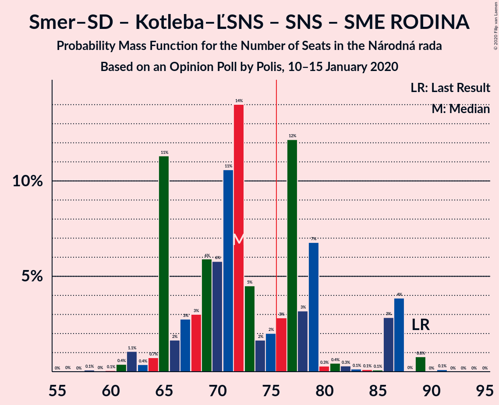

| Number of Seats | Probability | Accumulated | Special Marks |
|:---------------:|:-----------:|:-----------:|:-------------:|
| 56 | 0% | 100% |  |
| 57 | 0% | 99.9% |  |
| 58 | 0.1% | 99.9% |  |
| 59 | 0% | 99.8% |  |
| 60 | 0.1% | 99.8% |  |
| 61 | 0.4% | 99.7% |  |
| 62 | 1.1% | 99.3% |  |
| 63 | 0.4% | 98% |  |
| 64 | 0.7% | 98% |  |
| 65 | 11% | 97% |  |
| 66 | 2% | 86% |  |
| 67 | 3% | 84% |  |
| 68 | 3% | 81% |  |
| 69 | 6% | 78% |  |
| 70 | 6% | 73% |  |
| 71 | 11% | 67% |  |
| 72 | 14% | 56% |  |
| 73 | 5% | 42% |  |
| 74 | 2% | 38% | Median |
| 75 | 2% | 36% |  |
| 76 | 3% | 34% | Majority |
| 77 | 12% | 31% |  |
| 78 | 3% | 19% |  |
| 79 | 7% | 16% |  |
| 80 | 0.3% | 9% |  |
| 81 | 0.4% | 9% |  |
| 82 | 0.3% | 8% |  |
| 83 | 0.1% | 8% |  |
| 84 | 0.1% | 8% |  |
| 85 | 0.1% | 8% |  |
| 86 | 3% | 8% |  |
| 87 | 4% | 5% |  |
| 88 | 0% | 0.9% |  |
| 89 | 0.8% | 0.9% | Last Result |
| 90 | 0% | 0.1% |  |
| 91 | 0.1% | 0.1% |  |
| 92 | 0% | 0% |  |

### OBYČAJNÍ ĽUDIA a nezávislé osobnosti – Za ľudí – Progresívne Slovensko–SPOLU–Občianska Demokracia – Kresťanskodemokratické hnutie – SME RODINA – Sloboda a Solidarita

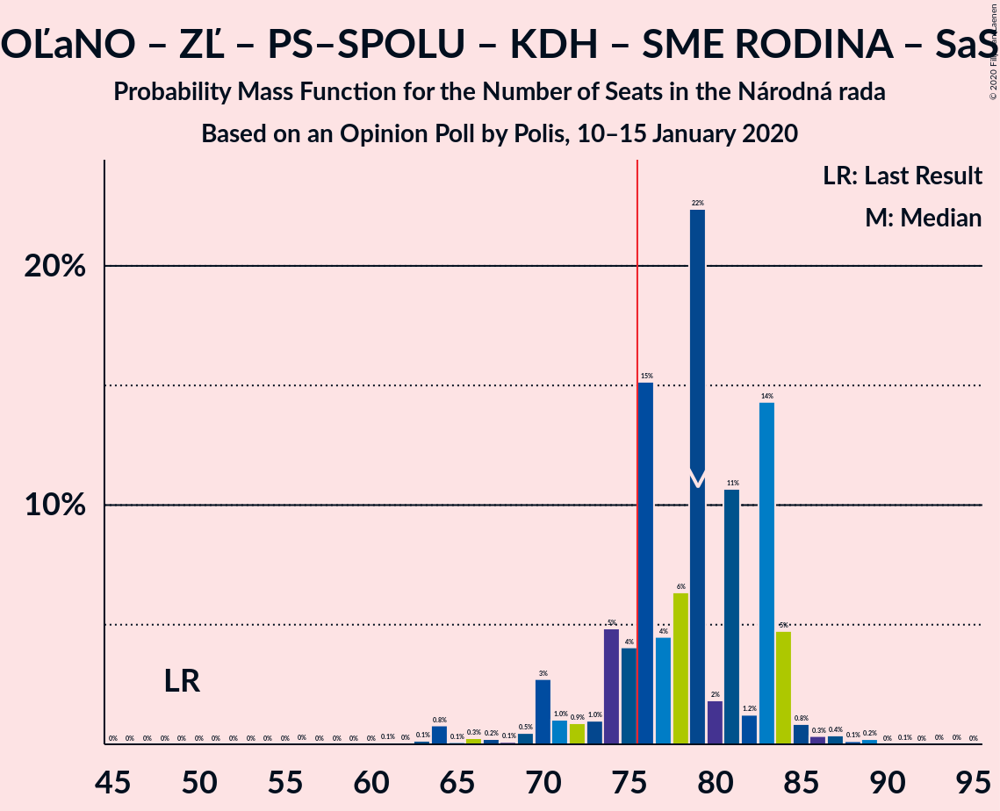

| Number of Seats | Probability | Accumulated | Special Marks |
|:---------------:|:-----------:|:-----------:|:-------------:|
| 49 | 0% | 100% | Last Result |
| 50 | 0% | 100% |  |
| 51 | 0% | 100% |  |
| 52 | 0% | 100% |  |
| 53 | 0% | 100% |  |
| 54 | 0% | 100% |  |
| 55 | 0% | 100% |  |
| 56 | 0% | 100% |  |
| 57 | 0% | 100% |  |
| 58 | 0% | 100% |  |
| 59 | 0% | 100% |  |
| 60 | 0% | 99.9% |  |
| 61 | 0.1% | 99.9% |  |
| 62 | 0% | 99.9% |  |
| 63 | 0.1% | 99.8% |  |
| 64 | 0.8% | 99.7% |  |
| 65 | 0.1% | 98.9% |  |
| 66 | 0.3% | 98.8% |  |
| 67 | 0.2% | 98.6% |  |
| 68 | 0.1% | 98% |  |
| 69 | 0.5% | 98% |  |
| 70 | 3% | 98% |  |
| 71 | 1.0% | 95% |  |
| 72 | 0.9% | 94% |  |
| 73 | 1.0% | 93% |  |
| 74 | 5% | 92% |  |
| 75 | 4% | 87% |  |
| 76 | 15% | 83% | Majority |
| 77 | 4% | 68% |  |
| 78 | 6% | 64% |  |
| 79 | 22% | 57% |  |
| 80 | 2% | 35% |  |
| 81 | 11% | 33% |  |
| 82 | 1.2% | 22% | Median |
| 83 | 14% | 21% |  |
| 84 | 5% | 7% |  |
| 85 | 0.8% | 2% |  |
| 86 | 0.3% | 1.2% |  |
| 87 | 0.4% | 0.9% |  |
| 88 | 0.1% | 0.5% |  |
| 89 | 0.2% | 0.4% |  |
| 90 | 0% | 0.2% |  |
| 91 | 0.1% | 0.1% |  |
| 92 | 0% | 0.1% |  |
| 93 | 0% | 0.1% |  |
| 94 | 0% | 0.1% |  |
| 95 | 0% | 0% |  |

### OBYČAJNÍ ĽUDIA a nezávislé osobnosti – Za ľudí – Progresívne Slovensko–SPOLU–Občianska Demokracia – Kresťanskodemokratické hnutie – Sloboda a Solidarita – MOST–HÍD – Strana maďarskej koalície–Magyar Koalíció Pártja

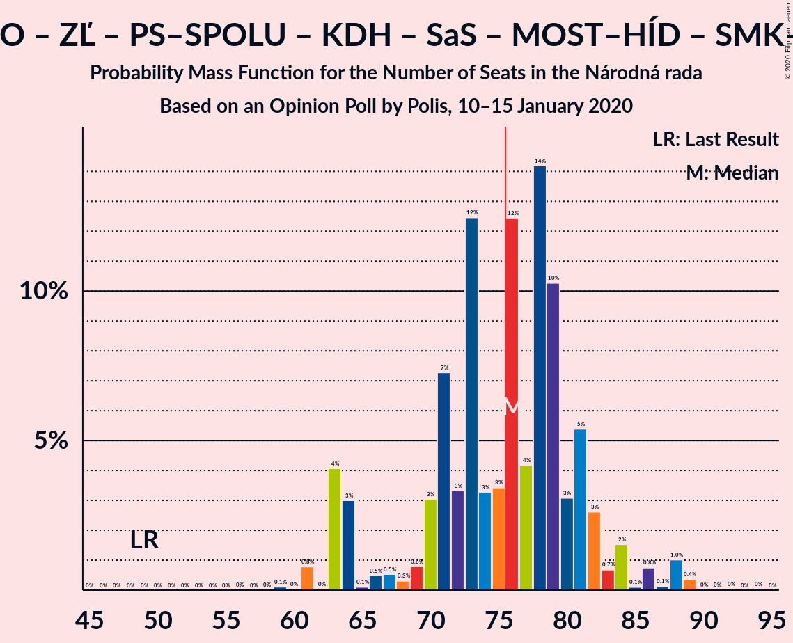

| Number of Seats | Probability | Accumulated | Special Marks |
|:---------------:|:-----------:|:-----------:|:-------------:|
| 49 | 0% | 100% | Last Result |
| 50 | 0% | 100% |  |
| 51 | 0% | 100% |  |
| 52 | 0% | 100% |  |
| 53 | 0% | 100% |  |
| 54 | 0% | 100% |  |
| 55 | 0% | 100% |  |
| 56 | 0% | 100% |  |
| 57 | 0% | 100% |  |
| 58 | 0% | 100% |  |
| 59 | 0.1% | 100% |  |
| 60 | 0% | 99.9% |  |
| 61 | 0.8% | 99.8% |  |
| 62 | 0% | 99.0% |  |
| 63 | 4% | 99.0% |  |
| 64 | 3% | 95% |  |
| 65 | 0.1% | 92% |  |
| 66 | 0.5% | 92% |  |
| 67 | 0.5% | 91% |  |
| 68 | 0.3% | 91% |  |
| 69 | 0.8% | 90% |  |
| 70 | 3% | 90% |  |
| 71 | 7% | 87% |  |
| 72 | 3% | 79% | Median |
| 73 | 12% | 76% |  |
| 74 | 3% | 64% |  |
| 75 | 3% | 60% |  |
| 76 | 12% | 57% | Majority |
| 77 | 4% | 44% |  |
| 78 | 14% | 40% |  |
| 79 | 10% | 26% |  |
| 80 | 3% | 16% |  |
| 81 | 5% | 13% |  |
| 82 | 3% | 7% |  |
| 83 | 0.7% | 5% |  |
| 84 | 2% | 4% |  |
| 85 | 0.1% | 2% |  |
| 86 | 0.8% | 2% |  |
| 87 | 0.1% | 2% |  |
| 88 | 1.0% | 1.5% |  |
| 89 | 0.4% | 0.5% |  |
| 90 | 0% | 0.1% |  |
| 91 | 0% | 0.1% |  |
| 92 | 0% | 0.1% |  |
| 93 | 0% | 0% |  |

### OBYČAJNÍ ĽUDIA a nezávislé osobnosti – Za ľudí – Progresívne Slovensko–SPOLU–Občianska Demokracia – Kresťanskodemokratické hnutie – Sloboda a Solidarita – MOST–HÍD

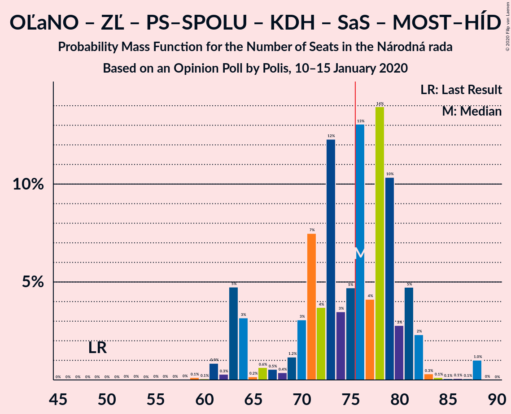

| Number of Seats | Probability | Accumulated | Special Marks |
|:---------------:|:-----------:|:-----------:|:-------------:|
| 49 | 0% | 100% | Last Result |
| 50 | 0% | 100% |  |
| 51 | 0% | 100% |  |
| 52 | 0% | 100% |  |
| 53 | 0% | 100% |  |
| 54 | 0% | 100% |  |
| 55 | 0% | 100% |  |
| 56 | 0% | 100% |  |
| 57 | 0% | 100% |  |
| 58 | 0% | 99.9% |  |
| 59 | 0.1% | 99.9% |  |
| 60 | 0.1% | 99.8% |  |
| 61 | 0.9% | 99.7% |  |
| 62 | 0.3% | 98.9% |  |
| 63 | 5% | 98.6% |  |
| 64 | 3% | 94% |  |
| 65 | 0.2% | 91% |  |
| 66 | 0.6% | 91% |  |
| 67 | 0.5% | 90% |  |
| 68 | 0.4% | 89% |  |
| 69 | 1.2% | 89% |  |
| 70 | 3% | 88% |  |
| 71 | 7% | 85% |  |
| 72 | 4% | 77% | Median |
| 73 | 12% | 74% |  |
| 74 | 3% | 61% |  |
| 75 | 5% | 58% |  |
| 76 | 13% | 53% | Majority |
| 77 | 4% | 40% |  |
| 78 | 14% | 36% |  |
| 79 | 10% | 22% |  |
| 80 | 3% | 12% |  |
| 81 | 5% | 9% |  |
| 82 | 2% | 4% |  |
| 83 | 0.3% | 2% |  |
| 84 | 0.1% | 1.4% |  |
| 85 | 0.1% | 1.3% |  |
| 86 | 0.1% | 1.2% |  |
| 87 | 0.1% | 1.1% |  |
| 88 | 1.0% | 1.1% |  |
| 89 | 0% | 0.1% |  |
| 90 | 0% | 0% |  |

### OBYČAJNÍ ĽUDIA a nezávislé osobnosti – Za ľudí – Progresívne Slovensko–SPOLU–Občianska Demokracia – Kresťanskodemokratické hnutie – Sloboda a Solidarita – Strana maďarskej koalície–Magyar Koalíció Pártja

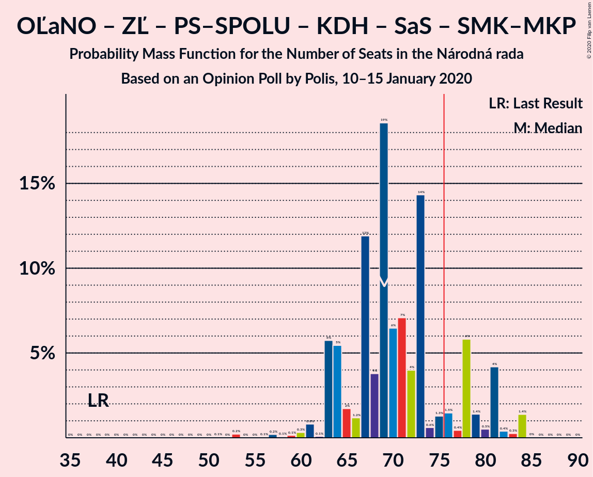

| Number of Seats | Probability | Accumulated | Special Marks |
|:---------------:|:-----------:|:-----------:|:-------------:|
| 38 | 0% | 100% | Last Result |
| 39 | 0% | 100% |  |
| 40 | 0% | 100% |  |
| 41 | 0% | 100% |  |
| 42 | 0% | 100% |  |
| 43 | 0% | 100% |  |
| 44 | 0% | 100% |  |
| 45 | 0% | 100% |  |
| 46 | 0% | 100% |  |
| 47 | 0% | 100% |  |
| 48 | 0% | 100% |  |
| 49 | 0% | 100% |  |
| 50 | 0% | 100% |  |
| 51 | 0.1% | 100% |  |
| 52 | 0% | 99.9% |  |
| 53 | 0.2% | 99.9% |  |
| 54 | 0% | 99.7% |  |
| 55 | 0% | 99.7% |  |
| 56 | 0.1% | 99.7% |  |
| 57 | 0.2% | 99.6% |  |
| 58 | 0.1% | 99.4% |  |
| 59 | 0.1% | 99.4% |  |
| 60 | 0.3% | 99.2% |  |
| 61 | 0.8% | 98.9% |  |
| 62 | 0.1% | 98% |  |
| 63 | 6% | 98% |  |
| 64 | 5% | 92% |  |
| 65 | 2% | 87% |  |
| 66 | 1.2% | 85% |  |
| 67 | 12% | 84% |  |
| 68 | 4% | 72% |  |
| 69 | 19% | 68% |  |
| 70 | 6% | 50% |  |
| 71 | 7% | 43% |  |
| 72 | 4% | 36% | Median |
| 73 | 14% | 32% |  |
| 74 | 0.6% | 18% |  |
| 75 | 1.3% | 17% |  |
| 76 | 1.5% | 16% | Majority |
| 77 | 0.4% | 14% |  |
| 78 | 6% | 14% |  |
| 79 | 1.4% | 8% |  |
| 80 | 0.5% | 7% |  |
| 81 | 4% | 6% |  |
| 82 | 0.4% | 2% |  |
| 83 | 0.3% | 2% |  |
| 84 | 1.4% | 1.4% |  |
| 85 | 0% | 0.1% |  |
| 86 | 0% | 0% |  |

### OBYČAJNÍ ĽUDIA a nezávislé osobnosti – Za ľudí – Progresívne Slovensko–SPOLU–Občianska Demokracia – Kresťanskodemokratické hnutie – Sloboda a Solidarita

| Number of Seats | Probability | Accumulated | Special Marks |
|:---------------:|:-----------:|:-----------:|:-------------:|
| 38 | 0% | 100% | Last Result |
| 39 | 0% | 100% |  |
| 40 | 0% | 100% |  |
| 41 | 0% | 100% |  |
| 42 | 0% | 100% |  |
| 43 | 0% | 100% |  |
| 44 | 0% | 100% |  |
| 45 | 0% | 100% |  |
| 46 | 0% | 100% |  |
| 47 | 0% | 100% |  |
| 48 | 0% | 100% |  |
| 49 | 0% | 100% |  |
| 50 | 0% | 100% |  |
| 51 | 0.1% | 100% |  |
| 52 | 0% | 99.9% |  |
| 53 | 0.2% | 99.9% |  |
| 54 | 0.1% | 99.7% |  |
| 55 | 0.5% | 99.5% |  |
| 56 | 0.1% | 99.0% |  |
| 57 | 0.2% | 98.9% |  |
| 58 | 0.1% | 98.7% |  |
| 59 | 0.2% | 98.6% |  |
| 60 | 0.3% | 98% |  |
| 61 | 1.0% | 98% |  |
| 62 | 0.7% | 97% |  |
| 63 | 6% | 96% |  |
| 64 | 6% | 91% |  |
| 65 | 2% | 85% |  |
| 66 | 2% | 84% |  |
| 67 | 12% | 82% |  |
| 68 | 4% | 70% |  |
| 69 | 19% | 66% |  |
| 70 | 6% | 47% |  |
| 71 | 7% | 40% |  |
| 72 | 4% | 33% | Median |
| 73 | 14% | 29% |  |
| 74 | 0.6% | 15% |  |
| 75 | 3% | 14% |  |
| 76 | 0.8% | 12% | Majority |
| 77 | 0.4% | 11% |  |
| 78 | 6% | 11% |  |
| 79 | 1.0% | 5% |  |
| 80 | 0.1% | 4% |  |
| 81 | 4% | 4% |  |
| 82 | 0.1% | 0.2% |  |
| 83 | 0.1% | 0.1% |  |
| 84 | 0% | 0% |  |

### OBYČAJNÍ ĽUDIA a nezávislé osobnosti – Za ľudí – Progresívne Slovensko–SPOLU–Občianska Demokracia – Sloboda a Solidarita

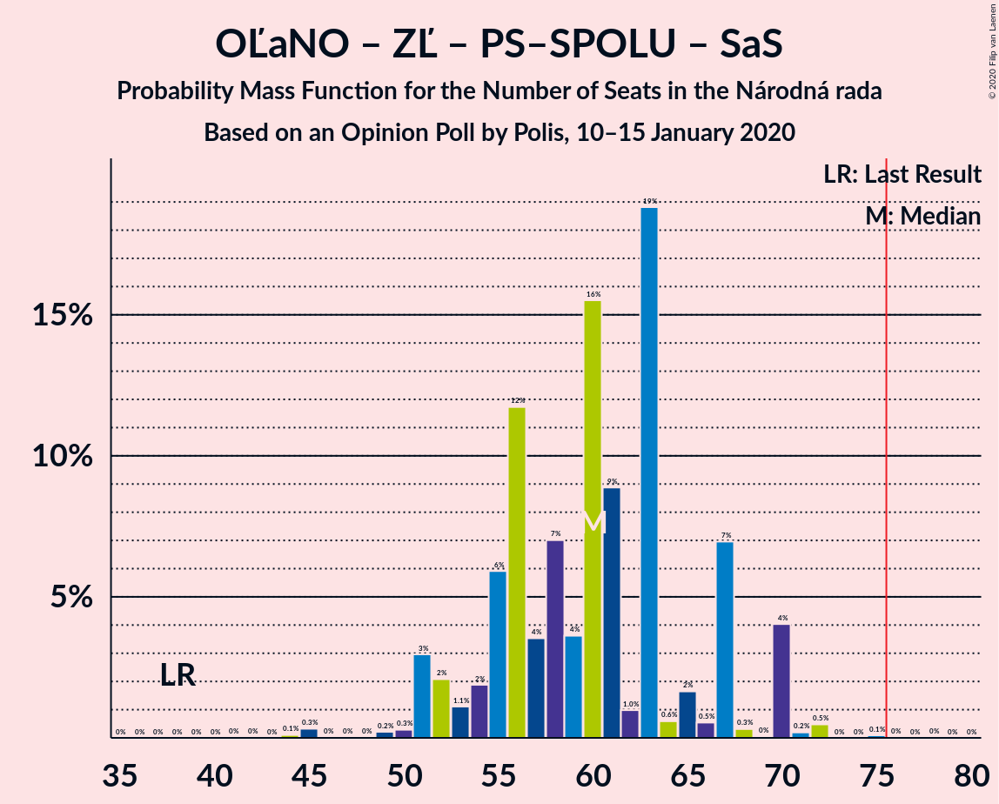

| Number of Seats | Probability | Accumulated | Special Marks |
|:---------------:|:-----------:|:-----------:|:-------------:|
| 38 | 0% | 100% | Last Result |
| 39 | 0% | 100% |  |
| 40 | 0% | 100% |  |
| 41 | 0% | 100% |  |
| 42 | 0% | 100% |  |
| 43 | 0% | 100% |  |
| 44 | 0.1% | 100% |  |
| 45 | 0.3% | 99.9% |  |
| 46 | 0% | 99.5% |  |
| 47 | 0% | 99.5% |  |
| 48 | 0% | 99.5% |  |
| 49 | 0.2% | 99.5% |  |
| 50 | 0.3% | 99.3% |  |
| 51 | 3% | 99.0% |  |
| 52 | 2% | 96% |  |
| 53 | 1.1% | 94% |  |
| 54 | 2% | 93% |  |
| 55 | 6% | 91% |  |
| 56 | 12% | 85% |  |
| 57 | 4% | 73% |  |
| 58 | 7% | 70% |  |
| 59 | 4% | 63% |  |
| 60 | 16% | 59% |  |
| 61 | 9% | 44% | Median |
| 62 | 1.0% | 35% |  |
| 63 | 19% | 34% |  |
| 64 | 0.6% | 15% |  |
| 65 | 2% | 14% |  |
| 66 | 0.5% | 13% |  |
| 67 | 7% | 12% |  |
| 68 | 0.3% | 5% |  |
| 69 | 0% | 5% |  |
| 70 | 4% | 5% |  |
| 71 | 0.2% | 0.8% |  |
| 72 | 0.5% | 0.6% |  |
| 73 | 0% | 0.1% |  |
| 74 | 0% | 0.1% |  |
| 75 | 0.1% | 0.1% |  |
| 76 | 0% | 0% | Majority |

### SMER–sociálna demokracia – Slovenská národná strana – SME RODINA

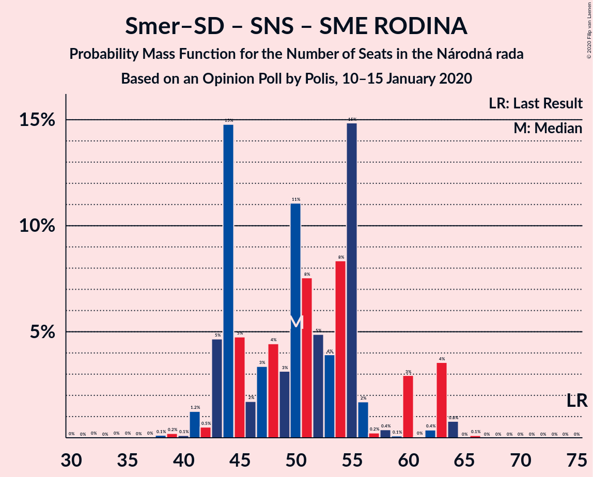

| Number of Seats | Probability | Accumulated | Special Marks |
|:---------------:|:-----------:|:-----------:|:-------------:|
| 34 | 0% | 100% |  |
| 35 | 0% | 99.9% |  |
| 36 | 0% | 99.9% |  |
| 37 | 0% | 99.9% |  |
| 38 | 0.1% | 99.9% |  |
| 39 | 0.2% | 99.7% |  |
| 40 | 0.1% | 99.5% |  |
| 41 | 1.2% | 99.4% |  |
| 42 | 0.5% | 98% |  |
| 43 | 5% | 98% |  |
| 44 | 15% | 93% |  |
| 45 | 5% | 78% |  |
| 46 | 2% | 73% |  |
| 47 | 3% | 72% |  |
| 48 | 4% | 68% |  |
| 49 | 3% | 64% |  |
| 50 | 11% | 61% |  |
| 51 | 8% | 50% |  |
| 52 | 5% | 42% | Median |
| 53 | 4% | 37% |  |
| 54 | 8% | 33% |  |
| 55 | 15% | 25% |  |
| 56 | 2% | 10% |  |
| 57 | 0.2% | 8% |  |
| 58 | 0.4% | 8% |  |
| 59 | 0.1% | 8% |  |
| 60 | 3% | 8% |  |
| 61 | 0% | 5% |  |
| 62 | 0.4% | 5% |  |
| 63 | 4% | 4% |  |
| 64 | 0.8% | 0.9% |  |
| 65 | 0% | 0.1% |  |
| 66 | 0.1% | 0.1% |  |
| 67 | 0% | 0% |  |
| 68 | 0% | 0% |  |
| 69 | 0% | 0% |  |
| 70 | 0% | 0% |  |
| 71 | 0% | 0% |  |
| 72 | 0% | 0% |  |
| 73 | 0% | 0% |  |
| 74 | 0% | 0% |  |
| 75 | 0% | 0% | Last Result |

### Za ľudí – Progresívne Slovensko–SPOLU–Občianska Demokracia – Kresťanskodemokratické hnutie – Sloboda a Solidarita

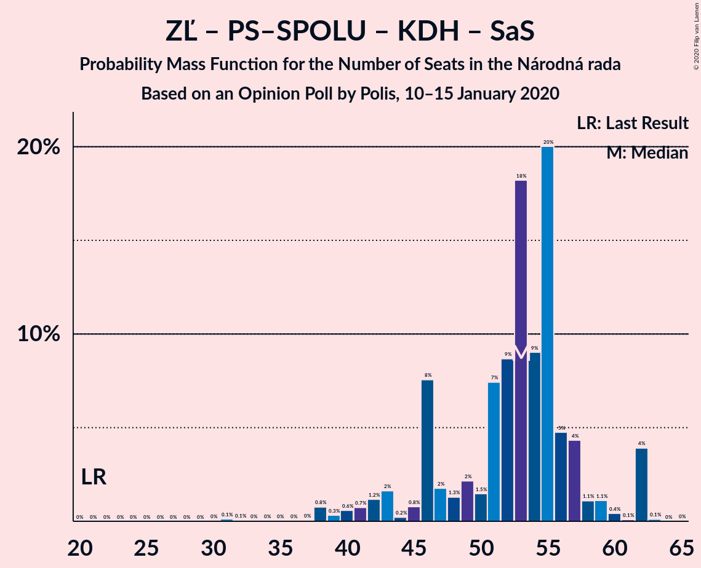

| Number of Seats | Probability | Accumulated | Special Marks |
|:---------------:|:-----------:|:-----------:|:-------------:|
| 21 | 0% | 100% | Last Result |
| 22 | 0% | 100% |  |
| 23 | 0% | 100% |  |
| 24 | 0% | 100% |  |
| 25 | 0% | 100% |  |
| 26 | 0% | 100% |  |
| 27 | 0% | 100% |  |
| 28 | 0% | 100% |  |
| 29 | 0% | 100% |  |
| 30 | 0% | 100% |  |
| 31 | 0.1% | 100% |  |
| 32 | 0.1% | 99.9% |  |
| 33 | 0% | 99.8% |  |
| 34 | 0% | 99.8% |  |
| 35 | 0% | 99.8% |  |
| 36 | 0% | 99.8% |  |
| 37 | 0% | 99.8% |  |
| 38 | 0.8% | 99.7% |  |
| 39 | 0.3% | 98.9% |  |
| 40 | 0.6% | 98.6% |  |
| 41 | 0.7% | 98% |  |
| 42 | 1.2% | 97% |  |
| 43 | 2% | 96% |  |
| 44 | 0.2% | 94% |  |
| 45 | 0.8% | 94% |  |
| 46 | 8% | 93% |  |
| 47 | 2% | 86% |  |
| 48 | 1.3% | 84% |  |
| 49 | 2% | 83% |  |
| 50 | 1.5% | 81% |  |
| 51 | 7% | 79% |  |
| 52 | 9% | 72% |  |
| 53 | 18% | 63% |  |
| 54 | 9% | 45% | Median |
| 55 | 20% | 36% |  |
| 56 | 5% | 16% |  |
| 57 | 4% | 11% |  |
| 58 | 1.1% | 7% |  |
| 59 | 1.1% | 6% |  |
| 60 | 0.4% | 5% |  |
| 61 | 0.1% | 4% |  |
| 62 | 4% | 4% |  |
| 63 | 0.1% | 0.1% |  |
| 64 | 0% | 0% |  |

### SMER–sociálna demokracia – Slovenská národná strana – MOST–HÍD

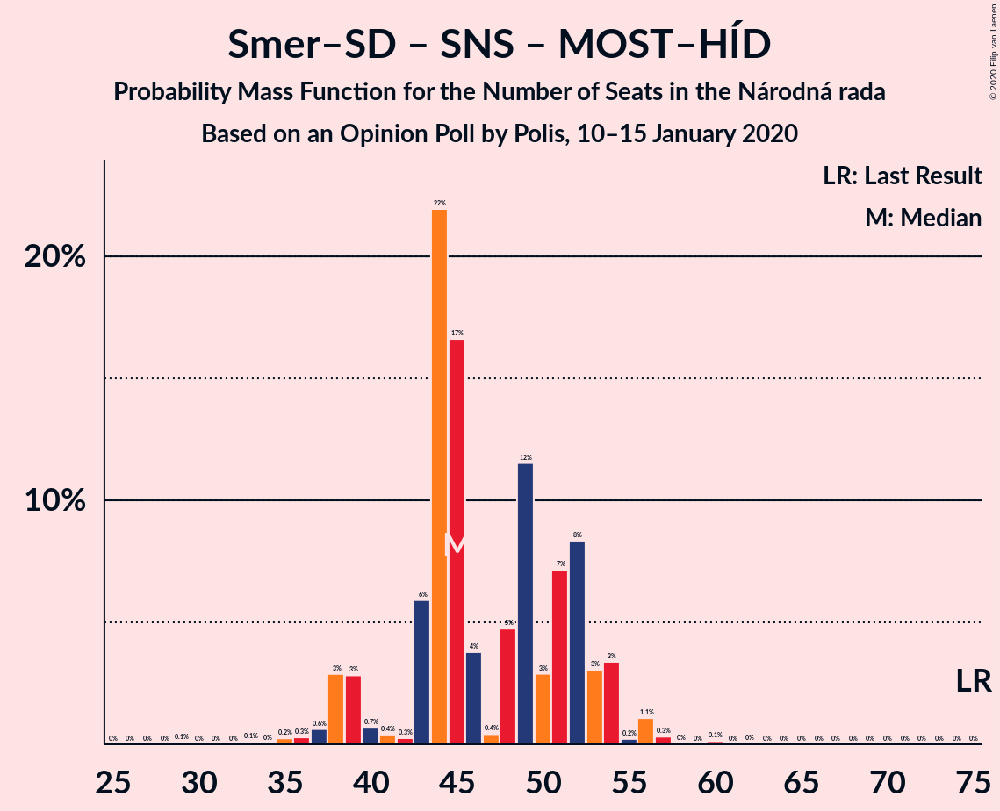

| Number of Seats | Probability | Accumulated | Special Marks |
|:---------------:|:-----------:|:-----------:|:-------------:|
| 29 | 0.1% | 100% |  |
| 30 | 0% | 99.9% |  |
| 31 | 0% | 99.9% |  |
| 32 | 0% | 99.9% |  |
| 33 | 0.1% | 99.9% |  |
| 34 | 0% | 99.8% |  |
| 35 | 0.2% | 99.8% |  |
| 36 | 0.3% | 99.5% |  |
| 37 | 0.6% | 99.2% |  |
| 38 | 3% | 98.6% |  |
| 39 | 3% | 96% |  |
| 40 | 0.7% | 93% |  |
| 41 | 0.4% | 92% |  |
| 42 | 0.3% | 92% | Median |
| 43 | 6% | 92% |  |
| 44 | 22% | 86% |  |
| 45 | 17% | 64% |  |
| 46 | 4% | 47% |  |
| 47 | 0.4% | 43% |  |
| 48 | 5% | 43% |  |
| 49 | 12% | 38% |  |
| 50 | 3% | 27% |  |
| 51 | 7% | 24% |  |
| 52 | 8% | 17% |  |
| 53 | 3% | 8% |  |
| 54 | 3% | 5% |  |
| 55 | 0.2% | 2% |  |
| 56 | 1.1% | 2% |  |
| 57 | 0.3% | 0.5% |  |
| 58 | 0% | 0.2% |  |
| 59 | 0% | 0.2% |  |
| 60 | 0.1% | 0.2% |  |
| 61 | 0% | 0% |  |
| 62 | 0% | 0% |  |
| 63 | 0% | 0% |  |
| 64 | 0% | 0% |  |
| 65 | 0% | 0% |  |
| 66 | 0% | 0% |  |
| 67 | 0% | 0% |  |
| 68 | 0% | 0% |  |
| 69 | 0% | 0% |  |
| 70 | 0% | 0% |  |
| 71 | 0% | 0% |  |
| 72 | 0% | 0% |  |
| 73 | 0% | 0% |  |
| 74 | 0% | 0% |  |
| 75 | 0% | 0% | Last Result |

### SMER–sociálna demokracia – Slovenská národná strana

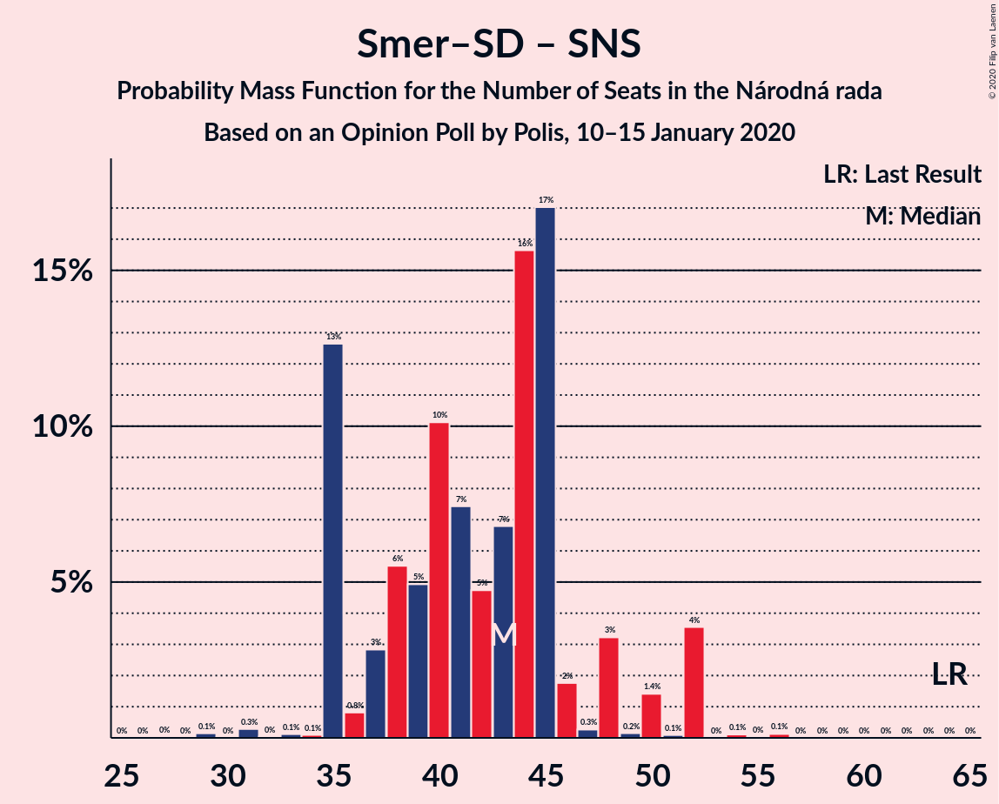

| Number of Seats | Probability | Accumulated | Special Marks |
|:---------------:|:-----------:|:-----------:|:-------------:|
| 29 | 0.1% | 100% |  |
| 30 | 0% | 99.8% |  |
| 31 | 0.3% | 99.8% |  |
| 32 | 0% | 99.5% |  |
| 33 | 0.1% | 99.5% |  |
| 34 | 0.1% | 99.3% |  |
| 35 | 13% | 99.2% |  |
| 36 | 0.8% | 87% |  |
| 37 | 3% | 86% |  |
| 38 | 6% | 83% |  |
| 39 | 5% | 77% |  |
| 40 | 10% | 73% |  |
| 41 | 7% | 62% |  |
| 42 | 5% | 55% | Median |
| 43 | 7% | 50% |  |
| 44 | 16% | 43% |  |
| 45 | 17% | 28% |  |
| 46 | 2% | 11% |  |
| 47 | 0.3% | 9% |  |
| 48 | 3% | 9% |  |
| 49 | 0.2% | 5% |  |
| 50 | 1.4% | 5% |  |
| 51 | 0.1% | 4% |  |
| 52 | 4% | 4% |  |
| 53 | 0% | 0.3% |  |
| 54 | 0.1% | 0.2% |  |
| 55 | 0% | 0.1% |  |
| 56 | 0.1% | 0.1% |  |
| 57 | 0% | 0% |  |
| 58 | 0% | 0% |  |
| 59 | 0% | 0% |  |
| 60 | 0% | 0% |  |
| 61 | 0% | 0% |  |
| 62 | 0% | 0% |  |
| 63 | 0% | 0% |  |
| 64 | 0% | 0% | Last Result |

### Za ľudí – Progresívne Slovensko–SPOLU–Občianska Demokracia – Sloboda a Solidarita

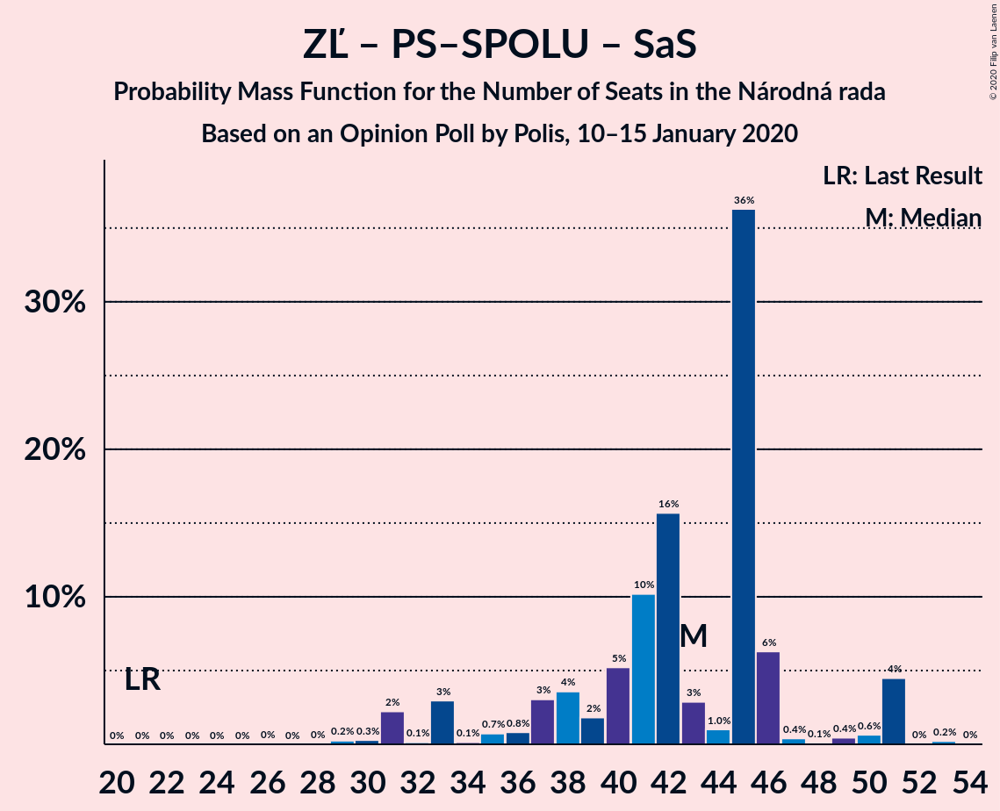

| Number of Seats | Probability | Accumulated | Special Marks |
|:---------------:|:-----------:|:-----------:|:-------------:|
| 21 | 0% | 100% | Last Result |
| 22 | 0% | 100% |  |
| 23 | 0% | 100% |  |
| 24 | 0% | 100% |  |
| 25 | 0% | 100% |  |
| 26 | 0% | 100% |  |
| 27 | 0% | 100% |  |
| 28 | 0% | 100% |  |
| 29 | 0.2% | 100% |  |
| 30 | 0.3% | 99.7% |  |
| 31 | 2% | 99.4% |  |
| 32 | 0.1% | 97% |  |
| 33 | 3% | 97% |  |
| 34 | 0.1% | 94% |  |
| 35 | 0.7% | 94% |  |
| 36 | 0.8% | 93% |  |
| 37 | 3% | 92% |  |
| 38 | 4% | 89% |  |
| 39 | 2% | 86% |  |
| 40 | 5% | 84% |  |
| 41 | 10% | 79% |  |
| 42 | 16% | 69% |  |
| 43 | 3% | 53% | Median |
| 44 | 1.0% | 50% |  |
| 45 | 36% | 49% |  |
| 46 | 6% | 13% |  |
| 47 | 0.4% | 6% |  |
| 48 | 0.1% | 6% |  |
| 49 | 0.4% | 6% |  |
| 50 | 0.6% | 5% |  |
| 51 | 4% | 5% |  |
| 52 | 0% | 0.3% |  |
| 53 | 0.2% | 0.2% |  |
| 54 | 0% | 0% |  |

### SMER–sociálna demokracia – SME RODINA

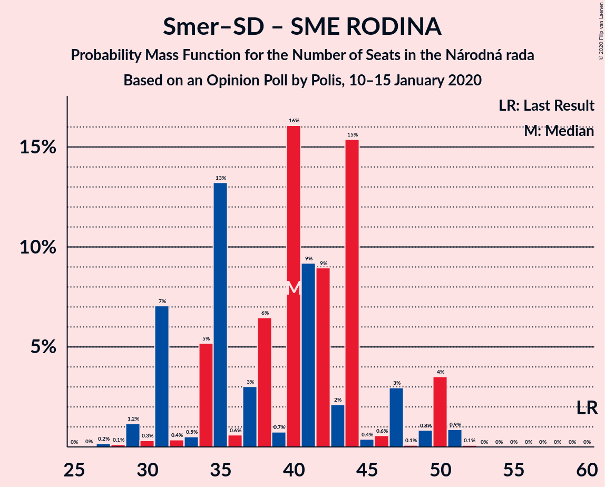

| Number of Seats | Probability | Accumulated | Special Marks |
|:---------------:|:-----------:|:-----------:|:-------------:|
| 26 | 0% | 100% |  |
| 27 | 0.2% | 99.9% |  |
| 28 | 0.1% | 99.8% |  |
| 29 | 1.2% | 99.7% |  |
| 30 | 0.3% | 98.5% |  |
| 31 | 7% | 98% |  |
| 32 | 0.4% | 91% |  |
| 33 | 0.5% | 91% |  |
| 34 | 5% | 90% |  |
| 35 | 13% | 85% |  |
| 36 | 0.6% | 72% |  |
| 37 | 3% | 71% |  |
| 38 | 6% | 68% |  |
| 39 | 0.7% | 62% |  |
| 40 | 16% | 61% |  |
| 41 | 9% | 45% | Median |
| 42 | 9% | 36% |  |
| 43 | 2% | 27% |  |
| 44 | 15% | 25% |  |
| 45 | 0.4% | 9% |  |
| 46 | 0.6% | 9% |  |
| 47 | 3% | 8% |  |
| 48 | 0.1% | 5% |  |
| 49 | 0.8% | 5% |  |
| 50 | 4% | 4% |  |
| 51 | 0.9% | 1.0% |  |
| 52 | 0.1% | 0.1% |  |
| 53 | 0% | 0% |  |
| 54 | 0% | 0% |  |
| 55 | 0% | 0% |  |
| 56 | 0% | 0% |  |
| 57 | 0% | 0% |  |
| 58 | 0% | 0% |  |
| 59 | 0% | 0% |  |
| 60 | 0% | 0% | Last Result |

### SMER–sociálna demokracia

| Number of Seats | Probability | Accumulated | Special Marks |
|:---------------:|:-----------:|:-----------:|:-------------:|
| 24 | 0.1% | 100% |  |
| 25 | 1.0% | 99.9% |  |
| 26 | 15% | 98.9% |  |
| 27 | 0.8% | 84% |  |
| 28 | 3% | 83% |  |
| 29 | 10% | 81% |  |
| 30 | 13% | 71% |  |
| 31 | 20% | 58% | Median |
| 32 | 7% | 38% |  |
| 33 | 4% | 31% |  |
| 34 | 18% | 27% |  |
| 35 | 3% | 9% |  |
| 36 | 0.5% | 6% |  |
| 37 | 1.4% | 6% |  |
| 38 | 0.3% | 4% |  |
| 39 | 4% | 4% |  |
| 40 | 0% | 0.2% |  |
| 41 | 0% | 0.2% |  |
| 42 | 0% | 0.2% |  |
| 43 | 0% | 0.1% |  |
| 44 | 0.1% | 0.1% |  |
| 45 | 0% | 0% |  |
| 46 | 0% | 0% |  |
| 47 | 0% | 0% |  |
| 48 | 0% | 0% |  |
| 49 | 0% | 0% | Last Result |

## Technical Information

### Opinion Poll

+ **Polling firm:** Polis
+ **Commissioner(s):** —
+ **Fieldwork period:** 10–15 January 2020

### Calculations

+ **Sample size:** 1140
+ **Simulations done:** 1,048,576
+ **Error estimate:** 2.82%

