# Opinion Poll by FOCUS, 15–22 January 2020

<a href="#voting-intentions">Voting Intentions</a> | <a href="#seats">Seats</a> | <a href="#coalitions">Coalitions</a> | <a href="#technical-information">Technical Information</a>

## Voting Intentions

### Confidence Intervals

| Party | Last Result | Poll Result | 80% Confidence Interval | 90% Confidence Interval | 95% Confidence Interval | 99% Confidence Interval |
|:-----:|:-----------:|:-----------:|:-----------------------:|:-----------------------:|:-----------------------:|:-----------------------:|
| SMER–sociálna demokracia | 28.3% | 18.0% | 16.5–19.6% |16.1–20.1% |15.7–20.5% |15.0–21.3% |
| Kotleba–Ľudová strana Naše Slovensko | 8.0% | 12.8% | 11.6–14.3% |11.2–14.7% |10.9–15.0% |10.3–15.8% |
| Za ľudí | 0.0% | 10.8% | 9.6–12.1% |9.3–12.5% |9.0–12.8% |8.5–13.5% |
| Progresívne Slovensko–SPOLU–Občianska Demokracia | 0.0% | 9.8% | 8.7–11.1% |8.4–11.4% |8.1–11.8% |7.6–12.4% |
| OBYČAJNÍ ĽUDIA a nezávislé osobnosti | 11.0% | 9.0% | 7.9–10.2% |7.6–10.6% |7.4–10.9% |6.9–11.5% |
| SME RODINA | 6.6% | 7.6% | 6.6–8.8% |6.4–9.1% |6.1–9.4% |5.7–10.0% |
| Kresťanskodemokratické hnutie | 4.9% | 5.7% | 4.9–6.8% |4.6–7.1% |4.5–7.3% |4.1–7.9% |
| Sloboda a Solidarita | 12.1% | 5.5% | 4.7–6.6% |4.5–6.9% |4.3–7.1% |3.9–7.7% |
| Slovenská národná strana | 8.6% | 5.2% | 4.4–6.2% |4.2–6.5% |4.0–6.8% |3.7–7.3% |
| MOST–HÍD | 6.5% | 4.4% | 3.7–5.4% |3.5–5.7% |3.3–5.9% |3.0–6.4% |
| Strana maďarskej koalície–Magyar Koalíció Pártja | 4.0% | 4.0% | 3.4–5.0% |3.2–5.2% |3.0–5.5% |2.7–5.9% |
| Dobrá voľba | 0.0% | 4.0% | 3.4–5.0% |3.2–5.2% |3.0–5.5% |2.7–5.9% |
| VLASŤ | 0.0% | 2.0% | 1.5–2.7% |1.4–2.9% |1.3–3.0% |1.1–3.4% |

*Note:* The poll result column reflects the actual value used in the calculations. Published results may vary slightly, and in addition be rounded to fewer digits.

## Seats

### Confidence Intervals

| Party | Last Result | Median | 80% Confidence Interval | 90% Confidence Interval | 95% Confidence Interval | 99% Confidence Interval |
|:-----:|:-----------:|:------:|:-----------------------:|:-----------------------:|:-----------------------:|:-----------------------:|
| <a href="#smer–sociálna-demokracia">SMER–sociálna demokracia</a> | 49 | 30 | 29–36 |29–36 |28–38 |27–40 |
| <a href="#kotleba–ľudová-strana-naše-slovensko">Kotleba–Ľudová strana Naše Slovensko</a> | 14 | 23 | 20–25 |19–25 |19–26 |19–27 |
| <a href="#za-ľudí">Za ľudí</a> | 0 | 19 | 17–21 |16–22 |15–24 |14–26 |
| <a href="#progresívne-slovensko–spolu–občianska-demokracia">Progresívne Slovensko–SPOLU–Občianska Demokracia</a> | 0 | 18 | 16–19 |16–19 |15–20 |13–21 |
| <a href="#obyčajní-ľudia-a-nezávislé-osobnosti">OBYČAJNÍ ĽUDIA a nezávislé osobnosti</a> | 17 | 17 | 15–18 |15–18 |14–19 |12–21 |
| <a href="#sme-rodina">SME RODINA</a> | 11 | 13 | 11–15 |11–15 |11–17 |11–18 |
| <a href="#kresťanskodemokratické-hnutie">Kresťanskodemokratické hnutie</a> | 0 | 9 | 9–11 |0–11 |0–11 |0–13 |
| <a href="#sloboda-a-solidarita">Sloboda a Solidarita</a> | 21 | 10 | 9–12 |0–12 |0–13 |0–13 |
| <a href="#slovenská-národná-strana">Slovenská národná strana</a> | 15 | 9 | 9–10 |0–10 |0–11 |0–14 |
| <a href="#most–híd">MOST–HÍD</a> | 11 | 0 | 0 |0 |0–9 |0–10 |
| <a href="#strana-maďarskej-koalície–magyar-koalíció-pártja">Strana maďarskej koalície–Magyar Koalíció Pártja</a> | 0 | 0 | 0 |0 |0–9 |0–10 |
| <a href="#dobrá-voľba">Dobrá voľba</a> | 0 | 0 | 0 |0 |0–9 |0–10 |
| <a href="#vlasť">VLASŤ</a> | 0 | 0 | 0 |0 |0 |0 |

### SMER–sociálna demokracia

*For a full overview of the results for this party, see the [SMER–sociálna demokracia](party-smer–sociálnademokracia.html) page.*

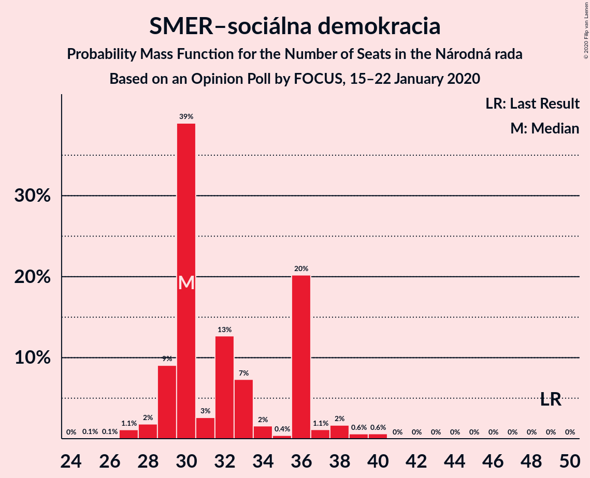

| Number of Seats | Probability | Accumulated | Special Marks |
|:---------------:|:-----------:|:-----------:|:-------------:|
| 25 | 0.1% | 100% |  |
| 26 | 0.1% | 99.9% |  |
| 27 | 1.1% | 99.8% |  |
| 28 | 2% | 98.7% |  |
| 29 | 9% | 97% |  |
| 30 | 39% | 88% | Median |
| 31 | 3% | 49% |  |
| 32 | 13% | 46% |  |
| 33 | 7% | 34% |  |
| 34 | 2% | 26% |  |
| 35 | 0.4% | 25% |  |
| 36 | 20% | 24% |  |
| 37 | 1.1% | 4% |  |
| 38 | 2% | 3% |  |
| 39 | 0.6% | 1.3% |  |
| 40 | 0.6% | 0.7% |  |
| 41 | 0% | 0.1% |  |
| 42 | 0% | 0% |  |
| 43 | 0% | 0% |  |
| 44 | 0% | 0% |  |
| 45 | 0% | 0% |  |
| 46 | 0% | 0% |  |
| 47 | 0% | 0% |  |
| 48 | 0% | 0% |  |
| 49 | 0% | 0% | Last Result |

### Kotleba–Ľudová strana Naše Slovensko

*For a full overview of the results for this party, see the [Kotleba–Ľudová strana Naše Slovensko](party-kotleba–ľudovástrananašeslovensko.html) page.*

| Number of Seats | Probability | Accumulated | Special Marks |
|:---------------:|:-----------:|:-----------:|:-------------:|
| 14 | 0% | 100% | Last Result |
| 15 | 0% | 100% |  |
| 16 | 0% | 100% |  |
| 17 | 0.2% | 100% |  |
| 18 | 0.1% | 99.7% |  |
| 19 | 6% | 99.6% |  |
| 20 | 10% | 94% |  |
| 21 | 8% | 84% |  |
| 22 | 22% | 77% |  |
| 23 | 6% | 55% | Median |
| 24 | 4% | 49% |  |
| 25 | 41% | 46% |  |
| 26 | 2% | 5% |  |
| 27 | 2% | 2% |  |
| 28 | 0.3% | 0.4% |  |
| 29 | 0% | 0.1% |  |
| 30 | 0.1% | 0.1% |  |
| 31 | 0% | 0% |  |

### Za ľudí

*For a full overview of the results for this party, see the [Za ľudí](party-zaľudí.html) page.*

| Number of Seats | Probability | Accumulated | Special Marks |
|:---------------:|:-----------:|:-----------:|:-------------:|
| 0 | 0% | 100% | Last Result |
| 1 | 0% | 100% |  |
| 2 | 0% | 100% |  |
| 3 | 0% | 100% |  |
| 4 | 0% | 100% |  |
| 5 | 0% | 100% |  |
| 6 | 0% | 100% |  |
| 7 | 0% | 100% |  |
| 8 | 0% | 100% |  |
| 9 | 0% | 100% |  |
| 10 | 0% | 100% |  |
| 11 | 0% | 100% |  |
| 12 | 0% | 100% |  |
| 13 | 0% | 100% |  |
| 14 | 0.6% | 100% |  |
| 15 | 4% | 99.4% |  |
| 16 | 3% | 96% |  |
| 17 | 4% | 93% |  |
| 18 | 26% | 88% |  |
| 19 | 48% | 62% | Median |
| 20 | 2% | 14% |  |
| 21 | 3% | 13% |  |
| 22 | 6% | 10% |  |
| 23 | 0.7% | 3% |  |
| 24 | 0.1% | 3% |  |
| 25 | 0.8% | 2% |  |
| 26 | 1.4% | 2% |  |
| 27 | 0.1% | 0.1% |  |
| 28 | 0% | 0% |  |

### Progresívne Slovensko–SPOLU–Občianska Demokracia

*For a full overview of the results for this party, see the [Progresívne Slovensko–SPOLU–Občianska Demokracia](party-progresívneslovensko–spolu–občianskademokracia.html) page.*

| Number of Seats | Probability | Accumulated | Special Marks |
|:---------------:|:-----------:|:-----------:|:-------------:|
| 0 | 0% | 100% | Last Result |
| 1 | 0% | 100% |  |
| 2 | 0% | 100% |  |
| 3 | 0% | 100% |  |
| 4 | 0% | 100% |  |
| 5 | 0% | 100% |  |
| 6 | 0% | 100% |  |
| 7 | 0% | 100% |  |
| 8 | 0% | 100% |  |
| 9 | 0% | 100% |  |
| 10 | 0% | 100% |  |
| 11 | 0% | 100% |  |
| 12 | 0% | 100% |  |
| 13 | 0.5% | 100% |  |
| 14 | 2% | 99.5% |  |
| 15 | 3% | 98% |  |
| 16 | 6% | 95% |  |
| 17 | 28% | 89% |  |
| 18 | 15% | 61% | Median |
| 19 | 43% | 46% |  |
| 20 | 2% | 3% |  |
| 21 | 0.5% | 0.8% |  |
| 22 | 0.2% | 0.3% |  |
| 23 | 0.1% | 0.1% |  |
| 24 | 0% | 0% |  |

### OBYČAJNÍ ĽUDIA a nezávislé osobnosti

*For a full overview of the results for this party, see the [OBYČAJNÍ ĽUDIA a nezávislé osobnosti](party-obyčajníľudiaanezávisléosobnosti.html) page.*

| Number of Seats | Probability | Accumulated | Special Marks |
|:---------------:|:-----------:|:-----------:|:-------------:|
| 12 | 0.5% | 100% |  |
| 13 | 1.2% | 99.4% |  |
| 14 | 2% | 98% |  |
| 15 | 34% | 96% |  |
| 16 | 3% | 62% |  |
| 17 | 17% | 59% | Last Result, Median |
| 18 | 39% | 42% |  |
| 19 | 2% | 4% |  |
| 20 | 0.4% | 1.4% |  |
| 21 | 0.9% | 1.0% |  |
| 22 | 0% | 0.1% |  |
| 23 | 0.1% | 0.1% |  |
| 24 | 0% | 0% |  |

### SME RODINA

*For a full overview of the results for this party, see the [SME RODINA](party-smerodina.html) page.*

| Number of Seats | Probability | Accumulated | Special Marks |
|:---------------:|:-----------:|:-----------:|:-------------:|
| 9 | 0% | 100% |  |
| 10 | 0.2% | 99.9% |  |
| 11 | 39% | 99.7% | Last Result |
| 12 | 3% | 60% |  |
| 13 | 10% | 57% | Median |
| 14 | 11% | 47% |  |
| 15 | 32% | 36% |  |
| 16 | 2% | 4% |  |
| 17 | 2% | 3% |  |
| 18 | 1.1% | 1.1% |  |
| 19 | 0% | 0.1% |  |
| 20 | 0% | 0% |  |

### Kresťanskodemokratické hnutie

*For a full overview of the results for this party, see the [Kresťanskodemokratické hnutie](party-kresťanskodemokratickéhnutie.html) page.*

| Number of Seats | Probability | Accumulated | Special Marks |
|:---------------:|:-----------:|:-----------:|:-------------:|
| 0 | 5% | 100% | Last Result |
| 1 | 0% | 95% |  |
| 2 | 0% | 95% |  |
| 3 | 0% | 95% |  |
| 4 | 0% | 95% |  |
| 5 | 0% | 95% |  |
| 6 | 0% | 95% |  |
| 7 | 0% | 95% |  |
| 8 | 0% | 95% |  |
| 9 | 60% | 95% | Median |
| 10 | 19% | 35% |  |
| 11 | 13% | 15% |  |
| 12 | 2% | 2% |  |
| 13 | 0.4% | 0.6% |  |
| 14 | 0.1% | 0.2% |  |
| 15 | 0% | 0.1% |  |
| 16 | 0% | 0% |  |

### Sloboda a Solidarita

*For a full overview of the results for this party, see the [Sloboda a Solidarita](party-slobodaasolidarita.html) page.*

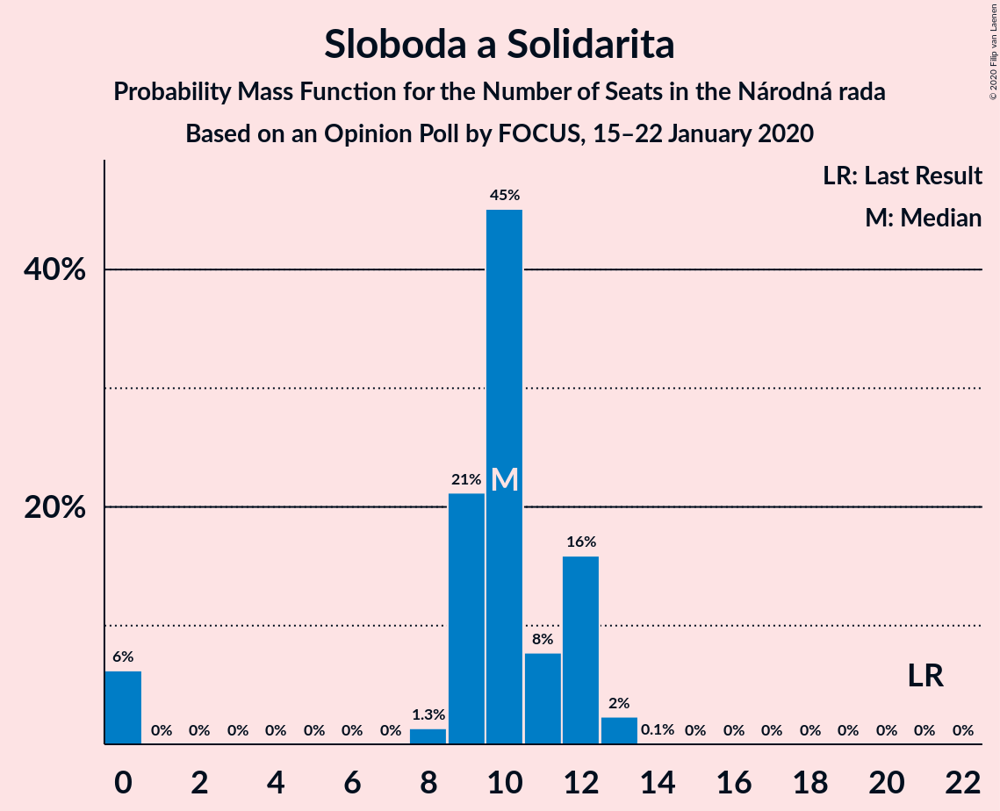

| Number of Seats | Probability | Accumulated | Special Marks |
|:---------------:|:-----------:|:-----------:|:-------------:|
| 0 | 6% | 100% |  |
| 1 | 0% | 94% |  |
| 2 | 0% | 94% |  |
| 3 | 0% | 94% |  |
| 4 | 0% | 94% |  |
| 5 | 0% | 94% |  |
| 6 | 0% | 94% |  |
| 7 | 0% | 94% |  |
| 8 | 1.3% | 94% |  |
| 9 | 21% | 92% |  |
| 10 | 45% | 71% | Median |
| 11 | 8% | 26% |  |
| 12 | 16% | 18% |  |
| 13 | 2% | 3% |  |
| 14 | 0.1% | 0.2% |  |
| 15 | 0% | 0.1% |  |
| 16 | 0% | 0% |  |
| 17 | 0% | 0% |  |
| 18 | 0% | 0% |  |
| 19 | 0% | 0% |  |
| 20 | 0% | 0% |  |
| 21 | 0% | 0% | Last Result |

### Slovenská národná strana

*For a full overview of the results for this party, see the [Slovenská národná strana](party-slovenskánárodnástrana.html) page.*

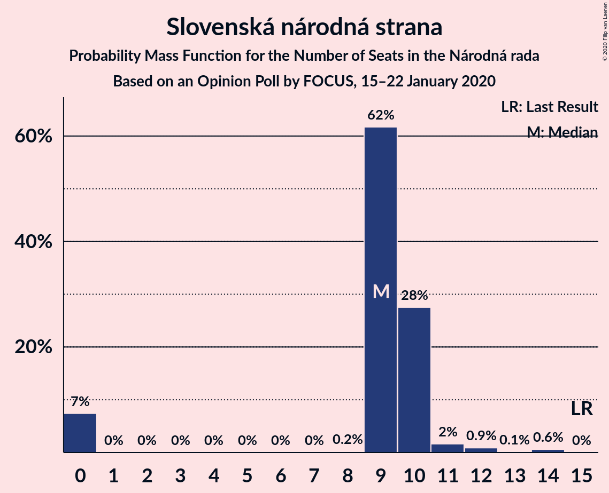

| Number of Seats | Probability | Accumulated | Special Marks |
|:---------------:|:-----------:|:-----------:|:-------------:|
| 0 | 7% | 100% |  |
| 1 | 0% | 93% |  |
| 2 | 0% | 93% |  |
| 3 | 0% | 93% |  |
| 4 | 0% | 93% |  |
| 5 | 0% | 93% |  |
| 6 | 0% | 93% |  |
| 7 | 0% | 93% |  |
| 8 | 0.2% | 93% |  |
| 9 | 62% | 92% | Median |
| 10 | 28% | 31% |  |
| 11 | 2% | 3% |  |
| 12 | 0.9% | 2% |  |
| 13 | 0.1% | 0.7% |  |
| 14 | 0.6% | 0.6% |  |
| 15 | 0% | 0% | Last Result |

### MOST–HÍD

*For a full overview of the results for this party, see the [MOST–HÍD](party-most–híd.html) page.*

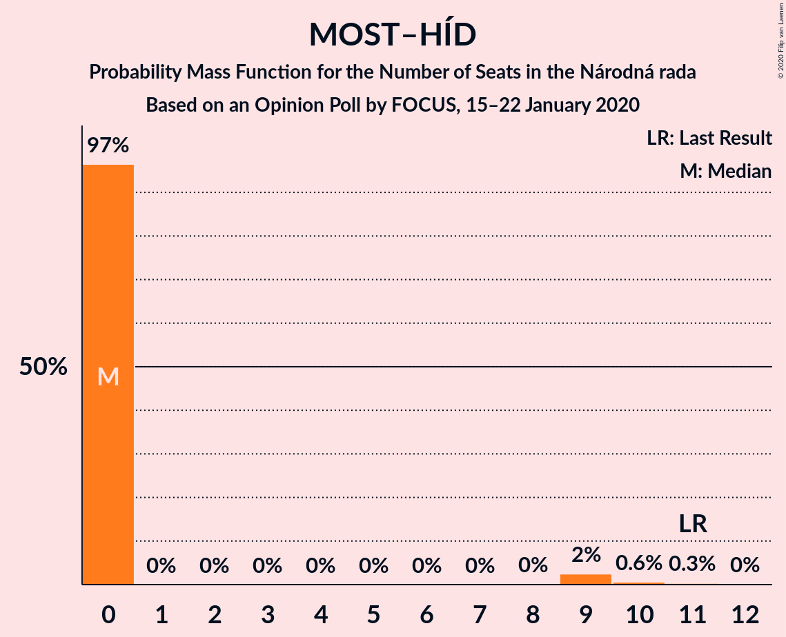

| Number of Seats | Probability | Accumulated | Special Marks |
|:---------------:|:-----------:|:-----------:|:-------------:|
| 0 | 97% | 100% | Median |
| 1 | 0% | 3% |  |
| 2 | 0% | 3% |  |
| 3 | 0% | 3% |  |
| 4 | 0% | 3% |  |
| 5 | 0% | 3% |  |
| 6 | 0% | 3% |  |
| 7 | 0% | 3% |  |
| 8 | 0% | 3% |  |
| 9 | 2% | 3% |  |
| 10 | 0.6% | 1.0% |  |
| 11 | 0.3% | 0.4% | Last Result |
| 12 | 0% | 0% |  |

### Strana maďarskej koalície–Magyar Koalíció Pártja

*For a full overview of the results for this party, see the [Strana maďarskej koalície–Magyar Koalíció Pártja](party-stranamaďarskejkoalície–magyarkoalíciópártja.html) page.*

| Number of Seats | Probability | Accumulated | Special Marks |
|:---------------:|:-----------:|:-----------:|:-------------:|
| 0 | 96% | 100% | Last Result, Median |
| 1 | 0% | 4% |  |
| 2 | 0% | 4% |  |
| 3 | 0% | 4% |  |
| 4 | 0% | 4% |  |
| 5 | 0% | 4% |  |
| 6 | 0% | 4% |  |
| 7 | 0% | 4% |  |
| 8 | 0% | 4% |  |
| 9 | 3% | 4% |  |
| 10 | 1.3% | 1.4% |  |
| 11 | 0.1% | 0.1% |  |
| 12 | 0% | 0% |  |

### Dobrá voľba

*For a full overview of the results for this party, see the [Dobrá voľba](party-dobrávoľba.html) page.*

| Number of Seats | Probability | Accumulated | Special Marks |
|:---------------:|:-----------:|:-----------:|:-------------:|
| 0 | 96% | 100% | Last Result, Median |
| 1 | 0% | 4% |  |
| 2 | 0% | 4% |  |
| 3 | 0% | 4% |  |
| 4 | 0% | 4% |  |
| 5 | 0% | 4% |  |
| 6 | 0% | 4% |  |
| 7 | 0% | 4% |  |
| 8 | 0.2% | 4% |  |
| 9 | 2% | 4% |  |
| 10 | 2% | 2% |  |
| 11 | 0.1% | 0.1% |  |
| 12 | 0% | 0% |  |

### VLASŤ

*For a full overview of the results for this party, see the [VLASŤ](party-vlasť.html) page.*

| Number of Seats | Probability | Accumulated | Special Marks |
|:---------------:|:-----------:|:-----------:|:-------------:|
| 0 | 100% | 100% | Last Result, Median |

## Coalitions

### Confidence Intervals

| Coalition | Last Result | Median | Majority? | 80% Confidence Interval | 90% Confidence Interval | 95% Confidence Interval | 99% Confidence Interval |
|:---------:|:-----------:|:------:|:---------:|:-----------------------:|:-----------------------:|:-----------------------:|:-----------------------:|
| Za ľudí – Progresívne Slovensko–SPOLU–Občianska Demokracia – OBYČAJNÍ ĽUDIA a nezávislé osobnosti – SME RODINA – Kresťanskodemokratické hnutie – Sloboda a Solidarita – MOST–HÍD – Strana maďarskej koalície–Magyar Koalíció Pártja | 60 | 86 | 98% | 83–91 | 82–91 | 79–95 | 71–95 |
| Za ľudí – Progresívne Slovensko–SPOLU–Občianska Demokracia – OBYČAJNÍ ĽUDIA a nezávislé osobnosti – SME RODINA – Kresťanskodemokratické hnutie – Sloboda a Solidarita – MOST–HÍD | 60 | 86 | 98% | 83–91 | 80–91 | 76–94 | 71–95 |
| Za ľudí – Progresívne Slovensko–SPOLU–Občianska Demokracia – OBYČAJNÍ ĽUDIA a nezávislé osobnosti – SME RODINA – Kresťanskodemokratické hnutie – Sloboda a Solidarita – Strana maďarskej koalície–Magyar Koalíció Pártja | 49 | 86 | 97% | 83–91 | 81–91 | 75–93 | 71–95 |
| Za ľudí – Progresívne Slovensko–SPOLU–Občianska Demokracia – OBYČAJNÍ ĽUDIA a nezávislé osobnosti – SME RODINA – Kresťanskodemokratické hnutie – Sloboda a Solidarita | 49 | 86 | 97% | 82–91 | 78–91 | 75–91 | 71–95 |
| SMER–sociálna demokracia – Kotleba–Ľudová strana Naše Slovensko – SME RODINA – Slovenská národná strana | 89 | 75 | 45% | 73–82 | 70–82 | 69–85 | 62–92 |
| Za ľudí – Progresívne Slovensko–SPOLU–Občianska Demokracia – OBYČAJNÍ ĽUDIA a nezávislé osobnosti – Kresťanskodemokratické hnutie – Sloboda a Solidarita – MOST–HÍD – Strana maďarskej koalície–Magyar Koalíció Pártja | 49 | 75 | 14% | 68–77 | 68–79 | 65–80 | 58–83 |
| Za ľudí – Progresívne Slovensko–SPOLU–Občianska Demokracia – OBYČAJNÍ ĽUDIA a nezávislé osobnosti – Kresťanskodemokratické hnutie – Sloboda a Solidarita – MOST–HÍD | 49 | 75 | 12% | 68–77 | 67–77 | 61–80 | 58–81 |
| Za ľudí – Progresívne Slovensko–SPOLU–Občianska Demokracia – OBYČAJNÍ ĽUDIA a nezávislé osobnosti – Kresťanskodemokratické hnutie – Sloboda a Solidarita – Strana maďarskej koalície–Magyar Koalíció Pártja | 38 | 75 | 12% | 68–77 | 68–77 | 61–79 | 58–82 |
| Za ľudí – Progresívne Slovensko–SPOLU–Občianska Demokracia – OBYČAJNÍ ĽUDIA a nezávislé osobnosti – Kresťanskodemokratické hnutie – Sloboda a Solidarita | 38 | 73 | 10% | 68–76 | 65–77 | 61–77 | 58–80 |
| Za ľudí – Progresívne Slovensko–SPOLU–Občianska Demokracia – OBYČAJNÍ ĽUDIA a nezávislé osobnosti – Sloboda a Solidarita | 38 | 64 | 0% | 59–66 | 58–66 | 57–69 | 52–71 |
| SMER–sociálna demokracia – SME RODINA – Slovenská národná strana | 75 | 53 | 0% | 50–60 | 47–60 | 45–60 | 40–66 |
| Za ľudí – Progresívne Slovensko–SPOLU–Občianska Demokracia – Kresťanskodemokratické hnutie – Sloboda a Solidarita | 21 | 57 | 0% | 53–60 | 49–60 | 44–60 | 39–65 |
| SMER–sociálna demokracia – SME RODINA | 60 | 43 | 0% | 41–51 | 41–51 | 40–52 | 40–58 |
| Za ľudí – Progresívne Slovensko–SPOLU–Občianska Demokracia – Sloboda a Solidarita | 21 | 48 | 0% | 44–49 | 42–49 | 39–50 | 36–55 |
| SMER–sociálna demokracia – Slovenská národná strana – MOST–HÍD | 75 | 39 | 0% | 39–45 | 34–46 | 31–48 | 28–53 |
| SMER–sociálna demokracia – Slovenská národná strana | 64 | 39 | 0% | 39–45 | 33–45 | 31–47 | 28–53 |
| SMER–sociálna demokracia | 49 | 30 | 0% | 29–36 | 29–36 | 28–38 | 27–40 |

### Za ľudí – Progresívne Slovensko–SPOLU–Občianska Demokracia – OBYČAJNÍ ĽUDIA a nezávislé osobnosti – SME RODINA – Kresťanskodemokratické hnutie – Sloboda a Solidarita – MOST–HÍD – Strana maďarskej koalície–Magyar Koalíció Pártja

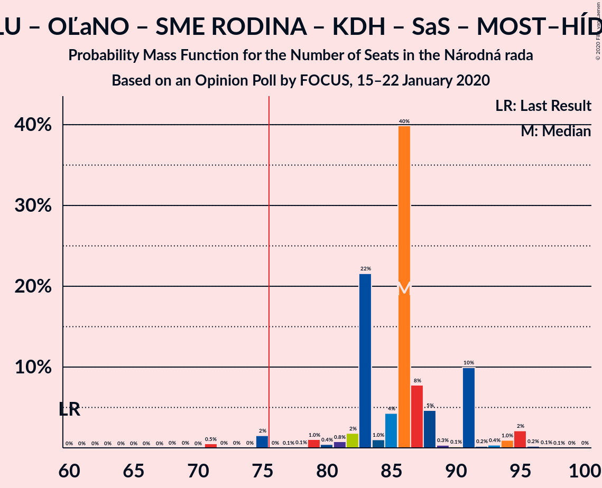

| Number of Seats | Probability | Accumulated | Special Marks |
|:---------------:|:-----------:|:-----------:|:-------------:|
| 60 | 0% | 100% | Last Result |
| 61 | 0% | 100% |  |
| 62 | 0% | 100% |  |
| 63 | 0% | 100% |  |
| 64 | 0% | 100% |  |
| 65 | 0% | 100% |  |
| 66 | 0% | 100% |  |
| 67 | 0% | 100% |  |
| 68 | 0% | 100% |  |
| 69 | 0% | 100% |  |
| 70 | 0% | 100% |  |
| 71 | 0.5% | 100% |  |
| 72 | 0% | 99.5% |  |
| 73 | 0% | 99.5% |  |
| 74 | 0% | 99.5% |  |
| 75 | 2% | 99.4% |  |
| 76 | 0% | 98% | Majority |
| 77 | 0.1% | 98% |  |
| 78 | 0.1% | 98% |  |
| 79 | 1.0% | 98% |  |
| 80 | 0.4% | 97% |  |
| 81 | 0.8% | 96% |  |
| 82 | 2% | 96% |  |
| 83 | 22% | 94% |  |
| 84 | 1.0% | 72% |  |
| 85 | 4% | 71% |  |
| 86 | 40% | 67% | Median |
| 87 | 8% | 27% |  |
| 88 | 5% | 19% |  |
| 89 | 0.3% | 15% |  |
| 90 | 0.1% | 14% |  |
| 91 | 10% | 14% |  |
| 92 | 0.2% | 4% |  |
| 93 | 0.4% | 4% |  |
| 94 | 1.0% | 4% |  |
| 95 | 2% | 3% |  |
| 96 | 0.2% | 0.5% |  |
| 97 | 0.1% | 0.2% |  |
| 98 | 0.1% | 0.1% |  |
| 99 | 0% | 0.1% |  |
| 100 | 0% | 0% |  |

### Za ľudí – Progresívne Slovensko–SPOLU–Občianska Demokracia – OBYČAJNÍ ĽUDIA a nezávislé osobnosti – SME RODINA – Kresťanskodemokratické hnutie – Sloboda a Solidarita – MOST–HÍD

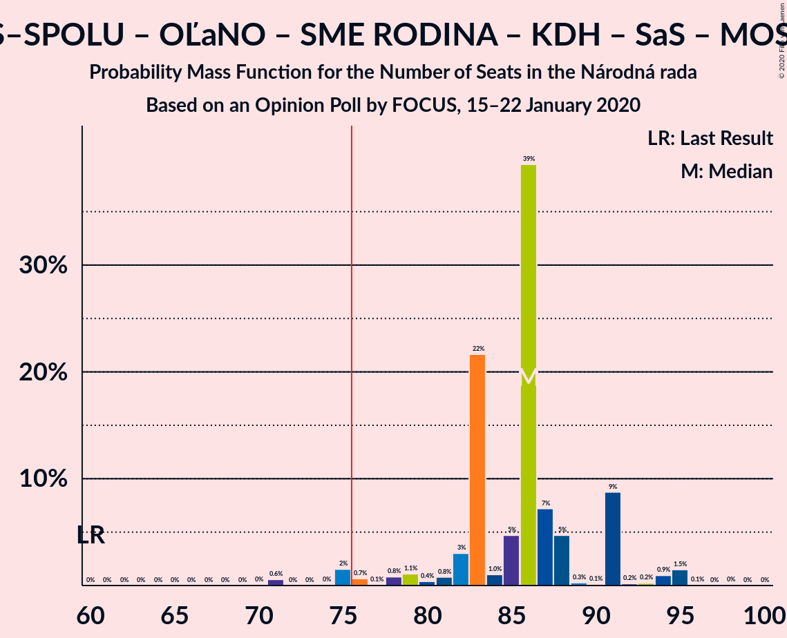

| Number of Seats | Probability | Accumulated | Special Marks |
|:---------------:|:-----------:|:-----------:|:-------------:|
| 60 | 0% | 100% | Last Result |
| 61 | 0% | 100% |  |
| 62 | 0% | 100% |  |
| 63 | 0% | 100% |  |
| 64 | 0% | 100% |  |
| 65 | 0% | 100% |  |
| 66 | 0% | 100% |  |
| 67 | 0% | 100% |  |
| 68 | 0% | 100% |  |
| 69 | 0% | 100% |  |
| 70 | 0% | 100% |  |
| 71 | 0.6% | 99.9% |  |
| 72 | 0% | 99.4% |  |
| 73 | 0% | 99.4% |  |
| 74 | 0% | 99.3% |  |
| 75 | 2% | 99.3% |  |
| 76 | 0.7% | 98% | Majority |
| 77 | 0.1% | 97% |  |
| 78 | 0.8% | 97% |  |
| 79 | 1.1% | 96% |  |
| 80 | 0.4% | 95% |  |
| 81 | 0.8% | 95% |  |
| 82 | 3% | 94% |  |
| 83 | 22% | 91% |  |
| 84 | 1.0% | 69% |  |
| 85 | 5% | 68% |  |
| 86 | 39% | 64% | Median |
| 87 | 7% | 24% |  |
| 88 | 5% | 17% |  |
| 89 | 0.3% | 12% |  |
| 90 | 0.1% | 12% |  |
| 91 | 9% | 12% |  |
| 92 | 0.2% | 3% |  |
| 93 | 0.2% | 3% |  |
| 94 | 0.9% | 3% |  |
| 95 | 1.5% | 2% |  |
| 96 | 0.1% | 0.2% |  |
| 97 | 0% | 0.1% |  |
| 98 | 0% | 0.1% |  |
| 99 | 0% | 0.1% |  |
| 100 | 0% | 0% |  |

### Za ľudí – Progresívne Slovensko–SPOLU–Občianska Demokracia – OBYČAJNÍ ĽUDIA a nezávislé osobnosti – SME RODINA – Kresťanskodemokratické hnutie – Sloboda a Solidarita – Strana maďarskej koalície–Magyar Koalíció Pártja

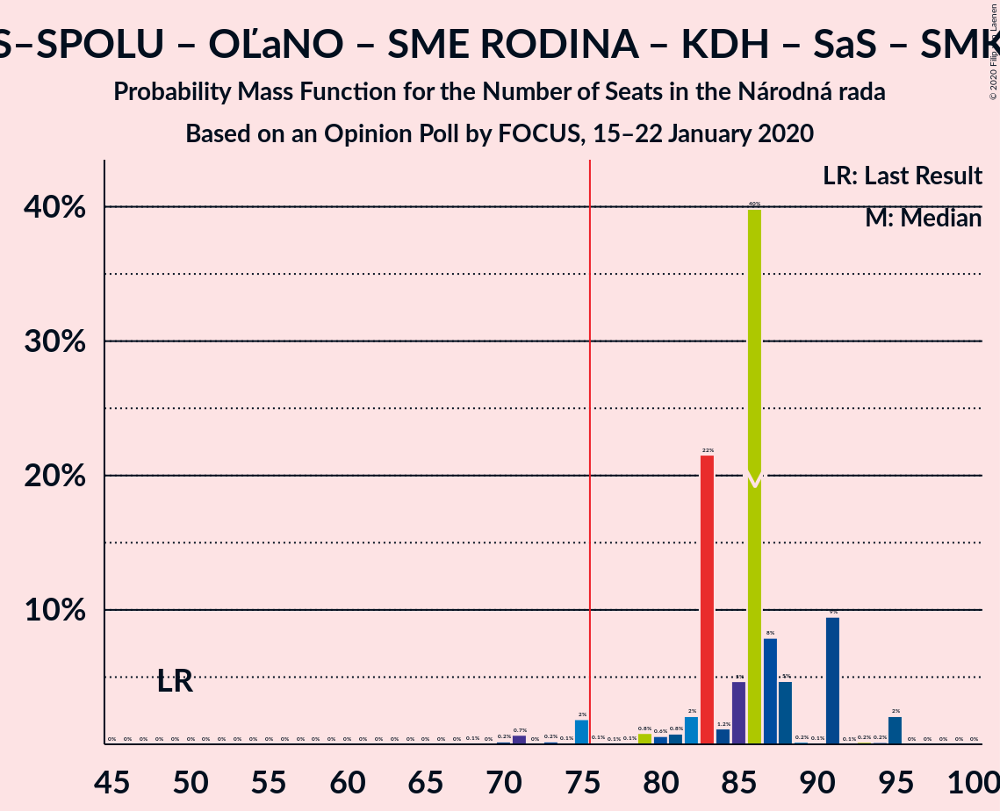

| Number of Seats | Probability | Accumulated | Special Marks |
|:---------------:|:-----------:|:-----------:|:-------------:|
| 49 | 0% | 100% | Last Result |
| 50 | 0% | 100% |  |
| 51 | 0% | 100% |  |
| 52 | 0% | 100% |  |
| 53 | 0% | 100% |  |
| 54 | 0% | 100% |  |
| 55 | 0% | 100% |  |
| 56 | 0% | 100% |  |
| 57 | 0% | 100% |  |
| 58 | 0% | 100% |  |
| 59 | 0% | 100% |  |
| 60 | 0% | 100% |  |
| 61 | 0% | 100% |  |
| 62 | 0% | 100% |  |
| 63 | 0% | 100% |  |
| 64 | 0% | 100% |  |
| 65 | 0% | 100% |  |
| 66 | 0% | 100% |  |
| 67 | 0% | 100% |  |
| 68 | 0.1% | 100% |  |
| 69 | 0% | 99.9% |  |
| 70 | 0.2% | 99.9% |  |
| 71 | 0.7% | 99.7% |  |
| 72 | 0% | 99.0% |  |
| 73 | 0.2% | 99.0% |  |
| 74 | 0.1% | 98.8% |  |
| 75 | 2% | 98.7% |  |
| 76 | 0.1% | 97% | Majority |
| 77 | 0.1% | 97% |  |
| 78 | 0.1% | 97% |  |
| 79 | 0.8% | 97% |  |
| 80 | 0.6% | 96% |  |
| 81 | 0.8% | 95% |  |
| 82 | 2% | 94% |  |
| 83 | 22% | 92% |  |
| 84 | 1.2% | 71% |  |
| 85 | 5% | 70% |  |
| 86 | 40% | 65% | Median |
| 87 | 8% | 25% |  |
| 88 | 5% | 17% |  |
| 89 | 0.2% | 12% |  |
| 90 | 0.1% | 12% |  |
| 91 | 9% | 12% |  |
| 92 | 0.1% | 3% |  |
| 93 | 0.2% | 3% |  |
| 94 | 0.2% | 2% |  |
| 95 | 2% | 2% |  |
| 96 | 0% | 0.1% |  |
| 97 | 0% | 0.1% |  |
| 98 | 0% | 0.1% |  |
| 99 | 0% | 0% |  |

### Za ľudí – Progresívne Slovensko–SPOLU–Občianska Demokracia – OBYČAJNÍ ĽUDIA a nezávislé osobnosti – SME RODINA – Kresťanskodemokratické hnutie – Sloboda a Solidarita

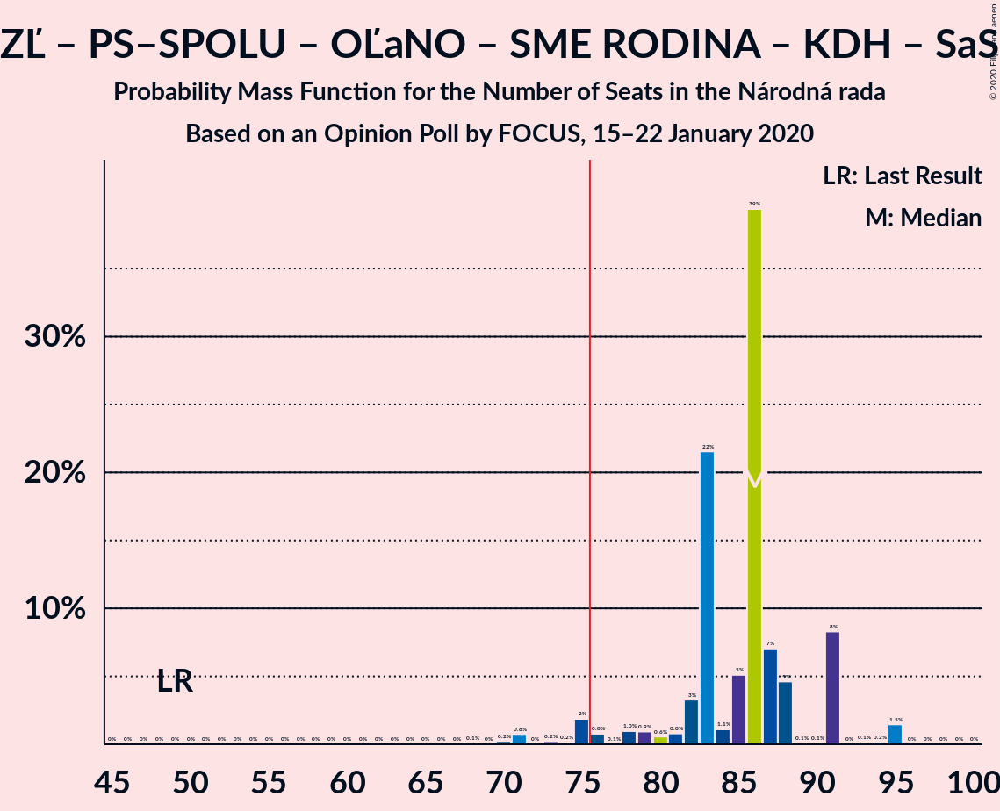

| Number of Seats | Probability | Accumulated | Special Marks |
|:---------------:|:-----------:|:-----------:|:-------------:|
| 49 | 0% | 100% | Last Result |
| 50 | 0% | 100% |  |
| 51 | 0% | 100% |  |
| 52 | 0% | 100% |  |
| 53 | 0% | 100% |  |
| 54 | 0% | 100% |  |
| 55 | 0% | 100% |  |
| 56 | 0% | 100% |  |
| 57 | 0% | 100% |  |
| 58 | 0% | 100% |  |
| 59 | 0% | 100% |  |
| 60 | 0% | 100% |  |
| 61 | 0% | 100% |  |
| 62 | 0% | 100% |  |
| 63 | 0% | 100% |  |
| 64 | 0% | 100% |  |
| 65 | 0% | 100% |  |
| 66 | 0% | 100% |  |
| 67 | 0% | 100% |  |
| 68 | 0.1% | 100% |  |
| 69 | 0% | 99.9% |  |
| 70 | 0.2% | 99.9% |  |
| 71 | 0.8% | 99.6% |  |
| 72 | 0% | 98.9% |  |
| 73 | 0.2% | 98.8% |  |
| 74 | 0.2% | 98.6% |  |
| 75 | 2% | 98% |  |
| 76 | 0.8% | 97% | Majority |
| 77 | 0.1% | 96% |  |
| 78 | 1.0% | 96% |  |
| 79 | 0.9% | 95% |  |
| 80 | 0.6% | 94% |  |
| 81 | 0.8% | 93% |  |
| 82 | 3% | 92% |  |
| 83 | 22% | 89% |  |
| 84 | 1.1% | 68% |  |
| 85 | 5% | 67% |  |
| 86 | 39% | 61% | Median |
| 87 | 7% | 22% |  |
| 88 | 5% | 15% |  |
| 89 | 0.1% | 10% |  |
| 90 | 0.1% | 10% |  |
| 91 | 8% | 10% |  |
| 92 | 0% | 2% |  |
| 93 | 0.1% | 2% |  |
| 94 | 0.2% | 2% |  |
| 95 | 1.5% | 1.5% |  |
| 96 | 0% | 0% |  |

### SMER–sociálna demokracia – Kotleba–Ľudová strana Naše Slovensko – SME RODINA – Slovenská národná strana

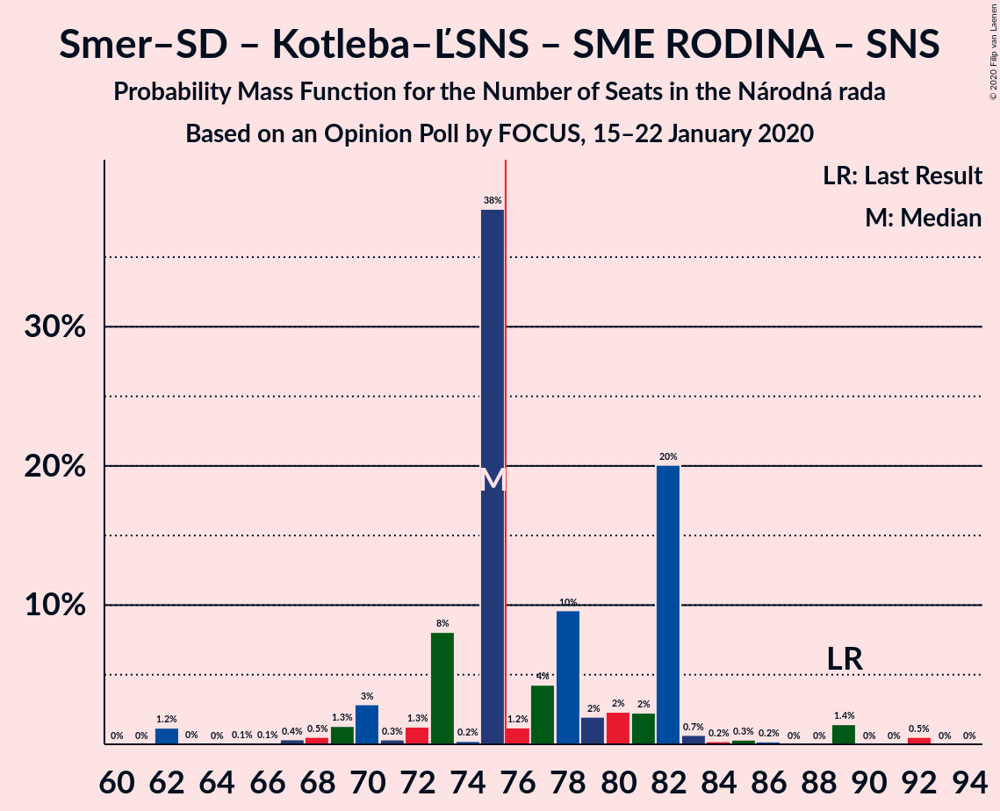

| Number of Seats | Probability | Accumulated | Special Marks |
|:---------------:|:-----------:|:-----------:|:-------------:|
| 62 | 1.2% | 100% |  |
| 63 | 0% | 98.8% |  |
| 64 | 0% | 98.7% |  |
| 65 | 0.1% | 98.7% |  |
| 66 | 0.1% | 98.7% |  |
| 67 | 0.4% | 98.6% |  |
| 68 | 0.5% | 98% |  |
| 69 | 1.3% | 98% |  |
| 70 | 3% | 96% |  |
| 71 | 0.3% | 94% |  |
| 72 | 1.3% | 93% |  |
| 73 | 8% | 92% |  |
| 74 | 0.2% | 84% |  |
| 75 | 38% | 84% | Median |
| 76 | 1.2% | 45% | Majority |
| 77 | 4% | 44% |  |
| 78 | 10% | 40% |  |
| 79 | 2% | 30% |  |
| 80 | 2% | 28% |  |
| 81 | 2% | 26% |  |
| 82 | 20% | 23% |  |
| 83 | 0.7% | 3% |  |
| 84 | 0.2% | 3% |  |
| 85 | 0.3% | 3% |  |
| 86 | 0.2% | 2% |  |
| 87 | 0% | 2% |  |
| 88 | 0% | 2% |  |
| 89 | 1.4% | 2% | Last Result |
| 90 | 0% | 0.5% |  |
| 91 | 0% | 0.5% |  |
| 92 | 0.5% | 0.5% |  |
| 93 | 0% | 0% |  |

### Za ľudí – Progresívne Slovensko–SPOLU–Občianska Demokracia – OBYČAJNÍ ĽUDIA a nezávislé osobnosti – Kresťanskodemokratické hnutie – Sloboda a Solidarita – MOST–HÍD – Strana maďarskej koalície–Magyar Koalíció Pártja

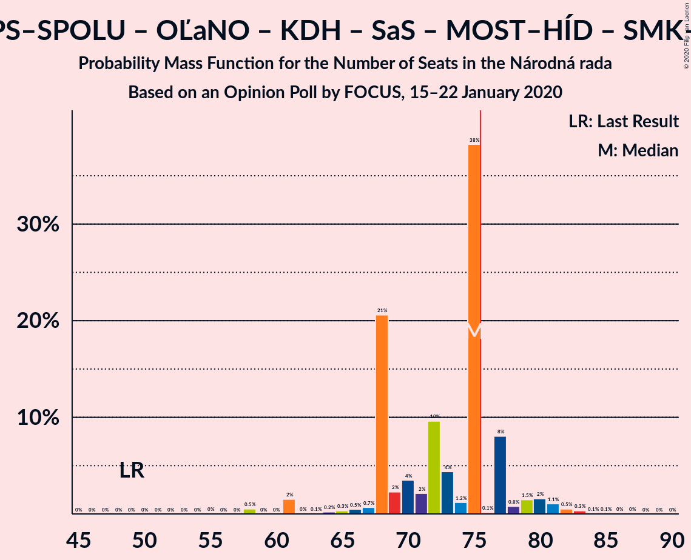

| Number of Seats | Probability | Accumulated | Special Marks |
|:---------------:|:-----------:|:-----------:|:-------------:|
| 49 | 0% | 100% | Last Result |
| 50 | 0% | 100% |  |
| 51 | 0% | 100% |  |
| 52 | 0% | 100% |  |
| 53 | 0% | 100% |  |
| 54 | 0% | 100% |  |
| 55 | 0% | 100% |  |
| 56 | 0% | 100% |  |
| 57 | 0% | 100% |  |
| 58 | 0.5% | 100% |  |
| 59 | 0% | 99.5% |  |
| 60 | 0% | 99.5% |  |
| 61 | 2% | 99.4% |  |
| 62 | 0% | 98% |  |
| 63 | 0.1% | 98% |  |
| 64 | 0.2% | 98% |  |
| 65 | 0.3% | 98% |  |
| 66 | 0.5% | 97% |  |
| 67 | 0.7% | 97% |  |
| 68 | 21% | 96% |  |
| 69 | 2% | 76% |  |
| 70 | 4% | 73% |  |
| 71 | 2% | 70% |  |
| 72 | 10% | 68% |  |
| 73 | 4% | 58% | Median |
| 74 | 1.2% | 54% |  |
| 75 | 38% | 52% |  |
| 76 | 0.1% | 14% | Majority |
| 77 | 8% | 14% |  |
| 78 | 0.8% | 6% |  |
| 79 | 1.5% | 5% |  |
| 80 | 2% | 4% |  |
| 81 | 1.1% | 2% |  |
| 82 | 0.5% | 1.0% |  |
| 83 | 0.3% | 0.5% |  |
| 84 | 0.1% | 0.2% |  |
| 85 | 0.1% | 0.1% |  |
| 86 | 0% | 0.1% |  |
| 87 | 0% | 0% |  |

### Za ľudí – Progresívne Slovensko–SPOLU–Občianska Demokracia – OBYČAJNÍ ĽUDIA a nezávislé osobnosti – Kresťanskodemokratické hnutie – Sloboda a Solidarita – MOST–HÍD

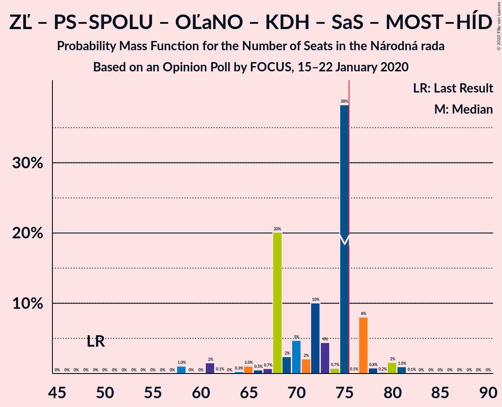

| Number of Seats | Probability | Accumulated | Special Marks |
|:---------------:|:-----------:|:-----------:|:-------------:|
| 49 | 0% | 100% | Last Result |
| 50 | 0% | 100% |  |
| 51 | 0% | 100% |  |
| 52 | 0% | 100% |  |
| 53 | 0% | 100% |  |
| 54 | 0% | 100% |  |
| 55 | 0% | 100% |  |
| 56 | 0% | 99.9% |  |
| 57 | 0% | 99.9% |  |
| 58 | 1.0% | 99.9% |  |
| 59 | 0% | 98.9% |  |
| 60 | 0% | 98.8% |  |
| 61 | 2% | 98.8% |  |
| 62 | 0.1% | 97% |  |
| 63 | 0% | 97% |  |
| 64 | 0.3% | 97% |  |
| 65 | 1.0% | 97% |  |
| 66 | 0.5% | 96% |  |
| 67 | 0.7% | 95% |  |
| 68 | 20% | 95% |  |
| 69 | 2% | 74% |  |
| 70 | 5% | 72% |  |
| 71 | 2% | 67% |  |
| 72 | 10% | 65% |  |
| 73 | 4% | 55% | Median |
| 74 | 0.7% | 51% |  |
| 75 | 38% | 50% |  |
| 76 | 0.1% | 12% | Majority |
| 77 | 8% | 12% |  |
| 78 | 0.8% | 4% |  |
| 79 | 0.2% | 3% |  |
| 80 | 2% | 3% |  |
| 81 | 1.0% | 1.2% |  |
| 82 | 0.1% | 0.2% |  |
| 83 | 0% | 0.1% |  |
| 84 | 0% | 0.1% |  |
| 85 | 0% | 0.1% |  |
| 86 | 0% | 0% |  |

### Za ľudí – Progresívne Slovensko–SPOLU–Občianska Demokracia – OBYČAJNÍ ĽUDIA a nezávislé osobnosti – Kresťanskodemokratické hnutie – Sloboda a Solidarita – Strana maďarskej koalície–Magyar Koalíció Pártja

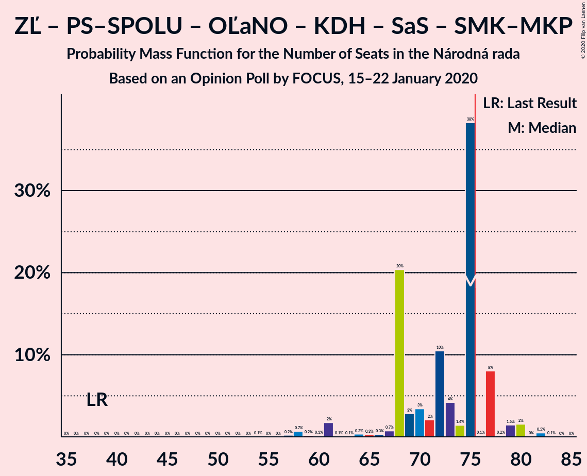

| Number of Seats | Probability | Accumulated | Special Marks |
|:---------------:|:-----------:|:-----------:|:-------------:|
| 38 | 0% | 100% | Last Result |
| 39 | 0% | 100% |  |
| 40 | 0% | 100% |  |
| 41 | 0% | 100% |  |
| 42 | 0% | 100% |  |
| 43 | 0% | 100% |  |
| 44 | 0% | 100% |  |
| 45 | 0% | 100% |  |
| 46 | 0% | 100% |  |
| 47 | 0% | 100% |  |
| 48 | 0% | 100% |  |
| 49 | 0% | 100% |  |
| 50 | 0% | 100% |  |
| 51 | 0% | 100% |  |
| 52 | 0% | 100% |  |
| 53 | 0% | 100% |  |
| 54 | 0.1% | 100% |  |
| 55 | 0% | 99.9% |  |
| 56 | 0% | 99.9% |  |
| 57 | 0.2% | 99.9% |  |
| 58 | 0.7% | 99.6% |  |
| 59 | 0.2% | 99.0% |  |
| 60 | 0.1% | 98.8% |  |
| 61 | 2% | 98.7% |  |
| 62 | 0.1% | 97% |  |
| 63 | 0.1% | 97% |  |
| 64 | 0.3% | 97% |  |
| 65 | 0.3% | 96% |  |
| 66 | 0.3% | 96% |  |
| 67 | 0.7% | 96% |  |
| 68 | 20% | 95% |  |
| 69 | 3% | 75% |  |
| 70 | 3% | 72% |  |
| 71 | 2% | 68% |  |
| 72 | 10% | 66% |  |
| 73 | 4% | 56% | Median |
| 74 | 1.4% | 52% |  |
| 75 | 38% | 50% |  |
| 76 | 0.1% | 12% | Majority |
| 77 | 8% | 12% |  |
| 78 | 0.2% | 4% |  |
| 79 | 1.5% | 4% |  |
| 80 | 2% | 2% |  |
| 81 | 0% | 0.7% |  |
| 82 | 0.5% | 0.6% |  |
| 83 | 0.1% | 0.1% |  |
| 84 | 0% | 0% |  |

### Za ľudí – Progresívne Slovensko–SPOLU–Občianska Demokracia – OBYČAJNÍ ĽUDIA a nezávislé osobnosti – Kresťanskodemokratické hnutie – Sloboda a Solidarita

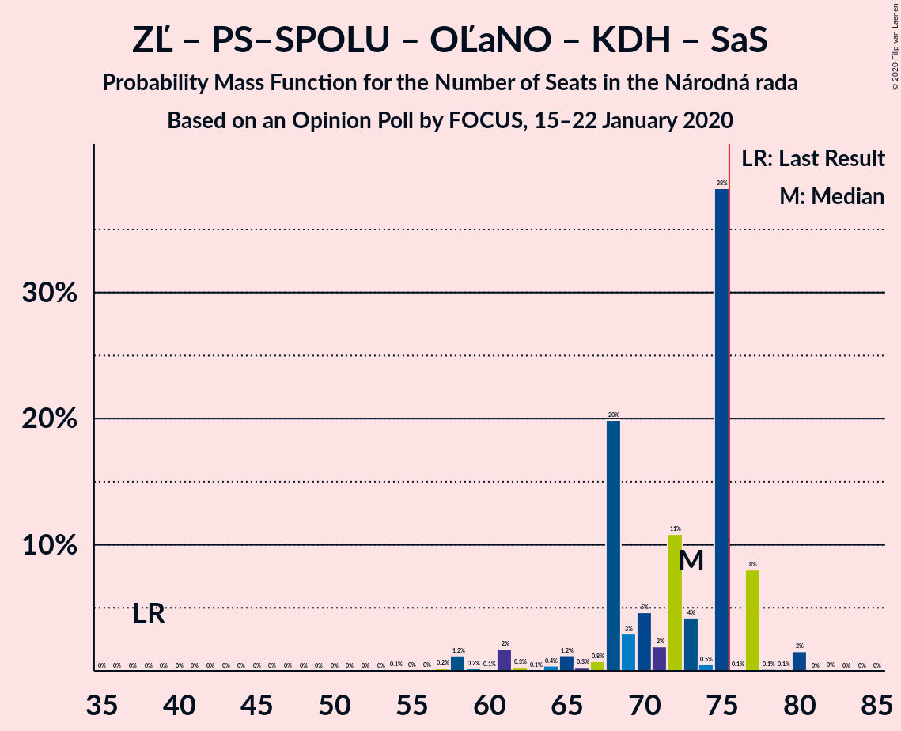

| Number of Seats | Probability | Accumulated | Special Marks |
|:---------------:|:-----------:|:-----------:|:-------------:|
| 38 | 0% | 100% | Last Result |
| 39 | 0% | 100% |  |
| 40 | 0% | 100% |  |
| 41 | 0% | 100% |  |
| 42 | 0% | 100% |  |
| 43 | 0% | 100% |  |
| 44 | 0% | 100% |  |
| 45 | 0% | 100% |  |
| 46 | 0% | 100% |  |
| 47 | 0% | 100% |  |
| 48 | 0% | 100% |  |
| 49 | 0% | 100% |  |
| 50 | 0% | 100% |  |
| 51 | 0% | 100% |  |
| 52 | 0% | 100% |  |
| 53 | 0% | 100% |  |
| 54 | 0.1% | 100% |  |
| 55 | 0% | 99.9% |  |
| 56 | 0% | 99.8% |  |
| 57 | 0.2% | 99.8% |  |
| 58 | 1.2% | 99.6% |  |
| 59 | 0.2% | 98% |  |
| 60 | 0.1% | 98% |  |
| 61 | 2% | 98% |  |
| 62 | 0.3% | 96% |  |
| 63 | 0.1% | 96% |  |
| 64 | 0.4% | 96% |  |
| 65 | 1.2% | 95% |  |
| 66 | 0.3% | 94% |  |
| 67 | 0.8% | 94% |  |
| 68 | 20% | 93% |  |
| 69 | 3% | 73% |  |
| 70 | 5% | 70% |  |
| 71 | 2% | 66% |  |
| 72 | 11% | 64% |  |
| 73 | 4% | 53% | Median |
| 74 | 0.5% | 49% |  |
| 75 | 38% | 48% |  |
| 76 | 0.1% | 10% | Majority |
| 77 | 8% | 10% |  |
| 78 | 0.1% | 2% |  |
| 79 | 0.1% | 2% |  |
| 80 | 2% | 2% |  |
| 81 | 0% | 0.1% |  |
| 82 | 0% | 0.1% |  |
| 83 | 0% | 0% |  |

### Za ľudí – Progresívne Slovensko–SPOLU–Občianska Demokracia – OBYČAJNÍ ĽUDIA a nezávislé osobnosti – Sloboda a Solidarita

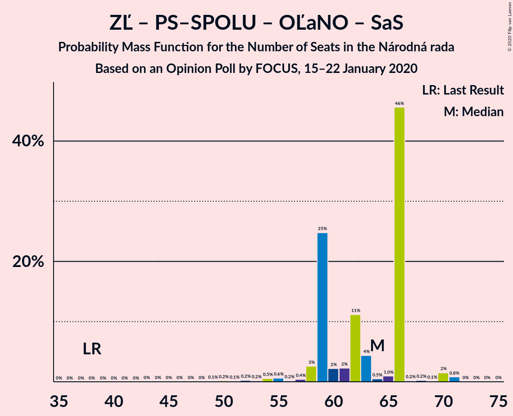

| Number of Seats | Probability | Accumulated | Special Marks |
|:---------------:|:-----------:|:-----------:|:-------------:|
| 38 | 0% | 100% | Last Result |
| 39 | 0% | 100% |  |
| 40 | 0% | 100% |  |
| 41 | 0% | 100% |  |
| 42 | 0% | 100% |  |
| 43 | 0% | 100% |  |
| 44 | 0% | 100% |  |
| 45 | 0% | 100% |  |
| 46 | 0% | 100% |  |
| 47 | 0% | 99.9% |  |
| 48 | 0% | 99.9% |  |
| 49 | 0.1% | 99.9% |  |
| 50 | 0.2% | 99.8% |  |
| 51 | 0.1% | 99.7% |  |
| 52 | 0.2% | 99.6% |  |
| 53 | 0.2% | 99.3% |  |
| 54 | 0.5% | 99.2% |  |
| 55 | 0.6% | 98.6% |  |
| 56 | 0.2% | 98% |  |
| 57 | 0.4% | 98% |  |
| 58 | 3% | 97% |  |
| 59 | 25% | 95% |  |
| 60 | 2% | 70% |  |
| 61 | 2% | 68% |  |
| 62 | 11% | 66% |  |
| 63 | 4% | 54% |  |
| 64 | 0.5% | 50% | Median |
| 65 | 1.0% | 50% |  |
| 66 | 46% | 49% |  |
| 67 | 0.2% | 3% |  |
| 68 | 0.2% | 3% |  |
| 69 | 0.1% | 3% |  |
| 70 | 2% | 2% |  |
| 71 | 0.8% | 0.9% |  |
| 72 | 0% | 0.1% |  |
| 73 | 0% | 0.1% |  |
| 74 | 0% | 0% |  |

### SMER–sociálna demokracia – SME RODINA – Slovenská národná strana

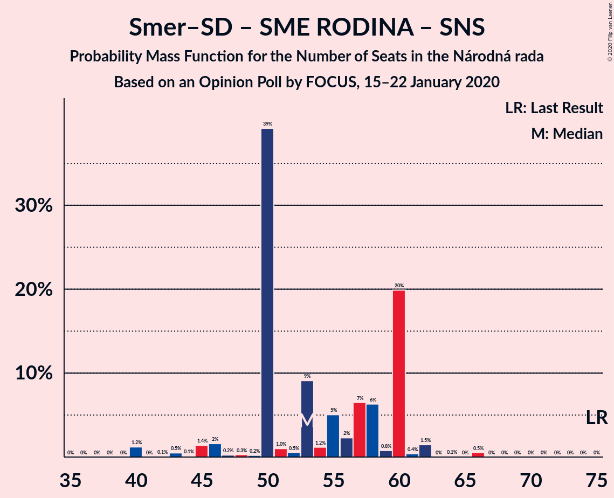

| Number of Seats | Probability | Accumulated | Special Marks |
|:---------------:|:-----------:|:-----------:|:-------------:|
| 40 | 1.2% | 100% |  |
| 41 | 0% | 98.8% |  |
| 42 | 0.1% | 98.8% |  |
| 43 | 0.5% | 98.7% |  |
| 44 | 0.1% | 98% |  |
| 45 | 1.4% | 98% |  |
| 46 | 2% | 97% |  |
| 47 | 0.2% | 95% |  |
| 48 | 0.3% | 95% |  |
| 49 | 0.2% | 95% |  |
| 50 | 39% | 94% |  |
| 51 | 1.0% | 55% |  |
| 52 | 0.5% | 54% | Median |
| 53 | 9% | 54% |  |
| 54 | 1.2% | 44% |  |
| 55 | 5% | 43% |  |
| 56 | 2% | 38% |  |
| 57 | 7% | 36% |  |
| 58 | 6% | 29% |  |
| 59 | 0.8% | 23% |  |
| 60 | 20% | 22% |  |
| 61 | 0.4% | 2% |  |
| 62 | 1.5% | 2% |  |
| 63 | 0% | 0.6% |  |
| 64 | 0.1% | 0.6% |  |
| 65 | 0% | 0.5% |  |
| 66 | 0.5% | 0.5% |  |
| 67 | 0% | 0% |  |
| 68 | 0% | 0% |  |
| 69 | 0% | 0% |  |
| 70 | 0% | 0% |  |
| 71 | 0% | 0% |  |
| 72 | 0% | 0% |  |
| 73 | 0% | 0% |  |
| 74 | 0% | 0% |  |
| 75 | 0% | 0% | Last Result |

### Za ľudí – Progresívne Slovensko–SPOLU–Občianska Demokracia – Kresťanskodemokratické hnutie – Sloboda a Solidarita

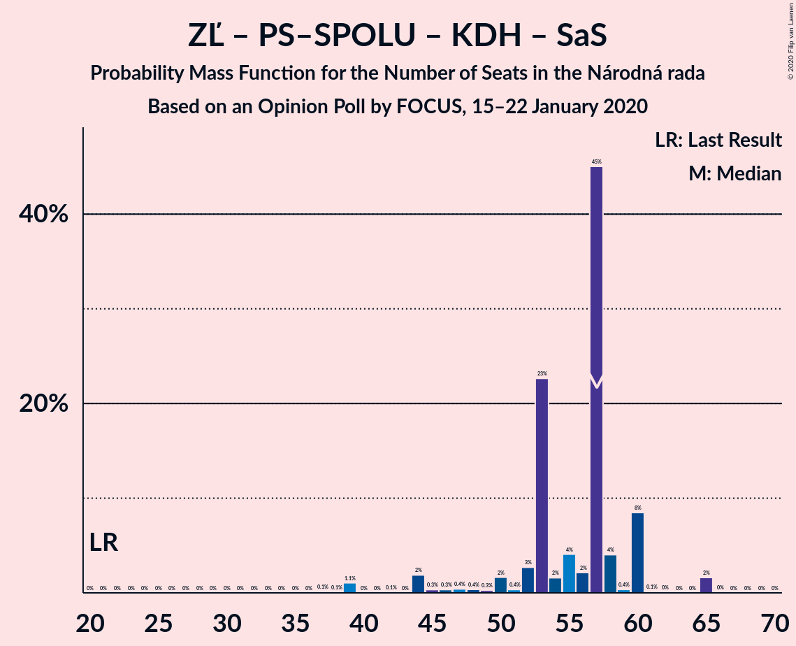

| Number of Seats | Probability | Accumulated | Special Marks |
|:---------------:|:-----------:|:-----------:|:-------------:|
| 21 | 0% | 100% | Last Result |
| 22 | 0% | 100% |  |
| 23 | 0% | 100% |  |
| 24 | 0% | 100% |  |
| 25 | 0% | 100% |  |
| 26 | 0% | 100% |  |
| 27 | 0% | 100% |  |
| 28 | 0% | 100% |  |
| 29 | 0% | 100% |  |
| 30 | 0% | 100% |  |
| 31 | 0% | 100% |  |
| 32 | 0% | 100% |  |
| 33 | 0% | 100% |  |
| 34 | 0% | 100% |  |
| 35 | 0% | 100% |  |
| 36 | 0% | 100% |  |
| 37 | 0.1% | 100% |  |
| 38 | 0.1% | 99.9% |  |
| 39 | 1.1% | 99.8% |  |
| 40 | 0% | 98.7% |  |
| 41 | 0% | 98.7% |  |
| 42 | 0.1% | 98.7% |  |
| 43 | 0% | 98.6% |  |
| 44 | 2% | 98.6% |  |
| 45 | 0.3% | 97% |  |
| 46 | 0.3% | 96% |  |
| 47 | 0.4% | 96% |  |
| 48 | 0.4% | 96% |  |
| 49 | 0.3% | 95% |  |
| 50 | 2% | 95% |  |
| 51 | 0.4% | 93% |  |
| 52 | 3% | 93% |  |
| 53 | 23% | 90% |  |
| 54 | 2% | 68% |  |
| 55 | 4% | 66% |  |
| 56 | 2% | 62% | Median |
| 57 | 45% | 60% |  |
| 58 | 4% | 15% |  |
| 59 | 0.4% | 11% |  |
| 60 | 8% | 10% |  |
| 61 | 0.1% | 2% |  |
| 62 | 0% | 2% |  |
| 63 | 0% | 2% |  |
| 64 | 0% | 2% |  |
| 65 | 2% | 2% |  |
| 66 | 0% | 0.1% |  |
| 67 | 0% | 0% |  |

### SMER–sociálna demokracia – SME RODINA

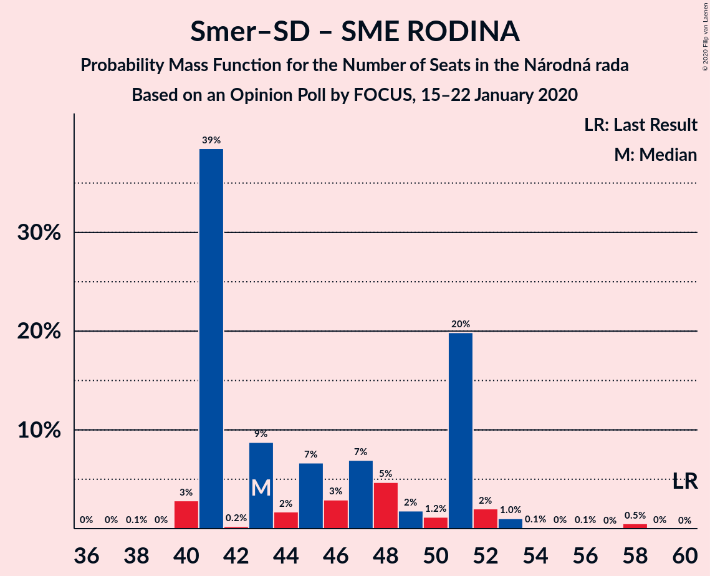

| Number of Seats | Probability | Accumulated | Special Marks |
|:---------------:|:-----------:|:-----------:|:-------------:|
| 36 | 0% | 100% |  |
| 37 | 0% | 99.9% |  |
| 38 | 0.1% | 99.9% |  |
| 39 | 0% | 99.8% |  |
| 40 | 3% | 99.8% |  |
| 41 | 39% | 97% |  |
| 42 | 0.2% | 58% |  |
| 43 | 9% | 58% | Median |
| 44 | 2% | 50% |  |
| 45 | 7% | 48% |  |
| 46 | 3% | 41% |  |
| 47 | 7% | 38% |  |
| 48 | 5% | 31% |  |
| 49 | 2% | 27% |  |
| 50 | 1.2% | 25% |  |
| 51 | 20% | 24% |  |
| 52 | 2% | 4% |  |
| 53 | 1.0% | 2% |  |
| 54 | 0.1% | 0.7% |  |
| 55 | 0% | 0.6% |  |
| 56 | 0.1% | 0.6% |  |
| 57 | 0% | 0.6% |  |
| 58 | 0.5% | 0.5% |  |
| 59 | 0% | 0% |  |
| 60 | 0% | 0% | Last Result |

### Za ľudí – Progresívne Slovensko–SPOLU–Občianska Demokracia – Sloboda a Solidarita

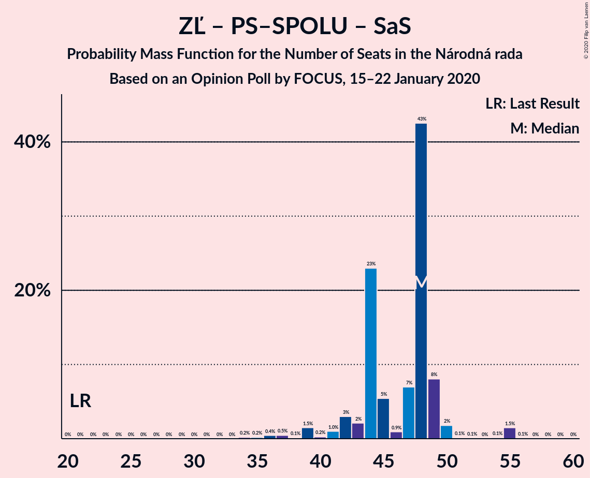

| Number of Seats | Probability | Accumulated | Special Marks |
|:---------------:|:-----------:|:-----------:|:-------------:|
| 21 | 0% | 100% | Last Result |
| 22 | 0% | 100% |  |
| 23 | 0% | 100% |  |
| 24 | 0% | 100% |  |
| 25 | 0% | 100% |  |
| 26 | 0% | 100% |  |
| 27 | 0% | 100% |  |
| 28 | 0% | 100% |  |
| 29 | 0% | 100% |  |
| 30 | 0% | 100% |  |
| 31 | 0% | 100% |  |
| 32 | 0% | 100% |  |
| 33 | 0% | 99.9% |  |
| 34 | 0.2% | 99.9% |  |
| 35 | 0.2% | 99.7% |  |
| 36 | 0.4% | 99.6% |  |
| 37 | 0.5% | 99.1% |  |
| 38 | 0.1% | 98.7% |  |
| 39 | 1.5% | 98.5% |  |
| 40 | 0.2% | 97% |  |
| 41 | 1.0% | 97% |  |
| 42 | 3% | 96% |  |
| 43 | 2% | 93% |  |
| 44 | 23% | 91% |  |
| 45 | 5% | 68% |  |
| 46 | 0.9% | 62% |  |
| 47 | 7% | 61% | Median |
| 48 | 43% | 54% |  |
| 49 | 8% | 12% |  |
| 50 | 2% | 4% |  |
| 51 | 0.1% | 2% |  |
| 52 | 0.1% | 2% |  |
| 53 | 0% | 2% |  |
| 54 | 0.1% | 2% |  |
| 55 | 1.5% | 2% |  |
| 56 | 0.1% | 0.1% |  |
| 57 | 0% | 0% |  |

### SMER–sociálna demokracia – Slovenská národná strana – MOST–HÍD

| Number of Seats | Probability | Accumulated | Special Marks |
|:---------------:|:-----------:|:-----------:|:-------------:|
| 28 | 1.2% | 100% |  |
| 29 | 0% | 98.8% |  |
| 30 | 0.5% | 98.8% |  |
| 31 | 2% | 98% |  |
| 32 | 1.3% | 97% |  |
| 33 | 0.3% | 95% |  |
| 34 | 0.2% | 95% |  |
| 35 | 0.2% | 95% |  |
| 36 | 0.2% | 95% |  |
| 37 | 0.9% | 95% |  |
| 38 | 0.6% | 94% |  |
| 39 | 46% | 93% | Median |
| 40 | 1.5% | 47% |  |
| 41 | 2% | 46% |  |
| 42 | 10% | 43% |  |
| 43 | 7% | 33% |  |
| 44 | 0.8% | 27% |  |
| 45 | 20% | 26% |  |
| 46 | 1.2% | 5% |  |
| 47 | 0.2% | 4% |  |
| 48 | 2% | 4% |  |
| 49 | 0.6% | 2% |  |
| 50 | 0% | 2% |  |
| 51 | 0.3% | 2% |  |
| 52 | 0.2% | 1.3% |  |
| 53 | 0.8% | 1.1% |  |
| 54 | 0.1% | 0.3% |  |
| 55 | 0.1% | 0.2% |  |
| 56 | 0% | 0.1% |  |
| 57 | 0% | 0.1% |  |
| 58 | 0.1% | 0.1% |  |
| 59 | 0% | 0% |  |
| 60 | 0% | 0% |  |
| 61 | 0% | 0% |  |
| 62 | 0% | 0% |  |
| 63 | 0% | 0% |  |
| 64 | 0% | 0% |  |
| 65 | 0% | 0% |  |
| 66 | 0% | 0% |  |
| 67 | 0% | 0% |  |
| 68 | 0% | 0% |  |
| 69 | 0% | 0% |  |
| 70 | 0% | 0% |  |
| 71 | 0% | 0% |  |
| 72 | 0% | 0% |  |
| 73 | 0% | 0% |  |
| 74 | 0% | 0% |  |
| 75 | 0% | 0% | Last Result |

### SMER–sociálna demokracia – Slovenská národná strana

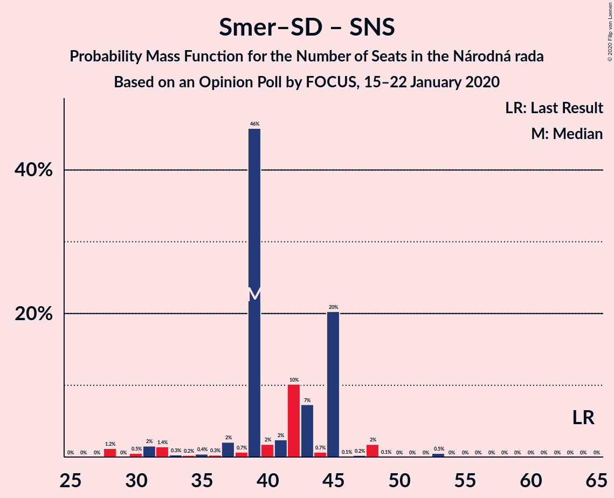

| Number of Seats | Probability | Accumulated | Special Marks |
|:---------------:|:-----------:|:-----------:|:-------------:|
| 27 | 0% | 100% |  |
| 28 | 1.2% | 99.9% |  |
| 29 | 0% | 98.7% |  |
| 30 | 0.5% | 98.7% |  |
| 31 | 2% | 98% |  |
| 32 | 1.4% | 97% |  |
| 33 | 0.3% | 95% |  |
| 34 | 0.2% | 95% |  |
| 35 | 0.4% | 95% |  |
| 36 | 0.3% | 94% |  |
| 37 | 2% | 94% |  |
| 38 | 0.7% | 92% |  |
| 39 | 46% | 91% | Median |
| 40 | 2% | 45% |  |
| 41 | 2% | 44% |  |
| 42 | 10% | 41% |  |
| 43 | 7% | 31% |  |
| 44 | 0.7% | 24% |  |
| 45 | 20% | 23% |  |
| 46 | 0.1% | 3% |  |
| 47 | 0.2% | 3% |  |
| 48 | 2% | 2% |  |
| 49 | 0.1% | 0.6% |  |
| 50 | 0% | 0.5% |  |
| 51 | 0% | 0.5% |  |
| 52 | 0% | 0.5% |  |
| 53 | 0.5% | 0.5% |  |
| 54 | 0% | 0% |  |
| 55 | 0% | 0% |  |
| 56 | 0% | 0% |  |
| 57 | 0% | 0% |  |
| 58 | 0% | 0% |  |
| 59 | 0% | 0% |  |
| 60 | 0% | 0% |  |
| 61 | 0% | 0% |  |
| 62 | 0% | 0% |  |
| 63 | 0% | 0% |  |
| 64 | 0% | 0% | Last Result |

### SMER–sociálna demokracia

| Number of Seats | Probability | Accumulated | Special Marks |
|:---------------:|:-----------:|:-----------:|:-------------:|
| 25 | 0.1% | 100% |  |
| 26 | 0.1% | 99.9% |  |
| 27 | 1.1% | 99.8% |  |
| 28 | 2% | 98.7% |  |
| 29 | 9% | 97% |  |
| 30 | 39% | 88% | Median |
| 31 | 3% | 49% |  |
| 32 | 13% | 46% |  |
| 33 | 7% | 34% |  |
| 34 | 2% | 26% |  |
| 35 | 0.4% | 25% |  |
| 36 | 20% | 24% |  |
| 37 | 1.1% | 4% |  |
| 38 | 2% | 3% |  |
| 39 | 0.6% | 1.3% |  |
| 40 | 0.6% | 0.7% |  |
| 41 | 0% | 0.1% |  |
| 42 | 0% | 0% |  |
| 43 | 0% | 0% |  |
| 44 | 0% | 0% |  |
| 45 | 0% | 0% |  |
| 46 | 0% | 0% |  |
| 47 | 0% | 0% |  |
| 48 | 0% | 0% |  |
| 49 | 0% | 0% | Last Result |

## Technical Information

### Opinion Poll

+ **Polling firm:** FOCUS
+ **Commissioner(s):** —
+ **Fieldwork period:** 15–22 January 2020

### Calculations

+ **Sample size:** 1013
+ **Simulations done:** 1,048,576
+ **Error estimate:** 3.40%

