# Opinion Poll by AKO, 3–6 February 2020

<a href="#voting-intentions">Voting Intentions</a> | <a href="#seats">Seats</a> | <a href="#coalitions">Coalitions</a> | <a href="#technical-information">Technical Information</a>

## Voting Intentions

### Confidence Intervals

| Party | Last Result | Poll Result | 80% Confidence Interval | 90% Confidence Interval | 95% Confidence Interval | 99% Confidence Interval |
|:-----:|:-----------:|:-----------:|:-----------------------:|:-----------------------:|:-----------------------:|:-----------------------:|
| SMER–sociálna demokracia | 28.3% | 17.3% | 15.8–18.9% |15.4–19.4% |15.1–19.8% |14.4–20.6% |
| OBYČAJNÍ ĽUDIA a nezávislé osobnosti | 11.0% | 13.5% | 12.2–15.0% |11.8–15.4% |11.5–15.8% |10.9–16.5% |
| Kotleba–Ľudová strana Naše Slovensko | 8.0% | 11.8% | 10.6–13.2% |10.2–13.6% |9.9–14.0% |9.4–14.6% |
| Za ľudí | 0.0% | 9.5% | 8.4–10.8% |8.1–11.2% |7.8–11.5% |7.3–12.1% |
| Progresívne Slovensko–SPOLU–Občianska Demokracia | 0.0% | 8.7% | 7.7–10.0% |7.3–10.3% |7.1–10.6% |6.6–11.2% |
| SME RODINA | 6.6% | 6.4% | 5.5–7.5% |5.3–7.8% |5.0–8.1% |4.6–8.7% |
| Sloboda a Solidarita | 12.1% | 5.8% | 5.0–6.9% |4.7–7.2% |4.5–7.4% |4.1–8.0% |
| Kresťanskodemokratické hnutie | 4.9% | 5.3% | 4.5–6.3% |4.3–6.6% |4.1–6.9% |3.7–7.4% |
| Slovenská národná strana | 8.6% | 5.1% | 4.3–6.1% |4.1–6.4% |3.9–6.6% |3.6–7.2% |
| MOST–HÍD | 6.5% | 4.5% | 3.8–5.5% |3.6–5.7% |3.4–6.0% |3.0–6.5% |
| Dobrá voľba | 0.0% | 4.1% | 3.4–5.0% |3.2–5.3% |3.0–5.5% |2.7–6.0% |
| Strana maďarskej koalície–Magyar Koalíció Pártja | 4.0% | 3.2% | 2.6–4.0% |2.4–4.3% |2.3–4.5% |2.0–4.9% |
| VLASŤ | 0.0% | 2.2% | 1.7–2.9% |1.6–3.1% |1.4–3.3% |1.2–3.7% |

*Note:* The poll result column reflects the actual value used in the calculations. Published results may vary slightly, and in addition be rounded to fewer digits.

## Seats

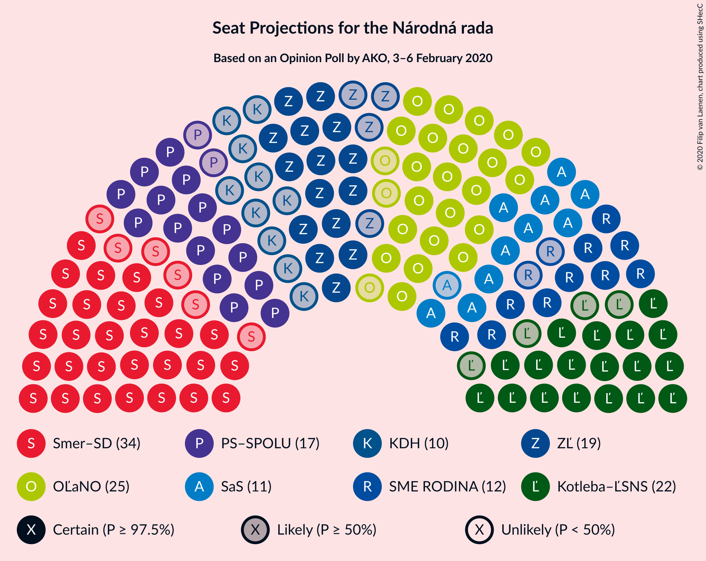

### Confidence Intervals

| Party | Last Result | Median | 80% Confidence Interval | 90% Confidence Interval | 95% Confidence Interval | 99% Confidence Interval |
|:-----:|:-----------:|:------:|:-----------------------:|:-----------------------:|:-----------------------:|:-----------------------:|
| <a href="#smer–sociálna-demokracia">SMER–sociálna demokracia</a> | 49 | 34 | 29–34 |29–34 |28–35 |26–38 |
| <a href="#obyčajní-ľudia-a-nezávislé-osobnosti">OBYČAJNÍ ĽUDIA a nezávislé osobnosti</a> | 17 | 25 | 24–25 |23–25 |22–26 |22–29 |
| <a href="#kotleba–ľudová-strana-naše-slovensko">Kotleba–Ľudová strana Naše Slovensko</a> | 14 | 22 | 21–22 |18–22 |18–23 |18–26 |
| <a href="#za-ľudí">Za ľudí</a> | 0 | 19 | 17–19 |16–19 |15–19 |14–21 |
| <a href="#progresívne-slovensko–spolu–občianska-demokracia">Progresívne Slovensko–SPOLU–Občianska Demokracia</a> | 0 | 17 | 17 |15–17 |15–18 |14–20 |
| <a href="#sme-rodina">SME RODINA</a> | 11 | 12 | 10–12 |10–12 |10–12 |0–14 |
| <a href="#sloboda-a-solidarita">Sloboda a Solidarita</a> | 21 | 11 | 11 |10–11 |10–11 |0–13 |
| <a href="#kresťanskodemokratické-hnutie">Kresťanskodemokratické hnutie</a> | 0 | 10 | 10 |0–10 |0–11 |0–12 |
| <a href="#slovenská-národná-strana">Slovenská národná strana</a> | 15 | 0 | 0–9 |0–10 |0–10 |0–12 |
| <a href="#most–híd">MOST–HÍD</a> | 11 | 0 | 0–9 |0–9 |0–9 |0–10 |
| <a href="#dobrá-voľba">Dobrá voľba</a> | 0 | 0 | 0 |0–10 |0–10 |0–10 |
| <a href="#strana-maďarskej-koalície–magyar-koalíció-pártja">Strana maďarskej koalície–Magyar Koalíció Pártja</a> | 0 | 0 | 0 |0 |0 |0 |
| <a href="#vlasť">VLASŤ</a> | 0 | 0 | 0 |0 |0 |0 |

### SMER–sociálna demokracia

*For a full overview of the results for this party, see the [SMER–sociálna demokracia](party-smer–sociálnademokracia.html) page.*

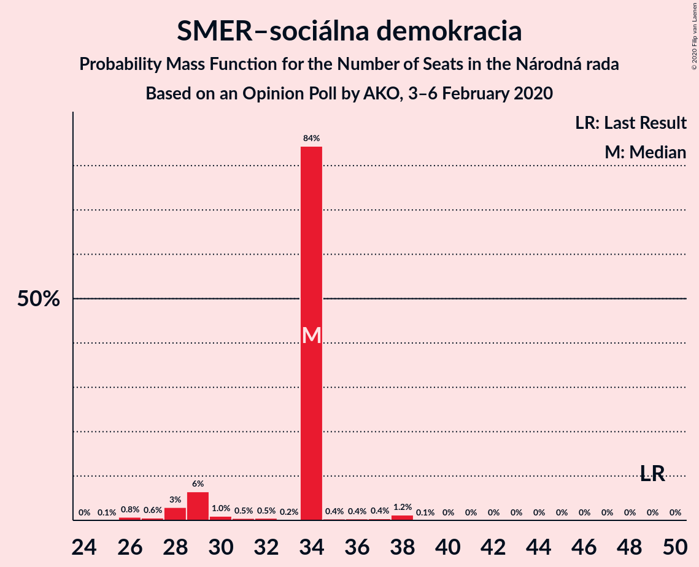

| Number of Seats | Probability | Accumulated | Special Marks |
|:---------------:|:-----------:|:-----------:|:-------------:|
| 25 | 0.1% | 100% |  |
| 26 | 0.8% | 99.9% |  |
| 27 | 0.6% | 99.2% |  |
| 28 | 3% | 98.6% |  |
| 29 | 6% | 96% |  |
| 30 | 1.0% | 89% |  |
| 31 | 0.5% | 88% |  |
| 32 | 0.5% | 88% |  |
| 33 | 0.2% | 87% |  |
| 34 | 84% | 87% | Median |
| 35 | 0.4% | 3% |  |
| 36 | 0.4% | 2% |  |
| 37 | 0.4% | 2% |  |
| 38 | 1.2% | 1.4% |  |
| 39 | 0.1% | 0.2% |  |
| 40 | 0% | 0.1% |  |
| 41 | 0% | 0% |  |
| 42 | 0% | 0% |  |
| 43 | 0% | 0% |  |
| 44 | 0% | 0% |  |
| 45 | 0% | 0% |  |
| 46 | 0% | 0% |  |
| 47 | 0% | 0% |  |
| 48 | 0% | 0% |  |
| 49 | 0% | 0% | Last Result |

### OBYČAJNÍ ĽUDIA a nezávislé osobnosti

*For a full overview of the results for this party, see the [OBYČAJNÍ ĽUDIA a nezávislé osobnosti](party-obyčajníľudiaanezávisléosobnosti.html) page.*

| Number of Seats | Probability | Accumulated | Special Marks |
|:---------------:|:-----------:|:-----------:|:-------------:|
| 17 | 0% | 100% | Last Result |
| 18 | 0% | 100% |  |
| 19 | 0.1% | 100% |  |
| 20 | 0.1% | 99.9% |  |
| 21 | 0.2% | 99.8% |  |
| 22 | 3% | 99.6% |  |
| 23 | 7% | 97% |  |
| 24 | 1.1% | 90% |  |
| 25 | 86% | 89% | Median |
| 26 | 1.1% | 3% |  |
| 27 | 0.4% | 2% |  |
| 28 | 0.8% | 2% |  |
| 29 | 0.7% | 0.9% |  |
| 30 | 0.1% | 0.2% |  |
| 31 | 0.1% | 0.1% |  |
| 32 | 0% | 0% |  |

### Kotleba–Ľudová strana Naše Slovensko

*For a full overview of the results for this party, see the [Kotleba–Ľudová strana Naše Slovensko](party-kotleba–ľudovástrananašeslovensko.html) page.*

| Number of Seats | Probability | Accumulated | Special Marks |
|:---------------:|:-----------:|:-----------:|:-------------:|
| 14 | 0% | 100% | Last Result |
| 15 | 0% | 100% |  |
| 16 | 0% | 100% |  |
| 17 | 0.1% | 100% |  |
| 18 | 8% | 99.9% |  |
| 19 | 1.1% | 92% |  |
| 20 | 0.7% | 91% |  |
| 21 | 2% | 90% |  |
| 22 | 86% | 88% | Median |
| 23 | 1.2% | 3% |  |
| 24 | 0.3% | 1.4% |  |
| 25 | 0.5% | 1.1% |  |
| 26 | 0.5% | 0.6% |  |
| 27 | 0.1% | 0.2% |  |
| 28 | 0% | 0.1% |  |
| 29 | 0.1% | 0.1% |  |
| 30 | 0% | 0% |  |

### Za ľudí

*For a full overview of the results for this party, see the [Za ľudí](party-zaľudí.html) page.*

| Number of Seats | Probability | Accumulated | Special Marks |
|:---------------:|:-----------:|:-----------:|:-------------:|
| 0 | 0% | 100% | Last Result |
| 1 | 0% | 100% |  |
| 2 | 0% | 100% |  |
| 3 | 0% | 100% |  |
| 4 | 0% | 100% |  |
| 5 | 0% | 100% |  |
| 6 | 0% | 100% |  |
| 7 | 0% | 100% |  |
| 8 | 0% | 100% |  |
| 9 | 0% | 100% |  |
| 10 | 0% | 100% |  |
| 11 | 0% | 100% |  |
| 12 | 0.1% | 100% |  |
| 13 | 0.2% | 99.9% |  |
| 14 | 0.8% | 99.8% |  |
| 15 | 3% | 98.9% |  |
| 16 | 6% | 96% |  |
| 17 | 2% | 90% |  |
| 18 | 1.4% | 89% |  |
| 19 | 86% | 87% | Median |
| 20 | 0.7% | 1.4% |  |
| 21 | 0.3% | 0.7% |  |
| 22 | 0% | 0.4% |  |
| 23 | 0.3% | 0.3% |  |
| 24 | 0% | 0.1% |  |
| 25 | 0% | 0% |  |

### Progresívne Slovensko–SPOLU–Občianska Demokracia

*For a full overview of the results for this party, see the [Progresívne Slovensko–SPOLU–Občianska Demokracia](party-progresívneslovensko–spolu–občianskademokracia.html) page.*

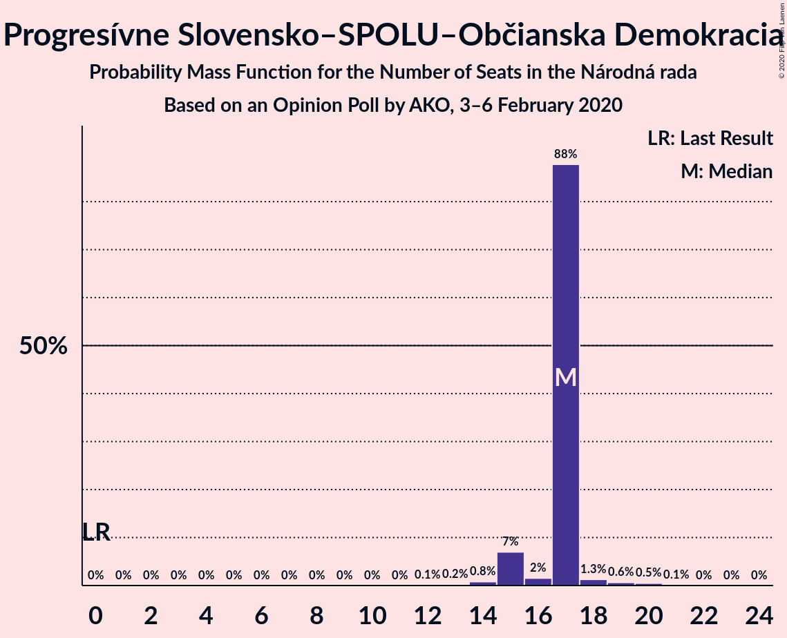

| Number of Seats | Probability | Accumulated | Special Marks |
|:---------------:|:-----------:|:-----------:|:-------------:|
| 0 | 0% | 100% | Last Result |
| 1 | 0% | 100% |  |
| 2 | 0% | 100% |  |
| 3 | 0% | 100% |  |
| 4 | 0% | 100% |  |
| 5 | 0% | 100% |  |
| 6 | 0% | 100% |  |
| 7 | 0% | 100% |  |
| 8 | 0% | 100% |  |
| 9 | 0% | 100% |  |
| 10 | 0% | 100% |  |
| 11 | 0% | 100% |  |
| 12 | 0.1% | 100% |  |
| 13 | 0.2% | 99.9% |  |
| 14 | 0.8% | 99.7% |  |
| 15 | 7% | 98.9% |  |
| 16 | 2% | 92% |  |
| 17 | 88% | 90% | Median |
| 18 | 1.3% | 3% |  |
| 19 | 0.6% | 1.3% |  |
| 20 | 0.5% | 0.6% |  |
| 21 | 0.1% | 0.2% |  |
| 22 | 0% | 0.1% |  |
| 23 | 0% | 0% |  |

### SME RODINA

*For a full overview of the results for this party, see the [SME RODINA](party-smerodina.html) page.*

| Number of Seats | Probability | Accumulated | Special Marks |
|:---------------:|:-----------:|:-----------:|:-------------:|
| 0 | 2% | 100% |  |
| 1 | 0% | 98% |  |
| 2 | 0% | 98% |  |
| 3 | 0% | 98% |  |
| 4 | 0% | 98% |  |
| 5 | 0% | 98% |  |
| 6 | 0% | 98% |  |
| 7 | 0% | 98% |  |
| 8 | 0% | 98% |  |
| 9 | 0.1% | 98% |  |
| 10 | 9% | 98% |  |
| 11 | 2% | 90% | Last Result |
| 12 | 86% | 88% | Median |
| 13 | 2% | 2% |  |
| 14 | 0.4% | 0.7% |  |
| 15 | 0.1% | 0.3% |  |
| 16 | 0.1% | 0.2% |  |
| 17 | 0.1% | 0.1% |  |
| 18 | 0.1% | 0.1% |  |
| 19 | 0% | 0% |  |

### Sloboda a Solidarita

*For a full overview of the results for this party, see the [Sloboda a Solidarita](party-slobodaasolidarita.html) page.*

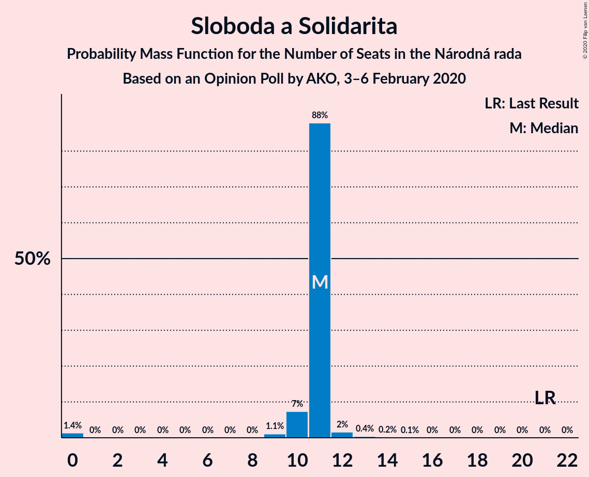

| Number of Seats | Probability | Accumulated | Special Marks |
|:---------------:|:-----------:|:-----------:|:-------------:|
| 0 | 1.4% | 100% |  |
| 1 | 0% | 98.6% |  |
| 2 | 0% | 98.6% |  |
| 3 | 0% | 98.6% |  |
| 4 | 0% | 98.6% |  |
| 5 | 0% | 98.6% |  |
| 6 | 0% | 98.6% |  |
| 7 | 0% | 98.6% |  |
| 8 | 0% | 98.6% |  |
| 9 | 1.1% | 98.6% |  |
| 10 | 7% | 98% |  |
| 11 | 88% | 90% | Median |
| 12 | 2% | 2% |  |
| 13 | 0.4% | 0.7% |  |
| 14 | 0.2% | 0.3% |  |
| 15 | 0.1% | 0.1% |  |
| 16 | 0% | 0% |  |
| 17 | 0% | 0% |  |
| 18 | 0% | 0% |  |
| 19 | 0% | 0% |  |
| 20 | 0% | 0% |  |
| 21 | 0% | 0% | Last Result |

### Kresťanskodemokratické hnutie

*For a full overview of the results for this party, see the [Kresťanskodemokratické hnutie](party-kresťanskodemokratickéhnutie.html) page.*

| Number of Seats | Probability | Accumulated | Special Marks |
|:---------------:|:-----------:|:-----------:|:-------------:|
| 0 | 8% | 100% | Last Result |
| 1 | 0% | 92% |  |
| 2 | 0% | 92% |  |
| 3 | 0% | 92% |  |
| 4 | 0% | 92% |  |
| 5 | 0% | 92% |  |
| 6 | 0% | 92% |  |
| 7 | 0% | 92% |  |
| 8 | 0% | 92% |  |
| 9 | 0.6% | 92% |  |
| 10 | 87% | 91% | Median |
| 11 | 3% | 4% |  |
| 12 | 0.6% | 0.8% |  |
| 13 | 0.1% | 0.2% |  |
| 14 | 0.1% | 0.1% |  |
| 15 | 0% | 0% |  |

### Slovenská národná strana

*For a full overview of the results for this party, see the [Slovenská národná strana](party-slovenskánárodnástrana.html) page.*

| Number of Seats | Probability | Accumulated | Special Marks |
|:---------------:|:-----------:|:-----------:|:-------------:|
| 0 | 89% | 100% | Median |
| 1 | 0% | 11% |  |
| 2 | 0% | 11% |  |
| 3 | 0% | 11% |  |
| 4 | 0% | 11% |  |
| 5 | 0% | 11% |  |
| 6 | 0% | 11% |  |
| 7 | 0% | 11% |  |
| 8 | 0% | 11% |  |
| 9 | 1.3% | 11% |  |
| 10 | 8% | 10% |  |
| 11 | 1.1% | 2% |  |
| 12 | 0.9% | 1.0% |  |
| 13 | 0% | 0.1% |  |
| 14 | 0% | 0% |  |
| 15 | 0% | 0% | Last Result |

### MOST–HÍD

*For a full overview of the results for this party, see the [MOST–HÍD](party-most–híd.html) page.*

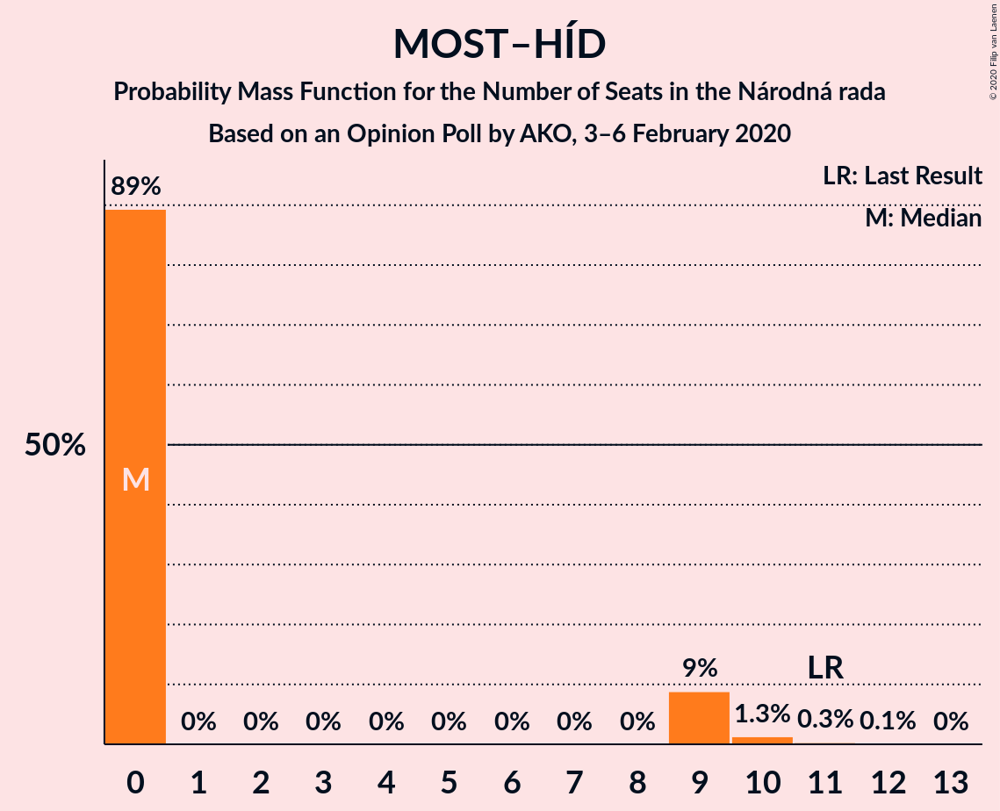

| Number of Seats | Probability | Accumulated | Special Marks |
|:---------------:|:-----------:|:-----------:|:-------------:|
| 0 | 89% | 100% | Median |
| 1 | 0% | 11% |  |
| 2 | 0% | 11% |  |
| 3 | 0% | 11% |  |
| 4 | 0% | 11% |  |
| 5 | 0% | 11% |  |
| 6 | 0% | 11% |  |
| 7 | 0% | 11% |  |
| 8 | 0% | 11% |  |
| 9 | 9% | 11% |  |
| 10 | 1.3% | 2% |  |
| 11 | 0.3% | 0.4% | Last Result |
| 12 | 0.1% | 0.1% |  |
| 13 | 0% | 0% |  |

### Dobrá voľba

*For a full overview of the results for this party, see the [Dobrá voľba](party-dobrávoľba.html) page.*

| Number of Seats | Probability | Accumulated | Special Marks |
|:---------------:|:-----------:|:-----------:|:-------------:|
| 0 | 92% | 100% | Last Result, Median |
| 1 | 0% | 8% |  |
| 2 | 0% | 8% |  |
| 3 | 0% | 8% |  |
| 4 | 0% | 8% |  |
| 5 | 0% | 8% |  |
| 6 | 0% | 8% |  |
| 7 | 0% | 8% |  |
| 8 | 0% | 8% |  |
| 9 | 2% | 8% |  |
| 10 | 6% | 6% |  |
| 11 | 0% | 0.1% |  |
| 12 | 0% | 0% |  |

### Strana maďarskej koalície–Magyar Koalíció Pártja

*For a full overview of the results for this party, see the [Strana maďarskej koalície–Magyar Koalíció Pártja](party-stranamaďarskejkoalície–magyarkoalíciópártja.html) page.*

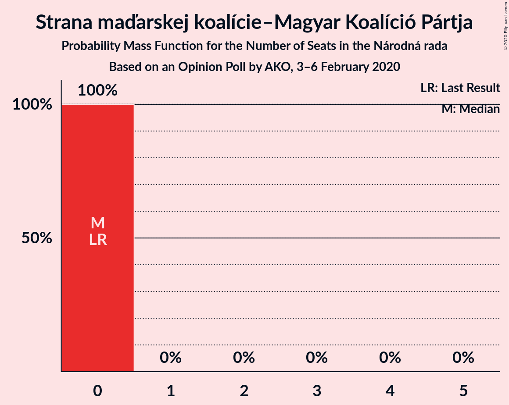

| Number of Seats | Probability | Accumulated | Special Marks |
|:---------------:|:-----------:|:-----------:|:-------------:|
| 0 | 100% | 100% | Last Result, Median |

### VLASŤ

*For a full overview of the results for this party, see the [VLASŤ](party-vlasť.html) page.*

| Number of Seats | Probability | Accumulated | Special Marks |
|:---------------:|:-----------:|:-----------:|:-------------:|
| 0 | 100% | 100% | Last Result, Median |

## Coalitions

### Confidence Intervals

| Coalition | Last Result | Median | Majority? | 80% Confidence Interval | 90% Confidence Interval | 95% Confidence Interval | 99% Confidence Interval |
|:---------:|:-----------:|:------:|:---------:|:-----------------------:|:-----------------------:|:-----------------------:|:-----------------------:|
| OBYČAJNÍ ĽUDIA a nezávislé osobnosti – Za ľudí – Progresívne Slovensko–SPOLU–Občianska Demokracia – SME RODINA – Sloboda a Solidarita – Kresťanskodemokratické hnutie – MOST–HÍD – Strana maďarskej koalície–Magyar Koalíció Pártja | 60 | 94 | 100% | 89–94 | 83–94 | 83–95 | 79–100 |
| OBYČAJNÍ ĽUDIA a nezávislé osobnosti – Za ľudí – Progresívne Slovensko–SPOLU–Občianska Demokracia – SME RODINA – Sloboda a Solidarita – Kresťanskodemokratické hnutie – MOST–HÍD | 60 | 94 | 100% | 89–94 | 83–94 | 83–95 | 79–100 |
| OBYČAJNÍ ĽUDIA a nezávislé osobnosti – Za ľudí – Progresívne Slovensko–SPOLU–Občianska Demokracia – SME RODINA – Sloboda a Solidarita – Kresťanskodemokratické hnutie – Strana maďarskej koalície–Magyar Koalíció Pártja | 49 | 94 | 94% | 84–94 | 74–94 | 74–94 | 74–97 |
| OBYČAJNÍ ĽUDIA a nezávislé osobnosti – Za ľudí – Progresívne Slovensko–SPOLU–Občianska Demokracia – SME RODINA – Sloboda a Solidarita – Kresťanskodemokratické hnutie | 49 | 94 | 94% | 84–94 | 74–94 | 74–94 | 74–96 |
| OBYČAJNÍ ĽUDIA a nezávislé osobnosti – Za ľudí – Progresívne Slovensko–SPOLU–Občianska Demokracia – Sloboda a Solidarita – Kresťanskodemokratické hnutie – MOST–HÍD – Strana maďarskej koalície–Magyar Koalíció Pártja | 49 | 82 | 93% | 80–82 | 73–82 | 73–85 | 69–88 |
| OBYČAJNÍ ĽUDIA a nezávislé osobnosti – Za ľudí – Progresívne Slovensko–SPOLU–Občianska Demokracia – Sloboda a Solidarita – Kresťanskodemokratické hnutie – MOST–HÍD | 49 | 82 | 93% | 80–82 | 73–82 | 73–85 | 69–88 |
| OBYČAJNÍ ĽUDIA a nezávislé osobnosti – Za ľudí – Progresívne Slovensko–SPOLU–Občianska Demokracia – Sloboda a Solidarita – Kresťanskodemokratické hnutie – Strana maďarskej koalície–Magyar Koalíció Pártja | 38 | 82 | 91% | 76–82 | 64–82 | 64–82 | 64–85 |
| OBYČAJNÍ ĽUDIA a nezávislé osobnosti – Za ľudí – Progresívne Slovensko–SPOLU–Občianska Demokracia – Sloboda a Solidarita – Kresťanskodemokratické hnutie | 38 | 82 | 91% | 76–82 | 64–82 | 64–82 | 64–85 |
| OBYČAJNÍ ĽUDIA a nezávislé osobnosti – Za ľudí – Progresívne Slovensko–SPOLU–Občianska Demokracia – Sloboda a Solidarita | 38 | 72 | 1.3% | 66–72 | 64–72 | 64–72 | 59–78 |
| SMER–sociálna demokracia – Kotleba–Ľudová strana Naše Slovensko – SME RODINA – Slovenská národná strana | 89 | 68 | 1.0% | 68 | 67–70 | 62–72 | 56–78 |
| Za ľudí – Progresívne Slovensko–SPOLU–Občianska Demokracia – Sloboda a Solidarita – Kresťanskodemokratické hnutie | 21 | 57 | 0% | 52–57 | 41–57 | 41–57 | 41–59 |
| SMER–sociálna demokracia – SME RODINA – Slovenská národná strana | 75 | 46 | 0% | 46–48 | 46–49 | 39–51 | 38–59 |
| SMER–sociálna demokracia – Slovenská národná strana – MOST–HÍD | 75 | 34 | 0% | 34–42 | 34–48 | 34–48 | 30–49 |
| Za ľudí – Progresívne Slovensko–SPOLU–Občianska Demokracia – Sloboda a Solidarita | 21 | 47 | 0% | 43–47 | 41–47 | 41–47 | 33–50 |
| SMER–sociálna demokracia – SME RODINA | 60 | 46 | 0% | 39–46 | 39–46 | 38–46 | 37–49 |
| SMER–sociálna demokracia – Slovenská národná strana | 64 | 34 | 0% | 34–39 | 34–39 | 28–42 | 27–48 |
| SMER–sociálna demokracia | 49 | 34 | 0% | 29–34 | 29–34 | 28–35 | 26–38 |

### OBYČAJNÍ ĽUDIA a nezávislé osobnosti – Za ľudí – Progresívne Slovensko–SPOLU–Občianska Demokracia – SME RODINA – Sloboda a Solidarita – Kresťanskodemokratické hnutie – MOST–HÍD – Strana maďarskej koalície–Magyar Koalíció Pártja

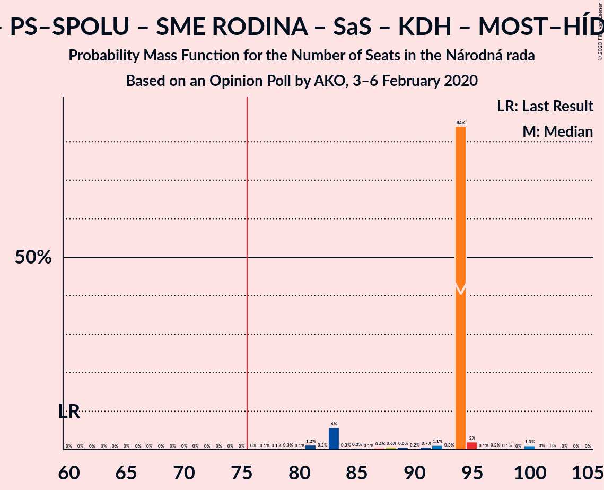

| Number of Seats | Probability | Accumulated | Special Marks |
|:---------------:|:-----------:|:-----------:|:-------------:|
| 60 | 0% | 100% | Last Result |
| 61 | 0% | 100% |  |
| 62 | 0% | 100% |  |
| 63 | 0% | 100% |  |
| 64 | 0% | 100% |  |
| 65 | 0% | 100% |  |
| 66 | 0% | 100% |  |
| 67 | 0% | 100% |  |
| 68 | 0% | 100% |  |
| 69 | 0% | 100% |  |
| 70 | 0% | 100% |  |
| 71 | 0% | 100% |  |
| 72 | 0% | 100% |  |
| 73 | 0% | 100% |  |
| 74 | 0% | 100% |  |
| 75 | 0% | 100% |  |
| 76 | 0% | 100% | Majority |
| 77 | 0.1% | 99.9% |  |
| 78 | 0.1% | 99.8% |  |
| 79 | 0.3% | 99.8% |  |
| 80 | 0.1% | 99.5% |  |
| 81 | 1.2% | 99.4% |  |
| 82 | 0.2% | 98% |  |
| 83 | 6% | 98% |  |
| 84 | 0.3% | 92% |  |
| 85 | 0.3% | 92% |  |
| 86 | 0.1% | 92% |  |
| 87 | 0.4% | 92% |  |
| 88 | 0.6% | 91% |  |
| 89 | 0.6% | 90% |  |
| 90 | 0.2% | 90% |  |
| 91 | 0.7% | 90% |  |
| 92 | 1.1% | 89% |  |
| 93 | 0.3% | 88% |  |
| 94 | 84% | 88% | Median |
| 95 | 2% | 4% |  |
| 96 | 0.1% | 1.5% |  |
| 97 | 0.2% | 1.4% |  |
| 98 | 0.1% | 1.2% |  |
| 99 | 0% | 1.1% |  |
| 100 | 1.0% | 1.1% |  |
| 101 | 0% | 0.1% |  |
| 102 | 0% | 0% |  |

### OBYČAJNÍ ĽUDIA a nezávislé osobnosti – Za ľudí – Progresívne Slovensko–SPOLU–Občianska Demokracia – SME RODINA – Sloboda a Solidarita – Kresťanskodemokratické hnutie – MOST–HÍD

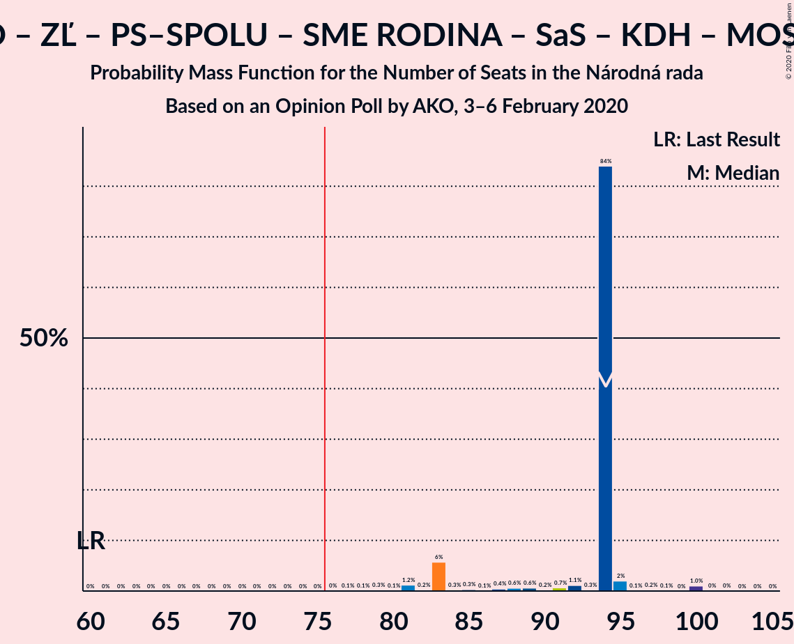

| Number of Seats | Probability | Accumulated | Special Marks |
|:---------------:|:-----------:|:-----------:|:-------------:|
| 60 | 0% | 100% | Last Result |
| 61 | 0% | 100% |  |
| 62 | 0% | 100% |  |
| 63 | 0% | 100% |  |
| 64 | 0% | 100% |  |
| 65 | 0% | 100% |  |
| 66 | 0% | 100% |  |
| 67 | 0% | 100% |  |
| 68 | 0% | 100% |  |
| 69 | 0% | 100% |  |
| 70 | 0% | 100% |  |
| 71 | 0% | 100% |  |
| 72 | 0% | 100% |  |
| 73 | 0% | 100% |  |
| 74 | 0% | 100% |  |
| 75 | 0% | 100% |  |
| 76 | 0% | 100% | Majority |
| 77 | 0.1% | 99.9% |  |
| 78 | 0.1% | 99.8% |  |
| 79 | 0.3% | 99.7% |  |
| 80 | 0.1% | 99.5% |  |
| 81 | 1.2% | 99.4% |  |
| 82 | 0.2% | 98% |  |
| 83 | 6% | 98% |  |
| 84 | 0.3% | 92% |  |
| 85 | 0.3% | 92% |  |
| 86 | 0.1% | 92% |  |
| 87 | 0.4% | 92% |  |
| 88 | 0.6% | 91% |  |
| 89 | 0.6% | 90% |  |
| 90 | 0.2% | 90% |  |
| 91 | 0.7% | 90% |  |
| 92 | 1.1% | 89% |  |
| 93 | 0.3% | 88% |  |
| 94 | 84% | 88% | Median |
| 95 | 2% | 4% |  |
| 96 | 0.1% | 1.5% |  |
| 97 | 0.2% | 1.4% |  |
| 98 | 0.1% | 1.2% |  |
| 99 | 0% | 1.1% |  |
| 100 | 1.0% | 1.1% |  |
| 101 | 0% | 0.1% |  |
| 102 | 0% | 0% |  |

### OBYČAJNÍ ĽUDIA a nezávislé osobnosti – Za ľudí – Progresívne Slovensko–SPOLU–Občianska Demokracia – SME RODINA – Sloboda a Solidarita – Kresťanskodemokratické hnutie – Strana maďarskej koalície–Magyar Koalíció Pártja

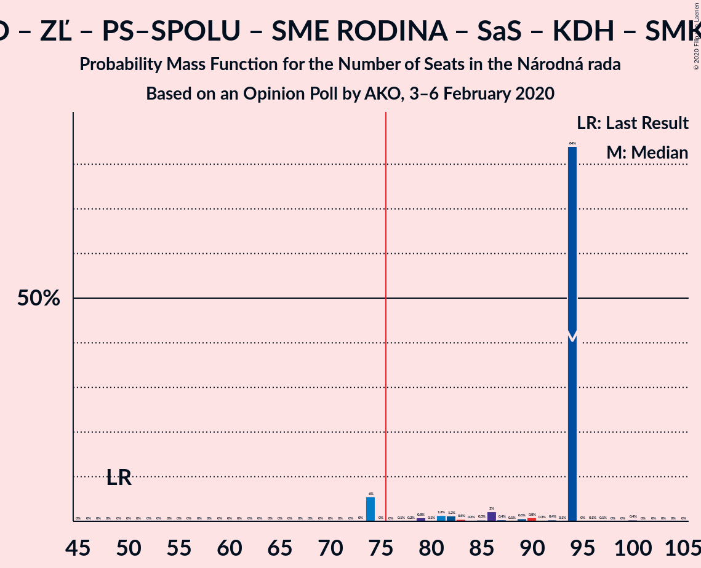

| Number of Seats | Probability | Accumulated | Special Marks |
|:---------------:|:-----------:|:-----------:|:-------------:|
| 49 | 0% | 100% | Last Result |
| 50 | 0% | 100% |  |
| 51 | 0% | 100% |  |
| 52 | 0% | 100% |  |
| 53 | 0% | 100% |  |
| 54 | 0% | 100% |  |
| 55 | 0% | 100% |  |
| 56 | 0% | 100% |  |
| 57 | 0% | 100% |  |
| 58 | 0% | 100% |  |
| 59 | 0% | 100% |  |
| 60 | 0% | 100% |  |
| 61 | 0% | 100% |  |
| 62 | 0% | 100% |  |
| 63 | 0% | 100% |  |
| 64 | 0% | 100% |  |
| 65 | 0% | 100% |  |
| 66 | 0% | 100% |  |
| 67 | 0% | 100% |  |
| 68 | 0% | 100% |  |
| 69 | 0% | 100% |  |
| 70 | 0% | 100% |  |
| 71 | 0% | 100% |  |
| 72 | 0% | 100% |  |
| 73 | 0% | 100% |  |
| 74 | 6% | 99.9% |  |
| 75 | 0% | 94% |  |
| 76 | 0% | 94% | Majority |
| 77 | 0.1% | 94% |  |
| 78 | 0.2% | 94% |  |
| 79 | 0.8% | 94% |  |
| 80 | 0.1% | 93% |  |
| 81 | 1.3% | 93% |  |
| 82 | 1.2% | 92% |  |
| 83 | 0.5% | 91% |  |
| 84 | 0.3% | 90% |  |
| 85 | 0.3% | 90% |  |
| 86 | 2% | 90% |  |
| 87 | 0.4% | 87% |  |
| 88 | 0.1% | 87% |  |
| 89 | 0.6% | 87% |  |
| 90 | 0.8% | 86% |  |
| 91 | 0.3% | 85% |  |
| 92 | 0.4% | 85% |  |
| 93 | 0.1% | 85% |  |
| 94 | 84% | 85% | Median |
| 95 | 0% | 0.6% |  |
| 96 | 0.1% | 0.6% |  |
| 97 | 0.1% | 0.5% |  |
| 98 | 0% | 0.4% |  |
| 99 | 0% | 0.4% |  |
| 100 | 0.4% | 0.4% |  |
| 101 | 0% | 0% |  |

### OBYČAJNÍ ĽUDIA a nezávislé osobnosti – Za ľudí – Progresívne Slovensko–SPOLU–Občianska Demokracia – SME RODINA – Sloboda a Solidarita – Kresťanskodemokratické hnutie

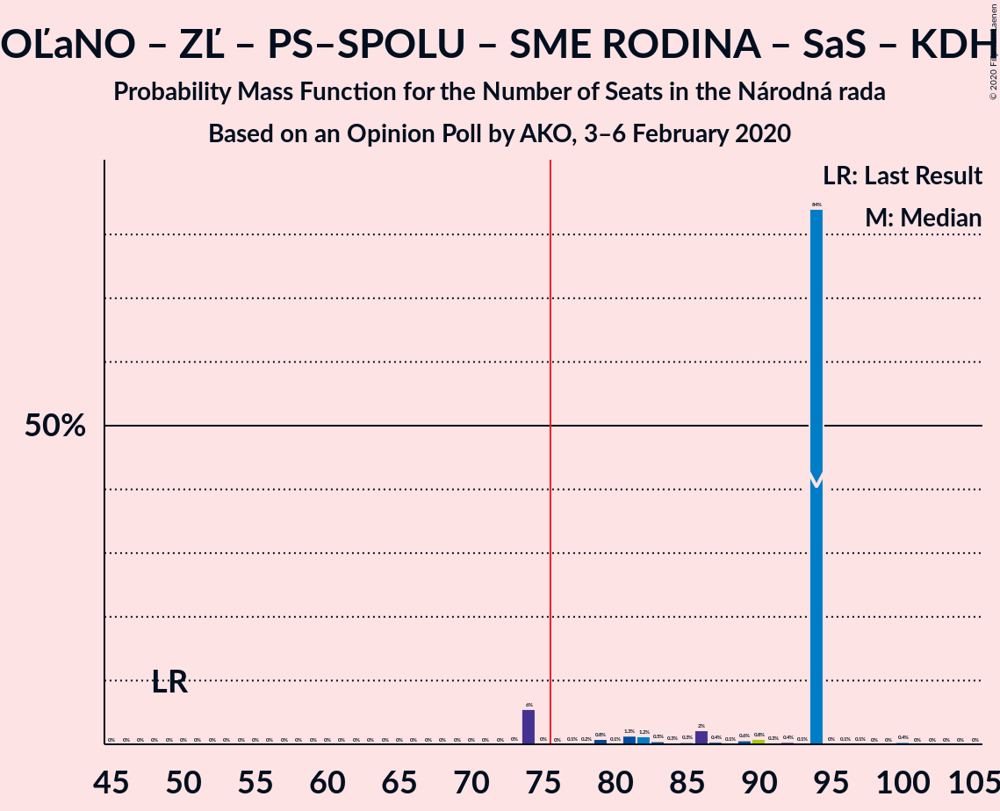

| Number of Seats | Probability | Accumulated | Special Marks |
|:---------------:|:-----------:|:-----------:|:-------------:|
| 49 | 0% | 100% | Last Result |
| 50 | 0% | 100% |  |
| 51 | 0% | 100% |  |
| 52 | 0% | 100% |  |
| 53 | 0% | 100% |  |
| 54 | 0% | 100% |  |
| 55 | 0% | 100% |  |
| 56 | 0% | 100% |  |
| 57 | 0% | 100% |  |
| 58 | 0% | 100% |  |
| 59 | 0% | 100% |  |
| 60 | 0% | 100% |  |
| 61 | 0% | 100% |  |
| 62 | 0% | 100% |  |
| 63 | 0% | 100% |  |
| 64 | 0% | 100% |  |
| 65 | 0% | 100% |  |
| 66 | 0% | 100% |  |
| 67 | 0% | 100% |  |
| 68 | 0% | 100% |  |
| 69 | 0% | 100% |  |
| 70 | 0% | 100% |  |
| 71 | 0% | 100% |  |
| 72 | 0% | 100% |  |
| 73 | 0% | 99.9% |  |
| 74 | 6% | 99.9% |  |
| 75 | 0% | 94% |  |
| 76 | 0% | 94% | Majority |
| 77 | 0.1% | 94% |  |
| 78 | 0.2% | 94% |  |
| 79 | 0.8% | 94% |  |
| 80 | 0.1% | 93% |  |
| 81 | 1.3% | 93% |  |
| 82 | 1.2% | 92% |  |
| 83 | 0.5% | 91% |  |
| 84 | 0.3% | 90% |  |
| 85 | 0.3% | 90% |  |
| 86 | 2% | 90% |  |
| 87 | 0.4% | 87% |  |
| 88 | 0.1% | 87% |  |
| 89 | 0.6% | 87% |  |
| 90 | 0.8% | 86% |  |
| 91 | 0.3% | 85% |  |
| 92 | 0.4% | 85% |  |
| 93 | 0.1% | 85% |  |
| 94 | 84% | 85% | Median |
| 95 | 0% | 0.6% |  |
| 96 | 0.1% | 0.6% |  |
| 97 | 0.1% | 0.5% |  |
| 98 | 0% | 0.4% |  |
| 99 | 0% | 0.4% |  |
| 100 | 0.4% | 0.4% |  |
| 101 | 0% | 0% |  |

### OBYČAJNÍ ĽUDIA a nezávislé osobnosti – Za ľudí – Progresívne Slovensko–SPOLU–Občianska Demokracia – Sloboda a Solidarita – Kresťanskodemokratické hnutie – MOST–HÍD – Strana maďarskej koalície–Magyar Koalíció Pártja

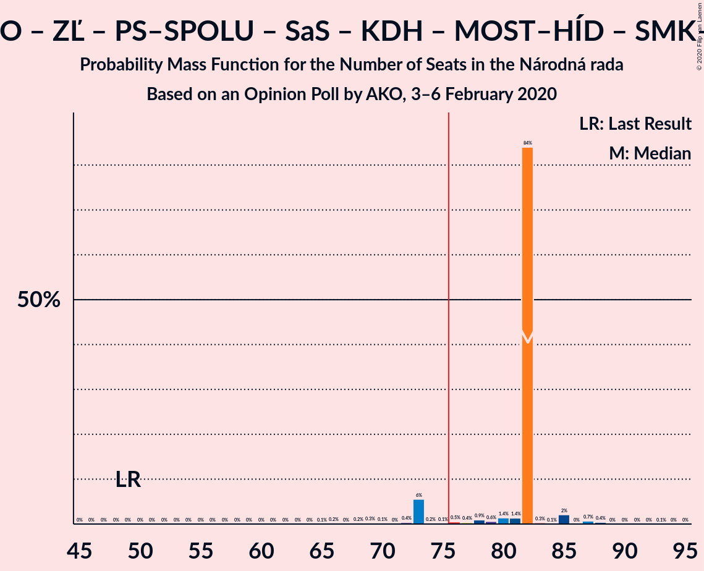

| Number of Seats | Probability | Accumulated | Special Marks |
|:---------------:|:-----------:|:-----------:|:-------------:|
| 49 | 0% | 100% | Last Result |
| 50 | 0% | 100% |  |
| 51 | 0% | 100% |  |
| 52 | 0% | 100% |  |
| 53 | 0% | 100% |  |
| 54 | 0% | 100% |  |
| 55 | 0% | 100% |  |
| 56 | 0% | 100% |  |
| 57 | 0% | 100% |  |
| 58 | 0% | 100% |  |
| 59 | 0% | 100% |  |
| 60 | 0% | 100% |  |
| 61 | 0% | 100% |  |
| 62 | 0% | 100% |  |
| 63 | 0% | 100% |  |
| 64 | 0% | 100% |  |
| 65 | 0.1% | 100% |  |
| 66 | 0.2% | 99.9% |  |
| 67 | 0% | 99.7% |  |
| 68 | 0.2% | 99.7% |  |
| 69 | 0.3% | 99.5% |  |
| 70 | 0.1% | 99.3% |  |
| 71 | 0% | 99.1% |  |
| 72 | 0.4% | 99.1% |  |
| 73 | 6% | 98.7% |  |
| 74 | 0.2% | 93% |  |
| 75 | 0.1% | 93% |  |
| 76 | 0.5% | 93% | Majority |
| 77 | 0.4% | 92% |  |
| 78 | 0.9% | 92% |  |
| 79 | 0.6% | 91% |  |
| 80 | 1.4% | 91% |  |
| 81 | 1.4% | 89% |  |
| 82 | 84% | 88% | Median |
| 83 | 0.3% | 4% |  |
| 84 | 0.1% | 3% |  |
| 85 | 2% | 3% |  |
| 86 | 0% | 1.3% |  |
| 87 | 0.7% | 1.2% |  |
| 88 | 0.4% | 0.5% |  |
| 89 | 0% | 0.1% |  |
| 90 | 0% | 0.1% |  |
| 91 | 0% | 0.1% |  |
| 92 | 0% | 0.1% |  |
| 93 | 0.1% | 0.1% |  |
| 94 | 0% | 0% |  |

### OBYČAJNÍ ĽUDIA a nezávislé osobnosti – Za ľudí – Progresívne Slovensko–SPOLU–Občianska Demokracia – Sloboda a Solidarita – Kresťanskodemokratické hnutie – MOST–HÍD

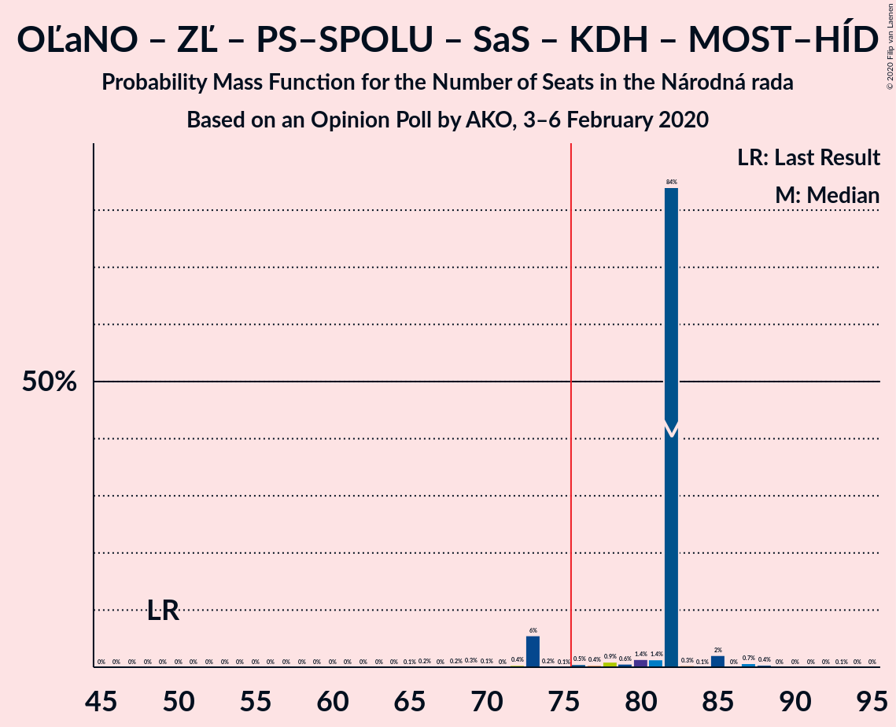

| Number of Seats | Probability | Accumulated | Special Marks |
|:---------------:|:-----------:|:-----------:|:-------------:|
| 49 | 0% | 100% | Last Result |
| 50 | 0% | 100% |  |
| 51 | 0% | 100% |  |
| 52 | 0% | 100% |  |
| 53 | 0% | 100% |  |
| 54 | 0% | 100% |  |
| 55 | 0% | 100% |  |
| 56 | 0% | 100% |  |
| 57 | 0% | 100% |  |
| 58 | 0% | 100% |  |
| 59 | 0% | 100% |  |
| 60 | 0% | 100% |  |
| 61 | 0% | 100% |  |
| 62 | 0% | 100% |  |
| 63 | 0% | 100% |  |
| 64 | 0% | 100% |  |
| 65 | 0.1% | 100% |  |
| 66 | 0.2% | 99.9% |  |
| 67 | 0% | 99.7% |  |
| 68 | 0.2% | 99.7% |  |
| 69 | 0.3% | 99.5% |  |
| 70 | 0.1% | 99.3% |  |
| 71 | 0% | 99.1% |  |
| 72 | 0.4% | 99.1% |  |
| 73 | 6% | 98.7% |  |
| 74 | 0.2% | 93% |  |
| 75 | 0.1% | 93% |  |
| 76 | 0.5% | 93% | Majority |
| 77 | 0.4% | 92% |  |
| 78 | 0.9% | 92% |  |
| 79 | 0.6% | 91% |  |
| 80 | 1.4% | 90% |  |
| 81 | 1.4% | 89% |  |
| 82 | 84% | 88% | Median |
| 83 | 0.3% | 4% |  |
| 84 | 0.1% | 3% |  |
| 85 | 2% | 3% |  |
| 86 | 0% | 1.3% |  |
| 87 | 0.7% | 1.2% |  |
| 88 | 0.4% | 0.5% |  |
| 89 | 0% | 0.1% |  |
| 90 | 0% | 0.1% |  |
| 91 | 0% | 0.1% |  |
| 92 | 0% | 0.1% |  |
| 93 | 0.1% | 0.1% |  |
| 94 | 0% | 0% |  |

### OBYČAJNÍ ĽUDIA a nezávislé osobnosti – Za ľudí – Progresívne Slovensko–SPOLU–Občianska Demokracia – Sloboda a Solidarita – Kresťanskodemokratické hnutie – Strana maďarskej koalície–Magyar Koalíció Pártja

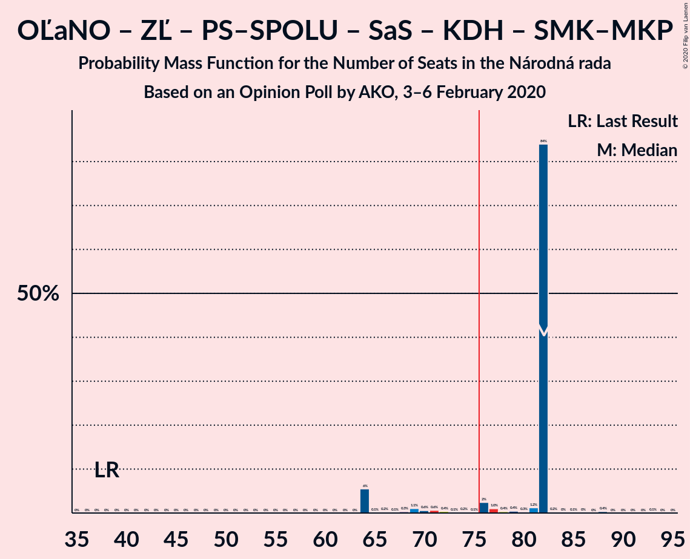

| Number of Seats | Probability | Accumulated | Special Marks |
|:---------------:|:-----------:|:-----------:|:-------------:|
| 38 | 0% | 100% | Last Result |
| 39 | 0% | 100% |  |
| 40 | 0% | 100% |  |
| 41 | 0% | 100% |  |
| 42 | 0% | 100% |  |
| 43 | 0% | 100% |  |
| 44 | 0% | 100% |  |
| 45 | 0% | 100% |  |
| 46 | 0% | 100% |  |
| 47 | 0% | 100% |  |
| 48 | 0% | 100% |  |
| 49 | 0% | 100% |  |
| 50 | 0% | 100% |  |
| 51 | 0% | 100% |  |
| 52 | 0% | 100% |  |
| 53 | 0% | 100% |  |
| 54 | 0% | 100% |  |
| 55 | 0% | 100% |  |
| 56 | 0% | 100% |  |
| 57 | 0% | 100% |  |
| 58 | 0% | 100% |  |
| 59 | 0% | 100% |  |
| 60 | 0% | 100% |  |
| 61 | 0% | 100% |  |
| 62 | 0% | 100% |  |
| 63 | 0% | 99.9% |  |
| 64 | 6% | 99.9% |  |
| 65 | 0.1% | 94% |  |
| 66 | 0.2% | 94% |  |
| 67 | 0.1% | 94% |  |
| 68 | 0.3% | 94% |  |
| 69 | 1.1% | 94% |  |
| 70 | 0.6% | 93% |  |
| 71 | 0.6% | 92% |  |
| 72 | 0.4% | 91% |  |
| 73 | 0.1% | 91% |  |
| 74 | 0.2% | 91% |  |
| 75 | 0.1% | 91% |  |
| 76 | 2% | 91% | Majority |
| 77 | 1.0% | 88% |  |
| 78 | 0.4% | 87% |  |
| 79 | 0.4% | 87% |  |
| 80 | 0.3% | 86% |  |
| 81 | 1.2% | 86% |  |
| 82 | 84% | 85% | Median |
| 83 | 0.2% | 0.8% |  |
| 84 | 0% | 0.6% |  |
| 85 | 0.1% | 0.6% |  |
| 86 | 0% | 0.5% |  |
| 87 | 0% | 0.5% |  |
| 88 | 0.4% | 0.4% |  |
| 89 | 0% | 0.1% |  |
| 90 | 0% | 0.1% |  |
| 91 | 0% | 0.1% |  |
| 92 | 0% | 0.1% |  |
| 93 | 0.1% | 0.1% |  |
| 94 | 0% | 0% |  |

### OBYČAJNÍ ĽUDIA a nezávislé osobnosti – Za ľudí – Progresívne Slovensko–SPOLU–Občianska Demokracia – Sloboda a Solidarita – Kresťanskodemokratické hnutie

| Number of Seats | Probability | Accumulated | Special Marks |
|:---------------:|:-----------:|:-----------:|:-------------:|
| 38 | 0% | 100% | Last Result |
| 39 | 0% | 100% |  |
| 40 | 0% | 100% |  |
| 41 | 0% | 100% |  |
| 42 | 0% | 100% |  |
| 43 | 0% | 100% |  |
| 44 | 0% | 100% |  |
| 45 | 0% | 100% |  |
| 46 | 0% | 100% |  |
| 47 | 0% | 100% |  |
| 48 | 0% | 100% |  |
| 49 | 0% | 100% |  |
| 50 | 0% | 100% |  |
| 51 | 0% | 100% |  |
| 52 | 0% | 100% |  |
| 53 | 0% | 100% |  |
| 54 | 0% | 100% |  |
| 55 | 0% | 100% |  |
| 56 | 0% | 100% |  |
| 57 | 0% | 100% |  |
| 58 | 0% | 100% |  |
| 59 | 0% | 100% |  |
| 60 | 0% | 100% |  |
| 61 | 0% | 100% |  |
| 62 | 0% | 100% |  |
| 63 | 0% | 99.9% |  |
| 64 | 6% | 99.9% |  |
| 65 | 0.1% | 94% |  |
| 66 | 0.2% | 94% |  |
| 67 | 0.1% | 94% |  |
| 68 | 0.3% | 94% |  |
| 69 | 1.1% | 94% |  |
| 70 | 0.6% | 93% |  |
| 71 | 0.6% | 92% |  |
| 72 | 0.4% | 91% |  |
| 73 | 0.1% | 91% |  |
| 74 | 0.2% | 91% |  |
| 75 | 0.1% | 91% |  |
| 76 | 2% | 91% | Majority |
| 77 | 1.0% | 88% |  |
| 78 | 0.4% | 87% |  |
| 79 | 0.4% | 87% |  |
| 80 | 0.3% | 86% |  |
| 81 | 1.2% | 86% |  |
| 82 | 84% | 85% | Median |
| 83 | 0.2% | 0.8% |  |
| 84 | 0% | 0.6% |  |
| 85 | 0.1% | 0.5% |  |
| 86 | 0% | 0.5% |  |
| 87 | 0% | 0.5% |  |
| 88 | 0.4% | 0.4% |  |
| 89 | 0% | 0.1% |  |
| 90 | 0% | 0.1% |  |
| 91 | 0% | 0.1% |  |
| 92 | 0% | 0.1% |  |
| 93 | 0.1% | 0.1% |  |
| 94 | 0% | 0% |  |

### OBYČAJNÍ ĽUDIA a nezávislé osobnosti – Za ľudí – Progresívne Slovensko–SPOLU–Občianska Demokracia – Sloboda a Solidarita

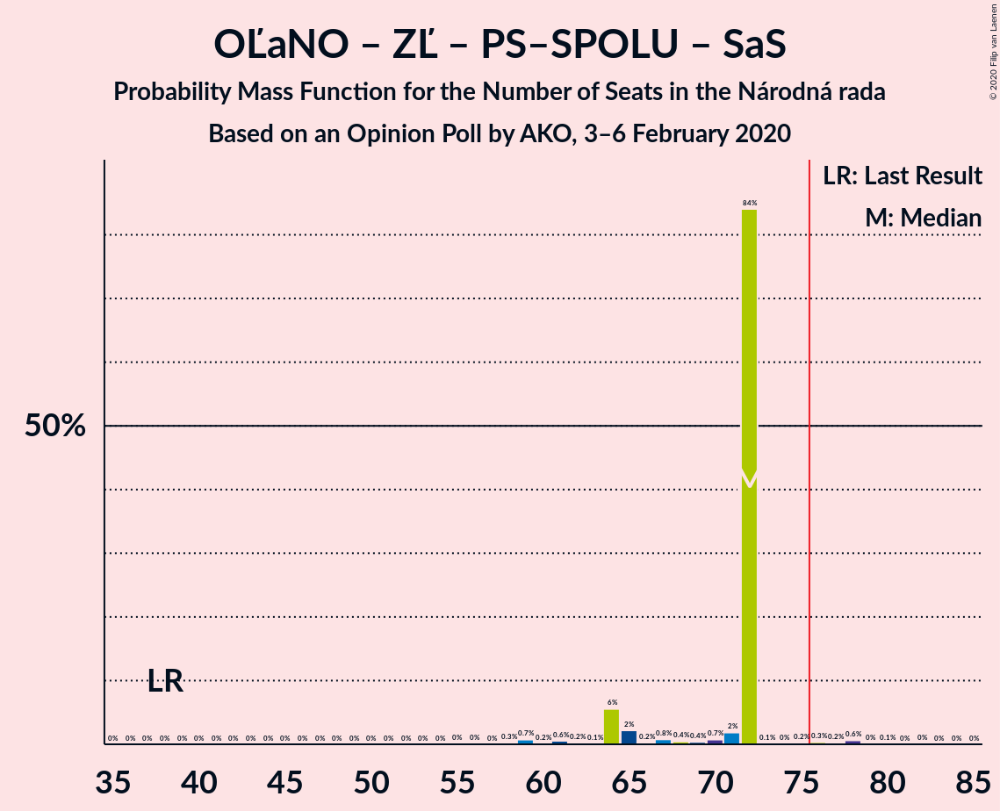

| Number of Seats | Probability | Accumulated | Special Marks |
|:---------------:|:-----------:|:-----------:|:-------------:|
| 38 | 0% | 100% | Last Result |
| 39 | 0% | 100% |  |
| 40 | 0% | 100% |  |
| 41 | 0% | 100% |  |
| 42 | 0% | 100% |  |
| 43 | 0% | 100% |  |
| 44 | 0% | 100% |  |
| 45 | 0% | 100% |  |
| 46 | 0% | 100% |  |
| 47 | 0% | 100% |  |
| 48 | 0% | 100% |  |
| 49 | 0% | 100% |  |
| 50 | 0% | 100% |  |
| 51 | 0% | 100% |  |
| 52 | 0% | 100% |  |
| 53 | 0% | 100% |  |
| 54 | 0% | 100% |  |
| 55 | 0% | 100% |  |
| 56 | 0% | 100% |  |
| 57 | 0% | 99.9% |  |
| 58 | 0.3% | 99.9% |  |
| 59 | 0.7% | 99.6% |  |
| 60 | 0.2% | 98.9% |  |
| 61 | 0.6% | 98.7% |  |
| 62 | 0.2% | 98% |  |
| 63 | 0.1% | 98% |  |
| 64 | 6% | 98% |  |
| 65 | 2% | 92% |  |
| 66 | 0.2% | 90% |  |
| 67 | 0.8% | 90% |  |
| 68 | 0.4% | 89% |  |
| 69 | 0.4% | 89% |  |
| 70 | 0.7% | 88% |  |
| 71 | 2% | 88% |  |
| 72 | 84% | 86% | Median |
| 73 | 0.1% | 2% |  |
| 74 | 0% | 2% |  |
| 75 | 0.2% | 2% |  |
| 76 | 0.3% | 1.3% | Majority |
| 77 | 0.2% | 1.0% |  |
| 78 | 0.6% | 0.8% |  |
| 79 | 0% | 0.2% |  |
| 80 | 0.1% | 0.1% |  |
| 81 | 0% | 0.1% |  |
| 82 | 0% | 0.1% |  |
| 83 | 0% | 0% |  |

### SMER–sociálna demokracia – Kotleba–Ľudová strana Naše Slovensko – SME RODINA – Slovenská národná strana

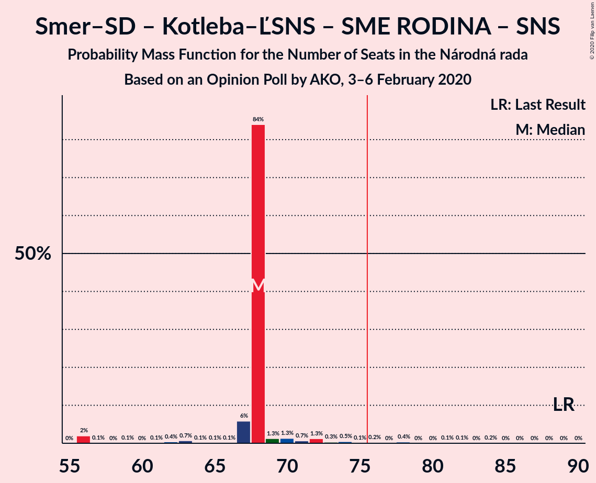

| Number of Seats | Probability | Accumulated | Special Marks |
|:---------------:|:-----------:|:-----------:|:-------------:|
| 56 | 2% | 100% |  |
| 57 | 0.1% | 98% |  |
| 58 | 0% | 98% |  |
| 59 | 0.1% | 98% |  |
| 60 | 0% | 98% |  |
| 61 | 0.1% | 98% |  |
| 62 | 0.4% | 98% |  |
| 63 | 0.7% | 97% |  |
| 64 | 0.1% | 97% |  |
| 65 | 0.1% | 96% |  |
| 66 | 0.1% | 96% |  |
| 67 | 6% | 96% |  |
| 68 | 84% | 90% | Median |
| 69 | 1.3% | 6% |  |
| 70 | 1.3% | 5% |  |
| 71 | 0.7% | 4% |  |
| 72 | 1.3% | 3% |  |
| 73 | 0.3% | 2% |  |
| 74 | 0.5% | 2% |  |
| 75 | 0.1% | 1.1% |  |
| 76 | 0.2% | 1.0% | Majority |
| 77 | 0% | 0.8% |  |
| 78 | 0.4% | 0.8% |  |
| 79 | 0% | 0.4% |  |
| 80 | 0% | 0.4% |  |
| 81 | 0.1% | 0.4% |  |
| 82 | 0.1% | 0.3% |  |
| 83 | 0% | 0.2% |  |
| 84 | 0.2% | 0.2% |  |
| 85 | 0% | 0.1% |  |
| 86 | 0% | 0% |  |
| 87 | 0% | 0% |  |
| 88 | 0% | 0% |  |
| 89 | 0% | 0% | Last Result |

### Za ľudí – Progresívne Slovensko–SPOLU–Občianska Demokracia – Sloboda a Solidarita – Kresťanskodemokratické hnutie

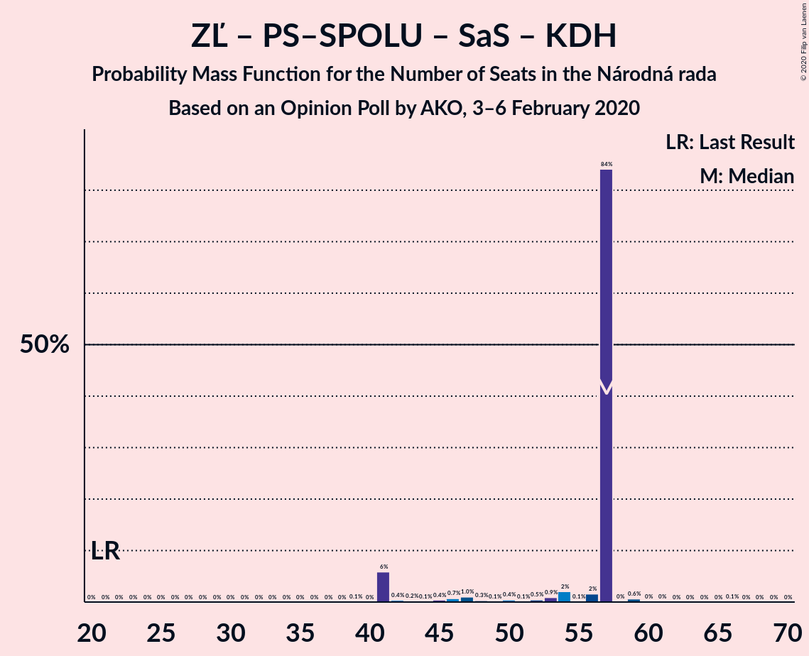

| Number of Seats | Probability | Accumulated | Special Marks |
|:---------------:|:-----------:|:-----------:|:-------------:|
| 21 | 0% | 100% | Last Result |
| 22 | 0% | 100% |  |
| 23 | 0% | 100% |  |
| 24 | 0% | 100% |  |
| 25 | 0% | 100% |  |
| 26 | 0% | 100% |  |
| 27 | 0% | 100% |  |
| 28 | 0% | 100% |  |
| 29 | 0% | 100% |  |
| 30 | 0% | 100% |  |
| 31 | 0% | 100% |  |
| 32 | 0% | 100% |  |
| 33 | 0% | 100% |  |
| 34 | 0% | 100% |  |
| 35 | 0% | 100% |  |
| 36 | 0% | 100% |  |
| 37 | 0% | 99.9% |  |
| 38 | 0% | 99.9% |  |
| 39 | 0.1% | 99.9% |  |
| 40 | 0% | 99.9% |  |
| 41 | 6% | 99.9% |  |
| 42 | 0.4% | 94% |  |
| 43 | 0.2% | 94% |  |
| 44 | 0.1% | 93% |  |
| 45 | 0.4% | 93% |  |
| 46 | 0.7% | 93% |  |
| 47 | 1.0% | 92% |  |
| 48 | 0.3% | 91% |  |
| 49 | 0.1% | 91% |  |
| 50 | 0.4% | 91% |  |
| 51 | 0.1% | 90% |  |
| 52 | 0.5% | 90% |  |
| 53 | 0.9% | 90% |  |
| 54 | 2% | 89% |  |
| 55 | 0.1% | 87% |  |
| 56 | 2% | 87% |  |
| 57 | 84% | 85% | Median |
| 58 | 0% | 0.8% |  |
| 59 | 0.6% | 0.8% |  |
| 60 | 0% | 0.1% |  |
| 61 | 0% | 0.1% |  |
| 62 | 0% | 0.1% |  |
| 63 | 0% | 0.1% |  |
| 64 | 0% | 0.1% |  |
| 65 | 0% | 0.1% |  |
| 66 | 0.1% | 0.1% |  |
| 67 | 0% | 0% |  |

### SMER–sociálna demokracia – SME RODINA – Slovenská národná strana

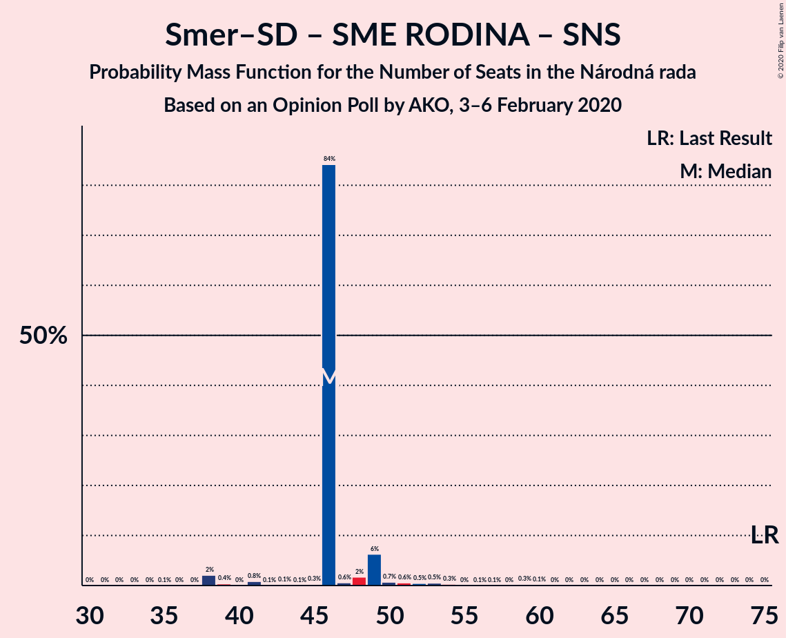

| Number of Seats | Probability | Accumulated | Special Marks |
|:---------------:|:-----------:|:-----------:|:-------------:|
| 35 | 0.1% | 100% |  |
| 36 | 0% | 99.9% |  |
| 37 | 0% | 99.9% |  |
| 38 | 2% | 99.9% |  |
| 39 | 0.4% | 98% |  |
| 40 | 0% | 97% |  |
| 41 | 0.8% | 97% |  |
| 42 | 0.1% | 97% |  |
| 43 | 0.1% | 96% |  |
| 44 | 0.1% | 96% |  |
| 45 | 0.3% | 96% |  |
| 46 | 84% | 96% | Median |
| 47 | 0.6% | 12% |  |
| 48 | 2% | 11% |  |
| 49 | 6% | 10% |  |
| 50 | 0.7% | 3% |  |
| 51 | 0.6% | 3% |  |
| 52 | 0.5% | 2% |  |
| 53 | 0.5% | 2% |  |
| 54 | 0.3% | 1.0% |  |
| 55 | 0% | 0.7% |  |
| 56 | 0.1% | 0.7% |  |
| 57 | 0.1% | 0.6% |  |
| 58 | 0% | 0.5% |  |
| 59 | 0.3% | 0.5% |  |
| 60 | 0.1% | 0.2% |  |
| 61 | 0% | 0.1% |  |
| 62 | 0% | 0.1% |  |
| 63 | 0% | 0% |  |
| 64 | 0% | 0% |  |
| 65 | 0% | 0% |  |
| 66 | 0% | 0% |  |
| 67 | 0% | 0% |  |
| 68 | 0% | 0% |  |
| 69 | 0% | 0% |  |
| 70 | 0% | 0% |  |
| 71 | 0% | 0% |  |
| 72 | 0% | 0% |  |
| 73 | 0% | 0% |  |
| 74 | 0% | 0% |  |
| 75 | 0% | 0% | Last Result |

### SMER–sociálna demokracia – Slovenská národná strana – MOST–HÍD

| Number of Seats | Probability | Accumulated | Special Marks |
|:---------------:|:-----------:|:-----------:|:-------------:|
| 27 | 0.4% | 100% |  |
| 28 | 0% | 99.6% |  |
| 29 | 0% | 99.6% |  |
| 30 | 0.1% | 99.6% |  |
| 31 | 0% | 99.5% |  |
| 32 | 0.1% | 99.4% |  |
| 33 | 0.1% | 99.4% |  |
| 34 | 84% | 99.2% | Median |
| 35 | 0.3% | 15% |  |
| 36 | 0.5% | 15% |  |
| 37 | 2% | 14% |  |
| 38 | 0.8% | 12% |  |
| 39 | 0.4% | 11% |  |
| 40 | 0.5% | 11% |  |
| 41 | 0.1% | 10% |  |
| 42 | 0.6% | 10% |  |
| 43 | 0.2% | 10% |  |
| 44 | 0.1% | 10% |  |
| 45 | 0.4% | 9% |  |
| 46 | 0.3% | 9% |  |
| 47 | 0.3% | 9% |  |
| 48 | 8% | 8% |  |
| 49 | 0.7% | 0.8% |  |
| 50 | 0% | 0.2% |  |
| 51 | 0% | 0.1% |  |
| 52 | 0% | 0.1% |  |
| 53 | 0% | 0.1% |  |
| 54 | 0% | 0.1% |  |
| 55 | 0% | 0% |  |
| 56 | 0% | 0% |  |
| 57 | 0% | 0% |  |
| 58 | 0% | 0% |  |
| 59 | 0% | 0% |  |
| 60 | 0% | 0% |  |
| 61 | 0% | 0% |  |
| 62 | 0% | 0% |  |
| 63 | 0% | 0% |  |
| 64 | 0% | 0% |  |
| 65 | 0% | 0% |  |
| 66 | 0% | 0% |  |
| 67 | 0% | 0% |  |
| 68 | 0% | 0% |  |
| 69 | 0% | 0% |  |
| 70 | 0% | 0% |  |
| 71 | 0% | 0% |  |
| 72 | 0% | 0% |  |
| 73 | 0% | 0% |  |
| 74 | 0% | 0% |  |
| 75 | 0% | 0% | Last Result |

### Za ľudí – Progresívne Slovensko–SPOLU–Občianska Demokracia – Sloboda a Solidarita

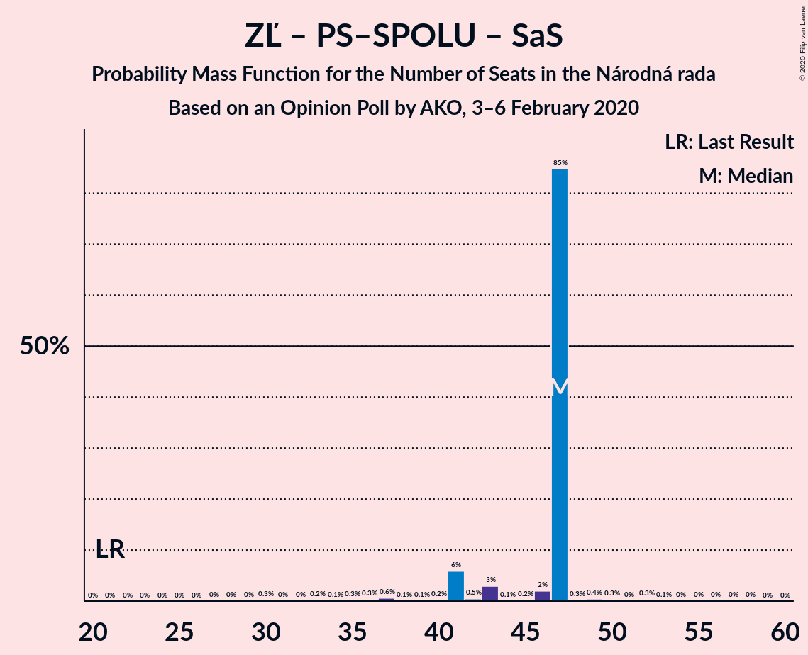

| Number of Seats | Probability | Accumulated | Special Marks |
|:---------------:|:-----------:|:-----------:|:-------------:|
| 21 | 0% | 100% | Last Result |
| 22 | 0% | 100% |  |
| 23 | 0% | 100% |  |
| 24 | 0% | 100% |  |
| 25 | 0% | 100% |  |
| 26 | 0% | 100% |  |
| 27 | 0% | 100% |  |
| 28 | 0% | 100% |  |
| 29 | 0% | 100% |  |
| 30 | 0.3% | 100% |  |
| 31 | 0% | 99.7% |  |
| 32 | 0% | 99.7% |  |
| 33 | 0.2% | 99.7% |  |
| 34 | 0.1% | 99.5% |  |
| 35 | 0.3% | 99.4% |  |
| 36 | 0.3% | 99.1% |  |
| 37 | 0.6% | 98.8% |  |
| 38 | 0.1% | 98% |  |
| 39 | 0.1% | 98% |  |
| 40 | 0.2% | 98% |  |
| 41 | 6% | 98% |  |
| 42 | 0.5% | 92% |  |
| 43 | 3% | 91% |  |
| 44 | 0.1% | 88% |  |
| 45 | 0.2% | 88% |  |
| 46 | 2% | 88% |  |
| 47 | 85% | 86% | Median |
| 48 | 0.3% | 1.5% |  |
| 49 | 0.4% | 1.2% |  |
| 50 | 0.3% | 0.8% |  |
| 51 | 0% | 0.5% |  |
| 52 | 0.3% | 0.4% |  |
| 53 | 0.1% | 0.2% |  |
| 54 | 0% | 0.1% |  |
| 55 | 0% | 0.1% |  |
| 56 | 0% | 0% |  |

### SMER–sociálna demokracia – SME RODINA

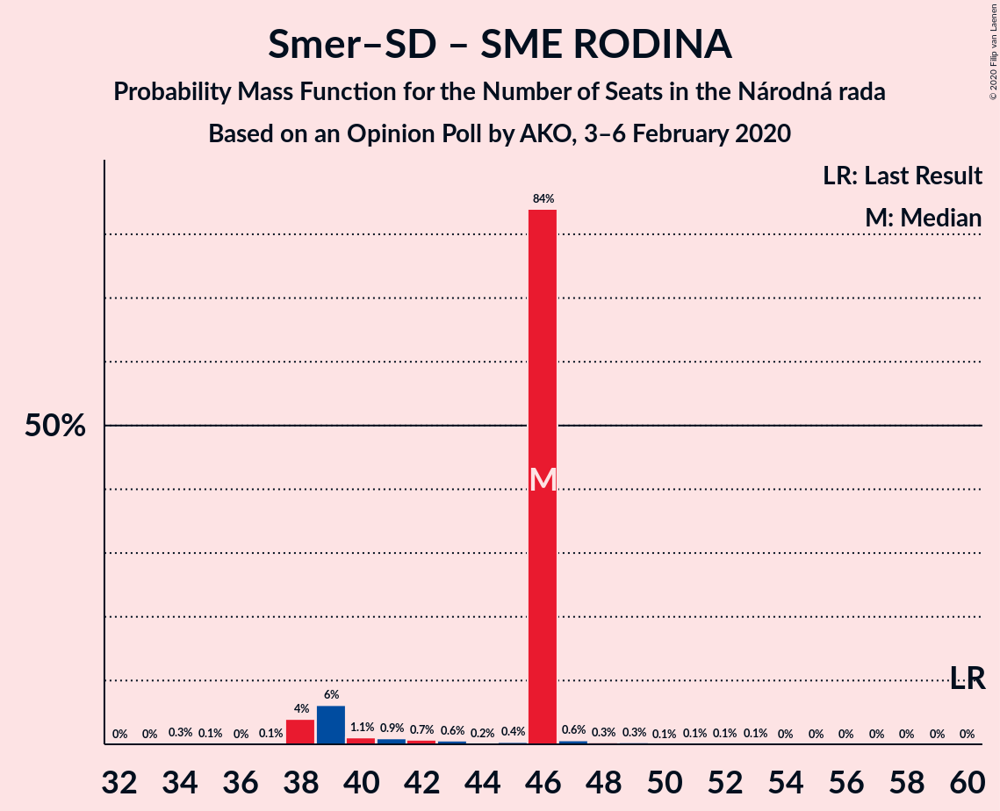

| Number of Seats | Probability | Accumulated | Special Marks |
|:---------------:|:-----------:|:-----------:|:-------------:|
| 33 | 0% | 100% |  |
| 34 | 0.3% | 99.9% |  |
| 35 | 0.1% | 99.7% |  |
| 36 | 0% | 99.6% |  |
| 37 | 0.1% | 99.6% |  |
| 38 | 4% | 99.4% |  |
| 39 | 6% | 95% |  |
| 40 | 1.1% | 89% |  |
| 41 | 0.9% | 88% |  |
| 42 | 0.7% | 87% |  |
| 43 | 0.6% | 87% |  |
| 44 | 0.2% | 86% |  |
| 45 | 0.4% | 86% |  |
| 46 | 84% | 86% | Median |
| 47 | 0.6% | 2% |  |
| 48 | 0.3% | 0.9% |  |
| 49 | 0.3% | 0.6% |  |
| 50 | 0.1% | 0.3% |  |
| 51 | 0.1% | 0.3% |  |
| 52 | 0.1% | 0.2% |  |
| 53 | 0.1% | 0.1% |  |
| 54 | 0% | 0% |  |
| 55 | 0% | 0% |  |
| 56 | 0% | 0% |  |
| 57 | 0% | 0% |  |
| 58 | 0% | 0% |  |
| 59 | 0% | 0% |  |
| 60 | 0% | 0% | Last Result |

### SMER–sociálna demokracia – Slovenská národná strana

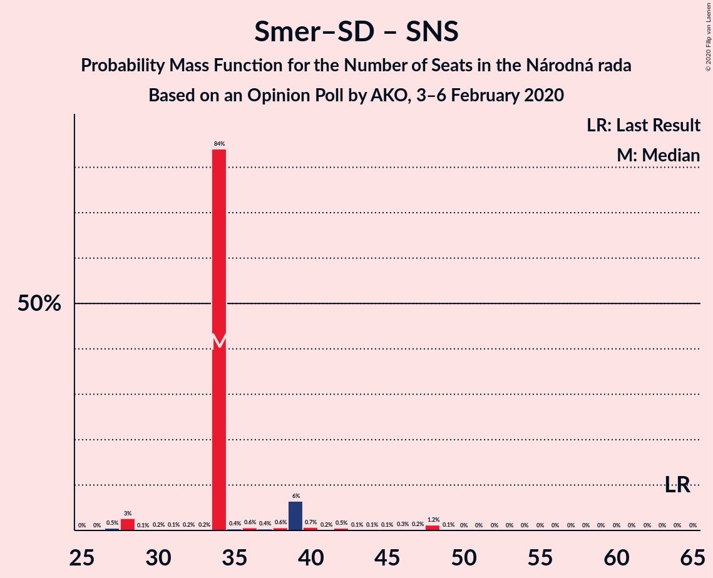

| Number of Seats | Probability | Accumulated | Special Marks |
|:---------------:|:-----------:|:-----------:|:-------------:|
| 27 | 0.5% | 100% |  |
| 28 | 3% | 99.5% |  |
| 29 | 0.1% | 97% |  |
| 30 | 0.2% | 97% |  |
| 31 | 0.1% | 97% |  |
| 32 | 0.2% | 96% |  |
| 33 | 0.2% | 96% |  |
| 34 | 84% | 96% | Median |
| 35 | 0.4% | 12% |  |
| 36 | 0.6% | 12% |  |
| 37 | 0.4% | 11% |  |
| 38 | 0.6% | 11% |  |
| 39 | 6% | 10% |  |
| 40 | 0.7% | 4% |  |
| 41 | 0.2% | 3% |  |
| 42 | 0.5% | 3% |  |
| 43 | 0.1% | 2% |  |
| 44 | 0.1% | 2% |  |
| 45 | 0.1% | 2% |  |
| 46 | 0.3% | 2% |  |
| 47 | 0.2% | 2% |  |
| 48 | 1.2% | 1.4% |  |
| 49 | 0.1% | 0.2% |  |
| 50 | 0% | 0% |  |
| 51 | 0% | 0% |  |
| 52 | 0% | 0% |  |
| 53 | 0% | 0% |  |
| 54 | 0% | 0% |  |
| 55 | 0% | 0% |  |
| 56 | 0% | 0% |  |
| 57 | 0% | 0% |  |
| 58 | 0% | 0% |  |
| 59 | 0% | 0% |  |
| 60 | 0% | 0% |  |
| 61 | 0% | 0% |  |
| 62 | 0% | 0% |  |
| 63 | 0% | 0% |  |
| 64 | 0% | 0% | Last Result |

### SMER–sociálna demokracia

| Number of Seats | Probability | Accumulated | Special Marks |
|:---------------:|:-----------:|:-----------:|:-------------:|
| 25 | 0.1% | 100% |  |
| 26 | 0.8% | 99.9% |  |
| 27 | 0.6% | 99.2% |  |
| 28 | 3% | 98.6% |  |
| 29 | 6% | 96% |  |
| 30 | 1.0% | 89% |  |
| 31 | 0.5% | 88% |  |
| 32 | 0.5% | 88% |  |
| 33 | 0.2% | 87% |  |
| 34 | 84% | 87% | Median |
| 35 | 0.4% | 3% |  |
| 36 | 0.4% | 2% |  |
| 37 | 0.4% | 2% |  |
| 38 | 1.2% | 1.4% |  |
| 39 | 0.1% | 0.2% |  |
| 40 | 0% | 0.1% |  |
| 41 | 0% | 0% |  |
| 42 | 0% | 0% |  |
| 43 | 0% | 0% |  |
| 44 | 0% | 0% |  |
| 45 | 0% | 0% |  |
| 46 | 0% | 0% |  |
| 47 | 0% | 0% |  |
| 48 | 0% | 0% |  |
| 49 | 0% | 0% | Last Result |

## Technical Information

### Opinion Poll

+ **Polling firm:** AKO
+ **Commissioner(s):** —
+ **Fieldwork period:** 3–6 February 2020

### Calculations

+ **Sample size:** 1000
+ **Simulations done:** 1,048,576
+ **Error estimate:** 1.63%

