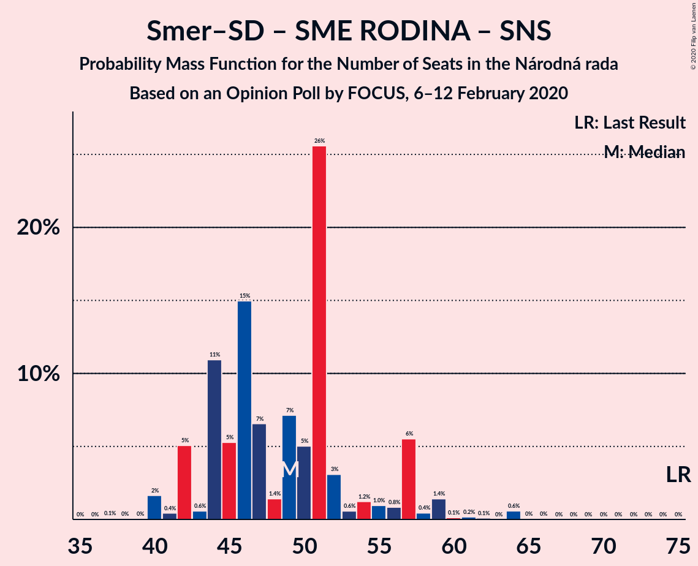

# Opinion Poll by FOCUS, 6–12 February 2020

<a href="#voting-intentions">Voting Intentions</a> | <a href="#seats">Seats</a> | <a href="#coalitions">Coalitions</a> | <a href="#technical-information">Technical Information</a>

## Voting Intentions

### Confidence Intervals

| Party | Last Result | Poll Result | 80% Confidence Interval | 90% Confidence Interval | 95% Confidence Interval | 99% Confidence Interval |
|:-----:|:-----------:|:-----------:|:-----------------------:|:-----------------------:|:-----------------------:|:-----------------------:|
| SMER–sociálna demokracia | 28.3% | 17.0% | 15.6–18.6% |15.2–19.1% |14.8–19.5% |14.1–20.3% |
| OBYČAJNÍ ĽUDIA a nezávislé osobnosti | 11.0% | 13.3% | 12.0–14.8% |11.7–15.2% |11.4–15.6% |10.8–16.3% |
| Kotleba–Ľudová strana Naše Slovensko | 8.0% | 12.2% | 11.0–13.7% |10.7–14.1% |10.3–14.4% |9.8–15.1% |
| Progresívne Slovensko–SPOLU–Občianska Demokracia | 0.0% | 9.3% | 8.2–10.5% |7.9–10.9% |7.6–11.2% |7.1–11.9% |
| Za ľudí | 0.0% | 8.2% | 7.1–9.4% |6.9–9.7% |6.6–10.0% |6.2–10.6% |
| SME RODINA | 6.6% | 7.8% | 6.8–9.0% |6.5–9.3% |6.3–9.6% |5.8–10.2% |
| Kresťanskodemokratické hnutie | 4.9% | 5.4% | 4.6–6.4% |4.3–6.7% |4.1–7.0% |3.8–7.5% |
| Sloboda a Solidarita | 12.1% | 5.3% | 4.5–6.3% |4.2–6.6% |4.1–6.8% |3.7–7.4% |
| Slovenská národná strana | 8.6% | 4.4% | 3.6–5.3% |3.4–5.6% |3.3–5.8% |3.0–6.3% |
| MOST–HÍD | 6.5% | 4.2% | 3.5–5.1% |3.3–5.4% |3.1–5.6% |2.8–6.1% |
| Dobrá voľba | 0.0% | 4.0% | 3.3–4.9% |3.1–5.2% |2.9–5.4% |2.6–5.9% |
| Strana maďarskej koalície–Magyar Koalíció Pártja | 4.0% | 3.9% | 3.2–4.8% |3.0–5.0% |2.9–5.3% |2.6–5.7% |
| VLASŤ | 0.0% | 3.2% | 2.6–4.0% |2.4–4.3% |2.3–4.5% |2.0–4.9% |

*Note:* The poll result column reflects the actual value used in the calculations. Published results may vary slightly, and in addition be rounded to fewer digits.

## Seats

### Confidence Intervals

| Party | Last Result | Median | 80% Confidence Interval | 90% Confidence Interval | 95% Confidence Interval | 99% Confidence Interval |
|:-----:|:-----------:|:------:|:-----------------------:|:-----------------------:|:-----------------------:|:-----------------------:|
| <a href="#smer–sociálna-demokracia">SMER–sociálna demokracia</a> | 49 | 32 | 28–36 |28–38 |28–38 |26–39 |
| <a href="#obyčajní-ľudia-a-nezávislé-osobnosti">OBYČAJNÍ ĽUDIA a nezávislé osobnosti</a> | 17 | 25 | 23–27 |22–29 |21–29 |20–32 |
| <a href="#kotleba–ľudová-strana-naše-slovensko">Kotleba–Ľudová strana Naše Slovensko</a> | 14 | 23 | 20–26 |20–27 |20–29 |18–30 |
| <a href="#progresívne-slovensko–spolu–občianska-demokracia">Progresívne Slovensko–SPOLU–Občianska Demokracia</a> | 0 | 18 | 15–22 |15–22 |15–22 |13–24 |
| <a href="#za-ľudí">Za ľudí</a> | 0 | 16 | 14–20 |13–20 |12–20 |11–21 |
| <a href="#sme-rodina">SME RODINA</a> | 11 | 15 | 12–18 |12–19 |11–20 |10–20 |
| <a href="#kresťanskodemokratické-hnutie">Kresťanskodemokratické hnutie</a> | 0 | 10 | 0–12 |0–13 |0–14 |0–15 |
| <a href="#sloboda-a-solidarita">Sloboda a Solidarita</a> | 21 | 10 | 0–12 |0–13 |0–14 |0–14 |
| <a href="#slovenská-národná-strana">Slovenská národná strana</a> | 15 | 0 | 0–9 |0–10 |0–10 |0–11 |
| <a href="#most–híd">MOST–HÍD</a> | 11 | 0 | 0 |0–10 |0–10 |0–11 |
| <a href="#dobrá-voľba">Dobrá voľba</a> | 0 | 0 | 0–9 |0–10 |0–10 |0–11 |
| <a href="#strana-maďarskej-koalície–magyar-koalíció-pártja">Strana maďarskej koalície–Magyar Koalíció Pártja</a> | 0 | 0 | 0 |0 |0–9 |0–10 |
| <a href="#vlasť">VLASŤ</a> | 0 | 0 | 0 |0 |0 |0 |

### SMER–sociálna demokracia

*For a full overview of the results for this party, see the [SMER–sociálna demokracia](party-smer–sociálnademokracia.html) page.*

| Number of Seats | Probability | Accumulated | Special Marks |
|:---------------:|:-----------:|:-----------:|:-------------:|
| 24 | 0.1% | 100% |  |
| 25 | 0.2% | 99.9% |  |
| 26 | 0.3% | 99.8% |  |
| 27 | 1.0% | 99.5% |  |
| 28 | 11% | 98% |  |
| 29 | 3% | 88% |  |
| 30 | 5% | 85% |  |
| 31 | 12% | 80% |  |
| 32 | 19% | 68% | Median |
| 33 | 29% | 49% |  |
| 34 | 2% | 21% |  |
| 35 | 6% | 18% |  |
| 36 | 3% | 13% |  |
| 37 | 4% | 9% |  |
| 38 | 3% | 5% |  |
| 39 | 2% | 2% |  |
| 40 | 0.2% | 0.4% |  |
| 41 | 0.1% | 0.2% |  |
| 42 | 0.1% | 0.1% |  |
| 43 | 0% | 0% |  |
| 44 | 0% | 0% |  |
| 45 | 0% | 0% |  |
| 46 | 0% | 0% |  |
| 47 | 0% | 0% |  |
| 48 | 0% | 0% |  |
| 49 | 0% | 0% | Last Result |

### OBYČAJNÍ ĽUDIA a nezávislé osobnosti

*For a full overview of the results for this party, see the [OBYČAJNÍ ĽUDIA a nezávislé osobnosti](party-obyčajníľudiaanezávisléosobnosti.html) page.*

| Number of Seats | Probability | Accumulated | Special Marks |
|:---------------:|:-----------:|:-----------:|:-------------:|
| 17 | 0% | 100% | Last Result |
| 18 | 0% | 100% |  |
| 19 | 0.1% | 100% |  |
| 20 | 2% | 99.9% |  |
| 21 | 3% | 98% |  |
| 22 | 0.9% | 95% |  |
| 23 | 11% | 94% |  |
| 24 | 8% | 83% |  |
| 25 | 26% | 75% | Median |
| 26 | 11% | 49% |  |
| 27 | 28% | 37% |  |
| 28 | 4% | 9% |  |
| 29 | 4% | 5% |  |
| 30 | 0.6% | 2% |  |
| 31 | 0.4% | 1.2% |  |
| 32 | 0.4% | 0.7% |  |
| 33 | 0.2% | 0.4% |  |
| 34 | 0% | 0.2% |  |
| 35 | 0.1% | 0.2% |  |
| 36 | 0% | 0.1% |  |
| 37 | 0% | 0% |  |

### Kotleba–Ľudová strana Naše Slovensko

*For a full overview of the results for this party, see the [Kotleba–Ľudová strana Naše Slovensko](party-kotleba–ľudovástrananašeslovensko.html) page.*

| Number of Seats | Probability | Accumulated | Special Marks |
|:---------------:|:-----------:|:-----------:|:-------------:|
| 14 | 0% | 100% | Last Result |
| 15 | 0% | 100% |  |
| 16 | 0% | 100% |  |
| 17 | 0.1% | 99.9% |  |
| 18 | 0.5% | 99.8% |  |
| 19 | 1.1% | 99.3% |  |
| 20 | 13% | 98% |  |
| 21 | 18% | 85% |  |
| 22 | 15% | 67% |  |
| 23 | 4% | 52% | Median |
| 24 | 14% | 48% |  |
| 25 | 21% | 34% |  |
| 26 | 3% | 13% |  |
| 27 | 6% | 10% |  |
| 28 | 0.7% | 4% |  |
| 29 | 2% | 3% |  |
| 30 | 0.3% | 0.7% |  |
| 31 | 0% | 0.4% |  |
| 32 | 0.3% | 0.4% |  |
| 33 | 0.1% | 0.1% |  |
| 34 | 0% | 0% |  |

### Progresívne Slovensko–SPOLU–Občianska Demokracia

*For a full overview of the results for this party, see the [Progresívne Slovensko–SPOLU–Občianska Demokracia](party-progresívneslovensko–spolu–občianskademokracia.html) page.*

| Number of Seats | Probability | Accumulated | Special Marks |
|:---------------:|:-----------:|:-----------:|:-------------:|
| 0 | 0% | 100% | Last Result |
| 1 | 0% | 100% |  |
| 2 | 0% | 100% |  |
| 3 | 0% | 100% |  |
| 4 | 0% | 100% |  |
| 5 | 0% | 100% |  |
| 6 | 0% | 100% |  |
| 7 | 0% | 100% |  |
| 8 | 0% | 100% |  |
| 9 | 0% | 100% |  |
| 10 | 0% | 100% |  |
| 11 | 0.1% | 100% |  |
| 12 | 0.1% | 99.9% |  |
| 13 | 0.5% | 99.8% |  |
| 14 | 1.3% | 99.3% |  |
| 15 | 11% | 98% |  |
| 16 | 12% | 87% |  |
| 17 | 17% | 75% |  |
| 18 | 15% | 58% | Median |
| 19 | 20% | 43% |  |
| 20 | 8% | 22% |  |
| 21 | 4% | 15% |  |
| 22 | 8% | 10% |  |
| 23 | 1.0% | 2% |  |
| 24 | 0.9% | 0.9% |  |
| 25 | 0% | 0% |  |

### Za ľudí

*For a full overview of the results for this party, see the [Za ľudí](party-zaľudí.html) page.*

| Number of Seats | Probability | Accumulated | Special Marks |
|:---------------:|:-----------:|:-----------:|:-------------:|
| 0 | 0% | 100% | Last Result |
| 1 | 0% | 100% |  |
| 2 | 0% | 100% |  |
| 3 | 0% | 100% |  |
| 4 | 0% | 100% |  |
| 5 | 0% | 100% |  |
| 6 | 0% | 100% |  |
| 7 | 0% | 100% |  |
| 8 | 0% | 100% |  |
| 9 | 0% | 100% |  |
| 10 | 0.1% | 100% |  |
| 11 | 0.7% | 99.9% |  |
| 12 | 4% | 99.3% |  |
| 13 | 4% | 96% |  |
| 14 | 14% | 92% |  |
| 15 | 17% | 78% |  |
| 16 | 12% | 61% | Median |
| 17 | 16% | 49% |  |
| 18 | 5% | 33% |  |
| 19 | 2% | 28% |  |
| 20 | 25% | 26% |  |
| 21 | 0.6% | 0.7% |  |
| 22 | 0.1% | 0.1% |  |
| 23 | 0% | 0% |  |

### SME RODINA

*For a full overview of the results for this party, see the [SME RODINA](party-smerodina.html) page.*

| Number of Seats | Probability | Accumulated | Special Marks |
|:---------------:|:-----------:|:-----------:|:-------------:|
| 10 | 0.7% | 100% |  |
| 11 | 3% | 99.2% | Last Result |
| 12 | 6% | 96% |  |
| 13 | 9% | 90% |  |
| 14 | 28% | 81% |  |
| 15 | 10% | 53% | Median |
| 16 | 13% | 43% |  |
| 17 | 4% | 30% |  |
| 18 | 19% | 26% |  |
| 19 | 4% | 7% |  |
| 20 | 3% | 3% |  |
| 21 | 0% | 0.1% |  |
| 22 | 0% | 0.1% |  |
| 23 | 0% | 0% |  |

### Kresťanskodemokratické hnutie

*For a full overview of the results for this party, see the [Kresťanskodemokratické hnutie](party-kresťanskodemokratickéhnutie.html) page.*

| Number of Seats | Probability | Accumulated | Special Marks |
|:---------------:|:-----------:|:-----------:|:-------------:|
| 0 | 35% | 100% | Last Result |
| 1 | 0% | 65% |  |
| 2 | 0% | 65% |  |
| 3 | 0% | 65% |  |
| 4 | 0% | 65% |  |
| 5 | 0% | 65% |  |
| 6 | 0% | 65% |  |
| 7 | 0% | 65% |  |
| 8 | 0% | 65% |  |
| 9 | 3% | 65% |  |
| 10 | 16% | 62% | Median |
| 11 | 32% | 46% |  |
| 12 | 6% | 14% |  |
| 13 | 5% | 8% |  |
| 14 | 2% | 3% |  |
| 15 | 0.7% | 0.8% |  |
| 16 | 0.1% | 0.1% |  |
| 17 | 0% | 0% |  |

### Sloboda a Solidarita

*For a full overview of the results for this party, see the [Sloboda a Solidarita](party-slobodaasolidarita.html) page.*

| Number of Seats | Probability | Accumulated | Special Marks |
|:---------------:|:-----------:|:-----------:|:-------------:|
| 0 | 22% | 100% |  |
| 1 | 0% | 78% |  |
| 2 | 0% | 78% |  |
| 3 | 0% | 78% |  |
| 4 | 0% | 78% |  |
| 5 | 0% | 78% |  |
| 6 | 0% | 78% |  |
| 7 | 0% | 78% |  |
| 8 | 0% | 78% |  |
| 9 | 2% | 78% |  |
| 10 | 40% | 77% | Median |
| 11 | 18% | 37% |  |
| 12 | 14% | 19% |  |
| 13 | 0.6% | 5% |  |
| 14 | 4% | 5% |  |
| 15 | 0.1% | 0.2% |  |
| 16 | 0% | 0% |  |
| 17 | 0% | 0% |  |
| 18 | 0% | 0% |  |
| 19 | 0% | 0% |  |
| 20 | 0% | 0% |  |
| 21 | 0% | 0% | Last Result |

### Slovenská národná strana

*For a full overview of the results for this party, see the [Slovenská národná strana](party-slovenskánárodnástrana.html) page.*

| Number of Seats | Probability | Accumulated | Special Marks |
|:---------------:|:-----------:|:-----------:|:-------------:|
| 0 | 90% | 100% | Median |
| 1 | 0% | 10% |  |
| 2 | 0% | 10% |  |
| 3 | 0% | 10% |  |
| 4 | 0% | 10% |  |
| 5 | 0% | 10% |  |
| 6 | 0% | 10% |  |
| 7 | 0% | 10% |  |
| 8 | 0% | 10% |  |
| 9 | 1.1% | 10% |  |
| 10 | 7% | 9% |  |
| 11 | 1.3% | 2% |  |
| 12 | 0.2% | 0.4% |  |
| 13 | 0.1% | 0.2% |  |
| 14 | 0% | 0% |  |
| 15 | 0% | 0% | Last Result |

### MOST–HÍD

*For a full overview of the results for this party, see the [MOST–HÍD](party-most–híd.html) page.*

| Number of Seats | Probability | Accumulated | Special Marks |
|:---------------:|:-----------:|:-----------:|:-------------:|
| 0 | 91% | 100% | Median |
| 1 | 0% | 9% |  |
| 2 | 0% | 9% |  |
| 3 | 0% | 9% |  |
| 4 | 0% | 9% |  |
| 5 | 0% | 9% |  |
| 6 | 0% | 9% |  |
| 7 | 0% | 9% |  |
| 8 | 0% | 9% |  |
| 9 | 1.2% | 9% |  |
| 10 | 7% | 8% |  |
| 11 | 0.6% | 1.0% | Last Result |
| 12 | 0.2% | 0.4% |  |
| 13 | 0.2% | 0.2% |  |
| 14 | 0% | 0% |  |

### Dobrá voľba

*For a full overview of the results for this party, see the [Dobrá voľba](party-dobrávoľba.html) page.*

| Number of Seats | Probability | Accumulated | Special Marks |
|:---------------:|:-----------:|:-----------:|:-------------:|
| 0 | 89% | 100% | Last Result, Median |
| 1 | 0% | 11% |  |
| 2 | 0% | 11% |  |
| 3 | 0% | 11% |  |
| 4 | 0% | 11% |  |
| 5 | 0% | 11% |  |
| 6 | 0% | 11% |  |
| 7 | 0% | 11% |  |
| 8 | 0% | 11% |  |
| 9 | 2% | 10% |  |
| 10 | 6% | 8% |  |
| 11 | 2% | 2% |  |
| 12 | 0% | 0.1% |  |
| 13 | 0% | 0% |  |

### Strana maďarskej koalície–Magyar Koalíció Pártja

*For a full overview of the results for this party, see the [Strana maďarskej koalície–Magyar Koalíció Pártja](party-stranamaďarskejkoalície–magyarkoalíciópártja.html) page.*

| Number of Seats | Probability | Accumulated | Special Marks |
|:---------------:|:-----------:|:-----------:|:-------------:|
| 0 | 97% | 100% | Last Result, Median |
| 1 | 0% | 3% |  |
| 2 | 0% | 3% |  |
| 3 | 0% | 3% |  |
| 4 | 0% | 3% |  |
| 5 | 0% | 3% |  |
| 6 | 0% | 3% |  |
| 7 | 0% | 3% |  |
| 8 | 0% | 3% |  |
| 9 | 2% | 3% |  |
| 10 | 1.1% | 1.5% |  |
| 11 | 0.3% | 0.3% |  |
| 12 | 0% | 0% |  |

### VLASŤ

*For a full overview of the results for this party, see the [VLASŤ](party-vlasť.html) page.*

| Number of Seats | Probability | Accumulated | Special Marks |
|:---------------:|:-----------:|:-----------:|:-------------:|
| 0 | 99.7% | 100% | Last Result, Median |
| 1 | 0% | 0.3% |  |
| 2 | 0% | 0.3% |  |
| 3 | 0% | 0.3% |  |
| 4 | 0% | 0.3% |  |
| 5 | 0% | 0.3% |  |
| 6 | 0% | 0.3% |  |
| 7 | 0% | 0.3% |  |
| 8 | 0% | 0.3% |  |
| 9 | 0.1% | 0.3% |  |
| 10 | 0.1% | 0.2% |  |
| 11 | 0.1% | 0.1% |  |
| 12 | 0% | 0% |  |

## Coalitions

### Confidence Intervals

| Coalition | Last Result | Median | Majority? | 80% Confidence Interval | 90% Confidence Interval | 95% Confidence Interval | 99% Confidence Interval |
|:---------:|:-----------:|:------:|:---------:|:-----------------------:|:-----------------------:|:-----------------------:|:-----------------------:|
| OBYČAJNÍ ĽUDIA a nezávislé osobnosti – Progresívne Slovensko–SPOLU–Občianska Demokracia – Za ľudí – SME RODINA – Kresťanskodemokratické hnutie – Sloboda a Solidarita – MOST–HÍD – Strana maďarskej koalície–Magyar Koalíció Pártja | 60 | 92 | 98% | 85–100 | 83–102 | 78–102 | 75–102 |
| OBYČAJNÍ ĽUDIA a nezávislé osobnosti – Progresívne Slovensko–SPOLU–Občianska Demokracia – Za ľudí – SME RODINA – Kresťanskodemokratické hnutie – Sloboda a Solidarita – MOST–HÍD | 60 | 92 | 98% | 85–99 | 82–102 | 77–102 | 75–102 |
| OBYČAJNÍ ĽUDIA a nezávislé osobnosti – Progresívne Slovensko–SPOLU–Občianska Demokracia – Za ľudí – SME RODINA – Kresťanskodemokratické hnutie – Sloboda a Solidarita – Strana maďarskej koalície–Magyar Koalíció Pártja | 49 | 92 | 98% | 84–99 | 81–102 | 77–102 | 75–102 |
| OBYČAJNÍ ĽUDIA a nezávislé osobnosti – Progresívne Slovensko–SPOLU–Občianska Demokracia – Za ľudí – SME RODINA – Kresťanskodemokratické hnutie – Sloboda a Solidarita | 49 | 92 | 97% | 84–99 | 80–102 | 75–102 | 75–102 |
| OBYČAJNÍ ĽUDIA a nezávislé osobnosti – Progresívne Slovensko–SPOLU–Občianska Demokracia – Za ľudí – Kresťanskodemokratické hnutie – Sloboda a Solidarita – MOST–HÍD – Strana maďarskej koalície–Magyar Koalíció Pártja | 49 | 77 | 53% | 70–86 | 68–86 | 61–86 | 59–88 |
| OBYČAJNÍ ĽUDIA a nezávislé osobnosti – Progresívne Slovensko–SPOLU–Občianska Demokracia – Za ľudí – Kresťanskodemokratické hnutie – Sloboda a Solidarita – MOST–HÍD | 49 | 77 | 52% | 70–86 | 67–86 | 61–86 | 59–87 |
| OBYČAJNÍ ĽUDIA a nezávislé osobnosti – Progresívne Slovensko–SPOLU–Občianska Demokracia – Za ľudí – Kresťanskodemokratické hnutie – Sloboda a Solidarita – Strana maďarskej koalície–Magyar Koalíció Pártja | 38 | 75 | 47% | 70–86 | 65–86 | 61–86 | 59–88 |
| OBYČAJNÍ ĽUDIA a nezávislé osobnosti – Progresívne Slovensko–SPOLU–Občianska Demokracia – Za ľudí – Kresťanskodemokratické hnutie – Sloboda a Solidarita | 38 | 74 | 46% | 70–86 | 64–86 | 61–86 | 59–86 |
| SMER–sociálna demokracia – Kotleba–Ľudová strana Naše Slovensko – SME RODINA – Slovenská národná strana | 89 | 71 | 37% | 64–79 | 64–80 | 64–81 | 62–91 |
| OBYČAJNÍ ĽUDIA a nezávislé osobnosti – Progresívne Slovensko–SPOLU–Občianska Demokracia – Za ľudí – Sloboda a Solidarita | 38 | 69 | 1.1% | 60–75 | 59–75 | 58–75 | 54–77 |
| Progresívne Slovensko–SPOLU–Občianska Demokracia – Za ľudí – Kresťanskodemokratické hnutie – Sloboda a Solidarita | 21 | 49 | 0% | 44–59 | 37–59 | 35–61 | 31–61 |
| SMER–sociálna demokracia – SME RODINA – Slovenská národná strana | 75 | 49 | 0% | 44–55 | 42–57 | 42–58 | 40–64 |
| SMER–sociálna demokracia – SME RODINA | 60 | 47 | 0% | 44–51 | 42–52 | 40–54 | 37–59 |
| Progresívne Slovensko–SPOLU–Občianska Demokracia – Za ľudí – Sloboda a Solidarita | 21 | 44 | 0% | 34–49 | 34–49 | 32–50 | 29–50 |
| SMER–sociálna demokracia – Slovenská národná strana – MOST–HÍD | 75 | 33 | 0% | 28–43 | 28–45 | 28–45 | 28–49 |
| SMER–sociálna demokracia – Slovenská národná strana | 64 | 33 | 0% | 28–39 | 28–43 | 28–43 | 27–48 |
| SMER–sociálna demokracia | 49 | 32 | 0% | 28–36 | 28–38 | 28–38 | 26–39 |

### OBYČAJNÍ ĽUDIA a nezávislé osobnosti – Progresívne Slovensko–SPOLU–Občianska Demokracia – Za ľudí – SME RODINA – Kresťanskodemokratické hnutie – Sloboda a Solidarita – MOST–HÍD – Strana maďarskej koalície–Magyar Koalíció Pártja

| Number of Seats | Probability | Accumulated | Special Marks |
|:---------------:|:-----------:|:-----------:|:-------------:|
| 60 | 0% | 100% | Last Result |
| 61 | 0% | 100% |  |
| 62 | 0% | 100% |  |
| 63 | 0% | 100% |  |
| 64 | 0% | 100% |  |
| 65 | 0% | 100% |  |
| 66 | 0% | 100% |  |
| 67 | 0% | 100% |  |
| 68 | 0% | 100% |  |
| 69 | 0% | 100% |  |
| 70 | 0% | 100% |  |
| 71 | 0% | 100% |  |
| 72 | 0% | 100% |  |
| 73 | 0% | 100% |  |
| 74 | 0% | 99.9% |  |
| 75 | 2% | 99.9% |  |
| 76 | 0.1% | 98% | Majority |
| 77 | 0.1% | 98% |  |
| 78 | 0.2% | 98% |  |
| 79 | 0.3% | 97% |  |
| 80 | 0.3% | 97% |  |
| 81 | 1.1% | 97% |  |
| 82 | 0.2% | 96% |  |
| 83 | 0.9% | 96% |  |
| 84 | 0.6% | 95% |  |
| 85 | 8% | 94% |  |
| 86 | 7% | 86% |  |
| 87 | 4% | 80% |  |
| 88 | 1.4% | 76% |  |
| 89 | 0.9% | 74% |  |
| 90 | 2% | 74% |  |
| 91 | 3% | 72% |  |
| 92 | 19% | 69% |  |
| 93 | 2% | 49% |  |
| 94 | 15% | 47% | Median |
| 95 | 4% | 32% |  |
| 96 | 2% | 28% |  |
| 97 | 7% | 26% |  |
| 98 | 5% | 19% |  |
| 99 | 4% | 14% |  |
| 100 | 2% | 10% |  |
| 101 | 0% | 9% |  |
| 102 | 8% | 9% |  |
| 103 | 0% | 0.1% |  |
| 104 | 0% | 0% |  |

### OBYČAJNÍ ĽUDIA a nezávislé osobnosti – Progresívne Slovensko–SPOLU–Občianska Demokracia – Za ľudí – SME RODINA – Kresťanskodemokratické hnutie – Sloboda a Solidarita – MOST–HÍD

| Number of Seats | Probability | Accumulated | Special Marks |
|:---------------:|:-----------:|:-----------:|:-------------:|
| 60 | 0% | 100% | Last Result |
| 61 | 0% | 100% |  |
| 62 | 0% | 100% |  |
| 63 | 0% | 100% |  |
| 64 | 0% | 100% |  |
| 65 | 0% | 100% |  |
| 66 | 0% | 100% |  |
| 67 | 0% | 100% |  |
| 68 | 0% | 100% |  |
| 69 | 0% | 100% |  |
| 70 | 0% | 100% |  |
| 71 | 0% | 99.9% |  |
| 72 | 0% | 99.9% |  |
| 73 | 0% | 99.9% |  |
| 74 | 0% | 99.9% |  |
| 75 | 2% | 99.9% |  |
| 76 | 0.1% | 98% | Majority |
| 77 | 0.1% | 98% |  |
| 78 | 0.5% | 97% |  |
| 79 | 0.4% | 97% |  |
| 80 | 0.3% | 97% |  |
| 81 | 1.2% | 96% |  |
| 82 | 0.3% | 95% |  |
| 83 | 0.9% | 95% |  |
| 84 | 0.6% | 94% |  |
| 85 | 8% | 93% |  |
| 86 | 7% | 86% |  |
| 87 | 4% | 78% |  |
| 88 | 1.4% | 75% |  |
| 89 | 0.8% | 73% |  |
| 90 | 2% | 73% |  |
| 91 | 5% | 71% |  |
| 92 | 19% | 66% |  |
| 93 | 2% | 47% |  |
| 94 | 15% | 45% | Median |
| 95 | 4% | 30% |  |
| 96 | 2% | 26% |  |
| 97 | 7% | 24% |  |
| 98 | 5% | 17% |  |
| 99 | 4% | 12% |  |
| 100 | 0.2% | 9% |  |
| 101 | 0% | 8% |  |
| 102 | 8% | 8% |  |
| 103 | 0% | 0% |  |

### OBYČAJNÍ ĽUDIA a nezávislé osobnosti – Progresívne Slovensko–SPOLU–Občianska Demokracia – Za ľudí – SME RODINA – Kresťanskodemokratické hnutie – Sloboda a Solidarita – Strana maďarskej koalície–Magyar Koalíció Pártja

| Number of Seats | Probability | Accumulated | Special Marks |
|:---------------:|:-----------:|:-----------:|:-------------:|
| 49 | 0% | 100% | Last Result |
| 50 | 0% | 100% |  |
| 51 | 0% | 100% |  |
| 52 | 0% | 100% |  |
| 53 | 0% | 100% |  |
| 54 | 0% | 100% |  |
| 55 | 0% | 100% |  |
| 56 | 0% | 100% |  |
| 57 | 0% | 100% |  |
| 58 | 0% | 100% |  |
| 59 | 0% | 100% |  |
| 60 | 0% | 100% |  |
| 61 | 0% | 100% |  |
| 62 | 0% | 100% |  |
| 63 | 0% | 100% |  |
| 64 | 0% | 100% |  |
| 65 | 0% | 100% |  |
| 66 | 0% | 100% |  |
| 67 | 0% | 100% |  |
| 68 | 0% | 100% |  |
| 69 | 0% | 100% |  |
| 70 | 0% | 100% |  |
| 71 | 0% | 100% |  |
| 72 | 0.1% | 100% |  |
| 73 | 0% | 99.9% |  |
| 74 | 0.1% | 99.8% |  |
| 75 | 2% | 99.7% |  |
| 76 | 0.1% | 98% | Majority |
| 77 | 0.7% | 98% |  |
| 78 | 0.3% | 97% |  |
| 79 | 0.5% | 97% |  |
| 80 | 0.4% | 96% |  |
| 81 | 1.2% | 96% |  |
| 82 | 1.0% | 94% |  |
| 83 | 0.9% | 93% |  |
| 84 | 4% | 92% |  |
| 85 | 8% | 88% |  |
| 86 | 7% | 80% |  |
| 87 | 3% | 73% |  |
| 88 | 1.3% | 70% |  |
| 89 | 3% | 69% |  |
| 90 | 2% | 66% |  |
| 91 | 3% | 64% |  |
| 92 | 19% | 62% |  |
| 93 | 2% | 42% |  |
| 94 | 12% | 41% | Median |
| 95 | 3% | 29% |  |
| 96 | 2% | 26% |  |
| 97 | 7% | 24% |  |
| 98 | 5% | 17% |  |
| 99 | 2% | 12% |  |
| 100 | 2% | 10% |  |
| 101 | 0% | 8% |  |
| 102 | 8% | 8% |  |
| 103 | 0% | 0% |  |

### OBYČAJNÍ ĽUDIA a nezávislé osobnosti – Progresívne Slovensko–SPOLU–Občianska Demokracia – Za ľudí – SME RODINA – Kresťanskodemokratické hnutie – Sloboda a Solidarita

| Number of Seats | Probability | Accumulated | Special Marks |
|:---------------:|:-----------:|:-----------:|:-------------:|
| 49 | 0% | 100% | Last Result |
| 50 | 0% | 100% |  |
| 51 | 0% | 100% |  |
| 52 | 0% | 100% |  |
| 53 | 0% | 100% |  |
| 54 | 0% | 100% |  |
| 55 | 0% | 100% |  |
| 56 | 0% | 100% |  |
| 57 | 0% | 100% |  |
| 58 | 0% | 100% |  |
| 59 | 0% | 100% |  |
| 60 | 0% | 100% |  |
| 61 | 0% | 100% |  |
| 62 | 0% | 100% |  |
| 63 | 0% | 100% |  |
| 64 | 0% | 100% |  |
| 65 | 0% | 100% |  |
| 66 | 0% | 100% |  |
| 67 | 0% | 100% |  |
| 68 | 0% | 100% |  |
| 69 | 0% | 100% |  |
| 70 | 0% | 100% |  |
| 71 | 0% | 99.9% |  |
| 72 | 0.1% | 99.9% |  |
| 73 | 0.1% | 99.8% |  |
| 74 | 0.1% | 99.8% |  |
| 75 | 2% | 99.6% |  |
| 76 | 0.2% | 97% | Majority |
| 77 | 0.7% | 97% |  |
| 78 | 0.6% | 97% |  |
| 79 | 0.6% | 96% |  |
| 80 | 0.4% | 95% |  |
| 81 | 1.3% | 95% |  |
| 82 | 1.0% | 94% |  |
| 83 | 0.9% | 93% |  |
| 84 | 4% | 92% |  |
| 85 | 8% | 87% |  |
| 86 | 7% | 79% |  |
| 87 | 3% | 72% |  |
| 88 | 1.3% | 69% |  |
| 89 | 3% | 68% |  |
| 90 | 2% | 65% |  |
| 91 | 4% | 63% |  |
| 92 | 19% | 59% |  |
| 93 | 2% | 40% |  |
| 94 | 12% | 38% | Median |
| 95 | 3% | 27% |  |
| 96 | 1.4% | 23% |  |
| 97 | 7% | 22% |  |
| 98 | 5% | 15% |  |
| 99 | 2% | 10% |  |
| 100 | 0.1% | 8% |  |
| 101 | 0% | 8% |  |
| 102 | 8% | 8% |  |
| 103 | 0% | 0% |  |

### OBYČAJNÍ ĽUDIA a nezávislé osobnosti – Progresívne Slovensko–SPOLU–Občianska Demokracia – Za ľudí – Kresťanskodemokratické hnutie – Sloboda a Solidarita – MOST–HÍD – Strana maďarskej koalície–Magyar Koalíció Pártja

| Number of Seats | Probability | Accumulated | Special Marks |
|:---------------:|:-----------:|:-----------:|:-------------:|
| 49 | 0% | 100% | Last Result |
| 50 | 0% | 100% |  |
| 51 | 0% | 100% |  |
| 52 | 0% | 100% |  |
| 53 | 0% | 100% |  |
| 54 | 0% | 100% |  |
| 55 | 0% | 100% |  |
| 56 | 0% | 100% |  |
| 57 | 0% | 100% |  |
| 58 | 0.1% | 99.9% |  |
| 59 | 0.6% | 99.9% |  |
| 60 | 0.1% | 99.3% |  |
| 61 | 2% | 99.2% |  |
| 62 | 0.1% | 97% |  |
| 63 | 0.2% | 97% |  |
| 64 | 1.0% | 97% |  |
| 65 | 0.1% | 96% |  |
| 66 | 0.3% | 96% |  |
| 67 | 0.2% | 96% |  |
| 68 | 0.8% | 96% |  |
| 69 | 2% | 95% |  |
| 70 | 4% | 93% |  |
| 71 | 6% | 90% |  |
| 72 | 3% | 83% |  |
| 73 | 7% | 80% |  |
| 74 | 18% | 73% |  |
| 75 | 3% | 56% |  |
| 76 | 0.7% | 53% | Majority |
| 77 | 3% | 52% |  |
| 78 | 1.0% | 49% |  |
| 79 | 6% | 48% | Median |
| 80 | 15% | 42% |  |
| 81 | 2% | 27% |  |
| 82 | 6% | 25% |  |
| 83 | 3% | 19% |  |
| 84 | 1.3% | 16% |  |
| 85 | 0.4% | 15% |  |
| 86 | 13% | 15% |  |
| 87 | 0.5% | 2% |  |
| 88 | 2% | 2% |  |
| 89 | 0% | 0.1% |  |
| 90 | 0.1% | 0.1% |  |
| 91 | 0% | 0% |  |

### OBYČAJNÍ ĽUDIA a nezávislé osobnosti – Progresívne Slovensko–SPOLU–Občianska Demokracia – Za ľudí – Kresťanskodemokratické hnutie – Sloboda a Solidarita – MOST–HÍD

| Number of Seats | Probability | Accumulated | Special Marks |
|:---------------:|:-----------:|:-----------:|:-------------:|
| 49 | 0% | 100% | Last Result |
| 50 | 0% | 100% |  |
| 51 | 0% | 100% |  |
| 52 | 0% | 100% |  |
| 53 | 0% | 100% |  |
| 54 | 0% | 100% |  |
| 55 | 0% | 100% |  |
| 56 | 0% | 99.9% |  |
| 57 | 0% | 99.9% |  |
| 58 | 0.1% | 99.9% |  |
| 59 | 0.7% | 99.8% |  |
| 60 | 0.1% | 99.1% |  |
| 61 | 2% | 99.0% |  |
| 62 | 0.1% | 97% |  |
| 63 | 0.4% | 97% |  |
| 64 | 1.0% | 97% |  |
| 65 | 0.1% | 96% |  |
| 66 | 0.4% | 96% |  |
| 67 | 0.3% | 95% |  |
| 68 | 0.9% | 95% |  |
| 69 | 1.4% | 94% |  |
| 70 | 4% | 93% |  |
| 71 | 7% | 89% |  |
| 72 | 3% | 82% |  |
| 73 | 7% | 79% |  |
| 74 | 18% | 72% |  |
| 75 | 3% | 55% |  |
| 76 | 0.8% | 52% | Majority |
| 77 | 3% | 51% |  |
| 78 | 0.9% | 48% |  |
| 79 | 8% | 47% | Median |
| 80 | 15% | 40% |  |
| 81 | 1.3% | 24% |  |
| 82 | 6% | 23% |  |
| 83 | 2% | 17% |  |
| 84 | 1.3% | 15% |  |
| 85 | 0.4% | 14% |  |
| 86 | 13% | 13% |  |
| 87 | 0.4% | 0.5% |  |
| 88 | 0.1% | 0.1% |  |
| 89 | 0% | 0.1% |  |
| 90 | 0% | 0% |  |

### OBYČAJNÍ ĽUDIA a nezávislé osobnosti – Progresívne Slovensko–SPOLU–Občianska Demokracia – Za ľudí – Kresťanskodemokratické hnutie – Sloboda a Solidarita – Strana maďarskej koalície–Magyar Koalíció Pártja

| Number of Seats | Probability | Accumulated | Special Marks |
|:---------------:|:-----------:|:-----------:|:-------------:|
| 38 | 0% | 100% | Last Result |
| 39 | 0% | 100% |  |
| 40 | 0% | 100% |  |
| 41 | 0% | 100% |  |
| 42 | 0% | 100% |  |
| 43 | 0% | 100% |  |
| 44 | 0% | 100% |  |
| 45 | 0% | 100% |  |
| 46 | 0% | 100% |  |
| 47 | 0% | 100% |  |
| 48 | 0% | 100% |  |
| 49 | 0% | 100% |  |
| 50 | 0% | 100% |  |
| 51 | 0% | 100% |  |
| 52 | 0% | 100% |  |
| 53 | 0% | 100% |  |
| 54 | 0% | 100% |  |
| 55 | 0% | 100% |  |
| 56 | 0% | 100% |  |
| 57 | 0% | 99.9% |  |
| 58 | 0.1% | 99.9% |  |
| 59 | 0.7% | 99.8% |  |
| 60 | 0.7% | 99.2% |  |
| 61 | 2% | 98% |  |
| 62 | 0.1% | 97% |  |
| 63 | 0.4% | 97% |  |
| 64 | 1.1% | 96% |  |
| 65 | 0.1% | 95% |  |
| 66 | 0.5% | 95% |  |
| 67 | 0.3% | 95% |  |
| 68 | 1.0% | 94% |  |
| 69 | 1.5% | 93% |  |
| 70 | 7% | 92% |  |
| 71 | 6% | 85% |  |
| 72 | 4% | 78% |  |
| 73 | 7% | 74% |  |
| 74 | 18% | 68% |  |
| 75 | 3% | 50% |  |
| 76 | 3% | 47% | Majority |
| 77 | 3% | 45% |  |
| 78 | 0.9% | 42% |  |
| 79 | 6% | 41% | Median |
| 80 | 11% | 35% |  |
| 81 | 1.0% | 23% |  |
| 82 | 6% | 22% |  |
| 83 | 2% | 16% |  |
| 84 | 1.1% | 14% |  |
| 85 | 0.2% | 13% |  |
| 86 | 11% | 13% |  |
| 87 | 0.4% | 2% |  |
| 88 | 2% | 2% |  |
| 89 | 0% | 0% |  |

### OBYČAJNÍ ĽUDIA a nezávislé osobnosti – Progresívne Slovensko–SPOLU–Občianska Demokracia – Za ľudí – Kresťanskodemokratické hnutie – Sloboda a Solidarita

| Number of Seats | Probability | Accumulated | Special Marks |
|:---------------:|:-----------:|:-----------:|:-------------:|
| 38 | 0% | 100% | Last Result |
| 39 | 0% | 100% |  |
| 40 | 0% | 100% |  |
| 41 | 0% | 100% |  |
| 42 | 0% | 100% |  |
| 43 | 0% | 100% |  |
| 44 | 0% | 100% |  |
| 45 | 0% | 100% |  |
| 46 | 0% | 100% |  |
| 47 | 0% | 100% |  |
| 48 | 0% | 100% |  |
| 49 | 0% | 100% |  |
| 50 | 0% | 100% |  |
| 51 | 0% | 100% |  |
| 52 | 0% | 100% |  |
| 53 | 0% | 100% |  |
| 54 | 0% | 100% |  |
| 55 | 0% | 100% |  |
| 56 | 0% | 99.9% |  |
| 57 | 0.1% | 99.9% |  |
| 58 | 0.1% | 99.9% |  |
| 59 | 0.9% | 99.8% |  |
| 60 | 0.7% | 98.9% |  |
| 61 | 2% | 98% |  |
| 62 | 0.2% | 96% |  |
| 63 | 0.6% | 96% |  |
| 64 | 1.1% | 96% |  |
| 65 | 0.1% | 95% |  |
| 66 | 0.5% | 94% |  |
| 67 | 0.3% | 94% |  |
| 68 | 1.2% | 94% |  |
| 69 | 1.3% | 92% |  |
| 70 | 7% | 91% |  |
| 71 | 7% | 84% |  |
| 72 | 4% | 77% |  |
| 73 | 7% | 73% |  |
| 74 | 18% | 67% |  |
| 75 | 3% | 49% |  |
| 76 | 3% | 46% | Majority |
| 77 | 3% | 43% |  |
| 78 | 0.9% | 41% |  |
| 79 | 8% | 40% | Median |
| 80 | 11% | 32% |  |
| 81 | 0.3% | 21% |  |
| 82 | 6% | 21% |  |
| 83 | 2% | 15% |  |
| 84 | 1.1% | 12% |  |
| 85 | 0.2% | 11% |  |
| 86 | 11% | 11% |  |
| 87 | 0.3% | 0.4% |  |
| 88 | 0% | 0% |  |

### SMER–sociálna demokracia – Kotleba–Ľudová strana Naše Slovensko – SME RODINA – Slovenská národná strana

| Number of Seats | Probability | Accumulated | Special Marks |
|:---------------:|:-----------:|:-----------:|:-------------:|
| 59 | 0.1% | 100% |  |
| 60 | 0.1% | 99.9% |  |
| 61 | 0.1% | 99.8% |  |
| 62 | 2% | 99.8% |  |
| 63 | 0.6% | 98% |  |
| 64 | 13% | 98% |  |
| 65 | 0.9% | 85% |  |
| 66 | 1.4% | 84% |  |
| 67 | 6% | 83% |  |
| 68 | 8% | 76% |  |
| 69 | 3% | 69% |  |
| 70 | 15% | 66% | Median |
| 71 | 6% | 50% |  |
| 72 | 1.0% | 44% |  |
| 73 | 3% | 43% |  |
| 74 | 0.7% | 40% |  |
| 75 | 3% | 40% |  |
| 76 | 19% | 37% | Majority |
| 77 | 1.4% | 19% |  |
| 78 | 4% | 17% |  |
| 79 | 6% | 13% |  |
| 80 | 3% | 7% |  |
| 81 | 1.1% | 3% |  |
| 82 | 0.7% | 2% |  |
| 83 | 0.1% | 2% |  |
| 84 | 0.3% | 2% |  |
| 85 | 0% | 1.2% |  |
| 86 | 0% | 1.2% |  |
| 87 | 0.1% | 1.2% |  |
| 88 | 0% | 1.0% |  |
| 89 | 0.3% | 1.0% | Last Result |
| 90 | 0.1% | 0.7% |  |
| 91 | 0.5% | 0.6% |  |
| 92 | 0.1% | 0.1% |  |
| 93 | 0% | 0% |  |

### OBYČAJNÍ ĽUDIA a nezávislé osobnosti – Progresívne Slovensko–SPOLU–Občianska Demokracia – Za ľudí – Sloboda a Solidarita

| Number of Seats | Probability | Accumulated | Special Marks |
|:---------------:|:-----------:|:-----------:|:-------------:|
| 38 | 0% | 100% | Last Result |
| 39 | 0% | 100% |  |
| 40 | 0% | 100% |  |
| 41 | 0% | 100% |  |
| 42 | 0% | 100% |  |
| 43 | 0% | 100% |  |
| 44 | 0% | 100% |  |
| 45 | 0% | 100% |  |
| 46 | 0% | 100% |  |
| 47 | 0% | 100% |  |
| 48 | 0% | 100% |  |
| 49 | 0% | 100% |  |
| 50 | 0.2% | 100% |  |
| 51 | 0.1% | 99.7% |  |
| 52 | 0% | 99.6% |  |
| 53 | 0.1% | 99.6% |  |
| 54 | 0.2% | 99.5% |  |
| 55 | 0.1% | 99.3% |  |
| 56 | 0.2% | 99.2% |  |
| 57 | 1.1% | 99.0% |  |
| 58 | 3% | 98% |  |
| 59 | 1.3% | 95% |  |
| 60 | 6% | 94% |  |
| 61 | 5% | 88% |  |
| 62 | 3% | 83% |  |
| 63 | 4% | 80% |  |
| 64 | 1.3% | 76% |  |
| 65 | 3% | 75% |  |
| 66 | 0.8% | 72% |  |
| 67 | 2% | 72% |  |
| 68 | 7% | 69% |  |
| 69 | 16% | 62% | Median |
| 70 | 3% | 47% |  |
| 71 | 6% | 43% |  |
| 72 | 1.2% | 37% |  |
| 73 | 7% | 36% |  |
| 74 | 17% | 29% |  |
| 75 | 11% | 12% |  |
| 76 | 0.3% | 1.1% | Majority |
| 77 | 0.5% | 0.8% |  |
| 78 | 0.2% | 0.3% |  |
| 79 | 0% | 0.1% |  |
| 80 | 0.1% | 0.1% |  |
| 81 | 0% | 0% |  |

### Progresívne Slovensko–SPOLU–Občianska Demokracia – Za ľudí – Kresťanskodemokratické hnutie – Sloboda a Solidarita

| Number of Seats | Probability | Accumulated | Special Marks |
|:---------------:|:-----------:|:-----------:|:-------------:|
| 21 | 0% | 100% | Last Result |
| 22 | 0% | 100% |  |
| 23 | 0% | 100% |  |
| 24 | 0% | 100% |  |
| 25 | 0% | 100% |  |
| 26 | 0% | 100% |  |
| 27 | 0% | 100% |  |
| 28 | 0% | 100% |  |
| 29 | 0% | 100% |  |
| 30 | 0% | 100% |  |
| 31 | 0.6% | 100% |  |
| 32 | 0.4% | 99.4% |  |
| 33 | 0.2% | 99.0% |  |
| 34 | 0.9% | 98.8% |  |
| 35 | 0.5% | 98% |  |
| 36 | 2% | 97% |  |
| 37 | 1.4% | 96% |  |
| 38 | 0.3% | 95% |  |
| 39 | 0.1% | 94% |  |
| 40 | 0.1% | 94% |  |
| 41 | 0.6% | 94% |  |
| 42 | 0.8% | 93% |  |
| 43 | 1.1% | 93% |  |
| 44 | 6% | 92% |  |
| 45 | 1.0% | 86% |  |
| 46 | 4% | 85% |  |
| 47 | 9% | 81% |  |
| 48 | 4% | 72% |  |
| 49 | 21% | 69% |  |
| 50 | 3% | 48% |  |
| 51 | 0.4% | 45% |  |
| 52 | 2% | 45% |  |
| 53 | 13% | 43% |  |
| 54 | 3% | 30% | Median |
| 55 | 6% | 27% |  |
| 56 | 7% | 20% |  |
| 57 | 0.7% | 14% |  |
| 58 | 1.1% | 13% |  |
| 59 | 9% | 12% |  |
| 60 | 0.1% | 3% |  |
| 61 | 3% | 3% |  |
| 62 | 0% | 0% |  |

### SMER–sociálna demokracia – SME RODINA – Slovenská národná strana

| Number of Seats | Probability | Accumulated | Special Marks |
|:---------------:|:-----------:|:-----------:|:-------------:|
| 37 | 0.1% | 100% |  |
| 38 | 0% | 99.9% |  |
| 39 | 0% | 99.9% |  |
| 40 | 2% | 99.8% |  |
| 41 | 0.4% | 98% |  |
| 42 | 5% | 98% |  |
| 43 | 0.6% | 93% |  |
| 44 | 11% | 92% |  |
| 45 | 5% | 81% |  |
| 46 | 15% | 76% |  |
| 47 | 7% | 61% | Median |
| 48 | 1.4% | 54% |  |
| 49 | 7% | 53% |  |
| 50 | 5% | 46% |  |
| 51 | 26% | 41% |  |
| 52 | 3% | 15% |  |
| 53 | 0.6% | 12% |  |
| 54 | 1.2% | 11% |  |
| 55 | 1.0% | 10% |  |
| 56 | 0.8% | 9% |  |
| 57 | 6% | 8% |  |
| 58 | 0.4% | 3% |  |
| 59 | 1.4% | 2% |  |
| 60 | 0.1% | 1.1% |  |
| 61 | 0.2% | 0.9% |  |
| 62 | 0.1% | 0.8% |  |
| 63 | 0% | 0.7% |  |
| 64 | 0.6% | 0.7% |  |
| 65 | 0% | 0.1% |  |
| 66 | 0% | 0.1% |  |
| 67 | 0% | 0% |  |
| 68 | 0% | 0% |  |
| 69 | 0% | 0% |  |
| 70 | 0% | 0% |  |
| 71 | 0% | 0% |  |
| 72 | 0% | 0% |  |
| 73 | 0% | 0% |  |
| 74 | 0% | 0% |  |
| 75 | 0% | 0% | Last Result |

### SMER–sociálna demokracia – SME RODINA

| Number of Seats | Probability | Accumulated | Special Marks |
|:---------------:|:-----------:|:-----------:|:-------------:|
| 37 | 0.6% | 100% |  |
| 38 | 0.1% | 99.4% |  |
| 39 | 0.1% | 99.3% |  |
| 40 | 2% | 99.2% |  |
| 41 | 0.5% | 97% |  |
| 42 | 6% | 97% |  |
| 43 | 0.7% | 91% |  |
| 44 | 11% | 90% |  |
| 45 | 6% | 79% |  |
| 46 | 15% | 73% |  |
| 47 | 11% | 58% | Median |
| 48 | 2% | 47% |  |
| 49 | 7% | 45% |  |
| 50 | 6% | 38% |  |
| 51 | 25% | 32% |  |
| 52 | 2% | 7% |  |
| 53 | 1.0% | 4% |  |
| 54 | 1.1% | 3% |  |
| 55 | 0.6% | 2% |  |
| 56 | 0.5% | 1.5% |  |
| 57 | 0.4% | 1.0% |  |
| 58 | 0% | 0.6% |  |
| 59 | 0.5% | 0.5% |  |
| 60 | 0% | 0.1% | Last Result |
| 61 | 0% | 0.1% |  |
| 62 | 0.1% | 0.1% |  |
| 63 | 0% | 0% |  |

### Progresívne Slovensko–SPOLU–Občianska Demokracia – Za ľudí – Sloboda a Solidarita

| Number of Seats | Probability | Accumulated | Special Marks |
|:---------------:|:-----------:|:-----------:|:-------------:|
| 21 | 0% | 100% | Last Result |
| 22 | 0% | 100% |  |
| 23 | 0% | 100% |  |
| 24 | 0% | 100% |  |
| 25 | 0% | 100% |  |
| 26 | 0% | 100% |  |
| 27 | 0% | 100% |  |
| 28 | 0.3% | 100% |  |
| 29 | 0.3% | 99.7% |  |
| 30 | 0.4% | 99.4% |  |
| 31 | 1.3% | 99.0% |  |
| 32 | 1.1% | 98% |  |
| 33 | 2% | 97% |  |
| 34 | 7% | 95% |  |
| 35 | 1.0% | 88% |  |
| 36 | 3% | 87% |  |
| 37 | 2% | 83% |  |
| 38 | 4% | 82% |  |
| 39 | 3% | 78% |  |
| 40 | 3% | 75% |  |
| 41 | 0.4% | 73% |  |
| 42 | 16% | 72% |  |
| 43 | 4% | 56% |  |
| 44 | 3% | 52% | Median |
| 45 | 6% | 49% |  |
| 46 | 5% | 43% |  |
| 47 | 10% | 38% |  |
| 48 | 8% | 29% |  |
| 49 | 17% | 20% |  |
| 50 | 3% | 3% |  |
| 51 | 0.1% | 0.2% |  |
| 52 | 0% | 0.1% |  |
| 53 | 0.1% | 0.1% |  |
| 54 | 0% | 0% |  |

### SMER–sociálna demokracia – Slovenská národná strana – MOST–HÍD

| Number of Seats | Probability | Accumulated | Special Marks |
|:---------------:|:-----------:|:-----------:|:-------------:|
| 25 | 0.1% | 100% |  |
| 26 | 0.2% | 99.9% |  |
| 27 | 0.2% | 99.8% |  |
| 28 | 10% | 99.6% |  |
| 29 | 2% | 89% |  |
| 30 | 4% | 87% |  |
| 31 | 9% | 84% |  |
| 32 | 18% | 75% | Median |
| 33 | 23% | 57% |  |
| 34 | 2% | 34% |  |
| 35 | 2% | 31% |  |
| 36 | 3% | 30% |  |
| 37 | 4% | 26% |  |
| 38 | 3% | 22% |  |
| 39 | 3% | 19% |  |
| 40 | 0.9% | 16% |  |
| 41 | 2% | 15% |  |
| 42 | 0.9% | 13% |  |
| 43 | 6% | 12% |  |
| 44 | 0.3% | 6% |  |
| 45 | 4% | 6% |  |
| 46 | 0.8% | 2% |  |
| 47 | 0.2% | 2% |  |
| 48 | 0.8% | 1.4% |  |
| 49 | 0.3% | 0.6% |  |
| 50 | 0.1% | 0.3% |  |
| 51 | 0.1% | 0.2% |  |
| 52 | 0.1% | 0.1% |  |
| 53 | 0% | 0% |  |
| 54 | 0% | 0% |  |
| 55 | 0% | 0% |  |
| 56 | 0% | 0% |  |
| 57 | 0% | 0% |  |
| 58 | 0% | 0% |  |
| 59 | 0% | 0% |  |
| 60 | 0% | 0% |  |
| 61 | 0% | 0% |  |
| 62 | 0% | 0% |  |
| 63 | 0% | 0% |  |
| 64 | 0% | 0% |  |
| 65 | 0% | 0% |  |
| 66 | 0% | 0% |  |
| 67 | 0% | 0% |  |
| 68 | 0% | 0% |  |
| 69 | 0% | 0% |  |
| 70 | 0% | 0% |  |
| 71 | 0% | 0% |  |
| 72 | 0% | 0% |  |
| 73 | 0% | 0% |  |
| 74 | 0% | 0% |  |
| 75 | 0% | 0% | Last Result |

### SMER–sociálna demokracia – Slovenská národná strana

| Number of Seats | Probability | Accumulated | Special Marks |
|:---------------:|:-----------:|:-----------:|:-------------:|
| 25 | 0.1% | 100% |  |
| 26 | 0.2% | 99.9% |  |
| 27 | 0.3% | 99.7% |  |
| 28 | 10% | 99.4% |  |
| 29 | 2% | 89% |  |
| 30 | 4% | 87% |  |
| 31 | 11% | 83% |  |
| 32 | 18% | 71% | Median |
| 33 | 23% | 53% |  |
| 34 | 2% | 30% |  |
| 35 | 5% | 27% |  |
| 36 | 3% | 22% |  |
| 37 | 4% | 19% |  |
| 38 | 3% | 14% |  |
| 39 | 3% | 11% |  |
| 40 | 0.5% | 8% |  |
| 41 | 0.2% | 7% |  |
| 42 | 0.6% | 7% |  |
| 43 | 5% | 7% |  |
| 44 | 0.1% | 1.2% |  |
| 45 | 0.1% | 1.0% |  |
| 46 | 0.2% | 0.9% |  |
| 47 | 0.1% | 0.7% |  |
| 48 | 0.5% | 0.7% |  |
| 49 | 0.1% | 0.1% |  |
| 50 | 0% | 0.1% |  |
| 51 | 0.1% | 0.1% |  |
| 52 | 0% | 0% |  |
| 53 | 0% | 0% |  |
| 54 | 0% | 0% |  |
| 55 | 0% | 0% |  |
| 56 | 0% | 0% |  |
| 57 | 0% | 0% |  |
| 58 | 0% | 0% |  |
| 59 | 0% | 0% |  |
| 60 | 0% | 0% |  |
| 61 | 0% | 0% |  |
| 62 | 0% | 0% |  |
| 63 | 0% | 0% |  |
| 64 | 0% | 0% | Last Result |

### SMER–sociálna demokracia

| Number of Seats | Probability | Accumulated | Special Marks |
|:---------------:|:-----------:|:-----------:|:-------------:|
| 24 | 0.1% | 100% |  |
| 25 | 0.2% | 99.9% |  |
| 26 | 0.3% | 99.8% |  |
| 27 | 1.0% | 99.5% |  |
| 28 | 11% | 98% |  |
| 29 | 3% | 88% |  |
| 30 | 5% | 85% |  |
| 31 | 12% | 80% |  |
| 32 | 19% | 68% | Median |
| 33 | 29% | 49% |  |
| 34 | 2% | 21% |  |
| 35 | 6% | 18% |  |
| 36 | 3% | 13% |  |
| 37 | 4% | 9% |  |
| 38 | 3% | 5% |  |
| 39 | 2% | 2% |  |
| 40 | 0.2% | 0.4% |  |
| 41 | 0.1% | 0.2% |  |
| 42 | 0.1% | 0.1% |  |
| 43 | 0% | 0% |  |
| 44 | 0% | 0% |  |
| 45 | 0% | 0% |  |
| 46 | 0% | 0% |  |
| 47 | 0% | 0% |  |
| 48 | 0% | 0% |  |
| 49 | 0% | 0% | Last Result |

## Technical Information

### Opinion Poll

+ **Polling firm:** FOCUS
+ **Commissioner(s):** —
+ **Fieldwork period:** 6–12 February 2020

### Calculations

+ **Sample size:** 1005
+ **Simulations done:** 1,048,576
+ **Error estimate:** 2.19%

