# Opinion Poll by AKO, 11–13 February 2020

<a href="#voting-intentions">Voting Intentions</a> | <a href="#seats">Seats</a> | <a href="#coalitions">Coalitions</a> | <a href="#technical-information">Technical Information</a>

## Voting Intentions

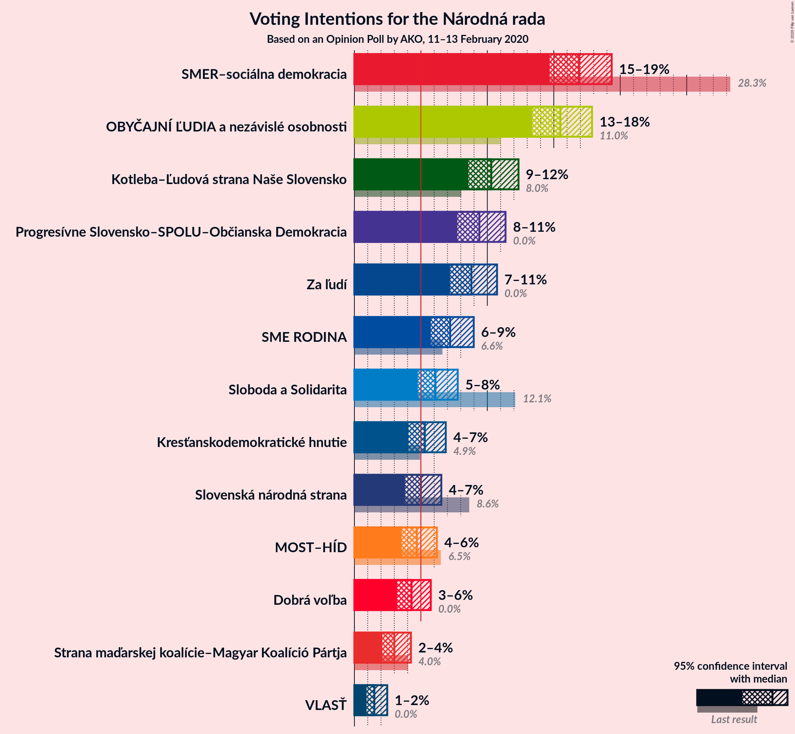

### Confidence Intervals

| Party | Last Result | Poll Result | 80% Confidence Interval | 90% Confidence Interval | 95% Confidence Interval | 99% Confidence Interval |
|:-----:|:-----------:|:-----------:|:-----------------------:|:-----------------------:|:-----------------------:|:-----------------------:|
| SMER–sociálna demokracia | 28.3% | 16.9% | 15.5–18.5% |15.0–19.0% |14.7–19.4% |14.0–20.1% |
| OBYČAJNÍ ĽUDIA a nezávislé osobnosti | 11.0% | 15.5% | 14.1–17.1% |13.7–17.5% |13.4–17.9% |12.7–18.7% |
| Kotleba–Ľudová strana Naše Slovensko | 8.0% | 10.3% | 9.2–11.6% |8.8–12.0% |8.6–12.3% |8.0–13.0% |
| Progresívne Slovensko–SPOLU–Občianska Demokracia | 0.0% | 9.4% | 8.3–10.7% |8.0–11.1% |7.7–11.4% |7.2–12.0% |
| Za ľudí | 0.0% | 8.8% | 7.7–10.1% |7.4–10.4% |7.2–10.7% |6.7–11.4% |
| SME RODINA | 6.6% | 7.2% | 6.2–8.4% |6.0–8.7% |5.7–9.0% |5.3–9.6% |
| Sloboda a Solidarita | 12.1% | 6.1% | 5.2–7.2% |5.0–7.5% |4.8–7.8% |4.4–8.3% |
| Kresťanskodemokratické hnutie | 4.9% | 5.3% | 4.5–6.3% |4.3–6.6% |4.1–6.9% |3.7–7.4% |
| Slovenská národná strana | 8.6% | 5.0% | 4.2–6.0% |4.0–6.3% |3.8–6.5% |3.5–7.1% |
| MOST–HÍD | 6.5% | 4.7% | 3.9–5.7% |3.7–6.0% |3.6–6.2% |3.2–6.7% |
| Dobrá voľba | 0.0% | 4.3% | 3.6–5.2% |3.4–5.5% |3.2–5.7% |2.9–6.2% |
| Strana maďarskej koalície–Magyar Koalíció Pártja | 4.0% | 3.0% | 2.4–3.8% |2.2–4.1% |2.1–4.3% |1.9–4.7% |
| VLASŤ | 0.0% | 1.5% | 1.1–2.1% |1.0–2.3% |0.9–2.5% |0.7–2.8% |

*Note:* The poll result column reflects the actual value used in the calculations. Published results may vary slightly, and in addition be rounded to fewer digits.

## Seats

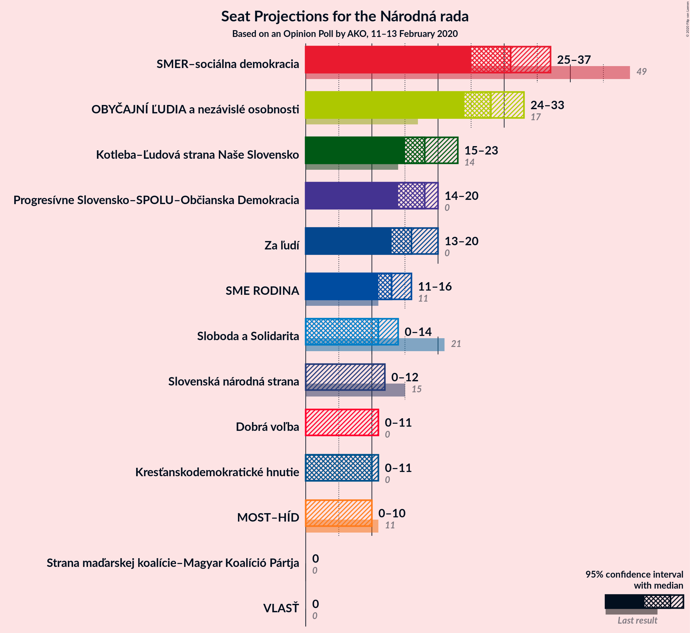

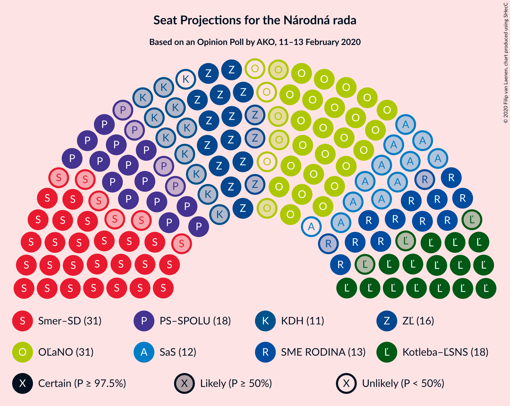

### Confidence Intervals

| Party | Last Result | Median | 80% Confidence Interval | 90% Confidence Interval | 95% Confidence Interval | 99% Confidence Interval |
|:-----:|:-----------:|:------:|:-----------------------:|:-----------------------:|:-----------------------:|:-----------------------:|
| <a href="#smer–sociálna-demokracia">SMER–sociálna demokracia</a> | 49 | 31 | 28–34 |27–37 |25–37 |23–37 |
| <a href="#obyčajní-ľudia-a-nezávislé-osobnosti">OBYČAJNÍ ĽUDIA a nezávislé osobnosti</a> | 17 | 28 | 25–31 |24–32 |24–33 |21–33 |
| <a href="#kotleba–ľudová-strana-naše-slovensko">Kotleba–Ľudová strana Naše Slovensko</a> | 14 | 18 | 17–22 |16–23 |15–23 |14–25 |
| <a href="#progresívne-slovensko–spolu–občianska-demokracia">Progresívne Slovensko–SPOLU–Občianska Demokracia</a> | 0 | 18 | 15–19 |14–20 |14–20 |13–21 |
| <a href="#za-ľudí">Za ľudí</a> | 0 | 16 | 13–17 |13–19 |13–20 |11–21 |
| <a href="#sme-rodina">SME RODINA</a> | 11 | 13 | 11–15 |11–16 |11–16 |9–17 |
| <a href="#sloboda-a-solidarita">Sloboda a Solidarita</a> | 21 | 11 | 0–13 |0–13 |0–14 |0–16 |
| <a href="#kresťanskodemokratické-hnutie">Kresťanskodemokratické hnutie</a> | 0 | 10 | 0–11 |0–11 |0–11 |0–13 |
| <a href="#slovenská-národná-strana">Slovenská národná strana</a> | 15 | 0 | 0–10 |0–11 |0–12 |0–13 |
| <a href="#most–híd">MOST–HÍD</a> | 11 | 0 | 0–10 |0–10 |0–10 |0–12 |
| <a href="#dobrá-voľba">Dobrá voľba</a> | 0 | 0 | 0–11 |0–11 |0–11 |0–11 |
| <a href="#strana-maďarskej-koalície–magyar-koalíció-pártja">Strana maďarskej koalície–Magyar Koalíció Pártja</a> | 0 | 0 | 0 |0 |0 |0–10 |
| <a href="#vlasť">VLASŤ</a> | 0 | 0 | 0 |0 |0 |0 |

### SMER–sociálna demokracia

*For a full overview of the results for this party, see the [SMER–sociálna demokracia](party-smer–sociálnademokracia.html) page.*

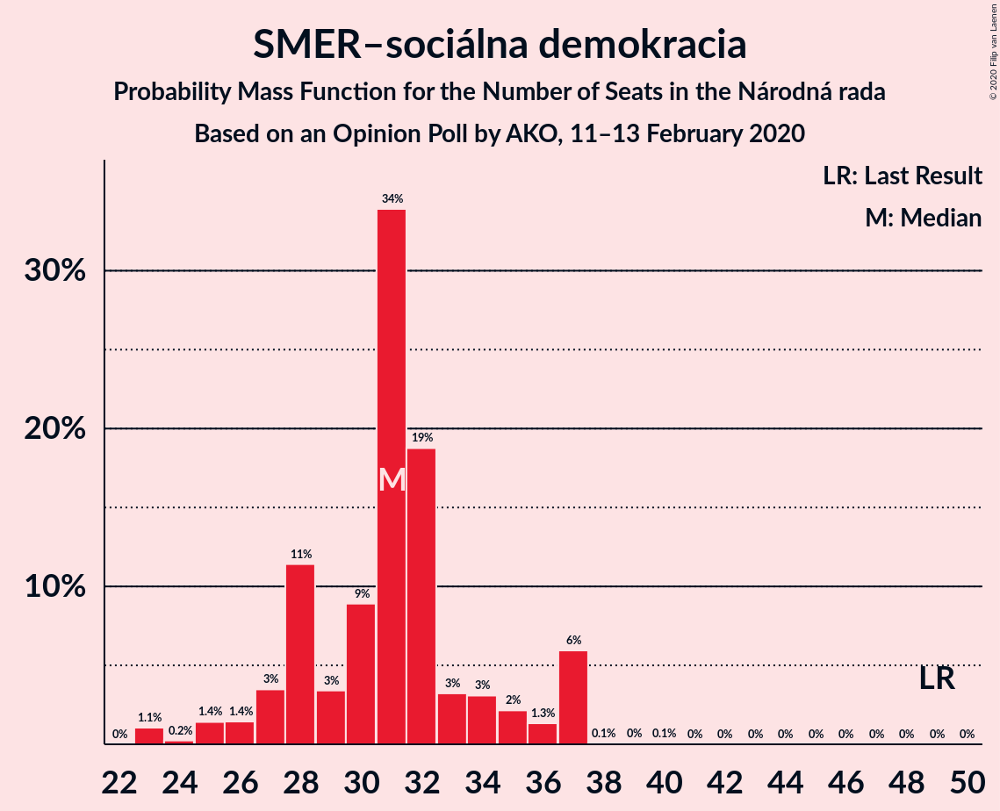

| Number of Seats | Probability | Accumulated | Special Marks |
|:---------------:|:-----------:|:-----------:|:-------------:|
| 23 | 1.1% | 100% |  |
| 24 | 0.2% | 98.9% |  |
| 25 | 1.4% | 98.7% |  |
| 26 | 1.4% | 97% |  |
| 27 | 3% | 96% |  |
| 28 | 11% | 92% |  |
| 29 | 3% | 81% |  |
| 30 | 9% | 78% |  |
| 31 | 34% | 69% | Median |
| 32 | 19% | 35% |  |
| 33 | 3% | 16% |  |
| 34 | 3% | 13% |  |
| 35 | 2% | 10% |  |
| 36 | 1.3% | 7% |  |
| 37 | 6% | 6% |  |
| 38 | 0.1% | 0.2% |  |
| 39 | 0% | 0.1% |  |
| 40 | 0.1% | 0.1% |  |
| 41 | 0% | 0% |  |
| 42 | 0% | 0% |  |
| 43 | 0% | 0% |  |
| 44 | 0% | 0% |  |
| 45 | 0% | 0% |  |
| 46 | 0% | 0% |  |
| 47 | 0% | 0% |  |
| 48 | 0% | 0% |  |
| 49 | 0% | 0% | Last Result |

### OBYČAJNÍ ĽUDIA a nezávislé osobnosti

*For a full overview of the results for this party, see the [OBYČAJNÍ ĽUDIA a nezávislé osobnosti](party-obyčajníľudiaanezávisléosobnosti.html) page.*

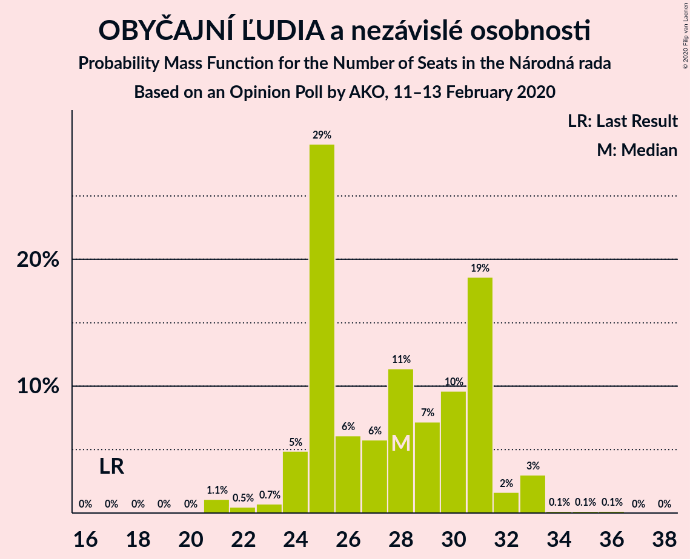

| Number of Seats | Probability | Accumulated | Special Marks |
|:---------------:|:-----------:|:-----------:|:-------------:|
| 17 | 0% | 100% | Last Result |
| 18 | 0% | 100% |  |
| 19 | 0% | 100% |  |
| 20 | 0% | 100% |  |
| 21 | 1.1% | 100% |  |
| 22 | 0.5% | 98.9% |  |
| 23 | 0.7% | 98% |  |
| 24 | 5% | 98% |  |
| 25 | 29% | 93% |  |
| 26 | 6% | 64% |  |
| 27 | 6% | 58% |  |
| 28 | 11% | 52% | Median |
| 29 | 7% | 40% |  |
| 30 | 10% | 33% |  |
| 31 | 19% | 24% |  |
| 32 | 2% | 5% |  |
| 33 | 3% | 3% |  |
| 34 | 0.1% | 0.4% |  |
| 35 | 0.1% | 0.3% |  |
| 36 | 0.1% | 0.2% |  |
| 37 | 0% | 0% |  |

### Kotleba–Ľudová strana Naše Slovensko

*For a full overview of the results for this party, see the [Kotleba–Ľudová strana Naše Slovensko](party-kotleba–ľudovástrananašeslovensko.html) page.*

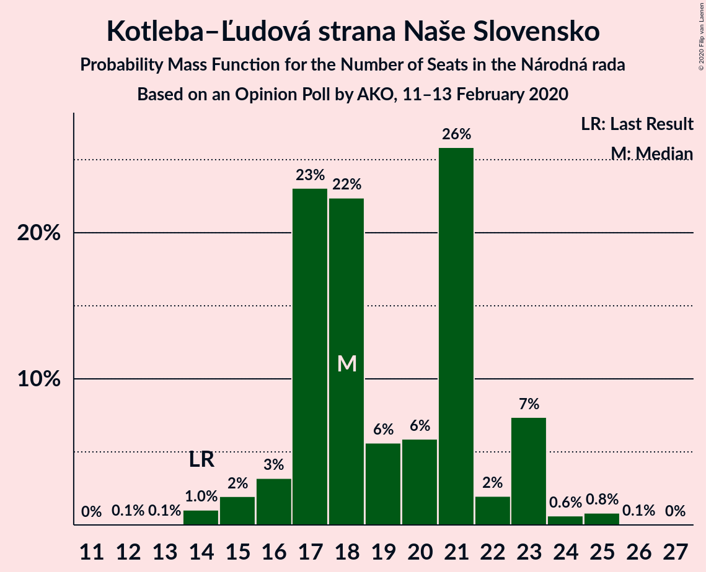

| Number of Seats | Probability | Accumulated | Special Marks |
|:---------------:|:-----------:|:-----------:|:-------------:|
| 12 | 0.1% | 100% |  |
| 13 | 0.1% | 99.9% |  |
| 14 | 1.0% | 99.9% | Last Result |
| 15 | 2% | 98.8% |  |
| 16 | 3% | 97% |  |
| 17 | 23% | 94% |  |
| 18 | 22% | 71% | Median |
| 19 | 6% | 48% |  |
| 20 | 6% | 43% |  |
| 21 | 26% | 37% |  |
| 22 | 2% | 11% |  |
| 23 | 7% | 9% |  |
| 24 | 0.6% | 2% |  |
| 25 | 0.8% | 0.9% |  |
| 26 | 0.1% | 0.1% |  |
| 27 | 0% | 0% |  |

### Progresívne Slovensko–SPOLU–Občianska Demokracia

*For a full overview of the results for this party, see the [Progresívne Slovensko–SPOLU–Občianska Demokracia](party-progresívneslovensko–spolu–občianskademokracia.html) page.*

| Number of Seats | Probability | Accumulated | Special Marks |
|:---------------:|:-----------:|:-----------:|:-------------:|
| 0 | 0% | 100% | Last Result |
| 1 | 0% | 100% |  |
| 2 | 0% | 100% |  |
| 3 | 0% | 100% |  |
| 4 | 0% | 100% |  |
| 5 | 0% | 100% |  |
| 6 | 0% | 100% |  |
| 7 | 0% | 100% |  |
| 8 | 0% | 100% |  |
| 9 | 0% | 100% |  |
| 10 | 0% | 100% |  |
| 11 | 0.1% | 100% |  |
| 12 | 0.2% | 99.9% |  |
| 13 | 0.5% | 99.7% |  |
| 14 | 9% | 99.2% |  |
| 15 | 4% | 90% |  |
| 16 | 26% | 86% |  |
| 17 | 2% | 60% |  |
| 18 | 27% | 58% | Median |
| 19 | 24% | 30% |  |
| 20 | 5% | 6% |  |
| 21 | 0.5% | 0.9% |  |
| 22 | 0.1% | 0.4% |  |
| 23 | 0.1% | 0.3% |  |
| 24 | 0% | 0.3% |  |
| 25 | 0.2% | 0.3% |  |
| 26 | 0% | 0% |  |

### Za ľudí

*For a full overview of the results for this party, see the [Za ľudí](party-zaľudí.html) page.*

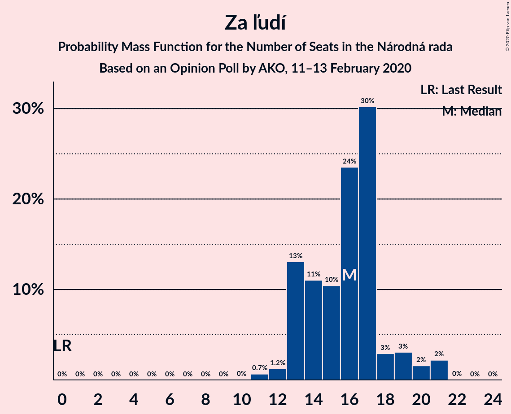

| Number of Seats | Probability | Accumulated | Special Marks |
|:---------------:|:-----------:|:-----------:|:-------------:|
| 0 | 0% | 100% | Last Result |
| 1 | 0% | 100% |  |
| 2 | 0% | 100% |  |
| 3 | 0% | 100% |  |
| 4 | 0% | 100% |  |
| 5 | 0% | 100% |  |
| 6 | 0% | 100% |  |
| 7 | 0% | 100% |  |
| 8 | 0% | 100% |  |
| 9 | 0% | 100% |  |
| 10 | 0% | 100% |  |
| 11 | 0.7% | 100% |  |
| 12 | 1.2% | 99.3% |  |
| 13 | 13% | 98% |  |
| 14 | 11% | 85% |  |
| 15 | 10% | 74% |  |
| 16 | 24% | 64% | Median |
| 17 | 30% | 40% |  |
| 18 | 3% | 10% |  |
| 19 | 3% | 7% |  |
| 20 | 2% | 4% |  |
| 21 | 2% | 2% |  |
| 22 | 0% | 0.1% |  |
| 23 | 0% | 0% |  |

### SME RODINA

*For a full overview of the results for this party, see the [SME RODINA](party-smerodina.html) page.*

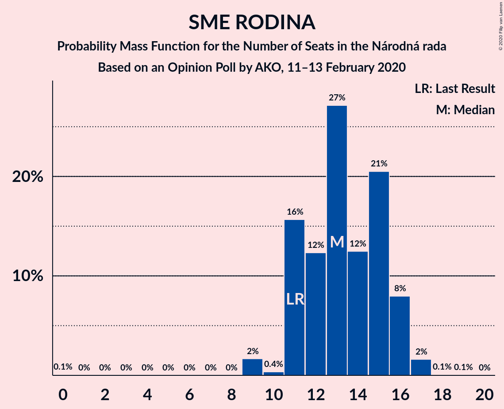

| Number of Seats | Probability | Accumulated | Special Marks |
|:---------------:|:-----------:|:-----------:|:-------------:|
| 0 | 0.1% | 100% |  |
| 1 | 0% | 99.9% |  |
| 2 | 0% | 99.9% |  |
| 3 | 0% | 99.9% |  |
| 4 | 0% | 99.9% |  |
| 5 | 0% | 99.9% |  |
| 6 | 0% | 99.9% |  |
| 7 | 0% | 99.9% |  |
| 8 | 0% | 99.9% |  |
| 9 | 2% | 99.9% |  |
| 10 | 0.4% | 98% |  |
| 11 | 16% | 98% | Last Result |
| 12 | 12% | 82% |  |
| 13 | 27% | 70% | Median |
| 14 | 12% | 43% |  |
| 15 | 21% | 30% |  |
| 16 | 8% | 10% |  |
| 17 | 2% | 2% |  |
| 18 | 0.1% | 0.2% |  |
| 19 | 0.1% | 0.1% |  |
| 20 | 0% | 0% |  |

### Sloboda a Solidarita

*For a full overview of the results for this party, see the [Sloboda a Solidarita](party-slobodaasolidarita.html) page.*

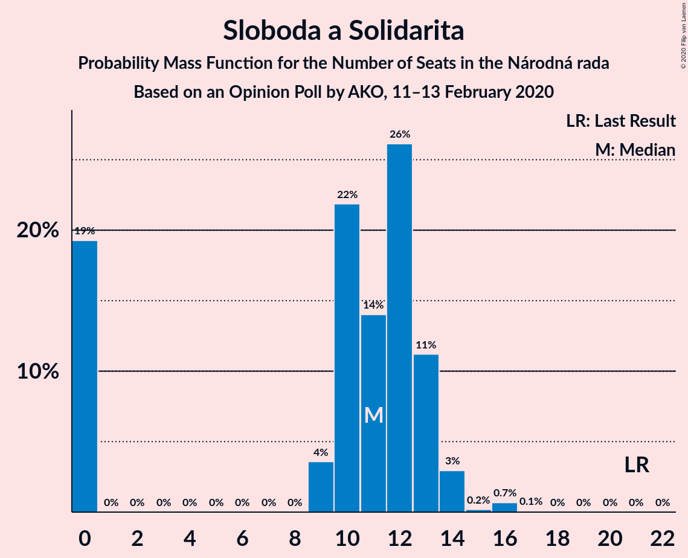

| Number of Seats | Probability | Accumulated | Special Marks |
|:---------------:|:-----------:|:-----------:|:-------------:|
| 0 | 19% | 100% |  |
| 1 | 0% | 81% |  |
| 2 | 0% | 81% |  |
| 3 | 0% | 81% |  |
| 4 | 0% | 81% |  |
| 5 | 0% | 81% |  |
| 6 | 0% | 81% |  |
| 7 | 0% | 81% |  |
| 8 | 0% | 81% |  |
| 9 | 4% | 81% |  |
| 10 | 22% | 77% |  |
| 11 | 14% | 55% | Median |
| 12 | 26% | 41% |  |
| 13 | 11% | 15% |  |
| 14 | 3% | 4% |  |
| 15 | 0.2% | 0.9% |  |
| 16 | 0.7% | 0.8% |  |
| 17 | 0.1% | 0.1% |  |
| 18 | 0% | 0% |  |
| 19 | 0% | 0% |  |
| 20 | 0% | 0% |  |
| 21 | 0% | 0% | Last Result |

### Kresťanskodemokratické hnutie

*For a full overview of the results for this party, see the [Kresťanskodemokratické hnutie](party-kresťanskodemokratickéhnutie.html) page.*

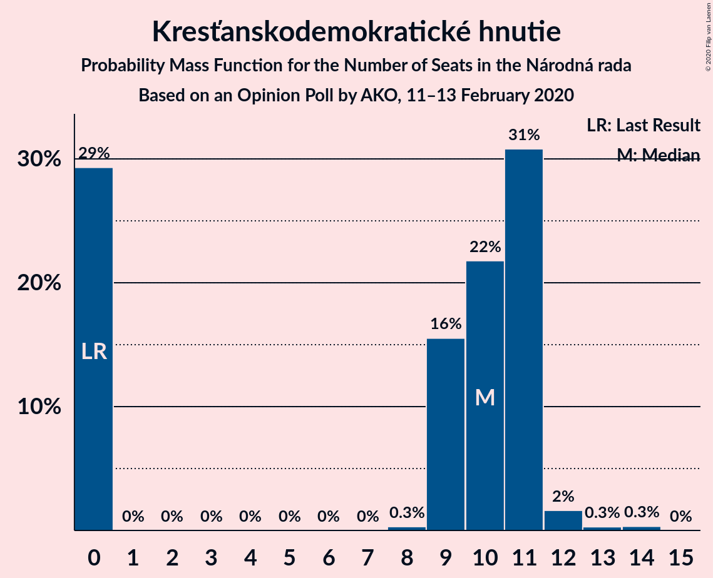

| Number of Seats | Probability | Accumulated | Special Marks |
|:---------------:|:-----------:|:-----------:|:-------------:|
| 0 | 29% | 100% | Last Result |
| 1 | 0% | 71% |  |
| 2 | 0% | 71% |  |
| 3 | 0% | 71% |  |
| 4 | 0% | 71% |  |
| 5 | 0% | 71% |  |
| 6 | 0% | 71% |  |
| 7 | 0% | 71% |  |
| 8 | 0.3% | 71% |  |
| 9 | 16% | 70% |  |
| 10 | 22% | 55% | Median |
| 11 | 31% | 33% |  |
| 12 | 2% | 2% |  |
| 13 | 0.3% | 0.6% |  |
| 14 | 0.3% | 0.3% |  |
| 15 | 0% | 0% |  |

### Slovenská národná strana

*For a full overview of the results for this party, see the [Slovenská národná strana](party-slovenskánárodnástrana.html) page.*

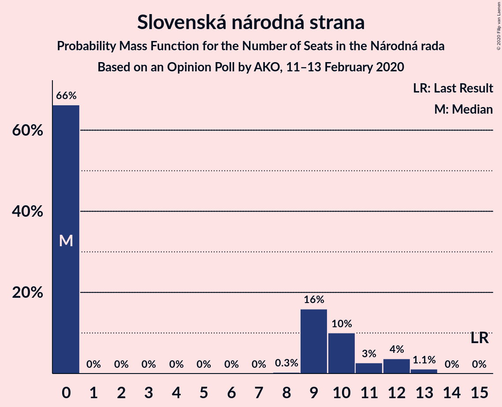

| Number of Seats | Probability | Accumulated | Special Marks |
|:---------------:|:-----------:|:-----------:|:-------------:|
| 0 | 66% | 100% | Median |
| 1 | 0% | 34% |  |
| 2 | 0% | 34% |  |
| 3 | 0% | 34% |  |
| 4 | 0% | 34% |  |
| 5 | 0% | 34% |  |
| 6 | 0% | 34% |  |
| 7 | 0% | 34% |  |
| 8 | 0.3% | 34% |  |
| 9 | 16% | 33% |  |
| 10 | 10% | 18% |  |
| 11 | 3% | 7% |  |
| 12 | 4% | 5% |  |
| 13 | 1.1% | 1.2% |  |
| 14 | 0% | 0% |  |
| 15 | 0% | 0% | Last Result |

### MOST–HÍD

*For a full overview of the results for this party, see the [MOST–HÍD](party-most–híd.html) page.*

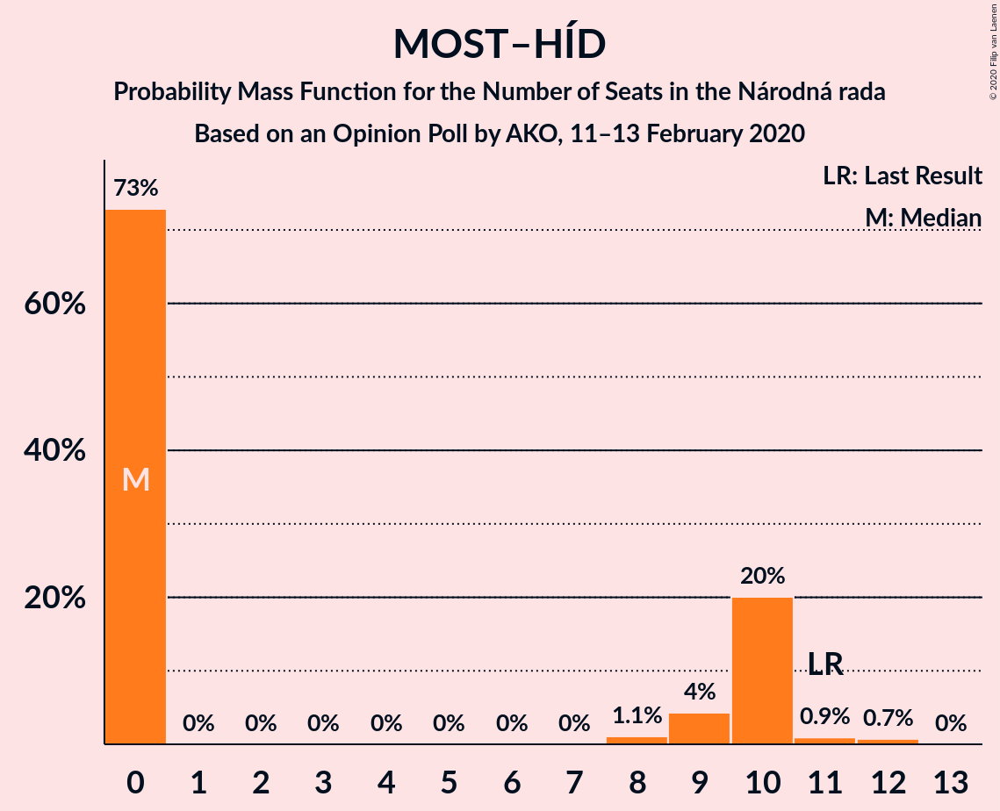

| Number of Seats | Probability | Accumulated | Special Marks |
|:---------------:|:-----------:|:-----------:|:-------------:|
| 0 | 73% | 100% | Median |
| 1 | 0% | 27% |  |
| 2 | 0% | 27% |  |
| 3 | 0% | 27% |  |
| 4 | 0% | 27% |  |
| 5 | 0% | 27% |  |
| 6 | 0% | 27% |  |
| 7 | 0% | 27% |  |
| 8 | 1.1% | 27% |  |
| 9 | 4% | 26% |  |
| 10 | 20% | 22% |  |
| 11 | 0.9% | 2% | Last Result |
| 12 | 0.7% | 0.8% |  |
| 13 | 0% | 0% |  |

### Dobrá voľba

*For a full overview of the results for this party, see the [Dobrá voľba](party-dobrávoľba.html) page.*

| Number of Seats | Probability | Accumulated | Special Marks |
|:---------------:|:-----------:|:-----------:|:-------------:|
| 0 | 68% | 100% | Last Result, Median |
| 1 | 0% | 32% |  |
| 2 | 0% | 32% |  |
| 3 | 0% | 32% |  |
| 4 | 0% | 32% |  |
| 5 | 0% | 32% |  |
| 6 | 0% | 32% |  |
| 7 | 0% | 32% |  |
| 8 | 1.0% | 32% |  |
| 9 | 13% | 31% |  |
| 10 | 2% | 18% |  |
| 11 | 16% | 16% |  |
| 12 | 0.1% | 0.1% |  |
| 13 | 0% | 0% |  |

### Strana maďarskej koalície–Magyar Koalíció Pártja

*For a full overview of the results for this party, see the [Strana maďarskej koalície–Magyar Koalíció Pártja](party-stranamaďarskejkoalície–magyarkoalíciópártja.html) page.*

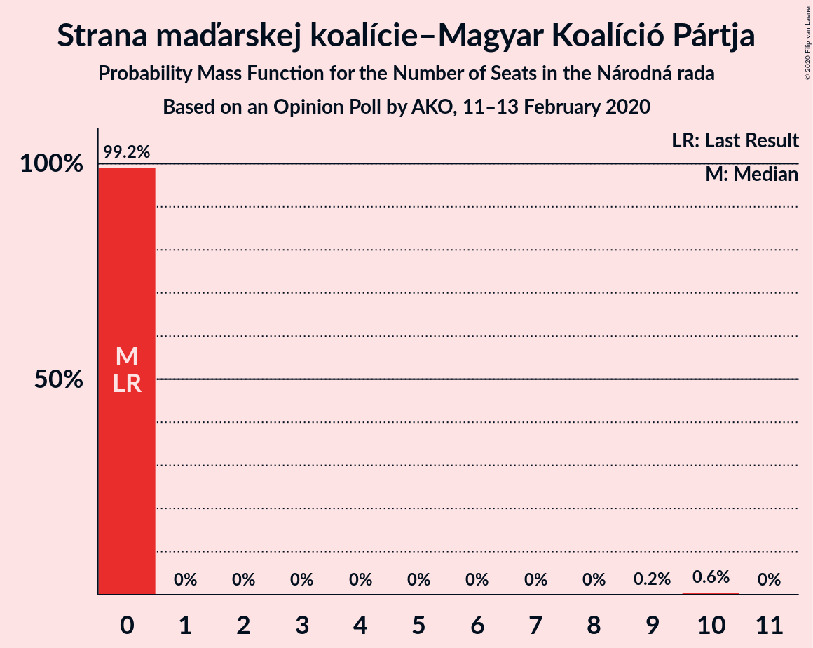

| Number of Seats | Probability | Accumulated | Special Marks |
|:---------------:|:-----------:|:-----------:|:-------------:|
| 0 | 99.2% | 100% | Last Result, Median |
| 1 | 0% | 0.8% |  |
| 2 | 0% | 0.8% |  |
| 3 | 0% | 0.8% |  |
| 4 | 0% | 0.8% |  |
| 5 | 0% | 0.8% |  |
| 6 | 0% | 0.8% |  |
| 7 | 0% | 0.8% |  |
| 8 | 0% | 0.8% |  |
| 9 | 0.2% | 0.8% |  |
| 10 | 0.6% | 0.6% |  |
| 11 | 0% | 0% |  |

### VLASŤ

*For a full overview of the results for this party, see the [VLASŤ](party-vlasť.html) page.*

| Number of Seats | Probability | Accumulated | Special Marks |
|:---------------:|:-----------:|:-----------:|:-------------:|
| 0 | 100% | 100% | Last Result, Median |

## Coalitions

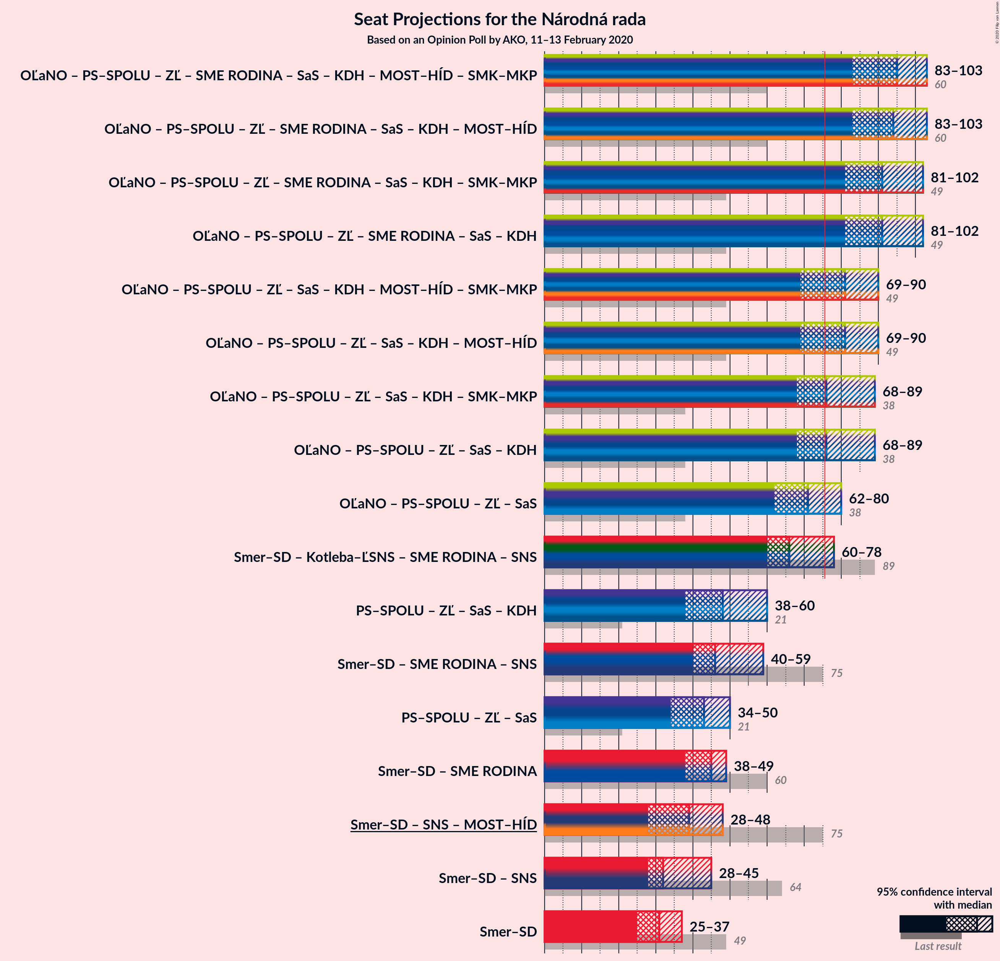

### Confidence Intervals

| Coalition | Last Result | Median | Majority? | 80% Confidence Interval | 90% Confidence Interval | 95% Confidence Interval | 99% Confidence Interval |
|:---------:|:-----------:|:------:|:---------:|:-----------------------:|:-----------------------:|:-----------------------:|:-----------------------:|
| OBYČAJNÍ ĽUDIA a nezávislé osobnosti – Progresívne Slovensko–SPOLU–Občianska Demokracia – Za ľudí – SME RODINA – Sloboda a Solidarita – Kresťanskodemokratické hnutie – MOST–HÍD – Strana maďarskej koalície–Magyar Koalíció Pártja | 60 | 95 | 100% | 84–101 | 84–101 | 83–103 | 80–106 |
| OBYČAJNÍ ĽUDIA a nezávislé osobnosti – Progresívne Slovensko–SPOLU–Občianska Demokracia – Za ľudí – SME RODINA – Sloboda a Solidarita – Kresťanskodemokratické hnutie – MOST–HÍD | 60 | 94 | 100% | 84–101 | 84–101 | 83–103 | 80–106 |
| OBYČAJNÍ ĽUDIA a nezávislé osobnosti – Progresívne Slovensko–SPOLU–Občianska Demokracia – Za ľudí – SME RODINA – Sloboda a Solidarita – Kresťanskodemokratické hnutie – Strana maďarskej koalície–Magyar Koalíció Pártja | 49 | 91 | 99.8% | 84–101 | 83–101 | 81–102 | 79–104 |
| OBYČAJNÍ ĽUDIA a nezávislé osobnosti – Progresívne Slovensko–SPOLU–Občianska Demokracia – Za ľudí – SME RODINA – Sloboda a Solidarita – Kresťanskodemokratické hnutie | 49 | 91 | 99.8% | 84–101 | 83–101 | 81–102 | 79–104 |
| OBYČAJNÍ ĽUDIA a nezávislé osobnosti – Progresívne Slovensko–SPOLU–Občianska Demokracia – Za ľudí – Sloboda a Solidarita – Kresťanskodemokratické hnutie – MOST–HÍD – Strana maďarskej koalície–Magyar Koalíció Pártja | 49 | 81 | 67% | 73–87 | 73–88 | 69–90 | 66–93 |
| OBYČAJNÍ ĽUDIA a nezávislé osobnosti – Progresívne Slovensko–SPOLU–Občianska Demokracia – Za ľudí – Sloboda a Solidarita – Kresťanskodemokratické hnutie – MOST–HÍD | 49 | 81 | 67% | 73–87 | 73–88 | 69–90 | 66–93 |
| OBYČAJNÍ ĽUDIA a nezávislé osobnosti – Progresívne Slovensko–SPOLU–Občianska Demokracia – Za ľudí – Sloboda a Solidarita – Kresťanskodemokratické hnutie – Strana maďarskej koalície–Magyar Koalíció Pártja | 38 | 76 | 61% | 73–86 | 70–87 | 68–89 | 62–90 |
| OBYČAJNÍ ĽUDIA a nezávislé osobnosti – Progresívne Slovensko–SPOLU–Občianska Demokracia – Za ľudí – Sloboda a Solidarita – Kresťanskodemokratické hnutie | 38 | 76 | 60% | 73–86 | 70–87 | 68–89 | 62–90 |
| OBYČAJNÍ ĽUDIA a nezávislé osobnosti – Progresívne Slovensko–SPOLU–Občianska Demokracia – Za ľudí – Sloboda a Solidarita | 38 | 71 | 15% | 64–76 | 64–79 | 62–80 | 58–84 |
| SMER–sociálna demokracia – Kotleba–Ľudová strana Naše Slovensko – SME RODINA – Slovenská národná strana | 89 | 66 | 4% | 63–71 | 61–73 | 60–78 | 55–84 |
| Progresívne Slovensko–SPOLU–Občianska Demokracia – Za ľudí – Sloboda a Solidarita – Kresťanskodemokratické hnutie | 21 | 48 | 0% | 45–57 | 42–57 | 38–60 | 35–61 |
| SMER–sociálna demokracia – SME RODINA – Slovenská národná strana | 75 | 46 | 0% | 42–53 | 42–56 | 40–59 | 38–61 |
| Progresívne Slovensko–SPOLU–Občianska Demokracia – Za ľudí – Sloboda a Solidarita | 21 | 43 | 0% | 34–48 | 34–49 | 34–50 | 32–52 |
| SMER–sociálna demokracia – SME RODINA | 60 | 45 | 0% | 40–49 | 39–49 | 38–49 | 34–51 |
| SMER–sociálna demokracia – Slovenská národná strana – MOST–HÍD | 75 | 39 | 0% | 30–42 | 28–46 | 28–48 | 27–52 |
| SMER–sociálna demokracia – Slovenská národná strana | 64 | 32 | 0% | 29–41 | 28–42 | 28–45 | 25–46 |
| SMER–sociálna demokracia | 49 | 31 | 0% | 28–34 | 27–37 | 25–37 | 23–37 |

### OBYČAJNÍ ĽUDIA a nezávislé osobnosti – Progresívne Slovensko–SPOLU–Občianska Demokracia – Za ľudí – SME RODINA – Sloboda a Solidarita – Kresťanskodemokratické hnutie – MOST–HÍD – Strana maďarskej koalície–Magyar Koalíció Pártja

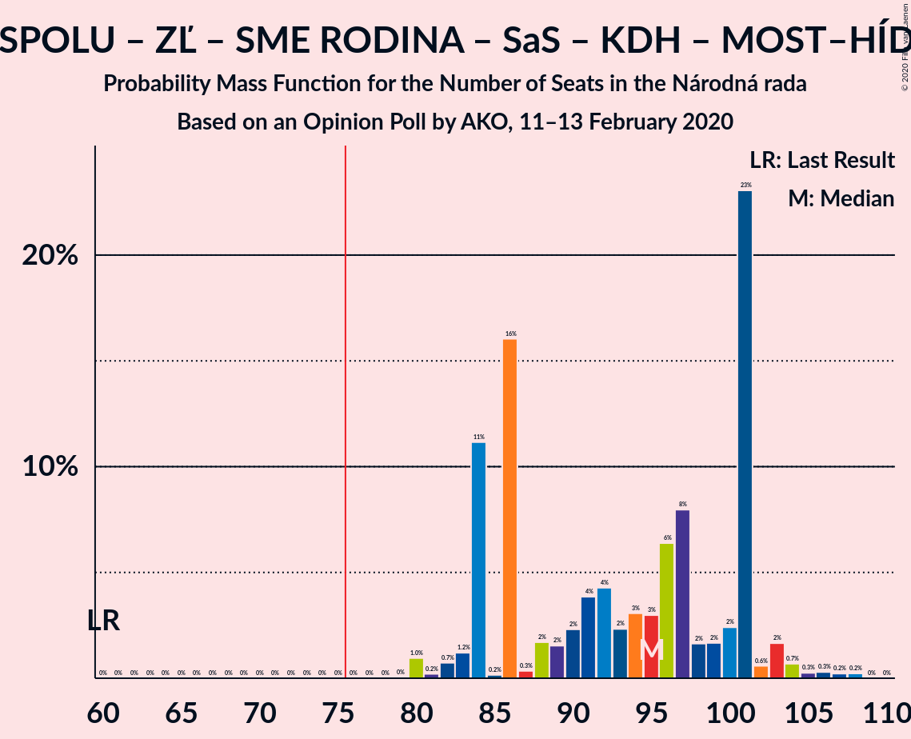

| Number of Seats | Probability | Accumulated | Special Marks |
|:---------------:|:-----------:|:-----------:|:-------------:|
| 60 | 0% | 100% | Last Result |
| 61 | 0% | 100% |  |
| 62 | 0% | 100% |  |
| 63 | 0% | 100% |  |
| 64 | 0% | 100% |  |
| 65 | 0% | 100% |  |
| 66 | 0% | 100% |  |
| 67 | 0% | 100% |  |
| 68 | 0% | 100% |  |
| 69 | 0% | 100% |  |
| 70 | 0% | 100% |  |
| 71 | 0% | 100% |  |
| 72 | 0% | 100% |  |
| 73 | 0% | 100% |  |
| 74 | 0% | 100% |  |
| 75 | 0% | 100% |  |
| 76 | 0% | 100% | Majority |
| 77 | 0% | 100% |  |
| 78 | 0% | 100% |  |
| 79 | 0% | 100% |  |
| 80 | 1.0% | 100% |  |
| 81 | 0.2% | 99.0% |  |
| 82 | 0.7% | 98.8% |  |
| 83 | 1.2% | 98% |  |
| 84 | 11% | 97% |  |
| 85 | 0.2% | 86% |  |
| 86 | 16% | 86% |  |
| 87 | 0.3% | 69% |  |
| 88 | 2% | 69% |  |
| 89 | 2% | 67% |  |
| 90 | 2% | 66% |  |
| 91 | 4% | 64% |  |
| 92 | 4% | 60% |  |
| 93 | 2% | 55% |  |
| 94 | 3% | 53% |  |
| 95 | 3% | 50% |  |
| 96 | 6% | 47% | Median |
| 97 | 8% | 41% |  |
| 98 | 2% | 33% |  |
| 99 | 2% | 31% |  |
| 100 | 2% | 29% |  |
| 101 | 23% | 27% |  |
| 102 | 0.6% | 4% |  |
| 103 | 2% | 3% |  |
| 104 | 0.7% | 2% |  |
| 105 | 0.3% | 1.0% |  |
| 106 | 0.3% | 0.8% |  |
| 107 | 0.2% | 0.5% |  |
| 108 | 0.2% | 0.2% |  |
| 109 | 0% | 0% |  |

### OBYČAJNÍ ĽUDIA a nezávislé osobnosti – Progresívne Slovensko–SPOLU–Občianska Demokracia – Za ľudí – SME RODINA – Sloboda a Solidarita – Kresťanskodemokratické hnutie – MOST–HÍD

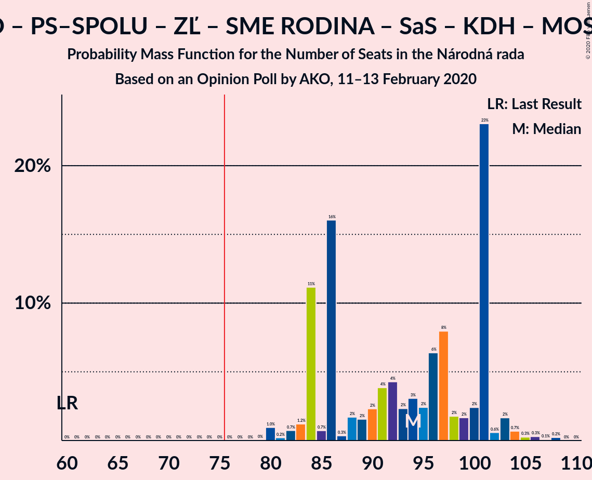

| Number of Seats | Probability | Accumulated | Special Marks |
|:---------------:|:-----------:|:-----------:|:-------------:|
| 60 | 0% | 100% | Last Result |
| 61 | 0% | 100% |  |
| 62 | 0% | 100% |  |
| 63 | 0% | 100% |  |
| 64 | 0% | 100% |  |
| 65 | 0% | 100% |  |
| 66 | 0% | 100% |  |
| 67 | 0% | 100% |  |
| 68 | 0% | 100% |  |
| 69 | 0% | 100% |  |
| 70 | 0% | 100% |  |
| 71 | 0% | 100% |  |
| 72 | 0% | 100% |  |
| 73 | 0% | 100% |  |
| 74 | 0% | 100% |  |
| 75 | 0% | 100% |  |
| 76 | 0% | 100% | Majority |
| 77 | 0% | 100% |  |
| 78 | 0% | 100% |  |
| 79 | 0% | 100% |  |
| 80 | 1.0% | 100% |  |
| 81 | 0.2% | 99.0% |  |
| 82 | 0.7% | 98.8% |  |
| 83 | 1.2% | 98% |  |
| 84 | 11% | 97% |  |
| 85 | 0.7% | 86% |  |
| 86 | 16% | 85% |  |
| 87 | 0.3% | 69% |  |
| 88 | 2% | 69% |  |
| 89 | 2% | 67% |  |
| 90 | 2% | 65% |  |
| 91 | 4% | 63% |  |
| 92 | 4% | 59% |  |
| 93 | 2% | 55% |  |
| 94 | 3% | 53% |  |
| 95 | 2% | 49% |  |
| 96 | 6% | 47% | Median |
| 97 | 8% | 41% |  |
| 98 | 2% | 33% |  |
| 99 | 2% | 31% |  |
| 100 | 2% | 29% |  |
| 101 | 23% | 27% |  |
| 102 | 0.6% | 4% |  |
| 103 | 2% | 3% |  |
| 104 | 0.7% | 2% |  |
| 105 | 0.3% | 0.9% |  |
| 106 | 0.3% | 0.6% |  |
| 107 | 0.1% | 0.3% |  |
| 108 | 0.2% | 0.2% |  |
| 109 | 0% | 0% |  |

### OBYČAJNÍ ĽUDIA a nezávislé osobnosti – Progresívne Slovensko–SPOLU–Občianska Demokracia – Za ľudí – SME RODINA – Sloboda a Solidarita – Kresťanskodemokratické hnutie – Strana maďarskej koalície–Magyar Koalíció Pártja

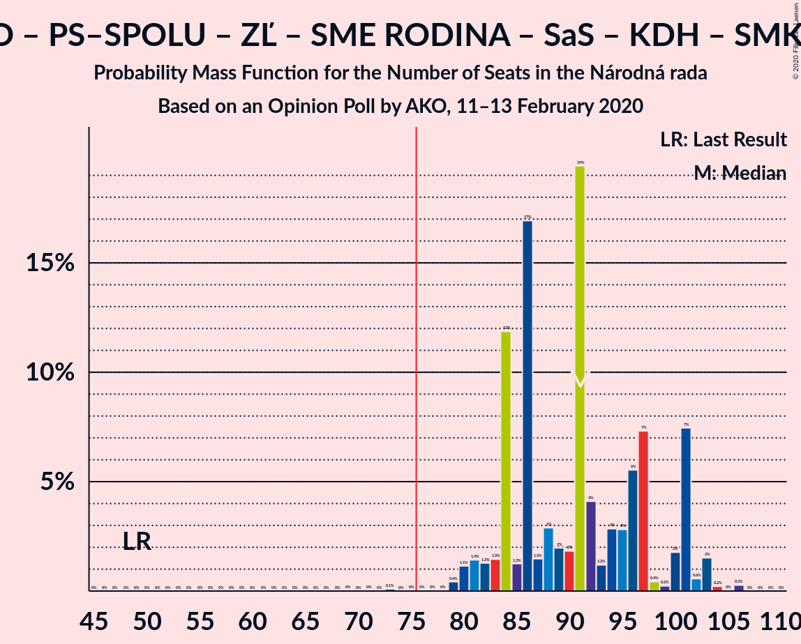

| Number of Seats | Probability | Accumulated | Special Marks |
|:---------------:|:-----------:|:-----------:|:-------------:|
| 49 | 0% | 100% | Last Result |
| 50 | 0% | 100% |  |
| 51 | 0% | 100% |  |
| 52 | 0% | 100% |  |
| 53 | 0% | 100% |  |
| 54 | 0% | 100% |  |
| 55 | 0% | 100% |  |
| 56 | 0% | 100% |  |
| 57 | 0% | 100% |  |
| 58 | 0% | 100% |  |
| 59 | 0% | 100% |  |
| 60 | 0% | 100% |  |
| 61 | 0% | 100% |  |
| 62 | 0% | 100% |  |
| 63 | 0% | 100% |  |
| 64 | 0% | 100% |  |
| 65 | 0% | 100% |  |
| 66 | 0% | 100% |  |
| 67 | 0% | 100% |  |
| 68 | 0% | 100% |  |
| 69 | 0% | 100% |  |
| 70 | 0% | 100% |  |
| 71 | 0% | 100% |  |
| 72 | 0% | 99.9% |  |
| 73 | 0.1% | 99.9% |  |
| 74 | 0% | 99.8% |  |
| 75 | 0% | 99.8% |  |
| 76 | 0% | 99.8% | Majority |
| 77 | 0% | 99.8% |  |
| 78 | 0% | 99.8% |  |
| 79 | 0.4% | 99.7% |  |
| 80 | 1.1% | 99.3% |  |
| 81 | 1.4% | 98% |  |
| 82 | 1.3% | 97% |  |
| 83 | 1.5% | 95% |  |
| 84 | 12% | 94% |  |
| 85 | 1.3% | 82% |  |
| 86 | 17% | 81% |  |
| 87 | 1.5% | 64% |  |
| 88 | 3% | 62% |  |
| 89 | 2% | 60% |  |
| 90 | 2% | 58% |  |
| 91 | 19% | 56% |  |
| 92 | 4% | 36% |  |
| 93 | 1.2% | 32% |  |
| 94 | 3% | 31% |  |
| 95 | 3% | 28% |  |
| 96 | 6% | 25% | Median |
| 97 | 7% | 20% |  |
| 98 | 0.4% | 13% |  |
| 99 | 0.2% | 12% |  |
| 100 | 2% | 12% |  |
| 101 | 7% | 10% |  |
| 102 | 0.6% | 3% |  |
| 103 | 2% | 2% |  |
| 104 | 0.2% | 0.5% |  |
| 105 | 0% | 0.3% |  |
| 106 | 0.3% | 0.3% |  |
| 107 | 0% | 0% |  |

### OBYČAJNÍ ĽUDIA a nezávislé osobnosti – Progresívne Slovensko–SPOLU–Občianska Demokracia – Za ľudí – SME RODINA – Sloboda a Solidarita – Kresťanskodemokratické hnutie

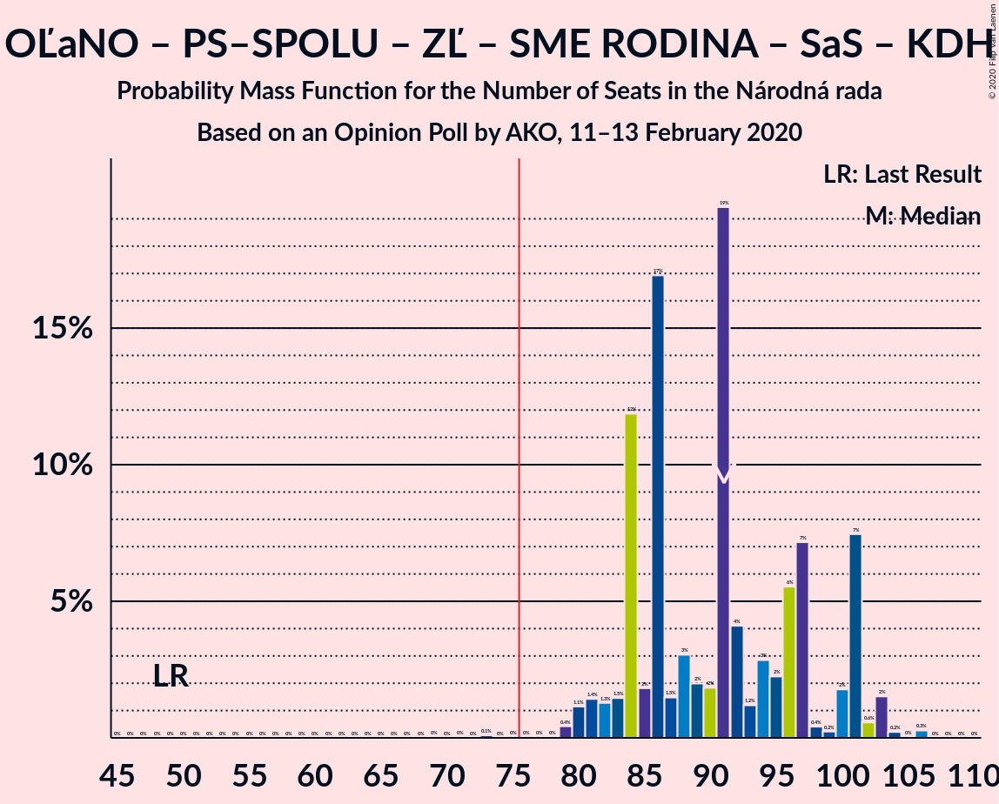

| Number of Seats | Probability | Accumulated | Special Marks |
|:---------------:|:-----------:|:-----------:|:-------------:|
| 49 | 0% | 100% | Last Result |
| 50 | 0% | 100% |  |
| 51 | 0% | 100% |  |
| 52 | 0% | 100% |  |
| 53 | 0% | 100% |  |
| 54 | 0% | 100% |  |
| 55 | 0% | 100% |  |
| 56 | 0% | 100% |  |
| 57 | 0% | 100% |  |
| 58 | 0% | 100% |  |
| 59 | 0% | 100% |  |
| 60 | 0% | 100% |  |
| 61 | 0% | 100% |  |
| 62 | 0% | 100% |  |
| 63 | 0% | 100% |  |
| 64 | 0% | 100% |  |
| 65 | 0% | 100% |  |
| 66 | 0% | 100% |  |
| 67 | 0% | 100% |  |
| 68 | 0% | 100% |  |
| 69 | 0% | 100% |  |
| 70 | 0% | 100% |  |
| 71 | 0% | 100% |  |
| 72 | 0% | 99.9% |  |
| 73 | 0.1% | 99.9% |  |
| 74 | 0% | 99.8% |  |
| 75 | 0% | 99.8% |  |
| 76 | 0% | 99.8% | Majority |
| 77 | 0% | 99.8% |  |
| 78 | 0% | 99.8% |  |
| 79 | 0.4% | 99.7% |  |
| 80 | 1.1% | 99.3% |  |
| 81 | 1.4% | 98% |  |
| 82 | 1.3% | 97% |  |
| 83 | 1.5% | 95% |  |
| 84 | 12% | 94% |  |
| 85 | 2% | 82% |  |
| 86 | 17% | 80% |  |
| 87 | 1.5% | 63% |  |
| 88 | 3% | 62% |  |
| 89 | 2% | 59% |  |
| 90 | 2% | 57% |  |
| 91 | 19% | 55% |  |
| 92 | 4% | 36% |  |
| 93 | 1.2% | 31% |  |
| 94 | 3% | 30% |  |
| 95 | 2% | 27% |  |
| 96 | 6% | 25% | Median |
| 97 | 7% | 20% |  |
| 98 | 0.4% | 12% |  |
| 99 | 0.2% | 12% |  |
| 100 | 2% | 12% |  |
| 101 | 7% | 10% |  |
| 102 | 0.6% | 3% |  |
| 103 | 2% | 2% |  |
| 104 | 0.2% | 0.5% |  |
| 105 | 0% | 0.3% |  |
| 106 | 0.3% | 0.3% |  |
| 107 | 0% | 0% |  |

### OBYČAJNÍ ĽUDIA a nezávislé osobnosti – Progresívne Slovensko–SPOLU–Občianska Demokracia – Za ľudí – Sloboda a Solidarita – Kresťanskodemokratické hnutie – MOST–HÍD – Strana maďarskej koalície–Magyar Koalíció Pártja

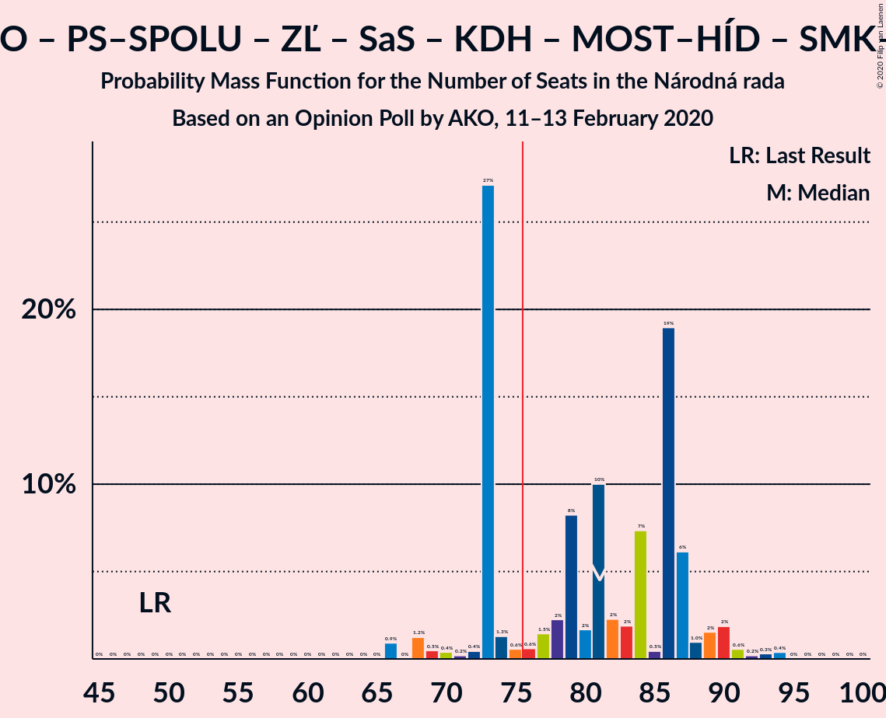

| Number of Seats | Probability | Accumulated | Special Marks |
|:---------------:|:-----------:|:-----------:|:-------------:|
| 49 | 0% | 100% | Last Result |
| 50 | 0% | 100% |  |
| 51 | 0% | 100% |  |
| 52 | 0% | 100% |  |
| 53 | 0% | 100% |  |
| 54 | 0% | 100% |  |
| 55 | 0% | 100% |  |
| 56 | 0% | 100% |  |
| 57 | 0% | 100% |  |
| 58 | 0% | 100% |  |
| 59 | 0% | 100% |  |
| 60 | 0% | 100% |  |
| 61 | 0% | 100% |  |
| 62 | 0% | 100% |  |
| 63 | 0% | 100% |  |
| 64 | 0% | 100% |  |
| 65 | 0% | 100% |  |
| 66 | 0.9% | 100% |  |
| 67 | 0% | 99.1% |  |
| 68 | 1.2% | 99.0% |  |
| 69 | 0.5% | 98% |  |
| 70 | 0.4% | 97% |  |
| 71 | 0.2% | 97% |  |
| 72 | 0.4% | 97% |  |
| 73 | 27% | 96% |  |
| 74 | 1.3% | 69% |  |
| 75 | 0.6% | 68% |  |
| 76 | 0.6% | 67% | Majority |
| 77 | 1.5% | 67% |  |
| 78 | 2% | 65% |  |
| 79 | 8% | 63% |  |
| 80 | 2% | 55% |  |
| 81 | 10% | 53% |  |
| 82 | 2% | 43% |  |
| 83 | 2% | 41% | Median |
| 84 | 7% | 39% |  |
| 85 | 0.5% | 31% |  |
| 86 | 19% | 31% |  |
| 87 | 6% | 12% |  |
| 88 | 1.0% | 6% |  |
| 89 | 2% | 5% |  |
| 90 | 2% | 3% |  |
| 91 | 0.6% | 2% |  |
| 92 | 0.2% | 1.0% |  |
| 93 | 0.3% | 0.8% |  |
| 94 | 0.4% | 0.5% |  |
| 95 | 0% | 0.1% |  |
| 96 | 0% | 0% |  |

### OBYČAJNÍ ĽUDIA a nezávislé osobnosti – Progresívne Slovensko–SPOLU–Občianska Demokracia – Za ľudí – Sloboda a Solidarita – Kresťanskodemokratické hnutie – MOST–HÍD

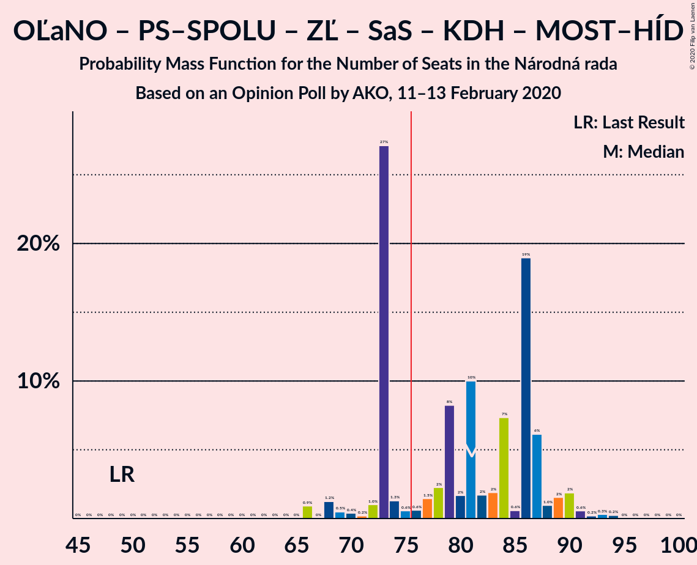

| Number of Seats | Probability | Accumulated | Special Marks |
|:---------------:|:-----------:|:-----------:|:-------------:|
| 49 | 0% | 100% | Last Result |
| 50 | 0% | 100% |  |
| 51 | 0% | 100% |  |
| 52 | 0% | 100% |  |
| 53 | 0% | 100% |  |
| 54 | 0% | 100% |  |
| 55 | 0% | 100% |  |
| 56 | 0% | 100% |  |
| 57 | 0% | 100% |  |
| 58 | 0% | 100% |  |
| 59 | 0% | 100% |  |
| 60 | 0% | 100% |  |
| 61 | 0% | 100% |  |
| 62 | 0% | 100% |  |
| 63 | 0% | 100% |  |
| 64 | 0% | 100% |  |
| 65 | 0% | 100% |  |
| 66 | 0.9% | 100% |  |
| 67 | 0% | 99.1% |  |
| 68 | 1.2% | 99.0% |  |
| 69 | 0.5% | 98% |  |
| 70 | 0.4% | 97% |  |
| 71 | 0.2% | 97% |  |
| 72 | 1.0% | 97% |  |
| 73 | 27% | 96% |  |
| 74 | 1.3% | 69% |  |
| 75 | 0.6% | 67% |  |
| 76 | 0.6% | 67% | Majority |
| 77 | 1.5% | 66% |  |
| 78 | 2% | 65% |  |
| 79 | 8% | 62% |  |
| 80 | 2% | 54% |  |
| 81 | 10% | 52% |  |
| 82 | 2% | 42% |  |
| 83 | 2% | 41% | Median |
| 84 | 7% | 39% |  |
| 85 | 0.6% | 31% |  |
| 86 | 19% | 31% |  |
| 87 | 6% | 12% |  |
| 88 | 1.0% | 6% |  |
| 89 | 2% | 5% |  |
| 90 | 2% | 3% |  |
| 91 | 0.6% | 1.4% |  |
| 92 | 0.2% | 0.8% |  |
| 93 | 0.3% | 0.6% |  |
| 94 | 0.2% | 0.3% |  |
| 95 | 0% | 0.1% |  |
| 96 | 0% | 0% |  |

### OBYČAJNÍ ĽUDIA a nezávislé osobnosti – Progresívne Slovensko–SPOLU–Občianska Demokracia – Za ľudí – Sloboda a Solidarita – Kresťanskodemokratické hnutie – Strana maďarskej koalície–Magyar Koalíció Pártja

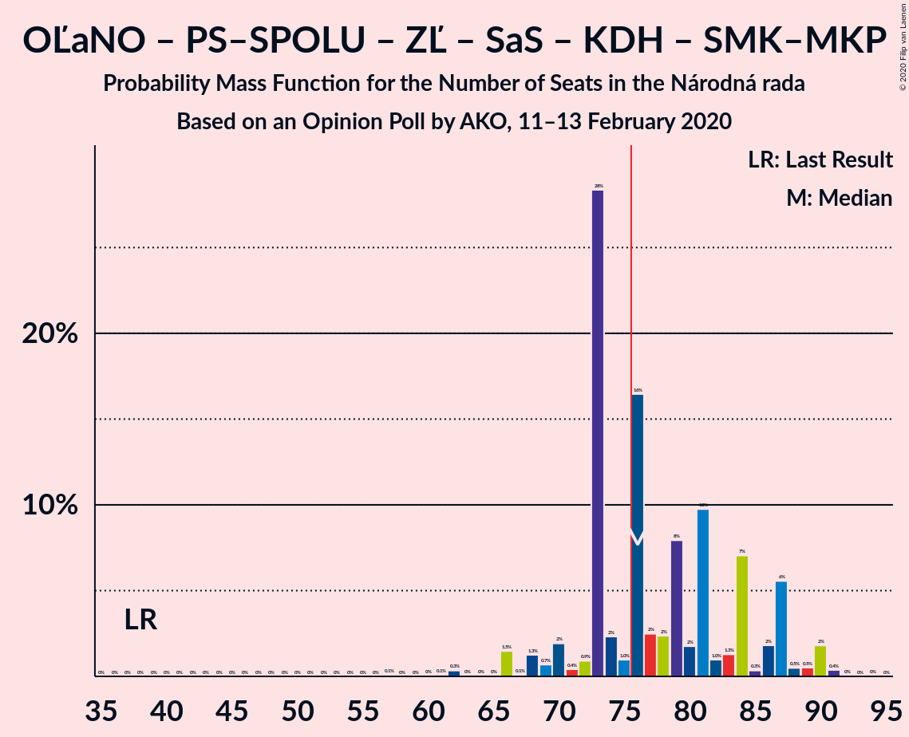

| Number of Seats | Probability | Accumulated | Special Marks |
|:---------------:|:-----------:|:-----------:|:-------------:|
| 38 | 0% | 100% | Last Result |
| 39 | 0% | 100% |  |
| 40 | 0% | 100% |  |
| 41 | 0% | 100% |  |
| 42 | 0% | 100% |  |
| 43 | 0% | 100% |  |
| 44 | 0% | 100% |  |
| 45 | 0% | 100% |  |
| 46 | 0% | 100% |  |
| 47 | 0% | 100% |  |
| 48 | 0% | 100% |  |
| 49 | 0% | 100% |  |
| 50 | 0% | 100% |  |
| 51 | 0% | 100% |  |
| 52 | 0% | 100% |  |
| 53 | 0% | 100% |  |
| 54 | 0% | 100% |  |
| 55 | 0% | 100% |  |
| 56 | 0% | 100% |  |
| 57 | 0.1% | 100% |  |
| 58 | 0% | 99.9% |  |
| 59 | 0% | 99.9% |  |
| 60 | 0% | 99.9% |  |
| 61 | 0.1% | 99.9% |  |
| 62 | 0.3% | 99.8% |  |
| 63 | 0% | 99.5% |  |
| 64 | 0% | 99.5% |  |
| 65 | 0% | 99.4% |  |
| 66 | 1.5% | 99.4% |  |
| 67 | 0.1% | 98% |  |
| 68 | 1.3% | 98% |  |
| 69 | 0.7% | 97% |  |
| 70 | 2% | 96% |  |
| 71 | 0.4% | 94% |  |
| 72 | 0.9% | 94% |  |
| 73 | 28% | 93% |  |
| 74 | 2% | 64% |  |
| 75 | 1.0% | 62% |  |
| 76 | 16% | 61% | Majority |
| 77 | 2% | 45% |  |
| 78 | 2% | 42% |  |
| 79 | 8% | 40% |  |
| 80 | 2% | 32% |  |
| 81 | 10% | 30% |  |
| 82 | 1.0% | 20% |  |
| 83 | 1.3% | 19% | Median |
| 84 | 7% | 18% |  |
| 85 | 0.3% | 11% |  |
| 86 | 2% | 11% |  |
| 87 | 6% | 9% |  |
| 88 | 0.5% | 3% |  |
| 89 | 0.5% | 3% |  |
| 90 | 2% | 2% |  |
| 91 | 0.4% | 0.4% |  |
| 92 | 0% | 0% |  |

### OBYČAJNÍ ĽUDIA a nezávislé osobnosti – Progresívne Slovensko–SPOLU–Občianska Demokracia – Za ľudí – Sloboda a Solidarita – Kresťanskodemokratické hnutie

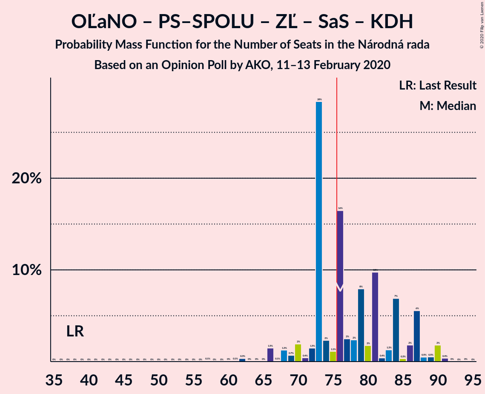

| Number of Seats | Probability | Accumulated | Special Marks |
|:---------------:|:-----------:|:-----------:|:-------------:|
| 38 | 0% | 100% | Last Result |
| 39 | 0% | 100% |  |
| 40 | 0% | 100% |  |
| 41 | 0% | 100% |  |
| 42 | 0% | 100% |  |
| 43 | 0% | 100% |  |
| 44 | 0% | 100% |  |
| 45 | 0% | 100% |  |
| 46 | 0% | 100% |  |
| 47 | 0% | 100% |  |
| 48 | 0% | 100% |  |
| 49 | 0% | 100% |  |
| 50 | 0% | 100% |  |
| 51 | 0% | 100% |  |
| 52 | 0% | 100% |  |
| 53 | 0% | 100% |  |
| 54 | 0% | 100% |  |
| 55 | 0% | 100% |  |
| 56 | 0% | 100% |  |
| 57 | 0.1% | 100% |  |
| 58 | 0% | 99.9% |  |
| 59 | 0% | 99.9% |  |
| 60 | 0% | 99.9% |  |
| 61 | 0.1% | 99.9% |  |
| 62 | 0.3% | 99.8% |  |
| 63 | 0% | 99.5% |  |
| 64 | 0% | 99.5% |  |
| 65 | 0% | 99.4% |  |
| 66 | 1.5% | 99.4% |  |
| 67 | 0.1% | 98% |  |
| 68 | 1.3% | 98% |  |
| 69 | 0.7% | 97% |  |
| 70 | 2% | 96% |  |
| 71 | 0.4% | 94% |  |
| 72 | 1.5% | 94% |  |
| 73 | 28% | 92% |  |
| 74 | 2% | 64% |  |
| 75 | 1.1% | 61% |  |
| 76 | 16% | 60% | Majority |
| 77 | 2% | 44% |  |
| 78 | 2% | 41% |  |
| 79 | 8% | 39% |  |
| 80 | 2% | 31% |  |
| 81 | 10% | 29% |  |
| 82 | 0.4% | 19% |  |
| 83 | 1.3% | 19% | Median |
| 84 | 7% | 18% |  |
| 85 | 0.3% | 11% |  |
| 86 | 2% | 11% |  |
| 87 | 6% | 9% |  |
| 88 | 0.5% | 3% |  |
| 89 | 0.5% | 3% |  |
| 90 | 2% | 2% |  |
| 91 | 0.4% | 0.4% |  |
| 92 | 0% | 0% |  |

### OBYČAJNÍ ĽUDIA a nezávislé osobnosti – Progresívne Slovensko–SPOLU–Občianska Demokracia – Za ľudí – Sloboda a Solidarita

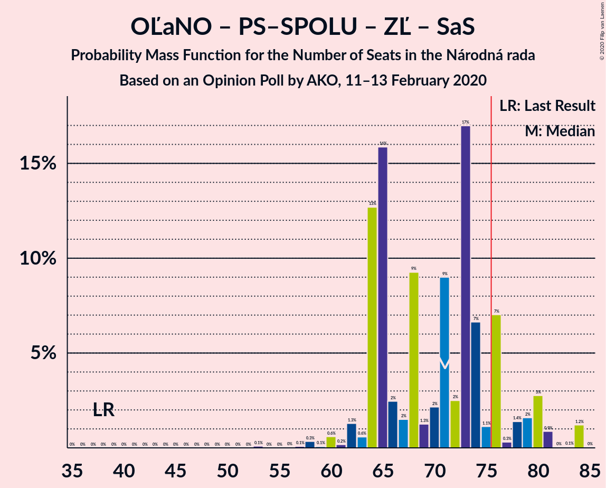

| Number of Seats | Probability | Accumulated | Special Marks |
|:---------------:|:-----------:|:-----------:|:-------------:|
| 38 | 0% | 100% | Last Result |
| 39 | 0% | 100% |  |
| 40 | 0% | 100% |  |
| 41 | 0% | 100% |  |
| 42 | 0% | 100% |  |
| 43 | 0% | 100% |  |
| 44 | 0% | 100% |  |
| 45 | 0% | 100% |  |
| 46 | 0% | 100% |  |
| 47 | 0% | 100% |  |
| 48 | 0% | 100% |  |
| 49 | 0% | 100% |  |
| 50 | 0% | 100% |  |
| 51 | 0% | 100% |  |
| 52 | 0% | 100% |  |
| 53 | 0.1% | 100% |  |
| 54 | 0% | 99.9% |  |
| 55 | 0% | 99.9% |  |
| 56 | 0% | 99.9% |  |
| 57 | 0.1% | 99.9% |  |
| 58 | 0.3% | 99.8% |  |
| 59 | 0.1% | 99.4% |  |
| 60 | 0.6% | 99.4% |  |
| 61 | 0.2% | 98.8% |  |
| 62 | 1.3% | 98.6% |  |
| 63 | 0.6% | 97% |  |
| 64 | 13% | 97% |  |
| 65 | 16% | 84% |  |
| 66 | 2% | 68% |  |
| 67 | 2% | 66% |  |
| 68 | 9% | 64% |  |
| 69 | 1.3% | 55% |  |
| 70 | 2% | 54% |  |
| 71 | 9% | 52% |  |
| 72 | 2% | 43% |  |
| 73 | 17% | 40% | Median |
| 74 | 7% | 23% |  |
| 75 | 1.1% | 16% |  |
| 76 | 7% | 15% | Majority |
| 77 | 0.3% | 8% |  |
| 78 | 1.4% | 8% |  |
| 79 | 2% | 7% |  |
| 80 | 3% | 5% |  |
| 81 | 0.9% | 2% |  |
| 82 | 0% | 1.3% |  |
| 83 | 0.1% | 1.3% |  |
| 84 | 1.2% | 1.2% |  |
| 85 | 0% | 0% |  |

### SMER–sociálna demokracia – Kotleba–Ľudová strana Naše Slovensko – SME RODINA – Slovenská národná strana

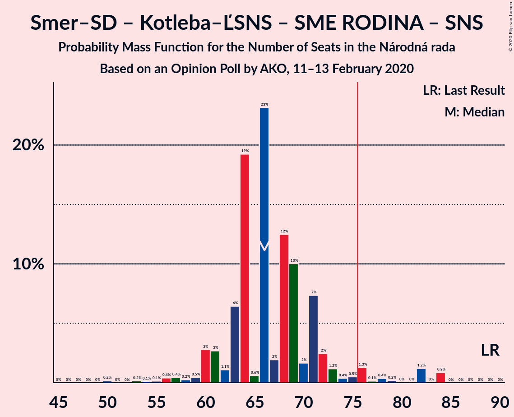

| Number of Seats | Probability | Accumulated | Special Marks |
|:---------------:|:-----------:|:-----------:|:-------------:|
| 50 | 0.2% | 100% |  |
| 51 | 0% | 99.8% |  |
| 52 | 0% | 99.8% |  |
| 53 | 0.2% | 99.8% |  |
| 54 | 0.1% | 99.7% |  |
| 55 | 0.1% | 99.6% |  |
| 56 | 0.4% | 99.4% |  |
| 57 | 0.4% | 99.0% |  |
| 58 | 0.2% | 98.6% |  |
| 59 | 0.5% | 98% |  |
| 60 | 3% | 98% |  |
| 61 | 3% | 95% |  |
| 62 | 1.1% | 92% | Median |
| 63 | 6% | 91% |  |
| 64 | 19% | 85% |  |
| 65 | 0.6% | 66% |  |
| 66 | 23% | 65% |  |
| 67 | 2% | 42% |  |
| 68 | 12% | 40% |  |
| 69 | 10% | 28% |  |
| 70 | 2% | 18% |  |
| 71 | 7% | 16% |  |
| 72 | 2% | 9% |  |
| 73 | 1.2% | 6% |  |
| 74 | 0.4% | 5% |  |
| 75 | 0.5% | 5% |  |
| 76 | 1.3% | 4% | Majority |
| 77 | 0.1% | 3% |  |
| 78 | 0.4% | 3% |  |
| 79 | 0.2% | 2% |  |
| 80 | 0% | 2% |  |
| 81 | 0% | 2% |  |
| 82 | 1.2% | 2% |  |
| 83 | 0% | 0.9% |  |
| 84 | 0.8% | 0.9% |  |
| 85 | 0% | 0% |  |
| 86 | 0% | 0% |  |
| 87 | 0% | 0% |  |
| 88 | 0% | 0% |  |
| 89 | 0% | 0% | Last Result |

### Progresívne Slovensko–SPOLU–Občianska Demokracia – Za ľudí – Sloboda a Solidarita – Kresťanskodemokratické hnutie

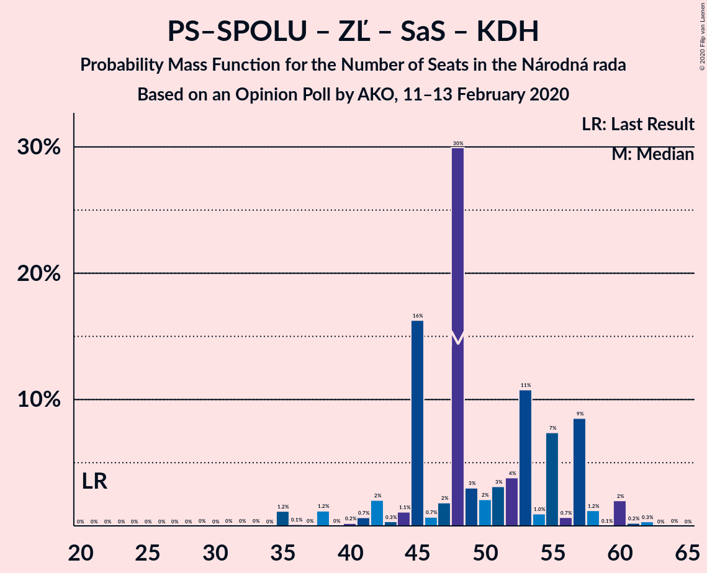

| Number of Seats | Probability | Accumulated | Special Marks |
|:---------------:|:-----------:|:-----------:|:-------------:|
| 21 | 0% | 100% | Last Result |
| 22 | 0% | 100% |  |
| 23 | 0% | 100% |  |
| 24 | 0% | 100% |  |
| 25 | 0% | 100% |  |
| 26 | 0% | 100% |  |
| 27 | 0% | 100% |  |
| 28 | 0% | 100% |  |
| 29 | 0% | 100% |  |
| 30 | 0% | 100% |  |
| 31 | 0% | 100% |  |
| 32 | 0% | 99.9% |  |
| 33 | 0% | 99.9% |  |
| 34 | 0% | 99.9% |  |
| 35 | 1.2% | 99.9% |  |
| 36 | 0.1% | 98.7% |  |
| 37 | 0% | 98.6% |  |
| 38 | 1.2% | 98.6% |  |
| 39 | 0% | 97% |  |
| 40 | 0.2% | 97% |  |
| 41 | 0.7% | 97% |  |
| 42 | 2% | 96% |  |
| 43 | 0.3% | 94% |  |
| 44 | 1.1% | 94% |  |
| 45 | 16% | 93% |  |
| 46 | 0.7% | 77% |  |
| 47 | 2% | 76% |  |
| 48 | 30% | 74% |  |
| 49 | 3% | 44% |  |
| 50 | 2% | 41% |  |
| 51 | 3% | 39% |  |
| 52 | 4% | 36% |  |
| 53 | 11% | 32% |  |
| 54 | 1.0% | 21% |  |
| 55 | 7% | 20% | Median |
| 56 | 0.7% | 13% |  |
| 57 | 9% | 12% |  |
| 58 | 1.2% | 4% |  |
| 59 | 0.1% | 3% |  |
| 60 | 2% | 3% |  |
| 61 | 0.2% | 0.6% |  |
| 62 | 0.3% | 0.4% |  |
| 63 | 0% | 0% |  |

### SMER–sociálna demokracia – SME RODINA – Slovenská národná strana

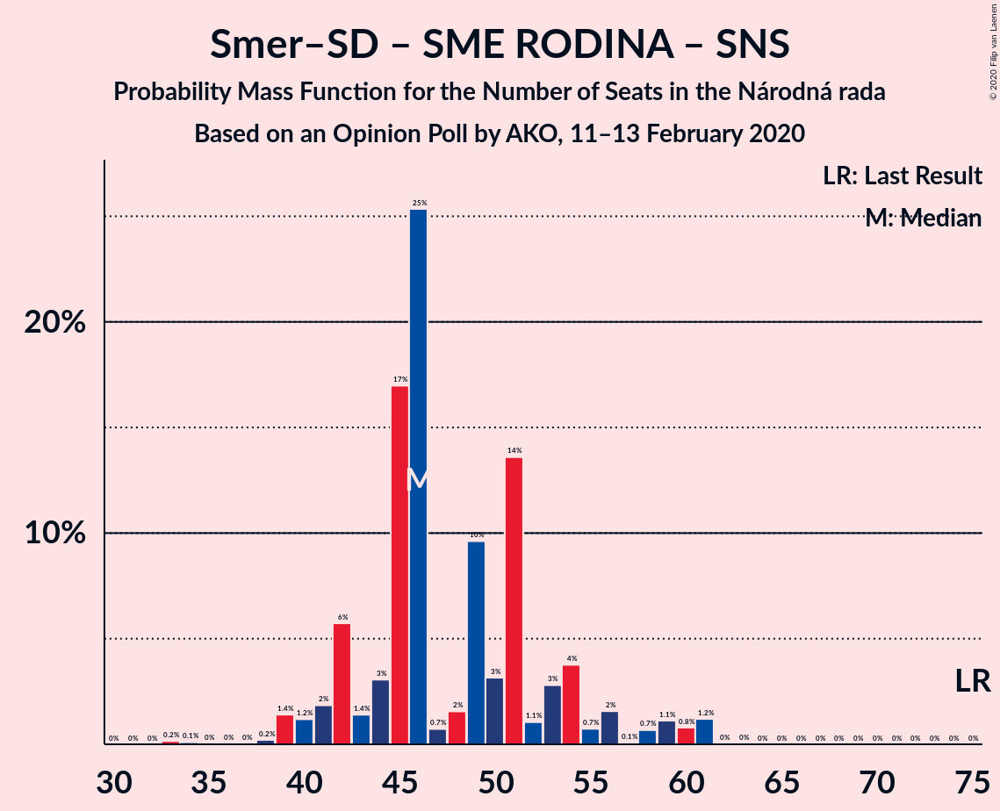

| Number of Seats | Probability | Accumulated | Special Marks |
|:---------------:|:-----------:|:-----------:|:-------------:|
| 33 | 0.2% | 100% |  |
| 34 | 0.1% | 99.8% |  |
| 35 | 0% | 99.7% |  |
| 36 | 0% | 99.7% |  |
| 37 | 0% | 99.7% |  |
| 38 | 0.2% | 99.7% |  |
| 39 | 1.4% | 99.5% |  |
| 40 | 1.2% | 98% |  |
| 41 | 2% | 97% |  |
| 42 | 6% | 95% |  |
| 43 | 1.4% | 89% |  |
| 44 | 3% | 88% | Median |
| 45 | 17% | 85% |  |
| 46 | 25% | 68% |  |
| 47 | 0.7% | 43% |  |
| 48 | 2% | 42% |  |
| 49 | 10% | 40% |  |
| 50 | 3% | 31% |  |
| 51 | 14% | 27% |  |
| 52 | 1.1% | 14% |  |
| 53 | 3% | 13% |  |
| 54 | 4% | 10% |  |
| 55 | 0.7% | 6% |  |
| 56 | 2% | 5% |  |
| 57 | 0.1% | 4% |  |
| 58 | 0.7% | 4% |  |
| 59 | 1.1% | 3% |  |
| 60 | 0.8% | 2% |  |
| 61 | 1.2% | 1.3% |  |
| 62 | 0% | 0.1% |  |
| 63 | 0% | 0% |  |
| 64 | 0% | 0% |  |
| 65 | 0% | 0% |  |
| 66 | 0% | 0% |  |
| 67 | 0% | 0% |  |
| 68 | 0% | 0% |  |
| 69 | 0% | 0% |  |
| 70 | 0% | 0% |  |
| 71 | 0% | 0% |  |
| 72 | 0% | 0% |  |
| 73 | 0% | 0% |  |
| 74 | 0% | 0% |  |
| 75 | 0% | 0% | Last Result |

### Progresívne Slovensko–SPOLU–Občianska Demokracia – Za ľudí – Sloboda a Solidarita

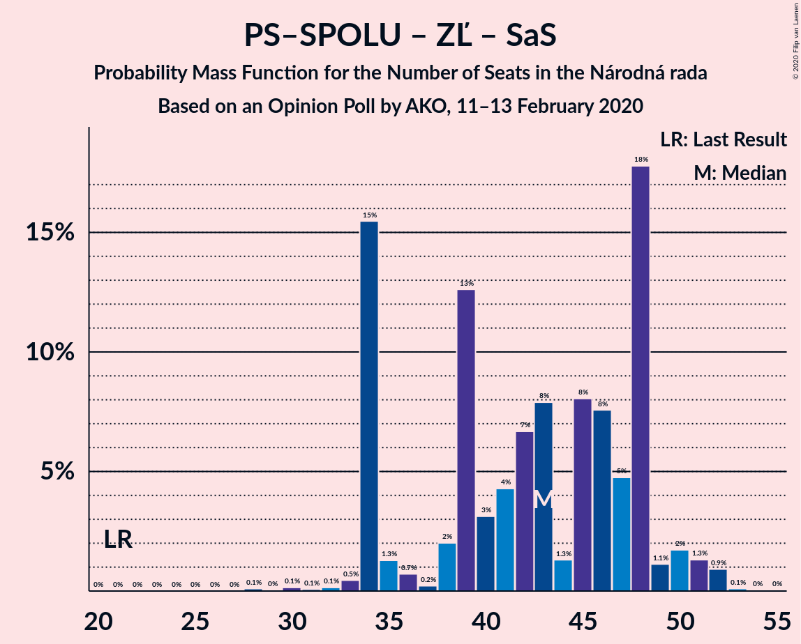

| Number of Seats | Probability | Accumulated | Special Marks |
|:---------------:|:-----------:|:-----------:|:-------------:|
| 21 | 0% | 100% | Last Result |
| 22 | 0% | 100% |  |
| 23 | 0% | 100% |  |
| 24 | 0% | 100% |  |
| 25 | 0% | 100% |  |
| 26 | 0% | 100% |  |
| 27 | 0% | 100% |  |
| 28 | 0.1% | 100% |  |
| 29 | 0% | 99.9% |  |
| 30 | 0.1% | 99.8% |  |
| 31 | 0.1% | 99.7% |  |
| 32 | 0.1% | 99.6% |  |
| 33 | 0.5% | 99.5% |  |
| 34 | 15% | 99.0% |  |
| 35 | 1.3% | 84% |  |
| 36 | 0.7% | 82% |  |
| 37 | 0.2% | 82% |  |
| 38 | 2% | 81% |  |
| 39 | 13% | 79% |  |
| 40 | 3% | 67% |  |
| 41 | 4% | 64% |  |
| 42 | 7% | 59% |  |
| 43 | 8% | 53% |  |
| 44 | 1.3% | 45% |  |
| 45 | 8% | 43% | Median |
| 46 | 8% | 35% |  |
| 47 | 5% | 28% |  |
| 48 | 18% | 23% |  |
| 49 | 1.1% | 5% |  |
| 50 | 2% | 4% |  |
| 51 | 1.3% | 2% |  |
| 52 | 0.9% | 1.1% |  |
| 53 | 0.1% | 0.2% |  |
| 54 | 0% | 0.1% |  |
| 55 | 0% | 0% |  |

### SMER–sociálna demokracia – SME RODINA

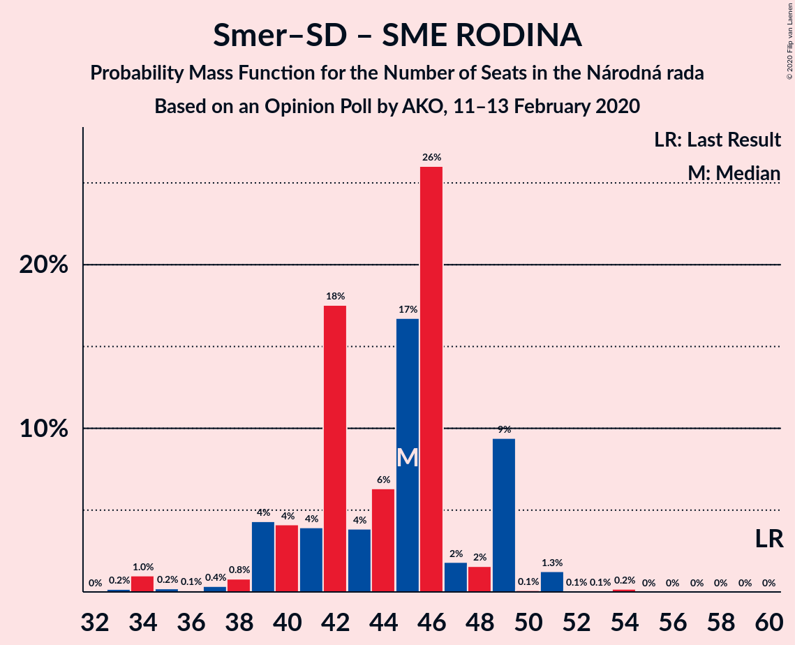

| Number of Seats | Probability | Accumulated | Special Marks |
|:---------------:|:-----------:|:-----------:|:-------------:|
| 33 | 0.2% | 100% |  |
| 34 | 1.0% | 99.8% |  |
| 35 | 0.2% | 98.8% |  |
| 36 | 0.1% | 98.6% |  |
| 37 | 0.4% | 98% |  |
| 38 | 0.8% | 98% |  |
| 39 | 4% | 97% |  |
| 40 | 4% | 93% |  |
| 41 | 4% | 89% |  |
| 42 | 18% | 85% |  |
| 43 | 4% | 67% |  |
| 44 | 6% | 64% | Median |
| 45 | 17% | 57% |  |
| 46 | 26% | 41% |  |
| 47 | 2% | 14% |  |
| 48 | 2% | 13% |  |
| 49 | 9% | 11% |  |
| 50 | 0.1% | 2% |  |
| 51 | 1.3% | 2% |  |
| 52 | 0.1% | 0.3% |  |
| 53 | 0.1% | 0.3% |  |
| 54 | 0.2% | 0.2% |  |
| 55 | 0% | 0% |  |
| 56 | 0% | 0% |  |
| 57 | 0% | 0% |  |
| 58 | 0% | 0% |  |
| 59 | 0% | 0% |  |
| 60 | 0% | 0% | Last Result |

### SMER–sociálna demokracia – Slovenská národná strana – MOST–HÍD

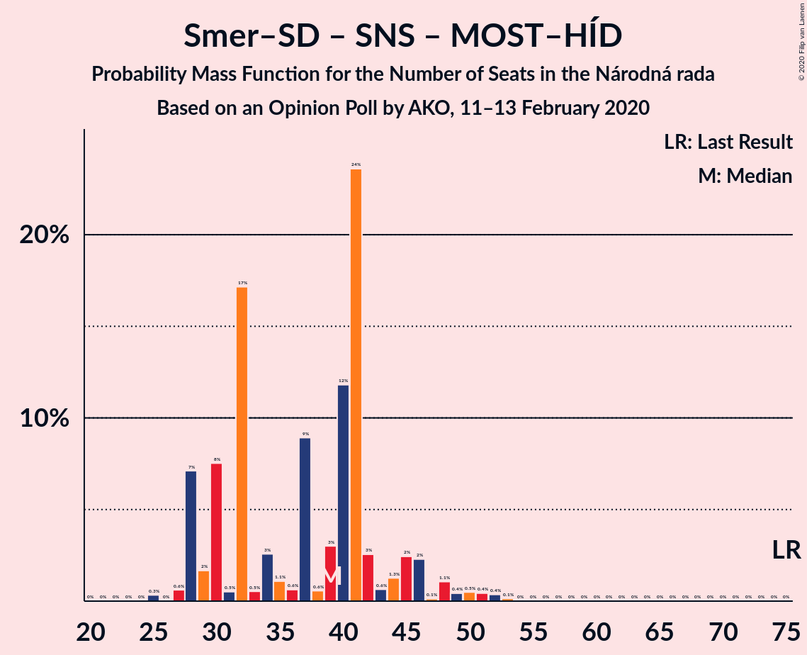

| Number of Seats | Probability | Accumulated | Special Marks |
|:---------------:|:-----------:|:-----------:|:-------------:|
| 25 | 0.3% | 100% |  |
| 26 | 0% | 99.7% |  |
| 27 | 0.6% | 99.6% |  |
| 28 | 7% | 99.0% |  |
| 29 | 2% | 92% |  |
| 30 | 8% | 90% |  |
| 31 | 0.5% | 83% | Median |
| 32 | 17% | 82% |  |
| 33 | 0.5% | 65% |  |
| 34 | 3% | 64% |  |
| 35 | 1.1% | 62% |  |
| 36 | 0.6% | 61% |  |
| 37 | 9% | 60% |  |
| 38 | 0.6% | 51% |  |
| 39 | 3% | 51% |  |
| 40 | 12% | 48% |  |
| 41 | 24% | 36% |  |
| 42 | 3% | 12% |  |
| 43 | 0.6% | 10% |  |
| 44 | 1.3% | 9% |  |
| 45 | 2% | 8% |  |
| 46 | 2% | 5% |  |
| 47 | 0.1% | 3% |  |
| 48 | 1.1% | 3% |  |
| 49 | 0.4% | 2% |  |
| 50 | 0.5% | 1.5% |  |
| 51 | 0.4% | 1.0% |  |
| 52 | 0.4% | 0.5% |  |
| 53 | 0.1% | 0.2% |  |
| 54 | 0% | 0% |  |
| 55 | 0% | 0% |  |
| 56 | 0% | 0% |  |
| 57 | 0% | 0% |  |
| 58 | 0% | 0% |  |
| 59 | 0% | 0% |  |
| 60 | 0% | 0% |  |
| 61 | 0% | 0% |  |
| 62 | 0% | 0% |  |
| 63 | 0% | 0% |  |
| 64 | 0% | 0% |  |
| 65 | 0% | 0% |  |
| 66 | 0% | 0% |  |
| 67 | 0% | 0% |  |
| 68 | 0% | 0% |  |
| 69 | 0% | 0% |  |
| 70 | 0% | 0% |  |
| 71 | 0% | 0% |  |
| 72 | 0% | 0% |  |
| 73 | 0% | 0% |  |
| 74 | 0% | 0% |  |
| 75 | 0% | 0% | Last Result |

### SMER–sociálna demokracia – Slovenská národná strana

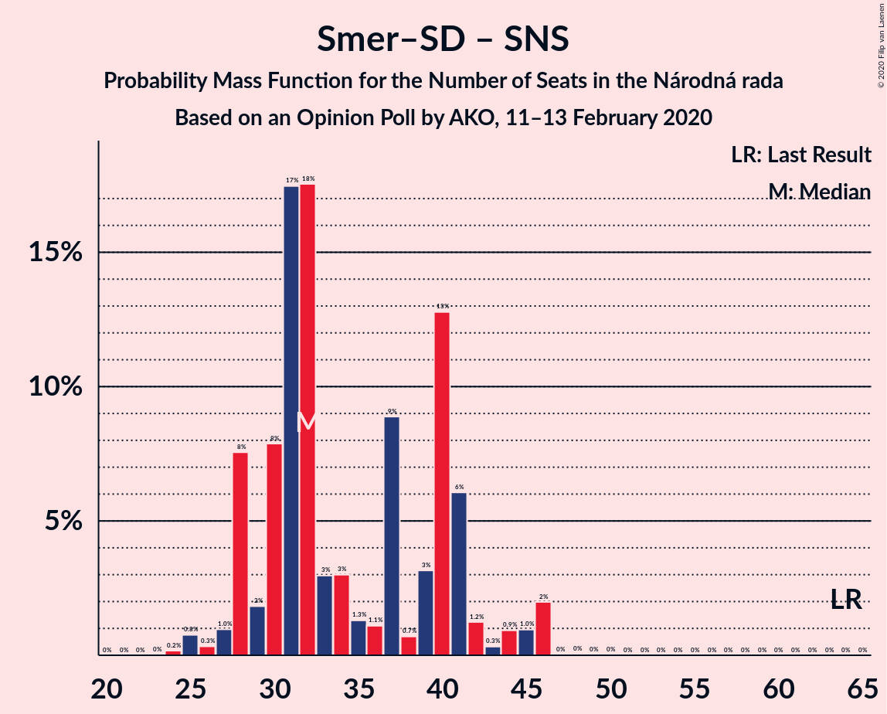

| Number of Seats | Probability | Accumulated | Special Marks |
|:---------------:|:-----------:|:-----------:|:-------------:|
| 24 | 0.2% | 100% |  |
| 25 | 0.8% | 99.8% |  |
| 26 | 0.3% | 99.1% |  |
| 27 | 1.0% | 98.7% |  |
| 28 | 8% | 98% |  |
| 29 | 2% | 90% |  |
| 30 | 8% | 88% |  |
| 31 | 17% | 80% | Median |
| 32 | 18% | 63% |  |
| 33 | 3% | 45% |  |
| 34 | 3% | 43% |  |
| 35 | 1.3% | 40% |  |
| 36 | 1.1% | 38% |  |
| 37 | 9% | 37% |  |
| 38 | 0.7% | 28% |  |
| 39 | 3% | 28% |  |
| 40 | 13% | 24% |  |
| 41 | 6% | 12% |  |
| 42 | 1.2% | 6% |  |
| 43 | 0.3% | 4% |  |
| 44 | 0.9% | 4% |  |
| 45 | 1.0% | 3% |  |
| 46 | 2% | 2% |  |
| 47 | 0% | 0.1% |  |
| 48 | 0% | 0.1% |  |
| 49 | 0% | 0% |  |
| 50 | 0% | 0% |  |
| 51 | 0% | 0% |  |
| 52 | 0% | 0% |  |
| 53 | 0% | 0% |  |
| 54 | 0% | 0% |  |
| 55 | 0% | 0% |  |
| 56 | 0% | 0% |  |
| 57 | 0% | 0% |  |
| 58 | 0% | 0% |  |
| 59 | 0% | 0% |  |
| 60 | 0% | 0% |  |
| 61 | 0% | 0% |  |
| 62 | 0% | 0% |  |
| 63 | 0% | 0% |  |
| 64 | 0% | 0% | Last Result |

### SMER–sociálna demokracia

| Number of Seats | Probability | Accumulated | Special Marks |
|:---------------:|:-----------:|:-----------:|:-------------:|
| 23 | 1.1% | 100% |  |
| 24 | 0.2% | 98.9% |  |
| 25 | 1.4% | 98.7% |  |
| 26 | 1.4% | 97% |  |
| 27 | 3% | 96% |  |
| 28 | 11% | 92% |  |
| 29 | 3% | 81% |  |
| 30 | 9% | 78% |  |
| 31 | 34% | 69% | Median |
| 32 | 19% | 35% |  |
| 33 | 3% | 16% |  |
| 34 | 3% | 13% |  |
| 35 | 2% | 10% |  |
| 36 | 1.3% | 7% |  |
| 37 | 6% | 6% |  |
| 38 | 0.1% | 0.2% |  |
| 39 | 0% | 0.1% |  |
| 40 | 0.1% | 0.1% |  |
| 41 | 0% | 0% |  |
| 42 | 0% | 0% |  |
| 43 | 0% | 0% |  |
| 44 | 0% | 0% |  |
| 45 | 0% | 0% |  |
| 46 | 0% | 0% |  |
| 47 | 0% | 0% |  |
| 48 | 0% | 0% |  |
| 49 | 0% | 0% | Last Result |

## Technical Information

### Opinion Poll

+ **Polling firm:** AKO
+ **Commissioner(s):** —
+ **Fieldwork period:** 11–13 February 2020

### Calculations

+ **Sample size:** 1000
+ **Simulations done:** 1,048,576
+ **Error estimate:** 2.96%

