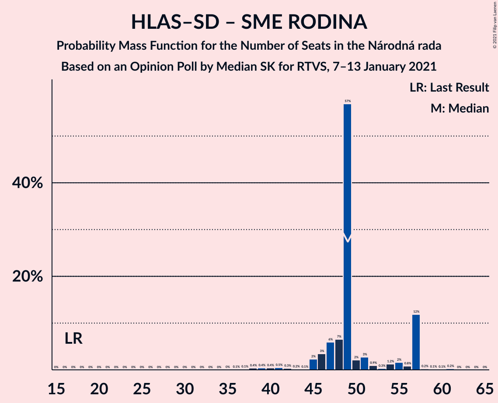
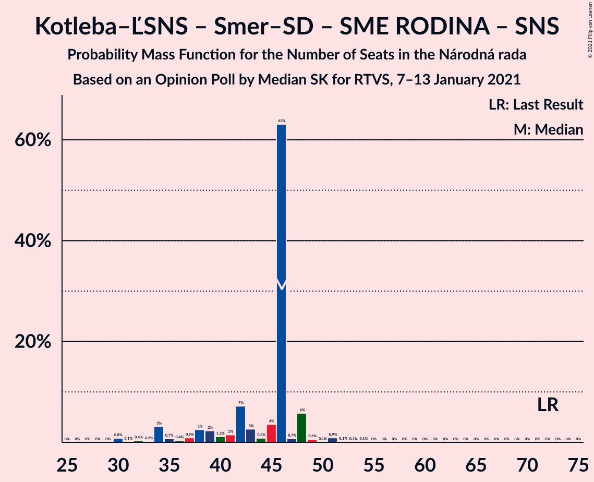

# Opinion Poll by Median SK for RTVS, 7–13 January 2021

<a href="#voting-intentions">Voting Intentions</a> | <a href="#seats">Seats</a> | <a href="#coalitions">Coalitions</a> | <a href="#technical-information">Technical Information</a>

## Voting Intentions

### Confidence Intervals

| Party | Last Result | Poll Result | 80% Confidence Interval | 90% Confidence Interval | 95% Confidence Interval | 99% Confidence Interval |
|:-----:|:-----------:|:-----------:|:-----------------------:|:-----------------------:|:-----------------------:|:-----------------------:|
| HLAS–sociálna demokracia | 0.0% | 21.7% | 20.1–23.4% |19.6–23.9% |19.2–24.3% |18.5–25.2% |
| OBYČAJNÍ ĽUDIA a nezávislé osobnosti | 25.0% | 14.9% | 13.5–16.4% |13.1–16.9% |12.8–17.2% |12.2–18.0% |
| Sloboda a Solidarita | 6.2% | 11.8% | 10.6–13.2% |10.2–13.6% |9.9–13.9% |9.4–14.6% |
| Kotleba–Ľudová strana Naše Slovensko | 8.0% | 9.2% | 8.1–10.5% |7.8–10.8% |7.5–11.1% |7.1–11.8% |
| SMER–sociálna demokracia | 18.3% | 8.2% | 7.2–9.4% |6.9–9.8% |6.6–10.1% |6.2–10.7% |
| Progresívne Slovensko | 7.0% | 6.5% | 5.6–7.6% |5.3–7.9% |5.1–8.2% |4.7–8.8% |
| SME RODINA | 8.2% | 5.6% | 4.8–6.6% |4.5–6.9% |4.3–7.2% |4.0–7.7% |
| Za ľudí | 5.8% | 4.4% | 3.7–5.3% |3.5–5.6% |3.3–5.9% |3.0–6.3% |
| Kresťanskodemokratické hnutie | 4.6% | 3.7% | 3.0–4.6% |2.9–4.8% |2.7–5.1% |2.4–5.5% |
| Strana maďarskej koalície–Magyar Koalíció Pártja | 3.9% | 3.1% | 2.5–3.9% |2.3–4.2% |2.2–4.4% |1.9–4.8% |
| Dobrá voľba | 3.1% | 2.6% | 2.1–3.4% |1.9–3.6% |1.8–3.8% |1.5–4.2% |
| VLASŤ | 2.9% | 2.4% | 1.9–3.2% |1.7–3.4% |1.6–3.6% |1.4–3.9% |
| MOST–HÍD | 2.0% | 1.6% | 1.2–2.2% |1.1–2.4% |1.0–2.6% |0.8–2.9% |
| Slovenská národná strana | 3.2% | 1.4% | 1.0–2.0% |0.9–2.2% |0.8–2.3% |0.7–2.7% |

*Note:* The poll result column reflects the actual value used in the calculations. Published results may vary slightly, and in addition be rounded to fewer digits.

## Seats

### Confidence Intervals

| Party | Last Result | Median | 80% Confidence Interval | 90% Confidence Interval | 95% Confidence Interval | 99% Confidence Interval |
|:-----:|:-----------:|:------:|:-----------------------:|:-----------------------:|:-----------------------:|:-----------------------:|
| <a href="#hlas–sociálna-demokracia">HLAS–sociálna demokracia</a> | 0 | 38 | 36–47 |36–47 |36–48 |35–51 |
| <a href="#obyčajní-ľudia-a-nezávislé-osobnosti">OBYČAJNÍ ĽUDIA a nezávislé osobnosti</a> | 53 | 29 | 25–32 |25–32 |24–33 |23–36 |
| <a href="#sloboda-a-solidarita">Sloboda a Solidarita</a> | 13 | 23 | 21–24 |20–25 |19–26 |18–27 |
| <a href="#kotleba–ľudová-strana-naše-slovensko">Kotleba–Ľudová strana Naše Slovensko</a> | 17 | 19 | 16–19 |14–20 |14–22 |13–24 |
| <a href="#smer–sociálna-demokracia">SMER–sociálna demokracia</a> | 38 | 16 | 14–18 |14–19 |13–19 |11–20 |
| <a href="#progresívne-slovensko">Progresívne Slovensko</a> | 0 | 14 | 11–15 |10–15 |10–15 |9–18 |
| <a href="#sme-rodina">SME RODINA</a> | 17 | 11 | 9–12 |0–13 |0–13 |0–14 |
| <a href="#za-ľudí">Za ľudí</a> | 12 | 0 | 0 |0–10 |0–11 |0–12 |
| <a href="#kresťanskodemokratické-hnutie">Kresťanskodemokratické hnutie</a> | 0 | 0 | 0 |0 |0–9 |0–10 |
| <a href="#strana-maďarskej-koalície–magyar-koalíció-pártja">Strana maďarskej koalície–Magyar Koalíció Pártja</a> | 0 | 0 | 0 |0 |0 |0 |
| <a href="#dobrá-voľba">Dobrá voľba</a> | 0 | 0 | 0 |0 |0 |0 |
| <a href="#vlasť">VLASŤ</a> | 0 | 0 | 0 |0 |0 |0 |
| <a href="#most–híd">MOST–HÍD</a> | 0 | 0 | 0 |0 |0 |0 |
| <a href="#slovenská-národná-strana">Slovenská národná strana</a> | 0 | 0 | 0 |0 |0 |0 |

### HLAS–sociálna demokracia

*For a full overview of the results for this party, see the [HLAS–sociálna demokracia](party-hlas–sociálnademokracia.html) page.*

| Number of Seats | Probability | Accumulated | Special Marks |
|:---------------:|:-----------:|:-----------:|:-------------:|
| 0 | 0% | 100% | Last Result |
| 1 | 0% | 100% |  |
| 2 | 0% | 100% |  |
| 3 | 0% | 100% |  |
| 4 | 0% | 100% |  |
| 5 | 0% | 100% |  |
| 6 | 0% | 100% |  |
| 7 | 0% | 100% |  |
| 8 | 0% | 100% |  |
| 9 | 0% | 100% |  |
| 10 | 0% | 100% |  |
| 11 | 0% | 100% |  |
| 12 | 0% | 100% |  |
| 13 | 0% | 100% |  |
| 14 | 0% | 100% |  |
| 15 | 0% | 100% |  |
| 16 | 0% | 100% |  |
| 17 | 0% | 100% |  |
| 18 | 0% | 100% |  |
| 19 | 0% | 100% |  |
| 20 | 0% | 100% |  |
| 21 | 0% | 100% |  |
| 22 | 0% | 100% |  |
| 23 | 0% | 100% |  |
| 24 | 0% | 100% |  |
| 25 | 0% | 100% |  |
| 26 | 0% | 100% |  |
| 27 | 0% | 100% |  |
| 28 | 0% | 100% |  |
| 29 | 0% | 100% |  |
| 30 | 0% | 100% |  |
| 31 | 0% | 100% |  |
| 32 | 0% | 100% |  |
| 33 | 0% | 100% |  |
| 34 | 0.4% | 100% |  |
| 35 | 2% | 99.5% |  |
| 36 | 9% | 98% |  |
| 37 | 2% | 89% |  |
| 38 | 58% | 87% | Median |
| 39 | 2% | 29% |  |
| 40 | 2% | 27% |  |
| 41 | 2% | 25% |  |
| 42 | 1.4% | 23% |  |
| 43 | 2% | 22% |  |
| 44 | 5% | 20% |  |
| 45 | 0.1% | 15% |  |
| 46 | 3% | 15% |  |
| 47 | 8% | 12% |  |
| 48 | 4% | 5% |  |
| 49 | 0% | 1.0% |  |
| 50 | 0.4% | 0.9% |  |
| 51 | 0.5% | 0.6% |  |
| 52 | 0% | 0.1% |  |
| 53 | 0% | 0% |  |

### OBYČAJNÍ ĽUDIA a nezávislé osobnosti

*For a full overview of the results for this party, see the [OBYČAJNÍ ĽUDIA a nezávislé osobnosti](party-obyčajníľudiaanezávisléosobnosti.html) page.*

| Number of Seats | Probability | Accumulated | Special Marks |
|:---------------:|:-----------:|:-----------:|:-------------:|
| 22 | 0.2% | 100% |  |
| 23 | 2% | 99.8% |  |
| 24 | 0.6% | 98% |  |
| 25 | 8% | 97% |  |
| 26 | 0.6% | 89% |  |
| 27 | 3% | 89% |  |
| 28 | 4% | 86% |  |
| 29 | 62% | 82% | Median |
| 30 | 3% | 20% |  |
| 31 | 5% | 17% |  |
| 32 | 9% | 12% |  |
| 33 | 1.3% | 3% |  |
| 34 | 0.4% | 2% |  |
| 35 | 0.7% | 1.5% |  |
| 36 | 0.4% | 0.8% |  |
| 37 | 0.4% | 0.4% |  |
| 38 | 0% | 0% |  |
| 39 | 0% | 0% |  |
| 40 | 0% | 0% |  |
| 41 | 0% | 0% |  |
| 42 | 0% | 0% |  |
| 43 | 0% | 0% |  |
| 44 | 0% | 0% |  |
| 45 | 0% | 0% |  |
| 46 | 0% | 0% |  |
| 47 | 0% | 0% |  |
| 48 | 0% | 0% |  |
| 49 | 0% | 0% |  |
| 50 | 0% | 0% |  |
| 51 | 0% | 0% |  |
| 52 | 0% | 0% |  |
| 53 | 0% | 0% | Last Result |

### Sloboda a Solidarita

*For a full overview of the results for this party, see the [Sloboda a Solidarita](party-slobodaasolidarita.html) page.*

| Number of Seats | Probability | Accumulated | Special Marks |
|:---------------:|:-----------:|:-----------:|:-------------:|
| 13 | 0% | 100% | Last Result |
| 14 | 0% | 100% |  |
| 15 | 0% | 100% |  |
| 16 | 0% | 100% |  |
| 17 | 0.3% | 100% |  |
| 18 | 2% | 99.7% |  |
| 19 | 0.9% | 98% |  |
| 20 | 3% | 97% |  |
| 21 | 15% | 94% |  |
| 22 | 7% | 79% |  |
| 23 | 58% | 72% | Median |
| 24 | 6% | 13% |  |
| 25 | 4% | 7% |  |
| 26 | 2% | 3% |  |
| 27 | 0.6% | 1.0% |  |
| 28 | 0.3% | 0.4% |  |
| 29 | 0.1% | 0.1% |  |
| 30 | 0% | 0% |  |

### Kotleba–Ľudová strana Naše Slovensko

*For a full overview of the results for this party, see the [Kotleba–Ľudová strana Naše Slovensko](party-kotleba–ľudovástrananašeslovensko.html) page.*

| Number of Seats | Probability | Accumulated | Special Marks |
|:---------------:|:-----------:|:-----------:|:-------------:|
| 13 | 0.6% | 100% |  |
| 14 | 5% | 99.3% |  |
| 15 | 4% | 94% |  |
| 16 | 5% | 90% |  |
| 17 | 5% | 85% | Last Result |
| 18 | 13% | 80% |  |
| 19 | 62% | 68% | Median |
| 20 | 2% | 6% |  |
| 21 | 0.4% | 4% |  |
| 22 | 1.4% | 4% |  |
| 23 | 0.2% | 2% |  |
| 24 | 2% | 2% |  |
| 25 | 0% | 0% |  |

### SMER–sociálna demokracia

*For a full overview of the results for this party, see the [SMER–sociálna demokracia](party-smer–sociálnademokracia.html) page.*

| Number of Seats | Probability | Accumulated | Special Marks |
|:---------------:|:-----------:|:-----------:|:-------------:|
| 11 | 0.7% | 100% |  |
| 12 | 0.6% | 99.3% |  |
| 13 | 2% | 98.7% |  |
| 14 | 13% | 97% |  |
| 15 | 3% | 84% |  |
| 16 | 60% | 81% | Median |
| 17 | 3% | 20% |  |
| 18 | 10% | 17% |  |
| 19 | 6% | 8% |  |
| 20 | 1.2% | 1.4% |  |
| 21 | 0.1% | 0.2% |  |
| 22 | 0.1% | 0.1% |  |
| 23 | 0% | 0% |  |
| 24 | 0% | 0% |  |
| 25 | 0% | 0% |  |
| 26 | 0% | 0% |  |
| 27 | 0% | 0% |  |
| 28 | 0% | 0% |  |
| 29 | 0% | 0% |  |
| 30 | 0% | 0% |  |
| 31 | 0% | 0% |  |
| 32 | 0% | 0% |  |
| 33 | 0% | 0% |  |
| 34 | 0% | 0% |  |
| 35 | 0% | 0% |  |
| 36 | 0% | 0% |  |
| 37 | 0% | 0% |  |
| 38 | 0% | 0% | Last Result |

### Progresívne Slovensko

*For a full overview of the results for this party, see the [Progresívne Slovensko](party-progresívneslovensko.html) page.*

| Number of Seats | Probability | Accumulated | Special Marks |
|:---------------:|:-----------:|:-----------:|:-------------:|
| 0 | 0.4% | 100% | Last Result |
| 1 | 0% | 99.6% |  |
| 2 | 0% | 99.6% |  |
| 3 | 0% | 99.6% |  |
| 4 | 0% | 99.6% |  |
| 5 | 0% | 99.6% |  |
| 6 | 0% | 99.6% |  |
| 7 | 0% | 99.6% |  |
| 8 | 0% | 99.6% |  |
| 9 | 0.2% | 99.6% |  |
| 10 | 6% | 99.4% |  |
| 11 | 5% | 93% |  |
| 12 | 13% | 88% |  |
| 13 | 6% | 75% |  |
| 14 | 58% | 70% | Median |
| 15 | 9% | 12% |  |
| 16 | 1.3% | 2% |  |
| 17 | 0.4% | 0.9% |  |
| 18 | 0.5% | 0.5% |  |
| 19 | 0% | 0% |  |

### SME RODINA

*For a full overview of the results for this party, see the [SME RODINA](party-smerodina.html) page.*

| Number of Seats | Probability | Accumulated | Special Marks |
|:---------------:|:-----------:|:-----------:|:-------------:|
| 0 | 9% | 100% |  |
| 1 | 0% | 91% |  |
| 2 | 0% | 91% |  |
| 3 | 0% | 91% |  |
| 4 | 0% | 91% |  |
| 5 | 0% | 91% |  |
| 6 | 0% | 91% |  |
| 7 | 0% | 91% |  |
| 8 | 0% | 91% |  |
| 9 | 1.0% | 91% |  |
| 10 | 11% | 89% |  |
| 11 | 65% | 78% | Median |
| 12 | 4% | 13% |  |
| 13 | 7% | 9% |  |
| 14 | 1.2% | 1.5% |  |
| 15 | 0.2% | 0.3% |  |
| 16 | 0% | 0.1% |  |
| 17 | 0.1% | 0.1% | Last Result |
| 18 | 0% | 0% |  |

### Za ľudí

*For a full overview of the results for this party, see the [Za ľudí](party-zaľudí.html) page.*

| Number of Seats | Probability | Accumulated | Special Marks |
|:---------------:|:-----------:|:-----------:|:-------------:|
| 0 | 94% | 100% | Median |
| 1 | 0% | 6% |  |
| 2 | 0% | 6% |  |
| 3 | 0% | 6% |  |
| 4 | 0% | 6% |  |
| 5 | 0% | 6% |  |
| 6 | 0% | 6% |  |
| 7 | 0% | 6% |  |
| 8 | 0% | 6% |  |
| 9 | 0.3% | 6% |  |
| 10 | 2% | 6% |  |
| 11 | 2% | 3% |  |
| 12 | 0.7% | 0.7% | Last Result |
| 13 | 0.1% | 0.1% |  |
| 14 | 0% | 0% |  |

### Kresťanskodemokratické hnutie

*For a full overview of the results for this party, see the [Kresťanskodemokratické hnutie](party-kresťanskodemokratickéhnutie.html) page.*

| Number of Seats | Probability | Accumulated | Special Marks |
|:---------------:|:-----------:|:-----------:|:-------------:|
| 0 | 97% | 100% | Last Result, Median |
| 1 | 0% | 3% |  |
| 2 | 0% | 3% |  |
| 3 | 0% | 3% |  |
| 4 | 0% | 3% |  |
| 5 | 0% | 3% |  |
| 6 | 0% | 3% |  |
| 7 | 0% | 3% |  |
| 8 | 0% | 3% |  |
| 9 | 0.7% | 3% |  |
| 10 | 1.5% | 2% |  |
| 11 | 0.3% | 0.4% |  |
| 12 | 0% | 0% |  |

### Strana maďarskej koalície–Magyar Koalíció Pártja

*For a full overview of the results for this party, see the [Strana maďarskej koalície–Magyar Koalíció Pártja](party-stranamaďarskejkoalície–magyarkoalíciópártja.html) page.*

| Number of Seats | Probability | Accumulated | Special Marks |
|:---------------:|:-----------:|:-----------:|:-------------:|
| 0 | 100% | 100% | Last Result, Median |

### Dobrá voľba

*For a full overview of the results for this party, see the [Dobrá voľba](party-dobrávoľba.html) page.*

| Number of Seats | Probability | Accumulated | Special Marks |
|:---------------:|:-----------:|:-----------:|:-------------:|
| 0 | 100% | 100% | Last Result, Median |

### VLASŤ

*For a full overview of the results for this party, see the [VLASŤ](party-vlasť.html) page.*

| Number of Seats | Probability | Accumulated | Special Marks |
|:---------------:|:-----------:|:-----------:|:-------------:|
| 0 | 100% | 100% | Last Result, Median |

### MOST–HÍD

*For a full overview of the results for this party, see the [MOST–HÍD](party-most–híd.html) page.*

| Number of Seats | Probability | Accumulated | Special Marks |
|:---------------:|:-----------:|:-----------:|:-------------:|
| 0 | 100% | 100% | Last Result, Median |

### Slovenská národná strana

*For a full overview of the results for this party, see the [Slovenská národná strana](party-slovenskánárodnástrana.html) page.*

| Number of Seats | Probability | Accumulated | Special Marks |
|:---------------:|:-----------:|:-----------:|:-------------:|
| 0 | 100% | 100% | Last Result, Median |

## Coalitions

### Confidence Intervals

| Coalition | Last Result | Median | Majority? | 80% Confidence Interval | 90% Confidence Interval | 95% Confidence Interval | 99% Confidence Interval |
|:---------:|:-----------:|:------:|:---------:|:-----------------------:|:-----------------------:|:-----------------------:|:-----------------------:|
| HLAS–sociálna demokracia – Kotleba–Ľudová strana Naše Slovensko – SMER–sociálna demokracia – SME RODINA – Slovenská národná strana | 72 | 84 | 97% | 82–89 | 78–90 | 75–91 | 71–91 |
| HLAS–sociálna demokracia – SMER–sociálna demokracia – SME RODINA | 55 | 65 | 5% | 62–71 | 60–73 | 59–76 | 54–76 |
| HLAS–sociálna demokracia – SMER–sociálna demokracia – SME RODINA – Slovenská národná strana | 55 | 65 | 5% | 62–71 | 60–73 | 59–76 | 54–76 |
| HLAS–sociálna demokracia – Kotleba–Ľudová strana Naše Slovensko – SME RODINA – Slovenská národná strana | 34 | 68 | 1.2% | 65–73 | 62–75 | 60–75 | 55–77 |
| HLAS–sociálna demokracia – SMER–sociálna demokracia – MOST–HÍD – Slovenská národná strana | 38 | 54 | 0% | 54–61 | 52–63 | 49–64 | 48–70 |
| HLAS–sociálna demokracia – SMER–sociálna demokracia – Slovenská národná strana | 38 | 54 | 0% | 54–61 | 52–63 | 49–64 | 48–70 |
| HLAS–sociálna demokracia – SME RODINA | 17 | 49 | 0% | 47–57 | 46–57 | 44–57 | 38–58 |
| HLAS–sociálna demokracia – SME RODINA – Slovenská národná strana | 17 | 49 | 0% | 47–57 | 46–57 | 44–57 | 38–58 |
| HLAS–sociálna demokracia – MOST–HÍD – Slovenská národná strana | 0 | 38 | 0% | 36–47 | 36–47 | 36–48 | 35–51 |
| HLAS–sociálna demokracia – Slovenská národná strana | 0 | 38 | 0% | 36–47 | 36–47 | 36–48 | 35–51 |
| Kotleba–Ľudová strana Naše Slovensko – SMER–sociálna demokracia – SME RODINA – Slovenská národná strana | 72 | 46 | 0% | 39–46 | 35–48 | 34–48 | 30–51 |
| SMER–sociálna demokracia – SME RODINA | 55 | 27 | 0% | 23–30 | 16–31 | 14–32 | 13–32 |
| SMER–sociálna demokracia – SME RODINA – Slovenská národná strana | 55 | 27 | 0% | 23–30 | 16–31 | 14–32 | 13–32 |
| SMER–sociálna demokracia – MOST–HÍD – Slovenská národná strana | 38 | 16 | 0% | 14–18 | 14–19 | 13–19 | 11–20 |
| SMER–sociálna demokracia | 38 | 16 | 0% | 14–18 | 14–19 | 13–19 | 11–20 |
| SMER–sociálna demokracia – Slovenská národná strana | 38 | 16 | 0% | 14–18 | 14–19 | 13–19 | 11–20 |

### HLAS–sociálna demokracia – Kotleba–Ľudová strana Naše Slovensko – SMER–sociálna demokracia – SME RODINA – Slovenská národná strana

| Number of Seats | Probability | Accumulated | Special Marks |
|:---------------:|:-----------:|:-----------:|:-------------:|
| 69 | 0.3% | 100% |  |
| 70 | 0% | 99.7% |  |
| 71 | 0.3% | 99.7% |  |
| 72 | 0% | 99.4% | Last Result |
| 73 | 0.1% | 99.4% |  |
| 74 | 2% | 99.3% |  |
| 75 | 0.3% | 98% |  |
| 76 | 0.4% | 97% | Majority |
| 77 | 2% | 97% |  |
| 78 | 2% | 95% |  |
| 79 | 2% | 93% |  |
| 80 | 1.1% | 92% |  |
| 81 | 0.7% | 91% |  |
| 82 | 6% | 90% |  |
| 83 | 1.2% | 84% |  |
| 84 | 63% | 83% | Median |
| 85 | 1.1% | 20% |  |
| 86 | 1.4% | 18% |  |
| 87 | 1.5% | 17% |  |
| 88 | 0.4% | 15% |  |
| 89 | 7% | 15% |  |
| 90 | 5% | 8% |  |
| 91 | 3% | 3% |  |
| 92 | 0.2% | 0.5% |  |
| 93 | 0% | 0.3% |  |
| 94 | 0.1% | 0.3% |  |
| 95 | 0.1% | 0.2% |  |
| 96 | 0% | 0.1% |  |
| 97 | 0% | 0.1% |  |
| 98 | 0% | 0% |  |

### HLAS–sociálna demokracia – SMER–sociálna demokracia – SME RODINA

| Number of Seats | Probability | Accumulated | Special Marks |
|:---------------:|:-----------:|:-----------:|:-------------:|
| 52 | 0% | 100% |  |
| 53 | 0.4% | 99.9% |  |
| 54 | 0.2% | 99.5% |  |
| 55 | 0.1% | 99.3% | Last Result |
| 56 | 0.2% | 99.2% |  |
| 57 | 0.2% | 99.0% |  |
| 58 | 0.2% | 98.8% |  |
| 59 | 2% | 98.6% |  |
| 60 | 4% | 96% |  |
| 61 | 1.4% | 93% |  |
| 62 | 1.3% | 91% |  |
| 63 | 2% | 90% |  |
| 64 | 4% | 88% |  |
| 65 | 61% | 84% | Median |
| 66 | 2% | 24% |  |
| 67 | 1.1% | 22% |  |
| 68 | 2% | 21% |  |
| 69 | 3% | 19% |  |
| 70 | 1.1% | 16% |  |
| 71 | 8% | 15% |  |
| 72 | 0.7% | 7% |  |
| 73 | 2% | 6% |  |
| 74 | 0% | 5% |  |
| 75 | 0% | 5% |  |
| 76 | 5% | 5% | Majority |
| 77 | 0% | 0.1% |  |
| 78 | 0.1% | 0.1% |  |
| 79 | 0% | 0% |  |

### HLAS–sociálna demokracia – SMER–sociálna demokracia – SME RODINA – Slovenská národná strana

| Number of Seats | Probability | Accumulated | Special Marks |
|:---------------:|:-----------:|:-----------:|:-------------:|
| 52 | 0% | 100% |  |
| 53 | 0.4% | 99.9% |  |
| 54 | 0.2% | 99.5% |  |
| 55 | 0.1% | 99.3% | Last Result |
| 56 | 0.2% | 99.2% |  |
| 57 | 0.2% | 99.0% |  |
| 58 | 0.2% | 98.8% |  |
| 59 | 2% | 98.6% |  |
| 60 | 4% | 96% |  |
| 61 | 1.4% | 93% |  |
| 62 | 1.3% | 91% |  |
| 63 | 2% | 90% |  |
| 64 | 4% | 88% |  |
| 65 | 61% | 84% | Median |
| 66 | 2% | 24% |  |
| 67 | 1.1% | 22% |  |
| 68 | 2% | 21% |  |
| 69 | 3% | 19% |  |
| 70 | 1.1% | 16% |  |
| 71 | 8% | 15% |  |
| 72 | 0.7% | 7% |  |
| 73 | 2% | 6% |  |
| 74 | 0% | 5% |  |
| 75 | 0% | 5% |  |
| 76 | 5% | 5% | Majority |
| 77 | 0% | 0.1% |  |
| 78 | 0.1% | 0.1% |  |
| 79 | 0% | 0% |  |

### HLAS–sociálna demokracia – Kotleba–Ľudová strana Naše Slovensko – SME RODINA – Slovenská národná strana

| Number of Seats | Probability | Accumulated | Special Marks |
|:---------------:|:-----------:|:-----------:|:-------------:|
| 34 | 0% | 100% | Last Result |
| 35 | 0% | 100% |  |
| 36 | 0% | 100% |  |
| 37 | 0% | 100% |  |
| 38 | 0% | 100% |  |
| 39 | 0% | 100% |  |
| 40 | 0% | 100% |  |
| 41 | 0% | 100% |  |
| 42 | 0% | 100% |  |
| 43 | 0% | 100% |  |
| 44 | 0% | 100% |  |
| 45 | 0% | 100% |  |
| 46 | 0% | 100% |  |
| 47 | 0% | 100% |  |
| 48 | 0% | 100% |  |
| 49 | 0% | 100% |  |
| 50 | 0% | 100% |  |
| 51 | 0% | 100% |  |
| 52 | 0% | 100% |  |
| 53 | 0.1% | 100% |  |
| 54 | 0% | 99.9% |  |
| 55 | 0.4% | 99.9% |  |
| 56 | 0.4% | 99.5% |  |
| 57 | 0.3% | 99.1% |  |
| 58 | 0.3% | 98.8% |  |
| 59 | 0.1% | 98% |  |
| 60 | 2% | 98% |  |
| 61 | 0.3% | 96% |  |
| 62 | 2% | 96% |  |
| 63 | 0.6% | 94% |  |
| 64 | 2% | 93% |  |
| 65 | 3% | 91% |  |
| 66 | 9% | 88% |  |
| 67 | 2% | 79% |  |
| 68 | 56% | 77% | Median |
| 69 | 1.1% | 21% |  |
| 70 | 3% | 20% |  |
| 71 | 5% | 17% |  |
| 72 | 0.8% | 12% |  |
| 73 | 2% | 11% |  |
| 74 | 0.6% | 9% |  |
| 75 | 7% | 8% |  |
| 76 | 0.6% | 1.2% | Majority |
| 77 | 0.2% | 0.7% |  |
| 78 | 0.3% | 0.4% |  |
| 79 | 0.1% | 0.1% |  |
| 80 | 0% | 0% |  |

### HLAS–sociálna demokracia – SMER–sociálna demokracia – MOST–HÍD – Slovenská národná strana

| Number of Seats | Probability | Accumulated | Special Marks |
|:---------------:|:-----------:|:-----------:|:-------------:|
| 38 | 0% | 100% | Last Result |
| 39 | 0% | 100% |  |
| 40 | 0% | 100% |  |
| 41 | 0% | 100% |  |
| 42 | 0% | 100% |  |
| 43 | 0% | 100% |  |
| 44 | 0% | 100% |  |
| 45 | 0% | 100% |  |
| 46 | 0.1% | 100% |  |
| 47 | 0.4% | 99.9% |  |
| 48 | 0.3% | 99.5% |  |
| 49 | 2% | 99.2% |  |
| 50 | 0.6% | 97% |  |
| 51 | 2% | 97% |  |
| 52 | 2% | 95% |  |
| 53 | 2% | 94% |  |
| 54 | 62% | 92% | Median |
| 55 | 1.3% | 30% |  |
| 56 | 0.9% | 28% |  |
| 57 | 1.3% | 27% |  |
| 58 | 4% | 26% |  |
| 59 | 1.1% | 23% |  |
| 60 | 3% | 21% |  |
| 61 | 9% | 19% |  |
| 62 | 0.2% | 9% |  |
| 63 | 5% | 9% |  |
| 64 | 3% | 4% |  |
| 65 | 0% | 1.0% |  |
| 66 | 0% | 1.0% |  |
| 67 | 0.1% | 0.9% |  |
| 68 | 0.3% | 0.8% |  |
| 69 | 0% | 0.6% |  |
| 70 | 0.5% | 0.5% |  |
| 71 | 0% | 0% |  |

### HLAS–sociálna demokracia – SMER–sociálna demokracia – Slovenská národná strana

| Number of Seats | Probability | Accumulated | Special Marks |
|:---------------:|:-----------:|:-----------:|:-------------:|
| 38 | 0% | 100% | Last Result |
| 39 | 0% | 100% |  |
| 40 | 0% | 100% |  |
| 41 | 0% | 100% |  |
| 42 | 0% | 100% |  |
| 43 | 0% | 100% |  |
| 44 | 0% | 100% |  |
| 45 | 0% | 100% |  |
| 46 | 0.1% | 100% |  |
| 47 | 0.4% | 99.9% |  |
| 48 | 0.3% | 99.5% |  |
| 49 | 2% | 99.2% |  |
| 50 | 0.6% | 97% |  |
| 51 | 2% | 97% |  |
| 52 | 2% | 95% |  |
| 53 | 2% | 94% |  |
| 54 | 62% | 92% | Median |
| 55 | 1.3% | 30% |  |
| 56 | 0.9% | 28% |  |
| 57 | 1.3% | 27% |  |
| 58 | 4% | 26% |  |
| 59 | 1.1% | 23% |  |
| 60 | 3% | 21% |  |
| 61 | 9% | 19% |  |
| 62 | 0.2% | 9% |  |
| 63 | 5% | 9% |  |
| 64 | 3% | 4% |  |
| 65 | 0% | 1.0% |  |
| 66 | 0% | 1.0% |  |
| 67 | 0.1% | 0.9% |  |
| 68 | 0.3% | 0.8% |  |
| 69 | 0% | 0.6% |  |
| 70 | 0.5% | 0.5% |  |
| 71 | 0% | 0% |  |

### HLAS–sociálna demokracia – SME RODINA

| Number of Seats | Probability | Accumulated | Special Marks |
|:---------------:|:-----------:|:-----------:|:-------------:|
| 17 | 0% | 100% | Last Result |
| 18 | 0% | 100% |  |
| 19 | 0% | 100% |  |
| 20 | 0% | 100% |  |
| 21 | 0% | 100% |  |
| 22 | 0% | 100% |  |
| 23 | 0% | 100% |  |
| 24 | 0% | 100% |  |
| 25 | 0% | 100% |  |
| 26 | 0% | 100% |  |
| 27 | 0% | 100% |  |
| 28 | 0% | 100% |  |
| 29 | 0% | 100% |  |
| 30 | 0% | 100% |  |
| 31 | 0% | 100% |  |
| 32 | 0% | 100% |  |
| 33 | 0% | 100% |  |
| 34 | 0% | 100% |  |
| 35 | 0% | 100% |  |
| 36 | 0.1% | 100% |  |
| 37 | 0.1% | 99.9% |  |
| 38 | 0.4% | 99.7% |  |
| 39 | 0.4% | 99.3% |  |
| 40 | 0.4% | 98.9% |  |
| 41 | 0.5% | 98.5% |  |
| 42 | 0.3% | 98% |  |
| 43 | 0.2% | 98% |  |
| 44 | 0.1% | 98% |  |
| 45 | 2% | 97% |  |
| 46 | 3% | 95% |  |
| 47 | 6% | 92% |  |
| 48 | 7% | 86% |  |
| 49 | 57% | 79% | Median |
| 50 | 2% | 22% |  |
| 51 | 3% | 20% |  |
| 52 | 0.9% | 17% |  |
| 53 | 0.3% | 17% |  |
| 54 | 1.2% | 16% |  |
| 55 | 2% | 15% |  |
| 56 | 0.8% | 13% |  |
| 57 | 12% | 13% |  |
| 58 | 0.2% | 0.7% |  |
| 59 | 0.1% | 0.5% |  |
| 60 | 0.1% | 0.4% |  |
| 61 | 0.2% | 0.3% |  |
| 62 | 0% | 0% |  |

### HLAS–sociálna demokracia – SME RODINA – Slovenská národná strana

| Number of Seats | Probability | Accumulated | Special Marks |
|:---------------:|:-----------:|:-----------:|:-------------:|
| 17 | 0% | 100% | Last Result |
| 18 | 0% | 100% |  |
| 19 | 0% | 100% |  |
| 20 | 0% | 100% |  |
| 21 | 0% | 100% |  |
| 22 | 0% | 100% |  |
| 23 | 0% | 100% |  |
| 24 | 0% | 100% |  |
| 25 | 0% | 100% |  |
| 26 | 0% | 100% |  |
| 27 | 0% | 100% |  |
| 28 | 0% | 100% |  |
| 29 | 0% | 100% |  |
| 30 | 0% | 100% |  |
| 31 | 0% | 100% |  |
| 32 | 0% | 100% |  |
| 33 | 0% | 100% |  |
| 34 | 0% | 100% |  |
| 35 | 0% | 100% |  |
| 36 | 0.1% | 100% |  |
| 37 | 0.1% | 99.9% |  |
| 38 | 0.4% | 99.7% |  |
| 39 | 0.4% | 99.3% |  |
| 40 | 0.4% | 98.9% |  |
| 41 | 0.5% | 98.5% |  |
| 42 | 0.3% | 98% |  |
| 43 | 0.2% | 98% |  |
| 44 | 0.1% | 98% |  |
| 45 | 2% | 97% |  |
| 46 | 3% | 95% |  |
| 47 | 6% | 92% |  |
| 48 | 7% | 86% |  |
| 49 | 57% | 79% | Median |
| 50 | 2% | 22% |  |
| 51 | 3% | 20% |  |
| 52 | 0.9% | 17% |  |
| 53 | 0.3% | 17% |  |
| 54 | 1.2% | 16% |  |
| 55 | 2% | 15% |  |
| 56 | 0.8% | 13% |  |
| 57 | 12% | 13% |  |
| 58 | 0.2% | 0.7% |  |
| 59 | 0.1% | 0.5% |  |
| 60 | 0.1% | 0.4% |  |
| 61 | 0.2% | 0.3% |  |
| 62 | 0% | 0% |  |

### HLAS–sociálna demokracia – MOST–HÍD – Slovenská národná strana

| Number of Seats | Probability | Accumulated | Special Marks |
|:---------------:|:-----------:|:-----------:|:-------------:|
| 0 | 0% | 100% | Last Result |
| 1 | 0% | 100% |  |
| 2 | 0% | 100% |  |
| 3 | 0% | 100% |  |
| 4 | 0% | 100% |  |
| 5 | 0% | 100% |  |
| 6 | 0% | 100% |  |
| 7 | 0% | 100% |  |
| 8 | 0% | 100% |  |
| 9 | 0% | 100% |  |
| 10 | 0% | 100% |  |
| 11 | 0% | 100% |  |
| 12 | 0% | 100% |  |
| 13 | 0% | 100% |  |
| 14 | 0% | 100% |  |
| 15 | 0% | 100% |  |
| 16 | 0% | 100% |  |
| 17 | 0% | 100% |  |
| 18 | 0% | 100% |  |
| 19 | 0% | 100% |  |
| 20 | 0% | 100% |  |
| 21 | 0% | 100% |  |
| 22 | 0% | 100% |  |
| 23 | 0% | 100% |  |
| 24 | 0% | 100% |  |
| 25 | 0% | 100% |  |
| 26 | 0% | 100% |  |
| 27 | 0% | 100% |  |
| 28 | 0% | 100% |  |
| 29 | 0% | 100% |  |
| 30 | 0% | 100% |  |
| 31 | 0% | 100% |  |
| 32 | 0% | 100% |  |
| 33 | 0% | 100% |  |
| 34 | 0.4% | 100% |  |
| 35 | 2% | 99.5% |  |
| 36 | 9% | 98% |  |
| 37 | 2% | 89% |  |
| 38 | 58% | 87% | Median |
| 39 | 2% | 29% |  |
| 40 | 2% | 27% |  |
| 41 | 2% | 25% |  |
| 42 | 1.4% | 23% |  |
| 43 | 2% | 22% |  |
| 44 | 5% | 20% |  |
| 45 | 0.1% | 15% |  |
| 46 | 3% | 15% |  |
| 47 | 8% | 12% |  |
| 48 | 4% | 5% |  |
| 49 | 0% | 1.0% |  |
| 50 | 0.4% | 0.9% |  |
| 51 | 0.5% | 0.6% |  |
| 52 | 0% | 0.1% |  |
| 53 | 0% | 0% |  |

### HLAS–sociálna demokracia – Slovenská národná strana

| Number of Seats | Probability | Accumulated | Special Marks |
|:---------------:|:-----------:|:-----------:|:-------------:|
| 0 | 0% | 100% | Last Result |
| 1 | 0% | 100% |  |
| 2 | 0% | 100% |  |
| 3 | 0% | 100% |  |
| 4 | 0% | 100% |  |
| 5 | 0% | 100% |  |
| 6 | 0% | 100% |  |
| 7 | 0% | 100% |  |
| 8 | 0% | 100% |  |
| 9 | 0% | 100% |  |
| 10 | 0% | 100% |  |
| 11 | 0% | 100% |  |
| 12 | 0% | 100% |  |
| 13 | 0% | 100% |  |
| 14 | 0% | 100% |  |
| 15 | 0% | 100% |  |
| 16 | 0% | 100% |  |
| 17 | 0% | 100% |  |
| 18 | 0% | 100% |  |
| 19 | 0% | 100% |  |
| 20 | 0% | 100% |  |
| 21 | 0% | 100% |  |
| 22 | 0% | 100% |  |
| 23 | 0% | 100% |  |
| 24 | 0% | 100% |  |
| 25 | 0% | 100% |  |
| 26 | 0% | 100% |  |
| 27 | 0% | 100% |  |
| 28 | 0% | 100% |  |
| 29 | 0% | 100% |  |
| 30 | 0% | 100% |  |
| 31 | 0% | 100% |  |
| 32 | 0% | 100% |  |
| 33 | 0% | 100% |  |
| 34 | 0.4% | 100% |  |
| 35 | 2% | 99.5% |  |
| 36 | 9% | 98% |  |
| 37 | 2% | 89% |  |
| 38 | 58% | 87% | Median |
| 39 | 2% | 29% |  |
| 40 | 2% | 27% |  |
| 41 | 2% | 25% |  |
| 42 | 1.4% | 23% |  |
| 43 | 2% | 22% |  |
| 44 | 5% | 20% |  |
| 45 | 0.1% | 15% |  |
| 46 | 3% | 15% |  |
| 47 | 8% | 12% |  |
| 48 | 4% | 5% |  |
| 49 | 0% | 1.0% |  |
| 50 | 0.4% | 0.9% |  |
| 51 | 0.5% | 0.6% |  |
| 52 | 0% | 0.1% |  |
| 53 | 0% | 0% |  |

### Kotleba–Ľudová strana Naše Slovensko – SMER–sociálna demokracia – SME RODINA – Slovenská národná strana

| Number of Seats | Probability | Accumulated | Special Marks |
|:---------------:|:-----------:|:-----------:|:-------------:|
| 30 | 0.8% | 100% |  |
| 31 | 0.1% | 99.1% |  |
| 32 | 0.4% | 99.0% |  |
| 33 | 0.2% | 98.7% |  |
| 34 | 3% | 98% |  |
| 35 | 0.7% | 95% |  |
| 36 | 0.4% | 95% |  |
| 37 | 0.9% | 94% |  |
| 38 | 3% | 93% |  |
| 39 | 2% | 91% |  |
| 40 | 1.2% | 88% |  |
| 41 | 2% | 87% |  |
| 42 | 7% | 86% |  |
| 43 | 3% | 79% |  |
| 44 | 0.8% | 76% |  |
| 45 | 4% | 75% |  |
| 46 | 63% | 72% | Median |
| 47 | 0.7% | 8% |  |
| 48 | 6% | 8% |  |
| 49 | 0.6% | 2% |  |
| 50 | 0.1% | 1.3% |  |
| 51 | 0.9% | 1.2% |  |
| 52 | 0.1% | 0.3% |  |
| 53 | 0.1% | 0.2% |  |
| 54 | 0.1% | 0.1% |  |
| 55 | 0% | 0% |  |
| 56 | 0% | 0% |  |
| 57 | 0% | 0% |  |
| 58 | 0% | 0% |  |
| 59 | 0% | 0% |  |
| 60 | 0% | 0% |  |
| 61 | 0% | 0% |  |
| 62 | 0% | 0% |  |
| 63 | 0% | 0% |  |
| 64 | 0% | 0% |  |
| 65 | 0% | 0% |  |
| 66 | 0% | 0% |  |
| 67 | 0% | 0% |  |
| 68 | 0% | 0% |  |
| 69 | 0% | 0% |  |
| 70 | 0% | 0% |  |
| 71 | 0% | 0% |  |
| 72 | 0% | 0% | Last Result |

### SMER–sociálna demokracia – SME RODINA

| Number of Seats | Probability | Accumulated | Special Marks |
|:---------------:|:-----------:|:-----------:|:-------------:|
| 12 | 0.1% | 100% |  |
| 13 | 0.6% | 99.9% |  |
| 14 | 2% | 99.4% |  |
| 15 | 0.4% | 97% |  |
| 16 | 3% | 97% |  |
| 17 | 0.7% | 93% |  |
| 18 | 0.9% | 93% |  |
| 19 | 0.3% | 92% |  |
| 20 | 0.8% | 91% |  |
| 21 | 0.1% | 91% |  |
| 22 | 0.1% | 90% |  |
| 23 | 0.4% | 90% |  |
| 24 | 11% | 90% |  |
| 25 | 0.6% | 79% |  |
| 26 | 2% | 78% |  |
| 27 | 58% | 76% | Median |
| 28 | 0.9% | 18% |  |
| 29 | 7% | 17% |  |
| 30 | 5% | 10% |  |
| 31 | 0.6% | 6% |  |
| 32 | 5% | 5% |  |
| 33 | 0.1% | 0.1% |  |
| 34 | 0.1% | 0.1% |  |
| 35 | 0% | 0% |  |
| 36 | 0% | 0% |  |
| 37 | 0% | 0% |  |
| 38 | 0% | 0% |  |
| 39 | 0% | 0% |  |
| 40 | 0% | 0% |  |
| 41 | 0% | 0% |  |
| 42 | 0% | 0% |  |
| 43 | 0% | 0% |  |
| 44 | 0% | 0% |  |
| 45 | 0% | 0% |  |
| 46 | 0% | 0% |  |
| 47 | 0% | 0% |  |
| 48 | 0% | 0% |  |
| 49 | 0% | 0% |  |
| 50 | 0% | 0% |  |
| 51 | 0% | 0% |  |
| 52 | 0% | 0% |  |
| 53 | 0% | 0% |  |
| 54 | 0% | 0% |  |
| 55 | 0% | 0% | Last Result |

### SMER–sociálna demokracia – SME RODINA – Slovenská národná strana

| Number of Seats | Probability | Accumulated | Special Marks |
|:---------------:|:-----------:|:-----------:|:-------------:|
| 12 | 0.1% | 100% |  |
| 13 | 0.6% | 99.9% |  |
| 14 | 2% | 99.4% |  |
| 15 | 0.4% | 97% |  |
| 16 | 3% | 97% |  |
| 17 | 0.7% | 93% |  |
| 18 | 0.9% | 93% |  |
| 19 | 0.3% | 92% |  |
| 20 | 0.8% | 91% |  |
| 21 | 0.1% | 91% |  |
| 22 | 0.1% | 90% |  |
| 23 | 0.4% | 90% |  |
| 24 | 11% | 90% |  |
| 25 | 0.6% | 79% |  |
| 26 | 2% | 78% |  |
| 27 | 58% | 76% | Median |
| 28 | 0.9% | 18% |  |
| 29 | 7% | 17% |  |
| 30 | 5% | 10% |  |
| 31 | 0.6% | 6% |  |
| 32 | 5% | 5% |  |
| 33 | 0.1% | 0.1% |  |
| 34 | 0.1% | 0.1% |  |
| 35 | 0% | 0% |  |
| 36 | 0% | 0% |  |
| 37 | 0% | 0% |  |
| 38 | 0% | 0% |  |
| 39 | 0% | 0% |  |
| 40 | 0% | 0% |  |
| 41 | 0% | 0% |  |
| 42 | 0% | 0% |  |
| 43 | 0% | 0% |  |
| 44 | 0% | 0% |  |
| 45 | 0% | 0% |  |
| 46 | 0% | 0% |  |
| 47 | 0% | 0% |  |
| 48 | 0% | 0% |  |
| 49 | 0% | 0% |  |
| 50 | 0% | 0% |  |
| 51 | 0% | 0% |  |
| 52 | 0% | 0% |  |
| 53 | 0% | 0% |  |
| 54 | 0% | 0% |  |
| 55 | 0% | 0% | Last Result |

### SMER–sociálna demokracia – MOST–HÍD – Slovenská národná strana

| Number of Seats | Probability | Accumulated | Special Marks |
|:---------------:|:-----------:|:-----------:|:-------------:|
| 11 | 0.7% | 100% |  |
| 12 | 0.6% | 99.3% |  |
| 13 | 2% | 98.7% |  |
| 14 | 13% | 97% |  |
| 15 | 3% | 84% |  |
| 16 | 60% | 81% | Median |
| 17 | 3% | 20% |  |
| 18 | 10% | 17% |  |
| 19 | 6% | 8% |  |
| 20 | 1.2% | 1.4% |  |
| 21 | 0.1% | 0.2% |  |
| 22 | 0.1% | 0.1% |  |
| 23 | 0% | 0% |  |
| 24 | 0% | 0% |  |
| 25 | 0% | 0% |  |
| 26 | 0% | 0% |  |
| 27 | 0% | 0% |  |
| 28 | 0% | 0% |  |
| 29 | 0% | 0% |  |
| 30 | 0% | 0% |  |
| 31 | 0% | 0% |  |
| 32 | 0% | 0% |  |
| 33 | 0% | 0% |  |
| 34 | 0% | 0% |  |
| 35 | 0% | 0% |  |
| 36 | 0% | 0% |  |
| 37 | 0% | 0% |  |
| 38 | 0% | 0% | Last Result |

### SMER–sociálna demokracia

| Number of Seats | Probability | Accumulated | Special Marks |
|:---------------:|:-----------:|:-----------:|:-------------:|
| 11 | 0.7% | 100% |  |
| 12 | 0.6% | 99.3% |  |
| 13 | 2% | 98.7% |  |
| 14 | 13% | 97% |  |
| 15 | 3% | 84% |  |
| 16 | 60% | 81% | Median |
| 17 | 3% | 20% |  |
| 18 | 10% | 17% |  |
| 19 | 6% | 8% |  |
| 20 | 1.2% | 1.4% |  |
| 21 | 0.1% | 0.2% |  |
| 22 | 0.1% | 0.1% |  |
| 23 | 0% | 0% |  |
| 24 | 0% | 0% |  |
| 25 | 0% | 0% |  |
| 26 | 0% | 0% |  |
| 27 | 0% | 0% |  |
| 28 | 0% | 0% |  |
| 29 | 0% | 0% |  |
| 30 | 0% | 0% |  |
| 31 | 0% | 0% |  |
| 32 | 0% | 0% |  |
| 33 | 0% | 0% |  |
| 34 | 0% | 0% |  |
| 35 | 0% | 0% |  |
| 36 | 0% | 0% |  |
| 37 | 0% | 0% |  |
| 38 | 0% | 0% | Last Result |

### SMER–sociálna demokracia – Slovenská národná strana

| Number of Seats | Probability | Accumulated | Special Marks |
|:---------------:|:-----------:|:-----------:|:-------------:|
| 11 | 0.7% | 100% |  |
| 12 | 0.6% | 99.3% |  |
| 13 | 2% | 98.7% |  |
| 14 | 13% | 97% |  |
| 15 | 3% | 84% |  |
| 16 | 60% | 81% | Median |
| 17 | 3% | 20% |  |
| 18 | 10% | 17% |  |
| 19 | 6% | 8% |  |
| 20 | 1.2% | 1.4% |  |
| 21 | 0.1% | 0.2% |  |
| 22 | 0.1% | 0.1% |  |
| 23 | 0% | 0% |  |
| 24 | 0% | 0% |  |
| 25 | 0% | 0% |  |
| 26 | 0% | 0% |  |
| 27 | 0% | 0% |  |
| 28 | 0% | 0% |  |
| 29 | 0% | 0% |  |
| 30 | 0% | 0% |  |
| 31 | 0% | 0% |  |
| 32 | 0% | 0% |  |
| 33 | 0% | 0% |  |
| 34 | 0% | 0% |  |
| 35 | 0% | 0% |  |
| 36 | 0% | 0% |  |
| 37 | 0% | 0% |  |
| 38 | 0% | 0% | Last Result |

## Technical Information

### Opinion Poll

+ **Polling firm:** Median SK
+ **Commissioner(s):** RTVS
+ **Fieldwork period:** 7–13 January 2021

### Calculations

+ **Sample size:** 1001
+ **Simulations done:** 1,048,576
+ **Error estimate:** 2.68%

