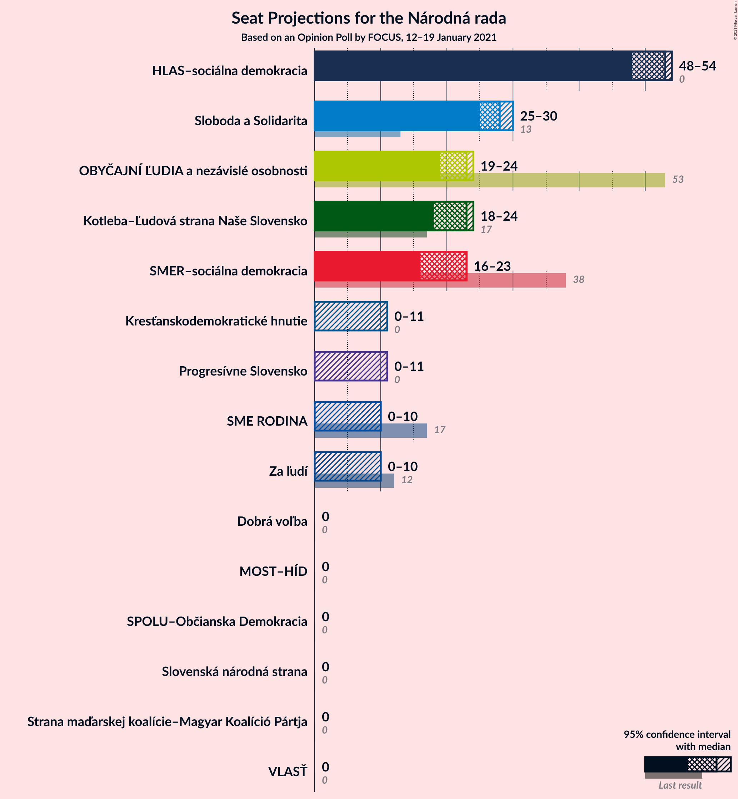
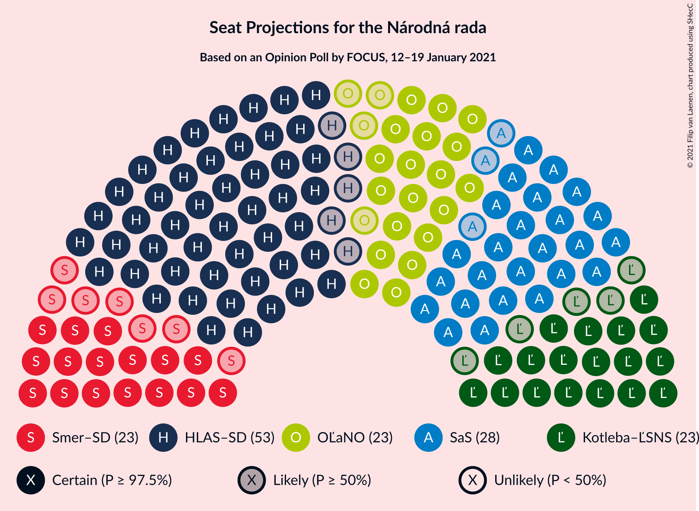
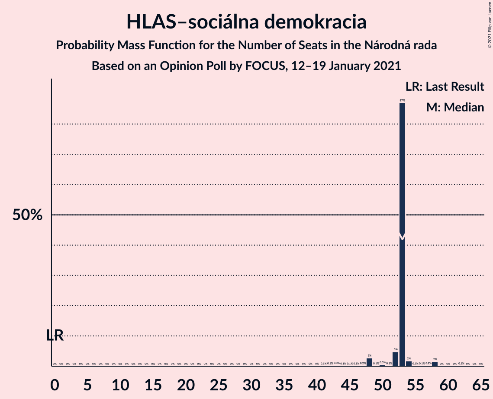
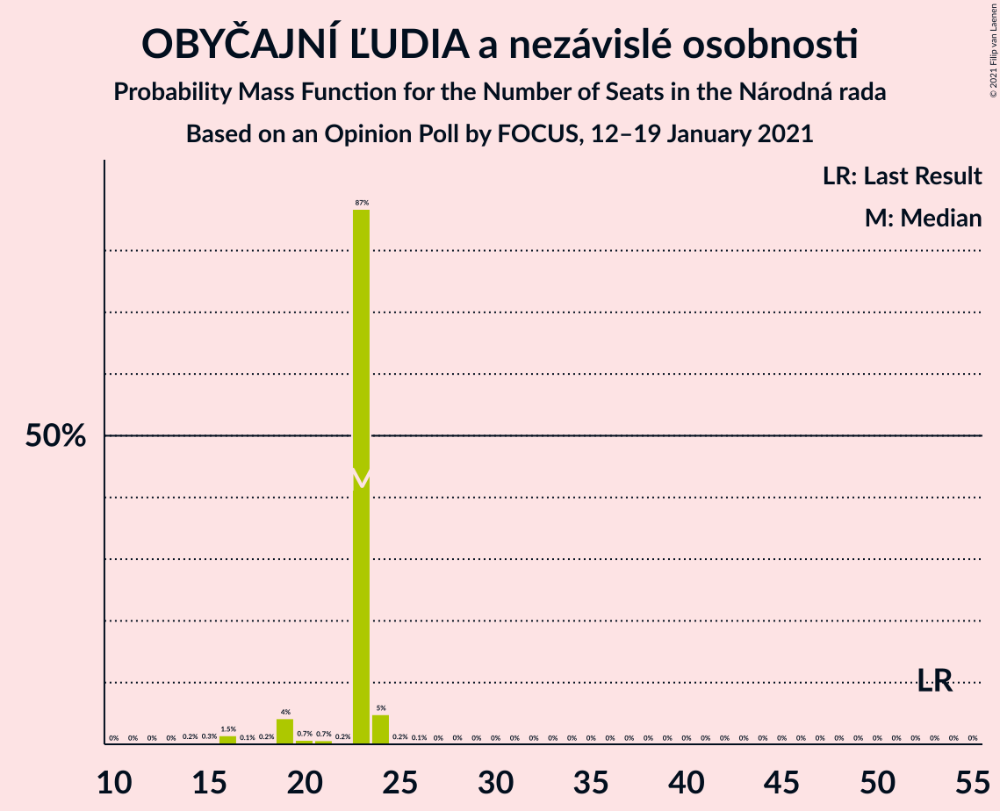
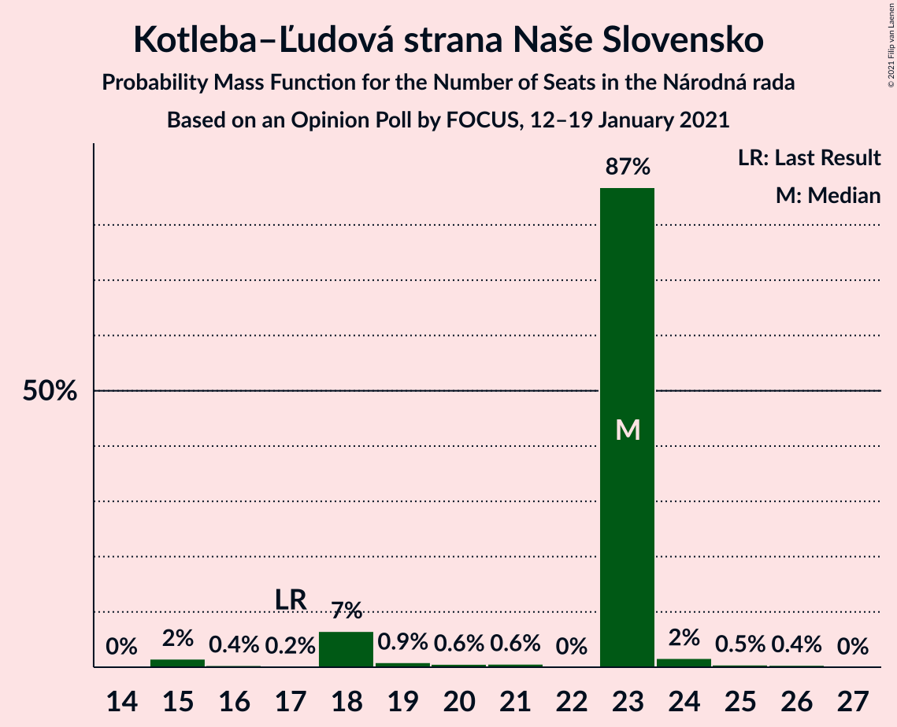
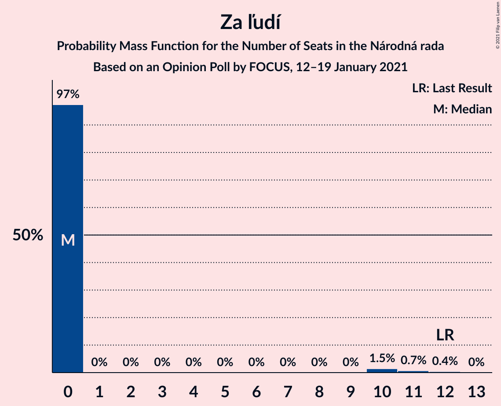
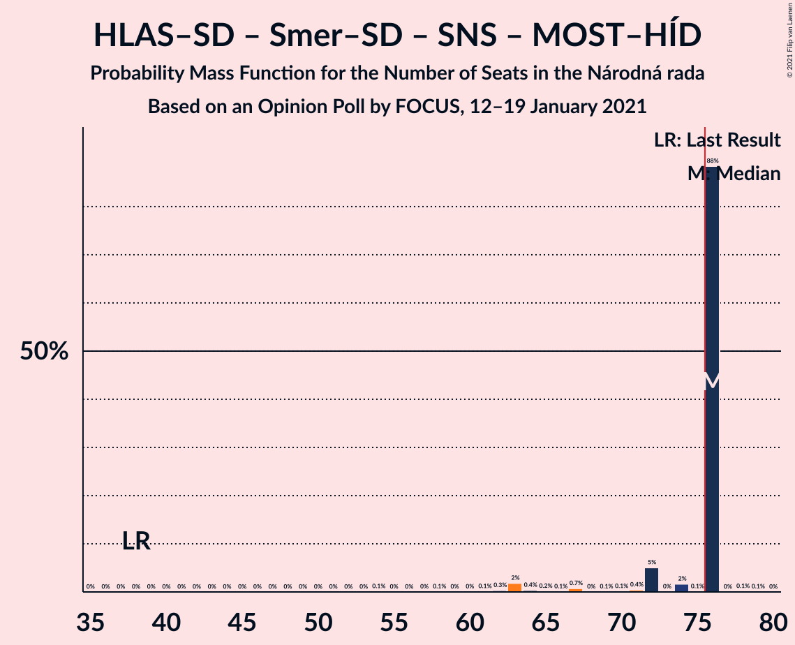
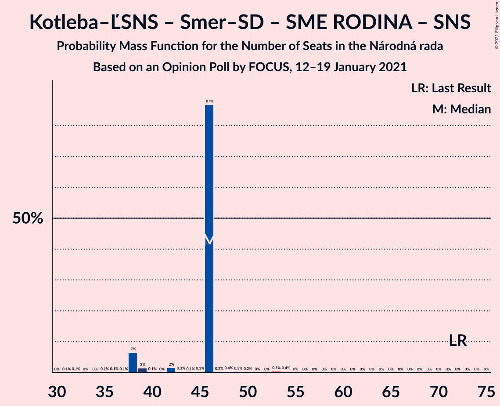

# Opinion Poll by FOCUS, 12–19 January 2021

<a href="#voting-intentions">Voting Intentions</a> | <a href="#seats">Seats</a> | <a href="#coalitions">Coalitions</a> | <a href="#technical-information">Technical Information</a>

## Voting Intentions

### Confidence Intervals

| Party | Last Result | Poll Result | 80% Confidence Interval | 90% Confidence Interval | 95% Confidence Interval | 99% Confidence Interval |
|:-----:|:-----------:|:-----------:|:-----------------------:|:-----------------------:|:-----------------------:|:-----------------------:|
| HLAS–sociálna demokracia | 0.0% | 24.3% | 22.6–26.1% |22.1–26.6% |21.7–27.0% |20.9–27.9% |
| Sloboda a Solidarita | 6.2% | 13.3% | 12.0–14.8% |11.7–15.2% |11.4–15.6% |10.8–16.3% |
| OBYČAJNÍ ĽUDIA a nezávislé osobnosti | 25.0% | 10.1% | 9.0–11.5% |8.7–11.8% |8.4–12.2% |7.9–12.8% |
| Kotleba–Ľudová strana Naše Slovensko | 8.0% | 9.7% | 8.6–11.0% |8.2–11.3% |8.0–11.6% |7.5–12.3% |
| SMER–sociálna demokracia | 18.3% | 9.1% | 8.0–10.3% |7.7–10.7% |7.4–11.0% |7.0–11.6% |
| Progresívne Slovensko | 7.0% | 5.2% | 4.4–6.2% |4.1–6.5% |4.0–6.7% |3.6–7.2% |
| SME RODINA | 8.2% | 5.1% | 4.3–6.1% |4.1–6.4% |3.9–6.6% |3.5–7.1% |
| Kresťanskodemokratické hnutie | 4.6% | 4.4% | 3.6–5.3% |3.4–5.6% |3.3–5.8% |3.0–6.3% |
| Za ľudí | 5.8% | 4.2% | 3.5–5.1% |3.3–5.4% |3.1–5.6% |2.8–6.1% |
| Strana maďarskej koalície–Magyar Koalíció Pártja | 3.9% | 3.3% | 2.7–4.1% |2.5–4.4% |2.3–4.6% |2.1–5.0% |
| Slovenská národná strana | 3.2% | 2.8% | 2.2–3.6% |2.1–3.8% |1.9–4.0% |1.7–4.4% |
| VLASŤ | 2.9% | 2.4% | 1.9–3.1% |1.7–3.4% |1.6–3.5% |1.4–3.9% |
| Dobrá voľba | 3.1% | 2.1% | 1.6–2.8% |1.5–3.0% |1.4–3.2% |1.2–3.6% |
| MOST–HÍD | 2.0% | 2.0% | 1.5–2.7% |1.4–2.9% |1.3–3.1% |1.1–3.4% |
| SPOLU–Občianska Demokracia | 7.0% | 1.0% | 0.7–1.5% |0.6–1.7% |0.5–1.8% |0.4–2.1% |

*Note:* The poll result column reflects the actual value used in the calculations. Published results may vary slightly, and in addition be rounded to fewer digits.

## Seats

### Confidence Intervals

| Party | Last Result | Median | 80% Confidence Interval | 90% Confidence Interval | 95% Confidence Interval | 99% Confidence Interval |
|:-----:|:-----------:|:------:|:-----------------------:|:-----------------------:|:-----------------------:|:-----------------------:|
| <a href="#hlas–sociálna-demokracia">HLAS–sociálna demokracia</a> | 0 | 48 | 42–51 |42–52 |42–52 |40–54 |
| <a href="#sloboda-a-solidarita">Sloboda a Solidarita</a> | 13 | 30 | 25–30 |25–31 |24–31 |19–31 |
| <a href="#obyčajní-ľudia-a-nezávislé-osobnosti">OBYČAJNÍ ĽUDIA a nezávislé osobnosti</a> | 53 | 19 | 18–20 |18–21 |17–21 |16–23 |
| <a href="#kotleba–ľudová-strana-naše-slovensko">Kotleba–Ľudová strana Naše Slovensko</a> | 17 | 25 | 17–25 |16–25 |16–25 |16–25 |
| <a href="#smer–sociálna-demokracia">SMER–sociálna demokracia</a> | 38 | 15 | 12–21 |12–22 |12–22 |12–24 |
| <a href="#progresívne-slovensko">Progresívne Slovensko</a> | 0 | 0 | 0–11 |0–12 |0–15 |0–15 |
| <a href="#sme-rodina">SME RODINA</a> | 17 | 13 | 0–13 |0–13 |0–13 |0–13 |
| <a href="#kresťanskodemokratické-hnutie">Kresťanskodemokratické hnutie</a> | 0 | 0 | 0–10 |0–10 |0–10 |0–11 |
| <a href="#za-ľudí">Za ľudí</a> | 12 | 0 | 0–12 |0–12 |0–12 |0–12 |
| <a href="#strana-maďarskej-koalície–magyar-koalíció-pártja">Strana maďarskej koalície–Magyar Koalíció Pártja</a> | 0 | 0 | 0 |0 |0–11 |0–11 |
| <a href="#slovenská-národná-strana">Slovenská národná strana</a> | 0 | 0 | 0 |0 |0 |0 |
| <a href="#vlasť">VLASŤ</a> | 0 | 0 | 0 |0 |0 |0 |
| <a href="#dobrá-voľba">Dobrá voľba</a> | 0 | 0 | 0 |0 |0 |0 |
| <a href="#most–híd">MOST–HÍD</a> | 0 | 0 | 0 |0 |0 |0 |
| <a href="#spolu–občianska-demokracia">SPOLU–Občianska Demokracia</a> | 0 | 0 | 0 |0 |0 |0 |

### HLAS–sociálna demokracia

*For a full overview of the results for this party, see the [HLAS–sociálna demokracia](party-hlas–sociálnademokracia.html) page.*

| Number of Seats | Probability | Accumulated | Special Marks |
|:---------------:|:-----------:|:-----------:|:-------------:|
| 0 | 0% | 100% | Last Result |
| 1 | 0% | 100% |  |
| 2 | 0% | 100% |  |
| 3 | 0% | 100% |  |
| 4 | 0% | 100% |  |
| 5 | 0% | 100% |  |
| 6 | 0% | 100% |  |
| 7 | 0% | 100% |  |
| 8 | 0% | 100% |  |
| 9 | 0% | 100% |  |
| 10 | 0% | 100% |  |
| 11 | 0% | 100% |  |
| 12 | 0% | 100% |  |
| 13 | 0% | 100% |  |
| 14 | 0% | 100% |  |
| 15 | 0% | 100% |  |
| 16 | 0% | 100% |  |
| 17 | 0% | 100% |  |
| 18 | 0% | 100% |  |
| 19 | 0% | 100% |  |
| 20 | 0% | 100% |  |
| 21 | 0% | 100% |  |
| 22 | 0% | 100% |  |
| 23 | 0% | 100% |  |
| 24 | 0% | 100% |  |
| 25 | 0% | 100% |  |
| 26 | 0% | 100% |  |
| 27 | 0% | 100% |  |
| 28 | 0% | 100% |  |
| 29 | 0% | 100% |  |
| 30 | 0% | 100% |  |
| 31 | 0% | 100% |  |
| 32 | 0% | 100% |  |
| 33 | 0% | 100% |  |
| 34 | 0% | 100% |  |
| 35 | 0% | 100% |  |
| 36 | 0% | 100% |  |
| 37 | 0% | 100% |  |
| 38 | 0% | 100% |  |
| 39 | 0% | 100% |  |
| 40 | 0.9% | 100% |  |
| 41 | 0.2% | 99.0% |  |
| 42 | 14% | 98.8% |  |
| 43 | 0% | 85% |  |
| 44 | 1.1% | 85% |  |
| 45 | 0.4% | 83% |  |
| 46 | 0% | 83% |  |
| 47 | 0.2% | 83% |  |
| 48 | 59% | 83% | Median |
| 49 | 2% | 24% |  |
| 50 | 6% | 22% |  |
| 51 | 9% | 16% |  |
| 52 | 5% | 6% |  |
| 53 | 0% | 1.2% |  |
| 54 | 1.1% | 1.2% |  |
| 55 | 0% | 0.1% |  |
| 56 | 0% | 0% |  |

### Sloboda a Solidarita

*For a full overview of the results for this party, see the [Sloboda a Solidarita](party-slobodaasolidarita.html) page.*

| Number of Seats | Probability | Accumulated | Special Marks |
|:---------------:|:-----------:|:-----------:|:-------------:|
| 13 | 0% | 100% | Last Result |
| 14 | 0% | 100% |  |
| 15 | 0% | 100% |  |
| 16 | 0% | 100% |  |
| 17 | 0% | 100% |  |
| 18 | 0% | 100% |  |
| 19 | 0.7% | 100% |  |
| 20 | 0.2% | 99.3% |  |
| 21 | 0% | 99.0% |  |
| 22 | 0.2% | 99.0% |  |
| 23 | 0.2% | 98.8% |  |
| 24 | 1.2% | 98.6% |  |
| 25 | 24% | 97% |  |
| 26 | 3% | 73% |  |
| 27 | 1.0% | 71% |  |
| 28 | 4% | 70% |  |
| 29 | 1.2% | 65% |  |
| 30 | 58% | 64% | Median |
| 31 | 6% | 6% |  |
| 32 | 0.1% | 0.2% |  |
| 33 | 0% | 0.1% |  |
| 34 | 0% | 0.1% |  |
| 35 | 0.1% | 0.1% |  |
| 36 | 0% | 0% |  |

### OBYČAJNÍ ĽUDIA a nezávislé osobnosti

*For a full overview of the results for this party, see the [OBYČAJNÍ ĽUDIA a nezávislé osobnosti](party-obyčajníľudiaanezávisléosobnosti.html) page.*

| Number of Seats | Probability | Accumulated | Special Marks |
|:---------------:|:-----------:|:-----------:|:-------------:|
| 15 | 0% | 100% |  |
| 16 | 1.0% | 99.9% |  |
| 17 | 2% | 98.9% |  |
| 18 | 13% | 97% |  |
| 19 | 60% | 84% | Median |
| 20 | 14% | 24% |  |
| 21 | 8% | 10% |  |
| 22 | 0.9% | 1.4% |  |
| 23 | 0.1% | 0.6% |  |
| 24 | 0% | 0.5% |  |
| 25 | 0.4% | 0.4% |  |
| 26 | 0% | 0% |  |
| 27 | 0% | 0% |  |
| 28 | 0% | 0% |  |
| 29 | 0% | 0% |  |
| 30 | 0% | 0% |  |
| 31 | 0% | 0% |  |
| 32 | 0% | 0% |  |
| 33 | 0% | 0% |  |
| 34 | 0% | 0% |  |
| 35 | 0% | 0% |  |
| 36 | 0% | 0% |  |
| 37 | 0% | 0% |  |
| 38 | 0% | 0% |  |
| 39 | 0% | 0% |  |
| 40 | 0% | 0% |  |
| 41 | 0% | 0% |  |
| 42 | 0% | 0% |  |
| 43 | 0% | 0% |  |
| 44 | 0% | 0% |  |
| 45 | 0% | 0% |  |
| 46 | 0% | 0% |  |
| 47 | 0% | 0% |  |
| 48 | 0% | 0% |  |
| 49 | 0% | 0% |  |
| 50 | 0% | 0% |  |
| 51 | 0% | 0% |  |
| 52 | 0% | 0% |  |
| 53 | 0% | 0% | Last Result |

### Kotleba–Ľudová strana Naše Slovensko

*For a full overview of the results for this party, see the [Kotleba–Ľudová strana Naše Slovensko](party-kotleba–ľudovástrananašeslovensko.html) page.*

| Number of Seats | Probability | Accumulated | Special Marks |
|:---------------:|:-----------:|:-----------:|:-------------:|
| 14 | 0% | 100% |  |
| 15 | 0.2% | 99.9% |  |
| 16 | 9% | 99.8% |  |
| 17 | 4% | 90% | Last Result |
| 18 | 0.1% | 87% |  |
| 19 | 0.4% | 86% |  |
| 20 | 22% | 86% |  |
| 21 | 3% | 64% |  |
| 22 | 0% | 61% |  |
| 23 | 2% | 61% |  |
| 24 | 1.3% | 59% |  |
| 25 | 58% | 58% | Median |
| 26 | 0% | 0% |  |

### SMER–sociálna demokracia

*For a full overview of the results for this party, see the [SMER–sociálna demokracia](party-smer–sociálnademokracia.html) page.*

| Number of Seats | Probability | Accumulated | Special Marks |
|:---------------:|:-----------:|:-----------:|:-------------:|
| 12 | 13% | 100% |  |
| 13 | 0.1% | 87% |  |
| 14 | 4% | 87% |  |
| 15 | 59% | 83% | Median |
| 16 | 0.3% | 24% |  |
| 17 | 3% | 24% |  |
| 18 | 0.9% | 21% |  |
| 19 | 1.3% | 20% |  |
| 20 | 0.2% | 18% |  |
| 21 | 13% | 18% |  |
| 22 | 3% | 5% |  |
| 23 | 0.5% | 2% |  |
| 24 | 1.2% | 1.2% |  |
| 25 | 0% | 0% |  |
| 26 | 0% | 0% |  |
| 27 | 0% | 0% |  |
| 28 | 0% | 0% |  |
| 29 | 0% | 0% |  |
| 30 | 0% | 0% |  |
| 31 | 0% | 0% |  |
| 32 | 0% | 0% |  |
| 33 | 0% | 0% |  |
| 34 | 0% | 0% |  |
| 35 | 0% | 0% |  |
| 36 | 0% | 0% |  |
| 37 | 0% | 0% |  |
| 38 | 0% | 0% | Last Result |

### Progresívne Slovensko

*For a full overview of the results for this party, see the [Progresívne Slovensko](party-progresívneslovensko.html) page.*

| Number of Seats | Probability | Accumulated | Special Marks |
|:---------------:|:-----------:|:-----------:|:-------------:|
| 0 | 77% | 100% | Last Result, Median |
| 1 | 0% | 23% |  |
| 2 | 0% | 23% |  |
| 3 | 0% | 23% |  |
| 4 | 0% | 23% |  |
| 5 | 0% | 23% |  |
| 6 | 0% | 23% |  |
| 7 | 0% | 23% |  |
| 8 | 0% | 23% |  |
| 9 | 0.8% | 23% |  |
| 10 | 2% | 22% |  |
| 11 | 14% | 20% |  |
| 12 | 2% | 6% |  |
| 13 | 0.8% | 4% |  |
| 14 | 0% | 3% |  |
| 15 | 3% | 3% |  |
| 16 | 0% | 0% |  |

### SME RODINA

*For a full overview of the results for this party, see the [SME RODINA](party-smerodina.html) page.*

| Number of Seats | Probability | Accumulated | Special Marks |
|:---------------:|:-----------:|:-----------:|:-------------:|
| 0 | 29% | 100% |  |
| 1 | 0% | 71% |  |
| 2 | 0% | 71% |  |
| 3 | 0% | 71% |  |
| 4 | 0% | 71% |  |
| 5 | 0% | 71% |  |
| 6 | 0% | 71% |  |
| 7 | 0% | 71% |  |
| 8 | 0% | 71% |  |
| 9 | 0% | 71% |  |
| 10 | 2% | 71% |  |
| 11 | 3% | 70% |  |
| 12 | 9% | 67% |  |
| 13 | 58% | 58% | Median |
| 14 | 0.4% | 0.4% |  |
| 15 | 0% | 0% |  |
| 16 | 0% | 0% |  |
| 17 | 0% | 0% | Last Result |

### Kresťanskodemokratické hnutie

*For a full overview of the results for this party, see the [Kresťanskodemokratické hnutie](party-kresťanskodemokratickéhnutie.html) page.*

| Number of Seats | Probability | Accumulated | Special Marks |
|:---------------:|:-----------:|:-----------:|:-------------:|
| 0 | 85% | 100% | Last Result, Median |
| 1 | 0% | 15% |  |
| 2 | 0% | 15% |  |
| 3 | 0% | 15% |  |
| 4 | 0% | 15% |  |
| 5 | 0% | 15% |  |
| 6 | 0% | 15% |  |
| 7 | 0% | 15% |  |
| 8 | 0% | 15% |  |
| 9 | 0.9% | 15% |  |
| 10 | 13% | 14% |  |
| 11 | 2% | 2% |  |
| 12 | 0.1% | 0.1% |  |
| 13 | 0% | 0.1% |  |
| 14 | 0% | 0% |  |

### Za ľudí

*For a full overview of the results for this party, see the [Za ľudí](party-zaľudí.html) page.*

| Number of Seats | Probability | Accumulated | Special Marks |
|:---------------:|:-----------:|:-----------:|:-------------:|
| 0 | 77% | 100% | Median |
| 1 | 0% | 23% |  |
| 2 | 0% | 23% |  |
| 3 | 0% | 23% |  |
| 4 | 0% | 23% |  |
| 5 | 0% | 23% |  |
| 6 | 0% | 23% |  |
| 7 | 0% | 23% |  |
| 8 | 0% | 23% |  |
| 9 | 0% | 23% |  |
| 10 | 1.2% | 23% |  |
| 11 | 3% | 22% |  |
| 12 | 19% | 19% | Last Result |
| 13 | 0% | 0% |  |

### Strana maďarskej koalície–Magyar Koalíció Pártja

*For a full overview of the results for this party, see the [Strana maďarskej koalície–Magyar Koalíció Pártja](party-stranamaďarskejkoalície–magyarkoalíciópártja.html) page.*

| Number of Seats | Probability | Accumulated | Special Marks |
|:---------------:|:-----------:|:-----------:|:-------------:|
| 0 | 97% | 100% | Last Result, Median |
| 1 | 0% | 3% |  |
| 2 | 0% | 3% |  |
| 3 | 0% | 3% |  |
| 4 | 0% | 3% |  |
| 5 | 0% | 3% |  |
| 6 | 0% | 3% |  |
| 7 | 0% | 3% |  |
| 8 | 0% | 3% |  |
| 9 | 0% | 3% |  |
| 10 | 0% | 3% |  |
| 11 | 3% | 3% |  |
| 12 | 0% | 0% |  |

### Slovenská národná strana

*For a full overview of the results for this party, see the [Slovenská národná strana](party-slovenskánárodnástrana.html) page.*

| Number of Seats | Probability | Accumulated | Special Marks |
|:---------------:|:-----------:|:-----------:|:-------------:|
| 0 | 100% | 100% | Last Result, Median |

### VLASŤ

*For a full overview of the results for this party, see the [VLASŤ](party-vlasť.html) page.*

| Number of Seats | Probability | Accumulated | Special Marks |
|:---------------:|:-----------:|:-----------:|:-------------:|
| 0 | 100% | 100% | Last Result, Median |

### Dobrá voľba

*For a full overview of the results for this party, see the [Dobrá voľba](party-dobrávoľba.html) page.*

| Number of Seats | Probability | Accumulated | Special Marks |
|:---------------:|:-----------:|:-----------:|:-------------:|
| 0 | 100% | 100% | Last Result, Median |

### MOST–HÍD

*For a full overview of the results for this party, see the [MOST–HÍD](party-most–híd.html) page.*

| Number of Seats | Probability | Accumulated | Special Marks |
|:---------------:|:-----------:|:-----------:|:-------------:|
| 0 | 100% | 100% | Last Result, Median |

### SPOLU–Občianska Demokracia

*For a full overview of the results for this party, see the [SPOLU–Občianska Demokracia](party-spolu–občianskademokracia.html) page.*

| Number of Seats | Probability | Accumulated | Special Marks |
|:---------------:|:-----------:|:-----------:|:-------------:|
| 0 | 100% | 100% | Last Result, Median |

## Coalitions

### Confidence Intervals

| Coalition | Last Result | Median | Majority? | 80% Confidence Interval | 90% Confidence Interval | 95% Confidence Interval | 99% Confidence Interval |
|:---------:|:-----------:|:------:|:---------:|:-----------------------:|:-----------------------:|:-----------------------:|:-----------------------:|
| HLAS–sociálna demokracia – Kotleba–Ľudová strana Naše Slovensko – SMER–sociálna demokracia – SME RODINA – Slovenská národná strana | 72 | 101 | 87% | 74–101 | 74–104 | 74–104 | 74–104 |
| HLAS–sociálna demokracia – Kotleba–Ľudová strana Naše Slovensko – SME RODINA – Slovenská národná strana | 34 | 86 | 69% | 62–86 | 62–86 | 62–86 | 62–86 |
| HLAS–sociálna demokracia – SMER–sociálna demokracia – SME RODINA | 55 | 76 | 68% | 54–76 | 54–84 | 54–84 | 54–84 |
| HLAS–sociálna demokracia – SMER–sociálna demokracia – SME RODINA – Slovenská národná strana | 55 | 76 | 68% | 54–76 | 54–84 | 54–84 | 54–84 |
| HLAS–sociálna demokracia – SMER–sociálna demokracia – Slovenská národná strana – MOST–HÍD | 38 | 63 | 0% | 54–72 | 54–72 | 54–74 | 54–74 |
| HLAS–sociálna demokracia – SMER–sociálna demokracia – Slovenská národná strana | 38 | 63 | 0% | 54–72 | 54–72 | 54–74 | 54–74 |
| HLAS–sociálna demokracia – SME RODINA | 17 | 61 | 0% | 42–61 | 42–63 | 42–63 | 40–66 |
| HLAS–sociálna demokracia – SME RODINA – Slovenská národná strana | 17 | 61 | 0% | 42–61 | 42–63 | 42–63 | 40–66 |
| Kotleba–Ľudová strana Naše Slovensko – SMER–sociálna demokracia – SME RODINA – Slovenská národná strana | 72 | 53 | 0% | 32–53 | 32–53 | 32–54 | 30–55 |
| HLAS–sociálna demokracia – Slovenská národná strana – MOST–HÍD | 0 | 48 | 0% | 42–51 | 42–52 | 42–52 | 40–54 |
| HLAS–sociálna demokracia – Slovenská národná strana | 0 | 48 | 0% | 42–51 | 42–52 | 42–52 | 40–54 |
| SMER–sociálna demokracia – SME RODINA | 55 | 28 | 0% | 12–30 | 12–33 | 12–33 | 12–35 |
| SMER–sociálna demokracia – SME RODINA – Slovenská národná strana | 55 | 28 | 0% | 12–30 | 12–33 | 12–33 | 12–35 |
| SMER–sociálna demokracia – Slovenská národná strana – MOST–HÍD | 38 | 15 | 0% | 12–21 | 12–22 | 12–22 | 12–24 |
| SMER–sociálna demokracia | 38 | 15 | 0% | 12–21 | 12–22 | 12–22 | 12–24 |
| SMER–sociálna demokracia – Slovenská národná strana | 38 | 15 | 0% | 12–21 | 12–22 | 12–22 | 12–24 |

### HLAS–sociálna demokracia – Kotleba–Ľudová strana Naše Slovensko – SMER–sociálna demokracia – SME RODINA – Slovenská národná strana

| Number of Seats | Probability | Accumulated | Special Marks |
|:---------------:|:-----------:|:-----------:|:-------------:|
| 72 | 0% | 100% | Last Result |
| 73 | 0% | 100% |  |
| 74 | 13% | 100% |  |
| 75 | 0% | 87% |  |
| 76 | 0% | 87% | Majority |
| 77 | 0.9% | 87% |  |
| 78 | 0% | 86% |  |
| 79 | 0% | 86% |  |
| 80 | 0% | 86% |  |
| 81 | 2% | 86% |  |
| 82 | 0% | 85% |  |
| 83 | 0.2% | 85% |  |
| 84 | 0.1% | 84% |  |
| 85 | 0.8% | 84% |  |
| 86 | 0% | 83% |  |
| 87 | 6% | 83% |  |
| 88 | 0% | 77% |  |
| 89 | 0.8% | 77% |  |
| 90 | 4% | 77% |  |
| 91 | 3% | 73% |  |
| 92 | 0.5% | 70% |  |
| 93 | 0.5% | 69% |  |
| 94 | 0.1% | 69% |  |
| 95 | 0% | 69% |  |
| 96 | 2% | 69% |  |
| 97 | 0% | 67% |  |
| 98 | 0% | 66% |  |
| 99 | 0% | 66% |  |
| 100 | 0% | 66% |  |
| 101 | 58% | 66% | Median |
| 102 | 0% | 9% |  |
| 103 | 0% | 9% |  |
| 104 | 8% | 9% |  |
| 105 | 0.3% | 0.3% |  |
| 106 | 0% | 0% |  |

### HLAS–sociálna demokracia – Kotleba–Ľudová strana Naše Slovensko – SME RODINA – Slovenská národná strana

| Number of Seats | Probability | Accumulated | Special Marks |
|:---------------:|:-----------:|:-----------:|:-------------:|
| 34 | 0% | 100% | Last Result |
| 35 | 0% | 100% |  |
| 36 | 0% | 100% |  |
| 37 | 0% | 100% |  |
| 38 | 0% | 100% |  |
| 39 | 0% | 100% |  |
| 40 | 0% | 100% |  |
| 41 | 0% | 100% |  |
| 42 | 0% | 100% |  |
| 43 | 0% | 100% |  |
| 44 | 0% | 100% |  |
| 45 | 0% | 100% |  |
| 46 | 0% | 100% |  |
| 47 | 0% | 100% |  |
| 48 | 0% | 100% |  |
| 49 | 0% | 100% |  |
| 50 | 0% | 100% |  |
| 51 | 0% | 100% |  |
| 52 | 0% | 100% |  |
| 53 | 0% | 100% |  |
| 54 | 0% | 100% |  |
| 55 | 0% | 100% |  |
| 56 | 0% | 100% |  |
| 57 | 0% | 100% |  |
| 58 | 0% | 99.9% |  |
| 59 | 0% | 99.9% |  |
| 60 | 0% | 99.9% |  |
| 61 | 0% | 99.9% |  |
| 62 | 13% | 99.9% |  |
| 63 | 0.9% | 87% |  |
| 64 | 0% | 86% |  |
| 65 | 0.4% | 86% |  |
| 66 | 6% | 86% |  |
| 67 | 3% | 80% |  |
| 68 | 0.4% | 77% |  |
| 69 | 3% | 77% |  |
| 70 | 0% | 74% |  |
| 71 | 0% | 74% |  |
| 72 | 0.2% | 74% |  |
| 73 | 3% | 74% |  |
| 74 | 0% | 71% |  |
| 75 | 1.3% | 71% |  |
| 76 | 0.2% | 69% | Majority |
| 77 | 1.4% | 69% |  |
| 78 | 0% | 68% |  |
| 79 | 0% | 68% |  |
| 80 | 1.1% | 68% |  |
| 81 | 0.1% | 67% |  |
| 82 | 1.1% | 66% |  |
| 83 | 7% | 65% |  |
| 84 | 0% | 58% |  |
| 85 | 0% | 58% |  |
| 86 | 58% | 58% | Median |
| 87 | 0% | 0% |  |

### HLAS–sociálna demokracia – SMER–sociálna demokracia – SME RODINA

| Number of Seats | Probability | Accumulated | Special Marks |
|:---------------:|:-----------:|:-----------:|:-------------:|
| 54 | 14% | 100% |  |
| 55 | 0% | 86% | Last Result |
| 56 | 0% | 86% |  |
| 57 | 0% | 86% |  |
| 58 | 0% | 86% |  |
| 59 | 0% | 86% |  |
| 60 | 0% | 86% |  |
| 61 | 0.1% | 86% |  |
| 62 | 0.1% | 86% |  |
| 63 | 0% | 86% |  |
| 64 | 0% | 86% |  |
| 65 | 2% | 86% |  |
| 66 | 0.6% | 84% |  |
| 67 | 0.1% | 84% |  |
| 68 | 0.2% | 84% |  |
| 69 | 4% | 83% |  |
| 70 | 0.3% | 80% |  |
| 71 | 6% | 80% |  |
| 72 | 2% | 73% |  |
| 73 | 0.7% | 71% |  |
| 74 | 2% | 71% |  |
| 75 | 0% | 68% |  |
| 76 | 58% | 68% | Median, Majority |
| 77 | 0.1% | 10% |  |
| 78 | 0% | 10% |  |
| 79 | 0.1% | 10% |  |
| 80 | 1.1% | 10% |  |
| 81 | 0% | 9% |  |
| 82 | 0.3% | 9% |  |
| 83 | 0% | 8% |  |
| 84 | 8% | 8% |  |
| 85 | 0% | 0% |  |

### HLAS–sociálna demokracia – SMER–sociálna demokracia – SME RODINA – Slovenská národná strana

| Number of Seats | Probability | Accumulated | Special Marks |
|:---------------:|:-----------:|:-----------:|:-------------:|
| 54 | 14% | 100% |  |
| 55 | 0% | 86% | Last Result |
| 56 | 0% | 86% |  |
| 57 | 0% | 86% |  |
| 58 | 0% | 86% |  |
| 59 | 0% | 86% |  |
| 60 | 0% | 86% |  |
| 61 | 0.1% | 86% |  |
| 62 | 0.1% | 86% |  |
| 63 | 0% | 86% |  |
| 64 | 0% | 86% |  |
| 65 | 2% | 86% |  |
| 66 | 0.6% | 84% |  |
| 67 | 0.1% | 84% |  |
| 68 | 0.2% | 84% |  |
| 69 | 4% | 83% |  |
| 70 | 0.3% | 80% |  |
| 71 | 6% | 80% |  |
| 72 | 2% | 73% |  |
| 73 | 0.7% | 71% |  |
| 74 | 2% | 71% |  |
| 75 | 0% | 68% |  |
| 76 | 58% | 68% | Median, Majority |
| 77 | 0.1% | 10% |  |
| 78 | 0% | 10% |  |
| 79 | 0.1% | 10% |  |
| 80 | 1.1% | 10% |  |
| 81 | 0% | 9% |  |
| 82 | 0.3% | 9% |  |
| 83 | 0% | 8% |  |
| 84 | 8% | 8% |  |
| 85 | 0% | 0% |  |

### HLAS–sociálna demokracia – SMER–sociálna demokracia – Slovenská národná strana – MOST–HÍD

| Number of Seats | Probability | Accumulated | Special Marks |
|:---------------:|:-----------:|:-----------:|:-------------:|
| 38 | 0% | 100% | Last Result |
| 39 | 0% | 100% |  |
| 40 | 0% | 100% |  |
| 41 | 0% | 100% |  |
| 42 | 0% | 100% |  |
| 43 | 0% | 100% |  |
| 44 | 0% | 100% |  |
| 45 | 0% | 100% |  |
| 46 | 0% | 100% |  |
| 47 | 0% | 100% |  |
| 48 | 0% | 100% |  |
| 49 | 0% | 100% |  |
| 50 | 0% | 100% |  |
| 51 | 0% | 100% |  |
| 52 | 0% | 100% |  |
| 53 | 0% | 100% |  |
| 54 | 14% | 100% |  |
| 55 | 0% | 86% |  |
| 56 | 0% | 86% |  |
| 57 | 0% | 86% |  |
| 58 | 0.1% | 86% |  |
| 59 | 0.7% | 86% |  |
| 60 | 0.1% | 86% |  |
| 61 | 1.5% | 86% |  |
| 62 | 0.7% | 84% |  |
| 63 | 59% | 83% | Median |
| 64 | 0% | 25% |  |
| 65 | 2% | 25% |  |
| 66 | 0.7% | 23% |  |
| 67 | 0.1% | 22% |  |
| 68 | 1.3% | 22% |  |
| 69 | 3% | 21% |  |
| 70 | 0.3% | 18% |  |
| 71 | 6% | 17% |  |
| 72 | 8% | 11% |  |
| 73 | 1.1% | 4% |  |
| 74 | 2% | 3% |  |
| 75 | 0% | 0% |  |

### HLAS–sociálna demokracia – SMER–sociálna demokracia – Slovenská národná strana

| Number of Seats | Probability | Accumulated | Special Marks |
|:---------------:|:-----------:|:-----------:|:-------------:|
| 38 | 0% | 100% | Last Result |
| 39 | 0% | 100% |  |
| 40 | 0% | 100% |  |
| 41 | 0% | 100% |  |
| 42 | 0% | 100% |  |
| 43 | 0% | 100% |  |
| 44 | 0% | 100% |  |
| 45 | 0% | 100% |  |
| 46 | 0% | 100% |  |
| 47 | 0% | 100% |  |
| 48 | 0% | 100% |  |
| 49 | 0% | 100% |  |
| 50 | 0% | 100% |  |
| 51 | 0% | 100% |  |
| 52 | 0% | 100% |  |
| 53 | 0% | 100% |  |
| 54 | 14% | 100% |  |
| 55 | 0% | 86% |  |
| 56 | 0% | 86% |  |
| 57 | 0% | 86% |  |
| 58 | 0.1% | 86% |  |
| 59 | 0.7% | 86% |  |
| 60 | 0.1% | 86% |  |
| 61 | 1.5% | 86% |  |
| 62 | 0.7% | 84% |  |
| 63 | 59% | 83% | Median |
| 64 | 0% | 25% |  |
| 65 | 2% | 25% |  |
| 66 | 0.7% | 23% |  |
| 67 | 0.1% | 22% |  |
| 68 | 1.3% | 22% |  |
| 69 | 3% | 21% |  |
| 70 | 0.3% | 18% |  |
| 71 | 6% | 17% |  |
| 72 | 8% | 11% |  |
| 73 | 1.1% | 4% |  |
| 74 | 2% | 3% |  |
| 75 | 0% | 0% |  |

### HLAS–sociálna demokracia – SME RODINA

| Number of Seats | Probability | Accumulated | Special Marks |
|:---------------:|:-----------:|:-----------:|:-------------:|
| 17 | 0% | 100% | Last Result |
| 18 | 0% | 100% |  |
| 19 | 0% | 100% |  |
| 20 | 0% | 100% |  |
| 21 | 0% | 100% |  |
| 22 | 0% | 100% |  |
| 23 | 0% | 100% |  |
| 24 | 0% | 100% |  |
| 25 | 0% | 100% |  |
| 26 | 0% | 100% |  |
| 27 | 0% | 100% |  |
| 28 | 0% | 100% |  |
| 29 | 0% | 100% |  |
| 30 | 0% | 100% |  |
| 31 | 0% | 100% |  |
| 32 | 0% | 100% |  |
| 33 | 0% | 100% |  |
| 34 | 0% | 100% |  |
| 35 | 0% | 100% |  |
| 36 | 0% | 100% |  |
| 37 | 0% | 100% |  |
| 38 | 0% | 100% |  |
| 39 | 0% | 100% |  |
| 40 | 0.9% | 100% |  |
| 41 | 0.2% | 99.1% |  |
| 42 | 13% | 98.9% |  |
| 43 | 0% | 86% |  |
| 44 | 0.7% | 86% |  |
| 45 | 0% | 85% |  |
| 46 | 0% | 85% |  |
| 47 | 0.1% | 85% |  |
| 48 | 0.1% | 85% |  |
| 49 | 0.6% | 85% |  |
| 50 | 6% | 85% |  |
| 51 | 2% | 79% |  |
| 52 | 6% | 76% |  |
| 53 | 1.2% | 71% |  |
| 54 | 0.1% | 70% |  |
| 55 | 0.2% | 70% |  |
| 56 | 0.3% | 69% |  |
| 57 | 0% | 69% |  |
| 58 | 1.4% | 69% |  |
| 59 | 0.1% | 68% |  |
| 60 | 2% | 68% |  |
| 61 | 58% | 66% | Median |
| 62 | 0.1% | 8% |  |
| 63 | 7% | 8% |  |
| 64 | 0% | 1.1% |  |
| 65 | 0% | 1.1% |  |
| 66 | 1.1% | 1.1% |  |
| 67 | 0% | 0% |  |

### HLAS–sociálna demokracia – SME RODINA – Slovenská národná strana

| Number of Seats | Probability | Accumulated | Special Marks |
|:---------------:|:-----------:|:-----------:|:-------------:|
| 17 | 0% | 100% | Last Result |
| 18 | 0% | 100% |  |
| 19 | 0% | 100% |  |
| 20 | 0% | 100% |  |
| 21 | 0% | 100% |  |
| 22 | 0% | 100% |  |
| 23 | 0% | 100% |  |
| 24 | 0% | 100% |  |
| 25 | 0% | 100% |  |
| 26 | 0% | 100% |  |
| 27 | 0% | 100% |  |
| 28 | 0% | 100% |  |
| 29 | 0% | 100% |  |
| 30 | 0% | 100% |  |
| 31 | 0% | 100% |  |
| 32 | 0% | 100% |  |
| 33 | 0% | 100% |  |
| 34 | 0% | 100% |  |
| 35 | 0% | 100% |  |
| 36 | 0% | 100% |  |
| 37 | 0% | 100% |  |
| 38 | 0% | 100% |  |
| 39 | 0% | 100% |  |
| 40 | 0.9% | 100% |  |
| 41 | 0.2% | 99.1% |  |
| 42 | 13% | 98.9% |  |
| 43 | 0% | 86% |  |
| 44 | 0.7% | 86% |  |
| 45 | 0% | 85% |  |
| 46 | 0% | 85% |  |
| 47 | 0.1% | 85% |  |
| 48 | 0.1% | 85% |  |
| 49 | 0.6% | 85% |  |
| 50 | 6% | 85% |  |
| 51 | 2% | 79% |  |
| 52 | 6% | 76% |  |
| 53 | 1.2% | 71% |  |
| 54 | 0.1% | 70% |  |
| 55 | 0.2% | 70% |  |
| 56 | 0.3% | 69% |  |
| 57 | 0% | 69% |  |
| 58 | 1.4% | 69% |  |
| 59 | 0.1% | 68% |  |
| 60 | 2% | 68% |  |
| 61 | 58% | 66% | Median |
| 62 | 0.1% | 8% |  |
| 63 | 7% | 8% |  |
| 64 | 0% | 1.1% |  |
| 65 | 0% | 1.1% |  |
| 66 | 1.1% | 1.1% |  |
| 67 | 0% | 0% |  |

### Kotleba–Ľudová strana Naše Slovensko – SMER–sociálna demokracia – SME RODINA – Slovenská národná strana

| Number of Seats | Probability | Accumulated | Special Marks |
|:---------------:|:-----------:|:-----------:|:-------------:|
| 30 | 2% | 100% |  |
| 31 | 0% | 98% |  |
| 32 | 13% | 98% |  |
| 33 | 0% | 85% |  |
| 34 | 0.3% | 85% |  |
| 35 | 0.1% | 85% |  |
| 36 | 0.1% | 85% |  |
| 37 | 7% | 85% |  |
| 38 | 3% | 78% |  |
| 39 | 3% | 75% |  |
| 40 | 0.1% | 73% |  |
| 41 | 0% | 72% |  |
| 42 | 2% | 72% |  |
| 43 | 1.0% | 71% |  |
| 44 | 0.2% | 70% |  |
| 45 | 1.0% | 69% |  |
| 46 | 0.2% | 68% |  |
| 47 | 0% | 68% |  |
| 48 | 0.1% | 68% |  |
| 49 | 0.5% | 68% |  |
| 50 | 0% | 68% |  |
| 51 | 0% | 68% |  |
| 52 | 0% | 68% |  |
| 53 | 65% | 68% | Median |
| 54 | 1.1% | 3% |  |
| 55 | 1.1% | 1.4% |  |
| 56 | 0% | 0.3% |  |
| 57 | 0.3% | 0.3% |  |
| 58 | 0% | 0% |  |
| 59 | 0% | 0% |  |
| 60 | 0% | 0% |  |
| 61 | 0% | 0% |  |
| 62 | 0% | 0% |  |
| 63 | 0% | 0% |  |
| 64 | 0% | 0% |  |
| 65 | 0% | 0% |  |
| 66 | 0% | 0% |  |
| 67 | 0% | 0% |  |
| 68 | 0% | 0% |  |
| 69 | 0% | 0% |  |
| 70 | 0% | 0% |  |
| 71 | 0% | 0% |  |
| 72 | 0% | 0% | Last Result |

### HLAS–sociálna demokracia – Slovenská národná strana – MOST–HÍD

| Number of Seats | Probability | Accumulated | Special Marks |
|:---------------:|:-----------:|:-----------:|:-------------:|
| 0 | 0% | 100% | Last Result |
| 1 | 0% | 100% |  |
| 2 | 0% | 100% |  |
| 3 | 0% | 100% |  |
| 4 | 0% | 100% |  |
| 5 | 0% | 100% |  |
| 6 | 0% | 100% |  |
| 7 | 0% | 100% |  |
| 8 | 0% | 100% |  |
| 9 | 0% | 100% |  |
| 10 | 0% | 100% |  |
| 11 | 0% | 100% |  |
| 12 | 0% | 100% |  |
| 13 | 0% | 100% |  |
| 14 | 0% | 100% |  |
| 15 | 0% | 100% |  |
| 16 | 0% | 100% |  |
| 17 | 0% | 100% |  |
| 18 | 0% | 100% |  |
| 19 | 0% | 100% |  |
| 20 | 0% | 100% |  |
| 21 | 0% | 100% |  |
| 22 | 0% | 100% |  |
| 23 | 0% | 100% |  |
| 24 | 0% | 100% |  |
| 25 | 0% | 100% |  |
| 26 | 0% | 100% |  |
| 27 | 0% | 100% |  |
| 28 | 0% | 100% |  |
| 29 | 0% | 100% |  |
| 30 | 0% | 100% |  |
| 31 | 0% | 100% |  |
| 32 | 0% | 100% |  |
| 33 | 0% | 100% |  |
| 34 | 0% | 100% |  |
| 35 | 0% | 100% |  |
| 36 | 0% | 100% |  |
| 37 | 0% | 100% |  |
| 38 | 0% | 100% |  |
| 39 | 0% | 100% |  |
| 40 | 0.9% | 100% |  |
| 41 | 0.2% | 99.0% |  |
| 42 | 14% | 98.8% |  |
| 43 | 0% | 85% |  |
| 44 | 1.1% | 85% |  |
| 45 | 0.4% | 83% |  |
| 46 | 0% | 83% |  |
| 47 | 0.2% | 83% |  |
| 48 | 59% | 83% | Median |
| 49 | 2% | 24% |  |
| 50 | 6% | 22% |  |
| 51 | 9% | 16% |  |
| 52 | 5% | 6% |  |
| 53 | 0% | 1.2% |  |
| 54 | 1.1% | 1.2% |  |
| 55 | 0% | 0.1% |  |
| 56 | 0% | 0% |  |

### HLAS–sociálna demokracia – Slovenská národná strana

| Number of Seats | Probability | Accumulated | Special Marks |
|:---------------:|:-----------:|:-----------:|:-------------:|
| 0 | 0% | 100% | Last Result |
| 1 | 0% | 100% |  |
| 2 | 0% | 100% |  |
| 3 | 0% | 100% |  |
| 4 | 0% | 100% |  |
| 5 | 0% | 100% |  |
| 6 | 0% | 100% |  |
| 7 | 0% | 100% |  |
| 8 | 0% | 100% |  |
| 9 | 0% | 100% |  |
| 10 | 0% | 100% |  |
| 11 | 0% | 100% |  |
| 12 | 0% | 100% |  |
| 13 | 0% | 100% |  |
| 14 | 0% | 100% |  |
| 15 | 0% | 100% |  |
| 16 | 0% | 100% |  |
| 17 | 0% | 100% |  |
| 18 | 0% | 100% |  |
| 19 | 0% | 100% |  |
| 20 | 0% | 100% |  |
| 21 | 0% | 100% |  |
| 22 | 0% | 100% |  |
| 23 | 0% | 100% |  |
| 24 | 0% | 100% |  |
| 25 | 0% | 100% |  |
| 26 | 0% | 100% |  |
| 27 | 0% | 100% |  |
| 28 | 0% | 100% |  |
| 29 | 0% | 100% |  |
| 30 | 0% | 100% |  |
| 31 | 0% | 100% |  |
| 32 | 0% | 100% |  |
| 33 | 0% | 100% |  |
| 34 | 0% | 100% |  |
| 35 | 0% | 100% |  |
| 36 | 0% | 100% |  |
| 37 | 0% | 100% |  |
| 38 | 0% | 100% |  |
| 39 | 0% | 100% |  |
| 40 | 0.9% | 100% |  |
| 41 | 0.2% | 99.0% |  |
| 42 | 14% | 98.8% |  |
| 43 | 0% | 85% |  |
| 44 | 1.1% | 85% |  |
| 45 | 0.4% | 83% |  |
| 46 | 0% | 83% |  |
| 47 | 0.2% | 83% |  |
| 48 | 59% | 83% | Median |
| 49 | 2% | 24% |  |
| 50 | 6% | 22% |  |
| 51 | 9% | 16% |  |
| 52 | 5% | 6% |  |
| 53 | 0% | 1.2% |  |
| 54 | 1.1% | 1.2% |  |
| 55 | 0% | 0.1% |  |
| 56 | 0% | 0% |  |

### SMER–sociálna demokracia – SME RODINA

| Number of Seats | Probability | Accumulated | Special Marks |
|:---------------:|:-----------:|:-----------:|:-------------:|
| 12 | 13% | 100% |  |
| 13 | 0% | 87% |  |
| 14 | 3% | 87% |  |
| 15 | 0% | 85% |  |
| 16 | 0% | 85% |  |
| 17 | 3% | 85% |  |
| 18 | 0.5% | 82% |  |
| 19 | 0.1% | 81% |  |
| 20 | 0.2% | 81% |  |
| 21 | 6% | 81% |  |
| 22 | 3% | 75% |  |
| 23 | 0.5% | 72% |  |
| 24 | 0.3% | 71% |  |
| 25 | 1.0% | 71% |  |
| 26 | 1.3% | 70% |  |
| 27 | 0.4% | 69% |  |
| 28 | 58% | 68% | Median |
| 29 | 0% | 10% |  |
| 30 | 1.3% | 10% |  |
| 31 | 0.1% | 9% |  |
| 32 | 0.4% | 9% |  |
| 33 | 7% | 9% |  |
| 34 | 0.3% | 1.4% |  |
| 35 | 1.1% | 1.2% |  |
| 36 | 0% | 0% |  |
| 37 | 0% | 0% |  |
| 38 | 0% | 0% |  |
| 39 | 0% | 0% |  |
| 40 | 0% | 0% |  |
| 41 | 0% | 0% |  |
| 42 | 0% | 0% |  |
| 43 | 0% | 0% |  |
| 44 | 0% | 0% |  |
| 45 | 0% | 0% |  |
| 46 | 0% | 0% |  |
| 47 | 0% | 0% |  |
| 48 | 0% | 0% |  |
| 49 | 0% | 0% |  |
| 50 | 0% | 0% |  |
| 51 | 0% | 0% |  |
| 52 | 0% | 0% |  |
| 53 | 0% | 0% |  |
| 54 | 0% | 0% |  |
| 55 | 0% | 0% | Last Result |

### SMER–sociálna demokracia – SME RODINA – Slovenská národná strana

| Number of Seats | Probability | Accumulated | Special Marks |
|:---------------:|:-----------:|:-----------:|:-------------:|
| 12 | 13% | 100% |  |
| 13 | 0% | 87% |  |
| 14 | 3% | 87% |  |
| 15 | 0% | 85% |  |
| 16 | 0% | 85% |  |
| 17 | 3% | 85% |  |
| 18 | 0.5% | 82% |  |
| 19 | 0.1% | 81% |  |
| 20 | 0.2% | 81% |  |
| 21 | 6% | 81% |  |
| 22 | 3% | 75% |  |
| 23 | 0.5% | 72% |  |
| 24 | 0.3% | 71% |  |
| 25 | 1.0% | 71% |  |
| 26 | 1.3% | 70% |  |
| 27 | 0.4% | 69% |  |
| 28 | 58% | 68% | Median |
| 29 | 0% | 10% |  |
| 30 | 1.3% | 10% |  |
| 31 | 0.1% | 9% |  |
| 32 | 0.4% | 9% |  |
| 33 | 7% | 9% |  |
| 34 | 0.3% | 1.4% |  |
| 35 | 1.1% | 1.2% |  |
| 36 | 0% | 0% |  |
| 37 | 0% | 0% |  |
| 38 | 0% | 0% |  |
| 39 | 0% | 0% |  |
| 40 | 0% | 0% |  |
| 41 | 0% | 0% |  |
| 42 | 0% | 0% |  |
| 43 | 0% | 0% |  |
| 44 | 0% | 0% |  |
| 45 | 0% | 0% |  |
| 46 | 0% | 0% |  |
| 47 | 0% | 0% |  |
| 48 | 0% | 0% |  |
| 49 | 0% | 0% |  |
| 50 | 0% | 0% |  |
| 51 | 0% | 0% |  |
| 52 | 0% | 0% |  |
| 53 | 0% | 0% |  |
| 54 | 0% | 0% |  |
| 55 | 0% | 0% | Last Result |

### SMER–sociálna demokracia – Slovenská národná strana – MOST–HÍD

| Number of Seats | Probability | Accumulated | Special Marks |
|:---------------:|:-----------:|:-----------:|:-------------:|
| 12 | 13% | 100% |  |
| 13 | 0.1% | 87% |  |
| 14 | 4% | 87% |  |
| 15 | 59% | 83% | Median |
| 16 | 0.3% | 24% |  |
| 17 | 3% | 24% |  |
| 18 | 0.9% | 21% |  |
| 19 | 1.3% | 20% |  |
| 20 | 0.2% | 18% |  |
| 21 | 13% | 18% |  |
| 22 | 3% | 5% |  |
| 23 | 0.5% | 2% |  |
| 24 | 1.2% | 1.2% |  |
| 25 | 0% | 0% |  |
| 26 | 0% | 0% |  |
| 27 | 0% | 0% |  |
| 28 | 0% | 0% |  |
| 29 | 0% | 0% |  |
| 30 | 0% | 0% |  |
| 31 | 0% | 0% |  |
| 32 | 0% | 0% |  |
| 33 | 0% | 0% |  |
| 34 | 0% | 0% |  |
| 35 | 0% | 0% |  |
| 36 | 0% | 0% |  |
| 37 | 0% | 0% |  |
| 38 | 0% | 0% | Last Result |

### SMER–sociálna demokracia

| Number of Seats | Probability | Accumulated | Special Marks |
|:---------------:|:-----------:|:-----------:|:-------------:|
| 12 | 13% | 100% |  |
| 13 | 0.1% | 87% |  |
| 14 | 4% | 87% |  |
| 15 | 59% | 83% | Median |
| 16 | 0.3% | 24% |  |
| 17 | 3% | 24% |  |
| 18 | 0.9% | 21% |  |
| 19 | 1.3% | 20% |  |
| 20 | 0.2% | 18% |  |
| 21 | 13% | 18% |  |
| 22 | 3% | 5% |  |
| 23 | 0.5% | 2% |  |
| 24 | 1.2% | 1.2% |  |
| 25 | 0% | 0% |  |
| 26 | 0% | 0% |  |
| 27 | 0% | 0% |  |
| 28 | 0% | 0% |  |
| 29 | 0% | 0% |  |
| 30 | 0% | 0% |  |
| 31 | 0% | 0% |  |
| 32 | 0% | 0% |  |
| 33 | 0% | 0% |  |
| 34 | 0% | 0% |  |
| 35 | 0% | 0% |  |
| 36 | 0% | 0% |  |
| 37 | 0% | 0% |  |
| 38 | 0% | 0% | Last Result |

### SMER–sociálna demokracia – Slovenská národná strana

| Number of Seats | Probability | Accumulated | Special Marks |
|:---------------:|:-----------:|:-----------:|:-------------:|
| 12 | 13% | 100% |  |
| 13 | 0.1% | 87% |  |
| 14 | 4% | 87% |  |
| 15 | 59% | 83% | Median |
| 16 | 0.3% | 24% |  |
| 17 | 3% | 24% |  |
| 18 | 0.9% | 21% |  |
| 19 | 1.3% | 20% |  |
| 20 | 0.2% | 18% |  |
| 21 | 13% | 18% |  |
| 22 | 3% | 5% |  |
| 23 | 0.5% | 2% |  |
| 24 | 1.2% | 1.2% |  |
| 25 | 0% | 0% |  |
| 26 | 0% | 0% |  |
| 27 | 0% | 0% |  |
| 28 | 0% | 0% |  |
| 29 | 0% | 0% |  |
| 30 | 0% | 0% |  |
| 31 | 0% | 0% |  |
| 32 | 0% | 0% |  |
| 33 | 0% | 0% |  |
| 34 | 0% | 0% |  |
| 35 | 0% | 0% |  |
| 36 | 0% | 0% |  |
| 37 | 0% | 0% |  |
| 38 | 0% | 0% | Last Result |

## Technical Information

### Opinion Poll

+ **Polling firm:** FOCUS
+ **Commissioner(s):** —
+ **Fieldwork period:** 12–19 January 2021

### Calculations

+ **Sample size:** 1005
+ **Simulations done:** 131,072
+ **Error estimate:** 1.65%

