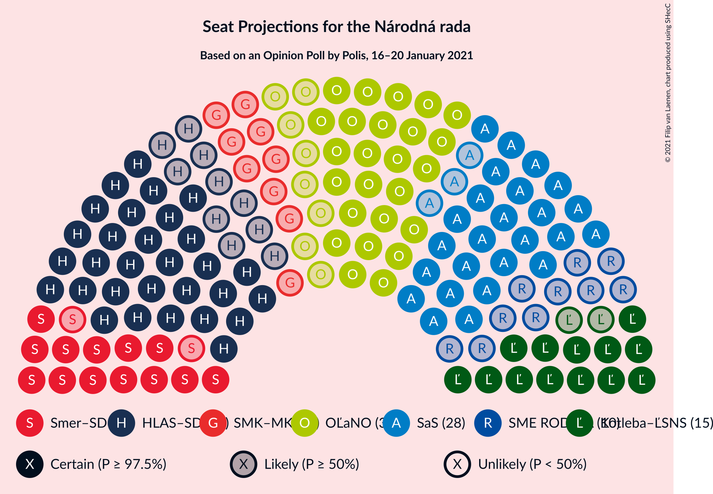
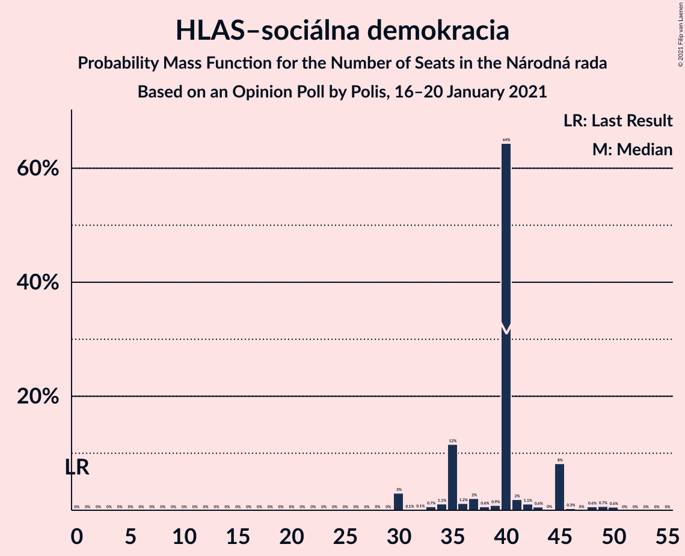
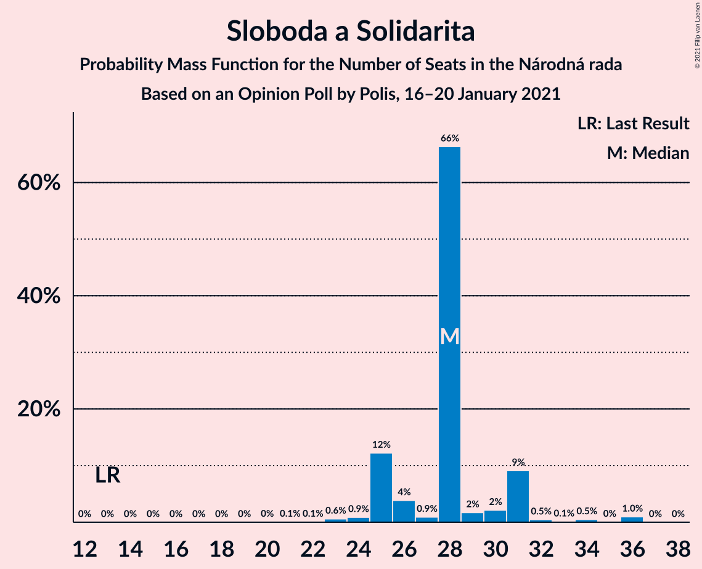
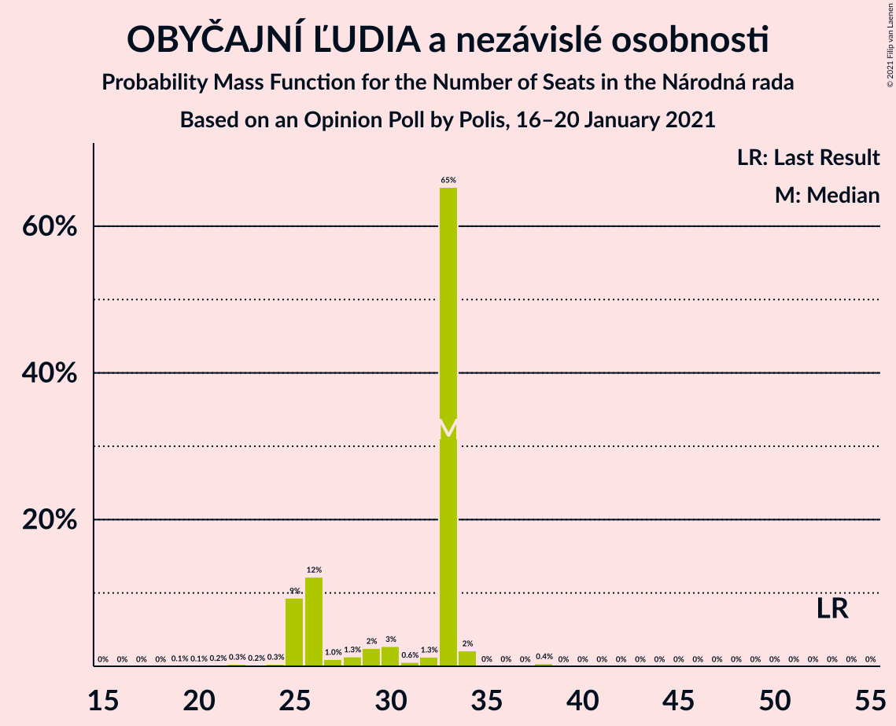
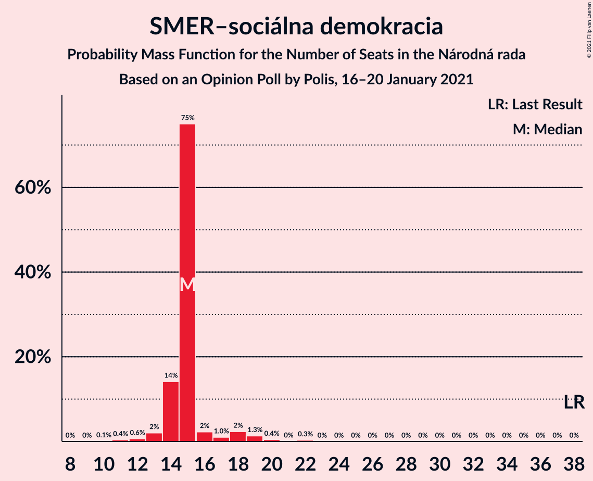
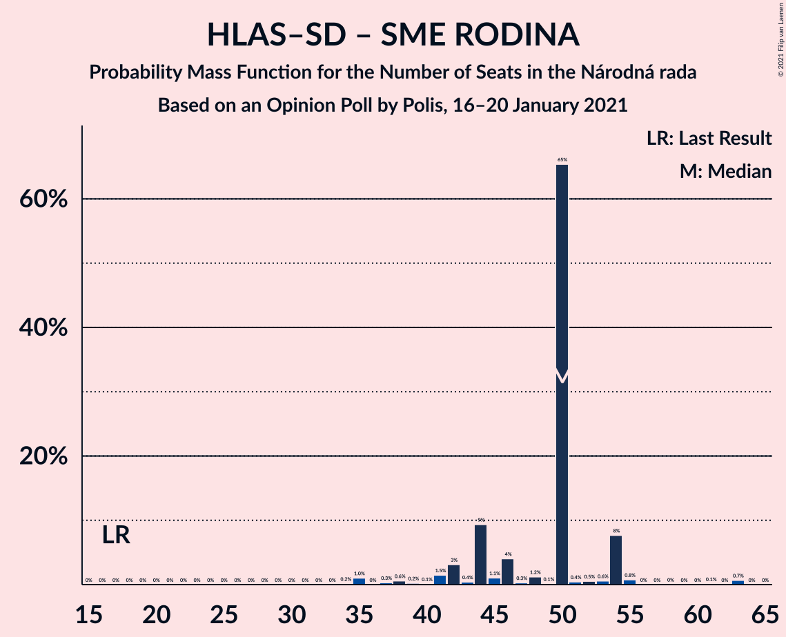
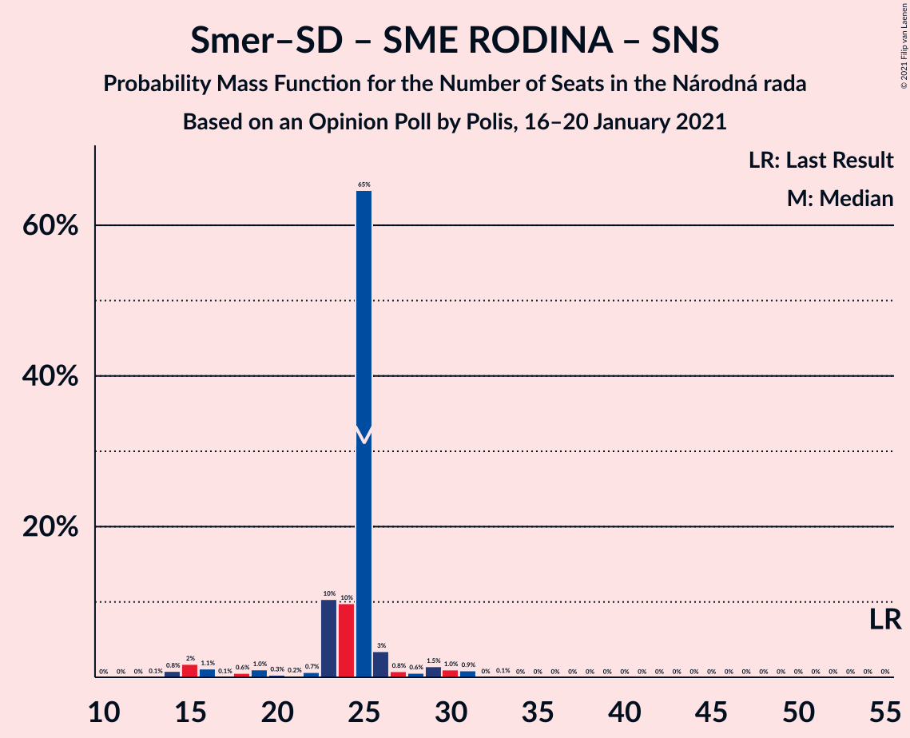

# Opinion Poll by Polis, 16–20 January 2021

<a href="#voting-intentions">Voting Intentions</a> | <a href="#seats">Seats</a> | <a href="#coalitions">Coalitions</a> | <a href="#technical-information">Technical Information</a>

## Voting Intentions

### Confidence Intervals

| Party | Last Result | Poll Result | 80% Confidence Interval | 90% Confidence Interval | 95% Confidence Interval | 99% Confidence Interval |
|:-----:|:-----------:|:-----------:|:-----------------------:|:-----------------------:|:-----------------------:|:-----------------------:|
| HLAS–sociálna demokracia | 0.0% | 21.4% | 19.9–23.0% |19.4–23.5% |19.1–23.9% |18.4–24.7% |
| Sloboda a Solidarita | 6.2% | 15.3% | 14.0–16.8% |13.6–17.2% |13.3–17.5% |12.7–18.3% |
| OBYČAJNÍ ĽUDIA a nezávislé osobnosti | 25.0% | 15.3% | 14.0–16.8% |13.6–17.2% |13.3–17.5% |12.7–18.3% |
| Kotleba–Ľudová strana Naše Slovensko | 8.0% | 8.5% | 7.5–9.6% |7.2–10.0% |7.0–10.2% |6.5–10.8% |
| SMER–sociálna demokracia | 18.3% | 8.4% | 7.4–9.5% |7.1–9.9% |6.9–10.2% |6.4–10.7% |
| SME RODINA | 8.2% | 5.5% | 4.7–6.5% |4.5–6.8% |4.3–7.0% |3.9–7.5% |
| Strana maďarskej koalície–Magyar Koalíció Pártja | 3.9% | 5.2% | 4.5–6.2% |4.2–6.4% |4.1–6.7% |3.7–7.2% |
| Za ľudí | 5.8% | 5.0% | 4.3–6.0% |4.1–6.2% |3.9–6.5% |3.6–7.0% |
| Progresívne Slovensko | 7.0% | 4.6% | 3.9–5.5% |3.7–5.8% |3.5–6.0% |3.2–6.4% |
| Kresťanskodemokratické hnutie | 4.6% | 3.9% | 3.2–4.7% |3.0–5.0% |2.9–5.2% |2.6–5.6% |
| Dobrá voľba | 3.1% | 3.1% | 2.5–3.8% |2.3–4.1% |2.2–4.3% |2.0–4.6% |
| VLASŤ | 2.9% | 2.1% | 1.6–2.7% |1.5–2.9% |1.4–3.1% |1.2–3.4% |
| Slovenská národná strana | 3.2% | 1.0% | 0.7–1.5% |0.6–1.6% |0.5–1.8% |0.4–2.0% |
| MOST–HÍD | 2.0% | 0.4% | 0.3–0.8% |0.2–0.9% |0.2–1.1% |0.1–1.3% |
| SPOLU–Občianska Demokracia | 7.0% | 0.4% | 0.3–0.8% |0.2–0.9% |0.2–1.1% |0.1–1.3% |

*Note:* The poll result column reflects the actual value used in the calculations. Published results may vary slightly, and in addition be rounded to fewer digits.

## Seats

### Confidence Intervals

| Party | Last Result | Median | 80% Confidence Interval | 90% Confidence Interval | 95% Confidence Interval | 99% Confidence Interval |
|:-----:|:-----------:|:------:|:-----------------------:|:-----------------------:|:-----------------------:|:-----------------------:|
| <a href="#hlas–sociálna-demokracia">HLAS–sociálna demokracia</a> | 0 | 36 | 30–42 |30–46 |30–46 |30–50 |
| <a href="#sloboda-a-solidarita">Sloboda a Solidarita</a> | 13 | 26 | 25–29 |25–33 |25–36 |25–36 |
| <a href="#obyčajní-ľudia-a-nezávislé-osobnosti">OBYČAJNÍ ĽUDIA a nezávislé osobnosti</a> | 53 | 26 | 26–34 |25–34 |24–34 |22–34 |
| <a href="#kotleba–ľudová-strana-naše-slovensko">Kotleba–Ľudová strana Naše Slovensko</a> | 17 | 15 | 14–17 |14–18 |13–18 |11–19 |
| <a href="#smer–sociálna-demokracia">SMER–sociálna demokracia</a> | 38 | 14 | 13–18 |13–19 |13–22 |11–22 |
| <a href="#sme-rodina">SME RODINA</a> | 17 | 12 | 0–13 |0–13 |0–13 |0–13 |
| <a href="#strana-maďarskej-koalície–magyar-koalíció-pártja">Strana maďarskej koalície–Magyar Koalíció Pártja</a> | 0 | 9 | 0–11 |0–12 |0–12 |0–14 |
| <a href="#za-ľudí">Za ľudí</a> | 12 | 11 | 0–11 |0–11 |0–11 |0–14 |
| <a href="#progresívne-slovensko">Progresívne Slovensko</a> | 0 | 0 | 0–10 |0–10 |0–10 |0–11 |
| <a href="#kresťanskodemokratické-hnutie">Kresťanskodemokratické hnutie</a> | 0 | 0 | 0–8 |0–8 |0–8 |0–11 |
| <a href="#dobrá-voľba">Dobrá voľba</a> | 0 | 0 | 0 |0 |0 |0 |
| <a href="#vlasť">VLASŤ</a> | 0 | 0 | 0 |0 |0 |0 |
| <a href="#slovenská-národná-strana">Slovenská národná strana</a> | 0 | 0 | 0 |0 |0 |0 |
| <a href="#most–híd">MOST–HÍD</a> | 0 | 0 | 0 |0 |0 |0 |
| <a href="#spolu–občianska-demokracia">SPOLU–Občianska Demokracia</a> | 0 | 0 | 0 |0 |0 |0 |

### HLAS–sociálna demokracia

*For a full overview of the results for this party, see the [HLAS–sociálna demokracia](party-hlas–sociálnademokracia.html) page.*

| Number of Seats | Probability | Accumulated | Special Marks |
|:---------------:|:-----------:|:-----------:|:-------------:|
| 0 | 0% | 100% | Last Result |
| 1 | 0% | 100% |  |
| 2 | 0% | 100% |  |
| 3 | 0% | 100% |  |
| 4 | 0% | 100% |  |
| 5 | 0% | 100% |  |
| 6 | 0% | 100% |  |
| 7 | 0% | 100% |  |
| 8 | 0% | 100% |  |
| 9 | 0% | 100% |  |
| 10 | 0% | 100% |  |
| 11 | 0% | 100% |  |
| 12 | 0% | 100% |  |
| 13 | 0% | 100% |  |
| 14 | 0% | 100% |  |
| 15 | 0% | 100% |  |
| 16 | 0% | 100% |  |
| 17 | 0% | 100% |  |
| 18 | 0% | 100% |  |
| 19 | 0% | 100% |  |
| 20 | 0% | 100% |  |
| 21 | 0% | 100% |  |
| 22 | 0% | 100% |  |
| 23 | 0% | 100% |  |
| 24 | 0% | 100% |  |
| 25 | 0% | 100% |  |
| 26 | 0% | 100% |  |
| 27 | 0% | 100% |  |
| 28 | 0% | 100% |  |
| 29 | 0% | 100% |  |
| 30 | 45% | 100% |  |
| 31 | 0% | 55% |  |
| 32 | 0% | 55% |  |
| 33 | 2% | 55% |  |
| 34 | 0.4% | 53% |  |
| 35 | 2% | 53% |  |
| 36 | 17% | 51% | Median |
| 37 | 0.1% | 33% |  |
| 38 | 9% | 33% |  |
| 39 | 4% | 24% |  |
| 40 | 2% | 21% |  |
| 41 | 0.9% | 19% |  |
| 42 | 11% | 18% |  |
| 43 | 0.1% | 7% |  |
| 44 | 0% | 7% |  |
| 45 | 0.5% | 7% |  |
| 46 | 4% | 6% |  |
| 47 | 0% | 2% |  |
| 48 | 0% | 2% |  |
| 49 | 0% | 2% |  |
| 50 | 2% | 2% |  |
| 51 | 0% | 0% |  |

### Sloboda a Solidarita

*For a full overview of the results for this party, see the [Sloboda a Solidarita](party-slobodaasolidarita.html) page.*

| Number of Seats | Probability | Accumulated | Special Marks |
|:---------------:|:-----------:|:-----------:|:-------------:|
| 13 | 0% | 100% | Last Result |
| 14 | 0% | 100% |  |
| 15 | 0% | 100% |  |
| 16 | 0% | 100% |  |
| 17 | 0% | 100% |  |
| 18 | 0% | 100% |  |
| 19 | 0% | 100% |  |
| 20 | 0.1% | 100% |  |
| 21 | 0% | 99.9% |  |
| 22 | 0% | 99.9% |  |
| 23 | 0.2% | 99.9% |  |
| 24 | 0.1% | 99.8% |  |
| 25 | 49% | 99.6% |  |
| 26 | 12% | 51% | Median |
| 27 | 0.7% | 38% |  |
| 28 | 26% | 38% |  |
| 29 | 2% | 12% |  |
| 30 | 3% | 10% |  |
| 31 | 0% | 6% |  |
| 32 | 0.6% | 6% |  |
| 33 | 1.0% | 6% |  |
| 34 | 0.1% | 5% |  |
| 35 | 0% | 5% |  |
| 36 | 5% | 5% |  |
| 37 | 0% | 0% |  |

### OBYČAJNÍ ĽUDIA a nezávislé osobnosti

*For a full overview of the results for this party, see the [OBYČAJNÍ ĽUDIA a nezávislé osobnosti](party-obyčajníľudiaanezávisléosobnosti.html) page.*

| Number of Seats | Probability | Accumulated | Special Marks |
|:---------------:|:-----------:|:-----------:|:-------------:|
| 20 | 0.1% | 100% |  |
| 21 | 0% | 99.9% |  |
| 22 | 2% | 99.9% |  |
| 23 | 0% | 98% |  |
| 24 | 0.8% | 98% |  |
| 25 | 3% | 97% |  |
| 26 | 45% | 94% | Median |
| 27 | 2% | 49% |  |
| 28 | 5% | 47% |  |
| 29 | 27% | 43% |  |
| 30 | 4% | 15% |  |
| 31 | 0% | 11% |  |
| 32 | 0% | 11% |  |
| 33 | 0.5% | 11% |  |
| 34 | 11% | 11% |  |
| 35 | 0% | 0% |  |
| 36 | 0% | 0% |  |
| 37 | 0% | 0% |  |
| 38 | 0% | 0% |  |
| 39 | 0% | 0% |  |
| 40 | 0% | 0% |  |
| 41 | 0% | 0% |  |
| 42 | 0% | 0% |  |
| 43 | 0% | 0% |  |
| 44 | 0% | 0% |  |
| 45 | 0% | 0% |  |
| 46 | 0% | 0% |  |
| 47 | 0% | 0% |  |
| 48 | 0% | 0% |  |
| 49 | 0% | 0% |  |
| 50 | 0% | 0% |  |
| 51 | 0% | 0% |  |
| 52 | 0% | 0% |  |
| 53 | 0% | 0% | Last Result |

### Kotleba–Ľudová strana Naše Slovensko

*For a full overview of the results for this party, see the [Kotleba–Ľudová strana Naše Slovensko](party-kotleba–ľudovástrananašeslovensko.html) page.*

| Number of Seats | Probability | Accumulated | Special Marks |
|:---------------:|:-----------:|:-----------:|:-------------:|
| 11 | 1.5% | 100% |  |
| 12 | 0% | 98% |  |
| 13 | 3% | 98% |  |
| 14 | 18% | 96% |  |
| 15 | 46% | 77% | Median |
| 16 | 14% | 32% |  |
| 17 | 12% | 18% | Last Result |
| 18 | 5% | 6% |  |
| 19 | 0.2% | 0.6% |  |
| 20 | 0.1% | 0.3% |  |
| 21 | 0% | 0.2% |  |
| 22 | 0.2% | 0.2% |  |
| 23 | 0% | 0% |  |

### SMER–sociálna demokracia

*For a full overview of the results for this party, see the [SMER–sociálna demokracia](party-smer–sociálnademokracia.html) page.*

| Number of Seats | Probability | Accumulated | Special Marks |
|:---------------:|:-----------:|:-----------:|:-------------:|
| 11 | 1.5% | 100% |  |
| 12 | 0.3% | 98.5% |  |
| 13 | 20% | 98% |  |
| 14 | 45% | 79% | Median |
| 15 | 2% | 33% |  |
| 16 | 11% | 31% |  |
| 17 | 2% | 21% |  |
| 18 | 11% | 19% |  |
| 19 | 3% | 8% |  |
| 20 | 0% | 5% |  |
| 21 | 0.1% | 5% |  |
| 22 | 4% | 4% |  |
| 23 | 0% | 0% |  |
| 24 | 0% | 0% |  |
| 25 | 0% | 0% |  |
| 26 | 0% | 0% |  |
| 27 | 0% | 0% |  |
| 28 | 0% | 0% |  |
| 29 | 0% | 0% |  |
| 30 | 0% | 0% |  |
| 31 | 0% | 0% |  |
| 32 | 0% | 0% |  |
| 33 | 0% | 0% |  |
| 34 | 0% | 0% |  |
| 35 | 0% | 0% |  |
| 36 | 0% | 0% |  |
| 37 | 0% | 0% |  |
| 38 | 0% | 0% | Last Result |

### SME RODINA

*For a full overview of the results for this party, see the [SME RODINA](party-smerodina.html) page.*

| Number of Seats | Probability | Accumulated | Special Marks |
|:---------------:|:-----------:|:-----------:|:-------------:|
| 0 | 14% | 100% |  |
| 1 | 0% | 86% |  |
| 2 | 0% | 86% |  |
| 3 | 0% | 86% |  |
| 4 | 0% | 86% |  |
| 5 | 0% | 86% |  |
| 6 | 0% | 86% |  |
| 7 | 0% | 86% |  |
| 8 | 0% | 86% |  |
| 9 | 0.2% | 86% |  |
| 10 | 18% | 86% |  |
| 11 | 3% | 67% |  |
| 12 | 51% | 65% | Median |
| 13 | 14% | 14% |  |
| 14 | 0% | 0.2% |  |
| 15 | 0% | 0.2% |  |
| 16 | 0.1% | 0.1% |  |
| 17 | 0% | 0% | Last Result |

### Strana maďarskej koalície–Magyar Koalíció Pártja

*For a full overview of the results for this party, see the [Strana maďarskej koalície–Magyar Koalíció Pártja](party-stranamaďarskejkoalície–magyarkoalíciópártja.html) page.*

| Number of Seats | Probability | Accumulated | Special Marks |
|:---------------:|:-----------:|:-----------:|:-------------:|
| 0 | 24% | 100% | Last Result |
| 1 | 0% | 76% |  |
| 2 | 0% | 76% |  |
| 3 | 0% | 76% |  |
| 4 | 0% | 76% |  |
| 5 | 0% | 76% |  |
| 6 | 0% | 76% |  |
| 7 | 0% | 76% |  |
| 8 | 0% | 76% |  |
| 9 | 46% | 76% | Median |
| 10 | 18% | 30% |  |
| 11 | 2% | 12% |  |
| 12 | 8% | 9% |  |
| 13 | 0.2% | 1.2% |  |
| 14 | 1.0% | 1.0% |  |
| 15 | 0% | 0% |  |

### Za ľudí

*For a full overview of the results for this party, see the [Za ľudí](party-zaľudí.html) page.*

| Number of Seats | Probability | Accumulated | Special Marks |
|:---------------:|:-----------:|:-----------:|:-------------:|
| 0 | 36% | 100% |  |
| 1 | 0% | 64% |  |
| 2 | 0% | 64% |  |
| 3 | 0% | 64% |  |
| 4 | 0% | 64% |  |
| 5 | 0% | 64% |  |
| 6 | 0% | 64% |  |
| 7 | 0% | 64% |  |
| 8 | 0% | 64% |  |
| 9 | 0.1% | 64% |  |
| 10 | 7% | 64% |  |
| 11 | 56% | 57% | Median |
| 12 | 0.1% | 2% | Last Result |
| 13 | 0.1% | 1.5% |  |
| 14 | 1.4% | 1.4% |  |
| 15 | 0% | 0% |  |

### Progresívne Slovensko

*For a full overview of the results for this party, see the [Progresívne Slovensko](party-progresívneslovensko.html) page.*

| Number of Seats | Probability | Accumulated | Special Marks |
|:---------------:|:-----------:|:-----------:|:-------------:|
| 0 | 82% | 100% | Last Result, Median |
| 1 | 0% | 18% |  |
| 2 | 0% | 18% |  |
| 3 | 0% | 18% |  |
| 4 | 0% | 18% |  |
| 5 | 0% | 18% |  |
| 6 | 0% | 18% |  |
| 7 | 0% | 18% |  |
| 8 | 0% | 18% |  |
| 9 | 0.1% | 18% |  |
| 10 | 17% | 18% |  |
| 11 | 0.7% | 0.9% |  |
| 12 | 0% | 0.2% |  |
| 13 | 0% | 0.1% |  |
| 14 | 0.1% | 0.1% |  |
| 15 | 0% | 0% |  |

### Kresťanskodemokratické hnutie

*For a full overview of the results for this party, see the [Kresťanskodemokratické hnutie](party-kresťanskodemokratickéhnutie.html) page.*

| Number of Seats | Probability | Accumulated | Special Marks |
|:---------------:|:-----------:|:-----------:|:-------------:|
| 0 | 54% | 100% | Last Result, Median |
| 1 | 0% | 46% |  |
| 2 | 0% | 46% |  |
| 3 | 0% | 46% |  |
| 4 | 0% | 46% |  |
| 5 | 0% | 46% |  |
| 6 | 0% | 46% |  |
| 7 | 0% | 46% |  |
| 8 | 45% | 46% |  |
| 9 | 0.8% | 1.4% |  |
| 10 | 0.1% | 0.6% |  |
| 11 | 0.5% | 0.5% |  |
| 12 | 0% | 0% |  |

### Dobrá voľba

*For a full overview of the results for this party, see the [Dobrá voľba](party-dobrávoľba.html) page.*

| Number of Seats | Probability | Accumulated | Special Marks |
|:---------------:|:-----------:|:-----------:|:-------------:|
| 0 | 99.5% | 100% | Last Result, Median |
| 1 | 0% | 0.5% |  |
| 2 | 0% | 0.5% |  |
| 3 | 0% | 0.5% |  |
| 4 | 0% | 0.5% |  |
| 5 | 0% | 0.5% |  |
| 6 | 0% | 0.5% |  |
| 7 | 0% | 0.5% |  |
| 8 | 0% | 0.5% |  |
| 9 | 0% | 0.5% |  |
| 10 | 0.5% | 0.5% |  |
| 11 | 0% | 0% |  |

### VLASŤ

*For a full overview of the results for this party, see the [VLASŤ](party-vlasť.html) page.*

| Number of Seats | Probability | Accumulated | Special Marks |
|:---------------:|:-----------:|:-----------:|:-------------:|
| 0 | 100% | 100% | Last Result, Median |

### Slovenská národná strana

*For a full overview of the results for this party, see the [Slovenská národná strana](party-slovenskánárodnástrana.html) page.*

| Number of Seats | Probability | Accumulated | Special Marks |
|:---------------:|:-----------:|:-----------:|:-------------:|
| 0 | 100% | 100% | Last Result, Median |

### MOST–HÍD

*For a full overview of the results for this party, see the [MOST–HÍD](party-most–híd.html) page.*

| Number of Seats | Probability | Accumulated | Special Marks |
|:---------------:|:-----------:|:-----------:|:-------------:|
| 0 | 100% | 100% | Last Result, Median |

### SPOLU–Občianska Demokracia

*For a full overview of the results for this party, see the [SPOLU–Občianska Demokracia](party-spolu–občianskademokracia.html) page.*

| Number of Seats | Probability | Accumulated | Special Marks |
|:---------------:|:-----------:|:-----------:|:-------------:|
| 0 | 100% | 100% | Last Result, Median |

## Coalitions

### Confidence Intervals

| Coalition | Last Result | Median | Majority? | 80% Confidence Interval | 90% Confidence Interval | 95% Confidence Interval | 99% Confidence Interval |
|:---------:|:-----------:|:------:|:---------:|:-----------------------:|:-----------------------:|:-----------------------:|:-----------------------:|
| HLAS–sociálna demokracia – Kotleba–Ľudová strana Naše Slovensko – SMER–sociálna demokracia – SME RODINA – Slovenská národná strana | 72 | 71 | 26% | 71–90 | 70–90 | 70–90 | 70–92 |
| HLAS–sociálna demokracia – SMER–sociálna demokracia – SME RODINA | 55 | 56 | 2% | 56–73 | 54–73 | 54–73 | 52–76 |
| HLAS–sociálna demokracia – SMER–sociálna demokracia – SME RODINA – Slovenská národná strana | 55 | 56 | 2% | 56–73 | 54–73 | 54–73 | 52–76 |
| HLAS–sociálna demokracia – Kotleba–Ľudová strana Naše Slovensko – SME RODINA – Slovenská národná strana | 34 | 57 | 2% | 57–72 | 54–72 | 54–72 | 52–77 |
| HLAS–sociálna demokracia – SMER–sociálna demokracia – Slovenská národná strana – MOST–HÍD | 38 | 49 | 0% | 44–60 | 44–65 | 44–68 | 44–68 |
| HLAS–sociálna demokracia – SMER–sociálna demokracia – Slovenská národná strana | 38 | 49 | 0% | 44–60 | 44–65 | 44–68 | 44–68 |
| HLAS–sociálna demokracia – SME RODINA | 17 | 42 | 0% | 42–55 | 38–55 | 38–55 | 38–61 |
| HLAS–sociálna demokracia – SME RODINA – Slovenská národná strana | 17 | 42 | 0% | 42–55 | 38–55 | 38–55 | 38–61 |
| Kotleba–Ľudová strana Naše Slovensko – SMER–sociálna demokracia – SME RODINA – Slovenská národná strana | 72 | 41 | 0% | 36–48 | 32–48 | 32–48 | 32–48 |
| HLAS–sociálna demokracia – Slovenská národná strana – MOST–HÍD | 0 | 36 | 0% | 30–42 | 30–46 | 30–46 | 30–50 |
| HLAS–sociálna demokracia – Slovenská národná strana | 0 | 36 | 0% | 30–42 | 30–46 | 30–46 | 30–50 |
| SMER–sociálna demokracia – SME RODINA | 55 | 26 | 0% | 21–31 | 16–31 | 16–31 | 13–31 |
| SMER–sociálna demokracia – SME RODINA – Slovenská národná strana | 55 | 26 | 0% | 21–31 | 16–31 | 16–31 | 13–31 |
| SMER–sociálna demokracia – Slovenská národná strana – MOST–HÍD | 38 | 14 | 0% | 13–18 | 13–19 | 13–22 | 11–22 |
| SMER–sociálna demokracia | 38 | 14 | 0% | 13–18 | 13–19 | 13–22 | 11–22 |
| SMER–sociálna demokracia – Slovenská národná strana | 38 | 14 | 0% | 13–18 | 13–19 | 13–22 | 11–22 |

### HLAS–sociálna demokracia – Kotleba–Ľudová strana Naše Slovensko – SMER–sociálna demokracia – SME RODINA – Slovenská národná strana

| Number of Seats | Probability | Accumulated | Special Marks |
|:---------------:|:-----------:|:-----------:|:-------------:|
| 64 | 0.1% | 100% |  |
| 65 | 0% | 99.9% |  |
| 66 | 0% | 99.9% |  |
| 67 | 0% | 99.9% |  |
| 68 | 0% | 99.9% |  |
| 69 | 0% | 99.8% |  |
| 70 | 9% | 99.8% |  |
| 71 | 46% | 91% |  |
| 72 | 0% | 45% | Last Result |
| 73 | 17% | 45% |  |
| 74 | 0.3% | 28% |  |
| 75 | 2% | 28% |  |
| 76 | 1.4% | 26% | Majority |
| 77 | 0.1% | 24% | Median |
| 78 | 0.6% | 24% |  |
| 79 | 0.1% | 23% |  |
| 80 | 2% | 23% |  |
| 81 | 1.0% | 21% |  |
| 82 | 0.1% | 20% |  |
| 83 | 0% | 20% |  |
| 84 | 0.1% | 20% |  |
| 85 | 0.5% | 20% |  |
| 86 | 7% | 20% |  |
| 87 | 0% | 13% |  |
| 88 | 0% | 13% |  |
| 89 | 0% | 13% |  |
| 90 | 11% | 13% |  |
| 91 | 0% | 2% |  |
| 92 | 2% | 2% |  |
| 93 | 0% | 0% |  |

### HLAS–sociálna demokracia – SMER–sociálna demokracia – SME RODINA

| Number of Seats | Probability | Accumulated | Special Marks |
|:---------------:|:-----------:|:-----------:|:-------------:|
| 47 | 0.1% | 100% |  |
| 48 | 0% | 99.9% |  |
| 49 | 0% | 99.9% |  |
| 50 | 0% | 99.9% |  |
| 51 | 0.2% | 99.9% |  |
| 52 | 0.2% | 99.7% |  |
| 53 | 0% | 99.4% |  |
| 54 | 8% | 99.4% |  |
| 55 | 0.4% | 91% | Last Result |
| 56 | 45% | 91% |  |
| 57 | 0% | 46% |  |
| 58 | 0.7% | 46% |  |
| 59 | 17% | 45% |  |
| 60 | 0.2% | 28% |  |
| 61 | 0.5% | 28% |  |
| 62 | 3% | 27% | Median |
| 63 | 0% | 24% |  |
| 64 | 2% | 24% |  |
| 65 | 1.5% | 22% |  |
| 66 | 0.2% | 20% |  |
| 67 | 0.2% | 20% |  |
| 68 | 4% | 20% |  |
| 69 | 0.1% | 16% |  |
| 70 | 2% | 16% |  |
| 71 | 0.5% | 13% |  |
| 72 | 0% | 13% |  |
| 73 | 11% | 13% |  |
| 74 | 0% | 2% |  |
| 75 | 0% | 2% |  |
| 76 | 2% | 2% | Majority |
| 77 | 0% | 0% |  |

### HLAS–sociálna demokracia – SMER–sociálna demokracia – SME RODINA – Slovenská národná strana

| Number of Seats | Probability | Accumulated | Special Marks |
|:---------------:|:-----------:|:-----------:|:-------------:|
| 47 | 0.1% | 100% |  |
| 48 | 0% | 99.9% |  |
| 49 | 0% | 99.9% |  |
| 50 | 0% | 99.9% |  |
| 51 | 0.2% | 99.9% |  |
| 52 | 0.2% | 99.7% |  |
| 53 | 0% | 99.4% |  |
| 54 | 8% | 99.4% |  |
| 55 | 0.4% | 91% | Last Result |
| 56 | 45% | 91% |  |
| 57 | 0% | 46% |  |
| 58 | 0.7% | 46% |  |
| 59 | 17% | 45% |  |
| 60 | 0.2% | 28% |  |
| 61 | 0.5% | 28% |  |
| 62 | 3% | 27% | Median |
| 63 | 0% | 24% |  |
| 64 | 2% | 24% |  |
| 65 | 1.5% | 22% |  |
| 66 | 0.2% | 20% |  |
| 67 | 0.2% | 20% |  |
| 68 | 4% | 20% |  |
| 69 | 0.1% | 16% |  |
| 70 | 2% | 16% |  |
| 71 | 0.5% | 13% |  |
| 72 | 0% | 13% |  |
| 73 | 11% | 13% |  |
| 74 | 0% | 2% |  |
| 75 | 0% | 2% |  |
| 76 | 2% | 2% | Majority |
| 77 | 0% | 0% |  |

### HLAS–sociálna demokracia – Kotleba–Ľudová strana Naše Slovensko – SME RODINA – Slovenská národná strana

| Number of Seats | Probability | Accumulated | Special Marks |
|:---------------:|:-----------:|:-----------:|:-------------:|
| 34 | 0% | 100% | Last Result |
| 35 | 0% | 100% |  |
| 36 | 0% | 100% |  |
| 37 | 0% | 100% |  |
| 38 | 0% | 100% |  |
| 39 | 0% | 100% |  |
| 40 | 0% | 100% |  |
| 41 | 0% | 100% |  |
| 42 | 0% | 100% |  |
| 43 | 0% | 100% |  |
| 44 | 0% | 100% |  |
| 45 | 0% | 100% |  |
| 46 | 0% | 100% |  |
| 47 | 0% | 100% |  |
| 48 | 0% | 100% |  |
| 49 | 0% | 100% |  |
| 50 | 0% | 100% |  |
| 51 | 0.1% | 100% |  |
| 52 | 0.7% | 99.9% |  |
| 53 | 0.5% | 99.2% |  |
| 54 | 8% | 98.7% |  |
| 55 | 0% | 91% |  |
| 56 | 0% | 91% |  |
| 57 | 45% | 91% |  |
| 58 | 0.2% | 46% |  |
| 59 | 2% | 45% |  |
| 60 | 17% | 43% |  |
| 61 | 0.3% | 26% |  |
| 62 | 0% | 25% |  |
| 63 | 3% | 25% | Median |
| 64 | 5% | 22% |  |
| 65 | 0.1% | 17% |  |
| 66 | 0.1% | 17% |  |
| 67 | 3% | 17% |  |
| 68 | 0.1% | 14% |  |
| 69 | 0.1% | 14% |  |
| 70 | 0.9% | 14% |  |
| 71 | 0% | 13% |  |
| 72 | 11% | 13% |  |
| 73 | 0% | 2% |  |
| 74 | 0% | 2% |  |
| 75 | 0% | 2% |  |
| 76 | 0% | 2% | Majority |
| 77 | 2% | 2% |  |
| 78 | 0% | 0% |  |

### HLAS–sociálna demokracia – SMER–sociálna demokracia – Slovenská národná strana – MOST–HÍD

| Number of Seats | Probability | Accumulated | Special Marks |
|:---------------:|:-----------:|:-----------:|:-------------:|
| 38 | 0% | 100% | Last Result |
| 39 | 0% | 100% |  |
| 40 | 0% | 100% |  |
| 41 | 0% | 100% |  |
| 42 | 0% | 100% |  |
| 43 | 0% | 100% |  |
| 44 | 45% | 100% |  |
| 45 | 0% | 55% |  |
| 46 | 0% | 55% |  |
| 47 | 0.3% | 55% |  |
| 48 | 0.1% | 55% |  |
| 49 | 19% | 55% |  |
| 50 | 0.2% | 35% | Median |
| 51 | 1.3% | 35% |  |
| 52 | 2% | 34% |  |
| 53 | 2% | 31% |  |
| 54 | 8% | 30% |  |
| 55 | 0.5% | 22% |  |
| 56 | 0.1% | 21% |  |
| 57 | 0.1% | 21% |  |
| 58 | 4% | 21% |  |
| 59 | 0% | 17% |  |
| 60 | 11% | 17% |  |
| 61 | 0% | 6% |  |
| 62 | 0.1% | 6% |  |
| 63 | 0% | 6% |  |
| 64 | 0% | 6% |  |
| 65 | 2% | 6% |  |
| 66 | 0% | 4% |  |
| 67 | 0% | 4% |  |
| 68 | 4% | 4% |  |
| 69 | 0% | 0% |  |

### HLAS–sociálna demokracia – SMER–sociálna demokracia – Slovenská národná strana

| Number of Seats | Probability | Accumulated | Special Marks |
|:---------------:|:-----------:|:-----------:|:-------------:|
| 38 | 0% | 100% | Last Result |
| 39 | 0% | 100% |  |
| 40 | 0% | 100% |  |
| 41 | 0% | 100% |  |
| 42 | 0% | 100% |  |
| 43 | 0% | 100% |  |
| 44 | 45% | 100% |  |
| 45 | 0% | 55% |  |
| 46 | 0% | 55% |  |
| 47 | 0.3% | 55% |  |
| 48 | 0.1% | 55% |  |
| 49 | 19% | 55% |  |
| 50 | 0.2% | 35% | Median |
| 51 | 1.3% | 35% |  |
| 52 | 2% | 34% |  |
| 53 | 2% | 31% |  |
| 54 | 8% | 30% |  |
| 55 | 0.5% | 22% |  |
| 56 | 0.1% | 21% |  |
| 57 | 0.1% | 21% |  |
| 58 | 4% | 21% |  |
| 59 | 0% | 17% |  |
| 60 | 11% | 17% |  |
| 61 | 0% | 6% |  |
| 62 | 0.1% | 6% |  |
| 63 | 0% | 6% |  |
| 64 | 0% | 6% |  |
| 65 | 2% | 6% |  |
| 66 | 0% | 4% |  |
| 67 | 0% | 4% |  |
| 68 | 4% | 4% |  |
| 69 | 0% | 0% |  |

### HLAS–sociálna demokracia – SME RODINA

| Number of Seats | Probability | Accumulated | Special Marks |
|:---------------:|:-----------:|:-----------:|:-------------:|
| 17 | 0% | 100% | Last Result |
| 18 | 0% | 100% |  |
| 19 | 0% | 100% |  |
| 20 | 0% | 100% |  |
| 21 | 0% | 100% |  |
| 22 | 0% | 100% |  |
| 23 | 0% | 100% |  |
| 24 | 0% | 100% |  |
| 25 | 0% | 100% |  |
| 26 | 0% | 100% |  |
| 27 | 0% | 100% |  |
| 28 | 0% | 100% |  |
| 29 | 0% | 100% |  |
| 30 | 0% | 100% |  |
| 31 | 0% | 100% |  |
| 32 | 0% | 100% |  |
| 33 | 0% | 100% |  |
| 34 | 0.1% | 100% |  |
| 35 | 0% | 99.9% |  |
| 36 | 0% | 99.9% |  |
| 37 | 0.1% | 99.9% |  |
| 38 | 8% | 99.8% |  |
| 39 | 1.1% | 91% |  |
| 40 | 0% | 90% |  |
| 41 | 0.1% | 90% |  |
| 42 | 45% | 90% |  |
| 43 | 0.2% | 45% |  |
| 44 | 0% | 45% |  |
| 45 | 0% | 45% |  |
| 46 | 25% | 45% |  |
| 47 | 1.4% | 20% |  |
| 48 | 0.2% | 19% | Median |
| 49 | 0.1% | 19% |  |
| 50 | 0.6% | 19% |  |
| 51 | 2% | 18% |  |
| 52 | 1.5% | 16% |  |
| 53 | 0.8% | 14% |  |
| 54 | 0.1% | 13% |  |
| 55 | 11% | 13% |  |
| 56 | 0% | 2% |  |
| 57 | 0% | 2% |  |
| 58 | 0.5% | 2% |  |
| 59 | 0% | 2% |  |
| 60 | 0% | 2% |  |
| 61 | 2% | 2% |  |
| 62 | 0% | 0% |  |

### HLAS–sociálna demokracia – SME RODINA – Slovenská národná strana

| Number of Seats | Probability | Accumulated | Special Marks |
|:---------------:|:-----------:|:-----------:|:-------------:|
| 17 | 0% | 100% | Last Result |
| 18 | 0% | 100% |  |
| 19 | 0% | 100% |  |
| 20 | 0% | 100% |  |
| 21 | 0% | 100% |  |
| 22 | 0% | 100% |  |
| 23 | 0% | 100% |  |
| 24 | 0% | 100% |  |
| 25 | 0% | 100% |  |
| 26 | 0% | 100% |  |
| 27 | 0% | 100% |  |
| 28 | 0% | 100% |  |
| 29 | 0% | 100% |  |
| 30 | 0% | 100% |  |
| 31 | 0% | 100% |  |
| 32 | 0% | 100% |  |
| 33 | 0% | 100% |  |
| 34 | 0.1% | 100% |  |
| 35 | 0% | 99.9% |  |
| 36 | 0% | 99.9% |  |
| 37 | 0.1% | 99.9% |  |
| 38 | 8% | 99.8% |  |
| 39 | 1.1% | 91% |  |
| 40 | 0% | 90% |  |
| 41 | 0.1% | 90% |  |
| 42 | 45% | 90% |  |
| 43 | 0.2% | 45% |  |
| 44 | 0% | 45% |  |
| 45 | 0% | 45% |  |
| 46 | 25% | 45% |  |
| 47 | 1.4% | 20% |  |
| 48 | 0.2% | 19% | Median |
| 49 | 0.1% | 19% |  |
| 50 | 0.6% | 19% |  |
| 51 | 2% | 18% |  |
| 52 | 1.5% | 16% |  |
| 53 | 0.8% | 14% |  |
| 54 | 0.1% | 13% |  |
| 55 | 11% | 13% |  |
| 56 | 0% | 2% |  |
| 57 | 0% | 2% |  |
| 58 | 0.5% | 2% |  |
| 59 | 0% | 2% |  |
| 60 | 0% | 2% |  |
| 61 | 2% | 2% |  |
| 62 | 0% | 0% |  |

### Kotleba–Ľudová strana Naše Slovensko – SMER–sociálna demokracia – SME RODINA – Slovenská národná strana

| Number of Seats | Probability | Accumulated | Special Marks |
|:---------------:|:-----------:|:-----------:|:-------------:|
| 28 | 0% | 100% |  |
| 29 | 0% | 99.9% |  |
| 30 | 0.1% | 99.9% |  |
| 31 | 0.2% | 99.9% |  |
| 32 | 9% | 99.6% |  |
| 33 | 0% | 91% |  |
| 34 | 0.1% | 90% |  |
| 35 | 0.2% | 90% |  |
| 36 | 2% | 90% |  |
| 37 | 17% | 89% |  |
| 38 | 0.5% | 71% |  |
| 39 | 0% | 71% |  |
| 40 | 6% | 71% |  |
| 41 | 45% | 65% | Median |
| 42 | 4% | 20% |  |
| 43 | 0.1% | 15% |  |
| 44 | 0% | 15% |  |
| 45 | 2% | 15% |  |
| 46 | 0% | 13% |  |
| 47 | 2% | 13% |  |
| 48 | 11% | 11% |  |
| 49 | 0% | 0% |  |
| 50 | 0% | 0% |  |
| 51 | 0% | 0% |  |
| 52 | 0% | 0% |  |
| 53 | 0% | 0% |  |
| 54 | 0% | 0% |  |
| 55 | 0% | 0% |  |
| 56 | 0% | 0% |  |
| 57 | 0% | 0% |  |
| 58 | 0% | 0% |  |
| 59 | 0% | 0% |  |
| 60 | 0% | 0% |  |
| 61 | 0% | 0% |  |
| 62 | 0% | 0% |  |
| 63 | 0% | 0% |  |
| 64 | 0% | 0% |  |
| 65 | 0% | 0% |  |
| 66 | 0% | 0% |  |
| 67 | 0% | 0% |  |
| 68 | 0% | 0% |  |
| 69 | 0% | 0% |  |
| 70 | 0% | 0% |  |
| 71 | 0% | 0% |  |
| 72 | 0% | 0% | Last Result |

### HLAS–sociálna demokracia – Slovenská národná strana – MOST–HÍD

| Number of Seats | Probability | Accumulated | Special Marks |
|:---------------:|:-----------:|:-----------:|:-------------:|
| 0 | 0% | 100% | Last Result |
| 1 | 0% | 100% |  |
| 2 | 0% | 100% |  |
| 3 | 0% | 100% |  |
| 4 | 0% | 100% |  |
| 5 | 0% | 100% |  |
| 6 | 0% | 100% |  |
| 7 | 0% | 100% |  |
| 8 | 0% | 100% |  |
| 9 | 0% | 100% |  |
| 10 | 0% | 100% |  |
| 11 | 0% | 100% |  |
| 12 | 0% | 100% |  |
| 13 | 0% | 100% |  |
| 14 | 0% | 100% |  |
| 15 | 0% | 100% |  |
| 16 | 0% | 100% |  |
| 17 | 0% | 100% |  |
| 18 | 0% | 100% |  |
| 19 | 0% | 100% |  |
| 20 | 0% | 100% |  |
| 21 | 0% | 100% |  |
| 22 | 0% | 100% |  |
| 23 | 0% | 100% |  |
| 24 | 0% | 100% |  |
| 25 | 0% | 100% |  |
| 26 | 0% | 100% |  |
| 27 | 0% | 100% |  |
| 28 | 0% | 100% |  |
| 29 | 0% | 100% |  |
| 30 | 45% | 100% |  |
| 31 | 0% | 55% |  |
| 32 | 0% | 55% |  |
| 33 | 2% | 55% |  |
| 34 | 0.4% | 53% |  |
| 35 | 2% | 53% |  |
| 36 | 17% | 51% | Median |
| 37 | 0.1% | 33% |  |
| 38 | 9% | 33% |  |
| 39 | 4% | 24% |  |
| 40 | 2% | 21% |  |
| 41 | 0.9% | 19% |  |
| 42 | 11% | 18% |  |
| 43 | 0.1% | 7% |  |
| 44 | 0% | 7% |  |
| 45 | 0.5% | 7% |  |
| 46 | 4% | 6% |  |
| 47 | 0% | 2% |  |
| 48 | 0% | 2% |  |
| 49 | 0% | 2% |  |
| 50 | 2% | 2% |  |
| 51 | 0% | 0% |  |

### HLAS–sociálna demokracia – Slovenská národná strana

| Number of Seats | Probability | Accumulated | Special Marks |
|:---------------:|:-----------:|:-----------:|:-------------:|
| 0 | 0% | 100% | Last Result |
| 1 | 0% | 100% |  |
| 2 | 0% | 100% |  |
| 3 | 0% | 100% |  |
| 4 | 0% | 100% |  |
| 5 | 0% | 100% |  |
| 6 | 0% | 100% |  |
| 7 | 0% | 100% |  |
| 8 | 0% | 100% |  |
| 9 | 0% | 100% |  |
| 10 | 0% | 100% |  |
| 11 | 0% | 100% |  |
| 12 | 0% | 100% |  |
| 13 | 0% | 100% |  |
| 14 | 0% | 100% |  |
| 15 | 0% | 100% |  |
| 16 | 0% | 100% |  |
| 17 | 0% | 100% |  |
| 18 | 0% | 100% |  |
| 19 | 0% | 100% |  |
| 20 | 0% | 100% |  |
| 21 | 0% | 100% |  |
| 22 | 0% | 100% |  |
| 23 | 0% | 100% |  |
| 24 | 0% | 100% |  |
| 25 | 0% | 100% |  |
| 26 | 0% | 100% |  |
| 27 | 0% | 100% |  |
| 28 | 0% | 100% |  |
| 29 | 0% | 100% |  |
| 30 | 45% | 100% |  |
| 31 | 0% | 55% |  |
| 32 | 0% | 55% |  |
| 33 | 2% | 55% |  |
| 34 | 0.4% | 53% |  |
| 35 | 2% | 53% |  |
| 36 | 17% | 51% | Median |
| 37 | 0.1% | 33% |  |
| 38 | 9% | 33% |  |
| 39 | 4% | 24% |  |
| 40 | 2% | 21% |  |
| 41 | 0.9% | 19% |  |
| 42 | 11% | 18% |  |
| 43 | 0.1% | 7% |  |
| 44 | 0% | 7% |  |
| 45 | 0.5% | 7% |  |
| 46 | 4% | 6% |  |
| 47 | 0% | 2% |  |
| 48 | 0% | 2% |  |
| 49 | 0% | 2% |  |
| 50 | 2% | 2% |  |
| 51 | 0% | 0% |  |

### SMER–sociálna demokracia – SME RODINA

| Number of Seats | Probability | Accumulated | Special Marks |
|:---------------:|:-----------:|:-----------:|:-------------:|
| 12 | 0.2% | 100% |  |
| 13 | 0.3% | 99.8% |  |
| 14 | 0% | 99.5% |  |
| 15 | 0% | 99.5% |  |
| 16 | 8% | 99.5% |  |
| 17 | 0.5% | 91% |  |
| 18 | 0% | 91% |  |
| 19 | 0.7% | 91% |  |
| 20 | 0% | 90% |  |
| 21 | 0.6% | 90% |  |
| 22 | 5% | 90% |  |
| 23 | 18% | 85% |  |
| 24 | 0.1% | 67% |  |
| 25 | 2% | 67% |  |
| 26 | 48% | 65% | Median |
| 27 | 0.7% | 18% |  |
| 28 | 0.1% | 17% |  |
| 29 | 4% | 17% |  |
| 30 | 0% | 13% |  |
| 31 | 13% | 13% |  |
| 32 | 0% | 0% |  |
| 33 | 0% | 0% |  |
| 34 | 0% | 0% |  |
| 35 | 0% | 0% |  |
| 36 | 0% | 0% |  |
| 37 | 0% | 0% |  |
| 38 | 0% | 0% |  |
| 39 | 0% | 0% |  |
| 40 | 0% | 0% |  |
| 41 | 0% | 0% |  |
| 42 | 0% | 0% |  |
| 43 | 0% | 0% |  |
| 44 | 0% | 0% |  |
| 45 | 0% | 0% |  |
| 46 | 0% | 0% |  |
| 47 | 0% | 0% |  |
| 48 | 0% | 0% |  |
| 49 | 0% | 0% |  |
| 50 | 0% | 0% |  |
| 51 | 0% | 0% |  |
| 52 | 0% | 0% |  |
| 53 | 0% | 0% |  |
| 54 | 0% | 0% |  |
| 55 | 0% | 0% | Last Result |

### SMER–sociálna demokracia – SME RODINA – Slovenská národná strana

| Number of Seats | Probability | Accumulated | Special Marks |
|:---------------:|:-----------:|:-----------:|:-------------:|
| 12 | 0.2% | 100% |  |
| 13 | 0.3% | 99.8% |  |
| 14 | 0% | 99.5% |  |
| 15 | 0% | 99.5% |  |
| 16 | 8% | 99.5% |  |
| 17 | 0.5% | 91% |  |
| 18 | 0% | 91% |  |
| 19 | 0.7% | 91% |  |
| 20 | 0% | 90% |  |
| 21 | 0.6% | 90% |  |
| 22 | 5% | 90% |  |
| 23 | 18% | 85% |  |
| 24 | 0.1% | 67% |  |
| 25 | 2% | 67% |  |
| 26 | 48% | 65% | Median |
| 27 | 0.7% | 18% |  |
| 28 | 0.1% | 17% |  |
| 29 | 4% | 17% |  |
| 30 | 0% | 13% |  |
| 31 | 13% | 13% |  |
| 32 | 0% | 0% |  |
| 33 | 0% | 0% |  |
| 34 | 0% | 0% |  |
| 35 | 0% | 0% |  |
| 36 | 0% | 0% |  |
| 37 | 0% | 0% |  |
| 38 | 0% | 0% |  |
| 39 | 0% | 0% |  |
| 40 | 0% | 0% |  |
| 41 | 0% | 0% |  |
| 42 | 0% | 0% |  |
| 43 | 0% | 0% |  |
| 44 | 0% | 0% |  |
| 45 | 0% | 0% |  |
| 46 | 0% | 0% |  |
| 47 | 0% | 0% |  |
| 48 | 0% | 0% |  |
| 49 | 0% | 0% |  |
| 50 | 0% | 0% |  |
| 51 | 0% | 0% |  |
| 52 | 0% | 0% |  |
| 53 | 0% | 0% |  |
| 54 | 0% | 0% |  |
| 55 | 0% | 0% | Last Result |

### SMER–sociálna demokracia – Slovenská národná strana – MOST–HÍD

| Number of Seats | Probability | Accumulated | Special Marks |
|:---------------:|:-----------:|:-----------:|:-------------:|
| 11 | 1.5% | 100% |  |
| 12 | 0.3% | 98.5% |  |
| 13 | 20% | 98% |  |
| 14 | 45% | 79% | Median |
| 15 | 2% | 33% |  |
| 16 | 11% | 31% |  |
| 17 | 2% | 21% |  |
| 18 | 11% | 19% |  |
| 19 | 3% | 8% |  |
| 20 | 0% | 5% |  |
| 21 | 0.1% | 5% |  |
| 22 | 4% | 4% |  |
| 23 | 0% | 0% |  |
| 24 | 0% | 0% |  |
| 25 | 0% | 0% |  |
| 26 | 0% | 0% |  |
| 27 | 0% | 0% |  |
| 28 | 0% | 0% |  |
| 29 | 0% | 0% |  |
| 30 | 0% | 0% |  |
| 31 | 0% | 0% |  |
| 32 | 0% | 0% |  |
| 33 | 0% | 0% |  |
| 34 | 0% | 0% |  |
| 35 | 0% | 0% |  |
| 36 | 0% | 0% |  |
| 37 | 0% | 0% |  |
| 38 | 0% | 0% | Last Result |

### SMER–sociálna demokracia

| Number of Seats | Probability | Accumulated | Special Marks |
|:---------------:|:-----------:|:-----------:|:-------------:|
| 11 | 1.5% | 100% |  |
| 12 | 0.3% | 98.5% |  |
| 13 | 20% | 98% |  |
| 14 | 45% | 79% | Median |
| 15 | 2% | 33% |  |
| 16 | 11% | 31% |  |
| 17 | 2% | 21% |  |
| 18 | 11% | 19% |  |
| 19 | 3% | 8% |  |
| 20 | 0% | 5% |  |
| 21 | 0.1% | 5% |  |
| 22 | 4% | 4% |  |
| 23 | 0% | 0% |  |
| 24 | 0% | 0% |  |
| 25 | 0% | 0% |  |
| 26 | 0% | 0% |  |
| 27 | 0% | 0% |  |
| 28 | 0% | 0% |  |
| 29 | 0% | 0% |  |
| 30 | 0% | 0% |  |
| 31 | 0% | 0% |  |
| 32 | 0% | 0% |  |
| 33 | 0% | 0% |  |
| 34 | 0% | 0% |  |
| 35 | 0% | 0% |  |
| 36 | 0% | 0% |  |
| 37 | 0% | 0% |  |
| 38 | 0% | 0% | Last Result |

### SMER–sociálna demokracia – Slovenská národná strana

| Number of Seats | Probability | Accumulated | Special Marks |
|:---------------:|:-----------:|:-----------:|:-------------:|
| 11 | 1.5% | 100% |  |
| 12 | 0.3% | 98.5% |  |
| 13 | 20% | 98% |  |
| 14 | 45% | 79% | Median |
| 15 | 2% | 33% |  |
| 16 | 11% | 31% |  |
| 17 | 2% | 21% |  |
| 18 | 11% | 19% |  |
| 19 | 3% | 8% |  |
| 20 | 0% | 5% |  |
| 21 | 0.1% | 5% |  |
| 22 | 4% | 4% |  |
| 23 | 0% | 0% |  |
| 24 | 0% | 0% |  |
| 25 | 0% | 0% |  |
| 26 | 0% | 0% |  |
| 27 | 0% | 0% |  |
| 28 | 0% | 0% |  |
| 29 | 0% | 0% |  |
| 30 | 0% | 0% |  |
| 31 | 0% | 0% |  |
| 32 | 0% | 0% |  |
| 33 | 0% | 0% |  |
| 34 | 0% | 0% |  |
| 35 | 0% | 0% |  |
| 36 | 0% | 0% |  |
| 37 | 0% | 0% |  |
| 38 | 0% | 0% | Last Result |

## Technical Information

### Opinion Poll

+ **Polling firm:** Polis
+ **Commissioner(s):** —
+ **Fieldwork period:** 16–20 January 2021

### Calculations

+ **Sample size:** 1112
+ **Simulations done:** 131,072
+ **Error estimate:** 2.76%

