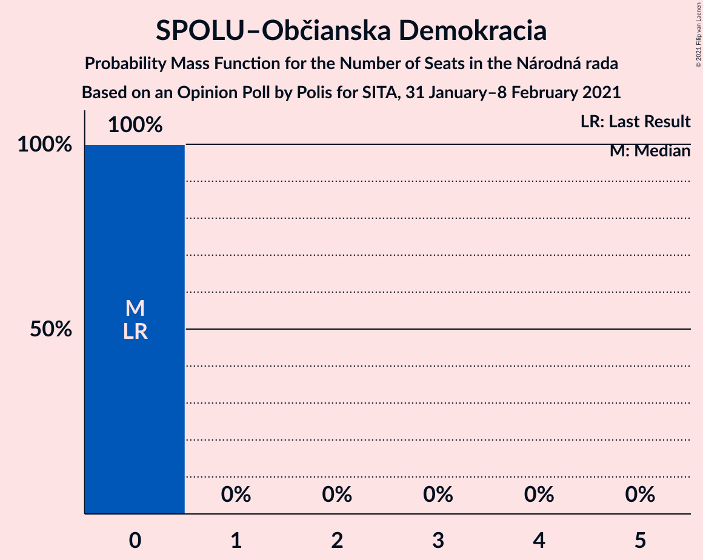
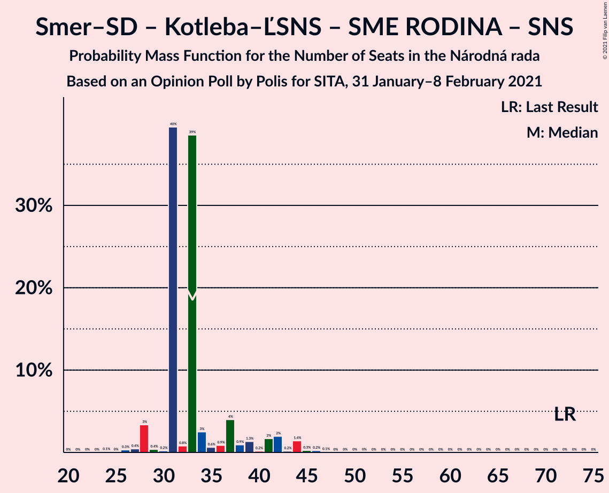

# Opinion Poll by Polis for SITA, 31 January–8 February 2021

<a href="#voting-intentions">Voting Intentions</a> | <a href="#seats">Seats</a> | <a href="#coalitions">Coalitions</a> | <a href="#technical-information">Technical Information</a>

## Voting Intentions

### Confidence Intervals

| Party | Last Result | Poll Result | 80% Confidence Interval | 90% Confidence Interval | 95% Confidence Interval | 99% Confidence Interval |
|:-----:|:-----------:|:-----------:|:-----------------------:|:-----------------------:|:-----------------------:|:-----------------------:|
| HLAS–sociálna demokracia | 0.0% | 21.4% | 19.9–23.0% |19.5–23.5% |19.1–23.9% |18.4–24.7% |
| Sloboda a Solidarita | 6.2% | 12.5% | 11.3–13.8% |10.9–14.2% |10.7–14.5% |10.1–15.2% |
| OBYČAJNÍ ĽUDIA a nezávislé osobnosti | 25.0% | 12.2% | 11.0–13.5% |10.7–13.9% |10.4–14.3% |9.9–14.9% |
| SMER–sociálna demokracia | 18.3% | 8.9% | 7.9–10.1% |7.6–10.4% |7.4–10.7% |7.0–11.3% |
| Kotleba–Ľudová strana Naše Slovensko | 8.0% | 7.0% | 6.1–8.1% |5.9–8.4% |5.6–8.6% |5.2–9.2% |
| Progresívne Slovensko | 7.0% | 6.2% | 5.3–7.2% |5.1–7.5% |4.9–7.8% |4.6–8.3% |
| Strana maďarskej koalície–Magyar Koalíció Pártja | 3.9% | 5.5% | 4.7–6.5% |4.5–6.7% |4.3–7.0% |3.9–7.5% |
| Za ľudí | 5.8% | 5.5% | 4.7–6.5% |4.5–6.7% |4.3–7.0% |3.9–7.5% |
| SME RODINA | 8.2% | 5.2% | 4.5–6.2% |4.2–6.4% |4.1–6.7% |3.7–7.2% |
| Kresťanskodemokratické hnutie | 4.6% | 4.5% | 3.8–5.4% |3.6–5.7% |3.4–5.9% |3.1–6.3% |
| Dobrá voľba | 3.1% | 3.6% | 3.0–4.5% |2.8–4.7% |2.7–4.9% |2.4–5.3% |
| VLASŤ | 2.9% | 2.2% | 1.7–2.9% |1.6–3.1% |1.5–3.2% |1.3–3.6% |
| Slovenská národná strana | 3.2% | 2.0% | 1.6–2.7% |1.5–2.9% |1.4–3.0% |1.2–3.4% |
| SPOLU–Občianska Demokracia | 7.0% | 1.2% | 0.9–1.8% |0.8–1.9% |0.7–2.1% |0.6–2.4% |
| MOST–HÍD | 2.0% | 1.1% | 0.8–1.6% |0.7–1.7% |0.6–1.8% |0.5–2.1% |

*Note:* The poll result column reflects the actual value used in the calculations. Published results may vary slightly, and in addition be rounded to fewer digits.

## Seats

### Confidence Intervals

| Party | Last Result | Median | 80% Confidence Interval | 90% Confidence Interval | 95% Confidence Interval | 99% Confidence Interval |
|:-----:|:-----------:|:------:|:-----------------------:|:-----------------------:|:-----------------------:|:-----------------------:|
| <a href="#hlas–sociálna-demokracia">HLAS–sociálna demokracia</a> | 0 | 40 | 37–42 |36–42 |35–43 |32–48 |
| <a href="#sloboda-a-solidarita">Sloboda a Solidarita</a> | 13 | 24 | 22–28 |21–28 |19–28 |18–29 |
| <a href="#obyčajní-ľudia-a-nezávislé-osobnosti">OBYČAJNÍ ĽUDIA a nezávislé osobnosti</a> | 53 | 22 | 21–23 |19–25 |19–26 |18–29 |
| <a href="#smer–sociálna-demokracia">SMER–sociálna demokracia</a> | 38 | 16 | 16–20 |14–20 |13–20 |11–20 |
| <a href="#kotleba–ľudová-strana-naše-slovensko">Kotleba–Ľudová strana Naše Slovensko</a> | 17 | 13 | 12–15 |12–15 |10–15 |10–17 |
| <a href="#progresívne-slovensko">Progresívne Slovensko</a> | 0 | 13 | 11–14 |9–14 |8–14 |0–15 |
| <a href="#strana-maďarskej-koalície–magyar-koalíció-pártja">Strana maďarskej koalície–Magyar Koalíció Pártja</a> | 0 | 10 | 0–10 |0–11 |0–12 |0–13 |
| <a href="#za-ľudí">Za ľudí</a> | 12 | 10 | 0–13 |0–13 |0–13 |0–13 |
| <a href="#sme-rodina">SME RODINA</a> | 17 | 0 | 0–10 |0–11 |0–12 |0–13 |
| <a href="#kresťanskodemokratické-hnutie">Kresťanskodemokratické hnutie</a> | 0 | 0 | 0–10 |0–10 |0–10 |0–11 |
| <a href="#dobrá-voľba">Dobrá voľba</a> | 0 | 0 | 0 |0 |0–8 |0–10 |
| <a href="#vlasť">VLASŤ</a> | 0 | 0 | 0 |0 |0 |0 |
| <a href="#slovenská-národná-strana">Slovenská národná strana</a> | 0 | 0 | 0 |0 |0 |0 |
| <a href="#spolu–občianska-demokracia">SPOLU–Občianska Demokracia</a> | 0 | 0 | 0 |0 |0 |0 |
| <a href="#most–híd">MOST–HÍD</a> | 0 | 0 | 0 |0 |0 |0 |

### HLAS–sociálna demokracia

*For a full overview of the results for this party, see the [HLAS–sociálna demokracia](party-hlas–sociálnademokracia.html) page.*

| Number of Seats | Probability | Accumulated | Special Marks |
|:---------------:|:-----------:|:-----------:|:-------------:|
| 0 | 0% | 100% | Last Result |
| 1 | 0% | 100% |  |
| 2 | 0% | 100% |  |
| 3 | 0% | 100% |  |
| 4 | 0% | 100% |  |
| 5 | 0% | 100% |  |
| 6 | 0% | 100% |  |
| 7 | 0% | 100% |  |
| 8 | 0% | 100% |  |
| 9 | 0% | 100% |  |
| 10 | 0% | 100% |  |
| 11 | 0% | 100% |  |
| 12 | 0% | 100% |  |
| 13 | 0% | 100% |  |
| 14 | 0% | 100% |  |
| 15 | 0% | 100% |  |
| 16 | 0% | 100% |  |
| 17 | 0% | 100% |  |
| 18 | 0% | 100% |  |
| 19 | 0% | 100% |  |
| 20 | 0% | 100% |  |
| 21 | 0% | 100% |  |
| 22 | 0% | 100% |  |
| 23 | 0% | 100% |  |
| 24 | 0% | 100% |  |
| 25 | 0% | 100% |  |
| 26 | 0% | 100% |  |
| 27 | 0% | 100% |  |
| 28 | 0% | 100% |  |
| 29 | 0% | 100% |  |
| 30 | 0% | 100% |  |
| 31 | 0.2% | 100% |  |
| 32 | 0.8% | 99.8% |  |
| 33 | 0.9% | 99.0% |  |
| 34 | 0.2% | 98% |  |
| 35 | 0.8% | 98% |  |
| 36 | 3% | 97% |  |
| 37 | 5% | 94% |  |
| 38 | 4% | 90% |  |
| 39 | 1.5% | 86% |  |
| 40 | 41% | 84% | Median |
| 41 | 2% | 43% |  |
| 42 | 38% | 41% |  |
| 43 | 1.0% | 3% |  |
| 44 | 0.2% | 2% |  |
| 45 | 0.3% | 2% |  |
| 46 | 0.1% | 2% |  |
| 47 | 0.7% | 1.4% |  |
| 48 | 0.6% | 0.7% |  |
| 49 | 0% | 0.1% |  |
| 50 | 0% | 0% |  |

### Sloboda a Solidarita

*For a full overview of the results for this party, see the [Sloboda a Solidarita](party-slobodaasolidarita.html) page.*

| Number of Seats | Probability | Accumulated | Special Marks |
|:---------------:|:-----------:|:-----------:|:-------------:|
| 13 | 0% | 100% | Last Result |
| 14 | 0% | 100% |  |
| 15 | 0% | 100% |  |
| 16 | 0% | 100% |  |
| 17 | 0% | 100% |  |
| 18 | 0.6% | 100% |  |
| 19 | 2% | 99.3% |  |
| 20 | 2% | 97% |  |
| 21 | 4% | 96% |  |
| 22 | 41% | 92% |  |
| 23 | 0.5% | 51% |  |
| 24 | 4% | 50% | Median |
| 25 | 6% | 46% |  |
| 26 | 1.4% | 40% |  |
| 27 | 0.3% | 39% |  |
| 28 | 38% | 39% |  |
| 29 | 0.7% | 0.9% |  |
| 30 | 0.1% | 0.2% |  |
| 31 | 0.1% | 0.1% |  |
| 32 | 0% | 0% |  |

### OBYČAJNÍ ĽUDIA a nezávislé osobnosti

*For a full overview of the results for this party, see the [OBYČAJNÍ ĽUDIA a nezávislé osobnosti](party-obyčajníľudiaanezávisléosobnosti.html) page.*

| Number of Seats | Probability | Accumulated | Special Marks |
|:---------------:|:-----------:|:-----------:|:-------------:|
| 17 | 0.1% | 100% |  |
| 18 | 0.8% | 99.9% |  |
| 19 | 6% | 99.1% |  |
| 20 | 0.5% | 93% |  |
| 21 | 4% | 92% |  |
| 22 | 77% | 89% | Median |
| 23 | 3% | 11% |  |
| 24 | 1.1% | 9% |  |
| 25 | 4% | 8% |  |
| 26 | 1.1% | 3% |  |
| 27 | 1.2% | 2% |  |
| 28 | 0.3% | 1.1% |  |
| 29 | 0.7% | 0.7% |  |
| 30 | 0% | 0.1% |  |
| 31 | 0% | 0% |  |
| 32 | 0% | 0% |  |
| 33 | 0% | 0% |  |
| 34 | 0% | 0% |  |
| 35 | 0% | 0% |  |
| 36 | 0% | 0% |  |
| 37 | 0% | 0% |  |
| 38 | 0% | 0% |  |
| 39 | 0% | 0% |  |
| 40 | 0% | 0% |  |
| 41 | 0% | 0% |  |
| 42 | 0% | 0% |  |
| 43 | 0% | 0% |  |
| 44 | 0% | 0% |  |
| 45 | 0% | 0% |  |
| 46 | 0% | 0% |  |
| 47 | 0% | 0% |  |
| 48 | 0% | 0% |  |
| 49 | 0% | 0% |  |
| 50 | 0% | 0% |  |
| 51 | 0% | 0% |  |
| 52 | 0% | 0% |  |
| 53 | 0% | 0% | Last Result |

### SMER–sociálna demokracia

*For a full overview of the results for this party, see the [SMER–sociálna demokracia](party-smer–sociálnademokracia.html) page.*

| Number of Seats | Probability | Accumulated | Special Marks |
|:---------------:|:-----------:|:-----------:|:-------------:|
| 11 | 2% | 100% |  |
| 12 | 0.1% | 98% |  |
| 13 | 1.2% | 98% |  |
| 14 | 4% | 97% |  |
| 15 | 2% | 93% |  |
| 16 | 43% | 91% | Median |
| 17 | 2% | 48% |  |
| 18 | 4% | 46% |  |
| 19 | 2% | 42% |  |
| 20 | 40% | 40% |  |
| 21 | 0.3% | 0.5% |  |
| 22 | 0.1% | 0.1% |  |
| 23 | 0% | 0% |  |
| 24 | 0% | 0% |  |
| 25 | 0% | 0% |  |
| 26 | 0% | 0% |  |
| 27 | 0% | 0% |  |
| 28 | 0% | 0% |  |
| 29 | 0% | 0% |  |
| 30 | 0% | 0% |  |
| 31 | 0% | 0% |  |
| 32 | 0% | 0% |  |
| 33 | 0% | 0% |  |
| 34 | 0% | 0% |  |
| 35 | 0% | 0% |  |
| 36 | 0% | 0% |  |
| 37 | 0% | 0% |  |
| 38 | 0% | 0% | Last Result |

### Kotleba–Ľudová strana Naše Slovensko

*For a full overview of the results for this party, see the [Kotleba–Ľudová strana Naše Slovensko](party-kotleba–ľudovástrananašeslovensko.html) page.*

| Number of Seats | Probability | Accumulated | Special Marks |
|:---------------:|:-----------:|:-----------:|:-------------:|
| 0 | 0.2% | 100% |  |
| 1 | 0% | 99.8% |  |
| 2 | 0% | 99.8% |  |
| 3 | 0% | 99.8% |  |
| 4 | 0% | 99.8% |  |
| 5 | 0% | 99.8% |  |
| 6 | 0% | 99.8% |  |
| 7 | 0% | 99.8% |  |
| 8 | 0% | 99.8% |  |
| 9 | 0% | 99.8% |  |
| 10 | 3% | 99.8% |  |
| 11 | 1.3% | 97% |  |
| 12 | 7% | 96% |  |
| 13 | 44% | 89% | Median |
| 14 | 5% | 45% |  |
| 15 | 39% | 40% |  |
| 16 | 0.4% | 0.9% |  |
| 17 | 0.4% | 0.5% | Last Result |
| 18 | 0.1% | 0.1% |  |
| 19 | 0% | 0% |  |

### Progresívne Slovensko

*For a full overview of the results for this party, see the [Progresívne Slovensko](party-progresívneslovensko.html) page.*

| Number of Seats | Probability | Accumulated | Special Marks |
|:---------------:|:-----------:|:-----------:|:-------------:|
| 0 | 2% | 100% | Last Result |
| 1 | 0% | 98% |  |
| 2 | 0% | 98% |  |
| 3 | 0% | 98% |  |
| 4 | 0% | 98% |  |
| 5 | 0% | 98% |  |
| 6 | 0% | 98% |  |
| 7 | 0% | 98% |  |
| 8 | 0.2% | 98% |  |
| 9 | 4% | 97% |  |
| 10 | 2% | 94% |  |
| 11 | 4% | 92% |  |
| 12 | 7% | 87% |  |
| 13 | 41% | 81% | Median |
| 14 | 38% | 40% |  |
| 15 | 1.1% | 1.2% |  |
| 16 | 0% | 0.1% |  |
| 17 | 0% | 0% |  |

### Strana maďarskej koalície–Magyar Koalíció Pártja

*For a full overview of the results for this party, see the [Strana maďarskej koalície–Magyar Koalíció Pártja](party-stranamaďarskejkoalície–magyarkoalíciópártja.html) page.*

| Number of Seats | Probability | Accumulated | Special Marks |
|:---------------:|:-----------:|:-----------:|:-------------:|
| 0 | 41% | 100% | Last Result |
| 1 | 0% | 59% |  |
| 2 | 0% | 59% |  |
| 3 | 0% | 59% |  |
| 4 | 0% | 59% |  |
| 5 | 0% | 59% |  |
| 6 | 0% | 59% |  |
| 7 | 0% | 59% |  |
| 8 | 0% | 59% |  |
| 9 | 7% | 59% |  |
| 10 | 42% | 52% | Median |
| 11 | 6% | 10% |  |
| 12 | 2% | 3% |  |
| 13 | 1.0% | 1.3% |  |
| 14 | 0.2% | 0.3% |  |
| 15 | 0.1% | 0.2% |  |
| 16 | 0% | 0% |  |

### Za ľudí

*For a full overview of the results for this party, see the [Za ľudí](party-zaľudí.html) page.*

| Number of Seats | Probability | Accumulated | Special Marks |
|:---------------:|:-----------:|:-----------:|:-------------:|
| 0 | 46% | 100% |  |
| 1 | 0% | 54% |  |
| 2 | 0% | 54% |  |
| 3 | 0% | 54% |  |
| 4 | 0% | 54% |  |
| 5 | 0% | 54% |  |
| 6 | 0% | 54% |  |
| 7 | 0% | 54% |  |
| 8 | 0% | 54% |  |
| 9 | 3% | 54% |  |
| 10 | 5% | 52% | Median |
| 11 | 6% | 46% |  |
| 12 | 1.2% | 40% | Last Result |
| 13 | 38% | 39% |  |
| 14 | 0.4% | 0.4% |  |
| 15 | 0.1% | 0.1% |  |
| 16 | 0% | 0% |  |

### SME RODINA

*For a full overview of the results for this party, see the [SME RODINA](party-smerodina.html) page.*

| Number of Seats | Probability | Accumulated | Special Marks |
|:---------------:|:-----------:|:-----------:|:-------------:|
| 0 | 84% | 100% | Median |
| 1 | 0% | 16% |  |
| 2 | 0% | 16% |  |
| 3 | 0% | 16% |  |
| 4 | 0% | 16% |  |
| 5 | 0% | 16% |  |
| 6 | 0% | 16% |  |
| 7 | 0% | 16% |  |
| 8 | 0% | 16% |  |
| 9 | 3% | 16% |  |
| 10 | 7% | 12% |  |
| 11 | 2% | 6% |  |
| 12 | 2% | 3% |  |
| 13 | 1.5% | 2% |  |
| 14 | 0% | 0.1% |  |
| 15 | 0% | 0% |  |
| 16 | 0% | 0% |  |
| 17 | 0% | 0% | Last Result |

### Kresťanskodemokratické hnutie

*For a full overview of the results for this party, see the [Kresťanskodemokratické hnutie](party-kresťanskodemokratickéhnutie.html) page.*

| Number of Seats | Probability | Accumulated | Special Marks |
|:---------------:|:-----------:|:-----------:|:-------------:|
| 0 | 54% | 100% | Last Result, Median |
| 1 | 0% | 46% |  |
| 2 | 0% | 46% |  |
| 3 | 0% | 46% |  |
| 4 | 0% | 46% |  |
| 5 | 0% | 46% |  |
| 6 | 0% | 46% |  |
| 7 | 0% | 46% |  |
| 8 | 0% | 46% |  |
| 9 | 4% | 46% |  |
| 10 | 41% | 42% |  |
| 11 | 0.8% | 0.9% |  |
| 12 | 0.1% | 0.1% |  |
| 13 | 0% | 0% |  |

### Dobrá voľba

*For a full overview of the results for this party, see the [Dobrá voľba](party-dobrávoľba.html) page.*

| Number of Seats | Probability | Accumulated | Special Marks |
|:---------------:|:-----------:|:-----------:|:-------------:|
| 0 | 97% | 100% | Last Result, Median |
| 1 | 0% | 3% |  |
| 2 | 0% | 3% |  |
| 3 | 0% | 3% |  |
| 4 | 0% | 3% |  |
| 5 | 0% | 3% |  |
| 6 | 0% | 3% |  |
| 7 | 0% | 3% |  |
| 8 | 0.1% | 3% |  |
| 9 | 0.2% | 2% |  |
| 10 | 2% | 2% |  |
| 11 | 0.2% | 0.2% |  |
| 12 | 0% | 0% |  |

### VLASŤ

*For a full overview of the results for this party, see the [VLASŤ](party-vlasť.html) page.*

| Number of Seats | Probability | Accumulated | Special Marks |
|:---------------:|:-----------:|:-----------:|:-------------:|
| 0 | 100% | 100% | Last Result, Median |

### Slovenská národná strana

*For a full overview of the results for this party, see the [Slovenská národná strana](party-slovenskánárodnástrana.html) page.*

| Number of Seats | Probability | Accumulated | Special Marks |
|:---------------:|:-----------:|:-----------:|:-------------:|
| 0 | 100% | 100% | Last Result, Median |

### SPOLU–Občianska Demokracia

*For a full overview of the results for this party, see the [SPOLU–Občianska Demokracia](party-spolu–občianskademokracia.html) page.*

| Number of Seats | Probability | Accumulated | Special Marks |
|:---------------:|:-----------:|:-----------:|:-------------:|
| 0 | 100% | 100% | Last Result, Median |

### MOST–HÍD

*For a full overview of the results for this party, see the [MOST–HÍD](party-most–híd.html) page.*

| Number of Seats | Probability | Accumulated | Special Marks |
|:---------------:|:-----------:|:-----------:|:-------------:|
| 0 | 100% | 100% | Last Result, Median |

## Coalitions

### Confidence Intervals

| Coalition | Last Result | Median | Majority? | 80% Confidence Interval | 90% Confidence Interval | 95% Confidence Interval | 99% Confidence Interval |
|:---------:|:-----------:|:------:|:---------:|:-----------------------:|:-----------------------:|:-----------------------:|:-----------------------:|
| HLAS–sociálna demokracia – SMER–sociálna demokracia – Kotleba–Ľudová strana Naše Slovensko – SME RODINA – Slovenská národná strana | 72 | 73 | 9% | 72–75 | 69–80 | 65–81 | 65–87 |
| HLAS–sociálna demokracia – SMER–sociálna demokracia – SME RODINA | 55 | 59 | 0.3% | 58–62 | 57–68 | 53–70 | 53–73 |
| HLAS–sociálna demokracia – SMER–sociálna demokracia – SME RODINA – Slovenská národná strana | 55 | 59 | 0.3% | 58–62 | 57–68 | 53–70 | 53–73 |
| HLAS–sociálna demokracia – Kotleba–Ľudová strana Naše Slovensko – SME RODINA – Slovenská národná strana | 34 | 57 | 0% | 53–61 | 53–61 | 49–63 | 48–71 |
| HLAS–sociálna demokracia – SMER–sociálna demokracia – Slovenská národná strana – MOST–HÍD | 38 | 58 | 0% | 53–60 | 50–60 | 49–60 | 46–65 |
| HLAS–sociálna demokracia – SMER–sociálna demokracia – Slovenská národná strana | 38 | 58 | 0% | 53–60 | 50–60 | 49–60 | 46–65 |
| HLAS–sociálna demokracia – SME RODINA | 17 | 42 | 0% | 40–48 | 40–50 | 37–51 | 35–58 |
| HLAS–sociálna demokracia – SME RODINA – Slovenská národná strana | 17 | 42 | 0% | 40–48 | 40–50 | 37–51 | 35–58 |
| HLAS–sociálna demokracia – Slovenská národná strana – MOST–HÍD | 0 | 40 | 0% | 37–42 | 36–42 | 35–43 | 32–48 |
| HLAS–sociálna demokracia – Slovenská národná strana | 0 | 40 | 0% | 37–42 | 36–42 | 35–43 | 32–48 |
| SMER–sociálna demokracia – Kotleba–Ľudová strana Naše Slovensko – SME RODINA – Slovenská národná strana | 72 | 33 | 0% | 31–37 | 31–41 | 28–42 | 27–45 |
| SMER–sociálna demokracia – SME RODINA | 55 | 20 | 0% | 16–24 | 16–28 | 16–31 | 14–32 |
| SMER–sociálna demokracia – SME RODINA – Slovenská národná strana | 55 | 20 | 0% | 16–24 | 16–28 | 16–31 | 14–32 |
| SMER–sociálna demokracia – Slovenská národná strana – MOST–HÍD | 38 | 16 | 0% | 16–20 | 14–20 | 13–20 | 11–20 |
| SMER–sociálna demokracia | 38 | 16 | 0% | 16–20 | 14–20 | 13–20 | 11–20 |
| SMER–sociálna demokracia – Slovenská národná strana | 38 | 16 | 0% | 16–20 | 14–20 | 13–20 | 11–20 |

### HLAS–sociálna demokracia – SMER–sociálna demokracia – Kotleba–Ľudová strana Naše Slovensko – SME RODINA – Slovenská národná strana

| Number of Seats | Probability | Accumulated | Special Marks |
|:---------------:|:-----------:|:-----------:|:-------------:|
| 59 | 0.1% | 100% |  |
| 60 | 0% | 99.9% |  |
| 61 | 0% | 99.9% |  |
| 62 | 0.2% | 99.9% |  |
| 63 | 0% | 99.7% |  |
| 64 | 0% | 99.6% |  |
| 65 | 3% | 99.6% |  |
| 66 | 0.3% | 97% |  |
| 67 | 0.1% | 96% |  |
| 68 | 0.3% | 96% |  |
| 69 | 1.1% | 96% | Median |
| 70 | 1.5% | 95% |  |
| 71 | 0.4% | 93% |  |
| 72 | 4% | 93% | Last Result |
| 73 | 79% | 89% |  |
| 74 | 0.6% | 11% |  |
| 75 | 1.3% | 10% |  |
| 76 | 1.0% | 9% | Majority |
| 77 | 0.2% | 8% |  |
| 78 | 0.5% | 8% |  |
| 79 | 1.2% | 7% |  |
| 80 | 1.3% | 6% |  |
| 81 | 3% | 5% |  |
| 82 | 0.2% | 2% |  |
| 83 | 0.2% | 2% |  |
| 84 | 0.1% | 1.4% |  |
| 85 | 0.2% | 1.3% |  |
| 86 | 0.4% | 1.2% |  |
| 87 | 0.4% | 0.7% |  |
| 88 | 0% | 0.3% |  |
| 89 | 0% | 0.3% |  |
| 90 | 0.1% | 0.3% |  |
| 91 | 0% | 0.1% |  |
| 92 | 0.1% | 0.1% |  |
| 93 | 0% | 0% |  |

### HLAS–sociálna demokracia – SMER–sociálna demokracia – SME RODINA

| Number of Seats | Probability | Accumulated | Special Marks |
|:---------------:|:-----------:|:-----------:|:-------------:|
| 48 | 0.1% | 100% |  |
| 49 | 0% | 99.9% |  |
| 50 | 0.2% | 99.9% |  |
| 51 | 0% | 99.7% |  |
| 52 | 0% | 99.7% |  |
| 53 | 3% | 99.6% |  |
| 54 | 0.2% | 96% |  |
| 55 | 0.7% | 96% | Last Result |
| 56 | 0.4% | 95% | Median |
| 57 | 2% | 95% |  |
| 58 | 39% | 93% |  |
| 59 | 5% | 55% |  |
| 60 | 39% | 50% |  |
| 61 | 0.6% | 11% |  |
| 62 | 0.4% | 10% |  |
| 63 | 0.2% | 10% |  |
| 64 | 0.3% | 9% |  |
| 65 | 2% | 9% |  |
| 66 | 0.8% | 7% |  |
| 67 | 0.6% | 6% |  |
| 68 | 2% | 6% |  |
| 69 | 2% | 4% |  |
| 70 | 1.4% | 3% |  |
| 71 | 0% | 1.2% |  |
| 72 | 0.5% | 1.2% |  |
| 73 | 0.4% | 0.7% |  |
| 74 | 0% | 0.3% |  |
| 75 | 0% | 0.3% |  |
| 76 | 0.1% | 0.3% | Majority |
| 77 | 0% | 0.1% |  |
| 78 | 0% | 0.1% |  |
| 79 | 0.1% | 0.1% |  |
| 80 | 0% | 0% |  |

### HLAS–sociálna demokracia – SMER–sociálna demokracia – SME RODINA – Slovenská národná strana

| Number of Seats | Probability | Accumulated | Special Marks |
|:---------------:|:-----------:|:-----------:|:-------------:|
| 48 | 0.1% | 100% |  |
| 49 | 0% | 99.9% |  |
| 50 | 0.2% | 99.9% |  |
| 51 | 0% | 99.7% |  |
| 52 | 0% | 99.7% |  |
| 53 | 3% | 99.6% |  |
| 54 | 0.2% | 96% |  |
| 55 | 0.7% | 96% | Last Result |
| 56 | 0.4% | 95% | Median |
| 57 | 2% | 95% |  |
| 58 | 39% | 93% |  |
| 59 | 5% | 55% |  |
| 60 | 39% | 50% |  |
| 61 | 0.6% | 11% |  |
| 62 | 0.4% | 10% |  |
| 63 | 0.2% | 10% |  |
| 64 | 0.3% | 9% |  |
| 65 | 2% | 9% |  |
| 66 | 0.8% | 7% |  |
| 67 | 0.6% | 6% |  |
| 68 | 2% | 6% |  |
| 69 | 2% | 4% |  |
| 70 | 1.4% | 3% |  |
| 71 | 0% | 1.2% |  |
| 72 | 0.5% | 1.2% |  |
| 73 | 0.4% | 0.7% |  |
| 74 | 0% | 0.3% |  |
| 75 | 0% | 0.3% |  |
| 76 | 0.1% | 0.3% | Majority |
| 77 | 0% | 0.1% |  |
| 78 | 0% | 0.1% |  |
| 79 | 0.1% | 0.1% |  |
| 80 | 0% | 0% |  |

### HLAS–sociálna demokracia – Kotleba–Ľudová strana Naše Slovensko – SME RODINA – Slovenská národná strana

| Number of Seats | Probability | Accumulated | Special Marks |
|:---------------:|:-----------:|:-----------:|:-------------:|
| 34 | 0% | 100% | Last Result |
| 35 | 0% | 100% |  |
| 36 | 0% | 100% |  |
| 37 | 0% | 100% |  |
| 38 | 0% | 100% |  |
| 39 | 0% | 100% |  |
| 40 | 0% | 100% |  |
| 41 | 0% | 100% |  |
| 42 | 0% | 100% |  |
| 43 | 0.1% | 100% |  |
| 44 | 0% | 99.9% |  |
| 45 | 0% | 99.9% |  |
| 46 | 0% | 99.8% |  |
| 47 | 0.2% | 99.8% |  |
| 48 | 0.3% | 99.6% |  |
| 49 | 3% | 99.4% |  |
| 50 | 0.2% | 96% |  |
| 51 | 0.1% | 96% |  |
| 52 | 0.1% | 96% |  |
| 53 | 39% | 96% | Median |
| 54 | 0.9% | 57% |  |
| 55 | 3% | 56% |  |
| 56 | 0.2% | 53% |  |
| 57 | 38% | 53% |  |
| 58 | 0.7% | 15% |  |
| 59 | 3% | 14% |  |
| 60 | 0.6% | 11% |  |
| 61 | 6% | 11% |  |
| 62 | 0.5% | 5% |  |
| 63 | 2% | 4% |  |
| 64 | 0.3% | 2% |  |
| 65 | 0.2% | 2% |  |
| 66 | 0.1% | 2% |  |
| 67 | 0.2% | 1.4% |  |
| 68 | 0.1% | 1.3% |  |
| 69 | 0.4% | 1.1% |  |
| 70 | 0% | 0.7% |  |
| 71 | 0.4% | 0.7% |  |
| 72 | 0% | 0.3% |  |
| 73 | 0% | 0.3% |  |
| 74 | 0.2% | 0.2% |  |
| 75 | 0% | 0% |  |

### HLAS–sociálna demokracia – SMER–sociálna demokracia – Slovenská národná strana – MOST–HÍD

| Number of Seats | Probability | Accumulated | Special Marks |
|:---------------:|:-----------:|:-----------:|:-------------:|
| 38 | 0% | 100% | Last Result |
| 39 | 0% | 100% |  |
| 40 | 0% | 100% |  |
| 41 | 0% | 100% |  |
| 42 | 0% | 100% |  |
| 43 | 0% | 100% |  |
| 44 | 0.2% | 100% |  |
| 45 | 0.1% | 99.8% |  |
| 46 | 0.6% | 99.8% |  |
| 47 | 0.1% | 99.2% |  |
| 48 | 0.9% | 99.1% |  |
| 49 | 2% | 98% |  |
| 50 | 3% | 96% |  |
| 51 | 0.2% | 93% |  |
| 52 | 0.1% | 93% |  |
| 53 | 3% | 93% |  |
| 54 | 0.7% | 89% |  |
| 55 | 2% | 88% |  |
| 56 | 0.6% | 86% | Median |
| 57 | 3% | 86% |  |
| 58 | 41% | 83% |  |
| 59 | 0.9% | 42% |  |
| 60 | 39% | 41% |  |
| 61 | 0.6% | 2% |  |
| 62 | 0.2% | 2% |  |
| 63 | 0.5% | 2% |  |
| 64 | 0.1% | 1.0% |  |
| 65 | 0.7% | 0.9% |  |
| 66 | 0.1% | 0.2% |  |
| 67 | 0% | 0.1% |  |
| 68 | 0% | 0% |  |

### HLAS–sociálna demokracia – SMER–sociálna demokracia – Slovenská národná strana

| Number of Seats | Probability | Accumulated | Special Marks |
|:---------------:|:-----------:|:-----------:|:-------------:|
| 38 | 0% | 100% | Last Result |
| 39 | 0% | 100% |  |
| 40 | 0% | 100% |  |
| 41 | 0% | 100% |  |
| 42 | 0% | 100% |  |
| 43 | 0% | 100% |  |
| 44 | 0.2% | 100% |  |
| 45 | 0.1% | 99.8% |  |
| 46 | 0.6% | 99.8% |  |
| 47 | 0.1% | 99.2% |  |
| 48 | 0.9% | 99.1% |  |
| 49 | 2% | 98% |  |
| 50 | 3% | 96% |  |
| 51 | 0.2% | 93% |  |
| 52 | 0.1% | 93% |  |
| 53 | 3% | 93% |  |
| 54 | 0.7% | 89% |  |
| 55 | 2% | 88% |  |
| 56 | 0.6% | 86% | Median |
| 57 | 3% | 86% |  |
| 58 | 41% | 83% |  |
| 59 | 0.9% | 42% |  |
| 60 | 39% | 41% |  |
| 61 | 0.6% | 2% |  |
| 62 | 0.2% | 2% |  |
| 63 | 0.5% | 2% |  |
| 64 | 0.1% | 1.0% |  |
| 65 | 0.7% | 0.9% |  |
| 66 | 0.1% | 0.2% |  |
| 67 | 0% | 0.1% |  |
| 68 | 0% | 0% |  |

### HLAS–sociálna demokracia – SME RODINA

| Number of Seats | Probability | Accumulated | Special Marks |
|:---------------:|:-----------:|:-----------:|:-------------:|
| 17 | 0% | 100% | Last Result |
| 18 | 0% | 100% |  |
| 19 | 0% | 100% |  |
| 20 | 0% | 100% |  |
| 21 | 0% | 100% |  |
| 22 | 0% | 100% |  |
| 23 | 0% | 100% |  |
| 24 | 0% | 100% |  |
| 25 | 0% | 100% |  |
| 26 | 0% | 100% |  |
| 27 | 0% | 100% |  |
| 28 | 0% | 100% |  |
| 29 | 0% | 100% |  |
| 30 | 0% | 100% |  |
| 31 | 0% | 100% |  |
| 32 | 0.1% | 100% |  |
| 33 | 0% | 99.9% |  |
| 34 | 0% | 99.9% |  |
| 35 | 0.4% | 99.9% |  |
| 36 | 0% | 99.4% |  |
| 37 | 3% | 99.4% |  |
| 38 | 0.5% | 96% |  |
| 39 | 0.6% | 96% |  |
| 40 | 39% | 95% | Median |
| 41 | 2% | 57% |  |
| 42 | 38% | 54% |  |
| 43 | 0.9% | 17% |  |
| 44 | 0.8% | 16% |  |
| 45 | 3% | 15% |  |
| 46 | 0.7% | 12% |  |
| 47 | 1.5% | 11% |  |
| 48 | 2% | 10% |  |
| 49 | 1.3% | 8% |  |
| 50 | 2% | 6% |  |
| 51 | 2% | 4% |  |
| 52 | 0.4% | 2% |  |
| 53 | 0.1% | 1.3% |  |
| 54 | 0.4% | 1.3% |  |
| 55 | 0% | 0.8% |  |
| 56 | 0.1% | 0.8% |  |
| 57 | 0% | 0.7% |  |
| 58 | 0.4% | 0.7% |  |
| 59 | 0% | 0.2% |  |
| 60 | 0.1% | 0.2% |  |
| 61 | 0.1% | 0.1% |  |
| 62 | 0% | 0% |  |

### HLAS–sociálna demokracia – SME RODINA – Slovenská národná strana

| Number of Seats | Probability | Accumulated | Special Marks |
|:---------------:|:-----------:|:-----------:|:-------------:|
| 17 | 0% | 100% | Last Result |
| 18 | 0% | 100% |  |
| 19 | 0% | 100% |  |
| 20 | 0% | 100% |  |
| 21 | 0% | 100% |  |
| 22 | 0% | 100% |  |
| 23 | 0% | 100% |  |
| 24 | 0% | 100% |  |
| 25 | 0% | 100% |  |
| 26 | 0% | 100% |  |
| 27 | 0% | 100% |  |
| 28 | 0% | 100% |  |
| 29 | 0% | 100% |  |
| 30 | 0% | 100% |  |
| 31 | 0% | 100% |  |
| 32 | 0.1% | 100% |  |
| 33 | 0% | 99.9% |  |
| 34 | 0% | 99.9% |  |
| 35 | 0.4% | 99.9% |  |
| 36 | 0% | 99.4% |  |
| 37 | 3% | 99.4% |  |
| 38 | 0.5% | 96% |  |
| 39 | 0.6% | 96% |  |
| 40 | 39% | 95% | Median |
| 41 | 2% | 57% |  |
| 42 | 38% | 54% |  |
| 43 | 0.9% | 17% |  |
| 44 | 0.8% | 16% |  |
| 45 | 3% | 15% |  |
| 46 | 0.7% | 12% |  |
| 47 | 1.5% | 11% |  |
| 48 | 2% | 10% |  |
| 49 | 1.3% | 8% |  |
| 50 | 2% | 6% |  |
| 51 | 2% | 4% |  |
| 52 | 0.4% | 2% |  |
| 53 | 0.1% | 1.3% |  |
| 54 | 0.4% | 1.3% |  |
| 55 | 0% | 0.8% |  |
| 56 | 0.1% | 0.8% |  |
| 57 | 0% | 0.7% |  |
| 58 | 0.4% | 0.7% |  |
| 59 | 0% | 0.2% |  |
| 60 | 0.1% | 0.2% |  |
| 61 | 0.1% | 0.1% |  |
| 62 | 0% | 0% |  |

### HLAS–sociálna demokracia – Slovenská národná strana – MOST–HÍD

| Number of Seats | Probability | Accumulated | Special Marks |
|:---------------:|:-----------:|:-----------:|:-------------:|
| 0 | 0% | 100% | Last Result |
| 1 | 0% | 100% |  |
| 2 | 0% | 100% |  |
| 3 | 0% | 100% |  |
| 4 | 0% | 100% |  |
| 5 | 0% | 100% |  |
| 6 | 0% | 100% |  |
| 7 | 0% | 100% |  |
| 8 | 0% | 100% |  |
| 9 | 0% | 100% |  |
| 10 | 0% | 100% |  |
| 11 | 0% | 100% |  |
| 12 | 0% | 100% |  |
| 13 | 0% | 100% |  |
| 14 | 0% | 100% |  |
| 15 | 0% | 100% |  |
| 16 | 0% | 100% |  |
| 17 | 0% | 100% |  |
| 18 | 0% | 100% |  |
| 19 | 0% | 100% |  |
| 20 | 0% | 100% |  |
| 21 | 0% | 100% |  |
| 22 | 0% | 100% |  |
| 23 | 0% | 100% |  |
| 24 | 0% | 100% |  |
| 25 | 0% | 100% |  |
| 26 | 0% | 100% |  |
| 27 | 0% | 100% |  |
| 28 | 0% | 100% |  |
| 29 | 0% | 100% |  |
| 30 | 0% | 100% |  |
| 31 | 0.2% | 100% |  |
| 32 | 0.8% | 99.8% |  |
| 33 | 0.9% | 99.0% |  |
| 34 | 0.2% | 98% |  |
| 35 | 0.8% | 98% |  |
| 36 | 3% | 97% |  |
| 37 | 5% | 94% |  |
| 38 | 4% | 90% |  |
| 39 | 1.5% | 86% |  |
| 40 | 41% | 84% | Median |
| 41 | 2% | 43% |  |
| 42 | 38% | 41% |  |
| 43 | 1.0% | 3% |  |
| 44 | 0.2% | 2% |  |
| 45 | 0.3% | 2% |  |
| 46 | 0.1% | 2% |  |
| 47 | 0.7% | 1.4% |  |
| 48 | 0.6% | 0.7% |  |
| 49 | 0% | 0.1% |  |
| 50 | 0% | 0% |  |

### HLAS–sociálna demokracia – Slovenská národná strana

| Number of Seats | Probability | Accumulated | Special Marks |
|:---------------:|:-----------:|:-----------:|:-------------:|
| 0 | 0% | 100% | Last Result |
| 1 | 0% | 100% |  |
| 2 | 0% | 100% |  |
| 3 | 0% | 100% |  |
| 4 | 0% | 100% |  |
| 5 | 0% | 100% |  |
| 6 | 0% | 100% |  |
| 7 | 0% | 100% |  |
| 8 | 0% | 100% |  |
| 9 | 0% | 100% |  |
| 10 | 0% | 100% |  |
| 11 | 0% | 100% |  |
| 12 | 0% | 100% |  |
| 13 | 0% | 100% |  |
| 14 | 0% | 100% |  |
| 15 | 0% | 100% |  |
| 16 | 0% | 100% |  |
| 17 | 0% | 100% |  |
| 18 | 0% | 100% |  |
| 19 | 0% | 100% |  |
| 20 | 0% | 100% |  |
| 21 | 0% | 100% |  |
| 22 | 0% | 100% |  |
| 23 | 0% | 100% |  |
| 24 | 0% | 100% |  |
| 25 | 0% | 100% |  |
| 26 | 0% | 100% |  |
| 27 | 0% | 100% |  |
| 28 | 0% | 100% |  |
| 29 | 0% | 100% |  |
| 30 | 0% | 100% |  |
| 31 | 0.2% | 100% |  |
| 32 | 0.8% | 99.8% |  |
| 33 | 0.9% | 99.0% |  |
| 34 | 0.2% | 98% |  |
| 35 | 0.8% | 98% |  |
| 36 | 3% | 97% |  |
| 37 | 5% | 94% |  |
| 38 | 4% | 90% |  |
| 39 | 1.5% | 86% |  |
| 40 | 41% | 84% | Median |
| 41 | 2% | 43% |  |
| 42 | 38% | 41% |  |
| 43 | 1.0% | 3% |  |
| 44 | 0.2% | 2% |  |
| 45 | 0.3% | 2% |  |
| 46 | 0.1% | 2% |  |
| 47 | 0.7% | 1.4% |  |
| 48 | 0.6% | 0.7% |  |
| 49 | 0% | 0.1% |  |
| 50 | 0% | 0% |  |

### SMER–sociálna demokracia – Kotleba–Ľudová strana Naše Slovensko – SME RODINA – Slovenská národná strana

| Number of Seats | Probability | Accumulated | Special Marks |
|:---------------:|:-----------:|:-----------:|:-------------:|
| 20 | 0% | 100% |  |
| 21 | 0% | 99.9% |  |
| 22 | 0% | 99.9% |  |
| 23 | 0% | 99.9% |  |
| 24 | 0.1% | 99.9% |  |
| 25 | 0% | 99.9% |  |
| 26 | 0.3% | 99.8% |  |
| 27 | 0.4% | 99.5% |  |
| 28 | 3% | 99.1% |  |
| 29 | 0.4% | 96% | Median |
| 30 | 0.2% | 95% |  |
| 31 | 40% | 95% |  |
| 32 | 0.8% | 56% |  |
| 33 | 39% | 55% |  |
| 34 | 3% | 16% |  |
| 35 | 0.6% | 14% |  |
| 36 | 0.9% | 13% |  |
| 37 | 4% | 12% |  |
| 38 | 0.9% | 8% |  |
| 39 | 1.3% | 7% |  |
| 40 | 0.2% | 6% |  |
| 41 | 2% | 6% |  |
| 42 | 2% | 4% |  |
| 43 | 0.2% | 2% |  |
| 44 | 1.4% | 2% |  |
| 45 | 0.3% | 0.6% |  |
| 46 | 0.2% | 0.3% |  |
| 47 | 0.1% | 0.1% |  |
| 48 | 0% | 0% |  |
| 49 | 0% | 0% |  |
| 50 | 0% | 0% |  |
| 51 | 0% | 0% |  |
| 52 | 0% | 0% |  |
| 53 | 0% | 0% |  |
| 54 | 0% | 0% |  |
| 55 | 0% | 0% |  |
| 56 | 0% | 0% |  |
| 57 | 0% | 0% |  |
| 58 | 0% | 0% |  |
| 59 | 0% | 0% |  |
| 60 | 0% | 0% |  |
| 61 | 0% | 0% |  |
| 62 | 0% | 0% |  |
| 63 | 0% | 0% |  |
| 64 | 0% | 0% |  |
| 65 | 0% | 0% |  |
| 66 | 0% | 0% |  |
| 67 | 0% | 0% |  |
| 68 | 0% | 0% |  |
| 69 | 0% | 0% |  |
| 70 | 0% | 0% |  |
| 71 | 0% | 0% |  |
| 72 | 0% | 0% | Last Result |

### SMER–sociálna demokracia – SME RODINA

| Number of Seats | Probability | Accumulated | Special Marks |
|:---------------:|:-----------:|:-----------:|:-------------:|
| 12 | 0.1% | 100% |  |
| 13 | 0% | 99.9% |  |
| 14 | 0.6% | 99.9% |  |
| 15 | 0.6% | 99.4% |  |
| 16 | 41% | 98.7% | Median |
| 17 | 2% | 58% |  |
| 18 | 1.3% | 56% |  |
| 19 | 0.1% | 55% |  |
| 20 | 39% | 55% |  |
| 21 | 2% | 16% |  |
| 22 | 0.4% | 14% |  |
| 23 | 2% | 14% |  |
| 24 | 2% | 11% |  |
| 25 | 2% | 10% |  |
| 26 | 0.7% | 8% |  |
| 27 | 0.7% | 7% |  |
| 28 | 2% | 6% |  |
| 29 | 0.8% | 4% |  |
| 30 | 0.7% | 3% |  |
| 31 | 0.5% | 3% |  |
| 32 | 2% | 2% |  |
| 33 | 0% | 0.1% |  |
| 34 | 0% | 0% |  |
| 35 | 0% | 0% |  |
| 36 | 0% | 0% |  |
| 37 | 0% | 0% |  |
| 38 | 0% | 0% |  |
| 39 | 0% | 0% |  |
| 40 | 0% | 0% |  |
| 41 | 0% | 0% |  |
| 42 | 0% | 0% |  |
| 43 | 0% | 0% |  |
| 44 | 0% | 0% |  |
| 45 | 0% | 0% |  |
| 46 | 0% | 0% |  |
| 47 | 0% | 0% |  |
| 48 | 0% | 0% |  |
| 49 | 0% | 0% |  |
| 50 | 0% | 0% |  |
| 51 | 0% | 0% |  |
| 52 | 0% | 0% |  |
| 53 | 0% | 0% |  |
| 54 | 0% | 0% |  |
| 55 | 0% | 0% | Last Result |

### SMER–sociálna demokracia – SME RODINA – Slovenská národná strana

| Number of Seats | Probability | Accumulated | Special Marks |
|:---------------:|:-----------:|:-----------:|:-------------:|
| 12 | 0.1% | 100% |  |
| 13 | 0% | 99.9% |  |
| 14 | 0.6% | 99.9% |  |
| 15 | 0.6% | 99.4% |  |
| 16 | 41% | 98.7% | Median |
| 17 | 2% | 58% |  |
| 18 | 1.3% | 56% |  |
| 19 | 0.1% | 55% |  |
| 20 | 39% | 55% |  |
| 21 | 2% | 16% |  |
| 22 | 0.4% | 14% |  |
| 23 | 2% | 14% |  |
| 24 | 2% | 11% |  |
| 25 | 2% | 10% |  |
| 26 | 0.7% | 8% |  |
| 27 | 0.7% | 7% |  |
| 28 | 2% | 6% |  |
| 29 | 0.8% | 4% |  |
| 30 | 0.7% | 3% |  |
| 31 | 0.5% | 3% |  |
| 32 | 2% | 2% |  |
| 33 | 0% | 0.1% |  |
| 34 | 0% | 0% |  |
| 35 | 0% | 0% |  |
| 36 | 0% | 0% |  |
| 37 | 0% | 0% |  |
| 38 | 0% | 0% |  |
| 39 | 0% | 0% |  |
| 40 | 0% | 0% |  |
| 41 | 0% | 0% |  |
| 42 | 0% | 0% |  |
| 43 | 0% | 0% |  |
| 44 | 0% | 0% |  |
| 45 | 0% | 0% |  |
| 46 | 0% | 0% |  |
| 47 | 0% | 0% |  |
| 48 | 0% | 0% |  |
| 49 | 0% | 0% |  |
| 50 | 0% | 0% |  |
| 51 | 0% | 0% |  |
| 52 | 0% | 0% |  |
| 53 | 0% | 0% |  |
| 54 | 0% | 0% |  |
| 55 | 0% | 0% | Last Result |

### SMER–sociálna demokracia – Slovenská národná strana – MOST–HÍD

| Number of Seats | Probability | Accumulated | Special Marks |
|:---------------:|:-----------:|:-----------:|:-------------:|
| 11 | 2% | 100% |  |
| 12 | 0.1% | 98% |  |
| 13 | 1.2% | 98% |  |
| 14 | 4% | 97% |  |
| 15 | 2% | 93% |  |
| 16 | 43% | 91% | Median |
| 17 | 2% | 48% |  |
| 18 | 4% | 46% |  |
| 19 | 2% | 42% |  |
| 20 | 40% | 40% |  |
| 21 | 0.3% | 0.5% |  |
| 22 | 0.1% | 0.1% |  |
| 23 | 0% | 0% |  |
| 24 | 0% | 0% |  |
| 25 | 0% | 0% |  |
| 26 | 0% | 0% |  |
| 27 | 0% | 0% |  |
| 28 | 0% | 0% |  |
| 29 | 0% | 0% |  |
| 30 | 0% | 0% |  |
| 31 | 0% | 0% |  |
| 32 | 0% | 0% |  |
| 33 | 0% | 0% |  |
| 34 | 0% | 0% |  |
| 35 | 0% | 0% |  |
| 36 | 0% | 0% |  |
| 37 | 0% | 0% |  |
| 38 | 0% | 0% | Last Result |

### SMER–sociálna demokracia

| Number of Seats | Probability | Accumulated | Special Marks |
|:---------------:|:-----------:|:-----------:|:-------------:|
| 11 | 2% | 100% |  |
| 12 | 0.1% | 98% |  |
| 13 | 1.2% | 98% |  |
| 14 | 4% | 97% |  |
| 15 | 2% | 93% |  |
| 16 | 43% | 91% | Median |
| 17 | 2% | 48% |  |
| 18 | 4% | 46% |  |
| 19 | 2% | 42% |  |
| 20 | 40% | 40% |  |
| 21 | 0.3% | 0.5% |  |
| 22 | 0.1% | 0.1% |  |
| 23 | 0% | 0% |  |
| 24 | 0% | 0% |  |
| 25 | 0% | 0% |  |
| 26 | 0% | 0% |  |
| 27 | 0% | 0% |  |
| 28 | 0% | 0% |  |
| 29 | 0% | 0% |  |
| 30 | 0% | 0% |  |
| 31 | 0% | 0% |  |
| 32 | 0% | 0% |  |
| 33 | 0% | 0% |  |
| 34 | 0% | 0% |  |
| 35 | 0% | 0% |  |
| 36 | 0% | 0% |  |
| 37 | 0% | 0% |  |
| 38 | 0% | 0% | Last Result |

### SMER–sociálna demokracia – Slovenská národná strana

| Number of Seats | Probability | Accumulated | Special Marks |
|:---------------:|:-----------:|:-----------:|:-------------:|
| 11 | 2% | 100% |  |
| 12 | 0.1% | 98% |  |
| 13 | 1.2% | 98% |  |
| 14 | 4% | 97% |  |
| 15 | 2% | 93% |  |
| 16 | 43% | 91% | Median |
| 17 | 2% | 48% |  |
| 18 | 4% | 46% |  |
| 19 | 2% | 42% |  |
| 20 | 40% | 40% |  |
| 21 | 0.3% | 0.5% |  |
| 22 | 0.1% | 0.1% |  |
| 23 | 0% | 0% |  |
| 24 | 0% | 0% |  |
| 25 | 0% | 0% |  |
| 26 | 0% | 0% |  |
| 27 | 0% | 0% |  |
| 28 | 0% | 0% |  |
| 29 | 0% | 0% |  |
| 30 | 0% | 0% |  |
| 31 | 0% | 0% |  |
| 32 | 0% | 0% |  |
| 33 | 0% | 0% |  |
| 34 | 0% | 0% |  |
| 35 | 0% | 0% |  |
| 36 | 0% | 0% |  |
| 37 | 0% | 0% |  |
| 38 | 0% | 0% | Last Result |

## Technical Information

### Opinion Poll

+ **Polling firm:** Polis
+ **Commissioner(s):** SITA
+ **Fieldwork period:** 31 January–8 February 2021

### Calculations

+ **Sample size:** 1131
+ **Simulations done:** 1,048,576
+ **Error estimate:** 2.47%

