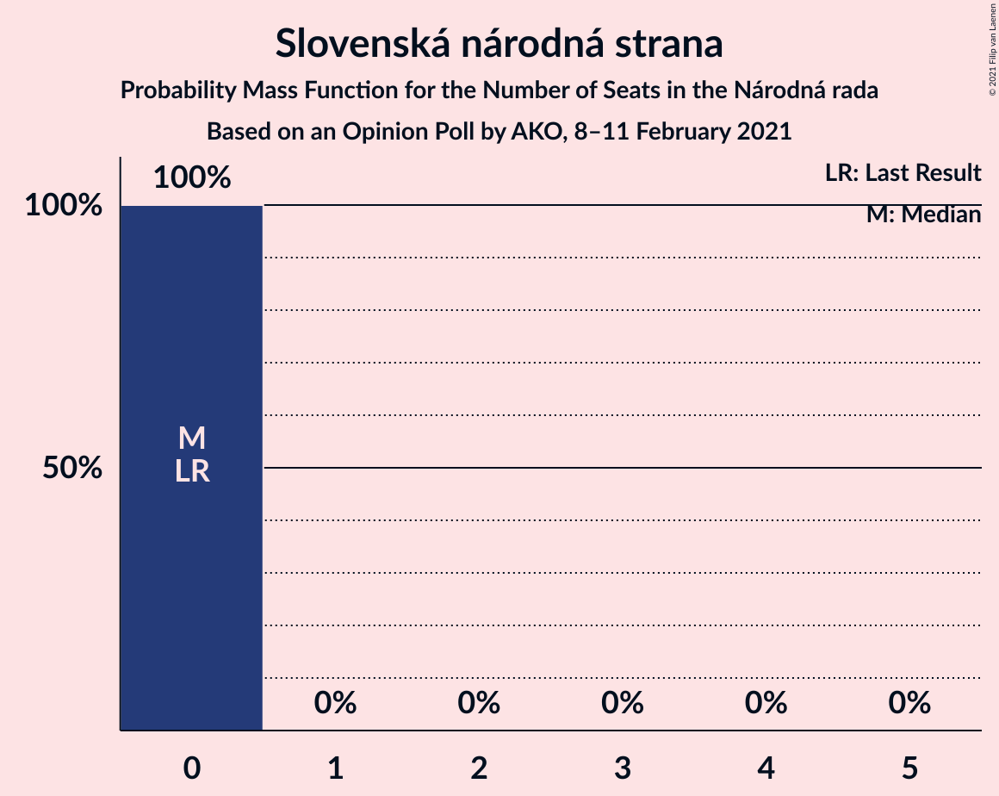

# Opinion Poll by AKO, 8–11 February 2021

<a href="#voting-intentions">Voting Intentions</a> | <a href="#seats">Seats</a> | <a href="#coalitions">Coalitions</a> | <a href="#technical-information">Technical Information</a>

## Voting Intentions

### Confidence Intervals

| Party | Last Result | Poll Result | 80% Confidence Interval | 90% Confidence Interval | 95% Confidence Interval | 99% Confidence Interval |
|:-----:|:-----------:|:-----------:|:-----------------------:|:-----------------------:|:-----------------------:|:-----------------------:|
| HLAS–sociálna demokracia | 0.0% | 25.0% | 23.3–26.8% |22.8–27.3% |22.4–27.8% |21.6–28.7% |
| Sloboda a Solidarita | 6.2% | 15.1% | 13.7–16.6% |13.3–17.1% |13.0–17.5% |12.4–18.2% |
| OBYČAJNÍ ĽUDIA a nezávislé osobnosti | 25.0% | 13.8% | 12.5–15.3% |12.1–15.7% |11.8–16.1% |11.2–16.8% |
| SMER–sociálna demokracia | 18.3% | 8.5% | 7.5–9.7% |7.2–10.1% |6.9–10.4% |6.4–11.0% |
| Progresívne Slovensko | 7.0% | 7.2% | 6.2–8.4% |6.0–8.7% |5.7–9.0% |5.3–9.6% |
| Za ľudí | 5.8% | 5.4% | 4.6–6.4% |4.3–6.7% |4.2–7.0% |3.8–7.5% |
| SME RODINA | 8.2% | 5.1% | 4.3–6.1% |4.1–6.4% |3.9–6.6% |3.6–7.2% |
| Kresťanskodemokratické hnutie | 4.6% | 4.9% | 4.1–5.9% |3.9–6.2% |3.7–6.4% |3.4–6.9% |
| Kotleba–Ľudová strana Naše Slovensko | 8.0% | 3.8% | 3.1–4.7% |2.9–5.0% |2.8–5.2% |2.5–5.6% |
| Slovenská národná strana | 3.2% | 2.3% | 1.8–3.0% |1.6–3.2% |1.5–3.4% |1.3–3.8% |
| Strana maďarskej koalície–Magyar Koalíció Pártja | 3.9% | 2.0% | 1.5–2.7% |1.4–2.9% |1.3–3.1% |1.1–3.4% |
| VLASŤ | 2.9% | 1.8% | 1.4–2.5% |1.2–2.7% |1.1–2.8% |1.0–3.2% |
| Dobrá voľba | 3.1% | 1.6% | 1.2–2.2% |1.1–2.4% |1.0–2.6% |0.8–2.9% |
| MOST–HÍD | 2.0% | 0.8% | 0.5–1.3% |0.5–1.4% |0.4–1.6% |0.3–1.9% |
| SPOLU–Občianska Demokracia | 7.0% | 0.7% | 0.5–1.2% |0.4–1.3% |0.3–1.4% |0.2–1.7% |

*Note:* The poll result column reflects the actual value used in the calculations. Published results may vary slightly, and in addition be rounded to fewer digits.

## Seats

### Confidence Intervals

| Party | Last Result | Median | 80% Confidence Interval | 90% Confidence Interval | 95% Confidence Interval | 99% Confidence Interval |
|:-----:|:-----------:|:------:|:-----------------------:|:-----------------------:|:-----------------------:|:-----------------------:|
| <a href="#hlas–sociálna-demokracia">HLAS–sociálna demokracia</a> | 0 | 48 | 44–48 |43–53 |41–54 |38–56 |
| <a href="#sloboda-a-solidarita">Sloboda a Solidarita</a> | 13 | 28 | 27–30 |26–31 |24–32 |24–33 |
| <a href="#obyčajní-ľudia-a-nezávislé-osobnosti">OBYČAJNÍ ĽUDIA a nezávislé osobnosti</a> | 53 | 21 | 21–28 |21–28 |21–28 |21–31 |
| <a href="#smer–sociálna-demokracia">SMER–sociálna demokracia</a> | 38 | 17 | 14–18 |12–18 |12–19 |12–19 |
| <a href="#progresívne-slovensko">Progresívne Slovensko</a> | 0 | 13 | 13–15 |11–16 |10–16 |0–17 |
| <a href="#za-ľudí">Za ľudí</a> | 12 | 10 | 0–12 |0–12 |0–12 |0–12 |
| <a href="#sme-rodina">SME RODINA</a> | 17 | 11 | 0–12 |0–12 |0–12 |0–12 |
| <a href="#kresťanskodemokratické-hnutie">Kresťanskodemokratické hnutie</a> | 0 | 10 | 0–11 |0–11 |0–11 |0–13 |
| <a href="#kotleba–ľudová-strana-naše-slovensko">Kotleba–Ľudová strana Naše Slovensko</a> | 17 | 0 | 0 |0 |0 |0–10 |
| <a href="#slovenská-národná-strana">Slovenská národná strana</a> | 0 | 0 | 0 |0 |0 |0 |
| <a href="#strana-maďarskej-koalície–magyar-koalíció-pártja">Strana maďarskej koalície–Magyar Koalíció Pártja</a> | 0 | 0 | 0 |0 |0 |0 |
| <a href="#vlasť">VLASŤ</a> | 0 | 0 | 0 |0 |0 |0 |
| <a href="#dobrá-voľba">Dobrá voľba</a> | 0 | 0 | 0 |0 |0 |0 |
| <a href="#most–híd">MOST–HÍD</a> | 0 | 0 | 0 |0 |0 |0 |
| <a href="#spolu–občianska-demokracia">SPOLU–Občianska Demokracia</a> | 0 | 0 | 0 |0 |0 |0 |

### HLAS–sociálna demokracia

*For a full overview of the results for this party, see the [HLAS–sociálna demokracia](party-hlas–sociálnademokracia.html) page.*

| Number of Seats | Probability | Accumulated | Special Marks |
|:---------------:|:-----------:|:-----------:|:-------------:|
| 0 | 0% | 100% | Last Result |
| 1 | 0% | 100% |  |
| 2 | 0% | 100% |  |
| 3 | 0% | 100% |  |
| 4 | 0% | 100% |  |
| 5 | 0% | 100% |  |
| 6 | 0% | 100% |  |
| 7 | 0% | 100% |  |
| 8 | 0% | 100% |  |
| 9 | 0% | 100% |  |
| 10 | 0% | 100% |  |
| 11 | 0% | 100% |  |
| 12 | 0% | 100% |  |
| 13 | 0% | 100% |  |
| 14 | 0% | 100% |  |
| 15 | 0% | 100% |  |
| 16 | 0% | 100% |  |
| 17 | 0% | 100% |  |
| 18 | 0% | 100% |  |
| 19 | 0% | 100% |  |
| 20 | 0% | 100% |  |
| 21 | 0% | 100% |  |
| 22 | 0% | 100% |  |
| 23 | 0% | 100% |  |
| 24 | 0% | 100% |  |
| 25 | 0% | 100% |  |
| 26 | 0% | 100% |  |
| 27 | 0% | 100% |  |
| 28 | 0% | 100% |  |
| 29 | 0% | 100% |  |
| 30 | 0% | 100% |  |
| 31 | 0% | 100% |  |
| 32 | 0% | 100% |  |
| 33 | 0% | 100% |  |
| 34 | 0% | 100% |  |
| 35 | 0% | 100% |  |
| 36 | 0% | 100% |  |
| 37 | 0% | 100% |  |
| 38 | 0.5% | 100% |  |
| 39 | 0.1% | 99.5% |  |
| 40 | 1.2% | 99.4% |  |
| 41 | 1.0% | 98% |  |
| 42 | 0.1% | 97% |  |
| 43 | 5% | 97% |  |
| 44 | 16% | 92% |  |
| 45 | 5% | 76% |  |
| 46 | 6% | 72% |  |
| 47 | 9% | 65% |  |
| 48 | 49% | 57% | Median |
| 49 | 0.6% | 7% |  |
| 50 | 0.6% | 7% |  |
| 51 | 0.4% | 6% |  |
| 52 | 0.4% | 5% |  |
| 53 | 0.1% | 5% |  |
| 54 | 4% | 5% |  |
| 55 | 0% | 0.5% |  |
| 56 | 0% | 0.5% |  |
| 57 | 0.4% | 0.5% |  |
| 58 | 0.1% | 0.1% |  |
| 59 | 0% | 0% |  |

### Sloboda a Solidarita

*For a full overview of the results for this party, see the [Sloboda a Solidarita](party-slobodaasolidarita.html) page.*

| Number of Seats | Probability | Accumulated | Special Marks |
|:---------------:|:-----------:|:-----------:|:-------------:|
| 13 | 0% | 100% | Last Result |
| 14 | 0% | 100% |  |
| 15 | 0% | 100% |  |
| 16 | 0% | 100% |  |
| 17 | 0% | 100% |  |
| 18 | 0% | 100% |  |
| 19 | 0% | 100% |  |
| 20 | 0% | 100% |  |
| 21 | 0% | 100% |  |
| 22 | 0% | 100% |  |
| 23 | 0.2% | 99.9% |  |
| 24 | 2% | 99.8% |  |
| 25 | 0.2% | 97% |  |
| 26 | 7% | 97% |  |
| 27 | 25% | 91% |  |
| 28 | 50% | 66% | Median |
| 29 | 1.1% | 16% |  |
| 30 | 5% | 15% |  |
| 31 | 7% | 10% |  |
| 32 | 1.4% | 3% |  |
| 33 | 2% | 2% |  |
| 34 | 0.1% | 0.3% |  |
| 35 | 0.1% | 0.2% |  |
| 36 | 0.1% | 0.1% |  |
| 37 | 0% | 0% |  |

### OBYČAJNÍ ĽUDIA a nezávislé osobnosti

*For a full overview of the results for this party, see the [OBYČAJNÍ ĽUDIA a nezávislé osobnosti](party-obyčajníľudiaanezávisléosobnosti.html) page.*

| Number of Seats | Probability | Accumulated | Special Marks |
|:---------------:|:-----------:|:-----------:|:-------------:|
| 19 | 0.3% | 100% |  |
| 20 | 0% | 99.7% |  |
| 21 | 51% | 99.6% | Median |
| 22 | 1.3% | 49% |  |
| 23 | 1.4% | 48% |  |
| 24 | 8% | 46% |  |
| 25 | 8% | 39% |  |
| 26 | 0.6% | 31% |  |
| 27 | 9% | 30% |  |
| 28 | 21% | 22% |  |
| 29 | 0.3% | 1.1% |  |
| 30 | 0.2% | 0.8% |  |
| 31 | 0.1% | 0.6% |  |
| 32 | 0.4% | 0.5% |  |
| 33 | 0% | 0% |  |
| 34 | 0% | 0% |  |
| 35 | 0% | 0% |  |
| 36 | 0% | 0% |  |
| 37 | 0% | 0% |  |
| 38 | 0% | 0% |  |
| 39 | 0% | 0% |  |
| 40 | 0% | 0% |  |
| 41 | 0% | 0% |  |
| 42 | 0% | 0% |  |
| 43 | 0% | 0% |  |
| 44 | 0% | 0% |  |
| 45 | 0% | 0% |  |
| 46 | 0% | 0% |  |
| 47 | 0% | 0% |  |
| 48 | 0% | 0% |  |
| 49 | 0% | 0% |  |
| 50 | 0% | 0% |  |
| 51 | 0% | 0% |  |
| 52 | 0% | 0% |  |
| 53 | 0% | 0% | Last Result |

### SMER–sociálna demokracia

*For a full overview of the results for this party, see the [SMER–sociálna demokracia](party-smer–sociálnademokracia.html) page.*

| Number of Seats | Probability | Accumulated | Special Marks |
|:---------------:|:-----------:|:-----------:|:-------------:|
| 11 | 0.4% | 100% |  |
| 12 | 6% | 99.6% |  |
| 13 | 1.4% | 94% |  |
| 14 | 3% | 93% |  |
| 15 | 15% | 90% |  |
| 16 | 14% | 75% |  |
| 17 | 51% | 61% | Median |
| 18 | 7% | 10% |  |
| 19 | 3% | 3% |  |
| 20 | 0.1% | 0.3% |  |
| 21 | 0.2% | 0.2% |  |
| 22 | 0% | 0% |  |
| 23 | 0% | 0% |  |
| 24 | 0% | 0% |  |
| 25 | 0% | 0% |  |
| 26 | 0% | 0% |  |
| 27 | 0% | 0% |  |
| 28 | 0% | 0% |  |
| 29 | 0% | 0% |  |
| 30 | 0% | 0% |  |
| 31 | 0% | 0% |  |
| 32 | 0% | 0% |  |
| 33 | 0% | 0% |  |
| 34 | 0% | 0% |  |
| 35 | 0% | 0% |  |
| 36 | 0% | 0% |  |
| 37 | 0% | 0% |  |
| 38 | 0% | 0% | Last Result |

### Progresívne Slovensko

*For a full overview of the results for this party, see the [Progresívne Slovensko](party-progresívneslovensko.html) page.*

| Number of Seats | Probability | Accumulated | Special Marks |
|:---------------:|:-----------:|:-----------:|:-------------:|
| 0 | 0.5% | 100% | Last Result |
| 1 | 0% | 99.5% |  |
| 2 | 0% | 99.5% |  |
| 3 | 0% | 99.5% |  |
| 4 | 0% | 99.5% |  |
| 5 | 0% | 99.5% |  |
| 6 | 0% | 99.5% |  |
| 7 | 0% | 99.5% |  |
| 8 | 0% | 99.5% |  |
| 9 | 0% | 99.5% |  |
| 10 | 4% | 99.5% |  |
| 11 | 1.3% | 96% |  |
| 12 | 2% | 95% |  |
| 13 | 48% | 93% | Median |
| 14 | 14% | 45% |  |
| 15 | 21% | 31% |  |
| 16 | 8% | 9% |  |
| 17 | 1.2% | 1.3% |  |
| 18 | 0.1% | 0.2% |  |
| 19 | 0% | 0% |  |

### Za ľudí

*For a full overview of the results for this party, see the [Za ľudí](party-zaľudí.html) page.*

| Number of Seats | Probability | Accumulated | Special Marks |
|:---------------:|:-----------:|:-----------:|:-------------:|
| 0 | 47% | 100% |  |
| 1 | 0% | 53% |  |
| 2 | 0% | 53% |  |
| 3 | 0% | 53% |  |
| 4 | 0% | 53% |  |
| 5 | 0% | 53% |  |
| 6 | 0% | 53% |  |
| 7 | 0% | 53% |  |
| 8 | 0% | 53% |  |
| 9 | 1.1% | 53% |  |
| 10 | 12% | 52% | Median |
| 11 | 23% | 40% |  |
| 12 | 16% | 17% | Last Result |
| 13 | 0.1% | 0.2% |  |
| 14 | 0% | 0.1% |  |
| 15 | 0% | 0% |  |

### SME RODINA

*For a full overview of the results for this party, see the [SME RODINA](party-smerodina.html) page.*

| Number of Seats | Probability | Accumulated | Special Marks |
|:---------------:|:-----------:|:-----------:|:-------------:|
| 0 | 17% | 100% |  |
| 1 | 0% | 83% |  |
| 2 | 0% | 83% |  |
| 3 | 0% | 83% |  |
| 4 | 0% | 83% |  |
| 5 | 0% | 83% |  |
| 6 | 0% | 83% |  |
| 7 | 0% | 83% |  |
| 8 | 0% | 83% |  |
| 9 | 6% | 83% |  |
| 10 | 19% | 77% |  |
| 11 | 13% | 59% | Median |
| 12 | 46% | 46% |  |
| 13 | 0.3% | 0.3% |  |
| 14 | 0% | 0% |  |
| 15 | 0% | 0% |  |
| 16 | 0% | 0% |  |
| 17 | 0% | 0% | Last Result |

### Kresťanskodemokratické hnutie

*For a full overview of the results for this party, see the [Kresťanskodemokratické hnutie](party-kresťanskodemokratickéhnutie.html) page.*

| Number of Seats | Probability | Accumulated | Special Marks |
|:---------------:|:-----------:|:-----------:|:-------------:|
| 0 | 42% | 100% | Last Result |
| 1 | 0% | 58% |  |
| 2 | 0% | 58% |  |
| 3 | 0% | 58% |  |
| 4 | 0% | 58% |  |
| 5 | 0% | 58% |  |
| 6 | 0% | 58% |  |
| 7 | 0% | 58% |  |
| 8 | 0% | 58% |  |
| 9 | 0.4% | 58% |  |
| 10 | 9% | 58% | Median |
| 11 | 48% | 48% |  |
| 12 | 0.1% | 0.8% |  |
| 13 | 0.7% | 0.7% |  |
| 14 | 0% | 0% |  |

### Kotleba–Ľudová strana Naše Slovensko

*For a full overview of the results for this party, see the [Kotleba–Ľudová strana Naše Slovensko](party-kotleba–ľudovástrananašeslovensko.html) page.*

| Number of Seats | Probability | Accumulated | Special Marks |
|:---------------:|:-----------:|:-----------:|:-------------:|
| 0 | 99.3% | 100% | Median |
| 1 | 0% | 0.7% |  |
| 2 | 0% | 0.7% |  |
| 3 | 0% | 0.7% |  |
| 4 | 0% | 0.7% |  |
| 5 | 0% | 0.7% |  |
| 6 | 0% | 0.7% |  |
| 7 | 0% | 0.7% |  |
| 8 | 0% | 0.7% |  |
| 9 | 0.1% | 0.7% |  |
| 10 | 0.5% | 0.7% |  |
| 11 | 0.2% | 0.2% |  |
| 12 | 0% | 0% |  |
| 13 | 0% | 0% |  |
| 14 | 0% | 0% |  |
| 15 | 0% | 0% |  |
| 16 | 0% | 0% |  |
| 17 | 0% | 0% | Last Result |

### Slovenská národná strana

*For a full overview of the results for this party, see the [Slovenská národná strana](party-slovenskánárodnástrana.html) page.*

| Number of Seats | Probability | Accumulated | Special Marks |
|:---------------:|:-----------:|:-----------:|:-------------:|
| 0 | 100% | 100% | Last Result, Median |

### Strana maďarskej koalície–Magyar Koalíció Pártja

*For a full overview of the results for this party, see the [Strana maďarskej koalície–Magyar Koalíció Pártja](party-stranamaďarskejkoalície–magyarkoalíciópártja.html) page.*

| Number of Seats | Probability | Accumulated | Special Marks |
|:---------------:|:-----------:|:-----------:|:-------------:|
| 0 | 100% | 100% | Last Result, Median |

### VLASŤ

*For a full overview of the results for this party, see the [VLASŤ](party-vlasť.html) page.*

| Number of Seats | Probability | Accumulated | Special Marks |
|:---------------:|:-----------:|:-----------:|:-------------:|
| 0 | 100% | 100% | Last Result, Median |

### Dobrá voľba

*For a full overview of the results for this party, see the [Dobrá voľba](party-dobrávoľba.html) page.*

| Number of Seats | Probability | Accumulated | Special Marks |
|:---------------:|:-----------:|:-----------:|:-------------:|
| 0 | 100% | 100% | Last Result, Median |

### MOST–HÍD

*For a full overview of the results for this party, see the [MOST–HÍD](party-most–híd.html) page.*

| Number of Seats | Probability | Accumulated | Special Marks |
|:---------------:|:-----------:|:-----------:|:-------------:|
| 0 | 100% | 100% | Last Result, Median |

### SPOLU–Občianska Demokracia

*For a full overview of the results for this party, see the [SPOLU–Občianska Demokracia](party-spolu–občianskademokracia.html) page.*

| Number of Seats | Probability | Accumulated | Special Marks |
|:---------------:|:-----------:|:-----------:|:-------------:|
| 0 | 100% | 100% | Last Result, Median |

## Coalitions

### Confidence Intervals

| Coalition | Last Result | Median | Majority? | 80% Confidence Interval | 90% Confidence Interval | 95% Confidence Interval | 99% Confidence Interval |
|:---------:|:-----------:|:------:|:---------:|:-----------------------:|:-----------------------:|:-----------------------:|:-----------------------:|
| HLAS–sociálna demokracia – SMER–sociálna demokracia – SME RODINA – Kotleba–Ľudová strana Naše Slovensko – Slovenská národná strana | 72 | 73 | 47% | 65–77 | 62–77 | 61–77 | 60–79 |
| HLAS–sociálna demokracia – SMER–sociálna demokracia – SME RODINA | 55 | 73 | 46% | 65–77 | 62–77 | 61–77 | 60–77 |
| HLAS–sociálna demokracia – SMER–sociálna demokracia – SME RODINA – Slovenská národná strana | 55 | 73 | 46% | 65–77 | 62–77 | 61–77 | 60–77 |
| HLAS–sociálna demokracia – SMER–sociálna demokracia – Slovenská národná strana – MOST–HÍD | 38 | 65 | 0% | 59–65 | 58–70 | 56–72 | 54–74 |
| HLAS–sociálna demokracia – SMER–sociálna demokracia – Slovenská národná strana | 38 | 65 | 0% | 59–65 | 58–70 | 56–72 | 54–74 |
| HLAS–sociálna demokracia – SME RODINA – Kotleba–Ľudová strana Naše Slovensko – Slovenská národná strana | 34 | 57 | 0% | 48–60 | 45–60 | 45–60 | 43–65 |
| HLAS–sociálna demokracia – SME RODINA | 17 | 57 | 0% | 48–60 | 45–60 | 45–60 | 43–60 |
| HLAS–sociálna demokracia – SME RODINA – Slovenská národná strana | 17 | 57 | 0% | 48–60 | 45–60 | 45–60 | 43–60 |
| HLAS–sociálna demokracia – Slovenská národná strana – MOST–HÍD | 0 | 48 | 0% | 44–48 | 43–53 | 41–54 | 38–56 |
| HLAS–sociálna demokracia – Slovenská národná strana | 0 | 48 | 0% | 44–48 | 43–53 | 41–54 | 38–56 |
| SMER–sociálna demokracia – SME RODINA – Kotleba–Ľudová strana Naše Slovensko – Slovenská národná strana | 72 | 27 | 0% | 18–29 | 16–29 | 16–29 | 16–31 |
| SMER–sociálna demokracia – SME RODINA | 55 | 27 | 0% | 18–29 | 16–29 | 16–29 | 15–29 |
| SMER–sociálna demokracia – SME RODINA – Slovenská národná strana | 55 | 27 | 0% | 18–29 | 16–29 | 16–29 | 15–29 |
| SMER–sociálna demokracia – Slovenská národná strana – MOST–HÍD | 38 | 17 | 0% | 14–18 | 12–18 | 12–19 | 12–19 |
| SMER–sociálna demokracia | 38 | 17 | 0% | 14–18 | 12–18 | 12–19 | 12–19 |
| SMER–sociálna demokracia – Slovenská národná strana | 38 | 17 | 0% | 14–18 | 12–18 | 12–19 | 12–19 |

### HLAS–sociálna demokracia – SMER–sociálna demokracia – SME RODINA – Kotleba–Ľudová strana Naše Slovensko – Slovenská národná strana

| Number of Seats | Probability | Accumulated | Special Marks |
|:---------------:|:-----------:|:-----------:|:-------------:|
| 58 | 0.4% | 100% |  |
| 59 | 0% | 99.6% |  |
| 60 | 0.5% | 99.6% |  |
| 61 | 4% | 99.1% |  |
| 62 | 2% | 95% |  |
| 63 | 0.4% | 93% |  |
| 64 | 2% | 93% |  |
| 65 | 2% | 91% |  |
| 66 | 0.1% | 89% |  |
| 67 | 2% | 89% |  |
| 68 | 1.2% | 87% |  |
| 69 | 20% | 86% |  |
| 70 | 4% | 66% |  |
| 71 | 1.5% | 61% |  |
| 72 | 4% | 60% | Last Result |
| 73 | 7% | 56% |  |
| 74 | 1.3% | 48% |  |
| 75 | 0.1% | 47% |  |
| 76 | 0% | 47% | Median, Majority |
| 77 | 46% | 47% |  |
| 78 | 0.1% | 1.0% |  |
| 79 | 0.4% | 0.9% |  |
| 80 | 0.1% | 0.4% |  |
| 81 | 0% | 0.4% |  |
| 82 | 0.1% | 0.4% |  |
| 83 | 0.2% | 0.2% |  |
| 84 | 0% | 0% |  |

### HLAS–sociálna demokracia – SMER–sociálna demokracia – SME RODINA

| Number of Seats | Probability | Accumulated | Special Marks |
|:---------------:|:-----------:|:-----------:|:-------------:|
| 55 | 0% | 100% | Last Result |
| 56 | 0% | 100% |  |
| 57 | 0% | 99.9% |  |
| 58 | 0.4% | 99.9% |  |
| 59 | 0% | 99.6% |  |
| 60 | 0.6% | 99.5% |  |
| 61 | 4% | 99.0% |  |
| 62 | 2% | 95% |  |
| 63 | 0.4% | 93% |  |
| 64 | 2% | 93% |  |
| 65 | 2% | 91% |  |
| 66 | 0.1% | 89% |  |
| 67 | 2% | 89% |  |
| 68 | 1.2% | 87% |  |
| 69 | 20% | 85% |  |
| 70 | 4% | 65% |  |
| 71 | 1.5% | 61% |  |
| 72 | 5% | 60% |  |
| 73 | 7% | 55% |  |
| 74 | 1.3% | 47% |  |
| 75 | 0.1% | 46% |  |
| 76 | 0% | 46% | Median, Majority |
| 77 | 46% | 46% |  |
| 78 | 0.1% | 0.4% |  |
| 79 | 0.1% | 0.3% |  |
| 80 | 0.1% | 0.2% |  |
| 81 | 0% | 0.2% |  |
| 82 | 0.1% | 0.1% |  |
| 83 | 0% | 0% |  |

### HLAS–sociálna demokracia – SMER–sociálna demokracia – SME RODINA – Slovenská národná strana

| Number of Seats | Probability | Accumulated | Special Marks |
|:---------------:|:-----------:|:-----------:|:-------------:|
| 55 | 0% | 100% | Last Result |
| 56 | 0% | 100% |  |
| 57 | 0% | 99.9% |  |
| 58 | 0.4% | 99.9% |  |
| 59 | 0% | 99.6% |  |
| 60 | 0.6% | 99.5% |  |
| 61 | 4% | 99.0% |  |
| 62 | 2% | 95% |  |
| 63 | 0.4% | 93% |  |
| 64 | 2% | 93% |  |
| 65 | 2% | 91% |  |
| 66 | 0.1% | 89% |  |
| 67 | 2% | 89% |  |
| 68 | 1.2% | 87% |  |
| 69 | 20% | 85% |  |
| 70 | 4% | 65% |  |
| 71 | 1.5% | 61% |  |
| 72 | 5% | 60% |  |
| 73 | 7% | 55% |  |
| 74 | 1.3% | 47% |  |
| 75 | 0.1% | 46% |  |
| 76 | 0% | 46% | Median, Majority |
| 77 | 46% | 46% |  |
| 78 | 0.1% | 0.4% |  |
| 79 | 0.1% | 0.3% |  |
| 80 | 0.1% | 0.2% |  |
| 81 | 0% | 0.2% |  |
| 82 | 0.1% | 0.1% |  |
| 83 | 0% | 0% |  |

### HLAS–sociálna demokracia – SMER–sociálna demokracia – Slovenská národná strana – MOST–HÍD

| Number of Seats | Probability | Accumulated | Special Marks |
|:---------------:|:-----------:|:-----------:|:-------------:|
| 38 | 0% | 100% | Last Result |
| 39 | 0% | 100% |  |
| 40 | 0% | 100% |  |
| 41 | 0% | 100% |  |
| 42 | 0% | 100% |  |
| 43 | 0% | 100% |  |
| 44 | 0% | 100% |  |
| 45 | 0% | 100% |  |
| 46 | 0% | 100% |  |
| 47 | 0% | 100% |  |
| 48 | 0% | 100% |  |
| 49 | 0% | 100% |  |
| 50 | 0% | 100% |  |
| 51 | 0% | 100% |  |
| 52 | 0% | 100% |  |
| 53 | 0.1% | 100% |  |
| 54 | 0.7% | 99.8% |  |
| 55 | 1.0% | 99.1% |  |
| 56 | 0.7% | 98% |  |
| 57 | 0.9% | 97% |  |
| 58 | 6% | 97% |  |
| 59 | 18% | 91% |  |
| 60 | 2% | 73% |  |
| 61 | 4% | 70% |  |
| 62 | 2% | 66% |  |
| 63 | 3% | 64% |  |
| 64 | 7% | 61% |  |
| 65 | 46% | 54% | Median |
| 66 | 0.1% | 9% |  |
| 67 | 2% | 8% |  |
| 68 | 0.4% | 6% |  |
| 69 | 0.7% | 6% |  |
| 70 | 0.1% | 5% |  |
| 71 | 0% | 5% |  |
| 72 | 4% | 5% |  |
| 73 | 0% | 0.5% |  |
| 74 | 0.4% | 0.5% |  |
| 75 | 0.1% | 0.1% |  |
| 76 | 0% | 0% | Majority |

### HLAS–sociálna demokracia – SMER–sociálna demokracia – Slovenská národná strana

| Number of Seats | Probability | Accumulated | Special Marks |
|:---------------:|:-----------:|:-----------:|:-------------:|
| 38 | 0% | 100% | Last Result |
| 39 | 0% | 100% |  |
| 40 | 0% | 100% |  |
| 41 | 0% | 100% |  |
| 42 | 0% | 100% |  |
| 43 | 0% | 100% |  |
| 44 | 0% | 100% |  |
| 45 | 0% | 100% |  |
| 46 | 0% | 100% |  |
| 47 | 0% | 100% |  |
| 48 | 0% | 100% |  |
| 49 | 0% | 100% |  |
| 50 | 0% | 100% |  |
| 51 | 0% | 100% |  |
| 52 | 0% | 100% |  |
| 53 | 0.1% | 100% |  |
| 54 | 0.7% | 99.8% |  |
| 55 | 1.0% | 99.1% |  |
| 56 | 0.7% | 98% |  |
| 57 | 0.9% | 97% |  |
| 58 | 6% | 97% |  |
| 59 | 18% | 91% |  |
| 60 | 2% | 73% |  |
| 61 | 4% | 70% |  |
| 62 | 2% | 66% |  |
| 63 | 3% | 64% |  |
| 64 | 7% | 61% |  |
| 65 | 46% | 54% | Median |
| 66 | 0.1% | 9% |  |
| 67 | 2% | 8% |  |
| 68 | 0.4% | 6% |  |
| 69 | 0.7% | 6% |  |
| 70 | 0.1% | 5% |  |
| 71 | 0% | 5% |  |
| 72 | 4% | 5% |  |
| 73 | 0% | 0.5% |  |
| 74 | 0.4% | 0.5% |  |
| 75 | 0.1% | 0.1% |  |
| 76 | 0% | 0% | Majority |

### HLAS–sociálna demokracia – SME RODINA – Kotleba–Ľudová strana Naše Slovensko – Slovenská národná strana

| Number of Seats | Probability | Accumulated | Special Marks |
|:---------------:|:-----------:|:-----------:|:-------------:|
| 34 | 0% | 100% | Last Result |
| 35 | 0% | 100% |  |
| 36 | 0% | 100% |  |
| 37 | 0% | 100% |  |
| 38 | 0% | 100% |  |
| 39 | 0% | 100% |  |
| 40 | 0.3% | 100% |  |
| 41 | 0% | 99.7% |  |
| 42 | 0% | 99.7% |  |
| 43 | 0.5% | 99.6% |  |
| 44 | 2% | 99.1% |  |
| 45 | 4% | 98% |  |
| 46 | 0.1% | 93% |  |
| 47 | 0% | 93% |  |
| 48 | 4% | 93% |  |
| 49 | 2% | 90% |  |
| 50 | 0.1% | 88% |  |
| 51 | 1.3% | 88% |  |
| 52 | 0.3% | 86% |  |
| 53 | 0.2% | 86% |  |
| 54 | 23% | 86% |  |
| 55 | 0.1% | 62% |  |
| 56 | 5% | 62% |  |
| 57 | 8% | 57% |  |
| 58 | 1.5% | 49% |  |
| 59 | 0.2% | 47% | Median |
| 60 | 46% | 47% |  |
| 61 | 0.2% | 0.8% |  |
| 62 | 0.1% | 0.7% |  |
| 63 | 0% | 0.6% |  |
| 64 | 0% | 0.6% |  |
| 65 | 0% | 0.5% |  |
| 66 | 0% | 0.5% |  |
| 67 | 0% | 0.5% |  |
| 68 | 0.4% | 0.5% |  |
| 69 | 0% | 0% |  |

### HLAS–sociálna demokracia – SME RODINA

| Number of Seats | Probability | Accumulated | Special Marks |
|:---------------:|:-----------:|:-----------:|:-------------:|
| 17 | 0% | 100% | Last Result |
| 18 | 0% | 100% |  |
| 19 | 0% | 100% |  |
| 20 | 0% | 100% |  |
| 21 | 0% | 100% |  |
| 22 | 0% | 100% |  |
| 23 | 0% | 100% |  |
| 24 | 0% | 100% |  |
| 25 | 0% | 100% |  |
| 26 | 0% | 100% |  |
| 27 | 0% | 100% |  |
| 28 | 0% | 100% |  |
| 29 | 0% | 100% |  |
| 30 | 0% | 100% |  |
| 31 | 0% | 100% |  |
| 32 | 0% | 100% |  |
| 33 | 0% | 100% |  |
| 34 | 0% | 100% |  |
| 35 | 0% | 100% |  |
| 36 | 0% | 100% |  |
| 37 | 0% | 100% |  |
| 38 | 0% | 100% |  |
| 39 | 0% | 100% |  |
| 40 | 0.3% | 100% |  |
| 41 | 0% | 99.7% |  |
| 42 | 0% | 99.6% |  |
| 43 | 0.5% | 99.6% |  |
| 44 | 2% | 99.1% |  |
| 45 | 4% | 98% |  |
| 46 | 0.1% | 93% |  |
| 47 | 0% | 93% |  |
| 48 | 4% | 93% |  |
| 49 | 2% | 89% |  |
| 50 | 0.2% | 88% |  |
| 51 | 1.3% | 88% |  |
| 52 | 0.4% | 86% |  |
| 53 | 0.2% | 86% |  |
| 54 | 23% | 86% |  |
| 55 | 0.1% | 62% |  |
| 56 | 5% | 62% |  |
| 57 | 8% | 57% |  |
| 58 | 2% | 48% |  |
| 59 | 0.2% | 47% | Median |
| 60 | 46% | 46% |  |
| 61 | 0.2% | 0.3% |  |
| 62 | 0.1% | 0.1% |  |
| 63 | 0% | 0.1% |  |
| 64 | 0% | 0.1% |  |
| 65 | 0% | 0.1% |  |
| 66 | 0% | 0% |  |

### HLAS–sociálna demokracia – SME RODINA – Slovenská národná strana

| Number of Seats | Probability | Accumulated | Special Marks |
|:---------------:|:-----------:|:-----------:|:-------------:|
| 17 | 0% | 100% | Last Result |
| 18 | 0% | 100% |  |
| 19 | 0% | 100% |  |
| 20 | 0% | 100% |  |
| 21 | 0% | 100% |  |
| 22 | 0% | 100% |  |
| 23 | 0% | 100% |  |
| 24 | 0% | 100% |  |
| 25 | 0% | 100% |  |
| 26 | 0% | 100% |  |
| 27 | 0% | 100% |  |
| 28 | 0% | 100% |  |
| 29 | 0% | 100% |  |
| 30 | 0% | 100% |  |
| 31 | 0% | 100% |  |
| 32 | 0% | 100% |  |
| 33 | 0% | 100% |  |
| 34 | 0% | 100% |  |
| 35 | 0% | 100% |  |
| 36 | 0% | 100% |  |
| 37 | 0% | 100% |  |
| 38 | 0% | 100% |  |
| 39 | 0% | 100% |  |
| 40 | 0.3% | 100% |  |
| 41 | 0% | 99.7% |  |
| 42 | 0% | 99.6% |  |
| 43 | 0.5% | 99.6% |  |
| 44 | 2% | 99.1% |  |
| 45 | 4% | 98% |  |
| 46 | 0.1% | 93% |  |
| 47 | 0% | 93% |  |
| 48 | 4% | 93% |  |
| 49 | 2% | 89% |  |
| 50 | 0.2% | 88% |  |
| 51 | 1.3% | 88% |  |
| 52 | 0.4% | 86% |  |
| 53 | 0.2% | 86% |  |
| 54 | 23% | 86% |  |
| 55 | 0.1% | 62% |  |
| 56 | 5% | 62% |  |
| 57 | 8% | 57% |  |
| 58 | 2% | 48% |  |
| 59 | 0.2% | 47% | Median |
| 60 | 46% | 46% |  |
| 61 | 0.2% | 0.3% |  |
| 62 | 0.1% | 0.1% |  |
| 63 | 0% | 0.1% |  |
| 64 | 0% | 0.1% |  |
| 65 | 0% | 0.1% |  |
| 66 | 0% | 0% |  |

### HLAS–sociálna demokracia – Slovenská národná strana – MOST–HÍD

| Number of Seats | Probability | Accumulated | Special Marks |
|:---------------:|:-----------:|:-----------:|:-------------:|
| 0 | 0% | 100% | Last Result |
| 1 | 0% | 100% |  |
| 2 | 0% | 100% |  |
| 3 | 0% | 100% |  |
| 4 | 0% | 100% |  |
| 5 | 0% | 100% |  |
| 6 | 0% | 100% |  |
| 7 | 0% | 100% |  |
| 8 | 0% | 100% |  |
| 9 | 0% | 100% |  |
| 10 | 0% | 100% |  |
| 11 | 0% | 100% |  |
| 12 | 0% | 100% |  |
| 13 | 0% | 100% |  |
| 14 | 0% | 100% |  |
| 15 | 0% | 100% |  |
| 16 | 0% | 100% |  |
| 17 | 0% | 100% |  |
| 18 | 0% | 100% |  |
| 19 | 0% | 100% |  |
| 20 | 0% | 100% |  |
| 21 | 0% | 100% |  |
| 22 | 0% | 100% |  |
| 23 | 0% | 100% |  |
| 24 | 0% | 100% |  |
| 25 | 0% | 100% |  |
| 26 | 0% | 100% |  |
| 27 | 0% | 100% |  |
| 28 | 0% | 100% |  |
| 29 | 0% | 100% |  |
| 30 | 0% | 100% |  |
| 31 | 0% | 100% |  |
| 32 | 0% | 100% |  |
| 33 | 0% | 100% |  |
| 34 | 0% | 100% |  |
| 35 | 0% | 100% |  |
| 36 | 0% | 100% |  |
| 37 | 0% | 100% |  |
| 38 | 0.5% | 100% |  |
| 39 | 0.1% | 99.5% |  |
| 40 | 1.2% | 99.4% |  |
| 41 | 1.0% | 98% |  |
| 42 | 0.1% | 97% |  |
| 43 | 5% | 97% |  |
| 44 | 16% | 92% |  |
| 45 | 5% | 76% |  |
| 46 | 6% | 72% |  |
| 47 | 9% | 65% |  |
| 48 | 49% | 57% | Median |
| 49 | 0.6% | 7% |  |
| 50 | 0.6% | 7% |  |
| 51 | 0.4% | 6% |  |
| 52 | 0.4% | 5% |  |
| 53 | 0.1% | 5% |  |
| 54 | 4% | 5% |  |
| 55 | 0% | 0.5% |  |
| 56 | 0% | 0.5% |  |
| 57 | 0.4% | 0.5% |  |
| 58 | 0.1% | 0.1% |  |
| 59 | 0% | 0% |  |

### HLAS–sociálna demokracia – Slovenská národná strana

| Number of Seats | Probability | Accumulated | Special Marks |
|:---------------:|:-----------:|:-----------:|:-------------:|
| 0 | 0% | 100% | Last Result |
| 1 | 0% | 100% |  |
| 2 | 0% | 100% |  |
| 3 | 0% | 100% |  |
| 4 | 0% | 100% |  |
| 5 | 0% | 100% |  |
| 6 | 0% | 100% |  |
| 7 | 0% | 100% |  |
| 8 | 0% | 100% |  |
| 9 | 0% | 100% |  |
| 10 | 0% | 100% |  |
| 11 | 0% | 100% |  |
| 12 | 0% | 100% |  |
| 13 | 0% | 100% |  |
| 14 | 0% | 100% |  |
| 15 | 0% | 100% |  |
| 16 | 0% | 100% |  |
| 17 | 0% | 100% |  |
| 18 | 0% | 100% |  |
| 19 | 0% | 100% |  |
| 20 | 0% | 100% |  |
| 21 | 0% | 100% |  |
| 22 | 0% | 100% |  |
| 23 | 0% | 100% |  |
| 24 | 0% | 100% |  |
| 25 | 0% | 100% |  |
| 26 | 0% | 100% |  |
| 27 | 0% | 100% |  |
| 28 | 0% | 100% |  |
| 29 | 0% | 100% |  |
| 30 | 0% | 100% |  |
| 31 | 0% | 100% |  |
| 32 | 0% | 100% |  |
| 33 | 0% | 100% |  |
| 34 | 0% | 100% |  |
| 35 | 0% | 100% |  |
| 36 | 0% | 100% |  |
| 37 | 0% | 100% |  |
| 38 | 0.5% | 100% |  |
| 39 | 0.1% | 99.5% |  |
| 40 | 1.2% | 99.4% |  |
| 41 | 1.0% | 98% |  |
| 42 | 0.1% | 97% |  |
| 43 | 5% | 97% |  |
| 44 | 16% | 92% |  |
| 45 | 5% | 76% |  |
| 46 | 6% | 72% |  |
| 47 | 9% | 65% |  |
| 48 | 49% | 57% | Median |
| 49 | 0.6% | 7% |  |
| 50 | 0.6% | 7% |  |
| 51 | 0.4% | 6% |  |
| 52 | 0.4% | 5% |  |
| 53 | 0.1% | 5% |  |
| 54 | 4% | 5% |  |
| 55 | 0% | 0.5% |  |
| 56 | 0% | 0.5% |  |
| 57 | 0.4% | 0.5% |  |
| 58 | 0.1% | 0.1% |  |
| 59 | 0% | 0% |  |

### SMER–sociálna demokracia – SME RODINA – Kotleba–Ľudová strana Naše Slovensko – Slovenská národná strana

| Number of Seats | Probability | Accumulated | Special Marks |
|:---------------:|:-----------:|:-----------:|:-------------:|
| 11 | 0.2% | 100% |  |
| 12 | 0.1% | 99.8% |  |
| 13 | 0% | 99.8% |  |
| 14 | 0.1% | 99.7% |  |
| 15 | 0.1% | 99.6% |  |
| 16 | 6% | 99.5% |  |
| 17 | 0.8% | 94% |  |
| 18 | 6% | 93% |  |
| 19 | 3% | 86% |  |
| 20 | 0.1% | 84% |  |
| 21 | 0% | 84% |  |
| 22 | 0.1% | 83% |  |
| 23 | 6% | 83% |  |
| 24 | 3% | 78% |  |
| 25 | 16% | 75% |  |
| 26 | 8% | 59% |  |
| 27 | 5% | 52% |  |
| 28 | 0.5% | 47% | Median |
| 29 | 46% | 47% |  |
| 30 | 0.3% | 0.8% |  |
| 31 | 0.1% | 0.6% |  |
| 32 | 0% | 0.4% |  |
| 33 | 0% | 0.4% |  |
| 34 | 0.1% | 0.4% |  |
| 35 | 0% | 0.2% |  |
| 36 | 0.2% | 0.2% |  |
| 37 | 0% | 0% |  |
| 38 | 0% | 0% |  |
| 39 | 0% | 0% |  |
| 40 | 0% | 0% |  |
| 41 | 0% | 0% |  |
| 42 | 0% | 0% |  |
| 43 | 0% | 0% |  |
| 44 | 0% | 0% |  |
| 45 | 0% | 0% |  |
| 46 | 0% | 0% |  |
| 47 | 0% | 0% |  |
| 48 | 0% | 0% |  |
| 49 | 0% | 0% |  |
| 50 | 0% | 0% |  |
| 51 | 0% | 0% |  |
| 52 | 0% | 0% |  |
| 53 | 0% | 0% |  |
| 54 | 0% | 0% |  |
| 55 | 0% | 0% |  |
| 56 | 0% | 0% |  |
| 57 | 0% | 0% |  |
| 58 | 0% | 0% |  |
| 59 | 0% | 0% |  |
| 60 | 0% | 0% |  |
| 61 | 0% | 0% |  |
| 62 | 0% | 0% |  |
| 63 | 0% | 0% |  |
| 64 | 0% | 0% |  |
| 65 | 0% | 0% |  |
| 66 | 0% | 0% |  |
| 67 | 0% | 0% |  |
| 68 | 0% | 0% |  |
| 69 | 0% | 0% |  |
| 70 | 0% | 0% |  |
| 71 | 0% | 0% |  |
| 72 | 0% | 0% | Last Result |

### SMER–sociálna demokracia – SME RODINA

| Number of Seats | Probability | Accumulated | Special Marks |
|:---------------:|:-----------:|:-----------:|:-------------:|
| 11 | 0.2% | 100% |  |
| 12 | 0.1% | 99.8% |  |
| 13 | 0% | 99.8% |  |
| 14 | 0.1% | 99.7% |  |
| 15 | 0.1% | 99.6% |  |
| 16 | 6% | 99.4% |  |
| 17 | 0.8% | 93% |  |
| 18 | 6% | 93% |  |
| 19 | 3% | 86% |  |
| 20 | 0.3% | 83% |  |
| 21 | 0% | 83% |  |
| 22 | 0.1% | 83% |  |
| 23 | 6% | 83% |  |
| 24 | 3% | 77% |  |
| 25 | 16% | 75% |  |
| 26 | 8% | 59% |  |
| 27 | 5% | 51% |  |
| 28 | 0.5% | 47% | Median |
| 29 | 46% | 46% |  |
| 30 | 0% | 0.3% |  |
| 31 | 0.1% | 0.3% |  |
| 32 | 0% | 0.2% |  |
| 33 | 0% | 0.2% |  |
| 34 | 0.1% | 0.1% |  |
| 35 | 0% | 0% |  |
| 36 | 0% | 0% |  |
| 37 | 0% | 0% |  |
| 38 | 0% | 0% |  |
| 39 | 0% | 0% |  |
| 40 | 0% | 0% |  |
| 41 | 0% | 0% |  |
| 42 | 0% | 0% |  |
| 43 | 0% | 0% |  |
| 44 | 0% | 0% |  |
| 45 | 0% | 0% |  |
| 46 | 0% | 0% |  |
| 47 | 0% | 0% |  |
| 48 | 0% | 0% |  |
| 49 | 0% | 0% |  |
| 50 | 0% | 0% |  |
| 51 | 0% | 0% |  |
| 52 | 0% | 0% |  |
| 53 | 0% | 0% |  |
| 54 | 0% | 0% |  |
| 55 | 0% | 0% | Last Result |

### SMER–sociálna demokracia – SME RODINA – Slovenská národná strana

| Number of Seats | Probability | Accumulated | Special Marks |
|:---------------:|:-----------:|:-----------:|:-------------:|
| 11 | 0.2% | 100% |  |
| 12 | 0.1% | 99.8% |  |
| 13 | 0% | 99.8% |  |
| 14 | 0.1% | 99.7% |  |
| 15 | 0.1% | 99.6% |  |
| 16 | 6% | 99.4% |  |
| 17 | 0.8% | 93% |  |
| 18 | 6% | 93% |  |
| 19 | 3% | 86% |  |
| 20 | 0.3% | 83% |  |
| 21 | 0% | 83% |  |
| 22 | 0.1% | 83% |  |
| 23 | 6% | 83% |  |
| 24 | 3% | 77% |  |
| 25 | 16% | 75% |  |
| 26 | 8% | 59% |  |
| 27 | 5% | 51% |  |
| 28 | 0.5% | 47% | Median |
| 29 | 46% | 46% |  |
| 30 | 0% | 0.3% |  |
| 31 | 0.1% | 0.3% |  |
| 32 | 0% | 0.2% |  |
| 33 | 0% | 0.2% |  |
| 34 | 0.1% | 0.1% |  |
| 35 | 0% | 0% |  |
| 36 | 0% | 0% |  |
| 37 | 0% | 0% |  |
| 38 | 0% | 0% |  |
| 39 | 0% | 0% |  |
| 40 | 0% | 0% |  |
| 41 | 0% | 0% |  |
| 42 | 0% | 0% |  |
| 43 | 0% | 0% |  |
| 44 | 0% | 0% |  |
| 45 | 0% | 0% |  |
| 46 | 0% | 0% |  |
| 47 | 0% | 0% |  |
| 48 | 0% | 0% |  |
| 49 | 0% | 0% |  |
| 50 | 0% | 0% |  |
| 51 | 0% | 0% |  |
| 52 | 0% | 0% |  |
| 53 | 0% | 0% |  |
| 54 | 0% | 0% |  |
| 55 | 0% | 0% | Last Result |

### SMER–sociálna demokracia – Slovenská národná strana – MOST–HÍD

| Number of Seats | Probability | Accumulated | Special Marks |
|:---------------:|:-----------:|:-----------:|:-------------:|
| 11 | 0.4% | 100% |  |
| 12 | 6% | 99.6% |  |
| 13 | 1.4% | 94% |  |
| 14 | 3% | 93% |  |
| 15 | 15% | 90% |  |
| 16 | 14% | 75% |  |
| 17 | 51% | 61% | Median |
| 18 | 7% | 10% |  |
| 19 | 3% | 3% |  |
| 20 | 0.1% | 0.3% |  |
| 21 | 0.2% | 0.2% |  |
| 22 | 0% | 0% |  |
| 23 | 0% | 0% |  |
| 24 | 0% | 0% |  |
| 25 | 0% | 0% |  |
| 26 | 0% | 0% |  |
| 27 | 0% | 0% |  |
| 28 | 0% | 0% |  |
| 29 | 0% | 0% |  |
| 30 | 0% | 0% |  |
| 31 | 0% | 0% |  |
| 32 | 0% | 0% |  |
| 33 | 0% | 0% |  |
| 34 | 0% | 0% |  |
| 35 | 0% | 0% |  |
| 36 | 0% | 0% |  |
| 37 | 0% | 0% |  |
| 38 | 0% | 0% | Last Result |

### SMER–sociálna demokracia

| Number of Seats | Probability | Accumulated | Special Marks |
|:---------------:|:-----------:|:-----------:|:-------------:|
| 11 | 0.4% | 100% |  |
| 12 | 6% | 99.6% |  |
| 13 | 1.4% | 94% |  |
| 14 | 3% | 93% |  |
| 15 | 15% | 90% |  |
| 16 | 14% | 75% |  |
| 17 | 51% | 61% | Median |
| 18 | 7% | 10% |  |
| 19 | 3% | 3% |  |
| 20 | 0.1% | 0.3% |  |
| 21 | 0.2% | 0.2% |  |
| 22 | 0% | 0% |  |
| 23 | 0% | 0% |  |
| 24 | 0% | 0% |  |
| 25 | 0% | 0% |  |
| 26 | 0% | 0% |  |
| 27 | 0% | 0% |  |
| 28 | 0% | 0% |  |
| 29 | 0% | 0% |  |
| 30 | 0% | 0% |  |
| 31 | 0% | 0% |  |
| 32 | 0% | 0% |  |
| 33 | 0% | 0% |  |
| 34 | 0% | 0% |  |
| 35 | 0% | 0% |  |
| 36 | 0% | 0% |  |
| 37 | 0% | 0% |  |
| 38 | 0% | 0% | Last Result |

### SMER–sociálna demokracia – Slovenská národná strana

| Number of Seats | Probability | Accumulated | Special Marks |
|:---------------:|:-----------:|:-----------:|:-------------:|
| 11 | 0.4% | 100% |  |
| 12 | 6% | 99.6% |  |
| 13 | 1.4% | 94% |  |
| 14 | 3% | 93% |  |
| 15 | 15% | 90% |  |
| 16 | 14% | 75% |  |
| 17 | 51% | 61% | Median |
| 18 | 7% | 10% |  |
| 19 | 3% | 3% |  |
| 20 | 0.1% | 0.3% |  |
| 21 | 0.2% | 0.2% |  |
| 22 | 0% | 0% |  |
| 23 | 0% | 0% |  |
| 24 | 0% | 0% |  |
| 25 | 0% | 0% |  |
| 26 | 0% | 0% |  |
| 27 | 0% | 0% |  |
| 28 | 0% | 0% |  |
| 29 | 0% | 0% |  |
| 30 | 0% | 0% |  |
| 31 | 0% | 0% |  |
| 32 | 0% | 0% |  |
| 33 | 0% | 0% |  |
| 34 | 0% | 0% |  |
| 35 | 0% | 0% |  |
| 36 | 0% | 0% |  |
| 37 | 0% | 0% |  |
| 38 | 0% | 0% | Last Result |

## Technical Information

### Opinion Poll

+ **Polling firm:** AKO
+ **Commissioner(s):** —
+ **Fieldwork period:** 8–11 February 2021

### Calculations

+ **Sample size:** 1000
+ **Simulations done:** 1,048,576
+ **Error estimate:** 4.04%

