# Opinion Poll by FOCUS, 17–24 February 2021

<a href="#voting-intentions">Voting Intentions</a> | <a href="#seats">Seats</a> | <a href="#coalitions">Coalitions</a> | <a href="#technical-information">Technical Information</a>

## Voting Intentions

### Confidence Intervals

| Party | Last Result | Poll Result | 80% Confidence Interval | 90% Confidence Interval | 95% Confidence Interval | 99% Confidence Interval |
|:-----:|:-----------:|:-----------:|:-----------------------:|:-----------------------:|:-----------------------:|:-----------------------:|
| HLAS–sociálna demokracia | 0.0% | 23.0% | 21.4–24.8% |20.9–25.2% |20.5–25.7% |19.7–26.5% |
| Sloboda a Solidarita | 6.2% | 12.9% | 11.6–14.3% |11.2–14.7% |10.9–15.1% |10.4–15.8% |
| OBYČAJNÍ ĽUDIA a nezávislé osobnosti | 25.0% | 10.4% | 9.3–11.7% |8.9–12.1% |8.7–12.5% |8.2–13.1% |
| SMER–sociálna demokracia | 18.3% | 9.2% | 8.2–10.5% |7.8–10.9% |7.6–11.2% |7.1–11.8% |
| Progresívne Slovensko | 7.0% | 6.7% | 5.8–7.8% |5.5–8.1% |5.3–8.4% |4.9–8.9% |
| Kotleba–Ľudová strana Naše Slovensko | 8.0% | 6.6% | 5.7–7.7% |5.4–8.0% |5.2–8.3% |4.8–8.8% |
| SME RODINA | 8.2% | 5.2% | 4.4–6.2% |4.2–6.5% |4.0–6.8% |3.6–7.3% |
| Za ľudí | 5.8% | 5.2% | 4.4–6.2% |4.2–6.5% |4.0–6.8% |3.6–7.3% |
| Kresťanskodemokratické hnutie | 4.6% | 4.9% | 4.1–5.9% |3.9–6.2% |3.7–6.4% |3.4–6.9% |
| Strana maďarskej koalície–Magyar Koalíció Pártja | 3.9% | 3.5% | 2.9–4.4% |2.7–4.6% |2.6–4.9% |2.3–5.3% |
| Slovenská národná strana | 3.2% | 2.8% | 2.3–3.6% |2.1–3.9% |2.0–4.1% |1.8–4.5% |
| VLASŤ | 2.9% | 2.8% | 2.3–3.6% |2.1–3.9% |2.0–4.1% |1.8–4.5% |
| MOST–HÍD | 2.0% | 2.1% | 1.6–2.8% |1.5–3.0% |1.4–3.1% |1.2–3.5% |
| Dobrá voľba | 3.1% | 1.9% | 1.4–2.5% |1.3–2.7% |1.2–2.9% |1.0–3.3% |
| SPOLU–Občianska Demokracia | 7.0% | 0.6% | 0.4–1.0% |0.3–1.2% |0.3–1.3% |0.2–1.5% |

*Note:* The poll result column reflects the actual value used in the calculations. Published results may vary slightly, and in addition be rounded to fewer digits.

## Seats

### Confidence Intervals

| Party | Last Result | Median | 80% Confidence Interval | 90% Confidence Interval | 95% Confidence Interval | 99% Confidence Interval |
|:-----:|:-----------:|:------:|:-----------------------:|:-----------------------:|:-----------------------:|:-----------------------:|
| <a href="#hlas–sociálna-demokracia">HLAS–sociálna demokracia</a> | 0 | 45 | 41–47 |40–48 |40–53 |38–53 |
| <a href="#sloboda-a-solidarita">Sloboda a Solidarita</a> | 13 | 25 | 23–27 |22–28 |22–30 |20–30 |
| <a href="#obyčajní-ľudia-a-nezávislé-osobnosti">OBYČAJNÍ ĽUDIA a nezávislé osobnosti</a> | 53 | 20 | 18–22 |18–23 |18–24 |17–25 |
| <a href="#smer–sociálna-demokracia">SMER–sociálna demokracia</a> | 38 | 18 | 16–21 |15–22 |15–22 |15–22 |
| <a href="#progresívne-slovensko">Progresívne Slovensko</a> | 0 | 13 | 10–16 |10–16 |10–16 |0–17 |
| <a href="#kotleba–ľudová-strana-naše-slovensko">Kotleba–Ľudová strana Naše Slovensko</a> | 17 | 13 | 12–14 |11–14 |11–16 |0–17 |
| <a href="#sme-rodina">SME RODINA</a> | 17 | 0 | 0–11 |0–12 |0–12 |0–13 |
| <a href="#za-ľudí">Za ľudí</a> | 12 | 0 | 0–12 |0–12 |0–12 |0–13 |
| <a href="#kresťanskodemokratické-hnutie">Kresťanskodemokratické hnutie</a> | 0 | 10 | 0–12 |0–12 |0–13 |0–13 |
| <a href="#strana-maďarskej-koalície–magyar-koalíció-pártja">Strana maďarskej koalície–Magyar Koalíció Pártja</a> | 0 | 0 | 0 |0 |0 |0 |
| <a href="#slovenská-národná-strana">Slovenská národná strana</a> | 0 | 0 | 0 |0 |0 |0 |
| <a href="#vlasť">VLASŤ</a> | 0 | 0 | 0 |0 |0 |0 |
| <a href="#most–híd">MOST–HÍD</a> | 0 | 0 | 0 |0 |0 |0 |
| <a href="#dobrá-voľba">Dobrá voľba</a> | 0 | 0 | 0 |0 |0 |0 |
| <a href="#spolu–občianska-demokracia">SPOLU–Občianska Demokracia</a> | 0 | 0 | 0 |0 |0 |0 |

### HLAS–sociálna demokracia

*For a full overview of the results for this party, see the [HLAS–sociálna demokracia](party-hlas–sociálnademokracia.html) page.*

| Number of Seats | Probability | Accumulated | Special Marks |
|:---------------:|:-----------:|:-----------:|:-------------:|
| 0 | 0% | 100% | Last Result |
| 1 | 0% | 100% |  |
| 2 | 0% | 100% |  |
| 3 | 0% | 100% |  |
| 4 | 0% | 100% |  |
| 5 | 0% | 100% |  |
| 6 | 0% | 100% |  |
| 7 | 0% | 100% |  |
| 8 | 0% | 100% |  |
| 9 | 0% | 100% |  |
| 10 | 0% | 100% |  |
| 11 | 0% | 100% |  |
| 12 | 0% | 100% |  |
| 13 | 0% | 100% |  |
| 14 | 0% | 100% |  |
| 15 | 0% | 100% |  |
| 16 | 0% | 100% |  |
| 17 | 0% | 100% |  |
| 18 | 0% | 100% |  |
| 19 | 0% | 100% |  |
| 20 | 0% | 100% |  |
| 21 | 0% | 100% |  |
| 22 | 0% | 100% |  |
| 23 | 0% | 100% |  |
| 24 | 0% | 100% |  |
| 25 | 0% | 100% |  |
| 26 | 0% | 100% |  |
| 27 | 0% | 100% |  |
| 28 | 0% | 100% |  |
| 29 | 0% | 100% |  |
| 30 | 0% | 100% |  |
| 31 | 0% | 100% |  |
| 32 | 0% | 100% |  |
| 33 | 0% | 100% |  |
| 34 | 0% | 100% |  |
| 35 | 0.1% | 100% |  |
| 36 | 0% | 99.9% |  |
| 37 | 0.1% | 99.9% |  |
| 38 | 0.3% | 99.8% |  |
| 39 | 0.8% | 99.4% |  |
| 40 | 5% | 98.7% |  |
| 41 | 8% | 93% |  |
| 42 | 0.4% | 85% |  |
| 43 | 11% | 85% |  |
| 44 | 22% | 74% |  |
| 45 | 2% | 52% | Median |
| 46 | 4% | 49% |  |
| 47 | 39% | 45% |  |
| 48 | 2% | 7% |  |
| 49 | 1.0% | 5% |  |
| 50 | 0.1% | 4% |  |
| 51 | 0% | 3% |  |
| 52 | 0.3% | 3% |  |
| 53 | 3% | 3% |  |
| 54 | 0% | 0.3% |  |
| 55 | 0.1% | 0.3% |  |
| 56 | 0% | 0.1% |  |
| 57 | 0.1% | 0.1% |  |
| 58 | 0% | 0% |  |

### Sloboda a Solidarita

*For a full overview of the results for this party, see the [Sloboda a Solidarita](party-slobodaasolidarita.html) page.*

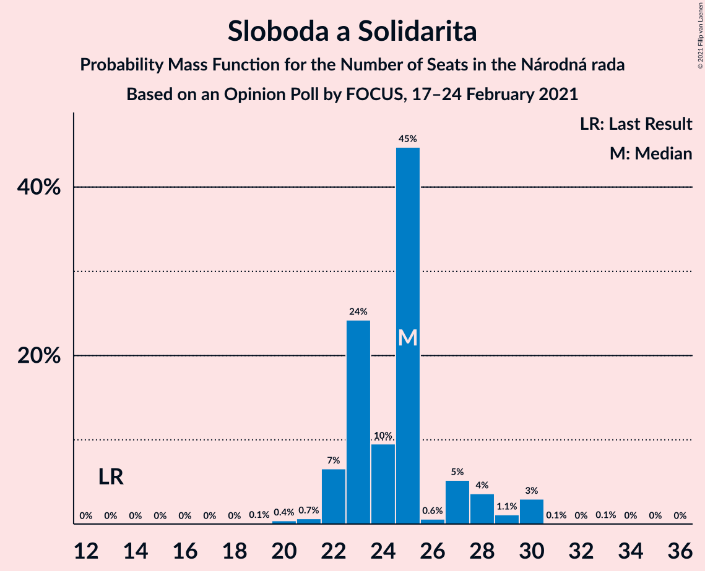

| Number of Seats | Probability | Accumulated | Special Marks |
|:---------------:|:-----------:|:-----------:|:-------------:|
| 13 | 0% | 100% | Last Result |
| 14 | 0% | 100% |  |
| 15 | 0% | 100% |  |
| 16 | 0% | 100% |  |
| 17 | 0% | 100% |  |
| 18 | 0% | 100% |  |
| 19 | 0.1% | 100% |  |
| 20 | 0.4% | 99.9% |  |
| 21 | 0.7% | 99.5% |  |
| 22 | 7% | 98.8% |  |
| 23 | 24% | 92% |  |
| 24 | 10% | 68% |  |
| 25 | 45% | 59% | Median |
| 26 | 0.6% | 14% |  |
| 27 | 5% | 13% |  |
| 28 | 4% | 8% |  |
| 29 | 1.1% | 4% |  |
| 30 | 3% | 3% |  |
| 31 | 0.1% | 0.2% |  |
| 32 | 0% | 0.2% |  |
| 33 | 0.1% | 0.2% |  |
| 34 | 0% | 0.1% |  |
| 35 | 0% | 0% |  |

### OBYČAJNÍ ĽUDIA a nezávislé osobnosti

*For a full overview of the results for this party, see the [OBYČAJNÍ ĽUDIA a nezávislé osobnosti](party-obyčajníľudiaanezávisléosobnosti.html) page.*

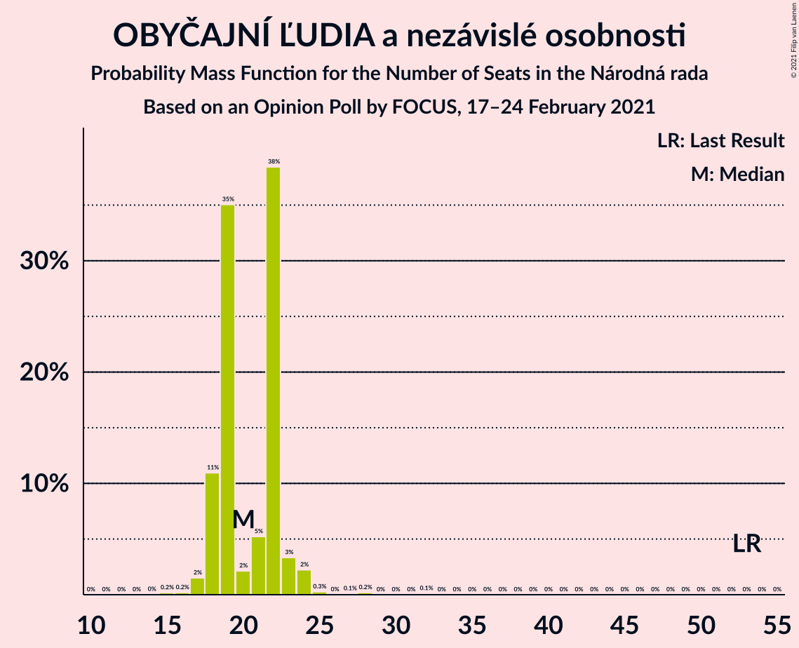

| Number of Seats | Probability | Accumulated | Special Marks |
|:---------------:|:-----------:|:-----------:|:-------------:|
| 15 | 0.2% | 100% |  |
| 16 | 0.2% | 99.8% |  |
| 17 | 2% | 99.6% |  |
| 18 | 11% | 98% |  |
| 19 | 35% | 87% |  |
| 20 | 2% | 52% | Median |
| 21 | 5% | 50% |  |
| 22 | 38% | 45% |  |
| 23 | 3% | 6% |  |
| 24 | 2% | 3% |  |
| 25 | 0.3% | 0.7% |  |
| 26 | 0% | 0.4% |  |
| 27 | 0.1% | 0.4% |  |
| 28 | 0.2% | 0.3% |  |
| 29 | 0% | 0.1% |  |
| 30 | 0% | 0.1% |  |
| 31 | 0% | 0.1% |  |
| 32 | 0.1% | 0.1% |  |
| 33 | 0% | 0% |  |
| 34 | 0% | 0% |  |
| 35 | 0% | 0% |  |
| 36 | 0% | 0% |  |
| 37 | 0% | 0% |  |
| 38 | 0% | 0% |  |
| 39 | 0% | 0% |  |
| 40 | 0% | 0% |  |
| 41 | 0% | 0% |  |
| 42 | 0% | 0% |  |
| 43 | 0% | 0% |  |
| 44 | 0% | 0% |  |
| 45 | 0% | 0% |  |
| 46 | 0% | 0% |  |
| 47 | 0% | 0% |  |
| 48 | 0% | 0% |  |
| 49 | 0% | 0% |  |
| 50 | 0% | 0% |  |
| 51 | 0% | 0% |  |
| 52 | 0% | 0% |  |
| 53 | 0% | 0% | Last Result |

### SMER–sociálna demokracia

*For a full overview of the results for this party, see the [SMER–sociálna demokracia](party-smer–sociálnademokracia.html) page.*

| Number of Seats | Probability | Accumulated | Special Marks |
|:---------------:|:-----------:|:-----------:|:-------------:|
| 13 | 0.1% | 100% |  |
| 14 | 0.1% | 99.9% |  |
| 15 | 6% | 99.8% |  |
| 16 | 22% | 94% |  |
| 17 | 1.2% | 73% |  |
| 18 | 46% | 71% | Median |
| 19 | 14% | 25% |  |
| 20 | 1.3% | 11% |  |
| 21 | 0.8% | 10% |  |
| 22 | 9% | 9% |  |
| 23 | 0.1% | 0.3% |  |
| 24 | 0.1% | 0.2% |  |
| 25 | 0.1% | 0.1% |  |
| 26 | 0% | 0% |  |
| 27 | 0% | 0% |  |
| 28 | 0% | 0% |  |
| 29 | 0% | 0% |  |
| 30 | 0% | 0% |  |
| 31 | 0% | 0% |  |
| 32 | 0% | 0% |  |
| 33 | 0% | 0% |  |
| 34 | 0% | 0% |  |
| 35 | 0% | 0% |  |
| 36 | 0% | 0% |  |
| 37 | 0% | 0% |  |
| 38 | 0% | 0% | Last Result |

### Progresívne Slovensko

*For a full overview of the results for this party, see the [Progresívne Slovensko](party-progresívneslovensko.html) page.*

| Number of Seats | Probability | Accumulated | Special Marks |
|:---------------:|:-----------:|:-----------:|:-------------:|
| 0 | 0.6% | 100% | Last Result |
| 1 | 0% | 99.4% |  |
| 2 | 0% | 99.4% |  |
| 3 | 0% | 99.4% |  |
| 4 | 0% | 99.4% |  |
| 5 | 0% | 99.4% |  |
| 6 | 0% | 99.4% |  |
| 7 | 0% | 99.4% |  |
| 8 | 0% | 99.4% |  |
| 9 | 0% | 99.4% |  |
| 10 | 10% | 99.4% |  |
| 11 | 3% | 89% |  |
| 12 | 13% | 86% |  |
| 13 | 42% | 73% | Median |
| 14 | 3% | 31% |  |
| 15 | 1.4% | 27% |  |
| 16 | 24% | 26% |  |
| 17 | 1.2% | 1.4% |  |
| 18 | 0.1% | 0.1% |  |
| 19 | 0% | 0% |  |

### Kotleba–Ľudová strana Naše Slovensko

*For a full overview of the results for this party, see the [Kotleba–Ľudová strana Naše Slovensko](party-kotleba–ľudovástrananašeslovensko.html) page.*

| Number of Seats | Probability | Accumulated | Special Marks |
|:---------------:|:-----------:|:-----------:|:-------------:|
| 0 | 0.9% | 100% |  |
| 1 | 0% | 99.1% |  |
| 2 | 0% | 99.1% |  |
| 3 | 0% | 99.1% |  |
| 4 | 0% | 99.1% |  |
| 5 | 0% | 99.1% |  |
| 6 | 0% | 99.1% |  |
| 7 | 0% | 99.1% |  |
| 8 | 0% | 99.1% |  |
| 9 | 0.2% | 99.1% |  |
| 10 | 0.8% | 99.0% |  |
| 11 | 7% | 98% |  |
| 12 | 6% | 91% |  |
| 13 | 68% | 85% | Median |
| 14 | 12% | 17% |  |
| 15 | 0.8% | 5% |  |
| 16 | 3% | 4% |  |
| 17 | 0.4% | 0.5% | Last Result |
| 18 | 0.1% | 0.1% |  |
| 19 | 0% | 0% |  |

### SME RODINA

*For a full overview of the results for this party, see the [SME RODINA](party-smerodina.html) page.*

| Number of Seats | Probability | Accumulated | Special Marks |
|:---------------:|:-----------:|:-----------:|:-------------:|
| 0 | 53% | 100% | Median |
| 1 | 0% | 47% |  |
| 2 | 0% | 47% |  |
| 3 | 0% | 47% |  |
| 4 | 0% | 47% |  |
| 5 | 0% | 47% |  |
| 6 | 0% | 47% |  |
| 7 | 0% | 47% |  |
| 8 | 0% | 47% |  |
| 9 | 0.5% | 47% |  |
| 10 | 27% | 47% |  |
| 11 | 11% | 20% |  |
| 12 | 8% | 9% |  |
| 13 | 0.6% | 0.7% |  |
| 14 | 0.1% | 0.1% |  |
| 15 | 0% | 0% |  |
| 16 | 0% | 0% |  |
| 17 | 0% | 0% | Last Result |

### Za ľudí

*For a full overview of the results for this party, see the [Za ľudí](party-zaľudí.html) page.*

| Number of Seats | Probability | Accumulated | Special Marks |
|:---------------:|:-----------:|:-----------:|:-------------:|
| 0 | 79% | 100% | Median |
| 1 | 0% | 21% |  |
| 2 | 0% | 21% |  |
| 3 | 0% | 21% |  |
| 4 | 0% | 21% |  |
| 5 | 0% | 21% |  |
| 6 | 0% | 21% |  |
| 7 | 0% | 21% |  |
| 8 | 0% | 21% |  |
| 9 | 0.8% | 21% |  |
| 10 | 2% | 21% |  |
| 11 | 8% | 19% |  |
| 12 | 11% | 12% | Last Result |
| 13 | 0.6% | 0.7% |  |
| 14 | 0% | 0.2% |  |
| 15 | 0.2% | 0.2% |  |
| 16 | 0% | 0% |  |

### Kresťanskodemokratické hnutie

*For a full overview of the results for this party, see the [Kresťanskodemokratické hnutie](party-kresťanskodemokratickéhnutie.html) page.*

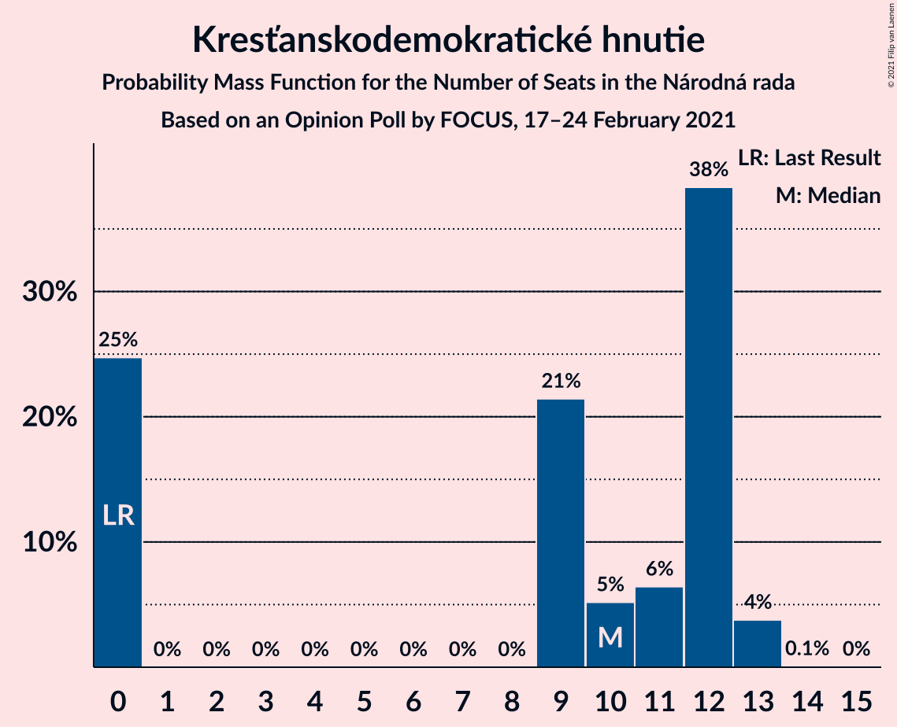

| Number of Seats | Probability | Accumulated | Special Marks |
|:---------------:|:-----------:|:-----------:|:-------------:|
| 0 | 25% | 100% | Last Result |
| 1 | 0% | 75% |  |
| 2 | 0% | 75% |  |
| 3 | 0% | 75% |  |
| 4 | 0% | 75% |  |
| 5 | 0% | 75% |  |
| 6 | 0% | 75% |  |
| 7 | 0% | 75% |  |
| 8 | 0% | 75% |  |
| 9 | 21% | 75% |  |
| 10 | 5% | 54% | Median |
| 11 | 6% | 49% |  |
| 12 | 38% | 42% |  |
| 13 | 4% | 4% |  |
| 14 | 0.1% | 0.1% |  |
| 15 | 0% | 0% |  |

### Strana maďarskej koalície–Magyar Koalíció Pártja

*For a full overview of the results for this party, see the [Strana maďarskej koalície–Magyar Koalíció Pártja](party-stranamaďarskejkoalície–magyarkoalíciópártja.html) page.*

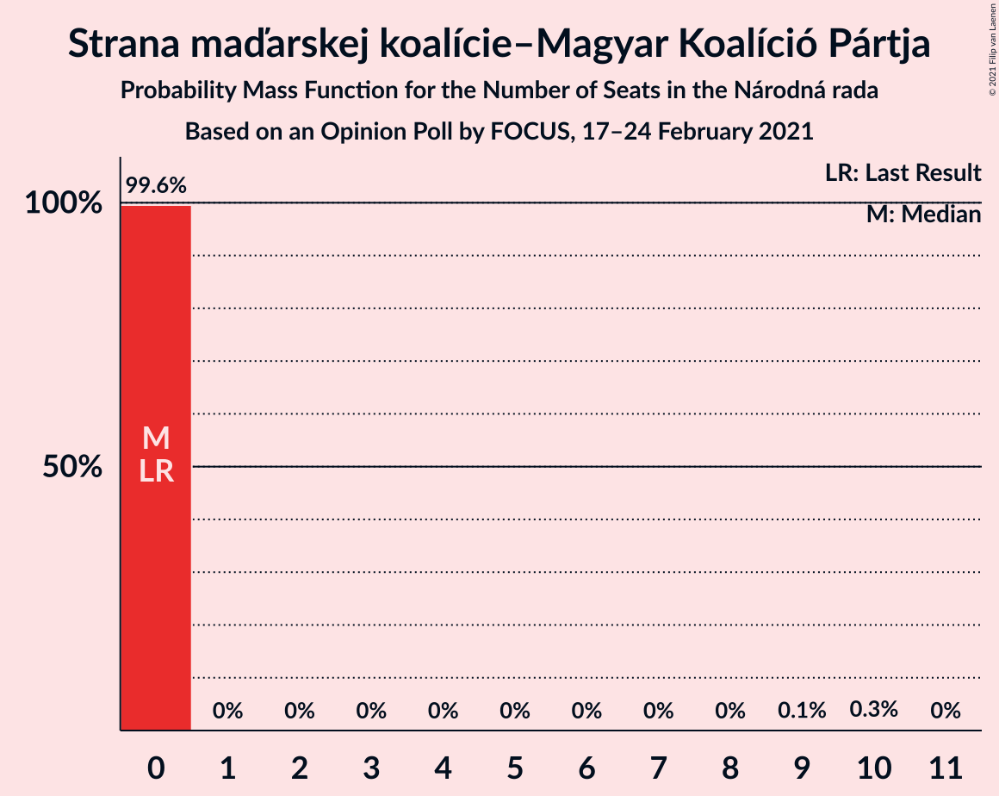

| Number of Seats | Probability | Accumulated | Special Marks |
|:---------------:|:-----------:|:-----------:|:-------------:|
| 0 | 99.6% | 100% | Last Result, Median |
| 1 | 0% | 0.4% |  |
| 2 | 0% | 0.4% |  |
| 3 | 0% | 0.4% |  |
| 4 | 0% | 0.4% |  |
| 5 | 0% | 0.4% |  |
| 6 | 0% | 0.4% |  |
| 7 | 0% | 0.4% |  |
| 8 | 0% | 0.4% |  |
| 9 | 0.1% | 0.4% |  |
| 10 | 0.3% | 0.3% |  |
| 11 | 0% | 0% |  |

### Slovenská národná strana

*For a full overview of the results for this party, see the [Slovenská národná strana](party-slovenskánárodnástrana.html) page.*

| Number of Seats | Probability | Accumulated | Special Marks |
|:---------------:|:-----------:|:-----------:|:-------------:|
| 0 | 100% | 100% | Last Result, Median |

### VLASŤ

*For a full overview of the results for this party, see the [VLASŤ](party-vlasť.html) page.*

| Number of Seats | Probability | Accumulated | Special Marks |
|:---------------:|:-----------:|:-----------:|:-------------:|
| 0 | 100% | 100% | Last Result, Median |

### MOST–HÍD

*For a full overview of the results for this party, see the [MOST–HÍD](party-most–híd.html) page.*

| Number of Seats | Probability | Accumulated | Special Marks |
|:---------------:|:-----------:|:-----------:|:-------------:|
| 0 | 100% | 100% | Last Result, Median |

### Dobrá voľba

*For a full overview of the results for this party, see the [Dobrá voľba](party-dobrávoľba.html) page.*

| Number of Seats | Probability | Accumulated | Special Marks |
|:---------------:|:-----------:|:-----------:|:-------------:|
| 0 | 100% | 100% | Last Result, Median |

### SPOLU–Občianska Demokracia

*For a full overview of the results for this party, see the [SPOLU–Občianska Demokracia](party-spolu–občianskademokracia.html) page.*

| Number of Seats | Probability | Accumulated | Special Marks |
|:---------------:|:-----------:|:-----------:|:-------------:|
| 0 | 100% | 100% | Last Result, Median |

## Coalitions

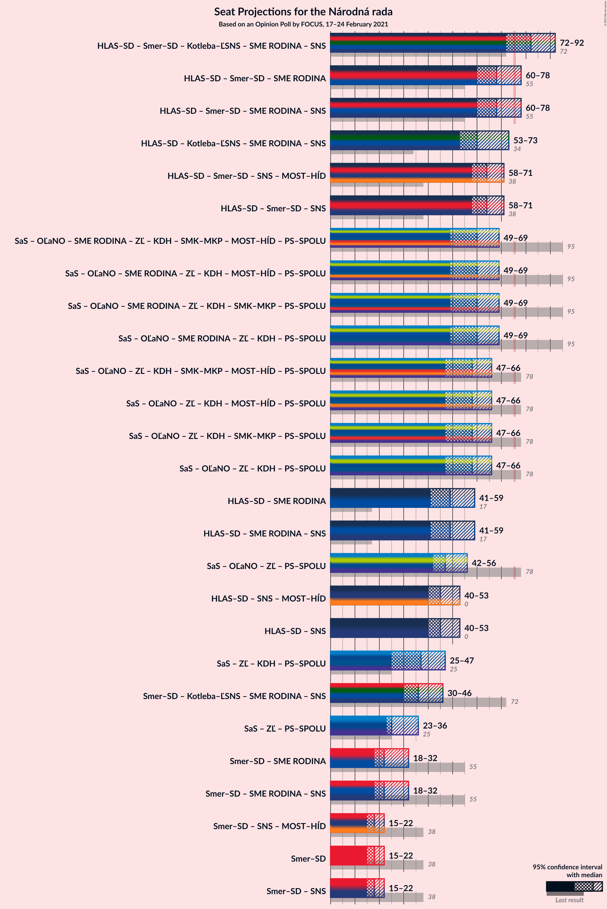

### Confidence Intervals

| Coalition | Last Result | Median | Majority? | 80% Confidence Interval | 90% Confidence Interval | 95% Confidence Interval | 99% Confidence Interval |
|:---------:|:-----------:|:------:|:---------:|:-----------------------:|:-----------------------:|:-----------------------:|:-----------------------:|
| HLAS–sociálna demokracia – SMER–sociálna demokracia – Kotleba–Ľudová strana Naše Slovensko – SME RODINA – Slovenská národná strana | 72 | 82 | 93% | 78–86 | 72–87 | 72–92 | 72–92 |
| HLAS–sociálna demokracia – SMER–sociálna demokracia – SME RODINA | 55 | 68 | 5% | 65–74 | 60–76 | 60–78 | 58–79 |
| HLAS–sociálna demokracia – SMER–sociálna demokracia – SME RODINA – Slovenská národná strana | 55 | 68 | 5% | 65–74 | 60–76 | 60–78 | 58–80 |
| HLAS–sociálna demokracia – Kotleba–Ľudová strana Naše Slovensko – SME RODINA – Slovenská národná strana | 34 | 60 | 0.1% | 60–67 | 55–69 | 53–73 | 53–74 |
| HLAS–sociálna demokracia – SMER–sociálna demokracia – Slovenská národná strana – MOST–HÍD | 38 | 64 | 0.2% | 60–67 | 58–68 | 58–71 | 54–71 |
| HLAS–sociálna demokracia – SMER–sociálna demokracia – Slovenská národná strana | 38 | 64 | 0.2% | 60–67 | 58–68 | 58–71 | 54–71 |
| HLAS–sociálna demokracia – SME RODINA | 17 | 49 | 0% | 46–55 | 41–57 | 41–59 | 41–62 |
| HLAS–sociálna demokracia – SME RODINA – Slovenská národná strana | 17 | 49 | 0% | 46–55 | 41–57 | 41–59 | 41–62 |
| HLAS–sociálna demokracia – Slovenská národná strana – MOST–HÍD | 0 | 45 | 0% | 41–47 | 40–48 | 40–53 | 38–53 |
| HLAS–sociálna demokracia – Slovenská národná strana | 0 | 45 | 0% | 41–47 | 40–48 | 40–53 | 38–53 |
| SMER–sociálna demokracia – Kotleba–Ľudová strana Naše Slovensko – SME RODINA – Slovenská národná strana | 72 | 36 | 0% | 31–43 | 31–46 | 30–46 | 28–47 |
| SMER–sociálna demokracia – SME RODINA | 55 | 22 | 0% | 18–31 | 18–32 | 18–32 | 16–33 |
| SMER–sociálna demokracia – SME RODINA – Slovenská národná strana | 55 | 22 | 0% | 18–31 | 18–32 | 18–32 | 16–33 |
| SMER–sociálna demokracia – Slovenská národná strana – MOST–HÍD | 38 | 18 | 0% | 16–21 | 15–22 | 15–22 | 15–22 |
| SMER–sociálna demokracia | 38 | 18 | 0% | 16–21 | 15–22 | 15–22 | 15–22 |
| SMER–sociálna demokracia – Slovenská národná strana | 38 | 18 | 0% | 16–21 | 15–22 | 15–22 | 15–22 |

### HLAS–sociálna demokracia – SMER–sociálna demokracia – Kotleba–Ľudová strana Naše Slovensko – SME RODINA – Slovenská národná strana

| Number of Seats | Probability | Accumulated | Special Marks |
|:---------------:|:-----------:|:-----------:|:-------------:|
| 66 | 0.1% | 100% |  |
| 67 | 0% | 99.9% |  |
| 68 | 0% | 99.8% |  |
| 69 | 0.2% | 99.8% |  |
| 70 | 0.1% | 99.6% |  |
| 71 | 0% | 99.6% |  |
| 72 | 5% | 99.5% | Last Result |
| 73 | 1.0% | 95% |  |
| 74 | 0.2% | 94% |  |
| 75 | 0.4% | 93% |  |
| 76 | 0.8% | 93% | Median, Majority |
| 77 | 0.5% | 92% |  |
| 78 | 39% | 92% |  |
| 79 | 0.5% | 53% |  |
| 80 | 0.2% | 53% |  |
| 81 | 0.1% | 52% |  |
| 82 | 9% | 52% |  |
| 83 | 24% | 43% |  |
| 84 | 0.4% | 19% |  |
| 85 | 6% | 19% |  |
| 86 | 5% | 13% |  |
| 87 | 3% | 8% |  |
| 88 | 0.8% | 5% |  |
| 89 | 0.2% | 4% |  |
| 90 | 0% | 4% |  |
| 91 | 0.4% | 4% |  |
| 92 | 3% | 4% |  |
| 93 | 0.1% | 0.5% |  |
| 94 | 0.1% | 0.3% |  |
| 95 | 0% | 0.2% |  |
| 96 | 0.1% | 0.2% |  |
| 97 | 0% | 0.1% |  |
| 98 | 0% | 0.1% |  |
| 99 | 0% | 0.1% |  |
| 100 | 0.1% | 0.1% |  |
| 101 | 0% | 0% |  |

### HLAS–sociálna demokracia – SMER–sociálna demokracia – SME RODINA

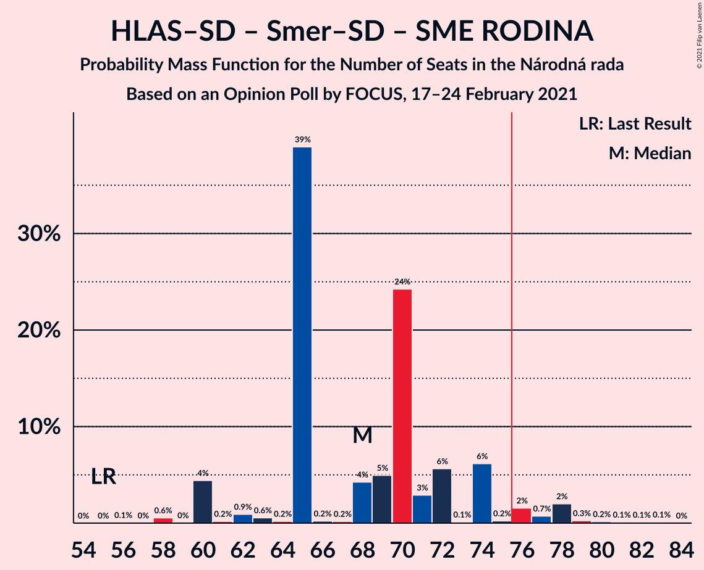

| Number of Seats | Probability | Accumulated | Special Marks |
|:---------------:|:-----------:|:-----------:|:-------------:|
| 55 | 0% | 100% | Last Result |
| 56 | 0.1% | 100% |  |
| 57 | 0% | 99.9% |  |
| 58 | 0.6% | 99.9% |  |
| 59 | 0% | 99.3% |  |
| 60 | 4% | 99.3% |  |
| 61 | 0.2% | 95% |  |
| 62 | 0.9% | 95% |  |
| 63 | 0.6% | 94% | Median |
| 64 | 0.2% | 93% |  |
| 65 | 39% | 93% |  |
| 66 | 0.2% | 54% |  |
| 67 | 0.2% | 54% |  |
| 68 | 4% | 54% |  |
| 69 | 5% | 49% |  |
| 70 | 24% | 44% |  |
| 71 | 3% | 20% |  |
| 72 | 6% | 17% |  |
| 73 | 0.1% | 12% |  |
| 74 | 6% | 11% |  |
| 75 | 0.2% | 5% |  |
| 76 | 2% | 5% | Majority |
| 77 | 0.7% | 3% |  |
| 78 | 2% | 3% |  |
| 79 | 0.3% | 0.8% |  |
| 80 | 0.2% | 0.5% |  |
| 81 | 0.1% | 0.3% |  |
| 82 | 0.1% | 0.2% |  |
| 83 | 0.1% | 0.1% |  |
| 84 | 0% | 0% |  |

### HLAS–sociálna demokracia – SMER–sociálna demokracia – SME RODINA – Slovenská národná strana

| Number of Seats | Probability | Accumulated | Special Marks |
|:---------------:|:-----------:|:-----------:|:-------------:|
| 55 | 0% | 100% | Last Result |
| 56 | 0.1% | 100% |  |
| 57 | 0% | 99.9% |  |
| 58 | 0.6% | 99.9% |  |
| 59 | 0% | 99.3% |  |
| 60 | 4% | 99.3% |  |
| 61 | 0.2% | 95% |  |
| 62 | 0.9% | 95% |  |
| 63 | 0.6% | 94% | Median |
| 64 | 0.2% | 93% |  |
| 65 | 39% | 93% |  |
| 66 | 0.2% | 54% |  |
| 67 | 0.2% | 54% |  |
| 68 | 4% | 54% |  |
| 69 | 5% | 49% |  |
| 70 | 24% | 44% |  |
| 71 | 3% | 20% |  |
| 72 | 6% | 17% |  |
| 73 | 0.1% | 12% |  |
| 74 | 6% | 11% |  |
| 75 | 0.2% | 5% |  |
| 76 | 2% | 5% | Majority |
| 77 | 0.7% | 4% |  |
| 78 | 2% | 3% |  |
| 79 | 0.3% | 0.8% |  |
| 80 | 0.2% | 0.5% |  |
| 81 | 0.1% | 0.3% |  |
| 82 | 0.1% | 0.2% |  |
| 83 | 0.1% | 0.1% |  |
| 84 | 0% | 0% |  |

### HLAS–sociálna demokracia – Kotleba–Ľudová strana Naše Slovensko – SME RODINA – Slovenská národná strana

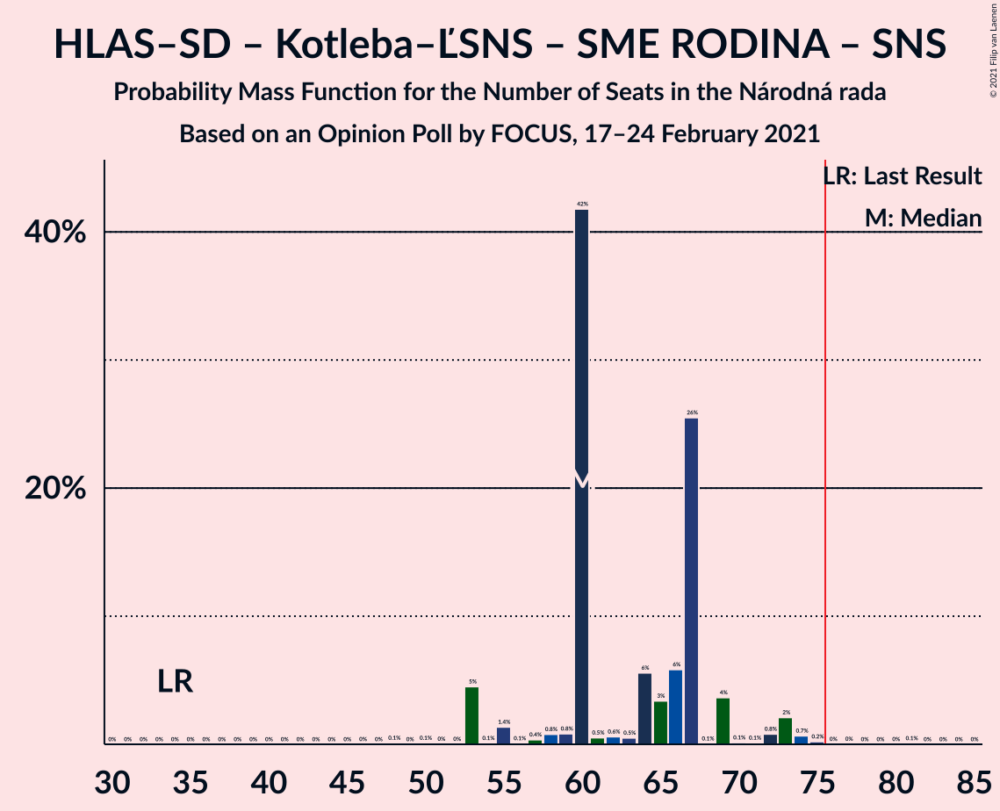

| Number of Seats | Probability | Accumulated | Special Marks |
|:---------------:|:-----------:|:-----------:|:-------------:|
| 34 | 0% | 100% | Last Result |
| 35 | 0% | 100% |  |
| 36 | 0% | 100% |  |
| 37 | 0% | 100% |  |
| 38 | 0% | 100% |  |
| 39 | 0% | 100% |  |
| 40 | 0% | 100% |  |
| 41 | 0% | 100% |  |
| 42 | 0% | 100% |  |
| 43 | 0% | 100% |  |
| 44 | 0% | 100% |  |
| 45 | 0% | 100% |  |
| 46 | 0% | 100% |  |
| 47 | 0% | 100% |  |
| 48 | 0.1% | 100% |  |
| 49 | 0% | 99.9% |  |
| 50 | 0.1% | 99.9% |  |
| 51 | 0% | 99.8% |  |
| 52 | 0% | 99.7% |  |
| 53 | 5% | 99.7% |  |
| 54 | 0.1% | 95% |  |
| 55 | 1.4% | 95% |  |
| 56 | 0.1% | 94% |  |
| 57 | 0.4% | 94% |  |
| 58 | 0.8% | 93% | Median |
| 59 | 0.8% | 93% |  |
| 60 | 42% | 92% |  |
| 61 | 0.5% | 50% |  |
| 62 | 0.6% | 49% |  |
| 63 | 0.5% | 49% |  |
| 64 | 6% | 48% |  |
| 65 | 3% | 43% |  |
| 66 | 6% | 39% |  |
| 67 | 26% | 33% |  |
| 68 | 0.1% | 8% |  |
| 69 | 4% | 8% |  |
| 70 | 0.1% | 4% |  |
| 71 | 0.1% | 4% |  |
| 72 | 0.8% | 4% |  |
| 73 | 2% | 3% |  |
| 74 | 0.7% | 1.0% |  |
| 75 | 0.2% | 0.4% |  |
| 76 | 0% | 0.1% | Majority |
| 77 | 0% | 0.1% |  |
| 78 | 0% | 0.1% |  |
| 79 | 0% | 0.1% |  |
| 80 | 0% | 0.1% |  |
| 81 | 0.1% | 0.1% |  |
| 82 | 0% | 0% |  |

### HLAS–sociálna demokracia – SMER–sociálna demokracia – Slovenská národná strana – MOST–HÍD

| Number of Seats | Probability | Accumulated | Special Marks |
|:---------------:|:-----------:|:-----------:|:-------------:|
| 38 | 0% | 100% | Last Result |
| 39 | 0% | 100% |  |
| 40 | 0% | 100% |  |
| 41 | 0% | 100% |  |
| 42 | 0% | 100% |  |
| 43 | 0% | 100% |  |
| 44 | 0% | 100% |  |
| 45 | 0% | 100% |  |
| 46 | 0% | 100% |  |
| 47 | 0% | 100% |  |
| 48 | 0% | 100% |  |
| 49 | 0% | 100% |  |
| 50 | 0% | 100% |  |
| 51 | 0% | 100% |  |
| 52 | 0% | 100% |  |
| 53 | 0.1% | 100% |  |
| 54 | 0.4% | 99.8% |  |
| 55 | 0.3% | 99.4% |  |
| 56 | 0.1% | 99.2% |  |
| 57 | 0.1% | 99.0% |  |
| 58 | 5% | 99.0% |  |
| 59 | 4% | 94% |  |
| 60 | 25% | 90% |  |
| 61 | 0.5% | 65% |  |
| 62 | 12% | 64% |  |
| 63 | 1.2% | 52% | Median |
| 64 | 1.3% | 51% |  |
| 65 | 39% | 49% |  |
| 66 | 0.2% | 10% |  |
| 67 | 2% | 10% |  |
| 68 | 4% | 8% |  |
| 69 | 0.5% | 4% |  |
| 70 | 0.3% | 4% |  |
| 71 | 3% | 3% |  |
| 72 | 0.1% | 0.4% |  |
| 73 | 0% | 0.2% |  |
| 74 | 0% | 0.2% |  |
| 75 | 0% | 0.2% |  |
| 76 | 0.1% | 0.2% | Majority |
| 77 | 0.1% | 0.1% |  |
| 78 | 0% | 0% |  |

### HLAS–sociálna demokracia – SMER–sociálna demokracia – Slovenská národná strana

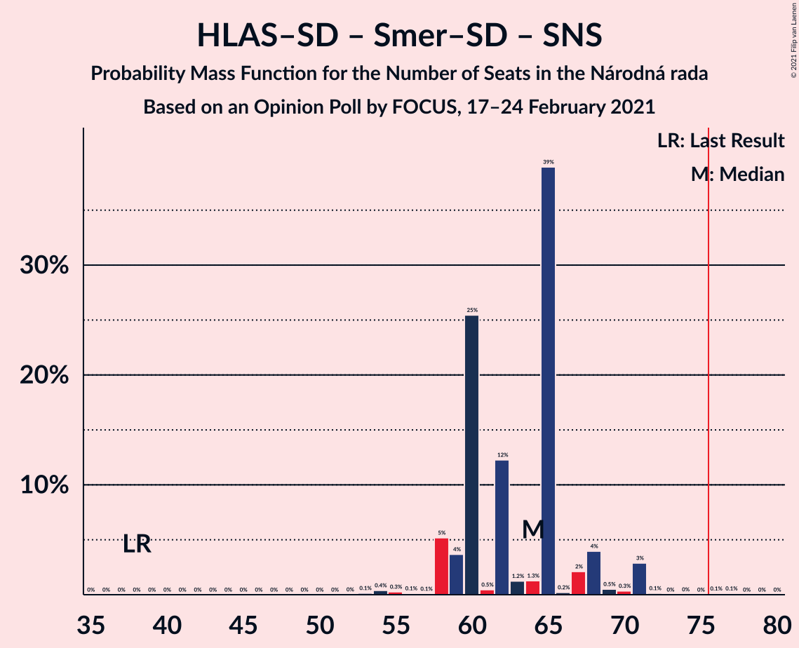

| Number of Seats | Probability | Accumulated | Special Marks |
|:---------------:|:-----------:|:-----------:|:-------------:|
| 38 | 0% | 100% | Last Result |
| 39 | 0% | 100% |  |
| 40 | 0% | 100% |  |
| 41 | 0% | 100% |  |
| 42 | 0% | 100% |  |
| 43 | 0% | 100% |  |
| 44 | 0% | 100% |  |
| 45 | 0% | 100% |  |
| 46 | 0% | 100% |  |
| 47 | 0% | 100% |  |
| 48 | 0% | 100% |  |
| 49 | 0% | 100% |  |
| 50 | 0% | 100% |  |
| 51 | 0% | 100% |  |
| 52 | 0% | 100% |  |
| 53 | 0.1% | 100% |  |
| 54 | 0.4% | 99.8% |  |
| 55 | 0.3% | 99.4% |  |
| 56 | 0.1% | 99.2% |  |
| 57 | 0.1% | 99.0% |  |
| 58 | 5% | 99.0% |  |
| 59 | 4% | 94% |  |
| 60 | 25% | 90% |  |
| 61 | 0.5% | 65% |  |
| 62 | 12% | 64% |  |
| 63 | 1.2% | 52% | Median |
| 64 | 1.3% | 51% |  |
| 65 | 39% | 49% |  |
| 66 | 0.2% | 10% |  |
| 67 | 2% | 10% |  |
| 68 | 4% | 8% |  |
| 69 | 0.5% | 4% |  |
| 70 | 0.3% | 4% |  |
| 71 | 3% | 3% |  |
| 72 | 0.1% | 0.4% |  |
| 73 | 0% | 0.2% |  |
| 74 | 0% | 0.2% |  |
| 75 | 0% | 0.2% |  |
| 76 | 0.1% | 0.2% | Majority |
| 77 | 0.1% | 0.1% |  |
| 78 | 0% | 0% |  |

### HLAS–sociálna demokracia – SME RODINA

| Number of Seats | Probability | Accumulated | Special Marks |
|:---------------:|:-----------:|:-----------:|:-------------:|
| 17 | 0% | 100% | Last Result |
| 18 | 0% | 100% |  |
| 19 | 0% | 100% |  |
| 20 | 0% | 100% |  |
| 21 | 0% | 100% |  |
| 22 | 0% | 100% |  |
| 23 | 0% | 100% |  |
| 24 | 0% | 100% |  |
| 25 | 0% | 100% |  |
| 26 | 0% | 100% |  |
| 27 | 0% | 100% |  |
| 28 | 0% | 100% |  |
| 29 | 0% | 100% |  |
| 30 | 0% | 100% |  |
| 31 | 0% | 100% |  |
| 32 | 0% | 100% |  |
| 33 | 0% | 100% |  |
| 34 | 0% | 100% |  |
| 35 | 0% | 100% |  |
| 36 | 0% | 100% |  |
| 37 | 0% | 100% |  |
| 38 | 0% | 100% |  |
| 39 | 0.1% | 100% |  |
| 40 | 0% | 99.8% |  |
| 41 | 5% | 99.8% |  |
| 42 | 0.1% | 95% |  |
| 43 | 0.2% | 95% |  |
| 44 | 1.2% | 95% |  |
| 45 | 0.2% | 93% | Median |
| 46 | 4% | 93% |  |
| 47 | 38% | 90% |  |
| 48 | 0.4% | 51% |  |
| 49 | 1.1% | 51% |  |
| 50 | 6% | 50% |  |
| 51 | 0% | 44% |  |
| 52 | 3% | 44% |  |
| 53 | 4% | 41% |  |
| 54 | 25% | 37% |  |
| 55 | 6% | 12% |  |
| 56 | 0.3% | 6% |  |
| 57 | 2% | 5% |  |
| 58 | 0.8% | 4% |  |
| 59 | 2% | 3% |  |
| 60 | 0.2% | 0.8% |  |
| 61 | 0% | 0.5% |  |
| 62 | 0.4% | 0.5% |  |
| 63 | 0.1% | 0.1% |  |
| 64 | 0% | 0% |  |

### HLAS–sociálna demokracia – SME RODINA – Slovenská národná strana

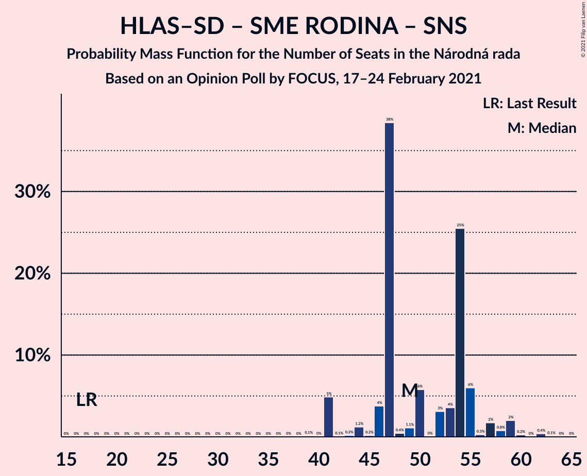

| Number of Seats | Probability | Accumulated | Special Marks |
|:---------------:|:-----------:|:-----------:|:-------------:|
| 17 | 0% | 100% | Last Result |
| 18 | 0% | 100% |  |
| 19 | 0% | 100% |  |
| 20 | 0% | 100% |  |
| 21 | 0% | 100% |  |
| 22 | 0% | 100% |  |
| 23 | 0% | 100% |  |
| 24 | 0% | 100% |  |
| 25 | 0% | 100% |  |
| 26 | 0% | 100% |  |
| 27 | 0% | 100% |  |
| 28 | 0% | 100% |  |
| 29 | 0% | 100% |  |
| 30 | 0% | 100% |  |
| 31 | 0% | 100% |  |
| 32 | 0% | 100% |  |
| 33 | 0% | 100% |  |
| 34 | 0% | 100% |  |
| 35 | 0% | 100% |  |
| 36 | 0% | 100% |  |
| 37 | 0% | 100% |  |
| 38 | 0% | 100% |  |
| 39 | 0.1% | 100% |  |
| 40 | 0% | 99.8% |  |
| 41 | 5% | 99.8% |  |
| 42 | 0.1% | 95% |  |
| 43 | 0.2% | 95% |  |
| 44 | 1.2% | 95% |  |
| 45 | 0.2% | 93% | Median |
| 46 | 4% | 93% |  |
| 47 | 38% | 90% |  |
| 48 | 0.4% | 51% |  |
| 49 | 1.1% | 51% |  |
| 50 | 6% | 50% |  |
| 51 | 0% | 44% |  |
| 52 | 3% | 44% |  |
| 53 | 4% | 41% |  |
| 54 | 25% | 37% |  |
| 55 | 6% | 12% |  |
| 56 | 0.3% | 6% |  |
| 57 | 2% | 5% |  |
| 58 | 0.8% | 4% |  |
| 59 | 2% | 3% |  |
| 60 | 0.2% | 0.8% |  |
| 61 | 0% | 0.5% |  |
| 62 | 0.4% | 0.5% |  |
| 63 | 0.1% | 0.1% |  |
| 64 | 0% | 0% |  |

### HLAS–sociálna demokracia – Slovenská národná strana – MOST–HÍD

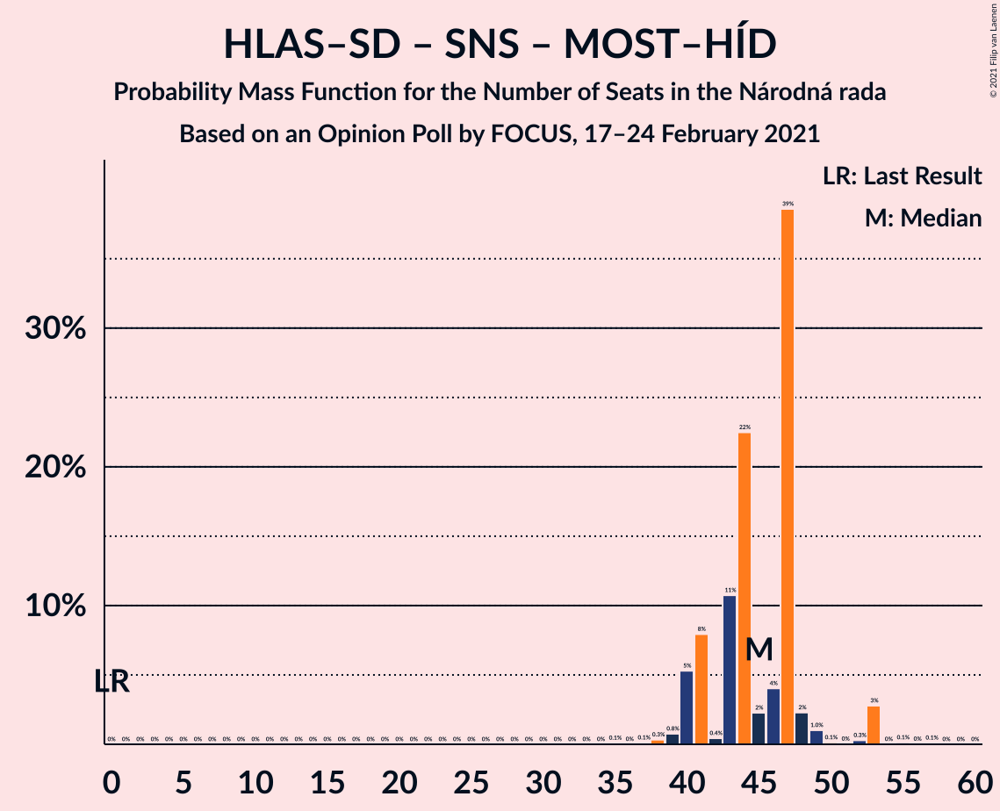

| Number of Seats | Probability | Accumulated | Special Marks |
|:---------------:|:-----------:|:-----------:|:-------------:|
| 0 | 0% | 100% | Last Result |
| 1 | 0% | 100% |  |
| 2 | 0% | 100% |  |
| 3 | 0% | 100% |  |
| 4 | 0% | 100% |  |
| 5 | 0% | 100% |  |
| 6 | 0% | 100% |  |
| 7 | 0% | 100% |  |
| 8 | 0% | 100% |  |
| 9 | 0% | 100% |  |
| 10 | 0% | 100% |  |
| 11 | 0% | 100% |  |
| 12 | 0% | 100% |  |
| 13 | 0% | 100% |  |
| 14 | 0% | 100% |  |
| 15 | 0% | 100% |  |
| 16 | 0% | 100% |  |
| 17 | 0% | 100% |  |
| 18 | 0% | 100% |  |
| 19 | 0% | 100% |  |
| 20 | 0% | 100% |  |
| 21 | 0% | 100% |  |
| 22 | 0% | 100% |  |
| 23 | 0% | 100% |  |
| 24 | 0% | 100% |  |
| 25 | 0% | 100% |  |
| 26 | 0% | 100% |  |
| 27 | 0% | 100% |  |
| 28 | 0% | 100% |  |
| 29 | 0% | 100% |  |
| 30 | 0% | 100% |  |
| 31 | 0% | 100% |  |
| 32 | 0% | 100% |  |
| 33 | 0% | 100% |  |
| 34 | 0% | 100% |  |
| 35 | 0.1% | 100% |  |
| 36 | 0% | 99.9% |  |
| 37 | 0.1% | 99.9% |  |
| 38 | 0.3% | 99.8% |  |
| 39 | 0.8% | 99.4% |  |
| 40 | 5% | 98.7% |  |
| 41 | 8% | 93% |  |
| 42 | 0.4% | 85% |  |
| 43 | 11% | 85% |  |
| 44 | 22% | 74% |  |
| 45 | 2% | 52% | Median |
| 46 | 4% | 49% |  |
| 47 | 39% | 45% |  |
| 48 | 2% | 7% |  |
| 49 | 1.0% | 5% |  |
| 50 | 0.1% | 4% |  |
| 51 | 0% | 3% |  |
| 52 | 0.3% | 3% |  |
| 53 | 3% | 3% |  |
| 54 | 0% | 0.3% |  |
| 55 | 0.1% | 0.3% |  |
| 56 | 0% | 0.1% |  |
| 57 | 0.1% | 0.1% |  |
| 58 | 0% | 0% |  |

### HLAS–sociálna demokracia – Slovenská národná strana

| Number of Seats | Probability | Accumulated | Special Marks |
|:---------------:|:-----------:|:-----------:|:-------------:|
| 0 | 0% | 100% | Last Result |
| 1 | 0% | 100% |  |
| 2 | 0% | 100% |  |
| 3 | 0% | 100% |  |
| 4 | 0% | 100% |  |
| 5 | 0% | 100% |  |
| 6 | 0% | 100% |  |
| 7 | 0% | 100% |  |
| 8 | 0% | 100% |  |
| 9 | 0% | 100% |  |
| 10 | 0% | 100% |  |
| 11 | 0% | 100% |  |
| 12 | 0% | 100% |  |
| 13 | 0% | 100% |  |
| 14 | 0% | 100% |  |
| 15 | 0% | 100% |  |
| 16 | 0% | 100% |  |
| 17 | 0% | 100% |  |
| 18 | 0% | 100% |  |
| 19 | 0% | 100% |  |
| 20 | 0% | 100% |  |
| 21 | 0% | 100% |  |
| 22 | 0% | 100% |  |
| 23 | 0% | 100% |  |
| 24 | 0% | 100% |  |
| 25 | 0% | 100% |  |
| 26 | 0% | 100% |  |
| 27 | 0% | 100% |  |
| 28 | 0% | 100% |  |
| 29 | 0% | 100% |  |
| 30 | 0% | 100% |  |
| 31 | 0% | 100% |  |
| 32 | 0% | 100% |  |
| 33 | 0% | 100% |  |
| 34 | 0% | 100% |  |
| 35 | 0.1% | 100% |  |
| 36 | 0% | 99.9% |  |
| 37 | 0.1% | 99.9% |  |
| 38 | 0.3% | 99.8% |  |
| 39 | 0.8% | 99.4% |  |
| 40 | 5% | 98.7% |  |
| 41 | 8% | 93% |  |
| 42 | 0.4% | 85% |  |
| 43 | 11% | 85% |  |
| 44 | 22% | 74% |  |
| 45 | 2% | 52% | Median |
| 46 | 4% | 49% |  |
| 47 | 39% | 45% |  |
| 48 | 2% | 7% |  |
| 49 | 1.0% | 5% |  |
| 50 | 0.1% | 4% |  |
| 51 | 0% | 3% |  |
| 52 | 0.3% | 3% |  |
| 53 | 3% | 3% |  |
| 54 | 0% | 0.3% |  |
| 55 | 0.1% | 0.3% |  |
| 56 | 0% | 0.1% |  |
| 57 | 0.1% | 0.1% |  |
| 58 | 0% | 0% |  |

### SMER–sociálna demokracia – Kotleba–Ľudová strana Naše Slovensko – SME RODINA – Slovenská národná strana

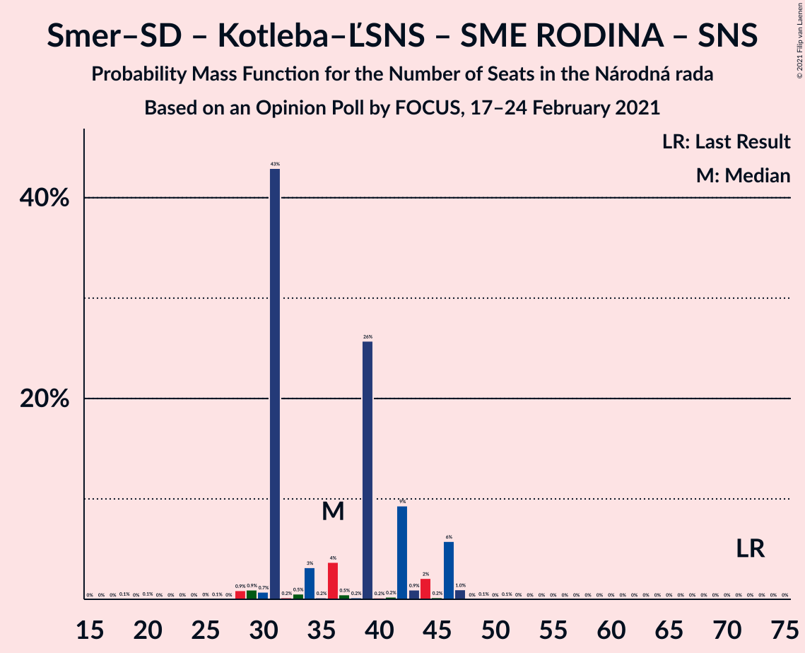

| Number of Seats | Probability | Accumulated | Special Marks |
|:---------------:|:-----------:|:-----------:|:-------------:|
| 18 | 0.1% | 100% |  |
| 19 | 0% | 99.9% |  |
| 20 | 0.1% | 99.9% |  |
| 21 | 0% | 99.8% |  |
| 22 | 0% | 99.8% |  |
| 23 | 0% | 99.8% |  |
| 24 | 0% | 99.8% |  |
| 25 | 0% | 99.8% |  |
| 26 | 0.1% | 99.7% |  |
| 27 | 0% | 99.6% |  |
| 28 | 0.9% | 99.6% |  |
| 29 | 0.9% | 98.7% |  |
| 30 | 0.7% | 98% |  |
| 31 | 43% | 97% | Median |
| 32 | 0.2% | 54% |  |
| 33 | 0.5% | 54% |  |
| 34 | 3% | 53% |  |
| 35 | 0.2% | 50% |  |
| 36 | 4% | 50% |  |
| 37 | 0.5% | 46% |  |
| 38 | 0.2% | 46% |  |
| 39 | 26% | 46% |  |
| 40 | 0.2% | 20% |  |
| 41 | 0.2% | 20% |  |
| 42 | 9% | 20% |  |
| 43 | 0.9% | 10% |  |
| 44 | 2% | 9% |  |
| 45 | 0.2% | 7% |  |
| 46 | 6% | 7% |  |
| 47 | 1.0% | 1.2% |  |
| 48 | 0% | 0.2% |  |
| 49 | 0.1% | 0.2% |  |
| 50 | 0% | 0.1% |  |
| 51 | 0.1% | 0.1% |  |
| 52 | 0% | 0% |  |
| 53 | 0% | 0% |  |
| 54 | 0% | 0% |  |
| 55 | 0% | 0% |  |
| 56 | 0% | 0% |  |
| 57 | 0% | 0% |  |
| 58 | 0% | 0% |  |
| 59 | 0% | 0% |  |
| 60 | 0% | 0% |  |
| 61 | 0% | 0% |  |
| 62 | 0% | 0% |  |
| 63 | 0% | 0% |  |
| 64 | 0% | 0% |  |
| 65 | 0% | 0% |  |
| 66 | 0% | 0% |  |
| 67 | 0% | 0% |  |
| 68 | 0% | 0% |  |
| 69 | 0% | 0% |  |
| 70 | 0% | 0% |  |
| 71 | 0% | 0% |  |
| 72 | 0% | 0% | Last Result |

### SMER–sociálna demokracia – SME RODINA

| Number of Seats | Probability | Accumulated | Special Marks |
|:---------------:|:-----------:|:-----------:|:-------------:|
| 14 | 0.1% | 100% |  |
| 15 | 0.2% | 99.9% |  |
| 16 | 0.5% | 99.7% |  |
| 17 | 0.5% | 99.2% |  |
| 18 | 42% | 98.6% | Median |
| 19 | 5% | 57% |  |
| 20 | 0.5% | 52% |  |
| 21 | 0.3% | 51% |  |
| 22 | 4% | 51% |  |
| 23 | 0.1% | 47% |  |
| 24 | 0.4% | 47% |  |
| 25 | 0.2% | 47% |  |
| 26 | 26% | 47% |  |
| 27 | 0.4% | 21% |  |
| 28 | 0.4% | 20% |  |
| 29 | 4% | 20% |  |
| 30 | 3% | 16% |  |
| 31 | 7% | 14% |  |
| 32 | 6% | 6% |  |
| 33 | 0.4% | 0.6% |  |
| 34 | 0.1% | 0.2% |  |
| 35 | 0.1% | 0.1% |  |
| 36 | 0% | 0% |  |
| 37 | 0% | 0% |  |
| 38 | 0% | 0% |  |
| 39 | 0% | 0% |  |
| 40 | 0% | 0% |  |
| 41 | 0% | 0% |  |
| 42 | 0% | 0% |  |
| 43 | 0% | 0% |  |
| 44 | 0% | 0% |  |
| 45 | 0% | 0% |  |
| 46 | 0% | 0% |  |
| 47 | 0% | 0% |  |
| 48 | 0% | 0% |  |
| 49 | 0% | 0% |  |
| 50 | 0% | 0% |  |
| 51 | 0% | 0% |  |
| 52 | 0% | 0% |  |
| 53 | 0% | 0% |  |
| 54 | 0% | 0% |  |
| 55 | 0% | 0% | Last Result |

### SMER–sociálna demokracia – SME RODINA – Slovenská národná strana

| Number of Seats | Probability | Accumulated | Special Marks |
|:---------------:|:-----------:|:-----------:|:-------------:|
| 14 | 0.1% | 100% |  |
| 15 | 0.2% | 99.9% |  |
| 16 | 0.5% | 99.7% |  |
| 17 | 0.5% | 99.2% |  |
| 18 | 42% | 98.6% | Median |
| 19 | 5% | 57% |  |
| 20 | 0.5% | 52% |  |
| 21 | 0.3% | 51% |  |
| 22 | 4% | 51% |  |
| 23 | 0.1% | 47% |  |
| 24 | 0.4% | 47% |  |
| 25 | 0.2% | 47% |  |
| 26 | 26% | 47% |  |
| 27 | 0.3% | 21% |  |
| 28 | 0.4% | 20% |  |
| 29 | 4% | 20% |  |
| 30 | 3% | 16% |  |
| 31 | 7% | 14% |  |
| 32 | 6% | 7% |  |
| 33 | 0.4% | 0.6% |  |
| 34 | 0.1% | 0.2% |  |
| 35 | 0.1% | 0.1% |  |
| 36 | 0% | 0% |  |
| 37 | 0% | 0% |  |
| 38 | 0% | 0% |  |
| 39 | 0% | 0% |  |
| 40 | 0% | 0% |  |
| 41 | 0% | 0% |  |
| 42 | 0% | 0% |  |
| 43 | 0% | 0% |  |
| 44 | 0% | 0% |  |
| 45 | 0% | 0% |  |
| 46 | 0% | 0% |  |
| 47 | 0% | 0% |  |
| 48 | 0% | 0% |  |
| 49 | 0% | 0% |  |
| 50 | 0% | 0% |  |
| 51 | 0% | 0% |  |
| 52 | 0% | 0% |  |
| 53 | 0% | 0% |  |
| 54 | 0% | 0% |  |
| 55 | 0% | 0% | Last Result |

### SMER–sociálna demokracia – Slovenská národná strana – MOST–HÍD

| Number of Seats | Probability | Accumulated | Special Marks |
|:---------------:|:-----------:|:-----------:|:-------------:|
| 13 | 0.1% | 100% |  |
| 14 | 0.1% | 99.9% |  |
| 15 | 6% | 99.8% |  |
| 16 | 22% | 94% |  |
| 17 | 1.2% | 73% |  |
| 18 | 46% | 71% | Median |
| 19 | 14% | 25% |  |
| 20 | 1.3% | 11% |  |
| 21 | 0.8% | 10% |  |
| 22 | 9% | 9% |  |
| 23 | 0.1% | 0.3% |  |
| 24 | 0.1% | 0.2% |  |
| 25 | 0.1% | 0.1% |  |
| 26 | 0% | 0% |  |
| 27 | 0% | 0% |  |
| 28 | 0% | 0% |  |
| 29 | 0% | 0% |  |
| 30 | 0% | 0% |  |
| 31 | 0% | 0% |  |
| 32 | 0% | 0% |  |
| 33 | 0% | 0% |  |
| 34 | 0% | 0% |  |
| 35 | 0% | 0% |  |
| 36 | 0% | 0% |  |
| 37 | 0% | 0% |  |
| 38 | 0% | 0% | Last Result |

### SMER–sociálna demokracia

| Number of Seats | Probability | Accumulated | Special Marks |
|:---------------:|:-----------:|:-----------:|:-------------:|
| 13 | 0.1% | 100% |  |
| 14 | 0.1% | 99.9% |  |
| 15 | 6% | 99.8% |  |
| 16 | 22% | 94% |  |
| 17 | 1.2% | 73% |  |
| 18 | 46% | 71% | Median |
| 19 | 14% | 25% |  |
| 20 | 1.3% | 11% |  |
| 21 | 0.8% | 10% |  |
| 22 | 9% | 9% |  |
| 23 | 0.1% | 0.3% |  |
| 24 | 0.1% | 0.2% |  |
| 25 | 0.1% | 0.1% |  |
| 26 | 0% | 0% |  |
| 27 | 0% | 0% |  |
| 28 | 0% | 0% |  |
| 29 | 0% | 0% |  |
| 30 | 0% | 0% |  |
| 31 | 0% | 0% |  |
| 32 | 0% | 0% |  |
| 33 | 0% | 0% |  |
| 34 | 0% | 0% |  |
| 35 | 0% | 0% |  |
| 36 | 0% | 0% |  |
| 37 | 0% | 0% |  |
| 38 | 0% | 0% | Last Result |

### SMER–sociálna demokracia – Slovenská národná strana

| Number of Seats | Probability | Accumulated | Special Marks |
|:---------------:|:-----------:|:-----------:|:-------------:|
| 13 | 0.1% | 100% |  |
| 14 | 0.1% | 99.9% |  |
| 15 | 6% | 99.8% |  |
| 16 | 22% | 94% |  |
| 17 | 1.2% | 73% |  |
| 18 | 46% | 71% | Median |
| 19 | 14% | 25% |  |
| 20 | 1.3% | 11% |  |
| 21 | 0.8% | 10% |  |
| 22 | 9% | 9% |  |
| 23 | 0.1% | 0.3% |  |
| 24 | 0.1% | 0.2% |  |
| 25 | 0.1% | 0.1% |  |
| 26 | 0% | 0% |  |
| 27 | 0% | 0% |  |
| 28 | 0% | 0% |  |
| 29 | 0% | 0% |  |
| 30 | 0% | 0% |  |
| 31 | 0% | 0% |  |
| 32 | 0% | 0% |  |
| 33 | 0% | 0% |  |
| 34 | 0% | 0% |  |
| 35 | 0% | 0% |  |
| 36 | 0% | 0% |  |
| 37 | 0% | 0% |  |
| 38 | 0% | 0% | Last Result |

## Technical Information

### Opinion Poll

+ **Polling firm:** FOCUS
+ **Commissioner(s):** —
+ **Fieldwork period:** 17–24 February 2021

### Calculations

+ **Sample size:** 1018
+ **Simulations done:** 1,048,576
+ **Error estimate:** 1.81%

