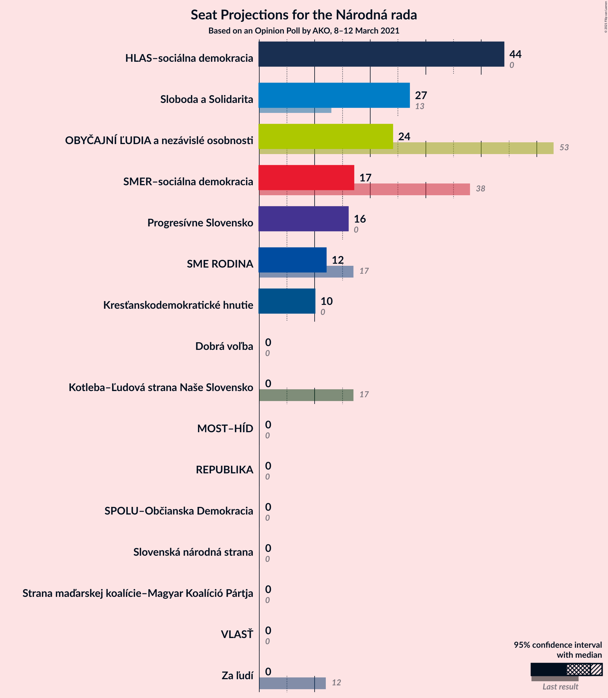
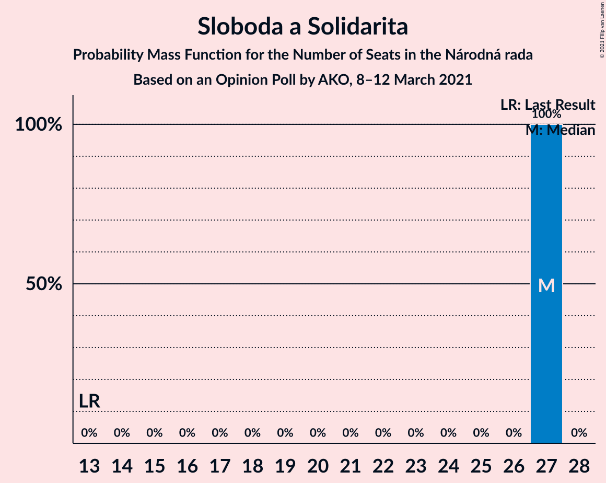
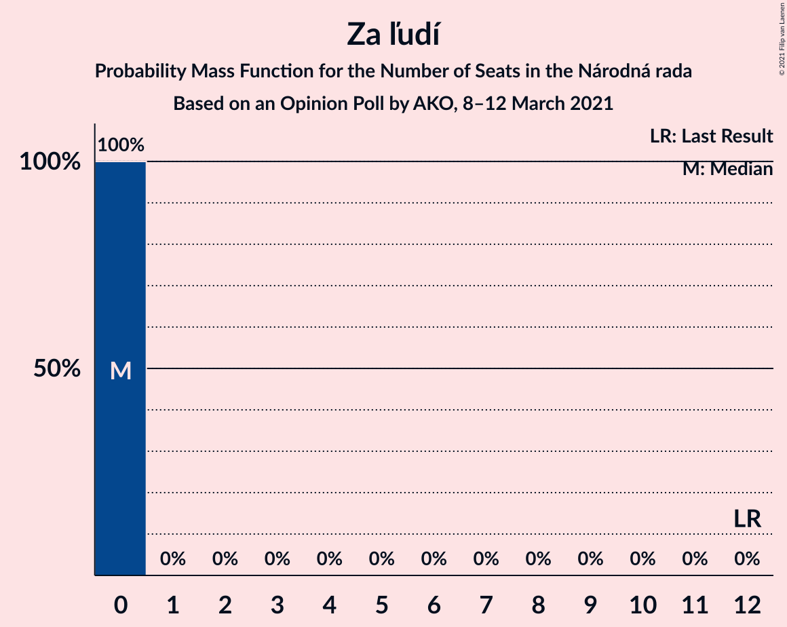
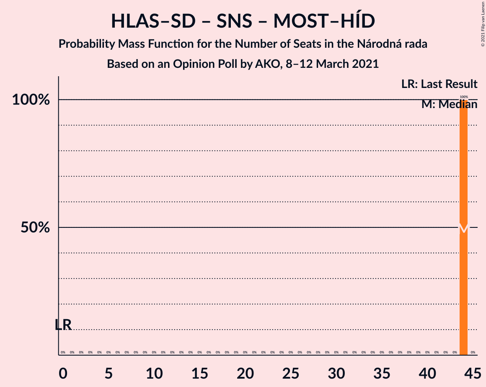
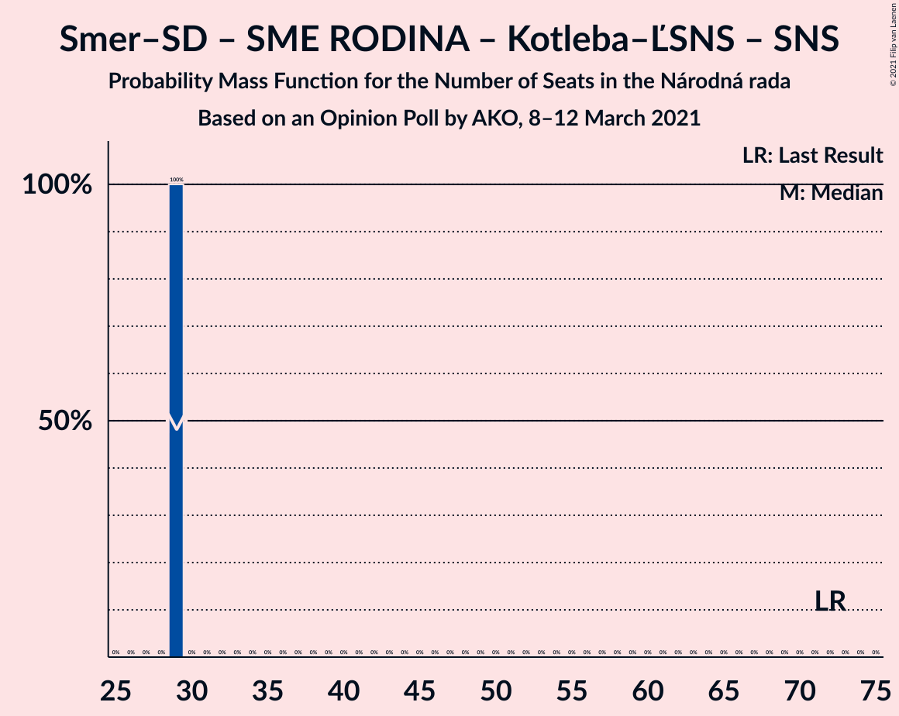
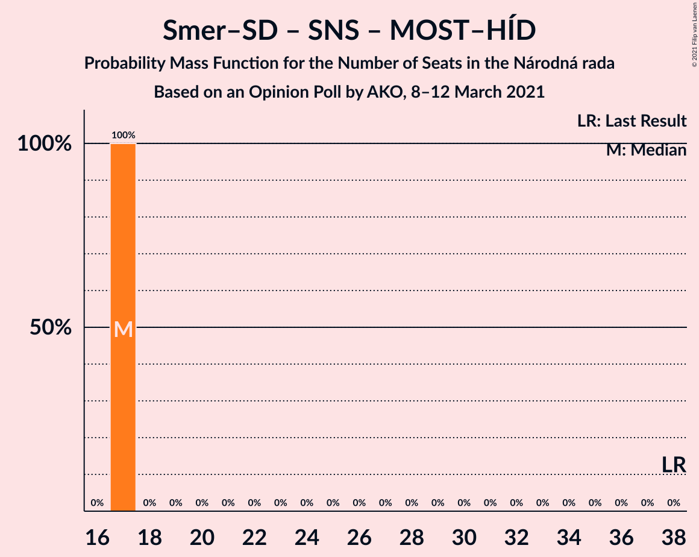
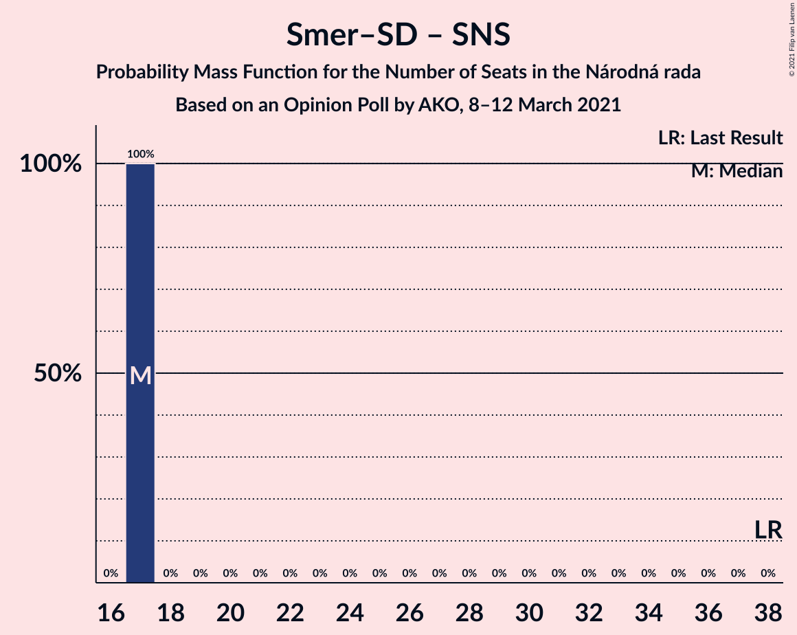

# Opinion Poll by AKO, 8–12 March 2021

<a href="#voting-intentions">Voting Intentions</a> | <a href="#seats">Seats</a> | <a href="#coalitions">Coalitions</a> | <a href="#technical-information">Technical Information</a>

## Voting Intentions

### Confidence Intervals

| Party | Last Result | Poll Result | 80% Confidence Interval | 90% Confidence Interval | 95% Confidence Interval | 99% Confidence Interval |
|:-----:|:-----------:|:-----------:|:-----------------------:|:-----------------------:|:-----------------------:|:-----------------------:|
| HLAS–sociálna demokracia | 0.0% | 24.9% | 23.2–26.7% |22.7–27.2% |22.3–27.7% |21.5–28.6% |
| Sloboda a Solidarita | 6.2% | 14.3% | 13.0–15.8% |12.6–16.2% |12.3–16.6% |11.6–17.4% |
| OBYČAJNÍ ĽUDIA a nezávislé osobnosti | 25.0% | 13.1% | 11.8–14.6% |11.4–15.0% |11.1–15.3% |10.6–16.1% |
| SMER–sociálna demokracia | 18.3% | 8.7% | 7.7–10.0% |7.3–10.3% |7.1–10.6% |6.6–11.2% |
| Progresívne Slovensko | 7.0% | 8.0% | 7.0–9.2% |6.7–9.6% |6.5–9.9% |6.0–10.5% |
| SME RODINA | 8.2% | 5.9% | 5.0–7.0% |4.8–7.3% |4.6–7.5% |4.2–8.1% |
| Kresťanskodemokratické hnutie | 4.6% | 5.2% | 4.4–6.2% |4.2–6.5% |4.0–6.8% |3.6–7.3% |
| Kotleba–Ľudová strana Naše Slovensko | 8.0% | 4.3% | 3.6–5.2% |3.4–5.5% |3.2–5.7% |2.9–6.2% |
| Za ľudí | 5.8% | 4.3% | 3.6–5.2% |3.4–5.5% |3.2–5.7% |2.9–6.2% |
| Slovenská národná strana | 3.2% | 3.0% | 2.4–3.8% |2.2–4.1% |2.1–4.3% |1.9–4.7% |
| Dobrá voľba | 3.1% | 2.8% | 2.2–3.6% |2.1–3.8% |1.9–4.0% |1.7–4.4% |
| VLASŤ | 2.9% | 2.3% | 1.8–3.0% |1.6–3.2% |1.5–3.4% |1.3–3.8% |
| Strana maďarskej koalície–Magyar Koalíció Pártja | 3.9% | 1.1% | 0.8–1.7% |0.7–1.8% |0.6–2.0% |0.5–2.3% |
| MOST–HÍD | 2.0% | 0.8% | 0.5–1.3% |0.5–1.4% |0.4–1.6% |0.3–1.9% |
| SPOLU–Občianska Demokracia | 7.0% | 0.3% | 0.2–0.7% |0.1–0.8% |0.1–0.9% |0.1–1.1% |

*Note:* The poll result column reflects the actual value used in the calculations. Published results may vary slightly, and in addition be rounded to fewer digits.

## Seats

### Confidence Intervals

| Party | Last Result | Median | 80% Confidence Interval | 90% Confidence Interval | 95% Confidence Interval | 99% Confidence Interval |
|:-----:|:-----------:|:------:|:-----------------------:|:-----------------------:|:-----------------------:|:-----------------------:|
| <a href="#hlas–sociálna-demokracia">HLAS–sociálna demokracia</a> | 0 | 45 | 42–49 |42–50 |40–52 |38–56 |
| <a href="#sloboda-a-solidarita">Sloboda a Solidarita</a> | 13 | 28 | 24–30 |23–31 |21–33 |20–33 |
| <a href="#obyčajní-ľudia-a-nezávislé-osobnosti">OBYČAJNÍ ĽUDIA a nezávislé osobnosti</a> | 53 | 25 | 20–28 |20–28 |20–29 |20–31 |
| <a href="#smer–sociálna-demokracia">SMER–sociálna demokracia</a> | 38 | 16 | 13–18 |12–19 |12–19 |12–22 |
| <a href="#progresívne-slovensko">Progresívne Slovensko</a> | 0 | 15 | 13–19 |12–19 |11–19 |11–20 |
| <a href="#sme-rodina">SME RODINA</a> | 17 | 10 | 10–14 |9–15 |0–15 |0–15 |
| <a href="#kresťanskodemokratické-hnutie">Kresťanskodemokratické hnutie</a> | 0 | 0 | 0–11 |0–11 |0–12 |0–13 |
| <a href="#kotleba–ľudová-strana-naše-slovensko">Kotleba–Ľudová strana Naše Slovensko</a> | 17 | 0 | 0–11 |0–11 |0–11 |0–11 |
| <a href="#za-ľudí">Za ľudí</a> | 12 | 0 | 0–11 |0–11 |0–11 |0–12 |
| <a href="#slovenská-národná-strana">Slovenská národná strana</a> | 0 | 0 | 0 |0 |0 |0 |
| <a href="#dobrá-voľba">Dobrá voľba</a> | 0 | 0 | 0 |0 |0 |0 |
| <a href="#vlasť">VLASŤ</a> | 0 | 0 | 0 |0 |0 |0 |
| <a href="#strana-maďarskej-koalície–magyar-koalíció-pártja">Strana maďarskej koalície–Magyar Koalíció Pártja</a> | 0 | 0 | 0 |0 |0 |0 |
| <a href="#most–híd">MOST–HÍD</a> | 0 | 0 | 0 |0 |0 |0 |
| <a href="#spolu–občianska-demokracia">SPOLU–Občianska Demokracia</a> | 0 | 0 | 0 |0 |0 |0 |

### HLAS–sociálna demokracia

*For a full overview of the results for this party, see the [HLAS–sociálna demokracia](party-hlas–sociálnademokracia.html) page.*

| Number of Seats | Probability | Accumulated | Special Marks |
|:---------------:|:-----------:|:-----------:|:-------------:|
| 0 | 0% | 100% | Last Result |
| 1 | 0% | 100% |  |
| 2 | 0% | 100% |  |
| 3 | 0% | 100% |  |
| 4 | 0% | 100% |  |
| 5 | 0% | 100% |  |
| 6 | 0% | 100% |  |
| 7 | 0% | 100% |  |
| 8 | 0% | 100% |  |
| 9 | 0% | 100% |  |
| 10 | 0% | 100% |  |
| 11 | 0% | 100% |  |
| 12 | 0% | 100% |  |
| 13 | 0% | 100% |  |
| 14 | 0% | 100% |  |
| 15 | 0% | 100% |  |
| 16 | 0% | 100% |  |
| 17 | 0% | 100% |  |
| 18 | 0% | 100% |  |
| 19 | 0% | 100% |  |
| 20 | 0% | 100% |  |
| 21 | 0% | 100% |  |
| 22 | 0% | 100% |  |
| 23 | 0% | 100% |  |
| 24 | 0% | 100% |  |
| 25 | 0% | 100% |  |
| 26 | 0% | 100% |  |
| 27 | 0% | 100% |  |
| 28 | 0% | 100% |  |
| 29 | 0% | 100% |  |
| 30 | 0% | 100% |  |
| 31 | 0% | 100% |  |
| 32 | 0% | 100% |  |
| 33 | 0% | 100% |  |
| 34 | 0% | 100% |  |
| 35 | 0% | 100% |  |
| 36 | 0.2% | 100% |  |
| 37 | 0% | 99.8% |  |
| 38 | 0.7% | 99.8% |  |
| 39 | 0.2% | 99.1% |  |
| 40 | 2% | 98.9% |  |
| 41 | 1.1% | 96% |  |
| 42 | 18% | 95% |  |
| 43 | 18% | 78% |  |
| 44 | 10% | 60% |  |
| 45 | 4% | 50% | Median |
| 46 | 17% | 46% |  |
| 47 | 5% | 29% |  |
| 48 | 13% | 24% |  |
| 49 | 4% | 11% |  |
| 50 | 3% | 7% |  |
| 51 | 0.7% | 4% |  |
| 52 | 2% | 3% |  |
| 53 | 0% | 2% |  |
| 54 | 0.4% | 2% |  |
| 55 | 0.4% | 1.2% |  |
| 56 | 0.8% | 0.9% |  |
| 57 | 0% | 0.1% |  |
| 58 | 0% | 0.1% |  |
| 59 | 0.1% | 0.1% |  |
| 60 | 0% | 0% |  |

### Sloboda a Solidarita

*For a full overview of the results for this party, see the [Sloboda a Solidarita](party-slobodaasolidarita.html) page.*

| Number of Seats | Probability | Accumulated | Special Marks |
|:---------------:|:-----------:|:-----------:|:-------------:|
| 13 | 0% | 100% | Last Result |
| 14 | 0% | 100% |  |
| 15 | 0% | 100% |  |
| 16 | 0% | 100% |  |
| 17 | 0% | 100% |  |
| 18 | 0% | 100% |  |
| 19 | 0% | 100% |  |
| 20 | 0.9% | 100% |  |
| 21 | 3% | 99.1% |  |
| 22 | 0.7% | 96% |  |
| 23 | 3% | 96% |  |
| 24 | 5% | 92% |  |
| 25 | 3% | 87% |  |
| 26 | 5% | 84% |  |
| 27 | 17% | 79% |  |
| 28 | 29% | 61% | Median |
| 29 | 18% | 32% |  |
| 30 | 8% | 14% |  |
| 31 | 3% | 6% |  |
| 32 | 0.2% | 3% |  |
| 33 | 3% | 3% |  |
| 34 | 0.2% | 0.2% |  |
| 35 | 0% | 0% |  |

### OBYČAJNÍ ĽUDIA a nezávislé osobnosti

*For a full overview of the results for this party, see the [OBYČAJNÍ ĽUDIA a nezávislé osobnosti](party-obyčajníľudiaanezávisléosobnosti.html) page.*

| Number of Seats | Probability | Accumulated | Special Marks |
|:---------------:|:-----------:|:-----------:|:-------------:|
| 18 | 0% | 100% |  |
| 19 | 0.1% | 99.9% |  |
| 20 | 15% | 99.8% |  |
| 21 | 5% | 85% |  |
| 22 | 16% | 80% |  |
| 23 | 3% | 64% |  |
| 24 | 7% | 60% |  |
| 25 | 4% | 53% | Median |
| 26 | 7% | 50% |  |
| 27 | 16% | 42% |  |
| 28 | 22% | 26% |  |
| 29 | 2% | 4% |  |
| 30 | 1.4% | 2% |  |
| 31 | 0.5% | 0.7% |  |
| 32 | 0.1% | 0.2% |  |
| 33 | 0% | 0.1% |  |
| 34 | 0% | 0.1% |  |
| 35 | 0% | 0.1% |  |
| 36 | 0.1% | 0.1% |  |
| 37 | 0% | 0% |  |
| 38 | 0% | 0% |  |
| 39 | 0% | 0% |  |
| 40 | 0% | 0% |  |
| 41 | 0% | 0% |  |
| 42 | 0% | 0% |  |
| 43 | 0% | 0% |  |
| 44 | 0% | 0% |  |
| 45 | 0% | 0% |  |
| 46 | 0% | 0% |  |
| 47 | 0% | 0% |  |
| 48 | 0% | 0% |  |
| 49 | 0% | 0% |  |
| 50 | 0% | 0% |  |
| 51 | 0% | 0% |  |
| 52 | 0% | 0% |  |
| 53 | 0% | 0% | Last Result |

### SMER–sociálna demokracia

*For a full overview of the results for this party, see the [SMER–sociálna demokracia](party-smer–sociálnademokracia.html) page.*

| Number of Seats | Probability | Accumulated | Special Marks |
|:---------------:|:-----------:|:-----------:|:-------------:|
| 11 | 0.1% | 100% |  |
| 12 | 5% | 99.9% |  |
| 13 | 13% | 95% |  |
| 14 | 20% | 82% |  |
| 15 | 4% | 62% |  |
| 16 | 23% | 58% | Median |
| 17 | 6% | 35% |  |
| 18 | 23% | 29% |  |
| 19 | 4% | 6% |  |
| 20 | 1.1% | 2% |  |
| 21 | 0.3% | 1.2% |  |
| 22 | 0.8% | 0.8% |  |
| 23 | 0% | 0% |  |
| 24 | 0% | 0% |  |
| 25 | 0% | 0% |  |
| 26 | 0% | 0% |  |
| 27 | 0% | 0% |  |
| 28 | 0% | 0% |  |
| 29 | 0% | 0% |  |
| 30 | 0% | 0% |  |
| 31 | 0% | 0% |  |
| 32 | 0% | 0% |  |
| 33 | 0% | 0% |  |
| 34 | 0% | 0% |  |
| 35 | 0% | 0% |  |
| 36 | 0% | 0% |  |
| 37 | 0% | 0% |  |
| 38 | 0% | 0% | Last Result |

### Progresívne Slovensko

*For a full overview of the results for this party, see the [Progresívne Slovensko](party-progresívneslovensko.html) page.*

| Number of Seats | Probability | Accumulated | Special Marks |
|:---------------:|:-----------:|:-----------:|:-------------:|
| 0 | 0% | 100% | Last Result |
| 1 | 0% | 100% |  |
| 2 | 0% | 100% |  |
| 3 | 0% | 100% |  |
| 4 | 0% | 100% |  |
| 5 | 0% | 100% |  |
| 6 | 0% | 100% |  |
| 7 | 0% | 100% |  |
| 8 | 0% | 100% |  |
| 9 | 0% | 100% |  |
| 10 | 0.2% | 100% |  |
| 11 | 4% | 99.8% |  |
| 12 | 6% | 96% |  |
| 13 | 7% | 90% |  |
| 14 | 3% | 83% |  |
| 15 | 57% | 80% | Median |
| 16 | 8% | 24% |  |
| 17 | 2% | 16% |  |
| 18 | 0.4% | 14% |  |
| 19 | 13% | 14% |  |
| 20 | 0.5% | 0.8% |  |
| 21 | 0.3% | 0.3% |  |
| 22 | 0% | 0% |  |

### SME RODINA

*For a full overview of the results for this party, see the [SME RODINA](party-smerodina.html) page.*

| Number of Seats | Probability | Accumulated | Special Marks |
|:---------------:|:-----------:|:-----------:|:-------------:|
| 0 | 4% | 100% |  |
| 1 | 0% | 96% |  |
| 2 | 0% | 96% |  |
| 3 | 0% | 96% |  |
| 4 | 0% | 96% |  |
| 5 | 0% | 96% |  |
| 6 | 0% | 96% |  |
| 7 | 0% | 96% |  |
| 8 | 0% | 96% |  |
| 9 | 3% | 96% |  |
| 10 | 48% | 93% | Median |
| 11 | 10% | 45% |  |
| 12 | 3% | 35% |  |
| 13 | 19% | 31% |  |
| 14 | 3% | 12% |  |
| 15 | 9% | 9% |  |
| 16 | 0.1% | 0.1% |  |
| 17 | 0% | 0% | Last Result |

### Kresťanskodemokratické hnutie

*For a full overview of the results for this party, see the [Kresťanskodemokratické hnutie](party-kresťanskodemokratickéhnutie.html) page.*

| Number of Seats | Probability | Accumulated | Special Marks |
|:---------------:|:-----------:|:-----------:|:-------------:|
| 0 | 62% | 100% | Last Result, Median |
| 1 | 0% | 38% |  |
| 2 | 0% | 38% |  |
| 3 | 0% | 38% |  |
| 4 | 0% | 38% |  |
| 5 | 0% | 38% |  |
| 6 | 0% | 38% |  |
| 7 | 0% | 38% |  |
| 8 | 0% | 38% |  |
| 9 | 9% | 38% |  |
| 10 | 6% | 30% |  |
| 11 | 20% | 24% |  |
| 12 | 3% | 4% |  |
| 13 | 0.5% | 0.5% |  |
| 14 | 0.1% | 0.1% |  |
| 15 | 0% | 0% |  |

### Kotleba–Ľudová strana Naše Slovensko

*For a full overview of the results for this party, see the [Kotleba–Ľudová strana Naše Slovensko](party-kotleba–ľudovástrananašeslovensko.html) page.*

| Number of Seats | Probability | Accumulated | Special Marks |
|:---------------:|:-----------:|:-----------:|:-------------:|
| 0 | 74% | 100% | Median |
| 1 | 0% | 26% |  |
| 2 | 0% | 26% |  |
| 3 | 0% | 26% |  |
| 4 | 0% | 26% |  |
| 5 | 0% | 26% |  |
| 6 | 0% | 26% |  |
| 7 | 0% | 26% |  |
| 8 | 0% | 26% |  |
| 9 | 2% | 26% |  |
| 10 | 8% | 24% |  |
| 11 | 16% | 16% |  |
| 12 | 0.1% | 0.1% |  |
| 13 | 0% | 0% |  |
| 14 | 0% | 0% |  |
| 15 | 0% | 0% |  |
| 16 | 0% | 0% |  |
| 17 | 0% | 0% | Last Result |

### Za ľudí

*For a full overview of the results for this party, see the [Za ľudí](party-zaľudí.html) page.*

| Number of Seats | Probability | Accumulated | Special Marks |
|:---------------:|:-----------:|:-----------:|:-------------:|
| 0 | 61% | 100% | Median |
| 1 | 0% | 39% |  |
| 2 | 0% | 39% |  |
| 3 | 0% | 39% |  |
| 4 | 0% | 39% |  |
| 5 | 0% | 39% |  |
| 6 | 0% | 39% |  |
| 7 | 0% | 39% |  |
| 8 | 0% | 39% |  |
| 9 | 6% | 39% |  |
| 10 | 6% | 33% |  |
| 11 | 25% | 27% |  |
| 12 | 2% | 2% | Last Result |
| 13 | 0% | 0% |  |

### Slovenská národná strana

*For a full overview of the results for this party, see the [Slovenská národná strana](party-slovenskánárodnástrana.html) page.*

| Number of Seats | Probability | Accumulated | Special Marks |
|:---------------:|:-----------:|:-----------:|:-------------:|
| 0 | 99.9% | 100% | Last Result, Median |
| 1 | 0% | 0.1% |  |
| 2 | 0% | 0.1% |  |
| 3 | 0% | 0.1% |  |
| 4 | 0% | 0.1% |  |
| 5 | 0% | 0.1% |  |
| 6 | 0% | 0.1% |  |
| 7 | 0% | 0.1% |  |
| 8 | 0% | 0.1% |  |
| 9 | 0% | 0.1% |  |
| 10 | 0% | 0% |  |

### Dobrá voľba

*For a full overview of the results for this party, see the [Dobrá voľba](party-dobrávoľba.html) page.*

| Number of Seats | Probability | Accumulated | Special Marks |
|:---------------:|:-----------:|:-----------:|:-------------:|
| 0 | 100% | 100% | Last Result, Median |

### VLASŤ

*For a full overview of the results for this party, see the [VLASŤ](party-vlasť.html) page.*

| Number of Seats | Probability | Accumulated | Special Marks |
|:---------------:|:-----------:|:-----------:|:-------------:|
| 0 | 100% | 100% | Last Result, Median |

### Strana maďarskej koalície–Magyar Koalíció Pártja

*For a full overview of the results for this party, see the [Strana maďarskej koalície–Magyar Koalíció Pártja](party-stranamaďarskejkoalície–magyarkoalíciópártja.html) page.*

| Number of Seats | Probability | Accumulated | Special Marks |
|:---------------:|:-----------:|:-----------:|:-------------:|
| 0 | 100% | 100% | Last Result, Median |

### MOST–HÍD

*For a full overview of the results for this party, see the [MOST–HÍD](party-most–híd.html) page.*

| Number of Seats | Probability | Accumulated | Special Marks |
|:---------------:|:-----------:|:-----------:|:-------------:|
| 0 | 100% | 100% | Last Result, Median |

### SPOLU–Občianska Demokracia

*For a full overview of the results for this party, see the [SPOLU–Občianska Demokracia](party-spolu–občianskademokracia.html) page.*

| Number of Seats | Probability | Accumulated | Special Marks |
|:---------------:|:-----------:|:-----------:|:-------------:|
| 0 | 100% | 100% | Last Result, Median |

## Coalitions

### Confidence Intervals

| Coalition | Last Result | Median | Majority? | 80% Confidence Interval | 90% Confidence Interval | 95% Confidence Interval | 99% Confidence Interval |
|:---------:|:-----------:|:------:|:---------:|:-----------------------:|:-----------------------:|:-----------------------:|:-----------------------:|
| HLAS–sociálna demokracia – SMER–sociálna demokracia – SME RODINA – Kotleba–Ľudová strana Naše Slovensko – Slovenská národná strana | 72 | 74 | 40% | 66–80 | 66–82 | 66–85 | 62–86 |
| HLAS–sociálna demokracia – SMER–sociálna demokracia – SME RODINA | 55 | 72 | 20% | 66–77 | 66–78 | 65–79 | 62–83 |
| HLAS–sociálna demokracia – SMER–sociálna demokracia – SME RODINA – Slovenská národná strana | 55 | 72 | 20% | 66–77 | 66–78 | 65–79 | 62–83 |
| HLAS–sociálna demokracia – SMER–sociálna demokracia – Slovenská národná strana – MOST–HÍD | 38 | 61 | 0.9% | 56–66 | 56–68 | 56–70 | 53–78 |
| HLAS–sociálna demokracia – SMER–sociálna demokracia – Slovenská národná strana | 38 | 61 | 0.9% | 56–66 | 56–68 | 56–70 | 53–78 |
| HLAS–sociálna demokracia – SME RODINA – Kotleba–Ľudová strana Naše Slovensko – Slovenská národná strana | 34 | 59 | 0% | 52–64 | 52–66 | 51–70 | 47–71 |
| HLAS–sociálna demokracia – SME RODINA | 17 | 56 | 0% | 52–61 | 51–61 | 49–62 | 44–66 |
| HLAS–sociálna demokracia – SME RODINA – Slovenská národná strana | 17 | 56 | 0% | 52–61 | 51–61 | 49–62 | 44–66 |
| HLAS–sociálna demokracia – Slovenská národná strana – MOST–HÍD | 0 | 45 | 0% | 42–49 | 42–50 | 40–52 | 38–56 |
| HLAS–sociálna demokracia – Slovenská národná strana | 0 | 45 | 0% | 42–49 | 42–50 | 40–52 | 38–56 |
| SMER–sociálna demokracia – SME RODINA – Kotleba–Ľudová strana Naše Slovensko – Slovenská národná strana | 72 | 28 | 0% | 24–37 | 24–37 | 22–38 | 15–40 |
| SMER–sociálna demokracia – SME RODINA | 55 | 26 | 0% | 24–30 | 24–33 | 20–33 | 14–33 |
| SMER–sociálna demokracia – SME RODINA – Slovenská národná strana | 55 | 26 | 0% | 24–30 | 24–33 | 20–33 | 14–33 |
| SMER–sociálna demokracia – Slovenská národná strana – MOST–HÍD | 38 | 16 | 0% | 13–18 | 12–19 | 12–19 | 12–22 |
| SMER–sociálna demokracia | 38 | 16 | 0% | 13–18 | 12–19 | 12–19 | 12–22 |
| SMER–sociálna demokracia – Slovenská národná strana | 38 | 16 | 0% | 13–18 | 12–19 | 12–19 | 12–22 |

### HLAS–sociálna demokracia – SMER–sociálna demokracia – SME RODINA – Kotleba–Ľudová strana Naše Slovensko – Slovenská národná strana

| Number of Seats | Probability | Accumulated | Special Marks |
|:---------------:|:-----------:|:-----------:|:-------------:|
| 58 | 0.1% | 100% |  |
| 59 | 0% | 99.9% |  |
| 60 | 0.1% | 99.9% |  |
| 61 | 0.1% | 99.8% |  |
| 62 | 0.9% | 99.7% |  |
| 63 | 0% | 98.9% |  |
| 64 | 0% | 98.8% |  |
| 65 | 0% | 98.8% |  |
| 66 | 15% | 98.8% |  |
| 67 | 0.5% | 84% |  |
| 68 | 0.7% | 83% |  |
| 69 | 0.3% | 83% |  |
| 70 | 2% | 82% |  |
| 71 | 5% | 80% | Median |
| 72 | 5% | 75% | Last Result |
| 73 | 4% | 70% |  |
| 74 | 23% | 66% |  |
| 75 | 3% | 43% |  |
| 76 | 3% | 40% | Majority |
| 77 | 10% | 37% |  |
| 78 | 1.0% | 27% |  |
| 79 | 3% | 26% |  |
| 80 | 16% | 23% |  |
| 81 | 0.2% | 7% |  |
| 82 | 3% | 7% |  |
| 83 | 0.6% | 4% |  |
| 84 | 0.9% | 4% |  |
| 85 | 0.6% | 3% |  |
| 86 | 2% | 2% |  |
| 87 | 0% | 0.3% |  |
| 88 | 0% | 0.3% |  |
| 89 | 0.2% | 0.2% |  |
| 90 | 0% | 0% |  |

### HLAS–sociálna demokracia – SMER–sociálna demokracia – SME RODINA

| Number of Seats | Probability | Accumulated | Special Marks |
|:---------------:|:-----------:|:-----------:|:-------------:|
| 55 | 0% | 100% | Last Result |
| 56 | 0% | 100% |  |
| 57 | 0% | 100% |  |
| 58 | 0.1% | 100% |  |
| 59 | 0% | 99.8% |  |
| 60 | 0.1% | 99.8% |  |
| 61 | 0.2% | 99.7% |  |
| 62 | 0.9% | 99.5% |  |
| 63 | 0% | 98.7% |  |
| 64 | 0% | 98.6% |  |
| 65 | 2% | 98.6% |  |
| 66 | 16% | 96% |  |
| 67 | 1.2% | 81% |  |
| 68 | 0.8% | 79% |  |
| 69 | 17% | 79% |  |
| 70 | 2% | 62% |  |
| 71 | 5% | 60% | Median |
| 72 | 7% | 55% |  |
| 73 | 4% | 48% |  |
| 74 | 24% | 44% |  |
| 75 | 0.4% | 21% |  |
| 76 | 5% | 20% | Majority |
| 77 | 9% | 15% |  |
| 78 | 1.2% | 6% |  |
| 79 | 2% | 5% |  |
| 80 | 0.3% | 2% |  |
| 81 | 0% | 2% |  |
| 82 | 1.2% | 2% |  |
| 83 | 0.6% | 0.7% |  |
| 84 | 0% | 0.1% |  |
| 85 | 0% | 0.1% |  |
| 86 | 0% | 0% |  |

### HLAS–sociálna demokracia – SMER–sociálna demokracia – SME RODINA – Slovenská národná strana

| Number of Seats | Probability | Accumulated | Special Marks |
|:---------------:|:-----------:|:-----------:|:-------------:|
| 55 | 0% | 100% | Last Result |
| 56 | 0% | 100% |  |
| 57 | 0% | 100% |  |
| 58 | 0.1% | 100% |  |
| 59 | 0% | 99.8% |  |
| 60 | 0.1% | 99.8% |  |
| 61 | 0.2% | 99.7% |  |
| 62 | 0.9% | 99.5% |  |
| 63 | 0% | 98.7% |  |
| 64 | 0% | 98.6% |  |
| 65 | 2% | 98.6% |  |
| 66 | 16% | 96% |  |
| 67 | 1.2% | 81% |  |
| 68 | 0.7% | 79% |  |
| 69 | 17% | 79% |  |
| 70 | 2% | 62% |  |
| 71 | 5% | 60% | Median |
| 72 | 7% | 55% |  |
| 73 | 4% | 48% |  |
| 74 | 24% | 44% |  |
| 75 | 0.4% | 21% |  |
| 76 | 5% | 20% | Majority |
| 77 | 9% | 15% |  |
| 78 | 1.2% | 6% |  |
| 79 | 2% | 5% |  |
| 80 | 0.3% | 2% |  |
| 81 | 0% | 2% |  |
| 82 | 1.2% | 2% |  |
| 83 | 0.6% | 0.7% |  |
| 84 | 0.1% | 0.1% |  |
| 85 | 0% | 0.1% |  |
| 86 | 0% | 0% |  |

### HLAS–sociálna demokracia – SMER–sociálna demokracia – Slovenská národná strana – MOST–HÍD

| Number of Seats | Probability | Accumulated | Special Marks |
|:---------------:|:-----------:|:-----------:|:-------------:|
| 38 | 0% | 100% | Last Result |
| 39 | 0% | 100% |  |
| 40 | 0% | 100% |  |
| 41 | 0% | 100% |  |
| 42 | 0% | 100% |  |
| 43 | 0% | 100% |  |
| 44 | 0% | 100% |  |
| 45 | 0% | 100% |  |
| 46 | 0% | 100% |  |
| 47 | 0% | 100% |  |
| 48 | 0% | 100% |  |
| 49 | 0% | 100% |  |
| 50 | 0% | 100% |  |
| 51 | 0% | 99.9% |  |
| 52 | 0.2% | 99.9% |  |
| 53 | 0.3% | 99.8% |  |
| 54 | 0.7% | 99.5% |  |
| 55 | 0.1% | 98.8% |  |
| 56 | 17% | 98.6% |  |
| 57 | 0.9% | 81% |  |
| 58 | 6% | 80% |  |
| 59 | 18% | 75% |  |
| 60 | 3% | 57% |  |
| 61 | 15% | 54% | Median |
| 62 | 12% | 38% |  |
| 63 | 3% | 26% |  |
| 64 | 12% | 23% |  |
| 65 | 0.7% | 11% |  |
| 66 | 3% | 11% |  |
| 67 | 2% | 8% |  |
| 68 | 4% | 6% |  |
| 69 | 0.1% | 3% |  |
| 70 | 1.0% | 3% |  |
| 71 | 0.3% | 2% |  |
| 72 | 0.4% | 1.4% |  |
| 73 | 0.1% | 1.0% |  |
| 74 | 0% | 0.9% |  |
| 75 | 0% | 0.9% |  |
| 76 | 0.1% | 0.9% | Majority |
| 77 | 0% | 0.8% |  |
| 78 | 0.8% | 0.8% |  |
| 79 | 0% | 0% |  |

### HLAS–sociálna demokracia – SMER–sociálna demokracia – Slovenská národná strana

| Number of Seats | Probability | Accumulated | Special Marks |
|:---------------:|:-----------:|:-----------:|:-------------:|
| 38 | 0% | 100% | Last Result |
| 39 | 0% | 100% |  |
| 40 | 0% | 100% |  |
| 41 | 0% | 100% |  |
| 42 | 0% | 100% |  |
| 43 | 0% | 100% |  |
| 44 | 0% | 100% |  |
| 45 | 0% | 100% |  |
| 46 | 0% | 100% |  |
| 47 | 0% | 100% |  |
| 48 | 0% | 100% |  |
| 49 | 0% | 100% |  |
| 50 | 0% | 100% |  |
| 51 | 0% | 99.9% |  |
| 52 | 0.2% | 99.9% |  |
| 53 | 0.3% | 99.8% |  |
| 54 | 0.7% | 99.5% |  |
| 55 | 0.1% | 98.8% |  |
| 56 | 17% | 98.6% |  |
| 57 | 0.9% | 81% |  |
| 58 | 6% | 80% |  |
| 59 | 18% | 75% |  |
| 60 | 3% | 57% |  |
| 61 | 15% | 54% | Median |
| 62 | 12% | 38% |  |
| 63 | 3% | 26% |  |
| 64 | 12% | 23% |  |
| 65 | 0.7% | 11% |  |
| 66 | 3% | 11% |  |
| 67 | 2% | 8% |  |
| 68 | 4% | 6% |  |
| 69 | 0.1% | 3% |  |
| 70 | 1.0% | 3% |  |
| 71 | 0.3% | 2% |  |
| 72 | 0.4% | 1.4% |  |
| 73 | 0.1% | 1.0% |  |
| 74 | 0% | 0.9% |  |
| 75 | 0% | 0.9% |  |
| 76 | 0.1% | 0.9% | Majority |
| 77 | 0% | 0.8% |  |
| 78 | 0.8% | 0.8% |  |
| 79 | 0% | 0% |  |

### HLAS–sociálna demokracia – SME RODINA – Kotleba–Ľudová strana Naše Slovensko – Slovenská národná strana

| Number of Seats | Probability | Accumulated | Special Marks |
|:---------------:|:-----------:|:-----------:|:-------------:|
| 34 | 0% | 100% | Last Result |
| 35 | 0% | 100% |  |
| 36 | 0% | 100% |  |
| 37 | 0% | 100% |  |
| 38 | 0% | 100% |  |
| 39 | 0% | 100% |  |
| 40 | 0% | 100% |  |
| 41 | 0% | 100% |  |
| 42 | 0.2% | 100% |  |
| 43 | 0.1% | 99.8% |  |
| 44 | 0.1% | 99.7% |  |
| 45 | 0% | 99.6% |  |
| 46 | 0.1% | 99.6% |  |
| 47 | 0.5% | 99.5% |  |
| 48 | 0.2% | 99.0% |  |
| 49 | 0.1% | 98.8% |  |
| 50 | 0.8% | 98.7% |  |
| 51 | 0.8% | 98% |  |
| 52 | 14% | 97% |  |
| 53 | 0.2% | 83% |  |
| 54 | 3% | 83% |  |
| 55 | 3% | 79% | Median |
| 56 | 13% | 76% |  |
| 57 | 1.5% | 63% |  |
| 58 | 3% | 61% |  |
| 59 | 17% | 58% |  |
| 60 | 4% | 42% |  |
| 61 | 13% | 38% |  |
| 62 | 1.2% | 25% |  |
| 63 | 0.5% | 24% |  |
| 64 | 18% | 23% |  |
| 65 | 0.1% | 5% |  |
| 66 | 1.2% | 5% |  |
| 67 | 0.3% | 4% |  |
| 68 | 0.1% | 4% |  |
| 69 | 0.6% | 4% |  |
| 70 | 2% | 3% |  |
| 71 | 0.6% | 0.8% |  |
| 72 | 0.2% | 0.3% |  |
| 73 | 0.1% | 0.1% |  |
| 74 | 0% | 0% |  |

### HLAS–sociálna demokracia – SME RODINA

| Number of Seats | Probability | Accumulated | Special Marks |
|:---------------:|:-----------:|:-----------:|:-------------:|
| 17 | 0% | 100% | Last Result |
| 18 | 0% | 100% |  |
| 19 | 0% | 100% |  |
| 20 | 0% | 100% |  |
| 21 | 0% | 100% |  |
| 22 | 0% | 100% |  |
| 23 | 0% | 100% |  |
| 24 | 0% | 100% |  |
| 25 | 0% | 100% |  |
| 26 | 0% | 100% |  |
| 27 | 0% | 100% |  |
| 28 | 0% | 100% |  |
| 29 | 0% | 100% |  |
| 30 | 0% | 100% |  |
| 31 | 0% | 100% |  |
| 32 | 0% | 100% |  |
| 33 | 0% | 100% |  |
| 34 | 0% | 100% |  |
| 35 | 0% | 100% |  |
| 36 | 0% | 100% |  |
| 37 | 0% | 100% |  |
| 38 | 0% | 100% |  |
| 39 | 0% | 100% |  |
| 40 | 0% | 100% |  |
| 41 | 0% | 100% |  |
| 42 | 0.3% | 100% |  |
| 43 | 0.1% | 99.7% |  |
| 44 | 0.1% | 99.6% |  |
| 45 | 0.1% | 99.5% |  |
| 46 | 0.1% | 99.4% |  |
| 47 | 0.5% | 99.3% |  |
| 48 | 0.3% | 98.8% |  |
| 49 | 2% | 98% |  |
| 50 | 0.9% | 96% |  |
| 51 | 1.4% | 95% |  |
| 52 | 15% | 94% |  |
| 53 | 16% | 79% |  |
| 54 | 6% | 64% |  |
| 55 | 3% | 57% | Median |
| 56 | 13% | 54% |  |
| 57 | 1.4% | 41% |  |
| 58 | 3% | 39% |  |
| 59 | 15% | 36% |  |
| 60 | 5% | 21% |  |
| 61 | 13% | 16% |  |
| 62 | 2% | 3% |  |
| 63 | 0.1% | 2% |  |
| 64 | 0.2% | 2% |  |
| 65 | 0% | 2% |  |
| 66 | 1.2% | 2% |  |
| 67 | 0.3% | 0.4% |  |
| 68 | 0% | 0.1% |  |
| 69 | 0% | 0% |  |

### HLAS–sociálna demokracia – SME RODINA – Slovenská národná strana

| Number of Seats | Probability | Accumulated | Special Marks |
|:---------------:|:-----------:|:-----------:|:-------------:|
| 17 | 0% | 100% | Last Result |
| 18 | 0% | 100% |  |
| 19 | 0% | 100% |  |
| 20 | 0% | 100% |  |
| 21 | 0% | 100% |  |
| 22 | 0% | 100% |  |
| 23 | 0% | 100% |  |
| 24 | 0% | 100% |  |
| 25 | 0% | 100% |  |
| 26 | 0% | 100% |  |
| 27 | 0% | 100% |  |
| 28 | 0% | 100% |  |
| 29 | 0% | 100% |  |
| 30 | 0% | 100% |  |
| 31 | 0% | 100% |  |
| 32 | 0% | 100% |  |
| 33 | 0% | 100% |  |
| 34 | 0% | 100% |  |
| 35 | 0% | 100% |  |
| 36 | 0% | 100% |  |
| 37 | 0% | 100% |  |
| 38 | 0% | 100% |  |
| 39 | 0% | 100% |  |
| 40 | 0% | 100% |  |
| 41 | 0% | 100% |  |
| 42 | 0.3% | 100% |  |
| 43 | 0.1% | 99.7% |  |
| 44 | 0.1% | 99.6% |  |
| 45 | 0.1% | 99.5% |  |
| 46 | 0.1% | 99.4% |  |
| 47 | 0.5% | 99.3% |  |
| 48 | 0.3% | 98.8% |  |
| 49 | 2% | 98% |  |
| 50 | 0.9% | 96% |  |
| 51 | 1.4% | 95% |  |
| 52 | 15% | 94% |  |
| 53 | 16% | 79% |  |
| 54 | 6% | 64% |  |
| 55 | 3% | 58% | Median |
| 56 | 13% | 54% |  |
| 57 | 1.4% | 41% |  |
| 58 | 3% | 39% |  |
| 59 | 15% | 36% |  |
| 60 | 5% | 21% |  |
| 61 | 13% | 16% |  |
| 62 | 2% | 3% |  |
| 63 | 0.1% | 2% |  |
| 64 | 0.2% | 2% |  |
| 65 | 0% | 2% |  |
| 66 | 1.2% | 2% |  |
| 67 | 0.3% | 0.4% |  |
| 68 | 0% | 0.1% |  |
| 69 | 0% | 0% |  |

### HLAS–sociálna demokracia – Slovenská národná strana – MOST–HÍD

| Number of Seats | Probability | Accumulated | Special Marks |
|:---------------:|:-----------:|:-----------:|:-------------:|
| 0 | 0% | 100% | Last Result |
| 1 | 0% | 100% |  |
| 2 | 0% | 100% |  |
| 3 | 0% | 100% |  |
| 4 | 0% | 100% |  |
| 5 | 0% | 100% |  |
| 6 | 0% | 100% |  |
| 7 | 0% | 100% |  |
| 8 | 0% | 100% |  |
| 9 | 0% | 100% |  |
| 10 | 0% | 100% |  |
| 11 | 0% | 100% |  |
| 12 | 0% | 100% |  |
| 13 | 0% | 100% |  |
| 14 | 0% | 100% |  |
| 15 | 0% | 100% |  |
| 16 | 0% | 100% |  |
| 17 | 0% | 100% |  |
| 18 | 0% | 100% |  |
| 19 | 0% | 100% |  |
| 20 | 0% | 100% |  |
| 21 | 0% | 100% |  |
| 22 | 0% | 100% |  |
| 23 | 0% | 100% |  |
| 24 | 0% | 100% |  |
| 25 | 0% | 100% |  |
| 26 | 0% | 100% |  |
| 27 | 0% | 100% |  |
| 28 | 0% | 100% |  |
| 29 | 0% | 100% |  |
| 30 | 0% | 100% |  |
| 31 | 0% | 100% |  |
| 32 | 0% | 100% |  |
| 33 | 0% | 100% |  |
| 34 | 0% | 100% |  |
| 35 | 0% | 100% |  |
| 36 | 0.1% | 100% |  |
| 37 | 0% | 99.9% |  |
| 38 | 0.7% | 99.8% |  |
| 39 | 0.2% | 99.1% |  |
| 40 | 2% | 98.9% |  |
| 41 | 1.1% | 96% |  |
| 42 | 18% | 95% |  |
| 43 | 18% | 78% |  |
| 44 | 10% | 60% |  |
| 45 | 4% | 50% | Median |
| 46 | 17% | 46% |  |
| 47 | 5% | 29% |  |
| 48 | 13% | 24% |  |
| 49 | 4% | 11% |  |
| 50 | 3% | 7% |  |
| 51 | 0.7% | 4% |  |
| 52 | 2% | 3% |  |
| 53 | 0% | 2% |  |
| 54 | 0.4% | 2% |  |
| 55 | 0.4% | 1.3% |  |
| 56 | 0.8% | 0.9% |  |
| 57 | 0% | 0.1% |  |
| 58 | 0% | 0.1% |  |
| 59 | 0.1% | 0.1% |  |
| 60 | 0% | 0.1% |  |
| 61 | 0% | 0% |  |

### HLAS–sociálna demokracia – Slovenská národná strana

| Number of Seats | Probability | Accumulated | Special Marks |
|:---------------:|:-----------:|:-----------:|:-------------:|
| 0 | 0% | 100% | Last Result |
| 1 | 0% | 100% |  |
| 2 | 0% | 100% |  |
| 3 | 0% | 100% |  |
| 4 | 0% | 100% |  |
| 5 | 0% | 100% |  |
| 6 | 0% | 100% |  |
| 7 | 0% | 100% |  |
| 8 | 0% | 100% |  |
| 9 | 0% | 100% |  |
| 10 | 0% | 100% |  |
| 11 | 0% | 100% |  |
| 12 | 0% | 100% |  |
| 13 | 0% | 100% |  |
| 14 | 0% | 100% |  |
| 15 | 0% | 100% |  |
| 16 | 0% | 100% |  |
| 17 | 0% | 100% |  |
| 18 | 0% | 100% |  |
| 19 | 0% | 100% |  |
| 20 | 0% | 100% |  |
| 21 | 0% | 100% |  |
| 22 | 0% | 100% |  |
| 23 | 0% | 100% |  |
| 24 | 0% | 100% |  |
| 25 | 0% | 100% |  |
| 26 | 0% | 100% |  |
| 27 | 0% | 100% |  |
| 28 | 0% | 100% |  |
| 29 | 0% | 100% |  |
| 30 | 0% | 100% |  |
| 31 | 0% | 100% |  |
| 32 | 0% | 100% |  |
| 33 | 0% | 100% |  |
| 34 | 0% | 100% |  |
| 35 | 0% | 100% |  |
| 36 | 0.1% | 100% |  |
| 37 | 0% | 99.9% |  |
| 38 | 0.7% | 99.8% |  |
| 39 | 0.2% | 99.1% |  |
| 40 | 2% | 98.9% |  |
| 41 | 1.1% | 96% |  |
| 42 | 18% | 95% |  |
| 43 | 18% | 78% |  |
| 44 | 10% | 60% |  |
| 45 | 4% | 50% | Median |
| 46 | 17% | 46% |  |
| 47 | 5% | 29% |  |
| 48 | 13% | 24% |  |
| 49 | 4% | 11% |  |
| 50 | 3% | 7% |  |
| 51 | 0.7% | 4% |  |
| 52 | 2% | 3% |  |
| 53 | 0% | 2% |  |
| 54 | 0.4% | 2% |  |
| 55 | 0.4% | 1.3% |  |
| 56 | 0.8% | 0.9% |  |
| 57 | 0% | 0.1% |  |
| 58 | 0% | 0.1% |  |
| 59 | 0.1% | 0.1% |  |
| 60 | 0% | 0.1% |  |
| 61 | 0% | 0% |  |

### SMER–sociálna demokracia – SME RODINA – Kotleba–Ľudová strana Naše Slovensko – Slovenská národná strana

| Number of Seats | Probability | Accumulated | Special Marks |
|:---------------:|:-----------:|:-----------:|:-------------:|
| 14 | 0.3% | 100% |  |
| 15 | 0.6% | 99.7% |  |
| 16 | 0% | 99.1% |  |
| 17 | 0.4% | 99.0% |  |
| 18 | 0.1% | 98.6% |  |
| 19 | 0% | 98% |  |
| 20 | 0.8% | 98% |  |
| 21 | 0.1% | 98% |  |
| 22 | 0.8% | 98% |  |
| 23 | 0.1% | 97% |  |
| 24 | 15% | 97% |  |
| 25 | 9% | 81% |  |
| 26 | 13% | 72% | Median |
| 27 | 1.3% | 59% |  |
| 28 | 15% | 58% |  |
| 29 | 2% | 43% |  |
| 30 | 6% | 41% |  |
| 31 | 2% | 35% |  |
| 32 | 0.6% | 33% |  |
| 33 | 8% | 32% |  |
| 34 | 0.2% | 25% |  |
| 35 | 2% | 25% |  |
| 36 | 3% | 22% |  |
| 37 | 16% | 20% |  |
| 38 | 0.9% | 3% |  |
| 39 | 0% | 2% |  |
| 40 | 2% | 2% |  |
| 41 | 0.1% | 0.1% |  |
| 42 | 0% | 0.1% |  |
| 43 | 0% | 0% |  |
| 44 | 0% | 0% |  |
| 45 | 0% | 0% |  |
| 46 | 0% | 0% |  |
| 47 | 0% | 0% |  |
| 48 | 0% | 0% |  |
| 49 | 0% | 0% |  |
| 50 | 0% | 0% |  |
| 51 | 0% | 0% |  |
| 52 | 0% | 0% |  |
| 53 | 0% | 0% |  |
| 54 | 0% | 0% |  |
| 55 | 0% | 0% |  |
| 56 | 0% | 0% |  |
| 57 | 0% | 0% |  |
| 58 | 0% | 0% |  |
| 59 | 0% | 0% |  |
| 60 | 0% | 0% |  |
| 61 | 0% | 0% |  |
| 62 | 0% | 0% |  |
| 63 | 0% | 0% |  |
| 64 | 0% | 0% |  |
| 65 | 0% | 0% |  |
| 66 | 0% | 0% |  |
| 67 | 0% | 0% |  |
| 68 | 0% | 0% |  |
| 69 | 0% | 0% |  |
| 70 | 0% | 0% |  |
| 71 | 0% | 0% |  |
| 72 | 0% | 0% | Last Result |

### SMER–sociálna demokracia – SME RODINA

| Number of Seats | Probability | Accumulated | Special Marks |
|:---------------:|:-----------:|:-----------:|:-------------:|
| 14 | 0.5% | 100% |  |
| 15 | 0.6% | 99.4% |  |
| 16 | 0% | 98.8% |  |
| 17 | 0.5% | 98.7% |  |
| 18 | 0.2% | 98% |  |
| 19 | 0% | 98% |  |
| 20 | 0.9% | 98% |  |
| 21 | 0.1% | 97% |  |
| 22 | 1.2% | 97% |  |
| 23 | 0.2% | 96% |  |
| 24 | 15% | 96% |  |
| 25 | 12% | 81% |  |
| 26 | 31% | 69% | Median |
| 27 | 2% | 37% |  |
| 28 | 15% | 36% |  |
| 29 | 3% | 20% |  |
| 30 | 8% | 17% |  |
| 31 | 1.4% | 10% |  |
| 32 | 0.6% | 8% |  |
| 33 | 8% | 8% |  |
| 34 | 0% | 0.2% |  |
| 35 | 0.1% | 0.1% |  |
| 36 | 0% | 0% |  |
| 37 | 0% | 0% |  |
| 38 | 0% | 0% |  |
| 39 | 0% | 0% |  |
| 40 | 0% | 0% |  |
| 41 | 0% | 0% |  |
| 42 | 0% | 0% |  |
| 43 | 0% | 0% |  |
| 44 | 0% | 0% |  |
| 45 | 0% | 0% |  |
| 46 | 0% | 0% |  |
| 47 | 0% | 0% |  |
| 48 | 0% | 0% |  |
| 49 | 0% | 0% |  |
| 50 | 0% | 0% |  |
| 51 | 0% | 0% |  |
| 52 | 0% | 0% |  |
| 53 | 0% | 0% |  |
| 54 | 0% | 0% |  |
| 55 | 0% | 0% | Last Result |

### SMER–sociálna demokracia – SME RODINA – Slovenská národná strana

| Number of Seats | Probability | Accumulated | Special Marks |
|:---------------:|:-----------:|:-----------:|:-------------:|
| 14 | 0.5% | 100% |  |
| 15 | 0.6% | 99.4% |  |
| 16 | 0% | 98.8% |  |
| 17 | 0.5% | 98.8% |  |
| 18 | 0.2% | 98% |  |
| 19 | 0% | 98% |  |
| 20 | 0.9% | 98% |  |
| 21 | 0.1% | 97% |  |
| 22 | 1.2% | 97% |  |
| 23 | 0.2% | 96% |  |
| 24 | 15% | 96% |  |
| 25 | 12% | 81% |  |
| 26 | 31% | 69% | Median |
| 27 | 2% | 37% |  |
| 28 | 15% | 36% |  |
| 29 | 3% | 21% |  |
| 30 | 8% | 17% |  |
| 31 | 1.4% | 10% |  |
| 32 | 0.6% | 8% |  |
| 33 | 8% | 8% |  |
| 34 | 0% | 0.2% |  |
| 35 | 0.1% | 0.1% |  |
| 36 | 0% | 0% |  |
| 37 | 0% | 0% |  |
| 38 | 0% | 0% |  |
| 39 | 0% | 0% |  |
| 40 | 0% | 0% |  |
| 41 | 0% | 0% |  |
| 42 | 0% | 0% |  |
| 43 | 0% | 0% |  |
| 44 | 0% | 0% |  |
| 45 | 0% | 0% |  |
| 46 | 0% | 0% |  |
| 47 | 0% | 0% |  |
| 48 | 0% | 0% |  |
| 49 | 0% | 0% |  |
| 50 | 0% | 0% |  |
| 51 | 0% | 0% |  |
| 52 | 0% | 0% |  |
| 53 | 0% | 0% |  |
| 54 | 0% | 0% |  |
| 55 | 0% | 0% | Last Result |

### SMER–sociálna demokracia – Slovenská národná strana – MOST–HÍD

| Number of Seats | Probability | Accumulated | Special Marks |
|:---------------:|:-----------:|:-----------:|:-------------:|
| 11 | 0.1% | 100% |  |
| 12 | 5% | 99.9% |  |
| 13 | 12% | 95% |  |
| 14 | 20% | 82% |  |
| 15 | 4% | 62% |  |
| 16 | 23% | 58% | Median |
| 17 | 6% | 35% |  |
| 18 | 23% | 29% |  |
| 19 | 4% | 6% |  |
| 20 | 1.1% | 2% |  |
| 21 | 0.3% | 1.2% |  |
| 22 | 0.8% | 0.9% |  |
| 23 | 0% | 0.1% |  |
| 24 | 0% | 0% |  |
| 25 | 0% | 0% |  |
| 26 | 0% | 0% |  |
| 27 | 0% | 0% |  |
| 28 | 0% | 0% |  |
| 29 | 0% | 0% |  |
| 30 | 0% | 0% |  |
| 31 | 0% | 0% |  |
| 32 | 0% | 0% |  |
| 33 | 0% | 0% |  |
| 34 | 0% | 0% |  |
| 35 | 0% | 0% |  |
| 36 | 0% | 0% |  |
| 37 | 0% | 0% |  |
| 38 | 0% | 0% | Last Result |

### SMER–sociálna demokracia

| Number of Seats | Probability | Accumulated | Special Marks |
|:---------------:|:-----------:|:-----------:|:-------------:|
| 11 | 0.1% | 100% |  |
| 12 | 5% | 99.9% |  |
| 13 | 13% | 95% |  |
| 14 | 20% | 82% |  |
| 15 | 4% | 62% |  |
| 16 | 23% | 58% | Median |
| 17 | 6% | 35% |  |
| 18 | 23% | 29% |  |
| 19 | 4% | 6% |  |
| 20 | 1.1% | 2% |  |
| 21 | 0.3% | 1.2% |  |
| 22 | 0.8% | 0.8% |  |
| 23 | 0% | 0% |  |
| 24 | 0% | 0% |  |
| 25 | 0% | 0% |  |
| 26 | 0% | 0% |  |
| 27 | 0% | 0% |  |
| 28 | 0% | 0% |  |
| 29 | 0% | 0% |  |
| 30 | 0% | 0% |  |
| 31 | 0% | 0% |  |
| 32 | 0% | 0% |  |
| 33 | 0% | 0% |  |
| 34 | 0% | 0% |  |
| 35 | 0% | 0% |  |
| 36 | 0% | 0% |  |
| 37 | 0% | 0% |  |
| 38 | 0% | 0% | Last Result |

### SMER–sociálna demokracia – Slovenská národná strana

| Number of Seats | Probability | Accumulated | Special Marks |
|:---------------:|:-----------:|:-----------:|:-------------:|
| 11 | 0.1% | 100% |  |
| 12 | 5% | 99.9% |  |
| 13 | 12% | 95% |  |
| 14 | 20% | 82% |  |
| 15 | 4% | 62% |  |
| 16 | 23% | 58% | Median |
| 17 | 6% | 35% |  |
| 18 | 23% | 29% |  |
| 19 | 4% | 6% |  |
| 20 | 1.1% | 2% |  |
| 21 | 0.3% | 1.2% |  |
| 22 | 0.8% | 0.9% |  |
| 23 | 0% | 0.1% |  |
| 24 | 0% | 0% |  |
| 25 | 0% | 0% |  |
| 26 | 0% | 0% |  |
| 27 | 0% | 0% |  |
| 28 | 0% | 0% |  |
| 29 | 0% | 0% |  |
| 30 | 0% | 0% |  |
| 31 | 0% | 0% |  |
| 32 | 0% | 0% |  |
| 33 | 0% | 0% |  |
| 34 | 0% | 0% |  |
| 35 | 0% | 0% |  |
| 36 | 0% | 0% |  |
| 37 | 0% | 0% |  |
| 38 | 0% | 0% | Last Result |

## Technical Information

### Opinion Poll

+ **Polling firm:** AKO
+ **Commissioner(s):** —
+ **Fieldwork period:** 8–12 March 2021

### Calculations

+ **Sample size:** 1000
+ **Simulations done:** 1,048,576
+ **Error estimate:** 3.34%

