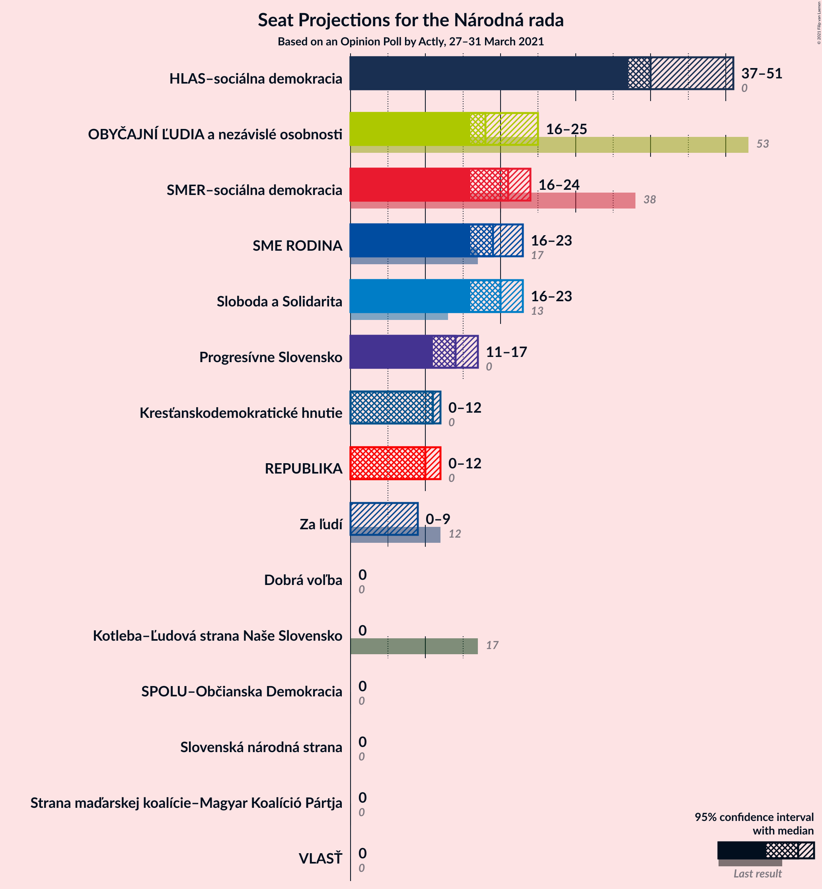
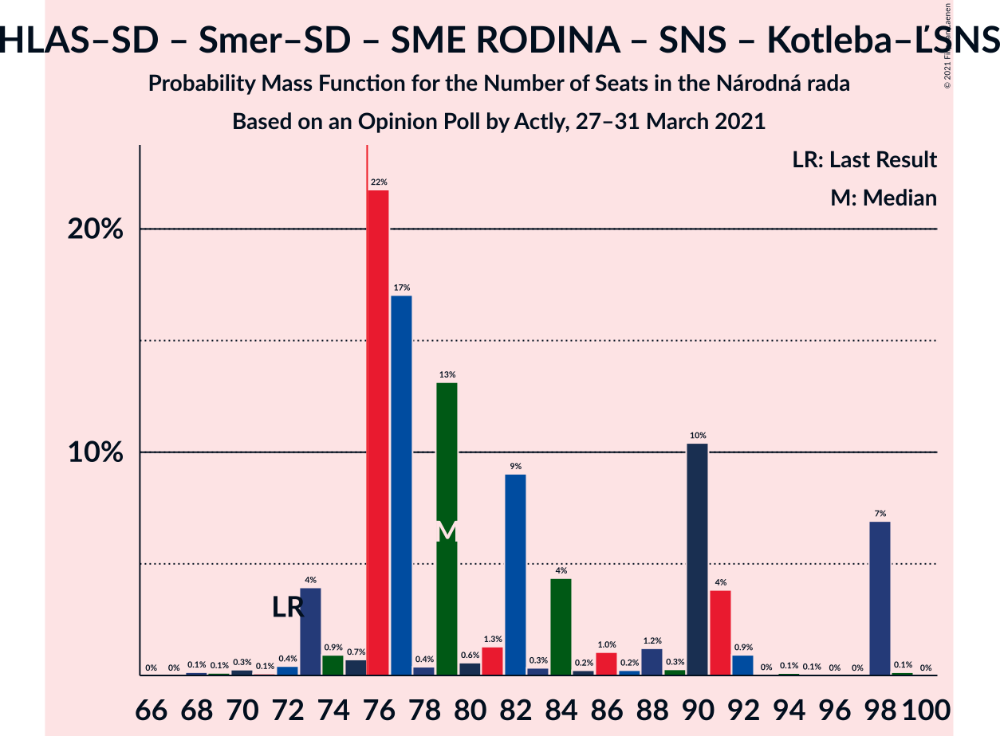

# Opinion Poll by Actly, 27–31 March 2021

<a href="#voting-intentions">Voting Intentions</a> | <a href="#seats">Seats</a> | <a href="#coalitions">Coalitions</a> | <a href="#technical-information">Technical Information</a>

## Voting Intentions

### Confidence Intervals

| Party | Last Result | Poll Result | 80% Confidence Interval | 90% Confidence Interval | 95% Confidence Interval | 99% Confidence Interval |
|:-----:|:-----------:|:-----------:|:-----------------------:|:-----------------------:|:-----------------------:|:-----------------------:|
| HLAS–sociálna demokracia | 0.0% | 22.7% | 21.1–24.5% |20.6–25.0% |20.2–25.4% |19.4–26.3% |
| SMER–sociálna demokracia | 18.3% | 10.5% | 9.3–11.8% |9.0–12.2% |8.7–12.6% |8.2–13.2% |
| Sloboda a Solidarita | 6.2% | 10.3% | 9.2–11.6% |8.8–12.0% |8.6–12.3% |8.0–13.0% |
| OBYČAJNÍ ĽUDIA a nezávislé osobnosti | 25.0% | 9.6% | 8.5–10.9% |8.2–11.3% |7.9–11.6% |7.4–12.2% |
| SME RODINA | 8.2% | 9.5% | 8.4–10.8% |8.1–11.2% |7.8–11.5% |7.3–12.1% |
| Progresívne Slovensko | 7.0% | 7.4% | 6.4–8.6% |6.2–8.9% |5.9–9.2% |5.5–9.8% |
| Kresťanskodemokratické hnutie | 4.6% | 5.6% | 4.8–6.6% |4.5–7.0% |4.3–7.2% |4.0–7.7% |
| REPUBLIKA | 0.0% | 4.9% | 4.1–5.9% |3.9–6.2% |3.7–6.4% |3.4–6.9% |
| Strana maďarskej koalície–Magyar Koalíció Pártja | 3.9% | 4.1% | 3.4–5.0% |3.2–5.3% |3.0–5.5% |2.7–6.0% |
| Za ľudí | 5.8% | 3.7% | 3.0–4.6% |2.9–4.8% |2.7–5.1% |2.4–5.5% |
| Slovenská národná strana | 3.2% | 3.1% | 2.5–3.9% |2.3–4.2% |2.2–4.4% |1.9–4.8% |
| Kotleba–Ľudová strana Naše Slovensko | 8.0% | 2.9% | 2.3–3.7% |2.2–3.9% |2.0–4.1% |1.8–4.6% |
| Dobrá voľba | 3.1% | 2.1% | 1.6–2.8% |1.5–3.0% |1.4–3.2% |1.2–3.6% |
| SPOLU–Občianska Demokracia | 7.0% | 1.0% | 0.7–1.5% |0.6–1.7% |0.5–1.8% |0.4–2.1% |
| VLASŤ | 2.9% | 0.1% | 0.0–0.4% |0.0–0.5% |0.0–0.6% |0.0–0.7% |

*Note:* The poll result column reflects the actual value used in the calculations. Published results may vary slightly, and in addition be rounded to fewer digits.

## Seats

### Confidence Intervals

| Party | Last Result | Median | 80% Confidence Interval | 90% Confidence Interval | 95% Confidence Interval | 99% Confidence Interval |
|:-----:|:-----------:|:------:|:-----------------------:|:-----------------------:|:-----------------------:|:-----------------------:|
| <a href="#hlas–sociálna-demokracia">HLAS–sociálna demokracia</a> | 0 | 40 | 39–50 |37–51 |37–51 |35–51 |
| <a href="#smer–sociálna-demokracia">SMER–sociálna demokracia</a> | 38 | 21 | 18–23 |16–24 |16–24 |16–26 |
| <a href="#sloboda-a-solidarita">Sloboda a Solidarita</a> | 13 | 20 | 18–23 |18–23 |16–23 |16–29 |
| <a href="#obyčajní-ľudia-a-nezávislé-osobnosti">OBYČAJNÍ ĽUDIA a nezávislé osobnosti</a> | 53 | 18 | 18–23 |17–23 |16–25 |15–25 |
| <a href="#sme-rodina">SME RODINA</a> | 17 | 19 | 16–22 |16–23 |16–23 |14–23 |
| <a href="#progresívne-slovensko">Progresívne Slovensko</a> | 0 | 14 | 12–17 |12–17 |11–17 |11–19 |
| <a href="#kresťanskodemokratické-hnutie">Kresťanskodemokratické hnutie</a> | 0 | 11 | 0–12 |0–12 |0–12 |0–14 |
| <a href="#republika">REPUBLIKA</a> | 0 | 10 | 0–10 |0–11 |0–12 |0–12 |
| <a href="#strana-maďarskej-koalície–magyar-koalíció-pártja">Strana maďarskej koalície–Magyar Koalíció Pártja</a> | 0 | 0 | 0 |0 |0 |0–11 |
| <a href="#za-ľudí">Za ľudí</a> | 12 | 0 | 0 |0–9 |0–9 |0–10 |
| <a href="#slovenská-národná-strana">Slovenská národná strana</a> | 0 | 0 | 0 |0 |0 |0 |
| <a href="#kotleba–ľudová-strana-naše-slovensko">Kotleba–Ľudová strana Naše Slovensko</a> | 17 | 0 | 0 |0 |0 |0 |
| <a href="#dobrá-voľba">Dobrá voľba</a> | 0 | 0 | 0 |0 |0 |0 |
| <a href="#spolu–občianska-demokracia">SPOLU–Občianska Demokracia</a> | 0 | 0 | 0 |0 |0 |0 |
| <a href="#vlasť">VLASŤ</a> | 0 | 0 | 0 |0 |0 |0 |

### HLAS–sociálna demokracia

*For a full overview of the results for this party, see the [HLAS–sociálna demokracia](party-hlas–sociálnademokracia.html) page.*

| Number of Seats | Probability | Accumulated | Special Marks |
|:---------------:|:-----------:|:-----------:|:-------------:|
| 0 | 0% | 100% | Last Result |
| 1 | 0% | 100% |  |
| 2 | 0% | 100% |  |
| 3 | 0% | 100% |  |
| 4 | 0% | 100% |  |
| 5 | 0% | 100% |  |
| 6 | 0% | 100% |  |
| 7 | 0% | 100% |  |
| 8 | 0% | 100% |  |
| 9 | 0% | 100% |  |
| 10 | 0% | 100% |  |
| 11 | 0% | 100% |  |
| 12 | 0% | 100% |  |
| 13 | 0% | 100% |  |
| 14 | 0% | 100% |  |
| 15 | 0% | 100% |  |
| 16 | 0% | 100% |  |
| 17 | 0% | 100% |  |
| 18 | 0% | 100% |  |
| 19 | 0% | 100% |  |
| 20 | 0% | 100% |  |
| 21 | 0% | 100% |  |
| 22 | 0% | 100% |  |
| 23 | 0% | 100% |  |
| 24 | 0% | 100% |  |
| 25 | 0% | 100% |  |
| 26 | 0% | 100% |  |
| 27 | 0% | 100% |  |
| 28 | 0% | 100% |  |
| 29 | 0% | 100% |  |
| 30 | 0% | 100% |  |
| 31 | 0% | 100% |  |
| 32 | 0% | 100% |  |
| 33 | 0% | 100% |  |
| 34 | 0.2% | 100% |  |
| 35 | 0.5% | 99.8% |  |
| 36 | 0.2% | 99.3% |  |
| 37 | 4% | 99.1% |  |
| 38 | 4% | 95% |  |
| 39 | 26% | 91% |  |
| 40 | 24% | 65% | Median |
| 41 | 0.9% | 41% |  |
| 42 | 1.3% | 40% |  |
| 43 | 7% | 39% |  |
| 44 | 6% | 32% |  |
| 45 | 0.6% | 26% |  |
| 46 | 2% | 26% |  |
| 47 | 1.1% | 24% |  |
| 48 | 0.8% | 22% |  |
| 49 | 0.1% | 22% |  |
| 50 | 14% | 22% |  |
| 51 | 8% | 8% |  |
| 52 | 0% | 0.2% |  |
| 53 | 0.1% | 0.1% |  |
| 54 | 0% | 0% |  |

### SMER–sociálna demokracia

*For a full overview of the results for this party, see the [SMER–sociálna demokracia](party-smer–sociálnademokracia.html) page.*

| Number of Seats | Probability | Accumulated | Special Marks |
|:---------------:|:-----------:|:-----------:|:-------------:|
| 14 | 0.1% | 100% |  |
| 15 | 0.3% | 99.9% |  |
| 16 | 5% | 99.6% |  |
| 17 | 2% | 95% |  |
| 18 | 35% | 93% |  |
| 19 | 2% | 59% |  |
| 20 | 0.6% | 56% |  |
| 21 | 22% | 56% | Median |
| 22 | 17% | 34% |  |
| 23 | 8% | 16% |  |
| 24 | 7% | 9% |  |
| 25 | 0.3% | 2% |  |
| 26 | 1.0% | 1.3% |  |
| 27 | 0.2% | 0.3% |  |
| 28 | 0.1% | 0.2% |  |
| 29 | 0% | 0% |  |
| 30 | 0% | 0% |  |
| 31 | 0% | 0% |  |
| 32 | 0% | 0% |  |
| 33 | 0% | 0% |  |
| 34 | 0% | 0% |  |
| 35 | 0% | 0% |  |
| 36 | 0% | 0% |  |
| 37 | 0% | 0% |  |
| 38 | 0% | 0% | Last Result |

### Sloboda a Solidarita

*For a full overview of the results for this party, see the [Sloboda a Solidarita](party-slobodaasolidarita.html) page.*

| Number of Seats | Probability | Accumulated | Special Marks |
|:---------------:|:-----------:|:-----------:|:-------------:|
| 13 | 0% | 100% | Last Result |
| 14 | 0% | 100% |  |
| 15 | 0.1% | 100% |  |
| 16 | 4% | 99.8% |  |
| 17 | 0.6% | 96% |  |
| 18 | 22% | 95% |  |
| 19 | 15% | 73% |  |
| 20 | 13% | 58% | Median |
| 21 | 11% | 45% |  |
| 22 | 19% | 34% |  |
| 23 | 14% | 15% |  |
| 24 | 0.2% | 2% |  |
| 25 | 0.5% | 2% |  |
| 26 | 0.1% | 1.1% |  |
| 27 | 0.1% | 1.0% |  |
| 28 | 0% | 0.9% |  |
| 29 | 0.9% | 0.9% |  |
| 30 | 0% | 0% |  |

### OBYČAJNÍ ĽUDIA a nezávislé osobnosti

*For a full overview of the results for this party, see the [OBYČAJNÍ ĽUDIA a nezávislé osobnosti](party-obyčajníľudiaanezávisléosobnosti.html) page.*

| Number of Seats | Probability | Accumulated | Special Marks |
|:---------------:|:-----------:|:-----------:|:-------------:|
| 13 | 0% | 100% |  |
| 14 | 0.3% | 99.9% |  |
| 15 | 2% | 99.6% |  |
| 16 | 1.1% | 98% |  |
| 17 | 5% | 97% |  |
| 18 | 42% | 92% | Median |
| 19 | 25% | 50% |  |
| 20 | 12% | 25% |  |
| 21 | 0.5% | 12% |  |
| 22 | 2% | 12% |  |
| 23 | 7% | 10% |  |
| 24 | 0% | 3% |  |
| 25 | 3% | 3% |  |
| 26 | 0% | 0% |  |
| 27 | 0% | 0% |  |
| 28 | 0% | 0% |  |
| 29 | 0% | 0% |  |
| 30 | 0% | 0% |  |
| 31 | 0% | 0% |  |
| 32 | 0% | 0% |  |
| 33 | 0% | 0% |  |
| 34 | 0% | 0% |  |
| 35 | 0% | 0% |  |
| 36 | 0% | 0% |  |
| 37 | 0% | 0% |  |
| 38 | 0% | 0% |  |
| 39 | 0% | 0% |  |
| 40 | 0% | 0% |  |
| 41 | 0% | 0% |  |
| 42 | 0% | 0% |  |
| 43 | 0% | 0% |  |
| 44 | 0% | 0% |  |
| 45 | 0% | 0% |  |
| 46 | 0% | 0% |  |
| 47 | 0% | 0% |  |
| 48 | 0% | 0% |  |
| 49 | 0% | 0% |  |
| 50 | 0% | 0% |  |
| 51 | 0% | 0% |  |
| 52 | 0% | 0% |  |
| 53 | 0% | 0% | Last Result |

### SME RODINA

*For a full overview of the results for this party, see the [SME RODINA](party-smerodina.html) page.*

| Number of Seats | Probability | Accumulated | Special Marks |
|:---------------:|:-----------:|:-----------:|:-------------:|
| 13 | 0.1% | 100% |  |
| 14 | 0.6% | 99.9% |  |
| 15 | 1.1% | 99.3% |  |
| 16 | 18% | 98% |  |
| 17 | 1.3% | 80% | Last Result |
| 18 | 27% | 79% |  |
| 19 | 29% | 53% | Median |
| 20 | 1.4% | 24% |  |
| 21 | 10% | 22% |  |
| 22 | 5% | 12% |  |
| 23 | 7% | 7% |  |
| 24 | 0.1% | 0.2% |  |
| 25 | 0% | 0.2% |  |
| 26 | 0.2% | 0.2% |  |
| 27 | 0% | 0% |  |

### Progresívne Slovensko

*For a full overview of the results for this party, see the [Progresívne Slovensko](party-progresívneslovensko.html) page.*

| Number of Seats | Probability | Accumulated | Special Marks |
|:---------------:|:-----------:|:-----------:|:-------------:|
| 0 | 0% | 100% | Last Result |
| 1 | 0% | 100% |  |
| 2 | 0% | 100% |  |
| 3 | 0% | 100% |  |
| 4 | 0% | 100% |  |
| 5 | 0% | 100% |  |
| 6 | 0% | 100% |  |
| 7 | 0% | 100% |  |
| 8 | 0% | 100% |  |
| 9 | 0% | 100% |  |
| 10 | 0.2% | 100% |  |
| 11 | 4% | 99.8% |  |
| 12 | 18% | 96% |  |
| 13 | 22% | 78% |  |
| 14 | 13% | 56% | Median |
| 15 | 7% | 43% |  |
| 16 | 1.0% | 36% |  |
| 17 | 34% | 35% |  |
| 18 | 0.3% | 0.9% |  |
| 19 | 0.2% | 0.5% |  |
| 20 | 0.2% | 0.3% |  |
| 21 | 0.1% | 0.1% |  |
| 22 | 0% | 0% |  |

### Kresťanskodemokratické hnutie

*For a full overview of the results for this party, see the [Kresťanskodemokratické hnutie](party-kresťanskodemokratickéhnutie.html) page.*

| Number of Seats | Probability | Accumulated | Special Marks |
|:---------------:|:-----------:|:-----------:|:-------------:|
| 0 | 26% | 100% | Last Result |
| 1 | 0% | 74% |  |
| 2 | 0% | 74% |  |
| 3 | 0% | 74% |  |
| 4 | 0% | 74% |  |
| 5 | 0% | 74% |  |
| 6 | 0% | 74% |  |
| 7 | 0% | 74% |  |
| 8 | 0% | 74% |  |
| 9 | 0.2% | 74% |  |
| 10 | 22% | 73% |  |
| 11 | 41% | 52% | Median |
| 12 | 9% | 11% |  |
| 13 | 0.7% | 2% |  |
| 14 | 0.9% | 1.0% |  |
| 15 | 0% | 0.1% |  |
| 16 | 0.1% | 0.1% |  |
| 17 | 0% | 0% |  |

### REPUBLIKA

*For a full overview of the results for this party, see the [REPUBLIKA](party-republika.html) page.*

| Number of Seats | Probability | Accumulated | Special Marks |
|:---------------:|:-----------:|:-----------:|:-------------:|
| 0 | 41% | 100% | Last Result |
| 1 | 0% | 59% |  |
| 2 | 0% | 59% |  |
| 3 | 0% | 59% |  |
| 4 | 0% | 59% |  |
| 5 | 0% | 59% |  |
| 6 | 0% | 59% |  |
| 7 | 0% | 59% |  |
| 8 | 0% | 59% |  |
| 9 | 1.4% | 59% |  |
| 10 | 52% | 58% | Median |
| 11 | 0.7% | 6% |  |
| 12 | 5% | 5% |  |
| 13 | 0.1% | 0.3% |  |
| 14 | 0.1% | 0.2% |  |
| 15 | 0.1% | 0.1% |  |
| 16 | 0% | 0% |  |

### Strana maďarskej koalície–Magyar Koalíció Pártja

*For a full overview of the results for this party, see the [Strana maďarskej koalície–Magyar Koalíció Pártja](party-stranamaďarskejkoalície–magyarkoalíciópártja.html) page.*

| Number of Seats | Probability | Accumulated | Special Marks |
|:---------------:|:-----------:|:-----------:|:-------------:|
| 0 | 98% | 100% | Last Result, Median |
| 1 | 0% | 2% |  |
| 2 | 0% | 2% |  |
| 3 | 0% | 2% |  |
| 4 | 0% | 2% |  |
| 5 | 0% | 2% |  |
| 6 | 0% | 2% |  |
| 7 | 0% | 2% |  |
| 8 | 0% | 2% |  |
| 9 | 0.2% | 2% |  |
| 10 | 1.1% | 2% |  |
| 11 | 0.5% | 0.8% |  |
| 12 | 0.1% | 0.3% |  |
| 13 | 0.1% | 0.2% |  |
| 14 | 0% | 0% |  |

### Za ľudí

*For a full overview of the results for this party, see the [Za ľudí](party-zaľudí.html) page.*

| Number of Seats | Probability | Accumulated | Special Marks |
|:---------------:|:-----------:|:-----------:|:-------------:|
| 0 | 94% | 100% | Median |
| 1 | 0% | 6% |  |
| 2 | 0% | 6% |  |
| 3 | 0% | 6% |  |
| 4 | 0% | 6% |  |
| 5 | 0% | 6% |  |
| 6 | 0% | 6% |  |
| 7 | 0% | 6% |  |
| 8 | 0% | 6% |  |
| 9 | 4% | 6% |  |
| 10 | 2% | 2% |  |
| 11 | 0.2% | 0.2% |  |
| 12 | 0.1% | 0.1% | Last Result |
| 13 | 0% | 0% |  |

### Slovenská národná strana

*For a full overview of the results for this party, see the [Slovenská národná strana](party-slovenskánárodnástrana.html) page.*

| Number of Seats | Probability | Accumulated | Special Marks |
|:---------------:|:-----------:|:-----------:|:-------------:|
| 0 | 99.9% | 100% | Last Result, Median |
| 1 | 0% | 0.1% |  |
| 2 | 0% | 0.1% |  |
| 3 | 0% | 0.1% |  |
| 4 | 0% | 0.1% |  |
| 5 | 0% | 0.1% |  |
| 6 | 0% | 0.1% |  |
| 7 | 0% | 0.1% |  |
| 8 | 0% | 0.1% |  |
| 9 | 0% | 0.1% |  |
| 10 | 0% | 0% |  |

### Kotleba–Ľudová strana Naše Slovensko

*For a full overview of the results for this party, see the [Kotleba–Ľudová strana Naše Slovensko](party-kotleba–ľudovástrananašeslovensko.html) page.*

| Number of Seats | Probability | Accumulated | Special Marks |
|:---------------:|:-----------:|:-----------:|:-------------:|
| 0 | 99.9% | 100% | Median |
| 1 | 0% | 0.1% |  |
| 2 | 0% | 0.1% |  |
| 3 | 0% | 0.1% |  |
| 4 | 0% | 0.1% |  |
| 5 | 0% | 0.1% |  |
| 6 | 0% | 0.1% |  |
| 7 | 0% | 0.1% |  |
| 8 | 0% | 0.1% |  |
| 9 | 0% | 0.1% |  |
| 10 | 0% | 0% |  |
| 11 | 0% | 0% |  |
| 12 | 0% | 0% |  |
| 13 | 0% | 0% |  |
| 14 | 0% | 0% |  |
| 15 | 0% | 0% |  |
| 16 | 0% | 0% |  |
| 17 | 0% | 0% | Last Result |

### Dobrá voľba

*For a full overview of the results for this party, see the [Dobrá voľba](party-dobrávoľba.html) page.*

| Number of Seats | Probability | Accumulated | Special Marks |
|:---------------:|:-----------:|:-----------:|:-------------:|
| 0 | 100% | 100% | Last Result, Median |

### SPOLU–Občianska Demokracia

*For a full overview of the results for this party, see the [SPOLU–Občianska Demokracia](party-spolu–občianskademokracia.html) page.*

| Number of Seats | Probability | Accumulated | Special Marks |
|:---------------:|:-----------:|:-----------:|:-------------:|
| 0 | 100% | 100% | Last Result, Median |

### VLASŤ

*For a full overview of the results for this party, see the [VLASŤ](party-vlasť.html) page.*

| Number of Seats | Probability | Accumulated | Special Marks |
|:---------------:|:-----------:|:-----------:|:-------------:|
| 0 | 100% | 100% | Last Result, Median |

## Coalitions

### Confidence Intervals

| Coalition | Last Result | Median | Majority? | 80% Confidence Interval | 90% Confidence Interval | 95% Confidence Interval | 99% Confidence Interval |
|:---------:|:-----------:|:------:|:---------:|:-----------------------:|:-----------------------:|:-----------------------:|:-----------------------:|
| HLAS–sociálna demokracia – SMER–sociálna demokracia – SME RODINA – Slovenská národná strana – Kotleba–Ľudová strana Naše Slovensko | 72 | 79 | 93% | 76–91 | 74–98 | 73–98 | 70–98 |
| HLAS–sociálna demokracia – SMER–sociálna demokracia – SME RODINA | 55 | 79 | 93% | 76–91 | 73–98 | 73–98 | 70–98 |
| HLAS–sociálna demokracia – SMER–sociálna demokracia – SME RODINA – Slovenská národná strana | 55 | 79 | 93% | 76–91 | 73–98 | 73–98 | 70–98 |
| HLAS–sociálna demokracia – SMER–sociálna demokracia – Slovenská národná strana | 38 | 61 | 0% | 58–73 | 56–75 | 54–75 | 54–75 |
| HLAS–sociálna demokracia – SME RODINA – Slovenská národná strana – Kotleba–Ľudová strana Naše Slovensko | 34 | 58 | 0% | 55–69 | 55–74 | 55–74 | 51–74 |
| HLAS–sociálna demokracia – SME RODINA | 17 | 58 | 0% | 55–69 | 55–74 | 55–74 | 51–74 |
| HLAS–sociálna demokracia – SME RODINA – Slovenská národná strana | 17 | 58 | 0% | 55–69 | 55–74 | 55–74 | 51–74 |
| HLAS–sociálna demokracia – Slovenská národná strana | 0 | 40 | 0% | 39–50 | 38–51 | 37–51 | 35–51 |
| SMER–sociálna demokracia – SME RODINA – Slovenská národná strana – Kotleba–Ľudová strana Naše Slovensko | 72 | 39 | 0% | 36–42 | 35–47 | 34–47 | 32–47 |
| SMER–sociálna demokracia – SME RODINA | 55 | 39 | 0% | 36–42 | 35–47 | 34–47 | 32–47 |
| SMER–sociálna demokracia – SME RODINA – Slovenská národná strana | 55 | 39 | 0% | 36–42 | 35–47 | 34–47 | 32–47 |
| SMER–sociálna demokracia | 38 | 21 | 0% | 18–23 | 16–24 | 16–24 | 16–26 |
| SMER–sociálna demokracia – Slovenská národná strana | 38 | 21 | 0% | 18–23 | 16–24 | 16–24 | 16–26 |

### HLAS–sociálna demokracia – SMER–sociálna demokracia – SME RODINA – Slovenská národná strana – Kotleba–Ľudová strana Naše Slovensko

| Number of Seats | Probability | Accumulated | Special Marks |
|:---------------:|:-----------:|:-----------:|:-------------:|
| 68 | 0.1% | 100% |  |
| 69 | 0.1% | 99.8% |  |
| 70 | 0.3% | 99.7% |  |
| 71 | 0.1% | 99.5% |  |
| 72 | 0.4% | 99.4% | Last Result |
| 73 | 4% | 99.0% |  |
| 74 | 0.9% | 95% |  |
| 75 | 0.7% | 94% |  |
| 76 | 22% | 93% | Majority |
| 77 | 17% | 72% |  |
| 78 | 0.4% | 55% |  |
| 79 | 13% | 54% |  |
| 80 | 0.6% | 41% | Median |
| 81 | 1.3% | 40% |  |
| 82 | 9% | 39% |  |
| 83 | 0.3% | 30% |  |
| 84 | 4% | 30% |  |
| 85 | 0.2% | 25% |  |
| 86 | 1.0% | 25% |  |
| 87 | 0.2% | 24% |  |
| 88 | 1.2% | 24% |  |
| 89 | 0.3% | 23% |  |
| 90 | 10% | 22% |  |
| 91 | 4% | 12% |  |
| 92 | 0.9% | 8% |  |
| 93 | 0% | 7% |  |
| 94 | 0.1% | 7% |  |
| 95 | 0.1% | 7% |  |
| 96 | 0% | 7% |  |
| 97 | 0% | 7% |  |
| 98 | 7% | 7% |  |
| 99 | 0.1% | 0.1% |  |
| 100 | 0% | 0% |  |

### HLAS–sociálna demokracia – SMER–sociálna demokracia – SME RODINA

| Number of Seats | Probability | Accumulated | Special Marks |
|:---------------:|:-----------:|:-----------:|:-------------:|
| 55 | 0% | 100% | Last Result |
| 56 | 0% | 100% |  |
| 57 | 0% | 100% |  |
| 58 | 0% | 100% |  |
| 59 | 0% | 100% |  |
| 60 | 0% | 100% |  |
| 61 | 0% | 100% |  |
| 62 | 0% | 100% |  |
| 63 | 0% | 100% |  |
| 64 | 0% | 100% |  |
| 65 | 0% | 100% |  |
| 66 | 0% | 100% |  |
| 67 | 0% | 100% |  |
| 68 | 0.2% | 100% |  |
| 69 | 0.1% | 99.8% |  |
| 70 | 0.3% | 99.7% |  |
| 71 | 0.1% | 99.4% |  |
| 72 | 0.4% | 99.3% |  |
| 73 | 4% | 98.9% |  |
| 74 | 0.9% | 95% |  |
| 75 | 0.7% | 94% |  |
| 76 | 22% | 93% | Majority |
| 77 | 17% | 72% |  |
| 78 | 0.4% | 55% |  |
| 79 | 13% | 54% |  |
| 80 | 0.6% | 41% | Median |
| 81 | 1.3% | 40% |  |
| 82 | 9% | 39% |  |
| 83 | 0.3% | 30% |  |
| 84 | 4% | 30% |  |
| 85 | 0.2% | 25% |  |
| 86 | 1.0% | 25% |  |
| 87 | 0.2% | 24% |  |
| 88 | 1.2% | 24% |  |
| 89 | 0.3% | 23% |  |
| 90 | 10% | 22% |  |
| 91 | 4% | 12% |  |
| 92 | 0.9% | 8% |  |
| 93 | 0% | 7% |  |
| 94 | 0.1% | 7% |  |
| 95 | 0% | 7% |  |
| 96 | 0% | 7% |  |
| 97 | 0% | 7% |  |
| 98 | 7% | 7% |  |
| 99 | 0.1% | 0.1% |  |
| 100 | 0% | 0% |  |

### HLAS–sociálna demokracia – SMER–sociálna demokracia – SME RODINA – Slovenská národná strana

| Number of Seats | Probability | Accumulated | Special Marks |
|:---------------:|:-----------:|:-----------:|:-------------:|
| 55 | 0% | 100% | Last Result |
| 56 | 0% | 100% |  |
| 57 | 0% | 100% |  |
| 58 | 0% | 100% |  |
| 59 | 0% | 100% |  |
| 60 | 0% | 100% |  |
| 61 | 0% | 100% |  |
| 62 | 0% | 100% |  |
| 63 | 0% | 100% |  |
| 64 | 0% | 100% |  |
| 65 | 0% | 100% |  |
| 66 | 0% | 100% |  |
| 67 | 0% | 100% |  |
| 68 | 0.2% | 100% |  |
| 69 | 0.1% | 99.8% |  |
| 70 | 0.3% | 99.7% |  |
| 71 | 0.1% | 99.4% |  |
| 72 | 0.4% | 99.3% |  |
| 73 | 4% | 98.9% |  |
| 74 | 0.9% | 95% |  |
| 75 | 0.7% | 94% |  |
| 76 | 22% | 93% | Majority |
| 77 | 17% | 72% |  |
| 78 | 0.4% | 55% |  |
| 79 | 13% | 54% |  |
| 80 | 0.6% | 41% | Median |
| 81 | 1.3% | 40% |  |
| 82 | 9% | 39% |  |
| 83 | 0.3% | 30% |  |
| 84 | 4% | 30% |  |
| 85 | 0.2% | 25% |  |
| 86 | 1.0% | 25% |  |
| 87 | 0.2% | 24% |  |
| 88 | 1.2% | 24% |  |
| 89 | 0.3% | 23% |  |
| 90 | 10% | 22% |  |
| 91 | 4% | 12% |  |
| 92 | 0.9% | 8% |  |
| 93 | 0% | 7% |  |
| 94 | 0.1% | 7% |  |
| 95 | 0% | 7% |  |
| 96 | 0% | 7% |  |
| 97 | 0% | 7% |  |
| 98 | 7% | 7% |  |
| 99 | 0.1% | 0.1% |  |
| 100 | 0% | 0% |  |

### HLAS–sociálna demokracia – SMER–sociálna demokracia – Slovenská národná strana

| Number of Seats | Probability | Accumulated | Special Marks |
|:---------------:|:-----------:|:-----------:|:-------------:|
| 38 | 0% | 100% | Last Result |
| 39 | 0% | 100% |  |
| 40 | 0% | 100% |  |
| 41 | 0% | 100% |  |
| 42 | 0% | 100% |  |
| 43 | 0% | 100% |  |
| 44 | 0% | 100% |  |
| 45 | 0% | 100% |  |
| 46 | 0% | 100% |  |
| 47 | 0% | 100% |  |
| 48 | 0% | 100% |  |
| 49 | 0% | 100% |  |
| 50 | 0% | 100% |  |
| 51 | 0% | 100% |  |
| 52 | 0.1% | 100% |  |
| 53 | 0.2% | 99.9% |  |
| 54 | 4% | 99.7% |  |
| 55 | 0.5% | 96% |  |
| 56 | 0.2% | 95% |  |
| 57 | 0.2% | 95% |  |
| 58 | 23% | 95% |  |
| 59 | 0.4% | 71% |  |
| 60 | 13% | 71% |  |
| 61 | 26% | 58% | Median |
| 62 | 6% | 32% |  |
| 63 | 0.5% | 27% |  |
| 64 | 0.4% | 26% |  |
| 65 | 0.1% | 26% |  |
| 66 | 0.6% | 26% |  |
| 67 | 1.3% | 25% |  |
| 68 | 0.8% | 24% |  |
| 69 | 0.5% | 23% |  |
| 70 | 0.5% | 23% |  |
| 71 | 10% | 22% |  |
| 72 | 1.0% | 12% |  |
| 73 | 4% | 11% |  |
| 74 | 0% | 7% |  |
| 75 | 7% | 7% |  |
| 76 | 0% | 0% | Majority |

### HLAS–sociálna demokracia – SME RODINA – Slovenská národná strana – Kotleba–Ľudová strana Naše Slovensko

| Number of Seats | Probability | Accumulated | Special Marks |
|:---------------:|:-----------:|:-----------:|:-------------:|
| 34 | 0% | 100% | Last Result |
| 35 | 0% | 100% |  |
| 36 | 0% | 100% |  |
| 37 | 0% | 100% |  |
| 38 | 0% | 100% |  |
| 39 | 0% | 100% |  |
| 40 | 0% | 100% |  |
| 41 | 0% | 100% |  |
| 42 | 0% | 100% |  |
| 43 | 0% | 100% |  |
| 44 | 0% | 100% |  |
| 45 | 0% | 100% |  |
| 46 | 0% | 100% |  |
| 47 | 0% | 100% |  |
| 48 | 0% | 100% |  |
| 49 | 0.1% | 100% |  |
| 50 | 0.3% | 99.8% |  |
| 51 | 0% | 99.5% |  |
| 52 | 0.1% | 99.5% |  |
| 53 | 0.2% | 99.4% |  |
| 54 | 0.3% | 99.2% |  |
| 55 | 17% | 98.9% |  |
| 56 | 4% | 82% |  |
| 57 | 4% | 78% |  |
| 58 | 31% | 74% |  |
| 59 | 0.7% | 42% | Median |
| 60 | 0.9% | 42% |  |
| 61 | 2% | 41% |  |
| 62 | 0.2% | 38% |  |
| 63 | 2% | 38% |  |
| 64 | 7% | 36% |  |
| 65 | 0.2% | 29% |  |
| 66 | 5% | 29% |  |
| 67 | 2% | 24% |  |
| 68 | 4% | 22% |  |
| 69 | 11% | 18% |  |
| 70 | 0.1% | 7% |  |
| 71 | 0.2% | 7% |  |
| 72 | 0.1% | 7% |  |
| 73 | 0% | 7% |  |
| 74 | 7% | 7% |  |
| 75 | 0% | 0% |  |

### HLAS–sociálna demokracia – SME RODINA

| Number of Seats | Probability | Accumulated | Special Marks |
|:---------------:|:-----------:|:-----------:|:-------------:|
| 17 | 0% | 100% | Last Result |
| 18 | 0% | 100% |  |
| 19 | 0% | 100% |  |
| 20 | 0% | 100% |  |
| 21 | 0% | 100% |  |
| 22 | 0% | 100% |  |
| 23 | 0% | 100% |  |
| 24 | 0% | 100% |  |
| 25 | 0% | 100% |  |
| 26 | 0% | 100% |  |
| 27 | 0% | 100% |  |
| 28 | 0% | 100% |  |
| 29 | 0% | 100% |  |
| 30 | 0% | 100% |  |
| 31 | 0% | 100% |  |
| 32 | 0% | 100% |  |
| 33 | 0% | 100% |  |
| 34 | 0% | 100% |  |
| 35 | 0% | 100% |  |
| 36 | 0% | 100% |  |
| 37 | 0% | 100% |  |
| 38 | 0% | 100% |  |
| 39 | 0% | 100% |  |
| 40 | 0% | 100% |  |
| 41 | 0% | 100% |  |
| 42 | 0% | 100% |  |
| 43 | 0% | 100% |  |
| 44 | 0% | 100% |  |
| 45 | 0% | 100% |  |
| 46 | 0% | 100% |  |
| 47 | 0% | 100% |  |
| 48 | 0% | 100% |  |
| 49 | 0.2% | 100% |  |
| 50 | 0.3% | 99.8% |  |
| 51 | 0.1% | 99.5% |  |
| 52 | 0.1% | 99.4% |  |
| 53 | 0.2% | 99.3% |  |
| 54 | 0.3% | 99.2% |  |
| 55 | 17% | 98.9% |  |
| 56 | 4% | 82% |  |
| 57 | 4% | 78% |  |
| 58 | 31% | 73% |  |
| 59 | 0.7% | 42% | Median |
| 60 | 0.9% | 42% |  |
| 61 | 2% | 41% |  |
| 62 | 0.2% | 38% |  |
| 63 | 2% | 38% |  |
| 64 | 7% | 36% |  |
| 65 | 0.2% | 29% |  |
| 66 | 5% | 29% |  |
| 67 | 2% | 24% |  |
| 68 | 4% | 22% |  |
| 69 | 11% | 18% |  |
| 70 | 0.1% | 7% |  |
| 71 | 0.2% | 7% |  |
| 72 | 0.1% | 7% |  |
| 73 | 0% | 7% |  |
| 74 | 7% | 7% |  |
| 75 | 0% | 0% |  |

### HLAS–sociálna demokracia – SME RODINA – Slovenská národná strana

| Number of Seats | Probability | Accumulated | Special Marks |
|:---------------:|:-----------:|:-----------:|:-------------:|
| 17 | 0% | 100% | Last Result |
| 18 | 0% | 100% |  |
| 19 | 0% | 100% |  |
| 20 | 0% | 100% |  |
| 21 | 0% | 100% |  |
| 22 | 0% | 100% |  |
| 23 | 0% | 100% |  |
| 24 | 0% | 100% |  |
| 25 | 0% | 100% |  |
| 26 | 0% | 100% |  |
| 27 | 0% | 100% |  |
| 28 | 0% | 100% |  |
| 29 | 0% | 100% |  |
| 30 | 0% | 100% |  |
| 31 | 0% | 100% |  |
| 32 | 0% | 100% |  |
| 33 | 0% | 100% |  |
| 34 | 0% | 100% |  |
| 35 | 0% | 100% |  |
| 36 | 0% | 100% |  |
| 37 | 0% | 100% |  |
| 38 | 0% | 100% |  |
| 39 | 0% | 100% |  |
| 40 | 0% | 100% |  |
| 41 | 0% | 100% |  |
| 42 | 0% | 100% |  |
| 43 | 0% | 100% |  |
| 44 | 0% | 100% |  |
| 45 | 0% | 100% |  |
| 46 | 0% | 100% |  |
| 47 | 0% | 100% |  |
| 48 | 0% | 100% |  |
| 49 | 0.1% | 100% |  |
| 50 | 0.3% | 99.8% |  |
| 51 | 0.1% | 99.5% |  |
| 52 | 0.1% | 99.4% |  |
| 53 | 0.2% | 99.4% |  |
| 54 | 0.3% | 99.2% |  |
| 55 | 17% | 98.9% |  |
| 56 | 4% | 82% |  |
| 57 | 4% | 78% |  |
| 58 | 31% | 73% |  |
| 59 | 0.7% | 42% | Median |
| 60 | 0.9% | 42% |  |
| 61 | 2% | 41% |  |
| 62 | 0.2% | 38% |  |
| 63 | 2% | 38% |  |
| 64 | 7% | 36% |  |
| 65 | 0.2% | 29% |  |
| 66 | 5% | 29% |  |
| 67 | 2% | 24% |  |
| 68 | 4% | 22% |  |
| 69 | 11% | 18% |  |
| 70 | 0.1% | 7% |  |
| 71 | 0.2% | 7% |  |
| 72 | 0.1% | 7% |  |
| 73 | 0% | 7% |  |
| 74 | 7% | 7% |  |
| 75 | 0% | 0% |  |

### HLAS–sociálna demokracia – Slovenská národná strana

| Number of Seats | Probability | Accumulated | Special Marks |
|:---------------:|:-----------:|:-----------:|:-------------:|
| 0 | 0% | 100% | Last Result |
| 1 | 0% | 100% |  |
| 2 | 0% | 100% |  |
| 3 | 0% | 100% |  |
| 4 | 0% | 100% |  |
| 5 | 0% | 100% |  |
| 6 | 0% | 100% |  |
| 7 | 0% | 100% |  |
| 8 | 0% | 100% |  |
| 9 | 0% | 100% |  |
| 10 | 0% | 100% |  |
| 11 | 0% | 100% |  |
| 12 | 0% | 100% |  |
| 13 | 0% | 100% |  |
| 14 | 0% | 100% |  |
| 15 | 0% | 100% |  |
| 16 | 0% | 100% |  |
| 17 | 0% | 100% |  |
| 18 | 0% | 100% |  |
| 19 | 0% | 100% |  |
| 20 | 0% | 100% |  |
| 21 | 0% | 100% |  |
| 22 | 0% | 100% |  |
| 23 | 0% | 100% |  |
| 24 | 0% | 100% |  |
| 25 | 0% | 100% |  |
| 26 | 0% | 100% |  |
| 27 | 0% | 100% |  |
| 28 | 0% | 100% |  |
| 29 | 0% | 100% |  |
| 30 | 0% | 100% |  |
| 31 | 0% | 100% |  |
| 32 | 0% | 100% |  |
| 33 | 0% | 100% |  |
| 34 | 0.2% | 100% |  |
| 35 | 0.5% | 99.8% |  |
| 36 | 0.2% | 99.3% |  |
| 37 | 4% | 99.1% |  |
| 38 | 4% | 95% |  |
| 39 | 26% | 91% |  |
| 40 | 24% | 65% | Median |
| 41 | 0.9% | 41% |  |
| 42 | 1.2% | 40% |  |
| 43 | 7% | 39% |  |
| 44 | 6% | 32% |  |
| 45 | 0.6% | 26% |  |
| 46 | 2% | 26% |  |
| 47 | 1.2% | 24% |  |
| 48 | 0.8% | 23% |  |
| 49 | 0.2% | 22% |  |
| 50 | 14% | 22% |  |
| 51 | 8% | 8% |  |
| 52 | 0.1% | 0.2% |  |
| 53 | 0.1% | 0.1% |  |
| 54 | 0% | 0% |  |

### SMER–sociálna demokracia – SME RODINA – Slovenská národná strana – Kotleba–Ľudová strana Naše Slovensko

| Number of Seats | Probability | Accumulated | Special Marks |
|:---------------:|:-----------:|:-----------:|:-------------:|
| 31 | 0.2% | 100% |  |
| 32 | 0.4% | 99.8% |  |
| 33 | 0.5% | 99.4% |  |
| 34 | 2% | 98.9% |  |
| 35 | 5% | 97% |  |
| 36 | 22% | 92% |  |
| 37 | 2% | 70% |  |
| 38 | 17% | 68% |  |
| 39 | 7% | 50% |  |
| 40 | 24% | 43% | Median |
| 41 | 3% | 19% |  |
| 42 | 6% | 16% |  |
| 43 | 0.2% | 9% |  |
| 44 | 0.7% | 9% |  |
| 45 | 0.3% | 9% |  |
| 46 | 1.1% | 8% |  |
| 47 | 7% | 7% |  |
| 48 | 0% | 0.2% |  |
| 49 | 0% | 0.2% |  |
| 50 | 0% | 0.2% |  |
| 51 | 0% | 0.1% |  |
| 52 | 0% | 0.1% |  |
| 53 | 0% | 0.1% |  |
| 54 | 0.1% | 0.1% |  |
| 55 | 0% | 0% |  |
| 56 | 0% | 0% |  |
| 57 | 0% | 0% |  |
| 58 | 0% | 0% |  |
| 59 | 0% | 0% |  |
| 60 | 0% | 0% |  |
| 61 | 0% | 0% |  |
| 62 | 0% | 0% |  |
| 63 | 0% | 0% |  |
| 64 | 0% | 0% |  |
| 65 | 0% | 0% |  |
| 66 | 0% | 0% |  |
| 67 | 0% | 0% |  |
| 68 | 0% | 0% |  |
| 69 | 0% | 0% |  |
| 70 | 0% | 0% |  |
| 71 | 0% | 0% |  |
| 72 | 0% | 0% | Last Result |

### SMER–sociálna demokracia – SME RODINA

| Number of Seats | Probability | Accumulated | Special Marks |
|:---------------:|:-----------:|:-----------:|:-------------:|
| 31 | 0.2% | 100% |  |
| 32 | 0.4% | 99.7% |  |
| 33 | 0.5% | 99.3% |  |
| 34 | 2% | 98.8% |  |
| 35 | 5% | 97% |  |
| 36 | 22% | 92% |  |
| 37 | 2% | 70% |  |
| 38 | 17% | 67% |  |
| 39 | 7% | 50% |  |
| 40 | 24% | 43% | Median |
| 41 | 3% | 19% |  |
| 42 | 6% | 16% |  |
| 43 | 0.2% | 9% |  |
| 44 | 0.6% | 9% |  |
| 45 | 0.3% | 9% |  |
| 46 | 1.1% | 8% |  |
| 47 | 7% | 7% |  |
| 48 | 0% | 0.2% |  |
| 49 | 0% | 0.2% |  |
| 50 | 0% | 0.2% |  |
| 51 | 0% | 0.1% |  |
| 52 | 0% | 0.1% |  |
| 53 | 0% | 0.1% |  |
| 54 | 0.1% | 0.1% |  |
| 55 | 0% | 0% | Last Result |

### SMER–sociálna demokracia – SME RODINA – Slovenská národná strana

| Number of Seats | Probability | Accumulated | Special Marks |
|:---------------:|:-----------:|:-----------:|:-------------:|
| 31 | 0.2% | 100% |  |
| 32 | 0.4% | 99.7% |  |
| 33 | 0.5% | 99.3% |  |
| 34 | 2% | 98.8% |  |
| 35 | 5% | 97% |  |
| 36 | 22% | 92% |  |
| 37 | 2% | 70% |  |
| 38 | 17% | 68% |  |
| 39 | 7% | 50% |  |
| 40 | 24% | 43% | Median |
| 41 | 3% | 19% |  |
| 42 | 6% | 16% |  |
| 43 | 0.2% | 9% |  |
| 44 | 0.7% | 9% |  |
| 45 | 0.3% | 9% |  |
| 46 | 1.1% | 8% |  |
| 47 | 7% | 7% |  |
| 48 | 0% | 0.2% |  |
| 49 | 0% | 0.2% |  |
| 50 | 0% | 0.2% |  |
| 51 | 0% | 0.1% |  |
| 52 | 0% | 0.1% |  |
| 53 | 0% | 0.1% |  |
| 54 | 0.1% | 0.1% |  |
| 55 | 0% | 0% | Last Result |

### SMER–sociálna demokracia

| Number of Seats | Probability | Accumulated | Special Marks |
|:---------------:|:-----------:|:-----------:|:-------------:|
| 14 | 0.1% | 100% |  |
| 15 | 0.3% | 99.9% |  |
| 16 | 5% | 99.6% |  |
| 17 | 2% | 95% |  |
| 18 | 35% | 93% |  |
| 19 | 2% | 59% |  |
| 20 | 0.6% | 56% |  |
| 21 | 22% | 56% | Median |
| 22 | 17% | 34% |  |
| 23 | 8% | 16% |  |
| 24 | 7% | 9% |  |
| 25 | 0.3% | 2% |  |
| 26 | 1.0% | 1.3% |  |
| 27 | 0.2% | 0.3% |  |
| 28 | 0.1% | 0.2% |  |
| 29 | 0% | 0% |  |
| 30 | 0% | 0% |  |
| 31 | 0% | 0% |  |
| 32 | 0% | 0% |  |
| 33 | 0% | 0% |  |
| 34 | 0% | 0% |  |
| 35 | 0% | 0% |  |
| 36 | 0% | 0% |  |
| 37 | 0% | 0% |  |
| 38 | 0% | 0% | Last Result |

### SMER–sociálna demokracia – Slovenská národná strana

| Number of Seats | Probability | Accumulated | Special Marks |
|:---------------:|:-----------:|:-----------:|:-------------:|
| 15 | 0.3% | 100% |  |
| 16 | 5% | 99.6% |  |
| 17 | 2% | 95% |  |
| 18 | 35% | 93% |  |
| 19 | 2% | 59% |  |
| 20 | 0.6% | 57% |  |
| 21 | 22% | 56% | Median |
| 22 | 17% | 34% |  |
| 23 | 8% | 17% |  |
| 24 | 7% | 9% |  |
| 25 | 0.3% | 2% |  |
| 26 | 1.0% | 1.4% |  |
| 27 | 0.2% | 0.4% |  |
| 28 | 0.1% | 0.2% |  |
| 29 | 0% | 0% |  |
| 30 | 0% | 0% |  |
| 31 | 0% | 0% |  |
| 32 | 0% | 0% |  |
| 33 | 0% | 0% |  |
| 34 | 0% | 0% |  |
| 35 | 0% | 0% |  |
| 36 | 0% | 0% |  |
| 37 | 0% | 0% |  |
| 38 | 0% | 0% | Last Result |

## Technical Information

### Opinion Poll

+ **Polling firm:** Actly
+ **Commissioner(s):** —
+ **Fieldwork period:** 27–31 March 2021

### Calculations

+ **Sample size:** 1000
+ **Simulations done:** 1,048,576
+ **Error estimate:** 3.12%

