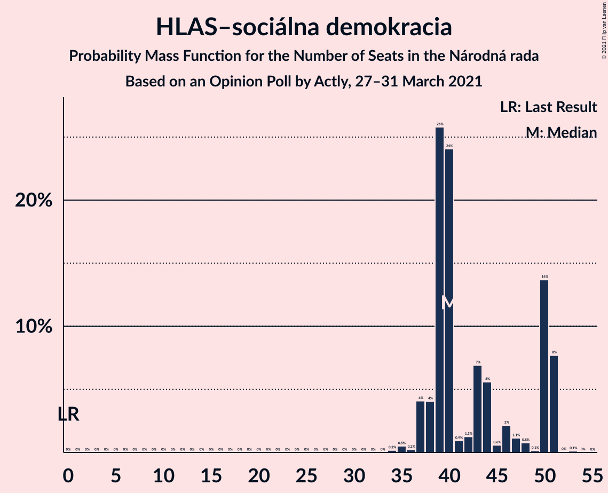
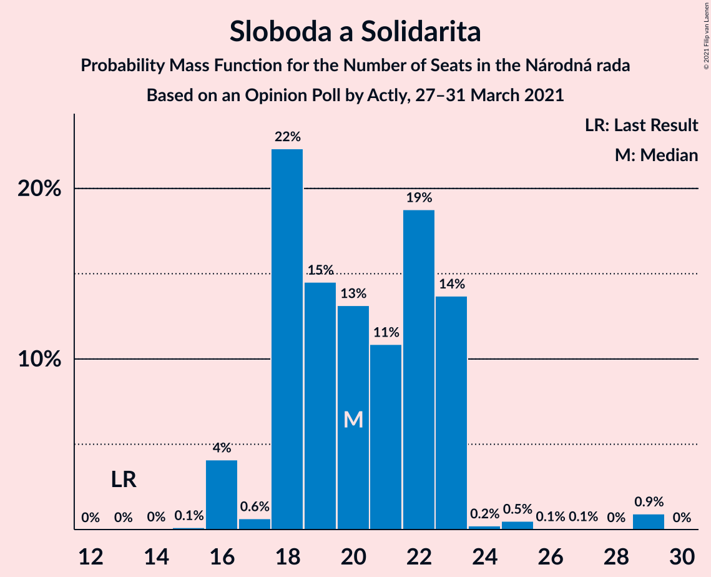
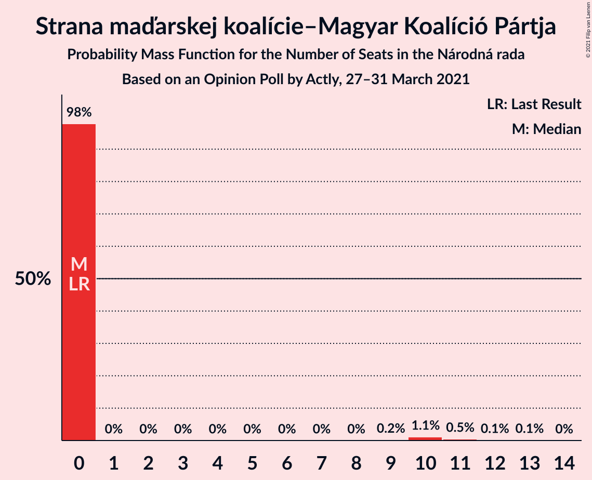
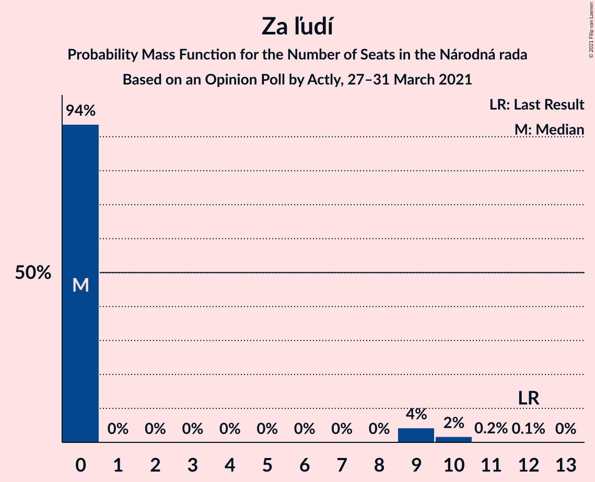
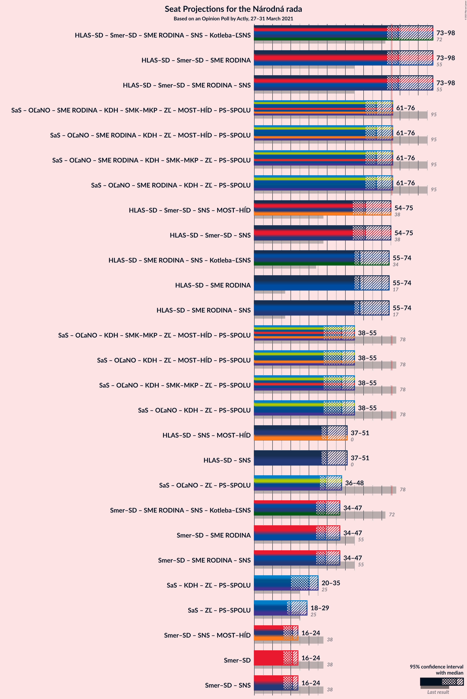

# Opinion Poll by Actly, 27–31 March 2021

<a href="#voting-intentions">Voting Intentions</a> | <a href="#seats">Seats</a> | <a href="#coalitions">Coalitions</a> | <a href="#technical-information">Technical Information</a>

## Voting Intentions

### Confidence Intervals

| Party | Last Result | Poll Result | 80% Confidence Interval | 90% Confidence Interval | 95% Confidence Interval | 99% Confidence Interval |
|:-----:|:-----------:|:-----------:|:-----------------------:|:-----------------------:|:-----------------------:|:-----------------------:|
| HLAS–sociálna demokracia | 0.0% | 22.7% | 21.1–24.5% |20.6–25.0% |20.2–25.4% |19.4–26.3% |
| SMER–sociálna demokracia | 18.3% | 10.5% | 9.3–11.8% |9.0–12.2% |8.7–12.6% |8.2–13.2% |
| Sloboda a Solidarita | 6.2% | 10.3% | 9.2–11.6% |8.8–12.0% |8.6–12.3% |8.0–13.0% |
| OBYČAJNÍ ĽUDIA a nezávislé osobnosti | 25.0% | 9.6% | 8.5–10.9% |8.2–11.3% |7.9–11.6% |7.4–12.2% |
| SME RODINA | 8.2% | 9.5% | 8.4–10.8% |8.1–11.2% |7.8–11.5% |7.3–12.1% |
| Progresívne Slovensko | 7.0% | 7.4% | 6.4–8.6% |6.2–8.9% |5.9–9.2% |5.5–9.8% |
| Kresťanskodemokratické hnutie | 4.6% | 5.6% | 4.8–6.6% |4.5–7.0% |4.3–7.2% |4.0–7.7% |
| REPUBLIKA | 0.0% | 4.9% | 4.1–5.9% |3.9–6.2% |3.7–6.4% |3.4–6.9% |
| Strana maďarskej koalície–Magyar Koalíció Pártja | 3.9% | 4.1% | 3.4–5.0% |3.2–5.3% |3.0–5.5% |2.7–6.0% |
| Za ľudí | 5.8% | 3.7% | 3.0–4.6% |2.9–4.8% |2.7–5.1% |2.4–5.5% |
| Slovenská národná strana | 3.2% | 3.1% | 2.5–3.9% |2.3–4.2% |2.2–4.4% |1.9–4.8% |
| Kotleba–Ľudová strana Naše Slovensko | 8.0% | 2.9% | 2.3–3.7% |2.2–3.9% |2.0–4.1% |1.8–4.6% |
| Dobrá voľba | 3.1% | 2.1% | 1.6–2.8% |1.5–3.0% |1.4–3.2% |1.2–3.6% |
| SPOLU–Občianska Demokracia | 7.0% | 1.0% | 0.7–1.5% |0.6–1.7% |0.5–1.8% |0.4–2.1% |
| VLASŤ | 2.9% | 0.1% | 0.0–0.4% |0.0–0.5% |0.0–0.6% |0.0–0.7% |

*Note:* The poll result column reflects the actual value used in the calculations. Published results may vary slightly, and in addition be rounded to fewer digits.

## Seats

### Confidence Intervals

| Party | Last Result | Median | 80% Confidence Interval | 90% Confidence Interval | 95% Confidence Interval | 99% Confidence Interval |
|:-----:|:-----------:|:------:|:-----------------------:|:-----------------------:|:-----------------------:|:-----------------------:|
| <a href="#hlas–sociálna-demokracia">HLAS–sociálna demokracia</a> | 0 | 46 | 37–51 |37–51 |37–51 |35–51 |
| <a href="#smer–sociálna-demokracia">SMER–sociálna demokracia</a> | 38 | 23 | 14–26 |14–26 |14–26 |14–26 |
| <a href="#sloboda-a-solidarita">Sloboda a Solidarita</a> | 13 | 18 | 13–19 |13–20 |13–20 |13–25 |
| <a href="#obyčajní-ľudia-a-nezávislé-osobnosti">OBYČAJNÍ ĽUDIA a nezávislé osobnosti</a> | 53 | 22 | 18–22 |18–22 |17–22 |15–23 |
| <a href="#sme-rodina">SME RODINA</a> | 17 | 17 | 12–19 |12–19 |12–19 |12–20 |
| <a href="#progresívne-slovensko">Progresívne Slovensko</a> | 0 | 16 | 13–21 |13–21 |11–21 |11–21 |
| <a href="#kresťanskodemokratické-hnutie">Kresťanskodemokratické hnutie</a> | 0 | 0 | 0–12 |0–12 |0–12 |0–12 |
| <a href="#republika">REPUBLIKA</a> | 0 | 9 | 0–11 |0–12 |0–13 |0–13 |
| <a href="#strana-maďarskej-koalície–magyar-koalíció-pártja">Strana maďarskej koalície–Magyar Koalíció Pártja</a> | 0 | 0 | 0 |0 |0 |0–14 |
| <a href="#za-ľudí">Za ľudí</a> | 12 | 0 | 0–9 |0–9 |0–9 |0–9 |
| <a href="#slovenská-národná-strana">Slovenská národná strana</a> | 0 | 0 | 0 |0 |0 |0 |
| <a href="#kotleba–ľudová-strana-naše-slovensko">Kotleba–Ľudová strana Naše Slovensko</a> | 17 | 0 | 0 |0 |0 |0 |
| <a href="#dobrá-voľba">Dobrá voľba</a> | 0 | 0 | 0 |0 |0 |0 |
| <a href="#spolu–občianska-demokracia">SPOLU–Občianska Demokracia</a> | 0 | 0 | 0 |0 |0 |0 |
| <a href="#vlasť">VLASŤ</a> | 0 | 0 | 0 |0 |0 |0 |

### HLAS–sociálna demokracia

*For a full overview of the results for this party, see the [HLAS–sociálna demokracia](party-hlas–sociálnademokracia.html) page.*

| Number of Seats | Probability | Accumulated | Special Marks |
|:---------------:|:-----------:|:-----------:|:-------------:|
| 0 | 0% | 100% | Last Result |
| 1 | 0% | 100% |  |
| 2 | 0% | 100% |  |
| 3 | 0% | 100% |  |
| 4 | 0% | 100% |  |
| 5 | 0% | 100% |  |
| 6 | 0% | 100% |  |
| 7 | 0% | 100% |  |
| 8 | 0% | 100% |  |
| 9 | 0% | 100% |  |
| 10 | 0% | 100% |  |
| 11 | 0% | 100% |  |
| 12 | 0% | 100% |  |
| 13 | 0% | 100% |  |
| 14 | 0% | 100% |  |
| 15 | 0% | 100% |  |
| 16 | 0% | 100% |  |
| 17 | 0% | 100% |  |
| 18 | 0% | 100% |  |
| 19 | 0% | 100% |  |
| 20 | 0% | 100% |  |
| 21 | 0% | 100% |  |
| 22 | 0% | 100% |  |
| 23 | 0% | 100% |  |
| 24 | 0% | 100% |  |
| 25 | 0% | 100% |  |
| 26 | 0% | 100% |  |
| 27 | 0% | 100% |  |
| 28 | 0% | 100% |  |
| 29 | 0% | 100% |  |
| 30 | 0% | 100% |  |
| 31 | 0% | 100% |  |
| 32 | 0% | 100% |  |
| 33 | 0% | 100% |  |
| 34 | 0% | 100% |  |
| 35 | 0.8% | 100% |  |
| 36 | 0% | 99.1% |  |
| 37 | 13% | 99.1% |  |
| 38 | 0.2% | 87% |  |
| 39 | 0% | 86% |  |
| 40 | 0.1% | 86% |  |
| 41 | 3% | 86% |  |
| 42 | 13% | 84% |  |
| 43 | 3% | 70% |  |
| 44 | 0.8% | 67% |  |
| 45 | 0.5% | 66% |  |
| 46 | 18% | 66% | Median |
| 47 | 0.8% | 48% |  |
| 48 | 0% | 47% |  |
| 49 | 0% | 47% |  |
| 50 | 0.6% | 47% |  |
| 51 | 46% | 46% |  |
| 52 | 0% | 0% |  |

### SMER–sociálna demokracia

*For a full overview of the results for this party, see the [SMER–sociálna demokracia](party-smer–sociálnademokracia.html) page.*

| Number of Seats | Probability | Accumulated | Special Marks |
|:---------------:|:-----------:|:-----------:|:-------------:|
| 14 | 13% | 100% |  |
| 15 | 1.2% | 87% |  |
| 16 | 18% | 86% |  |
| 17 | 0.1% | 68% |  |
| 18 | 3% | 68% |  |
| 19 | 13% | 65% |  |
| 20 | 0.2% | 52% |  |
| 21 | 0.4% | 52% |  |
| 22 | 0.2% | 51% |  |
| 23 | 2% | 51% | Median |
| 24 | 2% | 49% |  |
| 25 | 0.4% | 47% |  |
| 26 | 46% | 46% |  |
| 27 | 0% | 0% |  |
| 28 | 0% | 0% |  |
| 29 | 0% | 0% |  |
| 30 | 0% | 0% |  |
| 31 | 0% | 0% |  |
| 32 | 0% | 0% |  |
| 33 | 0% | 0% |  |
| 34 | 0% | 0% |  |
| 35 | 0% | 0% |  |
| 36 | 0% | 0% |  |
| 37 | 0% | 0% |  |
| 38 | 0% | 0% | Last Result |

### Sloboda a Solidarita

*For a full overview of the results for this party, see the [Sloboda a Solidarita](party-slobodaasolidarita.html) page.*

| Number of Seats | Probability | Accumulated | Special Marks |
|:---------------:|:-----------:|:-----------:|:-------------:|
| 13 | 18% | 100% | Last Result |
| 14 | 0.2% | 82% |  |
| 15 | 13% | 82% |  |
| 16 | 2% | 69% |  |
| 17 | 0% | 68% |  |
| 18 | 47% | 68% | Median |
| 19 | 16% | 21% |  |
| 20 | 4% | 5% |  |
| 21 | 0.4% | 2% |  |
| 22 | 0.4% | 1.3% |  |
| 23 | 0.1% | 0.9% |  |
| 24 | 0.3% | 0.8% |  |
| 25 | 0.3% | 0.5% |  |
| 26 | 0.2% | 0.2% |  |
| 27 | 0% | 0% |  |

### OBYČAJNÍ ĽUDIA a nezávislé osobnosti

*For a full overview of the results for this party, see the [OBYČAJNÍ ĽUDIA a nezávislé osobnosti](party-obyčajníľudiaanezávisléosobnosti.html) page.*

| Number of Seats | Probability | Accumulated | Special Marks |
|:---------------:|:-----------:|:-----------:|:-------------:|
| 13 | 0.2% | 100% |  |
| 14 | 0% | 99.8% |  |
| 15 | 0.4% | 99.7% |  |
| 16 | 0.9% | 99.3% |  |
| 17 | 2% | 98% |  |
| 18 | 13% | 96% |  |
| 19 | 1.2% | 83% |  |
| 20 | 13% | 82% |  |
| 21 | 18% | 69% |  |
| 22 | 50% | 51% | Median |
| 23 | 0.4% | 0.5% |  |
| 24 | 0.1% | 0.1% |  |
| 25 | 0% | 0% |  |
| 26 | 0% | 0% |  |
| 27 | 0% | 0% |  |
| 28 | 0% | 0% |  |
| 29 | 0% | 0% |  |
| 30 | 0% | 0% |  |
| 31 | 0% | 0% |  |
| 32 | 0% | 0% |  |
| 33 | 0% | 0% |  |
| 34 | 0% | 0% |  |
| 35 | 0% | 0% |  |
| 36 | 0% | 0% |  |
| 37 | 0% | 0% |  |
| 38 | 0% | 0% |  |
| 39 | 0% | 0% |  |
| 40 | 0% | 0% |  |
| 41 | 0% | 0% |  |
| 42 | 0% | 0% |  |
| 43 | 0% | 0% |  |
| 44 | 0% | 0% |  |
| 45 | 0% | 0% |  |
| 46 | 0% | 0% |  |
| 47 | 0% | 0% |  |
| 48 | 0% | 0% |  |
| 49 | 0% | 0% |  |
| 50 | 0% | 0% |  |
| 51 | 0% | 0% |  |
| 52 | 0% | 0% |  |
| 53 | 0% | 0% | Last Result |

### SME RODINA

*For a full overview of the results for this party, see the [SME RODINA](party-smerodina.html) page.*

| Number of Seats | Probability | Accumulated | Special Marks |
|:---------------:|:-----------:|:-----------:|:-------------:|
| 12 | 13% | 100% |  |
| 13 | 0.2% | 87% |  |
| 14 | 0% | 87% |  |
| 15 | 2% | 87% |  |
| 16 | 2% | 85% |  |
| 17 | 65% | 83% | Last Result, Median |
| 18 | 4% | 18% |  |
| 19 | 13% | 14% |  |
| 20 | 0.3% | 0.6% |  |
| 21 | 0.2% | 0.3% |  |
| 22 | 0% | 0.2% |  |
| 23 | 0.2% | 0.2% |  |
| 24 | 0% | 0% |  |

### Progresívne Slovensko

*For a full overview of the results for this party, see the [Progresívne Slovensko](party-progresívneslovensko.html) page.*

| Number of Seats | Probability | Accumulated | Special Marks |
|:---------------:|:-----------:|:-----------:|:-------------:|
| 0 | 0% | 100% | Last Result |
| 1 | 0% | 100% |  |
| 2 | 0% | 100% |  |
| 3 | 0% | 100% |  |
| 4 | 0% | 100% |  |
| 5 | 0% | 100% |  |
| 6 | 0% | 100% |  |
| 7 | 0% | 100% |  |
| 8 | 0% | 100% |  |
| 9 | 0% | 100% |  |
| 10 | 0% | 100% |  |
| 11 | 3% | 100% |  |
| 12 | 0.8% | 97% |  |
| 13 | 13% | 97% |  |
| 14 | 19% | 84% |  |
| 15 | 1.1% | 65% |  |
| 16 | 50% | 64% | Median |
| 17 | 0% | 14% |  |
| 18 | 0.9% | 14% |  |
| 19 | 0% | 13% |  |
| 20 | 0% | 13% |  |
| 21 | 13% | 13% |  |
| 22 | 0% | 0% |  |

### Kresťanskodemokratické hnutie

*For a full overview of the results for this party, see the [Kresťanskodemokratické hnutie](party-kresťanskodemokratickéhnutie.html) page.*

| Number of Seats | Probability | Accumulated | Special Marks |
|:---------------:|:-----------:|:-----------:|:-------------:|
| 0 | 52% | 100% | Last Result, Median |
| 1 | 0% | 48% |  |
| 2 | 0% | 48% |  |
| 3 | 0% | 48% |  |
| 4 | 0% | 48% |  |
| 5 | 0% | 48% |  |
| 6 | 0% | 48% |  |
| 7 | 0% | 48% |  |
| 8 | 0% | 48% |  |
| 9 | 0% | 48% |  |
| 10 | 13% | 48% |  |
| 11 | 3% | 35% |  |
| 12 | 32% | 33% |  |
| 13 | 0.3% | 0.4% |  |
| 14 | 0% | 0.1% |  |
| 15 | 0% | 0% |  |

### REPUBLIKA

*For a full overview of the results for this party, see the [REPUBLIKA](party-republika.html) page.*

| Number of Seats | Probability | Accumulated | Special Marks |
|:---------------:|:-----------:|:-----------:|:-------------:|
| 0 | 49% | 100% | Last Result |
| 1 | 0% | 51% |  |
| 2 | 0% | 51% |  |
| 3 | 0% | 51% |  |
| 4 | 0% | 51% |  |
| 5 | 0% | 51% |  |
| 6 | 0% | 51% |  |
| 7 | 0% | 51% |  |
| 8 | 0% | 51% |  |
| 9 | 13% | 51% | Median |
| 10 | 0.8% | 38% |  |
| 11 | 31% | 37% |  |
| 12 | 3% | 6% |  |
| 13 | 3% | 3% |  |
| 14 | 0% | 0% |  |

### Strana maďarskej koalície–Magyar Koalíció Pártja

*For a full overview of the results for this party, see the [Strana maďarskej koalície–Magyar Koalíció Pártja](party-stranamaďarskejkoalície–magyarkoalíciópártja.html) page.*

| Number of Seats | Probability | Accumulated | Special Marks |
|:---------------:|:-----------:|:-----------:|:-------------:|
| 0 | 98% | 100% | Last Result, Median |
| 1 | 0% | 2% |  |
| 2 | 0% | 2% |  |
| 3 | 0% | 2% |  |
| 4 | 0% | 2% |  |
| 5 | 0% | 2% |  |
| 6 | 0% | 2% |  |
| 7 | 0% | 2% |  |
| 8 | 0% | 2% |  |
| 9 | 0% | 2% |  |
| 10 | 0.8% | 2% |  |
| 11 | 0% | 0.8% |  |
| 12 | 0% | 0.8% |  |
| 13 | 0% | 0.8% |  |
| 14 | 0.8% | 0.8% |  |
| 15 | 0% | 0% |  |

### Za ľudí

*For a full overview of the results for this party, see the [Za ľudí](party-zaľudí.html) page.*

| Number of Seats | Probability | Accumulated | Special Marks |
|:---------------:|:-----------:|:-----------:|:-------------:|
| 0 | 87% | 100% | Median |
| 1 | 0% | 13% |  |
| 2 | 0% | 13% |  |
| 3 | 0% | 13% |  |
| 4 | 0% | 13% |  |
| 5 | 0% | 13% |  |
| 6 | 0% | 13% |  |
| 7 | 0% | 13% |  |
| 8 | 0% | 13% |  |
| 9 | 13% | 13% |  |
| 10 | 0% | 0.2% |  |
| 11 | 0% | 0.2% |  |
| 12 | 0.2% | 0.2% | Last Result |
| 13 | 0% | 0% |  |

### Slovenská národná strana

*For a full overview of the results for this party, see the [Slovenská národná strana](party-slovenskánárodnástrana.html) page.*

| Number of Seats | Probability | Accumulated | Special Marks |
|:---------------:|:-----------:|:-----------:|:-------------:|
| 0 | 99.7% | 100% | Last Result, Median |
| 1 | 0% | 0.3% |  |
| 2 | 0% | 0.3% |  |
| 3 | 0% | 0.3% |  |
| 4 | 0% | 0.3% |  |
| 5 | 0% | 0.3% |  |
| 6 | 0% | 0.3% |  |
| 7 | 0% | 0.3% |  |
| 8 | 0% | 0.3% |  |
| 9 | 0% | 0.3% |  |
| 10 | 0% | 0.2% |  |
| 11 | 0.2% | 0.2% |  |
| 12 | 0% | 0% |  |

### Kotleba–Ľudová strana Naše Slovensko

*For a full overview of the results for this party, see the [Kotleba–Ľudová strana Naše Slovensko](party-kotleba–ľudovástrananašeslovensko.html) page.*

| Number of Seats | Probability | Accumulated | Special Marks |
|:---------------:|:-----------:|:-----------:|:-------------:|
| 0 | 100% | 100% | Median |
| 1 | 0% | 0% |  |
| 2 | 0% | 0% |  |
| 3 | 0% | 0% |  |
| 4 | 0% | 0% |  |
| 5 | 0% | 0% |  |
| 6 | 0% | 0% |  |
| 7 | 0% | 0% |  |
| 8 | 0% | 0% |  |
| 9 | 0% | 0% |  |
| 10 | 0% | 0% |  |
| 11 | 0% | 0% |  |
| 12 | 0% | 0% |  |
| 13 | 0% | 0% |  |
| 14 | 0% | 0% |  |
| 15 | 0% | 0% |  |
| 16 | 0% | 0% |  |
| 17 | 0% | 0% | Last Result |

### Dobrá voľba

*For a full overview of the results for this party, see the [Dobrá voľba](party-dobrávoľba.html) page.*

| Number of Seats | Probability | Accumulated | Special Marks |
|:---------------:|:-----------:|:-----------:|:-------------:|
| 0 | 100% | 100% | Last Result, Median |

### SPOLU–Občianska Demokracia

*For a full overview of the results for this party, see the [SPOLU–Občianska Demokracia](party-spolu–občianskademokracia.html) page.*

| Number of Seats | Probability | Accumulated | Special Marks |
|:---------------:|:-----------:|:-----------:|:-------------:|
| 0 | 100% | 100% | Last Result, Median |

### VLASŤ

*For a full overview of the results for this party, see the [VLASŤ](party-vlasť.html) page.*

| Number of Seats | Probability | Accumulated | Special Marks |
|:---------------:|:-----------:|:-----------:|:-------------:|
| 0 | 100% | 100% | Last Result, Median |

## Coalitions

### Confidence Intervals

| Coalition | Last Result | Median | Majority? | 80% Confidence Interval | 90% Confidence Interval | 95% Confidence Interval | 99% Confidence Interval |
|:---------:|:-----------:|:------:|:---------:|:-----------------------:|:-----------------------:|:-----------------------:|:-----------------------:|
| HLAS–sociálna demokracia – SMER–sociálna demokracia – SME RODINA – Slovenská národná strana – Kotleba–Ľudová strana Naše Slovensko | 72 | 80 | 73% | 68–94 | 68–94 | 68–94 | 68–94 |
| HLAS–sociálna demokracia – SMER–sociálna demokracia – SME RODINA | 55 | 80 | 73% | 68–94 | 68–94 | 68–94 | 68–94 |
| HLAS–sociálna demokracia – SMER–sociálna demokracia – SME RODINA – Slovenská národná strana | 55 | 80 | 73% | 68–94 | 68–94 | 68–94 | 68–94 |
| HLAS–sociálna demokracia – SMER–sociálna demokracia – Slovenská národná strana | 38 | 65 | 47% | 56–77 | 56–77 | 56–77 | 50–77 |
| HLAS–sociálna demokracia – SME RODINA – Slovenská národná strana – Kotleba–Ľudová strana Naše Slovensko | 34 | 63 | 0% | 54–68 | 54–68 | 54–68 | 53–68 |
| HLAS–sociálna demokracia – SME RODINA | 17 | 63 | 0% | 54–68 | 54–68 | 54–68 | 53–68 |
| HLAS–sociálna demokracia – SME RODINA – Slovenská národná strana | 17 | 63 | 0% | 54–68 | 54–68 | 54–68 | 53–68 |
| HLAS–sociálna demokracia – Slovenská národná strana | 0 | 46 | 0% | 37–51 | 37–51 | 37–51 | 35–51 |
| SMER–sociálna demokracia – SME RODINA – Slovenská národná strana – Kotleba–Ľudová strana Naše Slovensko | 72 | 39 | 0% | 26–43 | 26–43 | 26–43 | 26–43 |
| SMER–sociálna demokracia – SME RODINA | 55 | 39 | 0% | 26–43 | 26–43 | 26–43 | 26–43 |
| SMER–sociálna demokracia – SME RODINA – Slovenská národná strana | 55 | 39 | 0% | 26–43 | 26–43 | 26–43 | 26–43 |
| SMER–sociálna demokracia | 38 | 23 | 0% | 14–26 | 14–26 | 14–26 | 14–26 |
| SMER–sociálna demokracia – Slovenská národná strana | 38 | 23 | 0% | 14–26 | 14–26 | 14–26 | 14–26 |

### HLAS–sociálna demokracia – SMER–sociálna demokracia – SME RODINA – Slovenská národná strana – Kotleba–Ľudová strana Naše Slovensko

| Number of Seats | Probability | Accumulated | Special Marks |
|:---------------:|:-----------:|:-----------:|:-------------:|
| 68 | 14% | 100% |  |
| 69 | 0% | 86% |  |
| 70 | 0% | 86% |  |
| 71 | 0% | 86% |  |
| 72 | 0% | 86% | Last Result |
| 73 | 0% | 86% |  |
| 74 | 0.1% | 86% |  |
| 75 | 13% | 86% |  |
| 76 | 0% | 73% | Majority |
| 77 | 0.1% | 73% |  |
| 78 | 0.4% | 73% |  |
| 79 | 21% | 73% |  |
| 80 | 3% | 52% |  |
| 81 | 0.3% | 49% |  |
| 82 | 0% | 49% |  |
| 83 | 0.4% | 49% |  |
| 84 | 0.2% | 49% |  |
| 85 | 0% | 48% |  |
| 86 | 0.8% | 48% | Median |
| 87 | 0.2% | 48% |  |
| 88 | 0.2% | 47% |  |
| 89 | 0.2% | 47% |  |
| 90 | 0% | 47% |  |
| 91 | 0.4% | 47% |  |
| 92 | 0% | 47% |  |
| 93 | 0% | 47% |  |
| 94 | 46% | 47% |  |
| 95 | 0% | 0.2% |  |
| 96 | 0% | 0.2% |  |
| 97 | 0% | 0.2% |  |
| 98 | 0.2% | 0.2% |  |
| 99 | 0% | 0% |  |

### HLAS–sociálna demokracia – SMER–sociálna demokracia – SME RODINA

| Number of Seats | Probability | Accumulated | Special Marks |
|:---------------:|:-----------:|:-----------:|:-------------:|
| 55 | 0% | 100% | Last Result |
| 56 | 0% | 100% |  |
| 57 | 0% | 100% |  |
| 58 | 0% | 100% |  |
| 59 | 0% | 100% |  |
| 60 | 0% | 100% |  |
| 61 | 0% | 100% |  |
| 62 | 0% | 100% |  |
| 63 | 0% | 100% |  |
| 64 | 0% | 100% |  |
| 65 | 0% | 100% |  |
| 66 | 0% | 100% |  |
| 67 | 0% | 100% |  |
| 68 | 14% | 100% |  |
| 69 | 0% | 86% |  |
| 70 | 0% | 86% |  |
| 71 | 0% | 86% |  |
| 72 | 0% | 86% |  |
| 73 | 0% | 86% |  |
| 74 | 0.1% | 86% |  |
| 75 | 13% | 86% |  |
| 76 | 0% | 73% | Majority |
| 77 | 0.1% | 73% |  |
| 78 | 0.4% | 73% |  |
| 79 | 21% | 73% |  |
| 80 | 3% | 52% |  |
| 81 | 0.3% | 49% |  |
| 82 | 0% | 49% |  |
| 83 | 0.4% | 49% |  |
| 84 | 0.2% | 49% |  |
| 85 | 0% | 48% |  |
| 86 | 0.8% | 48% | Median |
| 87 | 0.4% | 48% |  |
| 88 | 0.2% | 47% |  |
| 89 | 0.2% | 47% |  |
| 90 | 0% | 47% |  |
| 91 | 0.4% | 47% |  |
| 92 | 0% | 46% |  |
| 93 | 0% | 46% |  |
| 94 | 46% | 46% |  |
| 95 | 0% | 0% |  |

### HLAS–sociálna demokracia – SMER–sociálna demokracia – SME RODINA – Slovenská národná strana

| Number of Seats | Probability | Accumulated | Special Marks |
|:---------------:|:-----------:|:-----------:|:-------------:|
| 55 | 0% | 100% | Last Result |
| 56 | 0% | 100% |  |
| 57 | 0% | 100% |  |
| 58 | 0% | 100% |  |
| 59 | 0% | 100% |  |
| 60 | 0% | 100% |  |
| 61 | 0% | 100% |  |
| 62 | 0% | 100% |  |
| 63 | 0% | 100% |  |
| 64 | 0% | 100% |  |
| 65 | 0% | 100% |  |
| 66 | 0% | 100% |  |
| 67 | 0% | 100% |  |
| 68 | 14% | 100% |  |
| 69 | 0% | 86% |  |
| 70 | 0% | 86% |  |
| 71 | 0% | 86% |  |
| 72 | 0% | 86% |  |
| 73 | 0% | 86% |  |
| 74 | 0.1% | 86% |  |
| 75 | 13% | 86% |  |
| 76 | 0% | 73% | Majority |
| 77 | 0.1% | 73% |  |
| 78 | 0.4% | 73% |  |
| 79 | 21% | 73% |  |
| 80 | 3% | 52% |  |
| 81 | 0.3% | 49% |  |
| 82 | 0% | 49% |  |
| 83 | 0.4% | 49% |  |
| 84 | 0.2% | 49% |  |
| 85 | 0% | 48% |  |
| 86 | 0.8% | 48% | Median |
| 87 | 0.2% | 48% |  |
| 88 | 0.2% | 47% |  |
| 89 | 0.2% | 47% |  |
| 90 | 0% | 47% |  |
| 91 | 0.4% | 47% |  |
| 92 | 0% | 47% |  |
| 93 | 0% | 47% |  |
| 94 | 46% | 47% |  |
| 95 | 0% | 0.2% |  |
| 96 | 0% | 0.2% |  |
| 97 | 0% | 0.2% |  |
| 98 | 0.2% | 0.2% |  |
| 99 | 0% | 0% |  |

### HLAS–sociálna demokracia – SMER–sociálna demokracia – Slovenská národná strana

| Number of Seats | Probability | Accumulated | Special Marks |
|:---------------:|:-----------:|:-----------:|:-------------:|
| 38 | 0% | 100% | Last Result |
| 39 | 0% | 100% |  |
| 40 | 0% | 100% |  |
| 41 | 0% | 100% |  |
| 42 | 0% | 100% |  |
| 43 | 0% | 100% |  |
| 44 | 0% | 100% |  |
| 45 | 0% | 100% |  |
| 46 | 0% | 100% |  |
| 47 | 0% | 100% |  |
| 48 | 0% | 100% |  |
| 49 | 0% | 100% |  |
| 50 | 0.8% | 100% |  |
| 51 | 0% | 99.2% |  |
| 52 | 0% | 99.2% |  |
| 53 | 0% | 99.2% |  |
| 54 | 0% | 99.2% |  |
| 55 | 0% | 99.2% |  |
| 56 | 25% | 99.2% |  |
| 57 | 0.2% | 74% |  |
| 58 | 0% | 73% |  |
| 59 | 0.4% | 73% |  |
| 60 | 0.1% | 73% |  |
| 61 | 3% | 73% |  |
| 62 | 18% | 69% |  |
| 63 | 0% | 52% |  |
| 64 | 0.5% | 52% |  |
| 65 | 3% | 51% |  |
| 66 | 0% | 48% |  |
| 67 | 0% | 48% |  |
| 68 | 0.2% | 48% |  |
| 69 | 0.1% | 48% | Median |
| 70 | 0.8% | 48% |  |
| 71 | 0% | 47% |  |
| 72 | 0% | 47% |  |
| 73 | 0% | 47% |  |
| 74 | 0.2% | 47% |  |
| 75 | 0.4% | 47% |  |
| 76 | 0% | 47% | Majority |
| 77 | 46% | 47% |  |
| 78 | 0% | 0.2% |  |
| 79 | 0.2% | 0.2% |  |
| 80 | 0% | 0% |  |

### HLAS–sociálna demokracia – SME RODINA – Slovenská národná strana – Kotleba–Ľudová strana Naše Slovensko

| Number of Seats | Probability | Accumulated | Special Marks |
|:---------------:|:-----------:|:-----------:|:-------------:|
| 34 | 0% | 100% | Last Result |
| 35 | 0% | 100% |  |
| 36 | 0% | 100% |  |
| 37 | 0% | 100% |  |
| 38 | 0% | 100% |  |
| 39 | 0% | 100% |  |
| 40 | 0% | 100% |  |
| 41 | 0% | 100% |  |
| 42 | 0% | 100% |  |
| 43 | 0% | 100% |  |
| 44 | 0% | 100% |  |
| 45 | 0% | 100% |  |
| 46 | 0% | 100% |  |
| 47 | 0% | 100% |  |
| 48 | 0% | 100% |  |
| 49 | 0% | 100% |  |
| 50 | 0% | 100% |  |
| 51 | 0% | 99.9% |  |
| 52 | 0% | 99.9% |  |
| 53 | 0.8% | 99.9% |  |
| 54 | 13% | 99.1% |  |
| 55 | 0.1% | 86% |  |
| 56 | 15% | 86% |  |
| 57 | 0.6% | 71% |  |
| 58 | 0% | 71% |  |
| 59 | 0% | 71% |  |
| 60 | 0% | 71% |  |
| 61 | 3% | 71% |  |
| 62 | 0.6% | 67% |  |
| 63 | 19% | 67% | Median |
| 64 | 0% | 48% |  |
| 65 | 0% | 47% |  |
| 66 | 0.6% | 47% |  |
| 67 | 0% | 47% |  |
| 68 | 47% | 47% |  |
| 69 | 0% | 0.3% |  |
| 70 | 0% | 0.2% |  |
| 71 | 0% | 0.2% |  |
| 72 | 0% | 0.2% |  |
| 73 | 0% | 0.2% |  |
| 74 | 0% | 0.2% |  |
| 75 | 0.2% | 0.2% |  |
| 76 | 0% | 0% | Majority |

### HLAS–sociálna demokracia – SME RODINA

| Number of Seats | Probability | Accumulated | Special Marks |
|:---------------:|:-----------:|:-----------:|:-------------:|
| 17 | 0% | 100% | Last Result |
| 18 | 0% | 100% |  |
| 19 | 0% | 100% |  |
| 20 | 0% | 100% |  |
| 21 | 0% | 100% |  |
| 22 | 0% | 100% |  |
| 23 | 0% | 100% |  |
| 24 | 0% | 100% |  |
| 25 | 0% | 100% |  |
| 26 | 0% | 100% |  |
| 27 | 0% | 100% |  |
| 28 | 0% | 100% |  |
| 29 | 0% | 100% |  |
| 30 | 0% | 100% |  |
| 31 | 0% | 100% |  |
| 32 | 0% | 100% |  |
| 33 | 0% | 100% |  |
| 34 | 0% | 100% |  |
| 35 | 0% | 100% |  |
| 36 | 0% | 100% |  |
| 37 | 0% | 100% |  |
| 38 | 0% | 100% |  |
| 39 | 0% | 100% |  |
| 40 | 0% | 100% |  |
| 41 | 0% | 100% |  |
| 42 | 0% | 100% |  |
| 43 | 0% | 100% |  |
| 44 | 0% | 100% |  |
| 45 | 0% | 100% |  |
| 46 | 0% | 100% |  |
| 47 | 0% | 100% |  |
| 48 | 0% | 100% |  |
| 49 | 0% | 100% |  |
| 50 | 0% | 100% |  |
| 51 | 0% | 99.9% |  |
| 52 | 0% | 99.9% |  |
| 53 | 0.8% | 99.9% |  |
| 54 | 13% | 99.1% |  |
| 55 | 0.1% | 86% |  |
| 56 | 15% | 86% |  |
| 57 | 0.6% | 71% |  |
| 58 | 0% | 71% |  |
| 59 | 0% | 71% |  |
| 60 | 0% | 71% |  |
| 61 | 3% | 71% |  |
| 62 | 0.6% | 67% |  |
| 63 | 19% | 67% | Median |
| 64 | 0.2% | 47% |  |
| 65 | 0% | 47% |  |
| 66 | 0.6% | 47% |  |
| 67 | 0% | 47% |  |
| 68 | 47% | 47% |  |
| 69 | 0% | 0% |  |

### HLAS–sociálna demokracia – SME RODINA – Slovenská národná strana

| Number of Seats | Probability | Accumulated | Special Marks |
|:---------------:|:-----------:|:-----------:|:-------------:|
| 17 | 0% | 100% | Last Result |
| 18 | 0% | 100% |  |
| 19 | 0% | 100% |  |
| 20 | 0% | 100% |  |
| 21 | 0% | 100% |  |
| 22 | 0% | 100% |  |
| 23 | 0% | 100% |  |
| 24 | 0% | 100% |  |
| 25 | 0% | 100% |  |
| 26 | 0% | 100% |  |
| 27 | 0% | 100% |  |
| 28 | 0% | 100% |  |
| 29 | 0% | 100% |  |
| 30 | 0% | 100% |  |
| 31 | 0% | 100% |  |
| 32 | 0% | 100% |  |
| 33 | 0% | 100% |  |
| 34 | 0% | 100% |  |
| 35 | 0% | 100% |  |
| 36 | 0% | 100% |  |
| 37 | 0% | 100% |  |
| 38 | 0% | 100% |  |
| 39 | 0% | 100% |  |
| 40 | 0% | 100% |  |
| 41 | 0% | 100% |  |
| 42 | 0% | 100% |  |
| 43 | 0% | 100% |  |
| 44 | 0% | 100% |  |
| 45 | 0% | 100% |  |
| 46 | 0% | 100% |  |
| 47 | 0% | 100% |  |
| 48 | 0% | 100% |  |
| 49 | 0% | 100% |  |
| 50 | 0% | 100% |  |
| 51 | 0% | 99.9% |  |
| 52 | 0% | 99.9% |  |
| 53 | 0.8% | 99.9% |  |
| 54 | 13% | 99.1% |  |
| 55 | 0.1% | 86% |  |
| 56 | 15% | 86% |  |
| 57 | 0.6% | 71% |  |
| 58 | 0% | 71% |  |
| 59 | 0% | 71% |  |
| 60 | 0% | 71% |  |
| 61 | 3% | 71% |  |
| 62 | 0.6% | 67% |  |
| 63 | 19% | 67% | Median |
| 64 | 0% | 47% |  |
| 65 | 0% | 47% |  |
| 66 | 0.6% | 47% |  |
| 67 | 0% | 47% |  |
| 68 | 47% | 47% |  |
| 69 | 0% | 0.2% |  |
| 70 | 0% | 0.2% |  |
| 71 | 0% | 0.2% |  |
| 72 | 0% | 0.2% |  |
| 73 | 0% | 0.2% |  |
| 74 | 0% | 0.2% |  |
| 75 | 0.2% | 0.2% |  |
| 76 | 0% | 0% | Majority |

### HLAS–sociálna demokracia – Slovenská národná strana

| Number of Seats | Probability | Accumulated | Special Marks |
|:---------------:|:-----------:|:-----------:|:-------------:|
| 0 | 0% | 100% | Last Result |
| 1 | 0% | 100% |  |
| 2 | 0% | 100% |  |
| 3 | 0% | 100% |  |
| 4 | 0% | 100% |  |
| 5 | 0% | 100% |  |
| 6 | 0% | 100% |  |
| 7 | 0% | 100% |  |
| 8 | 0% | 100% |  |
| 9 | 0% | 100% |  |
| 10 | 0% | 100% |  |
| 11 | 0% | 100% |  |
| 12 | 0% | 100% |  |
| 13 | 0% | 100% |  |
| 14 | 0% | 100% |  |
| 15 | 0% | 100% |  |
| 16 | 0% | 100% |  |
| 17 | 0% | 100% |  |
| 18 | 0% | 100% |  |
| 19 | 0% | 100% |  |
| 20 | 0% | 100% |  |
| 21 | 0% | 100% |  |
| 22 | 0% | 100% |  |
| 23 | 0% | 100% |  |
| 24 | 0% | 100% |  |
| 25 | 0% | 100% |  |
| 26 | 0% | 100% |  |
| 27 | 0% | 100% |  |
| 28 | 0% | 100% |  |
| 29 | 0% | 100% |  |
| 30 | 0% | 100% |  |
| 31 | 0% | 100% |  |
| 32 | 0% | 100% |  |
| 33 | 0% | 100% |  |
| 34 | 0% | 100% |  |
| 35 | 0.8% | 100% |  |
| 36 | 0% | 99.2% |  |
| 37 | 13% | 99.1% |  |
| 38 | 0.2% | 87% |  |
| 39 | 0% | 86% |  |
| 40 | 0.1% | 86% |  |
| 41 | 3% | 86% |  |
| 42 | 13% | 84% |  |
| 43 | 3% | 70% |  |
| 44 | 0.8% | 67% |  |
| 45 | 0.3% | 66% |  |
| 46 | 18% | 66% | Median |
| 47 | 0.8% | 48% |  |
| 48 | 0% | 47% |  |
| 49 | 0% | 47% |  |
| 50 | 0.6% | 47% |  |
| 51 | 46% | 47% |  |
| 52 | 0% | 0.3% |  |
| 53 | 0% | 0.2% |  |
| 54 | 0% | 0.2% |  |
| 55 | 0% | 0.2% |  |
| 56 | 0.2% | 0.2% |  |
| 57 | 0% | 0% |  |

### SMER–sociálna demokracia – SME RODINA – Slovenská národná strana – Kotleba–Ľudová strana Naše Slovensko

| Number of Seats | Probability | Accumulated | Special Marks |
|:---------------:|:-----------:|:-----------:|:-------------:|
| 26 | 13% | 100% |  |
| 27 | 0% | 87% |  |
| 28 | 0% | 87% |  |
| 29 | 0% | 87% |  |
| 30 | 0% | 87% |  |
| 31 | 0% | 87% |  |
| 32 | 0% | 87% |  |
| 33 | 19% | 87% |  |
| 34 | 0.5% | 68% |  |
| 35 | 0% | 68% |  |
| 36 | 3% | 68% |  |
| 37 | 0.3% | 65% |  |
| 38 | 13% | 64% |  |
| 39 | 4% | 52% |  |
| 40 | 0.1% | 48% | Median |
| 41 | 0.4% | 47% |  |
| 42 | 0% | 47% |  |
| 43 | 47% | 47% |  |
| 44 | 0.2% | 0.4% |  |
| 45 | 0% | 0.3% |  |
| 46 | 0% | 0.2% |  |
| 47 | 0% | 0.2% |  |
| 48 | 0% | 0.2% |  |
| 49 | 0% | 0.2% |  |
| 50 | 0% | 0.2% |  |
| 51 | 0% | 0.2% |  |
| 52 | 0% | 0.2% |  |
| 53 | 0.2% | 0.2% |  |
| 54 | 0% | 0% |  |
| 55 | 0% | 0% |  |
| 56 | 0% | 0% |  |
| 57 | 0% | 0% |  |
| 58 | 0% | 0% |  |
| 59 | 0% | 0% |  |
| 60 | 0% | 0% |  |
| 61 | 0% | 0% |  |
| 62 | 0% | 0% |  |
| 63 | 0% | 0% |  |
| 64 | 0% | 0% |  |
| 65 | 0% | 0% |  |
| 66 | 0% | 0% |  |
| 67 | 0% | 0% |  |
| 68 | 0% | 0% |  |
| 69 | 0% | 0% |  |
| 70 | 0% | 0% |  |
| 71 | 0% | 0% |  |
| 72 | 0% | 0% | Last Result |

### SMER–sociálna demokracia – SME RODINA

| Number of Seats | Probability | Accumulated | Special Marks |
|:---------------:|:-----------:|:-----------:|:-------------:|
| 26 | 13% | 100% |  |
| 27 | 0% | 87% |  |
| 28 | 0% | 87% |  |
| 29 | 0% | 87% |  |
| 30 | 0% | 87% |  |
| 31 | 0% | 87% |  |
| 32 | 0% | 87% |  |
| 33 | 19% | 87% |  |
| 34 | 0.5% | 68% |  |
| 35 | 0% | 68% |  |
| 36 | 3% | 68% |  |
| 37 | 0.3% | 65% |  |
| 38 | 13% | 64% |  |
| 39 | 4% | 52% |  |
| 40 | 0.1% | 48% | Median |
| 41 | 0.4% | 47% |  |
| 42 | 0.2% | 47% |  |
| 43 | 47% | 47% |  |
| 44 | 0.2% | 0.2% |  |
| 45 | 0% | 0% |  |
| 46 | 0% | 0% |  |
| 47 | 0% | 0% |  |
| 48 | 0% | 0% |  |
| 49 | 0% | 0% |  |
| 50 | 0% | 0% |  |
| 51 | 0% | 0% |  |
| 52 | 0% | 0% |  |
| 53 | 0% | 0% |  |
| 54 | 0% | 0% |  |
| 55 | 0% | 0% | Last Result |

### SMER–sociálna demokracia – SME RODINA – Slovenská národná strana

| Number of Seats | Probability | Accumulated | Special Marks |
|:---------------:|:-----------:|:-----------:|:-------------:|
| 26 | 13% | 100% |  |
| 27 | 0% | 87% |  |
| 28 | 0% | 87% |  |
| 29 | 0% | 87% |  |
| 30 | 0% | 87% |  |
| 31 | 0% | 87% |  |
| 32 | 0% | 87% |  |
| 33 | 19% | 87% |  |
| 34 | 0.5% | 68% |  |
| 35 | 0% | 68% |  |
| 36 | 3% | 68% |  |
| 37 | 0.3% | 65% |  |
| 38 | 13% | 64% |  |
| 39 | 4% | 52% |  |
| 40 | 0.1% | 48% | Median |
| 41 | 0.4% | 47% |  |
| 42 | 0% | 47% |  |
| 43 | 47% | 47% |  |
| 44 | 0.2% | 0.4% |  |
| 45 | 0% | 0.2% |  |
| 46 | 0% | 0.2% |  |
| 47 | 0% | 0.2% |  |
| 48 | 0% | 0.2% |  |
| 49 | 0% | 0.2% |  |
| 50 | 0% | 0.2% |  |
| 51 | 0% | 0.2% |  |
| 52 | 0% | 0.2% |  |
| 53 | 0.2% | 0.2% |  |
| 54 | 0% | 0% |  |
| 55 | 0% | 0% | Last Result |

### SMER–sociálna demokracia

| Number of Seats | Probability | Accumulated | Special Marks |
|:---------------:|:-----------:|:-----------:|:-------------:|
| 14 | 13% | 100% |  |
| 15 | 1.2% | 87% |  |
| 16 | 18% | 86% |  |
| 17 | 0.1% | 68% |  |
| 18 | 3% | 68% |  |
| 19 | 13% | 65% |  |
| 20 | 0.2% | 52% |  |
| 21 | 0.4% | 52% |  |
| 22 | 0.2% | 51% |  |
| 23 | 2% | 51% | Median |
| 24 | 2% | 49% |  |
| 25 | 0.4% | 47% |  |
| 26 | 46% | 46% |  |
| 27 | 0% | 0% |  |
| 28 | 0% | 0% |  |
| 29 | 0% | 0% |  |
| 30 | 0% | 0% |  |
| 31 | 0% | 0% |  |
| 32 | 0% | 0% |  |
| 33 | 0% | 0% |  |
| 34 | 0% | 0% |  |
| 35 | 0% | 0% |  |
| 36 | 0% | 0% |  |
| 37 | 0% | 0% |  |
| 38 | 0% | 0% | Last Result |

### SMER–sociálna demokracia – Slovenská národná strana

| Number of Seats | Probability | Accumulated | Special Marks |
|:---------------:|:-----------:|:-----------:|:-------------:|
| 14 | 13% | 100% |  |
| 15 | 1.2% | 87% |  |
| 16 | 18% | 86% |  |
| 17 | 0.1% | 68% |  |
| 18 | 3% | 68% |  |
| 19 | 13% | 65% |  |
| 20 | 0.2% | 52% |  |
| 21 | 0.4% | 52% |  |
| 22 | 0.2% | 51% |  |
| 23 | 2% | 51% | Median |
| 24 | 2% | 49% |  |
| 25 | 0.4% | 47% |  |
| 26 | 46% | 47% |  |
| 27 | 0% | 0.3% |  |
| 28 | 0% | 0.2% |  |
| 29 | 0% | 0.2% |  |
| 30 | 0% | 0.2% |  |
| 31 | 0% | 0.2% |  |
| 32 | 0% | 0.2% |  |
| 33 | 0% | 0.2% |  |
| 34 | 0.2% | 0.2% |  |
| 35 | 0% | 0% |  |
| 36 | 0% | 0% |  |
| 37 | 0% | 0% |  |
| 38 | 0% | 0% | Last Result |

## Technical Information

### Opinion Poll

+ **Polling firm:** Actly
+ **Commissioner(s):** —
+ **Fieldwork period:** 27–31 March 2021

### Calculations

+ **Sample size:** 1000
+ **Simulations done:** 8,192
+ **Error estimate:** 5.06%

