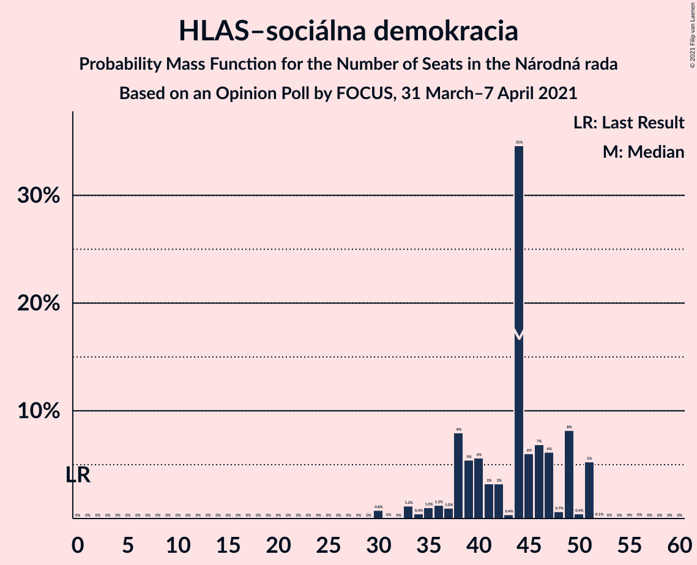
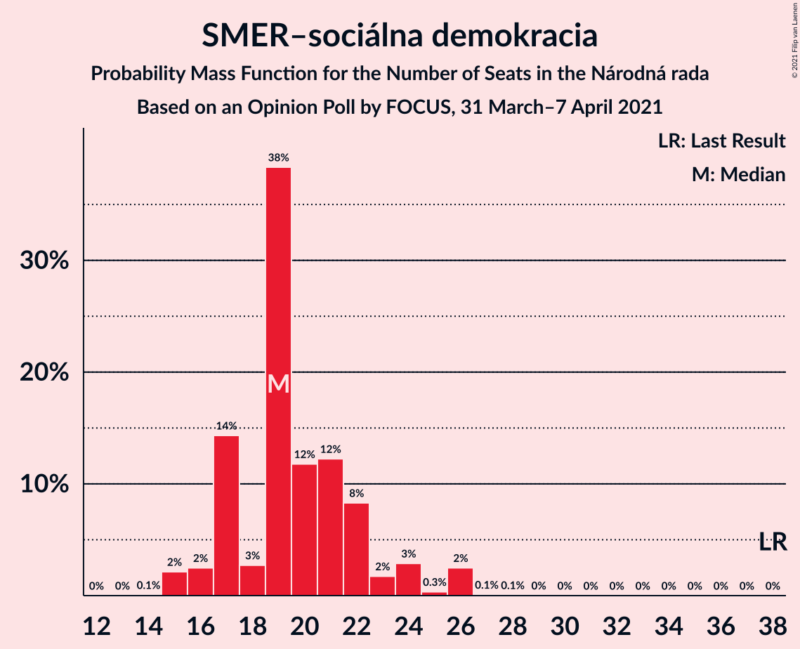
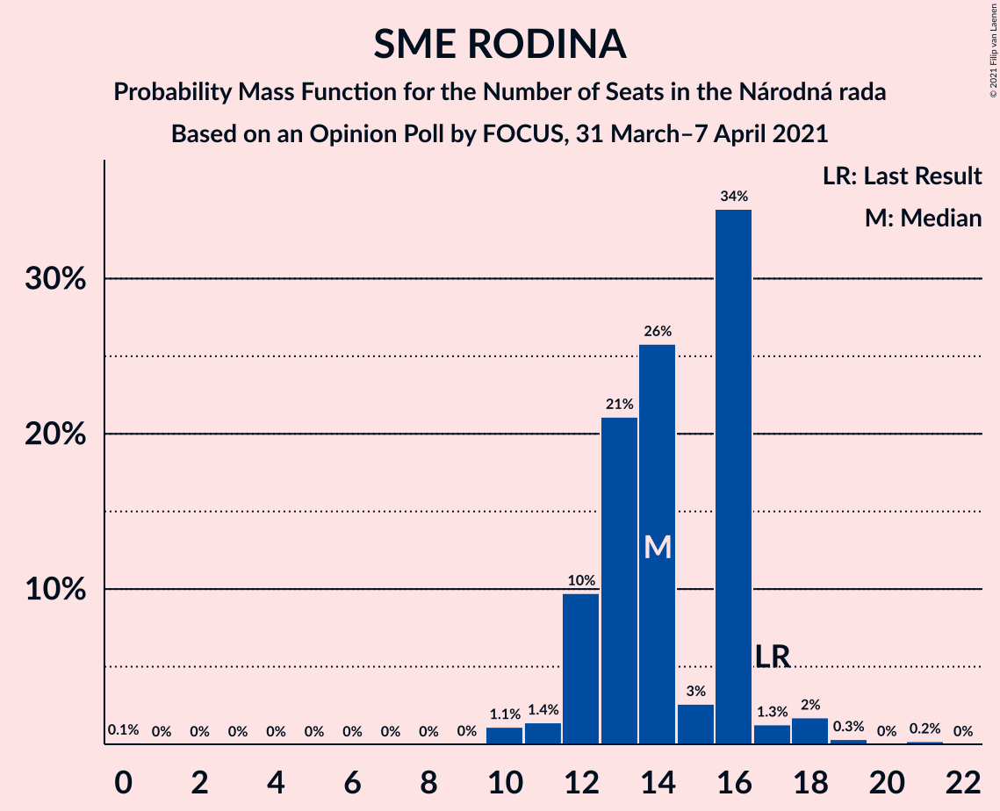
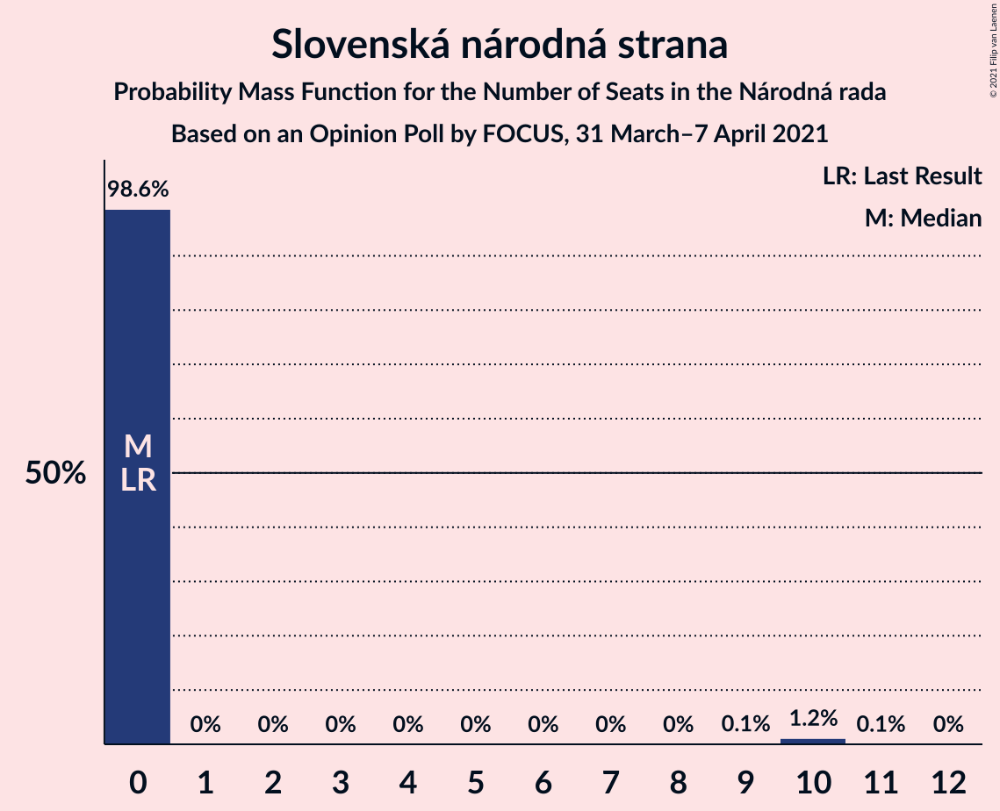
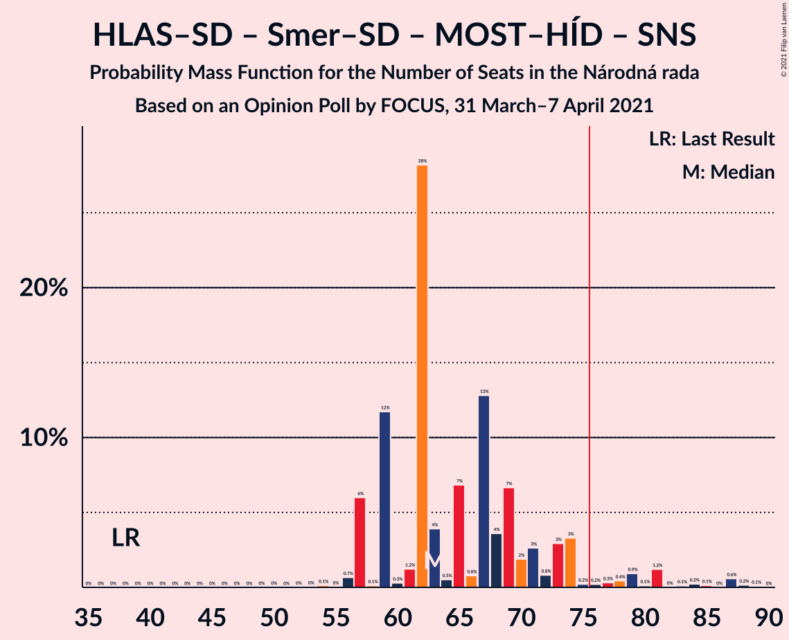
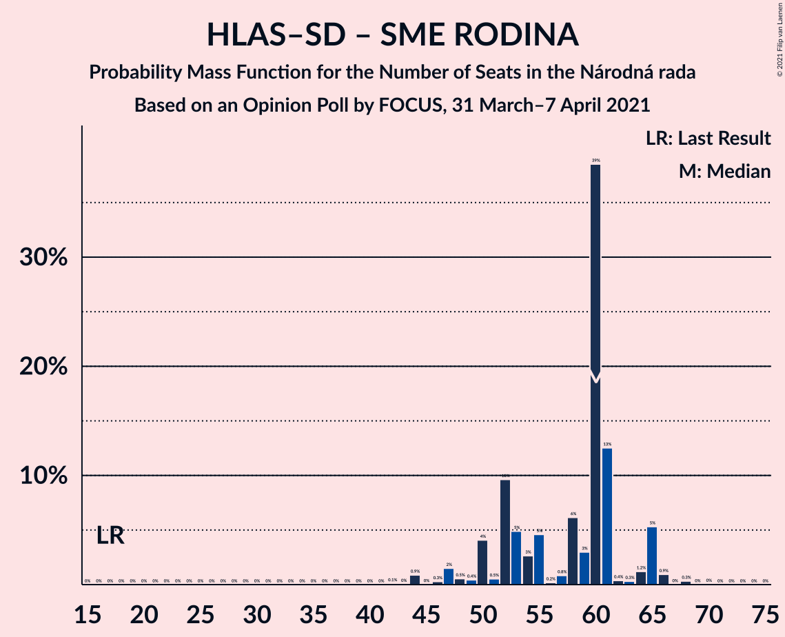

# Opinion Poll by FOCUS, 31 March–7 April 2021

<a href="#voting-intentions">Voting Intentions</a> | <a href="#seats">Seats</a> | <a href="#coalitions">Coalitions</a> | <a href="#technical-information">Technical Information</a>

## Voting Intentions

### Confidence Intervals

| Party | Last Result | Poll Result | 80% Confidence Interval | 90% Confidence Interval | 95% Confidence Interval | 99% Confidence Interval |
|:-----:|:-----------:|:-----------:|:-----------------------:|:-----------------------:|:-----------------------:|:-----------------------:|
| HLAS–sociálna demokracia | 0.0% | 22.3% | 20.7–24.0% |20.2–24.5% |19.8–25.0% |19.1–25.8% |
| Sloboda a Solidarita | 6.2% | 11.2% | 10.0–12.6% |9.7–13.0% |9.4–13.3% |8.8–14.0% |
| SMER–sociálna demokracia | 18.3% | 10.9% | 9.7–12.3% |9.4–12.6% |9.1–13.0% |8.6–13.7% |
| OBYČAJNÍ ĽUDIA a nezávislé osobnosti | 25.0% | 9.2% | 8.1–10.5% |7.8–10.8% |7.5–11.1% |7.1–11.8% |
| SME RODINA | 8.2% | 7.4% | 6.4–8.6% |6.2–8.9% |5.9–9.2% |5.5–9.8% |
| Progresívne Slovensko | 7.0% | 6.2% | 5.3–7.3% |5.1–7.6% |4.9–7.9% |4.5–8.4% |
| MOST–HÍD | 2.0% | 5.0% | 4.2–6.0% |4.0–6.3% |3.8–6.5% |3.5–7.0% |
| Strana maďarskej koalície–Magyar Koalíció Pártja | 3.9% | 5.0% | 4.2–6.0% |4.0–6.3% |3.8–6.5% |3.5–7.0% |
| Za ľudí | 5.8% | 4.8% | 4.0–5.8% |3.8–6.1% |3.6–6.3% |3.3–6.8% |
| REPUBLIKA | 0.0% | 4.7% | 3.9–5.7% |3.7–5.9% |3.6–6.2% |3.2–6.7% |
| Kotleba–Ľudová strana Naše Slovensko | 8.0% | 4.3% | 3.6–5.2% |3.4–5.5% |3.2–5.7% |2.9–6.2% |
| Slovenská národná strana | 3.2% | 3.4% | 2.8–4.3% |2.6–4.5% |2.4–4.7% |2.2–5.2% |
| Dobrá voľba | 3.1% | 1.8% | 1.4–2.5% |1.2–2.7% |1.1–2.8% |1.0–3.2% |
| VLASŤ | 2.9% | 1.6% | 1.2–2.2% |1.1–2.4% |1.0–2.6% |0.8–2.9% |
| SPOLU–Občianska Demokracia | 7.0% | 0.8% | 0.5–1.3% |0.5–1.4% |0.4–1.6% |0.3–1.8% |

*Note:* The poll result column reflects the actual value used in the calculations. Published results may vary slightly, and in addition be rounded to fewer digits.

## Seats

### Confidence Intervals

| Party | Last Result | Median | 80% Confidence Interval | 90% Confidence Interval | 95% Confidence Interval | 99% Confidence Interval |
|:-----:|:-----------:|:------:|:-----------------------:|:-----------------------:|:-----------------------:|:-----------------------:|
| <a href="#hlas–sociálna-demokracia">HLAS–sociálna demokracia</a> | 0 | 40 | 39–47 |36–49 |34–51 |34–57 |
| <a href="#sloboda-a-solidarita">Sloboda a Solidarita</a> | 13 | 21 | 19–25 |17–26 |17–27 |17–28 |
| <a href="#smer–sociálna-demokracia">SMER–sociálna demokracia</a> | 38 | 21 | 17–22 |16–24 |16–25 |15–28 |
| <a href="#obyčajní-ľudia-a-nezávislé-osobnosti">OBYČAJNÍ ĽUDIA a nezávislé osobnosti</a> | 53 | 19 | 14–21 |14–21 |14–23 |13–24 |
| <a href="#sme-rodina">SME RODINA</a> | 17 | 14 | 11–17 |10–18 |10–19 |10–20 |
| <a href="#progresívne-slovensko">Progresívne Slovensko</a> | 0 | 13 | 10–15 |0–15 |0–16 |0–16 |
| <a href="#most–híd">MOST–HÍD</a> | 0 | 0 | 0–10 |0–12 |0–12 |0–15 |
| <a href="#strana-maďarskej-koalície–magyar-koalíció-pártja">Strana maďarskej koalície–Magyar Koalíció Pártja</a> | 0 | 0 | 0–11 |0–11 |0–12 |0–15 |
| <a href="#za-ľudí">Za ľudí</a> | 12 | 0 | 0–11 |0–12 |0–12 |0–14 |
| <a href="#republika">REPUBLIKA</a> | 0 | 10 | 0–12 |0–12 |0–12 |0–13 |
| <a href="#kotleba–ľudová-strana-naše-slovensko">Kotleba–Ľudová strana Naše Slovensko</a> | 17 | 0 | 0–11 |0–12 |0–12 |0–12 |
| <a href="#slovenská-národná-strana">Slovenská národná strana</a> | 0 | 0 | 0 |0 |0 |0 |
| <a href="#dobrá-voľba">Dobrá voľba</a> | 0 | 0 | 0 |0 |0 |0 |
| <a href="#vlasť">VLASŤ</a> | 0 | 0 | 0 |0 |0 |0 |
| <a href="#spolu–občianska-demokracia">SPOLU–Občianska Demokracia</a> | 0 | 0 | 0 |0 |0 |0 |

### HLAS–sociálna demokracia

*For a full overview of the results for this party, see the [HLAS–sociálna demokracia](party-hlas–sociálnademokracia.html) page.*

| Number of Seats | Probability | Accumulated | Special Marks |
|:---------------:|:-----------:|:-----------:|:-------------:|
| 0 | 0% | 100% | Last Result |
| 1 | 0% | 100% |  |
| 2 | 0% | 100% |  |
| 3 | 0% | 100% |  |
| 4 | 0% | 100% |  |
| 5 | 0% | 100% |  |
| 6 | 0% | 100% |  |
| 7 | 0% | 100% |  |
| 8 | 0% | 100% |  |
| 9 | 0% | 100% |  |
| 10 | 0% | 100% |  |
| 11 | 0% | 100% |  |
| 12 | 0% | 100% |  |
| 13 | 0% | 100% |  |
| 14 | 0% | 100% |  |
| 15 | 0% | 100% |  |
| 16 | 0% | 100% |  |
| 17 | 0% | 100% |  |
| 18 | 0% | 100% |  |
| 19 | 0% | 100% |  |
| 20 | 0% | 100% |  |
| 21 | 0% | 100% |  |
| 22 | 0% | 100% |  |
| 23 | 0% | 100% |  |
| 24 | 0% | 100% |  |
| 25 | 0% | 100% |  |
| 26 | 0% | 100% |  |
| 27 | 0% | 100% |  |
| 28 | 0% | 100% |  |
| 29 | 0% | 100% |  |
| 30 | 0% | 100% |  |
| 31 | 0% | 100% |  |
| 32 | 0% | 100% |  |
| 33 | 0.3% | 100% |  |
| 34 | 4% | 99.6% |  |
| 35 | 0.4% | 96% |  |
| 36 | 0.4% | 95% |  |
| 37 | 1.0% | 95% |  |
| 38 | 1.0% | 94% |  |
| 39 | 4% | 93% |  |
| 40 | 40% | 89% | Median |
| 41 | 11% | 50% |  |
| 42 | 2% | 39% |  |
| 43 | 4% | 37% |  |
| 44 | 0.6% | 33% |  |
| 45 | 2% | 33% |  |
| 46 | 6% | 30% |  |
| 47 | 16% | 24% |  |
| 48 | 1.2% | 8% |  |
| 49 | 3% | 7% |  |
| 50 | 0.5% | 4% |  |
| 51 | 1.5% | 4% |  |
| 52 | 0.8% | 2% |  |
| 53 | 0.3% | 2% |  |
| 54 | 0.7% | 1.4% |  |
| 55 | 0% | 0.7% |  |
| 56 | 0% | 0.7% |  |
| 57 | 0.5% | 0.7% |  |
| 58 | 0.1% | 0.1% |  |
| 59 | 0% | 0% |  |

### Sloboda a Solidarita

*For a full overview of the results for this party, see the [Sloboda a Solidarita](party-slobodaasolidarita.html) page.*

| Number of Seats | Probability | Accumulated | Special Marks |
|:---------------:|:-----------:|:-----------:|:-------------:|
| 13 | 0% | 100% | Last Result |
| 14 | 0% | 100% |  |
| 15 | 0.3% | 100% |  |
| 16 | 0.1% | 99.7% |  |
| 17 | 7% | 99.6% |  |
| 18 | 2% | 92% |  |
| 19 | 11% | 90% |  |
| 20 | 11% | 80% |  |
| 21 | 32% | 68% | Median |
| 22 | 9% | 36% |  |
| 23 | 13% | 27% |  |
| 24 | 1.2% | 14% |  |
| 25 | 8% | 13% |  |
| 26 | 2% | 5% |  |
| 27 | 1.4% | 3% |  |
| 28 | 1.0% | 1.3% |  |
| 29 | 0.1% | 0.2% |  |
| 30 | 0% | 0.1% |  |
| 31 | 0% | 0.1% |  |
| 32 | 0% | 0.1% |  |
| 33 | 0.1% | 0.1% |  |
| 34 | 0% | 0% |  |

### SMER–sociálna demokracia

*For a full overview of the results for this party, see the [SMER–sociálna demokracia](party-smer–sociálnademokracia.html) page.*

| Number of Seats | Probability | Accumulated | Special Marks |
|:---------------:|:-----------:|:-----------:|:-------------:|
| 14 | 0.3% | 100% |  |
| 15 | 0.5% | 99.6% |  |
| 16 | 8% | 99.2% |  |
| 17 | 2% | 91% |  |
| 18 | 4% | 89% |  |
| 19 | 21% | 85% |  |
| 20 | 12% | 64% |  |
| 21 | 3% | 52% | Median |
| 22 | 39% | 49% |  |
| 23 | 4% | 10% |  |
| 24 | 2% | 6% |  |
| 25 | 1.4% | 4% |  |
| 26 | 0.7% | 2% |  |
| 27 | 0.7% | 2% |  |
| 28 | 0.7% | 0.9% |  |
| 29 | 0.1% | 0.2% |  |
| 30 | 0.1% | 0.1% |  |
| 31 | 0% | 0% |  |
| 32 | 0% | 0% |  |
| 33 | 0% | 0% |  |
| 34 | 0% | 0% |  |
| 35 | 0% | 0% |  |
| 36 | 0% | 0% |  |
| 37 | 0% | 0% |  |
| 38 | 0% | 0% | Last Result |

### OBYČAJNÍ ĽUDIA a nezávislé osobnosti

*For a full overview of the results for this party, see the [OBYČAJNÍ ĽUDIA a nezávislé osobnosti](party-obyčajníľudiaanezávisléosobnosti.html) page.*

| Number of Seats | Probability | Accumulated | Special Marks |
|:---------------:|:-----------:|:-----------:|:-------------:|
| 11 | 0.1% | 100% |  |
| 12 | 0.1% | 99.9% |  |
| 13 | 2% | 99.8% |  |
| 14 | 16% | 98% |  |
| 15 | 5% | 82% |  |
| 16 | 7% | 77% |  |
| 17 | 5% | 69% |  |
| 18 | 2% | 64% |  |
| 19 | 42% | 62% | Median |
| 20 | 7% | 20% |  |
| 21 | 8% | 13% |  |
| 22 | 2% | 4% |  |
| 23 | 2% | 3% |  |
| 24 | 0.5% | 0.6% |  |
| 25 | 0.1% | 0.1% |  |
| 26 | 0% | 0% |  |
| 27 | 0% | 0% |  |
| 28 | 0% | 0% |  |
| 29 | 0% | 0% |  |
| 30 | 0% | 0% |  |
| 31 | 0% | 0% |  |
| 32 | 0% | 0% |  |
| 33 | 0% | 0% |  |
| 34 | 0% | 0% |  |
| 35 | 0% | 0% |  |
| 36 | 0% | 0% |  |
| 37 | 0% | 0% |  |
| 38 | 0% | 0% |  |
| 39 | 0% | 0% |  |
| 40 | 0% | 0% |  |
| 41 | 0% | 0% |  |
| 42 | 0% | 0% |  |
| 43 | 0% | 0% |  |
| 44 | 0% | 0% |  |
| 45 | 0% | 0% |  |
| 46 | 0% | 0% |  |
| 47 | 0% | 0% |  |
| 48 | 0% | 0% |  |
| 49 | 0% | 0% |  |
| 50 | 0% | 0% |  |
| 51 | 0% | 0% |  |
| 52 | 0% | 0% |  |
| 53 | 0% | 0% | Last Result |

### SME RODINA

*For a full overview of the results for this party, see the [SME RODINA](party-smerodina.html) page.*

| Number of Seats | Probability | Accumulated | Special Marks |
|:---------------:|:-----------:|:-----------:|:-------------:|
| 0 | 0.4% | 100% |  |
| 1 | 0% | 99.6% |  |
| 2 | 0% | 99.6% |  |
| 3 | 0% | 99.6% |  |
| 4 | 0% | 99.6% |  |
| 5 | 0% | 99.6% |  |
| 6 | 0% | 99.6% |  |
| 7 | 0% | 99.6% |  |
| 8 | 0% | 99.6% |  |
| 9 | 0% | 99.6% |  |
| 10 | 5% | 99.6% |  |
| 11 | 4% | 94% |  |
| 12 | 2% | 90% |  |
| 13 | 36% | 88% |  |
| 14 | 20% | 51% | Median |
| 15 | 12% | 32% |  |
| 16 | 3% | 20% |  |
| 17 | 11% | 18% | Last Result |
| 18 | 3% | 6% |  |
| 19 | 2% | 4% |  |
| 20 | 1.1% | 1.2% |  |
| 21 | 0% | 0.1% |  |
| 22 | 0% | 0.1% |  |
| 23 | 0% | 0.1% |  |
| 24 | 0.1% | 0.1% |  |
| 25 | 0% | 0% |  |

### Progresívne Slovensko

*For a full overview of the results for this party, see the [Progresívne Slovensko](party-progresívneslovensko.html) page.*

| Number of Seats | Probability | Accumulated | Special Marks |
|:---------------:|:-----------:|:-----------:|:-------------:|
| 0 | 5% | 100% | Last Result |
| 1 | 0% | 95% |  |
| 2 | 0% | 95% |  |
| 3 | 0% | 95% |  |
| 4 | 0% | 95% |  |
| 5 | 0% | 95% |  |
| 6 | 0% | 95% |  |
| 7 | 0% | 95% |  |
| 8 | 0% | 95% |  |
| 9 | 2% | 95% |  |
| 10 | 14% | 93% |  |
| 11 | 14% | 79% |  |
| 12 | 11% | 65% |  |
| 13 | 11% | 54% | Median |
| 14 | 30% | 44% |  |
| 15 | 10% | 13% |  |
| 16 | 3% | 3% |  |
| 17 | 0.3% | 0.4% |  |
| 18 | 0% | 0% |  |

### MOST–HÍD

*For a full overview of the results for this party, see the [MOST–HÍD](party-most–híd.html) page.*

| Number of Seats | Probability | Accumulated | Special Marks |
|:---------------:|:-----------:|:-----------:|:-------------:|
| 0 | 82% | 100% | Last Result, Median |
| 1 | 0% | 18% |  |
| 2 | 0% | 18% |  |
| 3 | 0% | 18% |  |
| 4 | 0% | 18% |  |
| 5 | 0% | 18% |  |
| 6 | 0% | 18% |  |
| 7 | 0% | 18% |  |
| 8 | 0% | 18% |  |
| 9 | 0.6% | 18% |  |
| 10 | 8% | 18% |  |
| 11 | 4% | 10% |  |
| 12 | 4% | 6% |  |
| 13 | 0.8% | 1.4% |  |
| 14 | 0% | 0.6% |  |
| 15 | 0.1% | 0.6% |  |
| 16 | 0.5% | 0.5% |  |
| 17 | 0% | 0% |  |

### Strana maďarskej koalície–Magyar Koalíció Pártja

*For a full overview of the results for this party, see the [Strana maďarskej koalície–Magyar Koalíció Pártja](party-stranamaďarskejkoalície–magyarkoalíciópártja.html) page.*

| Number of Seats | Probability | Accumulated | Special Marks |
|:---------------:|:-----------:|:-----------:|:-------------:|
| 0 | 61% | 100% | Last Result, Median |
| 1 | 0% | 39% |  |
| 2 | 0% | 39% |  |
| 3 | 0% | 39% |  |
| 4 | 0% | 39% |  |
| 5 | 0% | 39% |  |
| 6 | 0% | 39% |  |
| 7 | 0% | 39% |  |
| 8 | 0% | 39% |  |
| 9 | 1.3% | 39% |  |
| 10 | 15% | 37% |  |
| 11 | 19% | 22% |  |
| 12 | 1.0% | 3% |  |
| 13 | 2% | 2% |  |
| 14 | 0.1% | 0.6% |  |
| 15 | 0.5% | 0.5% |  |
| 16 | 0% | 0.1% |  |
| 17 | 0% | 0% |  |

### Za ľudí

*For a full overview of the results for this party, see the [Za ľudí](party-zaľudí.html) page.*

| Number of Seats | Probability | Accumulated | Special Marks |
|:---------------:|:-----------:|:-----------:|:-------------:|
| 0 | 56% | 100% | Median |
| 1 | 0% | 44% |  |
| 2 | 0% | 44% |  |
| 3 | 0% | 44% |  |
| 4 | 0% | 44% |  |
| 5 | 0% | 44% |  |
| 6 | 0% | 44% |  |
| 7 | 0% | 44% |  |
| 8 | 0% | 44% |  |
| 9 | 1.1% | 44% |  |
| 10 | 5% | 43% |  |
| 11 | 33% | 38% |  |
| 12 | 4% | 5% | Last Result |
| 13 | 0.4% | 1.1% |  |
| 14 | 0.6% | 0.7% |  |
| 15 | 0.1% | 0.1% |  |
| 16 | 0% | 0% |  |

### REPUBLIKA

*For a full overview of the results for this party, see the [REPUBLIKA](party-republika.html) page.*

| Number of Seats | Probability | Accumulated | Special Marks |
|:---------------:|:-----------:|:-----------:|:-------------:|
| 0 | 29% | 100% | Last Result |
| 1 | 0% | 71% |  |
| 2 | 0% | 71% |  |
| 3 | 0% | 71% |  |
| 4 | 0% | 71% |  |
| 5 | 0% | 71% |  |
| 6 | 0% | 71% |  |
| 7 | 0% | 71% |  |
| 8 | 0% | 71% |  |
| 9 | 4% | 71% |  |
| 10 | 45% | 67% | Median |
| 11 | 10% | 22% |  |
| 12 | 10% | 12% |  |
| 13 | 2% | 2% |  |
| 14 | 0% | 0% |  |

### Kotleba–Ľudová strana Naše Slovensko

*For a full overview of the results for this party, see the [Kotleba–Ľudová strana Naše Slovensko](party-kotleba–ľudovástrananašeslovensko.html) page.*

| Number of Seats | Probability | Accumulated | Special Marks |
|:---------------:|:-----------:|:-----------:|:-------------:|
| 0 | 68% | 100% | Median |
| 1 | 0% | 32% |  |
| 2 | 0% | 32% |  |
| 3 | 0% | 32% |  |
| 4 | 0% | 32% |  |
| 5 | 0% | 32% |  |
| 6 | 0% | 32% |  |
| 7 | 0% | 32% |  |
| 8 | 0% | 32% |  |
| 9 | 10% | 32% |  |
| 10 | 5% | 23% |  |
| 11 | 10% | 18% |  |
| 12 | 8% | 8% |  |
| 13 | 0.1% | 0.1% |  |
| 14 | 0% | 0% |  |
| 15 | 0% | 0% |  |
| 16 | 0% | 0% |  |
| 17 | 0% | 0% | Last Result |

### Slovenská národná strana

*For a full overview of the results for this party, see the [Slovenská národná strana](party-slovenskánárodnástrana.html) page.*

| Number of Seats | Probability | Accumulated | Special Marks |
|:---------------:|:-----------:|:-----------:|:-------------:|
| 0 | 99.6% | 100% | Last Result, Median |
| 1 | 0% | 0.4% |  |
| 2 | 0% | 0.4% |  |
| 3 | 0% | 0.4% |  |
| 4 | 0% | 0.4% |  |
| 5 | 0% | 0.4% |  |
| 6 | 0% | 0.4% |  |
| 7 | 0% | 0.4% |  |
| 8 | 0% | 0.4% |  |
| 9 | 0% | 0.4% |  |
| 10 | 0.1% | 0.3% |  |
| 11 | 0.1% | 0.2% |  |
| 12 | 0% | 0.1% |  |
| 13 | 0% | 0% |  |

### Dobrá voľba

*For a full overview of the results for this party, see the [Dobrá voľba](party-dobrávoľba.html) page.*

| Number of Seats | Probability | Accumulated | Special Marks |
|:---------------:|:-----------:|:-----------:|:-------------:|
| 0 | 100% | 100% | Last Result, Median |

### VLASŤ

*For a full overview of the results for this party, see the [VLASŤ](party-vlasť.html) page.*

| Number of Seats | Probability | Accumulated | Special Marks |
|:---------------:|:-----------:|:-----------:|:-------------:|
| 0 | 100% | 100% | Last Result, Median |

### SPOLU–Občianska Demokracia

*For a full overview of the results for this party, see the [SPOLU–Občianska Demokracia](party-spolu–občianskademokracia.html) page.*

| Number of Seats | Probability | Accumulated | Special Marks |
|:---------------:|:-----------:|:-----------:|:-------------:|
| 0 | 100% | 100% | Last Result, Median |

## Coalitions

### Confidence Intervals

| Coalition | Last Result | Median | Majority? | 80% Confidence Interval | 90% Confidence Interval | 95% Confidence Interval | 99% Confidence Interval |
|:---------:|:-----------:|:------:|:---------:|:-----------------------:|:-----------------------:|:-----------------------:|:-----------------------:|
| HLAS–sociálna demokracia – SMER–sociálna demokracia – SME RODINA – Kotleba–Ľudová strana Naše Slovensko – Slovenská národná strana | 72 | 79 | 55% | 73–91 | 72–93 | 70–93 | 68–97 |
| HLAS–sociálna demokracia – SMER–sociálna demokracia – SME RODINA | 55 | 75 | 47% | 72–82 | 70–88 | 69–92 | 66–97 |
| HLAS–sociálna demokracia – SMER–sociálna demokracia – SME RODINA – Slovenská národná strana | 55 | 75 | 47% | 72–82 | 70–88 | 69–92 | 66–97 |
| HLAS–sociálna demokracia – SMER–sociálna demokracia – MOST–HÍD – Slovenská národná strana | 38 | 63 | 5% | 59–73 | 57–74 | 57–81 | 56–87 |
| HLAS–sociálna demokracia – SMER–sociálna demokracia – Slovenská národná strana | 38 | 62 | 2% | 57–69 | 56–72 | 56–73 | 53–79 |
| HLAS–sociálna demokracia – SME RODINA – Kotleba–Ľudová strana Naše Slovensko – Slovenská národná strana | 34 | 59 | 0.1% | 53–71 | 51–72 | 48–72 | 48–72 |
| HLAS–sociálna demokracia – SME RODINA | 17 | 56 | 0.1% | 52–61 | 51–66 | 48–68 | 48–71 |
| HLAS–sociálna demokracia – SME RODINA – Slovenská národná strana | 17 | 56 | 0.1% | 52–61 | 51–66 | 48–68 | 48–71 |
| HLAS–sociálna demokracia – MOST–HÍD – Slovenská národná strana | 0 | 43 | 0% | 40–51 | 40–54 | 39–58 | 39–67 |
| HLAS–sociálna demokracia – Slovenská národná strana | 0 | 40 | 0% | 39–47 | 36–49 | 34–52 | 34–57 |
| SMER–sociálna demokracia – SME RODINA – Kotleba–Ľudová strana Naše Slovensko – Slovenská národná strana | 72 | 35 | 0% | 31–46 | 31–46 | 29–47 | 28–52 |
| SMER–sociálna demokracia – SME RODINA | 55 | 35 | 0% | 31–37 | 29–41 | 28–43 | 26–46 |
| SMER–sociálna demokracia – SME RODINA – Slovenská národná strana | 55 | 35 | 0% | 31–38 | 29–41 | 28–43 | 26–46 |
| SMER–sociálna demokracia – MOST–HÍD – Slovenská národná strana | 38 | 22 | 0% | 18–32 | 16–33 | 16–34 | 16–38 |
| SMER–sociálna demokracia – Slovenská národná strana | 38 | 21 | 0% | 17–22 | 16–24 | 16–26 | 15–29 |
| SMER–sociálna demokracia | 38 | 21 | 0% | 17–22 | 16–24 | 16–25 | 15–28 |

### HLAS–sociálna demokracia – SMER–sociálna demokracia – SME RODINA – Kotleba–Ľudová strana Naše Slovensko – Slovenská národná strana

| Number of Seats | Probability | Accumulated | Special Marks |
|:---------------:|:-----------:|:-----------:|:-------------:|
| 66 | 0.2% | 100% |  |
| 67 | 0.1% | 99.7% |  |
| 68 | 0.5% | 99.6% |  |
| 69 | 0.7% | 99.2% |  |
| 70 | 2% | 98% |  |
| 71 | 0.4% | 96% |  |
| 72 | 5% | 96% | Last Result |
| 73 | 1.0% | 90% |  |
| 74 | 7% | 89% |  |
| 75 | 28% | 83% | Median |
| 76 | 2% | 55% | Majority |
| 77 | 0.6% | 52% |  |
| 78 | 0% | 52% |  |
| 79 | 3% | 52% |  |
| 80 | 2% | 49% |  |
| 81 | 10% | 47% |  |
| 82 | 3% | 37% |  |
| 83 | 0.4% | 34% |  |
| 84 | 1.0% | 34% |  |
| 85 | 10% | 33% |  |
| 86 | 1.2% | 23% |  |
| 87 | 1.4% | 22% |  |
| 88 | 2% | 20% |  |
| 89 | 0.8% | 19% |  |
| 90 | 0.9% | 18% |  |
| 91 | 7% | 17% |  |
| 92 | 2% | 10% |  |
| 93 | 6% | 8% |  |
| 94 | 0.6% | 2% |  |
| 95 | 0% | 1.0% |  |
| 96 | 0.2% | 1.0% |  |
| 97 | 0.7% | 0.8% |  |
| 98 | 0% | 0.1% |  |
| 99 | 0% | 0.1% |  |
| 100 | 0% | 0.1% |  |
| 101 | 0% | 0% |  |

### HLAS–sociálna demokracia – SMER–sociálna demokracia – SME RODINA

| Number of Seats | Probability | Accumulated | Special Marks |
|:---------------:|:-----------:|:-----------:|:-------------:|
| 55 | 0% | 100% | Last Result |
| 56 | 0% | 100% |  |
| 57 | 0% | 100% |  |
| 58 | 0% | 100% |  |
| 59 | 0% | 100% |  |
| 60 | 0% | 100% |  |
| 61 | 0% | 100% |  |
| 62 | 0% | 100% |  |
| 63 | 0% | 100% |  |
| 64 | 0.1% | 99.9% |  |
| 65 | 0.3% | 99.9% |  |
| 66 | 0.3% | 99.5% |  |
| 67 | 0.1% | 99.2% |  |
| 68 | 0.7% | 99.1% |  |
| 69 | 3% | 98% |  |
| 70 | 3% | 96% |  |
| 71 | 2% | 93% |  |
| 72 | 5% | 91% |  |
| 73 | 2% | 85% |  |
| 74 | 7% | 83% |  |
| 75 | 29% | 76% | Median |
| 76 | 12% | 47% | Majority |
| 77 | 0.7% | 35% |  |
| 78 | 0.1% | 35% |  |
| 79 | 8% | 34% |  |
| 80 | 0.9% | 27% |  |
| 81 | 11% | 26% |  |
| 82 | 7% | 15% |  |
| 83 | 0.3% | 8% |  |
| 84 | 0.9% | 7% |  |
| 85 | 0.6% | 7% |  |
| 86 | 0.6% | 6% |  |
| 87 | 0.1% | 5% |  |
| 88 | 1.3% | 5% |  |
| 89 | 0.7% | 4% |  |
| 90 | 0.4% | 3% |  |
| 91 | 0.2% | 3% |  |
| 92 | 2% | 3% |  |
| 93 | 0.1% | 1.0% |  |
| 94 | 0% | 0.9% |  |
| 95 | 0% | 0.9% |  |
| 96 | 0.2% | 0.9% |  |
| 97 | 0.7% | 0.7% |  |
| 98 | 0% | 0% |  |

### HLAS–sociálna demokracia – SMER–sociálna demokracia – SME RODINA – Slovenská národná strana

| Number of Seats | Probability | Accumulated | Special Marks |
|:---------------:|:-----------:|:-----------:|:-------------:|
| 55 | 0% | 100% | Last Result |
| 56 | 0% | 100% |  |
| 57 | 0% | 100% |  |
| 58 | 0% | 100% |  |
| 59 | 0% | 100% |  |
| 60 | 0% | 100% |  |
| 61 | 0% | 100% |  |
| 62 | 0% | 100% |  |
| 63 | 0% | 100% |  |
| 64 | 0.1% | 99.9% |  |
| 65 | 0.3% | 99.9% |  |
| 66 | 0.3% | 99.6% |  |
| 67 | 0.1% | 99.3% |  |
| 68 | 0.7% | 99.1% |  |
| 69 | 2% | 98% |  |
| 70 | 3% | 96% |  |
| 71 | 2% | 93% |  |
| 72 | 5% | 91% |  |
| 73 | 2% | 85% |  |
| 74 | 7% | 83% |  |
| 75 | 29% | 76% | Median |
| 76 | 12% | 47% | Majority |
| 77 | 0.7% | 35% |  |
| 78 | 0.1% | 35% |  |
| 79 | 8% | 35% |  |
| 80 | 0.9% | 27% |  |
| 81 | 11% | 26% |  |
| 82 | 7% | 15% |  |
| 83 | 0.4% | 8% |  |
| 84 | 0.8% | 8% |  |
| 85 | 0.6% | 7% |  |
| 86 | 0.7% | 6% |  |
| 87 | 0.1% | 6% |  |
| 88 | 1.3% | 5% |  |
| 89 | 0.7% | 4% |  |
| 90 | 0.4% | 4% |  |
| 91 | 0.2% | 3% |  |
| 92 | 2% | 3% |  |
| 93 | 0.1% | 1.1% |  |
| 94 | 0% | 1.0% |  |
| 95 | 0% | 0.9% |  |
| 96 | 0.2% | 0.9% |  |
| 97 | 0.7% | 0.7% |  |
| 98 | 0% | 0% |  |

### HLAS–sociálna demokracia – SMER–sociálna demokracia – MOST–HÍD – Slovenská národná strana

| Number of Seats | Probability | Accumulated | Special Marks |
|:---------------:|:-----------:|:-----------:|:-------------:|
| 38 | 0% | 100% | Last Result |
| 39 | 0% | 100% |  |
| 40 | 0% | 100% |  |
| 41 | 0% | 100% |  |
| 42 | 0% | 100% |  |
| 43 | 0% | 100% |  |
| 44 | 0% | 100% |  |
| 45 | 0% | 100% |  |
| 46 | 0% | 100% |  |
| 47 | 0% | 100% |  |
| 48 | 0% | 100% |  |
| 49 | 0% | 100% |  |
| 50 | 0% | 100% |  |
| 51 | 0% | 100% |  |
| 52 | 0% | 100% |  |
| 53 | 0% | 99.9% |  |
| 54 | 0.1% | 99.9% |  |
| 55 | 0% | 99.8% |  |
| 56 | 0.7% | 99.7% |  |
| 57 | 6% | 99.1% |  |
| 58 | 0.1% | 93% |  |
| 59 | 12% | 93% |  |
| 60 | 0.3% | 81% |  |
| 61 | 1.2% | 81% | Median |
| 62 | 28% | 80% |  |
| 63 | 4% | 52% |  |
| 64 | 0.5% | 48% |  |
| 65 | 7% | 47% |  |
| 66 | 0.8% | 40% |  |
| 67 | 13% | 39% |  |
| 68 | 4% | 27% |  |
| 69 | 7% | 23% |  |
| 70 | 2% | 16% |  |
| 71 | 3% | 14% |  |
| 72 | 0.8% | 12% |  |
| 73 | 3% | 11% |  |
| 74 | 3% | 8% |  |
| 75 | 0.2% | 5% |  |
| 76 | 0.2% | 5% | Majority |
| 77 | 0.3% | 4% |  |
| 78 | 0.4% | 4% |  |
| 79 | 0.9% | 4% |  |
| 80 | 0.1% | 3% |  |
| 81 | 1.2% | 3% |  |
| 82 | 0% | 1.3% |  |
| 83 | 0.1% | 1.3% |  |
| 84 | 0.2% | 1.2% |  |
| 85 | 0.1% | 1.0% |  |
| 86 | 0% | 0.8% |  |
| 87 | 0.6% | 0.8% |  |
| 88 | 0.2% | 0.3% |  |
| 89 | 0.1% | 0.1% |  |
| 90 | 0% | 0% |  |

### HLAS–sociálna demokracia – SMER–sociálna demokracia – Slovenská národná strana

| Number of Seats | Probability | Accumulated | Special Marks |
|:---------------:|:-----------:|:-----------:|:-------------:|
| 38 | 0% | 100% | Last Result |
| 39 | 0% | 100% |  |
| 40 | 0% | 100% |  |
| 41 | 0% | 100% |  |
| 42 | 0% | 100% |  |
| 43 | 0% | 100% |  |
| 44 | 0% | 100% |  |
| 45 | 0% | 100% |  |
| 46 | 0% | 100% |  |
| 47 | 0% | 100% |  |
| 48 | 0% | 100% |  |
| 49 | 0% | 100% |  |
| 50 | 0% | 100% |  |
| 51 | 0% | 99.9% |  |
| 52 | 0.4% | 99.9% |  |
| 53 | 1.4% | 99.6% |  |
| 54 | 0.2% | 98% |  |
| 55 | 0.3% | 98% |  |
| 56 | 5% | 98% |  |
| 57 | 6% | 93% |  |
| 58 | 0.8% | 87% |  |
| 59 | 12% | 86% |  |
| 60 | 2% | 74% |  |
| 61 | 4% | 71% | Median |
| 62 | 28% | 68% |  |
| 63 | 3% | 40% |  |
| 64 | 2% | 36% |  |
| 65 | 7% | 34% |  |
| 66 | 1.2% | 27% |  |
| 67 | 11% | 26% |  |
| 68 | 0.9% | 15% |  |
| 69 | 7% | 14% |  |
| 70 | 0.5% | 7% |  |
| 71 | 0.7% | 7% |  |
| 72 | 0.9% | 6% |  |
| 73 | 3% | 5% |  |
| 74 | 0.6% | 2% |  |
| 75 | 0.2% | 2% |  |
| 76 | 0.3% | 2% | Majority |
| 77 | 0.2% | 1.3% |  |
| 78 | 0.2% | 1.1% |  |
| 79 | 0.7% | 0.8% |  |
| 80 | 0.1% | 0.1% |  |
| 81 | 0% | 0.1% |  |
| 82 | 0% | 0% |  |

### HLAS–sociálna demokracia – SME RODINA – Kotleba–Ľudová strana Naše Slovensko – Slovenská národná strana

| Number of Seats | Probability | Accumulated | Special Marks |
|:---------------:|:-----------:|:-----------:|:-------------:|
| 34 | 0% | 100% | Last Result |
| 35 | 0% | 100% |  |
| 36 | 0% | 100% |  |
| 37 | 0% | 100% |  |
| 38 | 0% | 100% |  |
| 39 | 0% | 100% |  |
| 40 | 0% | 100% |  |
| 41 | 0% | 100% |  |
| 42 | 0% | 100% |  |
| 43 | 0% | 100% |  |
| 44 | 0% | 100% |  |
| 45 | 0% | 100% |  |
| 46 | 0.2% | 100% |  |
| 47 | 0.1% | 99.8% |  |
| 48 | 3% | 99.7% |  |
| 49 | 0.4% | 97% |  |
| 50 | 0.7% | 97% |  |
| 51 | 2% | 96% |  |
| 52 | 2% | 93% |  |
| 53 | 28% | 91% |  |
| 54 | 1.2% | 64% | Median |
| 55 | 3% | 62% |  |
| 56 | 8% | 60% |  |
| 57 | 1.0% | 52% |  |
| 58 | 0.5% | 51% |  |
| 59 | 0.5% | 50% |  |
| 60 | 1.2% | 50% |  |
| 61 | 9% | 49% |  |
| 62 | 1.3% | 39% |  |
| 63 | 4% | 38% |  |
| 64 | 2% | 34% |  |
| 65 | 0.9% | 33% |  |
| 66 | 11% | 32% |  |
| 67 | 0.6% | 21% |  |
| 68 | 3% | 20% |  |
| 69 | 3% | 18% |  |
| 70 | 0.8% | 14% |  |
| 71 | 7% | 14% |  |
| 72 | 6% | 6% |  |
| 73 | 0.1% | 0.4% |  |
| 74 | 0% | 0.3% |  |
| 75 | 0.1% | 0.3% |  |
| 76 | 0.1% | 0.1% | Majority |
| 77 | 0% | 0.1% |  |
| 78 | 0% | 0.1% |  |
| 79 | 0% | 0.1% |  |
| 80 | 0% | 0.1% |  |
| 81 | 0% | 0% |  |

### HLAS–sociálna demokracia – SME RODINA

| Number of Seats | Probability | Accumulated | Special Marks |
|:---------------:|:-----------:|:-----------:|:-------------:|
| 17 | 0% | 100% | Last Result |
| 18 | 0% | 100% |  |
| 19 | 0% | 100% |  |
| 20 | 0% | 100% |  |
| 21 | 0% | 100% |  |
| 22 | 0% | 100% |  |
| 23 | 0% | 100% |  |
| 24 | 0% | 100% |  |
| 25 | 0% | 100% |  |
| 26 | 0% | 100% |  |
| 27 | 0% | 100% |  |
| 28 | 0% | 100% |  |
| 29 | 0% | 100% |  |
| 30 | 0% | 100% |  |
| 31 | 0% | 100% |  |
| 32 | 0% | 100% |  |
| 33 | 0% | 100% |  |
| 34 | 0% | 100% |  |
| 35 | 0% | 100% |  |
| 36 | 0% | 100% |  |
| 37 | 0% | 100% |  |
| 38 | 0% | 100% |  |
| 39 | 0% | 100% |  |
| 40 | 0% | 100% |  |
| 41 | 0% | 100% |  |
| 42 | 0% | 100% |  |
| 43 | 0% | 100% |  |
| 44 | 0% | 99.9% |  |
| 45 | 0% | 99.9% |  |
| 46 | 0.2% | 99.9% |  |
| 47 | 0.1% | 99.7% |  |
| 48 | 3% | 99.6% |  |
| 49 | 0.5% | 97% |  |
| 50 | 0.8% | 96% |  |
| 51 | 3% | 95% |  |
| 52 | 4% | 93% |  |
| 53 | 30% | 89% |  |
| 54 | 2% | 59% | Median |
| 55 | 4% | 57% |  |
| 56 | 9% | 53% |  |
| 57 | 11% | 45% |  |
| 58 | 1.0% | 33% |  |
| 59 | 2% | 32% |  |
| 60 | 13% | 30% |  |
| 61 | 10% | 17% |  |
| 62 | 0.6% | 7% |  |
| 63 | 0.6% | 7% |  |
| 64 | 0.8% | 6% |  |
| 65 | 0.3% | 5% |  |
| 66 | 1.0% | 5% |  |
| 67 | 0.3% | 4% |  |
| 68 | 2% | 4% |  |
| 69 | 1.3% | 2% |  |
| 70 | 0% | 0.8% |  |
| 71 | 0.6% | 0.8% |  |
| 72 | 0% | 0.2% |  |
| 73 | 0.1% | 0.2% |  |
| 74 | 0% | 0.1% |  |
| 75 | 0.1% | 0.1% |  |
| 76 | 0.1% | 0.1% | Majority |
| 77 | 0% | 0% |  |

### HLAS–sociálna demokracia – SME RODINA – Slovenská národná strana

| Number of Seats | Probability | Accumulated | Special Marks |
|:---------------:|:-----------:|:-----------:|:-------------:|
| 17 | 0% | 100% | Last Result |
| 18 | 0% | 100% |  |
| 19 | 0% | 100% |  |
| 20 | 0% | 100% |  |
| 21 | 0% | 100% |  |
| 22 | 0% | 100% |  |
| 23 | 0% | 100% |  |
| 24 | 0% | 100% |  |
| 25 | 0% | 100% |  |
| 26 | 0% | 100% |  |
| 27 | 0% | 100% |  |
| 28 | 0% | 100% |  |
| 29 | 0% | 100% |  |
| 30 | 0% | 100% |  |
| 31 | 0% | 100% |  |
| 32 | 0% | 100% |  |
| 33 | 0% | 100% |  |
| 34 | 0% | 100% |  |
| 35 | 0% | 100% |  |
| 36 | 0% | 100% |  |
| 37 | 0% | 100% |  |
| 38 | 0% | 100% |  |
| 39 | 0% | 100% |  |
| 40 | 0% | 100% |  |
| 41 | 0% | 100% |  |
| 42 | 0% | 100% |  |
| 43 | 0% | 100% |  |
| 44 | 0% | 99.9% |  |
| 45 | 0% | 99.9% |  |
| 46 | 0.2% | 99.9% |  |
| 47 | 0.1% | 99.7% |  |
| 48 | 3% | 99.6% |  |
| 49 | 0.4% | 97% |  |
| 50 | 0.7% | 96% |  |
| 51 | 3% | 96% |  |
| 52 | 4% | 93% |  |
| 53 | 30% | 89% |  |
| 54 | 2% | 59% | Median |
| 55 | 4% | 57% |  |
| 56 | 9% | 54% |  |
| 57 | 11% | 45% |  |
| 58 | 1.1% | 34% |  |
| 59 | 2% | 33% |  |
| 60 | 13% | 31% |  |
| 61 | 10% | 17% |  |
| 62 | 0.6% | 8% |  |
| 63 | 0.6% | 7% |  |
| 64 | 0.7% | 6% |  |
| 65 | 0.4% | 6% |  |
| 66 | 1.0% | 5% |  |
| 67 | 0.3% | 4% |  |
| 68 | 2% | 4% |  |
| 69 | 1.3% | 2% |  |
| 70 | 0% | 0.9% |  |
| 71 | 0.6% | 0.8% |  |
| 72 | 0% | 0.3% |  |
| 73 | 0.1% | 0.3% |  |
| 74 | 0% | 0.2% |  |
| 75 | 0.1% | 0.2% |  |
| 76 | 0.1% | 0.1% | Majority |
| 77 | 0% | 0% |  |

### HLAS–sociálna demokracia – MOST–HÍD – Slovenská národná strana

| Number of Seats | Probability | Accumulated | Special Marks |
|:---------------:|:-----------:|:-----------:|:-------------:|
| 0 | 0% | 100% | Last Result |
| 1 | 0% | 100% |  |
| 2 | 0% | 100% |  |
| 3 | 0% | 100% |  |
| 4 | 0% | 100% |  |
| 5 | 0% | 100% |  |
| 6 | 0% | 100% |  |
| 7 | 0% | 100% |  |
| 8 | 0% | 100% |  |
| 9 | 0% | 100% |  |
| 10 | 0% | 100% |  |
| 11 | 0% | 100% |  |
| 12 | 0% | 100% |  |
| 13 | 0% | 100% |  |
| 14 | 0% | 100% |  |
| 15 | 0% | 100% |  |
| 16 | 0% | 100% |  |
| 17 | 0% | 100% |  |
| 18 | 0% | 100% |  |
| 19 | 0% | 100% |  |
| 20 | 0% | 100% |  |
| 21 | 0% | 100% |  |
| 22 | 0% | 100% |  |
| 23 | 0% | 100% |  |
| 24 | 0% | 100% |  |
| 25 | 0% | 100% |  |
| 26 | 0% | 100% |  |
| 27 | 0% | 100% |  |
| 28 | 0% | 100% |  |
| 29 | 0% | 100% |  |
| 30 | 0% | 100% |  |
| 31 | 0% | 100% |  |
| 32 | 0% | 100% |  |
| 33 | 0% | 100% |  |
| 34 | 0.1% | 100% |  |
| 35 | 0% | 99.9% |  |
| 36 | 0% | 99.9% |  |
| 37 | 0.1% | 99.9% |  |
| 38 | 0.1% | 99.8% |  |
| 39 | 3% | 99.7% |  |
| 40 | 38% | 97% | Median |
| 41 | 6% | 59% |  |
| 42 | 1.1% | 54% |  |
| 43 | 3% | 52% |  |
| 44 | 0.9% | 49% |  |
| 45 | 4% | 48% |  |
| 46 | 9% | 44% |  |
| 47 | 16% | 35% |  |
| 48 | 2% | 19% |  |
| 49 | 3% | 17% |  |
| 50 | 3% | 14% |  |
| 51 | 5% | 12% |  |
| 52 | 1.0% | 7% |  |
| 53 | 0.6% | 6% |  |
| 54 | 2% | 5% |  |
| 55 | 0.1% | 3% |  |
| 56 | 0% | 3% |  |
| 57 | 0.7% | 3% |  |
| 58 | 0.2% | 3% |  |
| 59 | 0.2% | 2% |  |
| 60 | 0.4% | 2% |  |
| 61 | 0.5% | 2% |  |
| 62 | 0.2% | 1.3% |  |
| 63 | 0% | 1.1% |  |
| 64 | 0.4% | 1.1% |  |
| 65 | 0.1% | 0.7% |  |
| 66 | 0% | 0.6% |  |
| 67 | 0.5% | 0.6% |  |
| 68 | 0% | 0.1% |  |
| 69 | 0.1% | 0.1% |  |
| 70 | 0% | 0% |  |

### HLAS–sociálna demokracia – Slovenská národná strana

| Number of Seats | Probability | Accumulated | Special Marks |
|:---------------:|:-----------:|:-----------:|:-------------:|
| 0 | 0% | 100% | Last Result |
| 1 | 0% | 100% |  |
| 2 | 0% | 100% |  |
| 3 | 0% | 100% |  |
| 4 | 0% | 100% |  |
| 5 | 0% | 100% |  |
| 6 | 0% | 100% |  |
| 7 | 0% | 100% |  |
| 8 | 0% | 100% |  |
| 9 | 0% | 100% |  |
| 10 | 0% | 100% |  |
| 11 | 0% | 100% |  |
| 12 | 0% | 100% |  |
| 13 | 0% | 100% |  |
| 14 | 0% | 100% |  |
| 15 | 0% | 100% |  |
| 16 | 0% | 100% |  |
| 17 | 0% | 100% |  |
| 18 | 0% | 100% |  |
| 19 | 0% | 100% |  |
| 20 | 0% | 100% |  |
| 21 | 0% | 100% |  |
| 22 | 0% | 100% |  |
| 23 | 0% | 100% |  |
| 24 | 0% | 100% |  |
| 25 | 0% | 100% |  |
| 26 | 0% | 100% |  |
| 27 | 0% | 100% |  |
| 28 | 0% | 100% |  |
| 29 | 0% | 100% |  |
| 30 | 0% | 100% |  |
| 31 | 0% | 100% |  |
| 32 | 0% | 100% |  |
| 33 | 0.3% | 100% |  |
| 34 | 4% | 99.6% |  |
| 35 | 0.4% | 96% |  |
| 36 | 0.4% | 95% |  |
| 37 | 0.9% | 95% |  |
| 38 | 0.9% | 94% |  |
| 39 | 4% | 93% |  |
| 40 | 40% | 89% | Median |
| 41 | 11% | 50% |  |
| 42 | 2% | 39% |  |
| 43 | 4% | 38% |  |
| 44 | 0.6% | 34% |  |
| 45 | 2% | 33% |  |
| 46 | 6% | 31% |  |
| 47 | 16% | 24% |  |
| 48 | 1.2% | 9% |  |
| 49 | 3% | 7% |  |
| 50 | 0.6% | 5% |  |
| 51 | 2% | 4% |  |
| 52 | 0.8% | 3% |  |
| 53 | 0.3% | 2% |  |
| 54 | 0.7% | 1.4% |  |
| 55 | 0% | 0.8% |  |
| 56 | 0% | 0.7% |  |
| 57 | 0.6% | 0.7% |  |
| 58 | 0.1% | 0.2% |  |
| 59 | 0% | 0% |  |

### SMER–sociálna demokracia – SME RODINA – Kotleba–Ľudová strana Naše Slovensko – Slovenská národná strana

| Number of Seats | Probability | Accumulated | Special Marks |
|:---------------:|:-----------:|:-----------:|:-------------:|
| 19 | 0.2% | 100% |  |
| 20 | 0% | 99.8% |  |
| 21 | 0% | 99.8% |  |
| 22 | 0% | 99.7% |  |
| 23 | 0% | 99.7% |  |
| 24 | 0% | 99.7% |  |
| 25 | 0% | 99.7% |  |
| 26 | 0% | 99.7% |  |
| 27 | 0% | 99.7% |  |
| 28 | 0.6% | 99.7% |  |
| 29 | 2% | 99.1% |  |
| 30 | 0.4% | 97% |  |
| 31 | 7% | 97% |  |
| 32 | 2% | 89% |  |
| 33 | 3% | 88% |  |
| 34 | 10% | 85% |  |
| 35 | 29% | 74% | Median |
| 36 | 6% | 45% |  |
| 37 | 0.7% | 39% |  |
| 38 | 1.0% | 38% |  |
| 39 | 0.4% | 37% |  |
| 40 | 3% | 37% |  |
| 41 | 2% | 34% |  |
| 42 | 0.4% | 31% |  |
| 43 | 3% | 31% |  |
| 44 | 1.0% | 28% |  |
| 45 | 16% | 27% |  |
| 46 | 8% | 11% |  |
| 47 | 0.6% | 3% |  |
| 48 | 0.5% | 2% |  |
| 49 | 0.6% | 2% |  |
| 50 | 0.2% | 1.4% |  |
| 51 | 0% | 1.2% |  |
| 52 | 1.0% | 1.1% |  |
| 53 | 0% | 0.1% |  |
| 54 | 0% | 0.1% |  |
| 55 | 0% | 0% |  |
| 56 | 0% | 0% |  |
| 57 | 0% | 0% |  |
| 58 | 0% | 0% |  |
| 59 | 0% | 0% |  |
| 60 | 0% | 0% |  |
| 61 | 0% | 0% |  |
| 62 | 0% | 0% |  |
| 63 | 0% | 0% |  |
| 64 | 0% | 0% |  |
| 65 | 0% | 0% |  |
| 66 | 0% | 0% |  |
| 67 | 0% | 0% |  |
| 68 | 0% | 0% |  |
| 69 | 0% | 0% |  |
| 70 | 0% | 0% |  |
| 71 | 0% | 0% |  |
| 72 | 0% | 0% | Last Result |

### SMER–sociálna demokracia – SME RODINA

| Number of Seats | Probability | Accumulated | Special Marks |
|:---------------:|:-----------:|:-----------:|:-------------:|
| 19 | 0.2% | 100% |  |
| 20 | 0% | 99.8% |  |
| 21 | 0% | 99.8% |  |
| 22 | 0% | 99.7% |  |
| 23 | 0% | 99.7% |  |
| 24 | 0% | 99.7% |  |
| 25 | 0% | 99.7% |  |
| 26 | 2% | 99.7% |  |
| 27 | 0.3% | 98% |  |
| 28 | 2% | 98% |  |
| 29 | 2% | 96% |  |
| 30 | 2% | 94% |  |
| 31 | 8% | 92% |  |
| 32 | 2% | 85% |  |
| 33 | 11% | 83% |  |
| 34 | 11% | 72% |  |
| 35 | 36% | 60% | Median |
| 36 | 14% | 25% |  |
| 37 | 0.6% | 11% |  |
| 38 | 0.7% | 10% |  |
| 39 | 1.3% | 9% |  |
| 40 | 3% | 8% |  |
| 41 | 0.9% | 5% |  |
| 42 | 1.2% | 4% |  |
| 43 | 2% | 3% |  |
| 44 | 0.1% | 1.4% |  |
| 45 | 0.1% | 1.3% |  |
| 46 | 1.2% | 1.2% |  |
| 47 | 0% | 0% |  |
| 48 | 0% | 0% |  |
| 49 | 0% | 0% |  |
| 50 | 0% | 0% |  |
| 51 | 0% | 0% |  |
| 52 | 0% | 0% |  |
| 53 | 0% | 0% |  |
| 54 | 0% | 0% |  |
| 55 | 0% | 0% | Last Result |

### SMER–sociálna demokracia – SME RODINA – Slovenská národná strana

| Number of Seats | Probability | Accumulated | Special Marks |
|:---------------:|:-----------:|:-----------:|:-------------:|
| 19 | 0.2% | 100% |  |
| 20 | 0% | 99.8% |  |
| 21 | 0% | 99.8% |  |
| 22 | 0% | 99.7% |  |
| 23 | 0% | 99.7% |  |
| 24 | 0% | 99.7% |  |
| 25 | 0% | 99.7% |  |
| 26 | 2% | 99.7% |  |
| 27 | 0.3% | 98% |  |
| 28 | 2% | 98% |  |
| 29 | 2% | 96% |  |
| 30 | 2% | 94% |  |
| 31 | 7% | 92% |  |
| 32 | 2% | 85% |  |
| 33 | 11% | 83% |  |
| 34 | 11% | 72% |  |
| 35 | 36% | 61% | Median |
| 36 | 14% | 25% |  |
| 37 | 0.6% | 11% |  |
| 38 | 0.7% | 10% |  |
| 39 | 1.2% | 9% |  |
| 40 | 3% | 8% |  |
| 41 | 0.9% | 6% |  |
| 42 | 1.2% | 5% |  |
| 43 | 2% | 3% |  |
| 44 | 0.1% | 2% |  |
| 45 | 0.1% | 1.4% |  |
| 46 | 1.2% | 1.3% |  |
| 47 | 0% | 0.2% |  |
| 48 | 0% | 0.2% |  |
| 49 | 0% | 0.1% |  |
| 50 | 0.1% | 0.1% |  |
| 51 | 0% | 0% |  |
| 52 | 0% | 0% |  |
| 53 | 0% | 0% |  |
| 54 | 0% | 0% |  |
| 55 | 0% | 0% | Last Result |

### SMER–sociálna demokracia – MOST–HÍD – Slovenská národná strana

| Number of Seats | Probability | Accumulated | Special Marks |
|:---------------:|:-----------:|:-----------:|:-------------:|
| 15 | 0.2% | 100% |  |
| 16 | 7% | 99.8% |  |
| 17 | 1.4% | 93% |  |
| 18 | 3% | 91% |  |
| 19 | 18% | 88% |  |
| 20 | 10% | 70% |  |
| 21 | 0.7% | 60% | Median |
| 22 | 35% | 59% |  |
| 23 | 1.4% | 24% |  |
| 24 | 2% | 23% |  |
| 25 | 1.2% | 21% |  |
| 26 | 1.5% | 20% |  |
| 27 | 0.3% | 18% |  |
| 28 | 1.3% | 18% |  |
| 29 | 3% | 17% |  |
| 30 | 0.7% | 13% |  |
| 31 | 3% | 13% |  |
| 32 | 0.8% | 10% |  |
| 33 | 4% | 9% |  |
| 34 | 3% | 5% |  |
| 35 | 0.3% | 2% |  |
| 36 | 0.6% | 2% |  |
| 37 | 0.2% | 1.1% |  |
| 38 | 0.4% | 0.9% | Last Result |
| 39 | 0.3% | 0.4% |  |
| 40 | 0.1% | 0.2% |  |
| 41 | 0% | 0.1% |  |
| 42 | 0% | 0.1% |  |
| 43 | 0.1% | 0.1% |  |
| 44 | 0% | 0% |  |

### SMER–sociálna demokracia – Slovenská národná strana

| Number of Seats | Probability | Accumulated | Special Marks |
|:---------------:|:-----------:|:-----------:|:-------------:|
| 14 | 0.3% | 100% |  |
| 15 | 0.5% | 99.6% |  |
| 16 | 8% | 99.2% |  |
| 17 | 2% | 91% |  |
| 18 | 4% | 89% |  |
| 19 | 21% | 85% |  |
| 20 | 12% | 64% |  |
| 21 | 3% | 52% | Median |
| 22 | 39% | 49% |  |
| 23 | 4% | 10% |  |
| 24 | 2% | 6% |  |
| 25 | 1.3% | 4% |  |
| 26 | 0.7% | 3% |  |
| 27 | 0.7% | 2% |  |
| 28 | 0.7% | 1.2% |  |
| 29 | 0.1% | 0.5% |  |
| 30 | 0.1% | 0.4% |  |
| 31 | 0.1% | 0.3% |  |
| 32 | 0% | 0.3% |  |
| 33 | 0.1% | 0.2% |  |
| 34 | 0% | 0.1% |  |
| 35 | 0% | 0.1% |  |
| 36 | 0.1% | 0.1% |  |
| 37 | 0% | 0% |  |
| 38 | 0% | 0% | Last Result |

### SMER–sociálna demokracia

| Number of Seats | Probability | Accumulated | Special Marks |
|:---------------:|:-----------:|:-----------:|:-------------:|
| 14 | 0.3% | 100% |  |
| 15 | 0.5% | 99.6% |  |
| 16 | 8% | 99.2% |  |
| 17 | 2% | 91% |  |
| 18 | 4% | 89% |  |
| 19 | 21% | 85% |  |
| 20 | 12% | 64% |  |
| 21 | 3% | 52% | Median |
| 22 | 39% | 49% |  |
| 23 | 4% | 10% |  |
| 24 | 2% | 6% |  |
| 25 | 1.4% | 4% |  |
| 26 | 0.7% | 2% |  |
| 27 | 0.7% | 2% |  |
| 28 | 0.7% | 0.9% |  |
| 29 | 0.1% | 0.2% |  |
| 30 | 0.1% | 0.1% |  |
| 31 | 0% | 0% |  |
| 32 | 0% | 0% |  |
| 33 | 0% | 0% |  |
| 34 | 0% | 0% |  |
| 35 | 0% | 0% |  |
| 36 | 0% | 0% |  |
| 37 | 0% | 0% |  |
| 38 | 0% | 0% | Last Result |

## Technical Information

### Opinion Poll

+ **Polling firm:** FOCUS
+ **Commissioner(s):** —
+ **Fieldwork period:** 31 March–7 April 2021

### Calculations

+ **Sample size:** 1001
+ **Simulations done:** 524,288
+ **Error estimate:** 2.74%

