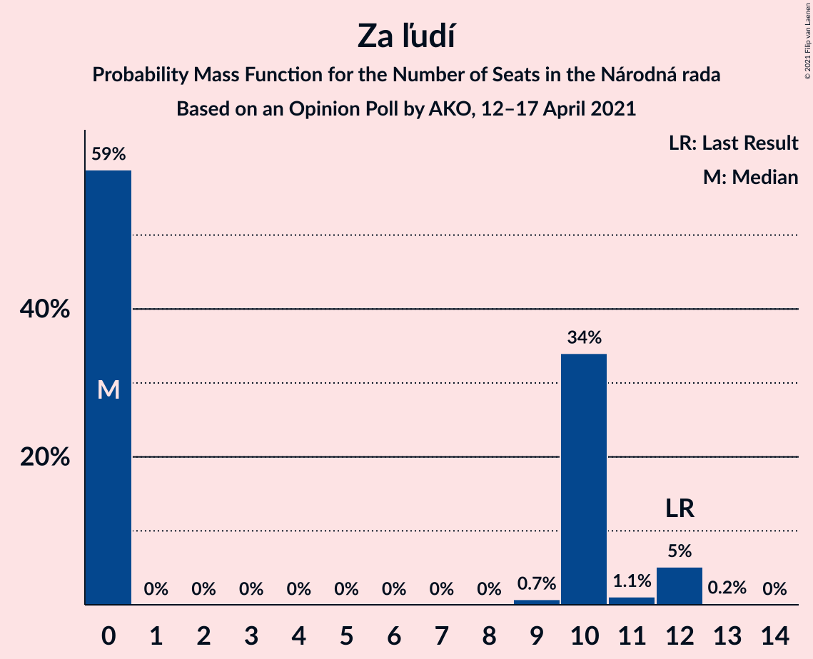
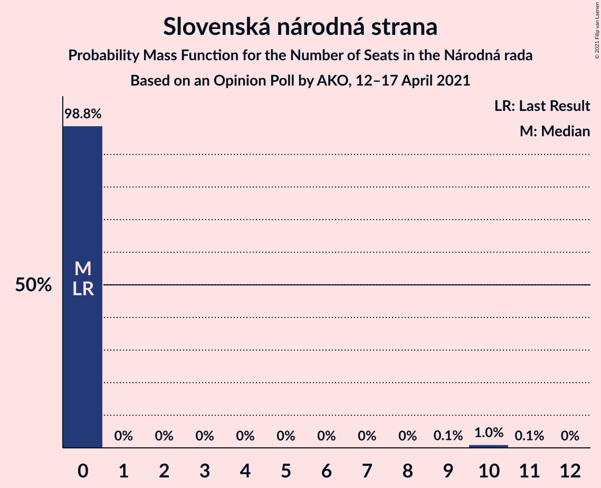
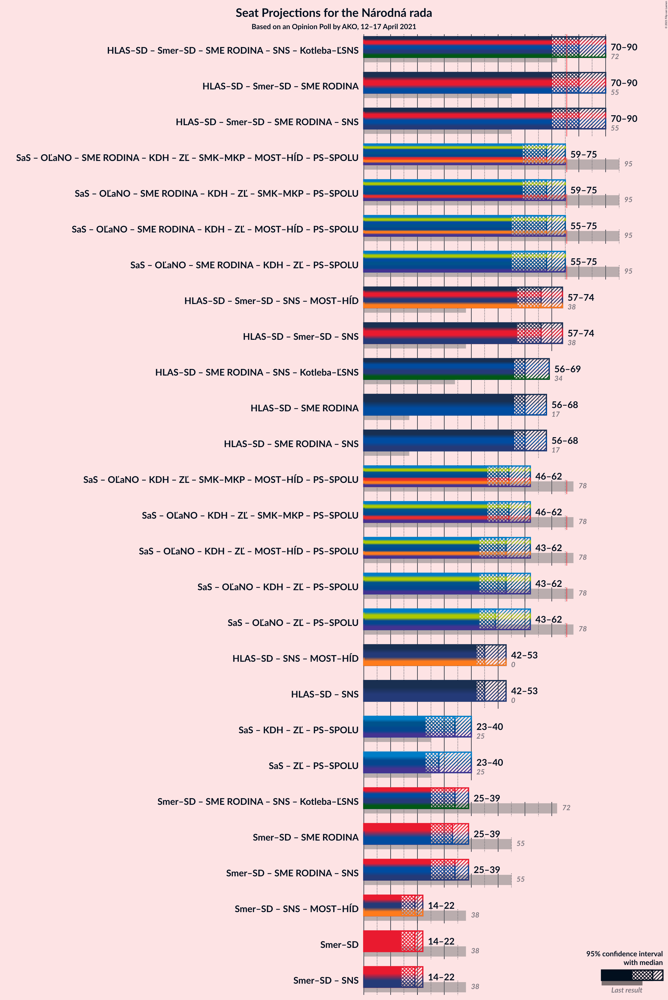
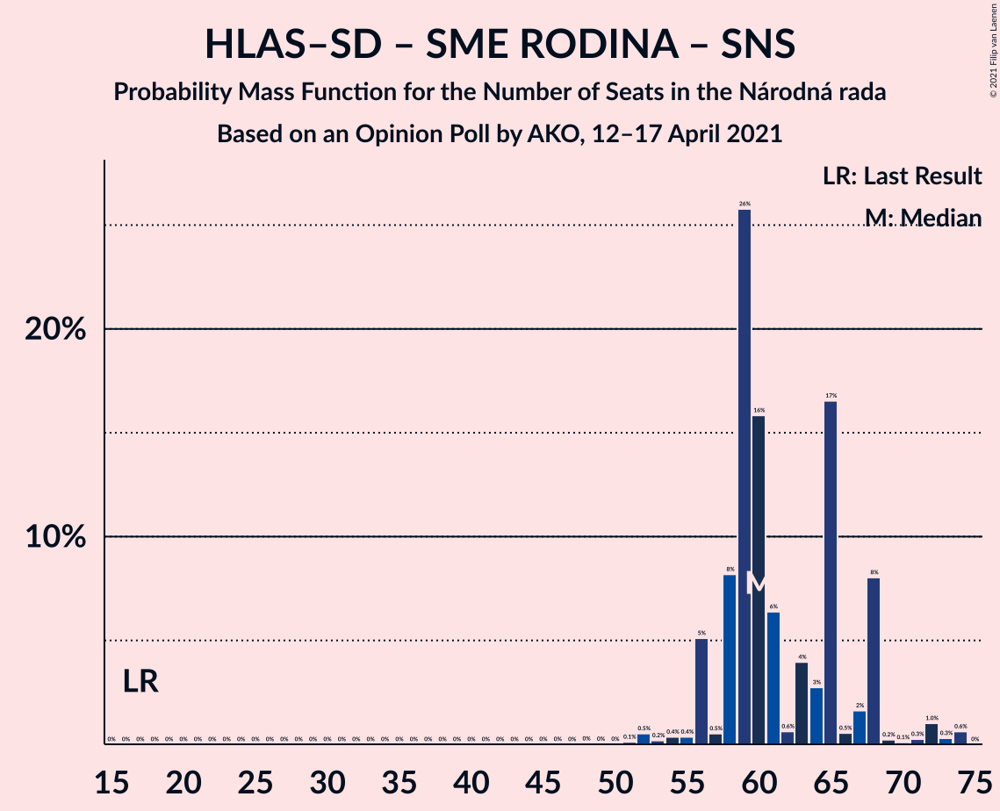
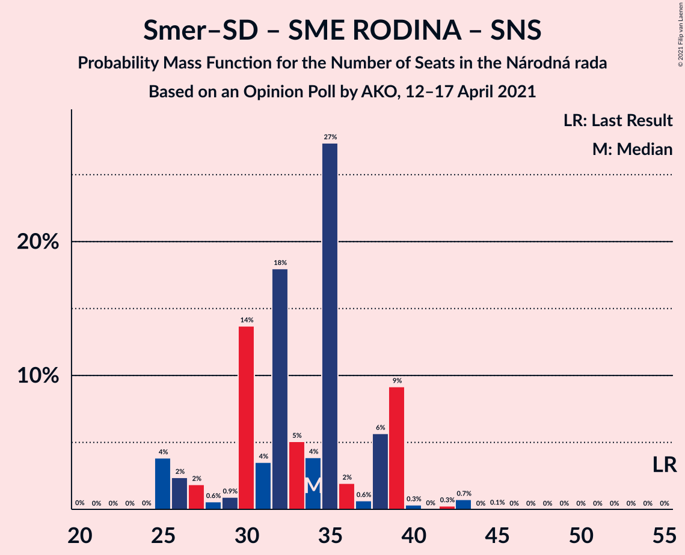

# Opinion Poll by AKO, 12–17 April 2021

<a href="#voting-intentions">Voting Intentions</a> | <a href="#seats">Seats</a> | <a href="#coalitions">Coalitions</a> | <a href="#technical-information">Technical Information</a>

## Voting Intentions

### Confidence Intervals

| Party | Last Result | Poll Result | 80% Confidence Interval | 90% Confidence Interval | 95% Confidence Interval | 99% Confidence Interval |
|:-----:|:-----------:|:-----------:|:-----------------------:|:-----------------------:|:-----------------------:|:-----------------------:|
| HLAS–sociálna demokracia | 0.0% | 23.9% | 22.2–25.7% |21.8–26.2% |21.4–26.6% |20.6–27.5% |
| Sloboda a Solidarita | 6.2% | 13.8% | 12.5–15.3% |12.1–15.7% |11.8–16.1% |11.2–16.8% |
| OBYČAJNÍ ĽUDIA a nezávislé osobnosti | 25.0% | 10.0% | 8.9–11.3% |8.6–11.7% |8.3–12.0% |7.8–12.7% |
| SMER–sociálna demokracia | 18.3% | 9.2% | 8.1–10.5% |7.8–10.8% |7.6–11.2% |7.1–11.8% |
| Progresívne Slovensko | 7.0% | 8.3% | 7.3–9.5% |7.0–9.9% |6.7–10.2% |6.3–10.8% |
| SME RODINA | 8.2% | 7.4% | 6.4–8.6% |6.2–8.9% |5.9–9.2% |5.5–9.8% |
| Kresťanskodemokratické hnutie | 4.6% | 4.5% | 3.8–5.5% |3.6–5.7% |3.4–6.0% |3.0–6.5% |
| Za ľudí | 5.8% | 4.3% | 3.6–5.2% |3.4–5.5% |3.2–5.7% |2.9–6.2% |
| Strana maďarskej koalície–Magyar Koalíció Pártja | 3.9% | 4.2% | 3.5–5.1% |3.3–5.4% |3.1–5.6% |2.8–6.1% |
| Slovenská národná strana | 3.2% | 3.3% | 2.7–4.1% |2.5–4.4% |2.4–4.6% |2.1–5.0% |
| Dobrá voľba | 3.1% | 3.1% | 2.5–3.9% |2.3–4.2% |2.2–4.4% |1.9–4.8% |
| REPUBLIKA | 0.0% | 3.1% | 2.5–3.9% |2.3–4.2% |2.2–4.4% |1.9–4.8% |
| Kotleba–Ľudová strana Naše Slovensko | 8.0% | 2.9% | 2.3–3.7% |2.2–3.9% |2.0–4.1% |1.8–4.6% |
| SPOLU–Občianska Demokracia | 7.0% | 0.9% | 0.6–1.4% |0.5–1.6% |0.5–1.7% |0.4–2.0% |

*Note:* The poll result column reflects the actual value used in the calculations. Published results may vary slightly, and in addition be rounded to fewer digits.

## Seats

### Confidence Intervals

| Party | Last Result | Median | 80% Confidence Interval | 90% Confidence Interval | 95% Confidence Interval | 99% Confidence Interval |
|:-----:|:-----------:|:------:|:-----------------------:|:-----------------------:|:-----------------------:|:-----------------------:|
| <a href="#hlas–sociálna-demokracia">HLAS–sociálna demokracia</a> | 0 | 45 | 44–51 |42–53 |42–53 |39–54 |
| <a href="#sloboda-a-solidarita">Sloboda a Solidarita</a> | 13 | 26 | 23–29 |23–30 |23–30 |22–32 |
| <a href="#obyčajní-ľudia-a-nezávislé-osobnosti">OBYČAJNÍ ĽUDIA a nezávislé osobnosti</a> | 53 | 20 | 18–22 |18–24 |17–24 |15–24 |
| <a href="#smer–sociálna-demokracia">SMER–sociálna demokracia</a> | 38 | 19 | 15–21 |14–22 |14–22 |13–23 |
| <a href="#progresívne-slovensko">Progresívne Slovensko</a> | 0 | 16 | 14–20 |13–20 |13–20 |12–22 |
| <a href="#sme-rodina">SME RODINA</a> | 17 | 14 | 12–17 |11–17 |11–18 |11–19 |
| <a href="#kresťanskodemokratické-hnutie">Kresťanskodemokratické hnutie</a> | 0 | 0 | 0–10 |0–11 |0–12 |0–12 |
| <a href="#za-ľudí">Za ľudí</a> | 12 | 0 | 0–10 |0–12 |0–12 |0–12 |
| <a href="#strana-maďarskej-koalície–magyar-koalíció-pártja">Strana maďarskej koalície–Magyar Koalíció Pártja</a> | 0 | 0 | 0–10 |0–10 |0–11 |0–11 |
| <a href="#slovenská-národná-strana">Slovenská národná strana</a> | 0 | 0 | 0 |0 |0 |0–10 |
| <a href="#dobrá-voľba">Dobrá voľba</a> | 0 | 0 | 0 |0 |0 |0 |
| <a href="#republika">REPUBLIKA</a> | 0 | 0 | 0 |0 |0 |0 |
| <a href="#kotleba–ľudová-strana-naše-slovensko">Kotleba–Ľudová strana Naše Slovensko</a> | 17 | 0 | 0 |0 |0 |0 |
| <a href="#spolu–občianska-demokracia">SPOLU–Občianska Demokracia</a> | 0 | 0 | 0 |0 |0 |0 |

### HLAS–sociálna demokracia

*For a full overview of the results for this party, see the [HLAS–sociálna demokracia](party-hlas–sociálnademokracia.html) page.*

| Number of Seats | Probability | Accumulated | Special Marks |
|:---------------:|:-----------:|:-----------:|:-------------:|
| 0 | 0% | 100% | Last Result |
| 1 | 0% | 100% |  |
| 2 | 0% | 100% |  |
| 3 | 0% | 100% |  |
| 4 | 0% | 100% |  |
| 5 | 0% | 100% |  |
| 6 | 0% | 100% |  |
| 7 | 0% | 100% |  |
| 8 | 0% | 100% |  |
| 9 | 0% | 100% |  |
| 10 | 0% | 100% |  |
| 11 | 0% | 100% |  |
| 12 | 0% | 100% |  |
| 13 | 0% | 100% |  |
| 14 | 0% | 100% |  |
| 15 | 0% | 100% |  |
| 16 | 0% | 100% |  |
| 17 | 0% | 100% |  |
| 18 | 0% | 100% |  |
| 19 | 0% | 100% |  |
| 20 | 0% | 100% |  |
| 21 | 0% | 100% |  |
| 22 | 0% | 100% |  |
| 23 | 0% | 100% |  |
| 24 | 0% | 100% |  |
| 25 | 0% | 100% |  |
| 26 | 0% | 100% |  |
| 27 | 0% | 100% |  |
| 28 | 0% | 100% |  |
| 29 | 0% | 100% |  |
| 30 | 0% | 100% |  |
| 31 | 0% | 100% |  |
| 32 | 0% | 100% |  |
| 33 | 0% | 100% |  |
| 34 | 0% | 100% |  |
| 35 | 0% | 100% |  |
| 36 | 0% | 100% |  |
| 37 | 0.1% | 100% |  |
| 38 | 0.2% | 99.9% |  |
| 39 | 0.2% | 99.6% |  |
| 40 | 0.9% | 99.4% |  |
| 41 | 0.4% | 98.5% |  |
| 42 | 3% | 98% |  |
| 43 | 5% | 95% |  |
| 44 | 7% | 90% |  |
| 45 | 34% | 83% | Median |
| 46 | 4% | 49% |  |
| 47 | 3% | 45% |  |
| 48 | 10% | 42% |  |
| 49 | 13% | 32% |  |
| 50 | 0.4% | 19% |  |
| 51 | 9% | 19% |  |
| 52 | 4% | 10% |  |
| 53 | 4% | 6% |  |
| 54 | 1.3% | 1.4% |  |
| 55 | 0% | 0.2% |  |
| 56 | 0.1% | 0.1% |  |
| 57 | 0% | 0% |  |

### Sloboda a Solidarita

*For a full overview of the results for this party, see the [Sloboda a Solidarita](party-slobodaasolidarita.html) page.*

| Number of Seats | Probability | Accumulated | Special Marks |
|:---------------:|:-----------:|:-----------:|:-------------:|
| 13 | 0% | 100% | Last Result |
| 14 | 0% | 100% |  |
| 15 | 0% | 100% |  |
| 16 | 0% | 100% |  |
| 17 | 0% | 100% |  |
| 18 | 0% | 100% |  |
| 19 | 0% | 100% |  |
| 20 | 0% | 100% |  |
| 21 | 0.4% | 100% |  |
| 22 | 1.0% | 99.6% |  |
| 23 | 9% | 98.6% |  |
| 24 | 31% | 89% |  |
| 25 | 1.2% | 58% |  |
| 26 | 7% | 57% | Median |
| 27 | 21% | 50% |  |
| 28 | 16% | 29% |  |
| 29 | 6% | 13% |  |
| 30 | 5% | 7% |  |
| 31 | 0.8% | 2% |  |
| 32 | 0.3% | 0.8% |  |
| 33 | 0.2% | 0.5% |  |
| 34 | 0% | 0.3% |  |
| 35 | 0.3% | 0.3% |  |
| 36 | 0% | 0% |  |

### OBYČAJNÍ ĽUDIA a nezávislé osobnosti

*For a full overview of the results for this party, see the [OBYČAJNÍ ĽUDIA a nezávislé osobnosti](party-obyčajníľudiaanezávisléosobnosti.html) page.*

| Number of Seats | Probability | Accumulated | Special Marks |
|:---------------:|:-----------:|:-----------:|:-------------:|
| 14 | 0% | 100% |  |
| 15 | 1.2% | 99.9% |  |
| 16 | 1.2% | 98.8% |  |
| 17 | 2% | 98% |  |
| 18 | 8% | 96% |  |
| 19 | 18% | 88% |  |
| 20 | 44% | 70% | Median |
| 21 | 2% | 26% |  |
| 22 | 17% | 25% |  |
| 23 | 1.5% | 7% |  |
| 24 | 6% | 6% |  |
| 25 | 0.2% | 0.4% |  |
| 26 | 0.2% | 0.2% |  |
| 27 | 0.1% | 0.1% |  |
| 28 | 0% | 0% |  |
| 29 | 0% | 0% |  |
| 30 | 0% | 0% |  |
| 31 | 0% | 0% |  |
| 32 | 0% | 0% |  |
| 33 | 0% | 0% |  |
| 34 | 0% | 0% |  |
| 35 | 0% | 0% |  |
| 36 | 0% | 0% |  |
| 37 | 0% | 0% |  |
| 38 | 0% | 0% |  |
| 39 | 0% | 0% |  |
| 40 | 0% | 0% |  |
| 41 | 0% | 0% |  |
| 42 | 0% | 0% |  |
| 43 | 0% | 0% |  |
| 44 | 0% | 0% |  |
| 45 | 0% | 0% |  |
| 46 | 0% | 0% |  |
| 47 | 0% | 0% |  |
| 48 | 0% | 0% |  |
| 49 | 0% | 0% |  |
| 50 | 0% | 0% |  |
| 51 | 0% | 0% |  |
| 52 | 0% | 0% |  |
| 53 | 0% | 0% | Last Result |

### SMER–sociálna demokracia

*For a full overview of the results for this party, see the [SMER–sociálna demokracia](party-smer–sociálnademokracia.html) page.*

| Number of Seats | Probability | Accumulated | Special Marks |
|:---------------:|:-----------:|:-----------:|:-------------:|
| 13 | 0.5% | 100% |  |
| 14 | 5% | 99.4% |  |
| 15 | 6% | 95% |  |
| 16 | 20% | 89% |  |
| 17 | 4% | 69% |  |
| 18 | 11% | 64% |  |
| 19 | 5% | 53% | Median |
| 20 | 3% | 48% |  |
| 21 | 35% | 45% |  |
| 22 | 8% | 9% |  |
| 23 | 0.6% | 1.1% |  |
| 24 | 0.4% | 0.5% |  |
| 25 | 0% | 0% |  |
| 26 | 0% | 0% |  |
| 27 | 0% | 0% |  |
| 28 | 0% | 0% |  |
| 29 | 0% | 0% |  |
| 30 | 0% | 0% |  |
| 31 | 0% | 0% |  |
| 32 | 0% | 0% |  |
| 33 | 0% | 0% |  |
| 34 | 0% | 0% |  |
| 35 | 0% | 0% |  |
| 36 | 0% | 0% |  |
| 37 | 0% | 0% |  |
| 38 | 0% | 0% | Last Result |

### Progresívne Slovensko

*For a full overview of the results for this party, see the [Progresívne Slovensko](party-progresívneslovensko.html) page.*

| Number of Seats | Probability | Accumulated | Special Marks |
|:---------------:|:-----------:|:-----------:|:-------------:|
| 0 | 0% | 100% | Last Result |
| 1 | 0% | 100% |  |
| 2 | 0% | 100% |  |
| 3 | 0% | 100% |  |
| 4 | 0% | 100% |  |
| 5 | 0% | 100% |  |
| 6 | 0% | 100% |  |
| 7 | 0% | 100% |  |
| 8 | 0% | 100% |  |
| 9 | 0% | 100% |  |
| 10 | 0.1% | 100% |  |
| 11 | 0% | 99.9% |  |
| 12 | 0.4% | 99.9% |  |
| 13 | 8% | 99.5% |  |
| 14 | 5% | 91% |  |
| 15 | 3% | 87% |  |
| 16 | 35% | 83% | Median |
| 17 | 10% | 48% |  |
| 18 | 14% | 38% |  |
| 19 | 10% | 24% |  |
| 20 | 12% | 14% |  |
| 21 | 0.2% | 2% |  |
| 22 | 1.0% | 1.4% |  |
| 23 | 0% | 0.3% |  |
| 24 | 0.3% | 0.3% |  |
| 25 | 0% | 0% |  |

### SME RODINA

*For a full overview of the results for this party, see the [SME RODINA](party-smerodina.html) page.*

| Number of Seats | Probability | Accumulated | Special Marks |
|:---------------:|:-----------:|:-----------:|:-------------:|
| 0 | 0.1% | 100% |  |
| 1 | 0% | 99.9% |  |
| 2 | 0% | 99.9% |  |
| 3 | 0% | 99.9% |  |
| 4 | 0% | 99.9% |  |
| 5 | 0% | 99.9% |  |
| 6 | 0% | 99.9% |  |
| 7 | 0% | 99.9% |  |
| 8 | 0% | 99.9% |  |
| 9 | 0% | 99.9% |  |
| 10 | 0.4% | 99.9% |  |
| 11 | 8% | 99.6% |  |
| 12 | 14% | 91% |  |
| 13 | 1.3% | 77% |  |
| 14 | 31% | 76% | Median |
| 15 | 9% | 45% |  |
| 16 | 18% | 36% |  |
| 17 | 14% | 18% | Last Result |
| 18 | 2% | 4% |  |
| 19 | 2% | 2% |  |
| 20 | 0.1% | 0.1% |  |
| 21 | 0% | 0% |  |

### Kresťanskodemokratické hnutie

*For a full overview of the results for this party, see the [Kresťanskodemokratické hnutie](party-kresťanskodemokratickéhnutie.html) page.*

| Number of Seats | Probability | Accumulated | Special Marks |
|:---------------:|:-----------:|:-----------:|:-------------:|
| 0 | 90% | 100% | Last Result, Median |
| 1 | 0% | 10% |  |
| 2 | 0% | 10% |  |
| 3 | 0% | 10% |  |
| 4 | 0% | 10% |  |
| 5 | 0% | 10% |  |
| 6 | 0% | 10% |  |
| 7 | 0% | 10% |  |
| 8 | 0% | 10% |  |
| 9 | 0.4% | 10% |  |
| 10 | 2% | 10% |  |
| 11 | 3% | 8% |  |
| 12 | 4% | 5% |  |
| 13 | 0.2% | 0.3% |  |
| 14 | 0% | 0.1% |  |
| 15 | 0% | 0% |  |

### Za ľudí

*For a full overview of the results for this party, see the [Za ľudí](party-zaľudí.html) page.*

| Number of Seats | Probability | Accumulated | Special Marks |
|:---------------:|:-----------:|:-----------:|:-------------:|
| 0 | 59% | 100% | Median |
| 1 | 0% | 41% |  |
| 2 | 0% | 41% |  |
| 3 | 0% | 41% |  |
| 4 | 0% | 41% |  |
| 5 | 0% | 41% |  |
| 6 | 0% | 41% |  |
| 7 | 0% | 41% |  |
| 8 | 0% | 41% |  |
| 9 | 0.7% | 41% |  |
| 10 | 34% | 40% |  |
| 11 | 1.1% | 6% |  |
| 12 | 5% | 5% | Last Result |
| 13 | 0.2% | 0.2% |  |
| 14 | 0% | 0% |  |

### Strana maďarskej koalície–Magyar Koalíció Pártja

*For a full overview of the results for this party, see the [Strana maďarskej koalície–Magyar Koalíció Pártja](party-stranamaďarskejkoalície–magyarkoalíciópártja.html) page.*

| Number of Seats | Probability | Accumulated | Special Marks |
|:---------------:|:-----------:|:-----------:|:-------------:|
| 0 | 87% | 100% | Last Result, Median |
| 1 | 0% | 13% |  |
| 2 | 0% | 13% |  |
| 3 | 0% | 13% |  |
| 4 | 0% | 13% |  |
| 5 | 0% | 13% |  |
| 6 | 0% | 13% |  |
| 7 | 0% | 13% |  |
| 8 | 0% | 13% |  |
| 9 | 0.2% | 13% |  |
| 10 | 9% | 12% |  |
| 11 | 3% | 3% |  |
| 12 | 0.1% | 0.1% |  |
| 13 | 0% | 0% |  |

### Slovenská národná strana

*For a full overview of the results for this party, see the [Slovenská národná strana](party-slovenskánárodnástrana.html) page.*

| Number of Seats | Probability | Accumulated | Special Marks |
|:---------------:|:-----------:|:-----------:|:-------------:|
| 0 | 98.8% | 100% | Last Result, Median |
| 1 | 0% | 1.2% |  |
| 2 | 0% | 1.2% |  |
| 3 | 0% | 1.2% |  |
| 4 | 0% | 1.2% |  |
| 5 | 0% | 1.2% |  |
| 6 | 0% | 1.2% |  |
| 7 | 0% | 1.2% |  |
| 8 | 0% | 1.2% |  |
| 9 | 0.1% | 1.2% |  |
| 10 | 1.0% | 1.1% |  |
| 11 | 0.1% | 0.1% |  |
| 12 | 0% | 0% |  |

### Dobrá voľba

*For a full overview of the results for this party, see the [Dobrá voľba](party-dobrávoľba.html) page.*

| Number of Seats | Probability | Accumulated | Special Marks |
|:---------------:|:-----------:|:-----------:|:-------------:|
| 0 | 99.8% | 100% | Last Result, Median |
| 1 | 0% | 0.2% |  |
| 2 | 0% | 0.2% |  |
| 3 | 0% | 0.2% |  |
| 4 | 0% | 0.2% |  |
| 5 | 0% | 0.2% |  |
| 6 | 0% | 0.2% |  |
| 7 | 0% | 0.2% |  |
| 8 | 0% | 0.2% |  |
| 9 | 0% | 0.2% |  |
| 10 | 0% | 0.2% |  |
| 11 | 0.2% | 0.2% |  |
| 12 | 0% | 0% |  |

### REPUBLIKA

*For a full overview of the results for this party, see the [REPUBLIKA](party-republika.html) page.*

| Number of Seats | Probability | Accumulated | Special Marks |
|:---------------:|:-----------:|:-----------:|:-------------:|
| 0 | 99.9% | 100% | Last Result, Median |
| 1 | 0% | 0.1% |  |
| 2 | 0% | 0.1% |  |
| 3 | 0% | 0.1% |  |
| 4 | 0% | 0.1% |  |
| 5 | 0% | 0.1% |  |
| 6 | 0% | 0.1% |  |
| 7 | 0% | 0.1% |  |
| 8 | 0% | 0.1% |  |
| 9 | 0% | 0.1% |  |
| 10 | 0.1% | 0.1% |  |
| 11 | 0% | 0% |  |

### Kotleba–Ľudová strana Naše Slovensko

*For a full overview of the results for this party, see the [Kotleba–Ľudová strana Naše Slovensko](party-kotleba–ľudovástrananašeslovensko.html) page.*

| Number of Seats | Probability | Accumulated | Special Marks |
|:---------------:|:-----------:|:-----------:|:-------------:|
| 0 | 99.9% | 100% | Median |
| 1 | 0% | 0.1% |  |
| 2 | 0% | 0.1% |  |
| 3 | 0% | 0.1% |  |
| 4 | 0% | 0.1% |  |
| 5 | 0% | 0.1% |  |
| 6 | 0% | 0.1% |  |
| 7 | 0% | 0.1% |  |
| 8 | 0% | 0.1% |  |
| 9 | 0% | 0.1% |  |
| 10 | 0% | 0.1% |  |
| 11 | 0% | 0% |  |
| 12 | 0% | 0% |  |
| 13 | 0% | 0% |  |
| 14 | 0% | 0% |  |
| 15 | 0% | 0% |  |
| 16 | 0% | 0% |  |
| 17 | 0% | 0% | Last Result |

### SPOLU–Občianska Demokracia

*For a full overview of the results for this party, see the [SPOLU–Občianska Demokracia](party-spolu–občianskademokracia.html) page.*

| Number of Seats | Probability | Accumulated | Special Marks |
|:---------------:|:-----------:|:-----------:|:-------------:|
| 0 | 100% | 100% | Last Result, Median |

## Coalitions

### Confidence Intervals

| Coalition | Last Result | Median | Majority? | 80% Confidence Interval | 90% Confidence Interval | 95% Confidence Interval | 99% Confidence Interval |
|:---------:|:-----------:|:------:|:---------:|:-----------------------:|:-----------------------:|:-----------------------:|:-----------------------:|
| HLAS–sociálna demokracia – SMER–sociálna demokracia – SME RODINA – Slovenská národná strana – Kotleba–Ľudová strana Naše Slovensko | 72 | 80 | 87% | 75–88 | 72–90 | 70–90 | 70–90 |
| HLAS–sociálna demokracia – SMER–sociálna demokracia – SME RODINA | 55 | 80 | 87% | 75–86 | 72–90 | 70–90 | 70–90 |
| HLAS–sociálna demokracia – SMER–sociálna demokracia – SME RODINA – Slovenská národná strana | 55 | 80 | 87% | 75–88 | 72–90 | 70–90 | 70–90 |
| HLAS–sociálna demokracia – SMER–sociálna demokracia – Slovenská národná strana | 38 | 66 | 0.3% | 60–73 | 59–73 | 57–74 | 56–74 |
| HLAS–sociálna demokracia – SME RODINA – Slovenská národná strana – Kotleba–Ľudová strana Naše Slovensko | 34 | 60 | 0% | 58–68 | 56–68 | 56–69 | 52–74 |
| HLAS–sociálna demokracia – SME RODINA | 17 | 60 | 0% | 58–67 | 56–68 | 56–68 | 52–72 |
| HLAS–sociálna demokracia – SME RODINA – Slovenská národná strana | 17 | 60 | 0% | 58–68 | 56–68 | 56–68 | 52–74 |
| HLAS–sociálna demokracia – Slovenská národná strana | 0 | 45 | 0% | 44–52 | 43–53 | 42–53 | 40–57 |
| SMER–sociálna demokracia – SME RODINA – Slovenská národná strana – Kotleba–Ľudová strana Naše Slovensko | 72 | 34 | 0% | 30–39 | 26–39 | 25–39 | 25–43 |
| SMER–sociálna demokracia – SME RODINA | 55 | 33 | 0% | 30–38 | 26–39 | 25–39 | 25–39 |
| SMER–sociálna demokracia – SME RODINA – Slovenská národná strana | 55 | 34 | 0% | 30–39 | 26–39 | 25–39 | 25–43 |
| SMER–sociálna demokracia | 38 | 19 | 0% | 15–21 | 14–22 | 14–22 | 13–23 |
| SMER–sociálna demokracia – Slovenská národná strana | 38 | 19 | 0% | 15–22 | 14–22 | 14–22 | 13–26 |

### HLAS–sociálna demokracia – SMER–sociálna demokracia – SME RODINA – Slovenská národná strana – Kotleba–Ľudová strana Naše Slovensko

| Number of Seats | Probability | Accumulated | Special Marks |
|:---------------:|:-----------:|:-----------:|:-------------:|
| 64 | 0.1% | 100% |  |
| 65 | 0% | 99.9% |  |
| 66 | 0% | 99.9% |  |
| 67 | 0% | 99.9% |  |
| 68 | 0.1% | 99.9% |  |
| 69 | 0.1% | 99.8% |  |
| 70 | 4% | 99.8% |  |
| 71 | 0.2% | 96% |  |
| 72 | 1.2% | 95% | Last Result |
| 73 | 3% | 94% |  |
| 74 | 0.9% | 91% |  |
| 75 | 4% | 90% |  |
| 76 | 5% | 87% | Majority |
| 77 | 0.8% | 82% |  |
| 78 | 12% | 81% | Median |
| 79 | 5% | 69% |  |
| 80 | 27% | 64% |  |
| 81 | 12% | 37% |  |
| 82 | 6% | 25% |  |
| 83 | 0.5% | 19% |  |
| 84 | 2% | 18% |  |
| 85 | 0.5% | 17% |  |
| 86 | 6% | 16% |  |
| 87 | 0.3% | 10% |  |
| 88 | 0.4% | 10% |  |
| 89 | 0.2% | 10% |  |
| 90 | 9% | 10% |  |
| 91 | 0.2% | 0.3% |  |
| 92 | 0.1% | 0.1% |  |
| 93 | 0% | 0% |  |

### HLAS–sociálna demokracia – SMER–sociálna demokracia – SME RODINA

| Number of Seats | Probability | Accumulated | Special Marks |
|:---------------:|:-----------:|:-----------:|:-------------:|
| 55 | 0% | 100% | Last Result |
| 56 | 0% | 100% |  |
| 57 | 0% | 100% |  |
| 58 | 0% | 100% |  |
| 59 | 0% | 100% |  |
| 60 | 0% | 100% |  |
| 61 | 0% | 100% |  |
| 62 | 0% | 100% |  |
| 63 | 0% | 100% |  |
| 64 | 0.1% | 100% |  |
| 65 | 0% | 99.9% |  |
| 66 | 0% | 99.9% |  |
| 67 | 0% | 99.9% |  |
| 68 | 0.1% | 99.9% |  |
| 69 | 0.1% | 99.8% |  |
| 70 | 4% | 99.7% |  |
| 71 | 0.2% | 96% |  |
| 72 | 1.2% | 95% |  |
| 73 | 3% | 94% |  |
| 74 | 1.0% | 91% |  |
| 75 | 4% | 90% |  |
| 76 | 5% | 87% | Majority |
| 77 | 0.9% | 82% |  |
| 78 | 12% | 81% | Median |
| 79 | 5% | 69% |  |
| 80 | 28% | 64% |  |
| 81 | 12% | 36% |  |
| 82 | 6% | 23% |  |
| 83 | 0.5% | 18% |  |
| 84 | 2% | 17% |  |
| 85 | 0.4% | 15% |  |
| 86 | 6% | 15% |  |
| 87 | 0.3% | 10% |  |
| 88 | 0.3% | 9% |  |
| 89 | 0.2% | 9% |  |
| 90 | 9% | 9% |  |
| 91 | 0.1% | 0.2% |  |
| 92 | 0.1% | 0.1% |  |
| 93 | 0% | 0% |  |

### HLAS–sociálna demokracia – SMER–sociálna demokracia – SME RODINA – Slovenská národná strana

| Number of Seats | Probability | Accumulated | Special Marks |
|:---------------:|:-----------:|:-----------:|:-------------:|
| 55 | 0% | 100% | Last Result |
| 56 | 0% | 100% |  |
| 57 | 0% | 100% |  |
| 58 | 0% | 100% |  |
| 59 | 0% | 100% |  |
| 60 | 0% | 100% |  |
| 61 | 0% | 100% |  |
| 62 | 0% | 100% |  |
| 63 | 0% | 100% |  |
| 64 | 0.1% | 100% |  |
| 65 | 0% | 99.9% |  |
| 66 | 0% | 99.9% |  |
| 67 | 0% | 99.9% |  |
| 68 | 0.1% | 99.9% |  |
| 69 | 0.1% | 99.8% |  |
| 70 | 4% | 99.7% |  |
| 71 | 0.2% | 96% |  |
| 72 | 1.2% | 95% |  |
| 73 | 3% | 94% |  |
| 74 | 0.9% | 91% |  |
| 75 | 4% | 90% |  |
| 76 | 5% | 87% | Majority |
| 77 | 0.8% | 82% |  |
| 78 | 12% | 81% | Median |
| 79 | 5% | 69% |  |
| 80 | 27% | 64% |  |
| 81 | 12% | 37% |  |
| 82 | 6% | 24% |  |
| 83 | 0.5% | 19% |  |
| 84 | 2% | 18% |  |
| 85 | 0.5% | 17% |  |
| 86 | 6% | 16% |  |
| 87 | 0.3% | 10% |  |
| 88 | 0.4% | 10% |  |
| 89 | 0.2% | 10% |  |
| 90 | 9% | 10% |  |
| 91 | 0.1% | 0.2% |  |
| 92 | 0.1% | 0.1% |  |
| 93 | 0% | 0% |  |

### HLAS–sociálna demokracia – SMER–sociálna demokracia – Slovenská národná strana

| Number of Seats | Probability | Accumulated | Special Marks |
|:---------------:|:-----------:|:-----------:|:-------------:|
| 38 | 0% | 100% | Last Result |
| 39 | 0% | 100% |  |
| 40 | 0% | 100% |  |
| 41 | 0% | 100% |  |
| 42 | 0% | 100% |  |
| 43 | 0% | 100% |  |
| 44 | 0% | 100% |  |
| 45 | 0% | 100% |  |
| 46 | 0% | 100% |  |
| 47 | 0% | 100% |  |
| 48 | 0% | 100% |  |
| 49 | 0% | 100% |  |
| 50 | 0% | 100% |  |
| 51 | 0.1% | 100% |  |
| 52 | 0% | 99.9% |  |
| 53 | 0% | 99.9% |  |
| 54 | 0.1% | 99.9% |  |
| 55 | 0% | 99.9% |  |
| 56 | 0.8% | 99.8% |  |
| 57 | 2% | 99.0% |  |
| 58 | 0.5% | 97% |  |
| 59 | 4% | 96% |  |
| 60 | 4% | 92% |  |
| 61 | 0.7% | 88% |  |
| 62 | 7% | 88% |  |
| 63 | 1.3% | 81% |  |
| 64 | 5% | 80% | Median |
| 65 | 19% | 74% |  |
| 66 | 34% | 56% |  |
| 67 | 3% | 22% |  |
| 68 | 2% | 19% |  |
| 69 | 0.8% | 17% |  |
| 70 | 1.3% | 16% |  |
| 71 | 0.4% | 15% |  |
| 72 | 1.3% | 15% |  |
| 73 | 8% | 13% |  |
| 74 | 5% | 5% |  |
| 75 | 0% | 0.3% |  |
| 76 | 0.1% | 0.3% | Majority |
| 77 | 0.1% | 0.1% |  |
| 78 | 0% | 0% |  |

### HLAS–sociálna demokracia – SME RODINA – Slovenská národná strana – Kotleba–Ľudová strana Naše Slovensko

| Number of Seats | Probability | Accumulated | Special Marks |
|:---------------:|:-----------:|:-----------:|:-------------:|
| 34 | 0% | 100% | Last Result |
| 35 | 0% | 100% |  |
| 36 | 0% | 100% |  |
| 37 | 0% | 100% |  |
| 38 | 0% | 100% |  |
| 39 | 0% | 100% |  |
| 40 | 0% | 100% |  |
| 41 | 0% | 100% |  |
| 42 | 0% | 100% |  |
| 43 | 0% | 100% |  |
| 44 | 0% | 100% |  |
| 45 | 0% | 100% |  |
| 46 | 0% | 100% |  |
| 47 | 0% | 100% |  |
| 48 | 0% | 100% |  |
| 49 | 0% | 100% |  |
| 50 | 0% | 99.9% |  |
| 51 | 0.1% | 99.9% |  |
| 52 | 0.5% | 99.8% |  |
| 53 | 0.2% | 99.3% |  |
| 54 | 0.4% | 99.1% |  |
| 55 | 0.4% | 98.8% |  |
| 56 | 5% | 98% |  |
| 57 | 0.5% | 93% |  |
| 58 | 8% | 93% |  |
| 59 | 26% | 85% | Median |
| 60 | 16% | 59% |  |
| 61 | 6% | 43% |  |
| 62 | 0.6% | 37% |  |
| 63 | 4% | 36% |  |
| 64 | 3% | 32% |  |
| 65 | 17% | 29% |  |
| 66 | 0.6% | 13% |  |
| 67 | 2% | 12% |  |
| 68 | 8% | 11% |  |
| 69 | 0.3% | 3% |  |
| 70 | 0.1% | 2% |  |
| 71 | 0.3% | 2% |  |
| 72 | 1.0% | 2% |  |
| 73 | 0.3% | 0.9% |  |
| 74 | 0.6% | 0.6% |  |
| 75 | 0% | 0% |  |

### HLAS–sociálna demokracia – SME RODINA

| Number of Seats | Probability | Accumulated | Special Marks |
|:---------------:|:-----------:|:-----------:|:-------------:|
| 17 | 0% | 100% | Last Result |
| 18 | 0% | 100% |  |
| 19 | 0% | 100% |  |
| 20 | 0% | 100% |  |
| 21 | 0% | 100% |  |
| 22 | 0% | 100% |  |
| 23 | 0% | 100% |  |
| 24 | 0% | 100% |  |
| 25 | 0% | 100% |  |
| 26 | 0% | 100% |  |
| 27 | 0% | 100% |  |
| 28 | 0% | 100% |  |
| 29 | 0% | 100% |  |
| 30 | 0% | 100% |  |
| 31 | 0% | 100% |  |
| 32 | 0% | 100% |  |
| 33 | 0% | 100% |  |
| 34 | 0% | 100% |  |
| 35 | 0% | 100% |  |
| 36 | 0% | 100% |  |
| 37 | 0% | 100% |  |
| 38 | 0% | 100% |  |
| 39 | 0% | 100% |  |
| 40 | 0% | 100% |  |
| 41 | 0% | 100% |  |
| 42 | 0% | 100% |  |
| 43 | 0% | 100% |  |
| 44 | 0% | 100% |  |
| 45 | 0% | 100% |  |
| 46 | 0% | 100% |  |
| 47 | 0% | 100% |  |
| 48 | 0% | 100% |  |
| 49 | 0% | 100% |  |
| 50 | 0% | 99.9% |  |
| 51 | 0.1% | 99.9% |  |
| 52 | 0.5% | 99.8% |  |
| 53 | 0.2% | 99.3% |  |
| 54 | 0.4% | 99.1% |  |
| 55 | 0.4% | 98.7% |  |
| 56 | 5% | 98% |  |
| 57 | 0.6% | 93% |  |
| 58 | 8% | 93% |  |
| 59 | 26% | 84% | Median |
| 60 | 16% | 59% |  |
| 61 | 7% | 43% |  |
| 62 | 0.7% | 36% |  |
| 63 | 4% | 35% |  |
| 64 | 3% | 31% |  |
| 65 | 17% | 28% |  |
| 66 | 0.5% | 12% |  |
| 67 | 2% | 11% |  |
| 68 | 8% | 9% |  |
| 69 | 0.1% | 2% |  |
| 70 | 0.1% | 1.4% |  |
| 71 | 0.1% | 1.3% |  |
| 72 | 0.9% | 1.2% |  |
| 73 | 0.3% | 0.3% |  |
| 74 | 0% | 0% |  |

### HLAS–sociálna demokracia – SME RODINA – Slovenská národná strana

| Number of Seats | Probability | Accumulated | Special Marks |
|:---------------:|:-----------:|:-----------:|:-------------:|
| 17 | 0% | 100% | Last Result |
| 18 | 0% | 100% |  |
| 19 | 0% | 100% |  |
| 20 | 0% | 100% |  |
| 21 | 0% | 100% |  |
| 22 | 0% | 100% |  |
| 23 | 0% | 100% |  |
| 24 | 0% | 100% |  |
| 25 | 0% | 100% |  |
| 26 | 0% | 100% |  |
| 27 | 0% | 100% |  |
| 28 | 0% | 100% |  |
| 29 | 0% | 100% |  |
| 30 | 0% | 100% |  |
| 31 | 0% | 100% |  |
| 32 | 0% | 100% |  |
| 33 | 0% | 100% |  |
| 34 | 0% | 100% |  |
| 35 | 0% | 100% |  |
| 36 | 0% | 100% |  |
| 37 | 0% | 100% |  |
| 38 | 0% | 100% |  |
| 39 | 0% | 100% |  |
| 40 | 0% | 100% |  |
| 41 | 0% | 100% |  |
| 42 | 0% | 100% |  |
| 43 | 0% | 100% |  |
| 44 | 0% | 100% |  |
| 45 | 0% | 100% |  |
| 46 | 0% | 100% |  |
| 47 | 0% | 100% |  |
| 48 | 0% | 100% |  |
| 49 | 0% | 100% |  |
| 50 | 0% | 99.9% |  |
| 51 | 0.1% | 99.9% |  |
| 52 | 0.5% | 99.8% |  |
| 53 | 0.2% | 99.3% |  |
| 54 | 0.4% | 99.1% |  |
| 55 | 0.4% | 98.8% |  |
| 56 | 5% | 98% |  |
| 57 | 0.5% | 93% |  |
| 58 | 8% | 93% |  |
| 59 | 26% | 85% | Median |
| 60 | 16% | 59% |  |
| 61 | 6% | 43% |  |
| 62 | 0.6% | 37% |  |
| 63 | 4% | 36% |  |
| 64 | 3% | 32% |  |
| 65 | 17% | 29% |  |
| 66 | 0.5% | 13% |  |
| 67 | 2% | 12% |  |
| 68 | 8% | 11% |  |
| 69 | 0.2% | 2% |  |
| 70 | 0.1% | 2% |  |
| 71 | 0.3% | 2% |  |
| 72 | 1.0% | 2% |  |
| 73 | 0.3% | 0.9% |  |
| 74 | 0.6% | 0.6% |  |
| 75 | 0% | 0% |  |

### HLAS–sociálna demokracia – Slovenská národná strana

| Number of Seats | Probability | Accumulated | Special Marks |
|:---------------:|:-----------:|:-----------:|:-------------:|
| 0 | 0% | 100% | Last Result |
| 1 | 0% | 100% |  |
| 2 | 0% | 100% |  |
| 3 | 0% | 100% |  |
| 4 | 0% | 100% |  |
| 5 | 0% | 100% |  |
| 6 | 0% | 100% |  |
| 7 | 0% | 100% |  |
| 8 | 0% | 100% |  |
| 9 | 0% | 100% |  |
| 10 | 0% | 100% |  |
| 11 | 0% | 100% |  |
| 12 | 0% | 100% |  |
| 13 | 0% | 100% |  |
| 14 | 0% | 100% |  |
| 15 | 0% | 100% |  |
| 16 | 0% | 100% |  |
| 17 | 0% | 100% |  |
| 18 | 0% | 100% |  |
| 19 | 0% | 100% |  |
| 20 | 0% | 100% |  |
| 21 | 0% | 100% |  |
| 22 | 0% | 100% |  |
| 23 | 0% | 100% |  |
| 24 | 0% | 100% |  |
| 25 | 0% | 100% |  |
| 26 | 0% | 100% |  |
| 27 | 0% | 100% |  |
| 28 | 0% | 100% |  |
| 29 | 0% | 100% |  |
| 30 | 0% | 100% |  |
| 31 | 0% | 100% |  |
| 32 | 0% | 100% |  |
| 33 | 0% | 100% |  |
| 34 | 0% | 100% |  |
| 35 | 0% | 100% |  |
| 36 | 0% | 100% |  |
| 37 | 0% | 100% |  |
| 38 | 0.2% | 99.9% |  |
| 39 | 0.2% | 99.7% |  |
| 40 | 0.9% | 99.5% |  |
| 41 | 0.3% | 98.6% |  |
| 42 | 3% | 98% |  |
| 43 | 5% | 95% |  |
| 44 | 7% | 90% |  |
| 45 | 34% | 84% | Median |
| 46 | 4% | 50% |  |
| 47 | 2% | 45% |  |
| 48 | 10% | 43% |  |
| 49 | 13% | 33% |  |
| 50 | 0.4% | 20% |  |
| 51 | 9% | 20% |  |
| 52 | 4% | 11% |  |
| 53 | 4% | 7% |  |
| 54 | 1.3% | 2% |  |
| 55 | 0% | 1.0% |  |
| 56 | 0.1% | 1.0% |  |
| 57 | 0.6% | 0.9% |  |
| 58 | 0.2% | 0.2% |  |
| 59 | 0% | 0% |  |

### SMER–sociálna demokracia – SME RODINA – Slovenská národná strana – Kotleba–Ľudová strana Naše Slovensko

| Number of Seats | Probability | Accumulated | Special Marks |
|:---------------:|:-----------:|:-----------:|:-------------:|
| 20 | 0% | 100% |  |
| 21 | 0% | 99.9% |  |
| 22 | 0% | 99.9% |  |
| 23 | 0% | 99.9% |  |
| 24 | 0% | 99.9% |  |
| 25 | 4% | 99.9% |  |
| 26 | 2% | 96% |  |
| 27 | 2% | 94% |  |
| 28 | 0.6% | 92% |  |
| 29 | 0.9% | 91% |  |
| 30 | 14% | 90% |  |
| 31 | 4% | 77% |  |
| 32 | 18% | 73% |  |
| 33 | 5% | 55% | Median |
| 34 | 4% | 50% |  |
| 35 | 27% | 46% |  |
| 36 | 2% | 19% |  |
| 37 | 0.6% | 17% |  |
| 38 | 6% | 16% |  |
| 39 | 9% | 11% |  |
| 40 | 0.3% | 1.5% |  |
| 41 | 0% | 1.2% |  |
| 42 | 0.3% | 1.1% |  |
| 43 | 0.8% | 0.9% |  |
| 44 | 0% | 0.1% |  |
| 45 | 0.1% | 0.1% |  |
| 46 | 0% | 0% |  |
| 47 | 0% | 0% |  |
| 48 | 0% | 0% |  |
| 49 | 0% | 0% |  |
| 50 | 0% | 0% |  |
| 51 | 0% | 0% |  |
| 52 | 0% | 0% |  |
| 53 | 0% | 0% |  |
| 54 | 0% | 0% |  |
| 55 | 0% | 0% |  |
| 56 | 0% | 0% |  |
| 57 | 0% | 0% |  |
| 58 | 0% | 0% |  |
| 59 | 0% | 0% |  |
| 60 | 0% | 0% |  |
| 61 | 0% | 0% |  |
| 62 | 0% | 0% |  |
| 63 | 0% | 0% |  |
| 64 | 0% | 0% |  |
| 65 | 0% | 0% |  |
| 66 | 0% | 0% |  |
| 67 | 0% | 0% |  |
| 68 | 0% | 0% |  |
| 69 | 0% | 0% |  |
| 70 | 0% | 0% |  |
| 71 | 0% | 0% |  |
| 72 | 0% | 0% | Last Result |

### SMER–sociálna demokracia – SME RODINA

| Number of Seats | Probability | Accumulated | Special Marks |
|:---------------:|:-----------:|:-----------:|:-------------:|
| 20 | 0% | 100% |  |
| 21 | 0% | 99.9% |  |
| 22 | 0% | 99.9% |  |
| 23 | 0% | 99.9% |  |
| 24 | 0% | 99.9% |  |
| 25 | 4% | 99.9% |  |
| 26 | 2% | 96% |  |
| 27 | 2% | 94% |  |
| 28 | 0.6% | 92% |  |
| 29 | 0.9% | 91% |  |
| 30 | 14% | 90% |  |
| 31 | 4% | 76% |  |
| 32 | 18% | 73% |  |
| 33 | 6% | 55% | Median |
| 34 | 4% | 49% |  |
| 35 | 27% | 45% |  |
| 36 | 2% | 18% |  |
| 37 | 0.6% | 16% |  |
| 38 | 6% | 15% |  |
| 39 | 9% | 9% |  |
| 40 | 0.2% | 0.3% |  |
| 41 | 0% | 0.1% |  |
| 42 | 0% | 0.1% |  |
| 43 | 0% | 0% |  |
| 44 | 0% | 0% |  |
| 45 | 0% | 0% |  |
| 46 | 0% | 0% |  |
| 47 | 0% | 0% |  |
| 48 | 0% | 0% |  |
| 49 | 0% | 0% |  |
| 50 | 0% | 0% |  |
| 51 | 0% | 0% |  |
| 52 | 0% | 0% |  |
| 53 | 0% | 0% |  |
| 54 | 0% | 0% |  |
| 55 | 0% | 0% | Last Result |

### SMER–sociálna demokracia – SME RODINA – Slovenská národná strana

| Number of Seats | Probability | Accumulated | Special Marks |
|:---------------:|:-----------:|:-----------:|:-------------:|
| 20 | 0% | 100% |  |
| 21 | 0% | 99.9% |  |
| 22 | 0% | 99.9% |  |
| 23 | 0% | 99.9% |  |
| 24 | 0% | 99.9% |  |
| 25 | 4% | 99.9% |  |
| 26 | 2% | 96% |  |
| 27 | 2% | 94% |  |
| 28 | 0.6% | 92% |  |
| 29 | 0.9% | 91% |  |
| 30 | 14% | 90% |  |
| 31 | 4% | 77% |  |
| 32 | 18% | 73% |  |
| 33 | 5% | 55% | Median |
| 34 | 4% | 50% |  |
| 35 | 27% | 46% |  |
| 36 | 2% | 19% |  |
| 37 | 0.6% | 17% |  |
| 38 | 6% | 16% |  |
| 39 | 9% | 11% |  |
| 40 | 0.3% | 1.4% |  |
| 41 | 0% | 1.1% |  |
| 42 | 0.3% | 1.1% |  |
| 43 | 0.7% | 0.8% |  |
| 44 | 0% | 0.1% |  |
| 45 | 0.1% | 0.1% |  |
| 46 | 0% | 0% |  |
| 47 | 0% | 0% |  |
| 48 | 0% | 0% |  |
| 49 | 0% | 0% |  |
| 50 | 0% | 0% |  |
| 51 | 0% | 0% |  |
| 52 | 0% | 0% |  |
| 53 | 0% | 0% |  |
| 54 | 0% | 0% |  |
| 55 | 0% | 0% | Last Result |

### SMER–sociálna demokracia

| Number of Seats | Probability | Accumulated | Special Marks |
|:---------------:|:-----------:|:-----------:|:-------------:|
| 13 | 0.5% | 100% |  |
| 14 | 5% | 99.4% |  |
| 15 | 6% | 95% |  |
| 16 | 20% | 89% |  |
| 17 | 4% | 69% |  |
| 18 | 11% | 64% |  |
| 19 | 5% | 53% | Median |
| 20 | 3% | 48% |  |
| 21 | 35% | 45% |  |
| 22 | 8% | 9% |  |
| 23 | 0.6% | 1.1% |  |
| 24 | 0.4% | 0.5% |  |
| 25 | 0% | 0% |  |
| 26 | 0% | 0% |  |
| 27 | 0% | 0% |  |
| 28 | 0% | 0% |  |
| 29 | 0% | 0% |  |
| 30 | 0% | 0% |  |
| 31 | 0% | 0% |  |
| 32 | 0% | 0% |  |
| 33 | 0% | 0% |  |
| 34 | 0% | 0% |  |
| 35 | 0% | 0% |  |
| 36 | 0% | 0% |  |
| 37 | 0% | 0% |  |
| 38 | 0% | 0% | Last Result |

### SMER–sociálna demokracia – Slovenská národná strana

| Number of Seats | Probability | Accumulated | Special Marks |
|:---------------:|:-----------:|:-----------:|:-------------:|
| 13 | 0.5% | 100% |  |
| 14 | 5% | 99.4% |  |
| 15 | 6% | 95% |  |
| 16 | 19% | 89% |  |
| 17 | 4% | 69% |  |
| 18 | 11% | 65% |  |
| 19 | 5% | 54% | Median |
| 20 | 3% | 49% |  |
| 21 | 35% | 46% |  |
| 22 | 8% | 10% |  |
| 23 | 0.6% | 2% |  |
| 24 | 0.4% | 2% |  |
| 25 | 0% | 1.2% |  |
| 26 | 0.9% | 1.2% |  |
| 27 | 0.1% | 0.3% |  |
| 28 | 0% | 0.2% |  |
| 29 | 0.2% | 0.2% |  |
| 30 | 0% | 0% |  |
| 31 | 0% | 0% |  |
| 32 | 0% | 0% |  |
| 33 | 0% | 0% |  |
| 34 | 0% | 0% |  |
| 35 | 0% | 0% |  |
| 36 | 0% | 0% |  |
| 37 | 0% | 0% |  |
| 38 | 0% | 0% | Last Result |

## Technical Information

### Opinion Poll

+ **Polling firm:** AKO
+ **Commissioner(s):** —
+ **Fieldwork period:** 12–17 April 2021

### Calculations

+ **Sample size:** 1000
+ **Simulations done:** 1,048,576
+ **Error estimate:** 2.18%

