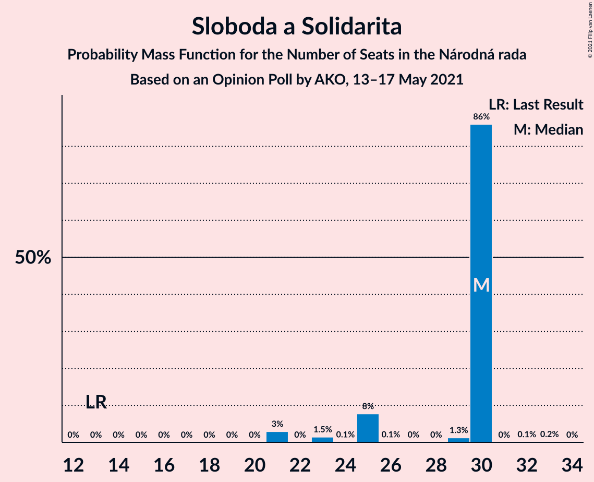
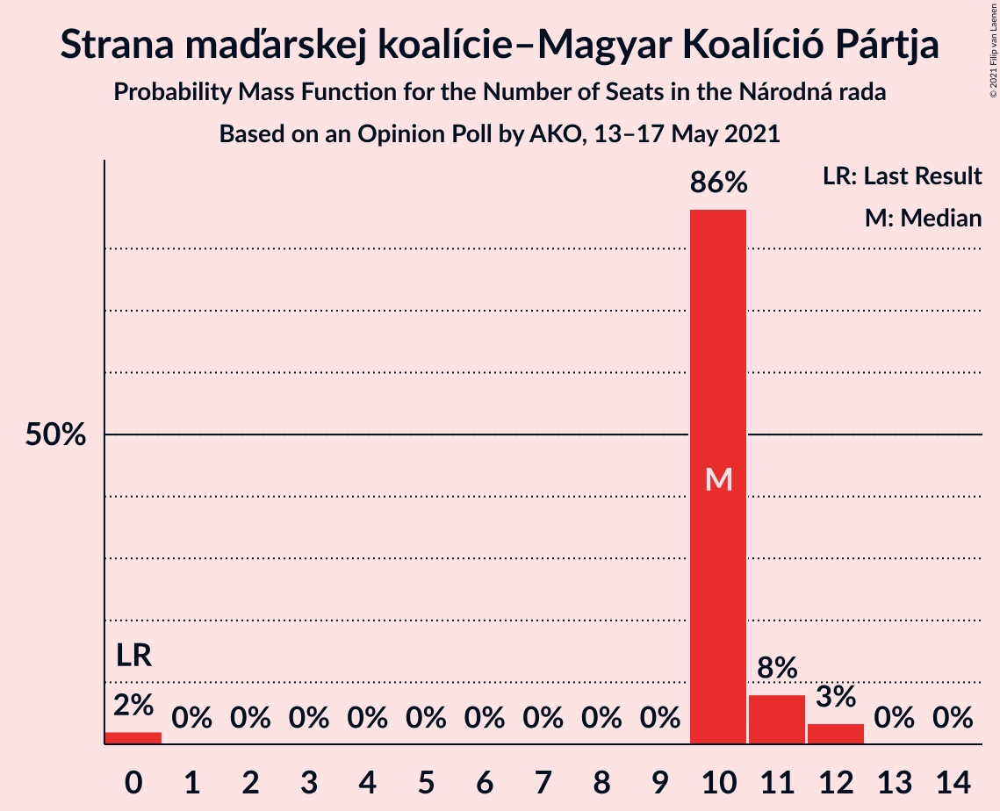
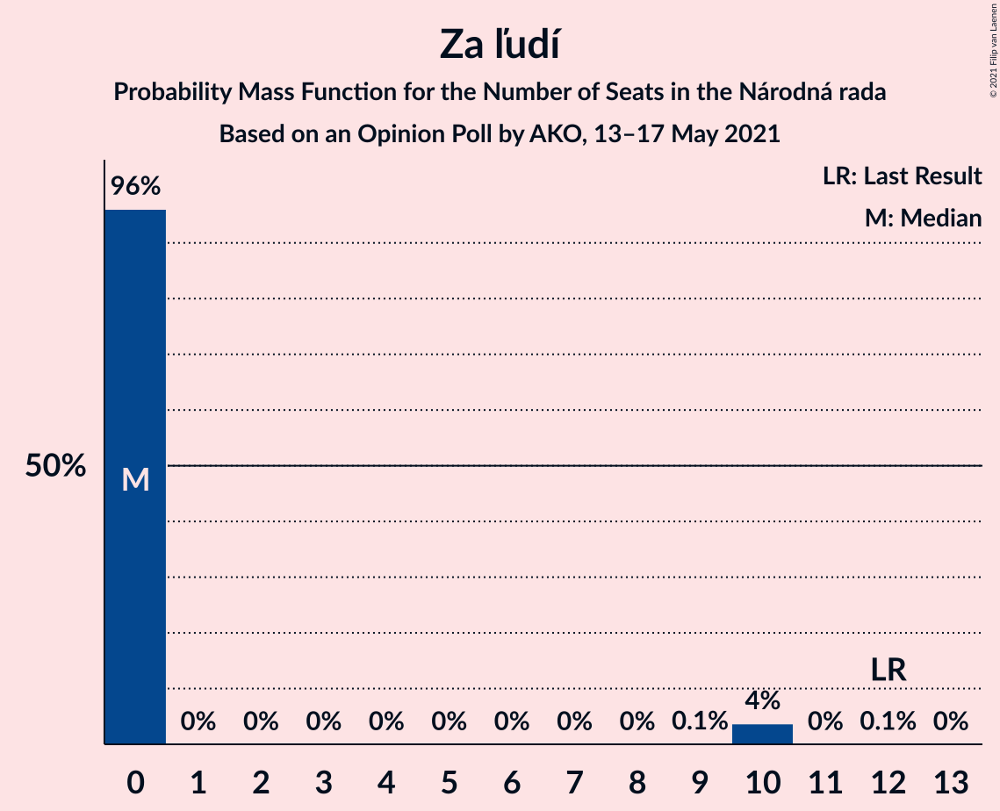
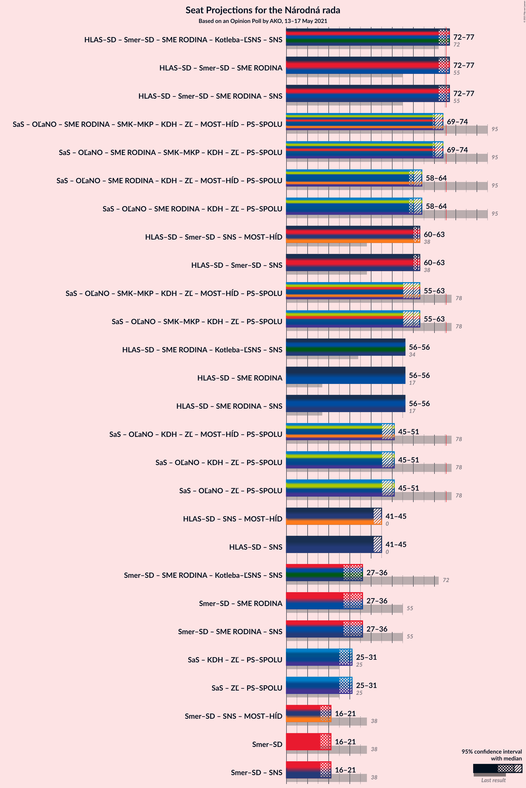
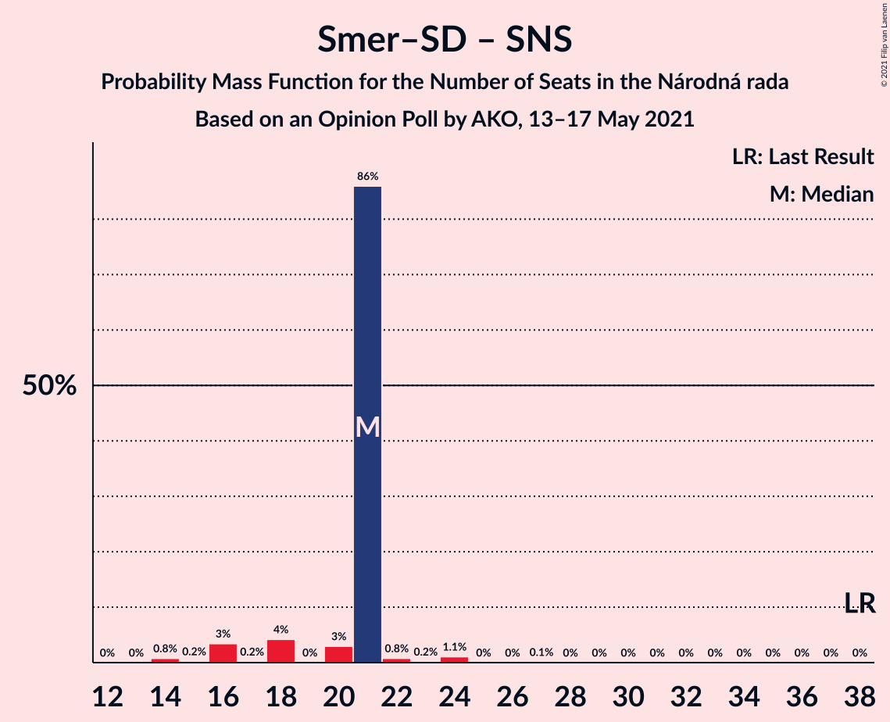

# Opinion Poll by AKO, 13–17 May 2021

<a href="#voting-intentions">Voting Intentions</a> | <a href="#seats">Seats</a> | <a href="#coalitions">Coalitions</a> | <a href="#technical-information">Technical Information</a>

## Voting Intentions

### Confidence Intervals

| Party | Last Result | Poll Result | 80% Confidence Interval | 90% Confidence Interval | 95% Confidence Interval | 99% Confidence Interval |
|:-----:|:-----------:|:-----------:|:-----------------------:|:-----------------------:|:-----------------------:|:-----------------------:|
| HLAS–sociálna demokracia | 0.0% | 21.1% | 19.6–22.8% |19.1–23.3% |18.8–23.7% |18.1–24.5% |
| Sloboda a Solidarita | 6.2% | 13.0% | 11.7–14.4% |11.4–14.8% |11.1–15.1% |10.5–15.8% |
| OBYČAJNÍ ĽUDIA a nezávislé osobnosti | 25.0% | 9.3% | 8.2–10.5% |7.9–10.9% |7.7–11.2% |7.2–11.8% |
| SMER–sociálna demokracia | 18.3% | 9.0% | 8.0–10.2% |7.7–10.6% |7.4–10.9% |7.0–11.5% |
| REPUBLIKA | 0.0% | 8.2% | 7.2–9.3% |6.9–9.7% |6.7–10.0% |6.2–10.6% |
| Progresívne Slovensko | 7.0% | 8.0% | 7.0–9.1% |6.7–9.5% |6.5–9.8% |6.1–10.4% |
| SME RODINA | 8.2% | 6.9% | 6.0–8.0% |5.8–8.4% |5.6–8.6% |5.2–9.2% |
| Strana maďarskej koalície–Magyar Koalíció Pártja | 3.9% | 5.0% | 4.2–5.9% |4.0–6.2% |3.8–6.5% |3.5–7.0% |
| Kresťanskodemokratické hnutie | 4.6% | 4.7% | 4.0–5.6% |3.7–5.9% |3.6–6.1% |3.2–6.6% |
| Za ľudí | 5.8% | 3.8% | 3.1–4.6% |2.9–4.9% |2.8–5.1% |2.5–5.5% |
| VLASŤ | 2.9% | 3.3% | 2.7–4.1% |2.5–4.3% |2.4–4.5% |2.1–5.0% |
| Dobrá voľba | 3.1% | 2.8% | 2.3–3.6% |2.1–3.8% |2.0–4.0% |1.7–4.4% |
| Kotleba–Ľudová strana Naše Slovensko | 8.0% | 2.0% | 1.5–2.6% |1.4–2.8% |1.3–3.0% |1.1–3.4% |
| Slovenská národná strana | 3.2% | 1.5% | 1.1–2.1% |1.0–2.3% |0.9–2.4% |0.8–2.8% |
| SPOLU–Občianska Demokracia | 7.0% | 1.5% | 1.1–2.1% |1.0–2.3% |0.9–2.4% |0.8–2.8% |

*Note:* The poll result column reflects the actual value used in the calculations. Published results may vary slightly, and in addition be rounded to fewer digits.

## Seats

### Confidence Intervals

| Party | Last Result | Median | 80% Confidence Interval | 90% Confidence Interval | 95% Confidence Interval | 99% Confidence Interval |
|:-----:|:-----------:|:------:|:-----------------------:|:-----------------------:|:-----------------------:|:-----------------------:|
| <a href="#hlas–sociálna-demokracia">HLAS–sociálna demokracia</a> | 0 | 38 | 37–43 |37–43 |36–43 |33–44 |
| <a href="#sloboda-a-solidarita">Sloboda a Solidarita</a> | 13 | 24 | 22–27 |22–27 |22–27 |21–29 |
| <a href="#obyčajní-ľudia-a-nezávislé-osobnosti">OBYČAJNÍ ĽUDIA a nezávislé osobnosti</a> | 53 | 19 | 17–20 |17–20 |17–20 |14–22 |
| <a href="#smer–sociálna-demokracia">SMER–sociálna demokracia</a> | 38 | 15 | 13–19 |13–19 |13–19 |13–20 |
| <a href="#republika">REPUBLIKA</a> | 0 | 13 | 13–18 |13–18 |13–18 |12–18 |
| <a href="#progresívne-slovensko">Progresívne Slovensko</a> | 0 | 16 | 15–17 |15–17 |14–17 |12–18 |
| <a href="#sme-rodina">SME RODINA</a> | 17 | 14 | 12–17 |12–17 |12–17 |10–17 |
| <a href="#strana-maďarskej-koalície–magyar-koalíció-pártja">Strana maďarskej koalície–Magyar Koalíció Pártja</a> | 0 | 0 | 0–11 |0–11 |0–11 |0–12 |
| <a href="#kresťanskodemokratické-hnutie">Kresťanskodemokratické hnutie</a> | 0 | 0 | 0–11 |0–11 |0–11 |0–12 |
| <a href="#za-ľudí">Za ľudí</a> | 12 | 0 | 0 |0 |0 |0–9 |
| <a href="#vlasť">VLASŤ</a> | 0 | 0 | 0 |0 |0 |0 |
| <a href="#dobrá-voľba">Dobrá voľba</a> | 0 | 0 | 0 |0 |0 |0 |
| <a href="#kotleba–ľudová-strana-naše-slovensko">Kotleba–Ľudová strana Naše Slovensko</a> | 17 | 0 | 0 |0 |0 |0 |
| <a href="#slovenská-národná-strana">Slovenská národná strana</a> | 0 | 0 | 0 |0 |0 |0 |
| <a href="#spolu–občianska-demokracia">SPOLU–Občianska Demokracia</a> | 0 | 0 | 0 |0 |0 |0 |

### HLAS–sociálna demokracia

*For a full overview of the results for this party, see the [HLAS–sociálna demokracia](party-hlas–sociálnademokracia.html) page.*

| Number of Seats | Probability | Accumulated | Special Marks |
|:---------------:|:-----------:|:-----------:|:-------------:|
| 0 | 0% | 100% | Last Result |
| 1 | 0% | 100% |  |
| 2 | 0% | 100% |  |
| 3 | 0% | 100% |  |
| 4 | 0% | 100% |  |
| 5 | 0% | 100% |  |
| 6 | 0% | 100% |  |
| 7 | 0% | 100% |  |
| 8 | 0% | 100% |  |
| 9 | 0% | 100% |  |
| 10 | 0% | 100% |  |
| 11 | 0% | 100% |  |
| 12 | 0% | 100% |  |
| 13 | 0% | 100% |  |
| 14 | 0% | 100% |  |
| 15 | 0% | 100% |  |
| 16 | 0% | 100% |  |
| 17 | 0% | 100% |  |
| 18 | 0% | 100% |  |
| 19 | 0% | 100% |  |
| 20 | 0% | 100% |  |
| 21 | 0% | 100% |  |
| 22 | 0% | 100% |  |
| 23 | 0% | 100% |  |
| 24 | 0% | 100% |  |
| 25 | 0% | 100% |  |
| 26 | 0% | 100% |  |
| 27 | 0% | 100% |  |
| 28 | 0% | 100% |  |
| 29 | 0% | 100% |  |
| 30 | 0% | 100% |  |
| 31 | 0% | 100% |  |
| 32 | 0.5% | 100% |  |
| 33 | 0% | 99.5% |  |
| 34 | 0.4% | 99.5% |  |
| 35 | 0.2% | 99.1% |  |
| 36 | 2% | 98.9% |  |
| 37 | 26% | 97% |  |
| 38 | 59% | 71% | Median |
| 39 | 1.0% | 12% |  |
| 40 | 0.3% | 11% |  |
| 41 | 0.3% | 11% |  |
| 42 | 0.1% | 10% |  |
| 43 | 10% | 10% |  |
| 44 | 0.2% | 0.5% |  |
| 45 | 0.3% | 0.3% |  |
| 46 | 0.1% | 0.1% |  |
| 47 | 0% | 0% |  |

### Sloboda a Solidarita

*For a full overview of the results for this party, see the [Sloboda a Solidarita](party-slobodaasolidarita.html) page.*

| Number of Seats | Probability | Accumulated | Special Marks |
|:---------------:|:-----------:|:-----------:|:-------------:|
| 13 | 0% | 100% | Last Result |
| 14 | 0% | 100% |  |
| 15 | 0% | 100% |  |
| 16 | 0% | 100% |  |
| 17 | 0.1% | 100% |  |
| 18 | 0% | 99.9% |  |
| 19 | 0.1% | 99.9% |  |
| 20 | 0.2% | 99.8% |  |
| 21 | 0.2% | 99.6% |  |
| 22 | 45% | 99.4% |  |
| 23 | 0.7% | 55% |  |
| 24 | 40% | 54% | Median |
| 25 | 1.4% | 14% |  |
| 26 | 1.1% | 13% |  |
| 27 | 11% | 11% |  |
| 28 | 0.2% | 0.8% |  |
| 29 | 0.1% | 0.6% |  |
| 30 | 0.5% | 0.5% |  |
| 31 | 0% | 0% |  |

### OBYČAJNÍ ĽUDIA a nezávislé osobnosti

*For a full overview of the results for this party, see the [OBYČAJNÍ ĽUDIA a nezávislé osobnosti](party-obyčajníľudiaanezávisléosobnosti.html) page.*

| Number of Seats | Probability | Accumulated | Special Marks |
|:---------------:|:-----------:|:-----------:|:-------------:|
| 12 | 0.1% | 100% |  |
| 13 | 0% | 99.9% |  |
| 14 | 0.9% | 99.9% |  |
| 15 | 0.6% | 99.0% |  |
| 16 | 0.3% | 98% |  |
| 17 | 22% | 98% |  |
| 18 | 10% | 77% |  |
| 19 | 40% | 66% | Median |
| 20 | 26% | 27% |  |
| 21 | 0.2% | 1.2% |  |
| 22 | 1.0% | 1.0% |  |
| 23 | 0% | 0% |  |
| 24 | 0% | 0% |  |
| 25 | 0% | 0% |  |
| 26 | 0% | 0% |  |
| 27 | 0% | 0% |  |
| 28 | 0% | 0% |  |
| 29 | 0% | 0% |  |
| 30 | 0% | 0% |  |
| 31 | 0% | 0% |  |
| 32 | 0% | 0% |  |
| 33 | 0% | 0% |  |
| 34 | 0% | 0% |  |
| 35 | 0% | 0% |  |
| 36 | 0% | 0% |  |
| 37 | 0% | 0% |  |
| 38 | 0% | 0% |  |
| 39 | 0% | 0% |  |
| 40 | 0% | 0% |  |
| 41 | 0% | 0% |  |
| 42 | 0% | 0% |  |
| 43 | 0% | 0% |  |
| 44 | 0% | 0% |  |
| 45 | 0% | 0% |  |
| 46 | 0% | 0% |  |
| 47 | 0% | 0% |  |
| 48 | 0% | 0% |  |
| 49 | 0% | 0% |  |
| 50 | 0% | 0% |  |
| 51 | 0% | 0% |  |
| 52 | 0% | 0% |  |
| 53 | 0% | 0% | Last Result |

### SMER–sociálna demokracia

*For a full overview of the results for this party, see the [SMER–sociálna demokracia](party-smer–sociálnademokracia.html) page.*

| Number of Seats | Probability | Accumulated | Special Marks |
|:---------------:|:-----------:|:-----------:|:-------------:|
| 13 | 10% | 100% |  |
| 14 | 0.8% | 90% |  |
| 15 | 64% | 89% | Median |
| 16 | 2% | 25% |  |
| 17 | 0.1% | 23% |  |
| 18 | 1.3% | 23% |  |
| 19 | 21% | 22% |  |
| 20 | 0.5% | 0.9% |  |
| 21 | 0.2% | 0.4% |  |
| 22 | 0.3% | 0.3% |  |
| 23 | 0% | 0% |  |
| 24 | 0% | 0% |  |
| 25 | 0% | 0% |  |
| 26 | 0% | 0% |  |
| 27 | 0% | 0% |  |
| 28 | 0% | 0% |  |
| 29 | 0% | 0% |  |
| 30 | 0% | 0% |  |
| 31 | 0% | 0% |  |
| 32 | 0% | 0% |  |
| 33 | 0% | 0% |  |
| 34 | 0% | 0% |  |
| 35 | 0% | 0% |  |
| 36 | 0% | 0% |  |
| 37 | 0% | 0% |  |
| 38 | 0% | 0% | Last Result |

### REPUBLIKA

*For a full overview of the results for this party, see the [REPUBLIKA](party-republika.html) page.*

| Number of Seats | Probability | Accumulated | Special Marks |
|:---------------:|:-----------:|:-----------:|:-------------:|
| 0 | 0% | 100% | Last Result |
| 1 | 0% | 100% |  |
| 2 | 0% | 100% |  |
| 3 | 0% | 100% |  |
| 4 | 0% | 100% |  |
| 5 | 0% | 100% |  |
| 6 | 0% | 100% |  |
| 7 | 0% | 100% |  |
| 8 | 0% | 100% |  |
| 9 | 0% | 100% |  |
| 10 | 0% | 100% |  |
| 11 | 0% | 100% |  |
| 12 | 0.7% | 99.9% |  |
| 13 | 64% | 99.2% | Median |
| 14 | 2% | 35% |  |
| 15 | 3% | 33% |  |
| 16 | 0.7% | 31% |  |
| 17 | 20% | 30% |  |
| 18 | 10% | 10% |  |
| 19 | 0.3% | 0.5% |  |
| 20 | 0.1% | 0.2% |  |
| 21 | 0.1% | 0.1% |  |
| 22 | 0% | 0% |  |

### Progresívne Slovensko

*For a full overview of the results for this party, see the [Progresívne Slovensko](party-progresívneslovensko.html) page.*

| Number of Seats | Probability | Accumulated | Special Marks |
|:---------------:|:-----------:|:-----------:|:-------------:|
| 0 | 0% | 100% | Last Result |
| 1 | 0% | 100% |  |
| 2 | 0% | 100% |  |
| 3 | 0% | 100% |  |
| 4 | 0% | 100% |  |
| 5 | 0% | 100% |  |
| 6 | 0% | 100% |  |
| 7 | 0% | 100% |  |
| 8 | 0% | 100% |  |
| 9 | 0% | 100% |  |
| 10 | 0% | 100% |  |
| 11 | 0.3% | 100% |  |
| 12 | 0.4% | 99.7% |  |
| 13 | 1.1% | 99.3% |  |
| 14 | 2% | 98% |  |
| 15 | 26% | 96% |  |
| 16 | 59% | 70% | Median |
| 17 | 10% | 11% |  |
| 18 | 0.1% | 0.6% |  |
| 19 | 0.2% | 0.5% |  |
| 20 | 0.2% | 0.2% |  |
| 21 | 0.1% | 0.1% |  |
| 22 | 0% | 0% |  |

### SME RODINA

*For a full overview of the results for this party, see the [SME RODINA](party-smerodina.html) page.*

| Number of Seats | Probability | Accumulated | Special Marks |
|:---------------:|:-----------:|:-----------:|:-------------:|
| 9 | 0% | 100% |  |
| 10 | 0.6% | 99.9% |  |
| 11 | 0.4% | 99.4% |  |
| 12 | 21% | 98.9% |  |
| 13 | 1.2% | 78% |  |
| 14 | 49% | 77% | Median |
| 15 | 0.1% | 28% |  |
| 16 | 2% | 28% |  |
| 17 | 26% | 26% | Last Result |
| 18 | 0% | 0% |  |

### Strana maďarskej koalície–Magyar Koalíció Pártja

*For a full overview of the results for this party, see the [Strana maďarskej koalície–Magyar Koalíció Pártja](party-stranamaďarskejkoalície–magyarkoalíciópártja.html) page.*

| Number of Seats | Probability | Accumulated | Special Marks |
|:---------------:|:-----------:|:-----------:|:-------------:|
| 0 | 53% | 100% | Last Result, Median |
| 1 | 0% | 47% |  |
| 2 | 0% | 47% |  |
| 3 | 0% | 47% |  |
| 4 | 0% | 47% |  |
| 5 | 0% | 47% |  |
| 6 | 0% | 47% |  |
| 7 | 0% | 47% |  |
| 8 | 0% | 47% |  |
| 9 | 20% | 47% |  |
| 10 | 1.2% | 27% |  |
| 11 | 25% | 26% |  |
| 12 | 0.9% | 1.0% |  |
| 13 | 0.1% | 0.1% |  |
| 14 | 0% | 0% |  |

### Kresťanskodemokratické hnutie

*For a full overview of the results for this party, see the [Kresťanskodemokratické hnutie](party-kresťanskodemokratickéhnutie.html) page.*

| Number of Seats | Probability | Accumulated | Special Marks |
|:---------------:|:-----------:|:-----------:|:-------------:|
| 0 | 58% | 100% | Last Result, Median |
| 1 | 0% | 42% |  |
| 2 | 0% | 42% |  |
| 3 | 0% | 42% |  |
| 4 | 0% | 42% |  |
| 5 | 0% | 42% |  |
| 6 | 0% | 42% |  |
| 7 | 0% | 42% |  |
| 8 | 0% | 42% |  |
| 9 | 0.6% | 42% |  |
| 10 | 1.4% | 41% |  |
| 11 | 39% | 40% |  |
| 12 | 1.0% | 1.0% |  |
| 13 | 0% | 0% |  |

### Za ľudí

*For a full overview of the results for this party, see the [Za ľudí](party-zaľudí.html) page.*

| Number of Seats | Probability | Accumulated | Special Marks |
|:---------------:|:-----------:|:-----------:|:-------------:|
| 0 | 99.5% | 100% | Median |
| 1 | 0% | 0.5% |  |
| 2 | 0% | 0.5% |  |
| 3 | 0% | 0.5% |  |
| 4 | 0% | 0.5% |  |
| 5 | 0% | 0.5% |  |
| 6 | 0% | 0.5% |  |
| 7 | 0% | 0.5% |  |
| 8 | 0% | 0.5% |  |
| 9 | 0.4% | 0.5% |  |
| 10 | 0.1% | 0.1% |  |
| 11 | 0% | 0% |  |
| 12 | 0% | 0% | Last Result |

### VLASŤ

*For a full overview of the results for this party, see the [VLASŤ](party-vlasť.html) page.*

| Number of Seats | Probability | Accumulated | Special Marks |
|:---------------:|:-----------:|:-----------:|:-------------:|
| 0 | 99.5% | 100% | Last Result, Median |
| 1 | 0% | 0.5% |  |
| 2 | 0% | 0.5% |  |
| 3 | 0% | 0.5% |  |
| 4 | 0% | 0.5% |  |
| 5 | 0% | 0.5% |  |
| 6 | 0% | 0.5% |  |
| 7 | 0% | 0.5% |  |
| 8 | 0% | 0.5% |  |
| 9 | 0.3% | 0.5% |  |
| 10 | 0.2% | 0.2% |  |
| 11 | 0% | 0% |  |

### Dobrá voľba

*For a full overview of the results for this party, see the [Dobrá voľba](party-dobrávoľba.html) page.*

| Number of Seats | Probability | Accumulated | Special Marks |
|:---------------:|:-----------:|:-----------:|:-------------:|
| 0 | 100% | 100% | Last Result, Median |

### Kotleba–Ľudová strana Naše Slovensko

*For a full overview of the results for this party, see the [Kotleba–Ľudová strana Naše Slovensko](party-kotleba–ľudovástrananašeslovensko.html) page.*

| Number of Seats | Probability | Accumulated | Special Marks |
|:---------------:|:-----------:|:-----------:|:-------------:|
| 0 | 100% | 100% | Median |
| 1 | 0% | 0% |  |
| 2 | 0% | 0% |  |
| 3 | 0% | 0% |  |
| 4 | 0% | 0% |  |
| 5 | 0% | 0% |  |
| 6 | 0% | 0% |  |
| 7 | 0% | 0% |  |
| 8 | 0% | 0% |  |
| 9 | 0% | 0% |  |
| 10 | 0% | 0% |  |
| 11 | 0% | 0% |  |
| 12 | 0% | 0% |  |
| 13 | 0% | 0% |  |
| 14 | 0% | 0% |  |
| 15 | 0% | 0% |  |
| 16 | 0% | 0% |  |
| 17 | 0% | 0% | Last Result |

### Slovenská národná strana

*For a full overview of the results for this party, see the [Slovenská národná strana](party-slovenskánárodnástrana.html) page.*

| Number of Seats | Probability | Accumulated | Special Marks |
|:---------------:|:-----------:|:-----------:|:-------------:|
| 0 | 100% | 100% | Last Result, Median |

### SPOLU–Občianska Demokracia

*For a full overview of the results for this party, see the [SPOLU–Občianska Demokracia](party-spolu–občianskademokracia.html) page.*

| Number of Seats | Probability | Accumulated | Special Marks |
|:---------------:|:-----------:|:-----------:|:-------------:|
| 0 | 100% | 100% | Last Result, Median |

## Coalitions

### Confidence Intervals

| Coalition | Last Result | Median | Majority? | 80% Confidence Interval | 90% Confidence Interval | 95% Confidence Interval | 99% Confidence Interval |
|:---------:|:-----------:|:------:|:---------:|:-----------------------:|:-----------------------:|:-----------------------:|:-----------------------:|
| HLAS–sociálna demokracia – SMER–sociálna demokracia – SME RODINA – Kotleba–Ľudová strana Naše Slovensko – Slovenská národná strana | 72 | 69 | 0.5% | 67–70 | 67–70 | 65–71 | 59–75 |
| HLAS–sociálna demokracia – SMER–sociálna demokracia – SME RODINA | 55 | 69 | 0.5% | 67–70 | 67–70 | 65–71 | 59–75 |
| HLAS–sociálna demokracia – SMER–sociálna demokracia – SME RODINA – Slovenská národná strana | 55 | 69 | 0.5% | 67–70 | 67–70 | 65–71 | 59–75 |
| HLAS–sociálna demokracia – SMER–sociálna demokracia – Slovenská národná strana | 38 | 53 | 0% | 52–57 | 52–57 | 52–57 | 49–62 |
| HLAS–sociálna demokracia – SME RODINA – Kotleba–Ľudová strana Naše Slovensko – Slovenská národná strana | 34 | 52 | 0% | 50–57 | 50–57 | 50–57 | 45–57 |
| HLAS–sociálna demokracia – SME RODINA | 17 | 52 | 0% | 50–57 | 50–57 | 50–57 | 45–57 |
| HLAS–sociálna demokracia – SME RODINA – Slovenská národná strana | 17 | 52 | 0% | 50–57 | 50–57 | 50–57 | 45–57 |
| HLAS–sociálna demokracia – Slovenská národná strana | 0 | 38 | 0% | 37–43 | 37–43 | 36–43 | 33–44 |
| SMER–sociálna demokracia – SME RODINA – Kotleba–Ľudová strana Naše Slovensko – Slovenská národná strana | 72 | 29 | 0% | 27–32 | 27–32 | 27–33 | 25–36 |
| SMER–sociálna demokracia – SME RODINA | 55 | 29 | 0% | 27–32 | 27–32 | 27–33 | 25–36 |
| SMER–sociálna demokracia – SME RODINA – Slovenská národná strana | 55 | 29 | 0% | 27–32 | 27–32 | 27–33 | 25–36 |
| SMER–sociálna demokracia | 38 | 15 | 0% | 13–19 | 13–19 | 13–19 | 13–20 |
| SMER–sociálna demokracia – Slovenská národná strana | 38 | 15 | 0% | 13–19 | 13–19 | 13–19 | 13–20 |

### HLAS–sociálna demokracia – SMER–sociálna demokracia – SME RODINA – Kotleba–Ľudová strana Naše Slovensko – Slovenská národná strana

| Number of Seats | Probability | Accumulated | Special Marks |
|:---------------:|:-----------:|:-----------:|:-------------:|
| 59 | 0.7% | 100% |  |
| 60 | 0% | 99.3% |  |
| 61 | 0.2% | 99.3% |  |
| 62 | 0% | 99.1% |  |
| 63 | 0.2% | 99.1% |  |
| 64 | 0.2% | 98.9% |  |
| 65 | 1.3% | 98.7% |  |
| 66 | 0.1% | 97% |  |
| 67 | 39% | 97% | Median |
| 68 | 1.3% | 58% |  |
| 69 | 44% | 57% |  |
| 70 | 10% | 13% |  |
| 71 | 0.7% | 3% |  |
| 72 | 0.2% | 2% | Last Result |
| 73 | 0.3% | 2% |  |
| 74 | 0.2% | 2% |  |
| 75 | 0.9% | 1.4% |  |
| 76 | 0.1% | 0.5% | Majority |
| 77 | 0.2% | 0.4% |  |
| 78 | 0.2% | 0.2% |  |
| 79 | 0% | 0.1% |  |
| 80 | 0% | 0% |  |

### HLAS–sociálna demokracia – SMER–sociálna demokracia – SME RODINA

| Number of Seats | Probability | Accumulated | Special Marks |
|:---------------:|:-----------:|:-----------:|:-------------:|
| 55 | 0% | 100% | Last Result |
| 56 | 0% | 100% |  |
| 57 | 0% | 100% |  |
| 58 | 0% | 100% |  |
| 59 | 0.7% | 100% |  |
| 60 | 0% | 99.3% |  |
| 61 | 0.2% | 99.3% |  |
| 62 | 0% | 99.1% |  |
| 63 | 0.2% | 99.1% |  |
| 64 | 0.2% | 98.9% |  |
| 65 | 1.3% | 98.7% |  |
| 66 | 0.1% | 97% |  |
| 67 | 39% | 97% | Median |
| 68 | 1.3% | 58% |  |
| 69 | 44% | 57% |  |
| 70 | 10% | 13% |  |
| 71 | 0.7% | 3% |  |
| 72 | 0.2% | 2% |  |
| 73 | 0.3% | 2% |  |
| 74 | 0.2% | 2% |  |
| 75 | 0.9% | 1.4% |  |
| 76 | 0.1% | 0.5% | Majority |
| 77 | 0.2% | 0.4% |  |
| 78 | 0.2% | 0.2% |  |
| 79 | 0% | 0.1% |  |
| 80 | 0% | 0% |  |

### HLAS–sociálna demokracia – SMER–sociálna demokracia – SME RODINA – Slovenská národná strana

| Number of Seats | Probability | Accumulated | Special Marks |
|:---------------:|:-----------:|:-----------:|:-------------:|
| 55 | 0% | 100% | Last Result |
| 56 | 0% | 100% |  |
| 57 | 0% | 100% |  |
| 58 | 0% | 100% |  |
| 59 | 0.7% | 100% |  |
| 60 | 0% | 99.3% |  |
| 61 | 0.2% | 99.3% |  |
| 62 | 0% | 99.1% |  |
| 63 | 0.2% | 99.1% |  |
| 64 | 0.2% | 98.9% |  |
| 65 | 1.3% | 98.7% |  |
| 66 | 0.1% | 97% |  |
| 67 | 39% | 97% | Median |
| 68 | 1.3% | 58% |  |
| 69 | 44% | 57% |  |
| 70 | 10% | 13% |  |
| 71 | 0.7% | 3% |  |
| 72 | 0.2% | 2% |  |
| 73 | 0.3% | 2% |  |
| 74 | 0.2% | 2% |  |
| 75 | 0.9% | 1.4% |  |
| 76 | 0.1% | 0.5% | Majority |
| 77 | 0.2% | 0.4% |  |
| 78 | 0.2% | 0.2% |  |
| 79 | 0% | 0.1% |  |
| 80 | 0% | 0% |  |

### HLAS–sociálna demokracia – SMER–sociálna demokracia – Slovenská národná strana

| Number of Seats | Probability | Accumulated | Special Marks |
|:---------------:|:-----------:|:-----------:|:-------------:|
| 38 | 0% | 100% | Last Result |
| 39 | 0% | 100% |  |
| 40 | 0% | 100% |  |
| 41 | 0% | 100% |  |
| 42 | 0% | 100% |  |
| 43 | 0% | 100% |  |
| 44 | 0% | 100% |  |
| 45 | 0% | 100% |  |
| 46 | 0% | 100% |  |
| 47 | 0.4% | 100% |  |
| 48 | 0% | 99.6% |  |
| 49 | 0.5% | 99.6% |  |
| 50 | 0.2% | 99.2% |  |
| 51 | 0.1% | 99.0% |  |
| 52 | 27% | 98.9% |  |
| 53 | 39% | 72% | Median |
| 54 | 0.1% | 33% |  |
| 55 | 1.0% | 33% |  |
| 56 | 10% | 32% |  |
| 57 | 20% | 22% |  |
| 58 | 1.0% | 2% |  |
| 59 | 0.3% | 1.3% |  |
| 60 | 0.4% | 1.1% |  |
| 61 | 0.1% | 0.7% |  |
| 62 | 0.4% | 0.6% |  |
| 63 | 0.2% | 0.2% |  |
| 64 | 0% | 0.1% |  |
| 65 | 0% | 0.1% |  |
| 66 | 0% | 0% |  |

### HLAS–sociálna demokracia – SME RODINA – Kotleba–Ľudová strana Naše Slovensko – Slovenská národná strana

| Number of Seats | Probability | Accumulated | Special Marks |
|:---------------:|:-----------:|:-----------:|:-------------:|
| 34 | 0% | 100% | Last Result |
| 35 | 0% | 100% |  |
| 36 | 0% | 100% |  |
| 37 | 0% | 100% |  |
| 38 | 0% | 100% |  |
| 39 | 0% | 100% |  |
| 40 | 0% | 100% |  |
| 41 | 0% | 100% |  |
| 42 | 0% | 100% |  |
| 43 | 0% | 100% |  |
| 44 | 0% | 100% |  |
| 45 | 0.5% | 99.9% |  |
| 46 | 0.8% | 99.5% |  |
| 47 | 0.2% | 98.7% |  |
| 48 | 0% | 98% |  |
| 49 | 0.7% | 98% |  |
| 50 | 20% | 98% |  |
| 51 | 0.3% | 78% |  |
| 52 | 40% | 77% | Median |
| 53 | 1.1% | 38% |  |
| 54 | 25% | 36% |  |
| 55 | 0.1% | 11% |  |
| 56 | 1.2% | 11% |  |
| 57 | 10% | 10% |  |
| 58 | 0.4% | 0.4% |  |
| 59 | 0% | 0.1% |  |
| 60 | 0% | 0.1% |  |
| 61 | 0% | 0% |  |

### HLAS–sociálna demokracia – SME RODINA

| Number of Seats | Probability | Accumulated | Special Marks |
|:---------------:|:-----------:|:-----------:|:-------------:|
| 17 | 0% | 100% | Last Result |
| 18 | 0% | 100% |  |
| 19 | 0% | 100% |  |
| 20 | 0% | 100% |  |
| 21 | 0% | 100% |  |
| 22 | 0% | 100% |  |
| 23 | 0% | 100% |  |
| 24 | 0% | 100% |  |
| 25 | 0% | 100% |  |
| 26 | 0% | 100% |  |
| 27 | 0% | 100% |  |
| 28 | 0% | 100% |  |
| 29 | 0% | 100% |  |
| 30 | 0% | 100% |  |
| 31 | 0% | 100% |  |
| 32 | 0% | 100% |  |
| 33 | 0% | 100% |  |
| 34 | 0% | 100% |  |
| 35 | 0% | 100% |  |
| 36 | 0% | 100% |  |
| 37 | 0% | 100% |  |
| 38 | 0% | 100% |  |
| 39 | 0% | 100% |  |
| 40 | 0% | 100% |  |
| 41 | 0% | 100% |  |
| 42 | 0% | 100% |  |
| 43 | 0% | 100% |  |
| 44 | 0% | 100% |  |
| 45 | 0.5% | 99.9% |  |
| 46 | 0.8% | 99.5% |  |
| 47 | 0.2% | 98.7% |  |
| 48 | 0% | 98% |  |
| 49 | 0.7% | 98% |  |
| 50 | 20% | 98% |  |
| 51 | 0.3% | 78% |  |
| 52 | 40% | 77% | Median |
| 53 | 1.1% | 38% |  |
| 54 | 25% | 36% |  |
| 55 | 0.1% | 11% |  |
| 56 | 1.2% | 11% |  |
| 57 | 10% | 10% |  |
| 58 | 0.4% | 0.4% |  |
| 59 | 0% | 0.1% |  |
| 60 | 0% | 0.1% |  |
| 61 | 0% | 0% |  |

### HLAS–sociálna demokracia – SME RODINA – Slovenská národná strana

| Number of Seats | Probability | Accumulated | Special Marks |
|:---------------:|:-----------:|:-----------:|:-------------:|
| 17 | 0% | 100% | Last Result |
| 18 | 0% | 100% |  |
| 19 | 0% | 100% |  |
| 20 | 0% | 100% |  |
| 21 | 0% | 100% |  |
| 22 | 0% | 100% |  |
| 23 | 0% | 100% |  |
| 24 | 0% | 100% |  |
| 25 | 0% | 100% |  |
| 26 | 0% | 100% |  |
| 27 | 0% | 100% |  |
| 28 | 0% | 100% |  |
| 29 | 0% | 100% |  |
| 30 | 0% | 100% |  |
| 31 | 0% | 100% |  |
| 32 | 0% | 100% |  |
| 33 | 0% | 100% |  |
| 34 | 0% | 100% |  |
| 35 | 0% | 100% |  |
| 36 | 0% | 100% |  |
| 37 | 0% | 100% |  |
| 38 | 0% | 100% |  |
| 39 | 0% | 100% |  |
| 40 | 0% | 100% |  |
| 41 | 0% | 100% |  |
| 42 | 0% | 100% |  |
| 43 | 0% | 100% |  |
| 44 | 0% | 100% |  |
| 45 | 0.5% | 99.9% |  |
| 46 | 0.8% | 99.5% |  |
| 47 | 0.2% | 98.7% |  |
| 48 | 0% | 98% |  |
| 49 | 0.7% | 98% |  |
| 50 | 20% | 98% |  |
| 51 | 0.3% | 78% |  |
| 52 | 40% | 77% | Median |
| 53 | 1.1% | 38% |  |
| 54 | 25% | 36% |  |
| 55 | 0.1% | 11% |  |
| 56 | 1.2% | 11% |  |
| 57 | 10% | 10% |  |
| 58 | 0.4% | 0.4% |  |
| 59 | 0% | 0.1% |  |
| 60 | 0% | 0.1% |  |
| 61 | 0% | 0% |  |

### HLAS–sociálna demokracia – Slovenská národná strana

| Number of Seats | Probability | Accumulated | Special Marks |
|:---------------:|:-----------:|:-----------:|:-------------:|
| 0 | 0% | 100% | Last Result |
| 1 | 0% | 100% |  |
| 2 | 0% | 100% |  |
| 3 | 0% | 100% |  |
| 4 | 0% | 100% |  |
| 5 | 0% | 100% |  |
| 6 | 0% | 100% |  |
| 7 | 0% | 100% |  |
| 8 | 0% | 100% |  |
| 9 | 0% | 100% |  |
| 10 | 0% | 100% |  |
| 11 | 0% | 100% |  |
| 12 | 0% | 100% |  |
| 13 | 0% | 100% |  |
| 14 | 0% | 100% |  |
| 15 | 0% | 100% |  |
| 16 | 0% | 100% |  |
| 17 | 0% | 100% |  |
| 18 | 0% | 100% |  |
| 19 | 0% | 100% |  |
| 20 | 0% | 100% |  |
| 21 | 0% | 100% |  |
| 22 | 0% | 100% |  |
| 23 | 0% | 100% |  |
| 24 | 0% | 100% |  |
| 25 | 0% | 100% |  |
| 26 | 0% | 100% |  |
| 27 | 0% | 100% |  |
| 28 | 0% | 100% |  |
| 29 | 0% | 100% |  |
| 30 | 0% | 100% |  |
| 31 | 0% | 100% |  |
| 32 | 0.5% | 100% |  |
| 33 | 0% | 99.5% |  |
| 34 | 0.4% | 99.5% |  |
| 35 | 0.2% | 99.1% |  |
| 36 | 2% | 98.9% |  |
| 37 | 26% | 97% |  |
| 38 | 59% | 71% | Median |
| 39 | 1.0% | 12% |  |
| 40 | 0.3% | 11% |  |
| 41 | 0.3% | 11% |  |
| 42 | 0.1% | 10% |  |
| 43 | 10% | 10% |  |
| 44 | 0.2% | 0.5% |  |
| 45 | 0.3% | 0.3% |  |
| 46 | 0.1% | 0.1% |  |
| 47 | 0% | 0% |  |

### SMER–sociálna demokracia – SME RODINA – Kotleba–Ľudová strana Naše Slovensko – Slovenská národná strana

| Number of Seats | Probability | Accumulated | Special Marks |
|:---------------:|:-----------:|:-----------:|:-------------:|
| 22 | 0% | 100% |  |
| 23 | 0.3% | 99.9% |  |
| 24 | 0% | 99.6% |  |
| 25 | 0.6% | 99.6% |  |
| 26 | 0.4% | 99.0% |  |
| 27 | 10% | 98.6% |  |
| 28 | 0.9% | 89% |  |
| 29 | 39% | 88% | Median |
| 30 | 0.3% | 49% |  |
| 31 | 20% | 49% |  |
| 32 | 26% | 29% |  |
| 33 | 0.9% | 3% |  |
| 34 | 0.6% | 2% |  |
| 35 | 0% | 1.2% |  |
| 36 | 0.9% | 1.2% |  |
| 37 | 0% | 0.3% |  |
| 38 | 0.3% | 0.3% |  |
| 39 | 0% | 0% |  |
| 40 | 0% | 0% |  |
| 41 | 0% | 0% |  |
| 42 | 0% | 0% |  |
| 43 | 0% | 0% |  |
| 44 | 0% | 0% |  |
| 45 | 0% | 0% |  |
| 46 | 0% | 0% |  |
| 47 | 0% | 0% |  |
| 48 | 0% | 0% |  |
| 49 | 0% | 0% |  |
| 50 | 0% | 0% |  |
| 51 | 0% | 0% |  |
| 52 | 0% | 0% |  |
| 53 | 0% | 0% |  |
| 54 | 0% | 0% |  |
| 55 | 0% | 0% |  |
| 56 | 0% | 0% |  |
| 57 | 0% | 0% |  |
| 58 | 0% | 0% |  |
| 59 | 0% | 0% |  |
| 60 | 0% | 0% |  |
| 61 | 0% | 0% |  |
| 62 | 0% | 0% |  |
| 63 | 0% | 0% |  |
| 64 | 0% | 0% |  |
| 65 | 0% | 0% |  |
| 66 | 0% | 0% |  |
| 67 | 0% | 0% |  |
| 68 | 0% | 0% |  |
| 69 | 0% | 0% |  |
| 70 | 0% | 0% |  |
| 71 | 0% | 0% |  |
| 72 | 0% | 0% | Last Result |

### SMER–sociálna demokracia – SME RODINA

| Number of Seats | Probability | Accumulated | Special Marks |
|:---------------:|:-----------:|:-----------:|:-------------:|
| 22 | 0% | 100% |  |
| 23 | 0.3% | 99.9% |  |
| 24 | 0% | 99.6% |  |
| 25 | 0.6% | 99.6% |  |
| 26 | 0.4% | 99.0% |  |
| 27 | 10% | 98.6% |  |
| 28 | 0.9% | 89% |  |
| 29 | 39% | 88% | Median |
| 30 | 0.3% | 49% |  |
| 31 | 20% | 49% |  |
| 32 | 26% | 29% |  |
| 33 | 0.9% | 3% |  |
| 34 | 0.6% | 2% |  |
| 35 | 0% | 1.2% |  |
| 36 | 0.9% | 1.2% |  |
| 37 | 0% | 0.3% |  |
| 38 | 0.3% | 0.3% |  |
| 39 | 0% | 0% |  |
| 40 | 0% | 0% |  |
| 41 | 0% | 0% |  |
| 42 | 0% | 0% |  |
| 43 | 0% | 0% |  |
| 44 | 0% | 0% |  |
| 45 | 0% | 0% |  |
| 46 | 0% | 0% |  |
| 47 | 0% | 0% |  |
| 48 | 0% | 0% |  |
| 49 | 0% | 0% |  |
| 50 | 0% | 0% |  |
| 51 | 0% | 0% |  |
| 52 | 0% | 0% |  |
| 53 | 0% | 0% |  |
| 54 | 0% | 0% |  |
| 55 | 0% | 0% | Last Result |

### SMER–sociálna demokracia – SME RODINA – Slovenská národná strana

| Number of Seats | Probability | Accumulated | Special Marks |
|:---------------:|:-----------:|:-----------:|:-------------:|
| 22 | 0% | 100% |  |
| 23 | 0.3% | 99.9% |  |
| 24 | 0% | 99.6% |  |
| 25 | 0.6% | 99.6% |  |
| 26 | 0.4% | 99.0% |  |
| 27 | 10% | 98.6% |  |
| 28 | 0.9% | 89% |  |
| 29 | 39% | 88% | Median |
| 30 | 0.3% | 49% |  |
| 31 | 20% | 49% |  |
| 32 | 26% | 29% |  |
| 33 | 0.9% | 3% |  |
| 34 | 0.6% | 2% |  |
| 35 | 0% | 1.2% |  |
| 36 | 0.9% | 1.2% |  |
| 37 | 0% | 0.3% |  |
| 38 | 0.3% | 0.3% |  |
| 39 | 0% | 0% |  |
| 40 | 0% | 0% |  |
| 41 | 0% | 0% |  |
| 42 | 0% | 0% |  |
| 43 | 0% | 0% |  |
| 44 | 0% | 0% |  |
| 45 | 0% | 0% |  |
| 46 | 0% | 0% |  |
| 47 | 0% | 0% |  |
| 48 | 0% | 0% |  |
| 49 | 0% | 0% |  |
| 50 | 0% | 0% |  |
| 51 | 0% | 0% |  |
| 52 | 0% | 0% |  |
| 53 | 0% | 0% |  |
| 54 | 0% | 0% |  |
| 55 | 0% | 0% | Last Result |

### SMER–sociálna demokracia

| Number of Seats | Probability | Accumulated | Special Marks |
|:---------------:|:-----------:|:-----------:|:-------------:|
| 13 | 10% | 100% |  |
| 14 | 0.8% | 90% |  |
| 15 | 64% | 89% | Median |
| 16 | 2% | 25% |  |
| 17 | 0.1% | 23% |  |
| 18 | 1.3% | 23% |  |
| 19 | 21% | 22% |  |
| 20 | 0.5% | 0.9% |  |
| 21 | 0.2% | 0.4% |  |
| 22 | 0.3% | 0.3% |  |
| 23 | 0% | 0% |  |
| 24 | 0% | 0% |  |
| 25 | 0% | 0% |  |
| 26 | 0% | 0% |  |
| 27 | 0% | 0% |  |
| 28 | 0% | 0% |  |
| 29 | 0% | 0% |  |
| 30 | 0% | 0% |  |
| 31 | 0% | 0% |  |
| 32 | 0% | 0% |  |
| 33 | 0% | 0% |  |
| 34 | 0% | 0% |  |
| 35 | 0% | 0% |  |
| 36 | 0% | 0% |  |
| 37 | 0% | 0% |  |
| 38 | 0% | 0% | Last Result |

### SMER–sociálna demokracia – Slovenská národná strana

| Number of Seats | Probability | Accumulated | Special Marks |
|:---------------:|:-----------:|:-----------:|:-------------:|
| 13 | 10% | 100% |  |
| 14 | 0.8% | 90% |  |
| 15 | 64% | 89% | Median |
| 16 | 2% | 25% |  |
| 17 | 0.1% | 23% |  |
| 18 | 1.3% | 23% |  |
| 19 | 21% | 22% |  |
| 20 | 0.5% | 0.9% |  |
| 21 | 0.2% | 0.4% |  |
| 22 | 0.3% | 0.3% |  |
| 23 | 0% | 0% |  |
| 24 | 0% | 0% |  |
| 25 | 0% | 0% |  |
| 26 | 0% | 0% |  |
| 27 | 0% | 0% |  |
| 28 | 0% | 0% |  |
| 29 | 0% | 0% |  |
| 30 | 0% | 0% |  |
| 31 | 0% | 0% |  |
| 32 | 0% | 0% |  |
| 33 | 0% | 0% |  |
| 34 | 0% | 0% |  |
| 35 | 0% | 0% |  |
| 36 | 0% | 0% |  |
| 37 | 0% | 0% |  |
| 38 | 0% | 0% | Last Result |

## Technical Information

### Opinion Poll

+ **Polling firm:** AKO
+ **Commissioner(s):** —
+ **Fieldwork period:** 13–17 May 2021

### Calculations

+ **Sample size:** 1065
+ **Simulations done:** 1,048,576
+ **Error estimate:** 3.02%

