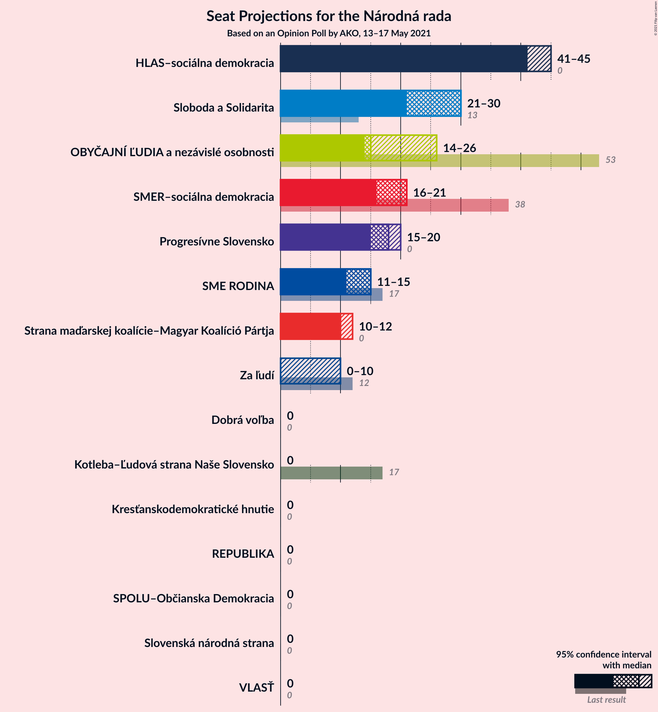
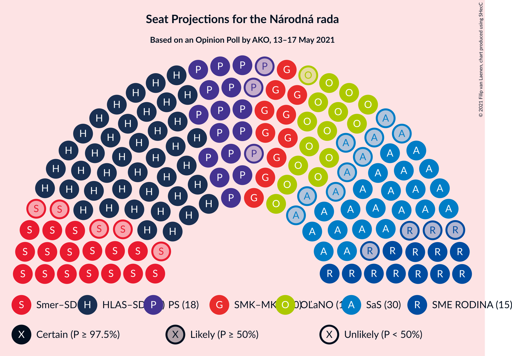
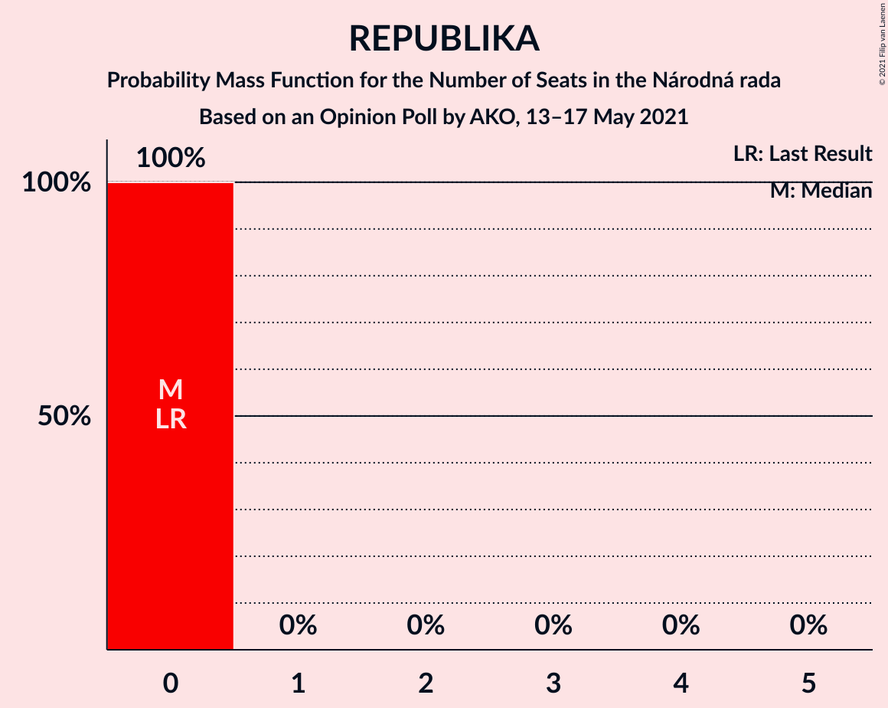

# Opinion Poll by AKO, 13–17 May 2021

<a href="#voting-intentions">Voting Intentions</a> | <a href="#seats">Seats</a> | <a href="#coalitions">Coalitions</a> | <a href="#technical-information">Technical Information</a>

## Voting Intentions

### Confidence Intervals

| Party | Last Result | Poll Result | 80% Confidence Interval | 90% Confidence Interval | 95% Confidence Interval | 99% Confidence Interval |
|:-----:|:-----------:|:-----------:|:-----------------------:|:-----------------------:|:-----------------------:|:-----------------------:|
| HLAS–sociálna demokracia | 0.0% | 21.1% | 19.6–22.8% |19.1–23.3% |18.8–23.7% |18.1–24.5% |
| Sloboda a Solidarita | 6.2% | 13.0% | 11.7–14.4% |11.4–14.8% |11.1–15.1% |10.5–15.8% |
| OBYČAJNÍ ĽUDIA a nezávislé osobnosti | 25.0% | 9.3% | 8.2–10.5% |7.9–10.9% |7.7–11.2% |7.2–11.8% |
| SMER–sociálna demokracia | 18.3% | 9.0% | 8.0–10.2% |7.7–10.6% |7.4–10.9% |7.0–11.5% |
| REPUBLIKA | 0.0% | 8.2% | 7.2–9.3% |6.9–9.7% |6.7–10.0% |6.2–10.6% |
| Progresívne Slovensko | 7.0% | 8.0% | 7.0–9.1% |6.7–9.5% |6.5–9.8% |6.1–10.4% |
| SME RODINA | 8.2% | 6.9% | 6.0–8.0% |5.8–8.4% |5.6–8.6% |5.2–9.2% |
| Strana maďarskej koalície–Magyar Koalíció Pártja | 3.9% | 5.0% | 4.2–5.9% |4.0–6.2% |3.8–6.5% |3.5–7.0% |
| Kresťanskodemokratické hnutie | 4.6% | 4.7% | 4.0–5.6% |3.7–5.9% |3.6–6.1% |3.2–6.6% |
| Za ľudí | 5.8% | 3.8% | 3.1–4.6% |2.9–4.9% |2.8–5.1% |2.5–5.5% |
| VLASŤ | 2.9% | 3.3% | 2.7–4.1% |2.5–4.3% |2.4–4.5% |2.1–5.0% |
| Dobrá voľba | 3.1% | 2.8% | 2.3–3.6% |2.1–3.8% |2.0–4.0% |1.7–4.4% |
| Kotleba–Ľudová strana Naše Slovensko | 8.0% | 2.0% | 1.5–2.6% |1.4–2.8% |1.3–3.0% |1.1–3.4% |
| Slovenská národná strana | 3.2% | 1.5% | 1.1–2.1% |1.0–2.3% |0.9–2.4% |0.8–2.8% |
| SPOLU–Občianska Demokracia | 7.0% | 1.5% | 1.1–2.1% |1.0–2.3% |0.9–2.4% |0.8–2.8% |

*Note:* The poll result column reflects the actual value used in the calculations. Published results may vary slightly, and in addition be rounded to fewer digits.

## Seats

### Confidence Intervals

| Party | Last Result | Median | 80% Confidence Interval | 90% Confidence Interval | 95% Confidence Interval | 99% Confidence Interval |
|:-----:|:-----------:|:------:|:-----------------------:|:-----------------------:|:-----------------------:|:-----------------------:|
| <a href="#hlas–sociálna-demokracia">HLAS–sociálna demokracia</a> | 0 | 37 | 36–40 |36–40 |35–42 |35–50 |
| <a href="#sloboda-a-solidarita">Sloboda a Solidarita</a> | 13 | 25 | 21–29 |21–29 |21–29 |19–29 |
| <a href="#obyčajní-ľudia-a-nezávislé-osobnosti">OBYČAJNÍ ĽUDIA a nezávislé osobnosti</a> | 53 | 18 | 15–18 |15–22 |15–22 |12–22 |
| <a href="#smer–sociálna-demokracia">SMER–sociálna demokracia</a> | 38 | 18 | 14–22 |13–22 |13–22 |13–22 |
| <a href="#republika">REPUBLIKA</a> | 0 | 17 | 14–19 |13–19 |12–20 |11–20 |
| <a href="#progresívne-slovensko">Progresívne Slovensko</a> | 0 | 19 | 14–20 |13–20 |13–20 |11–20 |
| <a href="#sme-rodina">SME RODINA</a> | 17 | 11 | 10–14 |10–15 |10–16 |9–16 |
| <a href="#strana-maďarskej-koalície–magyar-koalíció-pártja">Strana maďarskej koalície–Magyar Koalíció Pártja</a> | 0 | 0 | 0–10 |0–10 |0–11 |0–14 |
| <a href="#kresťanskodemokratické-hnutie">Kresťanskodemokratické hnutie</a> | 0 | 0 | 0–9 |0–11 |0–11 |0–11 |
| <a href="#za-ľudí">Za ľudí</a> | 12 | 0 | 0 |0 |0–10 |0–10 |
| <a href="#vlasť">VLASŤ</a> | 0 | 0 | 0 |0 |0 |0 |
| <a href="#dobrá-voľba">Dobrá voľba</a> | 0 | 0 | 0 |0 |0 |0 |
| <a href="#kotleba–ľudová-strana-naše-slovensko">Kotleba–Ľudová strana Naše Slovensko</a> | 17 | 0 | 0 |0 |0 |0 |
| <a href="#slovenská-národná-strana">Slovenská národná strana</a> | 0 | 0 | 0 |0 |0 |0 |
| <a href="#spolu–občianska-demokracia">SPOLU–Občianska Demokracia</a> | 0 | 0 | 0 |0 |0 |0 |

### HLAS–sociálna demokracia

*For a full overview of the results for this party, see the [HLAS–sociálna demokracia](party-hlas–sociálnademokracia.html) page.*

| Number of Seats | Probability | Accumulated | Special Marks |
|:---------------:|:-----------:|:-----------:|:-------------:|
| 0 | 0% | 100% | Last Result |
| 1 | 0% | 100% |  |
| 2 | 0% | 100% |  |
| 3 | 0% | 100% |  |
| 4 | 0% | 100% |  |
| 5 | 0% | 100% |  |
| 6 | 0% | 100% |  |
| 7 | 0% | 100% |  |
| 8 | 0% | 100% |  |
| 9 | 0% | 100% |  |
| 10 | 0% | 100% |  |
| 11 | 0% | 100% |  |
| 12 | 0% | 100% |  |
| 13 | 0% | 100% |  |
| 14 | 0% | 100% |  |
| 15 | 0% | 100% |  |
| 16 | 0% | 100% |  |
| 17 | 0% | 100% |  |
| 18 | 0% | 100% |  |
| 19 | 0% | 100% |  |
| 20 | 0% | 100% |  |
| 21 | 0% | 100% |  |
| 22 | 0% | 100% |  |
| 23 | 0% | 100% |  |
| 24 | 0% | 100% |  |
| 25 | 0% | 100% |  |
| 26 | 0% | 100% |  |
| 27 | 0% | 100% |  |
| 28 | 0% | 100% |  |
| 29 | 0% | 100% |  |
| 30 | 0% | 100% |  |
| 31 | 0.1% | 100% |  |
| 32 | 0.1% | 99.9% |  |
| 33 | 0.1% | 99.8% |  |
| 34 | 0.1% | 99.7% |  |
| 35 | 4% | 99.6% |  |
| 36 | 24% | 96% |  |
| 37 | 38% | 71% | Median |
| 38 | 8% | 33% |  |
| 39 | 0.4% | 25% |  |
| 40 | 21% | 25% |  |
| 41 | 0.3% | 4% |  |
| 42 | 1.0% | 3% |  |
| 43 | 0.7% | 2% |  |
| 44 | 1.0% | 2% |  |
| 45 | 0.1% | 0.8% |  |
| 46 | 0.2% | 0.7% |  |
| 47 | 0% | 0.5% |  |
| 48 | 0% | 0.5% |  |
| 49 | 0% | 0.5% |  |
| 50 | 0% | 0.5% |  |
| 51 | 0.5% | 0.5% |  |
| 52 | 0% | 0% |  |

### Sloboda a Solidarita

*For a full overview of the results for this party, see the [Sloboda a Solidarita](party-slobodaasolidarita.html) page.*

| Number of Seats | Probability | Accumulated | Special Marks |
|:---------------:|:-----------:|:-----------:|:-------------:|
| 13 | 0% | 100% | Last Result |
| 14 | 0% | 100% |  |
| 15 | 0% | 100% |  |
| 16 | 0.1% | 100% |  |
| 17 | 0.1% | 99.9% |  |
| 18 | 0.3% | 99.8% |  |
| 19 | 0.1% | 99.6% |  |
| 20 | 0% | 99.5% |  |
| 21 | 25% | 99.4% |  |
| 22 | 10% | 74% |  |
| 23 | 0.6% | 64% |  |
| 24 | 4% | 63% |  |
| 25 | 28% | 59% | Median |
| 26 | 9% | 31% |  |
| 27 | 0% | 22% |  |
| 28 | 1.2% | 22% |  |
| 29 | 21% | 21% |  |
| 30 | 0.1% | 0.1% |  |
| 31 | 0% | 0% |  |

### OBYČAJNÍ ĽUDIA a nezávislé osobnosti

*For a full overview of the results for this party, see the [OBYČAJNÍ ĽUDIA a nezávislé osobnosti](party-obyčajníľudiaanezávisléosobnosti.html) page.*

| Number of Seats | Probability | Accumulated | Special Marks |
|:---------------:|:-----------:|:-----------:|:-------------:|
| 12 | 1.0% | 100% |  |
| 13 | 0.8% | 99.0% |  |
| 14 | 0.1% | 98% |  |
| 15 | 9% | 98% |  |
| 16 | 21% | 89% |  |
| 17 | 5% | 68% |  |
| 18 | 56% | 63% | Median |
| 19 | 0.2% | 8% |  |
| 20 | 0.6% | 8% |  |
| 21 | 0.1% | 7% |  |
| 22 | 7% | 7% |  |
| 23 | 0% | 0% |  |
| 24 | 0% | 0% |  |
| 25 | 0% | 0% |  |
| 26 | 0% | 0% |  |
| 27 | 0% | 0% |  |
| 28 | 0% | 0% |  |
| 29 | 0% | 0% |  |
| 30 | 0% | 0% |  |
| 31 | 0% | 0% |  |
| 32 | 0% | 0% |  |
| 33 | 0% | 0% |  |
| 34 | 0% | 0% |  |
| 35 | 0% | 0% |  |
| 36 | 0% | 0% |  |
| 37 | 0% | 0% |  |
| 38 | 0% | 0% |  |
| 39 | 0% | 0% |  |
| 40 | 0% | 0% |  |
| 41 | 0% | 0% |  |
| 42 | 0% | 0% |  |
| 43 | 0% | 0% |  |
| 44 | 0% | 0% |  |
| 45 | 0% | 0% |  |
| 46 | 0% | 0% |  |
| 47 | 0% | 0% |  |
| 48 | 0% | 0% |  |
| 49 | 0% | 0% |  |
| 50 | 0% | 0% |  |
| 51 | 0% | 0% |  |
| 52 | 0% | 0% |  |
| 53 | 0% | 0% | Last Result |

### SMER–sociálna demokracia

*For a full overview of the results for this party, see the [SMER–sociálna demokracia](party-smer–sociálnademokracia.html) page.*

| Number of Seats | Probability | Accumulated | Special Marks |
|:---------------:|:-----------:|:-----------:|:-------------:|
| 13 | 8% | 100% |  |
| 14 | 3% | 92% |  |
| 15 | 0.4% | 89% |  |
| 16 | 9% | 88% |  |
| 17 | 4% | 79% |  |
| 18 | 29% | 76% | Median |
| 19 | 25% | 47% |  |
| 20 | 1.0% | 22% |  |
| 21 | 0.2% | 21% |  |
| 22 | 21% | 21% |  |
| 23 | 0% | 0.1% |  |
| 24 | 0.1% | 0.1% |  |
| 25 | 0% | 0% |  |
| 26 | 0% | 0% |  |
| 27 | 0% | 0% |  |
| 28 | 0% | 0% |  |
| 29 | 0% | 0% |  |
| 30 | 0% | 0% |  |
| 31 | 0% | 0% |  |
| 32 | 0% | 0% |  |
| 33 | 0% | 0% |  |
| 34 | 0% | 0% |  |
| 35 | 0% | 0% |  |
| 36 | 0% | 0% |  |
| 37 | 0% | 0% |  |
| 38 | 0% | 0% | Last Result |

### REPUBLIKA

*For a full overview of the results for this party, see the [REPUBLIKA](party-republika.html) page.*

| Number of Seats | Probability | Accumulated | Special Marks |
|:---------------:|:-----------:|:-----------:|:-------------:|
| 0 | 0% | 100% | Last Result |
| 1 | 0% | 100% |  |
| 2 | 0% | 100% |  |
| 3 | 0% | 100% |  |
| 4 | 0% | 100% |  |
| 5 | 0% | 100% |  |
| 6 | 0% | 100% |  |
| 7 | 0% | 100% |  |
| 8 | 0% | 100% |  |
| 9 | 0% | 100% |  |
| 10 | 0% | 100% |  |
| 11 | 0.8% | 99.9% |  |
| 12 | 2% | 99.1% |  |
| 13 | 4% | 97% |  |
| 14 | 8% | 94% |  |
| 15 | 0.2% | 85% |  |
| 16 | 32% | 85% |  |
| 17 | 21% | 53% | Median |
| 18 | 0.5% | 32% |  |
| 19 | 28% | 31% |  |
| 20 | 3% | 3% |  |
| 21 | 0% | 0% |  |

### Progresívne Slovensko

*For a full overview of the results for this party, see the [Progresívne Slovensko](party-progresívneslovensko.html) page.*

| Number of Seats | Probability | Accumulated | Special Marks |
|:---------------:|:-----------:|:-----------:|:-------------:|
| 0 | 0% | 100% | Last Result |
| 1 | 0% | 100% |  |
| 2 | 0% | 100% |  |
| 3 | 0% | 100% |  |
| 4 | 0% | 100% |  |
| 5 | 0% | 100% |  |
| 6 | 0% | 100% |  |
| 7 | 0% | 100% |  |
| 8 | 0% | 100% |  |
| 9 | 0.1% | 100% |  |
| 10 | 0% | 99.9% |  |
| 11 | 0.8% | 99.9% |  |
| 12 | 0% | 99.1% |  |
| 13 | 8% | 99.0% |  |
| 14 | 4% | 91% |  |
| 15 | 21% | 87% |  |
| 16 | 9% | 66% |  |
| 17 | 0.5% | 57% |  |
| 18 | 0.3% | 57% |  |
| 19 | 32% | 56% | Median |
| 20 | 24% | 25% |  |
| 21 | 0% | 0.2% |  |
| 22 | 0.2% | 0.2% |  |
| 23 | 0% | 0% |  |

### SME RODINA

*For a full overview of the results for this party, see the [SME RODINA](party-smerodina.html) page.*

| Number of Seats | Probability | Accumulated | Special Marks |
|:---------------:|:-----------:|:-----------:|:-------------:|
| 0 | 0.3% | 100% |  |
| 1 | 0% | 99.7% |  |
| 2 | 0% | 99.7% |  |
| 3 | 0% | 99.7% |  |
| 4 | 0% | 99.7% |  |
| 5 | 0% | 99.7% |  |
| 6 | 0% | 99.7% |  |
| 7 | 0% | 99.7% |  |
| 8 | 0% | 99.7% |  |
| 9 | 0.2% | 99.7% |  |
| 10 | 33% | 99.5% |  |
| 11 | 21% | 66% | Median |
| 12 | 0.4% | 45% |  |
| 13 | 8% | 44% |  |
| 14 | 29% | 37% |  |
| 15 | 3% | 7% |  |
| 16 | 4% | 4% |  |
| 17 | 0% | 0.1% | Last Result |
| 18 | 0.1% | 0.1% |  |
| 19 | 0% | 0% |  |

### Strana maďarskej koalície–Magyar Koalíció Pártja

*For a full overview of the results for this party, see the [Strana maďarskej koalície–Magyar Koalíció Pártja](party-stranamaďarskejkoalície–magyarkoalíciópártja.html) page.*

| Number of Seats | Probability | Accumulated | Special Marks |
|:---------------:|:-----------:|:-----------:|:-------------:|
| 0 | 64% | 100% | Last Result, Median |
| 1 | 0% | 36% |  |
| 2 | 0% | 36% |  |
| 3 | 0% | 36% |  |
| 4 | 0% | 36% |  |
| 5 | 0% | 36% |  |
| 6 | 0% | 36% |  |
| 7 | 0% | 36% |  |
| 8 | 0% | 36% |  |
| 9 | 8% | 36% |  |
| 10 | 25% | 28% |  |
| 11 | 2% | 3% |  |
| 12 | 0.5% | 1.3% |  |
| 13 | 0.1% | 0.8% |  |
| 14 | 0.7% | 0.7% |  |
| 15 | 0% | 0% |  |

### Kresťanskodemokratické hnutie

*For a full overview of the results for this party, see the [Kresťanskodemokratické hnutie](party-kresťanskodemokratickéhnutie.html) page.*

| Number of Seats | Probability | Accumulated | Special Marks |
|:---------------:|:-----------:|:-----------:|:-------------:|
| 0 | 81% | 100% | Last Result, Median |
| 1 | 0% | 19% |  |
| 2 | 0% | 19% |  |
| 3 | 0% | 19% |  |
| 4 | 0% | 19% |  |
| 5 | 0% | 19% |  |
| 6 | 0% | 19% |  |
| 7 | 0% | 19% |  |
| 8 | 0% | 19% |  |
| 9 | 12% | 19% |  |
| 10 | 0.4% | 8% |  |
| 11 | 7% | 7% |  |
| 12 | 0.1% | 0.1% |  |
| 13 | 0.1% | 0.1% |  |
| 14 | 0% | 0% |  |

### Za ľudí

*For a full overview of the results for this party, see the [Za ľudí](party-zaľudí.html) page.*

| Number of Seats | Probability | Accumulated | Special Marks |
|:---------------:|:-----------:|:-----------:|:-------------:|
| 0 | 97% | 100% | Median |
| 1 | 0% | 3% |  |
| 2 | 0% | 3% |  |
| 3 | 0% | 3% |  |
| 4 | 0% | 3% |  |
| 5 | 0% | 3% |  |
| 6 | 0% | 3% |  |
| 7 | 0% | 3% |  |
| 8 | 0% | 3% |  |
| 9 | 0.1% | 3% |  |
| 10 | 3% | 3% |  |
| 11 | 0% | 0.1% |  |
| 12 | 0.1% | 0.1% | Last Result |
| 13 | 0% | 0% |  |

### VLASŤ

*For a full overview of the results for this party, see the [VLASŤ](party-vlasť.html) page.*

| Number of Seats | Probability | Accumulated | Special Marks |
|:---------------:|:-----------:|:-----------:|:-------------:|
| 0 | 99.7% | 100% | Last Result, Median |
| 1 | 0% | 0.3% |  |
| 2 | 0% | 0.3% |  |
| 3 | 0% | 0.3% |  |
| 4 | 0% | 0.3% |  |
| 5 | 0% | 0.3% |  |
| 6 | 0% | 0.3% |  |
| 7 | 0% | 0.3% |  |
| 8 | 0% | 0.3% |  |
| 9 | 0.2% | 0.3% |  |
| 10 | 0% | 0.1% |  |
| 11 | 0% | 0.1% |  |
| 12 | 0.1% | 0.1% |  |
| 13 | 0% | 0% |  |

### Dobrá voľba

*For a full overview of the results for this party, see the [Dobrá voľba](party-dobrávoľba.html) page.*

| Number of Seats | Probability | Accumulated | Special Marks |
|:---------------:|:-----------:|:-----------:|:-------------:|
| 0 | 100% | 100% | Last Result, Median |

### Kotleba–Ľudová strana Naše Slovensko

*For a full overview of the results for this party, see the [Kotleba–Ľudová strana Naše Slovensko](party-kotleba–ľudovástrananašeslovensko.html) page.*

| Number of Seats | Probability | Accumulated | Special Marks |
|:---------------:|:-----------:|:-----------:|:-------------:|
| 0 | 100% | 100% | Median |
| 1 | 0% | 0% |  |
| 2 | 0% | 0% |  |
| 3 | 0% | 0% |  |
| 4 | 0% | 0% |  |
| 5 | 0% | 0% |  |
| 6 | 0% | 0% |  |
| 7 | 0% | 0% |  |
| 8 | 0% | 0% |  |
| 9 | 0% | 0% |  |
| 10 | 0% | 0% |  |
| 11 | 0% | 0% |  |
| 12 | 0% | 0% |  |
| 13 | 0% | 0% |  |
| 14 | 0% | 0% |  |
| 15 | 0% | 0% |  |
| 16 | 0% | 0% |  |
| 17 | 0% | 0% | Last Result |

### Slovenská národná strana

*For a full overview of the results for this party, see the [Slovenská národná strana](party-slovenskánárodnástrana.html) page.*

| Number of Seats | Probability | Accumulated | Special Marks |
|:---------------:|:-----------:|:-----------:|:-------------:|
| 0 | 100% | 100% | Last Result, Median |

### SPOLU–Občianska Demokracia

*For a full overview of the results for this party, see the [SPOLU–Občianska Demokracia](party-spolu–občianskademokracia.html) page.*

| Number of Seats | Probability | Accumulated | Special Marks |
|:---------------:|:-----------:|:-----------:|:-------------:|
| 0 | 100% | 100% | Last Result, Median |

## Coalitions

### Confidence Intervals

| Coalition | Last Result | Median | Majority? | 80% Confidence Interval | 90% Confidence Interval | 95% Confidence Interval | 99% Confidence Interval |
|:---------:|:-----------:|:------:|:---------:|:-----------------------:|:-----------------------:|:-----------------------:|:-----------------------:|
| HLAS–sociálna demokracia – SMER–sociálna demokracia – SME RODINA – Kotleba–Ľudová strana Naše Slovensko – Slovenská národná strana | 72 | 69 | 0.6% | 65–73 | 61–73 | 61–73 | 61–81 |
| HLAS–sociálna demokracia – SMER–sociálna demokracia – SME RODINA | 55 | 69 | 0.6% | 65–73 | 61–73 | 61–73 | 61–81 |
| HLAS–sociálna demokracia – SMER–sociálna demokracia – SME RODINA – Slovenská národná strana | 55 | 69 | 0.6% | 65–73 | 61–73 | 61–73 | 61–81 |
| HLAS–sociálna demokracia – SMER–sociálna demokracia – Slovenská národná strana | 38 | 55 | 0% | 51–62 | 51–62 | 51–62 | 51–67 |
| HLAS–sociálna demokracia – SME RODINA – Kotleba–Ľudová strana Naše Slovensko – Slovenská národná strana | 34 | 51 | 0% | 46–51 | 46–52 | 46–54 | 46–65 |
| HLAS–sociálna demokracia – SME RODINA | 17 | 51 | 0% | 46–51 | 46–52 | 46–54 | 46–65 |
| HLAS–sociálna demokracia – SME RODINA – Slovenská národná strana | 17 | 51 | 0% | 46–51 | 46–52 | 46–54 | 46–65 |
| HLAS–sociálna demokracia – Slovenská národná strana | 0 | 37 | 0% | 36–40 | 36–40 | 35–42 | 35–50 |
| SMER–sociálna demokracia – SME RODINA – Kotleba–Ľudová strana Naše Slovensko – Slovenská národná strana | 72 | 32 | 0% | 29–33 | 23–33 | 23–33 | 23–33 |
| SMER–sociálna demokracia – SME RODINA | 55 | 32 | 0% | 29–33 | 23–33 | 23–33 | 23–33 |
| SMER–sociálna demokracia – SME RODINA – Slovenská národná strana | 55 | 32 | 0% | 29–33 | 23–33 | 23–33 | 23–33 |
| SMER–sociálna demokracia | 38 | 18 | 0% | 14–22 | 13–22 | 13–22 | 13–22 |
| SMER–sociálna demokracia – Slovenská národná strana | 38 | 18 | 0% | 14–22 | 13–22 | 13–22 | 13–22 |

### HLAS–sociálna demokracia – SMER–sociálna demokracia – SME RODINA – Kotleba–Ľudová strana Naše Slovensko – Slovenská národná strana

| Number of Seats | Probability | Accumulated | Special Marks |
|:---------------:|:-----------:|:-----------:|:-------------:|
| 58 | 0.1% | 100% |  |
| 59 | 0% | 99.9% |  |
| 60 | 0% | 99.9% |  |
| 61 | 8% | 99.9% |  |
| 62 | 0.1% | 92% |  |
| 63 | 0.3% | 92% |  |
| 64 | 0.2% | 92% |  |
| 65 | 25% | 91% |  |
| 66 | 10% | 67% | Median |
| 67 | 0.2% | 57% |  |
| 68 | 4% | 56% |  |
| 69 | 28% | 53% |  |
| 70 | 0.4% | 24% |  |
| 71 | 1.1% | 24% |  |
| 72 | 0% | 23% | Last Result |
| 73 | 21% | 23% |  |
| 74 | 1.0% | 2% |  |
| 75 | 0% | 0.6% |  |
| 76 | 0% | 0.6% | Majority |
| 77 | 0% | 0.6% |  |
| 78 | 0% | 0.6% |  |
| 79 | 0% | 0.6% |  |
| 80 | 0% | 0.6% |  |
| 81 | 0.5% | 0.6% |  |
| 82 | 0.1% | 0.1% |  |
| 83 | 0% | 0% |  |

### HLAS–sociálna demokracia – SMER–sociálna demokracia – SME RODINA

| Number of Seats | Probability | Accumulated | Special Marks |
|:---------------:|:-----------:|:-----------:|:-------------:|
| 55 | 0% | 100% | Last Result |
| 56 | 0% | 100% |  |
| 57 | 0% | 100% |  |
| 58 | 0.1% | 100% |  |
| 59 | 0% | 99.9% |  |
| 60 | 0% | 99.9% |  |
| 61 | 8% | 99.9% |  |
| 62 | 0.1% | 92% |  |
| 63 | 0.3% | 92% |  |
| 64 | 0.2% | 92% |  |
| 65 | 25% | 91% |  |
| 66 | 10% | 67% | Median |
| 67 | 0.2% | 57% |  |
| 68 | 4% | 56% |  |
| 69 | 28% | 53% |  |
| 70 | 0.4% | 24% |  |
| 71 | 1.1% | 24% |  |
| 72 | 0% | 23% |  |
| 73 | 21% | 23% |  |
| 74 | 1.0% | 2% |  |
| 75 | 0% | 0.6% |  |
| 76 | 0% | 0.6% | Majority |
| 77 | 0% | 0.6% |  |
| 78 | 0% | 0.6% |  |
| 79 | 0% | 0.6% |  |
| 80 | 0% | 0.6% |  |
| 81 | 0.5% | 0.6% |  |
| 82 | 0.1% | 0.1% |  |
| 83 | 0% | 0% |  |

### HLAS–sociálna demokracia – SMER–sociálna demokracia – SME RODINA – Slovenská národná strana

| Number of Seats | Probability | Accumulated | Special Marks |
|:---------------:|:-----------:|:-----------:|:-------------:|
| 55 | 0% | 100% | Last Result |
| 56 | 0% | 100% |  |
| 57 | 0% | 100% |  |
| 58 | 0.1% | 100% |  |
| 59 | 0% | 99.9% |  |
| 60 | 0% | 99.9% |  |
| 61 | 8% | 99.9% |  |
| 62 | 0.1% | 92% |  |
| 63 | 0.3% | 92% |  |
| 64 | 0.2% | 92% |  |
| 65 | 25% | 91% |  |
| 66 | 10% | 67% | Median |
| 67 | 0.2% | 57% |  |
| 68 | 4% | 56% |  |
| 69 | 28% | 53% |  |
| 70 | 0.4% | 24% |  |
| 71 | 1.1% | 24% |  |
| 72 | 0% | 23% |  |
| 73 | 21% | 23% |  |
| 74 | 1.0% | 2% |  |
| 75 | 0% | 0.6% |  |
| 76 | 0% | 0.6% | Majority |
| 77 | 0% | 0.6% |  |
| 78 | 0% | 0.6% |  |
| 79 | 0% | 0.6% |  |
| 80 | 0% | 0.6% |  |
| 81 | 0.5% | 0.6% |  |
| 82 | 0.1% | 0.1% |  |
| 83 | 0% | 0% |  |

### HLAS–sociálna demokracia – SMER–sociálna demokracia – Slovenská národná strana

| Number of Seats | Probability | Accumulated | Special Marks |
|:---------------:|:-----------:|:-----------:|:-------------:|
| 38 | 0% | 100% | Last Result |
| 39 | 0% | 100% |  |
| 40 | 0% | 100% |  |
| 41 | 0% | 100% |  |
| 42 | 0% | 100% |  |
| 43 | 0% | 100% |  |
| 44 | 0% | 100% |  |
| 45 | 0% | 100% |  |
| 46 | 0% | 100% |  |
| 47 | 0.1% | 100% |  |
| 48 | 0.1% | 99.9% |  |
| 49 | 0.1% | 99.8% |  |
| 50 | 0% | 99.8% |  |
| 51 | 11% | 99.7% |  |
| 52 | 4% | 89% |  |
| 53 | 7% | 85% |  |
| 54 | 0.2% | 78% |  |
| 55 | 53% | 78% | Median |
| 56 | 0.5% | 25% |  |
| 57 | 0.1% | 24% |  |
| 58 | 0.6% | 24% |  |
| 59 | 0.5% | 24% |  |
| 60 | 0.5% | 23% |  |
| 61 | 0% | 23% |  |
| 62 | 21% | 23% |  |
| 63 | 0.1% | 2% |  |
| 64 | 1.0% | 2% |  |
| 65 | 0% | 0.8% |  |
| 66 | 0.1% | 0.8% |  |
| 67 | 0.7% | 0.7% |  |
| 68 | 0% | 0% |  |

### HLAS–sociálna demokracia – SME RODINA – Kotleba–Ľudová strana Naše Slovensko – Slovenská národná strana

| Number of Seats | Probability | Accumulated | Special Marks |
|:---------------:|:-----------:|:-----------:|:-------------:|
| 34 | 0% | 100% | Last Result |
| 35 | 0% | 100% |  |
| 36 | 0% | 100% |  |
| 37 | 0% | 100% |  |
| 38 | 0% | 100% |  |
| 39 | 0% | 100% |  |
| 40 | 0% | 100% |  |
| 41 | 0% | 100% |  |
| 42 | 0.1% | 100% |  |
| 43 | 0% | 99.9% |  |
| 44 | 0% | 99.9% |  |
| 45 | 0.1% | 99.9% |  |
| 46 | 25% | 99.8% |  |
| 47 | 0.1% | 75% |  |
| 48 | 8% | 75% | Median |
| 49 | 0.2% | 67% |  |
| 50 | 7% | 67% |  |
| 51 | 53% | 59% |  |
| 52 | 3% | 7% |  |
| 53 | 0.5% | 4% |  |
| 54 | 1.4% | 3% |  |
| 55 | 0.6% | 2% |  |
| 56 | 0% | 1.2% |  |
| 57 | 0.5% | 1.2% |  |
| 58 | 0.1% | 0.7% |  |
| 59 | 0% | 0.6% |  |
| 60 | 0.1% | 0.6% |  |
| 61 | 0% | 0.5% |  |
| 62 | 0% | 0.5% |  |
| 63 | 0% | 0.5% |  |
| 64 | 0% | 0.5% |  |
| 65 | 0.5% | 0.5% |  |
| 66 | 0% | 0% |  |

### HLAS–sociálna demokracia – SME RODINA

| Number of Seats | Probability | Accumulated | Special Marks |
|:---------------:|:-----------:|:-----------:|:-------------:|
| 17 | 0% | 100% | Last Result |
| 18 | 0% | 100% |  |
| 19 | 0% | 100% |  |
| 20 | 0% | 100% |  |
| 21 | 0% | 100% |  |
| 22 | 0% | 100% |  |
| 23 | 0% | 100% |  |
| 24 | 0% | 100% |  |
| 25 | 0% | 100% |  |
| 26 | 0% | 100% |  |
| 27 | 0% | 100% |  |
| 28 | 0% | 100% |  |
| 29 | 0% | 100% |  |
| 30 | 0% | 100% |  |
| 31 | 0% | 100% |  |
| 32 | 0% | 100% |  |
| 33 | 0% | 100% |  |
| 34 | 0% | 100% |  |
| 35 | 0% | 100% |  |
| 36 | 0% | 100% |  |
| 37 | 0% | 100% |  |
| 38 | 0% | 100% |  |
| 39 | 0% | 100% |  |
| 40 | 0% | 100% |  |
| 41 | 0% | 100% |  |
| 42 | 0.1% | 100% |  |
| 43 | 0% | 99.9% |  |
| 44 | 0% | 99.9% |  |
| 45 | 0.1% | 99.9% |  |
| 46 | 25% | 99.8% |  |
| 47 | 0.1% | 75% |  |
| 48 | 8% | 75% | Median |
| 49 | 0.2% | 67% |  |
| 50 | 7% | 67% |  |
| 51 | 53% | 59% |  |
| 52 | 3% | 7% |  |
| 53 | 0.5% | 4% |  |
| 54 | 1.4% | 3% |  |
| 55 | 0.6% | 2% |  |
| 56 | 0% | 1.2% |  |
| 57 | 0.5% | 1.2% |  |
| 58 | 0.1% | 0.7% |  |
| 59 | 0% | 0.6% |  |
| 60 | 0.1% | 0.6% |  |
| 61 | 0% | 0.5% |  |
| 62 | 0% | 0.5% |  |
| 63 | 0% | 0.5% |  |
| 64 | 0% | 0.5% |  |
| 65 | 0.5% | 0.5% |  |
| 66 | 0% | 0% |  |

### HLAS–sociálna demokracia – SME RODINA – Slovenská národná strana

| Number of Seats | Probability | Accumulated | Special Marks |
|:---------------:|:-----------:|:-----------:|:-------------:|
| 17 | 0% | 100% | Last Result |
| 18 | 0% | 100% |  |
| 19 | 0% | 100% |  |
| 20 | 0% | 100% |  |
| 21 | 0% | 100% |  |
| 22 | 0% | 100% |  |
| 23 | 0% | 100% |  |
| 24 | 0% | 100% |  |
| 25 | 0% | 100% |  |
| 26 | 0% | 100% |  |
| 27 | 0% | 100% |  |
| 28 | 0% | 100% |  |
| 29 | 0% | 100% |  |
| 30 | 0% | 100% |  |
| 31 | 0% | 100% |  |
| 32 | 0% | 100% |  |
| 33 | 0% | 100% |  |
| 34 | 0% | 100% |  |
| 35 | 0% | 100% |  |
| 36 | 0% | 100% |  |
| 37 | 0% | 100% |  |
| 38 | 0% | 100% |  |
| 39 | 0% | 100% |  |
| 40 | 0% | 100% |  |
| 41 | 0% | 100% |  |
| 42 | 0.1% | 100% |  |
| 43 | 0% | 99.9% |  |
| 44 | 0% | 99.9% |  |
| 45 | 0.1% | 99.9% |  |
| 46 | 25% | 99.8% |  |
| 47 | 0.1% | 75% |  |
| 48 | 8% | 75% | Median |
| 49 | 0.2% | 67% |  |
| 50 | 7% | 67% |  |
| 51 | 53% | 59% |  |
| 52 | 3% | 7% |  |
| 53 | 0.5% | 4% |  |
| 54 | 1.4% | 3% |  |
| 55 | 0.6% | 2% |  |
| 56 | 0% | 1.2% |  |
| 57 | 0.5% | 1.2% |  |
| 58 | 0.1% | 0.7% |  |
| 59 | 0% | 0.6% |  |
| 60 | 0.1% | 0.6% |  |
| 61 | 0% | 0.5% |  |
| 62 | 0% | 0.5% |  |
| 63 | 0% | 0.5% |  |
| 64 | 0% | 0.5% |  |
| 65 | 0.5% | 0.5% |  |
| 66 | 0% | 0% |  |

### HLAS–sociálna demokracia – Slovenská národná strana

| Number of Seats | Probability | Accumulated | Special Marks |
|:---------------:|:-----------:|:-----------:|:-------------:|
| 0 | 0% | 100% | Last Result |
| 1 | 0% | 100% |  |
| 2 | 0% | 100% |  |
| 3 | 0% | 100% |  |
| 4 | 0% | 100% |  |
| 5 | 0% | 100% |  |
| 6 | 0% | 100% |  |
| 7 | 0% | 100% |  |
| 8 | 0% | 100% |  |
| 9 | 0% | 100% |  |
| 10 | 0% | 100% |  |
| 11 | 0% | 100% |  |
| 12 | 0% | 100% |  |
| 13 | 0% | 100% |  |
| 14 | 0% | 100% |  |
| 15 | 0% | 100% |  |
| 16 | 0% | 100% |  |
| 17 | 0% | 100% |  |
| 18 | 0% | 100% |  |
| 19 | 0% | 100% |  |
| 20 | 0% | 100% |  |
| 21 | 0% | 100% |  |
| 22 | 0% | 100% |  |
| 23 | 0% | 100% |  |
| 24 | 0% | 100% |  |
| 25 | 0% | 100% |  |
| 26 | 0% | 100% |  |
| 27 | 0% | 100% |  |
| 28 | 0% | 100% |  |
| 29 | 0% | 100% |  |
| 30 | 0% | 100% |  |
| 31 | 0.1% | 100% |  |
| 32 | 0.1% | 99.9% |  |
| 33 | 0.1% | 99.8% |  |
| 34 | 0.1% | 99.7% |  |
| 35 | 4% | 99.6% |  |
| 36 | 24% | 96% |  |
| 37 | 38% | 71% | Median |
| 38 | 8% | 33% |  |
| 39 | 0.4% | 25% |  |
| 40 | 21% | 25% |  |
| 41 | 0.3% | 4% |  |
| 42 | 1.0% | 3% |  |
| 43 | 0.7% | 2% |  |
| 44 | 1.0% | 2% |  |
| 45 | 0.1% | 0.8% |  |
| 46 | 0.2% | 0.7% |  |
| 47 | 0% | 0.5% |  |
| 48 | 0% | 0.5% |  |
| 49 | 0% | 0.5% |  |
| 50 | 0% | 0.5% |  |
| 51 | 0.5% | 0.5% |  |
| 52 | 0% | 0% |  |

### SMER–sociálna demokracia – SME RODINA – Kotleba–Ľudová strana Naše Slovensko – Slovenská národná strana

| Number of Seats | Probability | Accumulated | Special Marks |
|:---------------:|:-----------:|:-----------:|:-------------:|
| 18 | 0.1% | 100% |  |
| 19 | 0% | 99.9% |  |
| 20 | 0% | 99.9% |  |
| 21 | 0.2% | 99.9% |  |
| 22 | 0% | 99.7% |  |
| 23 | 8% | 99.7% |  |
| 24 | 0.3% | 92% |  |
| 25 | 0.1% | 92% |  |
| 26 | 0.2% | 91% |  |
| 27 | 0.2% | 91% |  |
| 28 | 0.4% | 91% |  |
| 29 | 35% | 91% | Median |
| 30 | 2% | 56% |  |
| 31 | 0.5% | 54% |  |
| 32 | 28% | 53% |  |
| 33 | 25% | 25% |  |
| 34 | 0% | 0.2% |  |
| 35 | 0% | 0.2% |  |
| 36 | 0% | 0.1% |  |
| 37 | 0% | 0.1% |  |
| 38 | 0% | 0.1% |  |
| 39 | 0% | 0.1% |  |
| 40 | 0.1% | 0.1% |  |
| 41 | 0% | 0% |  |
| 42 | 0% | 0% |  |
| 43 | 0% | 0% |  |
| 44 | 0% | 0% |  |
| 45 | 0% | 0% |  |
| 46 | 0% | 0% |  |
| 47 | 0% | 0% |  |
| 48 | 0% | 0% |  |
| 49 | 0% | 0% |  |
| 50 | 0% | 0% |  |
| 51 | 0% | 0% |  |
| 52 | 0% | 0% |  |
| 53 | 0% | 0% |  |
| 54 | 0% | 0% |  |
| 55 | 0% | 0% |  |
| 56 | 0% | 0% |  |
| 57 | 0% | 0% |  |
| 58 | 0% | 0% |  |
| 59 | 0% | 0% |  |
| 60 | 0% | 0% |  |
| 61 | 0% | 0% |  |
| 62 | 0% | 0% |  |
| 63 | 0% | 0% |  |
| 64 | 0% | 0% |  |
| 65 | 0% | 0% |  |
| 66 | 0% | 0% |  |
| 67 | 0% | 0% |  |
| 68 | 0% | 0% |  |
| 69 | 0% | 0% |  |
| 70 | 0% | 0% |  |
| 71 | 0% | 0% |  |
| 72 | 0% | 0% | Last Result |

### SMER–sociálna demokracia – SME RODINA

| Number of Seats | Probability | Accumulated | Special Marks |
|:---------------:|:-----------:|:-----------:|:-------------:|
| 18 | 0.1% | 100% |  |
| 19 | 0% | 99.9% |  |
| 20 | 0% | 99.9% |  |
| 21 | 0.2% | 99.9% |  |
| 22 | 0% | 99.7% |  |
| 23 | 8% | 99.7% |  |
| 24 | 0.3% | 92% |  |
| 25 | 0.1% | 92% |  |
| 26 | 0.2% | 91% |  |
| 27 | 0.2% | 91% |  |
| 28 | 0.4% | 91% |  |
| 29 | 35% | 91% | Median |
| 30 | 2% | 56% |  |
| 31 | 0.5% | 54% |  |
| 32 | 28% | 53% |  |
| 33 | 25% | 25% |  |
| 34 | 0% | 0.2% |  |
| 35 | 0% | 0.2% |  |
| 36 | 0% | 0.1% |  |
| 37 | 0% | 0.1% |  |
| 38 | 0% | 0.1% |  |
| 39 | 0% | 0.1% |  |
| 40 | 0.1% | 0.1% |  |
| 41 | 0% | 0% |  |
| 42 | 0% | 0% |  |
| 43 | 0% | 0% |  |
| 44 | 0% | 0% |  |
| 45 | 0% | 0% |  |
| 46 | 0% | 0% |  |
| 47 | 0% | 0% |  |
| 48 | 0% | 0% |  |
| 49 | 0% | 0% |  |
| 50 | 0% | 0% |  |
| 51 | 0% | 0% |  |
| 52 | 0% | 0% |  |
| 53 | 0% | 0% |  |
| 54 | 0% | 0% |  |
| 55 | 0% | 0% | Last Result |

### SMER–sociálna demokracia – SME RODINA – Slovenská národná strana

| Number of Seats | Probability | Accumulated | Special Marks |
|:---------------:|:-----------:|:-----------:|:-------------:|
| 18 | 0.1% | 100% |  |
| 19 | 0% | 99.9% |  |
| 20 | 0% | 99.9% |  |
| 21 | 0.2% | 99.9% |  |
| 22 | 0% | 99.7% |  |
| 23 | 8% | 99.7% |  |
| 24 | 0.3% | 92% |  |
| 25 | 0.1% | 92% |  |
| 26 | 0.2% | 91% |  |
| 27 | 0.2% | 91% |  |
| 28 | 0.4% | 91% |  |
| 29 | 35% | 91% | Median |
| 30 | 2% | 56% |  |
| 31 | 0.5% | 54% |  |
| 32 | 28% | 53% |  |
| 33 | 25% | 25% |  |
| 34 | 0% | 0.2% |  |
| 35 | 0% | 0.2% |  |
| 36 | 0% | 0.1% |  |
| 37 | 0% | 0.1% |  |
| 38 | 0% | 0.1% |  |
| 39 | 0% | 0.1% |  |
| 40 | 0.1% | 0.1% |  |
| 41 | 0% | 0% |  |
| 42 | 0% | 0% |  |
| 43 | 0% | 0% |  |
| 44 | 0% | 0% |  |
| 45 | 0% | 0% |  |
| 46 | 0% | 0% |  |
| 47 | 0% | 0% |  |
| 48 | 0% | 0% |  |
| 49 | 0% | 0% |  |
| 50 | 0% | 0% |  |
| 51 | 0% | 0% |  |
| 52 | 0% | 0% |  |
| 53 | 0% | 0% |  |
| 54 | 0% | 0% |  |
| 55 | 0% | 0% | Last Result |

### SMER–sociálna demokracia

| Number of Seats | Probability | Accumulated | Special Marks |
|:---------------:|:-----------:|:-----------:|:-------------:|
| 13 | 8% | 100% |  |
| 14 | 3% | 92% |  |
| 15 | 0.4% | 89% |  |
| 16 | 9% | 88% |  |
| 17 | 4% | 79% |  |
| 18 | 29% | 76% | Median |
| 19 | 25% | 47% |  |
| 20 | 1.0% | 22% |  |
| 21 | 0.2% | 21% |  |
| 22 | 21% | 21% |  |
| 23 | 0% | 0.1% |  |
| 24 | 0.1% | 0.1% |  |
| 25 | 0% | 0% |  |
| 26 | 0% | 0% |  |
| 27 | 0% | 0% |  |
| 28 | 0% | 0% |  |
| 29 | 0% | 0% |  |
| 30 | 0% | 0% |  |
| 31 | 0% | 0% |  |
| 32 | 0% | 0% |  |
| 33 | 0% | 0% |  |
| 34 | 0% | 0% |  |
| 35 | 0% | 0% |  |
| 36 | 0% | 0% |  |
| 37 | 0% | 0% |  |
| 38 | 0% | 0% | Last Result |

### SMER–sociálna demokracia – Slovenská národná strana

| Number of Seats | Probability | Accumulated | Special Marks |
|:---------------:|:-----------:|:-----------:|:-------------:|
| 13 | 8% | 100% |  |
| 14 | 3% | 92% |  |
| 15 | 0.4% | 89% |  |
| 16 | 9% | 88% |  |
| 17 | 4% | 79% |  |
| 18 | 29% | 76% | Median |
| 19 | 25% | 47% |  |
| 20 | 1.0% | 22% |  |
| 21 | 0.2% | 21% |  |
| 22 | 21% | 21% |  |
| 23 | 0% | 0.1% |  |
| 24 | 0.1% | 0.1% |  |
| 25 | 0% | 0% |  |
| 26 | 0% | 0% |  |
| 27 | 0% | 0% |  |
| 28 | 0% | 0% |  |
| 29 | 0% | 0% |  |
| 30 | 0% | 0% |  |
| 31 | 0% | 0% |  |
| 32 | 0% | 0% |  |
| 33 | 0% | 0% |  |
| 34 | 0% | 0% |  |
| 35 | 0% | 0% |  |
| 36 | 0% | 0% |  |
| 37 | 0% | 0% |  |
| 38 | 0% | 0% | Last Result |

## Technical Information

### Opinion Poll

+ **Polling firm:** AKO
+ **Commissioner(s):** —
+ **Fieldwork period:** 13–17 May 2021

### Calculations

+ **Sample size:** 1065
+ **Simulations done:** 131,072
+ **Error estimate:** 2.88%

