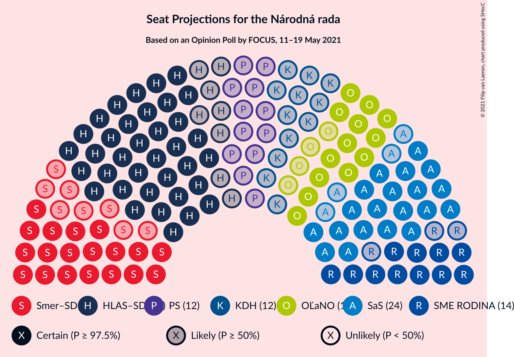
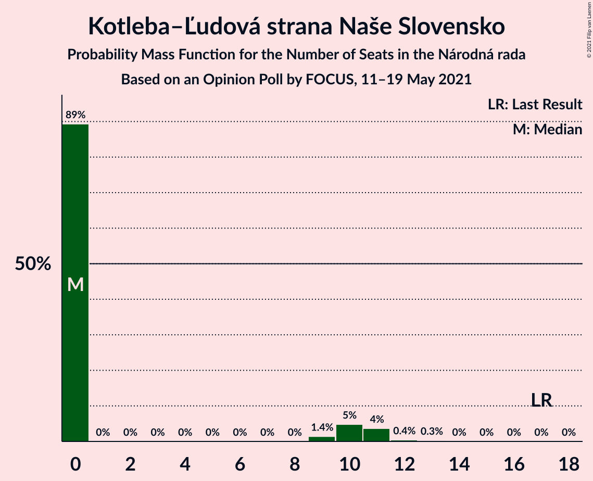

# Opinion Poll by FOCUS, 11–19 May 2021

<a href="#voting-intentions">Voting Intentions</a> | <a href="#seats">Seats</a> | <a href="#coalitions">Coalitions</a> | <a href="#technical-information">Technical Information</a>

## Voting Intentions

### Confidence Intervals

| Party | Last Result | Poll Result | 80% Confidence Interval | 90% Confidence Interval | 95% Confidence Interval | 99% Confidence Interval |
|:-----:|:-----------:|:-----------:|:-----------------------:|:-----------------------:|:-----------------------:|:-----------------------:|
| HLAS–sociálna demokracia | 0.0% | 22.4% | 20.8–24.2% |20.3–24.7% |20.0–25.1% |19.2–26.0% |
| Sloboda a Solidarita | 6.2% | 12.3% | 11.1–13.7% |10.7–14.1% |10.4–14.5% |9.8–15.2% |
| SMER–sociálna demokracia | 18.3% | 11.8% | 10.6–13.2% |10.2–13.6% |10.0–13.9% |9.4–14.6% |
| OBYČAJNÍ ĽUDIA a nezávislé osobnosti | 25.0% | 8.8% | 7.8–10.1% |7.5–10.4% |7.2–10.7% |6.8–11.4% |
| SME RODINA | 8.2% | 7.2% | 6.3–8.4% |6.0–8.7% |5.8–9.0% |5.4–9.6% |
| Progresívne Slovensko | 7.0% | 6.1% | 5.2–7.1% |4.9–7.4% |4.7–7.7% |4.4–8.2% |
| Kresťanskodemokratické hnutie | 4.6% | 5.7% | 4.8–6.7% |4.6–7.0% |4.4–7.3% |4.0–7.8% |
| Kotleba–Ľudová strana Naše Slovensko | 8.0% | 4.9% | 4.1–5.9% |3.9–6.1% |3.7–6.4% |3.4–6.9% |
| Strana maďarskej koalície–Magyar Koalíció Pártja | 3.9% | 4.8% | 4.0–5.7% |3.8–6.0% |3.6–6.3% |3.3–6.8% |
| REPUBLIKA | 0.0% | 4.5% | 3.7–5.4% |3.5–5.7% |3.4–5.9% |3.0–6.4% |
| Za ľudí | 5.8% | 3.5% | 2.8–4.3% |2.7–4.6% |2.5–4.8% |2.2–5.2% |
| Slovenská národná strana | 3.2% | 3.4% | 2.7–4.2% |2.6–4.5% |2.4–4.7% |2.1–5.1% |
| Dobrá voľba | 3.1% | 1.4% | 1.0–2.0% |0.9–2.2% |0.8–2.3% |0.7–2.7% |
| SPOLU–Občianska Demokracia | 7.0% | 1.3% | 0.9–1.9% |0.8–2.0% |0.7–2.2% |0.6–2.5% |

*Note:* The poll result column reflects the actual value used in the calculations. Published results may vary slightly, and in addition be rounded to fewer digits.

## Seats

### Confidence Intervals

| Party | Last Result | Median | 80% Confidence Interval | 90% Confidence Interval | 95% Confidence Interval | 99% Confidence Interval |
|:-----:|:-----------:|:------:|:-----------------------:|:-----------------------:|:-----------------------:|:-----------------------:|
| <a href="#hlas–sociálna-demokracia">HLAS–sociálna demokracia</a> | 0 | 44 | 40–45 |38–47 |36–47 |32–50 |
| <a href="#sloboda-a-solidarita">Sloboda a Solidarita</a> | 13 | 24 | 21–24 |20–25 |20–27 |19–28 |
| <a href="#smer–sociálna-demokracia">SMER–sociálna demokracia</a> | 38 | 27 | 22–27 |22–27 |19–30 |18–30 |
| <a href="#obyčajní-ľudia-a-nezávislé-osobnosti">OBYČAJNÍ ĽUDIA a nezávislé osobnosti</a> | 53 | 17 | 15–19 |15–19 |13–20 |13–21 |
| <a href="#sme-rodina">SME RODINA</a> | 17 | 14 | 14–16 |12–17 |11–17 |11–19 |
| <a href="#progresívne-slovensko">Progresívne Slovensko</a> | 0 | 12 | 10–12 |9–12 |0–14 |0–15 |
| <a href="#kresťanskodemokratické-hnutie">Kresťanskodemokratické hnutie</a> | 0 | 12 | 10–15 |0–15 |0–15 |0–15 |
| <a href="#kotleba–ľudová-strana-naše-slovensko">Kotleba–Ľudová strana Naše Slovensko</a> | 17 | 0 | 0–9 |0–10 |0–11 |0–12 |
| <a href="#strana-maďarskej-koalície–magyar-koalíció-pártja">Strana maďarskej koalície–Magyar Koalíció Pártja</a> | 0 | 0 | 0–10 |0–11 |0–12 |0–12 |
| <a href="#republika">REPUBLIKA</a> | 0 | 0 | 0–9 |0–10 |0–10 |0–11 |
| <a href="#za-ľudí">Za ľudí</a> | 12 | 0 | 0 |0 |0 |0–9 |
| <a href="#slovenská-národná-strana">Slovenská národná strana</a> | 0 | 0 | 0 |0 |0 |0 |
| <a href="#dobrá-voľba">Dobrá voľba</a> | 0 | 0 | 0 |0 |0 |0 |
| <a href="#spolu–občianska-demokracia">SPOLU–Občianska Demokracia</a> | 0 | 0 | 0 |0 |0 |0 |

### HLAS–sociálna demokracia

*For a full overview of the results for this party, see the [HLAS–sociálna demokracia](party-hlas–sociálnademokracia.html) page.*

| Number of Seats | Probability | Accumulated | Special Marks |
|:---------------:|:-----------:|:-----------:|:-------------:|
| 0 | 0% | 100% | Last Result |
| 1 | 0% | 100% |  |
| 2 | 0% | 100% |  |
| 3 | 0% | 100% |  |
| 4 | 0% | 100% |  |
| 5 | 0% | 100% |  |
| 6 | 0% | 100% |  |
| 7 | 0% | 100% |  |
| 8 | 0% | 100% |  |
| 9 | 0% | 100% |  |
| 10 | 0% | 100% |  |
| 11 | 0% | 100% |  |
| 12 | 0% | 100% |  |
| 13 | 0% | 100% |  |
| 14 | 0% | 100% |  |
| 15 | 0% | 100% |  |
| 16 | 0% | 100% |  |
| 17 | 0% | 100% |  |
| 18 | 0% | 100% |  |
| 19 | 0% | 100% |  |
| 20 | 0% | 100% |  |
| 21 | 0% | 100% |  |
| 22 | 0% | 100% |  |
| 23 | 0% | 100% |  |
| 24 | 0% | 100% |  |
| 25 | 0% | 100% |  |
| 26 | 0% | 100% |  |
| 27 | 0% | 100% |  |
| 28 | 0% | 100% |  |
| 29 | 0% | 100% |  |
| 30 | 0% | 100% |  |
| 31 | 0% | 100% |  |
| 32 | 1.4% | 100% |  |
| 33 | 0.1% | 98.6% |  |
| 34 | 0% | 98% |  |
| 35 | 0.1% | 98% |  |
| 36 | 0.9% | 98% |  |
| 37 | 0.4% | 97% |  |
| 38 | 5% | 97% |  |
| 39 | 0.5% | 92% |  |
| 40 | 6% | 92% |  |
| 41 | 2% | 86% |  |
| 42 | 0.9% | 84% |  |
| 43 | 2% | 83% |  |
| 44 | 53% | 81% | Median |
| 45 | 23% | 29% |  |
| 46 | 0.4% | 5% |  |
| 47 | 3% | 5% |  |
| 48 | 0.9% | 2% |  |
| 49 | 0.3% | 1.4% |  |
| 50 | 0.9% | 1.1% |  |
| 51 | 0% | 0.2% |  |
| 52 | 0.1% | 0.2% |  |
| 53 | 0.1% | 0.1% |  |
| 54 | 0% | 0.1% |  |
| 55 | 0% | 0% |  |

### Sloboda a Solidarita

*For a full overview of the results for this party, see the [Sloboda a Solidarita](party-slobodaasolidarita.html) page.*

| Number of Seats | Probability | Accumulated | Special Marks |
|:---------------:|:-----------:|:-----------:|:-------------:|
| 13 | 0% | 100% | Last Result |
| 14 | 0% | 100% |  |
| 15 | 0% | 100% |  |
| 16 | 0% | 100% |  |
| 17 | 0.1% | 100% |  |
| 18 | 0.1% | 99.9% |  |
| 19 | 0.6% | 99.8% |  |
| 20 | 5% | 99.2% |  |
| 21 | 9% | 94% |  |
| 22 | 6% | 85% |  |
| 23 | 2% | 80% |  |
| 24 | 71% | 77% | Median |
| 25 | 3% | 6% |  |
| 26 | 0.8% | 4% |  |
| 27 | 0.4% | 3% |  |
| 28 | 2% | 2% |  |
| 29 | 0.2% | 0.4% |  |
| 30 | 0.1% | 0.2% |  |
| 31 | 0.1% | 0.2% |  |
| 32 | 0% | 0.1% |  |
| 33 | 0% | 0% |  |

### SMER–sociálna demokracia

*For a full overview of the results for this party, see the [SMER–sociálna demokracia](party-smer–sociálnademokracia.html) page.*

| Number of Seats | Probability | Accumulated | Special Marks |
|:---------------:|:-----------:|:-----------:|:-------------:|
| 16 | 0.2% | 100% |  |
| 17 | 0.2% | 99.8% |  |
| 18 | 0.8% | 99.6% |  |
| 19 | 2% | 98.8% |  |
| 20 | 0.7% | 97% |  |
| 21 | 1.2% | 96% |  |
| 22 | 8% | 95% |  |
| 23 | 25% | 88% |  |
| 24 | 5% | 62% |  |
| 25 | 2% | 57% |  |
| 26 | 0.8% | 56% |  |
| 27 | 52% | 55% | Median |
| 28 | 0.2% | 3% |  |
| 29 | 0% | 3% |  |
| 30 | 2% | 3% |  |
| 31 | 0.1% | 0.1% |  |
| 32 | 0% | 0% |  |
| 33 | 0% | 0% |  |
| 34 | 0% | 0% |  |
| 35 | 0% | 0% |  |
| 36 | 0% | 0% |  |
| 37 | 0% | 0% |  |
| 38 | 0% | 0% | Last Result |

### OBYČAJNÍ ĽUDIA a nezávislé osobnosti

*For a full overview of the results for this party, see the [OBYČAJNÍ ĽUDIA a nezávislé osobnosti](party-obyčajníľudiaanezávisléosobnosti.html) page.*

| Number of Seats | Probability | Accumulated | Special Marks |
|:---------------:|:-----------:|:-----------:|:-------------:|
| 11 | 0.3% | 100% |  |
| 12 | 0.1% | 99.7% |  |
| 13 | 3% | 99.6% |  |
| 14 | 1.1% | 97% |  |
| 15 | 20% | 96% |  |
| 16 | 6% | 76% |  |
| 17 | 53% | 70% | Median |
| 18 | 6% | 17% |  |
| 19 | 7% | 11% |  |
| 20 | 3% | 4% |  |
| 21 | 0.2% | 0.7% |  |
| 22 | 0.5% | 0.5% |  |
| 23 | 0% | 0% |  |
| 24 | 0% | 0% |  |
| 25 | 0% | 0% |  |
| 26 | 0% | 0% |  |
| 27 | 0% | 0% |  |
| 28 | 0% | 0% |  |
| 29 | 0% | 0% |  |
| 30 | 0% | 0% |  |
| 31 | 0% | 0% |  |
| 32 | 0% | 0% |  |
| 33 | 0% | 0% |  |
| 34 | 0% | 0% |  |
| 35 | 0% | 0% |  |
| 36 | 0% | 0% |  |
| 37 | 0% | 0% |  |
| 38 | 0% | 0% |  |
| 39 | 0% | 0% |  |
| 40 | 0% | 0% |  |
| 41 | 0% | 0% |  |
| 42 | 0% | 0% |  |
| 43 | 0% | 0% |  |
| 44 | 0% | 0% |  |
| 45 | 0% | 0% |  |
| 46 | 0% | 0% |  |
| 47 | 0% | 0% |  |
| 48 | 0% | 0% |  |
| 49 | 0% | 0% |  |
| 50 | 0% | 0% |  |
| 51 | 0% | 0% |  |
| 52 | 0% | 0% |  |
| 53 | 0% | 0% | Last Result |

### SME RODINA

*For a full overview of the results for this party, see the [SME RODINA](party-smerodina.html) page.*

| Number of Seats | Probability | Accumulated | Special Marks |
|:---------------:|:-----------:|:-----------:|:-------------:|
| 0 | 0.1% | 100% |  |
| 1 | 0% | 99.9% |  |
| 2 | 0% | 99.9% |  |
| 3 | 0% | 99.9% |  |
| 4 | 0% | 99.9% |  |
| 5 | 0% | 99.9% |  |
| 6 | 0% | 99.9% |  |
| 7 | 0% | 99.9% |  |
| 8 | 0% | 99.9% |  |
| 9 | 0% | 99.9% |  |
| 10 | 0.4% | 99.9% |  |
| 11 | 3% | 99.5% |  |
| 12 | 3% | 97% |  |
| 13 | 3% | 94% |  |
| 14 | 56% | 91% | Median |
| 15 | 6% | 35% |  |
| 16 | 20% | 29% |  |
| 17 | 7% | 9% | Last Result |
| 18 | 0.5% | 2% |  |
| 19 | 1.3% | 1.3% |  |
| 20 | 0% | 0% |  |

### Progresívne Slovensko

*For a full overview of the results for this party, see the [Progresívne Slovensko](party-progresívneslovensko.html) page.*

| Number of Seats | Probability | Accumulated | Special Marks |
|:---------------:|:-----------:|:-----------:|:-------------:|
| 0 | 4% | 100% | Last Result |
| 1 | 0% | 96% |  |
| 2 | 0% | 96% |  |
| 3 | 0% | 96% |  |
| 4 | 0% | 96% |  |
| 5 | 0% | 96% |  |
| 6 | 0% | 96% |  |
| 7 | 0% | 96% |  |
| 8 | 0% | 96% |  |
| 9 | 3% | 96% |  |
| 10 | 6% | 93% |  |
| 11 | 11% | 87% |  |
| 12 | 72% | 76% | Median |
| 13 | 1.4% | 5% |  |
| 14 | 2% | 3% |  |
| 15 | 1.0% | 1.1% |  |
| 16 | 0.1% | 0.2% |  |
| 17 | 0% | 0.1% |  |
| 18 | 0.1% | 0.1% |  |
| 19 | 0% | 0% |  |

### Kresťanskodemokratické hnutie

*For a full overview of the results for this party, see the [Kresťanskodemokratické hnutie](party-kresťanskodemokratickéhnutie.html) page.*

| Number of Seats | Probability | Accumulated | Special Marks |
|:---------------:|:-----------:|:-----------:|:-------------:|
| 0 | 6% | 100% | Last Result |
| 1 | 0% | 94% |  |
| 2 | 0% | 94% |  |
| 3 | 0% | 94% |  |
| 4 | 0% | 94% |  |
| 5 | 0% | 94% |  |
| 6 | 0% | 94% |  |
| 7 | 0% | 94% |  |
| 8 | 0% | 94% |  |
| 9 | 0.3% | 94% |  |
| 10 | 8% | 93% |  |
| 11 | 10% | 86% |  |
| 12 | 54% | 76% | Median |
| 13 | 0.8% | 21% |  |
| 14 | 1.0% | 21% |  |
| 15 | 19% | 20% |  |
| 16 | 0.1% | 0.2% |  |
| 17 | 0.2% | 0.2% |  |
| 18 | 0% | 0% |  |

### Kotleba–Ľudová strana Naše Slovensko

*For a full overview of the results for this party, see the [Kotleba–Ľudová strana Naše Slovensko](party-kotleba–ľudovástrananašeslovensko.html) page.*

| Number of Seats | Probability | Accumulated | Special Marks |
|:---------------:|:-----------:|:-----------:|:-------------:|
| 0 | 89% | 100% | Median |
| 1 | 0% | 11% |  |
| 2 | 0% | 11% |  |
| 3 | 0% | 11% |  |
| 4 | 0% | 11% |  |
| 5 | 0% | 11% |  |
| 6 | 0% | 11% |  |
| 7 | 0% | 11% |  |
| 8 | 0% | 11% |  |
| 9 | 1.4% | 11% |  |
| 10 | 5% | 9% |  |
| 11 | 4% | 4% |  |
| 12 | 0.4% | 0.7% |  |
| 13 | 0.3% | 0.3% |  |
| 14 | 0% | 0% |  |
| 15 | 0% | 0% |  |
| 16 | 0% | 0% |  |
| 17 | 0% | 0% | Last Result |

### Strana maďarskej koalície–Magyar Koalíció Pártja

*For a full overview of the results for this party, see the [Strana maďarskej koalície–Magyar Koalíció Pártja](party-stranamaďarskejkoalície–magyarkoalíciópártja.html) page.*

| Number of Seats | Probability | Accumulated | Special Marks |
|:---------------:|:-----------:|:-----------:|:-------------:|
| 0 | 88% | 100% | Last Result, Median |
| 1 | 0% | 12% |  |
| 2 | 0% | 12% |  |
| 3 | 0% | 12% |  |
| 4 | 0% | 12% |  |
| 5 | 0% | 12% |  |
| 6 | 0% | 12% |  |
| 7 | 0% | 12% |  |
| 8 | 0% | 12% |  |
| 9 | 2% | 12% |  |
| 10 | 4% | 11% |  |
| 11 | 2% | 6% |  |
| 12 | 5% | 5% |  |
| 13 | 0.1% | 0.1% |  |
| 14 | 0% | 0% |  |

### REPUBLIKA

*For a full overview of the results for this party, see the [REPUBLIKA](party-republika.html) page.*

| Number of Seats | Probability | Accumulated | Special Marks |
|:---------------:|:-----------:|:-----------:|:-------------:|
| 0 | 88% | 100% | Last Result, Median |
| 1 | 0% | 12% |  |
| 2 | 0% | 12% |  |
| 3 | 0% | 12% |  |
| 4 | 0% | 12% |  |
| 5 | 0% | 12% |  |
| 6 | 0% | 12% |  |
| 7 | 0% | 12% |  |
| 8 | 0% | 12% |  |
| 9 | 3% | 12% |  |
| 10 | 8% | 9% |  |
| 11 | 0.4% | 0.7% |  |
| 12 | 0.2% | 0.3% |  |
| 13 | 0.1% | 0.1% |  |
| 14 | 0% | 0% |  |

### Za ľudí

*For a full overview of the results for this party, see the [Za ľudí](party-zaľudí.html) page.*

| Number of Seats | Probability | Accumulated | Special Marks |
|:---------------:|:-----------:|:-----------:|:-------------:|
| 0 | 99.4% | 100% | Median |
| 1 | 0% | 0.6% |  |
| 2 | 0% | 0.6% |  |
| 3 | 0% | 0.6% |  |
| 4 | 0% | 0.6% |  |
| 5 | 0% | 0.6% |  |
| 6 | 0% | 0.6% |  |
| 7 | 0% | 0.6% |  |
| 8 | 0% | 0.6% |  |
| 9 | 0.2% | 0.6% |  |
| 10 | 0.3% | 0.4% |  |
| 11 | 0% | 0% |  |
| 12 | 0% | 0% | Last Result |

### Slovenská národná strana

*For a full overview of the results for this party, see the [Slovenská národná strana](party-slovenskánárodnástrana.html) page.*

| Number of Seats | Probability | Accumulated | Special Marks |
|:---------------:|:-----------:|:-----------:|:-------------:|
| 0 | 99.6% | 100% | Last Result, Median |
| 1 | 0% | 0.4% |  |
| 2 | 0% | 0.4% |  |
| 3 | 0% | 0.4% |  |
| 4 | 0% | 0.4% |  |
| 5 | 0% | 0.4% |  |
| 6 | 0% | 0.4% |  |
| 7 | 0% | 0.4% |  |
| 8 | 0% | 0.4% |  |
| 9 | 0% | 0.4% |  |
| 10 | 0.1% | 0.3% |  |
| 11 | 0.3% | 0.3% |  |
| 12 | 0% | 0% |  |

### Dobrá voľba

*For a full overview of the results for this party, see the [Dobrá voľba](party-dobrávoľba.html) page.*

| Number of Seats | Probability | Accumulated | Special Marks |
|:---------------:|:-----------:|:-----------:|:-------------:|
| 0 | 100% | 100% | Last Result, Median |

### SPOLU–Občianska Demokracia

*For a full overview of the results for this party, see the [SPOLU–Občianska Demokracia](party-spolu–občianskademokracia.html) page.*

| Number of Seats | Probability | Accumulated | Special Marks |
|:---------------:|:-----------:|:-----------:|:-------------:|
| 0 | 100% | 100% | Last Result, Median |

## Coalitions

### Confidence Intervals

| Coalition | Last Result | Median | Majority? | 80% Confidence Interval | 90% Confidence Interval | 95% Confidence Interval | 99% Confidence Interval |
|:---------:|:-----------:|:------:|:---------:|:-----------------------:|:-----------------------:|:-----------------------:|:-----------------------:|
| HLAS–sociálna demokracia – SMER–sociálna demokracia – SME RODINA – Kotleba–Ľudová strana Naše Slovensko – Slovenská národná strana | 72 | 85 | 99.4% | 80–85 | 76–89 | 76–97 | 75–105 |
| HLAS–sociálna demokracia – SMER–sociálna demokracia – SME RODINA | 55 | 85 | 94% | 76–85 | 75–85 | 69–94 | 66–94 |
| HLAS–sociálna demokracia – SMER–sociálna demokracia – SME RODINA – Slovenská národná strana | 55 | 85 | 94% | 76–85 | 75–86 | 69–94 | 66–94 |
| HLAS–sociálna demokracia – SMER–sociálna demokracia – Slovenská národná strana | 38 | 71 | 3% | 62–71 | 60–71 | 58–77 | 54–77 |
| HLAS–sociálna demokracia – SME RODINA – Kotleba–Ľudová strana Naše Slovensko – Slovenská národná strana | 34 | 58 | 0% | 57–62 | 53–66 | 52–75 | 52–75 |
| HLAS–sociálna demokracia – SME RODINA | 17 | 58 | 0% | 54–61 | 52–62 | 49–64 | 44–64 |
| HLAS–sociálna demokracia – SME RODINA – Slovenská národná strana | 17 | 58 | 0% | 54–61 | 52–62 | 49–64 | 44–65 |
| SMER–sociálna demokracia – SME RODINA – Kotleba–Ľudová strana Naše Slovensko – Slovenská národná strana | 72 | 41 | 0% | 38–43 | 37–46 | 36–53 | 33–58 |
| HLAS–sociálna demokracia – Slovenská národná strana | 0 | 44 | 0% | 40–45 | 38–47 | 36–48 | 32–51 |
| SMER–sociálna demokracia – SME RODINA – Slovenská národná strana | 55 | 41 | 0% | 36–41 | 34–41 | 33–47 | 30–47 |
| SMER–sociálna demokracia – SME RODINA | 55 | 41 | 0% | 36–41 | 34–41 | 33–46 | 30–47 |
| SMER–sociálna demokracia | 38 | 27 | 0% | 22–27 | 22–27 | 19–30 | 18–30 |
| SMER–sociálna demokracia – Slovenská národná strana | 38 | 27 | 0% | 22–27 | 22–27 | 19–30 | 18–30 |

### HLAS–sociálna demokracia – SMER–sociálna demokracia – SME RODINA – Kotleba–Ľudová strana Naše Slovensko – Slovenská národná strana

| Number of Seats | Probability | Accumulated | Special Marks |
|:---------------:|:-----------:|:-----------:|:-------------:|
| 67 | 0.1% | 100% |  |
| 68 | 0% | 99.9% |  |
| 69 | 0% | 99.9% |  |
| 70 | 0% | 99.9% |  |
| 71 | 0% | 99.9% |  |
| 72 | 0.1% | 99.8% | Last Result |
| 73 | 0.2% | 99.7% |  |
| 74 | 0% | 99.5% |  |
| 75 | 0.1% | 99.5% |  |
| 76 | 7% | 99.4% | Majority |
| 77 | 0.1% | 93% |  |
| 78 | 0.2% | 93% |  |
| 79 | 1.0% | 93% |  |
| 80 | 6% | 92% |  |
| 81 | 1.3% | 86% |  |
| 82 | 4% | 85% |  |
| 83 | 0.3% | 81% |  |
| 84 | 21% | 81% |  |
| 85 | 52% | 59% | Median |
| 86 | 0.3% | 7% |  |
| 87 | 0.3% | 7% |  |
| 88 | 0.4% | 7% |  |
| 89 | 2% | 6% |  |
| 90 | 0.3% | 4% |  |
| 91 | 0.2% | 4% |  |
| 92 | 0.1% | 4% |  |
| 93 | 0% | 4% |  |
| 94 | 0.2% | 4% |  |
| 95 | 0.4% | 4% |  |
| 96 | 0.7% | 3% |  |
| 97 | 0.1% | 3% |  |
| 98 | 0% | 2% |  |
| 99 | 0% | 2% |  |
| 100 | 0% | 2% |  |
| 101 | 0% | 2% |  |
| 102 | 0% | 2% |  |
| 103 | 0% | 2% |  |
| 104 | 0% | 2% |  |
| 105 | 2% | 2% |  |
| 106 | 0% | 0% |  |

### HLAS–sociálna demokracia – SMER–sociálna demokracia – SME RODINA

| Number of Seats | Probability | Accumulated | Special Marks |
|:---------------:|:-----------:|:-----------:|:-------------:|
| 55 | 0% | 100% | Last Result |
| 56 | 0% | 100% |  |
| 57 | 0% | 100% |  |
| 58 | 0% | 100% |  |
| 59 | 0% | 100% |  |
| 60 | 0% | 100% |  |
| 61 | 0% | 100% |  |
| 62 | 0% | 100% |  |
| 63 | 0% | 100% |  |
| 64 | 0% | 100% |  |
| 65 | 0% | 100% |  |
| 66 | 1.5% | 100% |  |
| 67 | 0.1% | 98% |  |
| 68 | 0.1% | 98% |  |
| 69 | 0.9% | 98% |  |
| 70 | 0.3% | 97% |  |
| 71 | 0.7% | 97% |  |
| 72 | 0.2% | 96% |  |
| 73 | 0.6% | 96% |  |
| 74 | 0.6% | 96% |  |
| 75 | 2% | 95% |  |
| 76 | 5% | 94% | Majority |
| 77 | 0.5% | 88% |  |
| 78 | 0.3% | 88% |  |
| 79 | 0.5% | 87% |  |
| 80 | 6% | 87% |  |
| 81 | 0.5% | 81% |  |
| 82 | 4% | 81% |  |
| 83 | 0.2% | 77% |  |
| 84 | 20% | 77% |  |
| 85 | 52% | 57% | Median |
| 86 | 0.2% | 5% |  |
| 87 | 0.2% | 5% |  |
| 88 | 0.1% | 5% |  |
| 89 | 2% | 4% |  |
| 90 | 0% | 3% |  |
| 91 | 0.1% | 3% |  |
| 92 | 0% | 3% |  |
| 93 | 0% | 3% |  |
| 94 | 3% | 3% |  |
| 95 | 0% | 0% |  |

### HLAS–sociálna demokracia – SMER–sociálna demokracia – SME RODINA – Slovenská národná strana

| Number of Seats | Probability | Accumulated | Special Marks |
|:---------------:|:-----------:|:-----------:|:-------------:|
| 55 | 0% | 100% | Last Result |
| 56 | 0% | 100% |  |
| 57 | 0% | 100% |  |
| 58 | 0% | 100% |  |
| 59 | 0% | 100% |  |
| 60 | 0% | 100% |  |
| 61 | 0% | 100% |  |
| 62 | 0% | 100% |  |
| 63 | 0% | 100% |  |
| 64 | 0% | 100% |  |
| 65 | 0% | 100% |  |
| 66 | 1.4% | 100% |  |
| 67 | 0.1% | 98.5% |  |
| 68 | 0.1% | 98% |  |
| 69 | 0.9% | 98% |  |
| 70 | 0.3% | 97% |  |
| 71 | 0.7% | 97% |  |
| 72 | 0.2% | 96% |  |
| 73 | 0.6% | 96% |  |
| 74 | 0.6% | 96% |  |
| 75 | 2% | 95% |  |
| 76 | 5% | 94% | Majority |
| 77 | 0.5% | 88% |  |
| 78 | 0.3% | 88% |  |
| 79 | 0.5% | 87% |  |
| 80 | 6% | 87% |  |
| 81 | 0.5% | 81% |  |
| 82 | 4% | 81% |  |
| 83 | 0.2% | 77% |  |
| 84 | 20% | 77% |  |
| 85 | 52% | 57% | Median |
| 86 | 0.2% | 5% |  |
| 87 | 0.2% | 5% |  |
| 88 | 0.1% | 5% |  |
| 89 | 2% | 5% |  |
| 90 | 0% | 3% |  |
| 91 | 0.1% | 3% |  |
| 92 | 0% | 3% |  |
| 93 | 0% | 3% |  |
| 94 | 3% | 3% |  |
| 95 | 0% | 0.3% |  |
| 96 | 0.2% | 0.3% |  |
| 97 | 0% | 0% |  |

### HLAS–sociálna demokracia – SMER–sociálna demokracia – Slovenská národná strana

| Number of Seats | Probability | Accumulated | Special Marks |
|:---------------:|:-----------:|:-----------:|:-------------:|
| 38 | 0% | 100% | Last Result |
| 39 | 0% | 100% |  |
| 40 | 0% | 100% |  |
| 41 | 0% | 100% |  |
| 42 | 0% | 100% |  |
| 43 | 0% | 100% |  |
| 44 | 0% | 100% |  |
| 45 | 0% | 100% |  |
| 46 | 0% | 100% |  |
| 47 | 0% | 100% |  |
| 48 | 0% | 100% |  |
| 49 | 0% | 100% |  |
| 50 | 0% | 100% |  |
| 51 | 0% | 100% |  |
| 52 | 0% | 100% |  |
| 53 | 0% | 100% |  |
| 54 | 2% | 99.9% |  |
| 55 | 0% | 98% |  |
| 56 | 0.2% | 98% |  |
| 57 | 0.2% | 98% |  |
| 58 | 1.5% | 98% |  |
| 59 | 0.4% | 97% |  |
| 60 | 2% | 96% |  |
| 61 | 0.3% | 94% |  |
| 62 | 5% | 94% |  |
| 63 | 5% | 89% |  |
| 64 | 0.6% | 84% |  |
| 65 | 0.8% | 83% |  |
| 66 | 0.5% | 82% |  |
| 67 | 4% | 82% |  |
| 68 | 20% | 78% |  |
| 69 | 1.5% | 58% |  |
| 70 | 2% | 57% |  |
| 71 | 51% | 55% | Median |
| 72 | 0.3% | 5% |  |
| 73 | 0.4% | 4% |  |
| 74 | 0.7% | 4% |  |
| 75 | 0.1% | 3% |  |
| 76 | 0.2% | 3% | Majority |
| 77 | 3% | 3% |  |
| 78 | 0% | 0.4% |  |
| 79 | 0% | 0.4% |  |
| 80 | 0.2% | 0.4% |  |
| 81 | 0.1% | 0.1% |  |
| 82 | 0% | 0.1% |  |
| 83 | 0% | 0% |  |

### HLAS–sociálna demokracia – SME RODINA – Kotleba–Ľudová strana Naše Slovensko – Slovenská národná strana

| Number of Seats | Probability | Accumulated | Special Marks |
|:---------------:|:-----------:|:-----------:|:-------------:|
| 34 | 0% | 100% | Last Result |
| 35 | 0% | 100% |  |
| 36 | 0% | 100% |  |
| 37 | 0% | 100% |  |
| 38 | 0% | 100% |  |
| 39 | 0% | 100% |  |
| 40 | 0% | 100% |  |
| 41 | 0% | 100% |  |
| 42 | 0% | 100% |  |
| 43 | 0% | 100% |  |
| 44 | 0% | 100% |  |
| 45 | 0% | 100% |  |
| 46 | 0% | 100% |  |
| 47 | 0% | 100% |  |
| 48 | 0% | 100% |  |
| 49 | 0% | 99.9% |  |
| 50 | 0.2% | 99.9% |  |
| 51 | 0.1% | 99.7% |  |
| 52 | 4% | 99.7% |  |
| 53 | 0.4% | 95% |  |
| 54 | 2% | 95% |  |
| 55 | 1.2% | 93% |  |
| 56 | 0.3% | 92% |  |
| 57 | 5% | 92% |  |
| 58 | 51% | 86% | Median |
| 59 | 0.6% | 36% |  |
| 60 | 4% | 35% |  |
| 61 | 20% | 31% |  |
| 62 | 2% | 11% |  |
| 63 | 2% | 9% |  |
| 64 | 0.2% | 7% |  |
| 65 | 2% | 7% |  |
| 66 | 0.5% | 5% |  |
| 67 | 0.5% | 5% |  |
| 68 | 0.2% | 4% |  |
| 69 | 0.3% | 4% |  |
| 70 | 0.6% | 4% |  |
| 71 | 0.4% | 3% |  |
| 72 | 0.2% | 3% |  |
| 73 | 0% | 3% |  |
| 74 | 0% | 3% |  |
| 75 | 3% | 3% |  |
| 76 | 0% | 0% | Majority |

### HLAS–sociálna demokracia – SME RODINA

| Number of Seats | Probability | Accumulated | Special Marks |
|:---------------:|:-----------:|:-----------:|:-------------:|
| 17 | 0% | 100% | Last Result |
| 18 | 0% | 100% |  |
| 19 | 0% | 100% |  |
| 20 | 0% | 100% |  |
| 21 | 0% | 100% |  |
| 22 | 0% | 100% |  |
| 23 | 0% | 100% |  |
| 24 | 0% | 100% |  |
| 25 | 0% | 100% |  |
| 26 | 0% | 100% |  |
| 27 | 0% | 100% |  |
| 28 | 0% | 100% |  |
| 29 | 0% | 100% |  |
| 30 | 0% | 100% |  |
| 31 | 0% | 100% |  |
| 32 | 0% | 100% |  |
| 33 | 0% | 100% |  |
| 34 | 0% | 100% |  |
| 35 | 0% | 100% |  |
| 36 | 0% | 100% |  |
| 37 | 0% | 100% |  |
| 38 | 0% | 100% |  |
| 39 | 0% | 100% |  |
| 40 | 0% | 100% |  |
| 41 | 0% | 100% |  |
| 42 | 0% | 100% |  |
| 43 | 0% | 100% |  |
| 44 | 1.4% | 100% |  |
| 45 | 0% | 98.6% |  |
| 46 | 0.1% | 98.5% |  |
| 47 | 0.8% | 98% |  |
| 48 | 0.1% | 98% |  |
| 49 | 0.1% | 98% |  |
| 50 | 0.4% | 97% |  |
| 51 | 0.5% | 97% |  |
| 52 | 5% | 97% |  |
| 53 | 1.5% | 92% |  |
| 54 | 0.4% | 90% |  |
| 55 | 1.4% | 90% |  |
| 56 | 2% | 88% |  |
| 57 | 5% | 87% |  |
| 58 | 51% | 81% | Median |
| 59 | 1.0% | 30% |  |
| 60 | 4% | 30% |  |
| 61 | 20% | 26% |  |
| 62 | 2% | 6% |  |
| 63 | 0.6% | 4% |  |
| 64 | 3% | 3% |  |
| 65 | 0.3% | 0.4% |  |
| 66 | 0.1% | 0.2% |  |
| 67 | 0% | 0% |  |

### HLAS–sociálna demokracia – SME RODINA – Slovenská národná strana

| Number of Seats | Probability | Accumulated | Special Marks |
|:---------------:|:-----------:|:-----------:|:-------------:|
| 17 | 0% | 100% | Last Result |
| 18 | 0% | 100% |  |
| 19 | 0% | 100% |  |
| 20 | 0% | 100% |  |
| 21 | 0% | 100% |  |
| 22 | 0% | 100% |  |
| 23 | 0% | 100% |  |
| 24 | 0% | 100% |  |
| 25 | 0% | 100% |  |
| 26 | 0% | 100% |  |
| 27 | 0% | 100% |  |
| 28 | 0% | 100% |  |
| 29 | 0% | 100% |  |
| 30 | 0% | 100% |  |
| 31 | 0% | 100% |  |
| 32 | 0% | 100% |  |
| 33 | 0% | 100% |  |
| 34 | 0% | 100% |  |
| 35 | 0% | 100% |  |
| 36 | 0% | 100% |  |
| 37 | 0% | 100% |  |
| 38 | 0% | 100% |  |
| 39 | 0% | 100% |  |
| 40 | 0% | 100% |  |
| 41 | 0% | 100% |  |
| 42 | 0% | 100% |  |
| 43 | 0% | 100% |  |
| 44 | 1.4% | 100% |  |
| 45 | 0% | 98.6% |  |
| 46 | 0.1% | 98.5% |  |
| 47 | 0.8% | 98% |  |
| 48 | 0.1% | 98% |  |
| 49 | 0.1% | 98% |  |
| 50 | 0.4% | 97% |  |
| 51 | 0.5% | 97% |  |
| 52 | 5% | 97% |  |
| 53 | 1.4% | 92% |  |
| 54 | 0.4% | 90% |  |
| 55 | 1.4% | 90% |  |
| 56 | 2% | 88% |  |
| 57 | 5% | 87% |  |
| 58 | 51% | 82% | Median |
| 59 | 1.0% | 31% |  |
| 60 | 4% | 30% |  |
| 61 | 20% | 26% |  |
| 62 | 2% | 6% |  |
| 63 | 0.6% | 4% |  |
| 64 | 3% | 3% |  |
| 65 | 0.3% | 0.7% |  |
| 66 | 0.1% | 0.5% |  |
| 67 | 0% | 0.3% |  |
| 68 | 0% | 0.3% |  |
| 69 | 0% | 0.3% |  |
| 70 | 0% | 0.3% |  |
| 71 | 0.2% | 0.3% |  |
| 72 | 0% | 0% |  |

### SMER–sociálna demokracia – SME RODINA – Kotleba–Ľudová strana Naše Slovensko – Slovenská národná strana

| Number of Seats | Probability | Accumulated | Special Marks |
|:---------------:|:-----------:|:-----------:|:-------------:|
| 29 | 0.2% | 100% |  |
| 30 | 0.1% | 99.8% |  |
| 31 | 0% | 99.7% |  |
| 32 | 0.1% | 99.6% |  |
| 33 | 0.3% | 99.5% |  |
| 34 | 0.7% | 99.3% |  |
| 35 | 0.8% | 98.5% |  |
| 36 | 1.3% | 98% |  |
| 37 | 4% | 96% |  |
| 38 | 5% | 93% |  |
| 39 | 20% | 88% |  |
| 40 | 5% | 68% |  |
| 41 | 52% | 63% | Median |
| 42 | 0.1% | 11% |  |
| 43 | 2% | 11% |  |
| 44 | 2% | 9% |  |
| 45 | 0.5% | 7% |  |
| 46 | 2% | 6% |  |
| 47 | 0.6% | 5% |  |
| 48 | 0.7% | 4% |  |
| 49 | 0.2% | 4% |  |
| 50 | 0.2% | 3% |  |
| 51 | 0.1% | 3% |  |
| 52 | 0.3% | 3% |  |
| 53 | 0.2% | 3% |  |
| 54 | 0% | 2% |  |
| 55 | 0% | 2% |  |
| 56 | 0% | 2% |  |
| 57 | 0% | 2% |  |
| 58 | 2% | 2% |  |
| 59 | 0% | 0% |  |
| 60 | 0% | 0% |  |
| 61 | 0% | 0% |  |
| 62 | 0% | 0% |  |
| 63 | 0% | 0% |  |
| 64 | 0% | 0% |  |
| 65 | 0% | 0% |  |
| 66 | 0% | 0% |  |
| 67 | 0% | 0% |  |
| 68 | 0% | 0% |  |
| 69 | 0% | 0% |  |
| 70 | 0% | 0% |  |
| 71 | 0% | 0% |  |
| 72 | 0% | 0% | Last Result |

### HLAS–sociálna demokracia – Slovenská národná strana

| Number of Seats | Probability | Accumulated | Special Marks |
|:---------------:|:-----------:|:-----------:|:-------------:|
| 0 | 0% | 100% | Last Result |
| 1 | 0% | 100% |  |
| 2 | 0% | 100% |  |
| 3 | 0% | 100% |  |
| 4 | 0% | 100% |  |
| 5 | 0% | 100% |  |
| 6 | 0% | 100% |  |
| 7 | 0% | 100% |  |
| 8 | 0% | 100% |  |
| 9 | 0% | 100% |  |
| 10 | 0% | 100% |  |
| 11 | 0% | 100% |  |
| 12 | 0% | 100% |  |
| 13 | 0% | 100% |  |
| 14 | 0% | 100% |  |
| 15 | 0% | 100% |  |
| 16 | 0% | 100% |  |
| 17 | 0% | 100% |  |
| 18 | 0% | 100% |  |
| 19 | 0% | 100% |  |
| 20 | 0% | 100% |  |
| 21 | 0% | 100% |  |
| 22 | 0% | 100% |  |
| 23 | 0% | 100% |  |
| 24 | 0% | 100% |  |
| 25 | 0% | 100% |  |
| 26 | 0% | 100% |  |
| 27 | 0% | 100% |  |
| 28 | 0% | 100% |  |
| 29 | 0% | 100% |  |
| 30 | 0% | 100% |  |
| 31 | 0% | 100% |  |
| 32 | 1.4% | 100% |  |
| 33 | 0.1% | 98.6% |  |
| 34 | 0% | 98% |  |
| 35 | 0.1% | 98% |  |
| 36 | 0.9% | 98% |  |
| 37 | 0.4% | 97% |  |
| 38 | 5% | 97% |  |
| 39 | 0.5% | 92% |  |
| 40 | 6% | 92% |  |
| 41 | 2% | 86% |  |
| 42 | 0.9% | 84% |  |
| 43 | 2% | 83% |  |
| 44 | 52% | 81% | Median |
| 45 | 23% | 29% |  |
| 46 | 0.4% | 6% |  |
| 47 | 3% | 5% |  |
| 48 | 0.9% | 3% |  |
| 49 | 0.3% | 2% |  |
| 50 | 0.9% | 1.4% |  |
| 51 | 0% | 0.5% |  |
| 52 | 0.1% | 0.5% |  |
| 53 | 0.1% | 0.4% |  |
| 54 | 0% | 0.3% |  |
| 55 | 0.3% | 0.3% |  |
| 56 | 0% | 0% |  |

### SMER–sociálna demokracia – SME RODINA – Slovenská národná strana

| Number of Seats | Probability | Accumulated | Special Marks |
|:---------------:|:-----------:|:-----------:|:-------------:|
| 28 | 0.1% | 100% |  |
| 29 | 0.2% | 99.9% |  |
| 30 | 0.5% | 99.7% |  |
| 31 | 0.7% | 99.2% |  |
| 32 | 0.2% | 98% |  |
| 33 | 1.2% | 98% |  |
| 34 | 4% | 97% |  |
| 35 | 2% | 93% |  |
| 36 | 2% | 91% |  |
| 37 | 4% | 90% |  |
| 38 | 5% | 86% |  |
| 39 | 20% | 81% |  |
| 40 | 5% | 61% |  |
| 41 | 51% | 56% | Median |
| 42 | 0.1% | 4% |  |
| 43 | 0% | 4% |  |
| 44 | 0.1% | 4% |  |
| 45 | 0.1% | 4% |  |
| 46 | 1.3% | 4% |  |
| 47 | 2% | 3% |  |
| 48 | 0% | 0.3% |  |
| 49 | 0% | 0.3% |  |
| 50 | 0% | 0.3% |  |
| 51 | 0% | 0.3% |  |
| 52 | 0.2% | 0.2% |  |
| 53 | 0% | 0% |  |
| 54 | 0% | 0% |  |
| 55 | 0% | 0% | Last Result |

### SMER–sociálna demokracia – SME RODINA

| Number of Seats | Probability | Accumulated | Special Marks |
|:---------------:|:-----------:|:-----------:|:-------------:|
| 28 | 0.1% | 100% |  |
| 29 | 0.2% | 99.9% |  |
| 30 | 0.5% | 99.7% |  |
| 31 | 0.7% | 99.2% |  |
| 32 | 0.2% | 98% |  |
| 33 | 1.2% | 98% |  |
| 34 | 4% | 97% |  |
| 35 | 2% | 93% |  |
| 36 | 2% | 91% |  |
| 37 | 4% | 90% |  |
| 38 | 5% | 85% |  |
| 39 | 20% | 81% |  |
| 40 | 5% | 60% |  |
| 41 | 51% | 55% | Median |
| 42 | 0.1% | 4% |  |
| 43 | 0% | 4% |  |
| 44 | 0.1% | 4% |  |
| 45 | 0% | 4% |  |
| 46 | 1.2% | 4% |  |
| 47 | 2% | 2% |  |
| 48 | 0% | 0% |  |
| 49 | 0% | 0% |  |
| 50 | 0% | 0% |  |
| 51 | 0% | 0% |  |
| 52 | 0% | 0% |  |
| 53 | 0% | 0% |  |
| 54 | 0% | 0% |  |
| 55 | 0% | 0% | Last Result |

### SMER–sociálna demokracia

| Number of Seats | Probability | Accumulated | Special Marks |
|:---------------:|:-----------:|:-----------:|:-------------:|
| 16 | 0.2% | 100% |  |
| 17 | 0.2% | 99.8% |  |
| 18 | 0.8% | 99.6% |  |
| 19 | 2% | 98.8% |  |
| 20 | 0.7% | 97% |  |
| 21 | 1.2% | 96% |  |
| 22 | 8% | 95% |  |
| 23 | 25% | 88% |  |
| 24 | 5% | 62% |  |
| 25 | 2% | 57% |  |
| 26 | 0.8% | 56% |  |
| 27 | 52% | 55% | Median |
| 28 | 0.2% | 3% |  |
| 29 | 0% | 3% |  |
| 30 | 2% | 3% |  |
| 31 | 0.1% | 0.1% |  |
| 32 | 0% | 0% |  |
| 33 | 0% | 0% |  |
| 34 | 0% | 0% |  |
| 35 | 0% | 0% |  |
| 36 | 0% | 0% |  |
| 37 | 0% | 0% |  |
| 38 | 0% | 0% | Last Result |

### SMER–sociálna demokracia – Slovenská národná strana

| Number of Seats | Probability | Accumulated | Special Marks |
|:---------------:|:-----------:|:-----------:|:-------------:|
| 16 | 0.2% | 100% |  |
| 17 | 0.2% | 99.8% |  |
| 18 | 0.8% | 99.6% |  |
| 19 | 2% | 98.8% |  |
| 20 | 0.7% | 97% |  |
| 21 | 1.2% | 97% |  |
| 22 | 8% | 95% |  |
| 23 | 25% | 88% |  |
| 24 | 5% | 63% |  |
| 25 | 1.3% | 57% |  |
| 26 | 0.8% | 56% |  |
| 27 | 52% | 55% | Median |
| 28 | 0.2% | 3% |  |
| 29 | 0% | 3% |  |
| 30 | 3% | 3% |  |
| 31 | 0.1% | 0.4% |  |
| 32 | 0% | 0.3% |  |
| 33 | 0% | 0.3% |  |
| 34 | 0% | 0.3% |  |
| 35 | 0% | 0.3% |  |
| 36 | 0.3% | 0.3% |  |
| 37 | 0% | 0% |  |
| 38 | 0% | 0% | Last Result |

## Technical Information

### Opinion Poll

+ **Polling firm:** FOCUS
+ **Commissioner(s):** —
+ **Fieldwork period:** 11–19 May 2021

### Calculations

+ **Sample size:** 1008
+ **Simulations done:** 1,048,576
+ **Error estimate:** 2.19%

