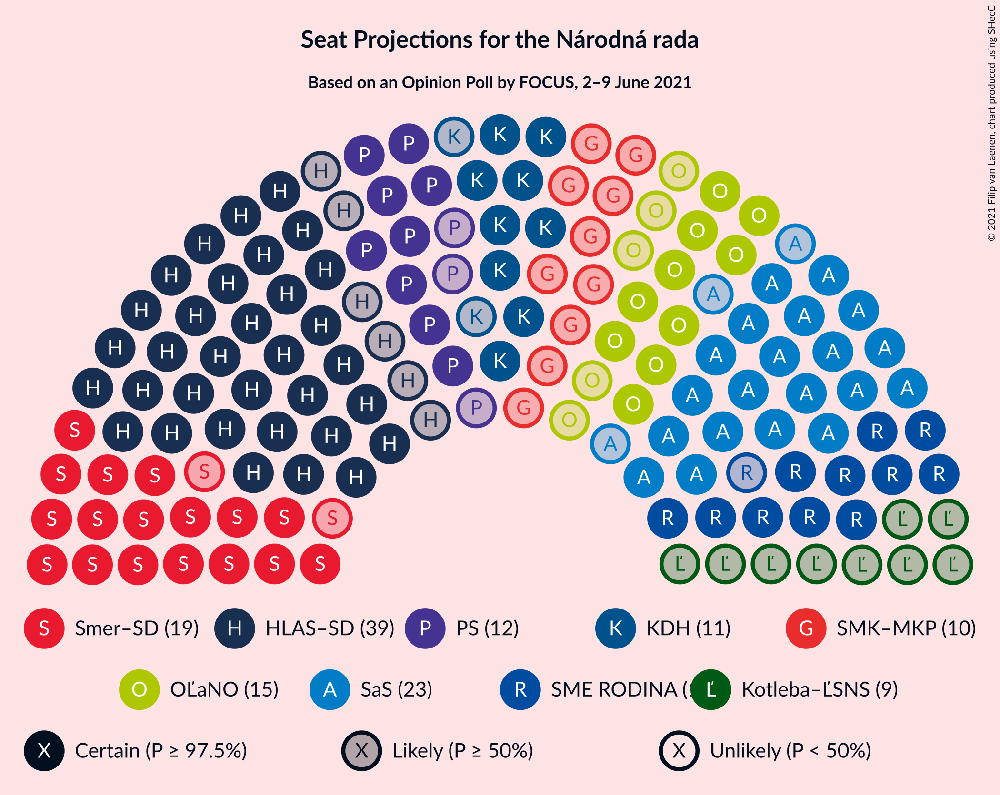
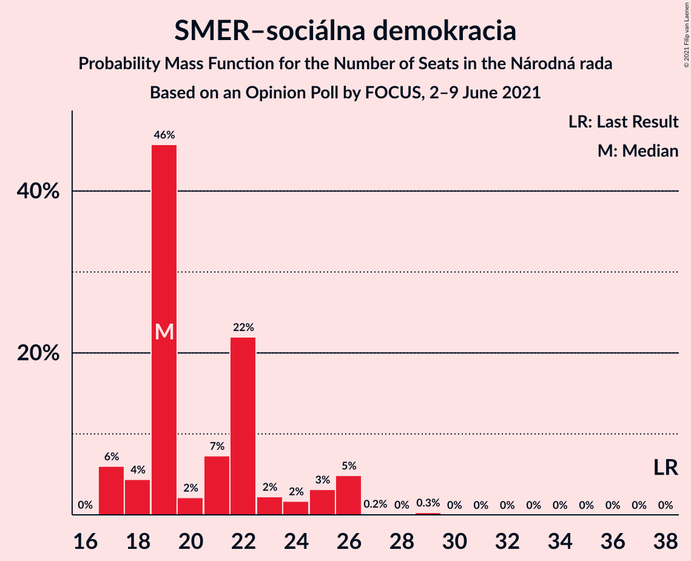
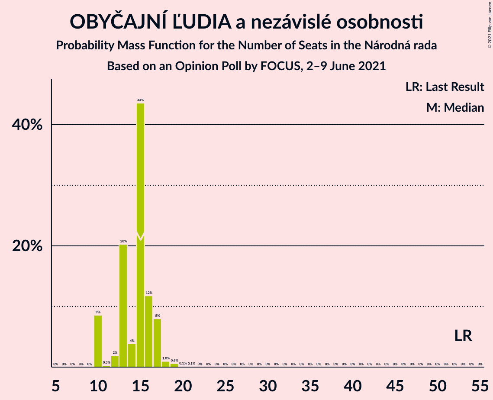
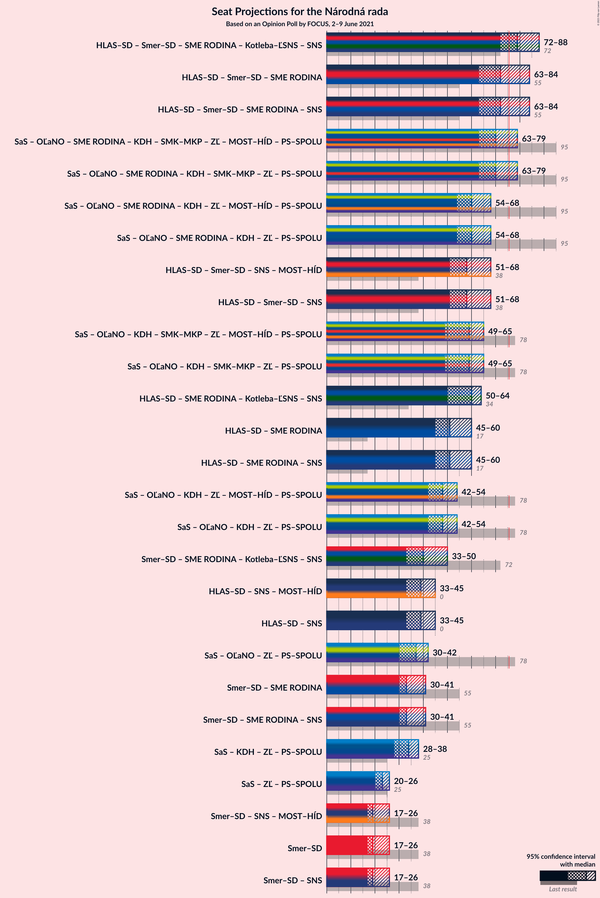
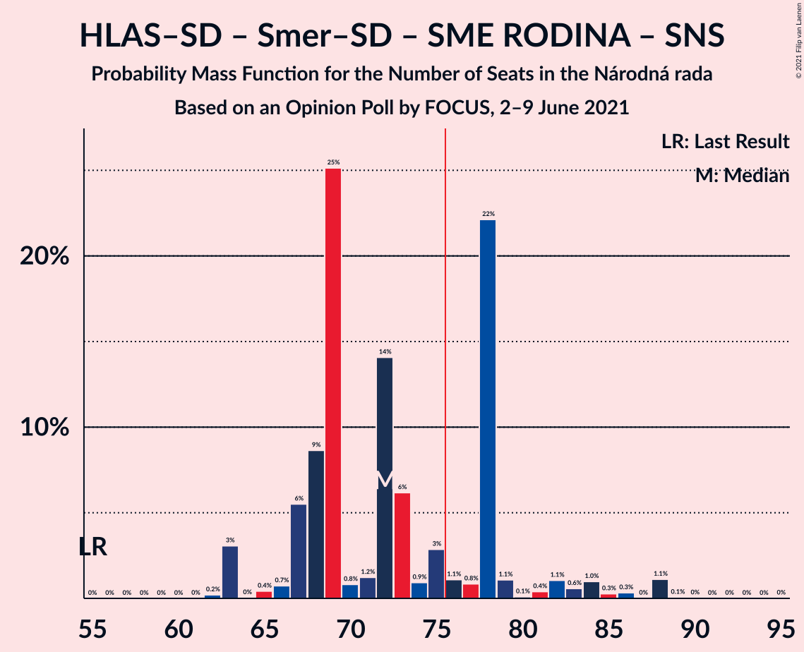
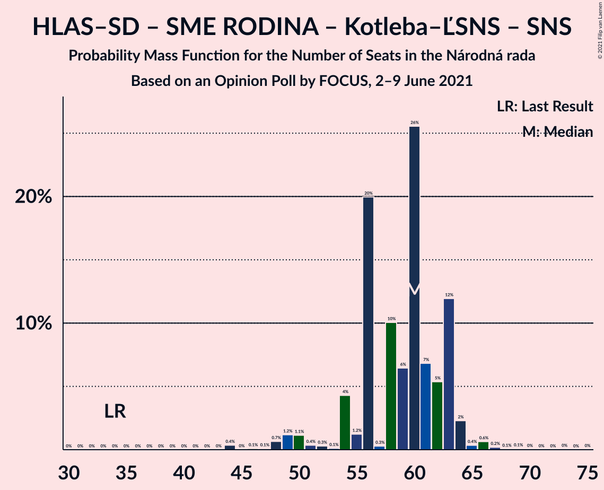
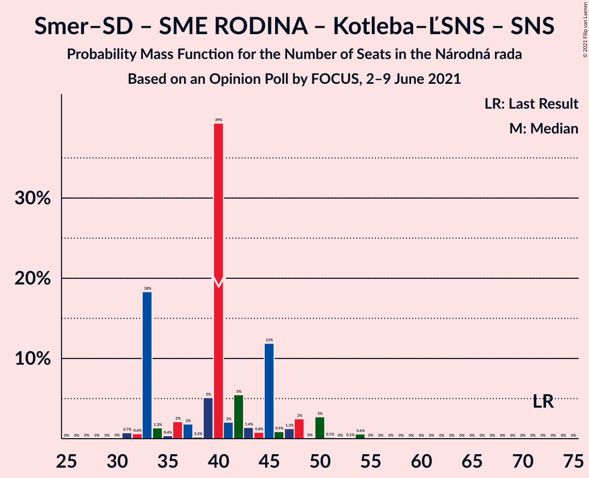

# Opinion Poll by FOCUS, 2–9 June 2021

<a href="#voting-intentions">Voting Intentions</a> | <a href="#seats">Seats</a> | <a href="#coalitions">Coalitions</a> | <a href="#technical-information">Technical Information</a>

## Voting Intentions

### Confidence Intervals

| Party | Last Result | Poll Result | 80% Confidence Interval | 90% Confidence Interval | 95% Confidence Interval | 99% Confidence Interval |
|:-----:|:-----------:|:-----------:|:-----------------------:|:-----------------------:|:-----------------------:|:-----------------------:|
| HLAS–sociálna demokracia | 0.0% | 21.6% | 20.0–23.3% |19.5–23.8% |19.1–24.2% |18.4–25.1% |
| Sloboda a Solidarita | 6.2% | 12.8% | 11.5–14.2% |11.1–14.6% |10.8–15.0% |10.3–15.7% |
| SMER–sociálna demokracia | 18.3% | 12.0% | 10.7–13.4% |10.4–13.8% |10.1–14.1% |9.5–14.8% |
| OBYČAJNÍ ĽUDIA a nezávislé osobnosti | 25.0% | 8.2% | 7.2–9.4% |6.9–9.8% |6.7–10.1% |6.2–10.7% |
| SME RODINA | 8.2% | 7.6% | 6.6–8.8% |6.4–9.1% |6.1–9.4% |5.7–10.0% |
| Progresívne Slovensko | 7.0% | 6.3% | 5.4–7.4% |5.2–7.7% |5.0–8.0% |4.6–8.6% |
| Kresťanskodemokratické hnutie | 4.6% | 5.8% | 5.0–6.9% |4.7–7.2% |4.5–7.5% |4.2–8.0% |
| Strana maďarskej koalície–Magyar Koalíció Pártja | 3.9% | 5.7% | 4.9–6.8% |4.7–7.1% |4.5–7.3% |4.1–7.9% |
| Kotleba–Ľudová strana Naše Slovensko | 8.0% | 4.8% | 4.1–5.8% |3.9–6.1% |3.7–6.4% |3.3–6.9% |
| REPUBLIKA | 0.0% | 4.6% | 3.9–5.6% |3.7–5.9% |3.5–6.1% |3.2–6.6% |
| Za ľudí | 5.8% | 3.4% | 2.7–4.2% |2.6–4.5% |2.4–4.7% |2.1–5.1% |
| Slovenská národná strana | 3.2% | 3.2% | 2.6–4.0% |2.4–4.2% |2.2–4.4% |2.0–4.9% |
| SPOLU–Občianska Demokracia | 7.0% | 1.5% | 1.1–2.1% |1.0–2.3% |0.9–2.4% |0.7–2.8% |
| Dobrá voľba | 3.1% | 1.3% | 0.9–1.9% |0.8–2.0% |0.7–2.2% |0.6–2.5% |

*Note:* The poll result column reflects the actual value used in the calculations. Published results may vary slightly, and in addition be rounded to fewer digits.

## Seats

### Confidence Intervals

| Party | Last Result | Median | 80% Confidence Interval | 90% Confidence Interval | 95% Confidence Interval | 99% Confidence Interval |
|:-----:|:-----------:|:------:|:-----------------------:|:-----------------------:|:-----------------------:|:-----------------------:|
| <a href="#hlas–sociálna-demokracia">HLAS–sociálna demokracia</a> | 0 | 39 | 36–45 |35–45 |33–45 |33–47 |
| <a href="#sloboda-a-solidarita">Sloboda a Solidarita</a> | 13 | 23 | 20–24 |20–25 |20–26 |19–28 |
| <a href="#smer–sociálna-demokracia">SMER–sociálna demokracia</a> | 38 | 19 | 18–24 |17–26 |17–26 |17–26 |
| <a href="#obyčajní-ľudia-a-nezávislé-osobnosti">OBYČAJNÍ ĽUDIA a nezávislé osobnosti</a> | 53 | 15 | 12–16 |10–17 |10–17 |10–19 |
| <a href="#sme-rodina">SME RODINA</a> | 17 | 12 | 11–16 |11–16 |11–17 |10–18 |
| <a href="#progresívne-slovensko">Progresívne Slovensko</a> | 0 | 12 | 10–13 |9–13 |9–13 |0–15 |
| <a href="#kresťanskodemokratické-hnutie">Kresťanskodemokratické hnutie</a> | 0 | 11 | 9–12 |9–12 |9–13 |0–15 |
| <a href="#strana-maďarskej-koalície–magyar-koalíció-pártja">Strana maďarskej koalície–Magyar Koalíció Pártja</a> | 0 | 10 | 9–12 |0–13 |0–13 |0–14 |
| <a href="#kotleba–ľudová-strana-naše-slovensko">Kotleba–Ľudová strana Naše Slovensko</a> | 17 | 9 | 0–10 |0–11 |0–11 |0–13 |
| <a href="#republika">REPUBLIKA</a> | 0 | 0 | 0–9 |0–9 |0–10 |0–12 |
| <a href="#za-ľudí">Za ľudí</a> | 12 | 0 | 0 |0 |0 |0 |
| <a href="#slovenská-národná-strana">Slovenská národná strana</a> | 0 | 0 | 0 |0 |0 |0 |
| <a href="#spolu–občianska-demokracia">SPOLU–Občianska Demokracia</a> | 0 | 0 | 0 |0 |0 |0 |
| <a href="#dobrá-voľba">Dobrá voľba</a> | 0 | 0 | 0 |0 |0 |0 |

### HLAS–sociálna demokracia

*For a full overview of the results for this party, see the [HLAS–sociálna demokracia](party-hlas–sociálnademokracia.html) page.*

| Number of Seats | Probability | Accumulated | Special Marks |
|:---------------:|:-----------:|:-----------:|:-------------:|
| 0 | 0% | 100% | Last Result |
| 1 | 0% | 100% |  |
| 2 | 0% | 100% |  |
| 3 | 0% | 100% |  |
| 4 | 0% | 100% |  |
| 5 | 0% | 100% |  |
| 6 | 0% | 100% |  |
| 7 | 0% | 100% |  |
| 8 | 0% | 100% |  |
| 9 | 0% | 100% |  |
| 10 | 0% | 100% |  |
| 11 | 0% | 100% |  |
| 12 | 0% | 100% |  |
| 13 | 0% | 100% |  |
| 14 | 0% | 100% |  |
| 15 | 0% | 100% |  |
| 16 | 0% | 100% |  |
| 17 | 0% | 100% |  |
| 18 | 0% | 100% |  |
| 19 | 0% | 100% |  |
| 20 | 0% | 100% |  |
| 21 | 0% | 100% |  |
| 22 | 0% | 100% |  |
| 23 | 0% | 100% |  |
| 24 | 0% | 100% |  |
| 25 | 0% | 100% |  |
| 26 | 0% | 100% |  |
| 27 | 0% | 100% |  |
| 28 | 0% | 100% |  |
| 29 | 0.2% | 100% |  |
| 30 | 0% | 99.8% |  |
| 31 | 0% | 99.8% |  |
| 32 | 0.1% | 99.8% |  |
| 33 | 4% | 99.7% |  |
| 34 | 0.9% | 96% |  |
| 35 | 0.9% | 95% |  |
| 36 | 6% | 94% |  |
| 37 | 22% | 88% |  |
| 38 | 8% | 66% |  |
| 39 | 27% | 58% | Median |
| 40 | 6% | 31% |  |
| 41 | 1.3% | 25% |  |
| 42 | 1.1% | 24% |  |
| 43 | 1.3% | 22% |  |
| 44 | 0.5% | 21% |  |
| 45 | 18% | 21% |  |
| 46 | 0% | 2% |  |
| 47 | 2% | 2% |  |
| 48 | 0.1% | 0.1% |  |
| 49 | 0% | 0.1% |  |
| 50 | 0% | 0.1% |  |
| 51 | 0% | 0% |  |

### Sloboda a Solidarita

*For a full overview of the results for this party, see the [Sloboda a Solidarita](party-slobodaasolidarita.html) page.*

| Number of Seats | Probability | Accumulated | Special Marks |
|:---------------:|:-----------:|:-----------:|:-------------:|
| 13 | 0% | 100% | Last Result |
| 14 | 0% | 100% |  |
| 15 | 0% | 100% |  |
| 16 | 0% | 100% |  |
| 17 | 0% | 100% |  |
| 18 | 0.2% | 99.9% |  |
| 19 | 1.5% | 99.8% |  |
| 20 | 12% | 98% |  |
| 21 | 5% | 87% |  |
| 22 | 16% | 82% |  |
| 23 | 32% | 65% | Median |
| 24 | 28% | 33% |  |
| 25 | 2% | 5% |  |
| 26 | 2% | 4% |  |
| 27 | 0.7% | 1.3% |  |
| 28 | 0.4% | 0.6% |  |
| 29 | 0.2% | 0.2% |  |
| 30 | 0% | 0% |  |

### SMER–sociálna demokracia

*For a full overview of the results for this party, see the [SMER–sociálna demokracia](party-smer–sociálnademokracia.html) page.*

| Number of Seats | Probability | Accumulated | Special Marks |
|:---------------:|:-----------:|:-----------:|:-------------:|
| 17 | 6% | 100% |  |
| 18 | 4% | 94% |  |
| 19 | 46% | 90% | Median |
| 20 | 2% | 44% |  |
| 21 | 7% | 42% |  |
| 22 | 22% | 34% |  |
| 23 | 2% | 12% |  |
| 24 | 2% | 10% |  |
| 25 | 3% | 8% |  |
| 26 | 5% | 5% |  |
| 27 | 0.2% | 0.5% |  |
| 28 | 0% | 0.3% |  |
| 29 | 0.3% | 0.3% |  |
| 30 | 0% | 0% |  |
| 31 | 0% | 0% |  |
| 32 | 0% | 0% |  |
| 33 | 0% | 0% |  |
| 34 | 0% | 0% |  |
| 35 | 0% | 0% |  |
| 36 | 0% | 0% |  |
| 37 | 0% | 0% |  |
| 38 | 0% | 0% | Last Result |

### OBYČAJNÍ ĽUDIA a nezávislé osobnosti

*For a full overview of the results for this party, see the [OBYČAJNÍ ĽUDIA a nezávislé osobnosti](party-obyčajníľudiaanezávisléosobnosti.html) page.*

| Number of Seats | Probability | Accumulated | Special Marks |
|:---------------:|:-----------:|:-----------:|:-------------:|
| 10 | 9% | 100% |  |
| 11 | 0.3% | 91% |  |
| 12 | 2% | 91% |  |
| 13 | 20% | 89% |  |
| 14 | 4% | 69% |  |
| 15 | 44% | 65% | Median |
| 16 | 12% | 22% |  |
| 17 | 8% | 10% |  |
| 18 | 1.0% | 2% |  |
| 19 | 0.6% | 0.8% |  |
| 20 | 0.1% | 0.2% |  |
| 21 | 0.1% | 0.1% |  |
| 22 | 0% | 0% |  |
| 23 | 0% | 0% |  |
| 24 | 0% | 0% |  |
| 25 | 0% | 0% |  |
| 26 | 0% | 0% |  |
| 27 | 0% | 0% |  |
| 28 | 0% | 0% |  |
| 29 | 0% | 0% |  |
| 30 | 0% | 0% |  |
| 31 | 0% | 0% |  |
| 32 | 0% | 0% |  |
| 33 | 0% | 0% |  |
| 34 | 0% | 0% |  |
| 35 | 0% | 0% |  |
| 36 | 0% | 0% |  |
| 37 | 0% | 0% |  |
| 38 | 0% | 0% |  |
| 39 | 0% | 0% |  |
| 40 | 0% | 0% |  |
| 41 | 0% | 0% |  |
| 42 | 0% | 0% |  |
| 43 | 0% | 0% |  |
| 44 | 0% | 0% |  |
| 45 | 0% | 0% |  |
| 46 | 0% | 0% |  |
| 47 | 0% | 0% |  |
| 48 | 0% | 0% |  |
| 49 | 0% | 0% |  |
| 50 | 0% | 0% |  |
| 51 | 0% | 0% |  |
| 52 | 0% | 0% |  |
| 53 | 0% | 0% | Last Result |

### SME RODINA

*For a full overview of the results for this party, see the [SME RODINA](party-smerodina.html) page.*

| Number of Seats | Probability | Accumulated | Special Marks |
|:---------------:|:-----------:|:-----------:|:-------------:|
| 9 | 0.1% | 100% |  |
| 10 | 1.1% | 99.8% |  |
| 11 | 43% | 98.7% |  |
| 12 | 20% | 55% | Median |
| 13 | 4% | 35% |  |
| 14 | 10% | 31% |  |
| 15 | 5% | 21% |  |
| 16 | 13% | 17% |  |
| 17 | 3% | 4% | Last Result |
| 18 | 0.5% | 0.9% |  |
| 19 | 0.3% | 0.4% |  |
| 20 | 0% | 0% |  |

### Progresívne Slovensko

*For a full overview of the results for this party, see the [Progresívne Slovensko](party-progresívneslovensko.html) page.*

| Number of Seats | Probability | Accumulated | Special Marks |
|:---------------:|:-----------:|:-----------:|:-------------:|
| 0 | 1.3% | 100% | Last Result |
| 1 | 0% | 98.7% |  |
| 2 | 0% | 98.7% |  |
| 3 | 0% | 98.7% |  |
| 4 | 0% | 98.7% |  |
| 5 | 0% | 98.7% |  |
| 6 | 0% | 98.7% |  |
| 7 | 0% | 98.7% |  |
| 8 | 0% | 98.7% |  |
| 9 | 7% | 98.7% |  |
| 10 | 8% | 92% |  |
| 11 | 4% | 84% |  |
| 12 | 66% | 80% | Median |
| 13 | 11% | 13% |  |
| 14 | 1.1% | 2% |  |
| 15 | 1.2% | 1.4% |  |
| 16 | 0.1% | 0.2% |  |
| 17 | 0% | 0.1% |  |
| 18 | 0% | 0% |  |

### Kresťanskodemokratické hnutie

*For a full overview of the results for this party, see the [Kresťanskodemokratické hnutie](party-kresťanskodemokratickéhnutie.html) page.*

| Number of Seats | Probability | Accumulated | Special Marks |
|:---------------:|:-----------:|:-----------:|:-------------:|
| 0 | 2% | 100% | Last Result |
| 1 | 0% | 98% |  |
| 2 | 0% | 98% |  |
| 3 | 0% | 98% |  |
| 4 | 0% | 98% |  |
| 5 | 0% | 98% |  |
| 6 | 0% | 98% |  |
| 7 | 0% | 98% |  |
| 8 | 0% | 98% |  |
| 9 | 19% | 98% |  |
| 10 | 12% | 78% |  |
| 11 | 46% | 67% | Median |
| 12 | 16% | 20% |  |
| 13 | 2% | 4% |  |
| 14 | 1.3% | 2% |  |
| 15 | 0.5% | 0.6% |  |
| 16 | 0.1% | 0.1% |  |
| 17 | 0% | 0% |  |

### Strana maďarskej koalície–Magyar Koalíció Pártja

*For a full overview of the results for this party, see the [Strana maďarskej koalície–Magyar Koalíció Pártja](party-stranamaďarskejkoalície–magyarkoalíciópártja.html) page.*

| Number of Seats | Probability | Accumulated | Special Marks |
|:---------------:|:-----------:|:-----------:|:-------------:|
| 0 | 7% | 100% | Last Result |
| 1 | 0% | 93% |  |
| 2 | 0% | 93% |  |
| 3 | 0% | 93% |  |
| 4 | 0% | 93% |  |
| 5 | 0% | 93% |  |
| 6 | 0% | 93% |  |
| 7 | 0% | 93% |  |
| 8 | 0% | 93% |  |
| 9 | 9% | 93% |  |
| 10 | 47% | 83% | Median |
| 11 | 12% | 36% |  |
| 12 | 19% | 24% |  |
| 13 | 3% | 5% |  |
| 14 | 2% | 2% |  |
| 15 | 0.4% | 0.4% |  |
| 16 | 0% | 0% |  |

### Kotleba–Ľudová strana Naše Slovensko

*For a full overview of the results for this party, see the [Kotleba–Ľudová strana Naše Slovensko](party-kotleba–ľudovástrananašeslovensko.html) page.*

| Number of Seats | Probability | Accumulated | Special Marks |
|:---------------:|:-----------:|:-----------:|:-------------:|
| 0 | 31% | 100% |  |
| 1 | 0% | 69% |  |
| 2 | 0% | 69% |  |
| 3 | 0% | 69% |  |
| 4 | 0% | 69% |  |
| 5 | 0% | 69% |  |
| 6 | 0% | 69% |  |
| 7 | 0% | 69% |  |
| 8 | 0% | 69% |  |
| 9 | 22% | 69% | Median |
| 10 | 41% | 47% |  |
| 11 | 5% | 6% |  |
| 12 | 0.4% | 1.1% |  |
| 13 | 0.6% | 0.8% |  |
| 14 | 0.2% | 0.2% |  |
| 15 | 0% | 0% |  |
| 16 | 0% | 0% |  |
| 17 | 0% | 0% | Last Result |

### REPUBLIKA

*For a full overview of the results for this party, see the [REPUBLIKA](party-republika.html) page.*

| Number of Seats | Probability | Accumulated | Special Marks |
|:---------------:|:-----------:|:-----------:|:-------------:|
| 0 | 83% | 100% | Last Result, Median |
| 1 | 0% | 17% |  |
| 2 | 0% | 17% |  |
| 3 | 0% | 17% |  |
| 4 | 0% | 17% |  |
| 5 | 0% | 17% |  |
| 6 | 0% | 17% |  |
| 7 | 0% | 17% |  |
| 8 | 0% | 17% |  |
| 9 | 14% | 17% |  |
| 10 | 2% | 3% |  |
| 11 | 0.4% | 1.2% |  |
| 12 | 0.6% | 0.8% |  |
| 13 | 0.1% | 0.2% |  |
| 14 | 0% | 0% |  |

### Za ľudí

*For a full overview of the results for this party, see the [Za ľudí](party-zaľudí.html) page.*

| Number of Seats | Probability | Accumulated | Special Marks |
|:---------------:|:-----------:|:-----------:|:-------------:|
| 0 | 99.7% | 100% | Median |
| 1 | 0% | 0.3% |  |
| 2 | 0% | 0.3% |  |
| 3 | 0% | 0.3% |  |
| 4 | 0% | 0.3% |  |
| 5 | 0% | 0.3% |  |
| 6 | 0% | 0.3% |  |
| 7 | 0% | 0.3% |  |
| 8 | 0% | 0.3% |  |
| 9 | 0.2% | 0.3% |  |
| 10 | 0% | 0% |  |
| 11 | 0% | 0% |  |
| 12 | 0% | 0% | Last Result |

### Slovenská národná strana

*For a full overview of the results for this party, see the [Slovenská národná strana](party-slovenskánárodnástrana.html) page.*

| Number of Seats | Probability | Accumulated | Special Marks |
|:---------------:|:-----------:|:-----------:|:-------------:|
| 0 | 99.9% | 100% | Last Result, Median |
| 1 | 0% | 0.1% |  |
| 2 | 0% | 0.1% |  |
| 3 | 0% | 0.1% |  |
| 4 | 0% | 0.1% |  |
| 5 | 0% | 0.1% |  |
| 6 | 0% | 0.1% |  |
| 7 | 0% | 0.1% |  |
| 8 | 0% | 0.1% |  |
| 9 | 0.1% | 0.1% |  |
| 10 | 0.1% | 0.1% |  |
| 11 | 0% | 0% |  |

### SPOLU–Občianska Demokracia

*For a full overview of the results for this party, see the [SPOLU–Občianska Demokracia](party-spolu–občianskademokracia.html) page.*

| Number of Seats | Probability | Accumulated | Special Marks |
|:---------------:|:-----------:|:-----------:|:-------------:|
| 0 | 100% | 100% | Last Result, Median |

### Dobrá voľba

*For a full overview of the results for this party, see the [Dobrá voľba](party-dobrávoľba.html) page.*

| Number of Seats | Probability | Accumulated | Special Marks |
|:---------------:|:-----------:|:-----------:|:-------------:|
| 0 | 100% | 100% | Last Result, Median |

## Coalitions

### Confidence Intervals

| Coalition | Last Result | Median | Majority? | 80% Confidence Interval | 90% Confidence Interval | 95% Confidence Interval | 99% Confidence Interval |
|:---------:|:-----------:|:------:|:---------:|:-----------------------:|:-----------------------:|:-----------------------:|:-----------------------:|
| HLAS–sociálna demokracia – SMER–sociálna demokracia – SME RODINA – Kotleba–Ľudová strana Naše Slovensko – Slovenská národná strana | 72 | 79 | 91% | 76–84 | 72–87 | 72–88 | 68–90 |
| HLAS–sociálna demokracia – SMER–sociálna demokracia – SME RODINA | 55 | 72 | 30% | 67–78 | 67–79 | 63–84 | 63–88 |
| HLAS–sociálna demokracia – SMER–sociálna demokracia – SME RODINA – Slovenská národná strana | 55 | 72 | 30% | 67–78 | 67–79 | 63–84 | 63–88 |
| HLAS–sociálna demokracia – SMER–sociálna demokracia – Slovenská národná strana | 38 | 58 | 0.1% | 55–67 | 53–67 | 51–68 | 51–73 |
| HLAS–sociálna demokracia – SME RODINA – Kotleba–Ľudová strana Naše Slovensko – Slovenská národná strana | 34 | 60 | 0% | 56–63 | 54–63 | 50–64 | 47–66 |
| HLAS–sociálna demokracia – SME RODINA | 17 | 51 | 0% | 49–56 | 48–58 | 45–60 | 44–64 |
| HLAS–sociálna demokracia – SME RODINA – Slovenská národná strana | 17 | 51 | 0% | 49–56 | 48–58 | 45–60 | 44–64 |
| SMER–sociálna demokracia – SME RODINA – Kotleba–Ľudová strana Naše Slovensko – Slovenská národná strana | 72 | 40 | 0% | 33–45 | 33–48 | 33–50 | 31–54 |
| HLAS–sociálna demokracia – Slovenská národná strana | 0 | 39 | 0% | 36–45 | 35–45 | 33–45 | 33–47 |
| SMER–sociálna demokracia – SME RODINA | 55 | 33 | 0% | 30–37 | 30–40 | 30–41 | 30–42 |
| SMER–sociálna demokracia – SME RODINA – Slovenská národná strana | 55 | 33 | 0% | 30–37 | 30–40 | 30–41 | 30–42 |
| SMER–sociálna demokracia | 38 | 19 | 0% | 18–24 | 17–26 | 17–26 | 17–26 |
| SMER–sociálna demokracia – Slovenská národná strana | 38 | 19 | 0% | 18–24 | 17–26 | 17–26 | 17–27 |

### HLAS–sociálna demokracia – SMER–sociálna demokracia – SME RODINA – Kotleba–Ľudová strana Naše Slovensko – Slovenská národná strana

| Number of Seats | Probability | Accumulated | Special Marks |
|:---------------:|:-----------:|:-----------:|:-------------:|
| 65 | 0.4% | 100% |  |
| 66 | 0% | 99.6% |  |
| 67 | 0% | 99.6% |  |
| 68 | 0.2% | 99.6% |  |
| 69 | 0.1% | 99.4% |  |
| 70 | 0.7% | 99.2% |  |
| 71 | 0.9% | 98.6% |  |
| 72 | 4% | 98% | Last Result |
| 73 | 2% | 94% |  |
| 74 | 0.2% | 92% |  |
| 75 | 0.4% | 92% |  |
| 76 | 6% | 91% | Majority |
| 77 | 8% | 85% |  |
| 78 | 20% | 77% |  |
| 79 | 26% | 57% | Median |
| 80 | 0.5% | 31% |  |
| 81 | 0.6% | 30% |  |
| 82 | 17% | 30% |  |
| 83 | 2% | 13% |  |
| 84 | 1.4% | 11% |  |
| 85 | 1.1% | 10% |  |
| 86 | 3% | 8% |  |
| 87 | 0.5% | 5% |  |
| 88 | 4% | 5% |  |
| 89 | 0.1% | 1.1% |  |
| 90 | 0.6% | 1.0% |  |
| 91 | 0.2% | 0.4% |  |
| 92 | 0% | 0.2% |  |
| 93 | 0.1% | 0.2% |  |
| 94 | 0% | 0.1% |  |
| 95 | 0% | 0.1% |  |
| 96 | 0% | 0% |  |

### HLAS–sociálna demokracia – SMER–sociálna demokracia – SME RODINA

| Number of Seats | Probability | Accumulated | Special Marks |
|:---------------:|:-----------:|:-----------:|:-------------:|
| 55 | 0% | 100% | Last Result |
| 56 | 0% | 100% |  |
| 57 | 0% | 100% |  |
| 58 | 0% | 100% |  |
| 59 | 0% | 100% |  |
| 60 | 0% | 100% |  |
| 61 | 0% | 100% |  |
| 62 | 0.2% | 100% |  |
| 63 | 3% | 99.8% |  |
| 64 | 0% | 97% |  |
| 65 | 0.4% | 97% |  |
| 66 | 0.8% | 96% |  |
| 67 | 6% | 95% |  |
| 68 | 9% | 90% |  |
| 69 | 25% | 81% |  |
| 70 | 0.8% | 56% | Median |
| 71 | 1.2% | 55% |  |
| 72 | 14% | 54% |  |
| 73 | 6% | 40% |  |
| 74 | 0.9% | 34% |  |
| 75 | 3% | 33% |  |
| 76 | 1.1% | 30% | Majority |
| 77 | 0.8% | 29% |  |
| 78 | 22% | 28% |  |
| 79 | 1.1% | 6% |  |
| 80 | 0.1% | 5% |  |
| 81 | 0.4% | 5% |  |
| 82 | 1.0% | 4% |  |
| 83 | 0.6% | 3% |  |
| 84 | 1.0% | 3% |  |
| 85 | 0.3% | 2% |  |
| 86 | 0.3% | 2% |  |
| 87 | 0% | 1.2% |  |
| 88 | 1.1% | 1.2% |  |
| 89 | 0% | 0.1% |  |
| 90 | 0% | 0.1% |  |
| 91 | 0% | 0% |  |

### HLAS–sociálna demokracia – SMER–sociálna demokracia – SME RODINA – Slovenská národná strana

| Number of Seats | Probability | Accumulated | Special Marks |
|:---------------:|:-----------:|:-----------:|:-------------:|
| 55 | 0% | 100% | Last Result |
| 56 | 0% | 100% |  |
| 57 | 0% | 100% |  |
| 58 | 0% | 100% |  |
| 59 | 0% | 100% |  |
| 60 | 0% | 100% |  |
| 61 | 0% | 100% |  |
| 62 | 0.2% | 100% |  |
| 63 | 3% | 99.8% |  |
| 64 | 0% | 97% |  |
| 65 | 0.4% | 97% |  |
| 66 | 0.7% | 96% |  |
| 67 | 6% | 96% |  |
| 68 | 9% | 90% |  |
| 69 | 25% | 81% |  |
| 70 | 0.8% | 56% | Median |
| 71 | 1.2% | 55% |  |
| 72 | 14% | 54% |  |
| 73 | 6% | 40% |  |
| 74 | 0.9% | 34% |  |
| 75 | 3% | 33% |  |
| 76 | 1.1% | 30% | Majority |
| 77 | 0.8% | 29% |  |
| 78 | 22% | 28% |  |
| 79 | 1.1% | 6% |  |
| 80 | 0.1% | 5% |  |
| 81 | 0.4% | 5% |  |
| 82 | 1.1% | 4% |  |
| 83 | 0.6% | 3% |  |
| 84 | 1.0% | 3% |  |
| 85 | 0.3% | 2% |  |
| 86 | 0.3% | 2% |  |
| 87 | 0% | 1.3% |  |
| 88 | 1.1% | 1.2% |  |
| 89 | 0.1% | 0.1% |  |
| 90 | 0% | 0.1% |  |
| 91 | 0% | 0% |  |

### HLAS–sociálna demokracia – SMER–sociálna demokracia – Slovenská národná strana

| Number of Seats | Probability | Accumulated | Special Marks |
|:---------------:|:-----------:|:-----------:|:-------------:|
| 38 | 0% | 100% | Last Result |
| 39 | 0% | 100% |  |
| 40 | 0% | 100% |  |
| 41 | 0% | 100% |  |
| 42 | 0% | 100% |  |
| 43 | 0% | 100% |  |
| 44 | 0% | 100% |  |
| 45 | 0% | 100% |  |
| 46 | 0% | 100% |  |
| 47 | 0% | 100% |  |
| 48 | 0% | 100% |  |
| 49 | 0% | 100% |  |
| 50 | 0.2% | 100% |  |
| 51 | 3% | 99.8% |  |
| 52 | 0.1% | 97% |  |
| 53 | 5% | 97% |  |
| 54 | 0.8% | 91% |  |
| 55 | 1.1% | 90% |  |
| 56 | 20% | 89% |  |
| 57 | 0.9% | 69% |  |
| 58 | 27% | 68% | Median |
| 59 | 1.1% | 41% |  |
| 60 | 2% | 40% |  |
| 61 | 6% | 38% |  |
| 62 | 1.3% | 31% |  |
| 63 | 3% | 30% |  |
| 64 | 4% | 27% |  |
| 65 | 0.1% | 23% |  |
| 66 | 0.9% | 23% |  |
| 67 | 19% | 22% |  |
| 68 | 0.7% | 3% |  |
| 69 | 0.4% | 2% |  |
| 70 | 0.4% | 2% |  |
| 71 | 0% | 2% |  |
| 72 | 0% | 2% |  |
| 73 | 1.4% | 1.5% |  |
| 74 | 0% | 0.1% |  |
| 75 | 0% | 0.1% |  |
| 76 | 0% | 0.1% | Majority |
| 77 | 0% | 0% |  |

### HLAS–sociálna demokracia – SME RODINA – Kotleba–Ľudová strana Naše Slovensko – Slovenská národná strana

| Number of Seats | Probability | Accumulated | Special Marks |
|:---------------:|:-----------:|:-----------:|:-------------:|
| 34 | 0% | 100% | Last Result |
| 35 | 0% | 100% |  |
| 36 | 0% | 100% |  |
| 37 | 0% | 100% |  |
| 38 | 0% | 100% |  |
| 39 | 0% | 100% |  |
| 40 | 0% | 100% |  |
| 41 | 0% | 100% |  |
| 42 | 0% | 100% |  |
| 43 | 0% | 100% |  |
| 44 | 0.4% | 100% |  |
| 45 | 0% | 99.6% |  |
| 46 | 0.1% | 99.6% |  |
| 47 | 0.1% | 99.5% |  |
| 48 | 0.7% | 99.4% |  |
| 49 | 1.2% | 98.8% |  |
| 50 | 1.1% | 98% |  |
| 51 | 0.4% | 96% |  |
| 52 | 0.3% | 96% |  |
| 53 | 0.1% | 96% |  |
| 54 | 4% | 96% |  |
| 55 | 1.2% | 91% |  |
| 56 | 20% | 90% |  |
| 57 | 0.3% | 70% |  |
| 58 | 10% | 70% |  |
| 59 | 6% | 60% |  |
| 60 | 26% | 53% | Median |
| 61 | 7% | 28% |  |
| 62 | 5% | 21% |  |
| 63 | 12% | 16% |  |
| 64 | 2% | 4% |  |
| 65 | 0.4% | 1.5% |  |
| 66 | 0.6% | 1.1% |  |
| 67 | 0.2% | 0.5% |  |
| 68 | 0.1% | 0.3% |  |
| 69 | 0.1% | 0.2% |  |
| 70 | 0% | 0.1% |  |
| 71 | 0% | 0.1% |  |
| 72 | 0% | 0.1% |  |
| 73 | 0% | 0.1% |  |
| 74 | 0% | 0% |  |

### HLAS–sociálna demokracia – SME RODINA

| Number of Seats | Probability | Accumulated | Special Marks |
|:---------------:|:-----------:|:-----------:|:-------------:|
| 17 | 0% | 100% | Last Result |
| 18 | 0% | 100% |  |
| 19 | 0% | 100% |  |
| 20 | 0% | 100% |  |
| 21 | 0% | 100% |  |
| 22 | 0% | 100% |  |
| 23 | 0% | 100% |  |
| 24 | 0% | 100% |  |
| 25 | 0% | 100% |  |
| 26 | 0% | 100% |  |
| 27 | 0% | 100% |  |
| 28 | 0% | 100% |  |
| 29 | 0% | 100% |  |
| 30 | 0% | 100% |  |
| 31 | 0% | 100% |  |
| 32 | 0% | 100% |  |
| 33 | 0% | 100% |  |
| 34 | 0% | 100% |  |
| 35 | 0% | 100% |  |
| 36 | 0% | 100% |  |
| 37 | 0% | 100% |  |
| 38 | 0% | 100% |  |
| 39 | 0% | 100% |  |
| 40 | 0% | 100% |  |
| 41 | 0.2% | 100% |  |
| 42 | 0% | 99.8% |  |
| 43 | 0% | 99.8% |  |
| 44 | 0.4% | 99.8% |  |
| 45 | 4% | 99.4% |  |
| 46 | 0.3% | 96% |  |
| 47 | 0.2% | 95% |  |
| 48 | 0.8% | 95% |  |
| 49 | 10% | 94% |  |
| 50 | 34% | 85% |  |
| 51 | 2% | 51% | Median |
| 52 | 8% | 49% |  |
| 53 | 12% | 41% |  |
| 54 | 2% | 29% |  |
| 55 | 1.3% | 27% |  |
| 56 | 20% | 25% |  |
| 57 | 0.2% | 5% |  |
| 58 | 2% | 5% |  |
| 59 | 0.7% | 3% |  |
| 60 | 0.4% | 3% |  |
| 61 | 0% | 2% |  |
| 62 | 1.5% | 2% |  |
| 63 | 0.1% | 0.7% |  |
| 64 | 0.6% | 0.6% |  |
| 65 | 0% | 0.1% |  |
| 66 | 0% | 0.1% |  |
| 67 | 0% | 0% |  |

### HLAS–sociálna demokracia – SME RODINA – Slovenská národná strana

| Number of Seats | Probability | Accumulated | Special Marks |
|:---------------:|:-----------:|:-----------:|:-------------:|
| 17 | 0% | 100% | Last Result |
| 18 | 0% | 100% |  |
| 19 | 0% | 100% |  |
| 20 | 0% | 100% |  |
| 21 | 0% | 100% |  |
| 22 | 0% | 100% |  |
| 23 | 0% | 100% |  |
| 24 | 0% | 100% |  |
| 25 | 0% | 100% |  |
| 26 | 0% | 100% |  |
| 27 | 0% | 100% |  |
| 28 | 0% | 100% |  |
| 29 | 0% | 100% |  |
| 30 | 0% | 100% |  |
| 31 | 0% | 100% |  |
| 32 | 0% | 100% |  |
| 33 | 0% | 100% |  |
| 34 | 0% | 100% |  |
| 35 | 0% | 100% |  |
| 36 | 0% | 100% |  |
| 37 | 0% | 100% |  |
| 38 | 0% | 100% |  |
| 39 | 0% | 100% |  |
| 40 | 0% | 100% |  |
| 41 | 0.2% | 100% |  |
| 42 | 0% | 99.8% |  |
| 43 | 0% | 99.8% |  |
| 44 | 0.4% | 99.8% |  |
| 45 | 4% | 99.4% |  |
| 46 | 0.3% | 96% |  |
| 47 | 0.2% | 95% |  |
| 48 | 0.8% | 95% |  |
| 49 | 10% | 94% |  |
| 50 | 34% | 85% |  |
| 51 | 2% | 51% | Median |
| 52 | 8% | 49% |  |
| 53 | 12% | 41% |  |
| 54 | 2% | 29% |  |
| 55 | 1.2% | 27% |  |
| 56 | 20% | 25% |  |
| 57 | 0.2% | 5% |  |
| 58 | 2% | 5% |  |
| 59 | 0.7% | 3% |  |
| 60 | 0.4% | 3% |  |
| 61 | 0% | 2% |  |
| 62 | 1.5% | 2% |  |
| 63 | 0.1% | 0.8% |  |
| 64 | 0.6% | 0.7% |  |
| 65 | 0.1% | 0.1% |  |
| 66 | 0% | 0.1% |  |
| 67 | 0% | 0% |  |

### SMER–sociálna demokracia – SME RODINA – Kotleba–Ľudová strana Naše Slovensko – Slovenská národná strana

| Number of Seats | Probability | Accumulated | Special Marks |
|:---------------:|:-----------:|:-----------:|:-------------:|
| 29 | 0% | 100% |  |
| 30 | 0% | 99.9% |  |
| 31 | 0.7% | 99.9% |  |
| 32 | 0.6% | 99.2% |  |
| 33 | 18% | 98.5% |  |
| 34 | 1.3% | 80% |  |
| 35 | 0.4% | 79% |  |
| 36 | 2% | 78% |  |
| 37 | 2% | 76% |  |
| 38 | 0.2% | 75% |  |
| 39 | 5% | 74% |  |
| 40 | 39% | 69% | Median |
| 41 | 2% | 30% |  |
| 42 | 5% | 28% |  |
| 43 | 1.4% | 22% |  |
| 44 | 0.8% | 21% |  |
| 45 | 12% | 20% |  |
| 46 | 0.9% | 8% |  |
| 47 | 1.3% | 7% |  |
| 48 | 2% | 6% |  |
| 49 | 0% | 4% |  |
| 50 | 3% | 4% |  |
| 51 | 0.1% | 0.9% |  |
| 52 | 0% | 0.7% |  |
| 53 | 0.1% | 0.7% |  |
| 54 | 0.6% | 0.6% |  |
| 55 | 0% | 0% |  |
| 56 | 0% | 0% |  |
| 57 | 0% | 0% |  |
| 58 | 0% | 0% |  |
| 59 | 0% | 0% |  |
| 60 | 0% | 0% |  |
| 61 | 0% | 0% |  |
| 62 | 0% | 0% |  |
| 63 | 0% | 0% |  |
| 64 | 0% | 0% |  |
| 65 | 0% | 0% |  |
| 66 | 0% | 0% |  |
| 67 | 0% | 0% |  |
| 68 | 0% | 0% |  |
| 69 | 0% | 0% |  |
| 70 | 0% | 0% |  |
| 71 | 0% | 0% |  |
| 72 | 0% | 0% | Last Result |

### HLAS–sociálna demokracia – Slovenská národná strana

| Number of Seats | Probability | Accumulated | Special Marks |
|:---------------:|:-----------:|:-----------:|:-------------:|
| 0 | 0% | 100% | Last Result |
| 1 | 0% | 100% |  |
| 2 | 0% | 100% |  |
| 3 | 0% | 100% |  |
| 4 | 0% | 100% |  |
| 5 | 0% | 100% |  |
| 6 | 0% | 100% |  |
| 7 | 0% | 100% |  |
| 8 | 0% | 100% |  |
| 9 | 0% | 100% |  |
| 10 | 0% | 100% |  |
| 11 | 0% | 100% |  |
| 12 | 0% | 100% |  |
| 13 | 0% | 100% |  |
| 14 | 0% | 100% |  |
| 15 | 0% | 100% |  |
| 16 | 0% | 100% |  |
| 17 | 0% | 100% |  |
| 18 | 0% | 100% |  |
| 19 | 0% | 100% |  |
| 20 | 0% | 100% |  |
| 21 | 0% | 100% |  |
| 22 | 0% | 100% |  |
| 23 | 0% | 100% |  |
| 24 | 0% | 100% |  |
| 25 | 0% | 100% |  |
| 26 | 0% | 100% |  |
| 27 | 0% | 100% |  |
| 28 | 0% | 100% |  |
| 29 | 0.2% | 100% |  |
| 30 | 0% | 99.8% |  |
| 31 | 0% | 99.8% |  |
| 32 | 0.1% | 99.8% |  |
| 33 | 4% | 99.7% |  |
| 34 | 0.9% | 96% |  |
| 35 | 0.8% | 95% |  |
| 36 | 6% | 94% |  |
| 37 | 22% | 88% |  |
| 38 | 7% | 66% |  |
| 39 | 27% | 58% | Median |
| 40 | 6% | 31% |  |
| 41 | 1.4% | 25% |  |
| 42 | 1.1% | 24% |  |
| 43 | 1.3% | 23% |  |
| 44 | 0.5% | 21% |  |
| 45 | 18% | 21% |  |
| 46 | 0% | 2% |  |
| 47 | 2% | 2% |  |
| 48 | 0.1% | 0.2% |  |
| 49 | 0.1% | 0.2% |  |
| 50 | 0% | 0.1% |  |
| 51 | 0% | 0% |  |

### SMER–sociálna demokracia – SME RODINA

| Number of Seats | Probability | Accumulated | Special Marks |
|:---------------:|:-----------:|:-----------:|:-------------:|
| 27 | 0% | 100% |  |
| 28 | 0% | 99.9% |  |
| 29 | 0.1% | 99.9% |  |
| 30 | 28% | 99.8% |  |
| 31 | 15% | 72% | Median |
| 32 | 2% | 57% |  |
| 33 | 24% | 55% |  |
| 34 | 2% | 31% |  |
| 35 | 12% | 30% |  |
| 36 | 4% | 17% |  |
| 37 | 5% | 14% |  |
| 38 | 0.3% | 9% |  |
| 39 | 2% | 9% |  |
| 40 | 4% | 7% |  |
| 41 | 2% | 3% |  |
| 42 | 0.2% | 0.6% |  |
| 43 | 0.1% | 0.4% |  |
| 44 | 0.3% | 0.3% |  |
| 45 | 0% | 0% |  |
| 46 | 0% | 0% |  |
| 47 | 0% | 0% |  |
| 48 | 0% | 0% |  |
| 49 | 0% | 0% |  |
| 50 | 0% | 0% |  |
| 51 | 0% | 0% |  |
| 52 | 0% | 0% |  |
| 53 | 0% | 0% |  |
| 54 | 0% | 0% |  |
| 55 | 0% | 0% | Last Result |

### SMER–sociálna demokracia – SME RODINA – Slovenská národná strana

| Number of Seats | Probability | Accumulated | Special Marks |
|:---------------:|:-----------:|:-----------:|:-------------:|
| 27 | 0% | 100% |  |
| 28 | 0% | 99.9% |  |
| 29 | 0.1% | 99.9% |  |
| 30 | 28% | 99.8% |  |
| 31 | 15% | 72% | Median |
| 32 | 2% | 57% |  |
| 33 | 24% | 55% |  |
| 34 | 2% | 31% |  |
| 35 | 12% | 30% |  |
| 36 | 4% | 17% |  |
| 37 | 5% | 14% |  |
| 38 | 0.3% | 9% |  |
| 39 | 2% | 9% |  |
| 40 | 4% | 7% |  |
| 41 | 2% | 3% |  |
| 42 | 0.2% | 0.7% |  |
| 43 | 0.1% | 0.5% |  |
| 44 | 0.3% | 0.4% |  |
| 45 | 0% | 0.1% |  |
| 46 | 0% | 0.1% |  |
| 47 | 0% | 0.1% |  |
| 48 | 0% | 0.1% |  |
| 49 | 0% | 0.1% |  |
| 50 | 0% | 0.1% |  |
| 51 | 0% | 0% |  |
| 52 | 0% | 0% |  |
| 53 | 0% | 0% |  |
| 54 | 0% | 0% |  |
| 55 | 0% | 0% | Last Result |

### SMER–sociálna demokracia

| Number of Seats | Probability | Accumulated | Special Marks |
|:---------------:|:-----------:|:-----------:|:-------------:|
| 17 | 6% | 100% |  |
| 18 | 4% | 94% |  |
| 19 | 46% | 90% | Median |
| 20 | 2% | 44% |  |
| 21 | 7% | 42% |  |
| 22 | 22% | 34% |  |
| 23 | 2% | 12% |  |
| 24 | 2% | 10% |  |
| 25 | 3% | 8% |  |
| 26 | 5% | 5% |  |
| 27 | 0.2% | 0.5% |  |
| 28 | 0% | 0.3% |  |
| 29 | 0.3% | 0.3% |  |
| 30 | 0% | 0% |  |
| 31 | 0% | 0% |  |
| 32 | 0% | 0% |  |
| 33 | 0% | 0% |  |
| 34 | 0% | 0% |  |
| 35 | 0% | 0% |  |
| 36 | 0% | 0% |  |
| 37 | 0% | 0% |  |
| 38 | 0% | 0% | Last Result |

### SMER–sociálna demokracia – Slovenská národná strana

| Number of Seats | Probability | Accumulated | Special Marks |
|:---------------:|:-----------:|:-----------:|:-------------:|
| 17 | 6% | 100% |  |
| 18 | 4% | 94% |  |
| 19 | 46% | 90% | Median |
| 20 | 2% | 44% |  |
| 21 | 7% | 42% |  |
| 22 | 22% | 34% |  |
| 23 | 2% | 13% |  |
| 24 | 2% | 10% |  |
| 25 | 3% | 9% |  |
| 26 | 5% | 5% |  |
| 27 | 0.2% | 0.6% |  |
| 28 | 0% | 0.4% |  |
| 29 | 0.3% | 0.4% |  |
| 30 | 0% | 0.1% |  |
| 31 | 0% | 0.1% |  |
| 32 | 0% | 0.1% |  |
| 33 | 0% | 0.1% |  |
| 34 | 0% | 0.1% |  |
| 35 | 0% | 0% |  |
| 36 | 0% | 0% |  |
| 37 | 0% | 0% |  |
| 38 | 0% | 0% | Last Result |

## Technical Information

### Opinion Poll

+ **Polling firm:** FOCUS
+ **Commissioner(s):** —
+ **Fieldwork period:** 2–9 June 2021

### Calculations

+ **Sample size:** 1011
+ **Simulations done:** 1,048,576
+ **Error estimate:** 1.86%

