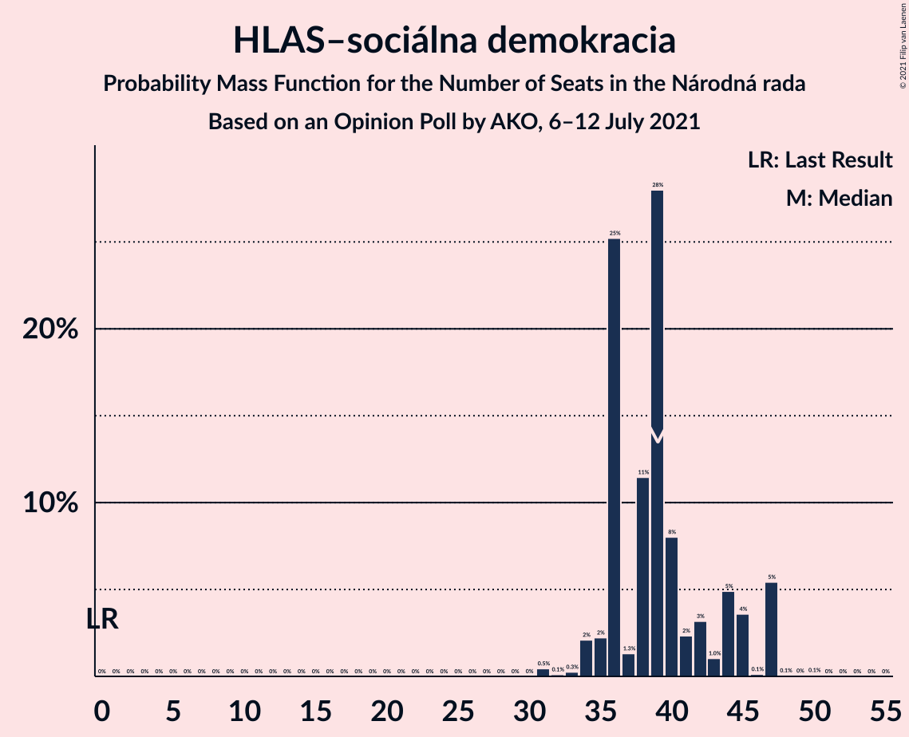

# Opinion Poll by AKO, 6–12 July 2021

<a href="#voting-intentions">Voting Intentions</a> | <a href="#seats">Seats</a> | <a href="#coalitions">Coalitions</a> | <a href="#technical-information">Technical Information</a>

## Voting Intentions

### Confidence Intervals

| Party | Last Result | Poll Result | 80% Confidence Interval | 90% Confidence Interval | 95% Confidence Interval | 99% Confidence Interval |
|:-----:|:-----------:|:-----------:|:-----------------------:|:-----------------------:|:-----------------------:|:-----------------------:|
| HLAS–sociálna demokracia | 0.0% | 20.8% | 19.2–22.5% |18.8–23.0% |18.4–23.4% |17.7–24.3% |
| Sloboda a Solidarita | 6.2% | 13.8% | 12.5–15.3% |12.1–15.7% |11.8–16.1% |11.2–16.8% |
| SMER–sociálna demokracia | 18.3% | 10.9% | 9.7–12.3% |9.4–12.7% |9.1–13.0% |8.6–13.7% |
| OBYČAJNÍ ĽUDIA a nezávislé osobnosti | 25.0% | 8.8% | 7.7–10.1% |7.4–10.4% |7.2–10.7% |6.7–11.4% |
| Progresívne Slovensko | 7.0% | 8.4% | 7.4–9.6% |7.1–10.0% |6.8–10.3% |6.4–10.9% |
| SME RODINA | 8.2% | 7.8% | 6.8–9.0% |6.5–9.3% |6.3–9.6% |5.8–10.2% |
| Kresťanskodemokratické hnutie | 4.6% | 6.2% | 5.3–7.3% |5.1–7.6% |4.9–7.9% |4.5–8.4% |
| Strana maďarskej koalície–Magyar Koalíció Pártja | 3.9% | 4.3% | 3.6–5.2% |3.4–5.5% |3.2–5.7% |2.9–6.2% |
| REPUBLIKA | 0.0% | 3.8% | 3.1–4.7% |2.9–5.0% |2.8–5.2% |2.5–5.6% |
| Kotleba–Ľudová strana Naše Slovensko | 8.0% | 3.5% | 2.9–4.4% |2.7–4.6% |2.5–4.8% |2.2–5.3% |
| Slovenská národná strana | 3.2% | 3.4% | 2.8–4.3% |2.6–4.5% |2.4–4.7% |2.2–5.2% |
| Za ľudí | 5.8% | 3.1% | 2.5–3.9% |2.3–4.2% |2.2–4.4% |1.9–4.8% |
| SPOLU–Občianska Demokracia | 7.0% | 1.9% | 1.4–2.6% |1.3–2.8% |1.2–3.0% |1.0–3.3% |
| Dobrá voľba | 3.1% | 1.9% | 1.4–2.6% |1.3–2.8% |1.2–3.0% |1.0–3.3% |

*Note:* The poll result column reflects the actual value used in the calculations. Published results may vary slightly, and in addition be rounded to fewer digits.

## Seats

### Confidence Intervals

| Party | Last Result | Median | 80% Confidence Interval | 90% Confidence Interval | 95% Confidence Interval | 99% Confidence Interval |
|:-----:|:-----------:|:------:|:-----------------------:|:-----------------------:|:-----------------------:|:-----------------------:|
| <a href="#hlas–sociálna-demokracia">HLAS–sociálna demokracia</a> | 0 | 39 | 36–44 |35–47 |34–47 |32–47 |
| <a href="#sloboda-a-solidarita">Sloboda a Solidarita</a> | 13 | 26 | 24–30 |23–31 |22–31 |21–33 |
| <a href="#smer–sociálna-demokracia">SMER–sociálna demokracia</a> | 38 | 22 | 19–25 |18–25 |17–25 |16–26 |
| <a href="#obyčajní-ľudia-a-nezávislé-osobnosti">OBYČAJNÍ ĽUDIA a nezávislé osobnosti</a> | 53 | 17 | 13–20 |13–20 |13–21 |13–23 |
| <a href="#progresívne-slovensko">Progresívne Slovensko</a> | 0 | 18 | 14–19 |13–19 |13–20 |13–21 |
| <a href="#sme-rodina">SME RODINA</a> | 17 | 15 | 12–18 |12–18 |12–19 |11–20 |
| <a href="#kresťanskodemokratické-hnutie">Kresťanskodemokratické hnutie</a> | 0 | 12 | 10–13 |0–14 |0–15 |0–16 |
| <a href="#strana-maďarskej-koalície–magyar-koalíció-pártja">Strana maďarskej koalície–Magyar Koalíció Pártja</a> | 0 | 0 | 0–10 |0–10 |0–11 |0–12 |
| <a href="#republika">REPUBLIKA</a> | 0 | 0 | 0 |0 |0–9 |0–11 |
| <a href="#kotleba–ľudová-strana-naše-slovensko">Kotleba–Ľudová strana Naše Slovensko</a> | 17 | 0 | 0 |0 |0 |0–10 |
| <a href="#slovenská-národná-strana">Slovenská národná strana</a> | 0 | 0 | 0 |0 |0 |0–10 |
| <a href="#za-ľudí">Za ľudí</a> | 12 | 0 | 0 |0 |0 |0–10 |
| <a href="#spolu–občianska-demokracia">SPOLU–Občianska Demokracia</a> | 0 | 0 | 0 |0 |0 |0 |
| <a href="#dobrá-voľba">Dobrá voľba</a> | 0 | 0 | 0 |0 |0 |0 |

### HLAS–sociálna demokracia

*For a full overview of the results for this party, see the [HLAS–sociálna demokracia](party-hlas–sociálnademokracia.html) page.*

| Number of Seats | Probability | Accumulated | Special Marks |
|:---------------:|:-----------:|:-----------:|:-------------:|
| 0 | 0% | 100% | Last Result |
| 1 | 0% | 100% |  |
| 2 | 0% | 100% |  |
| 3 | 0% | 100% |  |
| 4 | 0% | 100% |  |
| 5 | 0% | 100% |  |
| 6 | 0% | 100% |  |
| 7 | 0% | 100% |  |
| 8 | 0% | 100% |  |
| 9 | 0% | 100% |  |
| 10 | 0% | 100% |  |
| 11 | 0% | 100% |  |
| 12 | 0% | 100% |  |
| 13 | 0% | 100% |  |
| 14 | 0% | 100% |  |
| 15 | 0% | 100% |  |
| 16 | 0% | 100% |  |
| 17 | 0% | 100% |  |
| 18 | 0% | 100% |  |
| 19 | 0% | 100% |  |
| 20 | 0% | 100% |  |
| 21 | 0% | 100% |  |
| 22 | 0% | 100% |  |
| 23 | 0% | 100% |  |
| 24 | 0% | 100% |  |
| 25 | 0% | 100% |  |
| 26 | 0% | 100% |  |
| 27 | 0% | 100% |  |
| 28 | 0% | 100% |  |
| 29 | 0% | 100% |  |
| 30 | 0% | 100% |  |
| 31 | 0.5% | 100% |  |
| 32 | 0.1% | 99.5% |  |
| 33 | 0.3% | 99.4% |  |
| 34 | 2% | 99.2% |  |
| 35 | 2% | 97% |  |
| 36 | 25% | 95% |  |
| 37 | 1.3% | 70% |  |
| 38 | 11% | 68% |  |
| 39 | 28% | 57% | Median |
| 40 | 8% | 29% |  |
| 41 | 2% | 21% |  |
| 42 | 3% | 18% |  |
| 43 | 1.0% | 15% |  |
| 44 | 5% | 14% |  |
| 45 | 4% | 9% |  |
| 46 | 0.1% | 6% |  |
| 47 | 5% | 6% |  |
| 48 | 0.1% | 0.2% |  |
| 49 | 0% | 0.1% |  |
| 50 | 0.1% | 0.1% |  |
| 51 | 0% | 0% |  |

### Sloboda a Solidarita

*For a full overview of the results for this party, see the [Sloboda a Solidarita](party-slobodaasolidarita.html) page.*

| Number of Seats | Probability | Accumulated | Special Marks |
|:---------------:|:-----------:|:-----------:|:-------------:|
| 13 | 0% | 100% | Last Result |
| 14 | 0% | 100% |  |
| 15 | 0% | 100% |  |
| 16 | 0% | 100% |  |
| 17 | 0% | 100% |  |
| 18 | 0% | 100% |  |
| 19 | 0.1% | 100% |  |
| 20 | 0.4% | 99.9% |  |
| 21 | 0.4% | 99.5% |  |
| 22 | 4% | 99.2% |  |
| 23 | 2% | 96% |  |
| 24 | 5% | 94% |  |
| 25 | 14% | 88% |  |
| 26 | 39% | 75% | Median |
| 27 | 6% | 36% |  |
| 28 | 10% | 30% |  |
| 29 | 10% | 20% |  |
| 30 | 0.9% | 10% |  |
| 31 | 7% | 10% |  |
| 32 | 1.0% | 2% |  |
| 33 | 1.2% | 1.3% |  |
| 34 | 0% | 0.1% |  |
| 35 | 0.1% | 0.1% |  |
| 36 | 0% | 0% |  |

### SMER–sociálna demokracia

*For a full overview of the results for this party, see the [SMER–sociálna demokracia](party-smer–sociálnademokracia.html) page.*

| Number of Seats | Probability | Accumulated | Special Marks |
|:---------------:|:-----------:|:-----------:|:-------------:|
| 15 | 0.2% | 100% |  |
| 16 | 1.0% | 99.8% |  |
| 17 | 3% | 98.7% |  |
| 18 | 2% | 95% |  |
| 19 | 10% | 94% |  |
| 20 | 11% | 84% |  |
| 21 | 12% | 72% |  |
| 22 | 20% | 60% | Median |
| 23 | 7% | 40% |  |
| 24 | 11% | 33% |  |
| 25 | 21% | 22% |  |
| 26 | 1.4% | 2% |  |
| 27 | 0.1% | 0.2% |  |
| 28 | 0% | 0.1% |  |
| 29 | 0% | 0% |  |
| 30 | 0% | 0% |  |
| 31 | 0% | 0% |  |
| 32 | 0% | 0% |  |
| 33 | 0% | 0% |  |
| 34 | 0% | 0% |  |
| 35 | 0% | 0% |  |
| 36 | 0% | 0% |  |
| 37 | 0% | 0% |  |
| 38 | 0% | 0% | Last Result |

### OBYČAJNÍ ĽUDIA a nezávislé osobnosti

*For a full overview of the results for this party, see the [OBYČAJNÍ ĽUDIA a nezávislé osobnosti](party-obyčajníľudiaanezávisléosobnosti.html) page.*

| Number of Seats | Probability | Accumulated | Special Marks |
|:---------------:|:-----------:|:-----------:|:-------------:|
| 12 | 0.2% | 100% |  |
| 13 | 10% | 99.7% |  |
| 14 | 6% | 90% |  |
| 15 | 8% | 84% |  |
| 16 | 12% | 76% |  |
| 17 | 30% | 64% | Median |
| 18 | 3% | 34% |  |
| 19 | 17% | 30% |  |
| 20 | 10% | 13% |  |
| 21 | 2% | 3% |  |
| 22 | 0.5% | 1.1% |  |
| 23 | 0.2% | 0.6% |  |
| 24 | 0.3% | 0.4% |  |
| 25 | 0% | 0% |  |
| 26 | 0% | 0% |  |
| 27 | 0% | 0% |  |
| 28 | 0% | 0% |  |
| 29 | 0% | 0% |  |
| 30 | 0% | 0% |  |
| 31 | 0% | 0% |  |
| 32 | 0% | 0% |  |
| 33 | 0% | 0% |  |
| 34 | 0% | 0% |  |
| 35 | 0% | 0% |  |
| 36 | 0% | 0% |  |
| 37 | 0% | 0% |  |
| 38 | 0% | 0% |  |
| 39 | 0% | 0% |  |
| 40 | 0% | 0% |  |
| 41 | 0% | 0% |  |
| 42 | 0% | 0% |  |
| 43 | 0% | 0% |  |
| 44 | 0% | 0% |  |
| 45 | 0% | 0% |  |
| 46 | 0% | 0% |  |
| 47 | 0% | 0% |  |
| 48 | 0% | 0% |  |
| 49 | 0% | 0% |  |
| 50 | 0% | 0% |  |
| 51 | 0% | 0% |  |
| 52 | 0% | 0% |  |
| 53 | 0% | 0% | Last Result |

### Progresívne Slovensko

*For a full overview of the results for this party, see the [Progresívne Slovensko](party-progresívneslovensko.html) page.*

| Number of Seats | Probability | Accumulated | Special Marks |
|:---------------:|:-----------:|:-----------:|:-------------:|
| 0 | 0% | 100% | Last Result |
| 1 | 0% | 100% |  |
| 2 | 0% | 100% |  |
| 3 | 0% | 100% |  |
| 4 | 0% | 100% |  |
| 5 | 0% | 100% |  |
| 6 | 0% | 100% |  |
| 7 | 0% | 100% |  |
| 8 | 0% | 100% |  |
| 9 | 0% | 100% |  |
| 10 | 0.1% | 100% |  |
| 11 | 0.2% | 99.9% |  |
| 12 | 0.2% | 99.7% |  |
| 13 | 6% | 99.5% |  |
| 14 | 14% | 93% |  |
| 15 | 9% | 79% |  |
| 16 | 3% | 70% |  |
| 17 | 10% | 67% |  |
| 18 | 34% | 58% | Median |
| 19 | 21% | 24% |  |
| 20 | 2% | 3% |  |
| 21 | 0.3% | 0.8% |  |
| 22 | 0.4% | 0.5% |  |
| 23 | 0% | 0.1% |  |
| 24 | 0.1% | 0.1% |  |
| 25 | 0% | 0% |  |

### SME RODINA

*For a full overview of the results for this party, see the [SME RODINA](party-smerodina.html) page.*

| Number of Seats | Probability | Accumulated | Special Marks |
|:---------------:|:-----------:|:-----------:|:-------------:|
| 10 | 0.2% | 100% |  |
| 11 | 2% | 99.8% |  |
| 12 | 10% | 98% |  |
| 13 | 6% | 88% |  |
| 14 | 23% | 82% |  |
| 15 | 30% | 59% | Median |
| 16 | 7% | 30% |  |
| 17 | 4% | 23% | Last Result |
| 18 | 15% | 18% |  |
| 19 | 1.2% | 3% |  |
| 20 | 1.4% | 2% |  |
| 21 | 0.2% | 0.2% |  |
| 22 | 0% | 0% |  |

### Kresťanskodemokratické hnutie

*For a full overview of the results for this party, see the [Kresťanskodemokratické hnutie](party-kresťanskodemokratickéhnutie.html) page.*

| Number of Seats | Probability | Accumulated | Special Marks |
|:---------------:|:-----------:|:-----------:|:-------------:|
| 0 | 8% | 100% | Last Result |
| 1 | 0% | 92% |  |
| 2 | 0% | 92% |  |
| 3 | 0% | 92% |  |
| 4 | 0% | 92% |  |
| 5 | 0% | 92% |  |
| 6 | 0% | 92% |  |
| 7 | 0% | 92% |  |
| 8 | 0% | 92% |  |
| 9 | 0.4% | 92% |  |
| 10 | 6% | 92% |  |
| 11 | 30% | 85% |  |
| 12 | 14% | 55% | Median |
| 13 | 32% | 41% |  |
| 14 | 4% | 9% |  |
| 15 | 4% | 4% |  |
| 16 | 0.7% | 0.8% |  |
| 17 | 0.1% | 0.1% |  |
| 18 | 0.1% | 0.1% |  |
| 19 | 0% | 0% |  |

### Strana maďarskej koalície–Magyar Koalíció Pártja

*For a full overview of the results for this party, see the [Strana maďarskej koalície–Magyar Koalíció Pártja](party-stranamaďarskejkoalície–magyarkoalíciópártja.html) page.*

| Number of Seats | Probability | Accumulated | Special Marks |
|:---------------:|:-----------:|:-----------:|:-------------:|
| 0 | 84% | 100% | Last Result, Median |
| 1 | 0% | 16% |  |
| 2 | 0% | 16% |  |
| 3 | 0% | 16% |  |
| 4 | 0% | 16% |  |
| 5 | 0% | 16% |  |
| 6 | 0% | 16% |  |
| 7 | 0% | 16% |  |
| 8 | 0% | 16% |  |
| 9 | 5% | 16% |  |
| 10 | 7% | 12% |  |
| 11 | 4% | 5% |  |
| 12 | 0.4% | 0.5% |  |
| 13 | 0.1% | 0.2% |  |
| 14 | 0% | 0% |  |

### REPUBLIKA

*For a full overview of the results for this party, see the [REPUBLIKA](party-republika.html) page.*

| Number of Seats | Probability | Accumulated | Special Marks |
|:---------------:|:-----------:|:-----------:|:-------------:|
| 0 | 96% | 100% | Last Result, Median |
| 1 | 0% | 4% |  |
| 2 | 0% | 4% |  |
| 3 | 0% | 4% |  |
| 4 | 0% | 4% |  |
| 5 | 0% | 4% |  |
| 6 | 0% | 4% |  |
| 7 | 0% | 4% |  |
| 8 | 0% | 4% |  |
| 9 | 2% | 4% |  |
| 10 | 0.6% | 2% |  |
| 11 | 1.0% | 1.0% |  |
| 12 | 0% | 0% |  |

### Kotleba–Ľudová strana Naše Slovensko

*For a full overview of the results for this party, see the [Kotleba–Ľudová strana Naše Slovensko](party-kotleba–ľudovástrananašeslovensko.html) page.*

| Number of Seats | Probability | Accumulated | Special Marks |
|:---------------:|:-----------:|:-----------:|:-------------:|
| 0 | 99.4% | 100% | Median |
| 1 | 0% | 0.6% |  |
| 2 | 0% | 0.6% |  |
| 3 | 0% | 0.6% |  |
| 4 | 0% | 0.6% |  |
| 5 | 0% | 0.6% |  |
| 6 | 0% | 0.6% |  |
| 7 | 0% | 0.6% |  |
| 8 | 0% | 0.6% |  |
| 9 | 0% | 0.6% |  |
| 10 | 0.5% | 0.6% |  |
| 11 | 0.1% | 0.1% |  |
| 12 | 0% | 0% |  |
| 13 | 0% | 0% |  |
| 14 | 0% | 0% |  |
| 15 | 0% | 0% |  |
| 16 | 0% | 0% |  |
| 17 | 0% | 0% | Last Result |

### Slovenská národná strana

*For a full overview of the results for this party, see the [Slovenská národná strana](party-slovenskánárodnástrana.html) page.*

| Number of Seats | Probability | Accumulated | Special Marks |
|:---------------:|:-----------:|:-----------:|:-------------:|
| 0 | 98.7% | 100% | Last Result, Median |
| 1 | 0% | 1.3% |  |
| 2 | 0% | 1.3% |  |
| 3 | 0% | 1.3% |  |
| 4 | 0% | 1.3% |  |
| 5 | 0% | 1.3% |  |
| 6 | 0% | 1.3% |  |
| 7 | 0% | 1.3% |  |
| 8 | 0% | 1.3% |  |
| 9 | 0.2% | 1.3% |  |
| 10 | 0.8% | 1.1% |  |
| 11 | 0.3% | 0.3% |  |
| 12 | 0% | 0% |  |

### Za ľudí

*For a full overview of the results for this party, see the [Za ľudí](party-zaľudí.html) page.*

| Number of Seats | Probability | Accumulated | Special Marks |
|:---------------:|:-----------:|:-----------:|:-------------:|
| 0 | 99.5% | 100% | Median |
| 1 | 0% | 0.5% |  |
| 2 | 0% | 0.5% |  |
| 3 | 0% | 0.5% |  |
| 4 | 0% | 0.5% |  |
| 5 | 0% | 0.5% |  |
| 6 | 0% | 0.5% |  |
| 7 | 0% | 0.5% |  |
| 8 | 0% | 0.5% |  |
| 9 | 0% | 0.5% |  |
| 10 | 0.5% | 0.5% |  |
| 11 | 0% | 0% |  |
| 12 | 0% | 0% | Last Result |

### SPOLU–Občianska Demokracia

*For a full overview of the results for this party, see the [SPOLU–Občianska Demokracia](party-spolu–občianskademokracia.html) page.*

| Number of Seats | Probability | Accumulated | Special Marks |
|:---------------:|:-----------:|:-----------:|:-------------:|
| 0 | 100% | 100% | Last Result, Median |

### Dobrá voľba

*For a full overview of the results for this party, see the [Dobrá voľba](party-dobrávoľba.html) page.*

| Number of Seats | Probability | Accumulated | Special Marks |
|:---------------:|:-----------:|:-----------:|:-------------:|
| 0 | 100% | 100% | Last Result, Median |

## Coalitions

### Confidence Intervals

| Coalition | Last Result | Median | Majority? | 80% Confidence Interval | 90% Confidence Interval | 95% Confidence Interval | 99% Confidence Interval |
|:---------:|:-----------:|:------:|:---------:|:-----------------------:|:-----------------------:|:-----------------------:|:-----------------------:|
| HLAS–sociálna demokracia – SMER–sociálna demokracia – SME RODINA – Kotleba–Ľudová strana Naše Slovensko – Slovenská národná strana | 72 | 76 | 59% | 72–82 | 71–82 | 68–89 | 66–90 |
| HLAS–sociálna demokracia – SMER–sociálna demokracia – SME RODINA | 55 | 76 | 58% | 72–81 | 70–82 | 68–89 | 65–90 |
| HLAS–sociálna demokracia – SMER–sociálna demokracia – SME RODINA – Slovenská národná strana | 55 | 76 | 59% | 72–81 | 71–82 | 68–89 | 65–90 |
| HLAS–sociálna demokracia – SMER–sociálna demokracia – Slovenská národná strana | 38 | 61 | 0% | 57–66 | 56–69 | 55–71 | 51–72 |
| HLAS–sociálna demokracia – SME RODINA – Kotleba–Ľudová strana Naše Slovensko – Slovenská národná strana | 34 | 53 | 0% | 50–59 | 49–63 | 49–65 | 47–66 |
| HLAS–sociálna demokracia – SME RODINA | 17 | 53 | 0% | 50–59 | 49–62 | 48–65 | 45–65 |
| HLAS–sociálna demokracia – SME RODINA – Slovenská národná strana | 17 | 53 | 0% | 50–59 | 49–62 | 48–65 | 45–66 |
| HLAS–sociálna demokracia – Slovenská národná strana | 0 | 39 | 0% | 36–45 | 35–47 | 34–47 | 32–50 |
| SMER–sociálna demokracia – SME RODINA – Kotleba–Ľudová strana Naše Slovensko – Slovenská národná strana | 72 | 38 | 0% | 33–40 | 31–42 | 30–43 | 30–45 |
| SMER–sociálna demokracia – SME RODINA – Slovenská národná strana | 55 | 37 | 0% | 33–40 | 31–42 | 30–43 | 30–45 |
| SMER–sociálna demokracia – SME RODINA | 55 | 37 | 0% | 33–40 | 31–42 | 30–42 | 30–43 |
| SMER–sociálna demokracia – Slovenská národná strana | 38 | 22 | 0% | 19–25 | 18–25 | 17–26 | 16–30 |
| SMER–sociálna demokracia | 38 | 22 | 0% | 19–25 | 18–25 | 17–25 | 16–26 |

### HLAS–sociálna demokracia – SMER–sociálna demokracia – SME RODINA – Kotleba–Ľudová strana Naše Slovensko – Slovenská národná strana

| Number of Seats | Probability | Accumulated | Special Marks |
|:---------------:|:-----------:|:-----------:|:-------------:|
| 60 | 0.1% | 100% |  |
| 61 | 0.1% | 99.9% |  |
| 62 | 0% | 99.7% |  |
| 63 | 0% | 99.7% |  |
| 64 | 0% | 99.7% |  |
| 65 | 0% | 99.7% |  |
| 66 | 1.2% | 99.7% |  |
| 67 | 0.4% | 98.5% |  |
| 68 | 0.8% | 98% |  |
| 69 | 0.8% | 97% |  |
| 70 | 1.0% | 97% |  |
| 71 | 3% | 95% |  |
| 72 | 9% | 93% | Last Result |
| 73 | 6% | 83% |  |
| 74 | 1.1% | 78% |  |
| 75 | 17% | 76% |  |
| 76 | 21% | 59% | Median, Majority |
| 77 | 7% | 39% |  |
| 78 | 15% | 31% |  |
| 79 | 2% | 16% |  |
| 80 | 2% | 14% |  |
| 81 | 2% | 12% |  |
| 82 | 5% | 10% |  |
| 83 | 0.5% | 5% |  |
| 84 | 0.1% | 4% |  |
| 85 | 0.5% | 4% |  |
| 86 | 0.5% | 4% |  |
| 87 | 0% | 3% |  |
| 88 | 0.2% | 3% |  |
| 89 | 2% | 3% |  |
| 90 | 0.6% | 0.7% |  |
| 91 | 0% | 0.1% |  |
| 92 | 0% | 0.1% |  |
| 93 | 0% | 0% |  |

### HLAS–sociálna demokracia – SMER–sociálna demokracia – SME RODINA

| Number of Seats | Probability | Accumulated | Special Marks |
|:---------------:|:-----------:|:-----------:|:-------------:|
| 55 | 0% | 100% | Last Result |
| 56 | 0% | 100% |  |
| 57 | 0% | 100% |  |
| 58 | 0% | 100% |  |
| 59 | 0% | 100% |  |
| 60 | 0.1% | 100% |  |
| 61 | 0.1% | 99.9% |  |
| 62 | 0% | 99.7% |  |
| 63 | 0% | 99.7% |  |
| 64 | 0% | 99.7% |  |
| 65 | 0.3% | 99.7% |  |
| 66 | 1.2% | 99.4% |  |
| 67 | 0.4% | 98% |  |
| 68 | 0.9% | 98% |  |
| 69 | 0.8% | 97% |  |
| 70 | 1.3% | 96% |  |
| 71 | 3% | 95% |  |
| 72 | 9% | 92% |  |
| 73 | 6% | 82% |  |
| 74 | 1.1% | 77% |  |
| 75 | 17% | 75% |  |
| 76 | 21% | 58% | Median, Majority |
| 77 | 7% | 37% |  |
| 78 | 15% | 30% |  |
| 79 | 2% | 15% |  |
| 80 | 2% | 13% |  |
| 81 | 2% | 11% |  |
| 82 | 5% | 9% |  |
| 83 | 0.4% | 4% |  |
| 84 | 0.1% | 3% |  |
| 85 | 0.2% | 3% |  |
| 86 | 0.5% | 3% |  |
| 87 | 0% | 3% |  |
| 88 | 0% | 3% |  |
| 89 | 2% | 3% |  |
| 90 | 0.6% | 0.6% |  |
| 91 | 0% | 0% |  |

### HLAS–sociálna demokracia – SMER–sociálna demokracia – SME RODINA – Slovenská národná strana

| Number of Seats | Probability | Accumulated | Special Marks |
|:---------------:|:-----------:|:-----------:|:-------------:|
| 55 | 0% | 100% | Last Result |
| 56 | 0% | 100% |  |
| 57 | 0% | 100% |  |
| 58 | 0% | 100% |  |
| 59 | 0% | 100% |  |
| 60 | 0.1% | 100% |  |
| 61 | 0.1% | 99.9% |  |
| 62 | 0% | 99.7% |  |
| 63 | 0% | 99.7% |  |
| 64 | 0% | 99.7% |  |
| 65 | 0.3% | 99.7% |  |
| 66 | 1.2% | 99.4% |  |
| 67 | 0.4% | 98% |  |
| 68 | 0.8% | 98% |  |
| 69 | 0.8% | 97% |  |
| 70 | 1.1% | 96% |  |
| 71 | 3% | 95% |  |
| 72 | 9% | 92% |  |
| 73 | 6% | 83% |  |
| 74 | 1.1% | 77% |  |
| 75 | 17% | 76% |  |
| 76 | 21% | 59% | Median, Majority |
| 77 | 7% | 38% |  |
| 78 | 15% | 31% |  |
| 79 | 2% | 16% |  |
| 80 | 2% | 14% |  |
| 81 | 2% | 12% |  |
| 82 | 5% | 10% |  |
| 83 | 0.5% | 5% |  |
| 84 | 0.1% | 4% |  |
| 85 | 0.5% | 4% |  |
| 86 | 0.5% | 4% |  |
| 87 | 0% | 3% |  |
| 88 | 0.2% | 3% |  |
| 89 | 2% | 3% |  |
| 90 | 0.6% | 0.7% |  |
| 91 | 0% | 0.1% |  |
| 92 | 0% | 0.1% |  |
| 93 | 0% | 0% |  |

### HLAS–sociálna demokracia – SMER–sociálna demokracia – Slovenská národná strana

| Number of Seats | Probability | Accumulated | Special Marks |
|:---------------:|:-----------:|:-----------:|:-------------:|
| 38 | 0% | 100% | Last Result |
| 39 | 0% | 100% |  |
| 40 | 0% | 100% |  |
| 41 | 0% | 100% |  |
| 42 | 0% | 100% |  |
| 43 | 0% | 100% |  |
| 44 | 0% | 100% |  |
| 45 | 0% | 100% |  |
| 46 | 0% | 100% |  |
| 47 | 0% | 100% |  |
| 48 | 0.3% | 100% |  |
| 49 | 0% | 99.7% |  |
| 50 | 0% | 99.7% |  |
| 51 | 0.3% | 99.7% |  |
| 52 | 0.4% | 99.4% |  |
| 53 | 0.4% | 99.0% |  |
| 54 | 0.5% | 98.5% |  |
| 55 | 2% | 98% |  |
| 56 | 3% | 96% |  |
| 57 | 4% | 93% |  |
| 58 | 5% | 88% |  |
| 59 | 3% | 83% |  |
| 60 | 18% | 80% |  |
| 61 | 33% | 62% | Median |
| 62 | 3% | 29% |  |
| 63 | 12% | 26% |  |
| 64 | 2% | 14% |  |
| 65 | 1.3% | 12% |  |
| 66 | 2% | 11% |  |
| 67 | 3% | 9% |  |
| 68 | 0.7% | 6% |  |
| 69 | 1.3% | 5% |  |
| 70 | 0.6% | 4% |  |
| 71 | 2% | 3% |  |
| 72 | 0.8% | 1.0% |  |
| 73 | 0% | 0.2% |  |
| 74 | 0.1% | 0.2% |  |
| 75 | 0.1% | 0.1% |  |
| 76 | 0% | 0% | Majority |

### HLAS–sociálna demokracia – SME RODINA – Kotleba–Ľudová strana Naše Slovensko – Slovenská národná strana

| Number of Seats | Probability | Accumulated | Special Marks |
|:---------------:|:-----------:|:-----------:|:-------------:|
| 34 | 0% | 100% | Last Result |
| 35 | 0% | 100% |  |
| 36 | 0% | 100% |  |
| 37 | 0% | 100% |  |
| 38 | 0% | 100% |  |
| 39 | 0% | 100% |  |
| 40 | 0% | 100% |  |
| 41 | 0% | 100% |  |
| 42 | 0% | 100% |  |
| 43 | 0% | 100% |  |
| 44 | 0.1% | 100% |  |
| 45 | 0.2% | 99.9% |  |
| 46 | 0.1% | 99.7% |  |
| 47 | 1.2% | 99.7% |  |
| 48 | 0.8% | 98% |  |
| 49 | 5% | 98% |  |
| 50 | 6% | 93% |  |
| 51 | 20% | 86% |  |
| 52 | 3% | 66% |  |
| 53 | 20% | 63% |  |
| 54 | 3% | 43% | Median |
| 55 | 4% | 40% |  |
| 56 | 7% | 37% |  |
| 57 | 11% | 29% |  |
| 58 | 7% | 18% |  |
| 59 | 2% | 12% |  |
| 60 | 1.3% | 10% |  |
| 61 | 0.1% | 8% |  |
| 62 | 3% | 8% |  |
| 63 | 0.8% | 5% |  |
| 64 | 1.1% | 4% |  |
| 65 | 3% | 3% |  |
| 66 | 0.1% | 0.6% |  |
| 67 | 0% | 0.5% |  |
| 68 | 0% | 0.4% |  |
| 69 | 0.3% | 0.4% |  |
| 70 | 0.1% | 0.1% |  |
| 71 | 0% | 0% |  |

### HLAS–sociálna demokracia – SME RODINA

| Number of Seats | Probability | Accumulated | Special Marks |
|:---------------:|:-----------:|:-----------:|:-------------:|
| 17 | 0% | 100% | Last Result |
| 18 | 0% | 100% |  |
| 19 | 0% | 100% |  |
| 20 | 0% | 100% |  |
| 21 | 0% | 100% |  |
| 22 | 0% | 100% |  |
| 23 | 0% | 100% |  |
| 24 | 0% | 100% |  |
| 25 | 0% | 100% |  |
| 26 | 0% | 100% |  |
| 27 | 0% | 100% |  |
| 28 | 0% | 100% |  |
| 29 | 0% | 100% |  |
| 30 | 0% | 100% |  |
| 31 | 0% | 100% |  |
| 32 | 0% | 100% |  |
| 33 | 0% | 100% |  |
| 34 | 0% | 100% |  |
| 35 | 0% | 100% |  |
| 36 | 0% | 100% |  |
| 37 | 0% | 100% |  |
| 38 | 0% | 100% |  |
| 39 | 0% | 100% |  |
| 40 | 0% | 100% |  |
| 41 | 0% | 100% |  |
| 42 | 0% | 100% |  |
| 43 | 0% | 100% |  |
| 44 | 0.1% | 100% |  |
| 45 | 0.4% | 99.9% |  |
| 46 | 0.1% | 99.5% |  |
| 47 | 1.3% | 99.3% |  |
| 48 | 0.9% | 98% |  |
| 49 | 5% | 97% |  |
| 50 | 6% | 92% |  |
| 51 | 20% | 86% |  |
| 52 | 3% | 65% |  |
| 53 | 20% | 63% |  |
| 54 | 3% | 42% | Median |
| 55 | 3% | 39% |  |
| 56 | 7% | 35% |  |
| 57 | 11% | 28% |  |
| 58 | 7% | 17% |  |
| 59 | 2% | 10% |  |
| 60 | 1.2% | 8% |  |
| 61 | 0.1% | 7% |  |
| 62 | 3% | 7% |  |
| 63 | 0.5% | 4% |  |
| 64 | 0.7% | 3% |  |
| 65 | 3% | 3% |  |
| 66 | 0.1% | 0.2% |  |
| 67 | 0% | 0.1% |  |
| 68 | 0% | 0.1% |  |
| 69 | 0% | 0.1% |  |
| 70 | 0.1% | 0.1% |  |
| 71 | 0% | 0% |  |

### HLAS–sociálna demokracia – SME RODINA – Slovenská národná strana

| Number of Seats | Probability | Accumulated | Special Marks |
|:---------------:|:-----------:|:-----------:|:-------------:|
| 17 | 0% | 100% | Last Result |
| 18 | 0% | 100% |  |
| 19 | 0% | 100% |  |
| 20 | 0% | 100% |  |
| 21 | 0% | 100% |  |
| 22 | 0% | 100% |  |
| 23 | 0% | 100% |  |
| 24 | 0% | 100% |  |
| 25 | 0% | 100% |  |
| 26 | 0% | 100% |  |
| 27 | 0% | 100% |  |
| 28 | 0% | 100% |  |
| 29 | 0% | 100% |  |
| 30 | 0% | 100% |  |
| 31 | 0% | 100% |  |
| 32 | 0% | 100% |  |
| 33 | 0% | 100% |  |
| 34 | 0% | 100% |  |
| 35 | 0% | 100% |  |
| 36 | 0% | 100% |  |
| 37 | 0% | 100% |  |
| 38 | 0% | 100% |  |
| 39 | 0% | 100% |  |
| 40 | 0% | 100% |  |
| 41 | 0% | 100% |  |
| 42 | 0% | 100% |  |
| 43 | 0% | 100% |  |
| 44 | 0.1% | 100% |  |
| 45 | 0.4% | 99.9% |  |
| 46 | 0.1% | 99.5% |  |
| 47 | 1.2% | 99.4% |  |
| 48 | 0.8% | 98% |  |
| 49 | 5% | 97% |  |
| 50 | 6% | 92% |  |
| 51 | 20% | 86% |  |
| 52 | 3% | 66% |  |
| 53 | 20% | 63% |  |
| 54 | 3% | 43% | Median |
| 55 | 3% | 40% |  |
| 56 | 7% | 36% |  |
| 57 | 11% | 29% |  |
| 58 | 7% | 18% |  |
| 59 | 2% | 11% |  |
| 60 | 1.3% | 9% |  |
| 61 | 0.1% | 8% |  |
| 62 | 3% | 8% |  |
| 63 | 0.6% | 5% |  |
| 64 | 1.1% | 4% |  |
| 65 | 3% | 3% |  |
| 66 | 0.1% | 0.6% |  |
| 67 | 0% | 0.4% |  |
| 68 | 0% | 0.4% |  |
| 69 | 0.3% | 0.4% |  |
| 70 | 0.1% | 0.1% |  |
| 71 | 0% | 0% |  |

### HLAS–sociálna demokracia – Slovenská národná strana

| Number of Seats | Probability | Accumulated | Special Marks |
|:---------------:|:-----------:|:-----------:|:-------------:|
| 0 | 0% | 100% | Last Result |
| 1 | 0% | 100% |  |
| 2 | 0% | 100% |  |
| 3 | 0% | 100% |  |
| 4 | 0% | 100% |  |
| 5 | 0% | 100% |  |
| 6 | 0% | 100% |  |
| 7 | 0% | 100% |  |
| 8 | 0% | 100% |  |
| 9 | 0% | 100% |  |
| 10 | 0% | 100% |  |
| 11 | 0% | 100% |  |
| 12 | 0% | 100% |  |
| 13 | 0% | 100% |  |
| 14 | 0% | 100% |  |
| 15 | 0% | 100% |  |
| 16 | 0% | 100% |  |
| 17 | 0% | 100% |  |
| 18 | 0% | 100% |  |
| 19 | 0% | 100% |  |
| 20 | 0% | 100% |  |
| 21 | 0% | 100% |  |
| 22 | 0% | 100% |  |
| 23 | 0% | 100% |  |
| 24 | 0% | 100% |  |
| 25 | 0% | 100% |  |
| 26 | 0% | 100% |  |
| 27 | 0% | 100% |  |
| 28 | 0% | 100% |  |
| 29 | 0% | 100% |  |
| 30 | 0% | 100% |  |
| 31 | 0.4% | 100% |  |
| 32 | 0.1% | 99.6% |  |
| 33 | 0.2% | 99.5% |  |
| 34 | 2% | 99.2% |  |
| 35 | 2% | 97% |  |
| 36 | 25% | 95% |  |
| 37 | 1.2% | 70% |  |
| 38 | 11% | 69% |  |
| 39 | 28% | 57% | Median |
| 40 | 8% | 29% |  |
| 41 | 2% | 22% |  |
| 42 | 3% | 19% |  |
| 43 | 1.1% | 16% |  |
| 44 | 5% | 15% |  |
| 45 | 4% | 11% |  |
| 46 | 0.1% | 7% |  |
| 47 | 6% | 7% |  |
| 48 | 0.2% | 1.0% |  |
| 49 | 0.1% | 0.9% |  |
| 50 | 0.4% | 0.8% |  |
| 51 | 0% | 0.4% |  |
| 52 | 0% | 0.4% |  |
| 53 | 0.2% | 0.3% |  |
| 54 | 0.1% | 0.2% |  |
| 55 | 0% | 0% |  |

### SMER–sociálna demokracia – SME RODINA – Kotleba–Ľudová strana Naše Slovensko – Slovenská národná strana

| Number of Seats | Probability | Accumulated | Special Marks |
|:---------------:|:-----------:|:-----------:|:-------------:|
| 27 | 0.1% | 100% |  |
| 28 | 0.2% | 99.9% |  |
| 29 | 0.1% | 99.7% |  |
| 30 | 2% | 99.6% |  |
| 31 | 4% | 97% |  |
| 32 | 1.3% | 93% |  |
| 33 | 4% | 92% |  |
| 34 | 6% | 89% |  |
| 35 | 10% | 83% |  |
| 36 | 19% | 73% |  |
| 37 | 4% | 54% | Median |
| 38 | 11% | 50% |  |
| 39 | 9% | 39% |  |
| 40 | 22% | 30% |  |
| 41 | 0.5% | 7% |  |
| 42 | 3% | 7% |  |
| 43 | 2% | 3% |  |
| 44 | 0.4% | 1.4% |  |
| 45 | 0.5% | 1.0% |  |
| 46 | 0.3% | 0.5% |  |
| 47 | 0.1% | 0.2% |  |
| 48 | 0% | 0.1% |  |
| 49 | 0% | 0.1% |  |
| 50 | 0% | 0.1% |  |
| 51 | 0% | 0% |  |
| 52 | 0% | 0% |  |
| 53 | 0% | 0% |  |
| 54 | 0% | 0% |  |
| 55 | 0% | 0% |  |
| 56 | 0% | 0% |  |
| 57 | 0% | 0% |  |
| 58 | 0% | 0% |  |
| 59 | 0% | 0% |  |
| 60 | 0% | 0% |  |
| 61 | 0% | 0% |  |
| 62 | 0% | 0% |  |
| 63 | 0% | 0% |  |
| 64 | 0% | 0% |  |
| 65 | 0% | 0% |  |
| 66 | 0% | 0% |  |
| 67 | 0% | 0% |  |
| 68 | 0% | 0% |  |
| 69 | 0% | 0% |  |
| 70 | 0% | 0% |  |
| 71 | 0% | 0% |  |
| 72 | 0% | 0% | Last Result |

### SMER–sociálna demokracia – SME RODINA – Slovenská národná strana

| Number of Seats | Probability | Accumulated | Special Marks |
|:---------------:|:-----------:|:-----------:|:-------------:|
| 27 | 0.1% | 100% |  |
| 28 | 0.2% | 99.9% |  |
| 29 | 0.1% | 99.7% |  |
| 30 | 2% | 99.6% |  |
| 31 | 4% | 97% |  |
| 32 | 1.3% | 93% |  |
| 33 | 4% | 92% |  |
| 34 | 6% | 88% |  |
| 35 | 10% | 82% |  |
| 36 | 19% | 72% |  |
| 37 | 4% | 53% | Median |
| 38 | 11% | 49% |  |
| 39 | 9% | 38% |  |
| 40 | 22% | 29% |  |
| 41 | 0.4% | 7% |  |
| 42 | 3% | 6% |  |
| 43 | 2% | 3% |  |
| 44 | 0.2% | 1.0% |  |
| 45 | 0.5% | 0.8% |  |
| 46 | 0.2% | 0.3% |  |
| 47 | 0.1% | 0.1% |  |
| 48 | 0% | 0% |  |
| 49 | 0% | 0% |  |
| 50 | 0% | 0% |  |
| 51 | 0% | 0% |  |
| 52 | 0% | 0% |  |
| 53 | 0% | 0% |  |
| 54 | 0% | 0% |  |
| 55 | 0% | 0% | Last Result |

### SMER–sociálna demokracia – SME RODINA

| Number of Seats | Probability | Accumulated | Special Marks |
|:---------------:|:-----------:|:-----------:|:-------------:|
| 27 | 0.2% | 100% |  |
| 28 | 0.2% | 99.8% |  |
| 29 | 0.1% | 99.7% |  |
| 30 | 2% | 99.6% |  |
| 31 | 4% | 97% |  |
| 32 | 1.3% | 93% |  |
| 33 | 4% | 92% |  |
| 34 | 6% | 88% |  |
| 35 | 11% | 82% |  |
| 36 | 19% | 71% |  |
| 37 | 4% | 52% | Median |
| 38 | 11% | 48% |  |
| 39 | 9% | 37% |  |
| 40 | 22% | 28% |  |
| 41 | 0.4% | 6% |  |
| 42 | 3% | 5% |  |
| 43 | 2% | 2% |  |
| 44 | 0.1% | 0.2% |  |
| 45 | 0% | 0% |  |
| 46 | 0% | 0% |  |
| 47 | 0% | 0% |  |
| 48 | 0% | 0% |  |
| 49 | 0% | 0% |  |
| 50 | 0% | 0% |  |
| 51 | 0% | 0% |  |
| 52 | 0% | 0% |  |
| 53 | 0% | 0% |  |
| 54 | 0% | 0% |  |
| 55 | 0% | 0% | Last Result |

### SMER–sociálna demokracia – Slovenská národná strana

| Number of Seats | Probability | Accumulated | Special Marks |
|:---------------:|:-----------:|:-----------:|:-------------:|
| 15 | 0.2% | 100% |  |
| 16 | 1.0% | 99.8% |  |
| 17 | 3% | 98.8% |  |
| 18 | 2% | 96% |  |
| 19 | 10% | 94% |  |
| 20 | 11% | 84% |  |
| 21 | 12% | 73% |  |
| 22 | 20% | 61% | Median |
| 23 | 7% | 41% |  |
| 24 | 11% | 34% |  |
| 25 | 21% | 24% |  |
| 26 | 1.4% | 3% |  |
| 27 | 0.4% | 1.4% |  |
| 28 | 0% | 1.1% |  |
| 29 | 0% | 1.0% |  |
| 30 | 0.5% | 1.0% |  |
| 31 | 0.4% | 0.4% |  |
| 32 | 0% | 0.1% |  |
| 33 | 0.1% | 0.1% |  |
| 34 | 0% | 0% |  |
| 35 | 0% | 0% |  |
| 36 | 0% | 0% |  |
| 37 | 0% | 0% |  |
| 38 | 0% | 0% | Last Result |

### SMER–sociálna demokracia

| Number of Seats | Probability | Accumulated | Special Marks |
|:---------------:|:-----------:|:-----------:|:-------------:|
| 15 | 0.2% | 100% |  |
| 16 | 1.0% | 99.8% |  |
| 17 | 3% | 98.7% |  |
| 18 | 2% | 95% |  |
| 19 | 10% | 94% |  |
| 20 | 11% | 84% |  |
| 21 | 12% | 72% |  |
| 22 | 20% | 60% | Median |
| 23 | 7% | 40% |  |
| 24 | 11% | 33% |  |
| 25 | 21% | 22% |  |
| 26 | 1.4% | 2% |  |
| 27 | 0.1% | 0.2% |  |
| 28 | 0% | 0.1% |  |
| 29 | 0% | 0% |  |
| 30 | 0% | 0% |  |
| 31 | 0% | 0% |  |
| 32 | 0% | 0% |  |
| 33 | 0% | 0% |  |
| 34 | 0% | 0% |  |
| 35 | 0% | 0% |  |
| 36 | 0% | 0% |  |
| 37 | 0% | 0% |  |
| 38 | 0% | 0% | Last Result |

## Technical Information

### Opinion Poll

+ **Polling firm:** AKO
+ **Commissioner(s):** —
+ **Fieldwork period:** 6–12 July 2021

### Calculations

+ **Sample size:** 1000
+ **Simulations done:** 1,048,576
+ **Error estimate:** 2.39%

