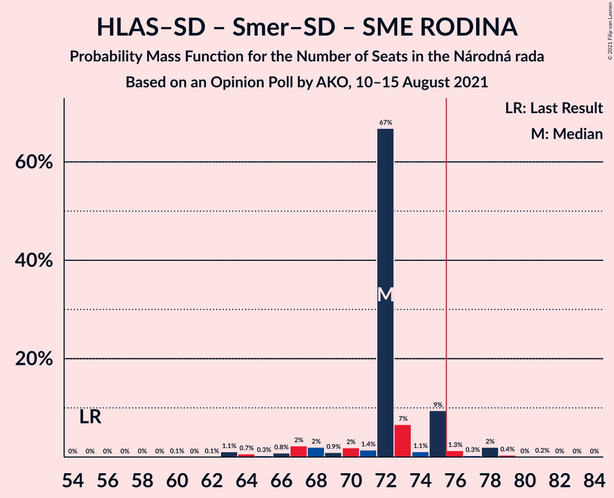

# Opinion Poll by AKO, 10–15 August 2021

<a href="#voting-intentions">Voting Intentions</a> | <a href="#seats">Seats</a> | <a href="#coalitions">Coalitions</a> | <a href="#technical-information">Technical Information</a>

## Voting Intentions

### Confidence Intervals

| Party | Last Result | Poll Result | 80% Confidence Interval | 90% Confidence Interval | 95% Confidence Interval | 99% Confidence Interval |
|:-----:|:-----------:|:-----------:|:-----------------------:|:-----------------------:|:-----------------------:|:-----------------------:|
| HLAS–sociálna demokracia | 0.0% | 19.5% | 18.0–21.2% |17.5–21.7% |17.2–22.1% |16.4–22.9% |
| Sloboda a Solidarita | 6.2% | 14.7% | 13.3–16.2% |13.0–16.7% |12.6–17.0% |12.0–17.8% |
| SMER–sociálna demokracia | 18.3% | 11.3% | 10.1–12.7% |9.8–13.1% |9.5–13.4% |8.9–14.1% |
| OBYČAJNÍ ĽUDIA a nezávislé osobnosti | 25.0% | 9.8% | 8.7–11.1% |8.4–11.5% |8.1–11.8% |7.6–12.5% |
| Progresívne Slovensko | 7.0% | 8.9% | 7.8–10.2% |7.5–10.5% |7.3–10.8% |6.8–11.5% |
| SME RODINA | 8.2% | 6.6% | 5.7–7.7% |5.4–8.0% |5.2–8.3% |4.8–8.9% |
| Kresťanskodemokratické hnutie | 4.6% | 6.3% | 5.4–7.4% |5.2–7.7% |5.0–8.0% |4.6–8.6% |
| REPUBLIKA | 0.0% | 4.5% | 3.8–5.5% |3.6–5.7% |3.4–6.0% |3.0–6.5% |
| Kotleba–Ľudová strana Naše Slovensko | 8.0% | 3.9% | 3.2–4.8% |3.0–5.1% |2.9–5.3% |2.6–5.8% |
| Slovenská národná strana | 3.2% | 3.5% | 2.9–4.4% |2.7–4.6% |2.5–4.8% |2.2–5.3% |
| Strana maďarskej koalície–Magyar Koalíció Pártja | 3.9% | 3.3% | 2.7–4.1% |2.5–4.4% |2.4–4.6% |2.1–5.0% |
| Za ľudí | 5.8% | 3.0% | 2.4–3.8% |2.2–4.1% |2.1–4.3% |1.9–4.7% |
| Dobrá voľba | 3.1% | 1.5% | 1.1–2.1% |1.0–2.3% |0.9–2.5% |0.7–2.8% |
| SPOLU–Občianska Demokracia | 7.0% | 1.2% | 0.9–1.8% |0.8–1.9% |0.7–2.1% |0.5–2.4% |

*Note:* The poll result column reflects the actual value used in the calculations. Published results may vary slightly, and in addition be rounded to fewer digits.

## Seats

### Confidence Intervals

| Party | Last Result | Median | 80% Confidence Interval | 90% Confidence Interval | 95% Confidence Interval | 99% Confidence Interval |
|:-----:|:-----------:|:------:|:-----------------------:|:-----------------------:|:-----------------------:|:-----------------------:|
| <a href="#hlas–sociálna-demokracia">HLAS–sociálna demokracia</a> | 0 | 40 | 36–40 |34–41 |32–41 |29–43 |
| <a href="#sloboda-a-solidarita">Sloboda a Solidarita</a> | 13 | 31 | 27–31 |26–31 |24–31 |22–33 |
| <a href="#smer–sociálna-demokracia">SMER–sociálna demokracia</a> | 38 | 19 | 19–24 |19–24 |19–25 |18–26 |
| <a href="#obyčajní-ľudia-a-nezávislé-osobnosti">OBYČAJNÍ ĽUDIA a nezávislé osobnosti</a> | 53 | 19 | 18–20 |17–20 |17–21 |15–23 |
| <a href="#progresívne-slovensko">Progresívne Slovensko</a> | 0 | 18 | 15–18 |14–18 |14–19 |13–22 |
| <a href="#sme-rodina">SME RODINA</a> | 17 | 13 | 11–14 |10–14 |10–15 |0–17 |
| <a href="#kresťanskodemokratické-hnutie">Kresťanskodemokratické hnutie</a> | 0 | 10 | 10–13 |10–15 |10–15 |0–16 |
| <a href="#republika">REPUBLIKA</a> | 0 | 0 | 0 |0–10 |0–11 |0–12 |
| <a href="#kotleba–ľudová-strana-naše-slovensko">Kotleba–Ľudová strana Naše Slovensko</a> | 17 | 0 | 0 |0 |0 |0–10 |
| <a href="#slovenská-národná-strana">Slovenská národná strana</a> | 0 | 0 | 0 |0 |0 |0–10 |
| <a href="#strana-maďarskej-koalície–magyar-koalíció-pártja">Strana maďarskej koalície–Magyar Koalíció Pártja</a> | 0 | 0 | 0 |0 |0 |0 |
| <a href="#za-ľudí">Za ľudí</a> | 12 | 0 | 0 |0 |0 |0 |
| <a href="#dobrá-voľba">Dobrá voľba</a> | 0 | 0 | 0 |0 |0 |0 |
| <a href="#spolu–občianska-demokracia">SPOLU–Občianska Demokracia</a> | 0 | 0 | 0 |0 |0 |0 |

### HLAS–sociálna demokracia

*For a full overview of the results for this party, see the [HLAS–sociálna demokracia](party-hlas–sociálnademokracia.html) page.*

| Number of Seats | Probability | Accumulated | Special Marks |
|:---------------:|:-----------:|:-----------:|:-------------:|
| 0 | 0% | 100% | Last Result |
| 1 | 0% | 100% |  |
| 2 | 0% | 100% |  |
| 3 | 0% | 100% |  |
| 4 | 0% | 100% |  |
| 5 | 0% | 100% |  |
| 6 | 0% | 100% |  |
| 7 | 0% | 100% |  |
| 8 | 0% | 100% |  |
| 9 | 0% | 100% |  |
| 10 | 0% | 100% |  |
| 11 | 0% | 100% |  |
| 12 | 0% | 100% |  |
| 13 | 0% | 100% |  |
| 14 | 0% | 100% |  |
| 15 | 0% | 100% |  |
| 16 | 0% | 100% |  |
| 17 | 0% | 100% |  |
| 18 | 0% | 100% |  |
| 19 | 0% | 100% |  |
| 20 | 0% | 100% |  |
| 21 | 0% | 100% |  |
| 22 | 0% | 100% |  |
| 23 | 0% | 100% |  |
| 24 | 0% | 100% |  |
| 25 | 0% | 100% |  |
| 26 | 0% | 100% |  |
| 27 | 0% | 100% |  |
| 28 | 0.3% | 100% |  |
| 29 | 0.4% | 99.7% |  |
| 30 | 0.2% | 99.4% |  |
| 31 | 0.8% | 99.2% |  |
| 32 | 1.0% | 98% |  |
| 33 | 0.6% | 97% |  |
| 34 | 4% | 97% |  |
| 35 | 1.2% | 93% |  |
| 36 | 2% | 92% |  |
| 37 | 2% | 90% |  |
| 38 | 3% | 88% |  |
| 39 | 7% | 84% |  |
| 40 | 68% | 77% | Median |
| 41 | 7% | 9% |  |
| 42 | 2% | 2% |  |
| 43 | 0.2% | 0.7% |  |
| 44 | 0.2% | 0.5% |  |
| 45 | 0.3% | 0.3% |  |
| 46 | 0% | 0% |  |

### Sloboda a Solidarita

*For a full overview of the results for this party, see the [Sloboda a Solidarita](party-slobodaasolidarita.html) page.*

| Number of Seats | Probability | Accumulated | Special Marks |
|:---------------:|:-----------:|:-----------:|:-------------:|
| 13 | 0% | 100% | Last Result |
| 14 | 0% | 100% |  |
| 15 | 0% | 100% |  |
| 16 | 0% | 100% |  |
| 17 | 0% | 100% |  |
| 18 | 0% | 100% |  |
| 19 | 0% | 100% |  |
| 20 | 0% | 100% |  |
| 21 | 0% | 100% |  |
| 22 | 0.6% | 99.9% |  |
| 23 | 0.2% | 99.3% |  |
| 24 | 2% | 99.1% |  |
| 25 | 2% | 97% |  |
| 26 | 2% | 95% |  |
| 27 | 5% | 93% |  |
| 28 | 14% | 88% |  |
| 29 | 5% | 74% |  |
| 30 | 1.5% | 69% |  |
| 31 | 66% | 68% | Median |
| 32 | 1.2% | 2% |  |
| 33 | 0.7% | 0.8% |  |
| 34 | 0% | 0.1% |  |
| 35 | 0% | 0.1% |  |
| 36 | 0% | 0% |  |

### SMER–sociálna demokracia

*For a full overview of the results for this party, see the [SMER–sociálna demokracia](party-smer–sociálnademokracia.html) page.*

| Number of Seats | Probability | Accumulated | Special Marks |
|:---------------:|:-----------:|:-----------:|:-------------:|
| 16 | 0.1% | 100% |  |
| 17 | 0.2% | 99.9% |  |
| 18 | 0.7% | 99.7% |  |
| 19 | 69% | 99.0% | Median |
| 20 | 7% | 30% |  |
| 21 | 2% | 23% |  |
| 22 | 3% | 21% |  |
| 23 | 7% | 18% |  |
| 24 | 8% | 11% |  |
| 25 | 2% | 4% |  |
| 26 | 1.4% | 2% |  |
| 27 | 0.2% | 0.3% |  |
| 28 | 0% | 0.1% |  |
| 29 | 0% | 0.1% |  |
| 30 | 0% | 0% |  |
| 31 | 0% | 0% |  |
| 32 | 0% | 0% |  |
| 33 | 0% | 0% |  |
| 34 | 0% | 0% |  |
| 35 | 0% | 0% |  |
| 36 | 0% | 0% |  |
| 37 | 0% | 0% |  |
| 38 | 0% | 0% | Last Result |

### OBYČAJNÍ ĽUDIA a nezávislé osobnosti

*For a full overview of the results for this party, see the [OBYČAJNÍ ĽUDIA a nezávislé osobnosti](party-obyčajníľudiaanezávisléosobnosti.html) page.*

| Number of Seats | Probability | Accumulated | Special Marks |
|:---------------:|:-----------:|:-----------:|:-------------:|
| 14 | 0.2% | 100% |  |
| 15 | 1.1% | 99.8% |  |
| 16 | 1.1% | 98.7% |  |
| 17 | 3% | 98% |  |
| 18 | 6% | 94% |  |
| 19 | 73% | 89% | Median |
| 20 | 12% | 15% |  |
| 21 | 2% | 4% |  |
| 22 | 0.9% | 1.5% |  |
| 23 | 0.5% | 0.6% |  |
| 24 | 0.1% | 0.2% |  |
| 25 | 0% | 0.1% |  |
| 26 | 0.1% | 0.1% |  |
| 27 | 0% | 0% |  |
| 28 | 0% | 0% |  |
| 29 | 0% | 0% |  |
| 30 | 0% | 0% |  |
| 31 | 0% | 0% |  |
| 32 | 0% | 0% |  |
| 33 | 0% | 0% |  |
| 34 | 0% | 0% |  |
| 35 | 0% | 0% |  |
| 36 | 0% | 0% |  |
| 37 | 0% | 0% |  |
| 38 | 0% | 0% |  |
| 39 | 0% | 0% |  |
| 40 | 0% | 0% |  |
| 41 | 0% | 0% |  |
| 42 | 0% | 0% |  |
| 43 | 0% | 0% |  |
| 44 | 0% | 0% |  |
| 45 | 0% | 0% |  |
| 46 | 0% | 0% |  |
| 47 | 0% | 0% |  |
| 48 | 0% | 0% |  |
| 49 | 0% | 0% |  |
| 50 | 0% | 0% |  |
| 51 | 0% | 0% |  |
| 52 | 0% | 0% |  |
| 53 | 0% | 0% | Last Result |

### Progresívne Slovensko

*For a full overview of the results for this party, see the [Progresívne Slovensko](party-progresívneslovensko.html) page.*

| Number of Seats | Probability | Accumulated | Special Marks |
|:---------------:|:-----------:|:-----------:|:-------------:|
| 0 | 0% | 100% | Last Result |
| 1 | 0% | 100% |  |
| 2 | 0% | 100% |  |
| 3 | 0% | 100% |  |
| 4 | 0% | 100% |  |
| 5 | 0% | 100% |  |
| 6 | 0% | 100% |  |
| 7 | 0% | 100% |  |
| 8 | 0% | 100% |  |
| 9 | 0% | 100% |  |
| 10 | 0% | 100% |  |
| 11 | 0% | 100% |  |
| 12 | 0.2% | 100% |  |
| 13 | 0.7% | 99.8% |  |
| 14 | 7% | 99.1% |  |
| 15 | 5% | 92% |  |
| 16 | 11% | 87% |  |
| 17 | 3% | 76% |  |
| 18 | 69% | 72% | Median |
| 19 | 1.1% | 3% |  |
| 20 | 1.1% | 2% |  |
| 21 | 0.3% | 1.2% |  |
| 22 | 0.8% | 0.9% |  |
| 23 | 0% | 0.1% |  |
| 24 | 0% | 0% |  |

### SME RODINA

*For a full overview of the results for this party, see the [SME RODINA](party-smerodina.html) page.*

| Number of Seats | Probability | Accumulated | Special Marks |
|:---------------:|:-----------:|:-----------:|:-------------:|
| 0 | 0.6% | 100% |  |
| 1 | 0% | 99.4% |  |
| 2 | 0% | 99.4% |  |
| 3 | 0% | 99.4% |  |
| 4 | 0% | 99.4% |  |
| 5 | 0% | 99.4% |  |
| 6 | 0% | 99.4% |  |
| 7 | 0% | 99.4% |  |
| 8 | 0% | 99.4% |  |
| 9 | 0.1% | 99.4% |  |
| 10 | 8% | 99.3% |  |
| 11 | 7% | 92% |  |
| 12 | 4% | 85% |  |
| 13 | 68% | 81% | Median |
| 14 | 8% | 13% |  |
| 15 | 2% | 5% |  |
| 16 | 2% | 2% |  |
| 17 | 0.8% | 0.8% | Last Result |
| 18 | 0% | 0% |  |

### Kresťanskodemokratické hnutie

*For a full overview of the results for this party, see the [Kresťanskodemokratické hnutie](party-kresťanskodemokratickéhnutie.html) page.*

| Number of Seats | Probability | Accumulated | Special Marks |
|:---------------:|:-----------:|:-----------:|:-------------:|
| 0 | 2% | 100% | Last Result |
| 1 | 0% | 98% |  |
| 2 | 0% | 98% |  |
| 3 | 0% | 98% |  |
| 4 | 0% | 98% |  |
| 5 | 0% | 98% |  |
| 6 | 0% | 98% |  |
| 7 | 0% | 98% |  |
| 8 | 0% | 98% |  |
| 9 | 0.8% | 98% |  |
| 10 | 68% | 98% | Median |
| 11 | 13% | 30% |  |
| 12 | 2% | 16% |  |
| 13 | 5% | 14% |  |
| 14 | 2% | 9% |  |
| 15 | 4% | 7% |  |
| 16 | 2% | 2% |  |
| 17 | 0.3% | 0.3% |  |
| 18 | 0% | 0% |  |

### REPUBLIKA

*For a full overview of the results for this party, see the [REPUBLIKA](party-republika.html) page.*

| Number of Seats | Probability | Accumulated | Special Marks |
|:---------------:|:-----------:|:-----------:|:-------------:|
| 0 | 92% | 100% | Last Result, Median |
| 1 | 0% | 8% |  |
| 2 | 0% | 8% |  |
| 3 | 0% | 8% |  |
| 4 | 0% | 8% |  |
| 5 | 0% | 8% |  |
| 6 | 0% | 8% |  |
| 7 | 0% | 8% |  |
| 8 | 0% | 8% |  |
| 9 | 1.1% | 8% |  |
| 10 | 3% | 7% |  |
| 11 | 3% | 4% |  |
| 12 | 1.4% | 1.4% |  |
| 13 | 0% | 0% |  |

### Kotleba–Ľudová strana Naše Slovensko

*For a full overview of the results for this party, see the [Kotleba–Ľudová strana Naše Slovensko](party-kotleba–ľudovástrananašeslovensko.html) page.*

| Number of Seats | Probability | Accumulated | Special Marks |
|:---------------:|:-----------:|:-----------:|:-------------:|
| 0 | 98% | 100% | Median |
| 1 | 0% | 2% |  |
| 2 | 0% | 2% |  |
| 3 | 0% | 2% |  |
| 4 | 0% | 2% |  |
| 5 | 0% | 2% |  |
| 6 | 0% | 2% |  |
| 7 | 0% | 2% |  |
| 8 | 0% | 2% |  |
| 9 | 0.4% | 2% |  |
| 10 | 1.3% | 1.4% |  |
| 11 | 0.1% | 0.1% |  |
| 12 | 0.1% | 0.1% |  |
| 13 | 0% | 0% |  |
| 14 | 0% | 0% |  |
| 15 | 0% | 0% |  |
| 16 | 0% | 0% |  |
| 17 | 0% | 0% | Last Result |

### Slovenská národná strana

*For a full overview of the results for this party, see the [Slovenská národná strana](party-slovenskánárodnástrana.html) page.*

| Number of Seats | Probability | Accumulated | Special Marks |
|:---------------:|:-----------:|:-----------:|:-------------:|
| 0 | 99.4% | 100% | Last Result, Median |
| 1 | 0% | 0.6% |  |
| 2 | 0% | 0.6% |  |
| 3 | 0% | 0.6% |  |
| 4 | 0% | 0.6% |  |
| 5 | 0% | 0.6% |  |
| 6 | 0% | 0.6% |  |
| 7 | 0% | 0.6% |  |
| 8 | 0% | 0.6% |  |
| 9 | 0.1% | 0.6% |  |
| 10 | 0.2% | 0.5% |  |
| 11 | 0.4% | 0.4% |  |
| 12 | 0% | 0% |  |

### Strana maďarskej koalície–Magyar Koalíció Pártja

*For a full overview of the results for this party, see the [Strana maďarskej koalície–Magyar Koalíció Pártja](party-stranamaďarskejkoalície–magyarkoalíciópártja.html) page.*

| Number of Seats | Probability | Accumulated | Special Marks |
|:---------------:|:-----------:|:-----------:|:-------------:|
| 0 | 99.8% | 100% | Last Result, Median |
| 1 | 0% | 0.2% |  |
| 2 | 0% | 0.2% |  |
| 3 | 0% | 0.2% |  |
| 4 | 0% | 0.2% |  |
| 5 | 0% | 0.2% |  |
| 6 | 0% | 0.2% |  |
| 7 | 0% | 0.2% |  |
| 8 | 0% | 0.2% |  |
| 9 | 0% | 0.2% |  |
| 10 | 0.2% | 0.2% |  |
| 11 | 0% | 0% |  |

### Za ľudí

*For a full overview of the results for this party, see the [Za ľudí](party-zaľudí.html) page.*

| Number of Seats | Probability | Accumulated | Special Marks |
|:---------------:|:-----------:|:-----------:|:-------------:|
| 0 | 100% | 100% | Median |
| 1 | 0% | 0% |  |
| 2 | 0% | 0% |  |
| 3 | 0% | 0% |  |
| 4 | 0% | 0% |  |
| 5 | 0% | 0% |  |
| 6 | 0% | 0% |  |
| 7 | 0% | 0% |  |
| 8 | 0% | 0% |  |
| 9 | 0% | 0% |  |
| 10 | 0% | 0% |  |
| 11 | 0% | 0% |  |
| 12 | 0% | 0% | Last Result |

### Dobrá voľba

*For a full overview of the results for this party, see the [Dobrá voľba](party-dobrávoľba.html) page.*

| Number of Seats | Probability | Accumulated | Special Marks |
|:---------------:|:-----------:|:-----------:|:-------------:|
| 0 | 100% | 100% | Last Result, Median |

### SPOLU–Občianska Demokracia

*For a full overview of the results for this party, see the [SPOLU–Občianska Demokracia](party-spolu–občianskademokracia.html) page.*

| Number of Seats | Probability | Accumulated | Special Marks |
|:---------------:|:-----------:|:-----------:|:-------------:|
| 0 | 100% | 100% | Last Result, Median |

## Coalitions

### Confidence Intervals

| Coalition | Last Result | Median | Majority? | 80% Confidence Interval | 90% Confidence Interval | 95% Confidence Interval | 99% Confidence Interval |
|:---------:|:-----------:|:------:|:---------:|:-----------------------:|:-----------------------:|:-----------------------:|:-----------------------:|
| HLAS–sociálna demokracia – SMER–sociálna demokracia – SME RODINA – Kotleba–Ľudová strana Naše Slovensko – Slovenská národná strana | 72 | 72 | 6% | 72–75 | 68–76 | 67–78 | 63–81 |
| HLAS–sociálna demokracia – SMER–sociálna demokracia – SME RODINA | 55 | 72 | 4% | 70–75 | 67–75 | 66–78 | 63–79 |
| HLAS–sociálna demokracia – SMER–sociálna demokracia – SME RODINA – Slovenská národná strana | 55 | 72 | 5% | 71–75 | 67–75 | 66–78 | 63–79 |
| HLAS–sociálna demokracia – SMER–sociálna demokracia – Slovenská národná strana | 38 | 59 | 0% | 58–63 | 54–65 | 53–65 | 51–69 |
| HLAS–sociálna demokracia – SME RODINA – Kotleba–Ľudová strana Naše Slovensko – Slovenská národná strana | 34 | 53 | 0% | 50–53 | 47–53 | 45–58 | 41–61 |
| HLAS–sociálna demokracia – SME RODINA – Slovenská národná strana | 17 | 53 | 0% | 50–53 | 47–53 | 45–55 | 41–58 |
| HLAS–sociálna demokracia – SME RODINA | 17 | 53 | 0% | 50–53 | 47–53 | 45–54 | 41–58 |
| HLAS–sociálna demokracia – Slovenská národná strana | 0 | 40 | 0% | 37–40 | 34–41 | 32–42 | 29–45 |
| SMER–sociálna demokracia – SME RODINA – Kotleba–Ľudová strana Naše Slovensko – Slovenská národná strana | 72 | 32 | 0% | 32–36 | 32–37 | 32–40 | 27–44 |
| SMER–sociálna demokracia – SME RODINA – Slovenská národná strana | 55 | 32 | 0% | 32–36 | 32–37 | 31–39 | 27–42 |
| SMER–sociálna demokracia – SME RODINA | 55 | 32 | 0% | 32–36 | 32–37 | 31–38 | 27–40 |
| SMER–sociálna demokracia | 38 | 19 | 0% | 19–24 | 19–24 | 19–25 | 18–26 |
| SMER–sociálna demokracia – Slovenská národná strana | 38 | 19 | 0% | 19–24 | 19–24 | 19–25 | 18–30 |

### HLAS–sociálna demokracia – SMER–sociálna demokracia – SME RODINA – Kotleba–Ľudová strana Naše Slovensko – Slovenská národná strana

| Number of Seats | Probability | Accumulated | Special Marks |
|:---------------:|:-----------:|:-----------:|:-------------:|
| 60 | 0% | 100% |  |
| 61 | 0% | 99.9% |  |
| 62 | 0% | 99.9% |  |
| 63 | 1.0% | 99.9% |  |
| 64 | 0.3% | 98.9% |  |
| 65 | 0.2% | 98.6% |  |
| 66 | 0.8% | 98% |  |
| 67 | 2% | 98% |  |
| 68 | 2% | 95% |  |
| 69 | 0.9% | 94% |  |
| 70 | 1.1% | 93% |  |
| 71 | 1.2% | 92% |  |
| 72 | 67% | 90% | Last Result, Median |
| 73 | 7% | 23% |  |
| 74 | 1.1% | 17% |  |
| 75 | 9% | 16% |  |
| 76 | 1.4% | 6% | Majority |
| 77 | 0.4% | 5% |  |
| 78 | 2% | 4% |  |
| 79 | 0.7% | 2% |  |
| 80 | 0.9% | 2% |  |
| 81 | 0.4% | 0.7% |  |
| 82 | 0.1% | 0.3% |  |
| 83 | 0.1% | 0.2% |  |
| 84 | 0.1% | 0.2% |  |
| 85 | 0% | 0.1% |  |
| 86 | 0% | 0.1% |  |
| 87 | 0% | 0.1% |  |
| 88 | 0% | 0% |  |

### HLAS–sociálna demokracia – SMER–sociálna demokracia – SME RODINA

| Number of Seats | Probability | Accumulated | Special Marks |
|:---------------:|:-----------:|:-----------:|:-------------:|
| 55 | 0% | 100% | Last Result |
| 56 | 0% | 100% |  |
| 57 | 0% | 100% |  |
| 58 | 0% | 100% |  |
| 59 | 0% | 99.9% |  |
| 60 | 0.1% | 99.9% |  |
| 61 | 0% | 99.9% |  |
| 62 | 0.1% | 99.9% |  |
| 63 | 1.1% | 99.8% |  |
| 64 | 0.7% | 98.7% |  |
| 65 | 0.3% | 98% |  |
| 66 | 0.8% | 98% |  |
| 67 | 2% | 97% |  |
| 68 | 2% | 95% |  |
| 69 | 0.9% | 93% |  |
| 70 | 2% | 92% |  |
| 71 | 1.4% | 90% |  |
| 72 | 67% | 88% | Median |
| 73 | 7% | 21% |  |
| 74 | 1.1% | 15% |  |
| 75 | 9% | 14% |  |
| 76 | 1.3% | 4% | Majority |
| 77 | 0.3% | 3% |  |
| 78 | 2% | 3% |  |
| 79 | 0.4% | 0.7% |  |
| 80 | 0% | 0.3% |  |
| 81 | 0.2% | 0.2% |  |
| 82 | 0% | 0.1% |  |
| 83 | 0% | 0% |  |

### HLAS–sociálna demokracia – SMER–sociálna demokracia – SME RODINA – Slovenská národná strana

| Number of Seats | Probability | Accumulated | Special Marks |
|:---------------:|:-----------:|:-----------:|:-------------:|
| 55 | 0% | 100% | Last Result |
| 56 | 0% | 100% |  |
| 57 | 0% | 100% |  |
| 58 | 0% | 100% |  |
| 59 | 0% | 99.9% |  |
| 60 | 0.1% | 99.9% |  |
| 61 | 0% | 99.9% |  |
| 62 | 0.1% | 99.9% |  |
| 63 | 1.1% | 99.8% |  |
| 64 | 0.6% | 98.7% |  |
| 65 | 0.3% | 98% |  |
| 66 | 0.8% | 98% |  |
| 67 | 2% | 97% |  |
| 68 | 2% | 95% |  |
| 69 | 0.9% | 93% |  |
| 70 | 2% | 92% |  |
| 71 | 1.5% | 90% |  |
| 72 | 67% | 89% | Median |
| 73 | 7% | 22% |  |
| 74 | 1.0% | 15% |  |
| 75 | 9% | 14% |  |
| 76 | 1.4% | 5% | Majority |
| 77 | 0.4% | 3% |  |
| 78 | 2% | 3% |  |
| 79 | 0.7% | 1.1% |  |
| 80 | 0% | 0.4% |  |
| 81 | 0.2% | 0.3% |  |
| 82 | 0% | 0.2% |  |
| 83 | 0% | 0.1% |  |
| 84 | 0.1% | 0.1% |  |
| 85 | 0% | 0% |  |

### HLAS–sociálna demokracia – SMER–sociálna demokracia – Slovenská národná strana

| Number of Seats | Probability | Accumulated | Special Marks |
|:---------------:|:-----------:|:-----------:|:-------------:|
| 38 | 0% | 100% | Last Result |
| 39 | 0% | 100% |  |
| 40 | 0% | 100% |  |
| 41 | 0% | 100% |  |
| 42 | 0% | 100% |  |
| 43 | 0% | 100% |  |
| 44 | 0% | 100% |  |
| 45 | 0% | 100% |  |
| 46 | 0% | 100% |  |
| 47 | 0% | 100% |  |
| 48 | 0% | 100% |  |
| 49 | 0.3% | 100% |  |
| 50 | 0.1% | 99.7% |  |
| 51 | 0.8% | 99.6% |  |
| 52 | 0.3% | 98.8% |  |
| 53 | 3% | 98% |  |
| 54 | 0.4% | 95% |  |
| 55 | 1.4% | 95% |  |
| 56 | 1.4% | 93% |  |
| 57 | 0.7% | 92% |  |
| 58 | 1.5% | 91% |  |
| 59 | 68% | 90% | Median |
| 60 | 3% | 22% |  |
| 61 | 1.3% | 19% |  |
| 62 | 6% | 18% |  |
| 63 | 2% | 11% |  |
| 64 | 0.9% | 9% |  |
| 65 | 7% | 8% |  |
| 66 | 0.1% | 1.0% |  |
| 67 | 0.1% | 1.0% |  |
| 68 | 0.2% | 0.9% |  |
| 69 | 0.7% | 0.7% |  |
| 70 | 0% | 0.1% |  |
| 71 | 0% | 0.1% |  |
| 72 | 0% | 0% |  |

### HLAS–sociálna demokracia – SME RODINA – Kotleba–Ľudová strana Naše Slovensko – Slovenská národná strana

| Number of Seats | Probability | Accumulated | Special Marks |
|:---------------:|:-----------:|:-----------:|:-------------:|
| 34 | 0% | 100% | Last Result |
| 35 | 0% | 100% |  |
| 36 | 0% | 100% |  |
| 37 | 0% | 100% |  |
| 38 | 0.2% | 100% |  |
| 39 | 0% | 99.8% |  |
| 40 | 0% | 99.7% |  |
| 41 | 0.3% | 99.7% |  |
| 42 | 0.1% | 99.4% |  |
| 43 | 0.7% | 99.3% |  |
| 44 | 0.6% | 98.6% |  |
| 45 | 1.1% | 98% |  |
| 46 | 1.2% | 97% |  |
| 47 | 1.0% | 96% |  |
| 48 | 3% | 95% |  |
| 49 | 0.3% | 92% |  |
| 50 | 6% | 92% |  |
| 51 | 9% | 86% |  |
| 52 | 3% | 77% |  |
| 53 | 70% | 74% | Median |
| 54 | 0.6% | 5% |  |
| 55 | 0.6% | 4% |  |
| 56 | 0.4% | 4% |  |
| 57 | 0.1% | 3% |  |
| 58 | 2% | 3% |  |
| 59 | 0.2% | 1.4% |  |
| 60 | 0.2% | 1.2% |  |
| 61 | 0.8% | 0.9% |  |
| 62 | 0% | 0.1% |  |
| 63 | 0% | 0.1% |  |
| 64 | 0% | 0% |  |

### HLAS–sociálna demokracia – SME RODINA – Slovenská národná strana

| Number of Seats | Probability | Accumulated | Special Marks |
|:---------------:|:-----------:|:-----------:|:-------------:|
| 17 | 0% | 100% | Last Result |
| 18 | 0% | 100% |  |
| 19 | 0% | 100% |  |
| 20 | 0% | 100% |  |
| 21 | 0% | 100% |  |
| 22 | 0% | 100% |  |
| 23 | 0% | 100% |  |
| 24 | 0% | 100% |  |
| 25 | 0% | 100% |  |
| 26 | 0% | 100% |  |
| 27 | 0% | 100% |  |
| 28 | 0% | 100% |  |
| 29 | 0% | 100% |  |
| 30 | 0% | 100% |  |
| 31 | 0% | 100% |  |
| 32 | 0% | 100% |  |
| 33 | 0% | 100% |  |
| 34 | 0% | 100% |  |
| 35 | 0% | 100% |  |
| 36 | 0% | 100% |  |
| 37 | 0% | 100% |  |
| 38 | 0.2% | 99.9% |  |
| 39 | 0% | 99.7% |  |
| 40 | 0% | 99.7% |  |
| 41 | 0.3% | 99.7% |  |
| 42 | 0.3% | 99.4% |  |
| 43 | 0.7% | 99.1% |  |
| 44 | 0.6% | 98% |  |
| 45 | 1.1% | 98% |  |
| 46 | 1.5% | 97% |  |
| 47 | 1.0% | 95% |  |
| 48 | 3% | 94% |  |
| 49 | 0.5% | 91% |  |
| 50 | 6% | 91% |  |
| 51 | 9% | 85% |  |
| 52 | 3% | 75% |  |
| 53 | 70% | 73% | Median |
| 54 | 0.6% | 3% |  |
| 55 | 0.3% | 3% |  |
| 56 | 0.4% | 2% |  |
| 57 | 0% | 2% |  |
| 58 | 2% | 2% |  |
| 59 | 0.1% | 0.2% |  |
| 60 | 0.1% | 0.1% |  |
| 61 | 0% | 0% |  |

### HLAS–sociálna demokracia – SME RODINA

| Number of Seats | Probability | Accumulated | Special Marks |
|:---------------:|:-----------:|:-----------:|:-------------:|
| 17 | 0% | 100% | Last Result |
| 18 | 0% | 100% |  |
| 19 | 0% | 100% |  |
| 20 | 0% | 100% |  |
| 21 | 0% | 100% |  |
| 22 | 0% | 100% |  |
| 23 | 0% | 100% |  |
| 24 | 0% | 100% |  |
| 25 | 0% | 100% |  |
| 26 | 0% | 100% |  |
| 27 | 0% | 100% |  |
| 28 | 0% | 100% |  |
| 29 | 0% | 100% |  |
| 30 | 0% | 100% |  |
| 31 | 0% | 100% |  |
| 32 | 0% | 100% |  |
| 33 | 0% | 100% |  |
| 34 | 0% | 100% |  |
| 35 | 0% | 100% |  |
| 36 | 0% | 100% |  |
| 37 | 0% | 100% |  |
| 38 | 0.2% | 99.9% |  |
| 39 | 0% | 99.7% |  |
| 40 | 0% | 99.7% |  |
| 41 | 0.3% | 99.6% |  |
| 42 | 0.3% | 99.3% |  |
| 43 | 0.7% | 99.1% |  |
| 44 | 0.6% | 98% |  |
| 45 | 1.2% | 98% |  |
| 46 | 1.5% | 97% |  |
| 47 | 1.4% | 95% |  |
| 48 | 3% | 94% |  |
| 49 | 0.5% | 91% |  |
| 50 | 6% | 90% |  |
| 51 | 9% | 84% |  |
| 52 | 3% | 75% |  |
| 53 | 69% | 72% | Median |
| 54 | 0.5% | 3% |  |
| 55 | 0.3% | 2% |  |
| 56 | 0.4% | 2% |  |
| 57 | 0% | 1.4% |  |
| 58 | 1.3% | 1.4% |  |
| 59 | 0% | 0.1% |  |
| 60 | 0% | 0% |  |

### HLAS–sociálna demokracia – Slovenská národná strana

| Number of Seats | Probability | Accumulated | Special Marks |
|:---------------:|:-----------:|:-----------:|:-------------:|
| 0 | 0% | 100% | Last Result |
| 1 | 0% | 100% |  |
| 2 | 0% | 100% |  |
| 3 | 0% | 100% |  |
| 4 | 0% | 100% |  |
| 5 | 0% | 100% |  |
| 6 | 0% | 100% |  |
| 7 | 0% | 100% |  |
| 8 | 0% | 100% |  |
| 9 | 0% | 100% |  |
| 10 | 0% | 100% |  |
| 11 | 0% | 100% |  |
| 12 | 0% | 100% |  |
| 13 | 0% | 100% |  |
| 14 | 0% | 100% |  |
| 15 | 0% | 100% |  |
| 16 | 0% | 100% |  |
| 17 | 0% | 100% |  |
| 18 | 0% | 100% |  |
| 19 | 0% | 100% |  |
| 20 | 0% | 100% |  |
| 21 | 0% | 100% |  |
| 22 | 0% | 100% |  |
| 23 | 0% | 100% |  |
| 24 | 0% | 100% |  |
| 25 | 0% | 100% |  |
| 26 | 0% | 100% |  |
| 27 | 0% | 100% |  |
| 28 | 0.3% | 100% |  |
| 29 | 0.4% | 99.7% |  |
| 30 | 0.1% | 99.4% |  |
| 31 | 0.8% | 99.2% |  |
| 32 | 1.0% | 98% |  |
| 33 | 0.5% | 97% |  |
| 34 | 4% | 97% |  |
| 35 | 1.1% | 93% |  |
| 36 | 2% | 92% |  |
| 37 | 2% | 90% |  |
| 38 | 3% | 88% |  |
| 39 | 7% | 85% |  |
| 40 | 68% | 78% | Median |
| 41 | 7% | 10% |  |
| 42 | 2% | 3% |  |
| 43 | 0.3% | 1.3% |  |
| 44 | 0.2% | 1.0% |  |
| 45 | 0.4% | 0.8% |  |
| 46 | 0% | 0.4% |  |
| 47 | 0% | 0.4% |  |
| 48 | 0.3% | 0.4% |  |
| 49 | 0% | 0% |  |

### SMER–sociálna demokracia – SME RODINA – Kotleba–Ľudová strana Naše Slovensko – Slovenská národná strana

| Number of Seats | Probability | Accumulated | Special Marks |
|:---------------:|:-----------:|:-----------:|:-------------:|
| 22 | 0% | 100% |  |
| 23 | 0% | 99.9% |  |
| 24 | 0.2% | 99.9% |  |
| 25 | 0% | 99.7% |  |
| 26 | 0% | 99.7% |  |
| 27 | 0.2% | 99.7% |  |
| 28 | 0% | 99.4% |  |
| 29 | 0.1% | 99.4% |  |
| 30 | 1.1% | 99.2% |  |
| 31 | 0.3% | 98% |  |
| 32 | 68% | 98% | Median |
| 33 | 3% | 30% |  |
| 34 | 13% | 27% |  |
| 35 | 2% | 14% |  |
| 36 | 4% | 12% |  |
| 37 | 3% | 8% |  |
| 38 | 0.9% | 5% |  |
| 39 | 0.7% | 4% |  |
| 40 | 1.3% | 3% |  |
| 41 | 0.1% | 2% |  |
| 42 | 0.4% | 2% |  |
| 43 | 1.1% | 2% |  |
| 44 | 0.1% | 0.6% |  |
| 45 | 0.3% | 0.5% |  |
| 46 | 0% | 0.2% |  |
| 47 | 0.1% | 0.2% |  |
| 48 | 0% | 0.1% |  |
| 49 | 0.1% | 0.1% |  |
| 50 | 0% | 0% |  |
| 51 | 0% | 0% |  |
| 52 | 0% | 0% |  |
| 53 | 0% | 0% |  |
| 54 | 0% | 0% |  |
| 55 | 0% | 0% |  |
| 56 | 0% | 0% |  |
| 57 | 0% | 0% |  |
| 58 | 0% | 0% |  |
| 59 | 0% | 0% |  |
| 60 | 0% | 0% |  |
| 61 | 0% | 0% |  |
| 62 | 0% | 0% |  |
| 63 | 0% | 0% |  |
| 64 | 0% | 0% |  |
| 65 | 0% | 0% |  |
| 66 | 0% | 0% |  |
| 67 | 0% | 0% |  |
| 68 | 0% | 0% |  |
| 69 | 0% | 0% |  |
| 70 | 0% | 0% |  |
| 71 | 0% | 0% |  |
| 72 | 0% | 0% | Last Result |

### SMER–sociálna demokracia – SME RODINA – Slovenská národná strana

| Number of Seats | Probability | Accumulated | Special Marks |
|:---------------:|:-----------:|:-----------:|:-------------:|
| 21 | 0% | 100% |  |
| 22 | 0% | 99.9% |  |
| 23 | 0% | 99.9% |  |
| 24 | 0.2% | 99.9% |  |
| 25 | 0% | 99.6% |  |
| 26 | 0% | 99.6% |  |
| 27 | 0.2% | 99.6% |  |
| 28 | 0.1% | 99.4% |  |
| 29 | 0.4% | 99.3% |  |
| 30 | 1.2% | 98.9% |  |
| 31 | 0.3% | 98% |  |
| 32 | 68% | 97% | Median |
| 33 | 4% | 30% |  |
| 34 | 13% | 26% |  |
| 35 | 2% | 13% |  |
| 36 | 4% | 11% |  |
| 37 | 3% | 7% |  |
| 38 | 0.6% | 3% |  |
| 39 | 0.7% | 3% |  |
| 40 | 1.2% | 2% |  |
| 41 | 0.1% | 0.7% |  |
| 42 | 0.3% | 0.6% |  |
| 43 | 0.1% | 0.3% |  |
| 44 | 0.1% | 0.2% |  |
| 45 | 0% | 0.1% |  |
| 46 | 0% | 0.1% |  |
| 47 | 0% | 0.1% |  |
| 48 | 0% | 0.1% |  |
| 49 | 0.1% | 0.1% |  |
| 50 | 0% | 0% |  |
| 51 | 0% | 0% |  |
| 52 | 0% | 0% |  |
| 53 | 0% | 0% |  |
| 54 | 0% | 0% |  |
| 55 | 0% | 0% | Last Result |

### SMER–sociálna demokracia – SME RODINA

| Number of Seats | Probability | Accumulated | Special Marks |
|:---------------:|:-----------:|:-----------:|:-------------:|
| 21 | 0.1% | 100% |  |
| 22 | 0% | 99.9% |  |
| 23 | 0% | 99.9% |  |
| 24 | 0.2% | 99.9% |  |
| 25 | 0% | 99.6% |  |
| 26 | 0% | 99.6% |  |
| 27 | 0.2% | 99.6% |  |
| 28 | 0.1% | 99.3% |  |
| 29 | 0.4% | 99.2% |  |
| 30 | 1.2% | 98.8% |  |
| 31 | 0.6% | 98% |  |
| 32 | 68% | 97% | Median |
| 33 | 4% | 29% |  |
| 34 | 13% | 25% |  |
| 35 | 2% | 12% |  |
| 36 | 4% | 10% |  |
| 37 | 3% | 6% |  |
| 38 | 0.6% | 3% |  |
| 39 | 0.7% | 2% |  |
| 40 | 1.2% | 1.4% |  |
| 41 | 0% | 0.2% |  |
| 42 | 0% | 0.2% |  |
| 43 | 0.1% | 0.2% |  |
| 44 | 0% | 0% |  |
| 45 | 0% | 0% |  |
| 46 | 0% | 0% |  |
| 47 | 0% | 0% |  |
| 48 | 0% | 0% |  |
| 49 | 0% | 0% |  |
| 50 | 0% | 0% |  |
| 51 | 0% | 0% |  |
| 52 | 0% | 0% |  |
| 53 | 0% | 0% |  |
| 54 | 0% | 0% |  |
| 55 | 0% | 0% | Last Result |

### SMER–sociálna demokracia

| Number of Seats | Probability | Accumulated | Special Marks |
|:---------------:|:-----------:|:-----------:|:-------------:|
| 16 | 0.1% | 100% |  |
| 17 | 0.2% | 99.9% |  |
| 18 | 0.7% | 99.7% |  |
| 19 | 69% | 99.0% | Median |
| 20 | 7% | 30% |  |
| 21 | 2% | 23% |  |
| 22 | 3% | 21% |  |
| 23 | 7% | 18% |  |
| 24 | 8% | 11% |  |
| 25 | 2% | 4% |  |
| 26 | 1.4% | 2% |  |
| 27 | 0.2% | 0.3% |  |
| 28 | 0% | 0.1% |  |
| 29 | 0% | 0.1% |  |
| 30 | 0% | 0% |  |
| 31 | 0% | 0% |  |
| 32 | 0% | 0% |  |
| 33 | 0% | 0% |  |
| 34 | 0% | 0% |  |
| 35 | 0% | 0% |  |
| 36 | 0% | 0% |  |
| 37 | 0% | 0% |  |
| 38 | 0% | 0% | Last Result |

### SMER–sociálna demokracia – Slovenská národná strana

| Number of Seats | Probability | Accumulated | Special Marks |
|:---------------:|:-----------:|:-----------:|:-------------:|
| 16 | 0.1% | 100% |  |
| 17 | 0.2% | 99.9% |  |
| 18 | 0.7% | 99.7% |  |
| 19 | 69% | 99.1% | Median |
| 20 | 7% | 30% |  |
| 21 | 1.3% | 23% |  |
| 22 | 3% | 22% |  |
| 23 | 7% | 19% |  |
| 24 | 8% | 12% |  |
| 25 | 2% | 4% |  |
| 26 | 1.4% | 2% |  |
| 27 | 0.3% | 0.9% |  |
| 28 | 0.1% | 0.7% |  |
| 29 | 0.1% | 0.6% |  |
| 30 | 0% | 0.5% |  |
| 31 | 0% | 0.5% |  |
| 32 | 0.3% | 0.5% |  |
| 33 | 0% | 0.1% |  |
| 34 | 0.1% | 0.1% |  |
| 35 | 0% | 0% |  |
| 36 | 0% | 0% |  |
| 37 | 0% | 0% |  |
| 38 | 0% | 0% | Last Result |

## Technical Information

### Opinion Poll

+ **Polling firm:** AKO
+ **Commissioner(s):** —
+ **Fieldwork period:** 10–15 August 2021

### Calculations

+ **Sample size:** 1000
+ **Simulations done:** 1,048,576
+ **Error estimate:** 2.44%

