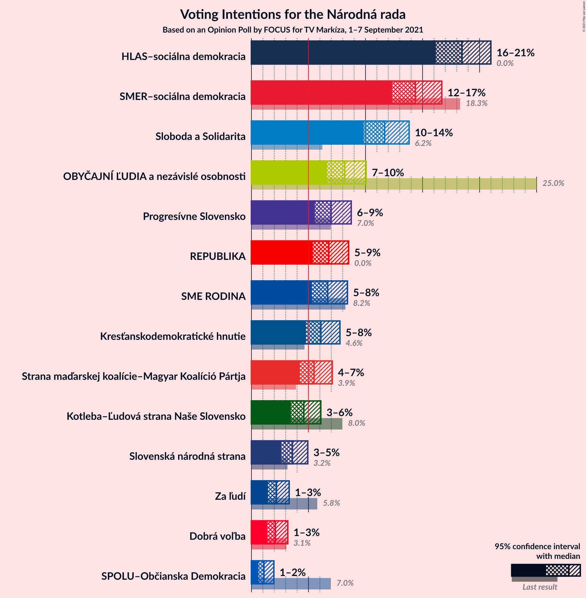
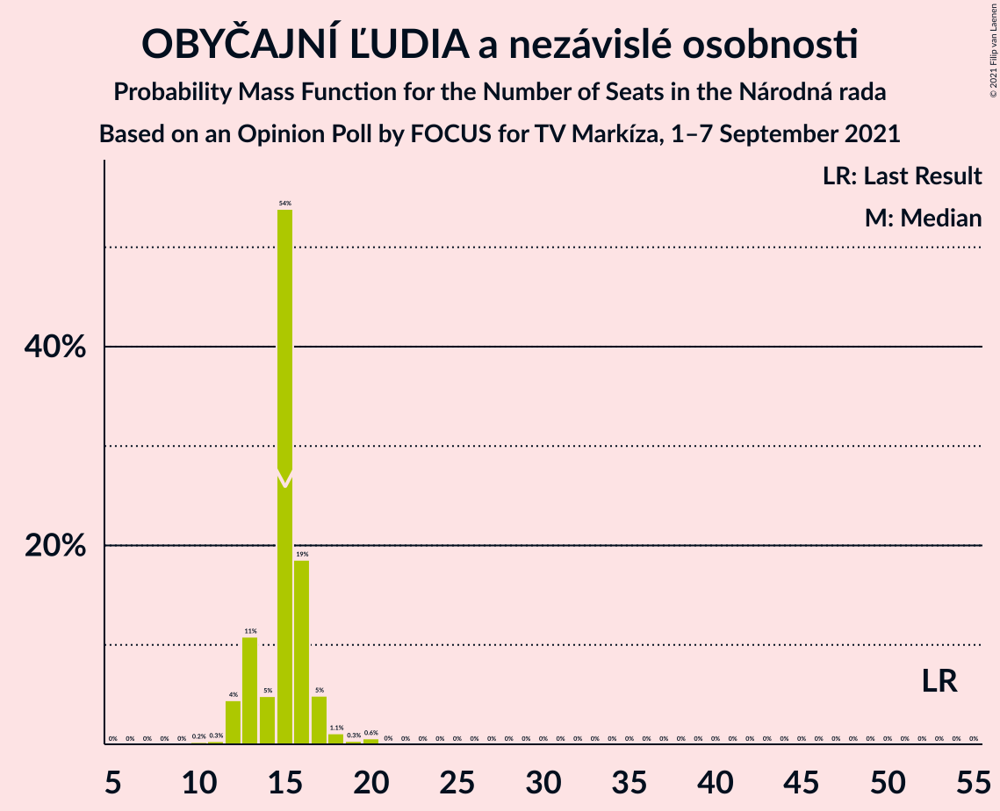
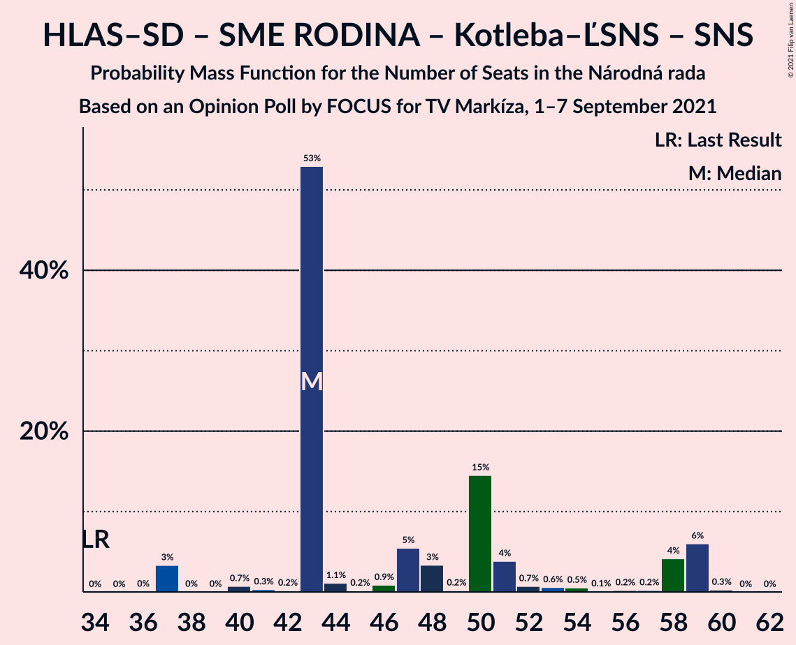
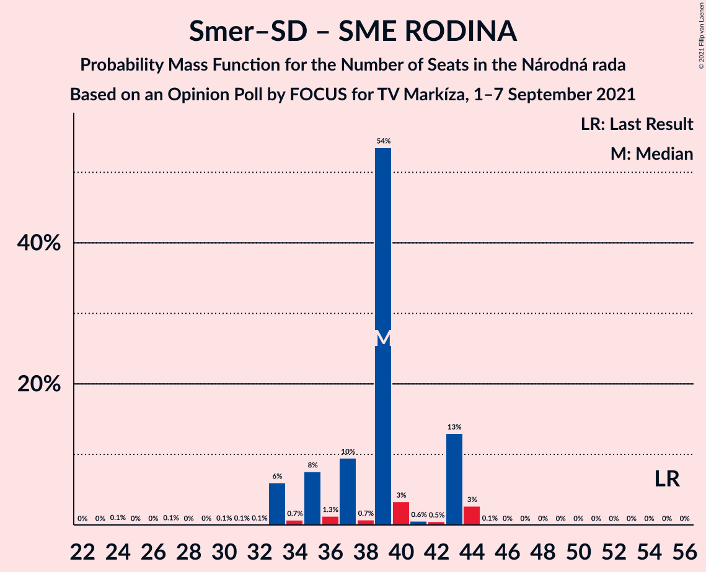

# Opinion Poll by FOCUS for TV Markíza, 1–7 September 2021

<a href="#voting-intentions">Voting Intentions</a> | <a href="#seats">Seats</a> | <a href="#coalitions">Coalitions</a> | <a href="#technical-information">Technical Information</a>

## Voting Intentions

### Confidence Intervals

| Party | Last Result | Poll Result | 80% Confidence Interval | 90% Confidence Interval | 95% Confidence Interval | 99% Confidence Interval |
|:-----:|:-----------:|:-----------:|:-----------------------:|:-----------------------:|:-----------------------:|:-----------------------:|
| HLAS–sociálna demokracia | 0.0% | 18.5% | 17.0–20.1% |16.5–20.6% |16.2–21.0% |15.5–21.8% |
| SMER–sociálna demokracia | 18.3% | 14.4% | 13.0–15.9% |12.7–16.3% |12.3–16.7% |11.7–17.4% |
| Sloboda a Solidarita | 6.2% | 11.7% | 10.5–13.1% |10.1–13.5% |9.8–13.8% |9.3–14.5% |
| OBYČAJNÍ ĽUDIA a nezávislé osobnosti | 25.0% | 8.2% | 7.2–9.4% |6.9–9.8% |6.6–10.1% |6.2–10.7% |
| Progresívne Slovensko | 7.0% | 7.0% | 6.1–8.1% |5.8–8.5% |5.6–8.7% |5.1–9.3% |
| REPUBLIKA | 0.0% | 6.8% | 5.9–7.9% |5.6–8.2% |5.4–8.5% |5.0–9.1% |
| SME RODINA | 8.2% | 6.7% | 5.8–7.8% |5.5–8.1% |5.3–8.4% |4.9–9.0% |
| Kresťanskodemokratické hnutie | 4.6% | 6.1% | 5.2–7.2% |5.0–7.5% |4.8–7.8% |4.4–8.3% |
| Strana maďarskej koalície–Magyar Koalíció Pártja | 3.9% | 5.5% | 4.7–6.5% |4.4–6.8% |4.2–7.1% |3.9–7.6% |
| Kotleba–Ľudová strana Naše Slovensko | 8.0% | 4.6% | 3.8–5.6% |3.6–5.8% |3.5–6.1% |3.1–6.6% |
| Slovenská národná strana | 3.2% | 3.6% | 2.9–4.5% |2.8–4.7% |2.6–4.9% |2.3–5.4% |
| Za ľudí | 5.8% | 2.2% | 1.7–2.9% |1.6–3.1% |1.4–3.3% |1.2–3.7% |
| Dobrá voľba | 3.1% | 2.1% | 1.6–2.8% |1.5–3.0% |1.4–3.2% |1.2–3.6% |
| SPOLU–Občianska Demokracia | 7.0% | 1.1% | 0.8–1.7% |0.7–1.8% |0.6–2.0% |0.5–2.3% |

*Note:* The poll result column reflects the actual value used in the calculations. Published results may vary slightly, and in addition be rounded to fewer digits.

## Seats

### Confidence Intervals

| Party | Last Result | Median | 80% Confidence Interval | 90% Confidence Interval | 95% Confidence Interval | 99% Confidence Interval |
|:-----:|:-----------:|:------:|:-----------------------:|:-----------------------:|:-----------------------:|:-----------------------:|
| <a href="#hlas–sociálna-demokracia">HLAS–sociálna demokracia</a> | 0 | 30 | 30–36 |29–36 |27–37 |27–37 |
| <a href="#smer–sociálna-demokracia">SMER–sociálna demokracia</a> | 38 | 26 | 24–28 |24–28 |24–33 |21–33 |
| <a href="#sloboda-a-solidarita">Sloboda a Solidarita</a> | 13 | 18 | 18–22 |18–24 |17–24 |17–25 |
| <a href="#obyčajní-ľudia-a-nezávislé-osobnosti">OBYČAJNÍ ĽUDIA a nezávislé osobnosti</a> | 53 | 15 | 13–16 |13–17 |12–17 |11–20 |
| <a href="#progresívne-slovensko">Progresívne Slovensko</a> | 0 | 13 | 11–14 |10–15 |10–15 |9–16 |
| <a href="#republika">REPUBLIKA</a> | 0 | 12 | 11–14 |11–15 |11–15 |0–15 |
| <a href="#sme-rodina">SME RODINA</a> | 17 | 13 | 10–15 |9–15 |9–15 |9–15 |
| <a href="#kresťanskodemokratické-hnutie">Kresťanskodemokratické hnutie</a> | 0 | 13 | 0–13 |0–14 |0–14 |0–14 |
| <a href="#strana-maďarskej-koalície–magyar-koalíció-pártja">Strana maďarskej koalície–Magyar Koalíció Pártja</a> | 0 | 10 | 0–10 |0–11 |0–11 |0–13 |
| <a href="#kotleba–ľudová-strana-naše-slovensko">Kotleba–Ľudová strana Naše Slovensko</a> | 17 | 0 | 0–9 |0–9 |0–9 |0–10 |
| <a href="#slovenská-národná-strana">Slovenská národná strana</a> | 0 | 0 | 0 |0–9 |0–9 |0–9 |
| <a href="#za-ľudí">Za ľudí</a> | 12 | 0 | 0 |0 |0 |0 |
| <a href="#dobrá-voľba">Dobrá voľba</a> | 0 | 0 | 0 |0 |0 |0 |
| <a href="#spolu–občianska-demokracia">SPOLU–Občianska Demokracia</a> | 0 | 0 | 0 |0 |0 |0 |

### HLAS–sociálna demokracia

*For a full overview of the results for this party, see the [HLAS–sociálna demokracia](party-hlas–sociálnademokracia.html) page.*

| Number of Seats | Probability | Accumulated | Special Marks |
|:---------------:|:-----------:|:-----------:|:-------------:|
| 0 | 0% | 100% | Last Result |
| 1 | 0% | 100% |  |
| 2 | 0% | 100% |  |
| 3 | 0% | 100% |  |
| 4 | 0% | 100% |  |
| 5 | 0% | 100% |  |
| 6 | 0% | 100% |  |
| 7 | 0% | 100% |  |
| 8 | 0% | 100% |  |
| 9 | 0% | 100% |  |
| 10 | 0% | 100% |  |
| 11 | 0% | 100% |  |
| 12 | 0% | 100% |  |
| 13 | 0% | 100% |  |
| 14 | 0% | 100% |  |
| 15 | 0% | 100% |  |
| 16 | 0% | 100% |  |
| 17 | 0% | 100% |  |
| 18 | 0% | 100% |  |
| 19 | 0% | 100% |  |
| 20 | 0% | 100% |  |
| 21 | 0% | 100% |  |
| 22 | 0% | 100% |  |
| 23 | 0% | 100% |  |
| 24 | 0% | 100% |  |
| 25 | 0% | 100% |  |
| 26 | 0.1% | 100% |  |
| 27 | 4% | 99.9% |  |
| 28 | 0.5% | 96% |  |
| 29 | 0.7% | 95% |  |
| 30 | 53% | 95% | Median |
| 31 | 5% | 42% |  |
| 32 | 6% | 36% |  |
| 33 | 0.9% | 30% |  |
| 34 | 0.3% | 29% |  |
| 35 | 15% | 29% |  |
| 36 | 10% | 14% |  |
| 37 | 4% | 4% |  |
| 38 | 0.2% | 0.5% |  |
| 39 | 0% | 0.3% |  |
| 40 | 0.1% | 0.2% |  |
| 41 | 0% | 0.2% |  |
| 42 | 0.1% | 0.1% |  |
| 43 | 0% | 0% |  |

### SMER–sociálna demokracia

*For a full overview of the results for this party, see the [SMER–sociálna demokracia](party-smer–sociálnademokracia.html) page.*

| Number of Seats | Probability | Accumulated | Special Marks |
|:---------------:|:-----------:|:-----------:|:-------------:|
| 20 | 0.1% | 100% |  |
| 21 | 0.5% | 99.9% |  |
| 22 | 0.5% | 99.4% |  |
| 23 | 1.2% | 98.8% |  |
| 24 | 14% | 98% |  |
| 25 | 6% | 83% |  |
| 26 | 58% | 78% | Median |
| 27 | 0.9% | 20% |  |
| 28 | 15% | 19% |  |
| 29 | 0.6% | 4% |  |
| 30 | 0.5% | 3% |  |
| 31 | 0.2% | 3% |  |
| 32 | 0% | 3% |  |
| 33 | 3% | 3% |  |
| 34 | 0% | 0% |  |
| 35 | 0% | 0% |  |
| 36 | 0% | 0% |  |
| 37 | 0% | 0% |  |
| 38 | 0% | 0% | Last Result |

### Sloboda a Solidarita

*For a full overview of the results for this party, see the [Sloboda a Solidarita](party-slobodaasolidarita.html) page.*

| Number of Seats | Probability | Accumulated | Special Marks |
|:---------------:|:-----------:|:-----------:|:-------------:|
| 13 | 0% | 100% | Last Result |
| 14 | 0% | 100% |  |
| 15 | 0.1% | 100% |  |
| 16 | 0.2% | 99.9% |  |
| 17 | 4% | 99.7% |  |
| 18 | 56% | 96% | Median |
| 19 | 19% | 40% |  |
| 20 | 6% | 21% |  |
| 21 | 2% | 14% |  |
| 22 | 4% | 12% |  |
| 23 | 1.4% | 8% |  |
| 24 | 6% | 6% |  |
| 25 | 0.4% | 0.5% |  |
| 26 | 0.1% | 0.2% |  |
| 27 | 0% | 0% |  |

### OBYČAJNÍ ĽUDIA a nezávislé osobnosti

*For a full overview of the results for this party, see the [OBYČAJNÍ ĽUDIA a nezávislé osobnosti](party-obyčajníľudiaanezávisléosobnosti.html) page.*

| Number of Seats | Probability | Accumulated | Special Marks |
|:---------------:|:-----------:|:-----------:|:-------------:|
| 10 | 0.2% | 100% |  |
| 11 | 0.3% | 99.8% |  |
| 12 | 4% | 99.4% |  |
| 13 | 11% | 95% |  |
| 14 | 5% | 84% |  |
| 15 | 54% | 79% | Median |
| 16 | 19% | 25% |  |
| 17 | 5% | 7% |  |
| 18 | 1.1% | 2% |  |
| 19 | 0.3% | 1.0% |  |
| 20 | 0.6% | 0.6% |  |
| 21 | 0% | 0% |  |
| 22 | 0% | 0% |  |
| 23 | 0% | 0% |  |
| 24 | 0% | 0% |  |
| 25 | 0% | 0% |  |
| 26 | 0% | 0% |  |
| 27 | 0% | 0% |  |
| 28 | 0% | 0% |  |
| 29 | 0% | 0% |  |
| 30 | 0% | 0% |  |
| 31 | 0% | 0% |  |
| 32 | 0% | 0% |  |
| 33 | 0% | 0% |  |
| 34 | 0% | 0% |  |
| 35 | 0% | 0% |  |
| 36 | 0% | 0% |  |
| 37 | 0% | 0% |  |
| 38 | 0% | 0% |  |
| 39 | 0% | 0% |  |
| 40 | 0% | 0% |  |
| 41 | 0% | 0% |  |
| 42 | 0% | 0% |  |
| 43 | 0% | 0% |  |
| 44 | 0% | 0% |  |
| 45 | 0% | 0% |  |
| 46 | 0% | 0% |  |
| 47 | 0% | 0% |  |
| 48 | 0% | 0% |  |
| 49 | 0% | 0% |  |
| 50 | 0% | 0% |  |
| 51 | 0% | 0% |  |
| 52 | 0% | 0% |  |
| 53 | 0% | 0% | Last Result |

### Progresívne Slovensko

*For a full overview of the results for this party, see the [Progresívne Slovensko](party-progresívneslovensko.html) page.*

| Number of Seats | Probability | Accumulated | Special Marks |
|:---------------:|:-----------:|:-----------:|:-------------:|
| 0 | 0.5% | 100% | Last Result |
| 1 | 0% | 99.5% |  |
| 2 | 0% | 99.5% |  |
| 3 | 0% | 99.5% |  |
| 4 | 0% | 99.5% |  |
| 5 | 0% | 99.5% |  |
| 6 | 0% | 99.5% |  |
| 7 | 0% | 99.5% |  |
| 8 | 0% | 99.5% |  |
| 9 | 0.8% | 99.5% |  |
| 10 | 4% | 98.7% |  |
| 11 | 18% | 94% |  |
| 12 | 11% | 76% |  |
| 13 | 55% | 66% | Median |
| 14 | 5% | 11% |  |
| 15 | 5% | 6% |  |
| 16 | 0.2% | 0.7% |  |
| 17 | 0.4% | 0.4% |  |
| 18 | 0% | 0% |  |

### REPUBLIKA

*For a full overview of the results for this party, see the [REPUBLIKA](party-republika.html) page.*

| Number of Seats | Probability | Accumulated | Special Marks |
|:---------------:|:-----------:|:-----------:|:-------------:|
| 0 | 0.8% | 100% | Last Result |
| 1 | 0% | 99.2% |  |
| 2 | 0% | 99.2% |  |
| 3 | 0% | 99.2% |  |
| 4 | 0% | 99.2% |  |
| 5 | 0% | 99.2% |  |
| 6 | 0% | 99.2% |  |
| 7 | 0% | 99.2% |  |
| 8 | 0% | 99.2% |  |
| 9 | 0.1% | 99.2% |  |
| 10 | 2% | 99.1% |  |
| 11 | 12% | 98% |  |
| 12 | 55% | 86% | Median |
| 13 | 8% | 31% |  |
| 14 | 18% | 23% |  |
| 15 | 5% | 5% |  |
| 16 | 0.2% | 0.4% |  |
| 17 | 0.1% | 0.1% |  |
| 18 | 0% | 0% |  |

### SME RODINA

*For a full overview of the results for this party, see the [SME RODINA](party-smerodina.html) page.*

| Number of Seats | Probability | Accumulated | Special Marks |
|:---------------:|:-----------:|:-----------:|:-------------:|
| 0 | 0.3% | 100% |  |
| 1 | 0% | 99.7% |  |
| 2 | 0% | 99.7% |  |
| 3 | 0% | 99.7% |  |
| 4 | 0% | 99.7% |  |
| 5 | 0% | 99.7% |  |
| 6 | 0% | 99.7% |  |
| 7 | 0% | 99.7% |  |
| 8 | 0% | 99.7% |  |
| 9 | 6% | 99.7% |  |
| 10 | 4% | 94% |  |
| 11 | 12% | 90% |  |
| 12 | 3% | 77% |  |
| 13 | 59% | 75% | Median |
| 14 | 0.9% | 15% |  |
| 15 | 14% | 14% |  |
| 16 | 0.2% | 0.2% |  |
| 17 | 0% | 0% | Last Result |

### Kresťanskodemokratické hnutie

*For a full overview of the results for this party, see the [Kresťanskodemokratické hnutie](party-kresťanskodemokratickéhnutie.html) page.*

| Number of Seats | Probability | Accumulated | Special Marks |
|:---------------:|:-----------:|:-----------:|:-------------:|
| 0 | 10% | 100% | Last Result |
| 1 | 0% | 90% |  |
| 2 | 0% | 90% |  |
| 3 | 0% | 90% |  |
| 4 | 0% | 90% |  |
| 5 | 0% | 90% |  |
| 6 | 0% | 90% |  |
| 7 | 0% | 90% |  |
| 8 | 0% | 90% |  |
| 9 | 0.5% | 90% |  |
| 10 | 0.7% | 89% |  |
| 11 | 8% | 89% |  |
| 12 | 21% | 80% |  |
| 13 | 54% | 60% | Median |
| 14 | 6% | 6% |  |
| 15 | 0.1% | 0.2% |  |
| 16 | 0.1% | 0.1% |  |
| 17 | 0% | 0% |  |

### Strana maďarskej koalície–Magyar Koalíció Pártja

*For a full overview of the results for this party, see the [Strana maďarskej koalície–Magyar Koalíció Pártja](party-stranamaďarskejkoalície–magyarkoalíciópártja.html) page.*

| Number of Seats | Probability | Accumulated | Special Marks |
|:---------------:|:-----------:|:-----------:|:-------------:|
| 0 | 26% | 100% | Last Result |
| 1 | 0% | 74% |  |
| 2 | 0% | 74% |  |
| 3 | 0% | 74% |  |
| 4 | 0% | 74% |  |
| 5 | 0% | 74% |  |
| 6 | 0% | 74% |  |
| 7 | 0% | 74% |  |
| 8 | 4% | 74% |  |
| 9 | 0.9% | 70% |  |
| 10 | 63% | 70% | Median |
| 11 | 6% | 7% |  |
| 12 | 0.2% | 0.8% |  |
| 13 | 0.4% | 0.6% |  |
| 14 | 0.2% | 0.2% |  |
| 15 | 0% | 0% |  |

### Kotleba–Ľudová strana Naše Slovensko

*For a full overview of the results for this party, see the [Kotleba–Ľudová strana Naše Slovensko](party-kotleba–ľudovástrananašeslovensko.html) page.*

| Number of Seats | Probability | Accumulated | Special Marks |
|:---------------:|:-----------:|:-----------:|:-------------:|
| 0 | 83% | 100% | Median |
| 1 | 0% | 17% |  |
| 2 | 0% | 17% |  |
| 3 | 0% | 17% |  |
| 4 | 0% | 17% |  |
| 5 | 0% | 17% |  |
| 6 | 0% | 17% |  |
| 7 | 0% | 17% |  |
| 8 | 0.2% | 17% |  |
| 9 | 15% | 17% |  |
| 10 | 1.4% | 2% |  |
| 11 | 0.1% | 0.2% |  |
| 12 | 0.1% | 0.1% |  |
| 13 | 0% | 0% |  |
| 14 | 0% | 0% |  |
| 15 | 0% | 0% |  |
| 16 | 0% | 0% |  |
| 17 | 0% | 0% | Last Result |

### Slovenská národná strana

*For a full overview of the results for this party, see the [Slovenská národná strana](party-slovenskánárodnástrana.html) page.*

| Number of Seats | Probability | Accumulated | Special Marks |
|:---------------:|:-----------:|:-----------:|:-------------:|
| 0 | 94% | 100% | Last Result, Median |
| 1 | 0% | 6% |  |
| 2 | 0% | 6% |  |
| 3 | 0% | 6% |  |
| 4 | 0% | 6% |  |
| 5 | 0% | 6% |  |
| 6 | 0% | 6% |  |
| 7 | 0% | 6% |  |
| 8 | 0% | 6% |  |
| 9 | 6% | 6% |  |
| 10 | 0% | 0% |  |

### Za ľudí

*For a full overview of the results for this party, see the [Za ľudí](party-zaľudí.html) page.*

| Number of Seats | Probability | Accumulated | Special Marks |
|:---------------:|:-----------:|:-----------:|:-------------:|
| 0 | 100% | 100% | Median |
| 1 | 0% | 0% |  |
| 2 | 0% | 0% |  |
| 3 | 0% | 0% |  |
| 4 | 0% | 0% |  |
| 5 | 0% | 0% |  |
| 6 | 0% | 0% |  |
| 7 | 0% | 0% |  |
| 8 | 0% | 0% |  |
| 9 | 0% | 0% |  |
| 10 | 0% | 0% |  |
| 11 | 0% | 0% |  |
| 12 | 0% | 0% | Last Result |

### Dobrá voľba

*For a full overview of the results for this party, see the [Dobrá voľba](party-dobrávoľba.html) page.*

| Number of Seats | Probability | Accumulated | Special Marks |
|:---------------:|:-----------:|:-----------:|:-------------:|
| 0 | 100% | 100% | Last Result, Median |

### SPOLU–Občianska Demokracia

*For a full overview of the results for this party, see the [SPOLU–Občianska Demokracia](party-spolu–občianskademokracia.html) page.*

| Number of Seats | Probability | Accumulated | Special Marks |
|:---------------:|:-----------:|:-----------:|:-------------:|
| 0 | 100% | 100% | Last Result, Median |

## Coalitions

### Confidence Intervals

| Coalition | Last Result | Median | Majority? | 80% Confidence Interval | 90% Confidence Interval | 95% Confidence Interval | 99% Confidence Interval |
|:---------:|:-----------:|:------:|:---------:|:-----------------------:|:-----------------------:|:-----------------------:|:-----------------------:|
| HLAS–sociálna demokracia – SMER–sociálna demokracia – SME RODINA – Kotleba–Ľudová strana Naše Slovensko – Slovenská národná strana | 72 | 69 | 29% | 69–82 | 68–83 | 62–83 | 62–86 |
| HLAS–sociálna demokracia – SMER–sociálna demokracia – SME RODINA | 55 | 69 | 17% | 65–78 | 65–78 | 62–81 | 62–81 |
| HLAS–sociálna demokracia – SMER–sociálna demokracia – SME RODINA – Slovenská národná strana | 55 | 69 | 17% | 68–78 | 65–78 | 62–81 | 62–81 |
| HLAS–sociálna demokracia – SMER–sociálna demokracia – Slovenská národná strana | 38 | 56 | 0% | 56–64 | 54–65 | 52–70 | 50–70 |
| HLAS–sociálna demokracia – SME RODINA – Kotleba–Ľudová strana Naše Slovensko – Slovenská národná strana | 34 | 43 | 0% | 43–58 | 43–59 | 37–59 | 37–59 |
| SMER–sociálna demokracia – SME RODINA – Kotleba–Ľudová strana Naše Slovensko – Slovenská národná strana | 72 | 39 | 0% | 37–46 | 36–51 | 35–51 | 35–51 |
| HLAS–sociálna demokracia – SME RODINA | 17 | 43 | 0% | 41–50 | 41–50 | 37–50 | 37–52 |
| HLAS–sociálna demokracia – SME RODINA – Slovenská národná strana | 17 | 43 | 0% | 43–50 | 41–50 | 37–50 | 37–52 |
| SMER–sociálna demokracia – SME RODINA – Slovenská národná strana | 55 | 39 | 0% | 36–43 | 35–43 | 35–44 | 33–44 |
| SMER–sociálna demokracia – SME RODINA | 55 | 39 | 0% | 35–43 | 33–43 | 33–44 | 33–44 |
| HLAS–sociálna demokracia – Slovenská národná strana | 0 | 30 | 0% | 30–36 | 29–41 | 27–41 | 27–41 |
| SMER–sociálna demokracia | 38 | 26 | 0% | 24–28 | 24–28 | 24–33 | 21–33 |
| SMER–sociálna demokracia – Slovenská národná strana | 38 | 26 | 0% | 24–28 | 24–33 | 24–33 | 21–33 |

### HLAS–sociálna demokracia – SMER–sociálna demokracia – SME RODINA – Kotleba–Ľudová strana Naše Slovensko – Slovenská národná strana

| Number of Seats | Probability | Accumulated | Special Marks |
|:---------------:|:-----------:|:-----------:|:-------------:|
| 62 | 3% | 100% |  |
| 63 | 0.6% | 97% |  |
| 64 | 0.4% | 96% |  |
| 65 | 0.1% | 96% |  |
| 66 | 0.2% | 96% |  |
| 67 | 0.2% | 95% |  |
| 68 | 0.2% | 95% |  |
| 69 | 53% | 95% | Median |
| 70 | 0.1% | 42% |  |
| 71 | 0.5% | 42% |  |
| 72 | 1.2% | 42% | Last Result |
| 73 | 5% | 40% |  |
| 74 | 0.8% | 35% |  |
| 75 | 5% | 35% |  |
| 76 | 1.1% | 29% | Majority |
| 77 | 0.6% | 28% |  |
| 78 | 14% | 28% |  |
| 79 | 0.1% | 14% |  |
| 80 | 0.7% | 14% |  |
| 81 | 3% | 13% |  |
| 82 | 4% | 11% |  |
| 83 | 6% | 6% |  |
| 84 | 0.1% | 0.6% |  |
| 85 | 0% | 0.6% |  |
| 86 | 0.2% | 0.6% |  |
| 87 | 0% | 0.4% |  |
| 88 | 0% | 0.3% |  |
| 89 | 0.3% | 0.3% |  |
| 90 | 0% | 0% |  |

### HLAS–sociálna demokracia – SMER–sociálna demokracia – SME RODINA

| Number of Seats | Probability | Accumulated | Special Marks |
|:---------------:|:-----------:|:-----------:|:-------------:|
| 55 | 0% | 100% | Last Result |
| 56 | 0% | 100% |  |
| 57 | 0% | 99.9% |  |
| 58 | 0.1% | 99.9% |  |
| 59 | 0.1% | 99.9% |  |
| 60 | 0% | 99.8% |  |
| 61 | 0% | 99.8% |  |
| 62 | 3% | 99.8% |  |
| 63 | 0.6% | 96% |  |
| 64 | 0.7% | 96% |  |
| 65 | 6% | 95% |  |
| 66 | 4% | 89% |  |
| 67 | 0.3% | 85% |  |
| 68 | 1.0% | 85% |  |
| 69 | 53% | 84% | Median |
| 70 | 0.2% | 31% |  |
| 71 | 1.1% | 31% |  |
| 72 | 1.0% | 30% |  |
| 73 | 9% | 29% |  |
| 74 | 0.5% | 20% |  |
| 75 | 2% | 19% |  |
| 76 | 1.1% | 17% | Majority |
| 77 | 0.1% | 16% |  |
| 78 | 13% | 16% |  |
| 79 | 0.3% | 3% |  |
| 80 | 0% | 3% |  |
| 81 | 3% | 3% |  |
| 82 | 0% | 0% |  |

### HLAS–sociálna demokracia – SMER–sociálna demokracia – SME RODINA – Slovenská národná strana

| Number of Seats | Probability | Accumulated | Special Marks |
|:---------------:|:-----------:|:-----------:|:-------------:|
| 55 | 0% | 100% | Last Result |
| 56 | 0% | 100% |  |
| 57 | 0% | 100% |  |
| 58 | 0.1% | 100% |  |
| 59 | 0.1% | 99.9% |  |
| 60 | 0% | 99.8% |  |
| 61 | 0% | 99.8% |  |
| 62 | 3% | 99.8% |  |
| 63 | 0.6% | 96% |  |
| 64 | 0.7% | 96% |  |
| 65 | 0.3% | 95% |  |
| 66 | 4% | 95% |  |
| 67 | 0.3% | 91% |  |
| 68 | 1.0% | 91% |  |
| 69 | 53% | 90% | Median |
| 70 | 0.2% | 37% |  |
| 71 | 1.1% | 36% |  |
| 72 | 1.0% | 35% |  |
| 73 | 9% | 34% |  |
| 74 | 6% | 25% |  |
| 75 | 2% | 19% |  |
| 76 | 1.1% | 17% | Majority |
| 77 | 0.1% | 16% |  |
| 78 | 13% | 16% |  |
| 79 | 0.3% | 3% |  |
| 80 | 0% | 3% |  |
| 81 | 3% | 3% |  |
| 82 | 0% | 0% |  |

### HLAS–sociálna demokracia – SMER–sociálna demokracia – Slovenská národná strana

| Number of Seats | Probability | Accumulated | Special Marks |
|:---------------:|:-----------:|:-----------:|:-------------:|
| 38 | 0% | 100% | Last Result |
| 39 | 0% | 100% |  |
| 40 | 0% | 100% |  |
| 41 | 0% | 100% |  |
| 42 | 0% | 100% |  |
| 43 | 0% | 100% |  |
| 44 | 0% | 100% |  |
| 45 | 0% | 100% |  |
| 46 | 0% | 100% |  |
| 47 | 0% | 100% |  |
| 48 | 0% | 100% |  |
| 49 | 0.1% | 100% |  |
| 50 | 1.0% | 99.9% |  |
| 51 | 0% | 99.0% |  |
| 52 | 3% | 98.9% |  |
| 53 | 0.3% | 95% |  |
| 54 | 0.3% | 95% |  |
| 55 | 4% | 95% |  |
| 56 | 53% | 91% | Median |
| 57 | 0.4% | 37% |  |
| 58 | 0.6% | 37% |  |
| 59 | 0.9% | 36% |  |
| 60 | 6% | 36% |  |
| 61 | 1.0% | 30% |  |
| 62 | 5% | 29% |  |
| 63 | 13% | 23% |  |
| 64 | 0.9% | 10% |  |
| 65 | 6% | 9% |  |
| 66 | 0.5% | 3% |  |
| 67 | 0% | 3% |  |
| 68 | 0.1% | 3% |  |
| 69 | 0% | 3% |  |
| 70 | 3% | 3% |  |
| 71 | 0% | 0% |  |

### HLAS–sociálna demokracia – SME RODINA – Kotleba–Ľudová strana Naše Slovensko – Slovenská národná strana

| Number of Seats | Probability | Accumulated | Special Marks |
|:---------------:|:-----------:|:-----------:|:-------------:|
| 34 | 0% | 100% | Last Result |
| 35 | 0% | 100% |  |
| 36 | 0% | 100% |  |
| 37 | 3% | 99.9% |  |
| 38 | 0% | 97% |  |
| 39 | 0% | 97% |  |
| 40 | 0.7% | 97% |  |
| 41 | 0.3% | 96% |  |
| 42 | 0.2% | 95% |  |
| 43 | 53% | 95% | Median |
| 44 | 1.1% | 42% |  |
| 45 | 0.2% | 41% |  |
| 46 | 0.9% | 41% |  |
| 47 | 5% | 40% |  |
| 48 | 3% | 35% |  |
| 49 | 0.2% | 31% |  |
| 50 | 15% | 31% |  |
| 51 | 4% | 17% |  |
| 52 | 0.7% | 13% |  |
| 53 | 0.6% | 12% |  |
| 54 | 0.5% | 12% |  |
| 55 | 0.1% | 11% |  |
| 56 | 0.2% | 11% |  |
| 57 | 0.2% | 11% |  |
| 58 | 4% | 10% |  |
| 59 | 6% | 6% |  |
| 60 | 0.3% | 0.3% |  |
| 61 | 0% | 0% |  |

### SMER–sociálna demokracia – SME RODINA – Kotleba–Ľudová strana Naše Slovensko – Slovenská národná strana

| Number of Seats | Probability | Accumulated | Special Marks |
|:---------------:|:-----------:|:-----------:|:-------------:|
| 24 | 0.1% | 100% |  |
| 25 | 0% | 99.9% |  |
| 26 | 0% | 99.9% |  |
| 27 | 0% | 99.9% |  |
| 28 | 0% | 99.8% |  |
| 29 | 0% | 99.8% |  |
| 30 | 0% | 99.8% |  |
| 31 | 0% | 99.8% |  |
| 32 | 0% | 99.8% |  |
| 33 | 0% | 99.8% |  |
| 34 | 0.1% | 99.7% |  |
| 35 | 4% | 99.6% |  |
| 36 | 1.2% | 96% |  |
| 37 | 5% | 94% |  |
| 38 | 0.3% | 90% |  |
| 39 | 53% | 89% | Median |
| 40 | 3% | 36% |  |
| 41 | 0.7% | 33% |  |
| 42 | 0.5% | 32% |  |
| 43 | 13% | 32% |  |
| 44 | 6% | 19% |  |
| 45 | 0.2% | 12% |  |
| 46 | 4% | 12% |  |
| 47 | 0.9% | 8% |  |
| 48 | 0% | 7% |  |
| 49 | 0.9% | 7% |  |
| 50 | 0% | 6% |  |
| 51 | 6% | 6% |  |
| 52 | 0% | 0.4% |  |
| 53 | 0.3% | 0.4% |  |
| 54 | 0% | 0% |  |
| 55 | 0% | 0% |  |
| 56 | 0% | 0% |  |
| 57 | 0% | 0% |  |
| 58 | 0% | 0% |  |
| 59 | 0% | 0% |  |
| 60 | 0% | 0% |  |
| 61 | 0% | 0% |  |
| 62 | 0% | 0% |  |
| 63 | 0% | 0% |  |
| 64 | 0% | 0% |  |
| 65 | 0% | 0% |  |
| 66 | 0% | 0% |  |
| 67 | 0% | 0% |  |
| 68 | 0% | 0% |  |
| 69 | 0% | 0% |  |
| 70 | 0% | 0% |  |
| 71 | 0% | 0% |  |
| 72 | 0% | 0% | Last Result |

### HLAS–sociálna demokracia – SME RODINA

| Number of Seats | Probability | Accumulated | Special Marks |
|:---------------:|:-----------:|:-----------:|:-------------:|
| 17 | 0% | 100% | Last Result |
| 18 | 0% | 100% |  |
| 19 | 0% | 100% |  |
| 20 | 0% | 100% |  |
| 21 | 0% | 100% |  |
| 22 | 0% | 100% |  |
| 23 | 0% | 100% |  |
| 24 | 0% | 100% |  |
| 25 | 0% | 100% |  |
| 26 | 0% | 100% |  |
| 27 | 0% | 100% |  |
| 28 | 0% | 100% |  |
| 29 | 0% | 100% |  |
| 30 | 0% | 100% |  |
| 31 | 0.1% | 100% |  |
| 32 | 0% | 99.9% |  |
| 33 | 0% | 99.9% |  |
| 34 | 0% | 99.9% |  |
| 35 | 0% | 99.8% |  |
| 36 | 0% | 99.8% |  |
| 37 | 3% | 99.8% |  |
| 38 | 0% | 96% |  |
| 39 | 0.1% | 96% |  |
| 40 | 0.8% | 96% |  |
| 41 | 7% | 96% |  |
| 42 | 4% | 89% |  |
| 43 | 54% | 85% | Median |
| 44 | 1.2% | 31% |  |
| 45 | 0.7% | 30% |  |
| 46 | 0.9% | 29% |  |
| 47 | 6% | 28% |  |
| 48 | 3% | 23% |  |
| 49 | 5% | 19% |  |
| 50 | 14% | 15% |  |
| 51 | 0% | 0.6% |  |
| 52 | 0.5% | 0.6% |  |
| 53 | 0% | 0.1% |  |
| 54 | 0% | 0% |  |

### HLAS–sociálna demokracia – SME RODINA – Slovenská národná strana

| Number of Seats | Probability | Accumulated | Special Marks |
|:---------------:|:-----------:|:-----------:|:-------------:|
| 17 | 0% | 100% | Last Result |
| 18 | 0% | 100% |  |
| 19 | 0% | 100% |  |
| 20 | 0% | 100% |  |
| 21 | 0% | 100% |  |
| 22 | 0% | 100% |  |
| 23 | 0% | 100% |  |
| 24 | 0% | 100% |  |
| 25 | 0% | 100% |  |
| 26 | 0% | 100% |  |
| 27 | 0% | 100% |  |
| 28 | 0% | 100% |  |
| 29 | 0% | 100% |  |
| 30 | 0% | 100% |  |
| 31 | 0.1% | 100% |  |
| 32 | 0% | 99.9% |  |
| 33 | 0% | 99.9% |  |
| 34 | 0% | 99.9% |  |
| 35 | 0% | 99.9% |  |
| 36 | 0% | 99.9% |  |
| 37 | 3% | 99.8% |  |
| 38 | 0% | 96% |  |
| 39 | 0.1% | 96% |  |
| 40 | 0.8% | 96% |  |
| 41 | 0.9% | 96% |  |
| 42 | 4% | 95% |  |
| 43 | 54% | 91% | Median |
| 44 | 1.2% | 37% |  |
| 45 | 0.7% | 36% |  |
| 46 | 0.9% | 35% |  |
| 47 | 6% | 34% |  |
| 48 | 3% | 29% |  |
| 49 | 5% | 25% |  |
| 50 | 20% | 20% |  |
| 51 | 0.1% | 0.7% |  |
| 52 | 0.5% | 0.6% |  |
| 53 | 0% | 0.1% |  |
| 54 | 0% | 0% |  |

### SMER–sociálna demokracia – SME RODINA – Slovenská národná strana

| Number of Seats | Probability | Accumulated | Special Marks |
|:---------------:|:-----------:|:-----------:|:-------------:|
| 24 | 0.1% | 100% |  |
| 25 | 0% | 99.8% |  |
| 26 | 0% | 99.8% |  |
| 27 | 0.1% | 99.8% |  |
| 28 | 0% | 99.7% |  |
| 29 | 0% | 99.7% |  |
| 30 | 0.1% | 99.7% |  |
| 31 | 0% | 99.6% |  |
| 32 | 0.1% | 99.6% |  |
| 33 | 0.3% | 99.5% |  |
| 34 | 0.7% | 99.2% |  |
| 35 | 8% | 98.5% |  |
| 36 | 1.3% | 91% |  |
| 37 | 9% | 90% |  |
| 38 | 0.7% | 80% |  |
| 39 | 54% | 80% | Median |
| 40 | 3% | 26% |  |
| 41 | 0.6% | 23% |  |
| 42 | 6% | 22% |  |
| 43 | 13% | 16% |  |
| 44 | 3% | 3% |  |
| 45 | 0.1% | 0.2% |  |
| 46 | 0.1% | 0.1% |  |
| 47 | 0% | 0% |  |
| 48 | 0% | 0% |  |
| 49 | 0% | 0% |  |
| 50 | 0% | 0% |  |
| 51 | 0% | 0% |  |
| 52 | 0% | 0% |  |
| 53 | 0% | 0% |  |
| 54 | 0% | 0% |  |
| 55 | 0% | 0% | Last Result |

### SMER–sociálna demokracia – SME RODINA

| Number of Seats | Probability | Accumulated | Special Marks |
|:---------------:|:-----------:|:-----------:|:-------------:|
| 24 | 0.1% | 100% |  |
| 25 | 0% | 99.8% |  |
| 26 | 0% | 99.8% |  |
| 27 | 0.1% | 99.8% |  |
| 28 | 0% | 99.7% |  |
| 29 | 0% | 99.7% |  |
| 30 | 0.1% | 99.7% |  |
| 31 | 0.1% | 99.6% |  |
| 32 | 0.1% | 99.6% |  |
| 33 | 6% | 99.5% |  |
| 34 | 0.7% | 93% |  |
| 35 | 8% | 93% |  |
| 36 | 1.3% | 85% |  |
| 37 | 10% | 84% |  |
| 38 | 0.7% | 74% |  |
| 39 | 54% | 74% | Median |
| 40 | 3% | 20% |  |
| 41 | 0.6% | 17% |  |
| 42 | 0.5% | 16% |  |
| 43 | 13% | 16% |  |
| 44 | 3% | 3% |  |
| 45 | 0.1% | 0.1% |  |
| 46 | 0% | 0% |  |
| 47 | 0% | 0% |  |
| 48 | 0% | 0% |  |
| 49 | 0% | 0% |  |
| 50 | 0% | 0% |  |
| 51 | 0% | 0% |  |
| 52 | 0% | 0% |  |
| 53 | 0% | 0% |  |
| 54 | 0% | 0% |  |
| 55 | 0% | 0% | Last Result |

### HLAS–sociálna demokracia – Slovenská národná strana

| Number of Seats | Probability | Accumulated | Special Marks |
|:---------------:|:-----------:|:-----------:|:-------------:|
| 0 | 0% | 100% | Last Result |
| 1 | 0% | 100% |  |
| 2 | 0% | 100% |  |
| 3 | 0% | 100% |  |
| 4 | 0% | 100% |  |
| 5 | 0% | 100% |  |
| 6 | 0% | 100% |  |
| 7 | 0% | 100% |  |
| 8 | 0% | 100% |  |
| 9 | 0% | 100% |  |
| 10 | 0% | 100% |  |
| 11 | 0% | 100% |  |
| 12 | 0% | 100% |  |
| 13 | 0% | 100% |  |
| 14 | 0% | 100% |  |
| 15 | 0% | 100% |  |
| 16 | 0% | 100% |  |
| 17 | 0% | 100% |  |
| 18 | 0% | 100% |  |
| 19 | 0% | 100% |  |
| 20 | 0% | 100% |  |
| 21 | 0% | 100% |  |
| 22 | 0% | 100% |  |
| 23 | 0% | 100% |  |
| 24 | 0% | 100% |  |
| 25 | 0% | 100% |  |
| 26 | 0% | 100% |  |
| 27 | 4% | 99.9% |  |
| 28 | 0.5% | 96% |  |
| 29 | 0.7% | 95% |  |
| 30 | 53% | 95% | Median |
| 31 | 5% | 42% |  |
| 32 | 0.3% | 36% |  |
| 33 | 0.9% | 36% |  |
| 34 | 0.4% | 35% |  |
| 35 | 15% | 35% |  |
| 36 | 10% | 20% |  |
| 37 | 4% | 10% |  |
| 38 | 0.3% | 6% |  |
| 39 | 0% | 6% |  |
| 40 | 0.1% | 6% |  |
| 41 | 6% | 6% |  |
| 42 | 0.1% | 0.1% |  |
| 43 | 0% | 0% |  |

### SMER–sociálna demokracia

| Number of Seats | Probability | Accumulated | Special Marks |
|:---------------:|:-----------:|:-----------:|:-------------:|
| 20 | 0.1% | 100% |  |
| 21 | 0.5% | 99.9% |  |
| 22 | 0.5% | 99.4% |  |
| 23 | 1.2% | 98.8% |  |
| 24 | 14% | 98% |  |
| 25 | 6% | 83% |  |
| 26 | 58% | 78% | Median |
| 27 | 0.9% | 20% |  |
| 28 | 15% | 19% |  |
| 29 | 0.6% | 4% |  |
| 30 | 0.5% | 3% |  |
| 31 | 0.2% | 3% |  |
| 32 | 0% | 3% |  |
| 33 | 3% | 3% |  |
| 34 | 0% | 0% |  |
| 35 | 0% | 0% |  |
| 36 | 0% | 0% |  |
| 37 | 0% | 0% |  |
| 38 | 0% | 0% | Last Result |

### SMER–sociálna demokracia – Slovenská národná strana

| Number of Seats | Probability | Accumulated | Special Marks |
|:---------------:|:-----------:|:-----------:|:-------------:|
| 20 | 0.1% | 100% |  |
| 21 | 0.5% | 99.9% |  |
| 22 | 0.5% | 99.4% |  |
| 23 | 1.2% | 98.9% |  |
| 24 | 8% | 98% |  |
| 25 | 6% | 89% |  |
| 26 | 58% | 84% | Median |
| 27 | 0.9% | 25% |  |
| 28 | 15% | 24% |  |
| 29 | 0.6% | 10% |  |
| 30 | 0.5% | 9% |  |
| 31 | 0.2% | 9% |  |
| 32 | 0% | 8% |  |
| 33 | 8% | 8% |  |
| 34 | 0% | 0.1% |  |
| 35 | 0% | 0% |  |
| 36 | 0% | 0% |  |
| 37 | 0% | 0% |  |
| 38 | 0% | 0% | Last Result |

## Technical Information

### Opinion Poll

+ **Polling firm:** FOCUS
+ **Commissioner(s):** TV Markíza
+ **Fieldwork period:** 1–7 September 2021

### Calculations

+ **Sample size:** 1002
+ **Simulations done:** 1,048,576
+ **Error estimate:** 2.93%

