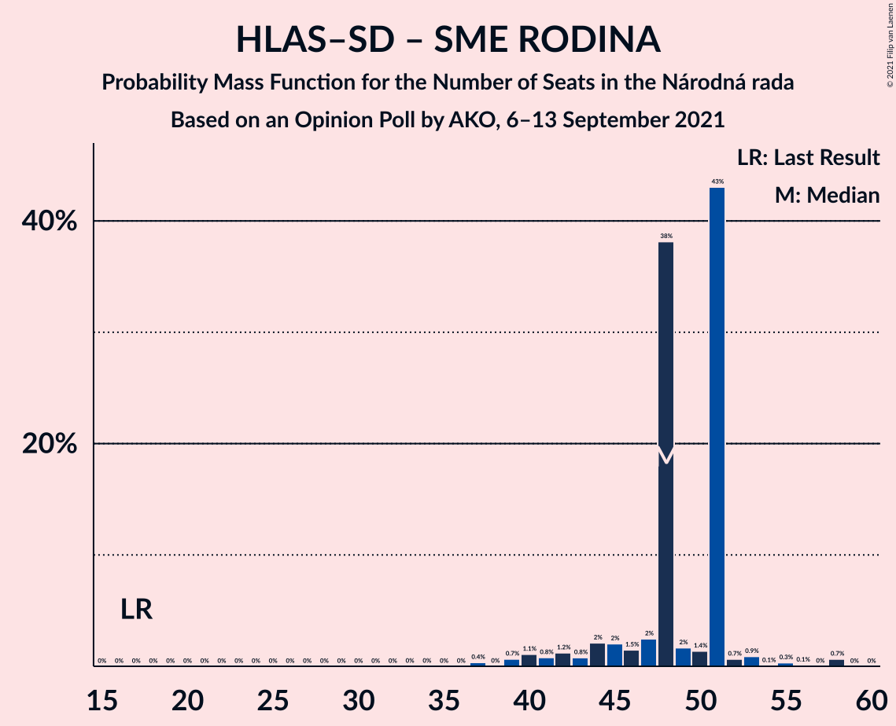

# Opinion Poll by AKO, 6–13 September 2021

<a href="#voting-intentions">Voting Intentions</a> | <a href="#seats">Seats</a> | <a href="#coalitions">Coalitions</a> | <a href="#technical-information">Technical Information</a>

## Voting Intentions

### Confidence Intervals

| Party | Last Result | Poll Result | 80% Confidence Interval | 90% Confidence Interval | 95% Confidence Interval | 99% Confidence Interval |
|:-----:|:-----------:|:-----------:|:-----------------------:|:-----------------------:|:-----------------------:|:-----------------------:|
| HLAS–sociálna demokracia | 0.0% | 18.8% | 17.3–20.5% |16.9–20.9% |16.5–21.4% |15.8–22.2% |
| Sloboda a Solidarita | 6.2% | 14.5% | 13.2–16.0% |12.8–16.4% |12.5–16.8% |11.8–17.6% |
| SMER–sociálna demokracia | 18.3% | 13.9% | 12.6–15.4% |12.2–15.8% |11.9–16.2% |11.3–16.9% |
| OBYČAJNÍ ĽUDIA a nezávislé osobnosti | 25.0% | 9.9% | 8.8–11.2% |8.5–11.6% |8.2–11.9% |7.7–12.6% |
| Progresívne Slovensko | 7.0% | 8.7% | 7.7–10.0% |7.3–10.3% |7.1–10.6% |6.6–11.2% |
| SME RODINA | 8.2% | 6.8% | 5.9–7.9% |5.6–8.3% |5.4–8.5% |5.0–9.1% |
| Kresťanskodemokratické hnutie | 4.6% | 6.6% | 5.7–7.7% |5.4–8.0% |5.2–8.3% |4.8–8.9% |
| REPUBLIKA | 0.0% | 5.2% | 4.4–6.2% |4.2–6.5% |4.0–6.8% |3.6–7.3% |
| Strana maďarskej koalície–Magyar Koalíció Pártja | 3.9% | 3.8% | 3.1–4.7% |2.9–5.0% |2.8–5.2% |2.5–5.6% |
| Slovenská národná strana | 3.2% | 3.5% | 2.9–4.4% |2.7–4.6% |2.5–4.8% |2.2–5.3% |
| Kotleba–Ľudová strana Naše Slovensko | 8.0% | 2.7% | 2.1–3.5% |2.0–3.7% |1.9–3.9% |1.6–4.3% |
| Za ľudí | 5.8% | 1.7% | 1.3–2.4% |1.2–2.5% |1.1–2.7% |0.9–3.1% |
| Dobrá voľba | 3.1% | 0.9% | 0.6–1.4% |0.5–1.6% |0.5–1.7% |0.4–2.0% |
| SPOLU–Občianska Demokracia | 7.0% | 0.8% | 0.5–1.3% |0.5–1.4% |0.4–1.6% |0.3–1.9% |

*Note:* The poll result column reflects the actual value used in the calculations. Published results may vary slightly, and in addition be rounded to fewer digits.

## Seats

### Confidence Intervals

| Party | Last Result | Median | 80% Confidence Interval | 90% Confidence Interval | 95% Confidence Interval | 99% Confidence Interval |
|:-----:|:-----------:|:------:|:-----------------------:|:-----------------------:|:-----------------------:|:-----------------------:|
| <a href="#hlas–sociálna-demokracia">HLAS–sociálna demokracia</a> | 0 | 37 | 34–39 |31–39 |31–40 |29–42 |
| <a href="#sloboda-a-solidarita">Sloboda a Solidarita</a> | 13 | 28 | 24–30 |23–30 |23–30 |20–32 |
| <a href="#smer–sociálna-demokracia">SMER–sociálna demokracia</a> | 38 | 24 | 21–29 |21–29 |21–29 |21–30 |
| <a href="#obyčajní-ľudia-a-nezávislé-osobnosti">OBYČAJNÍ ĽUDIA a nezávislé osobnosti</a> | 53 | 20 | 16–20 |16–20 |16–20 |14–22 |
| <a href="#progresívne-slovensko">Progresívne Slovensko</a> | 0 | 14 | 13–18 |13–18 |12–18 |11–19 |
| <a href="#sme-rodina">SME RODINA</a> | 17 | 12 | 11–12 |11–14 |9–15 |0–17 |
| <a href="#kresťanskodemokratické-hnutie">Kresťanskodemokratické hnutie</a> | 0 | 12 | 11–12 |10–13 |9–14 |0–16 |
| <a href="#republika">REPUBLIKA</a> | 0 | 0 | 0–10 |0–10 |0–10 |0–12 |
| <a href="#strana-maďarskej-koalície–magyar-koalíció-pártja">Strana maďarskej koalície–Magyar Koalíció Pártja</a> | 0 | 0 | 0 |0 |0 |0–9 |
| <a href="#slovenská-národná-strana">Slovenská národná strana</a> | 0 | 0 | 0 |0 |0 |0–9 |
| <a href="#kotleba–ľudová-strana-naše-slovensko">Kotleba–Ľudová strana Naše Slovensko</a> | 17 | 0 | 0 |0 |0 |0 |
| <a href="#za-ľudí">Za ľudí</a> | 12 | 0 | 0 |0 |0 |0 |
| <a href="#dobrá-voľba">Dobrá voľba</a> | 0 | 0 | 0 |0 |0 |0 |
| <a href="#spolu–občianska-demokracia">SPOLU–Občianska Demokracia</a> | 0 | 0 | 0 |0 |0 |0 |

### HLAS–sociálna demokracia

*For a full overview of the results for this party, see the [HLAS–sociálna demokracia](party-hlas–sociálnademokracia.html) page.*

| Number of Seats | Probability | Accumulated | Special Marks |
|:---------------:|:-----------:|:-----------:|:-------------:|
| 0 | 0% | 100% | Last Result |
| 1 | 0% | 100% |  |
| 2 | 0% | 100% |  |
| 3 | 0% | 100% |  |
| 4 | 0% | 100% |  |
| 5 | 0% | 100% |  |
| 6 | 0% | 100% |  |
| 7 | 0% | 100% |  |
| 8 | 0% | 100% |  |
| 9 | 0% | 100% |  |
| 10 | 0% | 100% |  |
| 11 | 0% | 100% |  |
| 12 | 0% | 100% |  |
| 13 | 0% | 100% |  |
| 14 | 0% | 100% |  |
| 15 | 0% | 100% |  |
| 16 | 0% | 100% |  |
| 17 | 0% | 100% |  |
| 18 | 0% | 100% |  |
| 19 | 0% | 100% |  |
| 20 | 0% | 100% |  |
| 21 | 0% | 100% |  |
| 22 | 0% | 100% |  |
| 23 | 0% | 100% |  |
| 24 | 0% | 100% |  |
| 25 | 0% | 100% |  |
| 26 | 0% | 100% |  |
| 27 | 0.1% | 100% |  |
| 28 | 0.1% | 99.9% |  |
| 29 | 1.1% | 99.8% |  |
| 30 | 0.2% | 98.7% |  |
| 31 | 5% | 98% |  |
| 32 | 1.5% | 94% |  |
| 33 | 1.5% | 92% |  |
| 34 | 1.2% | 91% |  |
| 35 | 2% | 90% |  |
| 36 | 32% | 88% |  |
| 37 | 10% | 56% | Median |
| 38 | 0.4% | 46% |  |
| 39 | 43% | 46% |  |
| 40 | 0.5% | 3% |  |
| 41 | 1.4% | 2% |  |
| 42 | 0.7% | 0.8% |  |
| 43 | 0% | 0% |  |

### Sloboda a Solidarita

*For a full overview of the results for this party, see the [Sloboda a Solidarita](party-slobodaasolidarita.html) page.*

| Number of Seats | Probability | Accumulated | Special Marks |
|:---------------:|:-----------:|:-----------:|:-------------:|
| 13 | 0% | 100% | Last Result |
| 14 | 0% | 100% |  |
| 15 | 0% | 100% |  |
| 16 | 0% | 100% |  |
| 17 | 0% | 100% |  |
| 18 | 0% | 100% |  |
| 19 | 0% | 100% |  |
| 20 | 0.9% | 100% |  |
| 21 | 0.1% | 99.1% |  |
| 22 | 1.3% | 99.0% |  |
| 23 | 3% | 98% |  |
| 24 | 30% | 94% |  |
| 25 | 2% | 65% |  |
| 26 | 1.1% | 62% |  |
| 27 | 3% | 61% |  |
| 28 | 13% | 59% | Median |
| 29 | 1.0% | 46% |  |
| 30 | 44% | 45% |  |
| 31 | 0% | 0.8% |  |
| 32 | 0.3% | 0.8% |  |
| 33 | 0.5% | 0.5% |  |
| 34 | 0% | 0% |  |

### SMER–sociálna demokracia

*For a full overview of the results for this party, see the [SMER–sociálna demokracia](party-smer–sociálnademokracia.html) page.*

| Number of Seats | Probability | Accumulated | Special Marks |
|:---------------:|:-----------:|:-----------:|:-------------:|
| 20 | 0.1% | 100% |  |
| 21 | 26% | 99.8% |  |
| 22 | 0.6% | 74% |  |
| 23 | 1.0% | 73% |  |
| 24 | 46% | 72% | Median |
| 25 | 5% | 26% |  |
| 26 | 8% | 21% |  |
| 27 | 1.4% | 14% |  |
| 28 | 0.5% | 12% |  |
| 29 | 11% | 12% |  |
| 30 | 0.5% | 0.8% |  |
| 31 | 0% | 0.3% |  |
| 32 | 0% | 0.3% |  |
| 33 | 0.2% | 0.3% |  |
| 34 | 0% | 0% |  |
| 35 | 0% | 0% |  |
| 36 | 0% | 0% |  |
| 37 | 0% | 0% |  |
| 38 | 0% | 0% | Last Result |

### OBYČAJNÍ ĽUDIA a nezávislé osobnosti

*For a full overview of the results for this party, see the [OBYČAJNÍ ĽUDIA a nezávislé osobnosti](party-obyčajníľudiaanezávisléosobnosti.html) page.*

| Number of Seats | Probability | Accumulated | Special Marks |
|:---------------:|:-----------:|:-----------:|:-------------:|
| 13 | 0.1% | 100% |  |
| 14 | 0.5% | 99.9% |  |
| 15 | 0.9% | 99.4% |  |
| 16 | 10% | 98.5% |  |
| 17 | 3% | 88% |  |
| 18 | 32% | 86% |  |
| 19 | 4% | 54% |  |
| 20 | 48% | 50% | Median |
| 21 | 0.9% | 2% |  |
| 22 | 0.7% | 0.9% |  |
| 23 | 0% | 0.2% |  |
| 24 | 0.2% | 0.2% |  |
| 25 | 0% | 0% |  |
| 26 | 0% | 0% |  |
| 27 | 0% | 0% |  |
| 28 | 0% | 0% |  |
| 29 | 0% | 0% |  |
| 30 | 0% | 0% |  |
| 31 | 0% | 0% |  |
| 32 | 0% | 0% |  |
| 33 | 0% | 0% |  |
| 34 | 0% | 0% |  |
| 35 | 0% | 0% |  |
| 36 | 0% | 0% |  |
| 37 | 0% | 0% |  |
| 38 | 0% | 0% |  |
| 39 | 0% | 0% |  |
| 40 | 0% | 0% |  |
| 41 | 0% | 0% |  |
| 42 | 0% | 0% |  |
| 43 | 0% | 0% |  |
| 44 | 0% | 0% |  |
| 45 | 0% | 0% |  |
| 46 | 0% | 0% |  |
| 47 | 0% | 0% |  |
| 48 | 0% | 0% |  |
| 49 | 0% | 0% |  |
| 50 | 0% | 0% |  |
| 51 | 0% | 0% |  |
| 52 | 0% | 0% |  |
| 53 | 0% | 0% | Last Result |

### Progresívne Slovensko

*For a full overview of the results for this party, see the [Progresívne Slovensko](party-progresívneslovensko.html) page.*

| Number of Seats | Probability | Accumulated | Special Marks |
|:---------------:|:-----------:|:-----------:|:-------------:|
| 0 | 0% | 100% | Last Result |
| 1 | 0% | 100% |  |
| 2 | 0% | 100% |  |
| 3 | 0% | 100% |  |
| 4 | 0% | 100% |  |
| 5 | 0% | 100% |  |
| 6 | 0% | 100% |  |
| 7 | 0% | 100% |  |
| 8 | 0% | 100% |  |
| 9 | 0% | 100% |  |
| 10 | 0% | 100% |  |
| 11 | 1.2% | 100% |  |
| 12 | 3% | 98.8% |  |
| 13 | 44% | 96% |  |
| 14 | 4% | 52% | Median |
| 15 | 4% | 49% |  |
| 16 | 7% | 45% |  |
| 17 | 0.9% | 38% |  |
| 18 | 36% | 37% |  |
| 19 | 0.7% | 1.1% |  |
| 20 | 0.4% | 0.4% |  |
| 21 | 0% | 0.1% |  |
| 22 | 0% | 0% |  |

### SME RODINA

*For a full overview of the results for this party, see the [SME RODINA](party-smerodina.html) page.*

| Number of Seats | Probability | Accumulated | Special Marks |
|:---------------:|:-----------:|:-----------:|:-------------:|
| 0 | 0.9% | 100% |  |
| 1 | 0% | 99.1% |  |
| 2 | 0% | 99.1% |  |
| 3 | 0% | 99.1% |  |
| 4 | 0% | 99.1% |  |
| 5 | 0% | 99.1% |  |
| 6 | 0% | 99.1% |  |
| 7 | 0% | 99.1% |  |
| 8 | 0% | 99.1% |  |
| 9 | 2% | 99.1% |  |
| 10 | 0.8% | 97% |  |
| 11 | 14% | 96% |  |
| 12 | 73% | 83% | Median |
| 13 | 4% | 10% |  |
| 14 | 2% | 6% |  |
| 15 | 2% | 4% |  |
| 16 | 0.9% | 2% |  |
| 17 | 0.7% | 0.8% | Last Result |
| 18 | 0.1% | 0.1% |  |
| 19 | 0% | 0% |  |

### Kresťanskodemokratické hnutie

*For a full overview of the results for this party, see the [Kresťanskodemokratické hnutie](party-kresťanskodemokratickéhnutie.html) page.*

| Number of Seats | Probability | Accumulated | Special Marks |
|:---------------:|:-----------:|:-----------:|:-------------:|
| 0 | 0.8% | 100% | Last Result |
| 1 | 0% | 99.2% |  |
| 2 | 0% | 99.2% |  |
| 3 | 0% | 99.2% |  |
| 4 | 0% | 99.2% |  |
| 5 | 0% | 99.2% |  |
| 6 | 0% | 99.2% |  |
| 7 | 0% | 99.2% |  |
| 8 | 0% | 99.2% |  |
| 9 | 3% | 99.2% |  |
| 10 | 3% | 96% |  |
| 11 | 38% | 93% |  |
| 12 | 45% | 54% | Median |
| 13 | 5% | 9% |  |
| 14 | 2% | 4% |  |
| 15 | 1.0% | 2% |  |
| 16 | 1.0% | 1.5% |  |
| 17 | 0.4% | 0.5% |  |
| 18 | 0.1% | 0.1% |  |
| 19 | 0.1% | 0.1% |  |
| 20 | 0% | 0% |  |

### REPUBLIKA

*For a full overview of the results for this party, see the [REPUBLIKA](party-republika.html) page.*

| Number of Seats | Probability | Accumulated | Special Marks |
|:---------------:|:-----------:|:-----------:|:-------------:|
| 0 | 60% | 100% | Last Result, Median |
| 1 | 0% | 40% |  |
| 2 | 0% | 40% |  |
| 3 | 0% | 40% |  |
| 4 | 0% | 40% |  |
| 5 | 0% | 40% |  |
| 6 | 0% | 40% |  |
| 7 | 0% | 40% |  |
| 8 | 0% | 40% |  |
| 9 | 6% | 40% |  |
| 10 | 33% | 34% |  |
| 11 | 1.3% | 2% |  |
| 12 | 0.4% | 0.6% |  |
| 13 | 0.1% | 0.1% |  |
| 14 | 0% | 0% |  |

### Strana maďarskej koalície–Magyar Koalíció Pártja

*For a full overview of the results for this party, see the [Strana maďarskej koalície–Magyar Koalíció Pártja](party-stranamaďarskejkoalície–magyarkoalíciópártja.html) page.*

| Number of Seats | Probability | Accumulated | Special Marks |
|:---------------:|:-----------:|:-----------:|:-------------:|
| 0 | 98.8% | 100% | Last Result, Median |
| 1 | 0% | 1.2% |  |
| 2 | 0% | 1.2% |  |
| 3 | 0% | 1.2% |  |
| 4 | 0% | 1.2% |  |
| 5 | 0% | 1.2% |  |
| 6 | 0% | 1.2% |  |
| 7 | 0% | 1.2% |  |
| 8 | 0.7% | 1.2% |  |
| 9 | 0.1% | 0.5% |  |
| 10 | 0.3% | 0.4% |  |
| 11 | 0% | 0% |  |

### Slovenská národná strana

*For a full overview of the results for this party, see the [Slovenská národná strana](party-slovenskánárodnástrana.html) page.*

| Number of Seats | Probability | Accumulated | Special Marks |
|:---------------:|:-----------:|:-----------:|:-------------:|
| 0 | 99.0% | 100% | Last Result, Median |
| 1 | 0% | 1.0% |  |
| 2 | 0% | 1.0% |  |
| 3 | 0% | 1.0% |  |
| 4 | 0% | 1.0% |  |
| 5 | 0% | 1.0% |  |
| 6 | 0% | 1.0% |  |
| 7 | 0% | 1.0% |  |
| 8 | 0% | 1.0% |  |
| 9 | 1.0% | 1.0% |  |
| 10 | 0% | 0% |  |

### Kotleba–Ľudová strana Naše Slovensko

*For a full overview of the results for this party, see the [Kotleba–Ľudová strana Naše Slovensko](party-kotleba–ľudovástrananašeslovensko.html) page.*

| Number of Seats | Probability | Accumulated | Special Marks |
|:---------------:|:-----------:|:-----------:|:-------------:|
| 0 | 100% | 100% | Median |
| 1 | 0% | 0% |  |
| 2 | 0% | 0% |  |
| 3 | 0% | 0% |  |
| 4 | 0% | 0% |  |
| 5 | 0% | 0% |  |
| 6 | 0% | 0% |  |
| 7 | 0% | 0% |  |
| 8 | 0% | 0% |  |
| 9 | 0% | 0% |  |
| 10 | 0% | 0% |  |
| 11 | 0% | 0% |  |
| 12 | 0% | 0% |  |
| 13 | 0% | 0% |  |
| 14 | 0% | 0% |  |
| 15 | 0% | 0% |  |
| 16 | 0% | 0% |  |
| 17 | 0% | 0% | Last Result |

### Za ľudí

*For a full overview of the results for this party, see the [Za ľudí](party-zaľudí.html) page.*

| Number of Seats | Probability | Accumulated | Special Marks |
|:---------------:|:-----------:|:-----------:|:-------------:|
| 0 | 100% | 100% | Median |
| 1 | 0% | 0% |  |
| 2 | 0% | 0% |  |
| 3 | 0% | 0% |  |
| 4 | 0% | 0% |  |
| 5 | 0% | 0% |  |
| 6 | 0% | 0% |  |
| 7 | 0% | 0% |  |
| 8 | 0% | 0% |  |
| 9 | 0% | 0% |  |
| 10 | 0% | 0% |  |
| 11 | 0% | 0% |  |
| 12 | 0% | 0% | Last Result |

### Dobrá voľba

*For a full overview of the results for this party, see the [Dobrá voľba](party-dobrávoľba.html) page.*

| Number of Seats | Probability | Accumulated | Special Marks |
|:---------------:|:-----------:|:-----------:|:-------------:|
| 0 | 100% | 100% | Last Result, Median |

### SPOLU–Občianska Demokracia

*For a full overview of the results for this party, see the [SPOLU–Občianska Demokracia](party-spolu–občianskademokracia.html) page.*

| Number of Seats | Probability | Accumulated | Special Marks |
|:---------------:|:-----------:|:-----------:|:-------------:|
| 0 | 100% | 100% | Last Result, Median |

## Coalitions

### Confidence Intervals

| Coalition | Last Result | Median | Majority? | 80% Confidence Interval | 90% Confidence Interval | 95% Confidence Interval | 99% Confidence Interval |
|:---------:|:-----------:|:------:|:---------:|:-----------------------:|:-----------------------:|:-----------------------:|:-----------------------:|
| HLAS–sociálna demokracia – SMER–sociálna demokracia – SME RODINA – Slovenská národná strana – Kotleba–Ľudová strana Naše Slovensko | 72 | 75 | 15% | 69–77 | 69–77 | 67–78 | 63–82 |
| HLAS–sociálna demokracia – SMER–sociálna demokracia – SME RODINA – Slovenská národná strana | 55 | 75 | 15% | 69–77 | 69–77 | 67–78 | 63–82 |
| HLAS–sociálna demokracia – SMER–sociálna demokracia – SME RODINA | 55 | 75 | 14% | 69–77 | 69–77 | 66–77 | 63–82 |
| HLAS–sociálna demokracia – SMER–sociálna demokracia – Slovenská národná strana | 38 | 63 | 0% | 57–66 | 57–66 | 57–66 | 53–68 |
| HLAS–sociálna demokracia – SME RODINA – Slovenská národná strana – Kotleba–Ľudová strana Naše Slovensko | 34 | 48 | 0% | 47–51 | 44–51 | 42–52 | 39–58 |
| HLAS–sociálna demokracia – SME RODINA – Slovenská národná strana | 17 | 48 | 0% | 47–51 | 44–51 | 42–52 | 39–58 |
| HLAS–sociálna demokracia – SME RODINA | 17 | 48 | 0% | 46–51 | 44–51 | 41–52 | 39–58 |
| SMER–sociálna demokracia – SME RODINA – Slovenská národná strana – Kotleba–Ľudová strana Naše Slovensko | 72 | 36 | 0% | 33–40 | 33–41 | 33–42 | 24–45 |
| SMER–sociálna demokracia – SME RODINA – Slovenská národná strana | 55 | 36 | 0% | 33–40 | 33–41 | 33–42 | 24–45 |
| SMER–sociálna demokracia – SME RODINA | 55 | 36 | 0% | 33–40 | 33–40 | 33–41 | 24–43 |
| HLAS–sociálna demokracia – Slovenská národná strana | 0 | 37 | 0% | 35–39 | 31–39 | 31–41 | 29–42 |
| SMER–sociálna demokracia | 38 | 24 | 0% | 21–29 | 21–29 | 21–29 | 21–30 |
| SMER–sociálna demokracia – Slovenská národná strana | 38 | 24 | 0% | 21–29 | 21–29 | 21–29 | 21–33 |

### HLAS–sociálna demokracia – SMER–sociálna demokracia – SME RODINA – Slovenská národná strana – Kotleba–Ľudová strana Naše Slovensko

| Number of Seats | Probability | Accumulated | Special Marks |
|:---------------:|:-----------:|:-----------:|:-------------:|
| 61 | 0.3% | 100% |  |
| 62 | 0% | 99.7% |  |
| 63 | 0.6% | 99.7% |  |
| 64 | 0.1% | 99.0% |  |
| 65 | 0.2% | 98.9% |  |
| 66 | 1.1% | 98.8% |  |
| 67 | 0.3% | 98% |  |
| 68 | 1.2% | 97% |  |
| 69 | 26% | 96% |  |
| 70 | 2% | 70% |  |
| 71 | 2% | 69% |  |
| 72 | 2% | 67% | Last Result |
| 73 | 6% | 65% | Median |
| 74 | 1.4% | 59% |  |
| 75 | 43% | 58% |  |
| 76 | 2% | 15% | Majority |
| 77 | 10% | 13% |  |
| 78 | 0.2% | 3% |  |
| 79 | 1.0% | 2% |  |
| 80 | 0.4% | 1.4% |  |
| 81 | 0.1% | 0.9% |  |
| 82 | 0.7% | 0.8% |  |
| 83 | 0.1% | 0.1% |  |
| 84 | 0% | 0% |  |

### HLAS–sociálna demokracia – SMER–sociálna demokracia – SME RODINA – Slovenská národná strana

| Number of Seats | Probability | Accumulated | Special Marks |
|:---------------:|:-----------:|:-----------:|:-------------:|
| 55 | 0% | 100% | Last Result |
| 56 | 0% | 100% |  |
| 57 | 0% | 100% |  |
| 58 | 0% | 100% |  |
| 59 | 0% | 100% |  |
| 60 | 0% | 100% |  |
| 61 | 0.3% | 100% |  |
| 62 | 0% | 99.7% |  |
| 63 | 0.6% | 99.7% |  |
| 64 | 0.1% | 99.0% |  |
| 65 | 0.2% | 98.9% |  |
| 66 | 1.1% | 98.8% |  |
| 67 | 0.3% | 98% |  |
| 68 | 1.2% | 97% |  |
| 69 | 26% | 96% |  |
| 70 | 2% | 70% |  |
| 71 | 2% | 69% |  |
| 72 | 2% | 67% |  |
| 73 | 6% | 65% | Median |
| 74 | 1.4% | 59% |  |
| 75 | 43% | 58% |  |
| 76 | 2% | 15% | Majority |
| 77 | 10% | 13% |  |
| 78 | 0.2% | 3% |  |
| 79 | 1.0% | 2% |  |
| 80 | 0.4% | 1.4% |  |
| 81 | 0.1% | 0.9% |  |
| 82 | 0.7% | 0.8% |  |
| 83 | 0.1% | 0.1% |  |
| 84 | 0% | 0% |  |

### HLAS–sociálna demokracia – SMER–sociálna demokracia – SME RODINA

| Number of Seats | Probability | Accumulated | Special Marks |
|:---------------:|:-----------:|:-----------:|:-------------:|
| 55 | 0% | 100% | Last Result |
| 56 | 0% | 100% |  |
| 57 | 0% | 100% |  |
| 58 | 0% | 100% |  |
| 59 | 0% | 100% |  |
| 60 | 0% | 100% |  |
| 61 | 0.3% | 100% |  |
| 62 | 0% | 99.7% |  |
| 63 | 0.6% | 99.6% |  |
| 64 | 0.1% | 99.0% |  |
| 65 | 0.9% | 98.9% |  |
| 66 | 1.1% | 98% |  |
| 67 | 0.3% | 97% |  |
| 68 | 1.2% | 97% |  |
| 69 | 26% | 95% |  |
| 70 | 2% | 70% |  |
| 71 | 2% | 68% |  |
| 72 | 2% | 66% |  |
| 73 | 6% | 64% | Median |
| 74 | 0.7% | 58% |  |
| 75 | 43% | 58% |  |
| 76 | 2% | 14% | Majority |
| 77 | 10% | 13% |  |
| 78 | 0.2% | 2% |  |
| 79 | 0.9% | 2% |  |
| 80 | 0.4% | 1.2% |  |
| 81 | 0.1% | 0.8% |  |
| 82 | 0.7% | 0.7% |  |
| 83 | 0% | 0% |  |

### HLAS–sociálna demokracia – SMER–sociálna demokracia – Slovenská národná strana

| Number of Seats | Probability | Accumulated | Special Marks |
|:---------------:|:-----------:|:-----------:|:-------------:|
| 38 | 0% | 100% | Last Result |
| 39 | 0% | 100% |  |
| 40 | 0% | 100% |  |
| 41 | 0% | 100% |  |
| 42 | 0% | 100% |  |
| 43 | 0% | 100% |  |
| 44 | 0% | 100% |  |
| 45 | 0% | 100% |  |
| 46 | 0% | 100% |  |
| 47 | 0% | 100% |  |
| 48 | 0% | 100% |  |
| 49 | 0% | 100% |  |
| 50 | 0% | 100% |  |
| 51 | 0.1% | 100% |  |
| 52 | 0.3% | 99.9% |  |
| 53 | 0.1% | 99.6% |  |
| 54 | 0.2% | 99.5% |  |
| 55 | 0.5% | 99.3% |  |
| 56 | 1.2% | 98.9% |  |
| 57 | 30% | 98% |  |
| 58 | 0.9% | 68% |  |
| 59 | 0.7% | 67% |  |
| 60 | 1.2% | 66% |  |
| 61 | 5% | 65% | Median |
| 62 | 2% | 60% |  |
| 63 | 44% | 58% |  |
| 64 | 0.5% | 14% |  |
| 65 | 2% | 13% |  |
| 66 | 11% | 12% |  |
| 67 | 0% | 0.9% |  |
| 68 | 0.7% | 0.9% |  |
| 69 | 0.1% | 0.2% |  |
| 70 | 0.1% | 0.1% |  |
| 71 | 0% | 0% |  |

### HLAS–sociálna demokracia – SME RODINA – Slovenská národná strana – Kotleba–Ľudová strana Naše Slovensko

| Number of Seats | Probability | Accumulated | Special Marks |
|:---------------:|:-----------:|:-----------:|:-------------:|
| 34 | 0% | 100% | Last Result |
| 35 | 0% | 100% |  |
| 36 | 0% | 100% |  |
| 37 | 0.4% | 100% |  |
| 38 | 0% | 99.6% |  |
| 39 | 0.7% | 99.6% |  |
| 40 | 1.1% | 98.9% |  |
| 41 | 0.1% | 98% |  |
| 42 | 1.2% | 98% |  |
| 43 | 0.8% | 97% |  |
| 44 | 2% | 96% |  |
| 45 | 2% | 94% |  |
| 46 | 1.5% | 92% |  |
| 47 | 2% | 90% |  |
| 48 | 38% | 88% |  |
| 49 | 2% | 50% | Median |
| 50 | 2% | 48% |  |
| 51 | 43% | 46% |  |
| 52 | 0.7% | 3% |  |
| 53 | 0.9% | 2% |  |
| 54 | 0.2% | 1.4% |  |
| 55 | 0.3% | 1.2% |  |
| 56 | 0.1% | 0.9% |  |
| 57 | 0% | 0.7% |  |
| 58 | 0.7% | 0.7% |  |
| 59 | 0% | 0% |  |

### HLAS–sociálna demokracia – SME RODINA – Slovenská národná strana

| Number of Seats | Probability | Accumulated | Special Marks |
|:---------------:|:-----------:|:-----------:|:-------------:|
| 17 | 0% | 100% | Last Result |
| 18 | 0% | 100% |  |
| 19 | 0% | 100% |  |
| 20 | 0% | 100% |  |
| 21 | 0% | 100% |  |
| 22 | 0% | 100% |  |
| 23 | 0% | 100% |  |
| 24 | 0% | 100% |  |
| 25 | 0% | 100% |  |
| 26 | 0% | 100% |  |
| 27 | 0% | 100% |  |
| 28 | 0% | 100% |  |
| 29 | 0% | 100% |  |
| 30 | 0% | 100% |  |
| 31 | 0% | 100% |  |
| 32 | 0% | 100% |  |
| 33 | 0% | 100% |  |
| 34 | 0% | 100% |  |
| 35 | 0% | 100% |  |
| 36 | 0% | 100% |  |
| 37 | 0.4% | 100% |  |
| 38 | 0% | 99.6% |  |
| 39 | 0.7% | 99.6% |  |
| 40 | 1.1% | 98.9% |  |
| 41 | 0.1% | 98% |  |
| 42 | 1.2% | 98% |  |
| 43 | 0.8% | 97% |  |
| 44 | 2% | 96% |  |
| 45 | 2% | 94% |  |
| 46 | 1.5% | 92% |  |
| 47 | 2% | 90% |  |
| 48 | 38% | 88% |  |
| 49 | 2% | 50% | Median |
| 50 | 2% | 48% |  |
| 51 | 43% | 46% |  |
| 52 | 0.7% | 3% |  |
| 53 | 0.9% | 2% |  |
| 54 | 0.2% | 1.4% |  |
| 55 | 0.3% | 1.2% |  |
| 56 | 0.1% | 0.9% |  |
| 57 | 0% | 0.7% |  |
| 58 | 0.7% | 0.7% |  |
| 59 | 0% | 0% |  |

### HLAS–sociálna demokracia – SME RODINA

| Number of Seats | Probability | Accumulated | Special Marks |
|:---------------:|:-----------:|:-----------:|:-------------:|
| 17 | 0% | 100% | Last Result |
| 18 | 0% | 100% |  |
| 19 | 0% | 100% |  |
| 20 | 0% | 100% |  |
| 21 | 0% | 100% |  |
| 22 | 0% | 100% |  |
| 23 | 0% | 100% |  |
| 24 | 0% | 100% |  |
| 25 | 0% | 100% |  |
| 26 | 0% | 100% |  |
| 27 | 0% | 100% |  |
| 28 | 0% | 100% |  |
| 29 | 0% | 100% |  |
| 30 | 0% | 100% |  |
| 31 | 0% | 100% |  |
| 32 | 0% | 100% |  |
| 33 | 0% | 100% |  |
| 34 | 0% | 100% |  |
| 35 | 0% | 100% |  |
| 36 | 0% | 100% |  |
| 37 | 0.4% | 100% |  |
| 38 | 0% | 99.6% |  |
| 39 | 0.7% | 99.6% |  |
| 40 | 1.1% | 98.9% |  |
| 41 | 0.8% | 98% |  |
| 42 | 1.2% | 97% |  |
| 43 | 0.8% | 96% |  |
| 44 | 2% | 95% |  |
| 45 | 2% | 93% |  |
| 46 | 1.5% | 91% |  |
| 47 | 2% | 89% |  |
| 48 | 38% | 87% |  |
| 49 | 2% | 49% | Median |
| 50 | 1.4% | 47% |  |
| 51 | 43% | 46% |  |
| 52 | 0.7% | 3% |  |
| 53 | 0.9% | 2% |  |
| 54 | 0.1% | 1.2% |  |
| 55 | 0.3% | 1.1% |  |
| 56 | 0.1% | 0.8% |  |
| 57 | 0% | 0.7% |  |
| 58 | 0.7% | 0.7% |  |
| 59 | 0% | 0% |  |

### SMER–sociálna demokracia – SME RODINA – Slovenská národná strana – Kotleba–Ľudová strana Naše Slovensko

| Number of Seats | Probability | Accumulated | Special Marks |
|:---------------:|:-----------:|:-----------:|:-------------:|
| 24 | 0.6% | 100% |  |
| 25 | 0% | 99.4% |  |
| 26 | 0% | 99.4% |  |
| 27 | 0% | 99.4% |  |
| 28 | 0% | 99.4% |  |
| 29 | 0.3% | 99.4% |  |
| 30 | 0.3% | 99.1% |  |
| 31 | 0.1% | 98.8% |  |
| 32 | 0% | 98.7% |  |
| 33 | 26% | 98.6% |  |
| 34 | 0.4% | 73% |  |
| 35 | 2% | 72% |  |
| 36 | 43% | 70% | Median |
| 37 | 7% | 28% |  |
| 38 | 2% | 21% |  |
| 39 | 2% | 19% |  |
| 40 | 11% | 17% |  |
| 41 | 3% | 6% |  |
| 42 | 2% | 3% |  |
| 43 | 1.0% | 2% |  |
| 44 | 0% | 0.6% |  |
| 45 | 0% | 0.5% |  |
| 46 | 0.2% | 0.5% |  |
| 47 | 0.1% | 0.3% |  |
| 48 | 0% | 0.2% |  |
| 49 | 0.1% | 0.2% |  |
| 50 | 0% | 0% |  |
| 51 | 0% | 0% |  |
| 52 | 0% | 0% |  |
| 53 | 0% | 0% |  |
| 54 | 0% | 0% |  |
| 55 | 0% | 0% |  |
| 56 | 0% | 0% |  |
| 57 | 0% | 0% |  |
| 58 | 0% | 0% |  |
| 59 | 0% | 0% |  |
| 60 | 0% | 0% |  |
| 61 | 0% | 0% |  |
| 62 | 0% | 0% |  |
| 63 | 0% | 0% |  |
| 64 | 0% | 0% |  |
| 65 | 0% | 0% |  |
| 66 | 0% | 0% |  |
| 67 | 0% | 0% |  |
| 68 | 0% | 0% |  |
| 69 | 0% | 0% |  |
| 70 | 0% | 0% |  |
| 71 | 0% | 0% |  |
| 72 | 0% | 0% | Last Result |

### SMER–sociálna demokracia – SME RODINA – Slovenská národná strana

| Number of Seats | Probability | Accumulated | Special Marks |
|:---------------:|:-----------:|:-----------:|:-------------:|
| 24 | 0.6% | 100% |  |
| 25 | 0% | 99.4% |  |
| 26 | 0% | 99.4% |  |
| 27 | 0% | 99.4% |  |
| 28 | 0% | 99.4% |  |
| 29 | 0.3% | 99.4% |  |
| 30 | 0.3% | 99.1% |  |
| 31 | 0.1% | 98.8% |  |
| 32 | 0% | 98.7% |  |
| 33 | 26% | 98.6% |  |
| 34 | 0.4% | 73% |  |
| 35 | 2% | 72% |  |
| 36 | 43% | 70% | Median |
| 37 | 7% | 28% |  |
| 38 | 2% | 21% |  |
| 39 | 2% | 19% |  |
| 40 | 11% | 17% |  |
| 41 | 3% | 6% |  |
| 42 | 2% | 3% |  |
| 43 | 1.0% | 2% |  |
| 44 | 0% | 0.6% |  |
| 45 | 0% | 0.5% |  |
| 46 | 0.2% | 0.5% |  |
| 47 | 0.1% | 0.3% |  |
| 48 | 0% | 0.2% |  |
| 49 | 0.1% | 0.2% |  |
| 50 | 0% | 0% |  |
| 51 | 0% | 0% |  |
| 52 | 0% | 0% |  |
| 53 | 0% | 0% |  |
| 54 | 0% | 0% |  |
| 55 | 0% | 0% | Last Result |

### SMER–sociálna demokracia – SME RODINA

| Number of Seats | Probability | Accumulated | Special Marks |
|:---------------:|:-----------:|:-----------:|:-------------:|
| 24 | 0.6% | 100% |  |
| 25 | 0% | 99.4% |  |
| 26 | 0% | 99.4% |  |
| 27 | 0% | 99.4% |  |
| 28 | 0% | 99.4% |  |
| 29 | 0.3% | 99.4% |  |
| 30 | 0.3% | 99.1% |  |
| 31 | 0.1% | 98.8% |  |
| 32 | 0% | 98.6% |  |
| 33 | 27% | 98.6% |  |
| 34 | 0.4% | 72% |  |
| 35 | 2% | 72% |  |
| 36 | 43% | 70% | Median |
| 37 | 7% | 27% |  |
| 38 | 2% | 20% |  |
| 39 | 2% | 19% |  |
| 40 | 11% | 16% |  |
| 41 | 3% | 5% |  |
| 42 | 0.9% | 2% |  |
| 43 | 1.0% | 1.3% |  |
| 44 | 0% | 0.3% |  |
| 45 | 0% | 0.2% |  |
| 46 | 0.2% | 0.2% |  |
| 47 | 0% | 0% |  |
| 48 | 0% | 0% |  |
| 49 | 0% | 0% |  |
| 50 | 0% | 0% |  |
| 51 | 0% | 0% |  |
| 52 | 0% | 0% |  |
| 53 | 0% | 0% |  |
| 54 | 0% | 0% |  |
| 55 | 0% | 0% | Last Result |

### HLAS–sociálna demokracia – Slovenská národná strana

| Number of Seats | Probability | Accumulated | Special Marks |
|:---------------:|:-----------:|:-----------:|:-------------:|
| 0 | 0% | 100% | Last Result |
| 1 | 0% | 100% |  |
| 2 | 0% | 100% |  |
| 3 | 0% | 100% |  |
| 4 | 0% | 100% |  |
| 5 | 0% | 100% |  |
| 6 | 0% | 100% |  |
| 7 | 0% | 100% |  |
| 8 | 0% | 100% |  |
| 9 | 0% | 100% |  |
| 10 | 0% | 100% |  |
| 11 | 0% | 100% |  |
| 12 | 0% | 100% |  |
| 13 | 0% | 100% |  |
| 14 | 0% | 100% |  |
| 15 | 0% | 100% |  |
| 16 | 0% | 100% |  |
| 17 | 0% | 100% |  |
| 18 | 0% | 100% |  |
| 19 | 0% | 100% |  |
| 20 | 0% | 100% |  |
| 21 | 0% | 100% |  |
| 22 | 0% | 100% |  |
| 23 | 0% | 100% |  |
| 24 | 0% | 100% |  |
| 25 | 0% | 100% |  |
| 26 | 0% | 100% |  |
| 27 | 0.1% | 100% |  |
| 28 | 0.1% | 99.9% |  |
| 29 | 1.1% | 99.8% |  |
| 30 | 0.1% | 98.7% |  |
| 31 | 5% | 98.6% |  |
| 32 | 0.7% | 94% |  |
| 33 | 1.5% | 93% |  |
| 34 | 1.1% | 92% |  |
| 35 | 2% | 91% |  |
| 36 | 32% | 89% |  |
| 37 | 10% | 57% | Median |
| 38 | 0.4% | 47% |  |
| 39 | 43% | 47% |  |
| 40 | 0.5% | 3% |  |
| 41 | 2% | 3% |  |
| 42 | 0.7% | 0.9% |  |
| 43 | 0.1% | 0.2% |  |
| 44 | 0% | 0.1% |  |
| 45 | 0.1% | 0.1% |  |
| 46 | 0% | 0% |  |

### SMER–sociálna demokracia

| Number of Seats | Probability | Accumulated | Special Marks |
|:---------------:|:-----------:|:-----------:|:-------------:|
| 20 | 0.1% | 100% |  |
| 21 | 26% | 99.8% |  |
| 22 | 0.6% | 74% |  |
| 23 | 1.0% | 73% |  |
| 24 | 46% | 72% | Median |
| 25 | 5% | 26% |  |
| 26 | 8% | 21% |  |
| 27 | 1.4% | 14% |  |
| 28 | 0.5% | 12% |  |
| 29 | 11% | 12% |  |
| 30 | 0.5% | 0.8% |  |
| 31 | 0% | 0.3% |  |
| 32 | 0% | 0.3% |  |
| 33 | 0.2% | 0.3% |  |
| 34 | 0% | 0% |  |
| 35 | 0% | 0% |  |
| 36 | 0% | 0% |  |
| 37 | 0% | 0% |  |
| 38 | 0% | 0% | Last Result |

### SMER–sociálna demokracia – Slovenská národná strana

| Number of Seats | Probability | Accumulated | Special Marks |
|:---------------:|:-----------:|:-----------:|:-------------:|
| 20 | 0.1% | 100% |  |
| 21 | 26% | 99.9% |  |
| 22 | 0.6% | 74% |  |
| 23 | 0.9% | 73% |  |
| 24 | 45% | 72% | Median |
| 25 | 5% | 27% |  |
| 26 | 8% | 22% |  |
| 27 | 1.3% | 15% |  |
| 28 | 0.5% | 13% |  |
| 29 | 11% | 13% |  |
| 30 | 0.5% | 2% |  |
| 31 | 0% | 1.3% |  |
| 32 | 0% | 1.3% |  |
| 33 | 1.0% | 1.2% |  |
| 34 | 0.2% | 0.3% |  |
| 35 | 0% | 0% |  |
| 36 | 0% | 0% |  |
| 37 | 0% | 0% |  |
| 38 | 0% | 0% | Last Result |

## Technical Information

### Opinion Poll

+ **Polling firm:** AKO
+ **Commissioner(s):** —
+ **Fieldwork period:** 6–13 September 2021

### Calculations

+ **Sample size:** 1000
+ **Simulations done:** 1,048,576
+ **Error estimate:** 3.17%

