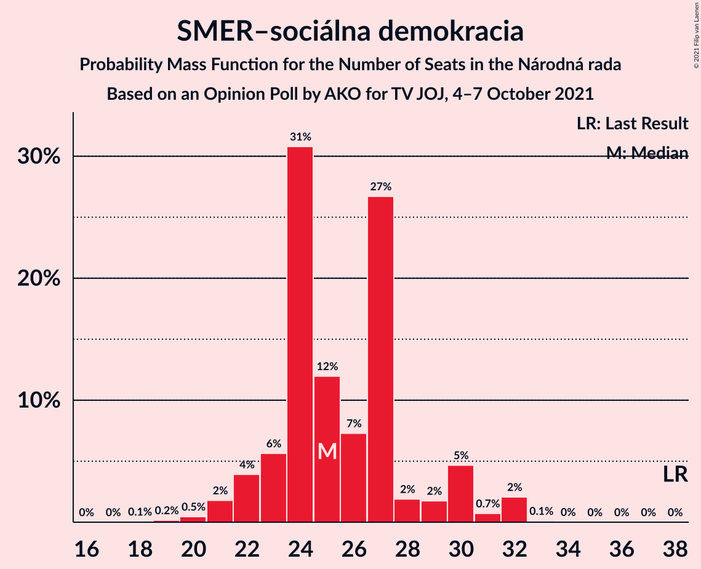
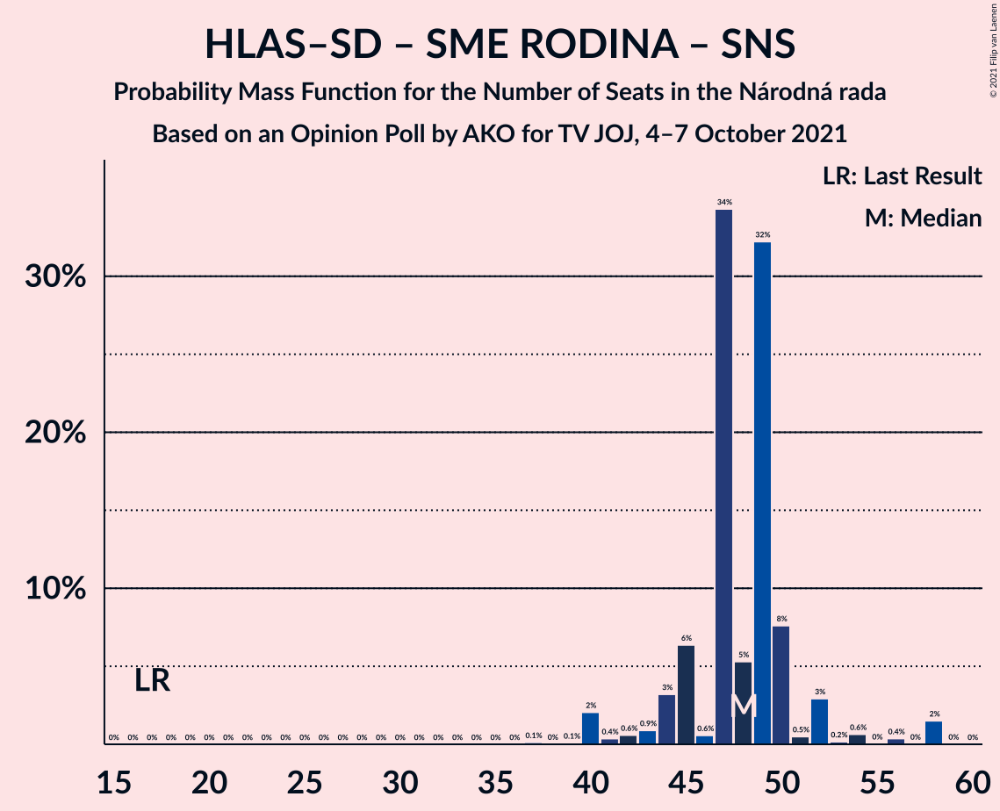

# Opinion Poll by AKO for TV JOJ, 4–7 October 2021

<a href="#voting-intentions">Voting Intentions</a> | <a href="#seats">Seats</a> | <a href="#coalitions">Coalitions</a> | <a href="#technical-information">Technical Information</a>

## Voting Intentions

### Confidence Intervals

| Party | Last Result | Poll Result | 80% Confidence Interval | 90% Confidence Interval | 95% Confidence Interval | 99% Confidence Interval |
|:-----:|:-----------:|:-----------:|:-----------------------:|:-----------------------:|:-----------------------:|:-----------------------:|
| HLAS–sociálna demokracia | 0.0% | 18.2% | 16.7–19.8% |16.3–20.3% |15.9–20.7% |15.2–21.5% |
| Sloboda a Solidarita | 6.2% | 14.5% | 13.2–16.0% |12.8–16.4% |12.5–16.8% |11.8–17.6% |
| SMER–sociálna demokracia | 18.3% | 13.8% | 12.5–15.3% |12.1–15.7% |11.8–16.1% |11.2–16.8% |
| OBYČAJNÍ ĽUDIA a nezávislé osobnosti | 25.0% | 9.2% | 8.1–10.5% |7.8–10.8% |7.6–11.2% |7.1–11.8% |
| Progresívne Slovensko | 7.0% | 8.6% | 7.6–9.8% |7.3–10.2% |7.0–10.5% |6.5–11.1% |
| SME RODINA | 8.2% | 7.4% | 6.4–8.6% |6.2–8.9% |5.9–9.2% |5.5–9.8% |
| Kresťanskodemokratické hnutie | 4.6% | 5.9% | 5.0–7.0% |4.8–7.3% |4.6–7.5% |4.2–8.1% |
| REPUBLIKA | 0.0% | 5.0% | 4.2–6.0% |4.0–6.3% |3.8–6.5% |3.5–7.1% |
| Strana maďarskej koalície–Magyar Koalíció Pártja | 3.9% | 4.5% | 3.8–5.5% |3.6–5.7% |3.4–6.0% |3.0–6.5% |
| Slovenská národná strana | 3.2% | 3.6% | 2.9–4.5% |2.8–4.7% |2.6–5.0% |2.3–5.4% |
| Kotleba–Ľudová strana Naše Slovensko | 8.0% | 2.3% | 1.8–3.0% |1.6–3.2% |1.5–3.4% |1.3–3.8% |
| Za ľudí | 5.8% | 2.1% | 1.6–2.8% |1.5–3.0% |1.4–3.2% |1.2–3.6% |
| Dobrá voľba | 3.1% | 1.8% | 1.4–2.5% |1.2–2.7% |1.1–2.8% |1.0–3.2% |
| SPOLU–Občianska Demokracia | 7.0% | 1.2% | 0.9–1.8% |0.8–1.9% |0.7–2.1% |0.5–2.4% |

*Note:* The poll result column reflects the actual value used in the calculations. Published results may vary slightly, and in addition be rounded to fewer digits.

## Seats

### Confidence Intervals

| Party | Last Result | Median | 80% Confidence Interval | 90% Confidence Interval | 95% Confidence Interval | 99% Confidence Interval |
|:-----:|:-----------:|:------:|:-----------------------:|:-----------------------:|:-----------------------:|:-----------------------:|
| <a href="#hlas–sociálna-demokracia">HLAS–sociálna demokracia</a> | 0 | 35 | 32–36 |31–37 |29–38 |28–39 |
| <a href="#sloboda-a-solidarita">Sloboda a Solidarita</a> | 13 | 27 | 24–33 |23–33 |23–33 |21–35 |
| <a href="#smer–sociálna-demokracia">SMER–sociálna demokracia</a> | 38 | 25 | 23–28 |22–30 |22–31 |20–32 |
| <a href="#obyčajní-ľudia-a-nezávislé-osobnosti">OBYČAJNÍ ĽUDIA a nezávislé osobnosti</a> | 53 | 16 | 13–19 |13–19 |13–21 |13–22 |
| <a href="#progresívne-slovensko">Progresívne Slovensko</a> | 0 | 17 | 12–19 |12–20 |12–20 |12–22 |
| <a href="#sme-rodina">SME RODINA</a> | 17 | 13 | 12–15 |11–16 |11–17 |11–17 |
| <a href="#kresťanskodemokratické-hnutie">Kresťanskodemokratické hnutie</a> | 0 | 11 | 9–12 |9–13 |0–13 |0–14 |
| <a href="#republika">REPUBLIKA</a> | 0 | 10 | 0–10 |0–10 |0–11 |0–13 |
| <a href="#strana-maďarskej-koalície–magyar-koalíció-pártja">Strana maďarskej koalície–Magyar Koalíció Pártja</a> | 0 | 0 | 0–9 |0–10 |0–11 |0–11 |
| <a href="#slovenská-národná-strana">Slovenská národná strana</a> | 0 | 0 | 0 |0 |0 |0–10 |
| <a href="#kotleba–ľudová-strana-naše-slovensko">Kotleba–Ľudová strana Naše Slovensko</a> | 17 | 0 | 0 |0 |0 |0 |
| <a href="#za-ľudí">Za ľudí</a> | 12 | 0 | 0 |0 |0 |0 |
| <a href="#dobrá-voľba">Dobrá voľba</a> | 0 | 0 | 0 |0 |0 |0 |
| <a href="#spolu–občianska-demokracia">SPOLU–Občianska Demokracia</a> | 0 | 0 | 0 |0 |0 |0 |

### HLAS–sociálna demokracia

*For a full overview of the results for this party, see the [HLAS–sociálna demokracia](party-hlas–sociálnademokracia.html) page.*

| Number of Seats | Probability | Accumulated | Special Marks |
|:---------------:|:-----------:|:-----------:|:-------------:|
| 0 | 0% | 100% | Last Result |
| 1 | 0% | 100% |  |
| 2 | 0% | 100% |  |
| 3 | 0% | 100% |  |
| 4 | 0% | 100% |  |
| 5 | 0% | 100% |  |
| 6 | 0% | 100% |  |
| 7 | 0% | 100% |  |
| 8 | 0% | 100% |  |
| 9 | 0% | 100% |  |
| 10 | 0% | 100% |  |
| 11 | 0% | 100% |  |
| 12 | 0% | 100% |  |
| 13 | 0% | 100% |  |
| 14 | 0% | 100% |  |
| 15 | 0% | 100% |  |
| 16 | 0% | 100% |  |
| 17 | 0% | 100% |  |
| 18 | 0% | 100% |  |
| 19 | 0% | 100% |  |
| 20 | 0% | 100% |  |
| 21 | 0% | 100% |  |
| 22 | 0% | 100% |  |
| 23 | 0% | 100% |  |
| 24 | 0% | 100% |  |
| 25 | 0% | 100% |  |
| 26 | 0.1% | 100% |  |
| 27 | 0.1% | 99.9% |  |
| 28 | 1.3% | 99.8% |  |
| 29 | 3% | 98.5% |  |
| 30 | 0.8% | 96% |  |
| 31 | 1.4% | 95% |  |
| 32 | 4% | 94% |  |
| 33 | 5% | 89% |  |
| 34 | 11% | 84% |  |
| 35 | 39% | 73% | Median |
| 36 | 29% | 34% |  |
| 37 | 2% | 5% |  |
| 38 | 2% | 3% |  |
| 39 | 0.6% | 0.8% |  |
| 40 | 0.1% | 0.2% |  |
| 41 | 0.1% | 0.1% |  |
| 42 | 0% | 0.1% |  |
| 43 | 0% | 0% |  |

### Sloboda a Solidarita

*For a full overview of the results for this party, see the [Sloboda a Solidarita](party-slobodaasolidarita.html) page.*

| Number of Seats | Probability | Accumulated | Special Marks |
|:---------------:|:-----------:|:-----------:|:-------------:|
| 13 | 0% | 100% | Last Result |
| 14 | 0% | 100% |  |
| 15 | 0% | 100% |  |
| 16 | 0% | 100% |  |
| 17 | 0% | 100% |  |
| 18 | 0% | 100% |  |
| 19 | 0.2% | 100% |  |
| 20 | 0.1% | 99.8% |  |
| 21 | 0.3% | 99.7% |  |
| 22 | 0.2% | 99.4% |  |
| 23 | 5% | 99.3% |  |
| 24 | 32% | 95% |  |
| 25 | 6% | 63% |  |
| 26 | 4% | 56% |  |
| 27 | 33% | 52% | Median |
| 28 | 1.3% | 19% |  |
| 29 | 5% | 18% |  |
| 30 | 1.2% | 13% |  |
| 31 | 2% | 12% |  |
| 32 | 0.1% | 10% |  |
| 33 | 9% | 10% |  |
| 34 | 0.1% | 0.6% |  |
| 35 | 0.5% | 0.5% |  |
| 36 | 0% | 0% |  |

### SMER–sociálna demokracia

*For a full overview of the results for this party, see the [SMER–sociálna demokracia](party-smer–sociálnademokracia.html) page.*

| Number of Seats | Probability | Accumulated | Special Marks |
|:---------------:|:-----------:|:-----------:|:-------------:|
| 18 | 0.1% | 100% |  |
| 19 | 0.2% | 99.9% |  |
| 20 | 0.5% | 99.8% |  |
| 21 | 2% | 99.3% |  |
| 22 | 4% | 98% |  |
| 23 | 6% | 94% |  |
| 24 | 31% | 88% |  |
| 25 | 12% | 57% | Median |
| 26 | 7% | 45% |  |
| 27 | 27% | 38% |  |
| 28 | 2% | 11% |  |
| 29 | 2% | 9% |  |
| 30 | 5% | 8% |  |
| 31 | 0.7% | 3% |  |
| 32 | 2% | 2% |  |
| 33 | 0.1% | 0.1% |  |
| 34 | 0% | 0% |  |
| 35 | 0% | 0% |  |
| 36 | 0% | 0% |  |
| 37 | 0% | 0% |  |
| 38 | 0% | 0% | Last Result |

### OBYČAJNÍ ĽUDIA a nezávislé osobnosti

*For a full overview of the results for this party, see the [OBYČAJNÍ ĽUDIA a nezávislé osobnosti](party-obyčajníľudiaanezávisléosobnosti.html) page.*

| Number of Seats | Probability | Accumulated | Special Marks |
|:---------------:|:-----------:|:-----------:|:-------------:|
| 10 | 0.1% | 100% |  |
| 11 | 0% | 99.9% |  |
| 12 | 0.1% | 99.9% |  |
| 13 | 32% | 99.8% |  |
| 14 | 3% | 68% |  |
| 15 | 8% | 64% |  |
| 16 | 25% | 57% | Median |
| 17 | 13% | 32% |  |
| 18 | 2% | 19% |  |
| 19 | 13% | 18% |  |
| 20 | 2% | 5% |  |
| 21 | 2% | 3% |  |
| 22 | 0.5% | 0.8% |  |
| 23 | 0.1% | 0.3% |  |
| 24 | 0.2% | 0.2% |  |
| 25 | 0% | 0% |  |
| 26 | 0% | 0% |  |
| 27 | 0% | 0% |  |
| 28 | 0% | 0% |  |
| 29 | 0% | 0% |  |
| 30 | 0% | 0% |  |
| 31 | 0% | 0% |  |
| 32 | 0% | 0% |  |
| 33 | 0% | 0% |  |
| 34 | 0% | 0% |  |
| 35 | 0% | 0% |  |
| 36 | 0% | 0% |  |
| 37 | 0% | 0% |  |
| 38 | 0% | 0% |  |
| 39 | 0% | 0% |  |
| 40 | 0% | 0% |  |
| 41 | 0% | 0% |  |
| 42 | 0% | 0% |  |
| 43 | 0% | 0% |  |
| 44 | 0% | 0% |  |
| 45 | 0% | 0% |  |
| 46 | 0% | 0% |  |
| 47 | 0% | 0% |  |
| 48 | 0% | 0% |  |
| 49 | 0% | 0% |  |
| 50 | 0% | 0% |  |
| 51 | 0% | 0% |  |
| 52 | 0% | 0% |  |
| 53 | 0% | 0% | Last Result |

### Progresívne Slovensko

*For a full overview of the results for this party, see the [Progresívne Slovensko](party-progresívneslovensko.html) page.*

| Number of Seats | Probability | Accumulated | Special Marks |
|:---------------:|:-----------:|:-----------:|:-------------:|
| 0 | 0% | 100% | Last Result |
| 1 | 0% | 100% |  |
| 2 | 0% | 100% |  |
| 3 | 0% | 100% |  |
| 4 | 0% | 100% |  |
| 5 | 0% | 100% |  |
| 6 | 0% | 100% |  |
| 7 | 0% | 100% |  |
| 8 | 0% | 100% |  |
| 9 | 0% | 100% |  |
| 10 | 0% | 100% |  |
| 11 | 0.3% | 100% |  |
| 12 | 25% | 99.7% |  |
| 13 | 3% | 74% |  |
| 14 | 0.7% | 72% |  |
| 15 | 12% | 71% |  |
| 16 | 5% | 59% |  |
| 17 | 9% | 54% | Median |
| 18 | 34% | 45% |  |
| 19 | 6% | 11% |  |
| 20 | 4% | 5% |  |
| 21 | 0% | 1.2% |  |
| 22 | 1.2% | 1.2% |  |
| 23 | 0% | 0% |  |

### SME RODINA

*For a full overview of the results for this party, see the [SME RODINA](party-smerodina.html) page.*

| Number of Seats | Probability | Accumulated | Special Marks |
|:---------------:|:-----------:|:-----------:|:-------------:|
| 9 | 0.1% | 100% |  |
| 10 | 0.4% | 99.9% |  |
| 11 | 7% | 99.5% |  |
| 12 | 38% | 93% |  |
| 13 | 31% | 55% | Median |
| 14 | 10% | 24% |  |
| 15 | 9% | 14% |  |
| 16 | 2% | 5% |  |
| 17 | 3% | 4% | Last Result |
| 18 | 0.1% | 0.2% |  |
| 19 | 0.1% | 0.1% |  |
| 20 | 0% | 0% |  |

### Kresťanskodemokratické hnutie

*For a full overview of the results for this party, see the [Kresťanskodemokratické hnutie](party-kresťanskodemokratickéhnutie.html) page.*

| Number of Seats | Probability | Accumulated | Special Marks |
|:---------------:|:-----------:|:-----------:|:-------------:|
| 0 | 5% | 100% | Last Result |
| 1 | 0% | 95% |  |
| 2 | 0% | 95% |  |
| 3 | 0% | 95% |  |
| 4 | 0% | 95% |  |
| 5 | 0% | 95% |  |
| 6 | 0% | 95% |  |
| 7 | 0% | 95% |  |
| 8 | 0.1% | 95% |  |
| 9 | 8% | 95% |  |
| 10 | 5% | 87% |  |
| 11 | 40% | 82% | Median |
| 12 | 36% | 43% |  |
| 13 | 6% | 7% |  |
| 14 | 0.5% | 0.7% |  |
| 15 | 0.2% | 0.2% |  |
| 16 | 0% | 0% |  |

### REPUBLIKA

*For a full overview of the results for this party, see the [REPUBLIKA](party-republika.html) page.*

| Number of Seats | Probability | Accumulated | Special Marks |
|:---------------:|:-----------:|:-----------:|:-------------:|
| 0 | 33% | 100% | Last Result |
| 1 | 0% | 67% |  |
| 2 | 0% | 67% |  |
| 3 | 0% | 67% |  |
| 4 | 0% | 67% |  |
| 5 | 0% | 67% |  |
| 6 | 0% | 67% |  |
| 7 | 0% | 67% |  |
| 8 | 0% | 67% |  |
| 9 | 5% | 67% |  |
| 10 | 57% | 62% | Median |
| 11 | 3% | 5% |  |
| 12 | 0.7% | 2% |  |
| 13 | 1.0% | 1.0% |  |
| 14 | 0% | 0% |  |

### Strana maďarskej koalície–Magyar Koalíció Pártja

*For a full overview of the results for this party, see the [Strana maďarskej koalície–Magyar Koalíció Pártja](party-stranamaďarskejkoalície–magyarkoalíciópártja.html) page.*

| Number of Seats | Probability | Accumulated | Special Marks |
|:---------------:|:-----------:|:-----------:|:-------------:|
| 0 | 89% | 100% | Last Result, Median |
| 1 | 0% | 11% |  |
| 2 | 0% | 11% |  |
| 3 | 0% | 11% |  |
| 4 | 0% | 11% |  |
| 5 | 0% | 11% |  |
| 6 | 0% | 11% |  |
| 7 | 0% | 11% |  |
| 8 | 0.1% | 11% |  |
| 9 | 5% | 11% |  |
| 10 | 2% | 6% |  |
| 11 | 3% | 4% |  |
| 12 | 0.1% | 0.3% |  |
| 13 | 0.1% | 0.1% |  |
| 14 | 0% | 0% |  |

### Slovenská národná strana

*For a full overview of the results for this party, see the [Slovenská národná strana](party-slovenskánárodnástrana.html) page.*

| Number of Seats | Probability | Accumulated | Special Marks |
|:---------------:|:-----------:|:-----------:|:-------------:|
| 0 | 98% | 100% | Last Result, Median |
| 1 | 0% | 2% |  |
| 2 | 0% | 2% |  |
| 3 | 0% | 2% |  |
| 4 | 0% | 2% |  |
| 5 | 0% | 2% |  |
| 6 | 0% | 2% |  |
| 7 | 0% | 2% |  |
| 8 | 0% | 2% |  |
| 9 | 2% | 2% |  |
| 10 | 0.6% | 0.6% |  |
| 11 | 0% | 0% |  |

### Kotleba–Ľudová strana Naše Slovensko

*For a full overview of the results for this party, see the [Kotleba–Ľudová strana Naše Slovensko](party-kotleba–ľudovástrananašeslovensko.html) page.*

| Number of Seats | Probability | Accumulated | Special Marks |
|:---------------:|:-----------:|:-----------:|:-------------:|
| 0 | 100% | 100% | Median |
| 1 | 0% | 0% |  |
| 2 | 0% | 0% |  |
| 3 | 0% | 0% |  |
| 4 | 0% | 0% |  |
| 5 | 0% | 0% |  |
| 6 | 0% | 0% |  |
| 7 | 0% | 0% |  |
| 8 | 0% | 0% |  |
| 9 | 0% | 0% |  |
| 10 | 0% | 0% |  |
| 11 | 0% | 0% |  |
| 12 | 0% | 0% |  |
| 13 | 0% | 0% |  |
| 14 | 0% | 0% |  |
| 15 | 0% | 0% |  |
| 16 | 0% | 0% |  |
| 17 | 0% | 0% | Last Result |

### Za ľudí

*For a full overview of the results for this party, see the [Za ľudí](party-zaľudí.html) page.*

| Number of Seats | Probability | Accumulated | Special Marks |
|:---------------:|:-----------:|:-----------:|:-------------:|
| 0 | 100% | 100% | Median |
| 1 | 0% | 0% |  |
| 2 | 0% | 0% |  |
| 3 | 0% | 0% |  |
| 4 | 0% | 0% |  |
| 5 | 0% | 0% |  |
| 6 | 0% | 0% |  |
| 7 | 0% | 0% |  |
| 8 | 0% | 0% |  |
| 9 | 0% | 0% |  |
| 10 | 0% | 0% |  |
| 11 | 0% | 0% |  |
| 12 | 0% | 0% | Last Result |

### Dobrá voľba

*For a full overview of the results for this party, see the [Dobrá voľba](party-dobrávoľba.html) page.*

| Number of Seats | Probability | Accumulated | Special Marks |
|:---------------:|:-----------:|:-----------:|:-------------:|
| 0 | 100% | 100% | Last Result, Median |

### SPOLU–Občianska Demokracia

*For a full overview of the results for this party, see the [SPOLU–Občianska Demokracia](party-spolu–občianskademokracia.html) page.*

| Number of Seats | Probability | Accumulated | Special Marks |
|:---------------:|:-----------:|:-----------:|:-------------:|
| 0 | 100% | 100% | Last Result, Median |

## Coalitions

### Confidence Intervals

| Coalition | Last Result | Median | Majority? | 80% Confidence Interval | 90% Confidence Interval | 95% Confidence Interval | 99% Confidence Interval |
|:---------:|:-----------:|:------:|:---------:|:-----------------------:|:-----------------------:|:-----------------------:|:-----------------------:|
| HLAS–sociálna demokracia – SMER–sociálna demokracia – SME RODINA – Slovenská národná strana – Kotleba–Ľudová strana Naše Slovensko | 72 | 73 | 19% | 70–78 | 67–79 | 64–81 | 63–84 |
| HLAS–sociálna demokracia – SMER–sociálna demokracia – SME RODINA – Slovenská národná strana | 55 | 73 | 19% | 70–78 | 67–79 | 64–81 | 63–84 |
| HLAS–sociálna demokracia – SMER–sociálna demokracia – SME RODINA | 55 | 73 | 17% | 69–77 | 67–78 | 64–80 | 63–83 |
| HLAS–sociálna demokracia – SMER–sociálna demokracia – Slovenská národná strana | 38 | 60 | 0% | 56–64 | 54–65 | 53–67 | 51–70 |
| HLAS–sociálna demokracia – SME RODINA – Slovenská národná strana – Kotleba–Ľudová strana Naše Slovensko | 34 | 48 | 0% | 45–50 | 44–52 | 41–54 | 40–58 |
| HLAS–sociálna demokracia – SME RODINA – Slovenská národná strana | 17 | 48 | 0% | 45–50 | 44–52 | 41–54 | 40–58 |
| HLAS–sociálna demokracia – SME RODINA | 17 | 48 | 0% | 45–50 | 44–50 | 41–52 | 40–54 |
| SMER–sociálna demokracia – SME RODINA – Slovenská národná strana – Kotleba–Ľudová strana Naše Slovensko | 72 | 38 | 0% | 36–44 | 33–44 | 33–46 | 32–49 |
| SMER–sociálna demokracia – SME RODINA – Slovenská národná strana | 55 | 38 | 0% | 36–44 | 33–44 | 33–46 | 32–49 |
| SMER–sociálna demokracia – SME RODINA | 55 | 38 | 0% | 36–44 | 33–44 | 33–44 | 32–46 |
| HLAS–sociálna demokracia – Slovenská národná strana | 0 | 35 | 0% | 32–36 | 31–37 | 29–39 | 28–44 |
| SMER–sociálna demokracia – Slovenská národná strana | 38 | 25 | 0% | 23–29 | 22–31 | 22–32 | 20–36 |
| SMER–sociálna demokracia | 38 | 25 | 0% | 23–28 | 22–30 | 22–31 | 20–32 |

### HLAS–sociálna demokracia – SMER–sociálna demokracia – SME RODINA – Slovenská národná strana – Kotleba–Ľudová strana Naše Slovensko

| Number of Seats | Probability | Accumulated | Special Marks |
|:---------------:|:-----------:|:-----------:|:-------------:|
| 62 | 0.3% | 100% |  |
| 63 | 0.8% | 99.7% |  |
| 64 | 1.4% | 98.9% |  |
| 65 | 0.4% | 97% |  |
| 66 | 2% | 97% |  |
| 67 | 4% | 95% |  |
| 68 | 0.4% | 91% |  |
| 69 | 0.8% | 91% |  |
| 70 | 2% | 90% |  |
| 71 | 2% | 88% |  |
| 72 | 13% | 87% | Last Result |
| 73 | 29% | 74% | Median |
| 74 | 25% | 45% |  |
| 75 | 2% | 20% |  |
| 76 | 7% | 19% | Majority |
| 77 | 0.3% | 12% |  |
| 78 | 7% | 12% |  |
| 79 | 0.5% | 5% |  |
| 80 | 1.0% | 5% |  |
| 81 | 1.5% | 4% |  |
| 82 | 0.1% | 2% |  |
| 83 | 0.3% | 2% |  |
| 84 | 1.5% | 2% |  |
| 85 | 0.3% | 0.4% |  |
| 86 | 0% | 0.1% |  |
| 87 | 0% | 0.1% |  |
| 88 | 0% | 0.1% |  |
| 89 | 0% | 0.1% |  |
| 90 | 0% | 0% |  |

### HLAS–sociálna demokracia – SMER–sociálna demokracia – SME RODINA – Slovenská národná strana

| Number of Seats | Probability | Accumulated | Special Marks |
|:---------------:|:-----------:|:-----------:|:-------------:|
| 55 | 0% | 100% | Last Result |
| 56 | 0% | 100% |  |
| 57 | 0% | 100% |  |
| 58 | 0% | 100% |  |
| 59 | 0% | 100% |  |
| 60 | 0% | 100% |  |
| 61 | 0% | 100% |  |
| 62 | 0.3% | 100% |  |
| 63 | 0.8% | 99.7% |  |
| 64 | 1.4% | 98.9% |  |
| 65 | 0.4% | 97% |  |
| 66 | 2% | 97% |  |
| 67 | 4% | 95% |  |
| 68 | 0.4% | 91% |  |
| 69 | 0.8% | 91% |  |
| 70 | 2% | 90% |  |
| 71 | 2% | 88% |  |
| 72 | 13% | 87% |  |
| 73 | 29% | 74% | Median |
| 74 | 25% | 45% |  |
| 75 | 2% | 20% |  |
| 76 | 7% | 19% | Majority |
| 77 | 0.3% | 12% |  |
| 78 | 7% | 12% |  |
| 79 | 0.5% | 5% |  |
| 80 | 1.0% | 5% |  |
| 81 | 1.5% | 4% |  |
| 82 | 0.1% | 2% |  |
| 83 | 0.3% | 2% |  |
| 84 | 1.5% | 2% |  |
| 85 | 0.3% | 0.4% |  |
| 86 | 0% | 0.1% |  |
| 87 | 0% | 0.1% |  |
| 88 | 0% | 0.1% |  |
| 89 | 0% | 0.1% |  |
| 90 | 0% | 0% |  |

### HLAS–sociálna demokracia – SMER–sociálna demokracia – SME RODINA

| Number of Seats | Probability | Accumulated | Special Marks |
|:---------------:|:-----------:|:-----------:|:-------------:|
| 55 | 0% | 100% | Last Result |
| 56 | 0% | 100% |  |
| 57 | 0% | 100% |  |
| 58 | 0% | 100% |  |
| 59 | 0% | 100% |  |
| 60 | 0% | 100% |  |
| 61 | 0% | 100% |  |
| 62 | 0.3% | 100% |  |
| 63 | 0.9% | 99.7% |  |
| 64 | 1.5% | 98.8% |  |
| 65 | 0.4% | 97% |  |
| 66 | 2% | 97% |  |
| 67 | 4% | 95% |  |
| 68 | 1.0% | 91% |  |
| 69 | 0.8% | 90% |  |
| 70 | 2% | 89% |  |
| 71 | 2% | 88% |  |
| 72 | 12% | 86% |  |
| 73 | 29% | 73% | Median |
| 74 | 25% | 45% |  |
| 75 | 3% | 20% |  |
| 76 | 7% | 17% | Majority |
| 77 | 0.3% | 10% |  |
| 78 | 6% | 10% |  |
| 79 | 0.5% | 4% |  |
| 80 | 1.0% | 3% |  |
| 81 | 1.5% | 2% |  |
| 82 | 0.1% | 0.8% |  |
| 83 | 0.3% | 0.7% |  |
| 84 | 0% | 0.4% |  |
| 85 | 0.3% | 0.3% |  |
| 86 | 0% | 0.1% |  |
| 87 | 0% | 0.1% |  |
| 88 | 0% | 0.1% |  |
| 89 | 0% | 0.1% |  |
| 90 | 0% | 0% |  |

### HLAS–sociálna demokracia – SMER–sociálna demokracia – Slovenská národná strana

| Number of Seats | Probability | Accumulated | Special Marks |
|:---------------:|:-----------:|:-----------:|:-------------:|
| 38 | 0% | 100% | Last Result |
| 39 | 0% | 100% |  |
| 40 | 0% | 100% |  |
| 41 | 0% | 100% |  |
| 42 | 0% | 100% |  |
| 43 | 0% | 100% |  |
| 44 | 0% | 100% |  |
| 45 | 0% | 100% |  |
| 46 | 0% | 100% |  |
| 47 | 0% | 100% |  |
| 48 | 0% | 100% |  |
| 49 | 0% | 100% |  |
| 50 | 0.1% | 100% |  |
| 51 | 1.4% | 99.9% |  |
| 52 | 0.7% | 98% |  |
| 53 | 2% | 98% |  |
| 54 | 1.4% | 96% |  |
| 55 | 2% | 95% |  |
| 56 | 4% | 93% |  |
| 57 | 3% | 89% |  |
| 58 | 1.4% | 86% |  |
| 59 | 3% | 85% |  |
| 60 | 40% | 82% | Median |
| 61 | 5% | 42% |  |
| 62 | 22% | 36% |  |
| 63 | 2% | 14% |  |
| 64 | 7% | 13% |  |
| 65 | 1.5% | 6% |  |
| 66 | 1.5% | 4% |  |
| 67 | 0.7% | 3% |  |
| 68 | 0.3% | 2% |  |
| 69 | 0.2% | 2% |  |
| 70 | 1.5% | 2% |  |
| 71 | 0% | 0.1% |  |
| 72 | 0% | 0.1% |  |
| 73 | 0% | 0.1% |  |
| 74 | 0% | 0.1% |  |
| 75 | 0.1% | 0.1% |  |
| 76 | 0% | 0% | Majority |

### HLAS–sociálna demokracia – SME RODINA – Slovenská národná strana – Kotleba–Ľudová strana Naše Slovensko

| Number of Seats | Probability | Accumulated | Special Marks |
|:---------------:|:-----------:|:-----------:|:-------------:|
| 34 | 0% | 100% | Last Result |
| 35 | 0% | 100% |  |
| 36 | 0% | 100% |  |
| 37 | 0.1% | 100% |  |
| 38 | 0% | 99.9% |  |
| 39 | 0.1% | 99.9% |  |
| 40 | 2% | 99.8% |  |
| 41 | 0.4% | 98% |  |
| 42 | 0.6% | 97% |  |
| 43 | 0.9% | 97% |  |
| 44 | 3% | 96% |  |
| 45 | 6% | 93% |  |
| 46 | 0.6% | 86% |  |
| 47 | 34% | 86% |  |
| 48 | 5% | 51% | Median |
| 49 | 32% | 46% |  |
| 50 | 8% | 14% |  |
| 51 | 0.5% | 6% |  |
| 52 | 3% | 6% |  |
| 53 | 0.2% | 3% |  |
| 54 | 0.6% | 3% |  |
| 55 | 0% | 2% |  |
| 56 | 0.4% | 2% |  |
| 57 | 0% | 2% |  |
| 58 | 2% | 2% |  |
| 59 | 0% | 0% |  |

### HLAS–sociálna demokracia – SME RODINA – Slovenská národná strana

| Number of Seats | Probability | Accumulated | Special Marks |
|:---------------:|:-----------:|:-----------:|:-------------:|
| 17 | 0% | 100% | Last Result |
| 18 | 0% | 100% |  |
| 19 | 0% | 100% |  |
| 20 | 0% | 100% |  |
| 21 | 0% | 100% |  |
| 22 | 0% | 100% |  |
| 23 | 0% | 100% |  |
| 24 | 0% | 100% |  |
| 25 | 0% | 100% |  |
| 26 | 0% | 100% |  |
| 27 | 0% | 100% |  |
| 28 | 0% | 100% |  |
| 29 | 0% | 100% |  |
| 30 | 0% | 100% |  |
| 31 | 0% | 100% |  |
| 32 | 0% | 100% |  |
| 33 | 0% | 100% |  |
| 34 | 0% | 100% |  |
| 35 | 0% | 100% |  |
| 36 | 0% | 100% |  |
| 37 | 0.1% | 100% |  |
| 38 | 0% | 99.9% |  |
| 39 | 0.1% | 99.9% |  |
| 40 | 2% | 99.8% |  |
| 41 | 0.4% | 98% |  |
| 42 | 0.6% | 97% |  |
| 43 | 0.9% | 97% |  |
| 44 | 3% | 96% |  |
| 45 | 6% | 93% |  |
| 46 | 0.6% | 86% |  |
| 47 | 34% | 86% |  |
| 48 | 5% | 51% | Median |
| 49 | 32% | 46% |  |
| 50 | 8% | 14% |  |
| 51 | 0.5% | 6% |  |
| 52 | 3% | 6% |  |
| 53 | 0.2% | 3% |  |
| 54 | 0.6% | 3% |  |
| 55 | 0% | 2% |  |
| 56 | 0.4% | 2% |  |
| 57 | 0% | 2% |  |
| 58 | 2% | 2% |  |
| 59 | 0% | 0% |  |

### HLAS–sociálna demokracia – SME RODINA

| Number of Seats | Probability | Accumulated | Special Marks |
|:---------------:|:-----------:|:-----------:|:-------------:|
| 17 | 0% | 100% | Last Result |
| 18 | 0% | 100% |  |
| 19 | 0% | 100% |  |
| 20 | 0% | 100% |  |
| 21 | 0% | 100% |  |
| 22 | 0% | 100% |  |
| 23 | 0% | 100% |  |
| 24 | 0% | 100% |  |
| 25 | 0% | 100% |  |
| 26 | 0% | 100% |  |
| 27 | 0% | 100% |  |
| 28 | 0% | 100% |  |
| 29 | 0% | 100% |  |
| 30 | 0% | 100% |  |
| 31 | 0% | 100% |  |
| 32 | 0% | 100% |  |
| 33 | 0% | 100% |  |
| 34 | 0% | 100% |  |
| 35 | 0% | 100% |  |
| 36 | 0% | 100% |  |
| 37 | 0.1% | 100% |  |
| 38 | 0% | 99.9% |  |
| 39 | 0.1% | 99.8% |  |
| 40 | 2% | 99.7% |  |
| 41 | 0.4% | 98% |  |
| 42 | 1.1% | 97% |  |
| 43 | 0.9% | 96% |  |
| 44 | 3% | 95% |  |
| 45 | 6% | 92% |  |
| 46 | 0.6% | 86% |  |
| 47 | 34% | 85% |  |
| 48 | 5% | 51% | Median |
| 49 | 34% | 45% |  |
| 50 | 8% | 12% |  |
| 51 | 0.5% | 4% |  |
| 52 | 2% | 4% |  |
| 53 | 0.1% | 1.1% |  |
| 54 | 0.6% | 1.0% |  |
| 55 | 0% | 0.5% |  |
| 56 | 0.4% | 0.4% |  |
| 57 | 0% | 0.1% |  |
| 58 | 0% | 0.1% |  |
| 59 | 0% | 0% |  |

### SMER–sociálna demokracia – SME RODINA – Slovenská národná strana – Kotleba–Ľudová strana Naše Slovensko

| Number of Seats | Probability | Accumulated | Special Marks |
|:---------------:|:-----------:|:-----------:|:-------------:|
| 31 | 0.4% | 100% |  |
| 32 | 0.2% | 99.6% |  |
| 33 | 5% | 99.4% |  |
| 34 | 0.5% | 95% |  |
| 35 | 2% | 94% |  |
| 36 | 2% | 92% |  |
| 37 | 39% | 90% |  |
| 38 | 3% | 50% | Median |
| 39 | 24% | 48% |  |
| 40 | 2% | 24% |  |
| 41 | 7% | 22% |  |
| 42 | 1.0% | 15% |  |
| 43 | 0.7% | 14% |  |
| 44 | 9% | 13% |  |
| 45 | 1.3% | 4% |  |
| 46 | 0.5% | 3% |  |
| 47 | 0.2% | 2% |  |
| 48 | 0.1% | 2% |  |
| 49 | 2% | 2% |  |
| 50 | 0% | 0% |  |
| 51 | 0% | 0% |  |
| 52 | 0% | 0% |  |
| 53 | 0% | 0% |  |
| 54 | 0% | 0% |  |
| 55 | 0% | 0% |  |
| 56 | 0% | 0% |  |
| 57 | 0% | 0% |  |
| 58 | 0% | 0% |  |
| 59 | 0% | 0% |  |
| 60 | 0% | 0% |  |
| 61 | 0% | 0% |  |
| 62 | 0% | 0% |  |
| 63 | 0% | 0% |  |
| 64 | 0% | 0% |  |
| 65 | 0% | 0% |  |
| 66 | 0% | 0% |  |
| 67 | 0% | 0% |  |
| 68 | 0% | 0% |  |
| 69 | 0% | 0% |  |
| 70 | 0% | 0% |  |
| 71 | 0% | 0% |  |
| 72 | 0% | 0% | Last Result |

### SMER–sociálna demokracia – SME RODINA – Slovenská národná strana

| Number of Seats | Probability | Accumulated | Special Marks |
|:---------------:|:-----------:|:-----------:|:-------------:|
| 31 | 0.4% | 100% |  |
| 32 | 0.2% | 99.6% |  |
| 33 | 5% | 99.4% |  |
| 34 | 0.5% | 95% |  |
| 35 | 2% | 94% |  |
| 36 | 2% | 92% |  |
| 37 | 39% | 90% |  |
| 38 | 3% | 50% | Median |
| 39 | 24% | 48% |  |
| 40 | 2% | 24% |  |
| 41 | 7% | 22% |  |
| 42 | 1.0% | 15% |  |
| 43 | 0.7% | 14% |  |
| 44 | 9% | 13% |  |
| 45 | 1.3% | 4% |  |
| 46 | 0.5% | 3% |  |
| 47 | 0.2% | 2% |  |
| 48 | 0.1% | 2% |  |
| 49 | 2% | 2% |  |
| 50 | 0% | 0% |  |
| 51 | 0% | 0% |  |
| 52 | 0% | 0% |  |
| 53 | 0% | 0% |  |
| 54 | 0% | 0% |  |
| 55 | 0% | 0% | Last Result |

### SMER–sociálna demokracia – SME RODINA

| Number of Seats | Probability | Accumulated | Special Marks |
|:---------------:|:-----------:|:-----------:|:-------------:|
| 31 | 0.4% | 100% |  |
| 32 | 0.3% | 99.6% |  |
| 33 | 5% | 99.3% |  |
| 34 | 0.5% | 94% |  |
| 35 | 3% | 94% |  |
| 36 | 2% | 91% |  |
| 37 | 39% | 89% |  |
| 38 | 3% | 50% | Median |
| 39 | 24% | 47% |  |
| 40 | 4% | 23% |  |
| 41 | 7% | 20% |  |
| 42 | 0.9% | 12% |  |
| 43 | 0.7% | 11% |  |
| 44 | 9% | 11% |  |
| 45 | 1.3% | 2% |  |
| 46 | 0.5% | 0.8% |  |
| 47 | 0.2% | 0.3% |  |
| 48 | 0.1% | 0.1% |  |
| 49 | 0% | 0% |  |
| 50 | 0% | 0% |  |
| 51 | 0% | 0% |  |
| 52 | 0% | 0% |  |
| 53 | 0% | 0% |  |
| 54 | 0% | 0% |  |
| 55 | 0% | 0% | Last Result |

### HLAS–sociálna demokracia – Slovenská národná strana

| Number of Seats | Probability | Accumulated | Special Marks |
|:---------------:|:-----------:|:-----------:|:-------------:|
| 0 | 0% | 100% | Last Result |
| 1 | 0% | 100% |  |
| 2 | 0% | 100% |  |
| 3 | 0% | 100% |  |
| 4 | 0% | 100% |  |
| 5 | 0% | 100% |  |
| 6 | 0% | 100% |  |
| 7 | 0% | 100% |  |
| 8 | 0% | 100% |  |
| 9 | 0% | 100% |  |
| 10 | 0% | 100% |  |
| 11 | 0% | 100% |  |
| 12 | 0% | 100% |  |
| 13 | 0% | 100% |  |
| 14 | 0% | 100% |  |
| 15 | 0% | 100% |  |
| 16 | 0% | 100% |  |
| 17 | 0% | 100% |  |
| 18 | 0% | 100% |  |
| 19 | 0% | 100% |  |
| 20 | 0% | 100% |  |
| 21 | 0% | 100% |  |
| 22 | 0% | 100% |  |
| 23 | 0% | 100% |  |
| 24 | 0% | 100% |  |
| 25 | 0% | 100% |  |
| 26 | 0.1% | 100% |  |
| 27 | 0% | 99.9% |  |
| 28 | 1.2% | 99.8% |  |
| 29 | 2% | 98.6% |  |
| 30 | 0.8% | 96% |  |
| 31 | 1.4% | 96% |  |
| 32 | 4% | 94% |  |
| 33 | 5% | 90% |  |
| 34 | 11% | 85% |  |
| 35 | 37% | 74% | Median |
| 36 | 29% | 37% |  |
| 37 | 2% | 7% |  |
| 38 | 2% | 5% |  |
| 39 | 1.1% | 3% |  |
| 40 | 0.1% | 2% |  |
| 41 | 0.2% | 2% |  |
| 42 | 0% | 2% |  |
| 43 | 0% | 2% |  |
| 44 | 1.5% | 2% |  |
| 45 | 0% | 0% |  |

### SMER–sociálna demokracia – Slovenská národná strana

| Number of Seats | Probability | Accumulated | Special Marks |
|:---------------:|:-----------:|:-----------:|:-------------:|
| 19 | 0.1% | 100% |  |
| 20 | 0.4% | 99.9% |  |
| 21 | 2% | 99.4% |  |
| 22 | 4% | 98% |  |
| 23 | 6% | 94% |  |
| 24 | 31% | 88% |  |
| 25 | 12% | 57% | Median |
| 26 | 5% | 45% |  |
| 27 | 27% | 40% |  |
| 28 | 2% | 13% |  |
| 29 | 2% | 12% |  |
| 30 | 5% | 10% |  |
| 31 | 0.8% | 5% |  |
| 32 | 2% | 4% |  |
| 33 | 0.1% | 2% |  |
| 34 | 0% | 2% |  |
| 35 | 1.5% | 2% |  |
| 36 | 0.5% | 0.6% |  |
| 37 | 0% | 0% |  |
| 38 | 0% | 0% | Last Result |

### SMER–sociálna demokracia

| Number of Seats | Probability | Accumulated | Special Marks |
|:---------------:|:-----------:|:-----------:|:-------------:|
| 18 | 0.1% | 100% |  |
| 19 | 0.2% | 99.9% |  |
| 20 | 0.5% | 99.8% |  |
| 21 | 2% | 99.3% |  |
| 22 | 4% | 98% |  |
| 23 | 6% | 94% |  |
| 24 | 31% | 88% |  |
| 25 | 12% | 57% | Median |
| 26 | 7% | 45% |  |
| 27 | 27% | 38% |  |
| 28 | 2% | 11% |  |
| 29 | 2% | 9% |  |
| 30 | 5% | 8% |  |
| 31 | 0.7% | 3% |  |
| 32 | 2% | 2% |  |
| 33 | 0.1% | 0.1% |  |
| 34 | 0% | 0% |  |
| 35 | 0% | 0% |  |
| 36 | 0% | 0% |  |
| 37 | 0% | 0% |  |
| 38 | 0% | 0% | Last Result |

## Technical Information

### Opinion Poll

+ **Polling firm:** AKO
+ **Commissioner(s):** TV JOJ
+ **Fieldwork period:** 4–7 October 2021

### Calculations

+ **Sample size:** 1000
+ **Simulations done:** 1,048,576
+ **Error estimate:** 2.91%

