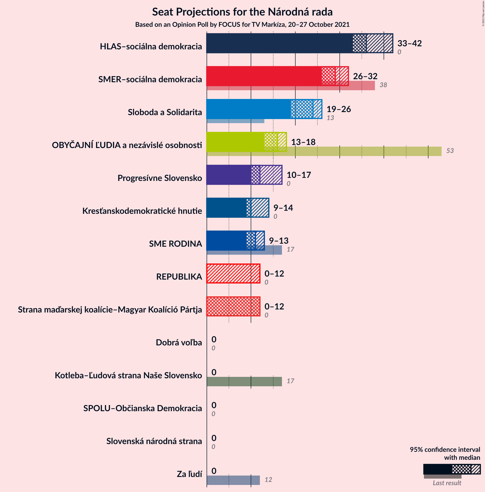
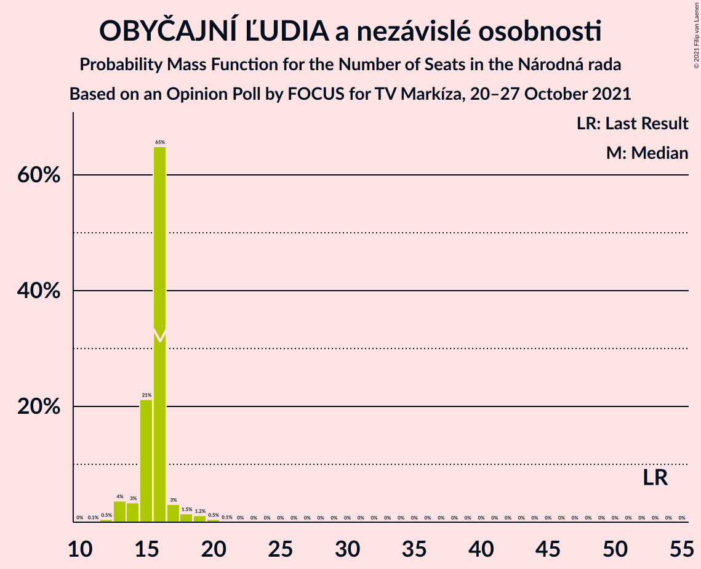
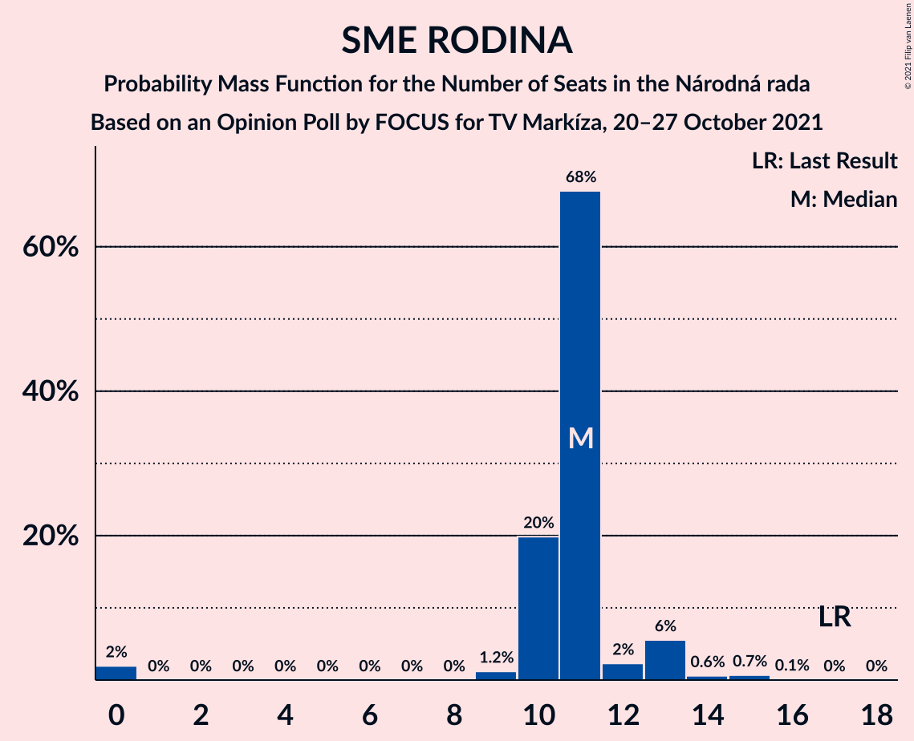
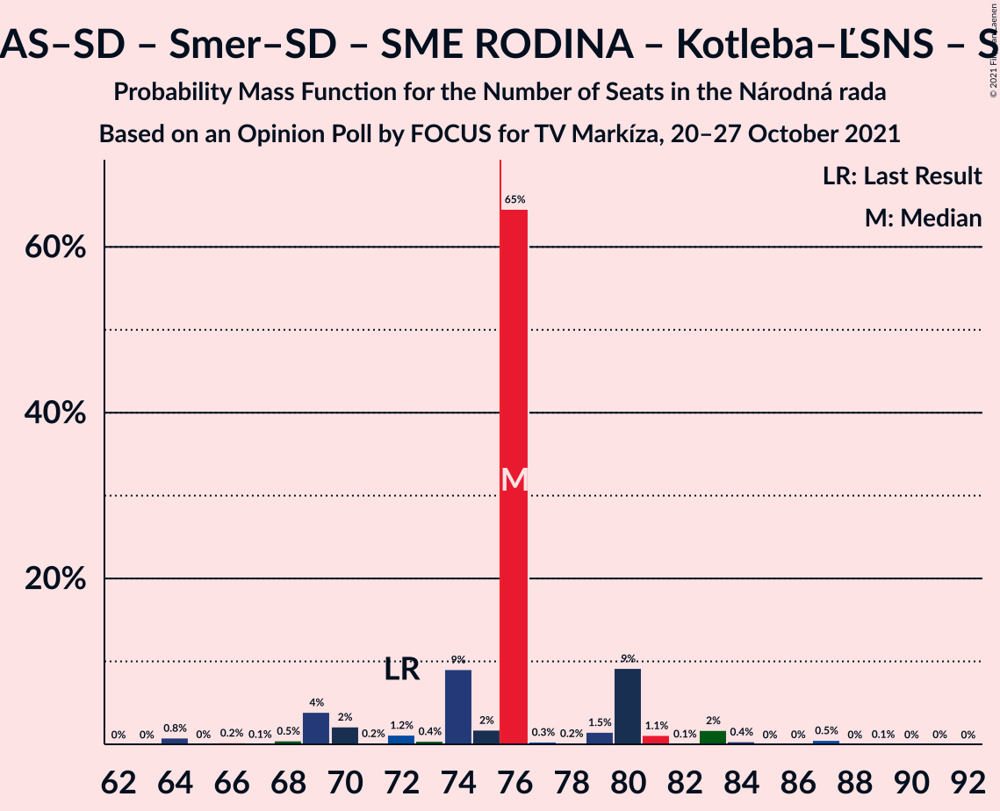
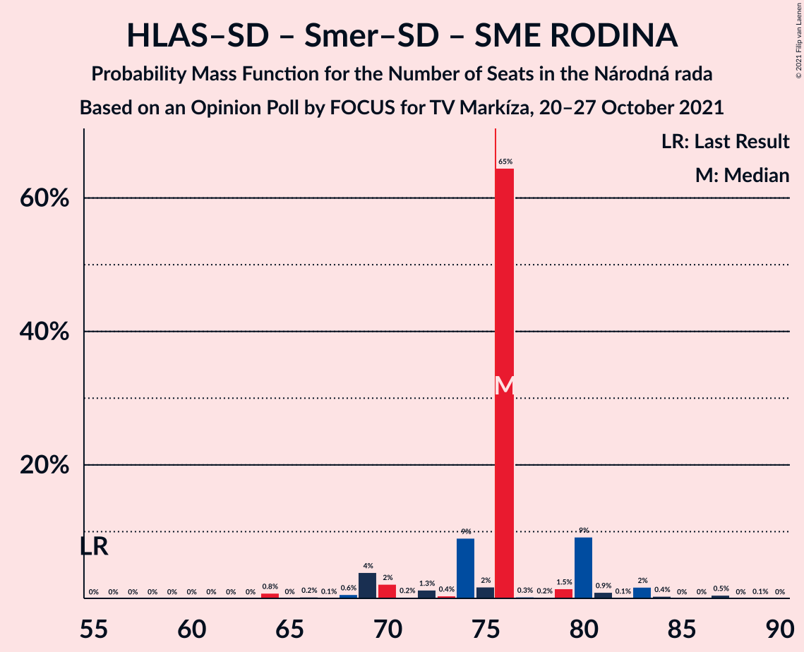
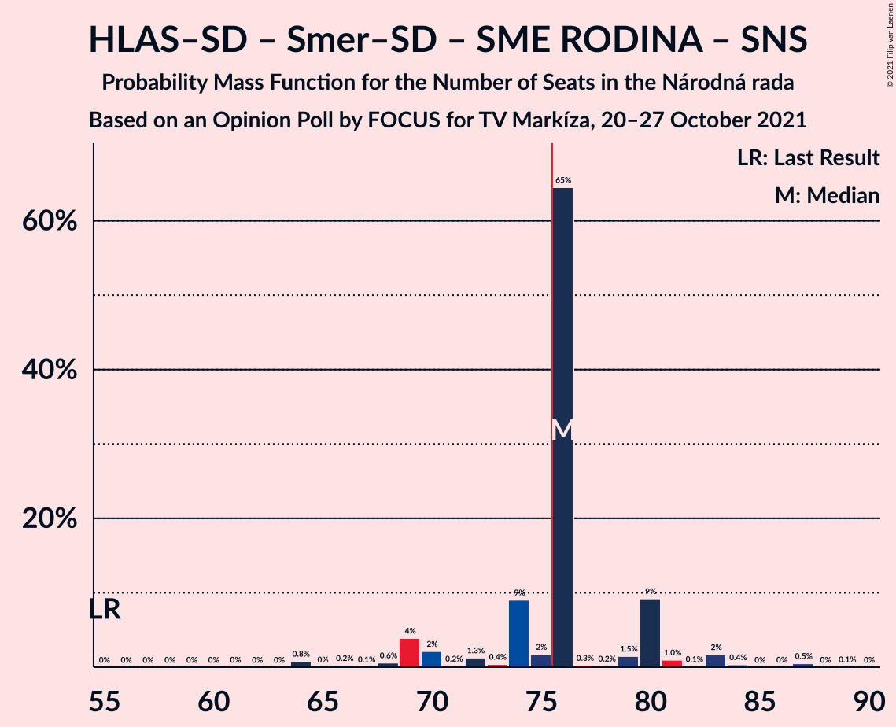
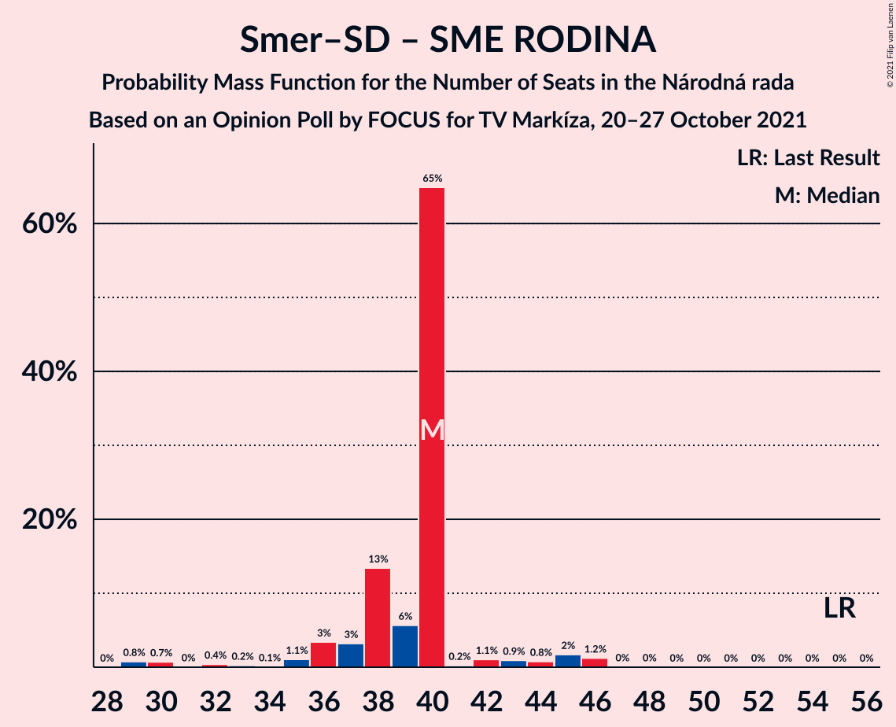
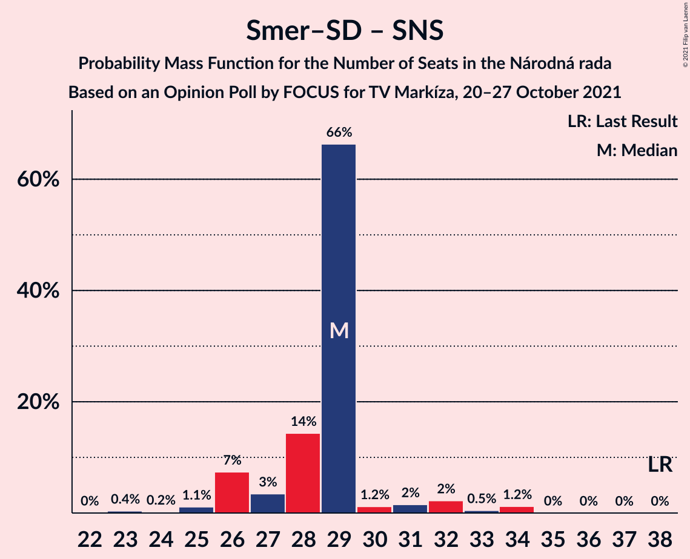

# Opinion Poll by FOCUS for TV Markíza, 20–27 October 2021

<a href="#voting-intentions">Voting Intentions</a> | <a href="#seats">Seats</a> | <a href="#coalitions">Coalitions</a> | <a href="#technical-information">Technical Information</a>

## Voting Intentions

### Confidence Intervals

| Party | Last Result | Poll Result | 80% Confidence Interval | 90% Confidence Interval | 95% Confidence Interval | 99% Confidence Interval |
|:-----:|:-----------:|:-----------:|:-----------------------:|:-----------------------:|:-----------------------:|:-----------------------:|
| HLAS–sociálna demokracia | 0.0% | 19.5% | 18.0–21.2% |17.6–21.7% |17.2–22.1% |16.5–22.9% |
| SMER–sociálna demokracia | 18.3% | 15.5% | 14.1–17.0% |13.7–17.5% |13.4–17.8% |12.7–18.6% |
| Sloboda a Solidarita | 6.2% | 12.2% | 11.0–13.6% |10.6–14.0% |10.3–14.4% |9.7–15.1% |
| OBYČAJNÍ ĽUDIA a nezávislé osobnosti | 25.0% | 8.4% | 7.4–9.6% |7.1–10.0% |6.9–10.3% |6.4–10.9% |
| Progresívne Slovensko | 7.0% | 6.9% | 6.0–8.1% |5.7–8.4% |5.5–8.7% |5.1–9.3% |
| SME RODINA | 8.2% | 6.3% | 5.5–7.4% |5.2–7.8% |5.0–8.0% |4.6–8.6% |
| Kresťanskodemokratické hnutie | 4.6% | 6.1% | 5.3–7.2% |5.0–7.5% |4.8–7.8% |4.4–8.4% |
| REPUBLIKA | 0.0% | 5.5% | 4.6–6.5% |4.4–6.8% |4.2–7.0% |3.8–7.6% |
| Strana maďarskej koalície–Magyar Koalíció Pártja | 3.9% | 5.2% | 4.4–6.2% |4.1–6.4% |3.9–6.7% |3.6–7.2% |
| Kotleba–Ľudová strana Naše Slovensko | 8.0% | 3.8% | 3.1–4.7% |2.9–4.9% |2.8–5.1% |2.5–5.6% |
| Slovenská národná strana | 3.2% | 3.3% | 2.7–4.1% |2.5–4.4% |2.3–4.6% |2.1–5.0% |
| Za ľudí | 5.8% | 2.8% | 2.2–3.6% |2.1–3.8% |1.9–4.0% |1.7–4.4% |
| Dobrá voľba | 3.1% | 2.2% | 1.7–2.9% |1.6–3.1% |1.4–3.3% |1.2–3.7% |
| SPOLU–Občianska Demokracia | 7.0% | 1.1% | 0.8–1.6% |0.7–1.8% |0.6–2.0% |0.5–2.3% |

*Note:* The poll result column reflects the actual value used in the calculations. Published results may vary slightly, and in addition be rounded to fewer digits.

## Seats

### Confidence Intervals

| Party | Last Result | Median | 80% Confidence Interval | 90% Confidence Interval | 95% Confidence Interval | 99% Confidence Interval |
|:-----:|:-----------:|:------:|:-----------------------:|:-----------------------:|:-----------------------:|:-----------------------:|
| <a href="#hlas–sociálna-demokracia">HLAS–sociálna demokracia</a> | 0 | 36 | 35–40 |33–42 |33–42 |31–42 |
| <a href="#smer–sociálna-demokracia">SMER–sociálna demokracia</a> | 38 | 29 | 27–29 |26–31 |26–32 |24–34 |
| <a href="#sloboda-a-solidarita">Sloboda a Solidarita</a> | 13 | 24 | 20–24 |19–26 |19–26 |19–28 |
| <a href="#obyčajní-ľudia-a-nezávislé-osobnosti">OBYČAJNÍ ĽUDIA a nezávislé osobnosti</a> | 53 | 16 | 15–16 |14–17 |13–18 |12–20 |
| <a href="#progresívne-slovensko">Progresívne Slovensko</a> | 0 | 12 | 12–15 |11–15 |10–17 |0–18 |
| <a href="#sme-rodina">SME RODINA</a> | 17 | 11 | 10–11 |10–13 |9–13 |0–15 |
| <a href="#kresťanskodemokratické-hnutie">Kresťanskodemokratické hnutie</a> | 0 | 10 | 10–12 |9–14 |9–14 |0–15 |
| <a href="#republika">REPUBLIKA</a> | 0 | 0 | 0–11 |0–11 |0–12 |0–13 |
| <a href="#strana-maďarskej-koalície–magyar-koalíció-pártja">Strana maďarskej koalície–Magyar Koalíció Pártja</a> | 0 | 12 | 0–12 |0–12 |0–12 |0–12 |
| <a href="#kotleba–ľudová-strana-naše-slovensko">Kotleba–Ľudová strana Naše Slovensko</a> | 17 | 0 | 0 |0 |0 |0 |
| <a href="#slovenská-národná-strana">Slovenská národná strana</a> | 0 | 0 | 0 |0 |0 |0 |
| <a href="#za-ľudí">Za ľudí</a> | 12 | 0 | 0 |0 |0 |0 |
| <a href="#dobrá-voľba">Dobrá voľba</a> | 0 | 0 | 0 |0 |0 |0 |
| <a href="#spolu–občianska-demokracia">SPOLU–Občianska Demokracia</a> | 0 | 0 | 0 |0 |0 |0 |

### HLAS–sociálna demokracia

*For a full overview of the results for this party, see the [HLAS–sociálna demokracia](party-hlas–sociálnademokracia.html) page.*

| Number of Seats | Probability | Accumulated | Special Marks |
|:---------------:|:-----------:|:-----------:|:-------------:|
| 0 | 0% | 100% | Last Result |
| 1 | 0% | 100% |  |
| 2 | 0% | 100% |  |
| 3 | 0% | 100% |  |
| 4 | 0% | 100% |  |
| 5 | 0% | 100% |  |
| 6 | 0% | 100% |  |
| 7 | 0% | 100% |  |
| 8 | 0% | 100% |  |
| 9 | 0% | 100% |  |
| 10 | 0% | 100% |  |
| 11 | 0% | 100% |  |
| 12 | 0% | 100% |  |
| 13 | 0% | 100% |  |
| 14 | 0% | 100% |  |
| 15 | 0% | 100% |  |
| 16 | 0% | 100% |  |
| 17 | 0% | 100% |  |
| 18 | 0% | 100% |  |
| 19 | 0% | 100% |  |
| 20 | 0% | 100% |  |
| 21 | 0% | 100% |  |
| 22 | 0% | 100% |  |
| 23 | 0% | 100% |  |
| 24 | 0% | 100% |  |
| 25 | 0% | 100% |  |
| 26 | 0% | 100% |  |
| 27 | 0% | 100% |  |
| 28 | 0% | 100% |  |
| 29 | 0.2% | 100% |  |
| 30 | 0.1% | 99.8% |  |
| 31 | 0.2% | 99.7% |  |
| 32 | 0.7% | 99.5% |  |
| 33 | 6% | 98.8% |  |
| 34 | 1.0% | 93% |  |
| 35 | 6% | 92% |  |
| 36 | 70% | 86% | Median |
| 37 | 2% | 16% |  |
| 38 | 2% | 14% |  |
| 39 | 1.3% | 12% |  |
| 40 | 1.4% | 11% |  |
| 41 | 0.6% | 10% |  |
| 42 | 9% | 9% |  |
| 43 | 0% | 0.1% |  |
| 44 | 0.1% | 0.1% |  |
| 45 | 0% | 0% |  |

### SMER–sociálna demokracia

*For a full overview of the results for this party, see the [SMER–sociálna demokracia](party-smer–sociálnademokracia.html) page.*

| Number of Seats | Probability | Accumulated | Special Marks |
|:---------------:|:-----------:|:-----------:|:-------------:|
| 22 | 0% | 100% |  |
| 23 | 0.4% | 99.9% |  |
| 24 | 0.2% | 99.6% |  |
| 25 | 1.1% | 99.3% |  |
| 26 | 7% | 98% |  |
| 27 | 3% | 91% |  |
| 28 | 14% | 87% |  |
| 29 | 66% | 73% | Median |
| 30 | 1.2% | 7% |  |
| 31 | 2% | 5% |  |
| 32 | 2% | 4% |  |
| 33 | 0.5% | 2% |  |
| 34 | 1.2% | 1.2% |  |
| 35 | 0% | 0.1% |  |
| 36 | 0% | 0% |  |
| 37 | 0% | 0% |  |
| 38 | 0% | 0% | Last Result |

### Sloboda a Solidarita

*For a full overview of the results for this party, see the [Sloboda a Solidarita](party-slobodaasolidarita.html) page.*

| Number of Seats | Probability | Accumulated | Special Marks |
|:---------------:|:-----------:|:-----------:|:-------------:|
| 13 | 0% | 100% | Last Result |
| 14 | 0% | 100% |  |
| 15 | 0% | 100% |  |
| 16 | 0% | 100% |  |
| 17 | 0.1% | 100% |  |
| 18 | 0.2% | 99.9% |  |
| 19 | 9% | 99.7% |  |
| 20 | 2% | 91% |  |
| 21 | 3% | 89% |  |
| 22 | 4% | 87% |  |
| 23 | 7% | 83% |  |
| 24 | 68% | 75% | Median |
| 25 | 0.6% | 7% |  |
| 26 | 6% | 7% |  |
| 27 | 0.2% | 1.0% |  |
| 28 | 0.4% | 0.8% |  |
| 29 | 0.4% | 0.4% |  |
| 30 | 0% | 0% |  |

### OBYČAJNÍ ĽUDIA a nezávislé osobnosti

*For a full overview of the results for this party, see the [OBYČAJNÍ ĽUDIA a nezávislé osobnosti](party-obyčajníľudiaanezávisléosobnosti.html) page.*

| Number of Seats | Probability | Accumulated | Special Marks |
|:---------------:|:-----------:|:-----------:|:-------------:|
| 11 | 0.1% | 100% |  |
| 12 | 0.5% | 99.9% |  |
| 13 | 4% | 99.4% |  |
| 14 | 3% | 96% |  |
| 15 | 21% | 92% |  |
| 16 | 65% | 71% | Median |
| 17 | 3% | 6% |  |
| 18 | 1.5% | 3% |  |
| 19 | 1.2% | 2% |  |
| 20 | 0.5% | 0.6% |  |
| 21 | 0.1% | 0.1% |  |
| 22 | 0% | 0% |  |
| 23 | 0% | 0% |  |
| 24 | 0% | 0% |  |
| 25 | 0% | 0% |  |
| 26 | 0% | 0% |  |
| 27 | 0% | 0% |  |
| 28 | 0% | 0% |  |
| 29 | 0% | 0% |  |
| 30 | 0% | 0% |  |
| 31 | 0% | 0% |  |
| 32 | 0% | 0% |  |
| 33 | 0% | 0% |  |
| 34 | 0% | 0% |  |
| 35 | 0% | 0% |  |
| 36 | 0% | 0% |  |
| 37 | 0% | 0% |  |
| 38 | 0% | 0% |  |
| 39 | 0% | 0% |  |
| 40 | 0% | 0% |  |
| 41 | 0% | 0% |  |
| 42 | 0% | 0% |  |
| 43 | 0% | 0% |  |
| 44 | 0% | 0% |  |
| 45 | 0% | 0% |  |
| 46 | 0% | 0% |  |
| 47 | 0% | 0% |  |
| 48 | 0% | 0% |  |
| 49 | 0% | 0% |  |
| 50 | 0% | 0% |  |
| 51 | 0% | 0% |  |
| 52 | 0% | 0% |  |
| 53 | 0% | 0% | Last Result |

### Progresívne Slovensko

*For a full overview of the results for this party, see the [Progresívne Slovensko](party-progresívneslovensko.html) page.*

| Number of Seats | Probability | Accumulated | Special Marks |
|:---------------:|:-----------:|:-----------:|:-------------:|
| 0 | 0.9% | 100% | Last Result |
| 1 | 0% | 99.1% |  |
| 2 | 0% | 99.1% |  |
| 3 | 0% | 99.1% |  |
| 4 | 0% | 99.1% |  |
| 5 | 0% | 99.1% |  |
| 6 | 0% | 99.1% |  |
| 7 | 0% | 99.1% |  |
| 8 | 0% | 99.1% |  |
| 9 | 0.8% | 99.1% |  |
| 10 | 1.1% | 98% |  |
| 11 | 2% | 97% |  |
| 12 | 66% | 95% | Median |
| 13 | 1.2% | 29% |  |
| 14 | 9% | 27% |  |
| 15 | 15% | 19% |  |
| 16 | 1.3% | 4% |  |
| 17 | 2% | 3% |  |
| 18 | 0.4% | 0.9% |  |
| 19 | 0% | 0.5% |  |
| 20 | 0.5% | 0.5% |  |
| 21 | 0% | 0% |  |

### SME RODINA

*For a full overview of the results for this party, see the [SME RODINA](party-smerodina.html) page.*

| Number of Seats | Probability | Accumulated | Special Marks |
|:---------------:|:-----------:|:-----------:|:-------------:|
| 0 | 2% | 100% |  |
| 1 | 0% | 98% |  |
| 2 | 0% | 98% |  |
| 3 | 0% | 98% |  |
| 4 | 0% | 98% |  |
| 5 | 0% | 98% |  |
| 6 | 0% | 98% |  |
| 7 | 0% | 98% |  |
| 8 | 0% | 98% |  |
| 9 | 1.2% | 98% |  |
| 10 | 20% | 97% |  |
| 11 | 68% | 77% | Median |
| 12 | 2% | 9% |  |
| 13 | 6% | 7% |  |
| 14 | 0.6% | 1.4% |  |
| 15 | 0.7% | 0.8% |  |
| 16 | 0.1% | 0.1% |  |
| 17 | 0% | 0% | Last Result |

### Kresťanskodemokratické hnutie

*For a full overview of the results for this party, see the [Kresťanskodemokratické hnutie](party-kresťanskodemokratickéhnutie.html) page.*

| Number of Seats | Probability | Accumulated | Special Marks |
|:---------------:|:-----------:|:-----------:|:-------------:|
| 0 | 2% | 100% | Last Result |
| 1 | 0% | 98% |  |
| 2 | 0% | 98% |  |
| 3 | 0% | 98% |  |
| 4 | 0% | 98% |  |
| 5 | 0% | 98% |  |
| 6 | 0% | 98% |  |
| 7 | 0% | 98% |  |
| 8 | 0.1% | 98% |  |
| 9 | 4% | 98% |  |
| 10 | 77% | 94% | Median |
| 11 | 6% | 17% |  |
| 12 | 0.8% | 11% |  |
| 13 | 1.1% | 10% |  |
| 14 | 8% | 9% |  |
| 15 | 0.9% | 1.0% |  |
| 16 | 0% | 0.1% |  |
| 17 | 0% | 0% |  |

### REPUBLIKA

*For a full overview of the results for this party, see the [REPUBLIKA](party-republika.html) page.*

| Number of Seats | Probability | Accumulated | Special Marks |
|:---------------:|:-----------:|:-----------:|:-------------:|
| 0 | 73% | 100% | Last Result, Median |
| 1 | 0% | 27% |  |
| 2 | 0% | 27% |  |
| 3 | 0% | 27% |  |
| 4 | 0% | 27% |  |
| 5 | 0% | 27% |  |
| 6 | 0% | 27% |  |
| 7 | 0% | 27% |  |
| 8 | 0% | 27% |  |
| 9 | 6% | 27% |  |
| 10 | 5% | 21% |  |
| 11 | 12% | 17% |  |
| 12 | 4% | 4% |  |
| 13 | 0.5% | 0.8% |  |
| 14 | 0% | 0.2% |  |
| 15 | 0.2% | 0.2% |  |
| 16 | 0% | 0% |  |

### Strana maďarskej koalície–Magyar Koalíció Pártja

*For a full overview of the results for this party, see the [Strana maďarskej koalície–Magyar Koalíció Pártja](party-stranamaďarskejkoalície–magyarkoalíciópártja.html) page.*

| Number of Seats | Probability | Accumulated | Special Marks |
|:---------------:|:-----------:|:-----------:|:-------------:|
| 0 | 20% | 100% | Last Result |
| 1 | 0% | 80% |  |
| 2 | 0% | 80% |  |
| 3 | 0% | 80% |  |
| 4 | 0% | 80% |  |
| 5 | 0% | 80% |  |
| 6 | 0% | 80% |  |
| 7 | 0% | 80% |  |
| 8 | 0% | 80% |  |
| 9 | 4% | 80% |  |
| 10 | 5% | 75% |  |
| 11 | 4% | 70% |  |
| 12 | 65% | 66% | Median |
| 13 | 0.2% | 0.3% |  |
| 14 | 0.1% | 0.1% |  |
| 15 | 0% | 0% |  |

### Kotleba–Ľudová strana Naše Slovensko

*For a full overview of the results for this party, see the [Kotleba–Ľudová strana Naše Slovensko](party-kotleba–ľudovástrananašeslovensko.html) page.*

| Number of Seats | Probability | Accumulated | Special Marks |
|:---------------:|:-----------:|:-----------:|:-------------:|
| 0 | 99.6% | 100% | Median |
| 1 | 0% | 0.4% |  |
| 2 | 0% | 0.4% |  |
| 3 | 0% | 0.4% |  |
| 4 | 0% | 0.4% |  |
| 5 | 0% | 0.4% |  |
| 6 | 0% | 0.4% |  |
| 7 | 0% | 0.4% |  |
| 8 | 0.1% | 0.4% |  |
| 9 | 0.2% | 0.3% |  |
| 10 | 0% | 0.1% |  |
| 11 | 0% | 0% |  |
| 12 | 0% | 0% |  |
| 13 | 0% | 0% |  |
| 14 | 0% | 0% |  |
| 15 | 0% | 0% |  |
| 16 | 0% | 0% |  |
| 17 | 0% | 0% | Last Result |

### Slovenská národná strana

*For a full overview of the results for this party, see the [Slovenská národná strana](party-slovenskánárodnástrana.html) page.*

| Number of Seats | Probability | Accumulated | Special Marks |
|:---------------:|:-----------:|:-----------:|:-------------:|
| 0 | 99.9% | 100% | Last Result, Median |
| 1 | 0% | 0.1% |  |
| 2 | 0% | 0.1% |  |
| 3 | 0% | 0.1% |  |
| 4 | 0% | 0.1% |  |
| 5 | 0% | 0.1% |  |
| 6 | 0% | 0.1% |  |
| 7 | 0% | 0.1% |  |
| 8 | 0% | 0.1% |  |
| 9 | 0% | 0.1% |  |
| 10 | 0.1% | 0.1% |  |
| 11 | 0% | 0% |  |

### Za ľudí

*For a full overview of the results for this party, see the [Za ľudí](party-zaľudí.html) page.*

| Number of Seats | Probability | Accumulated | Special Marks |
|:---------------:|:-----------:|:-----------:|:-------------:|
| 0 | 100% | 100% | Median |
| 1 | 0% | 0% |  |
| 2 | 0% | 0% |  |
| 3 | 0% | 0% |  |
| 4 | 0% | 0% |  |
| 5 | 0% | 0% |  |
| 6 | 0% | 0% |  |
| 7 | 0% | 0% |  |
| 8 | 0% | 0% |  |
| 9 | 0% | 0% |  |
| 10 | 0% | 0% |  |
| 11 | 0% | 0% |  |
| 12 | 0% | 0% | Last Result |

### Dobrá voľba

*For a full overview of the results for this party, see the [Dobrá voľba](party-dobrávoľba.html) page.*

| Number of Seats | Probability | Accumulated | Special Marks |
|:---------------:|:-----------:|:-----------:|:-------------:|
| 0 | 100% | 100% | Last Result, Median |

### SPOLU–Občianska Demokracia

*For a full overview of the results for this party, see the [SPOLU–Občianska Demokracia](party-spolu–občianskademokracia.html) page.*

| Number of Seats | Probability | Accumulated | Special Marks |
|:---------------:|:-----------:|:-----------:|:-------------:|
| 0 | 100% | 100% | Last Result, Median |

## Coalitions

### Confidence Intervals

| Coalition | Last Result | Median | Majority? | 80% Confidence Interval | 90% Confidence Interval | 95% Confidence Interval | 99% Confidence Interval |
|:---------:|:-----------:|:------:|:---------:|:-----------------------:|:-----------------------:|:-----------------------:|:-----------------------:|
| HLAS–sociálna demokracia – SMER–sociálna demokracia – SME RODINA – Kotleba–Ľudová strana Naše Slovensko – Slovenská národná strana | 72 | 76 | 80% | 74–80 | 69–80 | 69–83 | 64–87 |
| HLAS–sociálna demokracia – SMER–sociálna demokracia – SME RODINA | 55 | 76 | 79% | 74–80 | 69–80 | 69–83 | 64–87 |
| HLAS–sociálna demokracia – SMER–sociálna demokracia – SME RODINA – Slovenská národná strana | 55 | 76 | 79% | 74–80 | 69–80 | 69–83 | 64–87 |
| HLAS–sociálna demokracia – SMER–sociálna demokracia – Slovenská národná strana | 38 | 65 | 0% | 61–70 | 60–70 | 59–70 | 57–75 |
| HLAS–sociálna demokracia – SME RODINA – Kotleba–Ľudová strana Naše Slovensko – Slovenská národná strana | 34 | 47 | 0% | 46–52 | 43–52 | 43–52 | 35–55 |
| HLAS–sociálna demokracia – SME RODINA | 17 | 47 | 0% | 45–52 | 43–52 | 43–52 | 35–53 |
| HLAS–sociálna demokracia – SME RODINA – Slovenská národná strana | 17 | 47 | 0% | 45–52 | 43–52 | 43–52 | 35–53 |
| SMER–sociálna demokracia – SME RODINA – Kotleba–Ľudová strana Naše Slovensko – Slovenská národná strana | 72 | 40 | 0% | 38–40 | 36–43 | 35–45 | 29–46 |
| SMER–sociálna demokracia – SME RODINA | 55 | 40 | 0% | 38–40 | 36–42 | 35–45 | 29–46 |
| SMER–sociálna demokracia – SME RODINA – Slovenská národná strana | 55 | 40 | 0% | 38–40 | 36–42 | 35–45 | 29–46 |
| HLAS–sociálna demokracia – Slovenská národná strana | 0 | 36 | 0% | 35–40 | 33–42 | 33–42 | 31–42 |
| SMER–sociálna demokracia | 38 | 29 | 0% | 27–29 | 26–31 | 26–32 | 24–34 |
| SMER–sociálna demokracia – Slovenská národná strana | 38 | 29 | 0% | 27–29 | 26–31 | 26–32 | 24–34 |

### HLAS–sociálna demokracia – SMER–sociálna demokracia – SME RODINA – Kotleba–Ľudová strana Naše Slovensko – Slovenská národná strana

| Number of Seats | Probability | Accumulated | Special Marks |
|:---------------:|:-----------:|:-----------:|:-------------:|
| 64 | 0.8% | 100% |  |
| 65 | 0% | 99.2% |  |
| 66 | 0.2% | 99.1% |  |
| 67 | 0.1% | 98.9% |  |
| 68 | 0.5% | 98.8% |  |
| 69 | 4% | 98% |  |
| 70 | 2% | 94% |  |
| 71 | 0.2% | 92% |  |
| 72 | 1.2% | 92% | Last Result |
| 73 | 0.4% | 91% |  |
| 74 | 9% | 91% |  |
| 75 | 2% | 82% |  |
| 76 | 65% | 80% | Median, Majority |
| 77 | 0.3% | 15% |  |
| 78 | 0.2% | 15% |  |
| 79 | 1.5% | 15% |  |
| 80 | 9% | 13% |  |
| 81 | 1.1% | 4% |  |
| 82 | 0.1% | 3% |  |
| 83 | 2% | 3% |  |
| 84 | 0.4% | 1.0% |  |
| 85 | 0% | 0.7% |  |
| 86 | 0% | 0.7% |  |
| 87 | 0.5% | 0.6% |  |
| 88 | 0% | 0.1% |  |
| 89 | 0.1% | 0.1% |  |
| 90 | 0% | 0.1% |  |
| 91 | 0% | 0% |  |

### HLAS–sociálna demokracia – SMER–sociálna demokracia – SME RODINA

| Number of Seats | Probability | Accumulated | Special Marks |
|:---------------:|:-----------:|:-----------:|:-------------:|
| 55 | 0% | 100% | Last Result |
| 56 | 0% | 100% |  |
| 57 | 0% | 100% |  |
| 58 | 0% | 100% |  |
| 59 | 0% | 100% |  |
| 60 | 0% | 100% |  |
| 61 | 0% | 100% |  |
| 62 | 0% | 100% |  |
| 63 | 0% | 100% |  |
| 64 | 0.8% | 100% |  |
| 65 | 0% | 99.1% |  |
| 66 | 0.2% | 99.1% |  |
| 67 | 0.1% | 98.9% |  |
| 68 | 0.6% | 98.8% |  |
| 69 | 4% | 98% |  |
| 70 | 2% | 94% |  |
| 71 | 0.2% | 92% |  |
| 72 | 1.3% | 92% |  |
| 73 | 0.4% | 91% |  |
| 74 | 9% | 90% |  |
| 75 | 2% | 81% |  |
| 76 | 65% | 79% | Median, Majority |
| 77 | 0.3% | 15% |  |
| 78 | 0.2% | 15% |  |
| 79 | 1.5% | 14% |  |
| 80 | 9% | 13% |  |
| 81 | 0.9% | 4% |  |
| 82 | 0.1% | 3% |  |
| 83 | 2% | 3% |  |
| 84 | 0.4% | 1.0% |  |
| 85 | 0% | 0.6% |  |
| 86 | 0% | 0.6% |  |
| 87 | 0.5% | 0.6% |  |
| 88 | 0% | 0.1% |  |
| 89 | 0.1% | 0.1% |  |
| 90 | 0% | 0% |  |

### HLAS–sociálna demokracia – SMER–sociálna demokracia – SME RODINA – Slovenská národná strana

| Number of Seats | Probability | Accumulated | Special Marks |
|:---------------:|:-----------:|:-----------:|:-------------:|
| 55 | 0% | 100% | Last Result |
| 56 | 0% | 100% |  |
| 57 | 0% | 100% |  |
| 58 | 0% | 100% |  |
| 59 | 0% | 100% |  |
| 60 | 0% | 100% |  |
| 61 | 0% | 100% |  |
| 62 | 0% | 100% |  |
| 63 | 0% | 100% |  |
| 64 | 0.8% | 100% |  |
| 65 | 0% | 99.1% |  |
| 66 | 0.2% | 99.1% |  |
| 67 | 0.1% | 98.9% |  |
| 68 | 0.6% | 98.8% |  |
| 69 | 4% | 98% |  |
| 70 | 2% | 94% |  |
| 71 | 0.2% | 92% |  |
| 72 | 1.3% | 92% |  |
| 73 | 0.4% | 91% |  |
| 74 | 9% | 90% |  |
| 75 | 2% | 81% |  |
| 76 | 65% | 79% | Median, Majority |
| 77 | 0.3% | 15% |  |
| 78 | 0.2% | 15% |  |
| 79 | 1.5% | 15% |  |
| 80 | 9% | 13% |  |
| 81 | 1.0% | 4% |  |
| 82 | 0.1% | 3% |  |
| 83 | 2% | 3% |  |
| 84 | 0.4% | 1.0% |  |
| 85 | 0% | 0.6% |  |
| 86 | 0% | 0.6% |  |
| 87 | 0.5% | 0.6% |  |
| 88 | 0% | 0.1% |  |
| 89 | 0.1% | 0.1% |  |
| 90 | 0% | 0% |  |

### HLAS–sociálna demokracia – SMER–sociálna demokracia – Slovenská národná strana

| Number of Seats | Probability | Accumulated | Special Marks |
|:---------------:|:-----------:|:-----------:|:-------------:|
| 38 | 0% | 100% | Last Result |
| 39 | 0% | 100% |  |
| 40 | 0% | 100% |  |
| 41 | 0% | 100% |  |
| 42 | 0% | 100% |  |
| 43 | 0% | 100% |  |
| 44 | 0% | 100% |  |
| 45 | 0% | 100% |  |
| 46 | 0% | 100% |  |
| 47 | 0% | 100% |  |
| 48 | 0% | 100% |  |
| 49 | 0% | 100% |  |
| 50 | 0% | 100% |  |
| 51 | 0% | 100% |  |
| 52 | 0% | 100% |  |
| 53 | 0% | 100% |  |
| 54 | 0% | 100% |  |
| 55 | 0% | 99.9% |  |
| 56 | 0.4% | 99.9% |  |
| 57 | 0.3% | 99.5% |  |
| 58 | 0.3% | 99.2% |  |
| 59 | 3% | 98.9% |  |
| 60 | 3% | 96% |  |
| 61 | 4% | 93% |  |
| 62 | 0.5% | 89% |  |
| 63 | 0.9% | 88% |  |
| 64 | 7% | 87% |  |
| 65 | 64% | 80% | Median |
| 66 | 0.4% | 16% |  |
| 67 | 0.2% | 15% |  |
| 68 | 1.2% | 15% |  |
| 69 | 2% | 14% |  |
| 70 | 10% | 12% |  |
| 71 | 0.2% | 2% |  |
| 72 | 0.8% | 1.5% |  |
| 73 | 0.1% | 0.7% |  |
| 74 | 0% | 0.6% |  |
| 75 | 0.6% | 0.6% |  |
| 76 | 0% | 0% | Majority |

### HLAS–sociálna demokracia – SME RODINA – Kotleba–Ľudová strana Naše Slovensko – Slovenská národná strana

| Number of Seats | Probability | Accumulated | Special Marks |
|:---------------:|:-----------:|:-----------:|:-------------:|
| 34 | 0.1% | 100% | Last Result |
| 35 | 0.8% | 99.9% |  |
| 36 | 0% | 99.2% |  |
| 37 | 0% | 99.2% |  |
| 38 | 0.3% | 99.1% |  |
| 39 | 0% | 98.8% |  |
| 40 | 0.4% | 98.8% |  |
| 41 | 0.1% | 98% |  |
| 42 | 0.7% | 98% |  |
| 43 | 6% | 98% |  |
| 44 | 1.1% | 92% |  |
| 45 | 0.5% | 91% |  |
| 46 | 5% | 90% |  |
| 47 | 67% | 85% | Median |
| 48 | 4% | 19% |  |
| 49 | 0.2% | 14% |  |
| 50 | 2% | 14% |  |
| 51 | 1.4% | 12% |  |
| 52 | 9% | 11% |  |
| 53 | 1.1% | 2% |  |
| 54 | 0.2% | 0.7% |  |
| 55 | 0.3% | 0.5% |  |
| 56 | 0% | 0.2% |  |
| 57 | 0.1% | 0.2% |  |
| 58 | 0.1% | 0.1% |  |
| 59 | 0% | 0% |  |

### HLAS–sociálna demokracia – SME RODINA

| Number of Seats | Probability | Accumulated | Special Marks |
|:---------------:|:-----------:|:-----------:|:-------------:|
| 17 | 0% | 100% | Last Result |
| 18 | 0% | 100% |  |
| 19 | 0% | 100% |  |
| 20 | 0% | 100% |  |
| 21 | 0% | 100% |  |
| 22 | 0% | 100% |  |
| 23 | 0% | 100% |  |
| 24 | 0% | 100% |  |
| 25 | 0% | 100% |  |
| 26 | 0% | 100% |  |
| 27 | 0% | 100% |  |
| 28 | 0% | 100% |  |
| 29 | 0% | 100% |  |
| 30 | 0% | 100% |  |
| 31 | 0% | 100% |  |
| 32 | 0% | 100% |  |
| 33 | 0% | 100% |  |
| 34 | 0.1% | 100% |  |
| 35 | 0.8% | 99.9% |  |
| 36 | 0% | 99.1% |  |
| 37 | 0% | 99.1% |  |
| 38 | 0.3% | 99.1% |  |
| 39 | 0% | 98.8% |  |
| 40 | 0.4% | 98.8% |  |
| 41 | 0.2% | 98% |  |
| 42 | 0.7% | 98% |  |
| 43 | 6% | 98% |  |
| 44 | 1.3% | 92% |  |
| 45 | 0.6% | 90% |  |
| 46 | 5% | 90% |  |
| 47 | 67% | 85% | Median |
| 48 | 4% | 18% |  |
| 49 | 0.2% | 14% |  |
| 50 | 2% | 14% |  |
| 51 | 1.4% | 12% |  |
| 52 | 9% | 10% |  |
| 53 | 1.1% | 2% |  |
| 54 | 0% | 0.4% |  |
| 55 | 0.3% | 0.4% |  |
| 56 | 0% | 0.1% |  |
| 57 | 0% | 0.1% |  |
| 58 | 0.1% | 0.1% |  |
| 59 | 0% | 0% |  |

### HLAS–sociálna demokracia – SME RODINA – Slovenská národná strana

| Number of Seats | Probability | Accumulated | Special Marks |
|:---------------:|:-----------:|:-----------:|:-------------:|
| 17 | 0% | 100% | Last Result |
| 18 | 0% | 100% |  |
| 19 | 0% | 100% |  |
| 20 | 0% | 100% |  |
| 21 | 0% | 100% |  |
| 22 | 0% | 100% |  |
| 23 | 0% | 100% |  |
| 24 | 0% | 100% |  |
| 25 | 0% | 100% |  |
| 26 | 0% | 100% |  |
| 27 | 0% | 100% |  |
| 28 | 0% | 100% |  |
| 29 | 0% | 100% |  |
| 30 | 0% | 100% |  |
| 31 | 0% | 100% |  |
| 32 | 0% | 100% |  |
| 33 | 0% | 100% |  |
| 34 | 0.1% | 100% |  |
| 35 | 0.8% | 99.9% |  |
| 36 | 0% | 99.1% |  |
| 37 | 0% | 99.1% |  |
| 38 | 0.3% | 99.1% |  |
| 39 | 0% | 98.8% |  |
| 40 | 0.4% | 98.8% |  |
| 41 | 0.2% | 98% |  |
| 42 | 0.7% | 98% |  |
| 43 | 6% | 98% |  |
| 44 | 1.2% | 92% |  |
| 45 | 0.6% | 90% |  |
| 46 | 5% | 90% |  |
| 47 | 67% | 85% | Median |
| 48 | 4% | 18% |  |
| 49 | 0.2% | 14% |  |
| 50 | 2% | 14% |  |
| 51 | 1.4% | 12% |  |
| 52 | 9% | 10% |  |
| 53 | 1.1% | 2% |  |
| 54 | 0% | 0.5% |  |
| 55 | 0.3% | 0.5% |  |
| 56 | 0% | 0.2% |  |
| 57 | 0.1% | 0.1% |  |
| 58 | 0.1% | 0.1% |  |
| 59 | 0% | 0% |  |

### SMER–sociálna demokracia – SME RODINA – Kotleba–Ľudová strana Naše Slovensko – Slovenská národná strana

| Number of Seats | Probability | Accumulated | Special Marks |
|:---------------:|:-----------:|:-----------:|:-------------:|
| 29 | 0.8% | 100% |  |
| 30 | 0.7% | 99.2% |  |
| 31 | 0% | 98% |  |
| 32 | 0.4% | 98% |  |
| 33 | 0.2% | 98% |  |
| 34 | 0.1% | 98% |  |
| 35 | 1.0% | 98% |  |
| 36 | 3% | 97% |  |
| 37 | 3% | 93% |  |
| 38 | 13% | 90% |  |
| 39 | 6% | 77% |  |
| 40 | 65% | 71% | Median |
| 41 | 0.2% | 6% |  |
| 42 | 1.0% | 6% |  |
| 43 | 1.0% | 5% |  |
| 44 | 0.9% | 4% |  |
| 45 | 2% | 3% |  |
| 46 | 1.2% | 2% |  |
| 47 | 0.1% | 0.3% |  |
| 48 | 0.2% | 0.3% |  |
| 49 | 0% | 0.1% |  |
| 50 | 0% | 0.1% |  |
| 51 | 0% | 0.1% |  |
| 52 | 0% | 0.1% |  |
| 53 | 0% | 0% |  |
| 54 | 0% | 0% |  |
| 55 | 0% | 0% |  |
| 56 | 0% | 0% |  |
| 57 | 0% | 0% |  |
| 58 | 0% | 0% |  |
| 59 | 0% | 0% |  |
| 60 | 0% | 0% |  |
| 61 | 0% | 0% |  |
| 62 | 0% | 0% |  |
| 63 | 0% | 0% |  |
| 64 | 0% | 0% |  |
| 65 | 0% | 0% |  |
| 66 | 0% | 0% |  |
| 67 | 0% | 0% |  |
| 68 | 0% | 0% |  |
| 69 | 0% | 0% |  |
| 70 | 0% | 0% |  |
| 71 | 0% | 0% |  |
| 72 | 0% | 0% | Last Result |

### SMER–sociálna demokracia – SME RODINA

| Number of Seats | Probability | Accumulated | Special Marks |
|:---------------:|:-----------:|:-----------:|:-------------:|
| 28 | 0% | 100% |  |
| 29 | 0.8% | 99.9% |  |
| 30 | 0.7% | 99.2% |  |
| 31 | 0% | 98% |  |
| 32 | 0.4% | 98% |  |
| 33 | 0.2% | 98% |  |
| 34 | 0.1% | 98% |  |
| 35 | 1.1% | 98% |  |
| 36 | 3% | 97% |  |
| 37 | 3% | 93% |  |
| 38 | 13% | 90% |  |
| 39 | 6% | 77% |  |
| 40 | 65% | 71% | Median |
| 41 | 0.2% | 6% |  |
| 42 | 1.1% | 6% |  |
| 43 | 0.9% | 5% |  |
| 44 | 0.8% | 4% |  |
| 45 | 2% | 3% |  |
| 46 | 1.2% | 1.3% |  |
| 47 | 0% | 0.1% |  |
| 48 | 0% | 0.1% |  |
| 49 | 0% | 0% |  |
| 50 | 0% | 0% |  |
| 51 | 0% | 0% |  |
| 52 | 0% | 0% |  |
| 53 | 0% | 0% |  |
| 54 | 0% | 0% |  |
| 55 | 0% | 0% | Last Result |

### SMER–sociálna demokracia – SME RODINA – Slovenská národná strana

| Number of Seats | Probability | Accumulated | Special Marks |
|:---------------:|:-----------:|:-----------:|:-------------:|
| 28 | 0% | 100% |  |
| 29 | 0.8% | 99.9% |  |
| 30 | 0.7% | 99.2% |  |
| 31 | 0% | 98% |  |
| 32 | 0.4% | 98% |  |
| 33 | 0.2% | 98% |  |
| 34 | 0.1% | 98% |  |
| 35 | 1.1% | 98% |  |
| 36 | 3% | 97% |  |
| 37 | 3% | 93% |  |
| 38 | 13% | 90% |  |
| 39 | 6% | 77% |  |
| 40 | 65% | 71% | Median |
| 41 | 0.2% | 6% |  |
| 42 | 1.0% | 6% |  |
| 43 | 1.0% | 5% |  |
| 44 | 0.8% | 4% |  |
| 45 | 2% | 3% |  |
| 46 | 1.2% | 1.4% |  |
| 47 | 0.1% | 0.1% |  |
| 48 | 0% | 0.1% |  |
| 49 | 0% | 0% |  |
| 50 | 0% | 0% |  |
| 51 | 0% | 0% |  |
| 52 | 0% | 0% |  |
| 53 | 0% | 0% |  |
| 54 | 0% | 0% |  |
| 55 | 0% | 0% | Last Result |

### HLAS–sociálna demokracia – Slovenská národná strana

| Number of Seats | Probability | Accumulated | Special Marks |
|:---------------:|:-----------:|:-----------:|:-------------:|
| 0 | 0% | 100% | Last Result |
| 1 | 0% | 100% |  |
| 2 | 0% | 100% |  |
| 3 | 0% | 100% |  |
| 4 | 0% | 100% |  |
| 5 | 0% | 100% |  |
| 6 | 0% | 100% |  |
| 7 | 0% | 100% |  |
| 8 | 0% | 100% |  |
| 9 | 0% | 100% |  |
| 10 | 0% | 100% |  |
| 11 | 0% | 100% |  |
| 12 | 0% | 100% |  |
| 13 | 0% | 100% |  |
| 14 | 0% | 100% |  |
| 15 | 0% | 100% |  |
| 16 | 0% | 100% |  |
| 17 | 0% | 100% |  |
| 18 | 0% | 100% |  |
| 19 | 0% | 100% |  |
| 20 | 0% | 100% |  |
| 21 | 0% | 100% |  |
| 22 | 0% | 100% |  |
| 23 | 0% | 100% |  |
| 24 | 0% | 100% |  |
| 25 | 0% | 100% |  |
| 26 | 0% | 100% |  |
| 27 | 0% | 100% |  |
| 28 | 0% | 100% |  |
| 29 | 0.2% | 100% |  |
| 30 | 0.1% | 99.8% |  |
| 31 | 0.2% | 99.7% |  |
| 32 | 0.7% | 99.5% |  |
| 33 | 6% | 98.8% |  |
| 34 | 1.0% | 93% |  |
| 35 | 6% | 92% |  |
| 36 | 70% | 86% | Median |
| 37 | 2% | 16% |  |
| 38 | 2% | 14% |  |
| 39 | 1.3% | 12% |  |
| 40 | 1.4% | 11% |  |
| 41 | 0.6% | 10% |  |
| 42 | 9% | 9% |  |
| 43 | 0% | 0.2% |  |
| 44 | 0.1% | 0.1% |  |
| 45 | 0% | 0.1% |  |
| 46 | 0% | 0.1% |  |
| 47 | 0% | 0% |  |

### SMER–sociálna demokracia

| Number of Seats | Probability | Accumulated | Special Marks |
|:---------------:|:-----------:|:-----------:|:-------------:|
| 22 | 0% | 100% |  |
| 23 | 0.4% | 99.9% |  |
| 24 | 0.2% | 99.6% |  |
| 25 | 1.1% | 99.3% |  |
| 26 | 7% | 98% |  |
| 27 | 3% | 91% |  |
| 28 | 14% | 87% |  |
| 29 | 66% | 73% | Median |
| 30 | 1.2% | 7% |  |
| 31 | 2% | 5% |  |
| 32 | 2% | 4% |  |
| 33 | 0.5% | 2% |  |
| 34 | 1.2% | 1.2% |  |
| 35 | 0% | 0.1% |  |
| 36 | 0% | 0% |  |
| 37 | 0% | 0% |  |
| 38 | 0% | 0% | Last Result |

### SMER–sociálna demokracia – Slovenská národná strana

| Number of Seats | Probability | Accumulated | Special Marks |
|:---------------:|:-----------:|:-----------:|:-------------:|
| 22 | 0% | 100% |  |
| 23 | 0.4% | 99.9% |  |
| 24 | 0.2% | 99.6% |  |
| 25 | 1.1% | 99.4% |  |
| 26 | 7% | 98% |  |
| 27 | 3% | 91% |  |
| 28 | 14% | 87% |  |
| 29 | 66% | 73% | Median |
| 30 | 1.2% | 7% |  |
| 31 | 2% | 6% |  |
| 32 | 2% | 4% |  |
| 33 | 0.5% | 2% |  |
| 34 | 1.2% | 1.3% |  |
| 35 | 0% | 0.1% |  |
| 36 | 0% | 0.1% |  |
| 37 | 0% | 0% |  |
| 38 | 0% | 0% | Last Result |

## Technical Information

### Opinion Poll

+ **Polling firm:** FOCUS
+ **Commissioner(s):** TV Markíza
+ **Fieldwork period:** 20–27 October 2021

### Calculations

+ **Sample size:** 1009
+ **Simulations done:** 1,048,576
+ **Error estimate:** 2.48%

