# Opinion Poll by AKO for TV JOJ, 8–16 November 2021

<a href="#voting-intentions">Voting Intentions</a> | <a href="#seats">Seats</a> | <a href="#coalitions">Coalitions</a> | <a href="#technical-information">Technical Information</a>

## Voting Intentions

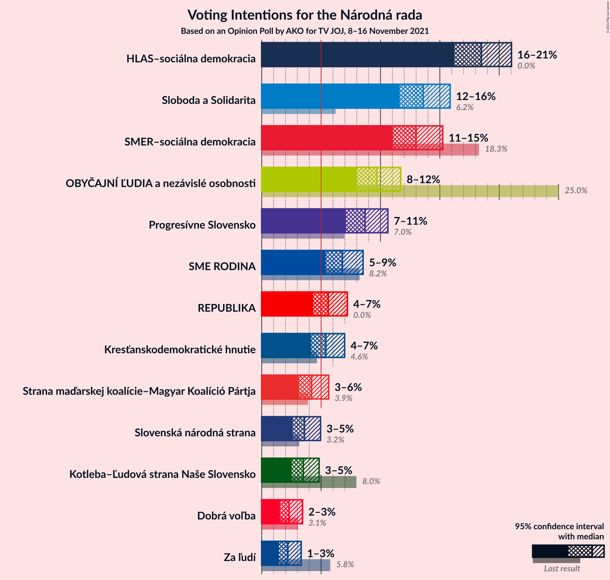

### Confidence Intervals

| Party | Last Result | Poll Result | 80% Confidence Interval | 90% Confidence Interval | 95% Confidence Interval | 99% Confidence Interval |
|:-----:|:-----------:|:-----------:|:-----------------------:|:-----------------------:|:-----------------------:|:-----------------------:|
| HLAS–sociálna demokracia | 0.0% | 18.5% | 17.0–20.1% |16.6–20.6% |16.2–21.0% |15.5–21.8% |
| Sloboda a Solidarita | 6.2% | 13.6% | 12.3–15.1% |11.9–15.5% |11.6–15.9% |11.0–16.6% |
| SMER–sociálna demokracia | 18.3% | 13.0% | 11.7–14.5% |11.4–14.9% |11.1–15.2% |10.5–16.0% |
| OBYČAJNÍ ĽUDIA a nezávislé osobnosti | 25.0% | 9.7% | 8.6–11.0% |8.3–11.4% |8.0–11.7% |7.5–12.3% |
| Progresívne Slovensko | 7.0% | 8.7% | 7.7–10.0% |7.3–10.3% |7.1–10.6% |6.6–11.2% |
| SME RODINA | 8.2% | 6.8% | 5.9–7.9% |5.6–8.3% |5.4–8.5% |5.0–9.1% |
| REPUBLIKA | 0.0% | 5.6% | 4.8–6.6% |4.5–7.0% |4.3–7.2% |4.0–7.7% |
| Kresťanskodemokratické hnutie | 4.6% | 5.4% | 4.6–6.4% |4.3–6.7% |4.2–7.0% |3.8–7.5% |
| Strana maďarskej koalície–Magyar Koalíció Pártja | 3.9% | 4.2% | 3.5–5.1% |3.3–5.4% |3.1–5.6% |2.8–6.1% |
| Slovenská národná strana | 3.2% | 3.6% | 2.9–4.5% |2.8–4.7% |2.6–5.0% |2.3–5.4% |
| Kotleba–Ľudová strana Naše Slovensko | 8.0% | 3.5% | 2.9–4.4% |2.7–4.6% |2.5–4.8% |2.2–5.3% |
| Dobrá voľba | 3.1% | 2.3% | 1.8–3.0% |1.6–3.2% |1.5–3.4% |1.3–3.8% |
| Za ľudí | 5.8% | 2.2% | 1.7–2.9% |1.6–3.1% |1.4–3.3% |1.2–3.7% |

*Note:* The poll result column reflects the actual value used in the calculations. Published results may vary slightly, and in addition be rounded to fewer digits.

## Seats

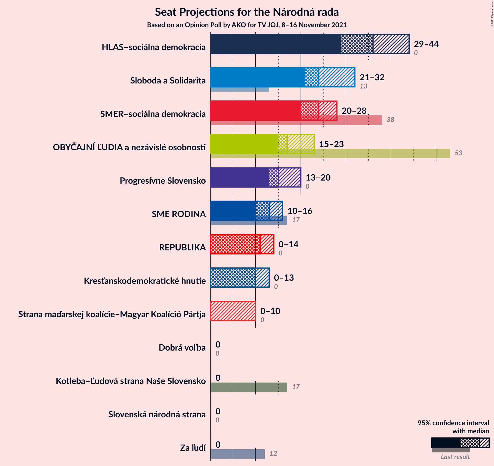

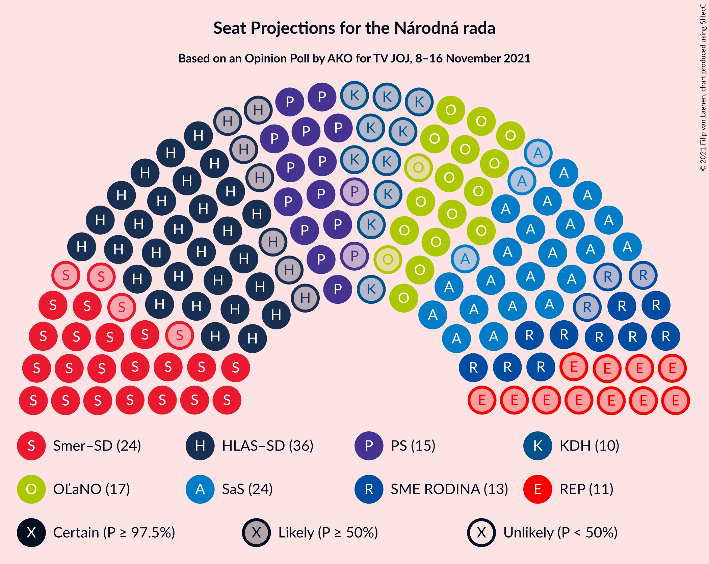

### Confidence Intervals

| Party | Last Result | Median | 80% Confidence Interval | 90% Confidence Interval | 95% Confidence Interval | 99% Confidence Interval |
|:-----:|:-----------:|:------:|:-----------------------:|:-----------------------:|:-----------------------:|:-----------------------:|
| <a href="#hlas–sociálna-demokracia">HLAS–sociálna demokracia</a> | 0 | 36 | 31–39 |30–44 |29–44 |28–44 |
| <a href="#sloboda-a-solidarita">Sloboda a Solidarita</a> | 13 | 24 | 22–28 |21–30 |21–32 |20–32 |
| <a href="#smer–sociálna-demokracia">SMER–sociálna demokracia</a> | 38 | 24 | 21–26 |20–27 |20–28 |19–33 |
| <a href="#obyčajní-ľudia-a-nezávislé-osobnosti">OBYČAJNÍ ĽUDIA a nezávislé osobnosti</a> | 53 | 17 | 16–23 |16–23 |15–23 |14–25 |
| <a href="#progresívne-slovensko">Progresívne Slovensko</a> | 0 | 15 | 14–19 |13–19 |13–20 |12–22 |
| <a href="#sme-rodina">SME RODINA</a> | 17 | 13 | 11–15 |10–16 |10–16 |0–18 |
| <a href="#republika">REPUBLIKA</a> | 0 | 11 | 0–13 |0–13 |0–14 |0–15 |
| <a href="#kresťanskodemokratické-hnutie">Kresťanskodemokratické hnutie</a> | 0 | 10 | 0–12 |0–13 |0–13 |0–14 |
| <a href="#strana-maďarskej-koalície–magyar-koalíció-pártja">Strana maďarskej koalície–Magyar Koalíció Pártja</a> | 0 | 0 | 0 |0–9 |0–10 |0–11 |
| <a href="#slovenská-národná-strana">Slovenská národná strana</a> | 0 | 0 | 0 |0 |0 |0–9 |
| <a href="#kotleba–ľudová-strana-naše-slovensko">Kotleba–Ľudová strana Naše Slovensko</a> | 17 | 0 | 0 |0 |0 |0–10 |
| <a href="#dobrá-voľba">Dobrá voľba</a> | 0 | 0 | 0 |0 |0 |0 |
| <a href="#za-ľudí">Za ľudí</a> | 12 | 0 | 0 |0 |0 |0 |

### HLAS–sociálna demokracia

*For a full overview of the results for this party, see the [HLAS–sociálna demokracia](party-hlas–sociálnademokracia.html) page.*

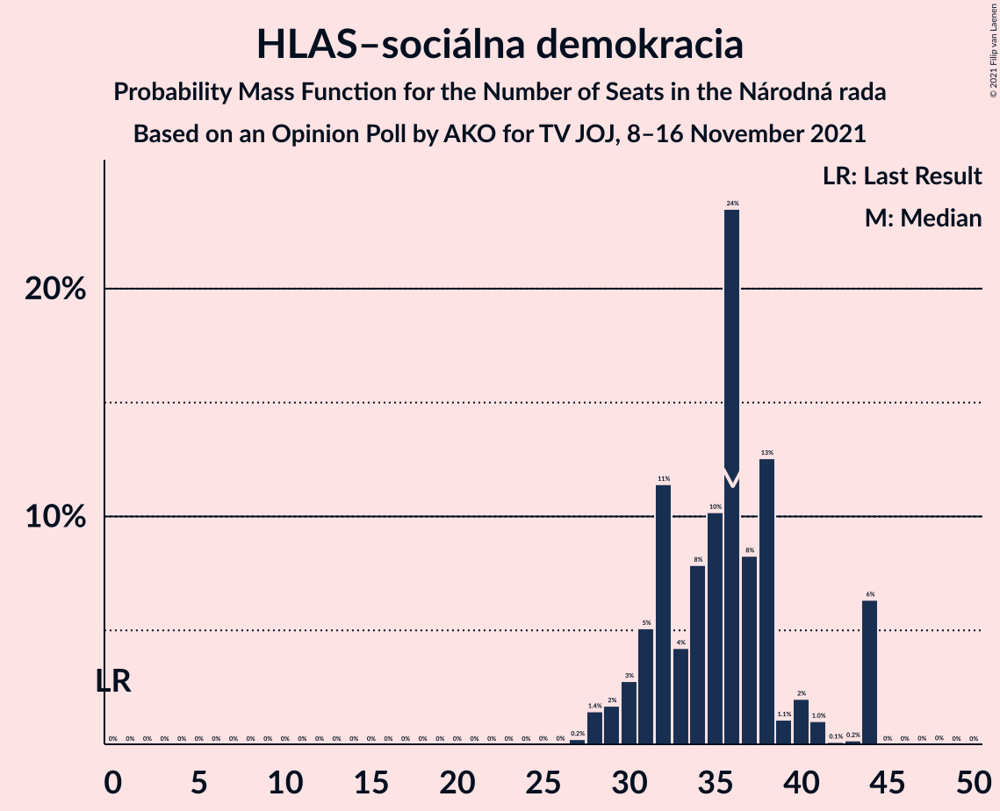

| Number of Seats | Probability | Accumulated | Special Marks |
|:---------------:|:-----------:|:-----------:|:-------------:|
| 0 | 0% | 100% | Last Result |
| 1 | 0% | 100% |  |
| 2 | 0% | 100% |  |
| 3 | 0% | 100% |  |
| 4 | 0% | 100% |  |
| 5 | 0% | 100% |  |
| 6 | 0% | 100% |  |
| 7 | 0% | 100% |  |
| 8 | 0% | 100% |  |
| 9 | 0% | 100% |  |
| 10 | 0% | 100% |  |
| 11 | 0% | 100% |  |
| 12 | 0% | 100% |  |
| 13 | 0% | 100% |  |
| 14 | 0% | 100% |  |
| 15 | 0% | 100% |  |
| 16 | 0% | 100% |  |
| 17 | 0% | 100% |  |
| 18 | 0% | 100% |  |
| 19 | 0% | 100% |  |
| 20 | 0% | 100% |  |
| 21 | 0% | 100% |  |
| 22 | 0% | 100% |  |
| 23 | 0% | 100% |  |
| 24 | 0% | 100% |  |
| 25 | 0% | 100% |  |
| 26 | 0% | 100% |  |
| 27 | 0.2% | 100% |  |
| 28 | 1.4% | 99.8% |  |
| 29 | 2% | 98% |  |
| 30 | 3% | 97% |  |
| 31 | 5% | 94% |  |
| 32 | 11% | 89% |  |
| 33 | 4% | 77% |  |
| 34 | 8% | 73% |  |
| 35 | 10% | 65% |  |
| 36 | 24% | 55% | Median |
| 37 | 8% | 32% |  |
| 38 | 13% | 23% |  |
| 39 | 1.1% | 11% |  |
| 40 | 2% | 10% |  |
| 41 | 1.0% | 8% |  |
| 42 | 0.1% | 7% |  |
| 43 | 0.2% | 7% |  |
| 44 | 6% | 6% |  |
| 45 | 0% | 0.1% |  |
| 46 | 0% | 0% |  |

### Sloboda a Solidarita

*For a full overview of the results for this party, see the [Sloboda a Solidarita](party-slobodaasolidarita.html) page.*

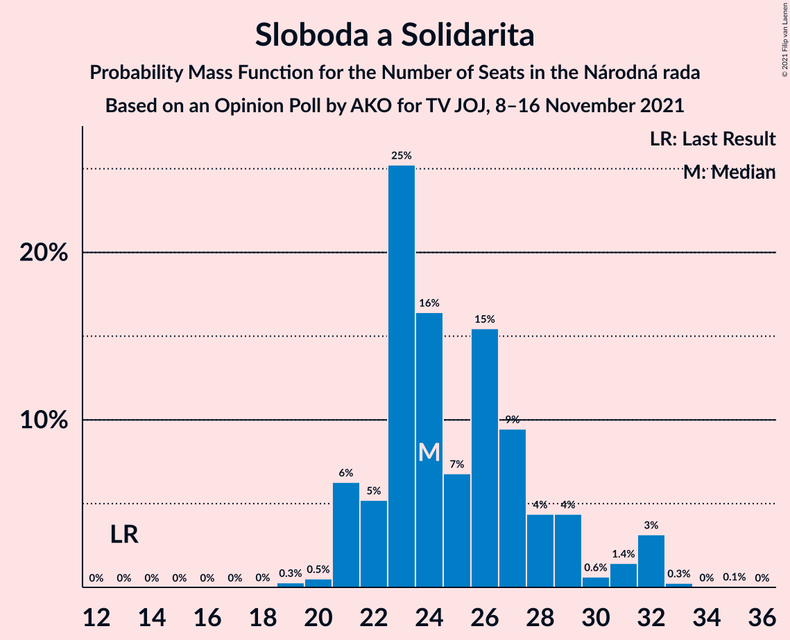

| Number of Seats | Probability | Accumulated | Special Marks |
|:---------------:|:-----------:|:-----------:|:-------------:|
| 13 | 0% | 100% | Last Result |
| 14 | 0% | 100% |  |
| 15 | 0% | 100% |  |
| 16 | 0% | 100% |  |
| 17 | 0% | 100% |  |
| 18 | 0% | 100% |  |
| 19 | 0.3% | 100% |  |
| 20 | 0.5% | 99.7% |  |
| 21 | 6% | 99.2% |  |
| 22 | 5% | 93% |  |
| 23 | 25% | 88% |  |
| 24 | 16% | 62% | Median |
| 25 | 7% | 46% |  |
| 26 | 15% | 39% |  |
| 27 | 9% | 24% |  |
| 28 | 4% | 14% |  |
| 29 | 4% | 10% |  |
| 30 | 0.6% | 6% |  |
| 31 | 1.4% | 5% |  |
| 32 | 3% | 3% |  |
| 33 | 0.3% | 0.3% |  |
| 34 | 0% | 0.1% |  |
| 35 | 0.1% | 0.1% |  |
| 36 | 0% | 0% |  |

### SMER–sociálna demokracia

*For a full overview of the results for this party, see the [SMER–sociálna demokracia](party-smer–sociálnademokracia.html) page.*

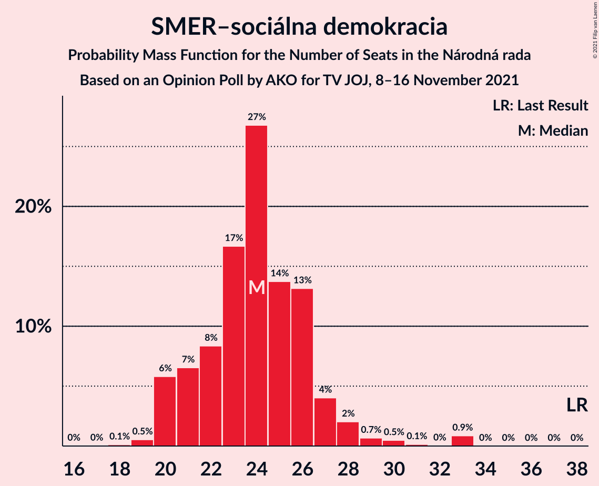

| Number of Seats | Probability | Accumulated | Special Marks |
|:---------------:|:-----------:|:-----------:|:-------------:|
| 18 | 0.1% | 100% |  |
| 19 | 0.5% | 99.8% |  |
| 20 | 6% | 99.3% |  |
| 21 | 7% | 93% |  |
| 22 | 8% | 87% |  |
| 23 | 17% | 79% |  |
| 24 | 27% | 62% | Median |
| 25 | 14% | 35% |  |
| 26 | 13% | 21% |  |
| 27 | 4% | 8% |  |
| 28 | 2% | 4% |  |
| 29 | 0.7% | 2% |  |
| 30 | 0.5% | 2% |  |
| 31 | 0.1% | 1.0% |  |
| 32 | 0% | 0.9% |  |
| 33 | 0.9% | 0.9% |  |
| 34 | 0% | 0% |  |
| 35 | 0% | 0% |  |
| 36 | 0% | 0% |  |
| 37 | 0% | 0% |  |
| 38 | 0% | 0% | Last Result |

### OBYČAJNÍ ĽUDIA a nezávislé osobnosti

*For a full overview of the results for this party, see the [OBYČAJNÍ ĽUDIA a nezávislé osobnosti](party-obyčajníľudiaanezávisléosobnosti.html) page.*

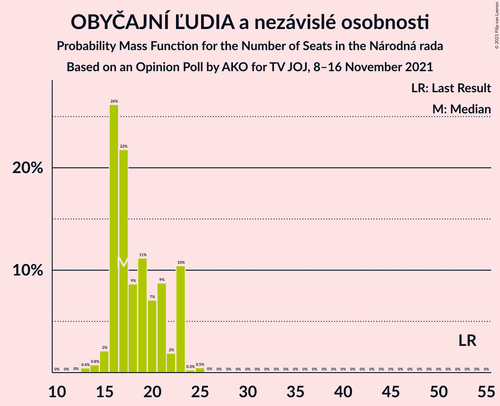

| Number of Seats | Probability | Accumulated | Special Marks |
|:---------------:|:-----------:|:-----------:|:-------------:|
| 13 | 0.4% | 100% |  |
| 14 | 0.8% | 99.5% |  |
| 15 | 2% | 98.8% |  |
| 16 | 26% | 97% |  |
| 17 | 22% | 70% | Median |
| 18 | 9% | 49% |  |
| 19 | 11% | 40% |  |
| 20 | 7% | 29% |  |
| 21 | 9% | 22% |  |
| 22 | 2% | 13% |  |
| 23 | 10% | 11% |  |
| 24 | 0.3% | 0.8% |  |
| 25 | 0.5% | 0.5% |  |
| 26 | 0% | 0% |  |
| 27 | 0% | 0% |  |
| 28 | 0% | 0% |  |
| 29 | 0% | 0% |  |
| 30 | 0% | 0% |  |
| 31 | 0% | 0% |  |
| 32 | 0% | 0% |  |
| 33 | 0% | 0% |  |
| 34 | 0% | 0% |  |
| 35 | 0% | 0% |  |
| 36 | 0% | 0% |  |
| 37 | 0% | 0% |  |
| 38 | 0% | 0% |  |
| 39 | 0% | 0% |  |
| 40 | 0% | 0% |  |
| 41 | 0% | 0% |  |
| 42 | 0% | 0% |  |
| 43 | 0% | 0% |  |
| 44 | 0% | 0% |  |
| 45 | 0% | 0% |  |
| 46 | 0% | 0% |  |
| 47 | 0% | 0% |  |
| 48 | 0% | 0% |  |
| 49 | 0% | 0% |  |
| 50 | 0% | 0% |  |
| 51 | 0% | 0% |  |
| 52 | 0% | 0% |  |
| 53 | 0% | 0% | Last Result |

### Progresívne Slovensko

*For a full overview of the results for this party, see the [Progresívne Slovensko](party-progresívneslovensko.html) page.*

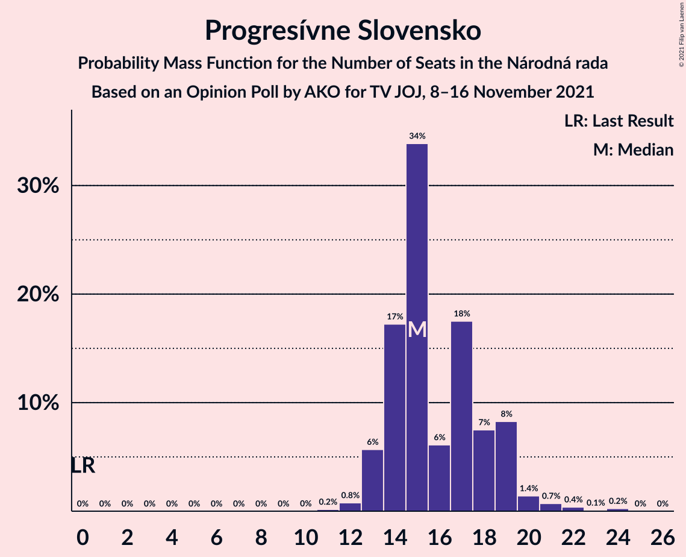

| Number of Seats | Probability | Accumulated | Special Marks |
|:---------------:|:-----------:|:-----------:|:-------------:|
| 0 | 0% | 100% | Last Result |
| 1 | 0% | 100% |  |
| 2 | 0% | 100% |  |
| 3 | 0% | 100% |  |
| 4 | 0% | 100% |  |
| 5 | 0% | 100% |  |
| 6 | 0% | 100% |  |
| 7 | 0% | 100% |  |
| 8 | 0% | 100% |  |
| 9 | 0% | 100% |  |
| 10 | 0% | 100% |  |
| 11 | 0.2% | 100% |  |
| 12 | 0.8% | 99.8% |  |
| 13 | 6% | 99.0% |  |
| 14 | 17% | 93% |  |
| 15 | 34% | 76% | Median |
| 16 | 6% | 42% |  |
| 17 | 18% | 36% |  |
| 18 | 7% | 19% |  |
| 19 | 8% | 11% |  |
| 20 | 1.4% | 3% |  |
| 21 | 0.7% | 1.4% |  |
| 22 | 0.4% | 0.7% |  |
| 23 | 0.1% | 0.3% |  |
| 24 | 0.2% | 0.3% |  |
| 25 | 0% | 0% |  |

### SME RODINA

*For a full overview of the results for this party, see the [SME RODINA](party-smerodina.html) page.*

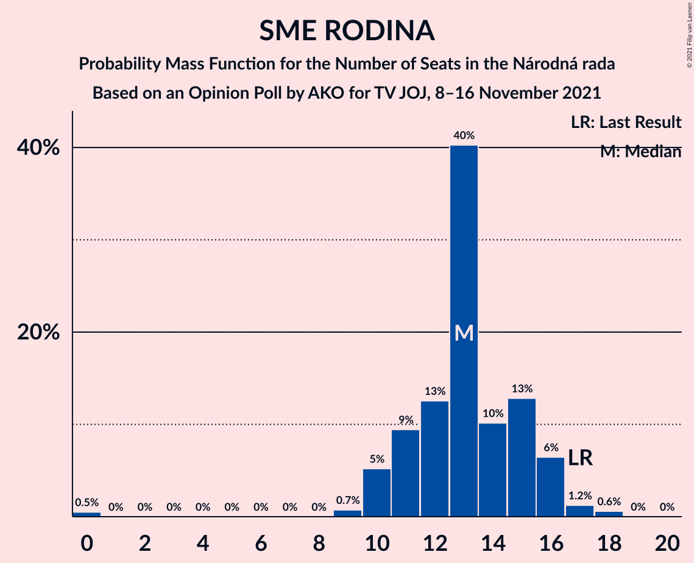

| Number of Seats | Probability | Accumulated | Special Marks |
|:---------------:|:-----------:|:-----------:|:-------------:|
| 0 | 0.5% | 100% |  |
| 1 | 0% | 99.5% |  |
| 2 | 0% | 99.5% |  |
| 3 | 0% | 99.5% |  |
| 4 | 0% | 99.5% |  |
| 5 | 0% | 99.5% |  |
| 6 | 0% | 99.5% |  |
| 7 | 0% | 99.5% |  |
| 8 | 0% | 99.5% |  |
| 9 | 0.7% | 99.5% |  |
| 10 | 5% | 98.8% |  |
| 11 | 9% | 94% |  |
| 12 | 13% | 84% |  |
| 13 | 40% | 72% | Median |
| 14 | 10% | 31% |  |
| 15 | 13% | 21% |  |
| 16 | 6% | 8% |  |
| 17 | 1.2% | 2% | Last Result |
| 18 | 0.6% | 0.6% |  |
| 19 | 0% | 0% |  |

### REPUBLIKA

*For a full overview of the results for this party, see the [REPUBLIKA](party-republika.html) page.*

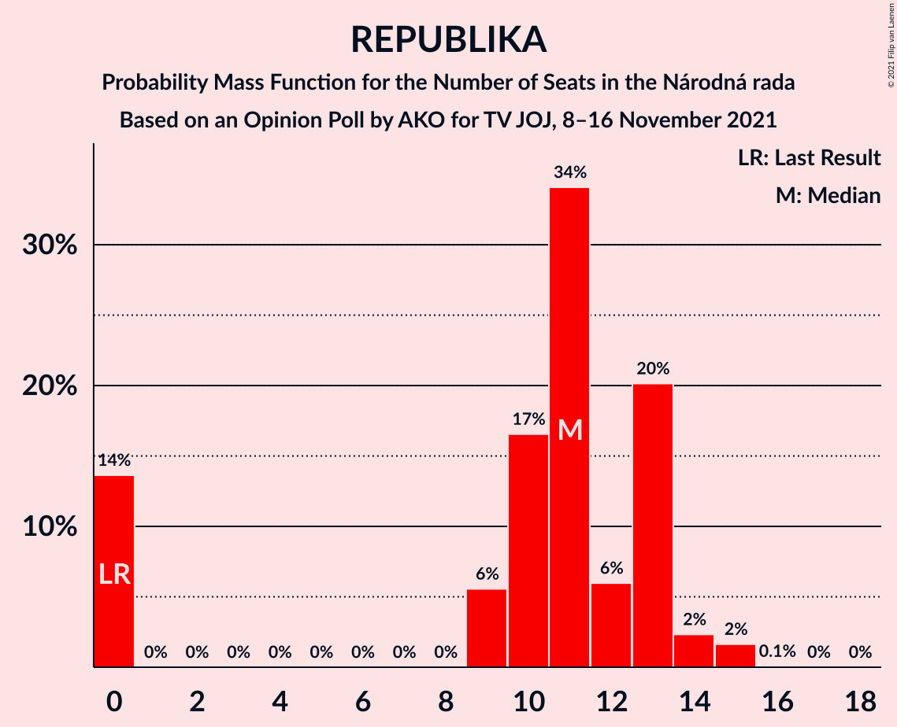

| Number of Seats | Probability | Accumulated | Special Marks |
|:---------------:|:-----------:|:-----------:|:-------------:|
| 0 | 14% | 100% | Last Result |
| 1 | 0% | 86% |  |
| 2 | 0% | 86% |  |
| 3 | 0% | 86% |  |
| 4 | 0% | 86% |  |
| 5 | 0% | 86% |  |
| 6 | 0% | 86% |  |
| 7 | 0% | 86% |  |
| 8 | 0% | 86% |  |
| 9 | 6% | 86% |  |
| 10 | 17% | 81% |  |
| 11 | 34% | 64% | Median |
| 12 | 6% | 30% |  |
| 13 | 20% | 24% |  |
| 14 | 2% | 4% |  |
| 15 | 2% | 2% |  |
| 16 | 0.1% | 0.1% |  |
| 17 | 0% | 0% |  |

### Kresťanskodemokratické hnutie

*For a full overview of the results for this party, see the [Kresťanskodemokratické hnutie](party-kresťanskodemokratickéhnutie.html) page.*

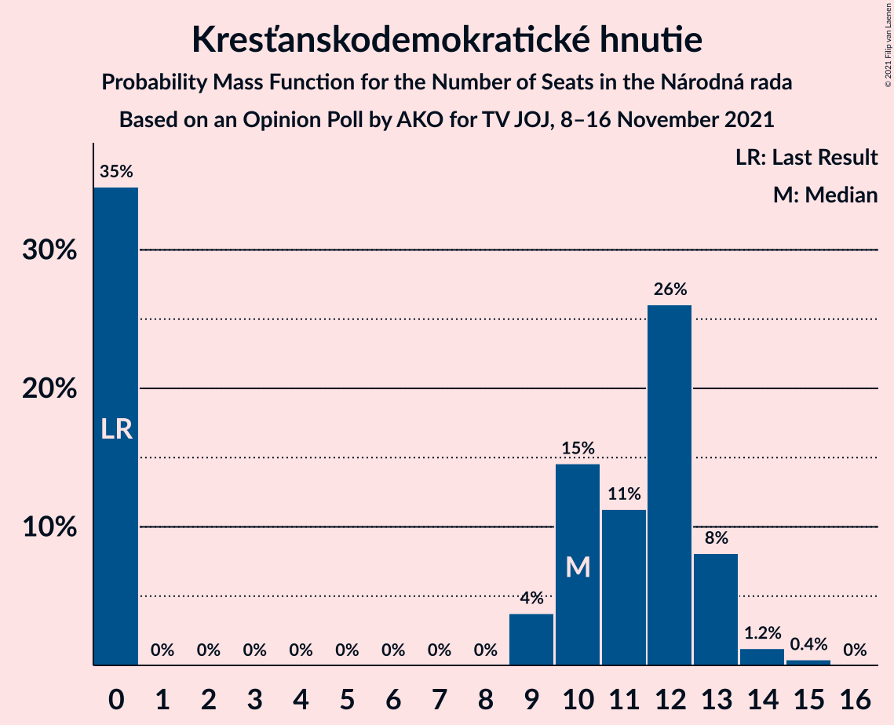

| Number of Seats | Probability | Accumulated | Special Marks |
|:---------------:|:-----------:|:-----------:|:-------------:|
| 0 | 35% | 100% | Last Result |
| 1 | 0% | 65% |  |
| 2 | 0% | 65% |  |
| 3 | 0% | 65% |  |
| 4 | 0% | 65% |  |
| 5 | 0% | 65% |  |
| 6 | 0% | 65% |  |
| 7 | 0% | 65% |  |
| 8 | 0% | 65% |  |
| 9 | 4% | 65% |  |
| 10 | 15% | 62% | Median |
| 11 | 11% | 47% |  |
| 12 | 26% | 36% |  |
| 13 | 8% | 10% |  |
| 14 | 1.2% | 2% |  |
| 15 | 0.4% | 0.4% |  |
| 16 | 0% | 0% |  |

### Strana maďarskej koalície–Magyar Koalíció Pártja

*For a full overview of the results for this party, see the [Strana maďarskej koalície–Magyar Koalíció Pártja](party-stranamaďarskejkoalície–magyarkoalíciópártja.html) page.*

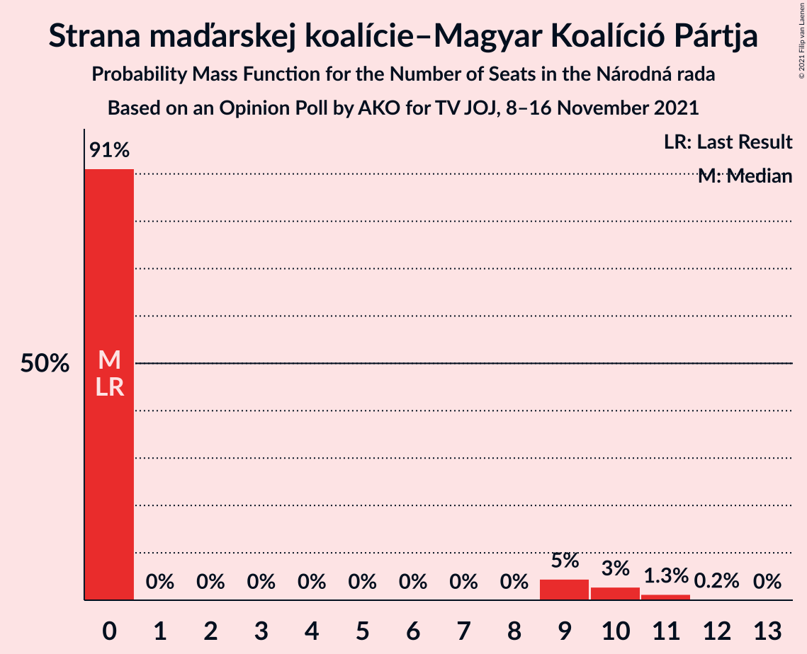

| Number of Seats | Probability | Accumulated | Special Marks |
|:---------------:|:-----------:|:-----------:|:-------------:|
| 0 | 91% | 100% | Last Result, Median |
| 1 | 0% | 9% |  |
| 2 | 0% | 9% |  |
| 3 | 0% | 9% |  |
| 4 | 0% | 9% |  |
| 5 | 0% | 9% |  |
| 6 | 0% | 9% |  |
| 7 | 0% | 9% |  |
| 8 | 0% | 9% |  |
| 9 | 5% | 9% |  |
| 10 | 3% | 4% |  |
| 11 | 1.3% | 2% |  |
| 12 | 0.2% | 0.2% |  |
| 13 | 0% | 0% |  |

### Slovenská národná strana

*For a full overview of the results for this party, see the [Slovenská národná strana](party-slovenskánárodnástrana.html) page.*

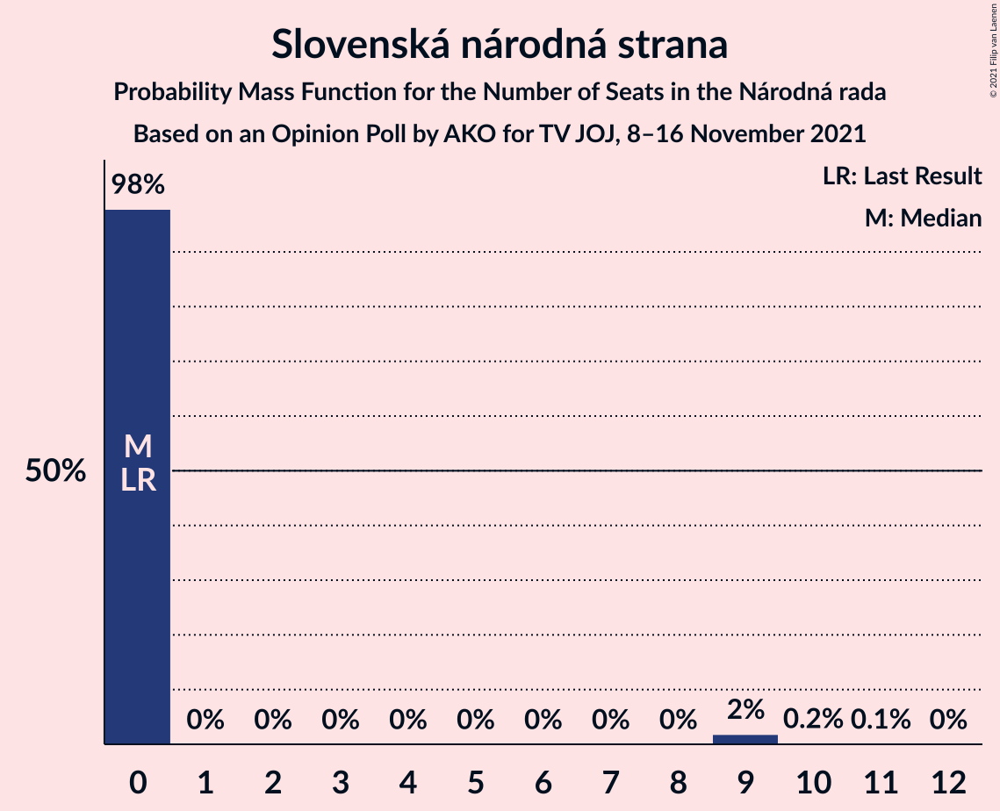

| Number of Seats | Probability | Accumulated | Special Marks |
|:---------------:|:-----------:|:-----------:|:-------------:|
| 0 | 98% | 100% | Last Result, Median |
| 1 | 0% | 2% |  |
| 2 | 0% | 2% |  |
| 3 | 0% | 2% |  |
| 4 | 0% | 2% |  |
| 5 | 0% | 2% |  |
| 6 | 0% | 2% |  |
| 7 | 0% | 2% |  |
| 8 | 0% | 2% |  |
| 9 | 2% | 2% |  |
| 10 | 0.2% | 0.3% |  |
| 11 | 0.1% | 0.1% |  |
| 12 | 0% | 0% |  |

### Kotleba–Ľudová strana Naše Slovensko

*For a full overview of the results for this party, see the [Kotleba–Ľudová strana Naše Slovensko](party-kotleba–ľudovástrananašeslovensko.html) page.*

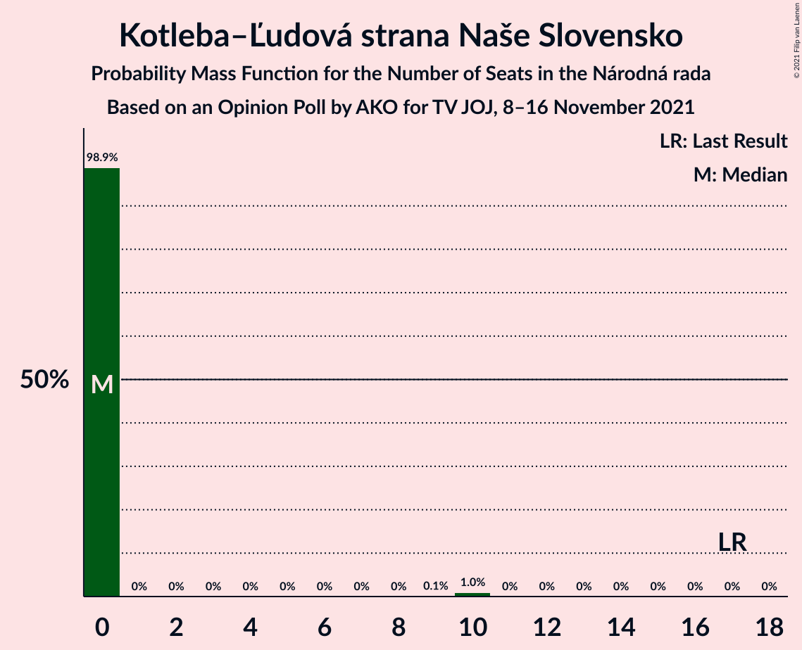

| Number of Seats | Probability | Accumulated | Special Marks |
|:---------------:|:-----------:|:-----------:|:-------------:|
| 0 | 98.9% | 100% | Median |
| 1 | 0% | 1.1% |  |
| 2 | 0% | 1.1% |  |
| 3 | 0% | 1.1% |  |
| 4 | 0% | 1.1% |  |
| 5 | 0% | 1.1% |  |
| 6 | 0% | 1.1% |  |
| 7 | 0% | 1.1% |  |
| 8 | 0% | 1.1% |  |
| 9 | 0.1% | 1.1% |  |
| 10 | 1.0% | 1.0% |  |
| 11 | 0% | 0% |  |
| 12 | 0% | 0% |  |
| 13 | 0% | 0% |  |
| 14 | 0% | 0% |  |
| 15 | 0% | 0% |  |
| 16 | 0% | 0% |  |
| 17 | 0% | 0% | Last Result |

### Dobrá voľba

*For a full overview of the results for this party, see the [Dobrá voľba](party-dobrávoľba.html) page.*

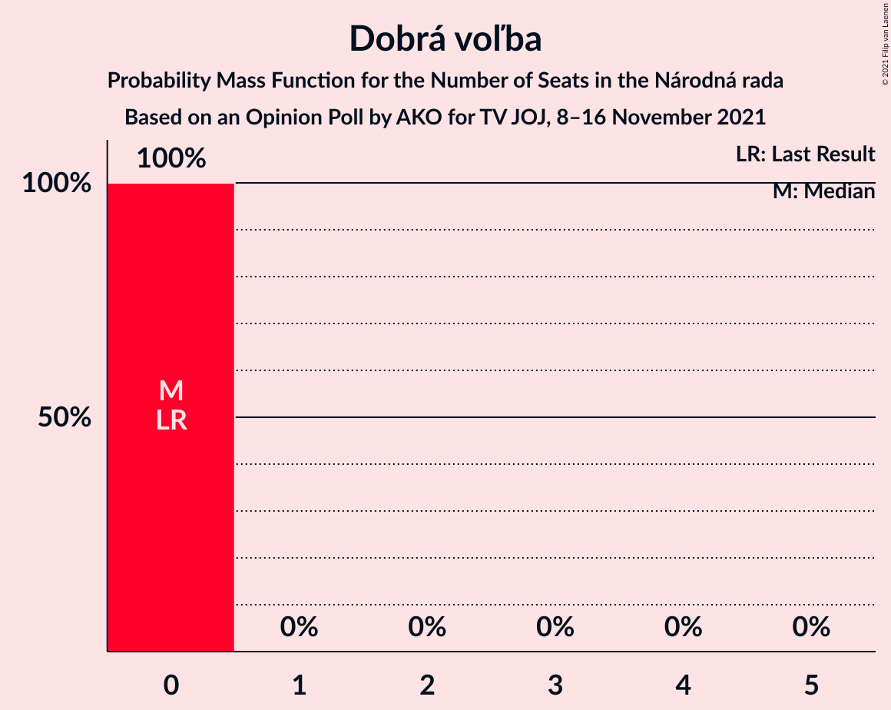

| Number of Seats | Probability | Accumulated | Special Marks |
|:---------------:|:-----------:|:-----------:|:-------------:|
| 0 | 100% | 100% | Last Result, Median |

### Za ľudí

*For a full overview of the results for this party, see the [Za ľudí](party-zaľudí.html) page.*

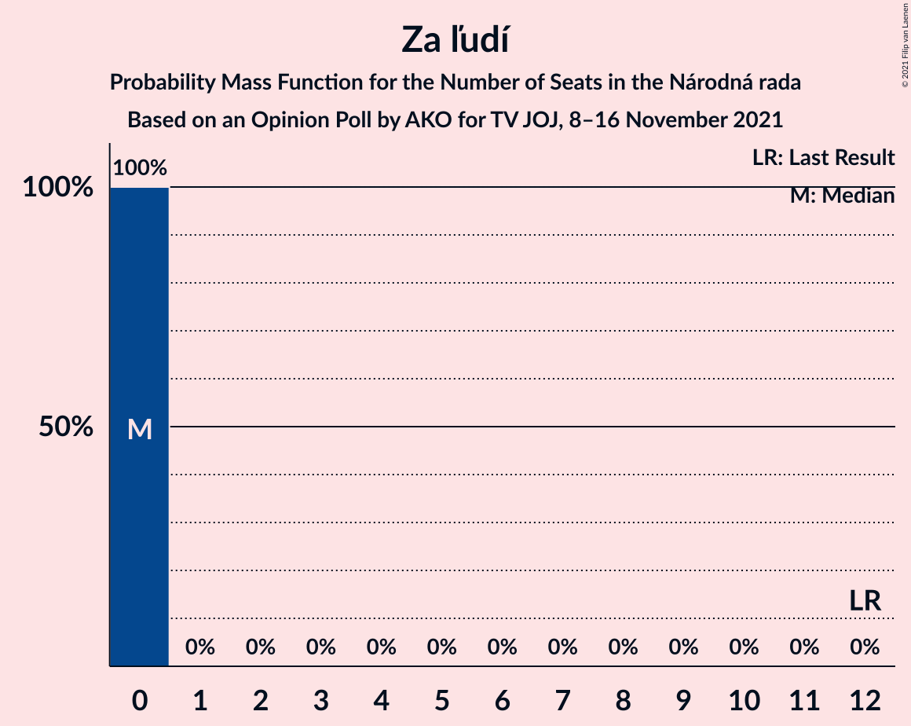

| Number of Seats | Probability | Accumulated | Special Marks |
|:---------------:|:-----------:|:-----------:|:-------------:|
| 0 | 100% | 100% | Median |
| 1 | 0% | 0% |  |
| 2 | 0% | 0% |  |
| 3 | 0% | 0% |  |
| 4 | 0% | 0% |  |
| 5 | 0% | 0% |  |
| 6 | 0% | 0% |  |
| 7 | 0% | 0% |  |
| 8 | 0% | 0% |  |
| 9 | 0% | 0% |  |
| 10 | 0% | 0% |  |
| 11 | 0% | 0% |  |
| 12 | 0% | 0% | Last Result |

## Coalitions

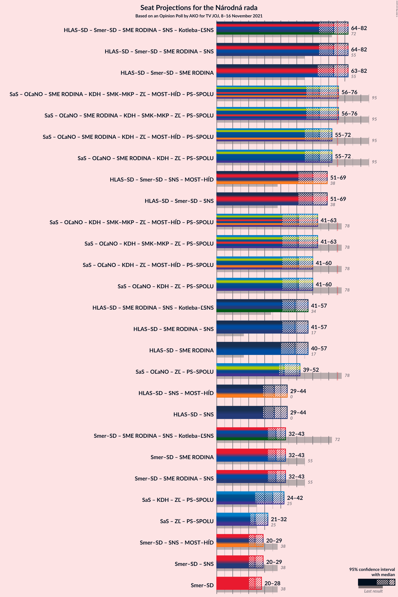

### Confidence Intervals

| Coalition | Last Result | Median | Majority? | 80% Confidence Interval | 90% Confidence Interval | 95% Confidence Interval | 99% Confidence Interval |
|:---------:|:-----------:|:------:|:---------:|:-----------------------:|:-----------------------:|:-----------------------:|:-----------------------:|
| HLAS–sociálna demokracia – SMER–sociálna demokracia – SME RODINA – Slovenská národná strana – Kotleba–Ľudová strana Naše Slovensko | 72 | 73 | 24% | 66–79 | 65–82 | 64–82 | 60–84 |
| HLAS–sociálna demokracia – SMER–sociálna demokracia – SME RODINA – Slovenská národná strana | 55 | 73 | 23% | 66–79 | 65–82 | 64–82 | 60–84 |
| HLAS–sociálna demokracia – SMER–sociálna demokracia – SME RODINA | 55 | 73 | 23% | 65–79 | 65–82 | 63–82 | 60–84 |
| HLAS–sociálna demokracia – SMER–sociálna demokracia – Slovenská národná strana | 38 | 60 | 0% | 53–64 | 53–69 | 51–69 | 49–72 |
| HLAS–sociálna demokracia – SME RODINA – Slovenská národná strana – Kotleba–Ľudová strana Naše Slovensko | 34 | 49 | 0% | 44–54 | 43–57 | 41–57 | 39–59 |
| HLAS–sociálna demokracia – SME RODINA – Slovenská národná strana | 17 | 49 | 0% | 44–53 | 43–57 | 41–57 | 39–57 |
| HLAS–sociálna demokracia – SME RODINA | 17 | 49 | 0% | 44–53 | 43–57 | 40–57 | 39–57 |
| HLAS–sociálna demokracia – Slovenská národná strana | 0 | 36 | 0% | 31–40 | 30–44 | 29–44 | 28–44 |
| SMER–sociálna demokracia – SME RODINA – Slovenská národná strana – Kotleba–Ľudová strana Naše Slovensko | 72 | 37 | 0% | 33–41 | 33–42 | 32–43 | 29–47 |
| SMER–sociálna demokracia – SME RODINA | 55 | 37 | 0% | 33–41 | 33–41 | 32–43 | 29–45 |
| SMER–sociálna demokracia – SME RODINA – Slovenská národná strana | 55 | 37 | 0% | 33–41 | 33–42 | 32–43 | 29–46 |
| SMER–sociálna demokracia – Slovenská národná strana | 38 | 24 | 0% | 21–27 | 20–28 | 20–29 | 19–33 |
| SMER–sociálna demokracia | 38 | 24 | 0% | 21–26 | 20–27 | 20–28 | 19–33 |

### HLAS–sociálna demokracia – SMER–sociálna demokracia – SME RODINA – Slovenská národná strana – Kotleba–Ľudová strana Naše Slovensko

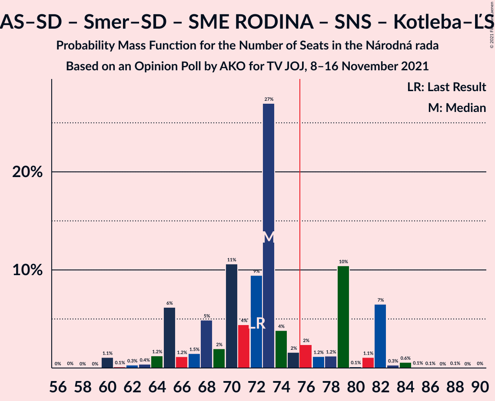

| Number of Seats | Probability | Accumulated | Special Marks |
|:---------------:|:-----------:|:-----------:|:-------------:|
| 57 | 0% | 100% |  |
| 58 | 0% | 99.9% |  |
| 59 | 0% | 99.9% |  |
| 60 | 1.1% | 99.9% |  |
| 61 | 0.1% | 98.8% |  |
| 62 | 0.3% | 98.7% |  |
| 63 | 0.4% | 98% |  |
| 64 | 1.2% | 98% |  |
| 65 | 6% | 97% |  |
| 66 | 1.2% | 91% |  |
| 67 | 1.5% | 89% |  |
| 68 | 5% | 88% |  |
| 69 | 2% | 83% |  |
| 70 | 11% | 81% |  |
| 71 | 4% | 70% |  |
| 72 | 9% | 66% | Last Result |
| 73 | 27% | 57% | Median |
| 74 | 4% | 30% |  |
| 75 | 2% | 26% |  |
| 76 | 2% | 24% | Majority |
| 77 | 1.2% | 22% |  |
| 78 | 1.2% | 21% |  |
| 79 | 10% | 19% |  |
| 80 | 0.1% | 9% |  |
| 81 | 1.1% | 9% |  |
| 82 | 7% | 8% |  |
| 83 | 0.3% | 1.1% |  |
| 84 | 0.6% | 0.8% |  |
| 85 | 0.1% | 0.3% |  |
| 86 | 0.1% | 0.2% |  |
| 87 | 0% | 0.1% |  |
| 88 | 0.1% | 0.1% |  |
| 89 | 0% | 0% |  |

### HLAS–sociálna demokracia – SMER–sociálna demokracia – SME RODINA – Slovenská národná strana

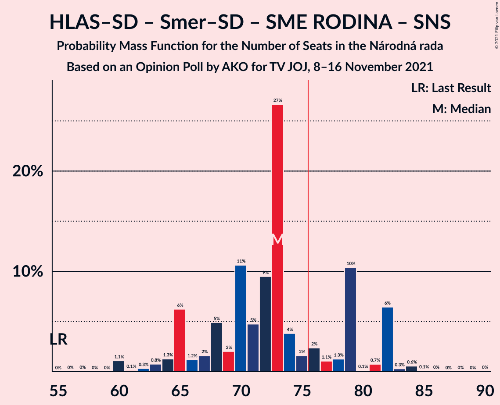

| Number of Seats | Probability | Accumulated | Special Marks |
|:---------------:|:-----------:|:-----------:|:-------------:|
| 55 | 0% | 100% | Last Result |
| 56 | 0% | 100% |  |
| 57 | 0% | 100% |  |
| 58 | 0% | 99.9% |  |
| 59 | 0% | 99.9% |  |
| 60 | 1.1% | 99.9% |  |
| 61 | 0.1% | 98.8% |  |
| 62 | 0.3% | 98.7% |  |
| 63 | 0.8% | 98% |  |
| 64 | 1.3% | 98% |  |
| 65 | 6% | 96% |  |
| 66 | 1.2% | 90% |  |
| 67 | 2% | 89% |  |
| 68 | 5% | 87% |  |
| 69 | 2% | 82% |  |
| 70 | 11% | 80% |  |
| 71 | 5% | 70% |  |
| 72 | 9% | 65% |  |
| 73 | 27% | 56% | Median |
| 74 | 4% | 29% |  |
| 75 | 2% | 25% |  |
| 76 | 2% | 23% | Majority |
| 77 | 1.1% | 21% |  |
| 78 | 1.3% | 20% |  |
| 79 | 10% | 19% |  |
| 80 | 0.1% | 8% |  |
| 81 | 0.7% | 8% |  |
| 82 | 6% | 8% |  |
| 83 | 0.3% | 1.1% |  |
| 84 | 0.6% | 0.8% |  |
| 85 | 0.1% | 0.2% |  |
| 86 | 0% | 0.1% |  |
| 87 | 0% | 0.1% |  |
| 88 | 0% | 0.1% |  |
| 89 | 0% | 0% |  |

### HLAS–sociálna demokracia – SMER–sociálna demokracia – SME RODINA

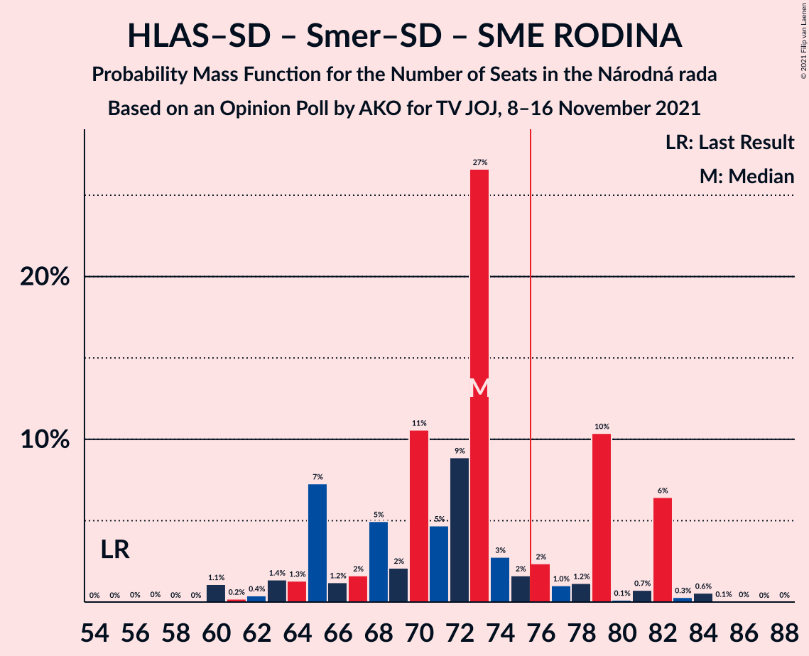

| Number of Seats | Probability | Accumulated | Special Marks |
|:---------------:|:-----------:|:-----------:|:-------------:|
| 55 | 0% | 100% | Last Result |
| 56 | 0% | 100% |  |
| 57 | 0% | 100% |  |
| 58 | 0% | 99.9% |  |
| 59 | 0% | 99.9% |  |
| 60 | 1.1% | 99.9% |  |
| 61 | 0.2% | 98.8% |  |
| 62 | 0.4% | 98.6% |  |
| 63 | 1.4% | 98% |  |
| 64 | 1.3% | 97% |  |
| 65 | 7% | 96% |  |
| 66 | 1.2% | 88% |  |
| 67 | 2% | 87% |  |
| 68 | 5% | 85% |  |
| 69 | 2% | 80% |  |
| 70 | 11% | 78% |  |
| 71 | 5% | 68% |  |
| 72 | 9% | 63% |  |
| 73 | 27% | 54% | Median |
| 74 | 3% | 28% |  |
| 75 | 2% | 25% |  |
| 76 | 2% | 23% | Majority |
| 77 | 1.0% | 21% |  |
| 78 | 1.2% | 20% |  |
| 79 | 10% | 19% |  |
| 80 | 0.1% | 8% |  |
| 81 | 0.7% | 8% |  |
| 82 | 6% | 7% |  |
| 83 | 0.3% | 1.0% |  |
| 84 | 0.6% | 0.7% |  |
| 85 | 0.1% | 0.1% |  |
| 86 | 0% | 0.1% |  |
| 87 | 0% | 0% |  |

### HLAS–sociálna demokracia – SMER–sociálna demokracia – Slovenská národná strana

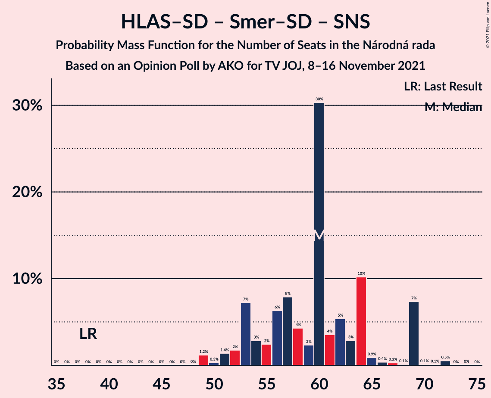

| Number of Seats | Probability | Accumulated | Special Marks |
|:---------------:|:-----------:|:-----------:|:-------------:|
| 38 | 0% | 100% | Last Result |
| 39 | 0% | 100% |  |
| 40 | 0% | 100% |  |
| 41 | 0% | 100% |  |
| 42 | 0% | 100% |  |
| 43 | 0% | 100% |  |
| 44 | 0% | 100% |  |
| 45 | 0% | 100% |  |
| 46 | 0% | 100% |  |
| 47 | 0% | 100% |  |
| 48 | 0% | 100% |  |
| 49 | 1.2% | 100% |  |
| 50 | 0.3% | 98.8% |  |
| 51 | 1.4% | 98% |  |
| 52 | 2% | 97% |  |
| 53 | 7% | 95% |  |
| 54 | 3% | 88% |  |
| 55 | 2% | 85% |  |
| 56 | 6% | 83% |  |
| 57 | 8% | 77% |  |
| 58 | 4% | 69% |  |
| 59 | 2% | 64% |  |
| 60 | 30% | 62% | Median |
| 61 | 4% | 32% |  |
| 62 | 5% | 28% |  |
| 63 | 3% | 23% |  |
| 64 | 10% | 20% |  |
| 65 | 0.9% | 10% |  |
| 66 | 0.4% | 9% |  |
| 67 | 0.3% | 9% |  |
| 68 | 0.1% | 8% |  |
| 69 | 7% | 8% |  |
| 70 | 0.1% | 0.8% |  |
| 71 | 0.1% | 0.7% |  |
| 72 | 0.5% | 0.6% |  |
| 73 | 0% | 0.1% |  |
| 74 | 0% | 0.1% |  |
| 75 | 0% | 0% |  |

### HLAS–sociálna demokracia – SME RODINA – Slovenská národná strana – Kotleba–Ľudová strana Naše Slovensko

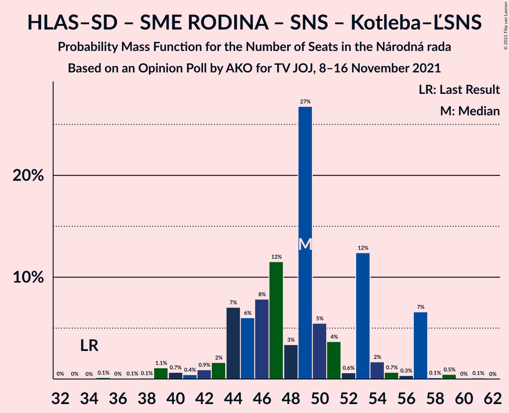

| Number of Seats | Probability | Accumulated | Special Marks |
|:---------------:|:-----------:|:-----------:|:-------------:|
| 33 | 0% | 100% |  |
| 34 | 0% | 99.9% | Last Result |
| 35 | 0.1% | 99.9% |  |
| 36 | 0% | 99.8% |  |
| 37 | 0.1% | 99.7% |  |
| 38 | 0.1% | 99.7% |  |
| 39 | 1.1% | 99.6% |  |
| 40 | 0.7% | 98% |  |
| 41 | 0.4% | 98% |  |
| 42 | 0.9% | 97% |  |
| 43 | 2% | 96% |  |
| 44 | 7% | 95% |  |
| 45 | 6% | 88% |  |
| 46 | 8% | 82% |  |
| 47 | 12% | 74% |  |
| 48 | 3% | 62% |  |
| 49 | 27% | 59% | Median |
| 50 | 5% | 32% |  |
| 51 | 4% | 27% |  |
| 52 | 0.6% | 23% |  |
| 53 | 12% | 22% |  |
| 54 | 2% | 10% |  |
| 55 | 0.7% | 8% |  |
| 56 | 0.3% | 8% |  |
| 57 | 7% | 7% |  |
| 58 | 0.1% | 0.8% |  |
| 59 | 0.5% | 0.6% |  |
| 60 | 0% | 0.2% |  |
| 61 | 0.1% | 0.2% |  |
| 62 | 0% | 0% |  |

### HLAS–sociálna demokracia – SME RODINA – Slovenská národná strana

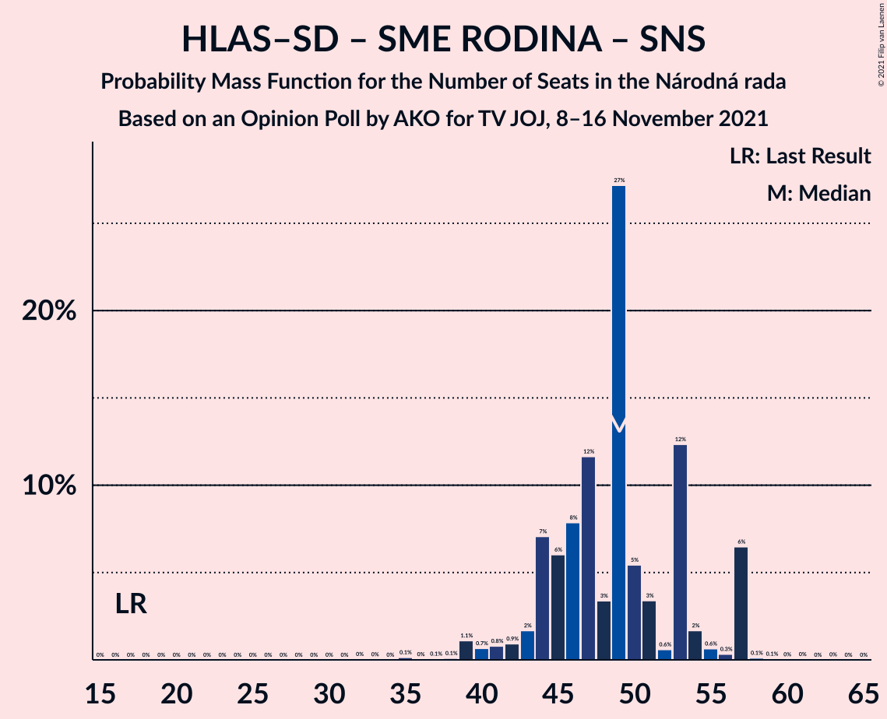

| Number of Seats | Probability | Accumulated | Special Marks |
|:---------------:|:-----------:|:-----------:|:-------------:|
| 17 | 0% | 100% | Last Result |
| 18 | 0% | 100% |  |
| 19 | 0% | 100% |  |
| 20 | 0% | 100% |  |
| 21 | 0% | 100% |  |
| 22 | 0% | 100% |  |
| 23 | 0% | 100% |  |
| 24 | 0% | 100% |  |
| 25 | 0% | 100% |  |
| 26 | 0% | 100% |  |
| 27 | 0% | 100% |  |
| 28 | 0% | 100% |  |
| 29 | 0% | 100% |  |
| 30 | 0% | 100% |  |
| 31 | 0% | 100% |  |
| 32 | 0% | 100% |  |
| 33 | 0% | 99.9% |  |
| 34 | 0% | 99.9% |  |
| 35 | 0.1% | 99.9% |  |
| 36 | 0% | 99.8% |  |
| 37 | 0.1% | 99.7% |  |
| 38 | 0.1% | 99.7% |  |
| 39 | 1.1% | 99.6% |  |
| 40 | 0.7% | 98% |  |
| 41 | 0.8% | 98% |  |
| 42 | 0.9% | 97% |  |
| 43 | 2% | 96% |  |
| 44 | 7% | 94% |  |
| 45 | 6% | 87% |  |
| 46 | 8% | 81% |  |
| 47 | 12% | 73% |  |
| 48 | 3% | 62% |  |
| 49 | 27% | 58% | Median |
| 50 | 5% | 31% |  |
| 51 | 3% | 26% |  |
| 52 | 0.6% | 22% |  |
| 53 | 12% | 22% |  |
| 54 | 2% | 9% |  |
| 55 | 0.6% | 8% |  |
| 56 | 0.3% | 7% |  |
| 57 | 6% | 7% |  |
| 58 | 0.1% | 0.3% |  |
| 59 | 0.1% | 0.2% |  |
| 60 | 0% | 0.1% |  |
| 61 | 0% | 0.1% |  |
| 62 | 0% | 0% |  |

### HLAS–sociálna demokracia – SME RODINA

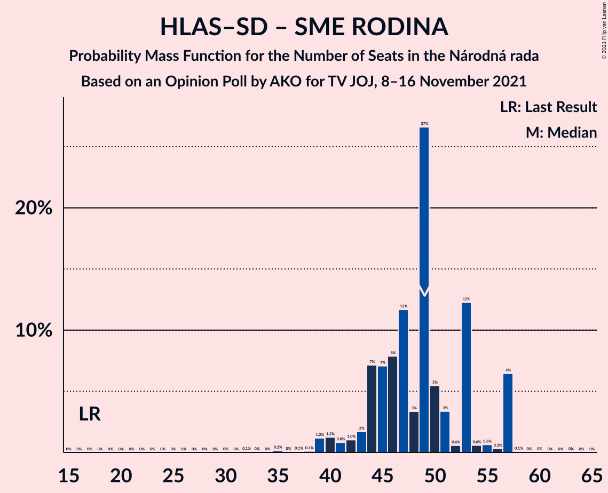

| Number of Seats | Probability | Accumulated | Special Marks |
|:---------------:|:-----------:|:-----------:|:-------------:|
| 17 | 0% | 100% | Last Result |
| 18 | 0% | 100% |  |
| 19 | 0% | 100% |  |
| 20 | 0% | 100% |  |
| 21 | 0% | 100% |  |
| 22 | 0% | 100% |  |
| 23 | 0% | 100% |  |
| 24 | 0% | 100% |  |
| 25 | 0% | 100% |  |
| 26 | 0% | 100% |  |
| 27 | 0% | 100% |  |
| 28 | 0% | 100% |  |
| 29 | 0% | 100% |  |
| 30 | 0% | 100% |  |
| 31 | 0% | 100% |  |
| 32 | 0.1% | 100% |  |
| 33 | 0% | 99.9% |  |
| 34 | 0% | 99.9% |  |
| 35 | 0.2% | 99.9% |  |
| 36 | 0% | 99.8% |  |
| 37 | 0.1% | 99.7% |  |
| 38 | 0.1% | 99.6% |  |
| 39 | 1.2% | 99.5% |  |
| 40 | 1.2% | 98% |  |
| 41 | 0.8% | 97% |  |
| 42 | 1.0% | 96% |  |
| 43 | 2% | 95% |  |
| 44 | 7% | 94% |  |
| 45 | 7% | 86% |  |
| 46 | 8% | 79% |  |
| 47 | 12% | 71% |  |
| 48 | 3% | 60% |  |
| 49 | 27% | 56% | Median |
| 50 | 5% | 30% |  |
| 51 | 3% | 24% |  |
| 52 | 0.6% | 21% |  |
| 53 | 12% | 20% |  |
| 54 | 0.6% | 8% |  |
| 55 | 0.6% | 8% |  |
| 56 | 0.3% | 7% |  |
| 57 | 6% | 7% |  |
| 58 | 0.1% | 0.1% |  |
| 59 | 0% | 0.1% |  |
| 60 | 0% | 0.1% |  |
| 61 | 0% | 0% |  |

### HLAS–sociálna demokracia – Slovenská národná strana

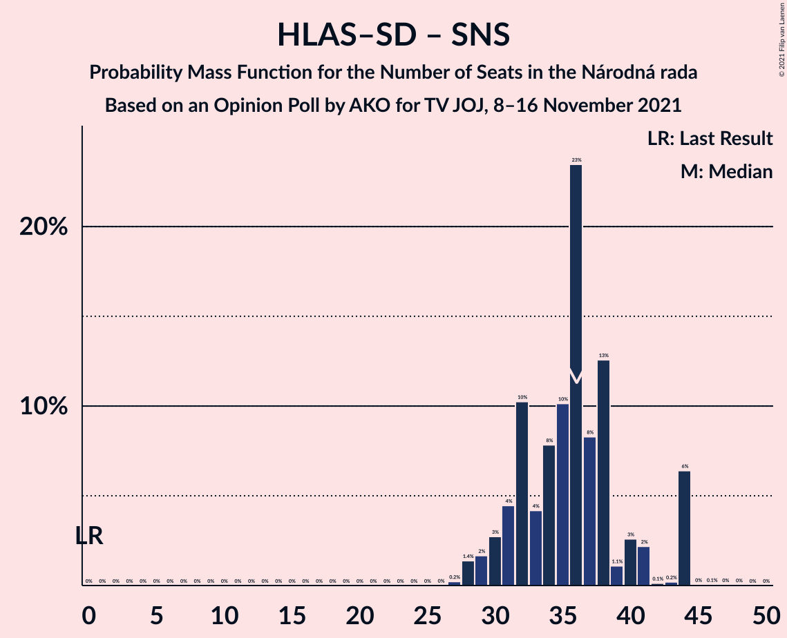

| Number of Seats | Probability | Accumulated | Special Marks |
|:---------------:|:-----------:|:-----------:|:-------------:|
| 0 | 0% | 100% | Last Result |
| 1 | 0% | 100% |  |
| 2 | 0% | 100% |  |
| 3 | 0% | 100% |  |
| 4 | 0% | 100% |  |
| 5 | 0% | 100% |  |
| 6 | 0% | 100% |  |
| 7 | 0% | 100% |  |
| 8 | 0% | 100% |  |
| 9 | 0% | 100% |  |
| 10 | 0% | 100% |  |
| 11 | 0% | 100% |  |
| 12 | 0% | 100% |  |
| 13 | 0% | 100% |  |
| 14 | 0% | 100% |  |
| 15 | 0% | 100% |  |
| 16 | 0% | 100% |  |
| 17 | 0% | 100% |  |
| 18 | 0% | 100% |  |
| 19 | 0% | 100% |  |
| 20 | 0% | 100% |  |
| 21 | 0% | 100% |  |
| 22 | 0% | 100% |  |
| 23 | 0% | 100% |  |
| 24 | 0% | 100% |  |
| 25 | 0% | 100% |  |
| 26 | 0% | 100% |  |
| 27 | 0.2% | 100% |  |
| 28 | 1.4% | 99.8% |  |
| 29 | 2% | 98% |  |
| 30 | 3% | 97% |  |
| 31 | 4% | 94% |  |
| 32 | 10% | 90% |  |
| 33 | 4% | 79% |  |
| 34 | 8% | 75% |  |
| 35 | 10% | 67% |  |
| 36 | 23% | 57% | Median |
| 37 | 8% | 34% |  |
| 38 | 13% | 25% |  |
| 39 | 1.1% | 13% |  |
| 40 | 3% | 12% |  |
| 41 | 2% | 9% |  |
| 42 | 0.1% | 7% |  |
| 43 | 0.2% | 7% |  |
| 44 | 6% | 7% |  |
| 45 | 0% | 0.2% |  |
| 46 | 0.1% | 0.1% |  |
| 47 | 0% | 0.1% |  |
| 48 | 0% | 0% |  |

### SMER–sociálna demokracia – SME RODINA – Slovenská národná strana – Kotleba–Ľudová strana Naše Slovensko

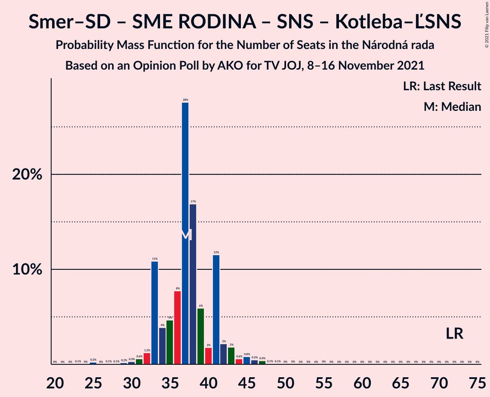

| Number of Seats | Probability | Accumulated | Special Marks |
|:---------------:|:-----------:|:-----------:|:-------------:|
| 23 | 0.1% | 100% |  |
| 24 | 0% | 99.9% |  |
| 25 | 0.2% | 99.9% |  |
| 26 | 0% | 99.7% |  |
| 27 | 0.1% | 99.7% |  |
| 28 | 0.1% | 99.6% |  |
| 29 | 0.2% | 99.6% |  |
| 30 | 0.3% | 99.4% |  |
| 31 | 0.6% | 99.1% |  |
| 32 | 1.2% | 98.5% |  |
| 33 | 11% | 97% |  |
| 34 | 4% | 86% |  |
| 35 | 5% | 83% |  |
| 36 | 8% | 78% |  |
| 37 | 28% | 70% | Median |
| 38 | 17% | 43% |  |
| 39 | 6% | 26% |  |
| 40 | 2% | 20% |  |
| 41 | 12% | 18% |  |
| 42 | 2% | 6% |  |
| 43 | 2% | 4% |  |
| 44 | 0.6% | 2% |  |
| 45 | 0.8% | 2% |  |
| 46 | 0.5% | 1.1% |  |
| 47 | 0.4% | 0.6% |  |
| 48 | 0.1% | 0.2% |  |
| 49 | 0.1% | 0.1% |  |
| 50 | 0% | 0.1% |  |
| 51 | 0% | 0.1% |  |
| 52 | 0% | 0% |  |
| 53 | 0% | 0% |  |
| 54 | 0% | 0% |  |
| 55 | 0% | 0% |  |
| 56 | 0% | 0% |  |
| 57 | 0% | 0% |  |
| 58 | 0% | 0% |  |
| 59 | 0% | 0% |  |
| 60 | 0% | 0% |  |
| 61 | 0% | 0% |  |
| 62 | 0% | 0% |  |
| 63 | 0% | 0% |  |
| 64 | 0% | 0% |  |
| 65 | 0% | 0% |  |
| 66 | 0% | 0% |  |
| 67 | 0% | 0% |  |
| 68 | 0% | 0% |  |
| 69 | 0% | 0% |  |
| 70 | 0% | 0% |  |
| 71 | 0% | 0% |  |
| 72 | 0% | 0% | Last Result |

### SMER–sociálna demokracia – SME RODINA

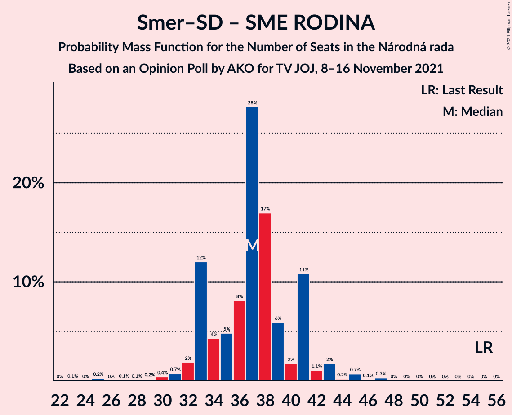

| Number of Seats | Probability | Accumulated | Special Marks |
|:---------------:|:-----------:|:-----------:|:-------------:|
| 23 | 0.1% | 100% |  |
| 24 | 0% | 99.9% |  |
| 25 | 0.2% | 99.9% |  |
| 26 | 0% | 99.7% |  |
| 27 | 0.1% | 99.7% |  |
| 28 | 0.1% | 99.6% |  |
| 29 | 0.2% | 99.6% |  |
| 30 | 0.4% | 99.4% |  |
| 31 | 0.7% | 99.0% |  |
| 32 | 2% | 98% |  |
| 33 | 12% | 96% |  |
| 34 | 4% | 84% |  |
| 35 | 5% | 80% |  |
| 36 | 8% | 75% |  |
| 37 | 28% | 67% | Median |
| 38 | 17% | 40% |  |
| 39 | 6% | 23% |  |
| 40 | 2% | 17% |  |
| 41 | 11% | 15% |  |
| 42 | 1.1% | 4% |  |
| 43 | 2% | 3% |  |
| 44 | 0.2% | 1.3% |  |
| 45 | 0.7% | 1.1% |  |
| 46 | 0.1% | 0.4% |  |
| 47 | 0.3% | 0.3% |  |
| 48 | 0% | 0% |  |
| 49 | 0% | 0% |  |
| 50 | 0% | 0% |  |
| 51 | 0% | 0% |  |
| 52 | 0% | 0% |  |
| 53 | 0% | 0% |  |
| 54 | 0% | 0% |  |
| 55 | 0% | 0% | Last Result |

### SMER–sociálna demokracia – SME RODINA – Slovenská národná strana

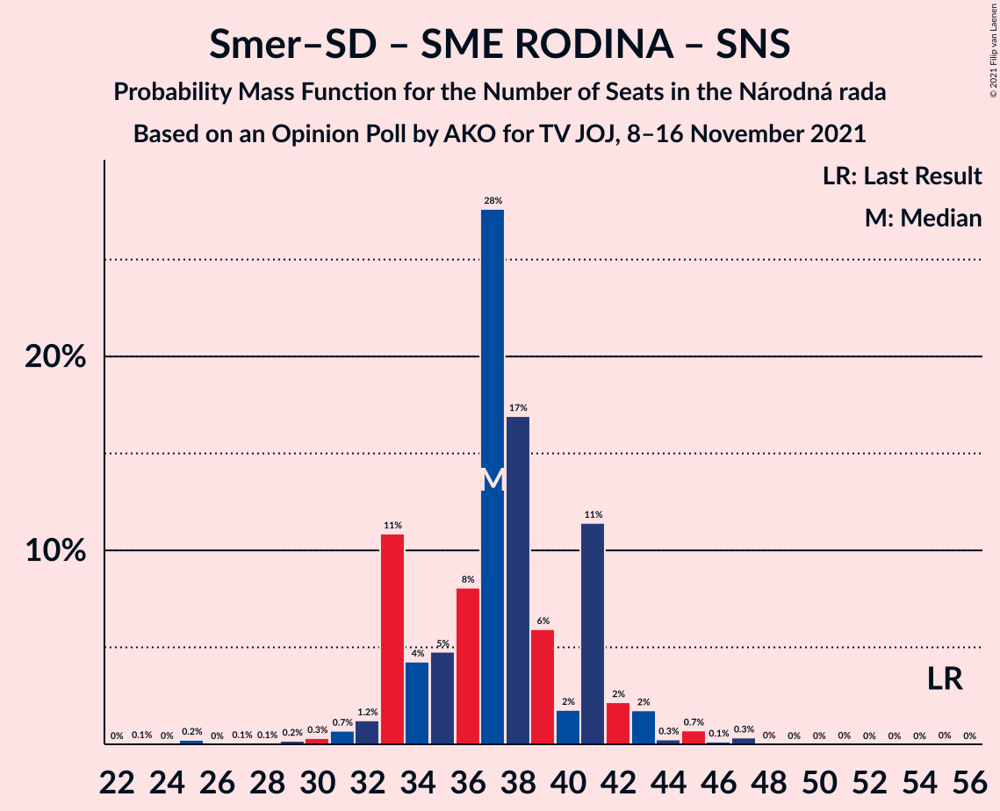

| Number of Seats | Probability | Accumulated | Special Marks |
|:---------------:|:-----------:|:-----------:|:-------------:|
| 23 | 0.1% | 100% |  |
| 24 | 0% | 99.9% |  |
| 25 | 0.2% | 99.9% |  |
| 26 | 0% | 99.7% |  |
| 27 | 0.1% | 99.7% |  |
| 28 | 0.1% | 99.6% |  |
| 29 | 0.2% | 99.6% |  |
| 30 | 0.3% | 99.4% |  |
| 31 | 0.7% | 99.1% |  |
| 32 | 1.2% | 98% |  |
| 33 | 11% | 97% |  |
| 34 | 4% | 86% |  |
| 35 | 5% | 82% |  |
| 36 | 8% | 77% |  |
| 37 | 28% | 69% | Median |
| 38 | 17% | 42% |  |
| 39 | 6% | 25% |  |
| 40 | 2% | 19% |  |
| 41 | 11% | 17% |  |
| 42 | 2% | 5% |  |
| 43 | 2% | 3% |  |
| 44 | 0.3% | 2% |  |
| 45 | 0.7% | 1.3% |  |
| 46 | 0.1% | 0.6% |  |
| 47 | 0.3% | 0.5% |  |
| 48 | 0% | 0.1% |  |
| 49 | 0% | 0.1% |  |
| 50 | 0% | 0.1% |  |
| 51 | 0% | 0.1% |  |
| 52 | 0% | 0% |  |
| 53 | 0% | 0% |  |
| 54 | 0% | 0% |  |
| 55 | 0% | 0% | Last Result |

### SMER–sociálna demokracia – Slovenská národná strana

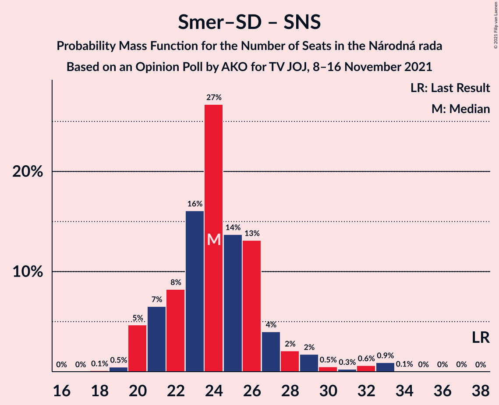

| Number of Seats | Probability | Accumulated | Special Marks |
|:---------------:|:-----------:|:-----------:|:-------------:|
| 18 | 0.1% | 100% |  |
| 19 | 0.5% | 99.8% |  |
| 20 | 5% | 99.4% |  |
| 21 | 7% | 95% |  |
| 22 | 8% | 88% |  |
| 23 | 16% | 80% |  |
| 24 | 27% | 64% | Median |
| 25 | 14% | 37% |  |
| 26 | 13% | 23% |  |
| 27 | 4% | 10% |  |
| 28 | 2% | 6% |  |
| 29 | 2% | 4% |  |
| 30 | 0.5% | 2% |  |
| 31 | 0.3% | 2% |  |
| 32 | 0.6% | 2% |  |
| 33 | 0.9% | 1.1% |  |
| 34 | 0.1% | 0.2% |  |
| 35 | 0% | 0.1% |  |
| 36 | 0% | 0.1% |  |
| 37 | 0% | 0.1% |  |
| 38 | 0% | 0% | Last Result |

### SMER–sociálna demokracia

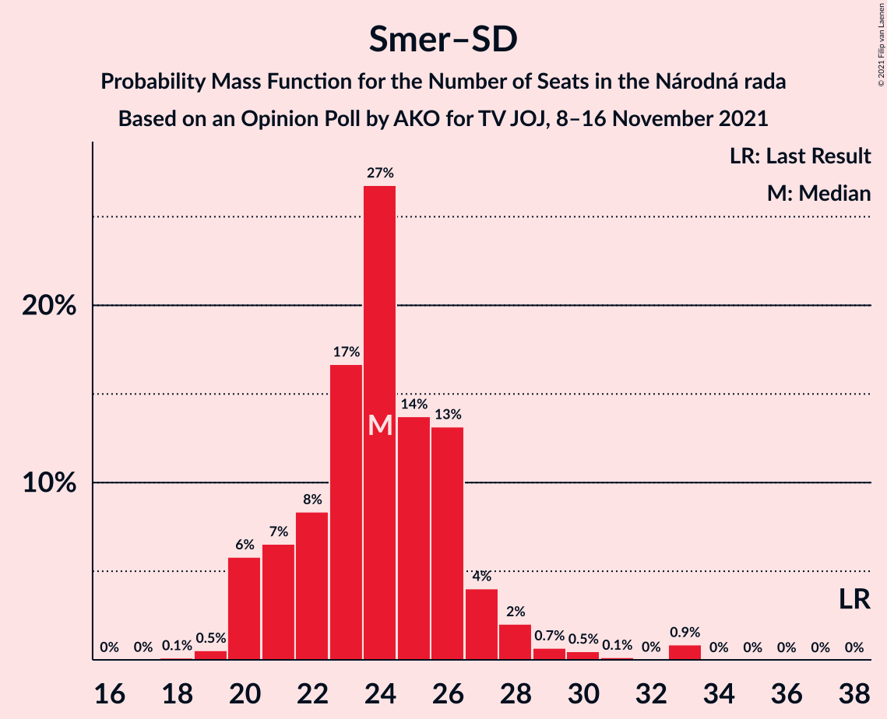

| Number of Seats | Probability | Accumulated | Special Marks |
|:---------------:|:-----------:|:-----------:|:-------------:|
| 18 | 0.1% | 100% |  |
| 19 | 0.5% | 99.8% |  |
| 20 | 6% | 99.3% |  |
| 21 | 7% | 93% |  |
| 22 | 8% | 87% |  |
| 23 | 17% | 79% |  |
| 24 | 27% | 62% | Median |
| 25 | 14% | 35% |  |
| 26 | 13% | 21% |  |
| 27 | 4% | 8% |  |
| 28 | 2% | 4% |  |
| 29 | 0.7% | 2% |  |
| 30 | 0.5% | 2% |  |
| 31 | 0.1% | 1.0% |  |
| 32 | 0% | 0.9% |  |
| 33 | 0.9% | 0.9% |  |
| 34 | 0% | 0% |  |
| 35 | 0% | 0% |  |
| 36 | 0% | 0% |  |
| 37 | 0% | 0% |  |
| 38 | 0% | 0% | Last Result |

## Technical Information

### Opinion Poll

+ **Polling firm:** AKO
+ **Commissioner(s):** TV JOJ
+ **Fieldwork period:** 8–16 November 2021

### Calculations

+ **Sample size:** 1000
+ **Simulations done:** 1,048,576
+ **Error estimate:** 2.24%

